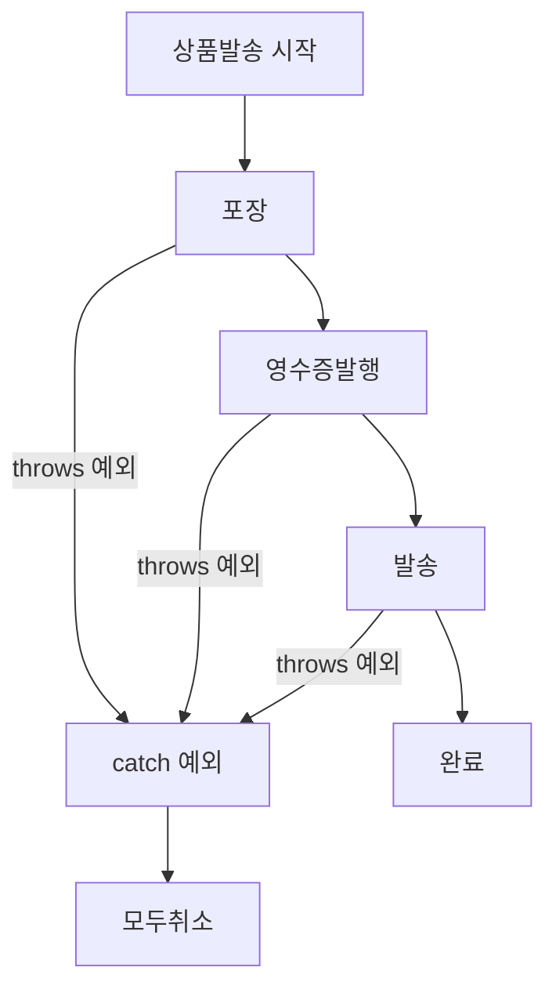

# Why?

자바로 파일을 읽거나, 0으로 나누거나, 배열 범위를 벗어나는 코드를 작성한다고 가정해보자. 이 세 가지 상황은 모두 런타임에 문제가 생긴다는 공통점이 있지만, 자바는 이를 하나의 `if` 문으로 처리하게 두지 않는다. 대신 예외(Exception)라는 전용 타입 계층을 설계했다[^1].

그 이유는 오류를 **발생시키는 곳**과 **처리하는 곳**을 분리할 수 있기 때문이다. 이 분리가 가능해질 때 비로소 트랜잭션처럼 "하나라도 실패하면 전체를 취소해야 하는" 로직을 깔끔하게 구현할 수 있다. 자바는 이 메커니즘을 `try-catch-finally`와 `throws` 키워드로 구현한다[^2].

이 글은 자바 예외 처리의 기본 구조부터 Checked/Unchecked 예외의 차이, 그리고 **예외를 어디서 잡느냐가 트랜잭션 원자성을 어떻게 결정하는지**까지를 순서대로 다룬다.

## 예외는 언제 발생하는가 🧨

오류를 처리하는 방법을 알기 전에, 실제 프로그램에서 어떤 상황에서 예외가 발생하는지 살펴본다. 구문 오타가 아닌, 런타임에 빈번하게 마주치는 세 가지 예외를 먼저 짚는다.

**존재하지 않는 파일을 열려고 시도할 때**

```java
BufferedReader br = new BufferedReader(new FileReader("나없는파일"));
br.readLine();
br.close();
```

```
Exception in thread "main" java.io.FileNotFoundException: 나없는파일 (지정된 파일을 찾을 수 없습니다)
    at java.io.FileInputStream.open(Native Method)
    at java.io.FileInputStream.<init>(Unknown Source)
    at java.io.FileReader.<init>(Unknown Source)
    ...
```

존재하지 않는 파일을 열려고 시도하면 `FileNotFoundException`이 발생한다[^3].

**0으로 나눌 때**

```java
int c = 4 / 0;
```

```
Exception in thread "main" java.lang.ArithmeticException: / by zero
    at Test.main(Test.java:14)
```

4를 0으로 나누면 `ArithmeticException`이 발생한다.

**배열 범위를 벗어날 때**

```java
int[] a = {1, 2, 3};
System.out.println(a[3]);
```

```
Exception in thread "main" java.lang.ArrayIndexOutOfBoundsException: 3
    at Test.main(Test.java:17)
```

`a[3]`은 길이 3인 배열에서 존재하지 않는 4번째 원소를 가리키므로 `ArrayIndexOutOfBoundsException`이 발생한다. 자바는 이런 예외가 발생하면 프로그램을 중단하고 스택 트레이스를 출력한다[^4].

## try-catch 구조로 예외를 처리하는 이유 🛡️

예외 처리의 기본 구문은 `try-catch`이다.

```java
try {
    // 예외가 발생할 수 있는 코드
} catch(예외1 e) {
    // 예외1이 발생했을 때 처리
} catch(예외2 e) {
    // 예외2가 발생했을 때 처리
}
```

`try` 블록 안의 코드가 정상적으로 실행되면 `catch` 블록은 건너뛴다. `try` 블록 실행 중 예외가 발생하면 해당 예외 타입과 일치하는 `catch` 블록이 실행된다. 숫자를 0으로 나눌 때 발생하는 예외를 처리하는 예를 보면 다음과 같다.

```java
int c;
try {
    c = 4 / 0;
} catch (ArithmeticException e) {
    c = -1;  // 예외가 발생하여 이 문장이 수행된다.
}
```

`ArithmeticException`이 발생하면 `c`에 `-1`을 대입하는 방식으로 예외를 처리한다. `catch(ArithmeticException e)`의 `e`는 해당 예외 클래스의 객체이며, `e.getMessage()`나 `e.printStackTrace()` 같은 메서드를 통해 예외 정보를 조회할 수 있다[^5].

## 예외 발생 여부와 무관하게 실행되어야 할 코드가 있다 — finally 🔒

예외가 발생하더라도 반드시 실행해야 하는 코드가 있다. 대표적으로 파일 닫기, 커넥션 반납, 잠금 해제 등이 있다. 아래 코드에서 `shouldBeRun()` 메서드는 `4/0`으로 인해 `ArithmeticException`이 발생하면 절대 실행되지 않는다.

```java
public class Sample {
    public void shouldBeRun() {
        System.out.println("ok thanks.");
    }

    public static void main(String[] args) {
        Sample sample = new Sample();
        int c;
        try {
            c = 4 / 0;
            sample.shouldBeRun();  // 이 코드는 실행되지 않는다.
        } catch (ArithmeticException e) {
            c = -1;
        }
    }
}
```

이 문제를 해결하기 위해 자바는 `finally` 구문을 제공한다. `finally` 블록은 예외 발생 여부와 무관하게 항상 실행된다[^6].

```java
public class Sample {
    public void shouldBeRun() {
        System.out.println("ok thanks.");
    }

    public static void main(String[] args) {
        Sample sample = new Sample();
        int c;
        try {
            c = 4 / 0;
        } catch (ArithmeticException e) {
            c = -1;
        } finally {
            sample.shouldBeRun();  // 예외에 상관없이 무조건 수행된다.
        }
    }
}
```

`finally`가 실행되므로 위 코드를 실행하면 `"ok thanks."` 문장이 반드시 출력된다. Java 7 이후에는 `try-with-resources` 구문을 사용하면 `AutoCloseable`을 구현한 자원을 `finally` 없이도 자동으로 닫을 수 있다[^7].

## RuntimeException 과 Exception — 어떤 기준으로 구분하는가 ⚠️

자바의 예외는 크게 두 계층으로 나뉜다.

```
Throwable
├── Error              (JVM 수준 오류, 복구 불가)
└── Exception
    ├── RuntimeException     (Unchecked Exception)
    └── Exception 직접 상속  (Checked Exception)
```

- **RuntimeException** — 실행 시점에 발생하며, 컴파일러가 예외 처리를 강제하지 않는다. `NullPointerException`, `ArrayIndexOutOfBoundsException`, `ArithmeticException` 등이 해당한다. 발생할 수도, 발생하지 않을 수도 있는 상황에 사용한다.
- **Exception** — 컴파일 시점에 예측 가능한 예외로, 컴파일러가 반드시 `try-catch` 또는 `throws` 선언을 요구한다. `IOException`, `SQLException` 등이 해당한다.

이 차이를 커스텀 예외로 직접 확인해본다. 먼저 `RuntimeException`을 상속한 경우다.

### RuntimeException 을 상속하면 처리가 선택 사항이다

```java
class FoolException extends RuntimeException {
}

public class Sample {
    public void sayNick(String nick) {
        if ("fool".equals(nick)) {
            throw new FoolException();
        }
        System.out.println("당신의 별명은 " + nick + " 입니다.");
    }

    public static void main(String[] args) {
        Sample sample = new Sample();
        sample.sayNick("fool");
        sample.sayNick("genious");
    }
}
```

`"fool"` 입력 시 다음 예외가 발생한다.

```
Exception in thread "main" FoolException
    at Sample.sayNick(Sample.java:7)
    at Sample.main(Sample.java:14)
```

`FoolException`이 `RuntimeException`을 상속하므로 컴파일러는 예외 처리를 강제하지 않는다.

### Exception 을 상속하면 처리가 강제된다

`FoolException`을 `Exception`을 상속하도록 바꾸면 컴파일 오류가 발생한다. 예측 가능한 Checked Exception으로 변경되었기 때문에 컴파일러가 처리를 강제한다.

```java
class FoolException extends Exception {
}

public class Sample {
    public void sayNick(String nick) {
        try {
            if ("fool".equals(nick)) {
                throw new FoolException();
            }
            System.out.println("당신의 별명은 " + nick + " 입니다.");
        } catch (FoolException e) {
            System.err.println("FoolException이 발생했습니다.");
        }
    }

    public static void main(String[] args) {
        Sample sample = new Sample();
        sample.sayNick("fool");
        sample.sayNick("genious");
    }
}
```

`sayNick` 메서드 안에서 `try-catch`로 `FoolException`을 처리해야 컴파일이 통과된다[^8].

## throws 로 예외를 위임하면 처리 책임이 이동한다 📤

`sayNick` 메서드가 예외를 직접 처리하는 대신, 호출한 쪽으로 예외를 던지는 방법이 있다. `throws` 키워드를 메서드 시그니처에 선언하면 된다. ("예외를 뒤로 미루기"라고도 한다.)

```java
class FoolException extends Exception {
}

public class Sample {
    public void sayNick(String nick) throws FoolException {
        if ("fool".equals(nick)) {
            throw new FoolException();
        }
        System.out.println("당신의 별명은 " + nick + " 입니다.");
    }

    public static void main(String[] args) {
        Sample sample = new Sample();
        try {
            sample.sayNick("fool");
            sample.sayNick("genious");
        } catch (FoolException e) {
            System.err.println("FoolException이 발생했습니다.");
        }
    }
}
```

`throws FoolException`을 선언하면 `FoolException` 처리 의무가 `sayNick`에서 `main`으로 이동한다. 이제 `main`이 `try-catch`로 처리하지 않으면 컴파일 오류가 발생한다.

**처리 위치에 따라 동작이 달라진다는 점이 핵심이다.** `sayNick` 내부에서 처리하면 두 호출이 모두 실행된다.

```java
sample.sayNick("fool");    // FoolException 발생 → catch에서 처리 → 계속 진행
sample.sayNick("genious"); // 정상 실행됨
```

반면 `main`에서 처리하면 첫 번째 호출에서 예외가 발생하는 순간 `catch`로 빠지므로 두 번째 호출은 실행되지 않는다.

```java
try {
    sample.sayNick("fool");    // FoolException 발생 → catch로 이동
    sample.sayNick("genious"); // 이 문장은 수행되지 않는다.
} catch (FoolException e) {
    System.err.println("FoolException이 발생했습니다.");
}
```

예외 처리 위치는 프로그램 수행 여부를 결정하며, 트랜잭션 처리와 직접 연결된다.

## 예외 처리 위치가 트랜잭션 원자성을 결정한다 🔄

"트랜잭션"은 하나의 작업 단위이다. 쇼핑몰의 "상품발송" 트랜잭션을 예로 들면 포장, 영수증발행, 발송 세 가지 단계가 있으며, 하나라도 실패하면 세 가지 모두 취소해야 한다.

> 아래는 동작을 간략하게 표현한 수도(pseudocode)이다. 수도코드는 특정 프로그래밍 언어의 문법을 따르지 않고 알고리즘을 자연어로 표현한 코드로, 실제 컴파일·실행은 되지 않는다.

다음과 같이 각 단계 메서드가 예외를 `throws`로 위임하고 `상품발송` 메서드가 한 곳에서 예외를 잡으면 원자성이 보장된다.

```
상품발송() {
    try {
        포장();
        영수증발행();
        발송();
    } catch(예외) {
        모두취소();  // 하나라도 실패하면 모두 취소한다.
    }
}

포장() throws 예외 { ... }
영수증발행() throws 예외 { ... }
발송() throws 예외 { ... }
```

반면 각 단계 메서드가 예외를 각자 처리하면 원자성이 깨진다.

```
상품발송() {
    포장();
    영수증발행();
    발송();
}

포장() {
    try { ... } catch(예외) { 포장취소(); }
}

영수증발행() {
    try { ... } catch(예외) { 영수증발행취소(); }
}

발송() {
    try { ... } catch(예외) { 발송취소(); }
}
```

포장은 됐는데 발송은 안 되고, 포장도 안 됐는데 발송이 되는 뒤죽박죽 상황이 연출된다. 실제 프로젝트에서도 두 번째 패턴처럼 트랜잭션 관리를 잘못하여 고생하는 경우가 많은데, 이는 일종의 재앙에 가깝다[^9].

다음 다이어그램은 올바른 트랜잭션 예외 처리 흐름을 나타낸다.



## 마치며 🎯

자바 예외 처리의 핵심은 세 가지로 요약된다.

첫째, `try-catch-finally`는 예외 발생·처리·정리를 역할별로 분리한다. 둘째, `RuntimeException`(Unchecked)은 처리가 선택 사항이고, `Exception`(Checked)은 컴파일러가 처리를 강제한다. 셋째, `throws`로 예외를 위임하면 처리 책임이 호출 스택 위로 이동하며, 어디서 잡느냐에 따라 트랜잭션 원자성이 결정된다.

보통 프로그래머의 실력을 평가할 때 예외 처리 방식을 보면 그 사람의 실력을 어느 정도 가늠할 수 있다고 한다. 예외 처리는 부분만 알아서는 안 되고, 발생부터 처리 위치, 트랜잭션 경계까지 전체를 관통해야 정확히 할 수 있기 때문이다.

[^1]: [Java Exceptions — Oracle Docs](https://docs.oracle.com/javase/tutorial/essential/exceptions/index.html)
[^2]: [점프 투 자바 — 07장 예외처리](https://wikidocs.net/229)
[^3]: [FileNotFoundException — Java SE 21 API Docs](https://docs.oracle.com/en/java/docs/api/java.base/java/io/FileNotFoundException.html)
[^4]: [ArrayIndexOutOfBoundsException — Java SE 21 API Docs](https://docs.oracle.com/en/java/docs/api/java.base/java/lang/ArrayIndexOutOfBoundsException.html)
[^5]: [Throwable.getMessage — Java SE 21 API Docs](https://docs.oracle.com/en/java/docs/api/java.base/java/lang/Throwable.html#getMessage())
[^6]: [The finally Block — Oracle Java Tutorial](https://docs.oracle.com/javase/tutorial/essential/exceptions/finally.html)
[^7]: [try-with-resources — Oracle Java Tutorial](https://docs.oracle.com/javase/tutorial/essential/exceptions/tryResourceClose.html)
[^8]: [Checked vs Unchecked Exceptions in Java — Baeldung](https://www.baeldung.com/java-checked-unchecked-exceptions)
[^9]: [Exception Handling Best Practices — Baeldung](https://www.baeldung.com/java-exceptions)
