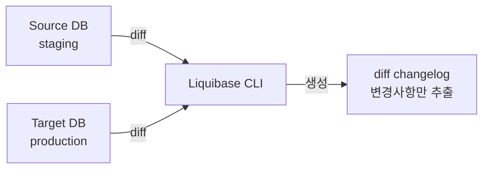

# Intro: 스키마를 누가, 언제, 어떻게 바꿨는지 알고 있는가?

모놀리식 서비스를 운영하다 보면 어느 순간 이런 상황을 마주치게 된다. 스테이징 DB 에는 컬럼이 있는데 프로덕션 DB 에는 없다. 누군가 DBeaver 로 직접 `ALTER TABLE` 을 날렸고 그 기록은 아무 데도 남지 않은 것이다.

코드는 Git 으로 형상관리하면서 DB 스키마는 수작업으로 관리하는 모순이 여기서 발생한다. Liquibase 는 이 문제를 해결하기 위해 "DDL 도 코드처럼 관리하자"는 철학으로 탄생한 툴이다. 이 글에서는 Liquibase 를 선택한 이유, 장단점, 그리고 Spring Boot 와 연동하는 실습까지 순서대로 살펴본다.

# Liquibase 란 무엇인가?

"database schema change management solution" 으로, 마이그레이션 스크립트를 작성하여 DB 스키마의 형상관리를 지원해주는 툴이다.

> Liquibase is a database schema change management solution that enables you to revise and release database changes faster and safer from development to production. To start using Liquibase quickly and easily, you can write your migration scripts in SQL. To take advantage of database abstraction abilities that allow you to write changes once and deploy to different database platforms, you can specify database-agnostic changes in XML, JSON, or YAML.
>
> [Introduction to Liquibase](https://docs.liquibase.com/concepts/introduction-to-liquibase.html)

# 왜 Flyway 대신 Liquibase 를 선택했는가? 🤔

Flyway 라는 좋은 대안도 존재한다. 그러나 아래 세 가지 이유로 Liquibase 를 선택했다.

첫째, **롤백 지원**이다. Flyway 는 유료 플랜에서만 롤백이 가능하고, 커뮤니티 버전은 undo 스크립트를 별도로 작성해야 한다.[^1] 둘째, **DATABASECHANGELOG 테이블**을 통해 모든 변경 이력이 RDB 안에 남는다. 셋째, **스테이징 간 DB diff 및 스냅샷**을 공식적으로 지원한다.[^2] 이 세 가지 기능은 운영 중인 서비스에서 스키마를 안전하게 관리하는 데 직접적인 이점으로 작용한다.

# Liquibase 의 장단점은 무엇인가? ⚖️

## 장점

### DB 스키마 변경 이력을 형상관리할 수 있게 된다

Liquibase 를 통해 DDL 을 실행하면, 처리된 내역이 `DATABASECHANGELOG` 테이블에 기록된다. Git 에도 남기 때문에 "누가, 언제, 어떤 DDL 을 적용했는지" 를 코드 리뷰 수준으로 추적할 수 있다. 덤으로 `DATABASECHANGELOGLOCK` 테이블을 통해 동시에 여러 곳에서 스키마 변경이 일어나지 않도록 잠금도 지원한다.

### SQL, JSON, XML, YAML 등 다양한 포맷을 지원한다

각 팀이 편한 방식을 그대로 사용할 수 있다. 필자의 경우 DDL 작성이 익숙해서 SQL 을 선택했다. YAML 도 지원하지만 Liquibase 고유의 포맷을 따라야 하므로 적응 기간이 필요하다.

### 현재 스냅샷과 스테이징 간 diff 처리가 가능하다

아래 흐름과 같이 source 와 target 을 지정하면 두 DB 사이의 스키마 차이를 changelog 형태로 추출할 수 있다.[^3]



IntelliJ 와 JPA Buddy 내장 기능으로도 동일한 작업이 가능하다.

### 필요한 경우 롤백을 지원한다

Flyway 커뮤니티 버전은 데이터 스냅샷을 지원하지 않고 롤백도 undo 스크립트를 직접 작성해야 한다.[^1] Liquibase 는 changeset 단위 롤백과 tag 기반 롤백을 기본으로 제공한다.

### IntelliJ, Spring Boot 친화적으로 통합된다

Spring Boot 자동 구성과 IntelliJ 플러그인이 공식으로 지원되어 별도의 설정 없이 빠르게 연동할 수 있다.[^4][^5]

### Docker 컨테이너 이미지로도 제공된다

Java, JDBC 드라이버, 의존성이 모두 포함된 공식 이미지를 제공한다.[^6]

```bash
docker pull liquibase/liquibase
```

## 단점

### changelog 처리에 학습 곡선이 존재한다

기존에 적용된 changeset 을 조금이라도 수정하면 checksum 에러를 뱉는다. 디버거에도 잡히지 않아서 처음에는 원인을 찾기가 쉽지 않다.

### 아래 주의사항을 반드시 지켜야 한다

1. `--liquibase formatted sql` 헤더 코멘트와 개행을 빠뜨리면 안 된다. 이 주석이 없으면 추가된 changeset 에 대해 checksum 에러가 발생한다.[^7]

```sql
--liquibase formatted sql

--changeset sql-test:1
--validCheckSum: 8:b4fd16a20425fe377b00d81df722d604
create table test2(
  id int
);
```

2. `--validCheckSum` 을 추가하여 허용 가능한 checksum 임을 명시적으로 선언한다.[^8]

3. 뷰나 프로시저처럼 내용이 자주 바뀌는 changeset 에는 `runOnChange` 속성을 추가한다.

4. 위 세 방법을 모두 적용해도 해결되지 않으면 DB 롤백을 직접 수행해야 한다. 대부분의 이슈는 1번과 2번에서 발생하므로 이 두 가지만 잘 지켜도 실무에서 마주치는 문제의 대부분이 해결된다.

### 오류 발생 시 CLI 명령을 직접 실행해야 하는 경우가 있다

Spring Boot 에서 커맨드를 실행할 수 없는 상황이 되면 MySQL 서버에 직접 접속하여 Liquibase CLI 명령을 날려야 한다. 이런 경우를 대비해 CLI 를 실행하는 Bean 을 별도로 만들어두면 긴급 대응이 수월해진다.

# 실습: Spring Boot 와 연동하기 🛠️

## build.gradle

```groovy
plugins {
    id 'java'
    id 'org.springframework.boot' version '3.3.2'
    id 'io.spring.dependency-management' version '1.1.6'
}

group = 'io.dodn.demo'
version = '0.0.1-SNAPSHOT'

java {
    toolchain {
        languageVersion = JavaLanguageVersion.of(17)
    }
}

configurations {
    compileOnly {
        extendsFrom annotationProcessor
    }
}

repositories {
    mavenCentral()
}

dependencies {
    implementation 'org.springframework.boot:spring-boot-starter-data-jdbc'
    implementation 'org.springframework.boot:spring-boot-starter-data-jpa'
    annotationProcessor 'org.projectlombok:lombok'
    implementation 'org.springframework.boot:spring-boot-starter-jdbc'
    implementation 'org.springframework.boot:spring-boot-starter-web'
    implementation 'org.liquibase:liquibase-core'
    compileOnly 'org.projectlombok:lombok'
    runtimeOnly 'com.mysql:mysql-connector-j'
    testImplementation 'org.springframework.boot:spring-boot-starter-test'
    testRuntimeOnly 'org.junit.platform:junit-platform-launcher'
}

tasks.named('test') {
    useJUnitPlatform()
}
```

## application.yml

`ddl-auto` 는 반드시 `none` 으로 유지해야 한다. Hibernate 가 스키마를 건드리면 Liquibase 의 changeset 과 충돌한다.

```yaml
spring:
  datasource:
    driver-class-name: com.mysql.cj.jdbc.Driver
    url: jdbc:mysql://localhost:3307/liquibase-practice-mysql?useSSL=false&useUnicode=true
    username: admin
    password: 1234qwer!
  jpa:
    database-platform: org.hibernate.dialect.MySQLDialect
    properties:
      hibernate:
        jdbc:
          time_zone: Asia/Seoul
          batch_size: 1000
        ddl-auto: none  # ⚠️ 반드시 none 으로 유지 ⚠️
        auto_quote_keyword: true
        globally_quoted_identifiers: true
        show_sql: true
        format_sql: true
  liquibase:
    change-log: classpath:db/changelog/db.changelog-master.sql
logging:
  pattern:
    dateformat: yyyy-MM-dd HH:mm:ss.SSS,Asia/Seoul
  level:
    root: info
    org.springframework: WARN
    org.hibernate.orm.jdbc.bind: TRACE
```

## 엔티티 예시

```java
// BaseTimeEntity.java
@Getter
@Setter
@MappedSuperclass
@SuperBuilder
@EntityListeners(AuditingEntityListener.class)
@NoArgsConstructor
public abstract class BaseTimeEntity {

    @CreationTimestamp
    @Column(updatable = false)
    @DateTimeFormat(pattern = "yyyy-MM-dd'T'HH:mm:ss")
    private LocalDateTime createdAt;

    @UpdateTimestamp
    @DateTimeFormat(pattern = "yyyy-MM-dd'T'HH:mm:ss")
    private LocalDateTime updatedAt;
}
```

```java
// User.java
@Entity
@Getter
@Builder
@DynamicUpdate
@DynamicInsert
@NoArgsConstructor
@AllArgsConstructor
@Table(name = "liquibase_user")
public class User extends BaseTimeEntity {

    @Id
    @GeneratedValue(strategy = GenerationType.IDENTITY)
    @Column(name = "user_idx", nullable = false, updatable = false)
    private Long userIdx;

    @Column(name = "user_name", length = 16)
    private String userName;

    @Column(name = "user_email", length = 64)
    private String userEmail;

    @Column(name = "user_password", length = 255)
    private String userPassword;
}
```

## db.changelog-master.sql

changeset 을 작성할 때 헤더 주석과 개행을 반드시 지켜야 한다. 순서는 적용 순서대로 유지하고 기존 changeset 은 절대 수정하지 않는 것이 원칙이다.

```sql
--liquibase formatted sql

--changeset admin:sample1_1
ALTER TABLE liquibase_user DROP user_addr;

--changeset admin:sample1_2
ALTER TABLE liquibase_user ADD user_addr VARCHAR(255);
```

이 SQL 이 적용되면 `DATABASECHANGELOG` 테이블에 아래와 같이 이력이 남는다.


# Gradle 플러그인으로 스냅샷을 실행해보면 어떻게 되는가? 📸

`org.liquibase.gradle` 플러그인을 추가하면 Gradle 태스크로 Liquibase 명령을 실행할 수 있다.

## build.gradle (snapshot 버전)

```groovy
import org.liquibase.gradle.LiquibaseTask

plugins {
    id 'java'
    id 'org.springframework.boot' version '3.3.2'
    id 'io.spring.dependency-management' version '1.1.6'
    id 'org.liquibase.gradle' version '2.2.0'
}

configurations {
    compileOnly {
        extendsFrom annotationProcessor
    }
    liquibaseRuntime.extendsFrom runtimeClasspath
}

dependencies {
    // ... 기존 의존성과 동일 ...
    liquibaseRuntime sourceSets.main.output
    liquibaseRuntime 'info.picocli:picocli:4.6.1'
}

liquibase {
    activities {
        main {
            changeLogFile "src/main/resources/db/changelog/db.changelog-master.sql"
            url "jdbc:mysql://localhost:3307/liquibase-practice-mysql"
            username "admin"
            password "1234qwer!"
        }
    }
    runList = 'main'
}

tasks.register('liquibaseSnapshot', LiquibaseTask) {
    changeLogFile 'src/main/resources/db/changelog/db.changelog-master.sql'
    url 'jdbc:mysql://localhost:3307/liquibase-practice-mysql'
    username 'admin'
    password '1234qwer!'
}
```

`./gradlew snapshot` 을 실행하면 현재 DB 의 전체 구조가 아래와 같이 출력된다.

```
Database snapshot for jdbc:mysql://localhost:3307/liquibase-practice-mysql
-----------------------------------------------------------------
Database type: MySQL
Database version: 9.0.1
Database user: admin@172.18.0.1

Catalog: liquibase-practice-mysql
    liquibase.structure.core.Table:
        liquibase_user
            columns:
                user_idx    type: BIGINT(19)  nullable: false
                user_name   type: VARCHAR(16 BYTE)
                user_email  type: VARCHAR(64 BYTE)
                user_password type: VARCHAR(255 BYTE)
                user_addr   type: VARCHAR(255 BYTE)
                created_at  type: DATETIME
                updated_at  type: DATETIME

Liquibase command 'snapshot' was executed successfully.
```

스냅샷을 활용할 때 두 가지 의문이 생겼다. 첫째로 데이터가 5만 건 이상인 경우에도 스키마 구조만 추출되는지, 둘째로 스냅샷 결과물이 어디에 저장되는지다. `--snapshotFormat=json` 옵션을 추가하면 파일로 저장할 수 있고, 데이터 자체가 아닌 스키마 메타데이터만 추출하므로 데이터 건수와는 무관하다.

# Bytebase 라는 GUI 대안도 존재한다 🔍

Liquibase 가 CLI·코드 중심이라면 Bytebase 는 GUI 기반의 대안이다.[^9] 주요 특징은 아래와 같다.

- GUI 환경이라 러닝 커브가 낮다
- CI/CD 파이프라인에서 SQL 변경문을 자동으로 검사한다
- GitLab, GitOps 에 친화적이다
- PR·MR 과 유사한 리뷰 프로세스로 변경사항을 관리한다
- 특정 버전으로의 롤백과 자동 롤백을 지원한다

다만 몇 가지 단점도 눈에 띈다. 공식 문서 외에 커뮤니티나 포럼이 없고, 구글 트렌드에서 검색이 안 될 만큼 인지도가 낮다. 무엇보다 DDL 을 생성하고 실행하는 주체가 사용자가 아닌 Bytebase 이므로 보안 감사 환경에서는 거버넌스 문제가 발생할 수 있다. 상용 툴이기 때문에 자유도에도 제한이 있다.

# 마무리: 스키마도 코드처럼 관리해야 하는 이유 🏁

서비스가 성장할수록 DB 스키마 변경은 더 잦아지고 더 위험해진다. "일단 직접 ALTER 치자" 는 방식은 언젠가 반드시 사고로 이어진다. Liquibase 는 changeset 이라는 단위로 모든 변경을 추적하고, 필요할 때 롤백하며, 스테이징 간 diff 를 코드 리뷰하듯 처리할 수 있게 해준다.

처음에는 checksum 에러나 포맷 규칙이 번거롭게 느껴지지만, 이 불편함이 바로 "누군가 임의로 스키마를 바꾸지 못하도록" 보호하는 안전장치다. 모놀리식 RDB 를 운영하는 팀이라면 Liquibase 도입을 진지하게 고려해볼 만하다.

[^1]: Liquibase vs Flyway 비교 — 롤백·스냅샷 기능 차이 <https://www.baeldung.com/liquibase-vs-flyway>

[^2]: Liquibase diff 명령어 공식 문서 <https://docs.liquibase.com/commands/inspection/diff.html>

[^3]: Liquibase diff changelog 생성 공식 문서 <https://docs.liquibase.com/commands/inspection/diff-changelog.html>

[^4]: Liquibase Spring Boot 통합 공식 문서 <https://contribute.liquibase.com/extensions-integrations/directory/integration-docs/springboot/#__tabbed_1_2>

[^5]: JetBrains IntelliJ Liquibase 플러그인 <https://www.jetbrains.com/help/idea/liquibase.html#generate-migration-script>

[^6]: Liquibase Docker 이미지 사용법 <https://docs.liquibase.com/workflows/liquibase-community/using-liquibase-and-docker.html>

[^7]: Liquibase changeset checksum 공식 문서 <https://docs.liquibase.com/concepts/changelogs/changeset-checksums.html#sql_example>

[^8]: validCheckSum 에러 해결 방법 — StackOverflow <https://stackoverflow.com/questions/71917324/how-to-fix-validationfailedexception-in-liquibase-checksum>

[^9]: Bytebase vs Liquibase 비교 — LinkedIn <https://www.linkedin.com/pulse/bytebase-vs-liquibase-side-by-side-comparison-database-schema-laxbc/>
