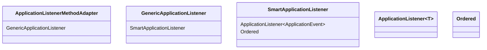
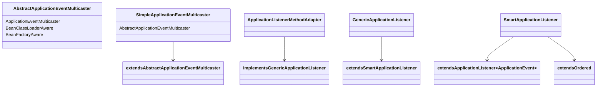

# Why?

스프링 애플리케이션에서 이벤트를 발행하고 처리할 때, 두 가지 타입의 어노테이션을 사용할 수 있다.

- `@EventListener`
- `@TransactionalEventListener`

다만 어떤 유스케이스와 어떤 목적에 따라 어떻게 써야하는지 매 번 헷갈려서 정리해보았다.

# What?

## @EventListener 란 ? 🎧

### How it works

> Subscriber side



> Publisher side



```java
public void multicastEvent(ApplicationEvent event, @Nullable ResolvableType eventType) {
	ResolvableType type = (eventType != null ? eventType : ResolvableType.forInstance(event));
	Executor executor = getTaskExecutor();
	for (ApplicationListener<?> listener : getApplicationListeners(event, type)) {
		if (executor != null && listener.supportsAsyncExecution()) {
			try {
				executor.execute(() -> invokeListener(listener, event));
			}
			catch (RejectedExecutionException ex) {
				// Probably on shutdown -> invoke listener locally instead
				invokeListener(listener, event);
			}
		}
		else {
			invokeListener(listener, event);
		}
	}
}

```

### 언제 @EventListener 쓸까?

- **같은 트랜잭션** 안에서 이벤트를 발행하고 처리하고 싶을 때
- 이벤트 수신자의 **예외를 이벤트 발행자에게 전파**해야할 때
- 이벤트 리스너가 비즈니스 로직과 함께 **동일한 트랜잭션 컨텍스트를 공유**해야 할 때

### 예외 전파 확인

> ☝ TL;DR;

비즈니스 로직 코드가 아래와 같다고 해보자.

```java
@Override
public CreateOrderResponse createOrder(Long userIdx, CreatOrderRequest creatOrderRequest) {
    User buyer = userInfra.findUser(userIdx);
    Product product = productInfra.findProduct(creatOrderRequest.prdIdx());
    Order order = orderInfra.save(Order.createFrom(buyer, product,creatOrderRequest.quantity()));
    applicationEventPublisher.publishEvent(new OrderCreatedEvent(order));
    return createOrderUsecaseMapper.toCreateOrderResponse(order);
}

```

이 때 예외를 일부러 터트리는 테스트 코드를 짜보았다.

- 리스너에서 `RuntimeException("boom")` 을 던지면
- 발행자 쪽 `createOrder` 메서드에도 예외가 발생하는 것 확인

```java
@SpringBootTest
class CreateOrderUsecaseImplTest {

    @Autowired
    CreateOrderUsecaseImpl publisher;
    @MockitoSpyBean
    AddOwnerBalance listener;

    @Test
    @DisplayName("이벤트 수신자 예외 발생 시 이벤트 발행자로 예외 전파합니다.")
    void 이벤트수신자예외발생시_이벤트발행자예외전파() {
        // GIVEN
        Long userId = 1L;
        Long productId = 10L;
        long quantity = 1L;
        CreatOrderRequest creatOrderRequest
		        = new CreatOrderRequest(productId, quantity);
        // 이벤트 수신자가 예외를 던짐
        BDDMockito.doThrow(new RuntimeException("boom"))
            .when(listener)
            .addOwnerBalance(BDDMockito.any(OrderCreatedEvent.class));

        // WHEN
        // THEN
        // 이벤트 발행자에서 예외를 잡음
        assertThrows(RuntimeException.class,
            () -> publisher.createOrder(userId, creatOrderRequest)
        );
    }
}

```

해당 테스트가 통과하는 것을 볼 수 있다. 즉, 이벤트 수신자의 예외가 이벤트 발행하는 응용 계층까지 전파되는 것을 확인할 수 있었다.


## @TransactionalEventListener 란 ? 🔒

- 트랜잭션 동기화 콜백에 등록
- 지정한 트랜잭션 단계에서만 이벤트를 처리.
- 기본적으로는 **트랜잭션 커밋 후**에만 실행되며, 필요에 따라 `phase` 속성으로 실행 시점을 조절 가능

### How it works

1. 애플리케이션 코드에서 `ApplicationEventPublisher.publishEvent(...)` 호출
2. 스프링은 이벤트와 함께 현재 트랜잭션 동기화에 `TransactionSynchronization` 을 등록
3. 트랜잭션 커밋 또는 롤백 시점에, `phase` 에 맞는 리스너만 호출

### 언제 @TransactionalEventListener 쓸까?

- **트랜잭션이 성공적으로 커밋된 이후**에만 외부 시스템(메시지 큐, 이메일, 캐시 업데이트 등) 호출이 필요할 때
- 트랜잭션이 롤백된 경우 **리스너 호출을 취소**해야 할 때
- 커밋 시점에 따른 **정확한 타이밍**이 필요할 때

### @TransactionalEventListener 사용 시 유의사항

이벤트 발행 쪽의 Tx 와 이벤트 수신 쪽의 Tx 는 다른 스레드에서 돌아간다. 이에 따라 아래 옵션을 취사선택하여 처리하여야한다.

# How?

?

### @EventListener

```java
@Component
public class SimpleListener {

    @EventListener
    public void onOrderCreated(OrderCreatedEvent event) {
        // Order 생성 직후, 같은 트랜잭션 내에서 실행
        log.info("OrderCreatedEvent 처리: {}", event.getOrder().getId());
    }
}

```

### @TransactionalEventListener

```java
@Component
public class TxListener {

    // 커밋이 성공한 후에만 실행
    @TransactionalEventListener
    public void onOrderCreatedAfterCommit(OrderCreatedEvent event) {
        // 메시지 큐에 발행하거나, 외부 API 호출
        notifyExternalService(event.getOrder());
    }

    // 커밋 전에 실행
    @TransactionalEventListener(phase = TransactionPhase.BEFORE_COMMIT)
    public void beforeCommit(OrderCreatedEvent event) {
        log.info("트랜잭션 커밋 직전: {}", event.getOrder().getId());
    }

    // 롤백 후 실행
    @TransactionalEventListener(phase = TransactionPhase.AFTER_ROLLBACK)
    public void afterRollback(OrderCreatedEvent event) {
        log.warn("트랜잭션 롤백됨: {}", event.getOrder().getId());
    }
}

```

[^1]: Spring Framework 공식 레퍼런스 – 이벤트 모델 <https://docs.spring.io/spring-framework/docs/current/reference/html/core.html#context-functionality-events>

[^2]: Spring 공식 javadoc – TransactionalEventListener <https://docs.spring.io/spring-framework/docs/current/javadoc-api/org/springframework/transaction/event/TransactionalEventListener.html>

[^3]: `SimpleApplicationEventMulticaster` 소스 – `multicastEvent` 구현 <https://github.com/spring-projects/spring-framework/blob/main/spring-context/src/main/java/org/springframework/context/event/SimpleApplicationEventMulticaster.java>

[^4]: Spring 공식 레퍼런스 – Transaction Synchronization <https://docs.spring.io/spring-framework/docs/current/reference/html/data-access.html#transaction-declarative-applying-more-than-just-tx-advice>

[^5]: Baeldung – Spring Events <https://www.baeldung.com/spring-events>
