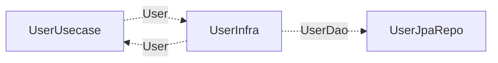

# Why? 🤔

최근에 사내에 코드 아키텍처를 새로 도입하였다. 해당 아키텍쳐에서는 도메인과 영속성 계층 클래스를 분리해서 사용하게끔 되어있다.

이 구조의 특징 중 하나는 분산 시스템과 코드 간의 의존성을 분리할 수 있다는 것이다. 이 덕분에 분산 시스템과 로직을 분리할 수 있게된다. 이것이 장점이자 단점이 될 수 있다는 것인데, 바로 계층 간의 컨텍스트 분리가 일어난다는 것이다.

특히 `JPA 에서는 영속성 컨텍스트가 분리될 수 있는 거 아니야?` 라는 합리적인 의심을 할 수 있게 된다. 이러한 의심을 해소하고자 아래 내용들을 공부해보았다.

# What? 🔍

## JPA 의 엔티티 저장 💾

Jpa 의 save() 는 새로운 객체인지 아닌지를 판별하여 — isNew() == true 인지 — 영속화를 처리한다.[^1]
만약 새로운 객체라면 persist 를 통해 비영속 상태를 영속 상태로 만들고, 만약 기존 준영속 객체라면 merge 를 통해 준영속 상태를 영속 상태로 만든다.

```java
@Repository
@Transactional(readOnly = true)
public class SimpleJpaRepository<T, ID> implements JpaRepositoryImplementation<T, ID> {
    @Transactional
    @Override
    public <S extends T> S save(S entity) {

        Assert.notNull(entity, "Entity must not be null.");

        if (entityInformation.isNew(entity)) {
            em.persist(entity);
            return entity;
        } else {
            return em.merge(entity);
        }
    }
}
```

그렇다면 isNew() 는 어떤 흐름으로 처리될까?

## JPA 는 어떻게 새로운 객체인지 아닌지 구분할 수 있을까? 🧩

> ☝ **TL;DR;**

먼저 `entityInformation.isNew(entity)` 에서의 `entityInformation` 가 무슨 클래스인지를 살펴보아야한다.[^2]

EntityInformation 는 SimpleJpaRepository 가 생성될 때 주입되는데, 이 때 도메인 엔티티의 상태에 따라 다른 구현체가 주입된다. 아래 두 가지 케이스로 나뉘어 처리되는 것을 알 수 있다.


```java
if (Persistable.class.isAssignableFrom(domainClass)) {
	return new JpaPersistableEntityInformation(domainClass, metamodel, persistenceUnitUtil);
} else {
	return new JpaMetamodelEntityInformation(domainClass, metamodel, persistenceUnitUtil);
}
```

Persistable 는 무엇이고 그에 대한 구현여부를 왜 따지는 걸까?[^3]

Persistable 은 새로운 객체인지를 판별하는 isNew() 를 override 할 수 있도록 도와주는 Wrapper Interface 이다. 따라서 아래와 같이 경우의 수가 나뉘어지는 것이다.

- 도메인 엔티티가 Persistable 를 구현 O
- 도메인 엔티티가 Persistable 를 구현 X

그렇다면 각각의 클래스는 isNew() 를 어떻게 구현하고 있을까?


### JpaPersistableEntityInformation

### JpaMetamodelEntityInformation

## 어떻게 merge() 가 처리되는가? ⚙️

> ☝ TL;DR;

새로운 객체가 아니라면 비영속, 준영속 상태의 객체를 영속 상태로 처리하기 위해 EntityManager 의 merge() 를 호출한다. 이 때 EntityManager 의 자식 인터페이스인 Session 을 호출하게 되고, 그에 대한 구현체 SessionImpl 이 호출된다.

```java
public interface Session extends SharedSessionContract, EntityManager {

	/**
	 * Copy the state of the given object onto the persistent object with the same
	 * identifier. If there is no persistent instance currently associated with
	 * the session, it will be loaded. Return the persistent instance. If the
	 * given instance is unsaved, save a copy and return it as a newly persistent
	 * instance. The given instance does not become associated with the session.
	 * This operation cascades to associated instances if the association is mapped
	 * with {@link jakarta.persistence.CascadeType#MERGE}.
	 *
	 * @param object a detached instance with state to be copied
	 *
	 * @return an updated persistent instance
	 */
	<T> T merge(T object);
}
```

```java

public class SessionImpl
		extends AbstractSharedSessionContract
		implements Serializable, SharedSessionContractImplementor, JdbcSessionOwner, SessionImplementor, EventSource,
				TransactionCoordinatorBuilder.Options, WrapperOptions, LoadAccessContext {

	,,,
	@Override @SuppressWarnings("unchecked")
	public <T> T merge(T object) throws HibernateException {
		checkOpen();
		return (T) fireMerge( new MergeEvent( null, object, this ));
	}
}
```

### 세션 검증 및 MergeEvent 발행 ( SessionImpl.merge() )

### MergeEvent 수신 ( DefaultMergeEventListener.onMerge() )

### 중복 병합 방지 ( DefaultMergeEventListener.doMerge() )

### 식별자를 통해 영 속속성 검증 및 영속 상태에 따라 영속화 진행 ( DefaultMergeEventListener.merge() )

## 문제는 **DETACHED 상태였을 때 SELECT 가 한 번 나간다는 것** ⚠️

준영속 상태인 친구는 영속 컨텍스트에 캐싱되어있는 객체를 가져온다. 하지만 비영속 상태, DETACHED 되었을 때는 어떻게 할까?

아래와 같이 처리하게 된다.

- 먼저 영속성 컨텍스트(1차 캐시)를 조회
- 캐시에 없으면 SELECT를 실행
- SELECT 결과가 없을 땐 stale/transient 여부를 판정하여 예외 혹은 새로 저장 처리

실제로 아래와 같이 처리된다.

- 분리된(detached) 엔티티가 병합 요청을 받으면
- DB에서 동일 ID의 엔티티가 존재하는지 확인(`source.get(…)`)

```java
switch ( entityState ) {
		case DETACHED:
			entityIsDetached( event, copiedId, originalId, copiedAlready );
			break;
		,,,
}
```

```java
protected void entityIsDetached(MergeEvent event, Object copiedId, Object originalId, MergeContext copyCache) {
		LOG.trace( "Merging detached instance" );

		final Object entity = event.getEntity();
		final EventSource source = event.getSession();
		final EntityPersister persister = source.getEntityPersister( event.getEntityName(), entity );
		final String entityName = persister.getEntityName();
		if ( originalId == null ) {
			originalId = persister.getIdentifier( entity, source );
		}
		final Object clonedIdentifier;
		if ( copiedId == null ) {
			clonedIdentifier = persister.getIdentifierType().deepCopy( originalId, event.getFactory() );
		}
		else {
			clonedIdentifier = copiedId;
		}
		final Object id = getDetachedEntityId( event, originalId, persister );
		// we must clone embedded composite identifiers, or we will get back the same instance that we pass in
		// apply the special MERGE fetch profile and perform the resolution (Session#get)
		final Object result = source.getLoadQueryInfluencers().fromInternalFetchProfile(
				CascadingFetchProfile.MERGE,
				() -> source.get( entityName, clonedIdentifier )
		);

		if ( result == null ) {
			LOG.trace( "Detached instance not found in database" );
			// we got here because we assumed that an instance
			// with an assigned id and no version was detached,
			// when it was really transient (or deleted)
			final Boolean knownTransient = persister.isTransient( entity, source );
			if ( knownTransient == Boolean.FALSE ) {
				// we know for sure it's detached (generated id
				// or a version property), and so the instance
				// must have been deleted by another transaction
				throw new StaleObjectStateException( entityName, id );
			}
			else {
				// we know for sure it's transient, or we just
				// don't have information (assigned id and no
				// version property) so keep assuming transient
				entityIsTransient( event, clonedIdentifier, copyCache );
			}
		}
		else {
			// before cascade!
			copyCache.put( entity, result, true );
			final Object target = targetEntity( event, entity, persister, id, result );
			// cascade first, so that all unsaved objects get their
			// copy created before we actually copy
			cascadeOnMerge( source, persister, entity, copyCache );
			copyValues( persister, entity, target, source, copyCache );
			//copyValues works by reflection, so explicitly mark the entity instance dirty
			markInterceptorDirty( entity, target );
			event.setResult( result );
		}
	}
```

## 도메인과 엔티티 분리 구조에서는 무조건 DETACHED 상태이다. 🏗️

필자가 구성한 코드 아키텍쳐에서는 아래와 같이 처리된다.



이 과정 중 데이터 수정을 하려면 조회 과정과 저장 과정은 아래와 같이 처리되어야 한다.

조회 : UserDao → User
값 변환 : User
저장 : User → UserDao
이 각각의 과정 중에 User, UserDao 변환에 따라 객체가 생성된다.
**이 때 id 가 이미 있으므로 isNew() 는 통과된다.**
**하지만 merge() 를 호출하게 되고, 영속성 컨텍스트에 데이터가 없으므로 **
**결과적으로 SELECT 쿼리가 부가적으로 호출되게 된다.**

실제로 아래와 같이 데이터 변경 유스케이스에 대한 테스트코드를 실행하게 되면 UPDATE 쿼리를 수행하기 위해 SELECT → UPDATE 가 처리되는 것을 볼 수 있다.[^4]

```java
@SpringBootTest
class UserInfraImplTest {

    @BeforeEach
    void setUp() {
        userInfra.save(
            User.builder()
                .balance(new Money(BigDecimal.valueOf(100L)))
                .build()
        );
    }

    @Autowired
    private UserInfraImpl userInfra;

    @Test
    @DisplayName("merge")
    void merge() {
        // GIVEN
        List<User> users = userInfra.findUsers();

        // WHEN
        User user = users.get(0);
        user.changeName("changedName");

        // THEN
        userInfra.save(user);
    }

}
```


## 어떻게 하면 merge() 에 따른 SELECT 호출을 피할 수 있을까? 🚫

미안하지만 피할 수 없다.

DETACHED 상태인데 Dirty Checking 을 쓸 수가 없고, 무조건 save()/merge() 를 통해 영속화를 해주어야 한다.[^5]
**따라서 SELECT 가 호출되는 건 아키텍처 트레이드오프로 받아들이기로 하였다.**
만약 피할 수 있는 방법을 알게 된다면 해당 포스트에 더 이어서 적도록 하겠다.[^6]

[^1]: <https://howisitgo1ng.tistory.com/entry/JPA-JPA%EA%B0%80-Entity%EB%A5%BC-%ED%8C%90%EB%B3%84%ED%95%98%EB%8A%94-%EB%B0%A9%EB%B2%95%EA%B3%BC-save%EC%9D%98-%EB%B9%84%EB%B0%80entityInformationisNewentity>
[^2]: <https://docs.spring.io/spring-data/jpa/reference/jpa/entity-persistence.html>
[^3]: <https://velog.io/@yglee8048/JPA-Persistable>
[^4]: <https://ttl-blog.tistory.com/852>
[^5]: <https://bjwan-career.tistory.com/221>
[^6]: <https://devs0n.tistory.com/113>
