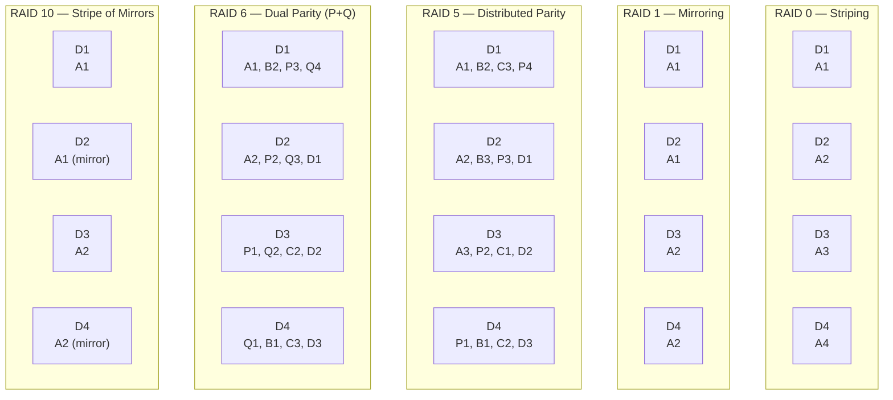
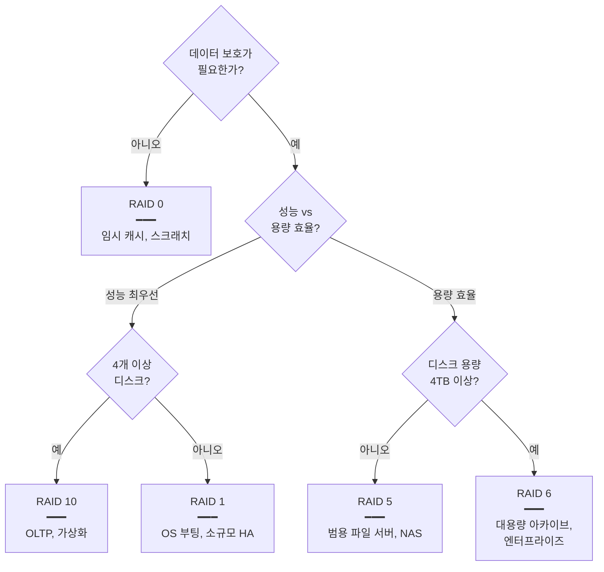

> ⚠️ 이 글은 cheat sheet 용도다. RAID 개념을 까먹었을 때 한눈에 다시 보기 위한 정리이며, 분류 / 정의 / 트레이드오프 / 결정 기준 네 축에 절제된 산문과 표로 정리했다.

# 📌 Why?

RAID 는 데이터 중복성 (Redundancy), 성능 향상 (Performance), 또는 두 가지 목적을 위해 여러 하드 드라이브를 하나의 논리 단위로 결합하는 기술이다.[^1] 데이터 손실 방지, 시스템 가용성 증대, I/O 성능 최적화를 위해 기업 서버와 중요 시스템에서 표준으로 사용된다.

그런데 막상 정리하려 하면 다음 질문이 자주 막힌다.

- RAID 0 부터 10 까지 *무엇이 같고 무엇이 다른가* — 분류 축은 무엇인가?
- *어느 RAID 를 언제 쓰는가* — 결정 기준이 무엇인가?
- RAID 2 / 3 / 4 가 *왜 사실상 폐기되었는가* — 역사적 맥락은 무엇인가?

답은 세 분류 축 — *스트라이핑* (성능) / *미러링* (가용성) / *패리티* (효율 + 가용성) — 의 조합과, 패리티 디스크 병목·재구축 시간이라는 두 운영 비용에 있다. 본문은 분류 다이어그램 → 각 RAID 정의 → 한눈 비교 표 → 결정 트리 순서로 정리한다.

# 📖 What?

## 들어가며 — 네 분류로 보는 RAID 🗺️

9개 RAID 레벨은 결국 세 가지 기본 기법의 조합 또는 그 변형이다. 폐기된 레벨까지 포함하면 네 묶음으로 분류된다.

```
┌────────────────────────────────────────────────┐
│ 스트라이핑 (성능)        — RAID 0, RAID 10    │
├────────────────────────────────────────────────┤
│ 미러링 (가용성)          — RAID 1, RAID 10    │
├────────────────────────────────────────────────┤
│ 패리티 (효율 + 가용성)   — RAID 5, RAID 6     │
├────────────────────────────────────────────────┤
│ 폐기 (역사적 맥락)       — RAID 2, 3, 4       │
└────────────────────────────────────────────────┘
```

RAID 0 은 분산만 한다. RAID 1 은 복제만 한다. RAID 5 / 6 은 분산 + 패리티로 두 목적을 한 모델로 묶는다. RAID 10 은 RAID 0 과 RAID 1 을 중첩한다. RAID 2 / 3 / 4 는 같은 패리티 아이디어의 초기 변형으로, 모두 분산 패리티 (RAID 5) 에 의해 대체되었다.

본문은 현재 사용되는 레벨 (0 / 1 / 5 / 6 / 10) 을 먼저 정리하고, 폐기된 레벨 (2 / 3 / 4) 의 역사적 맥락을 그 뒤에 둔다. 마지막으로 8 차원 비교 표와 결정 트리로 한눈에 정리한다.

> [!NOTE]
> **스트라이핑 (Striping)**
> 하나의 논리 블록을 여러 디스크에 분산해서 쓰는 기법. N 개 디스크에 동시 읽기/쓰기가 일어나 *이론상 N 배* 의 throughput 을 낼 수 있다. 다만 분산 자체는 redundancy 와 무관하다.

> [!NOTE]
> **패리티 (Parity)**
> 데이터 블록들의 XOR 결과를 별도 블록으로 저장하는 기법. 디스크 한 장이 손실되어도 남은 데이터 블록과 패리티 블록의 XOR 로 잃은 데이터를 복원할 수 있다. 한 디스크 분량의 용량을 redundancy 로 쓴다.

## 각 RAID 레벨의 데이터 분산 그림

디스크 4개 기준으로 다섯 가지 현재 RAID 의 데이터 배치를 한 그림으로 정리한다. 같은 색의 블록이 *같은 논리 데이터의 분산* 을 의미하며, P 는 패리티, M 은 복제 블록이다.



RAID 0 은 같은 색이 한 번씩만 등장한다. RAID 1 은 같은 색이 두 번씩 등장한다. RAID 5 는 한 줄에 한 P 가 분산 등장한다. RAID 6 은 한 줄에 P 와 Q 두 개의 패리티 블록이 분산 등장한다. RAID 10 은 두 디스크씩 미러 쌍을 만든 뒤 그 쌍들 사이에 스트라이핑한다.

## RAID 0 — Striping ⚡

가장 단순한 RAID. 2개 이상의 디스크에 데이터를 균등하게 분산하며, redundancy 와 결함 허용은 제공하지 않는다.

**핵심 사양**

- 최소 디스크: 2개
- 용량: 전체 디스크 합계 (2TB + 2TB = 4TB)
- 중복성: 없음 (1개 디스크 실패 시 전체 데이터 손실)
- 성능: 최고 (병렬 읽기 / 쓰기)

**트레이드오프**

- ✅ 최고 속도, 100% 용량 활용
- ❌ 단일 디스크보다 위험 — N 개 디스크 중 한 장만 실패해도 전체 어레이 손실

**사용 시점**: 임시 캐시 서버, 비중요 고속 스토리지, 이미지 / 비디오 편집용 스크래치 디스크.

## RAID 1 — Mirroring 🪞

두 개의 하드 드라이브에 실시간으로 데이터를 동일하게 복제한다. 단일 디스크 장애 시 데이터 신뢰성을 제공하며, 한 드라이브가 실패해도 다른 드라이브에서 즉시 데이터를 이용할 수 있다.

**핵심 사양**

- 최소 디스크: 2개
- 용량: 단일 디스크 크기 (2TB + 2TB = 2TB)
- 중복성: 100% (완전 복제)
- 읽기 성능: 향상 (두 디스크에서 동시 읽기 가능)
- 쓰기 성능: 단일 디스크 수준

**트레이드오프**

- ✅ 최고 신뢰성, 빠른 읽기, 단순한 복구
- ❌ 50% 용량 손실, 비용 2배

**사용 시점**: 중요 OS 부팅 드라이브, 미션 크리티컬 데이터베이스, 소규모 고가용성 시스템.

## RAID 5 — Distributed Parity 📊

RAID 0 이 성능을 위해 스트라이핑한다면, RAID 5 는 *분산 패리티* 로 효율과 가용성을 동시에 잡는다. RAID 4 의 단일 패리티 디스크 병목을 분산 패리티로 해결한 모델이다.[^3]

**핵심 사양**

- 최소 디스크: 3개
- 용량: (N-1) × 디스크 크기 (3 × 2TB = 4TB)
- 장애 허용: 1개 디스크 실패
- 분산 패리티 — 모든 디스크에 패리티 블록이 라운드로빈으로 분산

**트레이드오프**

- ✅ 좋은 용량 효율, 비용 대비 신뢰성, 읽기 성능 우수
- ❌ 쓰기 오버헤드 (패리티 계산), 리빌드 시간 장기

**사용 시점**: 범용 파일 서버, 중소 규모 데이터베이스, 일반적인 NAS 시스템.

## RAID 6 — Dual Distributed Parity 🛡️

블록 레벨 스트라이핑에 두 개의 패리티 블록 (P, Q) 을 모든 멤버 디스크에 분산 배치하여, 두 개의 디스크 장애를 허용한다.[^4] RAID 5 의 단일 패리티 한계를 극복한 모델이다.

**핵심 사양**

- 최소 디스크: 4개
- 용량: (N-2) × 디스크 크기 (6 × 2TB = 8TB)
- 장애 허용: 2개 디스크 동시 실패 (N+2 중복성)
- 이중 패리티 — Reed-Solomon 알고리즘 기반

**트레이드오프**

- ✅ 최고 신뢰성, 대용량 어레이에 적합
- ❌ 쓰기 성능 RAID 5 보다 느림 (이중 패리티 계산), 2개 디스크 용량 손실

**사용 시점**: 대규모 스토리지 시스템 (EMC, IBM), 장기 아카이빙, 높은 신뢰성 요구 환경, 대용량 데이터베이스.

> [!TIP]
> **RAID 5 의 한계와 RAID 6 권장 임계**
> 디스크 용량이 커질수록 한 디스크 실패 후 *재구축 중에 두 번째 디스크가 실패할 확률* 이 커진다. RAID 5 는 두 번째 실패 시 어레이 전체 손실로 이어진다. 4TB 이상의 디스크로 구성된 어레이에서는 RAID 6 이 표준 권장이며, SAS 엔터프라이즈 환경에서는 8TB 이상부터 RAID 6 만 사용하는 경우가 많다.

## RAID 10 — Striped Mirrors 🚀

RAID 0 과 RAID 1 의 중첩이다. 먼저 디스크를 미러 쌍으로 구성한 후 그 쌍들 사이에 스트라이핑하여, RAID 0 의 성능과 RAID 1 의 장애 허용을 결합한다.[^5]

**핵심 사양**

- 최소 디스크: 4개 (짝수 개수 필수)
- 용량: 전체의 50% (4 × 2TB = 4TB)
- 장애 허용: 미러 쌍당 1개 디스크 실패 (서로 다른 쌍이면 여러 디스크 동시 실패 가능)
- 패리티 계산 없음

**트레이드오프**

- ✅ 최고 성능 + 신뢰성, 빠른 리빌드, 패리티 오버헤드 없음
- ❌ 50% 용량 손실, 높은 비용

**사용 시점**: 고성능 데이터베이스 (OLTP), 가상화 환경, 엔터프라이즈 애플리케이션 서버, 성능 / 신뢰성 / 용량의 균형이 필요한 범용 구성.

## RAID 2 — Bit-level + Hamming Code ❌

모든 데이터를 비트 레벨로 스트라이핑하며, 각 비트를 다른 드라이브에 기록하고 오류 수정을 위해 해밍 코드를 사용한다.

**핵심 사양**

- 비트 단위 스트라이핑
- 해밍 코드 ECC (Error Correcting Code)
- 모든 디스크 동기화 필수

**폐기 이유**: 최신 HDD 가 자체 ECC 를 내장하여 별도 해밍 코드가 불필요해졌다. 비트 단위 동기화 비용이 크고 실용성이 없어 사실상 상용 시스템에서 사라졌다.

## RAID 3 — Byte-level + Dedicated Parity ❌

바이트 레벨 스트라이핑과 *전용 패리티 디스크* 를 사용한다. 순차적 데이터에서 높은 전송 속도를 보장한다.

**핵심 사양**

- 최소 디스크: 3개
- 바이트 단위 스트라이핑
- 전용 패리티 디스크 1개
- 모든 디스크 동기 회전 필요

**폐기 이유**: 랜덤 I/O 성능 최악, 패리티 디스크 병목. RAID 5 의 분산 패리티에 의해 대체되었다.

## RAID 4 — Block-level + Dedicated Parity ❌

블록 레벨 스트라이핑과 *전용 패리티 디스크* 를 사용한다. 랜덤 읽기 성능은 좋지만 모든 패리티 데이터를 단일 디스크에 기록해야 해서 랜덤 쓰기 성능이 낮다.

**핵심 사양**

- 최소 디스크: 3개
- 블록 단위 스트라이핑 (16KB ~ 128KB)
- 전용 패리티 디스크 1개

**폐기 이유**: 쓰기 시 패리티 디스크 병목. RAID 5 의 분산 패리티가 같은 패리티 모델을 *병목 없이* 제공한다. NetApp 만 자체 구현 (RAID-DP) 으로 유지한다.

## 한눈에 비교 🔄

| RAID 레벨 | 최소 디스크 | 용량 효율 | 장애 허용 | 읽기 성능  | 쓰기 성능  | 주요 기술          | 현재 사용   |
| --------- | ----------- | --------- | --------- | ---------- | ---------- | ------------------ | ----------- |
| **0**     | 2           | 100%      | 없음      | ⭐⭐⭐⭐⭐ | ⭐⭐⭐⭐⭐ | Striping           | ✅          |
| **1**     | 2           | 50%       | 1개       | ⭐⭐⭐⭐   | ⭐⭐⭐     | Mirroring          | ✅          |
| **2**     | 14+         | N-log(N)  | 여러개    | ⭐⭐       | ⭐         | Bit+Hamming        | ❌ Obsolete |
| **3**     | 3           | (N-1)/N   | 1개       | ⭐⭐⭐⭐   | ⭐⭐⭐⭐   | Byte+Parity        | ❌ Rare     |
| **4**     | 3           | (N-1)/N   | 1개       | ⭐⭐⭐⭐   | ⭐⭐       | Block+Parity       | ❌ Rare     |
| **5**     | 3           | (N-1)/N   | 1개       | ⭐⭐⭐⭐   | ⭐⭐⭐     | Distributed Parity | ✅          |
| **6**     | 4           | (N-2)/N   | 2개       | ⭐⭐⭐⭐   | ⭐⭐       | Dual Parity        | ✅          |
| **10**    | 4           | 50%       | 여러개    | ⭐⭐⭐⭐⭐ | ⭐⭐⭐⭐   | Stripe+Mirror      | ✅          |

# 💡 How?

## 결정 트리 — 어떤 RAID 를 고를 것인가

요구 사항에서 RAID 를 선택할 때의 표준 의사결정 흐름이다.



가지마다의 결정 기준은 다음과 같다.

- **보호 필요 여부**: 임시 데이터 / 캐시 / 스크래치 디스크라면 RAID 0 이 가장 간단하다.
- **성능 vs 용량 효율**: 같은 redundancy 라도 RAID 1 / 10 은 50% 용량 손실 대신 패리티 계산 없는 빠른 응답을, RAID 5 / 6 은 (N-1) ~ (N-2) 용량 효율을 제공한다.
- **디스크 용량 4TB 임계**: 재구축 시간이 디스크 용량에 비례하므로, 4TB 이상은 재구축 중 두 번째 실패 위험이 커져 이중 패리티 (RAID 6) 가 표준이 된다.

## 구현 방법

| 구현       | 비용  | 성능              | 운영 부담                           |
| ---------- | ----- | ----------------- | ----------------------------------- |
| 하드웨어   | 높음  | 최고 (오프로드)   | 컨트롤러 종속, 호환성 이슈          |
| 소프트웨어 | 무료  | 중간 (CPU 사용)   | OS 단위 관리, 이식성 좋음 (`mdadm`) |
| 펌웨어     | 낮음  | 낮음 (Fake RAID)  | 메인보드 종속, 권장 안 함           |

리눅스 환경의 표준은 `mdadm` 기반 소프트웨어 RAID 다. `cat /proc/mdstat` 로 어레이 상태를 확인하고, `mdadm --create` / `mdadm --detail` 로 생성 및 점검한다.

> [!WARNING]
> **RAID 는 백업이 아니다**
> RAID 는 *하드웨어 장애* 에 대한 가용성을 제공할 뿐, 사용자 실수 / 랜섬웨어 / 파일 시스템 손상 / 의도적 삭제 같은 *논리적 손실* 은 보호하지 않는다.[^2] 한 디스크의 손상 데이터는 다른 디스크에도 그대로 동기화된다. 별도의 백업 정책 (3-2-1 규칙 — 데이터 3 부 / 2 가지 매체 / 1 오프사이트) 이 항상 함께 필요하다.

# 📝 Remark

RAID 는 *디스크 한 장의 물리 장애* 라는 한 가지 위험에 대한 답이다. 같은 데이터 보호라는 목표를 더 넓게 다루는 인접 기술은 다음과 같다.

- **ZFS / Btrfs 의 RAID-Z (RAID-Z1 / Z2 / Z3)** — 파일 시스템 레벨의 RAID 로, 블록 체크섬과 copy-on-write 를 결합해 *silent data corruption (bit rot)* 까지 잡는다. RAID 5 / 6 이 가지지 못한 write hole 문제도 구조적으로 해결한다.
- **Battery-Backed Cache (BBC) / Non-Volatile Cache** — 하드웨어 RAID 컨트롤러의 쓰기 캐시. RAID 5 / 6 의 쓰기 오버헤드를 컨트롤러 캐시로 흡수한다.
- **3-2-1 백업 규칙** — RAID 와 별도 운용. RAID 가 가용성, 백업이 복구를 책임진다.
- **erasure coding** — Ceph / MinIO 같은 분산 스토리지의 RAID 5 / 6 일반화. N+K redundancy 를 노드 단위로 적용한다.

# 📚 Reference

[^1]: Wikipedia — Standard RAID levels. <https://en.wikipedia.org/wiki/Standard_RAID_levels>

[^2]: Prepressure — RAID level 0, 1, 5, 6 and 10. <https://www.prepressure.com/library/technology/raid>

[^3]: Dell PowerEdge — What are the different RAID levels and their specifications. <https://www.dell.com/support/kbdoc/en-us/000134892/what-are-the-different-raid-levels>

[^4]: Intel — Defining RAID Volumes for Intel® Rapid Storage Technology. <https://www.intel.com/content/www/us/en/support/articles/000005867/technologies.html>

[^5]: Summit HQ — The Levels of RAID. <https://www.summithq.com/resources/raid-levels/>
