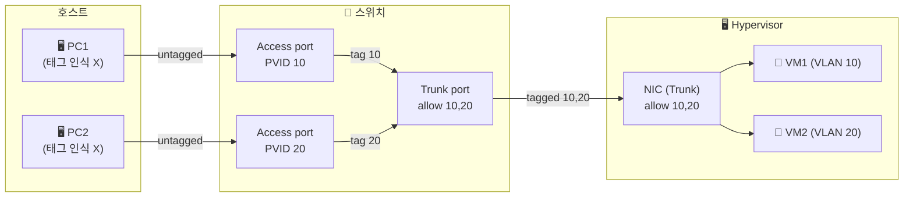
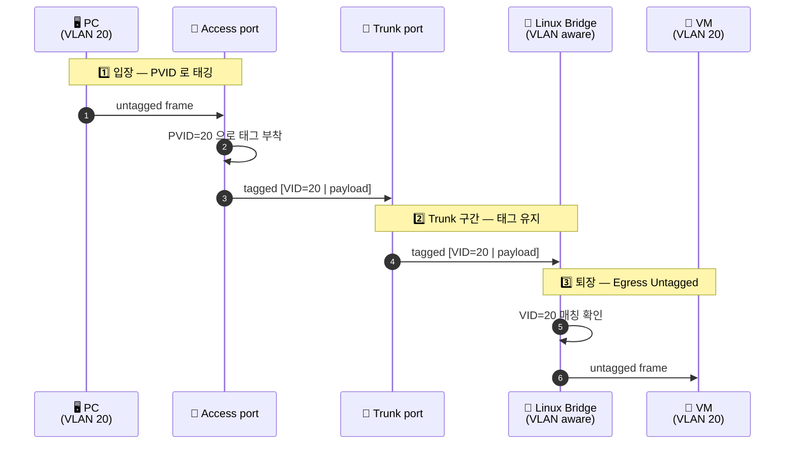

# Why? 왜 배움?

홈랩에서 VM 여러 대를 운영하면서 노출된 VM 한 대가 침해되면 같은 네트워크의 다른 VM 까지 함께 노출될 위험을 줄여야 했다. 다만 VLAN 이라는 단어를 자주 들으면서도 802.1Q 태그가 프레임의 어디에 끼어 들어가는지, trunk 와 access 포트가 무엇이 다른지, Linux Bridge 가 어떤 방식으로 VLAN 을 필터링하는지를 직접 정리해 본 적이 없었다. 특히 `bridge vlan show` 출력의 PVID, Egress Untagged 같은 항목이 실제로 어떤 동작을 의미하는지가 모호한 상태였다.

이 글은 VLAN 의 등장 배경, 802.1Q 프레임 구조, access/trunk/native VLAN 의 구분, Linux Bridge VLAN Filtering 의 동작, VLAN hopping 같은 보안 함정, 그리고 트러블슈팅에 사용하는 명령어까지 *개념편* 으로 정리한다. NixOS 환경에서 systemd-networkd 로 VLAN 을 실제로 구축하는 *구현편* 은 별도 글에서 다룬다.

# What? 뭘 배움?

## 가상 네트워크의 빌딩 블록 🧱

VLAN 의 동작을 정리하기 전에 Linux 가상 네트워크의 기본 빌딩 블록부터 짧게 짚는다. VLAN 인터페이스 자체가 namespace, veth, bridge 위에 얹히는 구조이기 때문이다.

Network Namespace 는 커널이 각 namespace 별로 독립된 네트워크 스택을 제공하는 격리 메커니즘이다. 라우팅 테이블, ARP 테이블, netfilter rule, 네트워크 인터페이스 목록이 namespace 단위로 분리된다. 컨테이너 런타임이 컨테이너마다 별도 namespace 를 할당해서 호스트와 네트워크 격리를 만든다.

Veth Pair 는 양 끝이 서로 연결된 가상 이더넷 케이블 한 쌍이다. 한 쪽에 들어간 프레임은 반대 쪽으로 그대로 나온다. 보통 한 쪽 끝은 컨테이너 namespace 에, 반대 쪽 끝은 호스트의 Linux Bridge 에 연결해서 컨테이너를 외부 네트워크에 붙인다.

Linux Bridge 는 커널 내부의 소프트웨어 L2 스위치다. 여러 인터페이스를 같은 broadcast domain 으로 묶고, FDB (Forwarding Database) 를 학습해서 MAC 기반으로 프레임을 적절한 포트로 전달한다[^bridge-doc]. 과거의 bridge 는 들어온 프레임을 모든 포트로 단순 flooding 했지만 현재의 Linux Bridge 는 802.1Q 태그를 해석해서 VLAN 단위의 필터링을 수행한다.

> [!NOTE]
> **bridge vs switch 의 차이**
> 전통적으로 bridge 는 두 segment 를 연결하는 2포트 장치, switch 는 다포트의 빠른 bridge 를 의미했다. 현대 용어에서는 사실상 동의어로 사용되며, Linux 의 `bridge` 명령어가 다루는 객체도 다포트 L2 스위치다.

## 802.1Q 와 VLAN 의 등장 🕰️

가상 네트워크 빌딩 블록 위에서 VLAN 이 왜 필요했는지 정리한다. VLAN 의 표준화는 1998년 IEEE 802.1Q[^ieee-8021q] 가 정의한 프레임 포맷에서 시작된다.

VLAN 은 물리적으로 같은 스위치에 연결된 장비들을 *논리적으로* 여러 broadcast domain 으로 분리하는 기술이다. 케이블을 재배치하지 않고 소프트웨어 설정만으로 네트워크 그룹을 나눌 수 있다. 같은 부서끼리 묶어 broadcast 트래픽을 제한하거나, DMZ 와 내부망을 분리해 침해 확산을 차단하는 용도로 사용된다.

802.1Q 표준은 기존 이더넷 프레임에 4바이트 VLAN 태그를 끼워 넣는 방식으로 동작한다. 태그는 EtherType (`0x8100`) 과 TCI (Tag Control Information) 로 구성되고, TCI 안에 PCP (3비트 우선순위), DEI (1비트), VID (12비트 VLAN ID) 가 담긴다. VID 가 12비트이므로 사용 가능한 VLAN 은 4094개다 (0 과 4095 는 예약).

| 필드 | 크기 | 의미 |
|---|---|---|
| TPID | 16 bit | `0x8100` 으로 고정. 802.1Q 태그임을 표시 |
| PCP | 3 bit | Priority Code Point. QoS 우선순위 |
| DEI | 1 bit | Drop Eligible Indicator. 혼잡 시 폐기 가능 표시 |
| VID | 12 bit | VLAN Identifier. 1-4094 범위 |

같은 VID 를 가진 프레임만 같은 broadcast domain 에 속한다. VID 가 다른 두 호스트는 같은 케이블에 연결되어 있더라도 L2 레벨에서 서로 보이지 않는다. 그래서 VLAN 간 통신이 필요하면 L3 라우터를 거쳐야 한다.

## Access, Trunk, Native VLAN 🚦

802.1Q 태그가 어떤 프레임에 붙고 어떤 프레임에서 떨어지는지는 스위치 포트의 모드에 따라 결정된다. 모드는 access, trunk, hybrid 세 가지로 갈라지며 native VLAN 이라는 보조 개념이 함께 등장한다.

Access 포트는 *하나의* VLAN 에만 속한다. 일반 PC 가 연결되는 포트가 access 다. 호스트가 보내는 프레임에는 태그가 없고 스위치가 입장 시점에 PVID (Port VLAN ID) 값으로 태그를 붙인다. 반대로 나가는 시점에는 태그를 떼서 호스트에게는 표준 이더넷 프레임만 보이게 한다.

Trunk 포트는 여러 VLAN 의 프레임을 함께 전달한다. 스위치 사이의 uplink, 또는 hypervisor 의 가상 스위치로 연결되는 NIC 가 trunk 다. trunk 를 지나는 프레임은 VID 가 그대로 유지되므로 양 끝의 장비는 어느 VLAN 의 프레임인지 식별할 수 있다.

Native VLAN 은 trunk 포트에서 태그 없이 전달되는 단일 VLAN 이다. 802.1Q 의 하위 호환성을 위해 정의되었고 IEEE 의 기본값은 VLAN 1 이다. trunk 양 끝의 native VLAN 설정이 일치하지 않으면 프레임이 엉뚱한 VLAN 으로 흘러 들어가는 *VLAN leakage* 가 발생한다.



> [!WARNING]
> **Native VLAN 함정**
> trunk 양 끝의 native VLAN 이 다르면 한 쪽이 untagged 로 내보낸 프레임을 반대 쪽이 자신의 native VLAN 으로 받아들인다. 같은 broadcast domain 으로 합쳐지면 안 될 두 VLAN 이 *조용히* 통합된다. native VLAN 은 양 끝을 같은 값으로 명시 설정하거나, trunk 에서는 모든 프레임을 강제로 태그화하는 `vlan dot1q tag native` 같은 옵션으로 비활성화한다.

## VLAN 태깅과 언태깅의 흐름 🏷️

trunk 와 access 포트의 정의를 토대로 프레임 한 장이 PC → 스위치 → 서버 → VM 경로를 지나며 어떻게 태그가 붙고 떨어지는지 시퀀스로 정리한다.



핵심은 호스트가 보통 *태그를 직접 다루지 않는다* 는 점이다. 태그의 부착과 제거는 스위치와 bridge 가 담당하고, end-host 는 표준 이더넷 프레임만 인식한다. 802.1Q 를 모르는 레거시 장비도 access 포트에 그대로 연결할 수 있는 것은 이 untagged 인터페이스 덕분이다.

## Linux Bridge VLAN Filtering 🌉

스위치 포트의 동작은 Linux Bridge 에서도 같은 모델로 재현된다. `bridge` 명령어가 다루는 VLAN Filtering 기능이 802.1Q 스위치를 소프트웨어로 구현한 것이다[^bridge-vlan].

VLAN Filtering 이 켜진 bridge 는 각 포트마다 허용 VLAN 목록, PVID, Egress Untagged 옵션을 따로 가질 수 있다. PVID 는 untagged 로 들어온 프레임에 부착할 VID 다 (access 포트의 PVID 와 같은 개념). Egress Untagged 는 해당 VID 로 나갈 때 태그를 떼라는 설정으로 access 포트의 untagged 출력에 해당한다.

```bash
# bridge VLAN Filtering 활성화
ip link add name vmbr0 type bridge vlan_filtering 1   # ← VLAN aware 로 생성
ip link set vmbr0 up

# trunk 포트: VLAN 10, 20 모두 허용 (태그 유지)
ip link set veth-uplink master vmbr0
bridge vlan add dev veth-uplink vid 10
bridge vlan add dev veth-uplink vid 20

# access 포트: VLAN 10 만, PVID/untagged 동시 설정
ip link set veth-vm1 master vmbr0
bridge vlan add dev veth-vm1 vid 10 pvid untagged   # ← 입장 시 tag 10 부착, 퇴장 시 tag 제거
```

명령 한 줄이 access 와 trunk 포트의 차이를 그대로 모델링한다. `pvid untagged` 가 access 포트, 그 옵션 없이 단순 `vid` 만 부여한 포트가 trunk 다. 동일 bridge 안에서 access 포트와 trunk 포트를 자유롭게 섞을 수 있다.

`bridge vlan show` 출력은 이 설정 상태를 검증하는 1차 도구다. 각 포트에 어떤 VID 가 허용되어 있고 PVID 는 무엇인지, Egress Untagged 가 켜져 있는지를 한 번에 보여준다.

```text
$ bridge vlan show dev vmbr0
port              vlan-id
veth-uplink       10
                  20
veth-vm1          10 PVID Egress Untagged   # ← access 포트의 표식
```

> [!TIP]
> **systemd-networkd 로 영속화**
> 위 `ip` 와 `bridge` 명령은 reboot 시 사라진다. NixOS 또는 일반 systemd 환경에서는 `systemd-networkd` 의 `.netdev` (bridge / vlan 정의) 와 `.network` (포트 멤버십 / VID) 파일로 선언적으로 관리한다[^systemd-network]. 실제 NixOS 모듈 구성은 *구현편* (`About NixOS Homelab — VLAN 분리`) 에서 다룬다.

## VLAN 간 통신과 L3 라우팅 🛣️

VLAN 으로 broadcast domain 을 분리하면 L2 레벨에서 두 VLAN 은 서로 보이지 않는다. 서로 통신해야 하는 경우는 L3 (IP) 계층에서 길을 만들어 주어야 한다.

가장 단순한 방식은 *Router on a Stick* 이다. trunk 포트 하나를 라우터에 연결하고, 라우터가 각 VLAN 의 sub-interface 에 게이트웨이 IP 를 부여해서 VLAN 간 트래픽을 IP 라우팅한다. Linux 호스트에서 한 NIC 에 `eth0.10`, `eth0.20` 같은 VLAN sub-interface 를 만들고 `ip forward` 를 켜는 방식이 같은 모델이다.

L3 switch 는 같은 작업을 하드웨어로 수행한다. 스위치 칩 안에 라우팅 테이블을 함께 두어 VLAN 간 forwarding 을 wire-speed 로 처리한다. 데이터센터 leaf/spine 토폴로지에서 일반적인 선택이다.

홈랩에서는 OPNsense 나 pfSense 같은 소프트웨어 방화벽이 같은 역할을 한다. trunk NIC 하나를 받아 각 VLAN 의 게이트웨이로 동작하면서, 방화벽 규칙으로 *어떤 VLAN 이 어떤 VLAN 에 어느 포트로 접근 가능한지* 를 동시에 정의한다.

| 방식 | 처리 위치 | 통제 단위 | 대표 사용처 |
|---|---|---|---|
| Router on a Stick | 소프트웨어 라우터 | IP / 포트 ACL | 소규모 사무실, 실습 |
| L3 switch | 스위치 ASIC | VLAN interface ACL | 데이터센터, 캠퍼스 네트워크 |
| 방화벽 (OPNsense 등) | 소프트웨어 방화벽 | 상태 기반 (stateful) 규칙 | 홈랩, DMZ 분리, SOHO |

VLAN 간 *모든* 통신을 허용하면 격리의 의미가 사라진다. 방화벽 규칙에서 기본 정책을 deny 로 두고 필요한 흐름만 명시 허용하는 *default-deny* 가 표준이다.

## VLAN 보안 함정 — VLAN Hopping 과 Private VLAN 🛡️

VLAN 격리는 *L2 격리* 일 뿐이며, 잘못된 설정은 격리 자체를 무력화한다. 대표적인 공격이 VLAN hopping 이다[^vlan-hopping].

Switch Spoofing 은 공격자가 자기 포트를 trunk 로 협상시켜 모든 VLAN 의 프레임을 받는 공격이다. Cisco 의 DTP (Dynamic Trunking Protocol) 가 켜진 access 포트에 공격자가 trunk negotiation 패킷을 보내면 포트가 자동으로 trunk 로 전환된다. 방어는 단순하다 — access 포트에서 DTP 를 끄고 `switchport mode access` 로 고정한다.

Double Tagging 은 802.1Q 헤더를 두 겹으로 부착해서 native VLAN 의 untagged 처리를 악용하는 공격이다. 공격자가 outer tag 를 자신의 native VLAN (보통 VLAN 1), inner tag 를 target VLAN 으로 두면, trunk 진입 시 native VLAN 의 outer tag 가 벗겨지고 inner tag 만 남은 프레임이 target VLAN 으로 흘러 들어간다. 방어는 사용자 포트의 VLAN 을 native VLAN 과 다르게 두거나 trunk 에서 native VLAN 의 강제 태깅을 활성화하는 것이다.

Private VLAN (PVLAN) 은 같은 VLAN 안에서도 host 간 통신을 추가 격리하는 확장이다[^rfc5517]. 한 VLAN 을 primary 와 secondary 로 나누고 secondary 는 다시 isolated 와 community 로 구분된다. isolated 포트는 같은 isolated 끼리도 통신 불가능하고 promiscuous 포트 (보통 게이트웨이) 와만 통신한다. 호텔의 같은 층 객실들이 같은 네트워크 세그먼트를 공유하면서도 객실 사이는 격리되어야 하는 시나리오가 PVLAN 의 전형적인 사용 사례다.

> [!IMPORTANT]
> **Voice VLAN 의 데이터 분리**
> IP 전화기에 사용되는 Voice VLAN 은 같은 access 포트에서 데이터 트래픽 (untagged) 과 음성 트래픽 (tagged) 을 함께 전달하는 변형이다. 전화기 뒤에 PC 를 daisy-chain 연결하면 PC 의 데이터는 PVID, 전화기의 음성은 voice VLAN 태그로 분리된다. QoS 마킹 (PCP) 도 voice VLAN 에서 별도 설정한다.

## 트러블슈팅 명령어 🔍

VLAN 환경의 트러블슈팅은 보통 *L2 부터 거꾸로 올라가며* 진행한다. ARP 해소가 되는지부터 확인하고, 그 다음 bridge 의 VLAN 필터링 상태, 마지막으로 systemd-networkd 의 인터페이스 상태를 본다.

### ARP 검증

ARP 는 IP 주소에 대응하는 MAC 주소를 찾는 L2 프로토콜이다. `ip neigh` 가 캐시된 이웃 정보를 보여주며 `REACHABLE` 이면 L2 연결이 정상, `INCOMPLETE` 이면 VLAN 설정이나 veth 경로 어딘가가 끊어진 상태다.

```bash
# 호스트 전체 ARP 테이블
ssh "$target" "ip neigh show"

# VLAN 인터페이스별로 분리해서 확인
ssh "$target" "ip neigh show dev vlan10"
ssh "$target" "ip neigh show dev vlan20"
```

`INCOMPLETE` 가 떴다면 같은 VLAN 안에서 ARP request 가 회신되지 않는다는 뜻이다. VID 가 양 끝의 bridge 에서 모두 허용되어 있는지, 양 끝의 PVID 가 의도한 값과 일치하는지부터 의심한다.

### Bridge VLAN Filtering 상태

`bridge vlan show` 는 각 포트에 어떤 VID 가 허용되어 있고 PVID, Egress Untagged 가 어떻게 설정되어 있는지를 한 번에 보여준다.

```bash
ssh "$target" "sudo bridge vlan show dev vmbr0"

# 특정 VLAN 의 포트만 추출
ssh "$target" "sudo bridge vlan show | grep -E '(vm-vault|vm-jenkins|vlan10)'"
```

출력의 `PVID` 표시는 *입장 시* 부착될 VID 를, `Egress Untagged` 는 *퇴장 시* 태그를 제거함을 의미한다. access 포트에는 두 표시가 모두 떠 있어야 하고, trunk 포트에는 둘 다 없어야 한다.

### Bridge FDB

FDB (Forwarding Database) 는 bridge 가 학습한 MAC → 포트 매핑이다. 통신이 안 될 때 상대 MAC 이 FDB 에 학습되어 있는지 확인하면 *프레임이 bridge 까지 도달했는지* 가 곧장 확인된다.

```bash
ssh "$target" "bridge link show | grep vmbr0"
ssh "$target" "sudo bridge fdb show br vmbr0"
```

상대 MAC 이 FDB 에 보이지 않으면 프레임 자체가 bridge 에 들어오지 못한 것이다. veth 경로, 물리 NIC 의 link state, VLAN 허용 목록 순으로 거슬러 올라간다.

### systemd-networkd 상태

선언적 설정이 실제로 활성화되었는지는 `networkctl` 로 확인한다. `routable` 이면 IP 가 부여되고 라우팅이 가능한 상태, `degraded` 또는 `carrier` 이면 link 는 있지만 IP 가 없는 상태다.

```bash
ssh "$target" "systemctl status systemd-networkd --no-pager"
ssh "$target" "networkctl status"
ssh "$target" "networkctl status vlan10 vlan20"
```

VLAN 인터페이스가 `enslaved` 로 보이면 bridge 에 정상 연결된 상태다. `pending` 이 오래 지속되면 link 가 올라오기를 기다리는 중이거나 의존 인터페이스가 활성화되지 않은 상태이므로 의존 NIC 의 상태부터 다시 확인한다.

# Remark

본문에서 다룬 VLAN 의 핵심 개념을 한 표로 요약한다.

| 개념 | 요지 | 적용 위치 |
|---|---|---|
| 802.1Q 태그 | EtherType `0x8100` + 12비트 VID + 3비트 PCP | 프레임 레벨 |
| Access 포트 | 단일 VLAN, untagged 호스트 인터페이스 | end-host 연결 |
| Trunk 포트 | 다중 VLAN, tagged 유지 | 스위치 간 / hypervisor uplink |
| Native VLAN | trunk 의 untagged VLAN, 양 끝 일치 필수 | 호환성 / 보안 위험 |
| Linux Bridge VLAN Filtering | 소프트웨어 802.1Q 스위치 | hypervisor / 컨테이너 호스트 |
| Router on a Stick / L3 switch / 방화벽 | VLAN 간 L3 라우팅 경로 | 게이트웨이 |
| VLAN Hopping | DTP 협상 또는 double tagging | 보안 함정 |
| Private VLAN | 같은 VLAN 안에서의 추가 격리 | 호스팅 / 멀티테넌시 |

홈랩에서 가장 자주 만난 문제는 두 가지였다. 하나는 NixOS 의 `systemd-networkd` VLAN 정의에서 `Bridge=` 와 `VLAN=` 의 관계를 거꾸로 잡아 bridge 가 VLAN 을 인식하지 못한 경우다. 다른 하나는 `vlan_filtering 1` 옵션을 빠뜨려 bridge 가 모든 태그를 그대로 통과시키면서 격리가 사라진 경우다. 두 경우 모두 `bridge vlan show` 한 줄의 출력 차이로 즉시 구분된다 — VID 목록이 비어 있으면 filtering 이 꺼진 상태고, 의도한 VID 가 없으면 정의가 누락된 상태다.

이 글이 다루지 않은 인접 주제로는 VXLAN (L3 위에서 L2 를 터널링하는 데이터센터 표준), MVRP (스위치 간 VLAN 정보 자동 동기화 프로토콜), GENEVE 같은 overlay 네트워크가 있다. 실제 NixOS 환경에서 위 개념을 어떻게 `systemd.network` 모듈과 nftables 규칙으로 구성하는지는 *구현편* (`About NixOS Homelab — VLAN 분리`) 으로 이어진다.

# Reference

[^ieee-8021q]: <https://standards.ieee.org/ieee/802.1Q/> — IEEE 802.1Q VLAN 표준. 프레임 포맷 (TPID/TCI), VID 범위, native VLAN 정의.

[^bridge-doc]: <https://www.kernel.org/doc/html/latest/networking/bridge.html> — Linux Bridge 커널 문서. FDB 학습, STP, VLAN Filtering 동작.

[^bridge-vlan]: <https://man7.org/linux/man-pages/man8/bridge.8.html> — `bridge(8)` 매뉴얼. `bridge vlan add/show` 의 `pvid`, `untagged` 옵션 의미.

[^systemd-network]: <https://www.freedesktop.org/software/systemd/man/systemd.network.html> — `systemd.network(5)`. `.netdev` 의 `Kind=vlan` / `Kind=bridge` 및 `.network` 의 `VLAN=`, `Bridge=` 키.

[^vlan-hopping]: <https://www.cisco.com/c/en/us/support/docs/lan-switching/8021q/10554-76.html> — Cisco VLAN Security White Paper. Switch Spoofing 과 Double Tagging 의 메커니즘과 완화책.

[^rfc5517]: <https://datatracker.ietf.org/doc/html/rfc5517> — Cisco Systems' Private VLANs. primary / isolated / community 구분 정의.

[^pve-vlan]: <https://pve.proxmox.com/wiki/Network_Configuration#_vlan_802_1q> — Proxmox VE VLAN 설정 가이드. VLAN aware bridge 와 VLAN interface 두 방식의 차이.

[^nftables]: <https://wiki.nftables.org/wiki-nftables/index.php/Main_Page> — nftables 공식 위키. VLAN 간 통신을 통제할 때 사용되는 패킷 필터.
