# Why? 왜 배움?

홈랩에서 VM 여러 대를 운영하다 보면, 노출된 한 대가 침해되면 같은 네트워크의 다른 VM 까지 함께 노출될 위험이 있다. 이 위험을 줄이려고 VLAN 으로 네트워크를 논리적으로 나누고 싶었다. 그런데 막상 정리하려 하니 모르는 것이 많았다.

- 802.1Q 태그가 이더넷 프레임의 어디에 끼어들어가는가?
- 같은 일을 하는 구현체가 여러 개 있는데 — iproute2, systemd-networkd, netplan, NetworkManager, ifupdown — 어느 환경에서 무엇을 써야 하는가?
- Linux Bridge 는 어떤 방식으로 VLAN 을 필터링하는가?
- `bridge vlan show` 출력의 `PVID` 와 `Egress Untagged` 는 무슨 뜻인가?

명령어를 따라 쳤을 때 동작하는 것은 확인했지만, 왜 그 명령으로 충분한지를 코드와 명령어 수준에서 직접 설명해 본 적은 없었다.

이 글은 VLAN 을 세 겹으로 정리한다. 외부에서 보이는 프레임의 라이프사이클, 다섯 가지 구현체의 옵션 매핑, 그리고 커널 내부의 FDB 학습과 VID 매칭이다. 마지막으로 Vagrant 와 Multipass 환경에서 두 가상 호스트 사이의 VLAN 격리를 다섯 단계로 직접 검증한다. NixOS 환경의 구체 구축은 별도 글 (`About NixOS Homelab — VLAN 분리`) 에서 다룬다.

# What? 뭘 배움?

## 들어가며 — 세 겹으로 보는 VLAN 🗺️

VLAN 의 동작을 한 번에 다 보려고 하면 복잡하다. 그래서 세 겹으로 나눠서 본다.

```
┌──────────────────────────────────────────────────────────┐
│ 1. 외부에서 보이는 프레임 흐름                              │  ← "태그가 어디서 붙고 어디서 떨어지나"
├──────────────────────────────────────────────────────────┤
│ 2. 구현체 (iproute2 / systemd-networkd / netplan / ...)   │  ← "어떤 설정으로 그 동작을 만드나"
├──────────────────────────────────────────────────────────┤
│ 3. 커널 내부 (FDB 학습, VID 매칭)                          │  ← "커널이 실제로 무엇을 하나"
└──────────────────────────────────────────────────────────┘
```

위에서 아래로 갈수록 깊어진다. 외부 흐름 (1) 을 보면 결과가 보이고, 구현체 (2) 를 보면 어떤 도구로 그 결과를 만드는지가 보이고, 커널 내부 (3) 를 보면 왜 그 도구가 그렇게 동작하는지가 보인다.

본문은 이 순서를 따라 진행한다. 먼저 가상 네트워크의 빌딩 블록 (namespace, veth, bridge — VLAN 이 얹히는 토대) 을 짚는다. 그 위에 802.1Q 표준과 프레임 라이프사이클 (1번 층) 을 정리하고, Access/Trunk/Native VLAN 의 정의와 다섯 가지 구현체 매핑 (2번 층) 을 본다. Linux Bridge VLAN Filtering 의 내부 메커니즘 (3번 층) 으로 깊이를 더한 뒤, L3 라우팅과 보안 함정을 짚는다. 마지막으로 Vagrant·Multipass 실습으로 다섯 단계의 검증을 진행한다.

## 가상 네트워크의 빌딩 블록 🧱

VLAN 의 동작을 정리하기 전에 Linux 가상 네트워크의 기본 빌딩 블록부터 짚는다. VLAN 인터페이스가 namespace, veth, bridge 위에 얹히는 구조이기 때문이다. 특히 컨테이너 환경과 가상화 환경에서 VLAN 트래픽이 흐르는 경로를 따라가려면 이 세 객체의 관계를 먼저 이해해 두어야 한다.

세 객체의 역할은 다음 한 줄로 요약된다.

| 객체 | 역할 | 비교 대상 (물리 세계) |
|---|---|---|
| Network Namespace | 네트워크 스택을 격리하는 단위 | 별도의 라우터·스위치를 가진 독립된 네트워크 |
| Veth Pair | 두 namespace 또는 bridge 를 잇는 가상 케이블 | 양 끝 커넥터가 연결된 이더넷 케이블 한 쌍 |
| Linux Bridge | 같은 broadcast domain 으로 묶는 가상 스위치 | 책상 위 L2 스위치 |

세 객체가 함께 동작하는 구조는 다음 그림과 같다. 두 컨테이너가 각자의 namespace 안에서 동작하고, veth pair 가 namespace 와 호스트의 bridge 를 잇는다. bridge 가 두 컨테이너의 트래픽을 L2 레벨에서 교환한다.

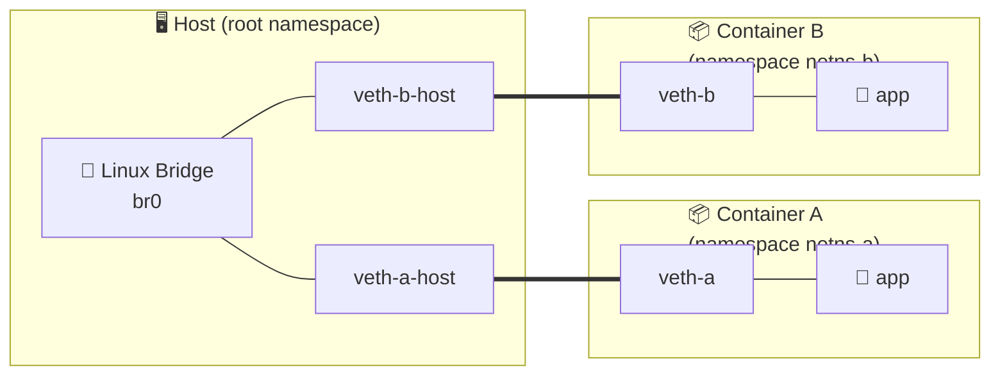

이 구조에서 두꺼운 선 (`===`) 은 veth pair 의 양 끝을 잇는 가상 케이블, 얇은 선 (`---`) 은 같은 namespace 안의 연결을 표시한다. Container A 의 `app` 이 보낸 프레임은 `veth-a → veth-a-host → br0 → veth-b-host → veth-b → Container B 의 app` 경로로 전달된다. 세 객체를 하나씩 풀어 본다.

### Network Namespace — 네트워크 스택의 격리 단위

Network Namespace 는 커널이 각 namespace 별로 독립된 네트워크 스택을 제공하는 격리 메커니즘이다. 라우팅 테이블, ARP 테이블, netfilter 규칙, 네트워크 인터페이스 목록이 namespace 단위로 분리된다. 컨테이너 런타임이 컨테이너마다 별도 namespace 를 할당해서 호스트와 네트워크 격리를 만든다.

```bash
# 새 namespace 생성
sudo ip netns add netns-a               # ← /var/run/netns/netns-a 생성

# 격리된 인터페이스 목록 — 호스트와 완전히 분리됨
sudo ip netns exec netns-a ip link show
# 1: lo: <LOOPBACK> ...                 ← lo 하나만 존재 (down 상태)
```

호스트에서 보이는 수십 개의 인터페이스가 새 namespace 안에서는 보이지 않는다. 같은 IP 대역을 호스트와 namespace 가 동시에 가질 수도 있다.

### Veth Pair — namespace 를 잇는 가상 케이블

Veth Pair 는 양 끝이 서로 연결된 가상 이더넷 케이블 한 쌍이다. 한 쪽으로 들어간 프레임은 반대 쪽으로 그대로 나온다. 보통 한 쪽 끝은 컨테이너 namespace 에, 반대 쪽 끝은 호스트의 Linux Bridge 에 연결해서 컨테이너를 외부 네트워크에 붙인다.

```bash
# 양 끝 두 개를 한 번에 생성
sudo ip link add veth-a type veth peer name veth-a-host   # ← 호스트에 두 인터페이스 등장

# 한 끝을 namespace 안으로 옮긴다
sudo ip link set veth-a netns netns-a                     # ← namespace 쪽 끝
# 반대 끝은 호스트에 남아 bridge 에 attach 한다
```

이 한 줄이 *namespace 격리* 를 깨고 외부 네트워크와의 연결을 만드는 표준 방식이다. veth 의 다른 이름은 *cross-over cable in software* 다.

### Linux Bridge — 같은 broadcast domain 으로 묶는 가상 스위치

Linux Bridge 는 커널 내부의 소프트웨어 L2 스위치다. 여러 인터페이스를 같은 broadcast domain 으로 묶고, FDB (Forwarding Database) 를 학습해서 MAC 기반으로 프레임을 적절한 포트로 전달한다[^bridge-doc]. 과거의 bridge 는 들어온 프레임을 모든 포트로 단순 flooding 했지만, 현재의 Linux Bridge 는 802.1Q 태그를 해석해서 VLAN 단위의 필터링을 수행한다.

```bash
# bridge 생성 후 두 veth 의 호스트 쪽 끝을 attach
sudo ip link add name br0 type bridge
sudo ip link set br0 up
sudo ip link set veth-a-host master br0   # ← bridge 의 한 포트로 등록
sudo ip link set veth-b-host master br0
sudo ip link set veth-a-host up
sudo ip link set veth-b-host up
```

FDB 학습은 자동이다. 한 포트에서 들어온 프레임의 source MAC 을 보고 *해당 MAC 이 그 포트에 있다* 는 사실을 기록한다. 다음 프레임이 그 MAC 을 destination 으로 가지면 학습된 포트로만 보낸다.

```text
$ bridge fdb show br br0
aa:bb:cc:00:00:01 dev veth-a-host vlan 1 master br0   # ← Container A 의 MAC 학습
aa:bb:cc:00:00:02 dev veth-b-host vlan 1 master br0   # ← Container B 의 MAC 학습
```

VLAN-aware bridge 는 이 매핑에 VID 가 추가된 `(MAC, VID) → 포트` 의 세 쌍으로 확장된다. 같은 MAC 이 다른 VID 로 등장해도 별도 항목으로 학습되므로 VLAN 간 MAC 충돌이 발생하지 않는다. 이 동작은 *Linux Bridge VLAN Filtering 내부 메커니즘* 절에서 다시 본다.

> [!NOTE]
> **bridge 와 switch 의 차이**
> 전통적으로 bridge 는 두 segment 를 연결하는 2포트 장치, switch 는 다포트의 빠른 bridge 를 의미했다. 현대 용어에서는 사실상 동의어로 사용되며, Linux 의 `bridge` 명령어가 다루는 객체도 다포트 L2 스위치다.

### VLAN 인터페이스가 얹히는 자리

세 객체 위에 VLAN 인터페이스가 어떻게 얹히는지를 마지막으로 정리한다. 다음 그림은 같은 호스트가 *두 VLAN 을 동시에 운영* 할 때의 구조다. 하나의 물리 NIC `eth0` 위에 두 VLAN sub-interface (`eth0.10`, `eth0.20`) 가 생기고, 각자 자신의 bridge 에 연결되어 각 VLAN 의 컨테이너 트래픽을 전달한다.

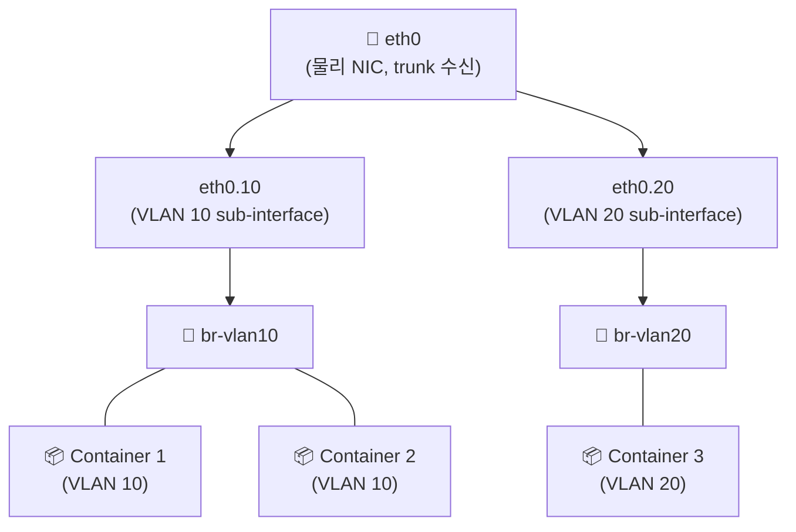

VLAN 자체는 *기존 빌딩 블록 위에 얹는 한 겹의 태그 처리 레이어* 다. namespace, veth, bridge 의 구조는 그대로이고, sub-interface (`eth0.10`) 나 VLAN-aware bridge 의 포트 설정이 *어느 VLAN 의 프레임* 인지를 결정한다. 이 점을 토대로 다음 절에서 802.1Q 태그 자체의 구조를 본다.

## VLAN 의 등장과 802.1Q 표준 🕰️

가상 네트워크의 빌딩 블록 위에서 VLAN 이 왜 필요했는지를 본다. 1990년대 중반까지 네트워크 격리는 *물리적으로* 케이블을 분리하는 방식이 일반적이었다. 같은 회의실에 부서 두 개가 같이 있으면 두 부서를 분리하려고 케이블을 따로 깔아야 했다. 이 한계를 소프트웨어로 풀어낸 표준이 1998년 IEEE 802.1Q[^ieee-8021q] 다.

VLAN 은 물리적으로 같은 스위치에 연결된 장비들을 논리적으로 여러 broadcast domain 으로 분리하는 기술이다. 케이블을 재배치하지 않고 소프트웨어 설정만으로 네트워크 그룹을 나눌 수 있다. 같은 부서끼리 묶어 broadcast 트래픽을 제한하거나, DMZ 와 내부망을 분리해 침해 확산을 차단하는 용도로 사용된다.

802.1Q 표준은 기존 이더넷 프레임에 4바이트 VLAN 태그를 끼워 넣는 방식으로 동작한다. 태그는 EtherType (`0x8100`) 과 TCI (Tag Control Information) 로 구성되고, TCI 안에 PCP (3비트 우선순위), DEI (1비트), VID (12비트 VLAN ID) 가 담긴다. VID 가 12비트이므로 사용 가능한 VLAN 은 4094개다 (0 과 4095 는 예약).

태그가 프레임의 어디에 끼어들어가는지부터 그림으로 본다. 일반 이더넷 프레임은 Dst MAC + Src MAC + EtherType + Payload + FCS 의 다섯 영역으로 구성된다. 802.1Q 태그는 Src MAC 과 EtherType 사이에 *4바이트* 가 추가되는 형태다.

```text
일반 이더넷 프레임:
┌──────────┬──────────┬──────────┬──────────────────┬─────────┐
│ Dst MAC  │ Src MAC  │EtherType │  Payload (IP …)  │   FCS   │
│ 6 bytes  │ 6 bytes  │ 2 bytes  │  46-1500 bytes   │ 4 bytes │
└──────────┴──────────┴──────────┴──────────────────┴─────────┘

802.1Q 태그가 끼어든 프레임 — Src MAC 뒤에 4바이트 삽입:
┌──────────┬──────────┬──────────────────────┬──────────┬──────────────────┬─────────┐
│ Dst MAC  │ Src MAC  │  802.1Q tag (4 B)    │EtherType │  Payload         │   FCS   │
│ 6 bytes  │ 6 bytes  │  TPID + TCI          │ 2 bytes  │  ...             │ 4 bytes │
└──────────┴──────────┴──────────────────────┴──────────┴──────────────────┴─────────┘
                                  │
                                  ▼
                      ┌────────────┬────────────────────────────┐
                      │   TPID     │            TCI             │
                      │  0x8100    │   PCP   │  DEI  │   VID    │
                      │  16 bit    │   3 b   │  1 b  │  12 bit  │
                      └────────────┴─────────┴───────┴──────────┘
```

각 필드의 의미는 다음과 같다.

| 필드 | 크기 | 의미 |
|---|---|---|
| TPID | 16 bit | `0x8100` 으로 고정. 802.1Q 태그임을 표시 |
| PCP | 3 bit | Priority Code Point. QoS 우선순위 (0=best effort, 7=network control) |
| DEI | 1 bit | Drop Eligible Indicator. 혼잡 시 폐기 가능 표시 |
| VID | 12 bit | VLAN Identifier. 1-4094 범위 (0, 4095 는 예약) |

같은 VID 를 가진 프레임만 같은 broadcast domain 에 속한다. VID 가 다른 두 호스트는 같은 케이블에 연결되어 있어도 L2 레벨에서 서로 보이지 않는다. 그래서 VLAN 간 통신이 필요하면 L3 라우터를 거쳐야 한다.

> [!NOTE]
> **Q-in-Q (802.1ad) — 이중 태깅**
> 802.1Q 태그를 두 겹으로 중첩한 확장 표준이다. 4바이트 + 4바이트 총 8바이트가 추가된다. ISP 가 고객망의 VLAN 태그를 보존한 채로 자신의 VLAN 으로 다시 구분할 때 사용한다 (캐리어 이더넷). 외부 태그 (S-VLAN, Service) 가 ISP 의 VLAN, 내부 태그 (C-VLAN, Customer) 가 고객의 VLAN 이다. 의도적으로 사용되면 Q-in-Q, 공격으로 악용되면 *Double Tagging* (보안 함정 절 참고) 이다.

### VLAN 의 실제 사용 사례

12비트 VID 가 어디서 어떻게 할당되는지를 사용처별로 정리하면 다음과 같다.

| 사용처 | VID 할당 패턴 | 통제 위치 |
|---|---|---|
| 부서 분리 (영업/개발/HR) | VLAN 10, 20, 30 | 스위치 + 방화벽 |
| DMZ 와 내부망 분리 | VLAN 100 (DMZ), 200 (내부) | 방화벽 |
| Voice VLAN (IP 전화기) | VLAN 1 (data), VLAN 200 (voice) | 스위치 + PCP 마킹 |
| Guest VLAN (방문자 Wi-Fi) | VLAN 999 | 방화벽 + 인터넷 only |
| 가용 영역 (zone) 분리 | VLAN 1000-1099 | L3 switch |
| 홈랩 VM 격리 (이 글의 시나리오) | VLAN 10 (관리망), 20 (서비스망) | OPNsense / pfSense |

VID 번호 자체는 임의로 정한 식별자다. 다만 일부 환경 (Cisco 의 DTP, 일부 통신 사업자) 은 VLAN 1 을 native 의 기본값이나 관리 트래픽 전용으로 가정하므로, *VLAN 1 은 사용자 트래픽에서 피하는 것* 이 운영상 안전하다.

## 프레임의 라이프사이클 — 태그 부착에서 제거까지 🏷️

802.1Q 표준의 4바이트 태그가 어디서 붙고 어디서 떨어지는지를 본다. 이번 절은 시퀀스 다이어그램으로 PVID 부착 시점과 Egress Untagged 처리 시점을 시간 순서로 명시한다.

802.1Q 태그가 어떤 프레임에 붙고 어떤 프레임에서 떨어지는지는 스위치 포트의 모드에 따라 결정된다. 모드는 access, trunk, hybrid 세 가지로 갈라지며, native VLAN 이라는 보조 개념이 trunk 안에서 함께 등장한다. 세 모드를 한눈에 비교하면 다음과 같다.

| 모드 | 호스트 쪽 | 스위치 쪽 | PVID 사용 | 한 포트가 다루는 VLAN 수 | 대표 사용처 |
|---|---|---|---|---|---|
| Access | untagged | tagged | 사용 (입장 시 부착) | 1개 | 일반 PC, 컨테이너 |
| Trunk | tagged | tagged | 미사용 | 여러 개 | 스위치 간 uplink, hypervisor NIC |
| Native (trunk 내) | untagged | untagged | 사용 (입장 시 부착) | 1개 (trunk 안의 default) | 802.1Q 미지원 레거시 호환 |

Access 포트는 하나의 VLAN 에만 속한다. 일반 PC 가 연결되는 포트가 access 다. 호스트가 보내는 프레임에는 태그가 없고, 스위치가 입장 시점에 PVID (Port VLAN ID) 값으로 태그를 붙인다. 반대로 나가는 시점에는 태그를 떼서 호스트에게는 표준 이더넷 프레임만 보이게 한다.

Trunk 포트는 여러 VLAN 의 프레임을 함께 전달한다. 스위치 사이의 uplink, 또는 hypervisor 의 가상 스위치로 연결되는 NIC 가 trunk 다. trunk 를 지나는 프레임은 VID 가 그대로 유지되므로, 양 끝의 장비는 어느 VLAN 의 프레임인지 식별할 수 있다.

Native VLAN 은 trunk 포트에서 태그 없이 전달되는 단일 VLAN 이다. 802.1Q 의 하위 호환성을 위해 정의되었고 IEEE 의 기본값은 VLAN 1 이다. trunk 양 끝의 native VLAN 설정이 일치하지 않으면 프레임이 엉뚱한 VLAN 으로 흘러 들어가는 *VLAN leakage* 가 발생한다.

세 모드에서 프레임이 어떤 모습으로 흐르는지를 한 그림으로 정리한다.

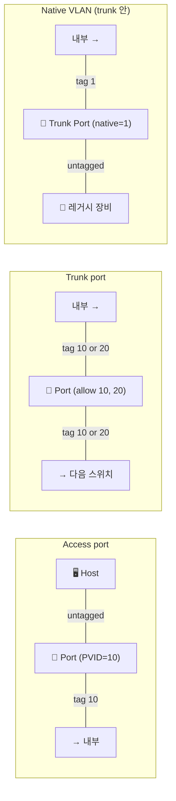

핵심 규칙은 단순하다. *호스트 쪽이 태그를 보지 않게 하려면 access* 다. *여러 VLAN 을 한 케이블에 흘리려면 trunk* 다. *trunk 안에서 한 VLAN 만 태그 없이 흘리려면 native* 다.

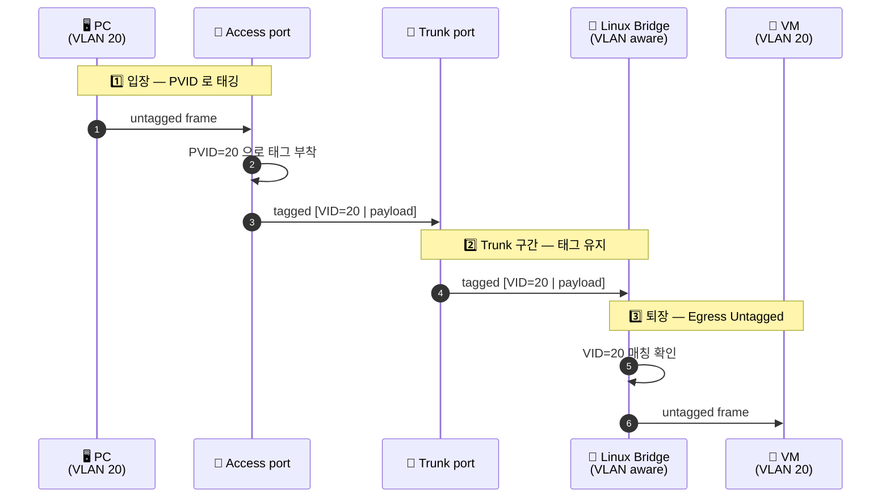

핵심은 호스트가 보통 태그를 직접 다루지 않는다는 점이다. 태그의 부착과 제거는 스위치와 bridge 가 담당하고, end-host 는 표준 이더넷 프레임만 인식한다. 802.1Q 를 모르는 레거시 장비도 access 포트에 그대로 연결할 수 있는 것은 이 untagged 인터페이스 덕분이다.

> [!WARNING]
> **Native VLAN 함정**
> trunk 양 끝의 native VLAN 이 다르면, 한 쪽이 untagged 로 내보낸 프레임을 반대 쪽이 자신의 native VLAN 으로 받아들인다. 같은 broadcast domain 으로 합쳐지면 안 될 두 VLAN 이 조용히 통합된다. native VLAN 은 양 끝을 같은 값으로 명시 설정하거나, trunk 에서 모든 프레임을 강제로 태그화하는 `vlan dot1q tag native` 같은 옵션으로 비활성화한다.

## 구현체 비교 — iproute2 / systemd-networkd / netplan / NetworkManager / ifupdown 🛠️

프레임 라이프사이클까지가 *외부에서 보이는 동작* 이었다. 이제 그 동작을 실제로 만들어내는 *구현체* 를 본다. Linux 에는 VLAN 을 다루는 도구가 여러 개 있고, 같은 결과를 다른 문법으로 만든다. 어느 환경에서 무엇을 쓰는지부터 한 표로 정리한다.

| 구현체 | 적용 시점 | 영속성 | 자주 만나는 환경 | 강점 | 약점 |
|---|---|---|---|---|---|
| iproute2 (`ip` / `bridge`) | 즉시 | 휘발성 (재부팅 시 사라짐) | 모든 Linux, 실습·디버깅 | 즉시 결과 확인 | 영속화 불가 |
| systemd-networkd | `networkctl reload` 또는 부팅 | 영속 (`.netdev` / `.network`) | NixOS, Arch, 모던 systemd 서버 | 선언적, 의존성 처리 | 학습 곡선 |
| netplan | `netplan apply` | 영속 (YAML) | Ubuntu Server (18.04+) | YAML 단순, 백엔드 추상화 | renderer 차이 디버깅 |
| NetworkManager (`nmcli`) | 즉시 또는 `connection up` | 영속 (keyfile) | Ubuntu Desktop, RHEL/Fedora | 대화형, GUI 연동 | 서버 환경에선 과함 |
| ifupdown (`/etc/network/interfaces`) | `ifup` 또는 부팅 | 영속 (텍스트) | Debian 전통, Proxmox VE[^proxmox-vlan] | 단순 텍스트 | 종속성 표현 약함 |

다섯 구현체는 모두 같은 커널 객체 (VLAN 인터페이스, VLAN-aware bridge) 를 만든다. 차이는 *문법* 과 *적용 방식* 이다. 같은 시나리오 — `eth0` 위에 VLAN 10 인터페이스를 만들고 `192.168.10.1/24` 를 부여 — 를 다섯 가지 문법으로 본다.

### iproute2 — 즉시 적용, 휘발성

가장 저수준 도구. 다른 구현체들이 결국 호출하는 커널 인터페이스가 이 명령어다. 재부팅 시 사라지므로 *실습과 디버깅* 용도로 적합하다.

```bash
# 전: eth0 만 존재하는 상태
ip link add link eth0 name eth0.10 type vlan id 10   # ← VLAN 10 인터페이스 생성
ip addr add 192.168.10.1/24 dev eth0.10
ip link set eth0.10 up
# 후: eth0.10 이 즉시 활성화, ip link show 에 등장
```

### systemd-networkd — 선언적, 영속

NixOS 와 모던 systemd 서버의 기본. `.netdev` 파일이 인터페이스 정의를, `.network` 파일이 인터페이스 설정을 담는다[^systemd-network].

```ini
# /etc/systemd/network/10-eth0.network
[Match]
Name=eth0

[Network]
VLAN=eth0.10   # ← 이 인터페이스 위에 얹을 VLAN 선언
```

```ini
# /etc/systemd/network/20-eth0.10.netdev
[NetDev]
Name=eth0.10
Kind=vlan

[VLAN]
Id=10
```

```ini
# /etc/systemd/network/30-eth0.10.network
[Match]
Name=eth0.10

[Network]
Address=192.168.10.1/24
```

세 파일이 한 세트다. 이름 앞 숫자 (`10-`, `20-`, `30-`) 가 적용 순서를 결정한다.

### netplan — YAML 단일 파일

Ubuntu Server 18.04 이후의 기본. YAML 한 파일에 모든 인터페이스를 선언하고, 백엔드 (`renderer`) 로 systemd-networkd 또는 NetworkManager 를 선택한다[^netplan-vlan].

```yaml
# /etc/netplan/01-vlan.yaml
network:
  version: 2
  renderer: networkd   # ← 또는 NetworkManager
  ethernets:
    eth0: {}
  vlans:
    eth0.10:
      id: 10
      link: eth0
      addresses: [192.168.10.1/24]
```

`netplan apply` 한 줄로 백엔드 설정 파일이 생성되고 즉시 적용된다.

### NetworkManager — 대화형, 영속

RHEL/Fedora 와 Ubuntu Desktop 의 기본. 명령행 (`nmcli`) 또는 GUI 로 다룬다[^nmcli-vlan].

```bash
nmcli connection add type vlan con-name vlan10 \
    ifname eth0.10 dev eth0 id 10                       # ← VLAN 인터페이스 정의
nmcli connection modify vlan10 ipv4.addresses 192.168.10.1/24 \
    ipv4.method manual
nmcli connection up vlan10                              # ← 즉시 활성화
```

설정은 `/etc/NetworkManager/system-connections/` 의 keyfile 로 영속된다.

### ifupdown — Debian 전통

`/etc/network/interfaces` 한 파일에 인터페이스를 텍스트로 선언한다. Proxmox VE 가 이 방식을 그대로 채택하므로 홈랩에서 자주 만난다[^proxmox-vlan].

```text
# /etc/network/interfaces
auto eth0
iface eth0 inet manual

auto eth0.10                            # ← VLAN 인터페이스
iface eth0.10 inet static
        address 192.168.10.1/24
        vlan-raw-device eth0
```

`ifup eth0.10` 또는 재부팅 시 자동 적용. Proxmox VE 의 경우 GUI 에서 *Network* 메뉴로 같은 파일을 편집한다.

> [!TIP]
> **어느 것을 써야 하는가**
> 환경의 기본 도구를 따른다. Ubuntu Server 라면 netplan, RHEL 이라면 NetworkManager, NixOS 라면 systemd-networkd, Proxmox VE 라면 ifupdown 이다. 두 도구를 동시에 사용하면 *어느 쪽이 인터페이스를 관리하는지* 가 모호해지면서 부팅 시 race 가 발생한다. 실습이나 디버깅에서는 iproute2 로 즉시 확인하고, 검증이 끝나면 환경의 기본 도구로 영속화한다.

### 의사결정 트리 — 내 환경엔 무엇을 쓰는가

위 비교 표를 의사결정 흐름으로 풀면 다음과 같다. 환경을 먼저 식별하고, 그 환경의 기본 도구로 영속화하는 패턴이다.

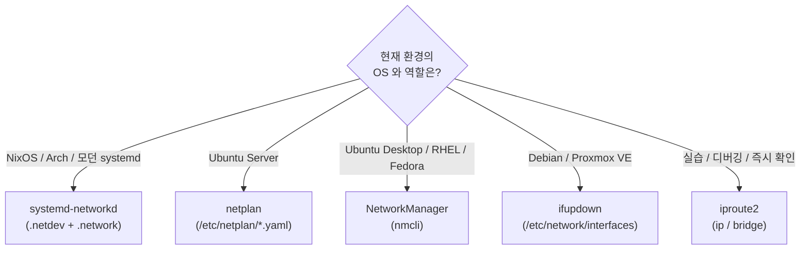

세 가지 기준만 기억해 두면 거의 모든 환경을 커버한다.

- *영속이 필요한가?* 실습이면 iproute2, 영속이면 환경의 기본 도구
- *환경의 기본 도구는 무엇인가?* Ubuntu Server=netplan / RHEL=NetworkManager / NixOS=systemd-networkd / Proxmox=ifupdown
- *서버인가 데스크톱인가?* Ubuntu 의 경우 이 한 줄로 netplan vs NetworkManager 가 결정된다

> [!WARNING]
> **두 구현체 동시 사용 — race condition**
> 한 호스트에 NetworkManager 와 systemd-networkd 가 모두 활성화된 상태에서 같은 인터페이스 (예: `eth0`) 를 두 도구가 모두 관리하려고 하면, 부팅 시 어느 쪽이 먼저 옵션을 적용하는지에 따라 결과가 달라진다. 한 도구가 다른 도구의 설정을 *부분적으로 덮어쓰는* 패턴도 흔하다. 환경의 기본 도구를 한 가지만 두고 다른 도구는 `systemctl disable --now NetworkManager` 같이 명시 비활성화하는 것이 안전하다. NetworkManager 의 `unmanaged-devices=interface-name:eth0` 옵션으로 *특정 인터페이스만* 다른 도구에 양보하는 방법도 있다.

## Linux Bridge VLAN Filtering 내부 메커니즘 🌉

앞 절에서 다섯 가지 구현체가 어떻게 VLAN 인터페이스를 정의하는지 봤다. 이번 절은 그 정의가 적용됐을 때 커널 안에서 실제로 일어나는 일을 본다. Linux Bridge 가 802.1Q 표준을 소프트웨어로 구현하는 방식은 두 단계로 정리된다. 들어오는 프레임의 VID 를 판단하는 단계와, 송출 시 태그를 떼거나 유지하는 단계다.

스위치 포트의 동작은 Linux Bridge 에서도 같은 모델로 재현된다. `bridge` 명령어가 다루는 VLAN Filtering 기능이 802.1Q 스위치를 소프트웨어로 구현한 것이다[^bridge-vlan].

VLAN Filtering 이 켜진 bridge 는 각 포트마다 허용 VLAN 목록, PVID, Egress Untagged 옵션을 따로 가질 수 있다. PVID 는 untagged 로 들어온 프레임에 부착할 VID 다 (access 포트의 PVID 와 같은 개념). Egress Untagged 는 해당 VID 로 나갈 때 태그를 떼라는 설정으로, access 포트의 untagged 출력에 해당한다.

```bash
# bridge VLAN Filtering 활성화
ip link add name vmbr0 type bridge vlan_filtering 1   # ← VLAN aware 로 생성
ip link set vmbr0 up

# trunk 포트: VLAN 10, 20 모두 허용 (태그 유지)
ip link set veth-uplink master vmbr0
bridge vlan add dev veth-uplink vid 10
bridge vlan add dev veth-uplink vid 20

# access 포트: VLAN 10 만, PVID/untagged 동시 설정
ip link set veth-vm1 master vmbr0
bridge vlan add dev veth-vm1 vid 10 pvid untagged     # ← 입장 시 tag 10, 퇴장 시 tag 제거
```

명령 한 줄이 access 와 trunk 포트의 차이를 그대로 모델링한다. `pvid untagged` 가 access 포트, 그 옵션 없이 단순 `vid` 만 부여한 포트가 trunk 다. 동일 bridge 안에서 access 포트와 trunk 포트를 자유롭게 섞을 수 있다.

### 내부 의사결정 흐름

VLAN Filtering 이 켜진 bridge 에 프레임이 들어오면 다음 네 단계를 순서대로 거친다. 결정 지점이 두 곳 있는데, 다이어그램 다음에 각각 풀어 설명한다.

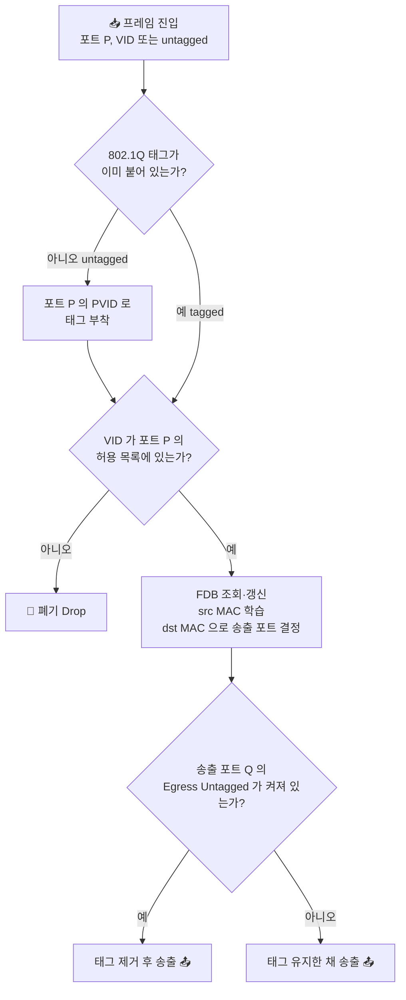

**입장 시 — VID 가 정해진다.** 태그가 없는 프레임은 들어온 포트의 PVID 값으로 태그가 붙는다. 이 시점부터 프레임은 bridge 안에서 항상 VID 를 가진 채로 흐른다. 이미 태그가 붙어 들어온 프레임은 그 VID 가 포트의 허용 목록에 있는지만 확인하고, 없으면 폐기된다.

> [!NOTE]
> **PVID (Port VLAN ID)**
> 각 포트에 설정된 기본 VLAN ID. 태그 없이 들어온 프레임에 자동으로 이 ID 의 태그를 붙인다. Access 포트의 핵심 옵션이다.

**송출 시 — 태그 제거 여부가 정해진다.** 송출 포트의 Egress Untagged 옵션이 켜져 있으면 태그가 떨어지고, 꺼져 있으면 태그가 그대로 유지된다.

> [!NOTE]
> **Egress Untagged**
> 해당 포트로 프레임이 나갈 때 802.1Q 태그를 제거하라는 설정. 일반 호스트가 연결되는 Access 포트에서는 켜둔다. 스위치 사이 Trunk 포트에서는 꺼둔다 (다음 스위치도 VID 정보가 필요하므로).

이 두 결정의 조합이 곧 Access 포트와 Trunk 포트의 구현이다. Access 포트는 두 옵션이 모두 켜진 상태, Trunk 포트는 둘 다 꺼진 상태로 구현된다[^bridge-driver-src].

### FDB — VLAN 인식 학습

FDB (Forwarding Database) 학습은 일반 L2 스위치와 동일하지만, VLAN Filtering 모드에서는 매핑이 `(MAC, VID) → 포트` 의 세 쌍으로 확장된다. 같은 MAC 이 다른 VID 로 등장하면 별도 항목으로 학습되므로, 두 VLAN 사이에서 같은 MAC 이 충돌하지 않는다.

`bridge vlan show` 출력은 이 설정 상태를 검증하는 1차 도구다. 각 포트에 어떤 VID 가 허용되어 있고, PVID 는 무엇인지, Egress Untagged 가 켜져 있는지를 한 번에 보여준다.

```text
$ bridge vlan show dev vmbr0
port              vlan-id
veth-uplink       10
                  20
veth-vm1          10 PVID Egress Untagged   # ← access 포트의 표식
```

`PVID` 표시는 입장 시 부착될 VID 를, `Egress Untagged` 는 퇴장 시 태그를 제거함을 의미한다. Access 포트에는 두 표시가 모두 떠 있어야 하고, Trunk 포트에는 둘 다 없어야 한다.

## VLAN 간 L3 라우팅 🛣️

VLAN 으로 broadcast domain 을 분리하면 L2 레벨에서 두 VLAN 은 서로 보이지 않는다. 서로 통신해야 하는 경우는 L3 (IP) 계층에서 길을 만들어야 한다. 길을 만드는 방식은 세 가지가 흔하다.

### Router on a Stick — 가장 단순한 방식

trunk 포트 하나를 라우터에 연결하고, 라우터가 각 VLAN 의 sub-interface 에 게이트웨이 IP 를 부여해서 VLAN 간 트래픽을 IP 라우팅한다. Linux 호스트에서 한 NIC 에 `eth0.10`, `eth0.20` 같은 VLAN sub-interface 를 만들고 `ip forward` 를 켜는 방식이 같은 모델이다.

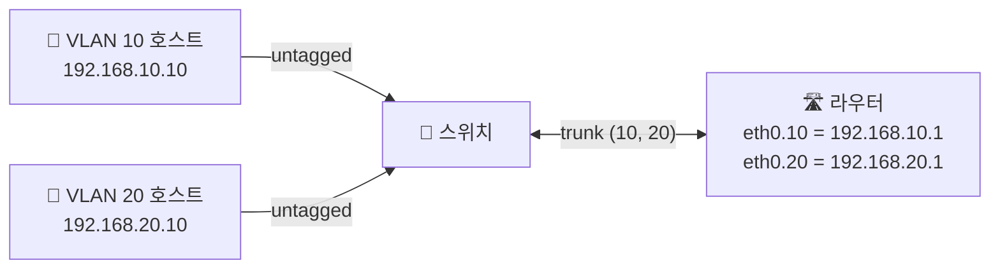

라우터의 sub-interface 가 각 VLAN 의 *기본 게이트웨이* 가 된다. VLAN 10 호스트가 VLAN 20 호스트로 보낸 IP 패킷은 게이트웨이 (`192.168.10.1`) 로 향하고, 라우터가 routing table 을 보고 `eth0.20` 으로 다시 내보낸다. 한 케이블 (trunk) 위에서 양방향 트래픽이 모두 처리되므로 *Router on a Stick* 이라 부른다.

### L3 Switch — 하드웨어 라우팅

L3 switch 는 같은 작업을 하드웨어로 수행한다. 스위치 칩 안에 라우팅 테이블을 함께 두어 VLAN 간 forwarding 을 wire-speed 로 처리한다. 각 VLAN 마다 *SVI (Switched Virtual Interface)* 를 정의하고 이 인터페이스에 게이트웨이 IP 를 부여한다.

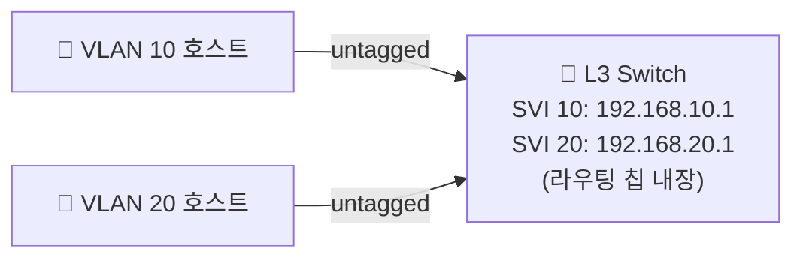

라우터를 별도로 두지 않으므로 trunk 케이블 한 단계가 사라진다. 패킷이 스위치 내부에서 ASIC 으로 직접 라우팅되어 latency 와 throughput 모두 Router-on-a-Stick 대비 우수하다. 데이터센터 leaf/spine 토폴로지에서 일반적인 선택이다.

### 방화벽 (OPNsense / pfSense) — 통제 단위가 같이 따라옴

홈랩에서는 OPNsense 나 pfSense 같은 소프트웨어 방화벽이 같은 역할을 한다. trunk NIC 하나를 받아 각 VLAN 의 게이트웨이로 동작하면서, 방화벽 규칙으로 어떤 VLAN 이 어떤 VLAN 에 어느 포트로 접근 가능한지를 동시에 정의한다.

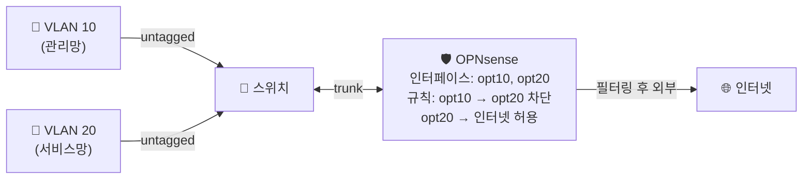

방화벽이 라우터 역할을 겸하면서 VLAN 간 *접근 통제* 까지 한 곳에서 정의된다. 홈랩에서는 침해 확산을 차단하는 데 가장 자주 채택되는 방식이다.

### 세 방식 비교

| 방식 | 처리 위치 | 통제 단위 | 대표 사용처 | 장점 | 단점 |
|---|---|---|---|---|---|
| Router on a Stick | 소프트웨어 라우터 | IP / 포트 ACL | 소규모 사무실, 실습 | 구현 단순, 저비용 | trunk 가 병목 |
| L3 switch | 스위치 ASIC | VLAN interface ACL | 데이터센터, 캠퍼스 네트워크 | wire-speed, 낮은 latency | 하드웨어 비용 |
| 방화벽 (OPNsense 등) | 소프트웨어 방화벽 | 상태 기반 (stateful) 규칙 | 홈랩, DMZ 분리, SOHO | 통제·라우팅 한 곳 | 처리량 한계 |

VLAN 간 모든 통신을 허용하면 격리의 의미가 사라진다. 방화벽 규칙에서 기본 정책을 deny 로 두고 필요한 흐름만 명시 허용하는 *default-deny* 가 표준이다[^nftables].

## VLAN 보안 함정 — Hopping 과 Private VLAN 🛡️

L3 라우팅 절에서는 격리를 *방화벽으로 강제* 하는 방향을 봤다. 이번 절은 반대로 *잘못된 설정 한 줄이 격리 자체를 무력화하는* 방향을 본다. 같은 VLAN 인프라라도 어디서 어떤 함정에 빠질 수 있는지가 핵심이다.

VLAN 격리는 어디까지나 *L2 격리* 다. 대표적인 공격이 VLAN hopping 이다[^vlan-hopping].

### Switch Spoofing — DTP 협상 악용

공격자가 자기 포트를 trunk 로 협상시켜 모든 VLAN 의 프레임을 받는 공격이다. Cisco 의 DTP (Dynamic Trunking Protocol) 가 켜진 access 포트에 공격자가 trunk negotiation 패킷을 보내면 포트가 자동으로 trunk 로 전환된다. 방어는 단순하다 — access 포트에서 DTP 를 끄고 `switchport mode access` 로 고정한다.

### Double Tagging — Native VLAN 의 untagged 처리 악용

802.1Q 헤더를 두 겹으로 부착해서 native VLAN 의 untagged 처리를 악용하는 공격이다. 공격자는 outer tag 를 자신의 native VLAN (보통 VLAN 1), inner tag 를 target VLAN 으로 둔다. 공격 흐름을 시퀀스로 보면 다음과 같다.

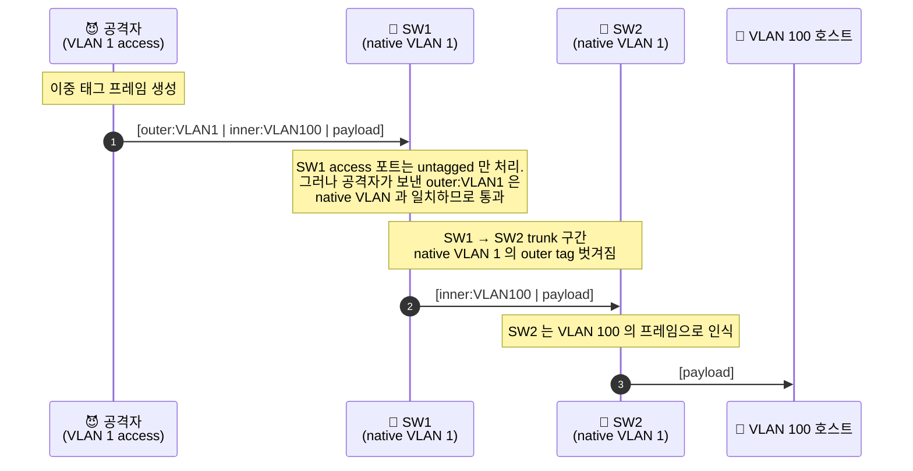

핵심은 *SW1 → SW2 trunk 구간에서 native VLAN 1 의 outer tag 가 벗겨지는 한 단계* 다. 이 한 단계가 inner tag 만 남은 VLAN 100 프레임을 만든다. 방어는 두 가지다.

- 사용자 포트의 VLAN 을 native VLAN 과 *다르게* 둔다 (예: native VLAN 을 사용하지 않는 999 로 옮긴다)
- trunk 에서 native VLAN 의 *강제 태깅* (`vlan dot1q tag native`) 을 활성화하여 untagged 처리 자체를 없앤다

### Private VLAN (PVLAN) — 같은 VLAN 안에서의 추가 격리

같은 VLAN 안에서도 호스트 간 통신을 추가 격리하는 확장이다[^rfc5517]. 한 VLAN 을 primary 와 secondary 로 나누고, secondary 는 다시 isolated 와 community 로 구분된다. 관계를 그림으로 정리하면 다음과 같다.

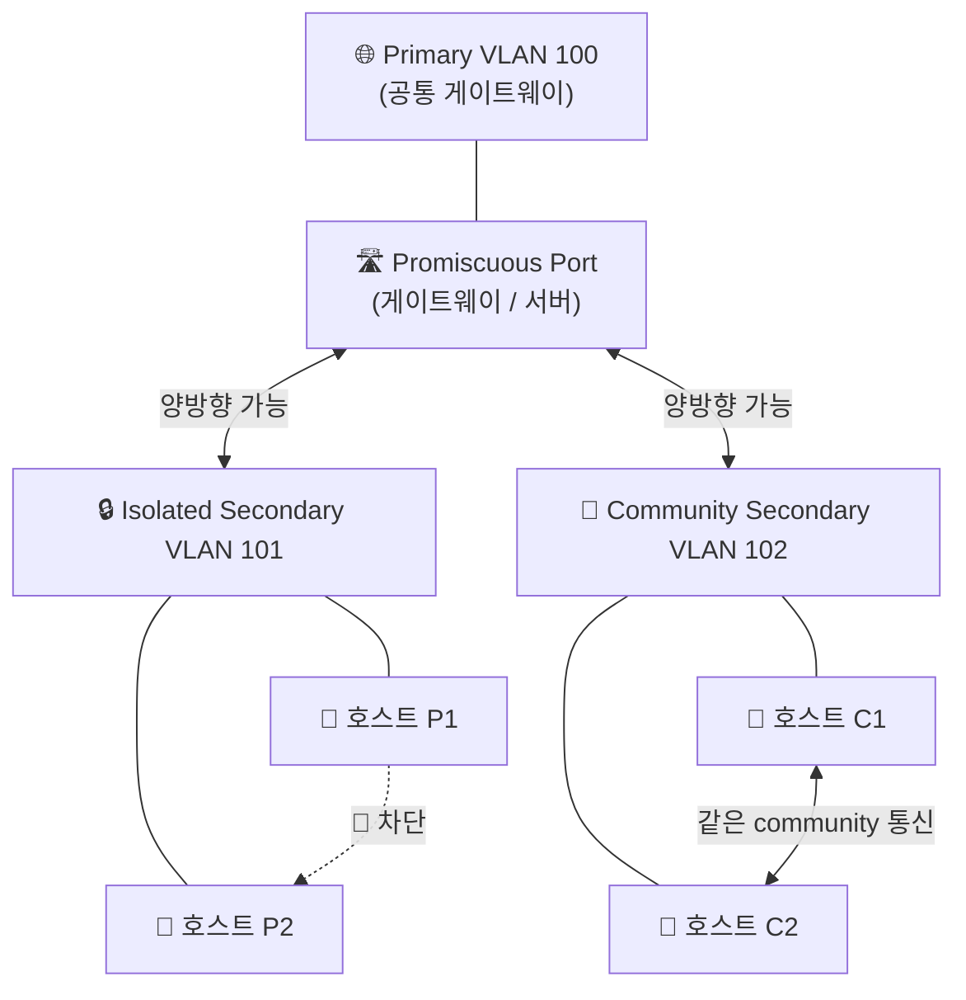

세 종류의 포트가 따르는 통신 규칙은 다음과 같다.

| 포트 유형 | 같은 종류 포트와 통신 | Promiscuous 와 통신 | 다른 secondary 와 통신 |
|---|---|---|---|
| Isolated | 🚫 차단 | ✅ 양방향 | 🚫 차단 |
| Community (같은 VID) | ✅ 가능 | ✅ 양방향 | 🚫 차단 |
| Promiscuous | ✅ 가능 | — | ✅ 양방향 (모든 secondary) |

isolated 포트는 같은 isolated 포트끼리도 통신 불가능하고, promiscuous 포트와만 통신한다. community 포트는 같은 community 안에서는 통신 가능하지만 다른 community 와는 차단된다. 호텔의 같은 층 객실들이 같은 네트워크 세그먼트를 공유하면서도 객실 사이는 격리되어야 하는 시나리오가 PVLAN 의 전형적인 사용 사례다.

> [!IMPORTANT]
> **Voice VLAN 의 데이터 분리**
> IP 전화기에 사용되는 Voice VLAN 은 같은 access 포트에서 데이터 트래픽 (untagged) 과 음성 트래픽 (tagged) 을 함께 전달하는 변형이다. 전화기 뒤에 PC 를 daisy-chain 연결하면 PC 의 데이터는 PVID, 전화기의 음성은 voice VLAN 태그로 분리된다. QoS 마킹 (PCP) 도 voice VLAN 에서 별도 설정한다.

# How? 실습 — Vagrant 와 Multipass 로 VLAN 구성 검증 🧪

본문에서 정리한 세 겹을 명령어로 직접 확인해 본다. 물리 홈랩에 바로 적용하기 전에 격리된 VM 환경에서 한 번 재현해 두면 두 가지 이점이 있다.

- 옵션 이름 오타나 인터페이스 이름 실수를 사전에 잡을 수 있다
- 실패해도 VM 한 줄로 모든 상태가 깨끗이 초기화된다

## 검증 전략 — 다섯 단계로 외부 흐름·구현체·내부 메커니즘을 검증 🎯

다음 표는 본문의 어느 주장을 어떤 명령으로 검증하는지를 단계별로 정리한 것이다. 실습은 이 순서를 따른다. 카테고리 열은 앞서 *들어가며* 에서 정리한 세 겹 (외부·구현체·내부) 중 어디에 해당하는지를 표시한다.

| 단계 | 카테고리 | 검증 대상 | 명령 | 기대 결과 |
|---|---|---|---|---|
| 1 | 구현체 | 브리지·VLAN 인터페이스가 커널에 등록됨 | `ip -br link show` | `br0`, `vm-a-tap`, `vm-b-tap` 등장 |
| 2 | 외부 | bridge 가 VLAN aware 모드로 동작 | `ip -d link show br0` | 출력에 `vlan_filtering 1` |
| 3 | 구현체 | bridge 포트가 의도한 PVID·Egress Untagged 상태 | `bridge vlan show dev br0` | Access 포트에 `PVID Egress Untagged` |
| 4 | 내부 | L2 격리 동작 (다른 VLAN 호스트 도달 불가) | `ip netns exec vm-a ping <vm-b>` | `Destination Host Unreachable` |
| 5 | 외부 | 실제 프레임에 802.1Q 헤더 부착 | `tcpdump -e -i vm-a-tap -nn vlan 10` | `ethertype 802.1Q (0x8100), vlan 10` |

다섯 단계가 끝나면 외부에서 보이는 태그 (단계 5), 구현체 옵션 (단계 1·3), 커널의 격리 동작 (단계 4) 이 모두 확인된다. 실습 1 은 단계 1-3 을, 실습 2 는 단계 4-5 를, 실습 3 은 트러블슈팅 명령을 다룬다.

## 실습 환경 — Vagrant 와 Multipass 둘 중 하나 🛠️

두 가상 호스트와 한 VLAN-aware bridge 를 시뮬레이션하기 위해 단일 VM 안에서 *network namespace 두 개 + veth + bridge* 구성을 만든다. namespace 가 두 호스트를, veth 가 두 호스트의 NIC 를, bridge 가 VLAN-aware 스위치를 대신한다. 외부 라우터나 추가 NIC 없이 단일 호스트에서 VLAN 동작을 완전히 재현할 수 있다.

VM 자체는 Vagrant 또는 Multipass 둘 중 익숙한 쪽을 쓰면 된다.

| 환경 | 장점 | 단점 | 적합한 사용자 |
|---|---|---|---|
| Vagrant[^vagrant-multimachine] | provisioning 코드가 Vagrantfile 한 파일에 영속, multi-machine 지원 | VirtualBox/libvirt 사전 설치 필요 | 실습 환경을 코드로 재현하고 싶은 경우 |
| Multipass[^multipass-docs] | 명령 한 줄로 Ubuntu VM 부팅, cloud-init 지원, Mac/Win 모두 동일 | provisioning 은 별도 cloud-init YAML | 빠르게 한 번만 띄우고 싶은 경우 |

### Vagrantfile 한 줄 부팅

```ruby
# Vagrantfile
Vagrant.configure("2") do |config|
    config.vm.box = "ubuntu/jammy64"
    config.vm.hostname = "vlan-lab"
    config.vm.provider "virtualbox" do |vb|
        vb.memory = 2048
        vb.cpus = 2
    end
    config.vm.provision "shell", inline: <<-SHELL
        apt-get update -y
        apt-get install -y iproute2 bridge-utils tcpdump iputils-ping
    SHELL
end
```

```bash
vagrant up
vagrant ssh
```

### Multipass 한 줄 부팅

```bash
multipass launch --name vlan-lab --cpus 2 --memory 2G 22.04
multipass exec vlan-lab -- sudo apt-get update -y
multipass exec vlan-lab -- sudo apt-get install -y \
    iproute2 bridge-utils tcpdump iputils-ping
multipass shell vlan-lab
```

VM 안에 들어오면 두 환경에서 이후 명령은 동일하다.

## 실습 1 — 두 가상 호스트에 VLAN 10 할당 (단계 1-3) 🟢

**입력 상태** — VM 에 막 들어왔고, bridge 와 namespace 는 아직 없다.

**1단계 — VLAN-aware bridge 와 veth pair 생성.** VLAN-aware bridge 는 `vlan_filtering 1` 옵션으로 만든다. 두 namespace 의 NIC 와 bridge 를 잇는 veth 두 쌍을 함께 만든다.

```bash
# VLAN-aware bridge
sudo ip link add name br0 type bridge vlan_filtering 1   # ← 802.1Q 인식 활성화
sudo ip link set br0 up

# 두 namespace 와 veth pair 두 쌍
sudo ip netns add vm-a
sudo ip netns add vm-b
sudo ip link add vm-a-veth type veth peer name vm-a-tap   # ← namespace 쪽 / bridge 쪽
sudo ip link add vm-b-veth type veth peer name vm-b-tap
```

**2단계 — veth 한 끝은 namespace 에, 반대 끝은 bridge 에.** namespace 안 인터페이스에는 같은 서브넷 IP 를 부여한다.

```bash
# veth 한 끝을 namespace 로
sudo ip link set vm-a-veth netns vm-a
sudo ip link set vm-b-veth netns vm-b

# 반대 끝을 bridge 에 attach
sudo ip link set vm-a-tap master br0
sudo ip link set vm-b-tap master br0
sudo ip link set vm-a-tap up
sudo ip link set vm-b-tap up

# namespace 안 인터페이스 활성화 + IP 부여
sudo ip netns exec vm-a ip link set lo up
sudo ip netns exec vm-b ip link set lo up
sudo ip netns exec vm-a ip link set vm-a-veth up
sudo ip netns exec vm-b ip link set vm-b-veth up
sudo ip netns exec vm-a ip addr add 192.168.10.10/24 dev vm-a-veth
sudo ip netns exec vm-b ip addr add 192.168.10.11/24 dev vm-b-veth
```

**3단계 — bridge 포트를 VLAN 10 access 모드로.** 두 tap 포트를 모두 VLAN 10 의 access 포트로 설정한다.

```bash
sudo bridge vlan add dev vm-a-tap vid 10 pvid untagged   # ← 입장 PVID + 퇴장 untagged
sudo bridge vlan add dev vm-b-tap vid 10 pvid untagged
```

**출력 상태 검증** — 검증 전략 표의 단계 1·2·3 을 차례로 확인한다.

```bash
ip -br link show   # ← 단계 1
# br0  ... UP ...
# vm-a-tap@if<N> ... master br0 ...
# vm-b-tap@if<N> ... master br0 ...

ip -d link show br0 | grep vlan_filtering   # ← 단계 2
# bridge ... vlan_filtering 1 ...

bridge vlan show dev br0   # ← 단계 3
# port              vlan-id
# vm-a-tap          10 PVID Egress Untagged
# vm-b-tap          10 PVID Egress Untagged
```

이 상태는 본문 *Access 포트의 정의* 와 정확히 일치한다. 같은 VLAN 안의 두 호스트가 정상 통신 가능한지 마지막으로 확인한다.

```bash
sudo ip netns exec vm-a ping -c 3 192.168.10.11
# 64 bytes from 192.168.10.11: ... time=0.054 ms
```

같은 VLAN 안에서 두 호스트가 통신 가능함이 확인됐다. 다음 실습에서는 한 호스트를 다른 VLAN 으로 옮겨 격리를 검증한다.

## 실습 2 — VLAN 격리와 프레임 태그 관찰 (단계 4-5) 🔴

**입력 상태** — 실습 1 의 결과 (vm-a 와 vm-b 모두 VLAN 10 access 포트).

**4단계 — vm-b 를 VLAN 20 으로 옮긴다.** access 포트의 VLAN 만 바꾼다. 같은 서브넷 IP 를 그대로 두면 L3 는 같은 네트워크이지만 L2 가 다른 VLAN 이므로 도달 불가능해야 한다.

```bash
# vm-b 를 VLAN 10 access → VLAN 20 access 로
sudo bridge vlan del dev vm-b-tap vid 10
sudo bridge vlan add dev vm-b-tap vid 20 pvid untagged

# 검증 (단계 4)
sudo ip netns exec vm-a ping -c 3 192.168.10.11
# From 192.168.10.10 icmp_seq=1 Destination Host Unreachable
```

L2 격리가 동작했음이 확인된다. ping 이 응답을 받지 못한 이유는 VLAN 10 의 ARP request 가 VLAN 20 의 vm-b 에 도달하지 못했기 때문이다.

**5단계 — 실제 프레임의 802.1Q 태그를 직접 본다.** vm-a 의 tap 포트를 trunk 로 바꿔서 태그가 유지된 채로 송출되도록 만들고, tcpdump 로 헤더를 캡처한다.

```bash
# vm-a-tap 을 trunk 로 변환 (PVID untagged 해제, VID 10 tagged 유지)
sudo bridge vlan del dev vm-a-tap vid 10
sudo bridge vlan add dev vm-a-tap vid 10

# 백그라운드로 tcpdump (단계 5)
sudo tcpdump -e -i vm-a-tap -nn vlan 10 -c 3 &

# vm-a 에서 같은 VLAN 10 의 자기 자신에게 ping
sudo ip netns exec vm-a ping -c 3 192.168.10.10
# ... ethertype 802.1Q (0x8100), vlan 10, p 0, ethertype IPv4, 192.168.10.10 > 192.168.10.10: ICMP echo ...
```

이더넷 헤더 직후 `0x8100` (TPID) 가 등장하고, 그 뒤 `vlan 10` 으로 VID 가 표시된다. 802.1Q 표준의 4바이트 태그가 프레임에 실제로 부착되어 흐른다는 점이 명령어 한 줄로 확인된다.

## 실습 3 — 트러블슈팅 명령어 🔍

VLAN 환경의 트러블슈팅은 L2 부터 거꾸로 올라가며 진행한다. ARP 해소가 되는지부터 확인하고, 그 다음 bridge 의 VLAN 필터링 상태, 마지막으로 systemd-networkd (또는 환경의 기본 도구) 의 인터페이스 상태를 본다.

### ARP 검증

ARP 는 IP 주소에 대응하는 MAC 주소를 찾는 L2 프로토콜이다. `ip neigh` 가 캐시된 이웃 정보를 보여주며, `REACHABLE` 이면 L2 연결이 정상, `INCOMPLETE` 이면 VLAN 설정이나 veth 경로 어딘가가 끊어진 상태다.

```bash
# 호스트 전체 ARP 테이블
ip neigh show

# 특정 namespace 의 ARP 테이블
sudo ip netns exec vm-a ip neigh show
```

`INCOMPLETE` 가 떴다면 같은 VLAN 안에서 ARP request 가 회신되지 않는다는 뜻이다. VID 가 양 끝의 bridge 에서 모두 허용되어 있는지, 양 끝의 PVID 가 의도한 값과 일치하는지부터 의심한다.

### Bridge VLAN Filtering 상태

`bridge vlan show` 는 각 포트에 어떤 VID 가 허용되어 있고 PVID, Egress Untagged 가 어떻게 설정되어 있는지를 한 번에 보여준다.

```bash
sudo bridge vlan show dev br0

# 특정 포트만 추출
sudo bridge vlan show | grep -E '(vm-a|vm-b)'
```

`PVID` 표시는 입장 시 부착될 VID 를, `Egress Untagged` 는 퇴장 시 태그를 제거함을 의미한다. Access 포트에는 두 표시가 모두 떠 있어야 하고, Trunk 포트에는 둘 다 없어야 한다.

### Bridge FDB

FDB 는 bridge 가 학습한 MAC → 포트 매핑이다. 통신이 안 될 때 상대 MAC 이 FDB 에 학습되어 있는지 확인하면, 프레임이 bridge 까지 도달했는지가 곧장 확인된다.

```bash
sudo bridge fdb show br br0

# 특정 VLAN 만
sudo bridge fdb show br br0 | grep "vlan 10"
```

상대 MAC 이 FDB 에 보이지 않으면 프레임 자체가 bridge 에 들어오지 못한 것이다. veth 경로, 물리 NIC 의 link state, VLAN 허용 목록 순으로 거슬러 올라간다.

### systemd-networkd 또는 환경의 기본 도구

선언적 설정이 실제로 활성화되었는지는 환경의 기본 도구로 확인한다. systemd-networkd 환경이라면 `networkctl`, netplan 환경이라면 `netplan get`, NetworkManager 환경이라면 `nmcli connection show`, ifupdown 환경이라면 `ifquery --list` 다.

```bash
# systemd-networkd
networkctl status
networkctl status vlan10 vlan20

# netplan (Ubuntu Server)
sudo netplan get

# NetworkManager (RHEL/Fedora/Ubuntu Desktop)
nmcli connection show
nmcli connection show vlan10

# ifupdown (Debian/Proxmox VE)
ifquery --list
cat /etc/network/interfaces
```

`routable` 또는 `connected` 상태이면 IP 가 부여되고 라우팅 가능한 상태다. `degraded`, `carrier`, `unavailable` 같은 상태이면 link 는 있으나 IP 가 없거나 의존 인터페이스가 아직 활성화되지 않은 상태다.

# Remark

본문에서 다룬 VLAN 의 핵심 개념을 본문 H2 순서대로 한 표로 요약한다.

| 개념 | 요지 | 본문 H2 |
|---|---|---|
| 빌딩 블록 | namespace / veth / bridge — VLAN 의 토대 | 가상 네트워크의 빌딩 블록 |
| 802.1Q 태그 | EtherType `0x8100` + 12비트 VID + 3비트 PCP | VLAN 의 등장과 802.1Q 표준 |
| Access / Trunk / Native | 포트 모드별 태그 부착·유지·제거 정책 | 프레임의 라이프사이클 |
| 다섯 구현체 | iproute2 / systemd-networkd / netplan / NetworkManager / ifupdown | 구현체 비교 |
| Linux Bridge VLAN Filtering | 입장 PVID + 송출 Egress Untagged 두 결정 | 내부 메커니즘 |
| FDB 학습 | `(MAC, VID) → 포트` 세 쌍 매핑 | 내부 메커니즘 |
| L3 라우팅 | Router on a Stick / L3 switch / 방화벽 | VLAN 간 L3 라우팅 |
| 보안 함정 | DTP 협상 / Double Tagging / Private VLAN | 보안 함정 |

홈랩에서 가장 자주 만난 문제는 두 가지였다. 하나는 systemd-networkd 의 VLAN 정의에서 `.netdev` 의 `Kind=vlan` 과 `.network` 의 `VLAN=` 매핑이 어긋나서 bridge 가 VLAN 을 인식하지 못한 경우다. 다른 하나는 `vlan_filtering 1` 옵션을 빠뜨려 bridge 가 모든 태그를 그대로 통과시키면서 격리가 사라진 경우다. 두 경우 모두 `bridge vlan show` 한 줄의 출력 차이로 즉시 구분된다 — VID 목록이 비어 있으면 filtering 이 꺼진 상태고, 의도한 VID 가 없으면 정의가 누락된 상태다.

구현체를 다섯 가지로 정리해 보니, 결국 모두 같은 커널 객체를 다른 문법으로 만든다는 점이 명확해졌다. 새 환경에 들어가면 그 환경의 기본 도구 한 가지만 골라서 영속화하고, 실습이나 디버깅 시점에만 iproute2 로 즉시 검증하는 패턴이 일관적으로 안정적이었다. 두 도구를 동시에 사용해 `NetworkManager` 와 `systemd-networkd` 가 같은 인터페이스를 두고 race 를 일으킨 경우는 트러블슈팅이 가장 까다로웠던 경험이다.

이 글이 다루지 않은 인접 주제로는 VXLAN (L3 위에서 L2 를 터널링하는 데이터센터 표준), MVRP (스위치 사이 VLAN 정보 자동 동기화 프로토콜), GENEVE 같은 overlay 네트워크가 있다. 실제 NixOS 환경에서 위 개념을 어떻게 `systemd.network` 모듈과 nftables 규칙으로 구성하는지는 *구현편* (`About NixOS Homelab — VLAN 분리`) 으로 이어진다.

# Reference

[^ieee-8021q]: <https://standards.ieee.org/ieee/802.1Q/> — IEEE 802.1Q VLAN 표준. 프레임 포맷 (TPID/TCI), VID 범위, native VLAN 정의.

[^bridge-doc]: <https://www.kernel.org/doc/html/latest/networking/bridge.html> — Linux Bridge 커널 문서. FDB 학습, STP, VLAN Filtering 동작.

[^bridge-vlan]: <https://man7.org/linux/man-pages/man8/bridge.8.html> — `bridge(8)` 매뉴얼. `bridge vlan add/show` 의 `pvid`, `untagged` 옵션 의미.

[^bridge-driver-src]: <https://github.com/torvalds/linux/blob/master/net/bridge/br_vlan.c> — Linux kernel bridge VLAN driver 소스. `br_handle_ingress_vlan_tag`, `br_handle_vlan` 함수에서 PVID 부착과 Egress Untagged 처리.

[^systemd-network]: <https://www.freedesktop.org/software/systemd/man/systemd.network.html> — `systemd.network(5)`. `.netdev` 의 `Kind=vlan` / `Kind=bridge` 및 `.network` 의 `VLAN=`, `Bridge=` 키.

[^netplan-vlan]: <https://netplan.readthedocs.io/en/stable/netplan-yaml/#properties-for-device-type-vlans> — Netplan VLAN 정의. `link`, `id`, `addresses` 키와 백엔드 (`renderer`) 선택.

[^nmcli-vlan]: <https://networkmanager.dev/docs/api/latest/nm-settings-nmcli.html> — `nmcli(1)` connection 설정. `type vlan` 의 `vlan.parent`, `vlan.id` 속성.

[^proxmox-vlan]: <https://pve.proxmox.com/wiki/Network_Configuration#_vlan_802_1q> — Proxmox VE VLAN 설정. VLAN-aware bridge 와 VLAN sub-interface 두 방식.

[^vlan-hopping]: <https://www.cisco.com/c/en/us/support/docs/lan-switching/8021q/10554-76.html> — Cisco VLAN Security White Paper. Switch Spoofing 과 Double Tagging 의 메커니즘과 완화책.

[^rfc5517]: <https://datatracker.ietf.org/doc/html/rfc5517> — Cisco Systems' Private VLANs. primary / isolated / community 구분 정의.

[^nftables]: <https://wiki.nftables.org/wiki-nftables/index.php/Main_Page> — nftables 공식 위키. VLAN 간 통신을 통제할 때 사용되는 패킷 필터.

[^vagrant-multimachine]: <https://developer.hashicorp.com/vagrant/docs/multi-machine> — Vagrant Multi-Machine 가이드. 한 Vagrantfile 안에 여러 VM 정의.

[^multipass-docs]: <https://multipass.run/docs> — Multipass 공식 문서. `launch`, `exec`, `shell` 명령어와 cloud-init 통합.
ㅎ