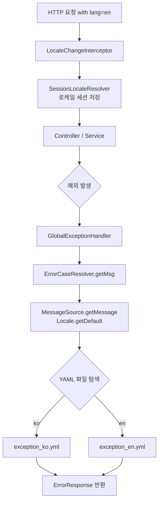

# Why(What For?) 🤷‍♂️

서비스가 다국어 사용자를 대상으로 할 때, 예외 메시지까지 사용자 언어에 맞게 반환되어야 일관된 UX를 제공할 수 있다. 보통 다국어 처리는 프론트엔드에서 담당하지만, 백엔드 예외 메시지 또한 `Accept-Language` 혹은 쿼리 파라미터 기반으로 국제화할 수 있다.[^1] 본 글은 Spring `MessageSource`와 YAML 리소스 번들을 조합하여 예외 메시지를 국제화하는 구체적인 방법을 다룬다.

> 모든 소스코드는 [해당 깃허브](https://github.com/sparta-nullnull/otil)를 참고하면 된다.

# 의존성과 리소스 파일 구성 📦

## build.gradle 의존성을 추가해야 하는 이유

Spring의 기본 `MessageSource`는 `.properties` 파일만 읽는다. YAML 형식으로 메시지를 관리하려면 `yaml-resource-bundle` 라이브러리가 필요하다.[^2]

```java
/* Message Source */
implementation 'net.rakugakibox.util:yaml-resource-bundle:1.2'
```

## 언어별 YAML 파일을 분리해야 하는 이유

Spring은 `basename_언어코드.yml` 규칙으로 파일을 탐색한다. 영어(`_en`)와 한국어(`_ko`)를 분리하여 로케일별 메시지를 관리한다.[^3]

<details>
<summary>**`exception_en.yml`**</summary>

```yaml
# Common
unKnown:
  code: "-9000"
  msg: "An unknown error occurred."
  status: "404"
communicationError:
  code: "-9001"
  msg: "An error occurred during communication."
  status: "404"
dataError:
  code: "-9002"
  msg: "Data error occurred due to incorrect format."
  status: "400"

# User
userNotFound:
  code: "-1100"
  msg: "User not found."
  status: "404"
incorrectAccountIdOrPassword:
  code: "-1101"
  msg: "The account id or password is incorrect."
  status: "404"
entryPointException:
  code: "-1102"
  msg: "Permission is not granted to access this resource."
  status: "403"
accessDenied:
  code: "-1103"
  msg: "Access to the resource is denied with current permissions."
  status: "403"
existingUser:
  code: "-1105"
  msg: "The user is already registered. Please log in."
  status: "403"
requiresLogin:
  code: "-1106"
  msg: "Login is required for this request. Please log in."
  status: "403"
requiresLoggedOut:
  code: "-1107"
  msg: "Logout is required for this request. If you are already logged in, please logout."
  status: "403"
accountIdValidationFail:
  code: "-1108"
  msg: "Account ID should be a combination of numbers and lowercase/uppercase letters."
  status: "400"
duplicatedAccountId:
  code: "-1109"
  msg: "The account ID is already in use by another user. Please choose a different one."
  status: "400"
passwordValidationFail:
  code: "-1110"
  msg: "Password should be a combination of uppercase/lowercase letters, numbers, and special characters."
  status: "400"
nickNameValidationFail:
  code: "-1111"
  msg: "Nickname should be a combination of uppercase/lowercase letters and numbers."
  status: "400"
emailValidationFail:
  code: "-1112"
  msg: "Email should be in the format \"~~~@~~~.~~~\"."
  status: "400"
invalidAdminKey:
  code: "-1113"
  msg: "The admin authorization key does not match."
  status: "403"

# Post
notFoundPost:
  code: "-2100"
  msg: "The requested post does not exist."
  status: "404"
duplicatedPost:
  code: "-2101"
  msg: "A post for the request already exists."
  status: "409"
notAuthorOfPost:
  code: "-2103"
  msg: "You are not the owner of this post."
  status: "400"

# Comment
notFoundComment:
  code: "-3100"
  msg: "The requested comment does not exist."
  status: "404"
duplicatedComment:
  code: "-3101"
  msg: "A comment for the request already exists."
  status: "409"
notAuthorOfComment:
  code: "-3103"
  msg: "You are not the owner of this comment."
  status: "400"
inappropriateComment:
  code: "-3104"
  msg: "The comment is inappropriate."
  status: "400"

# Category
notFoundCategory:
  code: "-4100"
  msg: "The requested category does not exist."
  status: "404"
duplicatedCategory:
  code: "-4101"
  msg: "A category for the request already exists."
  status: "409"
notAuthorOfCategory:
  code: "-4103"
  msg: "You are not the owner of this category."
  status: "400"
inappropriateCategory:
  code: "-4104"
  msg: "The category is inappropriate."
  status: "400"
```

</details>

<details>
<summary>**`exception_ko.yml`**</summary>

```yaml
# Common
unKnown:
  code: "-9000"
  msg: "알수 없는 오류가 발생하였습니다."
  status: "404"
communicationError:
  code: "-9001"
  msg: "통신 중 오류가 발생하였습니다."
  status: "404"
dataError:
  code: "-9002"
  msg: "형식에 맞지 않는 데이터 오류가 발생하였습니다."
  status: "400"

# User
userNotFound:
  code: "-1100"
  msg: "존재하지 않는 회원입니다."
  status: "404"
incorrectAccountIdOrPassword:
  code: "-1101"
  msg: "계정 아이디 또는 비밀번호가 정확하지 않습니다."
  status: "404"
entryPointException:
  code: "-1102"
  msg: "해당 리소스에 접근하기 위한 권한이 없습니다."
  status: "403"
accessDenied:
  code: "-1103"
  msg: "보유한 권한으로 접근할수 없는 리소스 입니다."
  status: "403"
existingUser:
  code: "-1105"
  msg: "이미 가입한 회원입니다. 로그인을 해주십시오."
  status: "403"
requiresLogin:
  code: "-1106"
  msg: "로그인이 필요한 요청입니다. 로그인을 해주십시오."
  status: "403"
requiresLoggedOut:
  code: "-1107"
  msg: "로그아웃이 필요한 요청입니다. 이미 로그인을 하셨다면 로그아웃을 해주세요."
  status: "403"
accountIdValidationFail:
  code: "-1108"
  msg: "계정아이디는 숫자와 영대소문자 조합으로 작성해주세요."
  status: "400"
duplicatedAccountId:
  code: "-1109"
  msg: "이미 다른 회원이 사용하고 계시는 계정아이디입니다. 다시 입력해주세요."
  status: "400"
passwordValidationFail:
  code: "-1110"
  msg: "비밀번호는 영대소문자,숫자와 특수문자의 조합으로 작성해주세요."
  status: "400"
nickNameValidationFail:
  code: "-1111"
  msg: "닉네임은 영대소문자와 숫자의 조합으로 작성해주세요."
  status: "400"
emailValidationFail:
  code: "-1112"
  msg: "이메일은 \"~~~@~~~.~~~\"형식으로 작성해주세요."
  status: "400"
invalidAdminKey:
  code: "-1113"
  msg: "어드민 권한 획득 키값과 일치하지 않습니다."
  status: "403"

# Post
notFoundPost:
  code: "-2100"
  msg: "해당 게시글은 존재하지 않습니다."
  status: "404"
duplicatedPost:
  code: "-2101"
  msg: "요청에 대한 게시글이 기존에 이미 존재합니다."
  status: "409"
notAuthorOfPost:
  code: "-2103"
  msg: "해당 게시글의 소유주가 아닙니다."
  status: "400"

# Comment
notFoundComment:
  code: "-3100"
  msg: "해당 댓글은 존재하지 않습니다."
  status: "404"
duplicatedComment:
  code: "-3101"
  msg: "요청에 대한 댓글이 기존에 이미 존재합니다."
  status: "409"
notAuthorOfComment:
  code: "-3103"
  msg: "해당 댓글의 소유주가 아닙니다."
  status: "400"
inappropriateComment:
  code: "-3104"
  msg: "부적절한 댓글입니다."
  status: "400"

# Category
notFoundCategory:
  code: "-4100"
  msg: "해당 카테고리는 존재하지 않습니다."
  status: "404"
duplicatedCategory:
  code: "-4101"
  msg: "요청에 대한 카테고리는 기존에 이미 존재합니다."
  status: "409"
notAuthorOfCategory:
  code: "-4103"
  msg: "해당 카테고리의 소유주가 아닙니다."
  status: "400"
inappropriateCategory:
  code: "-4104"
  msg: "부적절한 카테고리입니다."
  status: "400"
```

</details>

# MessageSource 설정 ⚙️

## application.yml 경로를 지정해야 하는 이유

Spring이 `MessageSource` 빈을 자동 구성할 때 `basename` 경로를 기준으로 리소스 번들을 탐색한다. 경로가 잘못되면 모든 메시지 조회가 실패하므로 반드시 정확히 지정해야 한다.[^4]

```yaml
spring:
  messages:
    basename: message/messages
    encoding: UTF-8
    fallbackToSystemLocale: false
    alwaysUseMessageFormat: true
```

## MessageSourceConfig를 별도로 작성해야 하는 이유

기본 `MessageSource`는 `.properties` 파일을 파싱한다. YAML을 읽으려면 `YamlResourceBundle.Control`을 사용하는 커스텀 `ResourceBundleMessageSource`를 빈으로 등록해야 한다. 또한 `LocaleChangeInterceptor`를 통해 요청 파라미터 `lang`으로 로케일을 동적으로 전환할 수 있다.[^5]

```java
package com.spartanullnull.otil.config;

import java.util.*;
import net.rakugakibox.util.*;
import org.springframework.beans.factory.annotation.*;
import org.springframework.context.*;
import org.springframework.context.annotation.*;
import org.springframework.context.support.*;
import org.springframework.web.servlet.*;
import org.springframework.web.servlet.config.annotation.*;
import org.springframework.web.servlet.i18n.*;

@Configuration
public class MessageSourceConfig implements WebMvcConfigurer {

    @Bean // 세션에 지역설정. default는 KOREAN = 'ko'
    public LocaleResolver localeResolver() {
        SessionLocaleResolver slr = new SessionLocaleResolver();
        slr.setDefaultLocale(Locale.KOREAN);
        return slr;
    }

    @Bean // 지역설정을 변경하는 인터셉터. 요청시 파라미터에 lang 정보를 지정하면 언어가 변경됨.
    public LocaleChangeInterceptor localeChangeInterceptor() {
        LocaleChangeInterceptor lci = new LocaleChangeInterceptor();
        lci.setParamName("lang");
        lci.setIgnoreInvalidLocale(true);
        return lci;
    }

    @Override // 인터셉터를 시스템 레지스트리에 등록
    public void addInterceptors(InterceptorRegistry registry) {
        registry.addInterceptor(localeChangeInterceptor()).addPathPatterns("/**");
    }

    @Bean // yml 파일을 참조하는 MessageSource 선언
    public MessageSource messageSource(
        @Value("i18n/exception") String basename,
        @Value("UTF-8") String encoding
    ) {
        YamlMessageSource ms = new YamlMessageSource();
        ms.setBasename(basename);
        ms.setDefaultEncoding(encoding);
        ms.setAlwaysUseMessageFormat(true);
        ms.setUseCodeAsDefaultMessage(true);
        ms.setFallbackToSystemLocale(true);
        return ms;
    }

    // locale 정보에 따라 다른 yml 파일을 읽도록 처리
    private static class YamlMessageSource extends ResourceBundleMessageSource {

        @Override
        protected ResourceBundle doGetBundle(String basename, Locale locale) {
            return ResourceBundle.getBundle(basename, locale, YamlResourceBundle.Control.INSTANCE);
        }
    }
}
```

위 설정을 통해 각기 다른 지역에 따라 다른 YAML 파일을 읽게 할 수 있다.

# Static Context에 MessageSource를 주입하는 이유 🔧

## 정적 예외 처리에서 동적 빈을 직접 주입할 수 없는 이유

예외 처리 유틸리티 메서드는 대부분 `static`으로 선언된다. Spring DI는 인스턴스 필드를 대상으로 하므로 `static` 필드에는 직접 주입할 수 없다. 매번 `ApplicationContext`를 조회하면 오버헤드가 크기 때문에, `@PostConstruct`를 통해 인스턴스 주입 시점에 `static` 필드에 한 번만 할당하는 방식을 택하였다.[^6] 이 방식은 DI 원칙을 역행하지만, 정적 컨텍스트에서 로케일 반응형 메시지를 조회하기 위한 불가피한 선택이다.

```java
private final static String DEFAULT_MESSAGE = "messageKeyNotFound";
static MessageSource messageSource; // 정적 인스턴스
private final MessageSource wiredMessageSource; // DI 주입받은 인스턴스

@PostConstruct
public void init() {
    messageSource = wiredMessageSource;
}
```

## ErrorCaseResolver 메시지 조회 메서드

이렇게 처리한 `MessageSource`를 통해 에러 케이스 코드를 현재 로케일에 맞는 값으로 변환한다. 키가 존재하지 않으면 `NoSuchMessageException`을 던져 누락된 번역을 명시적으로 알린다.[^7]

```java
// code정보, 추가 argument로 현재 locale에 맞는 메시지를 조회합니다.
static String getMessage(String code, Object[] args) throws NoSuchMessageException {
    String message = messageSource.getMessage(code, args, DEFAULT_MESSAGE, Locale.getDefault());
    assert message != null;
    if (message.equals(DEFAULT_MESSAGE)) {
        throw new NoSuchMessageException(
            "missing translation for messageKey : " + code + " of locale : "
                + Locale.getDefault().getLanguage());
    }
    return message;
}

// code정보에 해당하는 메시지를 조회합니다.
private static String getMessage(String code) {
    return getMessage(code, null);
}

// 에러 케이스 코드를 반환
public static int getCode(ErrorCase errorCase) throws NoSuchMessageException {
    return Integer.parseInt(getMessage(errorCase.getCode()));
}

// 에러 메세지를 반환
public static String getMsg(ErrorCase errorCase) throws NoSuchMessageException {
    return getMessage(errorCase.getMsg());
}

// 에러에 대한 HTTP STATUS를 반환
public static HttpStatus getStatus(ErrorCase errorCase) throws NoSuchMessageException {
    return HttpStatus.resolve(
        Integer.parseInt(
            getMessage(errorCase.getStatus())
        )
    );
}
```

# GlobalExceptionHandler 구성 🛡️

## AOP 기반 예외 핸들러가 필요한 이유

`@RestControllerAdvice`는 모든 컨트롤러에 걸쳐 예외를 일관되게 처리한다. 국제화된 메시지를 담은 `ErrorCode`를 `ErrorResponse`로 포장하여 반환하면, 클라이언트는 별도 처리 없이 로케일에 맞는 메시지를 받을 수 있다.[^8]

```java
@Slf4j
@RestControllerAdvice
@RequiredArgsConstructor
public class GlobalExceptionHandler {

    /**
     * 형식에 어긋난 입력형식오류예외 발생 시 예외처리 핸들러
     *
     * @param ex 입력형식오류예외
     * @return ErrorResponse => {에러코드,메세지,HttpStatus 를 담은 ErrorCode} + {에러발생사유를 담은 ErrorDetail}
     * @author 임지훈
     */
    @ExceptionHandler(MethodArgumentNotValidException.class)
    public ResponseEntity<ErrorResponse> handleMethodArgumentNotValidException(
        MethodArgumentNotValidException ex) {
        log.error("handleMethodArgumentNotValidException", ex);
        ErrorCode errorCode = ErrorCode.of(ErrorCase.DATA_ERROR);
        final ErrorResponse response = ErrorResponse.of(errorCode, ex.getBindingResult());
        return new ResponseEntity<>(response, errorCode.getStatus());
    }

    /**
     * 권한 제한 예외 발생 시 예외처리 핸들러
     *
     * @param ex 권한 제한 예외
     * @return ErrorResponse => {에러코드,메세지,HttpStatus 를 담은 ErrorCode} + {에러발생사유를 담은 ErrorDetail}
     * @author 임지훈
     */
    @ExceptionHandler(AccessDeniedException.class)
    public ResponseEntity<ErrorResponse> handleAccessDeniedException(AccessDeniedException ex) {
        log.error("handleDomainException", ex);
        ErrorCode errorCode = ErrorCode.of(ErrorCase.ACCESS_DENIED);
        final ErrorResponse response = ErrorResponse.of(errorCode);
        return new ResponseEntity<>(response, errorCode.getStatus());
    }

    /**
     * 메세지 국제화 처리 오류 발생 시 예외처리 핸들러
     *
     * @param ex 메세지 국제화 처리 오류
     * @return ErrorResponse => {에러코드,메세지,HttpStatus 를 담은 ErrorCode} + {에러발생사유를 담은 ErrorDetail}
     * @author 임지훈
     */
    @ExceptionHandler(NoSuchMessageException.class)
    public ResponseEntity<?> handleNoSuchMessageException(NoSuchMessageException ex) {
        log.error("handleNoSuchMessageException", ex);
        return ResponseEntity.internalServerError().body(ex.getMessage());
    }

    /**
     * 비즈니스 관련 예외 발생 시 예외처리 핸들러
     *
     * @param ex 비즈니스 도메인 예외
     * @return ErrorResponse => {에러코드,메세지,HttpStatus 를 담은 ErrorCode} + {에러발생사유를 담은 ErrorDetail}
     * @author 임지훈
     */
    @ExceptionHandler(DomainException.class)
    public ResponseEntity<ErrorResponse> handleDomainException(DomainException ex) {
        log.error("handleDomainException", ex);
        ErrorCode errorCode = ex.getErrorCode();
        ErrorDetail errorDetail = ex.getErrorDetail();
        final ErrorResponse response = ErrorResponse.of(errorCode, errorDetail);
        return new ResponseEntity<>(response, errorCode.getStatus());
    }
}
```

# 테스트 코드 🧪

## 정적 주입과 메시지 조회를 검증해야 하는 이유

`@PostConstruct`를 통한 정적 주입은 Spring 컨텍스트 없이는 동작하지 않는다. `@ContextConfiguration`으로 최소한의 컨텍스트를 구성한 뒤, 정적 필드에 실제 빈이 할당되었는지와 메시지 조회 결과가 올바른지를 모두 검증해야 한다.[^9]

```java
@ExtendWith(SpringExtension.class)
@ContextConfiguration(classes = {MessageSourceConfig.class, ErrorCaseResolver.class})
class ErrorCaseResolverTest {

    @Autowired
    MessageSource messageSource;
    @Autowired
    ErrorCaseResolver errorCaseResolver;

    public static Stream<Arguments> createErrorCaseOfDataError() {
        return Stream.of(
            Arguments.of(
                ErrorCase.DATA_ERROR
            )
        );
    }

    @Test
    @DisplayName("Post Construct를 통해 static context field에 MessageSource를 주입받습니다.")
    public void MessageSource_정적주입() {
        // THEN
        assertEquals(errorCaseResolver.getWiredMessageSource(), messageSource);
        assertEquals(ErrorCaseResolver.messageSource, messageSource);
    }

    @ParameterizedTest
    @MethodSource("createErrorCaseOfDataError")
    @DisplayName("에러케이스에 대해 에러 코드를 반환합니다.")
    public void 에러케이스_에러코드_반환_해피케이스(ErrorCase errorCase) {
        // WHEN
        int code = ErrorCaseResolver.getCode(errorCase);

        // THEN
        assertEquals(-9002, code);
    }

    @ParameterizedTest
    @MethodSource("createErrorCaseOfDataError")
    @DisplayName("에러케이스에 대해 에러 코드를 반환합니다.")
    public void 에러케이스_에러코드_반환_언해피케이스() {
        // WHEN
        NoSuchMessageException noSuchMessageException = assertThrows(NoSuchMessageException.class,
            () -> ErrorCaseResolver.getMessage("invalidErrorCaseName", null)
        );

        // THEN
        System.out.println(noSuchMessageException.getMessage());
    }
}
```

# 전체 흐름 요약 🗺️



# Conclusion 🎯

Spring `MessageSource`와 YAML 리소스 번들을 조합하면 예외 메시지를 로케일 단위로 분리하여 관리할 수 있다. 핵심 설계 결정은 세 가지이다. 첫째, `YamlResourceBundle.Control`을 사용하는 커스텀 `ResourceBundleMessageSource`로 YAML 파싱을 지원한다. 둘째, `@PostConstruct`로 `static` 필드에 `MessageSource`를 한 번 주입하여 정적 컨텍스트에서의 조회 오버헤드를 제거한다. 셋째, `GlobalExceptionHandler`에서 `NoSuchMessageException`을 별도로 처리하여 번역 누락을 명시적으로 드러낸다. 이 구조 덕분에 새로운 언어를 추가할 때 YAML 파일 하나만 추가하면 되고, 나머지 코드는 변경하지 않아도 된다.

[^1]: Spring i18n 구성 전반 <https://blog.hkwon.me/spring-boot-spring-i18n-configuration/>

[^2]: yaml-resource-bundle 라이브러리 — YAML 형식 리소스 번들 지원 <https://github.com/akihyro/yaml-resource-bundle>

[^3]: 다국어 처리의 모든 것 <https://velog.io/@maketheworldwise/다국어-처리의-모든-것>

[^4]: Spring MessageSource 자동설정으로 쉽게 세팅하기 <https://velog.io/@youjung/Spring-MessageSource-자동설정으로-MessageSource-쉽게-세팅하기>

[^5]: LocaleChangeInterceptor 와 SessionLocaleResolver 동작 원리 <https://blog.naver.com/vps32/222140843367>

[^6]: @PostConstruct를 통한 static 필드 주입 패턴 <https://kim-jong-hyun.tistory.com/26>

[^7]: NoSuchMessageException — 번역 키 누락 시 명시적 예외 발생 전략 <https://docs.spring.io/spring-framework/docs/current/javadoc-api/org/springframework/context/NoSuchMessageException.html>

[^8]: @RestControllerAdvice AOP 예외 처리 <https://docs.spring.io/spring-framework/docs/current/javadoc-api/org/springframework/web/bind/annotation/RestControllerAdvice.html>

[^9]: @ContextConfiguration을 이용한 슬라이스 테스트 <https://docs.spring.io/spring-framework/docs/current/javadoc-api/org/springframework/test/context/ContextConfiguration.html>
