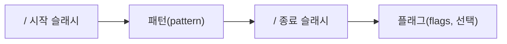

# Why?

문자열 처리 코드를 짤 때 대부분의 개발자는 처음에 반복문과 조건문으로 직접 파싱하면 된다고 가정한다.

실제로 짧은 검증 로직 한두 개는 그렇게 처리해도 동작한다.

그런데 회원가입 폼에 전화번호·이메일·아이디 형식 검증이 쌓이기 시작하면 이 가정이 무너진다.

같은 검증 조건인데 구현마다 경계 조건이 달라 버그가 생기고, 수정할 때마다 테스트를 새로 작성해야 하며, 조건이 조금만 복잡해져도 코드 양이 폭발한다.

이 반복되는 고통의 이름은 **수작업 파싱의 표현력 한계**[^R1]다.

정규표현식(Regular Expression) 은 이 문제를 위해 설계된 미니 언어다.

패턴 하나로 복잡한 문자열 규칙을 선언하고, 플래그 한 글자로 탐색 방향을 바꾸며, 자바스크립트 문자열 API 와 직접 연결된다.

이 포스트에서는 정규표현식 리터럴 문법과 주요 메타문자부터 시작해, 플래그 동작 원리, 실전 패턴 예제, 그리고 RegExp 객체 API 까지 순서대로 다룬다.

## 정규표현식이 필요해지는 순간 💡

정규표현식(Regular Expression)은 문자열에서 특정 내용을 찾거나 대체 또는 발췌하는 데 사용한다[^R2].

예를 들어 회원가입 화면에서 사용자로부터 입력받는 전화번호가 유효한지 체크할 필요가 있다. 이때 정규표현식을 사용하면 간단히 처리할 수 있다.

```javascript
const tel = '0101234567팔';

// 정규 표현식 리터럴
const myRegExp = /^[0-9]+$/;

console.log(myRegExp.test(tel)); // false
```

반복문과 조건문을 사용한 복잡한 코드도 정규표현식을 이용하면 매우 간단하게 표현할 수 있다. 하지만 정규표현식은 주석이나 공백을 허용하지 않고 여러 가지 기호를 혼합하여 사용하기 때문에 가독성이 좋지 않다는 문제가 있다[^R3].

정규표현식은 리터럴 표기법으로 생성할 수 있다. 정규 표현식 리터럴의 구조는 다음과 같다.



정규표현식을 사용하는 자바스크립트 메소드는 `RegExp.prototype.exec`, `RegExp.prototype.test`, `String.prototype.match`, `String.prototype.replace`, `String.prototype.search`, `String.prototype.split` 등이 있다[^R4].

```javascript
const targetStr = 'This is a pen.';
const regexr = /is/ig;

// RegExp 객체의 메소드
console.log(regexr.exec(targetStr)); // [ 'is', index: 2, input: 'This is a pen.' ]
console.log(regexr.test(targetStr)); // true

// String 객체의 메소드
console.log(targetStr.match(regexr));         // [ 'is', 'is' ]
console.log(targetStr.replace(regexr, 'IS')); // ThIS IS a pen.
// String.prototype.search는 검색된 문자열의 첫번째 인덱스를 반환한다.
console.log(targetStr.search(regexr)); // 2 ← index
console.log(targetStr.split(regexr));  // [ 'Th', ' ', ' a pen.' ]
```

## 플래그로 탐색 범위가 결정되는 이유 🚩

플래그는 아래와 같은 종류가 있다[^R5].

| Flag | Meaning     | Description                               |
| ---- | ----------- | ----------------------------------------- |
| i    | Ignore Case | 대소문자를 구별하지 않고 검색한다.        |
| g    | Global      | 문자열 내의 모든 패턴을 검색한다.         |
| m    | Multi Line  | 문자열의 행이 바뀌더라도 검색을 계속한다. |

플래그는 옵션이므로 선택적으로 사용한다. 플래그를 사용하지 않은 경우 문자열 내 검색 매칭 대상이 1개 이상이더라도 첫번째 매칭한 대상만을 검색하고 종료한다.

```javascript
const targetStr = 'Is this all there is?';

// 문자열 is를 대소문자를 구별하여 한번만 검색한다.
let regexr = /is/;

console.log(targetStr.match(regexr)); // [ 'is', index: 5, input: 'Is this all there is?' ]

// 문자열 is를 대소문자를 구별하지 않고 대상 문자열 끝까지 검색한다.
regexr = /is/ig;

console.log(targetStr.match(regexr));        // [ 'Is', 'is', 'is' ]
console.log(targetStr.match(regexr).length); // 3
```

## 메타문자 조합에 따라 패턴 표현력이 달라지는 이유 🔣

패턴에는 검색하고 싶은 문자열을 지정한다. 이때 문자열의 따옴표는 생략한다. 따옴표를 포함하면 따옴표까지도 검색한다. 또한 패턴은 특별한 의미를 가지는 메타문자(Metacharacter) 또는 기호로 표현할 수 있다[^R6].

`.`은 임의의 문자 한 개를 의미한다. 문자의 내용은 무엇이든지 상관없다. 아래 예제에서 `.`을 3개 연속하여 패턴을 생성하였으므로 3자리 문자를 추출한다.

```javascript
const targetStr = 'AA BB Aa Bb';

// 임의의 문자 3개
const regexr = /.../;

console.log(targetStr.match(regexr)); // [ 'AA ', index: 0, input: 'AA BB Aa Bb' ]
```

이때 추출을 반복하지 않는다. 반복하기 위해서는 플래그 `g`를 사용한다.

```javascript
const targetStr = 'AA BB Aa Bb';

// 임의의 문자 3개를 반복하여 검색
const regexr = /.../g;

console.log(targetStr.match(regexr)); // [ 'AA ', 'BB ', 'Aa ' ]
```

모든 문자를 선택하려면 `.`와 `g`를 동시에 지정한다.

```javascript
const targetStr = 'AA BB Aa Bb';

// 임의의 한문자를 반복 검색
const regexr = /./g;

console.log(targetStr.match(regexr));
// [ 'A', 'A', ' ', 'B', 'B', ' ', 'A', 'a', ' ', 'B', 'b' ]
```

패턴에 문자 또는 문자열을 지정하면 일치하는 문자 또는 문자열을 추출한다. 이때 대소문자를 구별하며 패턴과 일치한 첫번째 결과만 반환된다.

```javascript
const targetStr = 'AA BB Aa Bb';

// 'A'를 검색
const regexr = /A/;

console.log(targetStr.match(regexr)); // 'A'
```

대소문자를 구별하지 않게 하려면 플래그 `i`를 사용한다.

```javascript
const targetStr = 'AA BB Aa Bb';

// 'A'를 대소문자 구분없이 반복 검색
const regexr = /A/ig;

console.log(targetStr.match(regexr)); // [ 'A', 'A', 'A', 'a' ]
```

앞선 패턴을 최소 한번 반복하려면 앞선 패턴 뒤에 `+`를 붙인다. 아래 예제의 경우, 앞선 패턴은 `A`이므로 `A+`는 A만으로 이루어진 문자열(`'A'`, `'AA'`, `'AAA'`, …)를 의미한다.

```javascript
const targetStr = 'AA AAA BB Aa Bb';

// 'A'가 한번이상 반복되는 문자열('A', 'AA', 'AAA', ...)을 반복 검색
const regexr = /A+/g;

console.log(targetStr.match(regexr)); // [ 'AA', 'AAA', 'A' ]
```

`|`를 사용하면 or 의 의미를 가지게 된다.

```javascript
const targetStr = 'AA BB Aa Bb';

// 'A' 또는 'B'를 반복 검색
const regexr = /A|B/g;

console.log(targetStr.match(regexr)); // [ 'A', 'A', 'B', 'B', 'A', 'B' ]
```

분해되지 않은 단어 레벨로 추출하기 위해서는 `+`를 같이 사용하면 된다.

```javascript
const targetStr = 'AA AAA BB Aa Bb';

// 'A' 또는 'B'가 한번 이상 반복되는 문자열을 반복 검색
// 'A', 'AA', 'AAA', ... 또는 'B', 'BB', 'BBB', ...
const regexr = /A+|B+/g;

console.log(targetStr.match(regexr)); // [ 'AA', 'AAA', 'BB', 'A', 'B' ]
```

위 예제는 패턴을 or 로 한번 이상 반복하는 것인데 간단히 표현하면 아래와 같다. `[]` 내의 문자는 or 로 동작한다. 그 뒤에 `+`를 사용하여 앞선 패턴을 한번 이상 반복하게 한다.

```javascript
const targetStr = 'AA BB Aa Bb';

// 'A' 또는 'B'가 한번 이상 반복되는 문자열을 반복 검색
// 'A', 'AA', 'AAA', ... 또는 'B', 'BB', 'BBB', ...
const regexr = /[AB]+/g;

console.log(targetStr.match(regexr)); // [ 'AA', 'BB', 'A', 'B' ]
```

범위를 지정하려면 `[]` 내에 `-`를 사용한다. 아래의 경우 대문자 알파벳을 추출한다.

```javascript
const targetStr = 'AA BB ZZ Aa Bb';

// 'A' ~ 'Z'가 한번 이상 반복되는 문자열을 반복 검색
// 'A', 'AA', 'AAA', ... 또는 'B', 'BB', 'BBB', ... ~ 또는 'Z', 'ZZ', 'ZZZ', ...
const regexr = /[A-Z]+/g;

console.log(targetStr.match(regexr)); // [ 'AA', 'BB', 'ZZ', 'A', 'B' ]
```

대소문자를 구별하지 않고 알파벳을 추출하려면 아래와 같이 한다.

```javascript
const targetStr = 'AA BB Aa Bb';

// 'A' ~ 'Z' 또는 'a' ~ 'z'가 한번 이상 반복되는 문자열을 반복 검색
const regexr = /[A-Za-z]+/g;
// 아래와 동일하다.
// const regexr = /[A-Z]+/gi;

console.log(targetStr.match(regexr)); // [ 'AA', 'BB', 'Aa', 'Bb' ]
```

숫자를 추출하는 방법이다.

```javascript
const targetStr = 'AA BB Aa Bb 24,000';

// '0' ~ '9'가 한번 이상 반복되는 문자열을 반복 검색
const regexr = /[0-9]+/g;

console.log(targetStr.match(regexr)); // [ '24', '000' ]
```

컴마 때문에 결과가 분리되므로 패턴에 포함시킨다.

```javascript
const targetStr = 'AA BB Aa Bb 24,000';

// '0' ~ '9' 또는 ','가 한번 이상 반복되는 문자열을 반복 검색
const regexr = /[0-9,]+/g;

console.log(targetStr.match(regexr)); // [ '24,000' ]
```

이것을 간단히 표현하면 아래와 같다. `\d`는 숫자를 의미한다. `\D`는 `\d`와 반대로 동작한다.

```javascript
const targetStr = 'AA BB Aa Bb 24,000';

// '0' ~ '9' 또는 ','가 한번 이상 반복되는 문자열을 반복 검색
let regexr = /[\d,]+/g;

console.log(targetStr.match(regexr)); // [ '24,000' ]

// '0' ~ '9'가 아닌 문자(숫자가 아닌 문자) 또는 ','가 한번 이상 반복되는 문자열을 반복 검색
regexr = /[\D,]+/g;

console.log(targetStr.match(regexr)); // [ 'AA BB Aa Bb ', ',' ]
```

`\w`는 알파벳과 숫자를 의미한다. `\W`는 `\w`와 반대로 동작한다.

```javascript
const targetStr = 'AA BB Aa Bb 24,000';

// 알파벳과 숫자 또는 ','가 한번 이상 반복되는 문자열을 반복 검색
let regexr = /[\w,]+/g;

console.log(targetStr.match(regexr)); // [ 'AA', 'BB', 'Aa', 'Bb', '24,000' ]

// 알파벳과 숫자가 아닌 문자 또는 ','가 한번 이상 반복되는 문자열을 반복 검색
regexr = /[\W,]+/g;

console.log(targetStr.match(regexr)); // [ ' ', ' ', ' ', ' ', ',' ]
```

## 앵커와 수량자로 실전 검증 패턴을 완성하는 방법 ✅

특정 단어로 시작하는지 검사한다. `^`는 문자열의 처음을 의미한다.

```javascript
const url = 'http://example.com';

// 'http'로 시작하는지 검사
const regexr = /^http/;

console.log(regexr.test(url)); // true
```

특정 단어로 끝나는지 검사한다. `$`는 문자열의 끝을 의미한다.

```javascript
const fileName = 'index.html';

// 'html'로 끝나는지 검사
const regexr = /html$/;

console.log(regexr.test(fileName)); // true
```

숫자인지 검사한다. `[^]`는 부정(not)을 의미하며, 예를 들어 `[^a-z]`는 알파벳 소문자로 시작하지 않는 모든 문자를 의미한다. `[]` 바깥의 `^`는 문자열의 처음을 의미한다.

```javascript
const targetStr = '12345';

// 모두 숫자인지 검사
const regexr = /^\d+$/;

console.log(regexr.test(targetStr)); // true
```

하나 이상의 공백으로 시작하는지 검사한다. `\s`는 여러 가지 공백 문자(스페이스, 탭 등)를 의미한다.

```javascript
const targetStr = ' Hi!';

// 1개 이상의 공백으로 시작하는지 검사
const regexr = /^[\s]+/;

console.log(regexr.test(targetStr)); // true
```

아이디로 사용 가능한지 검사한다. 영문자, 숫자만 허용하며 4~10자리여야 한다. `{4,10}`은 4~10자리를 의미한다.

```javascript
const id = 'abc123';

// 알파벳 대소문자 또는 숫자로 시작하고 끝나며 4 ~10자리인지 검사
const regexr = /^[A-Za-z0-9]{4,10}$/;

console.log(regexr.test(id)); // true
```

메일 주소 형식에 맞는지 검사한다.

```javascript
const email = 'ungmo2@gmail.com';

const regexr = /^[0-9a-zA-Z]([-_\.]?[0-9a-zA-Z])*@[0-9a-zA-Z]([-_\.]?[0-9a-zA-Z])*\.[a-zA-Z]{2,3}$/;

console.log(regexr.test(email)); // true
```

핸드폰 번호 형식에 맞는지 검사한다.

```javascript
const cellphone = '010-1234-5678';

const regexr = /^\d{3}-\d{3,4}-\d{4}$/;

console.log(regexr.test(cellphone)); // true
```

특수 문자 포함 여부를 검사한다.

```javascript
const targetStr = 'abc#123';

// A-Za-z0-9 이외의 문자가 있는지 검사
let regexr = /[^A-Za-z0-9]/gi;

console.log(regexr.test(targetStr)); // true

// 아래 방식도 동작한다. 이 방식의 장점은 특수 문자를 선택적으로 검사할 수 있다.
regexr = /[\{\}\[\]\/?.,;:|\)*~`!^\-_+<>@\#$%&\=\(\'\"]/gi;

console.log(regexr.test(targetStr)); // true

// 특수 문자 제거
console.log(targetStr.replace(regexr, '')); // abc123
```

## RegExp 생성자와 프로토타입 메소드의 동작 차이 🧩

자바스크립트는 정규표현식을 위해 RegExp 객체를 지원한다[^R7]. RegExp 객체를 생성하기 위해서는 리터럴 방식과 RegExp 생성자 함수를 사용할 수 있다. 일반적인 방법은 리터럴 방식이다.

```javascript
new RegExp(pattern[, flags])
```

두 방식은 동일한 RegExp 객체를 만들며, 아래 네 표현은 모두 같은 패턴을 의미한다.

```javascript
// 정규식 리터럴
/ab+c/i;

new RegExp('ab+c', 'i');

new RegExp(/ab+c/, 'i');

new RegExp(/ab+c/i); // ES6
```

정규표현식을 사용하는 메소드는 `RegExp.prototype.exec`, `RegExp.prototype.test`, `String.prototype.match`, `String.prototype.replace`, `String.prototype.search`, `String.prototype.split` 등이 있다.

### RegExp.prototype.exec

문자열을 검색하여 매칭 결과를 반환한다. 반환값은 배열 또는 null 이다.

```javascript
const target = 'Is this all there is?';
const regExp = /is/;

const res = regExp.exec(target);
console.log(res); // [ 'is', index: 5, input: 'Is this all there is?' ]
```

`exec` 메소드는 `g` 플래그를 지정하여도 첫번째 매칭 결과만을 반환한다[^R8].

```javascript
const target = 'Is this all there is?';
const regExp = /is/g;

const res = regExp.exec(target);
console.log(res); // [ 'is', index: 5, input: 'Is this all there is?' ]
```

### RegExp.prototype.test

문자열을 검색하여 매칭 결과를 반환한다. 반환값은 `true` 또는 `false` 이다.

```javascript
const target = 'Is this all there is?';
const regExp = /is/;

const res = regExp.test(target);
console.log(res); // true
```

## 정리 — 메타문자 표와 패턴 사용 지침 📋

정규표현식의 핵심 메타문자를 한 눈에 정리하면 다음과 같다.

| 메타문자      | 의미                                           |
| ------------- | ---------------------------------------------- |
| `.`           | 임의의 문자 1개                                |
| `^`           | 문자열 시작 (또는 `[]` 안에서 부정)            |
| `$`           | 문자열 끝                                      |
| `+`           | 앞 패턴 1회 이상 반복                          |
| `*`           | 앞 패턴 0회 이상 반복                          |
| `?`           | 앞 패턴 0 또는 1회                             |
| `{n,m}`       | 앞 패턴 n ~ m 회 반복                          |
| `[]`          | 문자 클래스 (안의 문자들을 or 로 매칭)         |
| `[A-Z]`       | 범위 지정                                      |
| `\|`          | or                                             |
| `\d` / `\D`   | 숫자 / 숫자 아닌 것                            |
| `\w` / `\W`   | 알파벳·숫자·밑줄 / 그 외                      |
| `\s` / `\S`   | 공백 문자 / 비공백 문자                        |
| `i` 플래그    | 대소문자 무시                                  |
| `g` 플래그    | 전체 검색                                      |
| `m` 플래그    | 멀티라인 검색                                  |

정규표현식은 강력하지만 가독성이 낮다. 복잡한 패턴일수록 주석과 함께 문서화하거나, 이름이 붙은 상수로 분리하는 것이 유지보수에 유리하다. `exec` 은 항상 첫 번째 매칭만 반환하므로 전체 탐색이 필요할 때는 `String.prototype.match` 에 `g` 플래그를 조합한다.

[^R1]: MDN Web Docs, "Regular expressions", https://developer.mozilla.org/en-US/docs/Web/JavaScript/Guide/Regular_expressions
[^R2]: ECMA International, "ECMAScript 2023 Language Specification — RegExp Objects", https://tc39.es/ecma262/#sec-regexp-regular-expression-objects
[^R3]: Eloquent JavaScript, "Chapter 9: Regular Expressions", https://eloquentjavascript.net/09_regexp.html
[^R4]: MDN Web Docs, "String.prototype.match()", https://developer.mozilla.org/en-US/docs/Web/JavaScript/Reference/Global_Objects/String/match
[^R5]: MDN Web Docs, "Advanced searching with flags", https://developer.mozilla.org/en-US/docs/Web/JavaScript/Guide/Regular_expressions#advanced_searching_with_flags
[^R6]: MDN Web Docs, "Character classes", https://developer.mozilla.org/en-US/docs/Web/JavaScript/Guide/Regular_expressions/Character_classes
[^R7]: MDN Web Docs, "RegExp() constructor", https://developer.mozilla.org/en-US/docs/Web/JavaScript/Reference/Global_Objects/RegExp/RegExp
[^R8]: MDN Web Docs, "RegExp.prototype.exec()", https://developer.mozilla.org/en-US/docs/Web/JavaScript/Reference/Global_Objects/RegExp/exec
