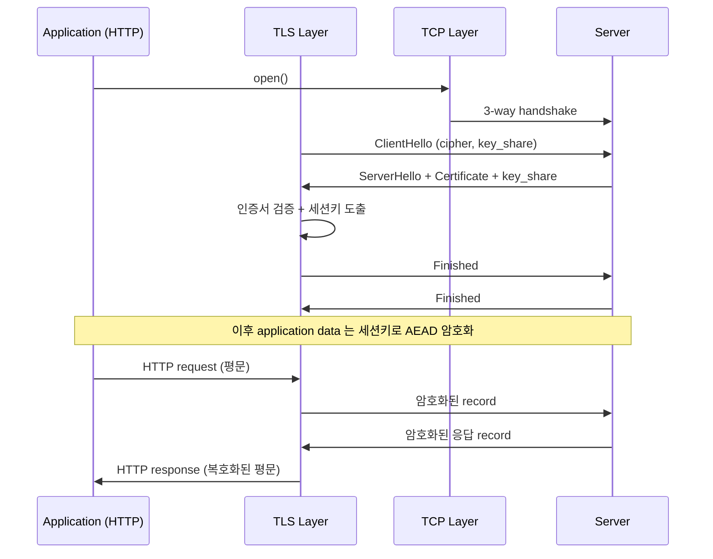
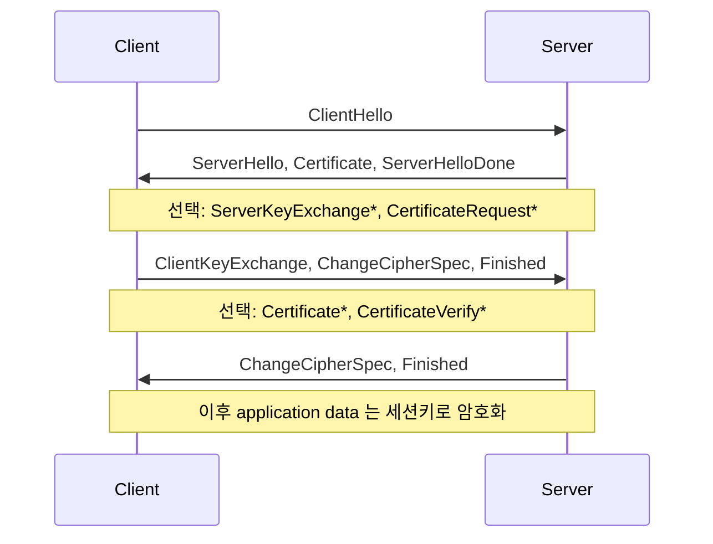
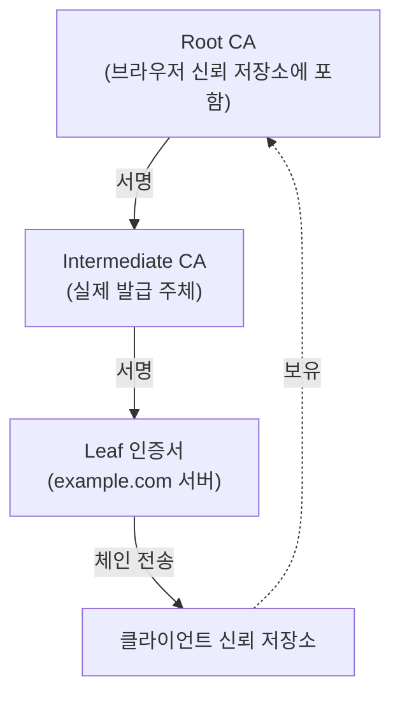

# Why? 왜 배움?

LFCS 를 공부하며 TLS/SSL 의 `openssl` 명령어 사용법을 익혀야 했다. 다만 명령어가 어떤 데이터를 어떤 프로세스를 통해 어떻게 인증 처리를 하는지 실질적인 원리와 직접적인 사용을 해본 적이 없었다. 특히 개인키, 공개키, CSR, 인증서가 TLS 프로토콜의 어디에서 사용되고 어떻게 사용되는지 모호한 상태였다.

이 글은 SSL/TLS 의 역사, OSI 위에서의 위치, 전체 라이프사이클의 거시 흐름, 비대칭 키와 핸드셰이크의 미시 단계, 인증서 신뢰 사슬, 1.2 와 1.3 의 차이, 운영 옵션과 실습 검증까지 한 번에 정리한다.

# What? 뭘 배움?

## SSL 에서 TLS 로 🕰️

### SSL

SSL(Secure Sockets Layer) 은 1990년대 초 넷스케이프가 만든 프로토콜이다. 웹 브라우저와 서버 사이의 데이터를 암호화하려는 첫 시도였고, 초기 버전은 결함이 많았다.

- **SSL 1.0**: 내부 설계 단계에서 폐기되었다. 공개된 적이 없다.
- **SSL 2.0**: 1995년 출시되었고 1년 만에 심각한 취약점으로 교체되었다.
- **SSL 3.0**: 1996년 전면 재설계되었다. 오래 사용되었으나 2014년 POODLE(CVE-2014-3566)[^poodle] 공격으로 표준으로서 사실상 사망 선고를 받았다.

### TLS

IETF 는 SSL 3.0 을 계승해 표준 프로토콜을 만들었다. 그 표준이 TLS 다.

- **TLS 1.0** (1999): SSL 3.0 과 차이가 작아서 'SSL 3.1' 로도 불렸다.
- **TLS 1.2** (2008)[^rfc5246]: 현재까지도 가장 널리 배포된 버전이다. SHA-256 같은 강한 해시를 정식으로 지원한다.
- **TLS 1.3** (2018)[^rfc8446]: 핸드셰이크 RTT 를 줄이고 약한 알고리즘을 표준에서 제거했다.

### 왜 우리는 아직도 SSL 이라 부르는가

기술적으로 지금 발급되는 모든 보안 인증서는 사실상 TLS 다. 그러나 'SSL' 이라는 용어가 먼저 시장에 자리 잡았다. 장비 설정 메뉴, 인증서 판매 페이지, 보안 솔루션 제품명에 'SSL' 이 박혀 있어서 관성적으로 함께 쓰인다. 실제 프로토콜은 TLS 이지만 표기는 SSL 로 통용되는 상태다.

## TLS 는 OSI 위에서 무엇을 하는가 📡

이름은 SSL 이지만 실제로 동작하는 프로토콜은 TLS 다. 그 TLS 가 통신 스택의 어느 위치에서 어떤 역할을 수행하는지 먼저 확인한다.

"TLS 는 OSI 6계층(Presentation) 에서 동작한다" 는 설명이 자주 사용된다. 직관적으로는 그럴듯해 보이지만 RFC 가 이렇게 규정하지는 않는다. RFC 5246 §1 과 RFC 8446 §1 모두 TLS 를 "신뢰성 있는 전송 계층(TCP) 위, 응용 계층 아래" 로만 기술한다[^osi-rfc]. TLS 가 OSI 의 어느 계층 번호에 정확히 대응되는지를 RFC 가 명확하게 정의하지는 않는다.


그럼에도 6계층 대응이 흔히 쓰이는 이유는 두 가지다. 첫째, Presentation Layer 가 데이터 표현과 암호화, 압축을 담당하는 계층으로 분류된다. 둘째, TLS 가 응용 데이터를 암호화해 TCP 로 넘기는 역할을 수행한다. 그래서 비공식적인 대응으로는 유효하지만, RFC 차원의 분류는 아니다.


동작 순서는 다음과 같다. TCP 가 바이트를 전송하기 직전에 TLS 가 그 바이트를 암호화한다. 수신 측에서는 TCP 가 수집한 바이트를 TLS 가 복호화해 응용 계층에 전달한다. 응용 계층(HTTP, SMTP 등) 은 암호화가 적용되었는지 여부를 인지하지 않고, 그저 평문 인터페이스로 데이터를 다룬다.

## 전체 라이프사이클 — 데이터는 어디서 어디로 흐르는가 🗺️

TCP 위, 응용 아래라는 위치는 앞 절에서 확인되었다. 그렇다면 그 위치에서 실제로 어떤 데이터가 어디로 어떻게 흐르는지를 한 그림으로 정리한다.

TLS 한 세션의 전체 흐름은 다음과 같이 진행된다. 응용이 소켓을 열면 TCP 가 3-way handshake 로 연결을 만든다. 그 연결 위에서 클라이언트가 ClientHello 를 보내고, 서버가 ServerHello + Certificate + key_share 로 응답한다. 클라이언트는 받은 인증서 체인을 신뢰 저장소까지 거슬러 올라가며 검증한다. 양측은 임시 키 쌍의 공개값(key_share) 만 교환해서 같은 premaster secret 을 계산한다. premaster 와 두 random 값을 PRF 에 입력하면 master secret 이 도출되고, 거기서 대칭 세션키가 파생된다. 양측이 Finished 메시지를 주고받아 핸드셰이크 무결성을 확정하면, 이후의 모든 application data 는 그 세션키로 AEAD 암호화되어 양방향으로 흐른다. 단어의 정의와 세부 메시지는 다음 절들에서 차례로 다룬다.



각 단계에서 오가는 데이터의 종류와 방향, 그리고 암호화 여부를 정리하면 다음과 같다.

| 데이터 | 생성 주체 | 전송 방향 | 암호화 여부 | 미시 절 |
|---|---|---|---|---|
| ClientHello 패킷 | 클라이언트 | C → S | 평문 (1.3 도 대부분 평문) | 핸드셰이크 시퀀스 |
| ServerHello + Certificate | 서버 | S → C | 평문 (1.3 은 EncryptedExtensions 부터 핸드셰이크 키로 암호화) | 핸드셰이크 시퀀스 / 인증서 |
| 인증서 체인 | CA → 서버 (사전) | 핸드셰이크에서 S → C | 평문 | 인증서 |
| key_share (ECDHE 공개값) | 양측 | 양방향 | 평문 | 키 합의 |
| premaster secret | 양측 계산 | 전송되지 않음 | — | 키 합의 |
| master secret / 세션키 | 양측 PRF 도출 | 전송되지 않음 | — | 핸드셰이크 시퀀스 |
| Finished | 양측 | 양방향 | 핸드셰이크 키로 암호화 | 핸드셰이크 시퀀스 |
| application data | 응용 | 양방향 | 세션키로 AEAD 암호화 | (이미 거시) |

기존 문헌의 처리 흐름 도식도 같은 라이프사이클을 다른 시각에서 보여준다.


위 단계 중 비대칭 키가 사용되는 곳은 인증서 검증과 key_share 생성이다. 그래서 다음 절에서는 비대칭 키가 어느 방향으로 어떻게 동작하는지부터 정리한다. 핸드셰이크 메시지의 세부 시퀀스는 그 뒤 절에서, 키 합의의 구체적인 방식은 그 다음 절에서 다룬다.

## 비대칭 키와 암호화 방향 🔑

거시 흐름에서 핸드셰이크 단계에 비대칭 키가 등장한다. 비대칭 키가 왜 필요한지부터 정리한다.

### 공개키와 개인키

**공개키 (Public Key)** 는 누구에게나 공개해도 되는 키다. 이미 생성된 개인키에서 추출된다.

**개인키 (Private Key)** 는 보유자만 갖는 비밀키다. 외부에 공유되지 않으며, 공개키로부터 개인키를 역산하려면 현실적인 시간 안에 풀 수 없는 정수론 문제를 풀어야 한다.

> [!NOTE]
> **RSA**
> Rivest-Shamir-Adleman 의 약자로 1977년에 발표된 비대칭 키 암호 알고리즘이다. RSA-2048 과 ECDSA P-256 이 2026 시점 양대 표준이며, Let's Encrypt 등 주요 CA 의 신규 발급에서 ECDSA 비중이 빠르게 증가하고 있다. 안전성은 *큰 합성수의 소인수분해 난해성* 에 기반한다 — 2048비트 RSA 키의 modulus `N = p × q` 에서 두 소수 `p`, `q` 를 복구하는 것이 현실적인 시간 내 불가능하다는 가정이다. NIST 기준으로 2048비트가 현재 표준이고, 신규 시스템에는 3072비트 이상이 권장된다.

> [!NOTE]
> **PEM 포맷**
> *PEM* (Privacy Enhanced Mail) 은 base64 인코딩된 인증서/키의 텍스트 형식이다. `-----BEGIN PUBLIC KEY-----` 같은 헤더가 보이는 형식이며, 바이너리 DER 인코딩을 텍스트로 변환한 결과다. 메일·HTTP 헤더 같은 ASCII 채널을 통과시키기 위해 사용한다.

키 한 쌍은 `openssl genrsa` 로 생성한다.

```bash
# 2048비트 RSA 개인키 생성
openssl genrsa -out private.key 2048
```

`genrsa`[^openssl-genrsa] 가 생성하는 것은 사실 한 쌍 전체다. 파일 안에는 modulus, 두 소수, 공개 지수, 개인 지수가 모두 포함되어 있다. 여기서 공개 성분만 따로 추출하려면 `openssl rsa` 의 `-pubout` 옵션을 사용한다.

```bash
# 개인키에서 공개키만 추출 (PEM 출력)
openssl rsa -in private.key -pubout -out public.key
```

`openssl rsa`[^openssl-rsa] 의 `-pubout` 옵션이 공개 성분만 추출해 PEM 으로 출력한다. 여기서 공개 성분이란 modulus `N` 과 공개 지수 `e` 두 값을 의미한다. RSA 공개키는 `(N, e)` 만으로 구성되며, 두 소수와 개인 지수는 개인키에만 남아 있다.

### 암호화 방향

직관적으로는 "서버가 보낼 데이터를 자기 공개키로 암호화한다" 라고 가정하기 쉽지만 실제는 반대 방향이다. RSA 키 전송 모드의 TLS 1.2 핸드셰이크[^rfc5246] 는 다음 순서로 진행된다.

1. 서버가 인증서에 자신의 공개키를 담아 클라이언트에게 전송한다.
2. 클라이언트가 premaster secret 을 생성해서 서버의 공개키로 암호화한다. (ClientKeyExchange)
3. 서버는 자신의 개인키로 그 값을 복호화해서 같은 premaster 를 획득한다.

즉 수신자가 자신의 공개키를 외부에 노출하고, 송신자는 그 공개키로 데이터를 암호화한다. 개인키는 수신자만 보유하므로, 결국 수신자만 그 데이터를 복호화할 수 있다. 이 방향을 반대로 외우면 이후의 핸드셰이크 시퀀스 전체가 어긋나게 된다. 예를 들어 nginx 의 `tlsv1 alert decrypt error` 같은 로그는 ClientKeyExchange 가 서버의 개인키로 복호화되지 않아서 발생하는 것인데, 방향을 거꾸로 잡고 있으면 그 원인을 추적하는 데 한참 우회하게 된다.


위 흐름은 RSA 키 전송 모드에 한정된 설명이다. TLS 1.3 은 이 모드 자체를 폐지했고[^rfc8446], 키 합의는 (EC)DHE 또는 PSK 로만 가능하다. TLS 1.2 환경에서도 신규 배포는 ECDHE cipher suite 를 기본으로 둔다. RSA 키 전송은 forward secrecy 가 결여되어 있어서, 2026 시점에서는 사실상 역사적인 케이스에 가깝다.

> [!NOTE]
> **forward secrecy 의 메커니즘**
> (EC)DHE 는 매 세션마다 *임시* 키 쌍을 새로 만들어 사용 후 폐기한다. 서버 장기 개인키가 이후 유출되어도 과거 세션의 임시 키는 복원되지 않으므로 과거 트래픽의 premaster 도 복호화되지 않는다. 반면 RSA 키 전송은 서버 *장기* 개인키 하나로 모든 세션의 premaster 를 복호화하므로 키 유출이 곧 과거 트래픽 노출이다.

## 핸드셰이크 메시지 시퀀스 🤝

비대칭 키의 방향성은 앞 절에서 확인되었다. 그렇다면 핸드셰이크가 그 방향성을 어떤 메시지 순서로 활용해서 양측의 인증과 키 합의를 끝내는지 정리한다.

핸드셰이크의 목적은 두 가지다. 첫째, 상대가 해당 도메인의 소유자인지를 인증서로 검증한다. 둘째, 양측이 동일한 대칭 세션키를 안전하게 합의한다. 이후의 모든 평문은 그렇게 합의된 세션키로 AEAD 암호화된다.

> [!NOTE]
> **AEAD 암호화**
> Authenticated Encryption with Associated Data 의 약자다. 암호화와 무결성 검증 태그를 *동시에* 생성하여 변조를 탐지하는 방식이다. 대표 알고리즘은 AES-GCM, ChaCha20-Poly1305 두 가지이며 TLS 1.3 은 AEAD 알고리즘만 허용한다.

### Client Hello

ClientHello 는 클라이언트가 먼저 전송하는 메시지다. 지원하는 TLS 버전 목록, 사용 가능한 cipher suite 목록, 32바이트의 client random, 그리고 SNI[^rfc6066] 같은 확장이 함께 전송된다. 특히 SNI 는 같은 IP 에 여러 가상 호스트가 바인딩되어 있을 때 "어느 도메인의 인증서를 요청하는지" 를 서버에 미리 알리는 용도로 사용된다.

### Server Hello + Certificate

서버는 클라이언트가 보낸 옵션 중에서 자신이 수용할 수 있는 것을 선택해 응답한다. 선택된 cipher suite, server random, 서버 인증서(일반적으로 체인 전체) 가 함께 전송된다. TLS 1.2 에서는 키 교환 방식에 따라 ServerKeyExchange 가 추가되고, ServerHelloDone 으로 한 묶음이 종료된다. RFC 5246 §7.3 의 메시지 순서는 다음과 같다.



별표 (`*`) 가 붙은 메시지는 선택 메시지다. 양측이 Finished 를 주고받은 뒤에는 합의된 세션키로 암호화된 application data 만 전송된다.

### Certificate Validation

클라이언트는 수신한 인증서 체인을 자신의 신뢰 저장소까지 거슬러 올라가며 검증한다. 서명의 유효성, 만료 여부, 호스트명과 SAN 의 일치, 폐기 여부를 모두 확인한다. 한 항목이라도 실패하면 브라우저는 사용자에게 경고 화면을 표시한다.

### Key Exchange → Session Key

검증을 통과하면 양측은 비대칭 연산을 한 번 더 수행해서 공통의 premaster 를 생성한다. 2026 시점의 표준 흐름은 (EC)DHE 다. 양측이 임시 키 쌍을 생성해 공개값을 교환하고, 이를 바탕으로 premaster 를 계산한다. 이 공개값 교환이 바로 ServerKeyExchange 와 ClientKeyExchange 메시지에 해당한다. premaster 와 두 random 값을 PRF 에 입력해서 master secret 을 도출하고, master secret 에서 대칭 세션키를 파생시킨다.

> [!NOTE]
> **PRF 가 random 두 개를 받는 이유**
> PRF (Pseudo-Random Function) 는 입력값을 합성해 고정 길이의 의사 난수를 생성하는 함수다. premaster 만으로 세션키를 만들면 같은 클라이언트가 같은 서버에 재접속 시 같은 키가 생길 수 있으므로, ClientHello 와 ServerHello 에서 각각 보낸 32바이트 random 두 개를 함께 섞어 *이번 세션 한정* 의 키를 보장한다.


TLS 1.3[^rfc8446-sec2] 은 동일한 작업을 한 라운드로 처리한다. ClientHello 가 이미 키 공유 값(key_share, 일반적으로 X25519[^rfc7748]) 을 포함한 상태로 전송되고, 서버는 ServerHello 에 자신의 key_share 를 실어서 응답한다. 그래서 한 번의 왕복만으로도 양측이 세션키를 도출할 재료를 모두 확보하게 된다. 0-RTT 를 사용하면 이전 세션의 PSK 로 첫 패킷에 application data 를 함께 전송할 수 있다. 다만 이 데이터는 재전송 공격에 취약하므로, 멱등한 요청에만 사용하는 것이 권장된다.

## 키 합의 방식 — RSA 전송, ECDHE, PSK 🔐

메시지 시퀀스에서 Key Exchange 단계가 정확히 어떻게 동작하는지가 아직 남아 있다. 양측이 세션키를 만드는 방법은 크게 세 가지로 갈라진다.

### RSA 키 전송 (역사적)

클라이언트가 premaster secret 을 만들어서 서버의 공개키로 암호화해 전송하는 방식이다. 서버는 자신의 개인키로 그 값을 복호화하고, 결국 양측이 같은 premaster 를 공유하게 된다. 구현은 단순하지만 서버의 장기 개인키 하나가 모든 세션의 premaster 를 결정하므로 forward secrecy 가 결여된다. TLS 1.2 까지만 허용되며, 신규 배포에서는 더 이상 사용되지 않는다.

### (EC)DHE 와 곡선 선택

Diffie-Hellman 합의에 타원곡선과 임시 키를 결합한 변형이다. 양측이 매 세션마다 임시 키 쌍을 만들어서 공개값(key_share) 만 서로 교환하고, 그 값들을 가지고 수학적으로 같은 값을 각자 계산해 낸다. TLS 1.3 에서는 사실상 표준이며, 2026 시점 ECDHE 의 기본 곡선은 X25519[^rfc7748] 다. X25519 는 P-256 (secp256r1) 대비 timing attack 이나 invalid curve attack 에 대한 방어가 단순하고, RFC 7748 의 사양이 명확해서 구현 편차가 작다. P-256 과 P-384 는 호환성 fallback 으로 함께 활성화해 둔다. nginx 에서는 다음 한 줄로 우선순위를 지정할 수 있다.

```nginx
ssl_ecdh_curve X25519:secp256r1:secp384r1;
```

Cloudflare 나 Let's Encrypt 같은 주요 운영 환경의 기본 협상 곡선도 X25519 가 첫 순위로 설정되어 있다.

### PSK 와 1.3 재개시

Pre-Shared Key 는 양측이 사전에 공유해 둔 비밀을 가지고 세션키를 도출하는 방식이다. TLS 1.3 은 Session ID 와 Session Ticket 같은 1.2 시절의 재개시 메커니즘을 PSK 한 가지로 통합했다. 이전 세션의 PSK 가 남아 있으면 0-RTT 로 첫 패킷에 application data 를 함께 보낼 수 있다.

세 방식의 특성을 표로 정리해 비교하면 다음과 같다.

| 방식 | RTT | forward secrecy | 허용 TLS 버전 | 신규 배포 권장 |
|---|---|---|---|---|
| RSA 키 전송 | 2-RTT | 없음 | 1.2 까지만 | X (역사적) |
| (EC)DHE | 2-RTT (1.2) / 1-RTT (1.3) | 있음 | 1.2, 1.3 | O (기본) |
| PSK | 1-RTT 또는 0-RTT | 재개시 한정 | 1.3 (이전 세션 필요) | O (재접속 최적화) |

## 인증서 — 누가 무엇을 보증하는가 📜

### CA 와 신뢰 사슬



CA(Certificate Authority) 는 도메인 소유자의 공개키에 자신의 서명을 붙여서 인증서를 발급한다. 브라우저나 OS 는 루트 CA 들의 공개키를 신뢰 저장소에 미리 포함한 상태로 배포된다. 그리고 실제 발급은 보통 루트가 아니라 중간 CA 가 수행한다. 그래서 서버가 클라이언트에게 전송하는 것은 인증서 한 장이 아니라 체인 전체다. 즉 리프(서버) → 중간 CA → 루트 CA 의 순서로 이어진 체인이다. 루트 CA 의 공개키는 클라이언트가 이미 보유하고 있으므로 굳이 전송할 필요가 없다.

CA 가 발급 전에 어떤 항목을 어떻게 검증해야 하는지는 CA/Browser Forum 의 Baseline Requirements[^cabf-br] 가 규정한다. 검증 수준에 따라 DV(Domain Validation), OV(Organization Validation), EV(Extended Validation) 로 구분된다. 대부분의 일반 사이트는 DV 다. DV 는 "도메인 통제권자가 발급을 요청했는지" 만 확인한다.

### X.509 와 CSR

인증서의 포맷은 X.509 다. 주체 정보(CN, SAN), 공개키, 발급자, 유효기간, 시리얼, 서명 알고리즘, 그리고 확장 필드(키 사용 목적, CRL 배포점, OCSP URL 등) 가 포함된다.

발급을 요청할 때는 CSR(Certificate Signing Request, PKCS#10) 을 생성해서 CA 에 제출한다. CSR 에는 자신의 공개키와 주체 정보가 함께 포함되고, 자신의 개인키로 서명되어 있다. CA 는 그 서명을 검증해서 "CSR 작성자가 해당 개인키를 실제로 보유하고 있다" 는 사실까지만 확인한다. 도메인 통제권 검증은 별도의 채널(HTTP-01, DNS-01 등) 을 통해서 따로 수행된다.

```bash
# 개인키와 CSR 을 한 번에
openssl req -new -newkey rsa:2048 -nodes \
  -keyout server.key -out server.csr \
  -subj "/CN=example.com"
```

`openssl req`[^openssl-req] 가 CSR 을 생성한다. `-nodes` 는 개인키에 별도의 암호를 걸지 않겠다는 의미다. 서버가 자동으로 기동되어야 하는 경우에는 보통 이 옵션을 함께 사용한다.

### 발급, 갱신, 취소

발급 이후의 라이프사이클이 사실상 인증서 운영의 본체다.

- **발급**: 대표적인 방식은 ACME[^rfc8555] 다. Let's Encrypt 는 ACME 위에서 동작하며, 도메인 통제권을 HTTP-01, DNS-01, TLS-ALPN-01 챌린지[^letsencrypt-challenges] 로 검증한다. 와일드카드 인증서는 DNS-01 챌린지로만 발급할 수 있다.
- **갱신**: Let's Encrypt 의 유효기간은 90일이므로 자동 갱신이 필수다. 보통 certbot 이나 acme.sh 가 cron 으로 주기적으로 실행된다.
- **취소(폐기)**: 키가 유출되면 인증서를 만료되기 전에 무효화해야 한다. 이를 위한 메커니즘은 두 가지가 존재한다.
  - **CRL** (Certificate Revocation List): CA 가 폐기된 시리얼 목록을 주기적으로 발행하는 방식이다. 구조는 단순하지만 목록의 크기와 갱신 지연이 크다.
  - **OCSP**[^rfc6960]: 클라이언트가 CA 의 OCSP 응답기에 시리얼별로 폐기 여부를 직접 질의하는 방식이다. 실시간으로 확인이 가능하지만, 매 연결마다 CA 까지의 추가 왕복이 발생한다. 그리고 응답기의 가용성과 프라이버시(클라이언트의 IP 가 CA 에 노출되는 문제) 도 함께 따라온다.

OCSP 의 단점을 보완하는 메커니즘이 OCSP Stapling 인데, 이게 어떤 방식으로 그 단점을 해결하는지는 운영 절에서 다룬다.

### Certificate Transparency 로그

2026 시점에 모든 공개 신뢰 CA 는 CT 로그에 발급 사실을 제출하는 것이 강제로 규정되어 있다[^rfc6962]. CT 는 별도의 공개 append-only 로그에 인증서의 SCT (Signed Certificate Timestamp) 를 기록해서, 부정 발급된 인증서를 사후 감사 방식으로 탐지할 수 있게 한다. 그래서 브라우저는 TLS 핸드셰이크에서 SCT 가 포함되지 않은 인증서를 거부한다 (Chrome 의 경우 2018년 4월 발급분부터 적용되었다). 운영 관점에서는 CA 가 자동으로 SCT 를 인증서에 임베드해 주므로 별도의 설정이 필요하지 않은 경우가 대부분이다. 그리고 crt.sh 같은 CT 모니터로 자기 도메인의 발급 이력을 감시하는 것이 사실상 표준적인 절차다.

## TLS 1.2 vs TLS 1.3 한눈에 📊

메시지 시퀀스와 키 합의, 인증서까지 모두 정리되었다. 그러면 두 버전이 같은 작업을 각각 어떻게 다르게 처리하는지를 표로 정리해 본다.

| 항목 | TLS 1.2 (RFC 5246, 2008) | TLS 1.3 (RFC 8446, 2018) |
|---|---|---|
| Full handshake RTT | 2-RTT | 1-RTT (0-RTT 옵션) |
| 키 교환 | RSA 전송, DH, DHE, ECDHE | (EC)DHE 또는 PSK 만 |
| Static RSA/DH | 지원 | 삭제 |
| 대칭 암호 | CBC+HMAC, AEAD | AEAD 만 (GCM, ChaCha20-Poly1305) |
| 폐기 알고리즘 | 일부 legacy cipher suite 가 SHA-1, MD5 잔존 (1.2 PRF 기본은 SHA-256) | RC4, MD5, SHA-1, CBC, 비-AEAD 금지 |
| 압축 | 지원 (CRIME 취약) | 삭제 |
| Renegotiation | 있음 | 삭제 |
| Session resumption | Session ID + Ticket | PSK 단일 |

TLS 1.3 의 설계 방향은 "안전하지 않은 선택지" 를 표준에서 아예 제거하는 것이다. 협상 가능한 옵션이 적을수록 잘못 협상할 여지도 함께 줄어들기 때문이다.

# How? 어떻게 검증 / 운영?

## 운영 트레이드오프 ⚖️

프로토콜 사양은 앞에서 모두 정리되었다. 실제 운영에서 켜고 끄는 옵션들은 사실상 모두 안전과 속도 사이의 균형점에 위치한다.

### HSTS

HSTS(HTTP Strict-Transport-Security)[^rfc6797] 는 서버가 응답 헤더로 "이 도메인에는 HTTPS 로만 접속해야 한다" 고 선언하는 방식이다. 브라우저는 그 기간 동안 평문 HTTP 요청을 자체적으로 HTTPS 로 변환해서 전송한다. 그래서 첫 요청을 가로채려는 SSL stripping 공격을 사전에 차단할 수 있다. 단점은 잘못 설정한 경우, 인증서 사고가 발생했을 때 사용자가 이를 우회할 수 없다는 점이다.

```
Strict-Transport-Security: max-age=63072000; includeSubDomains; preload
```

정적 사이트, SaaS 콘솔, 금융권 서비스에서는 사실상 표준으로 자리잡았다. Chrome 이나 Firefox 의 preload list 에 도메인을 등록해 두면 사용자의 첫 방문조차도 보호된다. 다만 한 번 등록되면 제거 절차가 길어서, 인증서 운영의 안정성이 충분히 확보된 도메인에만 권장된다.

### Session Resumption

매 연결마다 핸드셰이크를 처음부터 수행하면 그 비용이 만만치 않다. Session ID 와 Session Ticket[^rfc5077] 은 이전 세션의 상태를 양측이 짧게 캐싱해 두었다가, 다음 연결의 핸드셰이크를 단축하는 메커니즘이다. TLS 1.3 은 이 둘을 PSK 모드 하나로 통합했고, 0-RTT 를 활성화하면 첫 패킷에 application data 를 함께 전송할 수 있다. 다만 0-RTT 는 재전송 공격에 취약하기 때문에, 보통 GET 같은 멱등 요청에 한해서 사용된다.

트래픽이 많은 API 서버에서 핸드셰이크 비용을 줄이려는 경우에 주로 사용한다. CloudFront 나 Cloudflare 같은 CDN 의 TLS termination 에서는 기본적으로 활성화되어 있다.

> [!WARNING]
> **Session Ticket 함정**
> Session Ticket 은 서버가 가진 ticket key 로 세션 상태를 암호화해 클라이언트에 보관시키는 방식이다. ticket key 를 회전하지 않으면 같은 키로 암호화된 과거 세션 전부가 한 번에 노출 가능해져 forward secrecy 가 깨진다. 정기 회전을 운영에 포함하거나 `ssl_session_tickets off` 로 비활성화해 Session ID 캐시만 사용하는 트레이드오프를 검토한다.

### OCSP Stapling

OCSP Stapling[^rfc6066] 은 서버가 CA 의 OCSP 응답을 미리 받아 두었다가, 핸드셰이크의 Certificate Status 메시지에 함께 첨부(staple) 해 보내는 방식이다. 그래서 클라이언트는 CA 에 별도로 질의하지 않고도 폐기 여부를 확인할 수 있다. 결과적으로 매 연결마다 발생하던 CA 까지의 추가 왕복이 사라지고, 클라이언트의 IP 가 CA 에 노출되는 프라이버시 문제도 함께 완화된다. 인증서 체인 전체의 OCSP 응답까지 staple 하는 multiple status extension 은 RFC 6961[^rfc6961] 이 정의한다. TLS 1.3 은 이 메커니즘을 Certificate 메시지의 CertificateEntry extensions 안에 OCSP 응답을 직접 포함하는 형태로 통합해 두었다[^rfc8446-sec4-4-2-1].

nginx 에서는 다음 세 줄로 활성화한다. `ssl_stapling` 기본값이 `off` 이므로 반드시 명시적으로 켜 줘야 한다.

```nginx
ssl_stapling           on;
ssl_stapling_verify    on;
resolver               1.1.1.1 8.8.8.8 valid=300s;
```

운영상 자주 만나는 함정은 세 가지다. 첫째, OCSP 응답기의 도메인을 해석하기 위한 `resolver` 지시자가 반드시 필요하다. 이걸 누락하면 stapling 이 조용히 실패한다. 둘째, 체인의 중간 CA 까지 staple 하는 multi-stapling 은 nginx 의 지원이 제한적이라서, 실제로는 leaf 인증서만 staple 되는 경우가 많다. 셋째, 인증서의 must-staple 확장과 결합하면 staleness (staple 된 응답이 만료되었는데도 갱신되지 않는 상황) 위험을 제거할 수 있다. 다만 OCSP 응답기 장애가 곧 서비스 장애로 직결되므로, 운영의 안정성을 함께 검토해야 한다.

### mTLS

mTLS 는 서버뿐 아니라 클라이언트도 자신의 인증서를 함께 제시하는 모드다. 일반 클라이언트는 서버의 CertificateRequest 를 그냥 무시하지만, mTLS 클라이언트는 자신의 인증서와 CertificateVerify 서명을 함께 보낸다. 메시지 시퀀스 측면에서는 CertificateRequest, Certificate(클라이언트), CertificateVerify 세 메시지가 추가되는 셈이다. 서비스 메시(Istio, Linkerd) 와 zero-trust 네트워크에서 사실상 표준 모듈로 자리잡았으며, nginx 에서는 다음 두 줄로 활성화하고 CRL 이나 OCSP 로 폐기 검증을 함께 결합한다.

```nginx
ssl_verify_client       on;
ssl_client_certificate  /etc/nginx/certs/client-ca.crt;
```

## 실습 환경 — multipass 또는 vagrant 🧪

운영 옵션을 직접 토글하면서 동작을 관측하려면, 호스트를 더럽히지 않을 격리된 게스트가 필요하다.

multipass 와 vagrant 두 가지 모두 우분투 게스트 한 대를 빠르게 띄울 수 있다. 가벼운 단일 게스트면 multipass 가 편하고, 네트워크 격리나 고정 IP 가 필요한 경우에는 vagrant 가 더 적합하다.

multipass 로 띄우는 경우는 다음과 같다.

```bash
multipass launch --name tls-lab --memory 2G ubuntu     # ← Ubuntu LTS 게스트 생성[^multipass]
multipass shell tls-lab
sudo apt-get update && sudo apt-get install -y openssl nginx certbot
```

vagrant 로 띄우는 경우는 다음과 같다.

```ruby
# Vagrantfile
Vagrant.configure("2") do |config|
  config.vm.box = "ubuntu/jammy64"
  config.vm.network "private_network", ip: "192.168.56.10"
  config.vm.provision "shell", inline:
    "apt-get update && apt-get install -y openssl nginx certbot"
end
```

```bash
vagrant up && vagrant ssh                              # ← 게스트 부팅 + 접속[^vagrant]
```

이후 실습 1번부터 3번까지는 단일 게스트 안에서 진행하고, 실습 4번(mTLS) 은 게스트 두 대가 필요하다. multipass 의 경우에는 `launch` 명령을 두 번 실행하면 되고, vagrant 라면 multi-machine 정의를 활용하면 된다.

네 개의 실습이 본문의 어떤 주장을 각각 검증하는지를 미리 정리하면 다음과 같다.

| 실습 | 거시/미시 매핑 | 검증 대상 주장 |
|---|---|---|
| 1 | 인증서 절 H3 (X.509/CSR) | CSR 에는 자신의 공개키가 들어가고 자신의 개인키로 서명된다 |
| 2 | 인증서 절 H3 (발급/갱신) | Let's Encrypt 는 ACME 위에서 90일 인증서를 발급하고 60일 시점 자동 갱신된다 |
| 3 | 핸드셰이크 시퀀스 + 1.2/1.3 비교 | 1.3 은 ServerKeyExchange 가 사라지고 1-RTT 로 끝난다 |
| 4 | 운영 절 H3 (mTLS) | mTLS 는 CertificateRequest 와 CertificateVerify 메시지가 추가된다 |

## 실습 1 — 키 + CSR + 자체 서명 인증서 🔧

가장 작은 단위부터 진행한다. 먼저 개인키와 CSR 을 한 명령으로 한꺼번에 생성한다.

```bash
openssl req -new -newkey rsa:2048 -nodes \
  -keyout server.key -out server.csr \
  -subj "/CN=example.local/O=Homelab/C=KR"
```

생성된 CSR 의 내용은 다음과 같이 텍스트 형태로 출력해 확인할 수 있다.

```bash
openssl req -in server.csr -noout -text
```

출력에는 `Subject Public Key Info` 와 `Signature Algorithm` 항목이 함께 표시된다. 이를 통해 공개키가 CSR 안에 들어 있고, 그 CSR 전체가 자신의 개인키로 서명되어 있다는 사실이 직접 확인된다.

테스트 용도로 CA 없이 인증서를 그냥 사용하고 싶다면 자체 서명을 하면 된다.

```bash
openssl x509 -req -days 365 \
  -in server.csr -signkey server.key \
  -out server.crt
```

`openssl x509`[^openssl-x509] 는 X.509 인증서를 생성하거나 다른 포맷으로 변환할 때 사용한다. 자체 서명한 인증서는 브라우저의 신뢰 저장소에 직접 등록해 두어야 경고 없이 사용할 수 있다.

## 실습 2 — Let's Encrypt staging + dry-run 갱신 🤖

실서비스 도메인에서는 사실상 Let's Encrypt 가 표준이 되어 있다. 운영 인증서를 남발하지 않도록, 먼저 staging 환경으로 발급해 본다.

```bash
sudo certbot --nginx --staging \
  -d example.com -d www.example.com
```

`--staging` 옵션은 Let's Encrypt 의 테스트 CA 로 발급을 진행해서 rate limit 을 피한다. 이렇게 발급된 인증서를 브라우저는 신뢰하지 않지만, 핸드셰이크와 갱신 동작 자체는 운영 환경과 완전히 동일하다.

갱신 동작은 다음과 같이 dry-run 으로 미리 검증해 둔다.

```bash
sudo certbot renew --dry-run
```

90일 유효기간의 인증서가 60일 시점에 자동으로 갱신되도록 systemd timer 가 함께 설치된다. 운영 환경으로 전환하려면 `--staging` 옵션만 제거하고 같은 명령을 다시 실행하면 된다.

## 실습 3 — TLS 1.2 / 1.3 협상 메시지 비교 🔬

발급과 갱신까지 재현했으니, 이제 핸드셰이크 메시지 자체를 raw 형태로 관측해서 1.2 와 1.3 의 시퀀스가 어떻게 다른지를 확인한다.

`openssl s_client` 의 `-tls1_2`, `-tls1_3` 옵션은 해당 버전을 강제로 협상하게 만들고, `-msg` 옵션은 raw handshake 메시지를 16진수로 출력해 준다.

먼저 TLS 1.2 로 강제 접속한다.

```bash
openssl s_client -connect example.com:443 -tls1_2 -msg -servername example.com </dev/null 2>&1 \
  | grep -E "Cipher|Protocol|>>>|<<<"
```

출력에서는 `Protocol  : TLSv1.2`, `Cipher    : ECDHE-RSA-AES256-GCM-SHA384` 같은 협상 결과가 나타난다. `-msg` 에 출력되는 `>>> TLS 1.2 Handshake [ServerKeyExchange]` 라인이 바로 ECDHE 키 교환에 사용되는 서버 측 공개값의 전송을 의미한다.

이번에는 TLS 1.3 으로 강제 접속해 본다.

```bash
openssl s_client -connect example.com:443 -tls1_3 -msg -servername example.com </dev/null 2>&1 \
  | grep -E "Cipher|Protocol|>>>|<<<"
```

협상 결과는 `Protocol  : TLSv1.3`, `Cipher    : TLS_AES_256_GCM_SHA384` 다. 1.3 의 cipher 명명 규칙은 AEAD 알고리즘과 해시만 표기하고, 키 교환과 인증 알고리즘은 별도의 협상으로 분리되어 있다. `-msg` 출력을 보면 `ServerKeyExchange` 가 사라지고 그 자리에 `EncryptedExtensions` 가 등장한다. 키 합의 재료인 `key_share` 가 이미 ClientHello 와 ServerHello 에 포함되어서, 한 라운드 안에 합의가 끝나기 때문이다.

두 출력의 발생 시각을 측정하면 실제 RTT 의 차이가 드러난다.

```bash
for v in tls1_2 tls1_3; do
  echo "=== $v ==="
  time (openssl s_client -connect example.com:443 -$v -servername example.com </dev/null >/dev/null 2>&1)
done
```

같은 회선이라도 1.3 은 한 라운드가 적기 때문에, 연결 완료까지의 실측 시간이 더 짧게 나온다. 앞에서 표로 정리한 1-RTT 와 2-RTT 의 차이가 측정값으로도 그대로 확인되는 셈이다.

## 실습 4 — mTLS 검증 🛂

운영 절에서 정리한 mTLS 가 실제로 CertificateRequest 와 CertificateVerify 메시지를 추가하는지를 두 게스트로 재현해 본다. 게스트 A 는 `ssl_verify_client off` 로 둔 일반 nginx 이고, 게스트 B 는 `ssl_verify_client on` 과 클라이언트 CA 가 설정된 nginx 다.

먼저 클라이언트 CA 와 클라이언트 인증서를 다음과 같이 만든다.

```bash
# 클라이언트 CA
openssl genrsa -out ca.key 2048
openssl req -x509 -new -nodes -key ca.key -days 365 \
  -subj "/CN=Homelab Client CA" -out ca.crt

# 클라이언트 키 + CSR + 인증서 (CA 서명)
openssl genrsa -out client.key 2048
openssl req -new -key client.key -subj "/CN=client01" -out client.csr
openssl x509 -req -in client.csr -CA ca.crt -CAkey ca.key \
  -CAcreateserial -days 365 -out client.crt
```

게스트 B 의 nginx 서버 블록은 다음과 같다. `ssl_client_certificate` 항목에 방금 만든 CA 인증서를 지정해 준다.

```nginx
server {
    listen 443 ssl;
    server_name guest-b.local;

    ssl_certificate      /etc/nginx/certs/server.crt;
    ssl_certificate_key  /etc/nginx/certs/server.key;

    ssl_verify_client       on;
    ssl_client_certificate  /etc/nginx/certs/ca.crt;

    location / { return 200 "mTLS ok\n"; }
}
```

게스트 A 는 같은 설정에서 `ssl_verify_client off` 한 줄만 다르다. 두 게스트에 같은 curl 요청을 각각 보내 본다.

```bash
# 인증서 없이 → A 는 응답, B 는 400
curl -k https://guest-a.local/
curl -k https://guest-b.local/
# 클라이언트 인증서 첨부 → B 도 응답
curl -k --cert client.crt --key client.key https://guest-b.local/
```

게스트 B 는 인증서 없는 요청에 대해서는 `400 No required SSL certificate was sent` 를 반환하고, `--cert` 옵션이 첨부된 경우에만 `mTLS ok` 가 출력된다. 핸드셰이크 메시지까지 함께 확인하려면 `openssl s_client -connect guest-b.local:443 -cert client.crt -key client.key -msg` 명령으로 접속해서, `>>> CertificateRequest`, `<<< Certificate`, `<<< CertificateVerify` 세 라인이 등장하는지 살펴본다. 그러면 운영 절에서 정리해 둔 "mTLS 는 CertificateRequest 와 CertificateVerify 가 추가된다" 는 사실이 raw 메시지로도 그대로 확인된다.

# Remark

LFCS 준비 과정에서 `openssl genrsa`, `openssl req`, `openssl x509` 는 사실상 외워야 할 명령어 문자열에 가까웠다. 본문을 정리하면서 각 명령이 개인키, 공개키, CSR, 인증서 중에서 무엇을 만들고, 그것이 핸드셰이크의 어느 단계에서 어떻게 사용되는지가 한 줄의 흐름으로 연결되었다.

운영 관점에서 가장 자주 부딪힌 문제는 두 가지였다. 하나는 자체 서명 인증서를 만들어 컨테이너에 넣었을 때 SAN 이 누락되어 최신 클라이언트가 거부한 경우다. 다른 하나는 RSA 키 전송의 방향을 거꾸로 잡고서 nginx 의 `tlsv1 alert decrypt error` 로그를 한참 우회해 추적했던 경우다. 둘 다 본문의 방향성 한 줄과 X.509 확장 필드 한 줄만 정정하면 끝나는 문제였다. 다만 잘못 외워 둔 모델이 결국 디버깅 시간 전체를 결정해 버린 셈이다.

이 글이 다루지 않은 인접 주제로는 양자 컴퓨터 이후를 대비한 post-quantum TLS (Kyber 같은 KEM 을 결합한 핸드셰이크), SNI 의 평문 노출을 막는 Encrypted Client Hello[^ech], 그리고 워크로드 단위로 ID 를 발급하는 SPIFFE/SPIRE[^spiffe] 같은 것들이 있다. crt.sh 같은 CT 모니터로 자기 도메인의 발급 이력을 감시하는 것도 본문 구조 위에 얹히는 운영 확장에 해당한다.

# Reference

[^poodle]: <https://en.wikipedia.org/wiki/POODLE> — POODLE(CVE-2014-3566) 공격. SSL 3.0 이 표준으로서 사실상 사망한 직접 원인 (2014-10).
[^rfc5246]: <https://datatracker.ietf.org/doc/html/rfc5246> — TLS 1.2 사양. §1 protocol layering, §7.3 handshake flow, §7.4.7.1 RSA-encrypted premaster secret.
[^rfc8446]: <https://datatracker.ietf.org/doc/html/rfc8446> — TLS 1.3 사양. §1.2 static RSA/DH 삭제, §2 (EC)DHE/PSK 세 가지 키 교환 모드.
[^rfc8446-sec2]: <https://datatracker.ietf.org/doc/html/rfc8446#section-2> — TLS 1.3 §2 Protocol Overview, 핸드셰이크 다이어그램.
[^rfc7748]: <https://datatracker.ietf.org/doc/html/rfc7748> — Curve25519, Curve448 정의. ECDHE 곡선 출처.
[^rfc6797]: <https://datatracker.ietf.org/doc/html/rfc6797> — HSTS. Strict-Transport-Security 헤더 표준.
[^rfc6066]: <https://datatracker.ietf.org/doc/html/rfc6066> — TLS Extensions. §8 Certificate Status Request → OCSP stapling, §3 SNI.
[^rfc6960]: <https://datatracker.ietf.org/doc/html/rfc6960> — OCSP. RFC 2560 obsolete. 인증서 폐기 확인.
[^rfc6961]: <https://datatracker.ietf.org/doc/html/rfc6961> — Multiple Certificate Status Request (status_request_v2). 인증서 체인의 OCSP 응답까지 staple.
[^rfc8446-sec4-4-2-1]: <https://datatracker.ietf.org/doc/html/rfc8446#section-4.4.2.1> — TLS 1.3 의 OCSP staple 메커니즘. Certificate 메시지 안의 CertificateEntry extensions 에 OCSP 응답 포함.
[^rfc6962]: <https://datatracker.ietf.org/doc/html/rfc6962> — Certificate Transparency. 공개 append-only 로그와 SCT (Signed Certificate Timestamp).
[^rfc5077]: <https://datatracker.ietf.org/doc/html/rfc5077> — TLS Session Resumption (Session ticket).
[^rfc8555]: <https://datatracker.ietf.org/doc/html/rfc8555> — ACME 프로토콜. Let's Encrypt 1차 사양.
[^cabf-br]: <https://cabforum.org/working-groups/server/baseline-requirements/requirements/> — CA/Browser Forum Baseline Requirements v2.2.7. DV/OV/EV 검증.
[^letsencrypt-challenges]: <https://letsencrypt.org/docs/challenge-types/> — ACME 챌린지 (HTTP-01 / DNS-01 / TLS-ALPN-01). DNS-01 만 wildcard.
[^openssl-genrsa]: <https://docs.openssl.org/master/man1/openssl-genrsa/> — openssl genrsa 매뉴얼.
[^openssl-rsa]: <https://docs.openssl.org/master/man1/openssl-rsa/> — openssl rsa 매뉴얼.
[^openssl-req]: <https://docs.openssl.org/master/man1/openssl-req/> — openssl req 매뉴얼. CSR(PKCS#10) 생성.
[^openssl-x509]: <https://docs.openssl.org/master/man1/openssl-x509/> — openssl x509 매뉴얼. 자체 서명, 변환.
[^osi-rfc]: <https://datatracker.ietf.org/doc/html/rfc5246#section-1> 및 <https://datatracker.ietf.org/doc/html/rfc8446#section-1> — 두 사양 모두 TLS 를 'reliable transport(TCP) 위 application 아래' 로 기술할 뿐 OSI 계층 번호 부여하지 않음.
[^multipass]: <https://multipass.run/docs/launch-command> — multipass launch 명령어. 이름·메모리·이미지 지정.
[^vagrant]: <https://developer.hashicorp.com/vagrant/docs/cli/up> — vagrant up 명령어. Vagrantfile 기반 게스트 부팅.
[^spiffe]: <https://spiffe.io/docs/latest/spiffe-about/spiffe-concepts/> — SPIFFE 워크로드 ID 모델. SVID·trust domain 개념.
[^ech]: <https://datatracker.ietf.org/doc/draft-ietf-tls-esni/> — Encrypted Client Hello (ECH) draft. SNI 평문 노출 회피.
