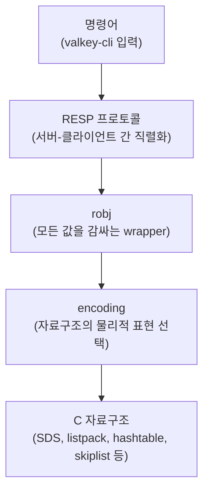
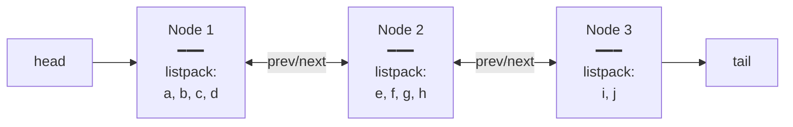
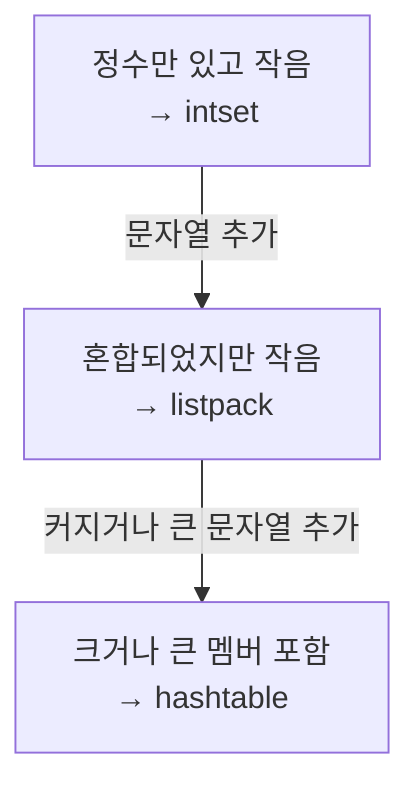
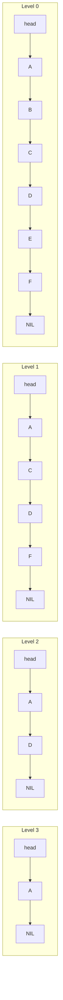
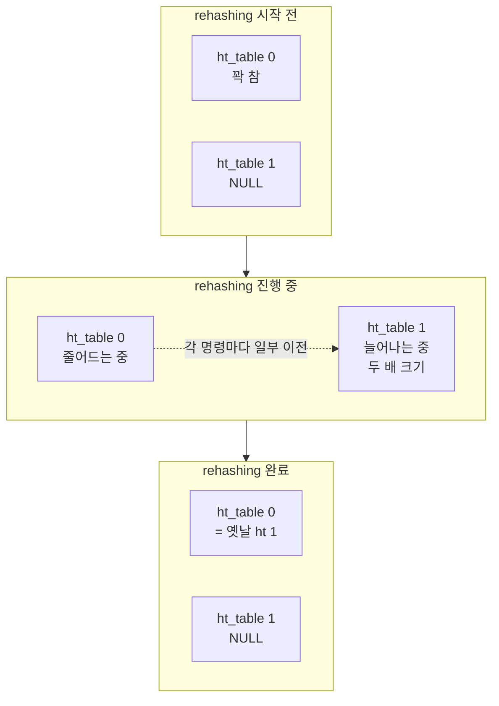
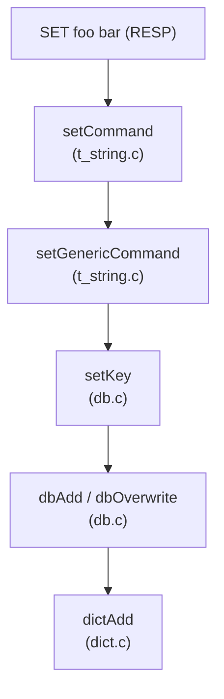

# Why?

Valkey 를 처음 접하는 사람 대부분은 "키-값 저장소이니 내부는 단순할 것"이라고 가정한다.

실제 Redis / Valkey 는 그 가정 위에서 설계되었고, 사용자에게는 단순한 명령 인터페이스만 노출한다.

그런데 production 환경에서 운영을 시작하면 이 가정이 깨진다.

같은 데이터를 저장했는데 메모리 사용량이 예상의 5 배가 되거나, 특정 명령의 응답 시간이 갑자기 두 배로 뛰거나, rehashing 중 모든 요청이 timeout 되는 상황을 마주하게 된다.

이 현상에는 공통 이름이 있다: **인코딩 전환 blind spot**[^V1].

사용자에게 보이지 않는 내부 자료구조 전환이 성능과 메모리를 결정하는데, 그 전환 조건과 비용을 모르는 상태에서 운영하는 것이다.

본 포스트에서는 OSSCA Valkey 컨트리뷰션 세션의 실습 과제를 수행하면서, RESP 프로토콜부터 robj wrapper, SDS, listpack, quicklist, hashtable, skiplist, radix tree, HyperLogLog 까지 Valkey 내부를 소스 코드 수준에서 직접 해부한다.

## Valkey — Redis 라이선스 분기 후의 새 본진 🗂️

Valkey 는 2024 년 3 월, Redis Inc. 가 Redis 의 라이선스를 BSD 에서 SSPL/RSALv2 로 변경하면서 시작된 fork 다[^V2].

기존 Redis 의 마지막 BSD 라이선스 버전인 7.2.4 를 기반으로, AWS, Google Cloud, Oracle, Ericsson 등 주요 기여자들이 Linux Foundation 산하 프로젝트로 재출범시켰다.

Valkey 는 BSD-3-Clause 라이선스를 유지하며, Redis 와 100% 프로토콜 호환을 보장한다.

따라서 이 글의 모든 내부 구조 분석은 Redis 7.2.x 와 Valkey 양쪽에 동일하게 적용된다.

내부를 이해해야 하는 구체적인 이유는 다음 절에서 표로 정리한다.

## 인메모리 DB 의 내부를 알아야 하는 이유 💭

Valkey 는 단순히 잘 작동하는 KV store 가 아니다.

실서비스에서 Valkey 의 성능과 메모리 효율은 내부 자료구조 선택에서 직접 결정된다.

다음은 자주 마주치는 결정과 그 영향이다.

| 결정                                 | 영향                       |
| ------------------------------------ | -------------------------- |
| Hash 가 listpack 인지 hashtable 인지 | 메모리가 5–10 배 차이      |
| ZSet 의 skiplist 깊이                | 명령의 latency             |
| dict 의 rehashing 진행 여부          | 명령마다 두 hashtable 검색 |
| embstr 의 44 byte 임계               | cache miss 률              |

이 모든 결정이 사용자 명령 한 줄 (`HSET key field value`) 의 메모리 사용량과 응답 시간을 좌우한다.

내부를 알면 같은 데이터로 Valkey 메모리를 절반으로 줄일 수도 있다.

반대로 모르면 production 에서 왜 갑자기 처리시간이 두 배가 됐는지 추적이 불가능하다.

이 이유들을 구체적으로 증명하는 구조는 다음 §What 에서 층별로 분해한다.

# What?

## 들어가며 — 명령어부터 C 자료구조까지의 5 단 추상 사다리 🪜

Valkey 의 동작 원리는 다섯 단계의 추상으로 분해된다.

다음 다이어그램은 사용자 입력이 내부 C 자료구조까지 내려가는 경로를 보여준다.



각 층이 다음 층을 어떻게 호출하는지 위에서 아래로 따라간다.

`SET key value` 라는 단순한 명령 한 줄이 어떻게 RESP 로 직렬화되어 서버에 도달하고, robj 로 감싸져 어떤 인코딩이 선택되며, 결국 어떤 C 자료구조에 저장되는가를 추적할 수 있다.

다음 절부터는 이 사다리를 위에서부터 차례로 내려간다.

## RESP — 텍스트 기반 직렬화 프로토콜 📜

RESP (REdis Serialization Protocol) 는 Valkey 클라이언트와 서버가 주고받는 메시지의 형식을 정의한다[^V3].

이진 프로토콜이 아닌 사람이 읽을 수 있는 텍스트 기반이지만, 파싱이 빠르도록 단순한 규칙으로 설계되었다.

### 5 가지 type marker

모든 RESP 메시지는 첫 바이트로 자신의 타입을 표시한다.

| Marker | Type          | 예시                            |
| ------ | ------------- | ------------------------------- |
| `+`    | Simple String | `+OK\r\n`                       |
| `-`    | Error         | `-ERR unknown command\r\n`      |
| `:`    | Integer       | `:1000\r\n`                     |
| `$`    | Bulk String   | `$5\r\nhello\r\n`               |
| `*`    | Array         | `*2\r\n$3\r\nfoo\r\n$3\r\nbar\r\n` |

각 메시지는 항상 `\r\n` (CRLF) 으로 종결된다.

### 명령은 모두 Bulk String 의 Array

`SET key value` 같은 사용자 명령은 RESP 에서 Bulk String 으로 구성된 Array 다.

다음은 `SET key value` 명령의 RESP 직렬화 형태다.

```text
*3\r\n          ← 3 개 요소의 Array
$3\r\n          ← 첫 요소: 길이 3 의 Bulk String
SET\r\n
$3\r\n          ← 둘째 요소: 길이 3 의 Bulk String
key\r\n
$5\r\n          ← 셋째 요소: 길이 5 의 Bulk String
value\r\n
```

모든 명령이 동일한 패턴이므로 서버의 파서는 단순하다.

### RESP2 와 RESP3

RESP2 는 위 5 가지 type 만 사용하는 원래 프로토콜이다.

RESP3 (Redis 6 도입) 은 Map, Set, Boolean, Double, Big Number, Null, Verbatim String 등 더 풍부한 타입을 추가했다[^V4].

Valkey 는 두 버전 모두 지원하며, 클라이언트가 `HELLO 3` 명령으로 RESP3 로 업그레이드할 수 있다.

대부분의 운영 환경은 여전히 RESP2 를 사용한다.

RESP 로 도착한 명령이 서버 안에서 처리될 때 모든 값이 거치는 공통 wrapper 가 있는데, 그것이 다음 절의 robj 다.

## robj — 모든 값을 감싸는 공통 wrapper 📦

Valkey 안에서 모든 값 (String 이든 List 든 Hash 든) 은 `robj` (redis object) 라는 동일한 구조체로 감싸진다.

`robj` 는 값의 논리적 타입 (`type`) 과 물리적 표현 (`encoding`) 을 별도 필드로 분리한다.

### robj 구조체

다음은 Valkey 소스 `src/server.h` 에 정의된 `serverObject` 구조체다[^V5].

```c
// src/lrulfu.h
#define LRULFU_BITS 24

// src/server.h
#define OBJ_REFCOUNT_BITS 29
struct serverObject {
    unsigned type : 4;           // 4 비트 — 7 가지 type
    unsigned encoding : 4;       // 4 비트 — 11 가지 encoding
    unsigned lru : LRULFU_BITS;  // 24 비트 — LRU 시간 또는 LFU 카운터
    unsigned hasexpire : 1;
    unsigned hasembkey : 1;
    unsigned hasembval : 1;
    unsigned refcount : OBJ_REFCOUNT_BITS;
    void *val_ptr; /* Not always present. Use objectGetVal(obj) and
                    * objectSetVal(obj, val) instead. */
                               // 8 바이트 — 실제 데이터 포인터
};
```

전체 크기는 16 바이트로 cache line 의 1/4 이다.

| 필드       | 비트/바이트 | 의미                                                           |
| ---------- | ----------- | -------------------------------------------------------------- |
| `type`     | 4 비트      | 논리적 타입 (`OBJ_STRING`, `OBJ_LIST`, `OBJ_HASH`, ...)        |
| `encoding` | 4 비트      | 물리적 표현 (`OBJ_ENCODING_INT`, `OBJ_ENCODING_LISTPACK`, ...) |
| `lru`      | 24 비트     | LRU 정책에서는 마지막 접근 시각, LFU 정책에서는 접근 빈도      |
| `refcount` | 29 비트     | 공유 객체의 참조 카운트 (예: 정수 0–9999 는 공유 풀)           |
| `ptr`      | 64 비트     | 실제 자료구조를 가리키는 포인터                                |

### type 과 encoding 의 분리가 갖는 의미

같은 type 도 데이터 크기와 내용에 따라 다른 encoding 으로 표현될 수 있다.

예를 들어 `type=OBJ_HASH` 는 다음 두 인코딩 중 하나가 선택된다.

- `OBJ_ENCODING_LISTPACK` — 작은 hash (필드 수, 값 길이 모두 임계 미만)
- `OBJ_ENCODING_HASHTABLE` — 큰 hash

작은 hash 일 때는 listpack 으로 메모리를 절약하고, 임계를 넘으면 hashtable 로 전환되어 O(1) 접근을 보장한다.

이 결정은 사용자에게 노출되지 않으며 자동으로 일어난다.

### OBJECT ENCODING 명령

`OBJECT ENCODING <key>` 로 해당 키의 현재 encoding 을 확인할 수 있다[^V6].

다음은 Hash 의 인코딩이 자동으로 전환되는 과정을 보여준다.

```bash
> HSET myhash f1 v1
(integer) 1
> OBJECT ENCODING myhash
"listpack"

> ... (필드 130 개 추가)
> OBJECT ENCODING myhash
"hashtable"
```

필드 수가 128 을 넘는 순간 자동으로 hashtable 로 전환된 것을 확인할 수 있다.

이 명령은 자료구조 동작을 검증하는 가장 직접적인 도구이며, §How 의 모든 실습에서 활용된다.

각 type 별로 어떤 encoding 들이 있고 내부 자료구조가 어떻게 동작하는지 다음 절부터 본격적으로 분해한다.

## String — SDS 자료구조와 세 가지 인코딩을 활용한 key-value 저장소 🔍

모든 값이 `robj` 라는 wrapper 에 들어가며 `type` 과 `encoding` 이 별도 필드로 분리되어 있다는 것을 앞 절에서 확인했다.

가장 단순한 type 인 String 부터 그 분리가 어떻게 활용되는지 본다.

### 세 가지 인코딩

`type=OBJ_STRING` 은 다음 세 가지 중 하나의 `encoding` 을 가진다[^V7].

| Encoding              | 적용 조건                | 저장 형태                                      |
| --------------------- | ------------------------ | ---------------------------------------------- |
| `OBJ_ENCODING_INT`    | 값이 long 으로 파싱 가능 | `robj.ptr` 필드 자체에 정수를 저장             |
| `OBJ_ENCODING_EMBSTR` | 길이 ≤ 44 바이트         | `robj` 와 SDS 를 한 번의 malloc 으로 함께 할당 |
| `OBJ_ENCODING_RAW`    | 그 외                    | `robj` 와 SDS 를 각각 별도로 malloc            |

같은 String 타입이지만 메모리 할당 전략이 셋으로 나뉜다.

`SET counter 42` 는 int, `SET greeting "hi"` 는 embstr, 64 KB 짜리 JSON 을 박은 `SET payload "..."` 는 raw 가 된다.

다음은 `OBJECT ENCODING` 으로 세 인코딩을 직접 확인하는 예다.

```bash
> SET a 12345
> OBJECT ENCODING a
"int"

> SET b "hello"
> OBJECT ENCODING b
"embstr"

> SET c "x"
> APPEND c "yyyyyyyyyyyyyyyyyyyyyyyyyyyyyyyyyyyyyyyyyyyyyyyy"
> OBJECT ENCODING c
"raw"
```

`APPEND` 로 문자열이 44 바이트를 넘는 순간 embstr 에서 raw 로 전환된다.

embstr 은 한 번 만들어지면 읽기 전용으로 취급된다.

수정이 발생하면 자동으로 raw 로 변환된다[^V8].

### embstr 의 44 바이트 임계와 cache line

embstr 의 길이 임계가 44 바이트인 것은 CPU cache line 크기와 직접 관련이 있다.

x86_64 CPU 는 일반적으로 64 바이트 단위로 메모리를 캐시한다.

embstr 의 디자인은 `robj` 와 SDS 헤더, 그리고 실제 데이터를 모두 한 cache line 안에 담는 것을 목표로 한다[^V9].

embstr 한 객체의 메모리 레이아웃은 다음과 같다.

| 구성 요소           | 크기 (byte) | 누적 (byte) | 설명                                                   |
| ------------------- | ----------- | ----------- | ------------------------------------------------------ |
| `robj`              | 16          | 16          | `type`, `encoding`, `refcount`, `lru`, `ptr` 모두 포함 |
| `sdshdr8` 헤더      | 3           | 19          | `len`, `alloc`, `flags`                                |
| 실제 문자열 (`buf`) | 44          | 63          | embstr 의 최대 데이터 영역                             |
| null 종결자         | 1           | 64          | C 호환을 위한 `\0`                                     |

총 64 바이트로 한 cache line 에 정확히 맞는다.

raw 인코딩은 `robj` 와 SDS 가 별도로 할당되어, `robj` 를 읽은 뒤 SDS 까지 접근하려면 두 번의 메모리 fetch 가 필요하다.

embstr 은 한 번의 fetch 로 끝난다.

44 라는 값은 `64 - 16 (robj) - 3 (sdshdr8 헤더) - 1 (null 종결자)` 의 결과다[^V10].

### SDS — Valkey 의 자체 문자열 타입

embstr 과 raw 의 데이터 부분은 모두 **SDS (Simple Dynamic String)** 라는 Valkey 자체 문자열 타입을 사용한다[^V11].

C 표준 문자열 (null 종결 문자 배열) 은 단순하지만 다음 한계를 갖는다.

| 한계                       | 영향                  |
| -------------------------- | --------------------- |
| 길이를 알려면 끝까지 순회  | `strlen` 이 O(N)      |
| binary safe 하지 않음      | 데이터 안에 `\0` 불가 |
| 할당 크기를 모름           | 버퍼 오버런 위험      |
| append 마다 realloc 가능성 | 빈번한 메모리 할당    |

SDS 는 이 네 가지를 모두 해결한다.

다음은 `src/sds.h` 에 정의된 sdshdr8 구조체다.

```c
// src/sds.h
struct __attribute__ ((__packed__)) sdshdr8 {
    uint8_t len;       // 사용 중인 길이
    uint8_t alloc;     // 할당된 크기 (헤더와 null 제외)
    unsigned char flags;
    char buf[];        // 실제 데이터
};
```

`buf` 앞에 `len` 과 `alloc` 이 사전에 저장되어 O(1) 길이 조회와 binary safe 동작이 가능하다[^V12].

이 구조로 다음 동작이 가능해진다.

| 동작               | 구현                              |
| ------------------ | --------------------------------- |
| `sdslen()` 이 O(1) | `len` 필드를 직접 읽음            |
| binary safe        | `buf` 안에 `\0` 포함 가능         |
| 오버런 검사 가능   | `alloc - len` 으로 남은 공간 계산 |
| 기존 C 코드와 호환 | `buf` 가 `\0` 으로 종결됨         |

SDS 의 변수 타입은 `sdshdr8 *` 이 아니라 `char *` 다.

함수가 `buf` 의 포인터를 반환하므로 기존 C 문자열 함수와 호환된다.

`len` 과 `alloc` 은 포인터 위치 앞쪽 메모리에 저장되어 있다.

### 5 가지 헤더 — 길이별 메모리 최적화

SDS 헤더는 5 가지 종류가 있다[^V13].

| 헤더       | 최대 길이   | 헤더 크기                             |
| ---------- | ----------- | ------------------------------------- |
| `sdshdr5`  | 31 byte     | 1 byte (flags 안에 5비트 길이 인코딩) |
| `sdshdr8`  | 255 byte    | 3 byte                                |
| `sdshdr16` | 65,535 byte | 5 byte                                |
| `sdshdr32` | 4 GB        | 9 byte                                |
| `sdshdr64` | 16 EB       | 17 byte                               |

같은 SDS 라도 문자열 길이에 따라 헤더 종류가 다르다.

3 바이트짜리 짧은 문자열에 8 바이트 `len` 필드를 붙이는 낭비를 피하기 위한 설계다.

`sdshdr5` 는 `flags` 한 바이트 안에 5 비트 길이와 3 비트 type tag 를 함께 저장한다.

짧은 키를 대량으로 메모리에 보관하는 사용 패턴에 맞춘 최적화다.

### 핵심 함수 — sdsMakeRoomFor 의 pre-allocation

다음은 append 시 메모리 재할당 횟수를 줄이는 SDS 의 핵심 함수다[^V14].

```c
// src/sds.c (단순화) — append 시 공간 부족을 감지하고 pre-allocation 크기를 결정
sds sdsMakeRoomFor(sds s, size_t addlen) {
    size_t avail = sdsavail(s);
    if (avail >= addlen) return s;        // 이미 공간 충분

    size_t len = sdslen(s);
    size_t newlen = len + addlen;

    if (newlen < SDS_MAX_PREALLOC)        // 1MB 미만이면
        newlen *= 2;                      // 두 배로 미리 할당
    else
        newlen += SDS_MAX_PREALLOC;       // 그 이상이면 1MB씩 추가

    // 헤더 종류 재선택 (sdshdr8 → sdshdr16 등으로 승격 가능)
    // realloc 수행
    return s;
}
```

1MB 미만에서는 두 배 확장(amortized O(1) append), 이상에서는 선형 확장(메모리 낭비 억제)으로 전략을 나눈다.

두 가지 핵심 동작이 있다.

첫째, double-or-add 전략이다.

작은 SDS 는 공간을 두 배로 잡고, 큰 SDS 는 1MB 씩 추가한다.

배수 증가는 amortized O(1) append 를 보장하지만 큰 문자열에서 메모리 낭비가 커진다.

따라서 1MB 임계를 넘으면 선형 증가로 전환한다.

둘째, 헤더 자동 승격이다.

길이가 늘어 `sdshdr8` 의 한계를 넘으면 `sdshdr16` 이상으로 재할당된다.

이 두 동작은 사용자에게 노출되지 않으며, `APPEND` 명령을 반복 호출해도 amortized 비용을 유지한다.

SDS 위에 한 단계 더 자료구조가 얹힌 것이 다음 절의 List 다.

quicklist 와 listpack 의 결합이 연결 리스트의 메모리 비효율과 배열의 삽입 비용 사이에서 어떤 방식으로 절충하는지 본다.

## List — quicklist, listpack 기반 양방향 시퀀스 ↔️

String 이 SDS 위에서 세 인코딩으로 동작한다는 것을 직전 절에서 확인했다.

이번 절에서는 한 걸음 더 나아가, 여러 요소를 순서대로 보관하는 List 자료구조를 본다.

### List 의 역할

List 는 양방향에서 push/pop 이 가능한 시퀀스다.

- `LPUSH`, `RPUSH` — 양 끝에 추가
- `LPOP`, `RPOP` — 양 끝에서 제거
- `LRANGE` — 부분 조회
- `LINSERT` — 임의 위치 삽입

큐 (FIFO) 또는 스택 (LIFO) 으로 활용되며, 타임라인, 작업 대기열, 최근 활동 로그 등에 자주 쓰인다.

### 단일 인코딩: quicklist

Valkey 7+ 에서 List 의 인코딩은 `OBJ_ENCODING_QUICKLIST` 단 하나다[^V15].

다음은 어떤 크기의 List 도 quicklist 로 표현됨을 보여준다.

```bash
> RPUSH mylist a b c
> OBJECT ENCODING mylist
"quicklist"
```

작은 List 든 큰 List 든 모두 quicklist 로 보고된다.

quicklist 자체가 작은 listpack 들의 양방향 연결 리스트로 구성되므로, 작은 List 도 메모리 효율을 보장한다.

### quicklist 의 내부 구조

quicklist 는 각 노드가 listpack 을 담고 있는 양방향 연결 리스트다.

다음은 `src/quicklist.h` 에 정의된 구조체를 단순화한 것이다.

```c
// src/quicklist.h (단순화) — quicklist 전체와 각 노드의 관계를 표현
typedef struct quicklist {
    quicklistNode *head;
    quicklistNode *tail;
    unsigned long count;     // 전체 요소 수
    unsigned long len;       // 노드 수
    int fill;                // 노드당 listpack 크기 제한
    unsigned int compress;   // LZF 압축 깊이
} quicklist;

typedef struct quicklistNode {
    struct quicklistNode *prev;
    struct quicklistNode *next;
    unsigned char *entry;    // listpack 또는 압축된 데이터
    size_t sz;               // listpack 의 바이트 크기
    unsigned int count;      // 이 노드의 요소 수
    ...
} quicklistNode;
```

`fill` 필드가 각 노드의 listpack 크기 상한을 결정하는 핵심 제어값이다.

이 구조의 의도는 두 자료구조의 장단점을 합치는 것이다.

| 자료구조        | 장점                        | 단점                                    |
| --------------- | --------------------------- | --------------------------------------- |
| 연결 리스트     | O(1) 양 끝 삽입/삭제        | 노드마다 포인터 오버헤드, 메모리 단편화 |
| 배열 (listpack) | 메모리 컴팩트, cache 친화적 | 임의 위치 삽입 O(N)                     |

quicklist 는 큰 노드 단위로는 연결 리스트처럼 동작하고, 각 노드 안에서는 listpack 으로 컴팩트하게 저장한다.

다음 다이어그램이 quicklist 의 구조를 보여준다.



### listpack — ziplist 의 후속 자료구조

listpack 은 Redis 7.0 에서 ziplist 를 대체한 새로운 컴팩트 배열 인코딩이다[^V16].

ziplist 는 각 entry 의 prev_len 필드 때문에 cascade update 라는 문제를 가졌다.

한 entry 의 길이가 일정 임계를 넘으면 다음 entry 의 prev_len 도 1 바이트에서 5 바이트로 늘어나야 하고, 이게 연쇄적으로 모든 후속 entry 를 재할당하는 worst-case O(N²) 의 동작이었다.

listpack 은 prev_len 을 현재 entry 의 마지막에 저장하는 reverse encoding 방식으로 cascade update 문제를 제거했다.

각 entry 가 자기 길이 정보를 자기 자신 안에서 완결적으로 갖는다.

### list-max-listpack-size 임계

quicklist 의 각 노드 (listpack) 가 가질 수 있는 최대 크기는 `list-max-listpack-size` 설정으로 제어된다.

기본값은 `-2` 이며, 음수 값은 바이트 단위 임계를 의미한다.

| 값     | 의미                   |
| ------ | ---------------------- |
| `-1`   | 4KB                    |
| `-2`   | 8KB (기본)             |
| `-3`   | 16KB                   |
| `-4`   | 32KB                   |
| `-5`   | 64KB                   |
| 양수 N | 노드당 최대 N 개 entry |

기본 8KB 는 typical CPU 의 L1 캐시에 잘 맞는 크기로 선택되었다.

한 노드 안의 listpack 은 cache locality 를 살리고, 노드 간에는 연결 리스트의 양 끝 O(1) 접근성을 살린다.

### 핵심 함수 — quicklistInsert

다음은 quicklist 에 임의 위치로 삽입하는 함수의 핵심부다[^V17].

```c
// src/quicklist.c (핵심부) — 현재 노드에 공간이 있으면 거기에, 없으면 새 노드를 분할
void _quicklistInsert(quicklistIter *iter, quicklistEntry *entry,
                       void *value, const size_t sz, int after) {
    quicklistNode *node = entry->node;
    quicklist *quicklist = iter->quicklist;

    // 1. 현재 노드의 listpack 에 들어갈 공간이 있는가?
    int full = !_quicklistNodeAllowInsert(node, quicklist->fill, sz);

    if (!full) {
        // 그대로 listpack 에 삽입
        node->entry = lpInsert(node->entry, ...);
    } else {
        // 노드가 꽉 참 → 새 노드를 만들어 분할
        // ...
    }
    quicklist->count++;
}
```

노드가 꽉 찬 경우에만 새 노드를 추가하므로, 대부분의 삽입은 기존 listpack 내에서 완료된다.

핵심 로직은 현재 노드의 listpack 에 공간이 있으면 거기에, 없으면 새 노드를 만들어 분할하는 것이다.

대량의 LPUSH/RPUSH 가 일어날 때 quicklist 는 양 끝의 listpack 을 채우다가 한계에 도달하면 새 노드를 추가하는 식으로 늘어난다.

키-값 매핑을 표현하는 Hash 자료구조는 다음 절에서 다룬다.

작은 Hash 와 큰 Hash 가 어떻게 다른 내부 표현으로 전환되는지, 그리고 그 전환 임계가 어떻게 결정되는지 본다.

## Hash — listpack 과 hashtable 인코딩 기반 필드-값 맵 🗺️

List 가 quicklist 라는 단일 인코딩으로 동작하지만 그 안에 listpack 을 결합하는 패턴을 직전 절에서 확인했다.

이번 절에서는 같은 listpack 을 작은 컬렉션의 컴팩트 표현으로 직접 사용하는 패턴을 본다.

### Hash 의 역할

Hash 는 하나의 키 안에 여러 필드-값 쌍을 보관한다.

다음은 Hash 의 기본 읽기/쓰기 명령 예다.

```bash
> HSET user:100 name "Alice" age 30 city "Seoul"
> HGET user:100 name
"Alice"
> HGETALL user:100
1) "name"
2) "Alice"
3) "age"
4) "30"
5) "city"
6) "Seoul"
```

`HGETALL` 은 필드와 값을 교대로 반환한다.

객체를 표현하기에 적합하며, 메모리 효율 측면에서 여러 String 키를 쓰는 것보다 우수하다.

### 두 가지 인코딩

`type=OBJ_HASH` 는 다음 두 인코딩 중 하나를 가진다[^V18].

| Encoding                 | 적용 조건                                              | 특징                      |
| ------------------------ | ------------------------------------------------------ | ------------------------- |
| `OBJ_ENCODING_LISTPACK`  | 모든 필드 수 ≤ 128 그리고 모든 필드/값 길이 ≤ 64 byte  | 메모리 컴팩트, 검색 O(N)  |
| `OBJ_ENCODING_HASHTABLE` | 그 외                                                  | O(1) 검색, 메모리 더 사용 |

작은 Hash 는 listpack 한 덩어리 안에 필드와 값을 번갈아 저장한다.

```text
[field1, value1, field2, value2, field3, value3, ...]
```

검색은 처음부터 순차로 매치되는 필드를 찾는 O(N) 동작이지만, 작은 컬렉션에서는 cache locality 가 워낙 좋아 hashtable 보다 빠르다.

### 임계 설정

전환 임계는 두 설정으로 제어된다.

| 설정                        | 기본값 | 의미                                          |
| --------------------------- | ------ | --------------------------------------------- |
| `hash-max-listpack-entries` | 128    | listpack 으로 유지할 최대 필드 수             |
| `hash-max-listpack-value`   | 64     | listpack 으로 유지할 최대 필드/값 길이 (byte) |

둘 중 하나라도 초과하면 hashtable 로 전환된다[^V19].

다음은 값 길이 초과로 인한 전환을 직접 보여준다.

```bash
> HSET h1 f1 v1
> OBJECT ENCODING h1
"listpack"

> HSET h1 long_value "xxxxxxxxxxxxxxxxxxxxxxxxxxxxxxxxxxxxxxxxxxxxxxxxxxxxxxxxxxxxxxxxxxx"
> OBJECT ENCODING h1
"hashtable"
```

값 하나가 64 byte 를 넘는 순간 hashtable 로 전환된 것을 확인할 수 있다.

### 한 방향 전환

listpack → hashtable 로의 전환은 일어나지만, 반대 방향의 전환은 일어나지 않는다.

큰 Hash 의 필드를 모두 삭제해 작은 상태로 돌아가도 hashtable 인코딩을 유지한다.

이는 전환 비용을 한 번만 지불하기 위한 설계 결정이다.

대신 운영자가 명시적으로 키를 지우고 다시 만들면 listpack 으로 다시 돌아갈 수 있다.

### 핵심 함수 — hashTypeConvertListpack

다음은 listpack 에서 hashtable 로의 전환 함수다[^V20].

```c
// src/t_hash.c (단순화) — listpack 의 모든 (field, value) 쌍을 새 dict 로 이전
void hashTypeConvertListpack(robj *o, int enc) {
    if (enc == OBJ_ENCODING_HASHTABLE) {
        dict *d = dictCreate(&hashDictType);
        unsigned char *p = lpFirst(o->ptr);

        while (p != NULL) {
            // listpack 에서 field 와 value 를 차례로 읽음
            sds field = lpGetSds(p);
            p = lpNext(o->ptr, p);
            sds value = lpGetSds(p);
            p = lpNext(o->ptr, p);

            dictAdd(d, field, value);
        }

        lpFree(o->ptr);
        o->ptr = d;
        o->encoding = OBJ_ENCODING_HASHTABLE;
    }
}
```

기존 listpack 의 모든 (field, value) 쌍을 새 dict 에 옮긴 뒤, robj 의 encoding 을 변경한다.

이 전환이 일어나는 순간은 사용자에게 보이지 않으며 명령의 일부로 처리된다.

다음 절은 중복을 허용하지 않는 멤버 집합인 Set 다.

Set 는 listpack 에 더해 정수 전용 자료구조 (intset) 까지 가지므로 인코딩이 셋이다.

## Set — intset, listpack, hashtable 인코딩 기반 중복 제거 집합 🫂

Hash 가 listpack 과 hashtable 두 인코딩 사이를 자동 전환한다는 것을 직전 절에서 확인했다.

이번 절에서는 Set 가 그 사이에 한 단계 더 (intset) 를 추가하여 정수 전용 케이스를 최적화하는 방식을 본다.

### Set 의 역할

Set 는 중복을 허용하지 않는 멤버 집합이다.

- `SADD` — 멤버 추가
- `SREM` — 멤버 제거
- `SISMEMBER` — 멤버 존재 확인 (O(1))
- `SINTER`, `SUNION`, `SDIFF` — 집합 연산

태그, 친구 목록, 방문자 unique IP 등에 활용된다.

### 세 가지 인코딩

`type=OBJ_SET` 은 다음 세 인코딩 중 하나를 가진다[^V21].

| Encoding                 | 적용 조건                                | 특징                               |
| ------------------------ | ---------------------------------------- | ---------------------------------- |
| `OBJ_ENCODING_INTSET`    | 모든 멤버가 정수, 멤버 수 ≤ 512          | 정렬된 정수 배열, 메모리 가장 적음 |
| `OBJ_ENCODING_LISTPACK`  | 멤버 수 ≤ 128, 모든 멤버 길이 ≤ 64 byte  | 작은 mixed 컬렉션                  |
| `OBJ_ENCODING_HASHTABLE` | 그 외                                    | O(1) 멤버 확인                     |

### 진화 경로

Set 의 인코딩은 다음 순서로 진화한다.



각 전환은 단방향이며, 이전 인코딩으로 자동 복귀하지 않는다.

### intset — 정렬된 정수 배열

intset 은 정렬된 정수 배열이며, 이진 탐색으로 O(log N) 멤버 확인이 가능하다[^V22].

다음은 `src/intset.h` 에 정의된 intset 구조체다.

```c
// src/intset.h (단순화) — 정렬된 정수를 크기별 encoding 으로 압축 저장
typedef struct intset {
    uint32_t encoding;  // INTSET_ENC_INT16/32/64
    uint32_t length;
    int8_t contents[];  // 정렬된 정수들
} intset;
```

contents 배열의 정수 크기가 encoding 필드에 따라 16/32/64 비트로 달라지는 점이 특이하다.

| Encoding           | 정수 크기 | 범위          |
| ------------------ | --------- | ------------- |
| `INTSET_ENC_INT16` | 2 byte    | ±32,767       |
| `INTSET_ENC_INT32` | 4 byte    | ±21억         |
| `INTSET_ENC_INT64` | 8 byte    | ±9.2 × 10^18  |

작은 정수만 있으면 INT16 으로 시작하다가, 큰 정수가 추가되면 전체 배열을 INT32 또는 INT64 로 업그레이드한다.

이 구조로 대부분의 사용 사례에서 메모리를 최소화할 수 있다.

작은 사용자 ID (수만 단위) 만 보관하는 Set 라면 INT16 또는 INT32 로 충분하다.

### 핵심 함수 — setTypeAdd

다음은 Set 에 멤버를 추가하는 함수의 핵심부다[^V23].

```c
// src/t_set.c (단순화) — 멤버 타입에 따라 인코딩을 선택하고 임계 초과 시 전환
int setTypeAdd(robj *subject, sds value) {
    long long llval;

    if (subject->encoding == OBJ_ENCODING_INTSET) {
        if (string2ll(value, sdslen(value), &llval)) {
            // 정수면 intset 에 그대로 추가
            uint8_t success;
            subject->ptr = intsetAdd(subject->ptr, llval, &success);

            // intset 임계 초과 → listpack 으로 전환
            if (intsetLen(subject->ptr) > set_max_intset_entries) {
                setTypeMaybeConvert(subject, ...);
            }
            return success;
        } else {
            // 정수가 아닌 값 추가 → listpack 또는 hashtable 로 전환
            setTypeMaybeConvert(subject, ...);
        }
    }

    if (subject->encoding == OBJ_ENCODING_LISTPACK) {
        // listpack 에 추가, 임계 초과 시 hashtable 로 전환
        // ...
    }

    if (subject->encoding == OBJ_ENCODING_HASHTABLE) {
        // dict 에 추가
        return dictAdd(subject->ptr, sdsdup(value), NULL) == DICT_OK;
    }
}
```

각 인코딩별로 분기하며, 임계를 초과하면 다음 단계로 전환하는 3-단계 cascade 구조다.

각 인코딩별로 분기하며, 임계를 초과하면 다음 단계로 전환한다.

이 함수가 `SADD` 명령의 핵심 동작 전부를 담는다.

다음 절은 멤버에 점수를 부여하여 정렬하는 Sorted Set 이다.

Sorted Set 은 두 자료구조 (skiplist 와 hashtable) 를 동시에 사용하는 특이한 디자인을 가진다.

## Sorted Set — skiplist 와 hashtable 기반 정렬 집합 📶

지금까지 본 Hash 와 Set 는 한 시점에 한 인코딩만 사용했다.

이번 절의 Sorted Set 은 두 자료구조 (skiplist 와 hashtable) 를 동시에 사용한다.

### Sorted Set 의 역할

Sorted Set 은 각 멤버에 score (double) 가 부여된 정렬 집합이다.

- `ZADD` — 멤버와 점수 추가
- `ZSCORE` — 멤버의 점수 조회 (O(1) 필요)
- `ZRANGE` — 점수 또는 순위 범위로 조회 (O(log N + M))
- `ZRANK` — 멤버의 순위 조회 (O(log N))

리더보드, 우선순위 큐, 시계열 데이터 인덱싱 등에 활용된다.

### 두 가지 인코딩

| Encoding                | 적용 조건                                | 특징                           |
| ----------------------- | ---------------------------------------- | ------------------------------ |
| `OBJ_ENCODING_LISTPACK` | 멤버 수 ≤ 128, 모든 멤버 길이 ≤ 64 byte  | 작은 ZSet, 컴팩트              |
| `OBJ_ENCODING_SKIPLIST` | 그 외                                    | skiplist + hashtable 동시 사용 |

작은 ZSet 은 listpack 한 덩어리에 멤버와 점수를 번갈아 저장한다.

### 큰 ZSet — skiplist 와 hashtable 의 동시 사용

큰 ZSet 의 `OBJ_ENCODING_SKIPLIST` 는 두 자료구조를 함께 사용하는 특이한 구조다[^V24].

다음은 `src/server.h` 에 정의된 zset 구조체다.

```c
// src/server.h — 동일 데이터를 두 자료구조에 동시 보관하여 두 접근 패턴을 모두 지원
typedef struct zset {
    dict *dict;       // 멤버 → 점수 매핑 (O(1) 점수 조회용)
    zskiplist *zsl;   // skiplist (점수 정렬 순회용)
} zset;
```

같은 데이터를 두 자료구조에 중복 저장하지만, 멤버 SDS 자체는 공유된다 (포인터만 두 곳에서 가리킴).

두 자료구조가 함께 있는 이유는 다음 두 가지 접근 패턴을 모두 O(log N) 이하로 지원하기 위함이다.

| 접근 패턴                        | 사용 자료구조 | 복잡도        |
| -------------------------------- | ------------- | ------------- |
| 멤버 → 점수 조회 (`ZSCORE`)      | dict          | O(1)          |
| 점수 범위 조회 (`ZRANGEBYSCORE`) | skiplist      | O(log N + M)  |
| 순위 조회 (`ZRANK`)              | skiplist      | O(log N)      |

skiplist 만 있으면 `ZSCORE` 가 O(log N), dict 만 있으면 `ZRANGE` 가 O(N log N) 이 되어 모두 비효율이다.

### skiplist — RB-tree 가 아닌 이유

ZSet 의 정렬 자료구조로 RB-tree (red-black tree) 가 아닌 skiplist 가 선택된 것은 antirez 의 명시적 결정이다[^V25].

skiplist 는 RB-tree 와 동일한 평균 O(log N) 시간 복잡도를 가지면서 다음 장점을 갖는다.

| 비교             | skiplist                            | RB-tree                              |
| ---------------- | ----------------------------------- | ------------------------------------ |
| 평균 시간 복잡도 | O(log N)                            | O(log N)                             |
| 구현 복잡도      | 단순 (회전 없음)                    | 복잡 (회전, 색상 규칙)               |
| Range query      | 자연스러움 (level 0 가 정렬 리스트) | 별도 순회 필요                       |
| Cache locality   | 보통                                | 더 나쁠 수 있음 (회전으로 노드 교체) |

특히 range query 의 자연스러움이 ZSet 사용 패턴 (`ZRANGEBYSCORE`) 과 잘 맞는다.

### skiplist 구조

skiplist 는 여러 레벨의 정렬 연결 리스트다.

| 레벨               | 역할                                   |
| ------------------ | -------------------------------------- |
| Level 0            | 모든 노드를 정렬 순서로 잇는 base list |
| Level 1, 2, 3, ... | 일부 노드만 잇는 skip 레인             |

탐색 시 가장 위 레벨에서 시작해 목표를 넘는 노드 직전까지 진행한 뒤 한 레벨 아래로 내려가 같은 작업을 반복한다.

평균적으로 노드가 N 개일 때 log N 개 레벨이 만들어지고, 탐색은 O(log N) 이다.



### 핵심 함수 — zslInsert

다음은 skiplist 에 새 노드를 삽입하는 함수다[^V26].

```c
// src/t_zset.c (단순화) — 삽입 위치를 각 레벨에서 탐색한 뒤 무작위 레벨로 노드를 끼워넣음
zskiplistNode *zslInsert(zskiplist *zsl, double score, sds ele) {
    zskiplistNode *update[ZSKIPLIST_MAXLEVEL];
    zskiplistNode *x = zsl->header;

    // 1. 각 레벨에서 삽입 위치 찾기
    for (int i = zsl->level - 1; i >= 0; i--) {
        while (x->level[i].forward &&
               (x->level[i].forward->score < score ||
                (x->level[i].forward->score == score &&
                 sdscmp(x->level[i].forward->ele, ele) < 0))) {
            x = x->level[i].forward;
        }
        update[i] = x;
    }

    // 2. 새 노드의 레벨 무작위 결정 (1/4 확률로 한 단계 위로)
    int level = zslRandomLevel();

    // 3. 각 레벨에서 노드를 끼워넣기
    x = zslCreateNode(level, score, ele);
    for (int i = 0; i < level; i++) {
        x->level[i].forward = update[i]->level[i].forward;
        update[i]->level[i].forward = x;
    }

    zsl->length++;
    return x;
}
```

`zslRandomLevel()` 의 무작위성이 skiplist 의 평균 O(log N) 동작을 만드는 핵심이다.

`zslRandomLevel()` 은 새 노드가 가질 레벨 수를 무작위로 정하는 함수로, 이 무작위성이 skiplist 의 평균 O(log N) 동작을 만든다.

`ZADD` 명령은 내부적으로 skiplist 에 노드를 삽입하면서 동시에 dict 에도 멤버-점수 쌍을 추가한다.

위 자료구조들의 공통 기반인 dict 그 자체는 다음 절에서 본다.

dict 는 일반적인 hashtable 이지만, 큰 hashtable 의 resize 가 latency spike 없이 일어나는 incremental rehashing 메커니즘을 가진 점이 특이하다.

## dict — hashtable 의 실제 구현체 🎯

Hash, Set, Sorted Set 이 모두 hashtable 인코딩으로 전환될 수 있다는 것을 직전 절들에서 확인했다.

이 hashtable 의 실제 구현이 dict 다.

또한 Valkey 의 키스페이스 자체 (전체 데이터베이스) 가 dict 위에 올라간다.

### dict 의 역할

dict 는 Valkey 의 가장 핵심적인 자료구조다.

- 각 데이터베이스 (db0, db1, ...) 의 키 → 값 매핑
- Hash, Set, Sorted Set 인코딩이 hashtable 일 때의 내부 표현
- ServerCron, Pub/Sub 채널, expire 정보 등 다수의 내부 자료구조

dict 의 동작이 latency 를 결정짓는 만큼, 그 설계는 production 운영에 직결된다.

### dict 구조 — 두 hashtable 을 가진 이유

다음은 `src/dict.h` 에 정의된 dict 구조체다.

```c
// src/dict.h (단순화) — 두 hashtable 을 동시에 갖는 것이 incremental rehashing 의 핵심
typedef struct dict {
    dictType *type;
    dictEntry **ht_table[2];     // 두 개의 hashtable
    unsigned long ht_used[2];    // 각 hashtable 의 entry 수
    long rehashidx;              // rehashing 진행 인덱스 (-1 이면 미진행)
    ...
} dict;
```

`rehashidx` 가 -1 이 아닐 때 두 hashtable 이 동시에 유효하며, 모든 lookup 은 두 테이블을 모두 검색해야 한다.

평소에는 `ht_table[0]` 만 사용한다.

resize 가 필요할 때 `ht_table[1]` 이 새 (큰) hashtable 로 할당되고, 두 hashtable 이 동시에 존재하는 상태로 전환된다.

이후 점진적으로 `ht_table[0]` 의 entry 들이 `ht_table[1]` 로 이동된다.

### incremental rehashing — 점진적 재해싱

전통적인 hashtable 의 resize 는 모든 entry 를 한 번에 새 테이블로 옮긴다.

이 동작은 entry 수에 비례하는 시간이 걸리며, 그 동안 다른 명령은 전부 대기한다.

수백만 개 키가 있는 dict 라면 이 대기 시간이 수 초에 이를 수 있고, production 의 모든 요청이 timeout 되는 사고로 이어진다.

Valkey 는 이를 작은 단위로 나누어 점진적으로 처리하는 incremental rehashing 으로 해결한다[^V27].

| 단계                  | 동작                                                                         |
| --------------------- | ---------------------------------------------------------------------------- |
| 1. 임계 초과 감지     | `ht_used[0] / ht_size[0]` 이 부하 임계를 넘으면 trigger                     |
| 2. 새 hashtable 할당  | `ht_table[1]` 을 두 배 크기로 할당                                           |
| 3. 점진 이전          | 매 명령 처리 시마다 `ht_table[0]` 의 몇 개 bucket 을 `ht_table[1]` 로 옮김  |
| 4. 백그라운드 진행    | 명령이 없는 idle 시간에도 timer event 로 일정 시간 이전 진행                 |
| 5. 완료 시 swap       | `ht_table[0]` 가 비면 `ht_table[1]` 을 0 으로 만들고 1 은 NULL              |

각 명령이 O(1) 를 유지하며, 총 resize 작업이 시간에 분산된다.



### rehashing 중의 명령 처리

rehashing 진행 중에는 명령이 두 hashtable 모두에서 키를 찾아야 한다.

다음은 rehashing 상태에서 두 테이블을 모두 탐색하는 lookup 코드다.

```c
// src/dict.c (lookup 단순화) — rehashing 중에는 ht_table[0] 과 [1] 을 모두 검색
dictEntry *dictFind(dict *d, const void *key) {
    // 진행 중이면 한 단계 진행
    if (dictIsRehashing(d)) _dictRehashStep(d);

    uint64_t h = dictHashKey(d, key);

    // 두 hashtable 모두 검색
    for (int table = 0; table <= 1; table++) {
        unsigned long idx = h & d->ht_size_exp_mask[table];
        dictEntry *he = d->ht_table[table][idx];
        while (he) {
            if (key match) return he;
            he = he->next;
        }
        if (!dictIsRehashing(d)) break;  // rehashing 안 하면 ht 1 검사 불필요
    }
    return NULL;
}
```

lookup 마다 rehashing 을 한 단계 진행하므로, 명령 처리와 rehashing 이 자연스럽게 인터리빙된다.

추가 (`dictAdd`) 는 항상 `ht_table[1]` 에 한다 (rehashing 중일 때).

이렇게 하면 `ht_table[0]` 은 줄어들기만 하고 `ht_table[1]` 은 늘어나기만 한다.

결국 `ht_table[0]` 가 비면 rehashing 이 완료된다.

### 핵심 함수 — dictRehash

다음은 이전 동작 자체를 수행하는 함수다[^V28].

```c
// src/dict.c — n 개 bucket 씩 이전하여 한 호출의 최대 작업량을 제한
int dictRehash(dict *d, int n) {
    int empty_visits = n * 10;  // 빈 bucket 도 셈

    while (n-- && d->ht_used[0] != 0) {
        // 비어있지 않은 bucket 찾기
        while (d->ht_table[0][d->rehashidx] == NULL) {
            d->rehashidx++;
            if (--empty_visits == 0) return 1;
        }

        dictEntry *de = d->ht_table[0][d->rehashidx];
        // 이 bucket 의 모든 entry 를 ht 1 로 이동
        while (de) {
            dictEntry *next = de->next;
            uint64_t h = dictHashKey(d, de->key) & d->ht_size_exp_mask[1];
            de->next = d->ht_table[1][h];
            d->ht_table[1][h] = de;
            d->ht_used[0]--;
            d->ht_used[1]++;
            de = next;
        }
        d->ht_table[0][d->rehashidx] = NULL;
        d->rehashidx++;
    }

    // 완료 검사
    if (d->ht_used[0] == 0) {
        // ht 1 을 ht 0 으로 옮기고 종료
        return 0;
    }
    return 1;
}
```

`n` 개 bucket 처리 후 반환하므로 한 호출의 최대 작업량이 제한되어 latency spike 가 방지된다.

`n` 은 한 번의 호출에서 처리할 bucket 수다.

명령 처리 중에는 `_dictRehashStep` 이 `n=1` 로 호출되어 bucket 1 개씩 옮긴다.

idle 시간의 timer 에서는 `dictRehashMilliseconds` 가 호출되어 주어진 시간 안에 가능한 만큼 옮긴다.

이 분산 처리가 수백만 키 dict 도 latency spike 없이 resize 되게 한다.

시간 순서로 데이터를 추가하는 Stream 자료구조는 다음 절에서 본다.

Stream 은 radix tree 위에 listpack 묶음을 얹는 또 다른 합성 디자인을 가진다.

## Stream — radix tree, listpack 기반 append-only 시간 로그 📥

지금까지 본 자료구조들은 모두 임의 위치 갱신을 지원했다.

Stream 은 그와 다르게 append-only 시간 정렬 로그다.

### Stream 의 역할

Stream 은 Redis 5.0 (2018) 에 도입된 자료구조로, Kafka 와 유사한 메시지 큐 / 이벤트 로그 패턴을 표현한다[^V29].

- `XADD` — 새 entry 추가 (자동 ID 할당)
- `XREAD` — 특정 ID 이후의 entry 읽기
- `XRANGE` — ID 범위 조회
- `XLEN` — 전체 entry 수
- `XGROUP CREATE` — Consumer Group 생성

이벤트 소싱, 작업 대기열, 활동 피드 등에 활용된다.

### Stream ID 의 형식

각 entry 는 `<milliseconds>-<sequence>` 형식의 ID 를 갖는다.

```text
1736000000000-0
1736000000000-1
1736000000001-0
```

밀리초 단위 timestamp 와, 같은 밀리초 내의 순서를 표현하는 sequence 번호다.

ID 는 strictly monotonic 하며, `XADD ... *` 는 자동으로 다음 ID 를 부여한다.

### 내부 구조 — radix tree + listpack 묶음

Stream 의 인코딩은 단일하다 (`OBJ_ENCODING_STREAM`).

내부적으로는 radix tree 와 listpack 의 결합으로 구성된다[^V30].

다음은 `src/stream.h` 에 정의된 stream 구조체다.

```c
// src/stream.h (단순화) — radix tree 가 ID prefix 를 압축하고 listpack 이 entry 를 묶어 저장
typedef struct stream {
    rax *rax;                  // ID → listpack 매핑
    uint64_t length;
    streamID last_id;
    streamID max_deleted_entry_id;
    streamID first_id;
    streamID added_entries_count;
    rax *cgroups;              // Consumer group 들
} stream;
```

`rax` 가 radix tree 로 ID prefix 를 압축하고, 각 노드의 listpack 이 실제 entry 묶음을 보관한다.

`rax` 는 radix tree (compressed prefix tree) 다.

각 노드는 다수의 entry 를 묶은 listpack 한 덩어리를 가리킨다.

### radix tree 가 적절한 이유

ID 가 시간 순서로 단조 증가하므로 prefix 가 비슷한 ID 들이 함께 모인다.

같은 밀리초의 entry 는 timestamp prefix 가 같아 한 노드 아래에 묶이고, 같은 초의 entry 는 그 위 prefix 를 공유한다.

이 패턴이 radix tree 의 메모리 효율을 극대화한다.

또한 prefix 기반 탐색이 자연스러워 ID 범위 조회 (`XRANGE`) 도 효율적이다.

### entry 의 listpack 묶음

각 radix tree 노드 아래의 listpack 은 여러 entry 를 한 덩어리에 보관한다.

ID 마다 listpack 노드 한 개가 아니라, 비슷한 시간대 entry 들이 한 listpack 을 공유한다.

```text
radix tree 노드 → listpack [entry1, entry2, entry3, ...]
```

이 결합으로 다음을 동시에 얻는다.

| 자료구조   | 기여                           |
| ---------- | ------------------------------ |
| radix tree | 빠른 ID 기반 탐색, prefix 압축 |
| listpack   | entry 묶음의 컴팩트 저장       |

### Consumer Group 과 PEL

Consumer Group 은 여러 consumer 가 stream 을 분산 처리하는 메커니즘이다.

각 group 은 자기만의 읽기 위치 (last delivered ID) 와 PEL (Pending Entries List) 을 갖는다.

PEL 은 consumer 에 전달했지만 아직 ACK 받지 않은 entry 의 목록이다.

이 메커니즘이 Kafka 의 consumer group + offset 관리와 유사하며, 분산 작업 큐의 신뢰성을 제공한다.

### 핵심 함수 — streamAppendItem

다음은 stream 에 새 entry 를 추가하는 함수다[^V31].

```c
// src/t_stream.c (단순화) — 마지막 listpack 에 공간이 있으면 append, 없으면 새 radix 노드 생성
int streamAppendItem(stream *s, robj **argv, int numfields,
                      streamID *added_id, streamID *use_id, int seq_given) {
    // 1. 새 ID 결정 (자동 또는 사용자 지정)
    streamID id;
    if (use_id) id = *use_id;
    else streamNextID(&s->last_id, &id);

    // 2. 마지막 listpack 노드 찾기 (있으면 거기에 append)
    raxIterator ri;
    raxStart(&ri, s->rax);
    raxSeek(&ri, "$", NULL, 0);  // 가장 큰 키
    raxNext(&ri);

    unsigned char *lp = ri.data;
    int new_node = 0;

    if (lp == NULL || /* lp 가 가득 찼거나 너무 다른 master ID */) {
        // 새 listpack 노드 생성
        lp = lpNew(...);
        new_node = 1;
    }

    // 3. listpack 에 entry 추가
    lp = lpAppend(lp, ...);  // ID, fields, values

    if (new_node) {
        // radix tree 에 새 노드 등록
        unsigned char rax_key[16];
        streamEncodeID(rax_key, &id);
        raxInsert(s->rax, rax_key, 16, lp, NULL);
    }

    s->length++;
    s->last_id = id;
    if (added_id) *added_id = id;
    return C_OK;
}
```

대부분의 append 는 기존 listpack 에 완료되며, 새 radix 노드 추가는 이따금만 발생하므로 amortized 비용이 낮다.

핵심 동작은 마지막 listpack 노드에 공간이 있으면 거기에 추가하고, 그렇지 않으면 새 노드를 만들어 radix tree 에 등록하는 것이다.

이 분기로 대부분의 append 는 한 listpack 안에서 완료되며, 가끔만 새 radix tree 노드가 추가된다.

마지막 자료구조인 HyperLogLog 는 다음 절에서 다룬다.

HyperLogLog 는 고정 12 KB 메모리로 수십억 카디널리티를 추정하는 확률적 알고리즘이다.

## HyperLogLog — sparse / dense 인코딩 기반 cardinality 추정기 🧮

지금까지 본 자료구조들은 모두 정확한 데이터를 보관했다.

HyperLogLog (HLL) 는 그와 달리 카디널리티 (서로 다른 멤버의 수) 만을 확률적으로 추정한다.

### HLL 의 역할

HLL 은 멤버 자체를 보관하지 않고 서로 다른 멤버의 개수만을 알고 싶을 때 사용한다.

- `PFADD` — 멤버 추가
- `PFCOUNT` — 카디널리티 추정값 조회
- `PFMERGE` — 여러 HLL 합치기

활용 사례는 unique 사용자 수, unique URL 방문 수 등이다.

Set 으로도 같은 일을 할 수 있지만, 1 억 unique 사용자라면 Set 는 수 GB 를 쓰지만 HLL 은 항상 12 KB 다[^V32].

대가는 정확도이며, 표준 오차는 0.81% 다.

### 동작 원리 — 14 비트 register × 16384

HLL 의 핵심은 다음 관찰에 기반한다.

> **무작위 비트 시퀀스에서 앞에 나오는 0 의 최대 개수가 K 라면, 본 시퀀스의 수는 약 2^K 일 가능성이 높다.**

각 멤버를 hash 하여 64 비트로 만든 뒤, 첫 14 비트로 register 인덱스 (0 ~ 16383) 를 결정하고
나머지 50 비트에서 최대 leading zero 수를 계산해 그 register 에 기록한다.

전체 카디널리티는 모든 register 의 leading zero 값들의 조화 평균을 기반으로 추정된다.

| 항목                 | 값                                   |
| -------------------- | ------------------------------------ |
| Register 수          | 16,384 (2^14)                        |
| Register 비트 수     | 6 비트 (최대 0 의 개수 기록)         |
| 총 register 메모리   | 16384 × 6 / 8 = 12,288 byte ≈ 12 KB  |
| 표준 오차            | 0.81%                                |
| 표현 가능 카디널리티 | 사실상 무제한 (2^64 까지)            |

### 두 인코딩 — sparse 와 dense

HLL 은 두 인코딩을 사용한다.

| Encoding     | 적용 조건                   | 특징                                 |
| ------------ | --------------------------- | ------------------------------------ |
| `HLL_SPARSE` | register 대부분이 0         | 0 이 아닌 register 만 압축 인코딩    |
| `HLL_DENSE`  | register 대부분이 0 이 아님 | 16384 register 모두 평면 저장 (12KB) |

작은 카디널리티 (수만 단위 미만) 에서는 대부분의 register 가 0 이므로 sparse 가 메모리를 절약한다.

카디널리티가 일정 임계 (`hll-sparse-max-bytes` 기본 3000 byte) 를 넘으면 dense 로 전환된다.

### 핵심 함수 — hllAdd

다음은 HLL 에 멤버를 추가하는 함수다[^V33].

```c
// src/hyperloglog.c (단순화) — hash 의 leading zero 를 register 에 max 기록
int hllAdd(robj *o, unsigned char *ele, size_t elesize) {
    struct hllhdr *hdr = o->ptr;

    // 1. 멤버를 hash 하여 64 비트 만듦
    uint64_t hash = MurmurHash64A(ele, elesize, 0xadc83b19ULL);

    // 2. 첫 14 비트로 register 인덱스 결정
    long index = hash & ((1 << 14) - 1);

    // 3. 나머지 비트에서 leading zero + 1 계산
    hash >>= 14;
    hash |= ((uint64_t)1 << 50);   // 최소 1 보장
    int count = __builtin_ctzll(hash) + 1;  // counting trailing zeros

    // 4. 해당 register 의 기존 값과 비교, 더 크면 갱신
    uint8_t oldcount;
    if (hdr->encoding == HLL_DENSE) {
        HLL_DENSE_GET_REGISTER(oldcount, hdr->registers, index);
        if (count > oldcount) {
            HLL_DENSE_SET_REGISTER(hdr->registers, index, count);
            return 1;
        }
        return 0;
    } else {
        // sparse 인코딩 갱신
        return hllSparseSet(o, index, count);
    }
}
```

register 에 max 만 기록하는 단순한 규칙이 12 KB 안에 수십억 카디널리티 정보를 압축하는 전부다.

핵심은 register 에 max 만 기록하는 것이다.

같은 register 에 여러 번 hit 되어도 가장 큰 leading zero 값만 보관된다.

이 단순한 max 기반 추정이 12 KB 안에 모든 카디널리티 정보를 압축한다.

지금까지 본 자료구조들을 직접 손으로 검증하는 실습은 다음 §How 에서 진행한다.

# How?

여기까지 읽었다면 Valkey 의 자료구조와 인코딩이 머릿속에 그려졌을 것이다.

5 개의 실습으로 위 모든 메커니즘을 직접 검증한다.

> 환경은 단일 Linux 머신 (또는 macOS) 한 대면 충분하다.
> Valkey 소스에서 빌드하거나 Docker 로 실행한다.

## 환경 준비 🛠️

### 옵션 A — 소스 빌드

다음은 Valkey 소스를 받아 직접 빌드하는 방법이다.

```bash
git clone https://github.com/valkey-io/valkey.git
cd valkey
make -j$(nproc)

# 서버 실행
./src/valkey-server

# 다른 터미널에서 클라이언트
./src/valkey-cli
```

빌드 완료 후 `valkey-server` 를 실행하면 6379 포트에서 대기한다.

### 옵션 B — Docker

다음은 Docker 로 바로 실행하는 방법이다.

```bash
docker run -d --name valkey -p 6379:6379 valkey/valkey:latest
docker exec -it valkey valkey-cli
```

컨테이너 안의 `valkey-cli` 프롬프트로 바로 진입한다.

이후 모든 실습은 `valkey-cli` 프롬프트 안에서 진행한다.

## 실습 ①: RESP 프로토콜 직접 보기 🔬

`netcat` 으로 raw RESP 를 송수신하면 프로토콜의 형태를 직접 볼 수 있다.

다음은 `printf` 와 `nc` 로 RESP 명령을 수동으로 직렬화하여 전송하는 예다.

```bash
# RESP 직접 송신
$ printf '*1\r\n$4\r\nPING\r\n' | nc localhost 6379
+PONG

$ printf '*3\r\n$3\r\nSET\r\n$3\r\nfoo\r\n$3\r\nbar\r\n' | nc localhost 6379
+OK

$ printf '*2\r\n$3\r\nGET\r\n$3\r\nfoo\r\n' | nc localhost 6379
$3
bar
```

각 응답이 본문에서 본 type marker (`+`, `$`) 로 시작하는 것을 확인할 수 있다.

### tcpdump 로 valkey-cli 의 통신 캡처

다음은 `tcpdump` 로 실제 클라이언트-서버 RESP 트래픽을 캡처하는 방법이다.

```bash
# 서버 측에서 6379 포트 캡처
sudo tcpdump -i lo -A -nn port 6379

# 다른 터미널에서 valkey-cli 명령 실행
./src/valkey-cli SET foo bar
```

캡처 출력에서 `*3\r\n$3\r\nSET...` 형태의 raw RESP 가 그대로 보인다.

## 실습 ②: 인코딩 전환 추적 📊

각 자료구조마다 데이터를 늘려가며 `OBJECT ENCODING` 변화를 직접 본다.

### String

다음은 세 인코딩을 순서대로 유도하는 예다.

```bash
> SET a 12345
> OBJECT ENCODING a
"int"

> SET b "hello"
> OBJECT ENCODING b
"embstr"

> APPEND b "padding to make this string longer than 44 bytes total here"
> OBJECT ENCODING b
"raw"
```

`APPEND` 로 44 바이트를 초과하는 순간 embstr 에서 raw 로 전환된다.

### Hash — listpack → hashtable

다음은 값 길이 임계를 넘겨 hashtable 로 전환하는 예다.

```bash
> HSET h1 f1 v1 f2 v2
> OBJECT ENCODING h1
"listpack"

# 65 byte 짜리 값 추가
> HSET h1 big "xxxxxxxxxxxxxxxxxxxxxxxxxxxxxxxxxxxxxxxxxxxxxxxxxxxxxxxxxxxxxxxxxxx"
> OBJECT ENCODING h1
"hashtable"
```

### Set — intset → listpack → hashtable

다음은 멤버 타입 변화에 따른 3 단계 전환을 보여준다.

```bash
> SADD s1 100 200 300
> OBJECT ENCODING s1
"intset"

> SADD s1 "hello"
> OBJECT ENCODING s1
"listpack"

# 큰 값 추가
> SADD s1 "xxxxxxxxxxxxxxxxxxxxxxxxxxxxxxxxxxxxxxxxxxxxxxxxxxxxxxxxxxxxxxxxxxxxxxx"
> OBJECT ENCODING s1
"hashtable"
```

### Sorted Set — listpack → skiplist

다음은 멤버 수 임계를 넘겨 skiplist 로 전환하는 예다.

```bash
> ZADD z1 1 a 2 b 3 c
> OBJECT ENCODING z1
"listpack"

# 멤버 130 개 추가
> EVAL "for i=1,130 do redis.call('ZADD', KEYS[1], i, 'm'..i) end" 1 z1
> OBJECT ENCODING z1
"skiplist"
```

각 인코딩 전환 임계가 본문의 표와 정확히 일치하는 것이 검증된다.

### 임계 설정 직접 변경

다음은 `CONFIG SET` 으로 임계를 낮춰 전환 시점을 직접 제어하는 예다.

```bash
> CONFIG SET hash-max-listpack-entries 5
> DEL h2
> HSET h2 f1 v1 f2 v2 f3 v3 f4 v4 f5 v5
> OBJECT ENCODING h2
"listpack"

> HSET h2 f6 v6
> OBJECT ENCODING h2
"hashtable"
```

설정을 5 로 낮추니 6 번째 필드 추가 시점에 hashtable 로 전환된다.

## 실습 ③: 코드 추적 — SET 명령이 어디까지 내려가는가 🗂️

`SET foo bar` 한 줄이 Valkey 소스에서 어떤 함수들을 거치는지 추적한다.

### Step 1 — 명령어 테이블에서 등록 확인

다음은 `SET` 명령에 매핑된 C 함수 이름을 소스에서 찾는 명령이다.

```bash
grep -A 3 '"SET"' src/commands.def | head -10
```

`setCommand` 함수가 등록되어 있다.

### Step 2 — setCommand 함수 따라가기

다음은 `setCommand` 의 정의 위치를 확인하는 명령이다.

```bash
grep -n "void setCommand" src/t_string.c
```

`src/t_string.c` 의 `setCommand()` 가 `SET` 명령의 진입점이다.

```c
// src/t_string.c (요약) — SET 명령의 인자를 파싱하고 setGenericCommand 를 호출
void setCommand(client *c) {
    // 1. 인자 파싱 (SET key value [EX seconds] [NX|XX])
    // 2. 옵션 처리
    // 3. setGenericCommand() 호출
    setGenericCommand(c, ...);
}
```

인자 파싱이 여기서 완료되며, 이후 로직은 `setGenericCommand` 가 담당한다.

### Step 3 — setGenericCommand → setKey → dbAdd

다음은 `setKey` 와 `dbAdd` 의 정의 위치를 확인하는 명령이다.

```bash
grep -n "void setKey" src/db.c
grep -n "void dbAdd" src/db.c
```

`dbAdd` 는 현재 db 의 dict 에 키-값을 추가한다.

```c
// src/db.c — 최종적으로 db 의 dict 에 키-값 쌍이 등록되는 지점
void dbAdd(redisDb *db, robj *key, robj *val) {
    sds copy = sdsdup(key->ptr);
    int retval = dictAdd(db->dict[slot], copy, val);
    // ...
}
```

이 한 줄에 도달했을 때 `SET foo bar` 는 db 의 dict 에 `foo → robj(value=bar)` 가 등록된 상태가 된다.

추적 흐름 요약은 다음과 같다.



이 흐름을 다른 명령 (`HSET`, `ZADD` 등) 에도 적용하면 명령 → `t_<type>.c` → `db.c` → `dict.c` 라는 일관된 패턴이 보인다.

## 실습 ④: 메모리 사용량 비교 📈

같은 데이터를 다른 인코딩에 강제하고 `MEMORY USAGE` 차이를 측정한다.

다음은 listpack 과 hashtable 의 메모리 사용량을 직접 비교하는 예다.

```bash
> CONFIG SET hash-max-listpack-entries 1024
> DEL h_lp
> HSET h_lp f1 v1 f2 v2 f3 v3 ... (100 개 필드 추가)
> MEMORY USAGE h_lp
(integer) 1456    # listpack 인코딩

> CONFIG SET hash-max-listpack-entries 50
> DEL h_ht
> HSET h_ht f1 v1 f2 v2 f3 v3 ... (100 개 필드, 50 임계 초과)
> MEMORY USAGE h_ht
(integer) 7280    # hashtable 인코딩
```

같은 100 개 (필드, 값) 쌍이지만 hashtable 이 약 5 배 더 많은 메모리를 사용한다.

이 차이가 production 에서 listpack 임계를 의도적으로 높이는 운영 패턴의 근거다.

대규모 객체 캐싱 시 `hash-max-listpack-entries` 를 1024 또는 그 이상으로 올리면 메모리 사용량을 크게 줄일 수 있다.

대신 listpack 의 O(N) 검색 비용은 수용 가능한 수준이어야 한다.

# 정리

본 포스트에서 다룬 내용을 계층별로 요약한다.

**추상 사다리**: 사용자 명령 → RESP 직렬화 → robj wrapper → encoding 선택 → C 자료구조의 5 단 계층이 모든 Valkey 동작의 기반이다.

**자료구조별 핵심 설계 결정**은 다음과 같다.

| 자료구조    | 인코딩 전환                              | 핵심 이유                                    |
| ----------- | ---------------------------------------- | -------------------------------------------- |
| String      | int → embstr → raw                       | 정수 직접 저장, 64 byte cache line 최적화    |
| List        | quicklist (단일)                         | listpack + 연결 리스트 조합으로 양 극단 절충 |
| Hash        | listpack → hashtable                     | 작은 크기에서 cache locality 우선            |
| Set         | intset → listpack → hashtable            | 정수 전용 케이스를 이진 탐색으로 최적화      |
| Sorted Set  | listpack → skiplist + hashtable          | 두 접근 패턴을 모두 O(log N) 이하로 지원     |
| dict        | 단일 (두 hashtable 슬롯)                 | incremental rehashing 으로 latency spike 제거 |
| Stream      | radix tree + listpack (단일)             | 시간 단조 증가 ID 의 prefix 압축 극대화      |
| HyperLogLog | sparse → dense                           | 12 KB 고정 메모리로 수십억 카디널리티 추정   |

**운영 시사점**: `hash-max-listpack-entries` 와 `hash-max-listpack-value` 임계를 조정하면 같은 데이터에 대해 메모리를 5 배 절감하거나, 반대로 O(1) 검색을 보장하는 트레이드오프를 선택할 수 있다.

**다음 단계**: OSSCA 컨트리뷰션의 다음 단계는 해당 자료구조와 함수를 직접 수정하고 테스트를 돌려보는 것이다.

명령을 추가하든 버그를 고치든, 모든 작업이 위 사다리의 어느 한 층에서 일어난다.

[^V1]: "인코딩 전환 blind spot" 은 필자가 이 현상에 붙인 명칭이다. Valkey 공식 문서는 각 자료구조의 인코딩 전환 조건을 명세하고 있다. [https://valkey.io/topics/data-types/](https://valkey.io/topics/data-types/)

[^V2]: Linux Foundation — Announcing Valkey. [https://www.linuxfoundation.org/press/linux-foundation-launches-open-source-valkey-community](https://www.linuxfoundation.org/press/linux-foundation-launches-open-source-valkey-community)

[^V3]: Valkey 공식 — RESP protocol specification. [https://valkey.io/topics/protocol/](https://valkey.io/topics/protocol/)

[^V4]: Valkey 공식 — RESP3 specification. [https://github.com/valkey-io/valkey/blob/unstable/RESP3.md](https://github.com/valkey-io/valkey/blob/unstable/RESP3.md)

[^V5]: Valkey source — `src/server.h` 의 `serverObject` 정의. [https://github.com/valkey-io/valkey/blob/unstable/src/server.h](https://github.com/valkey-io/valkey/blob/unstable/src/server.h)

[^V6]: Valkey 공식 — `OBJECT ENCODING` 명령 레퍼런스. [https://valkey.io/commands/object-encoding/](https://valkey.io/commands/object-encoding/)

[^V7]: Valkey source — `src/server.h` 의 `OBJ_ENCODING_*` 상수 정의. [https://github.com/valkey-io/valkey/blob/unstable/src/server.h](https://github.com/valkey-io/valkey/blob/unstable/src/server.h)

[^V8]: Valkey source — `src/object.c` 의 `tryObjectEncoding()` 및 embstr → raw 전환 로직. [https://github.com/valkey-io/valkey/blob/unstable/src/object.c](https://github.com/valkey-io/valkey/blob/unstable/src/object.c)

[^V9]: Redis internals — embstr 설계 및 cache line 최적화 설명. [https://redis.io/docs/latest/develop/reference/internals/](https://redis.io/docs/latest/develop/reference/internals/)

[^V10]: Valkey source — `src/object.c` 의 `OBJ_ENCODING_EMBSTR_SIZE_LIMIT 44` 상수 정의. [https://github.com/valkey-io/valkey/blob/unstable/src/object.c](https://github.com/valkey-io/valkey/blob/unstable/src/object.c)

[^V11]: Valkey source — `src/sds.h` 의 SDS 헤더 전체 정의. [https://github.com/valkey-io/valkey/blob/unstable/src/sds.h](https://github.com/valkey-io/valkey/blob/unstable/src/sds.h)

[^V12]: Valkey source — `src/sds.c` 의 `sdslen()` 및 binary safe 관련 구현. [https://github.com/valkey-io/valkey/blob/unstable/src/sds.c](https://github.com/valkey-io/valkey/blob/unstable/src/sds.c)

[^V13]: Valkey source — `src/sds.h` 의 `sdshdr5/8/16/32/64` 다섯 가지 헤더 정의. [https://github.com/valkey-io/valkey/blob/unstable/src/sds.h](https://github.com/valkey-io/valkey/blob/unstable/src/sds.h)

[^V14]: Valkey source — `src/sds.c` 의 `sdsMakeRoomFor()` 구현. [https://github.com/valkey-io/valkey/blob/unstable/src/sds.c](https://github.com/valkey-io/valkey/blob/unstable/src/sds.c)

[^V15]: Valkey source — `src/quicklist.h` 의 quicklist 및 quicklistNode 정의. [https://github.com/valkey-io/valkey/blob/unstable/src/quicklist.h](https://github.com/valkey-io/valkey/blob/unstable/src/quicklist.h)

[^V16]: Valkey source — `src/listpack.c` 와 listpack 디자인 내부 주석. [https://github.com/valkey-io/valkey/blob/unstable/src/listpack.c](https://github.com/valkey-io/valkey/blob/unstable/src/listpack.c)

[^V17]: Valkey source — `src/quicklist.c` 의 `_quicklistInsert()` 구현. [https://github.com/valkey-io/valkey/blob/unstable/src/quicklist.c](https://github.com/valkey-io/valkey/blob/unstable/src/quicklist.c)

[^V18]: Valkey source — `src/t_hash.c` 의 Hash 명령 구현 및 인코딩 분기. [https://github.com/valkey-io/valkey/blob/unstable/src/t_hash.c](https://github.com/valkey-io/valkey/blob/unstable/src/t_hash.c)

[^V19]: Valkey 공식 docs — Hash data type 및 인코딩 임계 설명. [https://valkey.io/topics/data-types/#hashes](https://valkey.io/topics/data-types/#hashes)

[^V20]: Valkey source — `src/t_hash.c` 의 `hashTypeConvertListpack()`. [https://github.com/valkey-io/valkey/blob/unstable/src/t_hash.c](https://github.com/valkey-io/valkey/blob/unstable/src/t_hash.c)

[^V21]: Valkey source — `src/t_set.c` 의 Set 명령 구현과 인코딩 분기 전체. [https://github.com/valkey-io/valkey/blob/unstable/src/t_set.c](https://github.com/valkey-io/valkey/blob/unstable/src/t_set.c)

[^V22]: Valkey source — `src/intset.h` 와 `src/intset.c` 의 intset 구현. [https://github.com/valkey-io/valkey/blob/unstable/src/intset.h](https://github.com/valkey-io/valkey/blob/unstable/src/intset.h)

[^V23]: Valkey source — `src/t_set.c` 의 `setTypeAdd()`. [https://github.com/valkey-io/valkey/blob/unstable/src/t_set.c](https://github.com/valkey-io/valkey/blob/unstable/src/t_set.c)

[^V24]: Valkey source — `src/server.h` 의 `zset` 구조체 정의. [https://github.com/valkey-io/valkey/blob/unstable/src/server.h](https://github.com/valkey-io/valkey/blob/unstable/src/server.h)

[^V25]: antirez — skiplist vs balanced tree in Redis (설계 결정 원문). [https://news.ycombinator.com/item?id=1171423](https://news.ycombinator.com/item?id=1171423)

[^V26]: Valkey source — `src/t_zset.c` 의 `zslInsert()`. [https://github.com/valkey-io/valkey/blob/unstable/src/t_zset.c](https://github.com/valkey-io/valkey/blob/unstable/src/t_zset.c)

[^V27]: Valkey 공식 — Latency monitoring 및 rehashing 관련 설명. [https://valkey.io/topics/latency/](https://valkey.io/topics/latency/)

[^V28]: Valkey source — `src/dict.c` 의 `dictRehash()`. [https://github.com/valkey-io/valkey/blob/unstable/src/dict.c](https://github.com/valkey-io/valkey/blob/unstable/src/dict.c)

[^V29]: Valkey 공식 docs — Streams introduction. [https://valkey.io/topics/streams-intro/](https://valkey.io/topics/streams-intro/)

[^V30]: Valkey source — `src/stream.h` 의 stream 구조체 정의. [https://github.com/valkey-io/valkey/blob/unstable/src/stream.h](https://github.com/valkey-io/valkey/blob/unstable/src/stream.h)

[^V31]: Valkey source — `src/t_stream.c` 의 `streamAppendItem()`. [https://github.com/valkey-io/valkey/blob/unstable/src/t_stream.c](https://github.com/valkey-io/valkey/blob/unstable/src/t_stream.c)

[^V32]: Valkey 공식 docs — HyperLogLog data type 소개. [https://valkey.io/topics/data-types/#hyperloglog](https://valkey.io/topics/data-types/#hyperloglog)

[^V33]: Valkey source — `src/hyperloglog.c` 의 `hllAdd()`. [https://github.com/valkey-io/valkey/blob/unstable/src/hyperloglog.c](https://github.com/valkey-io/valkey/blob/unstable/src/hyperloglog.c)
