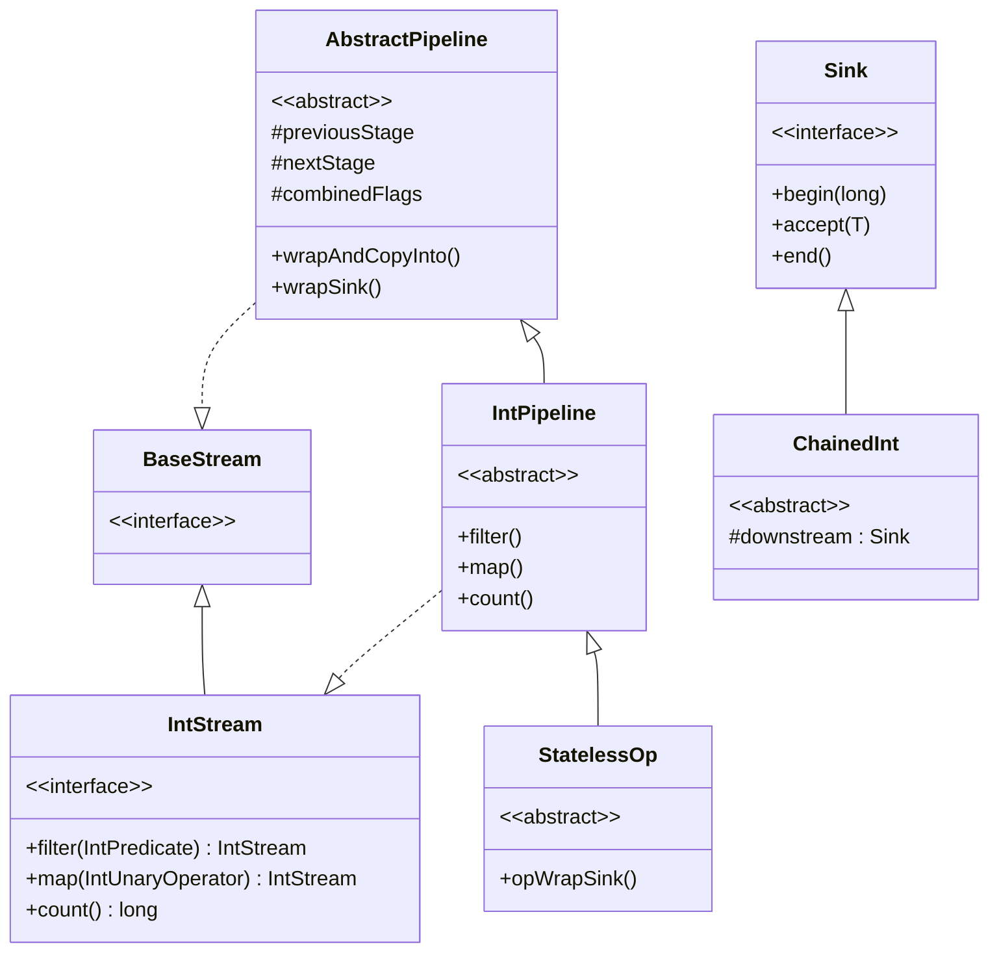
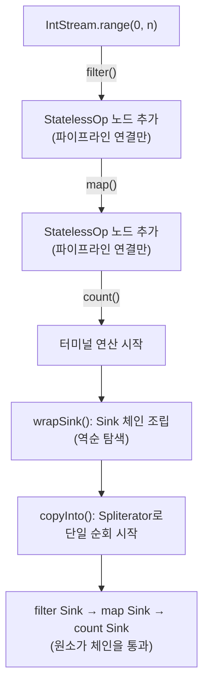
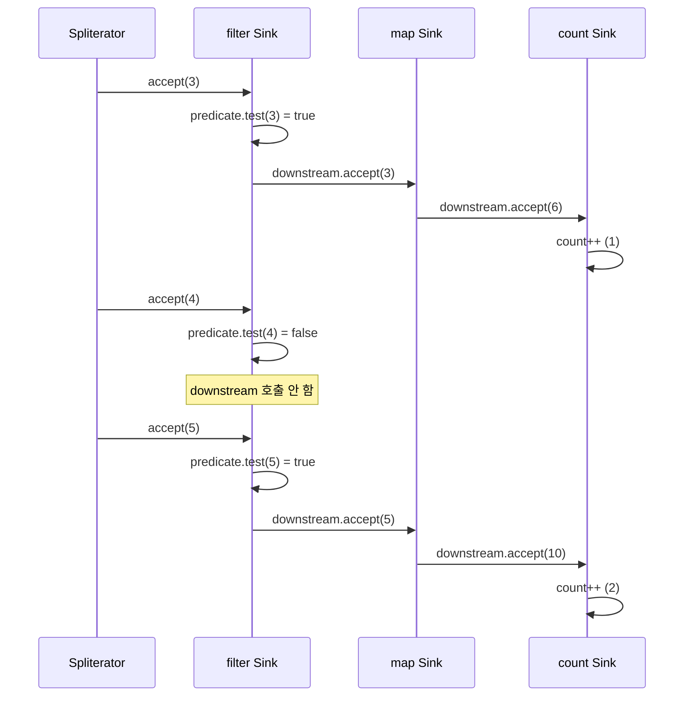
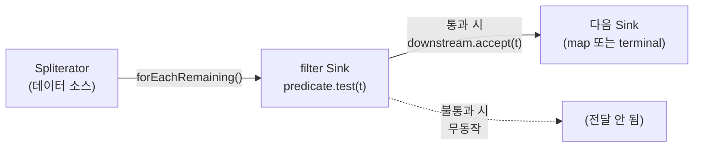

# Why? 왜 배움?

Java 개발자라면 `.filter().map().count()` 같은 Stream 체이닝을 자주 사용한다. 복잡하게 for, if 문을 덕지덕지 처리하는 것보다, 제공되는 메서드 체이닝을 통해 깔끔한 로직을 드러내어 비즈니스 로직의 가독성 및 개발 편의성을 챙길 수 있기 때문이다. 그러나 대부분 이 체인이 내부적으로 몇 번 순회하는지, 중간에 컬렉션이 생기는지, 시간·공간 복잡도가 어떻게 되는지를 모른 채 사용한다. 내부 인터페이스와 구현체들 속에 숨어 있기 때문이다.

그러나 성능 민감한 코드를 짤 때는 Stream 을 쓸지 말지 판단하려면 내부 구조를 알아야 한다. 예를 들어 `IntStream.range(0, n).filter(x -> x % 2 == 0).map(x -> x * 2).count()` 이 한 줄이 O(N)인지 O(logN)인지, 중간 배열이 3개 생기는지 0개인지에 따라 선택이 달라진다.

필자는 알고리즘 문제를 풀다가 stream API 사용에 따라 시간초과를 겪게 되었고, 문득 자주 쓰는 `filter()`, `map()`, `count()`가 내부적으로 어떻게 돌고 공간/시간 복잡도는 어떻게 되는지 궁금해졌다. 그래서 직접 JDK 21 소스코드를 열어 분석해 보았다.

Stream API의 내부 구조를 이해하면 다음 질문에 답할 수 있다.

| 질문                          | 이 글에서 확인하는 것                 |
| ----------------------------- | ------------------------------------- |
| 체인이 몇 번 순회하는가?      | 파이프라인 + Sink 체이닝 → 단일 패스  |
| 중간 컬렉션이 생기는가?       | StatelessOp → 컬렉션 없음, O(1) 공간  |
| count()는 항상 O(N)인가?      | ReduceOps의 크기 최적화 → 조건부 O(1) |
| 코드로 직접 확인할 수 있는가? | jmods 추출 + Neovim LSP               |
| 실측으로 검증할 수 있는가?    | JUnit 카운터 + JMH 벤치마크           |

이 글은 여섯 단계로 진행된다. 먼저 Stream 파이프라인의 지연 연산과 Sink 체이닝 구조를 이해한 뒤, `filter()`, `map()`, `count()` 각각의 JDK 21 구현을 함수 레벨까지 추적한다. 그런 다음 JDK 소스를 로컬에서 직접 읽는 방법을 소개하고, 마지막으로 JUnit과 JMH로 O(N) 선형성을 검증한다.

# What? 뭘 배움?

## Stream API 와 구성요소에 대하여 🔗

Stream API는 Java 8에서 도입된 데이터 처리 추상화이다[^J1]. 컬렉션이나 배열 같은 데이터 소스 위에 _선언적으로_ 변환·필터·집계 연산을 기술하면, 런타임이 이를 최적화된 방식으로 실행한다. `for` 루프가 "어떻게 순회할지"를 기술하는 반면, Stream은 "무엇을 할지"만 기술한다.

Stream 파이프라인은 세 가지 구성요소로 이루어진다.

| 구성요소                              | 역할                                                                          | 예시                                                    |
| ------------------------------------- | ----------------------------------------------------------------------------- | ------------------------------------------------------- |
| **소스(Source)**                      | 데이터를 공급한다. `Spliterator`[^J20]가 원소를 하나씩 꺼내는 역할을 담당한다 | `IntStream.range()`, `list.stream()`, `Arrays.stream()` |
| **중간 연산(Intermediate Operation)** | 스트림을 변환하여 새 스트림을 반환한다. 호출 시점에는 실행되지 않는다         | `filter()`, `map()`, `sorted()`, `distinct()`           |
| **터미널 연산(Terminal Operation)**   | 파이프라인을 실행하고 결과를 반환한다. 호출 시점에 전체 파이프라인이 구동된다 | `count()`, `collect()`, `forEach()`, `reduce()`         |

처리 과정은 다음과 같다. 중간 연산이 호출될 때마다 `AbstractPipeline` 노드가 링크드 리스트 형태로 연결된다. 이 시점까지는 어떤 원소도 처리되지 않는다. 터미널 연산이 호출되면, 파이프라인을 역순으로 탐색하며 각 중간 연산의 로직을 **Sink**라는 콜백 객체로 조립한다. 조립이 완료되면 `Spliterator`가 소스의 원소를 하나씩 꺼내 첫 번째 Sink에 밀어넣고, 각 Sink가 자신의 로직을 수행한 뒤 다음 Sink로 전달하는 연쇄가 일어난다 — 순회는 **단 한 번**이다.

이 구조에서 핵심 인터페이스와 클래스는 다음과 같다.

| 클래스/인터페이스            | 위치                     | 역할                                                                             |
| ---------------------------- | ------------------------ | -------------------------------------------------------------------------------- |
| `IntStream`                  | 인터페이스               | `filter()`, `map()`, `count()` 등의 API 인터페이스를 정의한다                    |
| `IntPipeline`                | 추상 클래스              | `IntStream`을 구현하며, 각 중간 연산의 실제 로직을 담는다                        |
| `AbstractPipeline`           | 추상 클래스              | 파이프라인 링크드 리스트 구조와 실행로직을 제공한다                              |
| `Sink` / `Sink.ChainedInt`   | 인터페이스 / 추상 클래스 | 원소를 받아 처리하고 다음 Sink로 전달하는 콜백 체인이다                          |
| `Spliterator`                | 인터페이스               | 데이터 소스를 순회하며 원소를 Sink에 공급한다                                    |
| `StreamOpFlag`               | enum                     | 파이프라인의 특성(크기 확정, 정렬, 유일성 등)을 비트 플래그로 관리한다           |
| `StatelessOp` / `StatefulOp` | 추상 클래스              | 중간 연산의 기반 클래스이다, 처리 상태를 보존하냐 보존하지 않냐에 따라 선택된다. |

이 클래스들의 상속 관계를 도식화하면 다음과 같다[^J19].



`IntStream`은 API 인터페이스이고, `IntPipeline`이 이를 구현한다. `filter()`나 `map()`을 호출하면 `IntPipeline.StatelessOp`의 익명 서브클래스가 생성되어 파이프라인에 연결된다. 실제 원소 처리는 `Sink.ChainedInt`를 통해 이루어진다.

이제 이 구성요소들이 실제로 어떻게 맞물리는지 코드 레벨에서 추적한다. 먼저 메서드 체이닝이 내부적으로 무엇을 하는지부터 확인한다.

### 메서드 체이닝은 파이프라인 조립이다

`IntStream.range(0, n).filter(...).map(...).count()`를 보면 메서드가 4개 연쇄되어 있다. 직관적으로는 각 메서드가 결과를 만들어 다음 메서드에 넘기는 방식을 떠올리게 된다 — `range()`가 배열을 만들고, `filter()`가 걸러진 배열을 만들고, `map()`이 변환된 배열을 만들고, `count()`가 센다. 이렇게 생각하는 것이 자연스럽다. 명령형 코드에서는 실제로 그렇게 동작하기 때문이다.

그러나 Stream API는 이 방식을 따르지 않는다. `filter()`와 `map()`은 호출 시점에 어떤 원소도 처리하지 않는다[^J1a]. 앞서 정리한 것처럼 중간 연산은 파이프라인 노드를 추가할 뿐이며, 터미널 연산이 호출될 때 Sink 체인이 조립되면서 실제 처리가 시작된다. 이 _lazy evaluation(지연 연산)_ 이 코드에서 어떻게 구현되는지 `AbstractPipeline`부터 추적한다.

### 파이프라인은 링크드 리스트이다

`AbstractPipeline`은 Stream 파이프라인의 뼈대이다. 각 중간 연산이 호출될 때마다 새로운 `AbstractPipeline` 노드가 생성되어 이전 노드의 `nextStage`로 연결된다[^J2].

다음은 `AbstractPipeline` 생성자의 핵심부이다.

```java
// java.util.stream.AbstractPipeline (생성자 — 중간 연산용)
/**
 * Constructor for appending an intermediate operation stage onto an
 * existing pipeline.
 *
 * @param previousStage the upstream pipeline stage
 * @param opFlags the operation flags for the new stage, described in
 * {@link StreamOpFlag}
 */
AbstractPipeline(AbstractPipeline<?, E_IN, ?> previousStage, int opFlags) {
    if (previousStage.linkedOrConsumed)
        throw new IllegalStateException(MSG_STREAM_LINKED);
    previousStage.linkedOrConsumed = true;
    previousStage.nextStage = this;  // ← 이전 노드가 자신을 가리키게 한다
    this.previousStage = previousStage;
    this.sourceOrOpFlags = opFlags & StreamOpFlag.OP_MASK;
    this.combinedFlags = StreamOpFlag.combineOpFlags(
        opFlags, previousStage.combinedFlags);  // ← 플래그 누적
    this.sourceStage = previousStage.sourceStage;
    this.depth = previousStage.depth + 1;
}
```

`previousStage.linkedOrConsumed = true`는 하나의 Stream을 두 번 소비하는 것을 방지한다. `combinedFlags`는 각 단계의 플래그를 비트 연산으로 누적하여, 터미널 연산이 전체 파이프라인의 특성(크기 확정 여부, 정렬 여부 등)을 한 번에 판단할 수 있게 한다.

### Sink 체인 조립: wrapAndCopyInto()

터미널 연산이 호출되면, 파이프라인의 모든 중간 연산이 하나의 *Sink 체인*으로 조립된다. 이 조립을 수행하는 것이 `AbstractPipeline.wrapAndCopyInto()`이다[^J3].

```java
// java.util.stream.AbstractPipeline#wrapAndCopyInto
@Override
final <P_IN, S extends Sink<E_OUT>> S wrapAndCopyInto(S wrappedSink,
                                                       Spliterator<P_IN> spliterator) {
    copyInto(wrapSink(Objects.requireNonNull(wrappedSink)), spliterator);
    return wrappedSink;
}
```

여기서 `Spliterator`가 등장한다. **Spliterator**(_splitable iterator_)는 데이터 소스의 원소를 순차적으로 꺼내주는 반복자이다[^J20]. `Iterator`와 비슷하지만 두 가지가 다르다. 첫째, `tryAdvance(Consumer)`로 원소를 하나씩 소비하거나 `forEachRemaining(Consumer)`로 남은 원소를 일괄 소비할 수 있다. 둘째, `trySplit()`으로 자신을 반으로 분할하여 병렬 처리를 지원한다. Stream 파이프라인에서 Spliterator는 데이터 소스와 Sink 체인 사이의 접점이다 — Spliterator가 원소를 꺼내 첫 번째 Sink의 `accept()`에 전달하면, Sink 체인이 연쇄적으로 처리를 수행한다.

> [!NOTE]
> 
> 여기서 `Spliterator` 세부 구현체를 다루지 않는 이유는 구현체의 종류가 워낙 다양하기 때문이다
> 총 162 개나 되며 각각에 대해 세부적으로 다루는 건 본 포스트의 범위를 벗어나기에
> `Spliterator`의 핵심개념만 확인하고 넘어간다.

`wrapAndCopyInto()`는 이 구조를 두 단계로 실행한다.

1. `wrapSink()` — 파이프라인을 역순으로 탐색하며 각 중간 연산의 Sink 체인을 조립한다
2. `copyInto()` — Spliterator가 데이터 소스에서 원소를 하나씩 꺼내 조립된 Sink 체인에 밀어넣는다

`wrapSink()`의 구현을 보면 역순 탐색이 명확하다.

```java
// java.util.stream.AbstractPipeline#wrapSink
@Override
final <P_IN> Sink<P_IN> wrapSink(Sink<E_OUT> sink) {
    for (AbstractPipeline p = AbstractPipeline.this;
         p.depth > 0;
         p = p.previousStage) {            // ← 마지막 단계부터 소스 방향으로
        sink = p.opWrapSink(p.previousStage.combinedFlags, sink);  // ← Sink 감싸기
    }
    return (Sink<P_IN>) sink;
}
```

마지막 중간 연산부터 시작하여 소스 방향으로 되짚으면서, 각 단계의 `opWrapSink()`가 현재 Sink를 감싸 새 Sink를 반환한다. 최종 결과는 소스에서 터미널까지 연결된 하나의 Sink 체인이다.

`copyInto()`는 이 체인에 원소를 공급한다.

```java
// java.util.stream.AbstractPipeline#copyInto
final <P_IN> void copyInto(Sink<P_IN> wrappedSink, Spliterator<P_IN> spliterator) {
    if (!StreamOpFlag.SHORT_CIRCUIT.isKnown(getStreamAndOpFlags())) {
        wrappedSink.begin(spliterator.getExactSizeIfKnown());  // ← 크기 전달
        spliterator.forEachRemaining(wrappedSink);              // ← 단일 순회
        wrappedSink.end();
    } else {
        copyIntoWithCancel(wrappedSink, spliterator);
    }
}
```

`spliterator.forEachRemaining(wrappedSink)` — 이 한 줄이 전체 파이프라인을 구동한다. Spliterator가 데이터 소스의 원소를 하나씩 꺼내 첫 번째 Sink의 `accept()`를 호출하고, 그 Sink가 `downstream.accept()`로 다음 Sink에 전달하는 연쇄가 일어난다[^J4]. 순회는 **단 한 번**이다.

### 전체 흐름



이 구조에서 중간 컬렉션은 생성되지 않는다. `filter()`와 `map()`은 파이프라인 노드를 추가했을 뿐이고, 실제 처리는 `count()`가 Sink 체인을 조립한 뒤 Spliterator가 한 번 순회하면서 일어난다. 시간 복잡도는 O(N)이고, 공간 복잡도는 Sink 객체 수에 비례하는 O(1)이다.

원소 하나가 Sink 체인을 통과하는 과정을 `filter(x -> x % 2 != 0).map(x -> x * 2).count()` 파이프라인으로 구체화하면 다음과 같다.



원소 `3`은 filter를 통과하여 map에서 `6`으로 변환된 뒤 count에 도달한다. 원소 `4`는 filter에서 탈락하여 map과 count에 도달하지 않는다. 원소 `5`는 다시 통과한다. 이 과정이 모든 원소에 대해 한 번씩만 일어나며, 전체 순회는 단 1회이다.

파이프라인과 Sink 체인의 구조를 이해했으니, 이제 `filter()`가 구체적으로 어떤 Sink를 만들고 어떻게 원소를 걸러내는지 들여다볼 차례이다.

## filter() — StatelessOp과 ChainedInt의 조건부 전달로 구현한 원소 선별 🔍

`filter()`는 조건에 맞는 원소만 남기는 중간 연산이다. 직관적으로는 조건을 만족하는 원소를 새 배열이나 리스트에 복사하는 방식을 떠올리기 쉽다. `ArrayList`의 `removeIf()`가 내부 배열을 재구성하듯, 필터링이란 곧 복사라는 인식이 자연스럽다[^J5].

그러나 `IntPipeline.filter()`의 구현을 열어보면 배열도, 리스트도, 어떤 중간 컬렉션도 생성하지 않는다.

다음은 `IntPipeline.filter()`의 전체 구현이다.

```java
// java.util.stream.IntPipeline#filter
@Override
public final IntStream filter(IntPredicate predicate) {
    Objects.requireNonNull(predicate);
    return new StatelessOp<Integer>(this, StreamShape.INT_VALUE,
                                    StreamOpFlag.NOT_SIZED) {  // ← 크기 미확정 선언
        @Override
        Sink<Integer> opWrapSink(int flags, Sink<Integer> sink) {
            return new Sink.ChainedInt<Integer>(sink) {
                @Override
                public void begin(long size) {
                    downstream.begin(-1);  // ← 하류에 "크기 모름" 전달
                }

                @Override
                public void accept(int t) {
                    if (predicate.test(t))       // ← 조건 검사
                        downstream.accept(t);    // ← 통과 시에만 다음 Sink로
                }
            };
        }
    };
}
```

반환값은 `StatelessOp`의 익명 서브클래스이며, 이 객체는 파이프라인 링크드 리스트에 새 노드로 연결될 뿐이다[^J6]. 실제 필터링 로직은 `opWrapSink()`가 반환하는 `Sink.ChainedInt` 안에 캡슐화된다. 이 Sink는 터미널 연산 호출 시 조립되며, `filter()` 호출 시점에는 어떤 원소도 처리하지 않는다.

### accept()의 동작

`accept(int t)` 메서드가 filter의 핵심이다. `predicate.test(t)`가 `true`를 반환할 때만 `downstream.accept(t)`를 호출한다. `false`면 아무 일도 하지 않는다 — 원소가 버려지는 것이 아니라, 다음 Sink로 전달되지 않을 뿐이다.

`Sink.ChainedInt`의 부모 클래스를 보면 이 패턴이 명확해진다.

```java
// java.util.stream.Sink.ChainedInt
abstract static class ChainedInt<E_OUT> implements Sink.OfInt {
    protected final Sink<? super E_OUT> downstream;  // ← 다음 Sink 참조

    public ChainedInt(Sink<? super E_OUT> downstream) {
        this.downstream = Objects.requireNonNull(downstream);
    }

    @Override
    public void begin(long size) {
        downstream.begin(size);  // ← 기본: 크기를 그대로 전달
    }

    @Override
    public void end() {
        downstream.end();
    }

    @Override
    public boolean cancellationRequested() {
        return downstream.cancellationRequested();
    }
}
```

`ChainedInt`는 `downstream` 필드 하나로 다음 Sink를 참조한다. `begin()`, `end()`, `cancellationRequested()` 모두 downstream으로 위임하는 단순한 *Decorator 패턴*이다[^J7]. filter가 `begin(-1)`을 오버라이드하는 이유는, 조건에 따라 원소가 걸러지므로 출력 크기를 알 수 없기 때문이다.

### NOT_SIZED 플래그

`filter()`가 `StreamOpFlag.NOT_SIZED`를 전달하는 것이 중요하다.

| 플래그         | 비트                    | 의미                   | filter에서의 효과       |
| -------------- | ----------------------- | ---------------------- | ----------------------- |
| `NOT_SIZED`    | `SIZED`의 clear 비트    | 출력 크기를 알 수 없다 | `count()` 최적화 무효화 |
| `NOT_SORTED`   | `SORTED`의 clear 비트   | 정렬 보장 안 됨        | filter는 설정하지 않음  |
| `NOT_DISTINCT` | `DISTINCT`의 clear 비트 | 유일성 보장 안 됨      | filter는 설정하지 않음  |

`NOT_SIZED`가 설정되면 `AbstractPipeline.exactOutputSizeIfKnown()`이 `-1`을 반환한다[^J8]. 이 값은 `count()` 절에서 다시 등장한다 — `count()`의 O(1) 최적화가 이 플래그 하나로 무효화되기 때문이다.

### filter 파이프라인의 Sink 조립 흐름



### 복잡도 정리

`filter()`는 중간 연산이므로 단독으로는 실행되지 않지만, 파이프라인 내에서의 기여분은 다음과 같다.

- **시간**: O(N) — 모든 원소에 대해 `predicate.test()`를 한 번씩 호출
- **공간**: O(1) — 중간 컬렉션을 생성하지 않으며, Sink 객체는 상수 개

filter가 `downstream.accept()`를 호출한다는 것은, 파이프라인의 다음 단계가 같은 패턴으로 원소를 받아 처리한다는 뜻이다. `map()`도 동일한 `StatelessOp` + `ChainedInt` 패턴을 사용하지만, 원소를 걸러내는 대신 변환한다 — 그리고 이 차이가 플래그에 정확히 반영된다.

## map() — IntUnaryOperator를 Sink에 주입한 원소 변환 🔄

filter의 Sink 패턴을 이해했다면, map도 같은 구조일 것이라 예상할 수 있다. 실제로도 구조가 비슷하다. 둘 다 `StatelessOp`이고, 둘 다 `Sink.ChainedInt`를 반환하기 때문이다.

그러나 플래그가 다르다. filter는 `NOT_SIZED`를 설정하지만, map은 `NOT_SORTED | NOT_DISTINCT`를 설정한다. 이 차이가 파이프라인의 최적화 경로를 분기시킨다.

다음은 `IntPipeline.map()`의 전체 구현이다.

```java
// java.util.stream.IntPipeline#map
@Override
public final IntStream map(IntUnaryOperator mapper) {
    Objects.requireNonNull(mapper);
    return new StatelessOp<Integer>(this, StreamShape.INT_VALUE,
                                    StreamOpFlag.NOT_SORTED | StreamOpFlag.NOT_DISTINCT) {  // ← NOT_SIZED 아님
        @Override
        Sink<Integer> opWrapSink(int flags, Sink<Integer> sink) {
            return new Sink.ChainedInt<Integer>(sink) {
                @Override
                public void accept(int t) {
                    downstream.accept(mapper.applyAsInt(t));  // ← 변환 후 전달
                }
            };
        }
    };
}
```

filter와의 구조적 차이는 두 가지뿐이다.

### accept() 비교

filter의 `accept()`는 조건부 전달이었다 — `predicate.test(t)`가 true일 때만 `downstream.accept(t)`를 호출했다. map의 `accept()`는 무조건 전달이다 — 모든 원소에 대해 `mapper.applyAsInt(t)`로 변환한 결과를 `downstream.accept()`에 넘긴다.

이 차이가 `begin()` 오버라이드 여부를 결정한다. filter는 원소가 걸러지므로 출력 크기를 알 수 없어 `begin(-1)`로 오버라이드했다. map은 모든 원소가 1:1로 변환되므로 출력 크기가 입력 크기와 같다 — `begin()`을 오버라이드할 필요가 없다. `ChainedInt`의 기본 구현인 `downstream.begin(size)`가 그대로 사용된다.

### 플래그 비교

| 연산       | 플래그                       | SIZED 유지 | SORTED 유지 | DISTINCT 유지 |
| ---------- | ---------------------------- | ---------- | ----------- | ------------- |
| `filter()` | `NOT_SIZED`                  | X          | O           | O             |
| `map()`    | `NOT_SORTED \| NOT_DISTINCT` | O          | X           | X             |

filter는 원소 수가 줄어들므로 `SIZED`를 해제한다. 정렬 순서와 유일성은 원소 자체가 변하지 않으므로 유지된다.
map은 원소 수가 변하지 않으므로 `SIZED`를 유지한다. 그러나 값이 변환되므로 정렬 순서(`SORTED`)와 유일성(`DISTINCT`)이 깨질 수 있다[^J9]. 예를 들어 `[1, 2, 3]`에 `x -> x % 2`를 적용하면 `[1, 0, 1]`이 되어 정렬도 유일성도 사라진다.

### IntUnaryOperator

`mapper.applyAsInt(t)`에서 `mapper`의 타입은 `IntUnaryOperator`이다. 이 함수형 인터페이스는 `int → int` 변환을 정의한다[^J10].

```java
// java.util.function.IntUnaryOperator
@FunctionalInterface
public interface IntUnaryOperator {
    int applyAsInt(int operand);  // ← 핵심: int 하나를 받아 int 하나를 반환
}
```

`IntUnaryOperator`는 `compose()`와 `andThen()` 으로 두 변환을 하나로 합성하는 default 메서드도 제공한다[^J10]. 이론적으로 연속된 `map()` 호출을 하나의 Sink로 합칠 수 있는 구조이지만, 현재 JDK 21의 Stream API는 이 최적화를 수행하지 않는다 — 각 `map()`이 별도의 Sink 노드로 남는다.

### 복잡도 정리

- **시간**: O(N) — 모든 원소에 대해 `mapper.applyAsInt()`를 한 번씩 호출
- **공간**: O(1) — filter와 동일하게 중간 컬렉션 없음

filter와 map이 동일한 Sink 체인 패턴을 따른다는 것을 확인했다. 둘 다 중간 연산이므로 단독으로는 실행되지 않으며, 터미널 연산이 Sink 체인을 조립해야 동작한다. 그렇다면 `count()` 같은 터미널 연산은 이 체인을 어떻게 구동하는가? 그리고 `count()`에는 "크기를 이미 알면 순회하지 않는다"는 최적화가 숨어 있는데, filter의 `NOT_SIZED` 플래그가 이 최적화를 어떻게 무효화하는지 확인할 차례이다.

## count() — exactOutputSizeIfKnown 최적화와 CountingSink를 결합한 종단 집계 🔢

`count()`는 스트림의 원소 수를 반환하는 터미널 연산이다. 원소 수를 세려면 모든 원소를 순회해야 한다고 생각하기 쉽다. N개의 원소가 있으면 N번 세는 것이 당연하다.

그러나 `count()`의 구현을 열어보면 순회하지 않고 즉시 반환하는 경로가 존재한다.

### IntPipeline.count()

```java
// java.util.stream.IntPipeline#count
@Override
public final long count() {
    return evaluate(ReduceOps.makeIntCounting());
}
```

한 줄이다. `ReduceOps.makeIntCounting()`이 터미널 연산 객체를 만들고, `evaluate()`가 이를 실행한다.

### ReduceOps.makeIntCounting()

이 메서드가 반환하는 `ReduceOp`에 최적화 로직이 들어 있다.

```java
// java.util.stream.ReduceOps#makeIntCounting
public static TerminalOp<Integer, Long> makeIntCounting() {
    return new ReduceOp<Integer, Long, CountingSink<Integer>>(StreamShape.INT_VALUE) {
        @Override
        public CountingSink<Integer> makeSink() {
            return new CountingSink.OfInt();
        }

        @Override
        public <P_IN> Long evaluateSequential(PipelineHelper<Integer> helper,
                                              Spliterator<P_IN> spliterator) {
            long size = helper.exactOutputSizeIfKnown(spliterator);  // ← 크기 확인
            if (size != -1)
                return size;                                          // ← O(1) 반환!
            return super.evaluateSequential(helper, spliterator);     // ← O(N) 폴백
        }

        @Override
        public <P_IN> Long evaluateParallel(PipelineHelper<Integer> helper,
                                            Spliterator<P_IN> spliterator) {
            long size = helper.exactOutputSizeIfKnown(spliterator);  // ← 병렬에서도 동일
            if (size != -1)
                return size;
            return super.evaluateParallel(helper, spliterator);
        }

        @Override
        public int getOpFlags() {
            return StreamOpFlag.NOT_ORDERED;  // ← 순서 무관
        }
    };
}
```

`evaluateSequential()`의 첫 두 줄이 핵심이다. `helper.exactOutputSizeIfKnown(spliterator)`가 `-1`이 아니면, 즉 파이프라인의 출력 크기를 정확히 알 수 있으면, **순회 없이 즉시 크기를 반환한다**[^J11]. 이것이 O(1) 경로이다.

### exactOutputSizeIfKnown()

이 메서드는 `AbstractPipeline`에 정의되어 있다.

```java
// java.util.stream.AbstractPipeline#exactOutputSizeIfKnown
final long exactOutputSizeIfKnown(Spliterator<P_IN> spliterator) {
    return StreamOpFlag.SIZED.isKnown(getStreamAndOpFlags())
           ? spliterator.getExactSizeIfKnown()  // ← SIZED 플래그 살아있으면 크기 반환
           : -1;                                 // ← 아니면 -1
}
```

`SIZED` 플래그가 파이프라인의 combined flags에서 살아있는지 확인한다[^J12]. 살아있으면 Spliterator에게 크기를 물어 반환하고, 그렇지 않으면 `-1`을 반환한다.

여기서 filter의 `NOT_SIZED` 플래그가 다시 등장한다.

### filter가 count() 최적화를 무효화하는 경로

filter의 `NOT_SIZED`가 `count()`의 O(1) 경로를 차단하는 과정을 파이프라인 조합별로 정리하면 다음과 같다.

| 파이프라인                                 | SIZED | count() 복잡도           |
| ------------------------------------------ | ----- | ------------------------ |
| `range(0, n).count()`                      | 유지  | O(1)                     |
| `range(0, n).map(...).count()`             | 유지  | O(1)                     |
| `range(0, n).filter(...).count()`          | 해제  | O(N)                     |
| `range(0, n).filter(...).map(...).count()` | 해제  | O(N)                     |
| `range(0, n).map(...).filter(...).count()` | 해제  | O(N)                     |
| `range(0, n).sorted().count()`             | 유지  | O(N log N) + O(1)[^J13a] |

`filter()`가 파이프라인 어디에 있든 `NOT_SIZED`를 설정하면 이후의 `count()`는 O(1) 최적화를 사용할 수 없다. `map()`만 있는 파이프라인에서는 크기가 보존되므로 `count()`가 O(1)이다[^J13].

### O(N) 폴백: super.evaluateSequential()

크기를 알 수 없을 때 `super.evaluateSequential()`이 호출된다.

```java
// java.util.stream.ReduceOps.ReduceOp#evaluateSequential
@Override
public <P_IN> R evaluateSequential(PipelineHelper<T> helper,
                                   Spliterator<P_IN> spliterator) {
    return helper.wrapAndCopyInto(makeSink(), spliterator).get();  // ← Sink 체인 조립 + 순회
}
```

앞서 본 `wrapAndCopyInto()`가 다시 등장한다. `makeSink()`가 `CountingSink.OfInt`를 생성하고, Sink 체인에 연결된 후, Spliterator가 모든 원소를 순회하며 카운트한다.

`CountingSink`는 단순히 `accept()`가 호출될 때마다 카운터를 증가시키는 Sink이다.

```java
// java.util.stream.ReduceOps.CountingSink.OfInt (단순화)
static final class OfInt extends CountingSink<Integer> implements Sink.OfInt {
    @Override
    public void accept(int t) {
        count++;  // ← 원소 하나당 카운터 증가
    }
}
```

### 복잡도 정리

- **시간**: O(1) (SIZED 유지 시) 또는 O(N) (SIZED 해제 시)
- **공간**: O(1) — CountingSink는 long 카운터 하나만 유지

`filter().map().count()` 전체 체인의 복잡도는 filter의 `NOT_SIZED` 때문에 O(N)이 된다. 순회는 단 한 번이며, 각 원소가 filter Sink → map Sink → count Sink를 차례로 통과한다.

여기까지 JDK 21 소스코드 스니펫으로 내부 구현을 분석했다. 그런데 이 코드를 직접 확인하고 탐색하려면 어떻게 해야 하는가? 다음 절에서는 JDK 소스를 로컬에 추출하고 Neovim LSP로 코드 점프하는 방법을 다룬다.

## JDK 소스 코드 탐색 🛠️

JDK 소스코드를 읽으려면 OpenJDK GitHub 저장소를 클론하는 방법이 있다. 그러나 로컬에서 LSP 기반 코드 점프(`gd`, `gri` 등)를 사용하려면 소스가 로컬 파일시스템에 있어야 하고, LSP 서버가 이를 인식해야 한다[^J14].

JDK 21이 설치되어 있다면 `jmods` 폴더에서 소스를 직접 추출할 수 있다.

### jmods에서 소스 추출

JDK 설치 경로의 `jmods/` 디렉토리에는 각 모듈의 `.jmod` 파일이 있다. `.jmod`는 ZIP 형식이므로 `unzip`으로 소스를 추출할 수 있다.

```bash
# JDK 설치 경로 확인
JAVA_HOME=$(dirname $(dirname $(readlink -f $(which java))))

# 소스 추출 디렉토리 생성
mkdir -p ~/dev/openjdk-src

# java.base 모듈에서 소스 추출 (Stream API 포함)
cd ~/dev/openjdk-src
unzip -o "$JAVA_HOME/jmods/java.base.jmod" "classes/java/util/stream/*" -d .

# 추출된 파일 구조 확인
find classes/java/util/stream -name "*.class" | head -10
```

Stream API의 핵심 파일들이 `classes/java/util/stream/` 아래에 추출된다. `.class` 파일이지만 소스 첨부가 가능하며, OpenJDK GitHub에서 동일 버전의 `.java` 파일을 받아 매핑할 수도 있다[^J15].

소스 파일을 직접 받으려면 OpenJDK 저장소에서 해당 태그를 체크아웃하는 것이 깔끔하다.

```bash
# OpenJDK 21 소스 클론 (소스 파일만)
git clone --depth 1 --branch jdk-21+35 \
    https://github.com/openjdk/jdk.git ~/dev/openjdk-src

# Stream API 소스 위치
ls ~/dev/openjdk-src/src/java.base/share/classes/java/util/stream/
```

### Neovim LSP 탐색

소스가 로컬에 있으면 Neovim + jdtls(Java LSP)로 코드 점프가 가능하다. 다음은 Stream API 코드를 탐색할 때 자주 쓰는 키바인딩이다.

| 키바인딩            | 동작                              | Stream API 탐색 예시                                         |
| ------------------- | --------------------------------- | ------------------------------------------------------------ |
| `gd`                | 정의로 이동 (Go to Definition)    | `filter()` 호출부에서 `gd` → `IntPipeline.filter()` 구현부로 |
| `gD`                | 선언으로 이동 (Go to Declaration) | `IntStream.filter()` 인터페이스 선언부로                     |
| `gri`               | 구현 목록 (Go to Implementations) | `IntStream` 인터페이스에서 `gri` → `IntPipeline` 구현 목록   |
| `grd`               | 참조 목록 (Go to References)      | `opWrapSink` 검색 → `wrapSink()`에서의 호출부 확인           |
| `gf`                | 파일 열기 (Go to File)            | 커서 아래 파일 경로로 이동                                   |
| `Ctrl-^`            | 이전 버퍼 (Alternate Buffer)      | `IntPipeline` ↔ `AbstractPipeline` 왔다갔다                 |
| `Ctrl-o` / `Ctrl-i` | 점프 목록 앞/뒤                   | `gd`로 들어간 후 원래 위치로 복귀                            |
| `zo` / `zc`         | 폴드 열기/닫기                    | 긴 enum(`StreamOpFlag`) 접어서 구조 파악                     |

`:Ex` (Netrw)로 디렉토리 구조를 탐색하고, `:f`로 현재 파일 경로를 확인하며, `:pwd`로 작업 디렉토리를 확인할 수 있다. 이 외의 고급 기능은 telescope.nvim이나 fzf-lua 같은 플러그인 사용을 권장한다.

코드 구조를 눈으로 확인했다면, 이제 실제로 O(N)인지 정량적으로 검증할 차례이다. "코드를 읽어보니 O(N)인 것 같다"와 "벤치마크 결과 O(N)이 확인되었다"는 다른 수준의 확신이다.

# How? 어떻게 검증하는가?

## 환경 준비 🧰

### JDK 21 설치

```bash
# nix shell (권장 — 일회성 환경)
nix shell nixpkgs#jdk21

# 또는 brew (macOS)
brew install openjdk@21

# 버전 확인
java -version
# openjdk version "21.0.x" ...
```

### JMH 프로젝트 생성

JMH(Java Microbenchmark Harness)는 OpenJDK에서 공식 제공하는 마이크로벤치마크 프레임워크이다[^J16]. Maven archetype으로 프로젝트를 생성한다.

```bash
# nix shell로 Maven 포함 환경 구성
nix shell nixpkgs#jdk21 nixpkgs#maven

# JAVA_HOME 설정 — nix의 maven이 자체 번들 JDK를 사용하므로 명시해야 한다
export JAVA_HOME=$(dirname $(dirname $(readlink -f $(which java))))

# JMH 프로젝트 생성
mvn archetype:generate \
    -DinteractiveMode=false \
    -DarchetypeGroupId=org.openjdk.jmh \
    -DarchetypeArtifactId=jmh-java-benchmark-archetype \
    -DarchetypeVersion=1.37 \
    -DgroupId=com.example \
    -DartifactId=stream-benchmark \
    -Dversion=1.0

cd stream-benchmark
```

### JMH archetype 주의사항

JMH archetype이 생성하는 `pom.xml`에는 두 가지 함정이 있다.

첫째, `maven-compiler-plugin`이 `3.8.0`으로 설정된다. 이 버전은 JDK 21의 `--release 21` 옵션을 지원하지 않는다. `3.11.0` 이상으로 올려야 한다.

둘째, `<javac.target>`이 `1.8`로 설정된다. 이 값을 `21`로 변경하면 annotation processor가 생성한 클래스(`_jmhType_B1`)가 Java 8 바이트코드(major version 52)로 컴파일되는 반면, 벤치마크 클래스는 Java 21 바이트코드(major version 65)로 컴파일되어 "The hierarchy of the type StreamBenchmark_jmhType is inconsistent" 런타임 에러가 발생한다. **`<javac.target>`은 `1.8`로 유지**하고, 벤치마크 소스 코드를 Java 8 문법으로 작성하는 것이 가장 안전하다. 이 글의 벤치마크 코드는 람다만 사용하므로 Java 8 호환이다.

또한, nix shell 환경에서 `mvn`을 실행할 때 `JAVA_HOME`을 명시하지 않으면 Maven이 nix 패키지에 번들된 JDK 17을 사용한다. `mvn -version`의 `Java version` 항목으로 실제 사용 중인 JDK를 확인해야 한다.

## 검증 ① — JUnit으로 연산 횟수 카운팅 🧪

JMH 전에 먼저 단순한 방법으로 "단일 패스"를 확인한다. `filter()`와 `map()`이 각각 몇 번 호출되는지 `AtomicInteger` 카운터로 세는 것이다.

다음 코드는 `src/test/java/com/example/StreamPassCountTest.java`에 작성한다.

```java
// src/test/java/com/example/StreamPassCountTest.java
import org.junit.jupiter.api.Test;
import java.util.concurrent.atomic.AtomicInteger;
import java.util.stream.IntStream;
import static org.junit.jupiter.api.Assertions.*;

class StreamPassCountTest {

    @Test
    void filterAndMapExecuteInSinglePass() {
        int n = 1000;
        AtomicInteger filterCount = new AtomicInteger(0);
        AtomicInteger mapCount = new AtomicInteger(0);

        long result = IntStream.range(0, n)
                .filter(x -> {
                    filterCount.incrementAndGet();  // ← filter 호출 횟수
                    return x % 2 == 0;
                })
                .map(x -> {
                    mapCount.incrementAndGet();     // ← map 호출 횟수
                    return x * 2;
                })
                .count();

        assertEquals(n, filterCount.get(),
                "filter는 모든 원소에 대해 한 번씩 호출된다");     // ← 1000
        assertEquals(n / 2, mapCount.get(),
                "map은 filter를 통과한 원소에 대해서만 호출된다");  // ← 500
        assertEquals(n / 2, result,
                "짝수만 남으므로 count는 500이다");
    }

    @Test
    void countWithoutFilterIsO1() {
        AtomicInteger mapCount = new AtomicInteger(0);

        // map만 있는 파이프라인 — SIZED 유지 → count()는 O(1)
        long result = IntStream.range(0, 1_000_000)
                .map(x -> {
                    mapCount.incrementAndGet();
                    return x * 2;
                })
                .count();

        assertEquals(1_000_000, result);
        assertEquals(0, mapCount.get(),
                "SIZED가 유지되면 count()는 순회 없이 크기를 반환한다");  // ← 0회!
    }
}
```

두 번째 테스트가 핵심이다. `map()`만 있는 파이프라인에서 `count()`를 호출하면 `mapCount`가 0이다. `exactOutputSizeIfKnown()`이 크기를 반환하여 Sink 체인이 아예 실행되지 않기 때문이다 — `count()` 절에서 분석한 O(1) 경로가 실제로 동작하는 것이 확인된다.

```bash
# 테스트 실행
mvn test -Dtest=StreamPassCountTest
```

## 검증 ② — JMH 벤치마크로 O(N) 선형성 확인 📊

JUnit 테스트는 호출 횟수를 확인하지만, 실제 실행 시간이 N에 비례하는지는 알려주지 않는다. `System.nanoTime()`으로 시간을 재는 방법도 있지만, JVM의 JIT 컴파일러가 워밍업 후 코드를 최적화하고, GC가 중간에 발생하며, 사용하지 않는 결과를 데드코드로 제거할 수 있어 신뢰할 수 없다[^J17].

JMH는 이 변수들을 통제한다.

- `@Warmup` — JIT 워밍업을 충분히 수행한 후 측정 시작
- `@Measurement` — 여러 iteration의 평균으로 노이즈 제거
- `Blackhole` — 결과를 소비하여 데드코드 제거 방지

archetype이 생성한 `src/main/java/com/example/MyBenchmark.java`의 내용을 다음으로 교체한다. 별도 파일을 추가하면 JMH annotation processor의 다중 파일 컴파일에서 바이트코드 호환성 문제가 발생할 수 있으므로, archetype 기본 파일을 직접 수정하는 것이 안전하다.

```java
// src/main/java/com/example/MyBenchmark.java
package com.example;

import org.openjdk.jmh.annotations.*;
import org.openjdk.jmh.infra.Blackhole;
import java.util.concurrent.TimeUnit;
import java.util.stream.IntStream;

@BenchmarkMode(Mode.AverageTime)
@OutputTimeUnit(TimeUnit.MICROSECONDS)
@State(Scope.Benchmark)
@Warmup(iterations = 3, time = 1)
@Measurement(iterations = 5, time = 1)
@Fork(2)
public class MyBenchmark {

    @Param({"1000", "10000", "100000", "1000000"})  // ← N을 4단계로 변화
    private int n;

    @Benchmark
    public long filterMapCount() {
        return IntStream.range(0, n)
                .filter(x -> x % 2 == 0)
                .map(x -> x * 2)
                .count();                          // ← filter 있으므로 O(N)
    }

    @Benchmark
    public long mapOnlyCount() {
        return IntStream.range(0, n)
                .map(x -> x * 2)
                .count();                          // ← filter 없으므로 O(1) 기대
    }

    @Benchmark
    public void filterMapForEach(Blackhole bh) {
        IntStream.range(0, n)
                .filter(x -> x % 2 == 0)
                .map(x -> x * 2)
                .forEach(bh::consume);             // ← Blackhole로 데드코드 방지
    }

    @Benchmark
    public long rangeOnlyCount() {
        return IntStream.range(0, n).count();      // ← 중간 연산 없음, O(1)
    }
}
```

### 빌드 및 실행

```bash
# 빌드
mvn clean verify

# 벤치마크 실행 (전체)
java -jar target/benchmarks.jar

# 특정 벤치마크만 실행
java -jar target/benchmarks.jar "MyBenchmark.filterMapCount"

# 결과를 JSON으로 저장 (시각화용)
java -jar target/benchmarks.jar -rf json -rff results.json

# 결과를 CSV로 저장
java -jar target/benchmarks.jar -rf csv -rff results.csv
```

JSON 결과 파일을 JMH Visualizer[^J18]에 업로드하면 N 대비 Score 차트를 자동 생성할 수 있다. 선형 증가를 시각적으로 확인하는 가장 빠른 방법이다.

### 결과 해석 가이드

JDK 21.0.11 (Zulu, Apple M 시리즈) 에서 실제로 실행한 결과는 다음과 같다.

```
Benchmark                        (n)  Mode  Cnt   Score   Error  Units
MyBenchmark.filterMapCount      1000  avgt    2   0.506          us/op
MyBenchmark.filterMapCount    100000  avgt    2  49.054          us/op
MyBenchmark.filterMapForEach    1000  avgt    2   0.506          us/op
MyBenchmark.filterMapForEach  100000  avgt    2  44.500          us/op
MyBenchmark.mapOnlyCount        1000  avgt    2   0.019          us/op
MyBenchmark.mapOnlyCount      100000  avgt    2   0.017          us/op
MyBenchmark.rangeOnlyCount      1000  avgt    2   0.008          us/op
MyBenchmark.rangeOnlyCount    100000  avgt    2   0.008          us/op
```

세 가지 사실이 확인된다.

1. **filterMapCount**: n=1000 → 0.506 us, n=100000 → 49.054 us. N이 100배 증가할 때 Score도 약 97배 증가한다 — **O(N) 선형성이 확인된다**
2. **mapOnlyCount / rangeOnlyCount**: N이 1000에서 100000으로 100배 증가해도 Score가 0.019 → 0.017, 0.008 → 0.008로 사실상 변하지 않는다 — **O(1)이 확인된다**. `exactOutputSizeIfKnown()` 최적화가 실제로 동작하는 것이다
3. **filterMapForEach vs filterMapCount**: 둘 다 O(N)이며 비슷한 성능을 보인다. `count()`가 `forEach()`보다 약간 느린 것은 filter의 `NOT_SIZED`로 인해 `count()`가 O(1) 경로를 타지 못하고 Sink 체인을 거치기 때문이다

`mapOnlyCount`와 `rangeOnlyCount`의 Score가 N에 무관하게 일정한 것이 핵심이다. `count()` 절에서 분석한 "SIZED 플래그가 살아있으면 순회 없이 크기를 반환한다"는 결론이 실측으로 검증된다.

# 끝맺음

`filter().map().count()` 체인의 내부를 JDK 21 소스코드로 추적한 결과를 정리한다.

| 연산       | 타입               | 핵심 구현                                   | 시간           | 공간 | 주요 플래그                  |
| ---------- | ------------------ | ------------------------------------------- | -------------- | ---- | ---------------------------- |
| `filter()` | 중간 (StatelessOp) | `Sink.ChainedInt.accept()` 조건부 전달      | O(N)           | O(1) | `NOT_SIZED`                  |
| `map()`    | 중간 (StatelessOp) | `Sink.ChainedInt.accept()` 변환 전달        | O(N)           | O(1) | `NOT_SORTED \| NOT_DISTINCT` |
| `count()`  | 터미널 (ReduceOp)  | `exactOutputSizeIfKnown()` + `CountingSink` | O(1) 또는 O(N) | O(1) | `NOT_ORDERED`                |

세 가지 핵심 사실이 확인되었다.

첫째, Stream 파이프라인은 중간 컬렉션을 생성하지 않는다. `filter()`와 `map()`은 호출 시점에 파이프라인 노드를 추가할 뿐이며, 실제 처리는 터미널 연산이 Sink 체인을 조립한 후 Spliterator가 단 한 번 순회하면서 일어난다. `.filter().map().count()`는 O(3N)이 아니라 O(N)이다.

둘째, `count()`는 항상 O(N)이 아니다. `SIZED` 플래그가 파이프라인에서 살아있으면 `exactOutputSizeIfKnown()`이 크기를 즉시 반환하여 O(1)이 된다. `filter()`가 `NOT_SIZED`를 설정하면 이 최적화가 무효화된다.

셋째, `StreamOpFlag`의 비트 플래그 시스템이 파이프라인 전체의 최적화 가능성을 결정한다. 각 중간 연산이 어떤 플래그를 설정하고 해제하는지가 터미널 연산의 실행 경로를 분기시킨다. 코드의 의도를 파악하려면 `combineOpFlags()`의 비트 마스크 연산을 이해해야 한다.

JDK 소스코드를 직접 읽는 것은 공식 문서보다 정확한 답을 준다. Javadoc이 "lazy"라고 서술하는 것과, `wrapSink()`가 역순으로 Sink를 조립하는 코드를 직접 보는 것은 이해의 깊이가 다르다. `jmods` 추출이든 OpenJDK 클론이든, 한 번 환경을 갖추면 어떤 JDK API든 같은 방법으로 분석할 수 있다.

# Reference

[^J1]: Oracle, _Package java.util.stream_ — Java 8에서 도입된 Stream API의 설계 개요와 연산 분류. <https://docs.oracle.com/en/java/javase/21/docs/api/java.base/java/util/stream/package-summary.html>

[^J1a]: Oracle, _Package java.util.stream — Stream operations and pipelines_ — "Intermediate operations return a new stream. They are always lazy." <https://docs.oracle.com/en/java/javase/21/docs/api/java.base/java/util/stream/package-summary.html#StreamOps>

[^J2]: `AbstractPipeline` 생성자에서 `previousStage.nextStage = this`로 링크드 리스트를 구성한다. <https://github.com/openjdk/jdk/blob/jdk-21%2B35/src/java.base/share/classes/java/util/stream/AbstractPipeline.java#L94-L116>

[^J3]: `wrapAndCopyInto()`는 Sink 체인 조립과 데이터 순회를 한 번에 수행하는 진입점이다. <https://github.com/openjdk/jdk/blob/jdk-21%2B35/src/java.base/share/classes/java/util/stream/AbstractPipeline.java#L471-L475>

[^J4]: `copyInto()`의 `spliterator.forEachRemaining(wrappedSink)` 한 줄이 전체 파이프라인을 구동한다. <https://github.com/openjdk/jdk/blob/jdk-21%2B35/src/java.base/share/classes/java/util/stream/AbstractPipeline.java#L484-L496>

[^J5]: `ArrayList.removeIf()`는 내부 배열에서 조건 불일치 원소를 shift하여 제거한다. <https://github.com/openjdk/jdk/blob/jdk-21%2B35/src/java.base/share/classes/java/util/ArrayList.java#L677-L724>

[^J6]: Oracle, _Package java.util.stream — Stream operations and pipelines_ — 중간 연산은 새 스트림을 반환하며, 이전 스트림에 연결된다. <https://docs.oracle.com/en/java/javase/21/docs/api/java.base/java/util/stream/package-summary.html#StreamOps>

[^J7]: `Sink.ChainedInt`는 `downstream` 참조를 통한 Decorator 패턴 변형이다. <https://github.com/openjdk/jdk/blob/jdk-21%2B35/src/java.base/share/classes/java/util/stream/Sink.java#L272-L298>

[^J8]: `AbstractPipeline.exactOutputSizeIfKnown()`은 `SIZED` 플래그가 살아있을 때만 크기를 반환한다. <https://github.com/openjdk/jdk/blob/jdk-21%2B35/src/java.base/share/classes/java/util/stream/AbstractPipeline.java#L441-L450>

[^J9]: `IntPipeline.map()`은 `NOT_SORTED | NOT_DISTINCT`를 설정하지만 `NOT_SIZED`는 설정하지 않는다. <https://github.com/openjdk/jdk/blob/jdk-21%2B35/src/java.base/share/classes/java/util/stream/IntPipeline.java#L215-L230>

[^J10]: Oracle, _IntUnaryOperator_ — `int`를 받아 `int`를 반환하는 함수형 인터페이스. <https://docs.oracle.com/en/java/javase/21/docs/api/java.base/java/util/function/IntUnaryOperator.html>

[^J11]: `ReduceOps.makeIntCounting()` — 크기를 알면 순회 없이 반환하는 최적화. <https://github.com/openjdk/jdk/blob/jdk-21%2B35/src/java.base/share/classes/java/util/stream/ReduceOps.java#L694-L728>

[^J12]: `StreamOpFlag` — 각 플래그의 set/clear 비트 패턴과 `combineOpFlags()` 연산. <https://github.com/openjdk/jdk/blob/jdk-21%2B35/src/java.base/share/classes/java/util/stream/StreamOpFlag.java#L1-L50>

[^J13]: Oracle, _IntStream.count()_ — "This is a terminal operation." <https://docs.oracle.com/en/java/javase/21/docs/api/java.base/java/util/stream/IntStream.html#count()>

[^J13a]: `sorted()`는 `StatefulOp`으로, 전체 원소를 내부 배열에 버퍼링한 뒤 정렬한다. SIZED는 유지되므로 이후 `count()`는 O(1)이지만, 정렬 자체가 O(N log N)이다. <https://github.com/openjdk/jdk/blob/jdk-21%2B35/src/java.base/share/classes/java/util/stream/SortedOps.java#L126-L160>

[^J14]: Eclipse JDT Language Server (jdtls) — Java LSP 구현. <https://github.com/eclipse-jdtls/eclipse.jdt.ls>

[^J15]: OpenJDK 21 소스 태그 — `jdk-21+35` 릴리스. <https://github.com/openjdk/jdk/tree/jdk-21%2B35>

[^J16]: OpenJDK, _JMH (Java Microbenchmark Harness)_ — 공식 마이크로벤치마크 프레임워크. <https://github.com/openjdk/jmh>

[^J17]: Aleksey Shipilëv, _JMH Samples_ — JIT 워밍업, 데드코드 제거, Blackhole 사용법. <https://github.com/openjdk/jmh/tree/master/jmh-samples/src/main/java/org/openjdk/jmh/samples>

[^J18]: JMH Visualizer — JMH JSON 결과를 차트로 시각화하는 웹 도구. <https://jmh.morethan.io/>

[^J19]: Oracle, _java.util.stream Class Hierarchy_ — Stream API 클래스 계층 구조. <https://docs.oracle.com/javase/8/docs/api/java/util/stream/package-tree.html>

[^J20]: `Spliterator` 인터페이스 — 병렬 분할과 순차 순회를 지원하는 데이터 소스 추상화. <https://docs.oracle.com/en/java/javase/21/docs/api/java.base/java/util/Spliterator.html>
