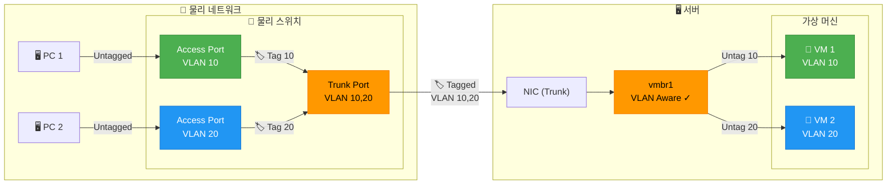
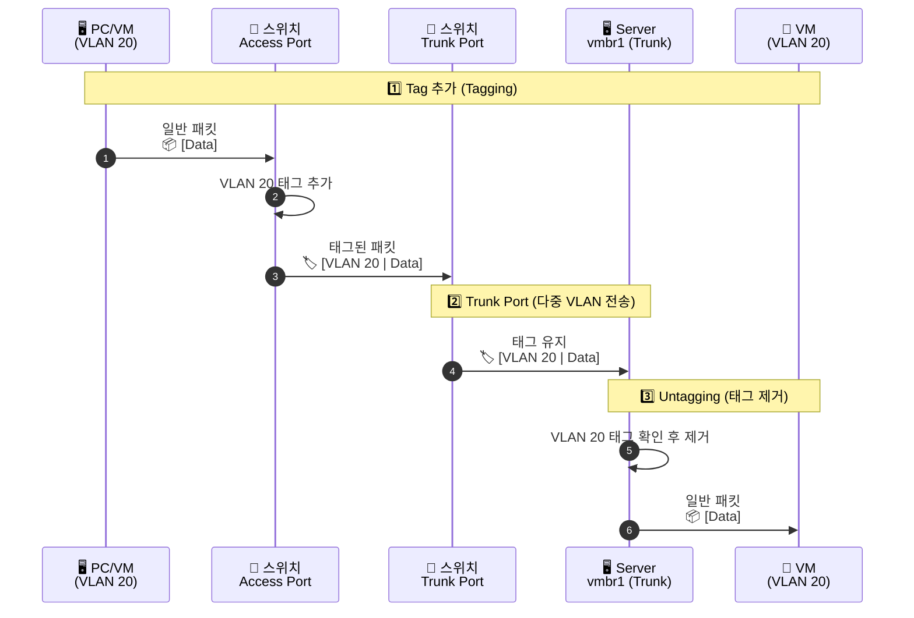

# Why?

왜 배움?

---

---

VLAN 을 설정해두면 노출된 특정 VM 이 공격당해도 다른 VM 들이 노출되지 않게한다.

그렇다면 VLAN 은 무엇일까?

또 VLAN 동작원리는 어떻게 되는가?

차근차근 알아가보면서 어떻게 구축할 수 있는지 실습까지 해보고자 한다.

# What?

뭘 배움?

---

---

> 하드웨어 가상화 (L2 스위칭)

- Network Namespace ?
- Veth Device / Veth Pair 란 ?
- Linux Bridge ?

그리고 원리


- Trunk/Tap 이란 ??
- VLAN 이란
- VLAN Filtering 란 ?
- systemd-networkd 란 ?

> VLAN 끼리 서로 통신 혹은 gateway (L3 라우팅)

VLAN으로 네트워크를 쪼개면 서로 통신이 불가능합니다.

이때 통신이 필요하면 **L3(IP 계층)** 단계에서 길을 찾아줘야 합니다.

- L3 Router의 역할
- 보안 도구

> 통제 및 보안

- nftable/iptable 란 ?

그리고 어떻게 L3 라우터 역할을 하는지?
- OPNsense 란 ?

그리고 어떻게 L3 라우터 역할을 하는지?

> 트러블슈팅

ARP 체크는 왜 할까?

- **왜 하는가?** IP 주소는 알지만 상대방의 MAC 주소를 모르면 통신이 안 됩니다.
- **의미:** `ip neigh`에 상대방 MAC이 `REACHABLE`로 떠 있다면, 최소한 **L2(브리지/VLAN) 연결은 정상**이라는 뜻입니다.

만약 `INCOMPLETE`라면 VLAN 설정이나 케이블(Veth) 연결 문제일 확률이 높습니다.

```shell
# Check ARP tables (Layer 2 connectivity)
net-check-arp:
    #!/usr/bin/env bash
    echo "📡 ARP Table Analysis"
    echo ""
    echo "=== Host ARP Table ==="
    ssh {{ target }} "ip neigh show"
    echo ""
    echo "=== Management VLAN ==="
    ssh {{ target }} "ip neigh show dev vlan10"
    echo ""  
    echo "=== Services VLAN ===" 
    ssh {{ target }} "ip neigh show dev vlan20"

```

브리지 필터링 확인 명령어

- **의미:** 브리지 포트(`vmbr0`)에 어떤 VLAN ID가 허용(Allow)되어 있는지 확인합니다.
- **PVID:** 태그 없이 들어온 패킷에 붙일 기본 VLAN ID.
- **Egress Untagged:** 패킷이 나갈 때 태그를 떼고 보낼지 결정.

```shell
# Check VLAN bridge filtering status
net-check-vlan:
    #!/usr/bin/env bash
    echo "🔍 VLAN Bridge Filtering Status"
    echo ""
    echo "=== Bridge VLAN Table (vmbr0) ==="
    ssh {{ target }} "sudo bridge vlan show dev vmbr0"
    echo ""
    echo "=== VLAN 10 (Management) Ports ==="
    ssh {{ target }} "sudo bridge vlan show | grep -E '(vm-vault|vm-jenkins|vlan10)'"
    echo ""
    echo "=== VLAN 20 (Services) Ports ==="
    ssh {{ target }} "sudo bridge vlan show | grep -E '(vm-registry|vm-k8s-master|vm-k8s-worker|vlan20)'"
```

- Bridge FDB (`bridge fdb show`)

```shell
# Verify bridge membership and state
net-check-bridge:
    #!/usr/bin/env bash
    echo "🌉 Bridge Membership & State"
    echo ""
    echo "=== Bridge vmbr0 Members ==="
    ssh {{ target }} "bridge link show | grep vmbr0"
    echo ""
    echo "=== Bridge FDB (Forwarding Database) ==="
    ssh {{ target }} "sudo bridge fdb show br vmbr0"
```

- systemd-networkd & networkctl

```shell
# Check systemd-networkd status and configuration
net-check-networkd:
    #!/usr/bin/env bash
    echo "⚙️  systemd-networkd Status"
    echo ""
    echo "=== Service Status ==="
    ssh {{ target }} "systemctl status systemd-networkd --no-pager"
    echo ""
    echo "=== Network State ==="
    ssh {{ target }} "networkctl status"
    echo ""
    echo "=== VLAN Interface States ==="
    ssh {{ target }} "networkctl status vlan10 vlan20"
```

## VLAN 이란?

VLAN은 물리적으로는 하나의 스위치에 연결되어 있지만, **논리적으로 네트워크를 여러 개로 쪼개는 기술**이다.

- **목적:** 보안 강화(부서 간 격리), 브로드캐스트 트래픽 감소, 유연한 네트워크 관리.
- **특징:** 물리적인 케이블 연결을 바꿀 필요 없이 소프트웨어 설정만으로 네트워크 그룹을 나눌 수 있다.

## VLAN 동작원리




VLAN의 핵심은 **"태깅(Tagging)" 이다**.

1.

물리스위치
2. **Trunk Port**
3.

NIC
4.

Linux Bridge
5. **Untagging**

## VLAN 구축 방법

VLAN을 구축하는 방법은 다음과 같다

### VLAN 인터페이스 생성

특정 VLAN 전용 브릿지를 따로 만드는 방식

1. **VLAN 생성:** `Create` > `Linux VLAN` 선택.
2. **이름 지정:** `eno1.10` (물리인터페이스명.VLAN_ID) 형태로 지정
3. **브릿지 연결:** 생성된 VLAN 인터페이스를 기반으로 새로운 `vmbr10` 같은 브릿지를 만들어 사용

### Bridge 유연성 활용 (VLAN Aware)

가장 권장되는 현대적인 방식
하나의 브릿지가 여러 VLAN을 동시에 처리하도록 설정
예전 브릿지는 들어오는 모든 패킷을 단순히 전달만 했지만, 현재의 Linux Bridge는 패킷의 802.1Q 태그를 읽어서 "이 패킷은 10번 포트로만 보내야지"라고 결정하는 **L2 스위치**

[^1]: https://ascentoptics.com/blog/ko/understanding-vlan-what-is-a-vlan-and-how-does-it-work/ <https://ascentoptics.com/blog/ko/understanding-vlan-what-is-a-vlan-and-how-does-it-work/>
