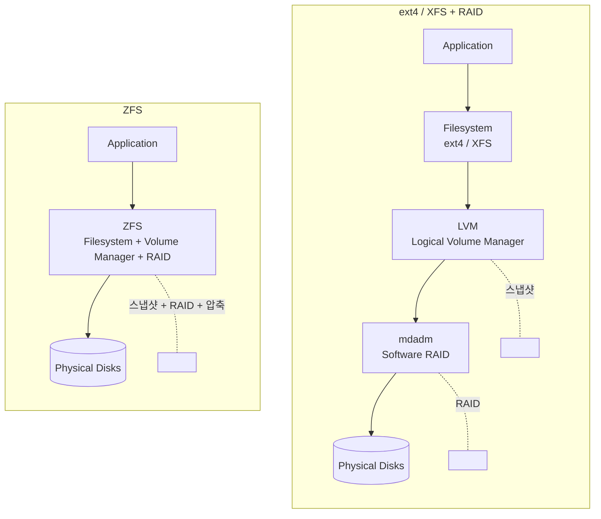
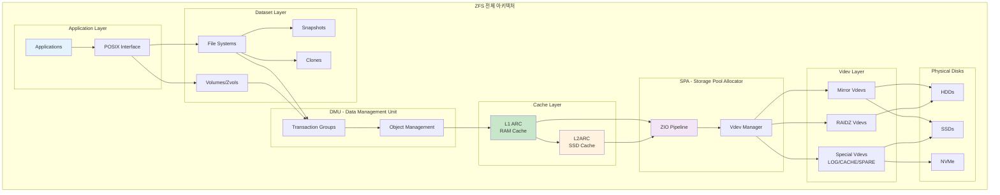
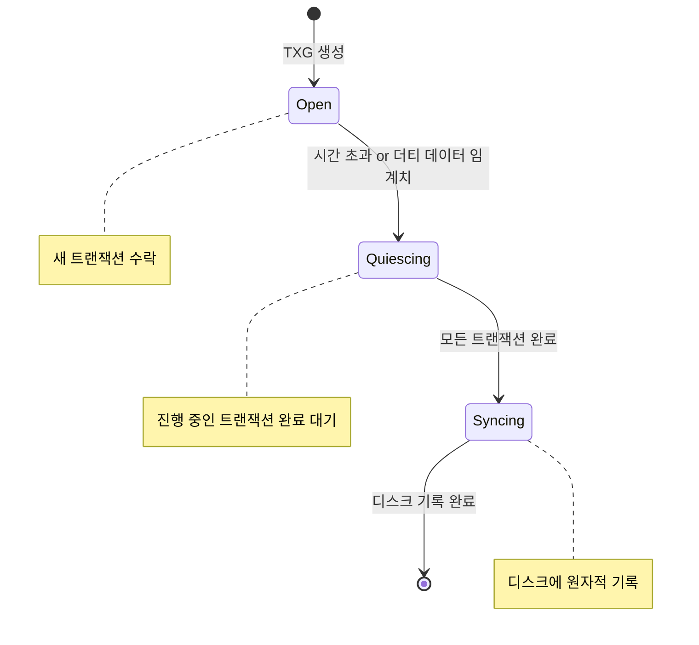
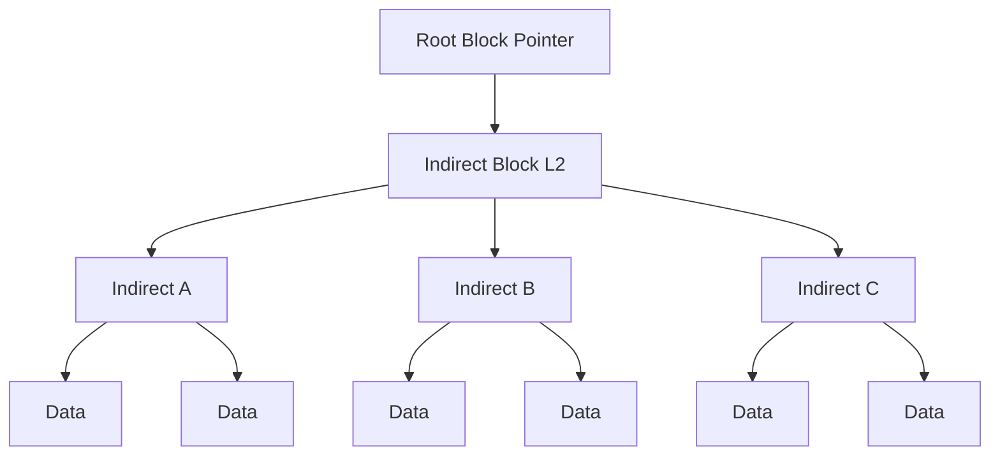
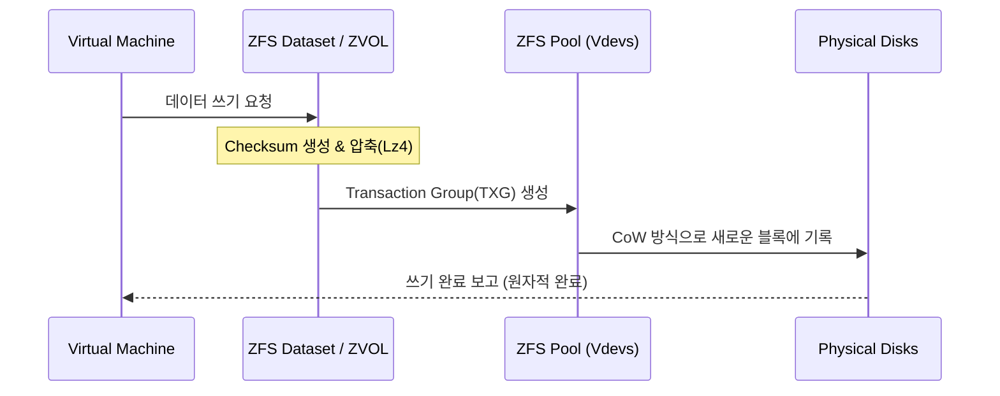
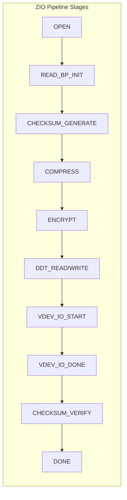
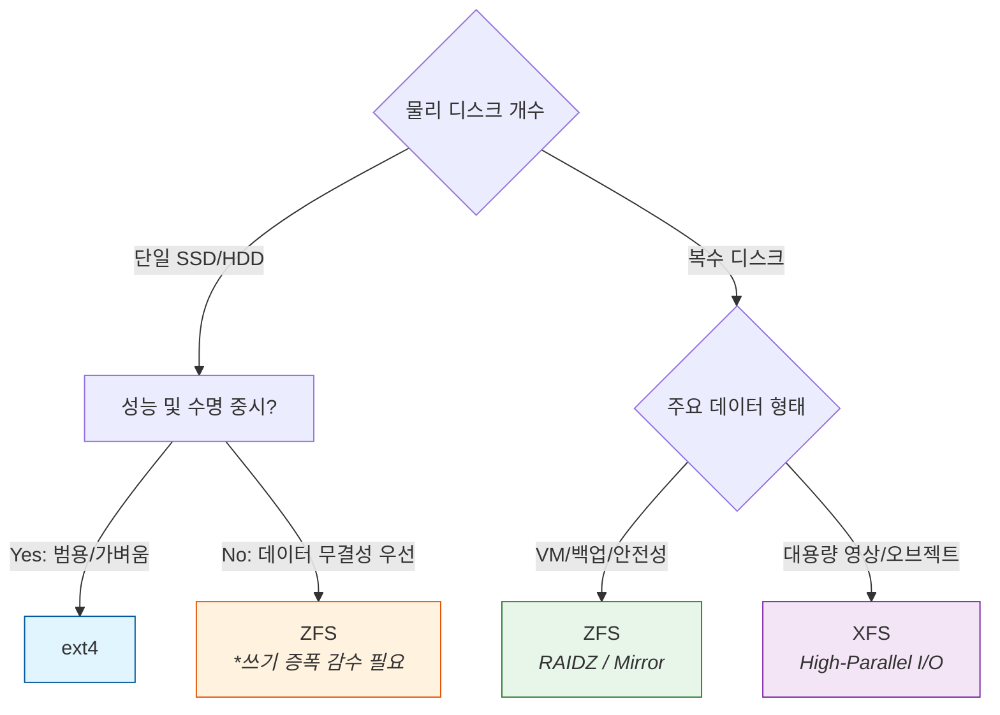

# Why?

홈랩을 처음 구축할 때 파일시스템은 "그냥 포맷하면 되는 것"이라고 가정했다.

Proxmox 설치 화면에서 ext4 대신 ZFS 를 고르면 스냅샷, RAID, 압축이 전부 해결된다는 글을 읽었기 때문이다.

그런데 실제로 단일 NVMe 에 ZFS 를 올리자 같은 데이터를 쓸 때 SSD 쓰기 증폭이 다른 파일시스템보다 현저히 높다는 것을 발견했다.

이 현상의 정확한 이름은 **Write Amplification**[^1] 이다.

ZFS 가 제공하는 Copy-on-Write, ZIL, 이중 메타데이터 기록은 단일 SSD 환경에서 수명을 갉아먹는 부작용이 된다.

본 포스트에서는 ext4 · XFS · ZFS 의 구조적 차이부터 ZFS 내부 레이어(Dataset, DMU, ARC, SPA, Vdev)의 동작 원리를 정리하고, 어떤 상황에 어떤 파일시스템을 골라야 하는지 결론을 내린다.

# What?

## ext4 · XFS · ZFS — 각 설계가 해결하는 문제 📂

**Extended Filesystem 4** 는 Linux 의 기본 파일시스템으로, 2008년 ext3 를 이어 출시됐다.

최대 볼륨 1 EB, 최대 파일 16 TB, 저널링으로 크래시 복구를 지원하며 단순하고 낮은 리소스로 오랜 기간 검증된 선택이다[^2].

> 장점: 안정성, 호환성, 낮은 메모리 사용량. [Proxmox 의 기본 파일시스템도 ext4 다.](https://pve.proxmox.com/wiki/Installation#:~:text=The%20Options%20button%20lets%20you,can%20result%20in%20data%20loss)

**XFS** 는 1994 년 SGI 에서 대용량 파일 처리를 위해 설계한 64 비트 저널링 파일시스템이다.

최대 볼륨 · 파일 크기 모두 8 EB, 멀티스레드 환경의 병렬 I/O 에 강하며 RHEL 7+ 의 기본 파일시스템으로 채택됐다.

> 장점: 대용량 파일, 높은 처리량, 병렬 I/O.

**ZFS** 는 2005 년 Sun Microsystems 가 개발한, 파일시스템 + 볼륨 매니저 + RAID 를 하나로 통합한 스택이다[^3].

이론상 볼륨 · 파일 크기 제한이 없으며, Copy-on-Write(CoW), 자체 RAID (RAIDZ1/Z2/Z3, Mirror), 네이티브 스냅샷 · 압축 · 중복제거, 체크섬 기반 데이터 무결성 검증을 모두 제공한다.

> 장점: 올인원 통합, 스냅샷, 셀프힐링 RAID, 무결성 검사.

### 전통 스택 vs ZFS — 레이어 비교

ext4 · XFS 에서 RAID 와 스냅샷을 쓰려면 LVM + mdadm 레이어를 직접 쌓아야 한다. ZFS 는 이를 단일 레이어로 통합한다.



## ZFS 가 통합 스택으로 해결하는 네 가지 문제 🔧

ext4/XFS 는 LVM 없이는 RAID · 스냅샷 지원이 불가능한 반면, ZFS 는 다음 네 기능을 단일 스택으로 제공한다.

- **데이터 무결성 및 셀프 힐링** — 체크섬으로 비트 부패(bit rot)를 감지하고 미러/RAIDZ 에서 자동 복구
- **자체 RAID 지원** — RAIDZ1/2/3, Mirror 를 파일시스템 레벨에서 처리
- **분산 스토리지 논리적 결합** — 여러 디스크를 하나의 Pool 로 묶어 관리
- **데이터 캐싱** — ARC(RAM) + L2ARC(SSD) 계층 캐시 내장

> **Write Hole 문제란?** 전통 RAID-5/6 에서 전원 차단이 발생하면 스트라이프의 일부만 기록된 채 패리티와 불일치가 생기는 현상이다. ZFS 는 CoW + TXG 로 이 문제를 원천 차단한다[^4].

## ZFS 전체 아키텍처 — 5 개 레이어 🏗️

처리 순서와 구성도를 전체 구조로 정리하면 다음과 같다.



간단하게 요약하면 다섯 레이어가 순서대로 역할을 나눈다.

1. **Dataset & POSIX Layer** — POSIX 시스템 콜 인터페이스 + 논리 데이터셋 관리
2. **DMU (Data Management Unit)** — 트랜잭션 그룹 단위의 원자적 쓰기
3. **Cache Layer (ARC & L2ARC)** — RAM · SSD 계층 읽기 캐시
4. **SPA (Storage Pool Allocator)** — 입출력 파이프라인 제어
5. **Vdev Layer & Physical Disks** — 물리 디스크 가상화 및 RAID 처리

## 레이어 1: Dataset 과 POSIX 인터페이스 — 기존 앱이 수정 없이 사용하는 이유 📁

### POSIX Interface

ZFS 파일시스템은 **POSIX 호환**으로 설계되어 기존 애플리케이션이 별도 수정 없이 일반 파일시스템처럼 사용할 수 있다.

표준 시스템 콜(`open`, `read`, `write`, `close`, `fsync`) 을 완벽 지원하며, `O_DSYNC` · `fsync` 등 동기 쓰기 요청도 처리한다. `sync` 속성으로 POSIX 동작을 커스터마이징할 수 있다.

**알려진 제한:** 일부 경우 완전한 POSIX 호환이 아닐 수 있으며, 파일시스템 여유 공간 확인 시 표준과 다른 동작이 가능하다.

### Dataset 유형

ZFS 에서 **Dataset** 은 데이터를 저장하는 논리적 단위로, 전통적인 파티션 대신 계층적 데이터셋 구조를 사용한다.

| 유형              | 설명                          | 예시                     |
| ----------------- | ----------------------------- | ------------------------ |
| **Filesystem**    | 일반 파일시스템, 마운트 가능  | `tank/home`, `tank/data` |
| **Volume (Zvol)** | 블록 디바이스로 내보내기      | `/dev/zvol/tank/vm-disk` |
| **Snapshot**      | 읽기 전용 특정 시점 복사본    | `tank/data@backup`       |
| **Clone**         | 스냅샷 기반 쓰기 가능 복사본  | `tank/data-clone`        |
| **Bookmark**      | 스냅샷과 유사하나 공간 미사용 | `tank/data#mark1`        |

### Filesystem

```bash
# 파일시스템 생성
zfs create tank/home
zfs create tank/home/alice

# 마운트포인트 지정
zfs create -o mountpoint=/export/data tank/data

# 속성 확인
zfs get all tank/home
```

계층 구조를 지원하여 자식이 부모 속성을 상속하며, 자동 마운트와 쿼터 · 압축 · 암호화 등 속성을 개별 설정할 수 있다.

### Volume (Zvol)

```bash
# 10GB 볼륨 생성
zfs create -V 10G tank/vm-disk

# 블록 디바이스로 접근
ls /dev/zvol/tank/vm-disk

# VM 이나 iSCSI 타겟으로 활용
```

VM 디스크 이미지, iSCSI 타겟, ext4 등 다른 파일시스템을 위한 블록 레이어로 사용한다.

### Snapshot

```bash
# 스냅샷 생성
zfs snapshot tank/data@today
zfs snapshot -r tank@backup  # 재귀적 (모든 하위 데이터셋)

# 스냅샷 목록
zfs list -t snapshot

# 스냅샷 접근 (.zfs 디렉터리)
ls /tank/data/.zfs/snapshot/today/

# 롤백 (스냅샷 시점으로 복원)
zfs rollback tank/data@today
zfs rollback -r tank/data@today  # 이후 스냅샷 삭제하며 롤백

# 스냅샷 삭제
zfs destroy tank/data@today
```

**스냅샷 동작 원리:** CoW 기반으로 생성 시점에는 공간을 거의 사용하지 않고, 각 블록에 Birth Time(TXG 번호)이 저장된다. 원본 데이터 변경 시에만 스냅샷이 공간을 사용하며, 읽기 전용으로 변경이 불가능하다.

### Clone

```bash
# 스냅샷으로부터 클론 생성
zfs clone tank/data@today tank/data-test

# 클론 승격 (부모-자식 관계 역전)
zfs promote tank/data-test
```

클론은 스냅샷에서만 생성 가능하며 쓰기가 가능하다. 초기에는 추가 공간을 사용하지 않지만, 원본 스냅샷에 의존성이 생겨 스냅샷을 바로 삭제할 수 없다. `promote` 로 의존성을 해제한다.

## 레이어 2: DMU — 모든 쓰기를 원자적으로 묶는 방법 🔒

### Transaction Groups (TXG)

TXG(Transaction Group) 는 ZFS 의 핵심 일관성 메커니즘이다. 개별 쓰기 작업을 하나씩 처리하지 않고 여러 작업을 그룹으로 묶어 원자적으로 처리한다.



세 가지 상태가 동시에 활성화될 수 있다. **Open** 은 새 트랜잭션을 수락하고, **Quiescing** 은 현재 트랜잭션 완료를 대기하며, **Syncing** 은 디스크에 데이터를 기록한다.

```bash
# TXG 동기화 주기 (기본 5초)
# /etc/modprobe.d/zfs.conf
options zfs zfs_txg_timeout=5

# TXG 히스토리 확인 (디버깅용)
cat /proc/spl/kstat/zfs/pool_name/txgs
```

TXG 의 이점은 네 가지다. **원자성** — TXG 내 모든 변경이 완전히 적용되거나 전혀 적용되지 않는다. **일관성** — TXG 경계에서 데이터 일관성을 보장한다. **성능** — 쓰기를 배치 처리해 I/O 효율을 높인다. **복구** — 시스템 크래시 시 마지막 완료 TXG 로 자동 복구된다.

### Object Management 와 Dnode 구조

DMU 는 파일 · 디렉터리 · 메타데이터 등을 모두 **객체(Object)** 단위로 관리한다.

```bash
dnode (객체 메타데이터)
├── dn_type: 객체 유형 (파일, 디렉터리, 속성 등)
├── dn_blkptr: 데이터 블록 포인터
├── dn_nlevels: 블록 트리 깊이
├── dn_bonuslen: 보너스 버퍼 크기
└── dn_bonus: 인라인 메타데이터
```

객체 유형은 `DMU_OT_PLAIN_FILE_CONTENTS` (일반 파일), `DMU_OT_DIRECTORY_CONTENTS` (디렉터리), `DMU_OT_ZVOL` (볼륨 데이터), `DMU_OT_PACKED_NVLIST` (속성 저장) 로 분류된다.

### 객체 트리 구조



## 레이어 3: ARC & L2ARC — RAM 과 SSD 를 계층 캐시로 쓰는 이유 💾

### ARC (Adaptive Replacement Cache)

ARC 는 시스템 메모리(RAM) 에 상주하는 ZFS 의 1차 읽기 캐시로, 단순한 LRU 보다 진보된 알고리즘을 사용한다[^5].

ARC 는 **MRU (Most Recently Used)** 와 **MFU (Most Frequently Used)** 두 목록으로 구성된다. 최근 접근 데이터는 MRU 에, 반복 접근하는 핫 데이터는 MFU 에 배치되며, 두 목록의 크기는 동적으로 조절된다. Ghost List 로 최근 퇴출 블록을 추적해 재접근 시 빠르게 복원한다.

```bash
# ARC 통계 확인
arc_summary

# 실시간 ARC 상태
arcstat 1

# ARC 크기 조정 (최대 8GB)
echo 8589934592 > /sys/module/zfs/parameters/zfs_arc_max
```

주요 지표는 **Hit Ratio** (높을수록 좋음), **Size** (현재 ARC 크기), **Target Size** (목표 ARC 크기), **MRU/MFU Ratio** (두 캐시 간 균형) 다.

### L2ARC

L2ARC 는 SSD/NVMe 를 사용하는 2차 읽기 캐시로, ARC 에서 밀려난 "따뜻한" 데이터를 Ring Buffer (FIFO) 구조로 저장한다. OpenZFS 2.0+ 부터 리부팅 후에도 캐시를 복원할 수 있다[^6].

> ⚠️ L2ARC 는 ARC 가 아니다. 단순한 링 버퍼로 ARC 의 복잡한 적응형 알고리즘을 사용하지 않는다.

```bash
# L2ARC 디바이스 추가
zpool add tank cache /dev/nvme0n1

# L2ARC 상태 확인
zpool status

# L2ARC 튜닝 파라미터
cat /sys/module/zfs/parameters/l2arc_write_max      # 초당 최대 쓰기량
cat /sys/module/zfs/parameters/l2arc_noprefetch     # 프리페치 제외
cat /sys/module/zfs/parameters/l2arc_feed_secs      # 피딩 간격
```

L2ARC 사용 시 주의사항: ARC 가 충분하지 않을 때만 효과적이다. L2ARC 블록마다 ARC 에 헤더를 저장해야 해서 RAM 을 소비하며, SSD 수명을 고려해야 한다. L2ARC 는 읽기 캐시만 담당하며 쓰기는 SLOG/ZIL 이 처리한다.

### 쓰기 경로 전체 흐름



## 레이어 4: SPA — 모든 I/O 가 거치는 파이프라인 ⚙️

### ZIO Pipeline

ZIO(ZFS I/O) 파이프라인은 모든 I/O 작업을 처리하는 ZFS 의 핵심 엔진이다.



주요 스테이지는 순서대로 I/O 요청 초기화(OPEN), 체크섬 계산(쓰기), 데이터 압축, 암호화(설정된 경우), 중복 제거 테이블 처리(DDT), 실제 디바이스 I/O, 체크섬 검증(읽기) 이다.

### ZIO 유형

| 유형             | 설명        |
| ---------------- | ----------- |
| `ZIO_TYPE_READ`  | 데이터 읽기 |
| `ZIO_TYPE_WRITE` | 데이터 쓰기 |
| `ZIO_TYPE_FREE`  | 블록 해제   |
| `ZIO_TYPE_CLAIM` | 블록 클레임 |
| `ZIO_TYPE_FLUSH` | 캐시 플러시 |
| `ZIO_TYPE_TRIM`  | SSD TRIM    |

### Vdev Manager 와 I/O 스케줄링

Vdev Manager 는 가상 디바이스 계층을 관리하고 I/O 를 분산한다.

```bash
# I/O 클래스 우선순위 (높음 → 낮음)
# 1. Sync Read
# 2. Sync Write
# 3. Async Read
# 4. Async Write
# 5. Scrub/Resilver

# 스케줄러 파라미터
cat /sys/module/zfs/parameters/zfs_vdev_async_write_max_active
cat /sys/module/zfs/parameters/zfs_vdev_sync_read_max_active
```

## 레이어 5: Vdev — 물리 디스크를 추상화하는 방법 🖴

### Vdev (Virtual Device)

Vdev 는 ZFS 가 물리 디스크를 추상화하는 논리적 단위다. Pool 은 여러 Vdev 로 구성되며, 각 Vdev 는 독립된 RAID 그룹으로 동작한다.

```bash
Pool (tank)
├── Vdev (raidz2-0)
│   ├── /dev/sda
│   ├── /dev/sdb
│   ├── /dev/sdc
│   ├── /dev/sdd
│   └── /dev/sde
├── Vdev (mirror-1)      ← 추가된 Vdev
│   ├── /dev/sdf
│   └── /dev/sdg
├── log (mirror)         ← SLOG
│   ├── /dev/nvme0n1p1
│   └── /dev/nvme1n1p1
├── cache                ← L2ARC
│   └── /dev/nvme2n1
└── spare                ← 핫 스페어
    └── /dev/sdh
```

### Mirror 와 RAIDZ

```bash
# 미러 풀 생성
zpool create tank mirror /dev/sda /dev/sdb

# 3-way 미러
zpool create tank mirror /dev/sda /dev/sdb /dev/sdc
```

Mirror 는 N 개 디스크 중 1 개만 살아있어도 데이터를 유지한다. 읽기 성능은 N 배(분산 읽기), 쓰기 성능은 1 배(모든 디스크에 기록), 용량 효율은 1/N 이다.

```bash
# RAIDZ1 (단일 패리티, 1개 디스크 장애 허용)
zpool create tank raidz1 /dev/sda /dev/sdb /dev/sdc

# RAIDZ2 (이중 패리티, 2개 디스크 장애 허용)
zpool create tank raidz2 /dev/sd{a,b,c,d,e}

# RAIDZ3 (삼중 패리티, 3개 디스크 장애 허용)
zpool create tank raidz3 /dev/sd{a,b,c,d,e,f,g}
```

| 유형   | 최소 디스크 | 장애 허용 | 용량 효율 | 권장 디스크 수 |
| ------ | ----------- | --------- | --------- | -------------- |
| RAIDZ1 | 2           | 1         | (N-1)/N   | 3-5            |
| RAIDZ2 | 3           | 2         | (N-2)/N   | 5-9            |
| RAIDZ3 | 4           | 3         | (N-3)/N   | 7+             |

RAIDZ 는 전통 RAID-5/6 과 달리 Write Hole 문제가 없고(CoW + TXG), 가변 스트라이프 폭, 블록 단위 체크섬, 셀프 힐링을 지원한다[^7].

### Special Vdev (SLOG, L2ARC, Spare)

```bash
# SLOG 추가 (미러 권장)
zpool add tank log mirror /dev/nvme0n1p1 /dev/nvme1n1p1

# L2ARC 캐시 추가
zpool add tank cache /dev/nvme2n1

# 핫 스페어 추가
zpool add tank spare /dev/sdz
zpool set autoreplace=on tank
```

**SLOG** 는 ZIL(ZFS Intent Log) 을 가속하여 동기 쓰기 지연 시간을 줄인다. 쓰기 집약적이므로 고내구성 SSD/NVMe 를 권장한다.

## RAID 레벨 전체 비교 — 어떤 구성이 어떤 트레이드오프를 가지는가 ⚖️

Proxmox 공식 문서에서 정리한 RAID 레벨 비교를 기반으로[^8] 홈랩 선택 기준을 정리하면 다음과 같다.

| **RAID 레벨**       | **최소 디스크** | **장애 허용** | **용량 효율** | **읽기 성능** | **쓰기 성능** | **추천 용도**                |
| ------------------- | --------------- | ------------- | ------------- | ------------- | ------------- | ---------------------------- |
| **RAID 0 (Stripe)** | 1               | **0**         | 100%          | 매우 높음     | 매우 높음     | 임시 데이터, 캐시 영역       |
| **RAID 1 (Mirror)** | 2               | N-1           | 1/N           | 높음          | 보통          | **OS 부트, DB, 가상화**      |
| **RAID 10 (1+0)**   | 4               | Vdev 당 1     | 50%           | 최고          | 높음          | **고성능 가상화, 대용량 DB** |
| **RAIDZ-1**         | 3               | 1             | (N-1)/N       | 보통          | 낮음          | 일반 저장소, 미디어 서버     |
| **RAIDZ-2**         | 4               | 2             | (N-2)/N       | 보통          | 낮음          | **중요 데이터, 백업 서버**   |
| **RAIDZ-3**         | 5               | 3             | (N-3)/N       | 보통          | 낮음          | 초고용량 아카이브            |

## 단일 SSD 에서 ZFS 가 오버엔지니어링인 이유 — 쓰기 증폭 🚫


[iXsystems 성능 비교 영상](https://youtu.be/V7V3kmJDHTA?t=104) 에서 진행된 실험을 보면 단일 SSD 기준 데이터 쓰기 빈도수가 가장 높은 파일시스템이 ZFS 인 것을 확인할 수 있다.

왜 ZFS 의 쓰기 빈도수가 가장 높은가? ZFS 는 하드웨어(SSD) 의 쓰기 단위인 '페이지' 외에 CoW · ZIL · 이중 메타데이터 기록이 추가 쓰기를 발생시키기 때문이다.

- **Copy-on-Write (CoW)** — 덮어쓰지 않고 항상 새 위치에 기록
- **이중 메타데이터 기록 (Redundancy)** — 메타데이터를 두 곳에 동기화
- **ZIL (ZFS Intent Log)** — 동기 쓰기를 먼저 ZIL 에 기록 후 Pool 에 반영
- **Transaction Grouping** — TXG 단위 플러시 시 추가 메타데이터 I/O 발생

> **Write Amplification** 이란? 논리 쓰기 1 회에 물리 쓰기가 여러 번 발생하는 현상으로, SSD 의 P/E 사이클(수명)을 빠르게 소모시킨다[^1].

## 언제 무엇을 쓸까 — 파일시스템 선택 기준 🗺️

| **선택** | **추천 상황 (Use Case)**                                | **핵심 이유**                                                                   |
| -------- | ------------------------------------------------------- | ------------------------------------------------------------------------------- |
| **ZFS**  | **데이터 무결성, RAID 구성, 압축/중복제거가 필요할 때** | 셀프힐링(Self-healing), CoW 기반의 강력한 스냅샷, 관리 편의성                   |
| **XFS**  | **대용량 파일, 고성능 병렬 I/O 가 필요할 때**           | 64 비트 주소 체계, 확장성(Scalability), 멀티스레드 환경에서의 뛰어난 동시 처리 |
| **ext4** | **범용 서비스, 단일 디스크, 안정성이 최우선일 때**      | 가볍고 빠름, 커널 지원의 성숙도, 파일시스템 손상 시 복구 도구가 가장 풍부함     |



# How?

본인 Linux distro 에 맞춰 [OpenZFS 공식 Getting Started 문서](https://openzfs.github.io/openzfs-docs/Getting%20Started/index.html) 를 참고하는 것이 가장 정확하다[^9].

## ZFS 설치

Ubuntu/Debian 기준으로 패키지를 설치하고 Pool 을 생성하는 기본 흐름은 다음과 같다.

```bash
# Ubuntu 22.04+
sudo apt install zfsutils-linux

# Pool 생성 (RAIDZ2, 5개 디스크)
sudo zpool create tank raidz2 /dev/sd{a,b,c,d,e}

# Pool 상태 확인
sudo zpool status tank

# 파일시스템 생성 및 마운트
sudo zfs create tank/data
sudo zfs set mountpoint=/data tank/data
```

## ZFS 이중화

프로덕션 환경에서는 Pool 자체를 RAIDZ2 이상으로 구성하고, SLOG 는 반드시 Mirror Vdev 로 추가한다.

```bash
# SLOG Mirror 추가 (단일 NVMe 장애 시 데이터 손실 방지)
sudo zpool add tank log mirror /dev/nvme0n1p1 /dev/nvme1n1p1

# 자동 교체 활성화 (핫 스페어)
sudo zpool add tank spare /dev/sdz
sudo zpool set autoreplace=on tank
```

## ZFS 백업 전략

ZFS 의 스냅샷 + `zfs send` / `zfs receive` 조합이 가장 일반적인 백업 전략이다[^10].

```bash
# 스냅샷 생성
sudo zfs snapshot -r tank/data@$(date +%Y%m%d)

# 원격 서버로 증분 전송 (초기 전체 전송 이후)
sudo zfs send -i tank/data@20251229 tank/data@20251230 \
    | ssh backup-server "sudo zfs receive backup/data"

# 오래된 스냅샷 자동 정리
sudo zfs destroy tank/data@20251201
```

# 정리

본 포스트에서 다룬 내용을 계층별로 요약한다.

**파일시스템 비교**: ext4 는 안정성과 호환성 중심, XFS 는 대용량 병렬 I/O 중심, ZFS 는 데이터 무결성과 통합 관리가 필요할 때 선택한다.

**ZFS 내부 레이어 요약**은 다음과 같다.

| 레이어      | 역할                                          | 핵심 개념                  |
| ----------- | --------------------------------------------- | -------------------------- |
| Dataset     | POSIX 인터페이스 + 논리 데이터셋              | FS, Zvol, Snapshot, Clone  |
| DMU         | 트랜잭션 그룹 단위 원자적 쓰기               | TXG, Dnode, Object Tree    |
| Cache       | RAM(ARC) + SSD(L2ARC) 계층 읽기 캐시         | MRU/MFU 적응형, Ring Buffer |
| SPA         | 체크섬 · 압축 · 암호화 · 중복제거 파이프라인 | ZIO Pipeline, Vdev Manager |
| Vdev        | 물리 디스크 RAID 추상화                       | Mirror, RAIDZ1/2/3, SLOG  |

**단일 SSD 주의사항**: ZFS 의 CoW · ZIL · 이중 메타데이터 기록은 단일 SSD 의 쓰기 증폭을 심화시킨다. 단일 디스크 환경에서는 ext4 가 더 합리적인 선택이다.

**다음 단계**: 실제 홈랩에서 ZFS 를 운영하려면 `zpool scrub` 주기 설정과 `zfs-auto-snapshot` 스크립트로 자동화된 무결성 검사와 백업 파이프라인을 구축하는 것이 권장된다.

[^1]: Write Amplification — OpenZFS 위키. ZFS 의 CoW 와 ZIL 이 SSD 쓰기 증폭에 미치는 영향 설명. <https://openzfs.github.io/openzfs-docs/Performance%20and%20Tuning/Hardware.html>

[^2]: ext4 공식 커널 문서. ext4 파일시스템 설계, 저널링, 제한값 명세. <https://www.kernel.org/doc/html/latest/filesystems/ext4/index.html>

[^3]: Oracle — ZFS Administration Guide. Sun Microsystems 원조 ZFS 설계 원칙과 구조 설명. <https://docs.oracle.com/cd/E26505_01/html/E37384/zfsover-1.html#scrolltoc>

[^4]: OpenZFS 위키 — Write Hole 설명. RAID-5/6 Write Hole 문제와 ZFS 의 CoW+TXG 해법 상세 분석. <https://openzfs.github.io/openzfs-docs/Basic%20Concepts/RAIDZ.html>

[^5]: Klara Systems — OpenZFS ARC 심층 분석. ARC 의 MRU/MFU 알고리즘과 Ghost List 동작 원리 설명. <https://klarasystems.com/articles/openzfs-all-about-l2arc/>

[^6]: Klara Systems — OpenZFS L2ARC Persistence. OpenZFS 2.0 에서 추가된 L2ARC 재부팅 후 복원 기능 상세. <https://klarasystems.com/articles/openzfs-all-about-l2arc/>

[^7]: OpenZFS 위키 — RAIDZ. RAIDZ1/2/3 의 패리티 메커니즘과 전통 RAID-5/6 와의 차이점 비교. <https://openzfs.github.io/openzfs-docs/Basic%20Concepts/RAIDZ.html>

[^8]: Proxmox VE 위키 — ZFS on Linux. Proxmox 환경에서의 RAID0~RAIDZ3 레벨 정의, 최소 디스크 요건, 용도 가이드. <https://pve.proxmox.com/wiki/ZFS_on_Linux>

[^9]: OpenZFS 공식 문서 — Getting Started. 배포판별(Ubuntu, Debian, Fedora 등) ZFS 설치 및 초기 설정 가이드. <https://openzfs.github.io/openzfs-docs/Getting%20Started/index.html>

[^10]: OpenZFS 공식 소스 — GitHub Repository. ZFS send/receive 를 포함한 전체 소스 코드와 맨페이지. <https://github.com/openzfs/zfs>
