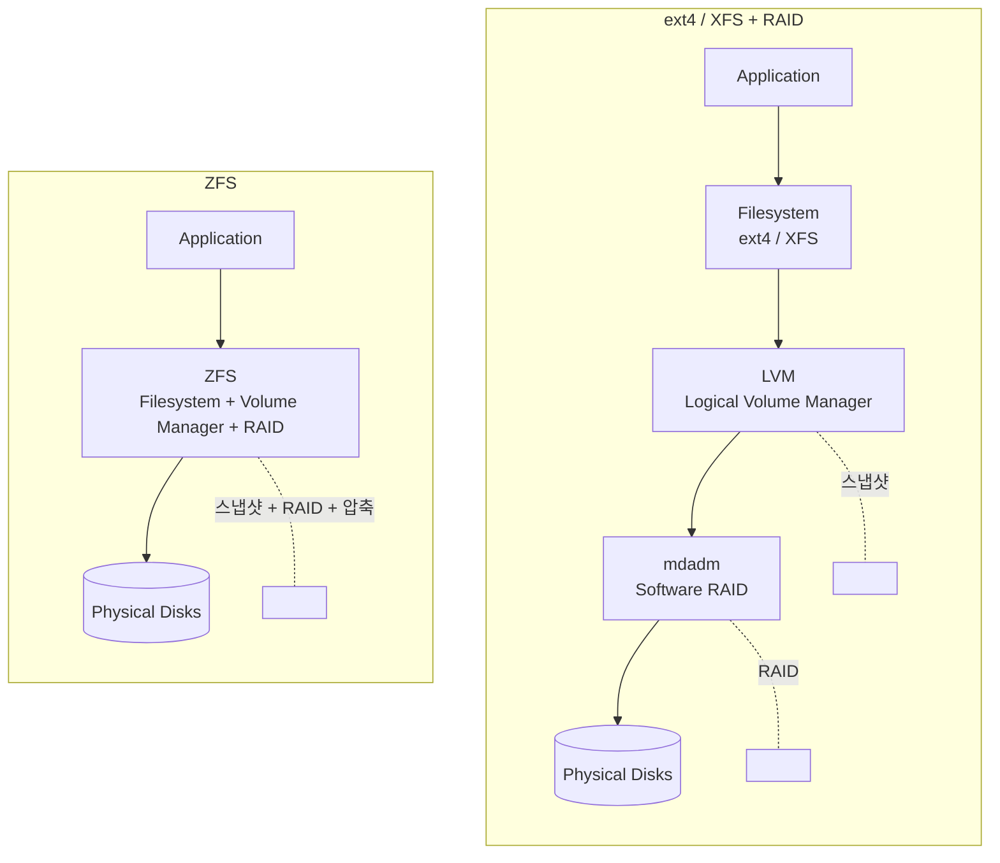
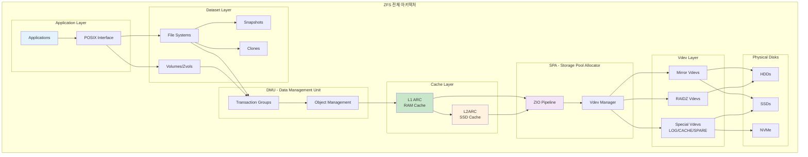
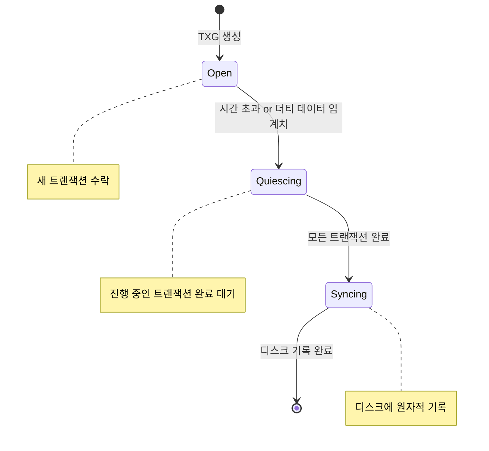
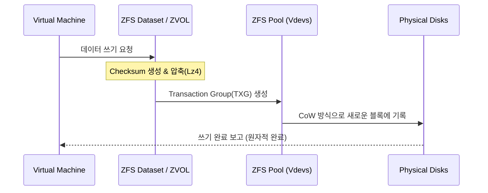
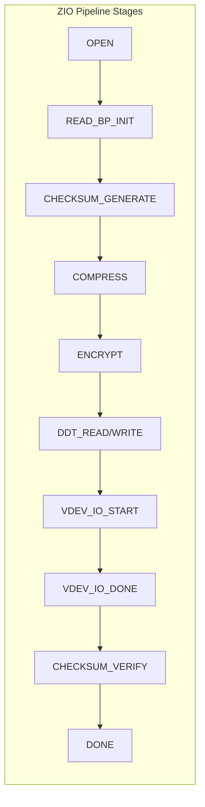
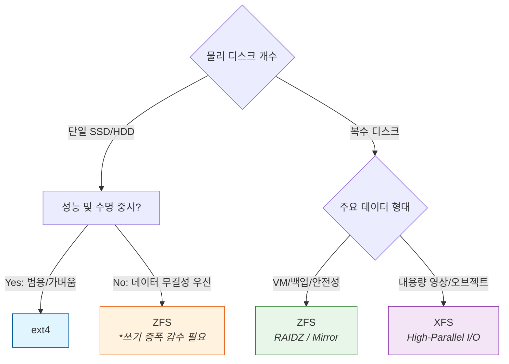

# Why?

왜 배움?

---

---

홈랩을 구축하면서 파일시스템을 구축할 일이 있었다.

파일시스템은 무엇이 있고, 동작원리와 실제 어떻게 구축할 수 있는지를 알아보고자 한다.

# What?

뭘 배움?

---

---

## ext4 란?

**Extended Filesystem 4** - Linux의 기본 파일시스템

- 2008년 출시, ext3의 후속
- 최대 볼륨 1EB, 최대 파일 16TB
- 저널링 지원 (크래시 복구)
- 단순하고 안정적, 낮은 리소스 사용

> 장점: 안정성, 호환성, 낮은 메모리
> [Proxmox의 기본 파일시스템은 ext4](https://pve.proxmox.com/wiki/Installation#:~:text=The%20Options%20button%20lets%20you,can%20result%20in%20data%20loss)

## XFS 란?

**High-performance 64-bit Journaling Filesystem**

- 1994년 SGI에서 개발, 대용량 파일 처리에 최적화
- 최대 볼륨 8EB, 최대 파일 8EB
- 병렬 I/O에 강함 (멀티스레드 환경)
- RHEL 7+ 기본 파일시스템

> 장점: 대용량 파일, 높은 처리량, 병렬 I/O

## ZFS 란?

**Zettabyte File System** - 파일시스템 + 볼륨 매니저 + RAID 통합

- 2005년 Sun Microsystems 개발 (OpenZFS로 오픈소스화)
- (이론상) 최대 볼륨 무제한, 최대 파일 무제한
- Copy-on-Write (CoW) 방식
- 자체 RAID (RAID-Z1/Z2/Z3, Mirror)
- 네이티브 스냅샷, 압축, 중복제거
- 체크섬 기반 데이터 무결성 검증

> 장점: 올인원, 스냅샷, RAID, 무결성 검사

### 구조 비교



## 왜 ZFS?

> ☝ TL;DR;

ext4/XFS 는 LVM 없이는 RAID, 스냅샷 지원이 불가능한 반면, ZFS 는 이를 통합하여 지원한다.

그렇다면 ZFS 에서는 어떤 기능들을 어떻게 제공하고 있을까?

- 데이터 무결성 및 셀프 힐링
- 자체 RAID 지원
- 분산 스토리지 논리적 결합
- 데이터 캐싱

> 📖 **Write Hole 문제점이란 ?**

## ZFS architecture



처리 순서와 구성도에 대한 전체 구조를 살펴보자면 위와 같다.

각 섹션 별로 어떤 것을 처리할까?

간단하게 요약하자면 아래와 같다.

1.

Dataset & POSIX Layer
2.

DMU - Data Management Unit
3.

Cache Layer (ARC & L2ARC)
4.

SPA - Storage Pool Allocator (입출력 제어)
5.

Vdev Layer & Physical Disks (가상화 및 저장)

이제 각 섹션 별로 딥다이브를 해보자.

## 1.

Dataset

### **1.1 POSIX Interface**

ZFS 파일시스템은 **POSIX 호환**으로 설계되어, 기존 애플리케이션들이 별도 수정 없이 ZFS를 일반 파일시스템처럼 사용할 수 있다.
**주요 특징:**

- 표준 시스템 콜(`open`, `read`, `write`, `close`, `fsync` 등) 완벽 지원
- `O_DSYNC`, `fsync` 등 동기 쓰기 요청 처리
- `sync` 속성으로 POSIX 동작 커스터마이징 가능:

**알려진 제한:**

- 일부 경우 완전한 POSIX 호환이 아닐 수 있음
- 파일시스템 여유 공간 확인 시 표준과 다른 동작 가능

### **1.2 Dataset (FS, Vol, Snap)**

ZFS에서 **Dataset**은 데이터를 저장하는 논리적 단위이다.

전통적인 파티션 대신 계층적 데이터셋 구조를 사용한다.

### Dataset 유형

| 유형 | 설명 | 예시 |
| --- | --- | --- |
| **Filesystem** | 일반 파일시스템, 마운트 가능 | `tank/home`, `tank/data` |
| **Volume (Zvol)** | 블록 디바이스로 내보내기 | `/dev/zvol/tank/vm-disk` |
| **Snapshot** | 읽기 전용 특정 시점 복사본 | `tank/data@backup` |
| **Clone** | 스냅샷 기반 쓰기 가능 복사본 | `tank/data-clone` |
| **Bookmark** | 스냅샷과 유사하나 공간 미사용 | `tank/data#mark1` |

### Filesystem

```bash
# 파일시스템 생성
zfs create tank/home
zfs create tank/home/alice

# 마운트포인트 지정
zfs create -o mountpoint=/export/data tank/data

# 속성 확인
zfs get all tank/home
```

**특징:**

- 계층 구조 지원 (자식이 부모 속성 상속)
- 자동 마운트
- 쿼터, 압축, 암호화 등 속성 개별 설정 가능

### Volume (Zvol)

```bash
# 10GB 볼륨 생성
zfs create -V 10G tank/vm-disk

# 블록 디바이스로 접근
ls /dev/zvol/tank/vm-disk

# VM이나 iSCSI 타겟으로 활용
```

**용도:**

- VM 디스크 이미지
- iSCSI 타겟
- 다른 파일시스템 (ext4 등) 포맷 가능

### Snapshot

```bash
# 스냅샷 생성
zfs snapshot tank/data@today
zfs snapshot -r tank@backup  # 재귀적 (모든 하위 데이터셋)

# 스냅샷 목록
zfs list -t snapshot

# 스냅샷 접근 (.zfs 디렉터리)
ls /tank/data/.zfs/snapshot/today/

# 롤백 (스냅샷 시점으로 복원)
zfs rollback tank/data@today
zfs rollback -r tank/data@today  # 이후 스냅샷 삭제하며 롤백

# 스냅샷 삭제
zfs destroy tank/data@today
```

**스냅샷 동작 원리:**

- **CoW 기반**: 스냅샷 생성 시점에는 공간을 거의 사용하지 않음
- **Birth Time**: 각 블록에 생성 시점(TXG 번호) 저장
- 원본 데이터 변경 시에만 스냅샷이 공간 사용
- 읽기 전용으로 변경 불가

### Clone

```bash
# 스냅샷으로부터 클론 생성
zfs clone tank/data@today tank/data-test

# 클론 승격 (부모-자식 관계 역전)
zfs promote tank/data-test
```

**클론 특징:**

- 스냅샷에서만 생성 가능
- 쓰기 가능
- 초기에는 추가 공간 사용 없음
- 원본 스냅샷에 의존성 생성 (스냅샷 삭제 불가)
- `promote`로 의존성 해제 가능

## 2.

DMU

### **2.1 Transaction Groups (TXG)**

- TXG(Transaction Group) 는 ZFS의 핵심 일관성 메커니즘이다.

개별 쓰기 작업을 하나씩 처리하지 않고, 여러 작업을 그룹으로 묶어 원자적으로 처리한다.

### 2.1.1 TXG 상태



**세 가지 동시 활성 상태:**

1. **Open**: 새로운 트랜잭션 수락 중
2. **Quiescing**: 현재 트랜잭션 완료 대기
3. **Syncing**: 디스크에 데이터 기록 중

### 2.1.2 TXG 동작

```bash
# TXG 동기화 주기 (기본 5초)
# /etc/modprobe.d/zfs.conf
options zfs zfs_txg_timeout=5

# TXG 히스토리 확인 (디버깅용)
cat /proc/spl/kstat/zfs/pool_name/txgs
```

**TXG의 이점:**

- **원자성**: TXG 내 모든 변경이 완전히 적용되거나 전혀 적용되지 않음
- **일관성**: TXG 경계에서 데이터 일관성 보장
- **성능**: 쓰기 배치 처리로 I/O 효율 향상
- **복구**: 시스템 크래시 시 마지막 완료된 TXG로 자동 복구

### 2.2 **Object Management**

DMU는 파일, 디렉터리, 메타데이터 등을 모두 **객체(Object)** 단위로 관리한다.

### 2.3 Dnode 구조

```bash
dnode (객체 메타데이터)
├── dn_type: 객체 유형 (파일, 디렉터리, 속성 등)
├── dn_blkptr: 데이터 블록 포인터
├── dn_nlevels: 블록 트리 깊이
├── dn_bonuslen: 보너스 버퍼 크기
└── dn_bonus: 인라인 메타데이터
```

**객체 유형:**

- `DMU_OT_PLAIN_FILE_CONTENTS`: 일반 파일
- `DMU_OT_DIRECTORY_CONTENTS`: 디렉터리
- `DMU_OT_ZVOL`: 볼륨 데이터
- `DMU_OT_PACKED_NVLIST`: 속성 저장

### 2.4 객체 트리 구조

```bash
				[Root Block Pointer]
               │
        [Indirect Block L2]
         /       |       \
   [Indirect]  [Indirect]  [Indirect]
      /  \       /  \        /  \
  [Data] [Data] [Data] [Data] [Data] [Data]
```

## 3.

Cache Layer (ARC & L2ARC)

### **3.1 ARC (Adaptive Replacement Cache)**

ARC는 시스템 메모리(RAM)에 상주하는 ZFS의 1차 읽기 캐시이다.

단순한 LRU(Least Recently Used)보다 진보된 알고리즘을 사용한다.

### 3.1.1 ARC 구조

```bash
┌─────────────────────────────────────────┐
│              ARC (RAM)                   │
├───────────────────┬─────────────────────┤
│       MRU         │        MFU          │
│  (Most Recently   │  (Most Frequently   │
│      Used)        │       Used)         │
├───────────────────┼─────────────────────┤
│   최근 접근 데이터  │   자주 접근 데이터   │
│   새로 읽은 블록    │   반복 접근 블록     │
└───────────────────┴─────────────────────┘
         ↑                    ↑
         └────── 동적 균형 ──────┘
```

**ARC 알고리즘 특징:**

- **MRU (Most Recently Used)**: 최근 접근한 데이터
- **MFU (Most Frequently Used)**: 자주 접근하는 핫 데이터
- 두 목록의 크기를 동적으로 조절
- Ghost List로 최근 퇴출 블록 추적 → 재접근 시 빠른 복원

### 3.1.2 ARC 모니터링

```bash
# ARC 통계 확인
arc_summary

# 실시간 ARC 상태
arcstat 1

# ARC 크기 조정 (최대 8GB)
echo 8589934592 > /sys/module/zfs/parameters/zfs_arc_max
```

**ARC 주요 지표:**

- **Hit Ratio**: 캐시 적중률 (높을수록 좋음)
- **Size**: 현재 ARC 크기
- **Target Size**: 목표 ARC 크기
- **MRU/MFU Ratio**: 두 캐시 간 균형

### **3.2 L2ARC**

L2ARC는 SSD/NVMe를 사용하는 2차 읽기 캐시이다.

ARC에서 밀려난 데이터를 저장한다.

### 3.2.1 L2ARC 특징

| 항목 | 설명 |
| --- | --- |
| **위치** | SSD/NVMe 디바이스 |
| **구조** | Ring Buffer (FIFO) |
| **Persistence** | OpenZFS 2.0+에서 리부팅 후 복원 가능 |
| **대상** | ARC에서 퇴출되는 "따뜻한" 데이터 |

> ⚠️ 주의: L2ARC는 ARC가 아니다!

단순한 링 버퍼로 ARC의 복잡한 적응형 알고리즘을 사용하지 않는다.

### 3.2.2 L2ARC 설정

```bash
# L2ARC 디바이스 추가
zpool add tank cache /dev/nvme0n1

# L2ARC 상태 확인
zpool status

# L2ARC 튜닝 파라미터
cat /sys/module/zfs/parameters/l2arc_write_max      # 초당 최대 쓰기량
cat /sys/module/zfs/parameters/l2arc_noprefetch     # 프리페치 제외
cat /sys/module/zfs/parameters/l2arc_feed_secs      # 피딩 간격
```

**L2ARC 사용 시 고려사항:**

- ARC가 충분하지 않을 때만 효과적
- L2ARC 블록마다 ARC에 헤더 저장 필요 (RAM 사용)
- SSD 수명 고려
- 읽기 캐시만 담당 (쓰기는 SLOG/ZIL)



## 4.

SPA - Storage Pool Allocator (입출력 제어)

### **4.1 ZIO Pipeline**

ZIO(ZFS I/O) 파이프라인은 모든 I/O 작업을 처리하는 ZFS의 핵심 엔진이다.

### 4.1.1 파이프라인 스테이지



**주요 스테이지:**

1. **OPEN**: I/O 요청 초기화
2. **CHECKSUM_GENERATE**: 체크섬 계산 (쓰기)
3. **COMPRESS**: 데이터 압축
4. **ENCRYPT**: 암호화 (설정된 경우)
5. **DDT**: 중복 제거 테이블 처리
6. **VDEV_IO**: 실제 디바이스 I/O
7. **CHECKSUM_VERIFY**: 체크섬 검증 (읽기)

### 4.1.2.

ZIO 유형

| 유형 | 설명 |
| --- | --- |
| `ZIO_TYPE_READ` | 데이터 읽기 |
| `ZIO_TYPE_WRITE` | 데이터 쓰기 |
| `ZIO_TYPE_FREE` | 블록 해제 |
| `ZIO_TYPE_CLAIM` | 블록 클레임 |
| `ZIO_TYPE_FLUSH` | 캐시 플러시 |
| `ZIO_TYPE_TRIM` | SSD TRIM |

### **4.1.3 Vdev Manager**

Vdev Manager는 가상 디바이스 계층을 관리하고 I/O를 분산한다.

### **4.1.4 **I/O 스케줄링

```bash
# I/O 클래스 우선순위 (높음 → 낮음)
# 1. Sync Read
# 2. Sync Write  
# 3. Async Read
# 4. Async Write
# 5. Scrub/Resilver

# 스케줄러 파라미터
cat /sys/module/zfs/parameters/zfs_vdev_async_write_max_active
cat /sys/module/zfs/parameters/zfs_vdev_sync_read_max_active
```

## 5.

Vdev Layer & Physical Disks (가상화 및 저장)

### 5.1 **Vdev (Virtual Device)**

Vdev는 ZFS가 물리 디스크를 추상화하는 논리적 단위이다.

### 5.2 Vdev 계층 구조

```bash
Pool (tank)
├── Vdev (raidz2-0)
│   ├── /dev/sda
│   ├── /dev/sdb
│   ├── /dev/sdc
│   ├── /dev/sdd
│   └── /dev/sde
├── Vdev (mirror-1)      ← 추가된 Vdev
│   ├── /dev/sdf
│   └── /dev/sdg
├── log (mirror)         ← SLOG
│   ├── /dev/nvme0n1p1
│   └── /dev/nvme1n1p1
├── cache                ← L2ARC
│   └── /dev/nvme2n1
└── spare                ← 핫 스페어
    └── /dev/sdh
```

### 5.3 **Mirror/RAIDZ**

### 미러 (Mirror)

```bash
# 미러 풀 생성
zpool create tank mirror /dev/sda /dev/sdb

# 3-way 미러
zpool create tank mirror /dev/sda /dev/sdb /dev/sdc
```

**특징:**

- N개 디스크 중 1개만 살아있으면 데이터 유지
- 읽기 성능: N배 (분산 읽기)
- 쓰기 성능: 1배 (모든 디스크에 기록)
- 용량 효율: 1/N

### RAIDZ

```bash
# RAIDZ1 (단일 패리티, 1개 디스크 장애 허용)
zpool create tank raidz1 /dev/sda /dev/sdb /dev/sdc

# RAIDZ2 (이중 패리티, 2개 디스크 장애 허용)
zpool create tank raidz2 /dev/sd{a,b,c,d,e}

# RAIDZ3 (삼중 패리티, 3개 디스크 장애 허용)
zpool create tank raidz3 /dev/sd{a,b,c,d,e,f,g}
```

**RAIDZ 비교:**

| 유형 | 최소 디스크 | 장애 허용 | 용량 효율 | 권장 디스크 수 |
| --- | --- | --- | --- | --- |
| RAIDZ1 | 2 | 1 | (N-1)/N | 3-5 |
| RAIDZ2 | 3 | 2 | (N-2)/N | 5-9 |
| RAIDZ3 | 4 | 3 | (N-3)/N | 7+ |

**RAIDZ vs 전통 RAID-5/6:**

- Write Hole 문제 없음 (CoW + TXG)
- 가변 스트라이프 폭
- 블록 단위 체크섬
- 셀프 힐링

### **Special Vdev**

### SLOG (Separate Log Device)

```bash
# SLOG 추가 (미러 권장)
zpool add tank log mirror /dev/nvme0n1p1 /dev/nvme1n1p1
```

**SLOG 특징:**

- ZIL(ZFS Intent Log) 가속
- 동기 쓰기 지연 시간 감소
- 고내구성 SSD/NVMe 권장 (쓰기 집약적)

### Cache (L2ARC)

```bash
# L2ARC 캐시 추가
zpool add tank cache /dev/nvme2n1
```

### Spare (핫 스페어)

```bash
# 핫 스페어 추가
zpool add tank spare /dev/sdz

# 자동 교체 활성화
zpool set autoreplace=on tank
```

## RAID0 ~ RAIDZ-3 차이점

[https://pve.proxmox.com/wiki/ZFS_on_Linux#:~:text=at%20installation%20time%3A-,RAID0,variation%20on%20RAID%2D5%2C%20triple%20parity.%20Requires%20at%20least%205%20disks.,-The%20installer%20automatically](https://pve.proxmox.com/wiki/ZFS_on_Linux#:~:text=at%20installation%20time%3A-,RAID0,variation%20on%20RAID%2D5%2C%20triple%20parity.%20Requires%20at%20least%205%20disks.,-The%20installer%20automatically)

| **RAID 레벨** | **최소 디스크** | **장애 허용** | **용량 효율** | **읽기 성능** | **쓰기 성능** | **추천 용도** |
| --- | --- | --- | --- | --- | --- | --- |
| **RAID 0 (Stripe)** | 1 | **0** | 100% | 매우 높음 | 매우 높음 | 임시 데이터, 캐시 영역 |
| **RAID 1 (Mirror)** | 2 | N-1 | 1/N | 높음 | 보통 | **OS 부트, DB, 가상화** |
| **RAID 10 (1+0)** | 4 | Vdev당 1 | 50% | 최고 | 높음 | **고성능 가상화, 대용량 DB** |
| **RAIDZ-1** | 3 | 1 | (N-1)/N | 보통 | 낮음 | 일반 저장소, 미디어 서버 |
| **RAIDZ-2** | 4 | 2 | (N-2)/N | 보통 | 낮음 | **중요 데이터, 백업 서버** |
| **RAIDZ-3** | 5 | 3 | (N-3)/N | 보통 | 낮음 | 초고용량 아카이브 |

## 왜 단일 SSD 에서 ZFS 구성은 오버엔지니어링인가?


[https://youtu.be/V7V3kmJDHTA?t=104](https://youtu.be/V7V3kmJDHTA?t=104)
위 영상에서 진행된 실험을 보면 단일 SSD 기준 데이터 쓰기 빈도수가 가장 높은 파일 시스템이 ZFS 인 것을 알 수 있다.

그렇다면 왜 ZFS 의 데이터 쓰기 빈도수가 가장 높은 걸까?

ZFS는 하드웨어(SSD)의 쓰기 단위인 '페이지'를 넘어 CoW, ZIL 와 같은 추가적인 쓰기를 발생시키기 때문이다.

- Copy-on-Write (CoW)
- 이중 메타데이터 기록 (Redundancy)
- ZIL (ZFS Intent Log)
- **Transaction Grouping**

> ✅ Write Amplification 이란 ?

## 언제 뭘 쓸까?

| **선택** | **추천 상황 (Use Case)** | **핵심 이유** |
| --- | --- | --- |
| **ZFS** | **데이터 무결성, RAID 구성, 압축/중복제거가 필요할 때** | 자가 수복(Self-healing), Copy-on-Write 기반의 강력한 스냅샷, 관리 편의성 |
| **XFS** | **대용량 파일, 고성능 병렬 I/O가 필요할 때** | 64비트 주소 체계, 확장성(Scalability), 멀티 스레드 환경에서의 뛰어난 동시 처리 |
| **ext4** | **범용적인 서비스, 단일 디스크, 안정성이 최우선일 때** | 가볍고 빠름, 커널 지원의 성숙도, 파일시스템 손상 시 복구 도구가 가장 풍부함 |



# How?

어떻게 씀?

---

> 💡 본인 linux distrot 에 맞춰 [https://openzfs.github.io/openzfs-docs/Getting%20Started/index.html](https://openzfs.github.io/openzfs-docs/[^1]Getting%20Started/index.html) 를 참고하는 게 최고이다.

## ZFS 설치

## ZFS 이중화
## ZFS 백업 전략

[^1]: https://openzfs.github.io/openzfs-docs/ <https://openzfs.github.io/openzfs-docs/>
[^2]: https://github.com/openzfs/zfs <https://github.com/openzfs/zfs>
[^3]: https://ubuntu.com/tutorials/setup-zfs-storage-pool#1-overview <https://ubuntu.com/tutorials/setup-zfs-storage-pool#1-overview>
[^4]: https://docs.oracle.com/cd/E26505_01/html/E37384/zfsover-1.html#scrolltoc <https://docs.oracle.com/cd/E26505_01/html/E37384/zfsover-1.html#scrolltoc>
[^5]: https://klarasystems.com/articles/openzfs-all-about-l2arc/ <https://klarasystems.com/articles/openzfs-all-about-l2arc/>
[^6]: https://klarasystems.com/articles/openzfs-native-encryption/ <https://klarasystems.com/articles/openzfs-native-encryption/>
