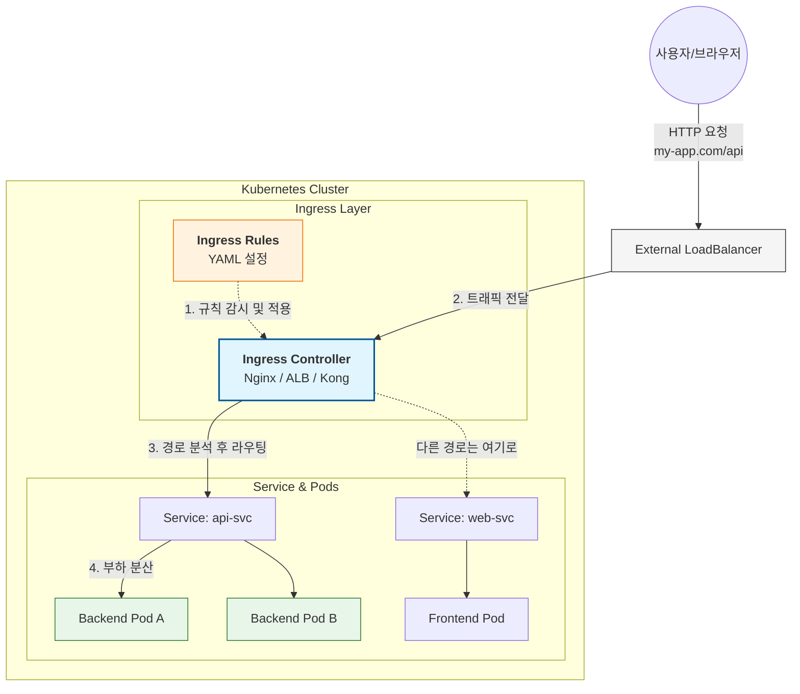
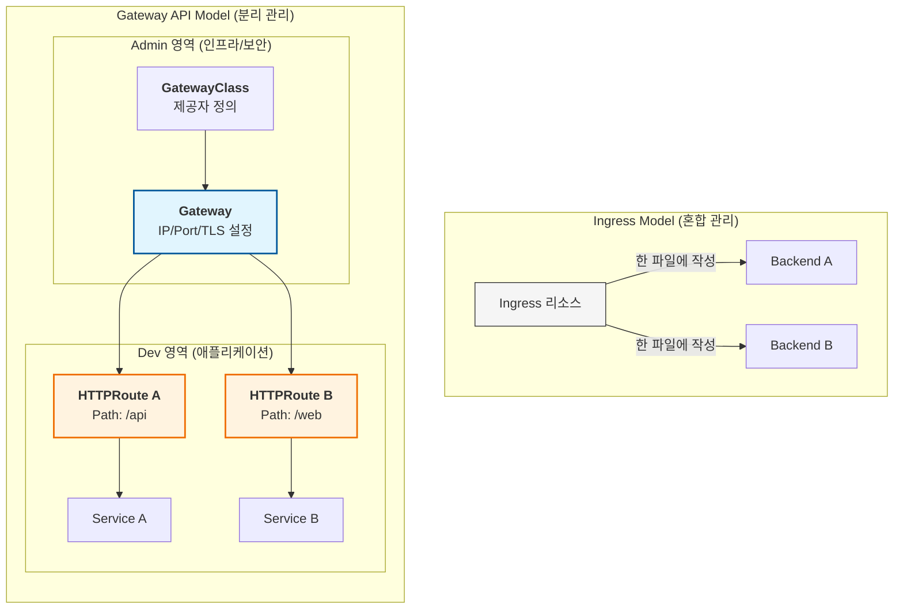
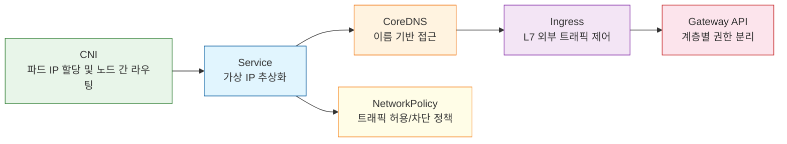

## 들어가며 — 왜 쿠버네티스 네트워킹은 복잡한가 🗺️

컨테이너 오케스트레이터를 처음 접할 때 대부분의 사람들은 "파드끼리는 알아서 통신하겠지"라고 가정한다.
그런데 실제로는 그렇지 않다.
파드는 언제든 교체될 수 있고, 교체될 때마다 IP가 바뀐다.
노드가 늘어나면 노드 간 라우팅을 누군가 관리해야 한다.
외부에서 들어오는 HTTP 요청을 올바른 서비스로 전달하는 L7 규칙도 필요하다.
그리고 멀티 테넌시 환경에서는 네임스페이스 간 트래픽을 정책으로 제어해야 한다.

쿠버네티스는 이 문제들을 **CNI → Service → Ingress → Gateway API → NetworkPolicy** 라는 계층으로 풀어낸다.
이 글은 각 계층이 왜 존재하는지, 어떻게 협력하는지를 이해하는 데 집중한다.
실습 명령어는 각 섹션 말미에 정리한다.[^1]

---

## Pod Networking — 파드가 통신하는 원리 🌐

CNI 구현체가 네임스페이스에 해당하는 브릿지 네트워크를 자동으로 연결하여 파드와 클러스터 간 통신을 구축한다.

이 통신 구축 시 처리 순서는 다음과 같다.

1. 설정 정보 로드 (`-cni-conf-dir=/etc/cni/net.d`)
2. 실행 파일 탐색 (`-cni-bin-dir=/etc/cni/bin`)
3. CNI 플러그인 호출 및 실행 (`ADD` 명령)
4. 인터페이스 및 브릿지 연결 (가장 중요한 단계)


이 구조가 갖춰져야만 그 위에 Service, Ingress 같은 추상화가 의미를 가진다.

---

## Why CNI? — 수동 라우팅의 한계 🔌

CNI 솔루션을 사용하지 않는다면, 파드 간 통신을 가능하게 하기 위해서는 네트워크 주소와 게이트웨이 주소 간의 매핑 관계를 `routing table`로 일일이 정의해야 한다.

노드와 파드가 몇 개 되지 않는다면 수동으로 설정하는 것이 가능하겠지만, 실제 운영 환경에서는 수천 수만 개의 노드와 파드에 대한 수동 설정을 해야 하고 휴먼 에러가 발생할 수 있다.

이를 해결하기 위해 CNI 플러그인들이 도입되었다.[^2]

---

## Why 3rd-party CNI? — kubenet 의 한계 🧩

기본 제공 CNI 플러그인으로 kubenet이 존재하는데, 다양한 서드파티 CNI 플러그인들을 사용하는 이유는 무엇일까?

서드파티 CNI들이 제공하는 다양한 기능들(Network Policy, 퍼블릭 클라우드와의 통합, 대규모 트래픽에 대한 안정성 등)이 이유일 수도 있지만, 무엇보다 기본 제공되는 kubenet의 기능이 너무 부족하기 때문이다.

kubenet은 그 자체로는 컨테이너 간 노드 간 교차 네트워킹조차 지원하지 않는다.

---

## CNI 네트워크 모델 — 오버레이 vs BGP 🗂️

CNI 플러그인들은 크게 두 가지 형식의 네트워크 모델을 사용한다.

- 오버레이 네트워크 모델
- 비-오버레이 네트워크 모델 (BGP 기반)

### 오버레이 네트워크란?


오버레이 네트워크는 3계층을 넘어서 구축된 네트워크 간에 있는 엔드포인트의 노드간의 통신이 일어날 때 패킷을 한 겹 캡슐화하여 통신시켜서, 2계층에서(같은 LAN에서) 통신이 일어나는 것처럼 통신할 수 있도록 하는 기술이다.

처리 과정은 아래와 같다.

1. **Encapsulation(캡슐화)**: 파드(Pod)에서 생성된 원본 패킷(Inner Packet)을 외부 노드 간 통신을 위한 패킷(Outer Packet)의 페이로드로 집어넣는다.
2. **VTEP (Virtual Tunnel Endpoint)**: 각 노드에 위치한 가상 인터페이스이다. 캡슐화를 수행하고 해제하는 터널 역할을 수행한다.
3. **Tunneling (터널링)**: 캡슐화된 패킷이 물리 네트워크(Underlay)를 통과할 때, 중간의 라우터들은 내부 패킷이 무엇인지 모른 채 외부 헤더만 보고 목적지 노드(VTEP)까지 배달한다.
4. **Decapsulation (역캡슐화)**: 목적지 노드의 VTEP가 외부 헤더를 벗겨내고 원본 패킷을 추출하여 최종 목적지 파드에 전달한다.

오버레이 네트워크에는 두 가지 프로토콜이 사용된다.

- VXLAN (Virtual Extensible LAN)
- IP-in-IP (IPIP)

### BGP 기반 라우팅


`BGP` 기반의 오버레이는 통신이 발생하는 노드 간에 BGP 프로토콜을 사용하는 소프트웨어 라우터의 구현을 통해 최적의 경로 정보를 동적으로 감지하여 적용한다.

BGP는 별도의 패킷 가상화 없이 기존에 네트워크에서 사용하던 직관적인 라우팅 방식을 이용한다.

따라서 클러스터 외부에서도 Ingress나 Service의 도움 없이 Pod에 접근할 수 있게 되고, 통일화된 보안 설정 관리 및 디버깅/로깅이 용이하다.

**또한 패킷 가상화 및 별도의 터널링이 없어 오버레이 네트워크에 비해 성능이 좋다.**

다만 BGP 기반 CNI 구성 시 k8s 클러스터 설정을 위해 아래와 같은 번거로움이 존재한다.

- **물리 설정의 필요성**: HA(고가용성)를 위해 노드 간 서브넷이 다르게 구성된 경우, 상위의 물리 라우터에도 BGP 관련 별도 설정을 해주어야 한다.
- **대역 관리의 복잡성**: 여러 클러스터를 활용하거나 외부 서비스를 함께 운영할 경우, 전체 네트워크 대역이 겹치지 않도록 관리가 필요하다.
- **클라우드 구성의 어려움**: 사용자가 상단 라우터 설정을 임의로 수정하기 어려운 퍼블릭 클라우드 환경에서는 구성이 자유롭지 못하다.

| **구분**      | **오버레이 (VXLAN/IPIP)**                  | **BGP (Native L3)**                          |
| ------------- | ------------------------------------------ | -------------------------------------------- |
| **방식**      | 패킷을 캡슐 안에 넣어서 전송 (터널링)      | 실제 경로 정보를 공유하여 직접 전송 (라우팅) |
| **성능**      | 캡슐화/해제 과정에서 CPU 소모 발생         | **네이티브 성능** (오버헤드 거의 없음)       |
| **복잡도**    | 설치가 쉽고 어디서나 잘 작동함             | 상단 물리 장비 설정이 필요할 수 있어 복잡함  |
| **외부 접근** | 인그레스/서비스 없이는 파드 직접 접근 불가 | **외부에서도 파드 IP로 직접 통신 가능**      |

어떤 모델을 선택하느냐에 따라 운영 복잡도와 성능이 크게 갈린다. 다음 섹션에서는 이 CNI가 쿠버네티스 안에서 어떻게 동작하는지 살펴본다.

---

## CNI in Kubernetes — 동작 구조 ⚙️

**CNI 플러그인은 파드의 생명주기를 관리하는 CRI가 호출한다.**
CNI 설정 시에는 아래 두 디렉토리를 통해 설정을 관리한다.


### 전체 동작 프로세스

1. **파드 생성 요청**: 사용자가 `kubectl run` 등을 통해 파드를 생성하면 런타임(`containerd` 등)이 감지한다.
2. **설정 파일 읽기**: 런타임이 `/etc/cni/net.d/`에서 알파벳 순서로 가장 빠른 설정 파일(예: `10-bridge.conf`)을 읽는다.
3. **플러그인 실행**: 설정 파일의 `"type": "bridge"`를 보고 `/opt/cni/bin/bridge` 실행 파일을 호출한다.
4. **네트워크 구축**: `./bridge add <container_id> <namespace_path>` 명령을 통해 파드 내부에 `eth0`를 만들고 호스트의 `cni0` 브릿지에 연결한다.

---

## CNI — 상세 구조와 IPAM 🕸️

### CNI 란?

CNI는 파드 간 통신을 위한 표준 규격으로, 쿠버네티스 외부의 플러그인이 네트워크 구축을 담당한다.[^3]

- **배포 방식**: 대부분 **DaemonSet**으로 관리 에이전트를 배포하며, 실제 네트워크 조작은 각 노드의 `/opt/cni/bin/` 바이너리가 수행한다.
- **설정 관리**: Kubelet은 `/etc/cni/net.d/` 경로에 **알파벳 순서**로 가장 먼저 나오는 `.conf` 또는 `.conflist` 파일을 기본 네트워크 설정으로 간주하여 처리한다.
- **IPAM (IP 주소 관리)**: `host-local`(노드별 할당) 또는 `dhcp` 방식을 사용하여 파드 IP를 자동으로 관리한다.
- **Pod CIDR 확인**: `kube-controller-manager` 설정 파일이나 `kubectl get node -o jsonpath='{.spec.podCIDR}'`를 통해 확인 가능하다.

### Pod 네트워크 구조

파드는 하나 이상의 컨테이너로 구성되며, 파드 내 모든 컨테이너는 동일한 네트워크 네임스페이스를 공유한다.

즉, 같은 파드의 컨테이너끼리는 `localhost`로 통신하며 동일한 IP와 포트 공간을 사용한다.

CNI 역할은 아래와 같다.

1. 이 네임스페이스에 `eth0`와 veth 페어를 만든다.
2. 노드 브릿지를 만들어 veth 페어와 연결한다.
3. 노드 NIC와 노드 브릿지를 연결하고 오버레이/논오버레이를 통해 라우팅한다.

따라서 실제 통신 과정은 아래와 같다.

- **같은 노드 내 파드 간 통신**: 파드A의 패킷 → vethA → cni0 브릿지 → vethB → 파드B. L2 수준에서 직접 통신한다.
- **다른 노드 간 파드 통신**: CNI 종류에 따라 달라진다. Flannel(VXLAN)은 패킷을 캡슐화하여 UDP로 전송하고, Calico(BGP)는 라우팅 테이블을 통해 직접 전달한다.


### 파드에 IP 할당 — IPAM

CNI는 파드에 IP를 할당한다.
이 때 파드에 IP를 할당하고 회수하는 하위 플러그인을 호출하는데 이것이 바로 IPAM이다.

IPAM 처리 방식은 세 가지이다.

1. `host-local`은 가장 흔하게 사용되며, 노드별로 할당된 Pod CIDR 범위 내에서 IP를 로컬하게 관리한다.
2. `dhcp`는 별도의 DHCP 서버로부터 IP를 임대받는 방식으로, 베어메탈 환경이나 기존 DHCP 인프라를 그대로 활용해야 하는 환경에 적합하다.
3. `Whereabouts`(Calico/Cilium 등에서 지원)는 클러스터 전체 범위에서 중복 없이 IP를 할당하는 방식으로, etcd나 Kubernetes API를 백엔드로 사용한다.


### Pod CIDR, Node CIDR


CNI는 노드들, 파드들에 대한 네트워크 구축 플러그인이다.

따라서 CNI는 Pod CIDR과 Node IP를 알고 있어야만 이를 처리할 수 있다.

Node IP는 CNI가 자동으로 감지하며, Pod CIDR은 CNI 설치 시 우리가 직접 맞춰줘야 한다.

만약 Pod CIDR 설정 정보가 없으면 각 노드가 임의의 IP를 파드에 부여하게 되어, **다른 노드의 파드와 IP가 충돌하거나 라우팅 경로를 알 수 없어** 통신이 불가능해진다.

따라서 아래와 같이 Pod CIDR 설정을 확인하여 값을 맞춰주도록 한다.

1. Pod CIDR 확인
2. CNI 설정 수정

CNI가 파드에 IP를 부여하고 나면, 이제 클러스터는 그 IP들을 안정적으로 묶어줄 추상화 계층이 필요하다. 그것이 바로 Service다.

---

## Service Networking — 안정적인 엔드포인트 📡

Kubernetes 환경에서는 문제가 발생했을 때 Node나 Pod을 쉽게 교체할 수 있는데, 이에 따라 외부 사용자 또는 내부 Pod들 간의 통신에서 Pod의 IP를 이용해 통신할 경우 Pod이나 Node가 교체되면 동일한 Pod에 접근할 수 없게 된다.

이를 해소하기 위해 Service를 사용하여 Pod에 접근한다.

Service란 어떤 Pod에 접근하기 위해 추상화된 클러스터 리소스로, 각 파드로 트래픽을 포워딩해주는 프록시 역할을 수행한다.


### Service 란?

Service는 동적으로 변하는 파드 IP를 추상화하여 안정적인 네트워크 엔드포인트를 제공하는 리소스이다.[^4]

셀렉터(label selector)를 통해 대상 파드를 동적으로 선택하며, Endpoints(또는 EndpointSlice) 오브젝트가 실제 파드 IP 목록을 추적한다.


### Service 타입

`ClusterIP`는 기본값으로, 클러스터 내부에서만 접근 가능한 가상 IP를 제공한다.
kube-proxy가 iptables/IPVS 규칙을 통해 트래픽을 파드로 분산한다.

`NodePort`는 ClusterIP를 포함하며, 추가로 모든 노드의 특정 포트(30000-32767)에서 외부 트래픽을 수신한다.
어느 노드로 요청이 들어오든 해당 Service의 파드로 라우팅된다.

`LoadBalancer`는 NodePort를 포함하며, 클라우드 공급자의 외부 로드밸런서를 자동으로 프로비저닝한다.
온프레미스 환경에서는 MetalLB 등을 함께 사용한다.

`ExternalName`은 외부 DNS 이름에 대한 CNAME 별칭을 제공하며, 파드 IP 변환 없이 CoreDNS 수준에서 처리된다.

---

## DNS in Kubernetes — 이름으로 서비스 찾기 🔍

그렇다면 k8s에서 각 Pod, Service 등은 어떻게 도메인을 이용해 연결할 수 있도록 관리될까?

k8s에서는 클러스터를 설정할 때 기본 탑재된 DNS 서버를 배포하는데 이를 활용하여 서비스에 대한 DNS를 할당한다.

KubeDNS, CoreDNS를 사용하여 Service에 대해 namespace, resource type, Root cluster를 기준으로 DNS를 할당한다.

FQDN(Fully Qualified Domain Name)을 채택하여 다음과 같은 구조로 할당된다.

```
web-service.apps.svc.cluster.local
```

- **web-service**: 서비스의 이름
- **apps**: 서비스가 속한 Namespace
- **svc**: 리소스 타입 (Service)
- **cluster.local**: 클러스터의 기본 도메인 영역 (설정에 따라 변경 가능)

> ⚠️ Service에 대해서만 DNS가 적용되며 Pod에 대해서는 IP로 관리한다.


---

## CoreDNS — 클러스터 내부 DNS 서버 🧭

`/etc/hosts`에 모든 DNS를 정의하여 저장할 수 있지만 클러스터 구조에서는 해당 방법을 사용할 수 없다.

대신 k8s에서는 별도의 DNS 서버 컴포넌트를 두는데 이것이 바로 CoreDNS이다.[^5]

CoreDNS는 클러스터 내부의 설정을 하드코딩하지 않고, k8s의 ConfigMap을 통해 동적으로 관리한다.

- `kube-system` 네임스페이스에 `coredns`라는 이름의 ConfigMap이 존재한다. 사용자가 이 설정을 바꾸면 CoreDNS Pod가 이를 감지하고 적용한다.
- CoreDNS 컨테이너가 실행될 때, 위 ConfigMap의 내용이 컨테이너 내부의 `/etc/coredns/Corefile` 경로로 마운트(Mount)된다. 이것이 CoreDNS의 **메인 설정 파일**이다.

모든 Pod는 생성될 때 내부적으로 `/etc/resolv.conf` 파일을 가진다.

Service는 `/etc/resolv.conf`에 search path로 제공되므로 full path가 아니더라도 조회가 가능하다.

다만 Pod는 search path로 제공되지 않으므로 전체 도메인 주소를 모두 적어야 한다.

```yaml
# Pod 내부의 /etc/resolv.conf 예시
# curl web-service ✅
# curl web-service.default ✅
# curl pod-name ❌
nameserver 10.96.0.10
search default.svc.cluster.local svc.cluster.local cluster.local
options ndots:5
```

### CoreDNS 상세

CoreDNS는 Kubernetes 클러스터 내부 DNS 서버로, kube-dns를 대체하여 기본으로 사용된다.

Deployment로 배포되며, ClusterIP 타입의 Service(`kube-dns`)를 통해 클러스터 내 고정 DNS IP(보통 `10.96.0.10`)를 제공한다.

CoreDNS는 `kube-dns`라는 ClusterIP Service를 사용하는데, 이는 Pod상 DNS 네임서버 설정 파일인 `/etc/resolv.conf`를 조정하기 위함이다.

해당 파일을 아래와 같이 조정함으로써 파드 상에서 서비스명에 대한 FQDN을 설정하여 서비스명 질의 시 DNS 처리되도록 한다.

```yaml
# /etc/resolv.conf (파드 내부)
nameserver 10.96.0.10
search <namespace>.svc.cluster.local svc.cluster.local cluster.local
```

이 때 CoreDNS는 Makefile과 같이 동작들을 나열한 Corefile로 동작하며 플러그인들을 연속적으로 호출하는 플러그인 체인 방식으로 돌아간다.


### Kube-Proxy

Kube-Proxy는 각 노드에 DaemonSet으로 배포되며, Kubernetes Service 리소스를 실제 네트워크 규칙으로 변환해준다.

Service의 가상 IP(ClusterIP)로 들어오는 트래픽을 실제 파드 IP로 리다이렉트하는 역할을 한다.

v2까지는 해시테이블 기반의 IPVS 모드를 사용하였으나 v3인 현재는 iptables 모드를 사용한다.
iptables 모드에서는 kube-proxy가 Service/Endpoints 변경을 감지할 때마다 노드의 iptables 규칙을 갱신한다.

커널 수준에서 패킷을 처리하므로 빠르지만, Service 수가 많아지면 규칙 수가 폭발적으로 증가(O(n))하여 갱신 지연이 발생할 수 있다.


### 파드까지 네트워크 라우팅 — 전체 흐름

앞서 CNI가 하위 플러그인 IPAM을 통해 IP를 할당하는 과정을 살펴보았다.

그렇다면 외부 네트워크부터 Service를 활용하여 Pod까지 패킷을 전달하는 흐름은 어떻게 될까?

이 때 CoreDNS와 Kube-Proxy가 사용된다.

먼저 DNS에 대한 resolution 처리를 해주는 역할이 필요한데 이를 CoreDNS가 담당한다.

CoreDNS는 Kubernetes 클러스터 내부 DNS 서버로, Deployment로 배포되며, ClusterIP 타입의 Service(`kube-dns`)를 통해 클러스터 내 고정 DNS IP(보통 `10.96.0.10`)를 제공한다.

이를 사용하여 서비스에 대한 서비스 네임 기반 DNS를 ClusterIP로 바꿔준다.

요청 흐름을 요약하면 아래와 같다.


클라이언트가 `my-svc`로 요청한다.

1. **DNS 조회** → CoreDNS가 ClusterIP(`10.96.10.5`)를 반환한다.
2. **DNAT 기반 IP 변경** → 패킷 목적지가 ClusterIP인 채로 노드에 도착하면, kube-proxy가 심어둔 iptables 규칙이 이를 실제 파드 IP(`10.244.1.3`)로 변경한다.
3. **노드 내부 네트워크 라우팅** → 목적지가 파드 IP로 바뀐 패킷이 노드 네트워크를 타고 파드로 도착한다.

DNS와 kube-proxy가 협력하여 ClusterIP 뒤의 실제 파드까지 패킷을 전달하는 이 구조가 갖춰졌으면, 이제 클러스터 외부에서 들어오는 HTTP 트래픽을 제어하는 Ingress 계층을 살펴볼 차례다.

---

## Ingress — L7 트래픽 입구 🚪

Ingress는 외부(인터넷)에서 K8s 클러스터 안의 서비스로 들어오는 [**HTTP/HTTPS 요청을 관리하는 입구**](https://kubernetes.io/ko/docs/concepts/services-networking/ingress/)이다.[^6]

클러스터 외부에서 내부 서비스로 접근하는 HTTP 및 HTTPS 경로를 노출하는 API 객체이며, 트래픽 라우팅은 Ingress 자원에 정의된 규칙에 의해 제어된다.

- L7 로드밸런싱을 처리하며
- SSL/TLS를 지원하며
- 가상 호스팅을 통해 도메인 이름에 따른 서비스 매핑을 지원하며
- 경로 기반으로 라우팅을 처리한다.

**Ingress Controller**는 Ingress가 규칙만 적어놓은 안내표라면, 실제로 이 규칙을 따라 트래픽을 전달하는 역할을 하는 구현체다.

### 어떻게 L7 로드밸런싱을 처리하는가?

Ingress Controller(예: Nginx)가 클러스터 입구에서 모든 HTTP 요청을 가로챈다.

그 후 요청 패킷의 **Application Layer(7계층)** 데이터를 열어보고, 사용자가 정의한 `rules`와 대조하여 적절한 `Service`의 엔드포인트(Pod IP)로 트래픽을 넘겨준다.

### 어떻게 Ingress가 가상 호스팅을 통해 도메인 이름에 따른 서비스 매핑을 지원하는가?

HTTP 요청 헤더에 포함된 **`Host` 필드**를 확인한다.

사용자가 `a.com`으로 접속하면, 헤더의 `Host: a.com`을 보고 그에 매핑된 서비스로 보낸다.

만약 사용자가 `b.com`으로 접속하면, 똑같은 IP 주소라도 헤더 값을 보고 다른 서비스로 보낸다.

### 어떻게 Ingress가 경로 기반으로 라우팅을 처리하는가?

URL의 **Path** 문자열을 분석한다.

아래와 같이 경로에 따라 API와 WEB으로 서비스를 분리했을 때, 요청된 URL의 Path에 따라 서비스로 트래픽을 라우팅한다.

```yaml
apiVersion: networking.k8s.io/v1
kind: Ingress
metadata:
  name: smart-ingress
spec:
  ingressClassName: nginx
  rules:
    - host: "my-service.com" # 가상 호스팅 (도메인)
      http:
        paths:
          - path: /api # 경로 기반 1
            pathType: Prefix
            backend:
              service:
                name: api-svc
                port:
                  number: 8080
          - path: / # 경로 기반 2
            pathType: Prefix
            backend:
              service:
                name: web-svc
                port:
                  number: 80
```

**트래픽 처리 흐름**

1. Client가 `hello.world.com` 도메인으로 HTTPS 요청 전달
2. Ingress Controller는 Ingress 규칙을 참조
3. 규칙에 의해 도메인이 `hello.world.com`, 경로가 `/`이면 해당 요청을 `hello service`로 전달
4. hello service는 해당 요청을 처리할 수 있는 Pod로 트래픽을 전달
5. Pod가 요청을 처리한 후 다시 역순으로 응답을 전달

### 원리

Ingress는 크게 세 가지 계층이 협력하여 외부 트래픽을 내부 파드까지 전달한다.



### 적용 & 확인

```yaml
apiVersion: networking.k8s.io/v1
kind: Ingress
metadata:
  name: echo
  namespace: echo-sound
spec:
  rules:
    - host: example.org # ← 반드시 host 명시
      http:
        paths:
          - path: /echo
            pathType: Prefix
            backend:
              service:
                name: echoserver-service
                port:
                  number: 8080
```

```bash
# Ingress 확인 — ADDRESS 항목에 IP/호스트네임 확인
kubectl get ingress ${ingress-이름} -n ${namespace-이름}

# Service 확인 — Pod에 대해 IP, Port 제대로 매핑 확인
kubectl get endpoints ${service-이름} -n ${namespace-이름}
```

Ingress는 단일 리소스이기 때문에 멀티 테넌시 환경에서 권한 분리에 한계가 있다. 이 한계를 극복하기 위해 Gateway API가 등장한다.

---

## Gateway API — Ingress 계층 분리 🌉

Ingress의 개선형 리소스로써, Ingress의 역할을 각각의 리소스로 쪼개서 관리하게끔 한다.[^7]

### Ingress 의 제한점


기존 Ingress의 단점은 다음과 같다.

1. 단일 리소스라 멀티 테넌시 호스트별로 분리가 어려움
2. 특정 CRD 구현을 위해 전용 어노테이션을 나열하여 매니페스트가 길어짐
3. 트래픽 라우팅에 대한 추가 기능 — 비율 분산, Rate Limit, Header 수정 및 필터 등 — 을 처리할 수 없음

### Gateway API : Ingress를 계층으로 분리


이를 해소하기 위해 Gateway API가 도입되었다.
Gateway API는 Ingress 단일 리소스를 세 개의 계층으로 분리하여 관리 권한을 나눈다.

이 구조 덕분에 개발자는 도메인이나 인프라 설정에 신경 쓰지 않고, 자신이 담당한 서비스의 라우팅 규칙(`HTTPRoute`)만 독립된 네임스페이스에서 관리할 수 있게 된다.



| **계층 (Resource)** | **담당자 (Persona)**    | **주요 역할**                                       |
| ------------------- | ----------------------- | --------------------------------------------------- |
| **GatewayClass**    | Infrastructure Provider | 어떤 컨트롤러(AWS, Nginx, Istio 등)를 사용할지 정의 |
| **Gateway**         | Cluster Operator        | 인프라 구성, 포트(80, 443) 설정, 인증서(TLS) 관리   |
| **HTTPRoute**       | Application Developer   | 실제 서비스 경로 설정, 트래픽 가중치(Weight) 조절   |

반면 Gateway API는 GatewayClass, Gateway, HTTPRoute를 통해 이 역할들을 분리하여 처리한다.

GatewayClass는 인프라 제공자에 대한 로드밸런서 유형 정의서이다.
이를 통해 트래픽을 어떤 인프라의 어떤 로드밸런서로부터 받을지 알 수 있다.

Gateway는 어떤 트래픽을 처리하는지 정의서이다.
가령 어떤 IP를 사용할지, 어떤 Port를 사용할지, 어떤 TLS 인증서를 사용할지 결정한다.

HTTPRoute는 HTTP 트래픽을 실제 서비스로 매핑하는 규칙이다.
여기서 매칭, 필터링을 처리한다.


이렇게 쪼개진 리소스들에 대해 각기 다른 권한의 책임자들이 담당하여 수행할 수 있게 된다.


### GatewayClass

[공식 문서](https://gateway-api.sigs.k8s.io/api-types/gatewayclass/)
클러스터 전체에서 사용할 수 있는 로드밸런서의 '유형'을 정의한다.

인프라 제공자(AWS, GCP, Nginx 등)가 미리 설정해둔 템플릿이다.

주로 인프라 제공자 / 클러스터 관리자가 관리한다.
**cluster-scoped resource임을 명심하자.**

```yaml
apiVersion: gateway.networking.k8s.io/v1
kind: GatewayClass
metadata:
  name: external-nginx
spec:
  controllerName: k8s-gateway.nginx.org/nginx-gateway-controller
```

### Gateway

[공식 문서](https://gateway-api.sigs.k8s.io/api-types/gateway/)
클러스터로 트래픽을 실제로 처리하는 리소스이다.

어떤 IP를 사용할지, 어떤 Port를 사용할지, 어떤 TLS 인증서를 사용할지 결정한다.

주로 클러스터 관리자나 네트워크 팀이 관리한다.

```yaml
apiVersion: gateway.networking.k8s.io/v1
kind: Gateway
metadata:
  name: prod-gateway
  namespace: infrastructure
spec:
  gatewayClassName: external-nginx # 위에서 정의한 Class 참조
  listeners:
    - name: http
      protocol: HTTP
      port: 80
      allowedRoutes:
        namespaces:
          from: All # 모든 네임스페이스의 Route 연결 허용
```

### HTTPRoute

[공식 문서](https://gateway-api.sigs.k8s.io/api-types/httproute/)
Gateway로 들어온 트래픽을 실제 서비스로 매핑하는 규칙이다.

URL 경로 매칭, 헤더 필터링, 트래픽 가중치 분산 등을 설정할 수 있다.

주로 서비스 개발자 / 서버 운영팀이 관리한다.

다음과 같은 yaml 구조를 띤다.

- `ParentRefs`: 이 라우트가 연결될 게이트웨이를 지정
- `Hostnames` (optional): HTTP 요청의 Host 헤더와 일치시키는 데 사용할 호스트 이름 목록을 지정
- `Rules`: 일치하는 HTTP 요청에 대해 수행할 작업 목록을 지정

```yaml
apiVersion: gateway.networking.k8s.io/v1
kind: HTTPRoute
metadata:
  name: api-route
  namespace: dev-team
spec:
  # 어떤 Gateway에 붙을지 지정
  parentRefs:
  - name: prod-gateway
    namespace: infrastructure
  # Host 헤더 일치 목록
  hostnames:
  - my.example.com
  # 트래픽 처리 정책
  rules:
  - matches:
    - path:
        type: PathPrefix
        value: /api
    backendRefs:
    - name: api-service
      port: 8080
```

HTTPRoute는 조건(Match) → 가공(Filter) → 전달(Action) 흐름으로 처리된다.

### 보안 및 TLS 설정

1. **TLS Termination**: Gateway에서 TLS를 종료하여 백엔드 서비스에는 평문 트래픽을 전달한다.
2. **SNI (Server Name Indication)**: 하나의 Gateway에서 여러 도메인을 처리할 때 사용한다.
3. **Cross-Namespace Secret**: 인증서 Secret을 다른 네임스페이스에서 참조하는 방식이다.

---

## NetworkPolicy — 파드 간 트래픽 제어 🛡️

이제 파드가 통신할 수 있는 인프라가 갖춰졌다. 하지만 운영 환경에서는 모든 파드가 모든 파드와 통신할 수 있어서는 안 된다. 이를 제어하는 것이 NetworkPolicy다.

### NetworkPolicy 란?

Pod 간 트래픽 흐름을 IP 주소나 라벨 수준에서 제어하는 리소스이다.
Namespaced Resource이다.

정책이 하나라도 적용되면, 해당 파드는 **허용된 트래픽 외의 모든 연결을 차단한다**.

정책이 없으면 모든 통신이 허용(Allow All)된다.[^8]

### Ingress/Egress

- **Ingress**: 파드로 들어오는 트래픽 (Inbound)
- **Egress**: 파드에서 나가는 트래픽 (Outbound)

### NetworkPolicy 에서 AND/OR 구분법

YAML 파일 내의 **대시(`-`)** 위치에 따라 논리 연산이 결정된다.

시험에서 가장 많이 틀리는 부분이니 꼭 기억해야 한다.

- OR 연산: 같은 계층에서 대시(`-`)로 구분된 항목들
- AND 연산: 동일한 블록 내에 여러 조건이 나열된 항목들

### 적용 & 확인

```yaml
apiVersion: networking.k8s.io/v1
kind: NetworkPolicy
metadata:
  name: db-policy
  namespace: default
spec:
  podSelector:
    matchLabels:
      app: db # 정책을 적용할 대상 파드
  policyTypes:
    - Ingress
  ingress:
    - from:
        - podSelector:
            matchLabels:
              app: web
      ports:
        - protocol: TCP
          port: 80
```

```bash
# 정책 확인
kubectl get netpol -n ${namespace-이름}
kubectl describe netpol ${netpol-이름} -n ${namespace-이름}
```

---

## CNI Weave — 구현체 예시 🔧

**Weave CNI**는 **CNI(Container Network Interface) 컴포넌트 중 하나**이며, 쿠버네티스 클러스터 내 파드(Pod) 간의 네트워크 통신을 구현하는 솔루션이다.

Weave는 각 노드에 Weave 에이전트가 데몬셋(DaemonSet) 형태로 배포되어, 파드들을 위한 네트워크를 형성하고 관리한다.

> 📖 Cilium vs Weave vs Calico 비교는 별도 포스트에서 다룬다.

---

## Lab — 실습 명령어 모음 🧪

### Lab CNI

```bash
# container runtime 확인
ps -aux | grep -i kubelet | grep container-runtime

# CNI plugin binary 확인
ls /opt/cni/bin

# CNI plugin config file 확인
ls /etc/cni/net.d
```

### Lab Networking CNIs

```bash
# CNI 설치 여부 확인
ls -la /etc/cni/net.d/
cat /etc/cni/net.d/*.conf
cat /etc/cni/net.d/*.conflist
kubectl get daemonset -A # CNI는 보통 DaemonSet으로 배포됨

# kube-flannel 네임스페이스 존재 여부 확인
kubectl get namespace | grep flannel

# CNI 제거 — kube-flannel 네임스페이스 삭제 & ClusterRole, ClusterRoleBinding 삭제
kubectl delete namespace kube-flannel
kubectl delete clusterrole flannel
kubectl delete clusterrolebinding flannel

# 삭제 확인
kubectl get all -A | grep flannel
kubectl get configmap -A | grep flannel
kubectl get namespace | grep flannel
```

### Lab Service Networking

```bash
# 현재 iptable 확인
ip addr

# 모든 리소스 확인
kubectl get all --all-namespaces

# 파드에 할당된 ip address range 확인
# 아래 명령어를 통해 로그 상에서 ipalloc-range 를 확인
kubectl logs ${cni-pod-name} -n ${name-space}
# 혹은 해당 명령어를 통해 노드에게 할당된 파드용 IP 대역 확인
kubectl get node <노드이름> -o jsonpath='{.spec.podCIDR}'

# cluster 의 services 의 ip range 확인
# 서비스 IP를 할당하고 관리하는 주체인 kube-apiserver 를 확인
cat /etc/kubernetes/manifests/kube-apiserver.yaml \
	| grep -C 5 "--service-cluster-ip-range"
```

### Lab CoreDNS in k8s

```bash
# CoreDNS ConfigMap 확인
kubectl get configmap coredns -n kube-system -o yaml

# CoreDNS Pod 상태 확인
kubectl get pods -n kube-system -l k8s-app=kube-dns

# 특정 파드 내에서 DNS 조회 테스트
kubectl exec -it <pod-name> -- nslookup kubernetes.default
```

### Lab CKA Ingress Networking

```bash
# Ingress 목록 확인
kubectl get ingress -A

# Ingress 상세 확인 — ADDRESS 항목에 IP/호스트네임 확인
kubectl describe ingress <ingress-이름> -n <namespace-이름>

# 엔드포인트 매핑 확인
kubectl get endpoints <service-이름> -n <namespace-이름>
```

### Lab Gateway API

```bash
# GatewayClass 확인
kubectl get gatewayclass

# Gateway 확인
kubectl get gateway -A

# HTTPRoute 확인
kubectl get httproute -A
```

---

## 문제 풀이 모음 📋

### 문제: NodePort로 기존 Deployment 노출

Reconfigure the existing Deployment `front-end` in namespace `sp-culator` to expose port 80/tcp of the existing container nginx.
Create a new Service named `front-end-svc` exposing the container port 80/tcp.
Configure the new Service to also expose the individual pods via NodePort.

```bash
kubectl edit deploy front-end -n sp-culator
```

```yaml
# front-end Deployment 일부
spec:
  template:
    spec:
      containers:
      - name: nginx
        image: nginx:1.14.2
        ports:
        - containerPort: 80 # ← 포트 노출 추가
```

```yaml
apiVersion: v1
kind: Service
metadata:
  name: front-end-svc
  namespace: sp-culator
spec:
  type: NodePort
  selector:
    app: front-end
  ports:
    - port: 80
      targetPort: 80
```

```bash
kubectl apply -f front-end-svc.yaml
kubectl get svc front-end-svc -n sp-culator
kubectl get endpoints front-end-svc -n sp-culator
```

### 문제: NetworkPolicy 선언

기본적으로 모든 인바운드 트래픽이 차단된 `secure-ns` 네임스페이스가 있다.
이 네임스페이스 내에 `app=database` 라벨을 가진 파드가 있을 때, 동일한 네임스페이스 내의 `app=web` 라벨을 가진 파드로부터의 5432 포트 접속만 허용하고 나머지는 모두 차단하고 싶다.

```yaml
# secure-ns-database-network-policy.yaml
apiVersion: networking.k8s.io/v1
kind: NetworkPolicy
metadata:
  name: secure-ns-database-network-policy
  namespace: secure-ns
spec:
  # 정책 적용 대상
  podSelector:
    matchLabels:
      app: database
  # 적용 대상에 대한 Inbound (Ingress) 선언
  policyTypes:
  - Ingress
  ingress:
  - from:
    - podSelector:
        matchLabels:
          app: web
    ports:
    - protocol: TCP
      port: 5432
```

```bash
# 적용 이후 확인
kubectl apply -f secure-ns-database-network-policy.yaml
kubectl get pod -n secure-ns
kubectl exec <web-pod이름> -n secure-ns -- curl <database-파드-ip>:5432
```

### 문제: Ingress 생성

Create a new Ingress resource `echo` in the `echo-sound` namespace.
Exposing Service `echoserver-service` on `http://example.org/echo` using Service port 8080.

```bash
vi echo-ingress.yaml
```

```yaml
apiVersion: networking.k8s.io/v1
kind: Ingress
metadata:
  name: echo
  namespace: echo-sound
spec:
  rules:
  - host: example.org            # ← 반드시 host 명시
    http:
      paths:
      - path: /echo
        pathType: Prefix
        backend:
          service:
            name: echoserver-service
            port:
              number: 8080
```

```bash
kubectl apply -f echo-ingress.yaml
kubectl get ingress echo -n echo-sound
kubectl get endpoints echoserver-service -n echo-sound
curl -o /dev/null -s -w "%{http_code}\n" http://example.org/echo
```

### 문제: NotReady 노드 복구

`kubectl get nodes`에서 노드가 `NotReady`일 때, `journalctl -u kubelet`이나 `crictl`을 활용해 런타임 연결 문제를 해결한다.

```bash
# 1) kubelet 문제인지 확인
kubectl describe node <node명>
ssh <node명>
journalctl -u kubelet

# 2) CRI 끊기면 kubelet을 통해
# Node 상태 보고가 안 되므로
# CRI 확인, 재가동 시 kubelet 재가동
sudo systemctl status containerd
sudo systemctl enable --now containerd
sudo systemctl enable --now kubelet

exit

# 3) CNI Pod 상태 확인
kubectl get pods -n kube-system -o wide
# CNI에 문제가 생기면 kubelet이 "네트워크 플러그인 준비 안 됨"으로 판단하여
# API 서버에 NotReady 보고
# 3-0) CNI 없으면 설치
kubectl apply -f https://github.com/flannel-io/flannel/releases/download/v0.26.1/kube-flannel.yml
kubectl get pod -n kube-flannel
# 3-1) CNI Pod가 CrashLoopBackOff 상태 확인
kubectl logs -n kube-system [CNI_POD_NAME]
# Pod CIDR 불일치 확인 : CNI 설정 서브넷, 클러스터 Pod CIDR, 노드 CIDR 모두 일치해야 함
kubectl cluster-info dump | grep podCIDR
kubectl get node -o jsonpath='{.items[*].spec.podCIDR}'
# CNI ConfigMap 확인 후 불일치 시 수정
kubectl edit cm -n kube-system [CNI_CONFIG_MAP]
```

```json
{
  "Network": "10.244.0.0/16",  // ← 이게 클러스터 Pod CIDR과 다른지 확인
  "Backend": {
    "Type": "vxlan"
  }
}
```

```bash
kubectl rollout restart daemonset -n kube-system kube-flannel-ds
```

### 문제: CNI 수동 설치 (Calico/Flannel)

Install and configure a Container Network Interface (CNI) of your choice that meets the specified requirements.

CNI 요구사항:
- Pod 간 통신 허용
- Network Policy 강제 지원
- manifest 파일로만 설치 (Helm 사용 불가)

```bash
kubectl create -f https://raw.githubusercontent.com/projectcalico/calico/v3.29.2/manifests/tigera-operator.yaml

kubectl cluster-info dump | grep -m1 cluster-cidr

vi calico-crd.yaml
```

```yaml
apiVersion: operator.tigera.io/v1
kind: Installation
metadata:
  name: default
spec:
  calicoNetwork:
    ipPools:
    - blockSize: 26
      cidr: <확인한 실제 cluster pod CIDR>
      encapsulation: VXLANCrossSubnet
```

```bash
kubectl apply -f calico-crd.yaml
kubectl get pods -n calico-system
kubectl get nodes
```

### 문제: Ingress에서 Gateway로 전환

[공식 마이그레이션 가이드](https://gateway-api.sigs.k8s.io/guides/getting-started/migrating-from-ingress/)
Migrate an existing web application from Ingress to Gateway API.
A GatewayClass named `nginx` is installed in the cluster.

```yaml
# nginx-gateway.yaml
apiVersion: gateway.networking.k8s.io/v1
kind: Gateway
metadata:
  name: web-gateway
  namespace: <ingress와 같은 namespace>
spec:
  gatewayClassName: nginx
  listeners:
  - name: https
    port: 443
    protocol: HTTPS
    hostname: "gateway.web.k8s.local"
    tls:
      mode: Terminate
      certificateRefs:
      - kind: Secret
        name: <ingress와 같은 tls Secret 이름>
```

```yaml
# nginx-httproute.yaml
apiVersion: gateway.networking.k8s.io/v1
kind: HTTPRoute
metadata:
  name: web-route
  namespace: <ingress와 같은 namespace>
spec:
  parentRefs:
  - name: web-gateway
    sectionName: https
  hostnames:
  - gateway.web.k8s.local
  rules:
  - matches:
    - path:
        type: PathPrefix
        value: /
    backendRefs:
    - name: <ingress에서 확인한 서비스>
      port: <ingress에서 확인한 포트>
```

```bash
kubectl apply -f nginx-gateway.yaml
kubectl apply -f nginx-httproute.yaml

# STATUS, IP, PORT 확인
kubectl describe gateway web-gateway -n <namespace>

# SERVICE 매핑 확인
kubectl describe httproute web-route -n <namespace>

curl -k https://gateway.web.k8s.local

kubectl delete ingress web -n <namespace>
```

### 문제 12: Helm 차트 업그레이드

One co-worker deployed an nginx helm chart `kk-mock1` in the `kk-ns` namespace on the cluster.
A new update is pushed to the helm chart, and the team wants you to update the helm repository to fetch the new changes.
After updating the helm chart, upgrade the helm chart version to `18.1.15`.

<details>
<summary>정답</summary>

```bash
# 로컬 helm 차트 최신화
helm repo update

# helm 차트 업그레이드
helm upgrade kk-mock1 bitnami/nginx --version 18.1.15 -n kk-ns

# 릴리스 확인
helm list -n kk-ns

# 실제 배포 상태 확인
kubectl get all -n kk-ns
```

</details>

---

## 마치며 — 네트워킹 계층 정리 🏁

이 글에서 다룬 쿠버네티스 네트워킹 계층을 한 줄로 정리하면 다음과 같다.



각 계층은 독립적이지만 서로 협력하여 동작한다.
CNI가 파드 IP를 부여하지 않으면 Service가 의미 없고, CoreDNS가 없으면 서비스 이름으로 접근할 수 없으며, Ingress가 없으면 외부 HTTP 트래픽을 제어할 수 없다.
쿠버네티스 네트워킹을 이해한다는 것은 이 계층들이 어떻게 맞물려 돌아가는지를 이해하는 것이다.

---

[^1]: Kubernetes 공식 네트워킹 문서: https://kubernetes.io/ko/docs/concepts/cluster-administration/networking/
[^2]: CNI 사양 및 플러그인 목록: https://github.com/containernetworking/cni
[^3]: Kubernetes CNI 설치 가이드: https://kubernetes.io/docs/concepts/extend-kubernetes/compute-storage-net/network-plugins/
[^4]: Kubernetes Service 공식 문서: https://kubernetes.io/ko/docs/concepts/services-networking/service/
[^5]: CoreDNS in Kubernetes 공식 문서: https://kubernetes.io/docs/tasks/administer-cluster/coredns/
[^6]: Kubernetes Ingress 공식 문서: https://kubernetes.io/ko/docs/concepts/services-networking/ingress/
[^7]: Gateway API 공식 문서: https://gateway-api.sigs.k8s.io/
[^8]: Kubernetes NetworkPolicy 공식 문서: https://kubernetes.io/ko/docs/concepts/services-networking/network-policies/
