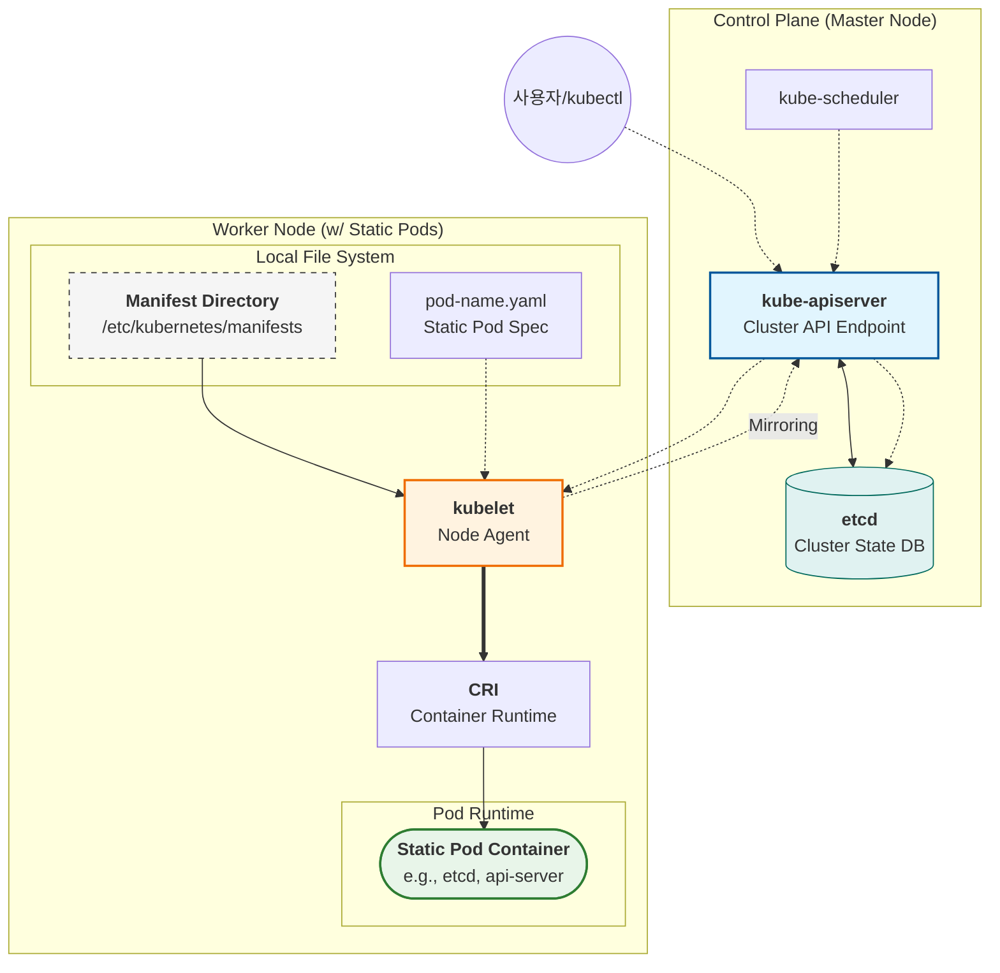

## Resource: Download Kubernetes Certificate Health Check Spreadsheet

## (2025 Updates) Custom Resource Definition (CRD)

## 여기서 resources 에 해당하는 리소스명을 찾으려면

## kubectl api-resources 를 명령하고 확인한다

## Taints & Tolerations 🔖

### Taints 란 ??

### Tolerations 란 ??

### 문제 1 :

## PriorityClass & Static Pod 🏷️

### **PriorityClass 란 ??**

`PriorityClass`는 Pod에 **상대적인 중요도**를 부여하는 리소스이다. 클러스터의 자원이 부족할 때 어떤 Pod를 먼저 실행하고, 어떤 Pod를 희생(Eviction)시킬지 결정하는 기준이 된다.
**우선순위 선언문인 PriorityClass 는 Cluster Scoped Resource 이며 Pod 수준에서 이를 매핑하여 우선순위를 지정하도록 처리한다**

### 원리

1. 등록
2. 매핑(Admission Control)
3. 큐잉 단계(Scheduling Queueing)
4. 선점(Preemption)

### 스케줄링 우선순위

자원이 꽉 찬 클러스터에 높은 우선순위의 Pod가 들어오면 **선점(Preemption)** 로직이 작동한다.

1. 스케줄러는 낮은 우선순위의 Pod를 찾아 **강제 종료(Eviction)** 시킨다.
2. 확보된 자원에 높은 우선순위의 Pod를 배치한다.

### 적용 & 확인

```bash
# PriorityClass 생성
apiVersion: scheduling.k8s.io/v1
kind: PriorityClass
metadata:
  name: high-priority-nonpreempting
value: 1000000
preemptionPolicy: Never
globalDefault: false
description: "This priority class will not cause other pods to be preempted."

# Pod/Deployment 에 PriorityClass 적용
apiVersion: apps/v1
kind: Deployment
metadata:
	,,,
spec:
  ,,,
  template:
      ,,,
    spec:
      priorityClassName: high-priority
      containers:
        ,,
```

```bash
# rollout 을 통해 deployment 에 적용
kubectl rollout status ${deploy-이름} -n ${namespace-이름}

# priorityclass 가 제대로 생성되었는지 확인
kubectl get pc

# pod 상세 정보에서 priority 를 확인
kubectl get pods -n ${namespace-이름} | grep ${deploy-이름}
kubectl describe pods ${pod-이름} -n ${namespace-이름}
```

### 문제 : PriorityClass 생성 후 적용

Create a new PriorityClass named high-priority for user-workloads with a
value that is one less than the highest existing user-defined priority class
value.

Patch the existing Deployment busybox-logger running in the priority
namespace to use the high-priority priority class.

Ensure that the busybox-logger Deployment rolls out successfully with the
new priority class set.

It is expected that Pods from other Deployments running in the priority
namespace are evicted.

Do not modify other Deployments running in the priority namespace.

Failure
to do so may result in a reduced score.

```bash
# 1. 기존 PriorityClass 확인
kubectl get priorityclass

vi high-priority.yaml

apiVersion: scheduling.k8s.io/v1
kind: PriorityClass
metadata:
  name: high-priority
value: <기존 최고값>-1
globalDefault: false
description: "This priority class should be used for XYZ service pods only."

kubectl get deploy busybox-logger -o yaml > busybox-logger.yaml

vi busybox-logger.yaml

apiVersion: apps/v1
kind: Deployment
metadata:
  name: busybox-logger
  namespace: priority
  labels:
    app: nginx
spec:
  replicas: 3
  selector:
    matchLabels:
      app: nginx
  template:
      ,,,
    spec:
      priorityClassName: high-priority
      containers:
        ,,

kubectl apply -f busybox-logger.yaml
kubectl rollout status busybox-logger -n priority
```

### Static Pod 란?

API 서버를 거치지 않고, **특정 노드의 kubelet이 직접 관리**하는 Pod 이다.

### 원리

1. Monitoring
2. Static Pod 실행
3. Mirroring



> ⚠️

### 어떤 컴포넌트들이 Static Pod 로 작동하는가?

1.

### StaticPod 삭제방법

Static Pod 는 `/etc/kubernetes/manifests` 안에 있는 yaml 로 돌아가기 때문에 생명주기가 철저히 해당 파일에 의존적이다. `kubectl get pods` 로 보이는 static pod 는 사실 API 서버에서 생성된 Mirror Pod 이기 때문에 `kubectl delete` 로 지운다고 해서 원본이 제거되는 것이 아니다. 따라서 Static Pod 를 제거하고자 한다면 `/etc/kubernetes/manifests` 안에 있는 yaml 를 제거하거나 이동시켜주면 된다.

### 적용 & 확인

[^1]: PriorityClass의 `value` 필드는 32비트 정수 범위 내에서 지정하며, 높을수록 우선순위가 높다. 시스템 예약 범위(2,000,000,000 이상)는 쿠버네티스 시스템 컴포넌트 전용으로 사용자 정의에는 사용하지 않는 것이 좋다.
[^2]: `preemptionPolicy: Never` 로 설정하면 해당 PriorityClass 의 Pod 는 다른 Pod 를 선점하지 않고 스케줄링 큐에서 대기한다. 리소스가 확보될 때까지 기다려야 하지만 기존 워크로드를 중단시키지 않는다는 장점이 있다.
[^3]: Static Pod 의 대표적인 사례는 Control Plane 컴포넌트들이다. `kube-apiserver`, `kube-controller-manager`, `kube-scheduler`, `etcd` 모두 `/etc/kubernetes/manifests` 디렉토리에 yaml 로 존재하며 kubelet 이 직접 관리한다.
[^4]: Mirror Pod 는 kubelet 이 Static Pod 를 실행할 때 API 서버에 읽기 전용으로 등록하는 복사본이다. `kubectl get pods` 에서 확인은 가능하지만 `kubectl delete` 로 제거해도 kubelet 이 즉시 재생성한다.
[^5]: Taint 는 노드에 설정하여 특정 Pod 가 해당 노드에 스케줄되지 못하도록 막고, Toleration 은 Pod 에 설정하여 Taint 가 있는 노드에도 스케줄될 수 있도록 허용한다. `NoSchedule`, `PreferNoSchedule`, `NoExecute` 세 가지 effect 가 있다.
