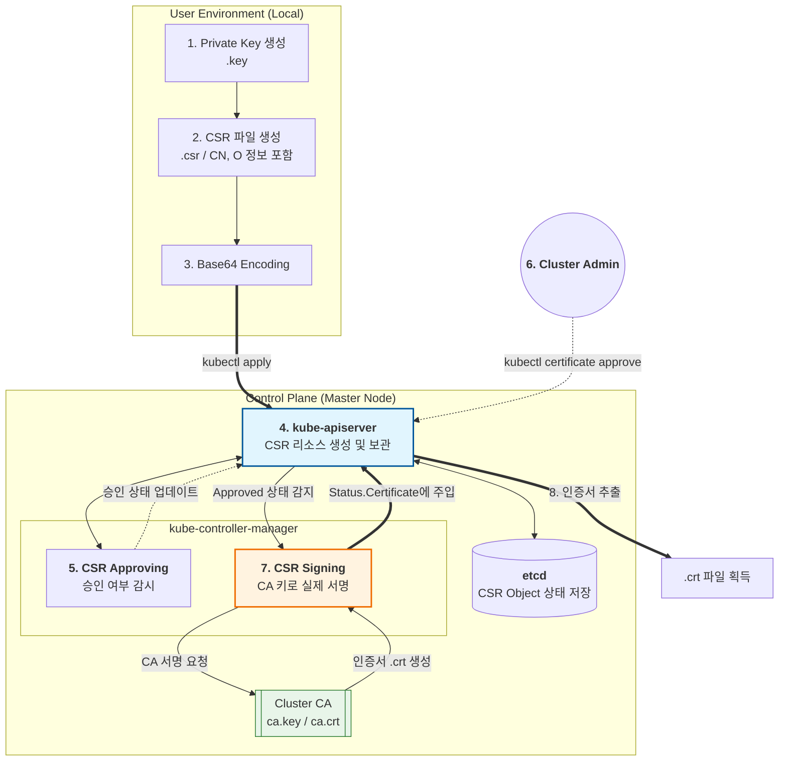

## 3주차 : 섹션 7 Security

# Why ?

# What ?

## Kubernetes Security Primitives

## Authentication

## Article on Setting up Basic Authentication

## TLS Introduction

## TLS Basics

## TLS in Kubernetes

## TLS in Kubernetes - Certificate Creation

## View Certificate Details

## Certificates API

## KubeConfig

## API Groups

## Authorization

## Image Security

## Pre-requisite - Security in Docker

## Security Contexts

## CertificateSigningRequest (CSR)

[https://kubernetes.io/docs/tasks/tls/certificate-issue-client-csr/](https://kubernetes.io/docs/tasks/tls/certificate-issue-client-csr/)
[https://hellouz818.tistory.com/46](https://hellouz818.tistory.com/46)

### CSR 이란?

쿠버네티스는 '사용자(User)'라는 리소스가 따로 없다.

대신 인증서 안에 들어있는 이 두 필드를 보고 사용자를 식별한다

- **CN (Common Name):** 쿠버네티스가 인식하는 **사용자 ID**
- **O (Organization):** 쿠버네티스가 인식하는 **그룹명**

이를 API 서버에게 전달하기 위해 CSR 매니페스트를 쿠버네티스 API 서버에 보낸다
이를 통해 API 서버는 사용자를 식별하여 사용자에 승인된 권한의 요청만 처리한다.

권한을 처리하는 리소스이므로 Cluster Scoped 이다.

### 원리

1.

사용자는 개인키 파일을 생성한다. 2.

이후 개인키 + 사용자이름 + 그룹이름을 담은 CSR 파일을 생성한다. 3. `CertificateSigningRequest` YAML을 작성하여 `kubectl apply` 한다. 4.

클러스터 관리자가 해당 CSR 을 승인하면 CSR 의 상태를 Approved 로 변경한다. 5.

CSR Signing Controller가 승인된 요청을 감시(Watch)하다가 포착하고, 클러스터 내부 RootCA 를 사용하여 CSR 승인 데이터를 다시 CSR 내부 `status.certificate` 필드에 다시 저장한다. 6.

사용자는 `kubectl get csr <이름> -o jsonpath='{.status.certificate}'` 명령으로 발급된 인증서를 다운로드한다. 7.

이제 이 인증서와 처음에 만든 개인키를 `kubeconfig`에 등록하면, API 서버는 인증서의 `CN`과 `O`를 보고 사용자를 인식하게된다.



### 적용 & 확인

1.

개인키 생성 2.

CSR 파일 생성 3.

Base64 인코딩 4.

서명 주체 (SignerName) 5.

관리자가 CSR 승인 6.

최종 확인 7.

사용자가 승인완료된 인증서를 kubeconfig 에 등록 8.

해당 사용자가 문제없이 kube-api-server 와 통신이 되는지 확인한다.

## cert-manager

### cert-manager 란 ?

[https://velog.io/@wanny328/Kubernetes-Cert-Manager-%EC%95%8C%EC%95%84%EB%B3%B4%EA%B8%B0](https://velog.io/@wanny328/Kubernetes-Cert-Manager-%EC%95%8C%EC%95%84%EB%B3%B4%EA%B8%B0)
[https://picluster.ricsanfre.com/docs/certmanager/](https://picluster.ricsanfre.com/docs/certmanager/)
쿠버네티스 내부에서 TLS 인증서의 생명주기(발급, 갱신, 폐기)를 자동으로 관리해주는 오픈소스 컨트롤러이다.

SSL 인증서를 자동 갱신처리해주며 외부 CA(인증 기관)와 연동하여 신뢰할 수 있는 HTTPS 환경을 제공한다.

### 원리


- Issuer
- Certificate
- Secret(TLS Secret)

이렇게 각각 생성된 Manifest 를 통해 자동 CA 인증서 관리를 하며, 이를 Deployment/Ingress 에 적용한다.

### 적용 & 확인

```yaml
# 1. Issuer 생성
apiVersion: cert-manager.io/v1
kind: Issuer
metadata:
  name: selfsigned-issuer
  namespace: default
spec:
	secretName: my-tls-secret # 이 이름으로 Secret이 자동 생성됨
	  duration: 2160h # 90일
	  renewBefore: 360h # 만료 15일 전 갱신
	  subject:
	    organizations:
	      - my-org
	  isCA: false
	  privateKey:
	    algorithm: RSA
	    encoding: PKCS1
	    size: 2048
	  usages:
	    - server auth
	    - client auth
	  dnsNames:
	    - "example.com"
	    - "www.example.com"
	  issuerRef: # issuer 매핑
	    name: selfsigned-issuer
	    kind: Issuer
	    group: cert-manager.io
```

```yaml
# 2. Certificate 생성
apiVersion: cert-manager.io/v1
kind: Certificate
metadata:
  name: example-test-com
spec:
  dnsNames:
    - "example.com"
  issuerRef:
    name: nameOfClusterIssuer
  secretName: example-test-com-tls

# 이후 Secret 은 Certificate 에 의해 자동으로 생성됨
# Secret 내에는 CA 인증서와 TLS 인증서&키가 저장되며
# CA 인증서는 Issuer 에 의해, TLS 인증서&키는 Certificate 에 의해 발행됨
```

```bash
# certificate 상태 확인
kubectl describe certificate ${certificate-이름}

# certificaterequest 확인
kubectl get certificaterequest
```

```bash
# 실제 자동 생성된 Secret 내 인증서 유효기간과 도메인 확인
kubectl get secret my-tls-secret -o jsonpath='{.data.tls\.crt}' \
		| base64 -d  \
		| openssl x509 -text -noout
```

```bash
# 실제 적용
# Ingress
apiVersion: networking.k8s.io/v1
kind: Ingress
metadata:
  name: my-app-ingress
  annotations:
    # 핵심: 어떤 Issuer를 쓸지 지정하면 나머지는 자동으로 처리됩니다.
    cert-manager.io/cluster-issuer: "letsencrypt-prod"
spec:
  tls:
  - hosts:
    - myapp.example.com
    secretName: myapp-tls-secret # 이 이름으로 Secret이 자동 생성 및 관리됨
  rules:
  - host: myapp.example.com
    http:
      paths:
      - path: /
        pathType: Prefix
        backend:
          service:
            name: my-service
            port:
              number: 80

# Deployment
# Certificate로 생성된 Secret을 파드에 Volume으로 마운트
spec:
  template:
    spec:
      containers:
      - name: my-secure-app
        image: my-app:latest
        volumeMounts:
        - name: cert-vol
          mountPath: "/etc/tls" # 앱이 인증서를 읽어갈 경로
          readOnly: true
      volumes:
      - name: cert-vol
        secret:
          secretName: example-test-com-tls # Certificate에서 정의한 그 이름
```
