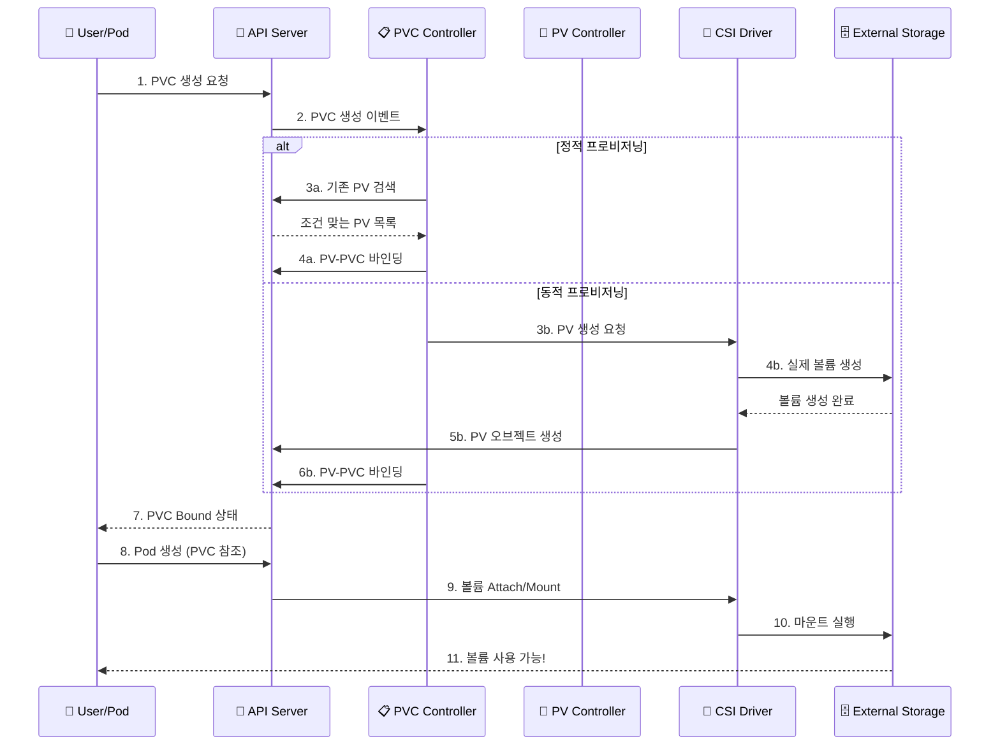
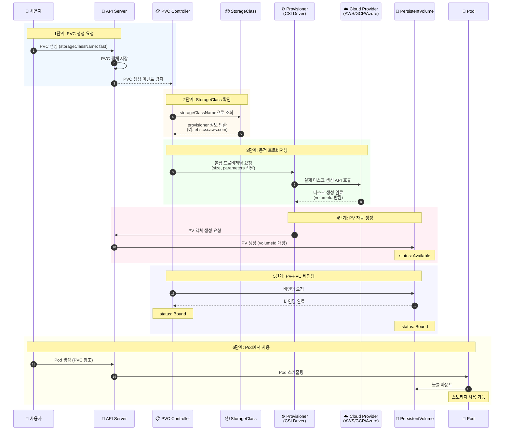

## Persistent Key/Value Store

## 4주차 : 섹션 8 Storage

# Why ?

# What ?

## Container Storage Interface


### CRI

- 과거 Docker 독점 시대에 Kubernetes는 Docker shim에 의존했다
- 그러나 containerd, CRI-O, runc 같은 경량 런타임이 등장하면서 vendor lock-in을 피하고 최적화가 필요했다.
- CRI 표준을 선언함으로써 구현체 종속에 벗어나고 여러 구현체를 갈아끼울 수 있게 하였다

### CNI

- Kubernetes에서 Pod 네트워킹을 담당하는 표준으로, kubelet이 CNI 플러그인을 호출해 Pod에 IP 할당, veth 페어 생성, 라우팅 설정을 수행한다.
- CRI 와 마찬가지로 여러 구현체를 갈아끼울 수 있게 하였다

### CSI

- Kubernetes에서 스토리지 볼륨을 관리하는 표준으로, kubelet이 CSI 드라이버를 통해 볼륨 프로비저닝, 마운트, 스냅샷 등의 작업을 위임한다.
- CRI 와 마찬가지로 여러 구현체를 갈아끼울 수 있게 하였다

## PV & PVC

k8s 에서는 Persistent Volume 라는 클러스터 리소스를 선언하여 Volume 을 관리한다

PV 는 관리자가 프로비저닝하거나, Storage class를 사용해서 동적으로 프로비저닝한 클러스터의 스토리지이며
Pod과 동일한 라이프사이클을 가지지만 PV는 리소스를 사용하는 Pod과 별개의 라이프사이클을 가진다.

따라서 Pod 종료되더라도 데이터는 영속되는 영속성을 띈다

이 PV 를 사용하려면 어떻게 해야할까?

Pod 는 이 PV 를 사용하겠다는 선언문을 만들어야 한다.

이 선언문을 클러스터 리소스로 표현한 것이 PVC 이다

개발자는 PVC 를 선언하고 이를 Pod 에서 참조함으로써 볼륨을 사용할 수 있다.

```yaml
# 개발자가 선언하는 부분
apiVersion: v1
kind: PersistentVolumeClaim
metadata:
  name: mongodb-pvc
spec:
  resources:
    requests:
      storage: 1Gi
  accessModes:
    - ReadWriteOnce
  storageClassName: ""

# 인프라 관리자가 선언하는 부분
apiVersion: v1
kind: Pod
metadata:
  name: mongodb
spec:
  containers:
    - image: mongo
      name: mongodb
      volumeMounts:
        - name: mongodb-data
          mountPath: /data/db
      ports:
        - containerPort: 27017
          protocol: TCP
  volumes:
    - name: mongodb-data
      persistentVolumeClaim:
        claimName: mongodb-pvc
```


### 왜 바로 PV 를 사용하지 않고 PVC 를 거쳐서 사용하도록 했을까?

그것은 추상화의 이점을 살리기 위함이다.

직접 PV 참조 시 개발자가 모든 노드에서 동일 PV를 인지해야 하고, 스토리지 백엔드 변경 시 Pod 수정이 필요하다.

하지만 PVC 를 통해 동적 프로비저닝을 지원함으로써 스토리지 변경 및 Pod 재생성 시에도 PVC 가 PV를 유지 바인딩해 데이터 영속성을 보장하게끔 한다.

### 그렇다면 PVC 는 어떻게 동작할까?

PVC 와 PV 는 Kubernetes control plane 의 control loop 가 아래 조건에 따라 1대1로 매핑된다.

다만 모두 만족해야만 바인딩한다.

| 조건                | 설명                    | 예시                     |
| ------------------- | ----------------------- | ------------------------ |
| **용량**            | PVC 요청량 ≤ PV 용량    | 5Gi 요청 → 10Gi PV 가능  |
| **접근 모드**       | 읽기/쓰기 방식 호환     | RWO, ROX, RWX, RWOP      |
| **볼륨 모드**       | 파일시스템 or 블록 일치 | Filesystem / Block       |
| **스토리지 클래스** | 이름 일치               | `fast-ssd` = `fast-ssd`  |
| **셀렉터**          | 라벨 매칭               | `matchLabels: type=fast` |

실제 처리과정은 아래와 같다.

- **Provisioning** - PV 생성 (정적: 수동 / 동적: StorageClass로 자동)
- **Binding** - PVC ↔ PV 1:1 매핑
- **Using** - Pod에서 볼륨 사용
- **Reclaiming** - PVC 삭제 후 PV 처리 (Retain/Delete/Recycle)



만약 조건을 만족하지 못 하면 어떻게 될까?

Pod 와 PVC 가 Pending 상태로 유지되며, 적합한 PV가 생길 때까지 무한정 대기한다.

만약 이런 상황이 발생한다면 PVC, PV 바인딩이 잘 되었는지 체크하여 원인을 해결해주어야 한다

```yaml
kubectl get pvc          # STATUS가 Bound인지 확인
kubectl get pv           # STATUS가 Bound, CLAIM 열에 PVC 이름 표시
kubectl describe pvc <pvc-이름>    # Volume: <pv-이름> 표시
kubectl describe pv <pv-이름>      # ClaimRef: namespace/pvc-이름 표시
```

## Storage Class

PV,PVC 를 사용한 볼륨 프로비저닝은 다음 두 가지 타입이 존재한다.

- **Static Volume Provisioning**
- **Dynamic Volume Provisioning**

Static Volume Provisioning 은 PV 를 명시하여 디스크를 확보해두는 것이다.

이러한 프로비저닝의 단점은 사용할 크기만큼 미리 PV 를 선언해야한다는 것이다.

이를 보완하기 위해 Dynamic Volume Provisioning 이 등장하였다.

여기서는 PV 를 선언하는 것 대신, Storage Class 를 사용하여 PV 를 생성, 동적으로 매핑한다.

그렇다면 Storage Class 란 무엇일까?

Storage Class 는 PV 를 추상화하여 다양한 속성을 가진 볼륨을 선택할 수 있게 해주는 클러스터 리소스이다.

```yaml
apiVersion: storage.k8s.io/v1
kind: StorageClass
metadata:
  name: fast
provisioner: kubernetes.io/gce-pd # 프로비저너 지정
parameters:
  type: pd-ssd # 스토리지 유형 파라미터
reclaimPolicy: Delete # 회수 정책
volumeBindingMode: Immediate # 바인딩 모드
allowVolumeExpansion: true # 볼륨 확장 허용
```

이렇게 Storage Class 를 선언하고 나면 프로비저너가 알아서 PV 를 프로비저닝하여 동적으로 매핑해준다.

그렇다면 실제 처리과정은 어떻게 처리되는가?

아래 순서와 같이 처리된다.



1. 1단계: PVC 생성 요청
2. 2단계: StorageClass 확인
3. 3단계: 동적 프로비저닝 (핵심 단계)
4. 4단계: PV 자동 생성
5. 5단계: PV-PVC 바인딩
6. 6단계: Pod에서 사용

# How ?

## Lab PV & PVC

```yaml
# k edit pod webapp

,,,
volumeMounts:
- mountPath: /log
  name : log-volume
,,,,
volumes:
- name: log-volume
	hostPath:
		path: /var/log/webapp
,,,

# k replace --force -f /tmp/kubectl-edit-${temp-hash}.yaml
```

```yaml
apiVersion: v1
kind: PersistentVolume
metadata:
  name: pv-log
spec:
  capacity:
    storage: 100Mi
  volumeMode: Filesystem
  accessModes:
    - ReadWriteMany
    # ReadWriteOnce는 단일 노드에서만 읽기/쓰기가 가능
    # ReadWriteMany는 여러 노드에서 동시에 읽기/쓰기가 가능
  persistentVolumeReclaimPolicy: Retain
	# Retain 은 PVC 삭제 후에도 PV의 데이터를 그대로 보존하여 수동 관리가 필요
	# Delete는 PVC 삭제 시 PV와 데이터를 모두 제거
	# Recycle 은 PVC 해제 시 PV의 내용을 초기화하여 재사용 가능
	# ⚠️ Recycle 은 Deprecated 되었고 공식문서는 dynamic provisioning 을 권장하고 있음 ⚠️
	hostPath:
		path: /pv/log
```

```yaml
kubectl get pvc          # STATUS가 Bound인지 확인
kubectl get pv           # STATUS가 Bound, CLAIM 열에 PVC 이름 표시
kubectl describe pvc <pvc-이름>    # Volume: <pv-이름> 표시
kubectl describe pv <pv-이름>      # ClaimRef: namespace/pvc-이름 표시

# ⚠️ AccessMode 가 mismatch 인 경우에도 pv,pvc bound 불가능이므로 주의 ⚠️
```

## Lab Storage Class

```yaml
apiVersion: v1
kind: PersistentVolumeClaim
metadata:
  name: local-pvc
spec:
  accessModes:
    - ReadWriteOnce
  volumeMode: Filesystem
  resources:
    requests:
      storage: 8Gi
  storageClassName: slow
  # ⚠️ pv 에 명시된 storageClassName 사용하거나 적합한 className 사용 ⚠️
  # standard : 클라우드 제공자(AWS EBS, GCP PD 등)의 기본 스토리지
  # fast: SSD 기반의 고성능 스토리지를 프로비저닝
  # slow: HDD 기반의 저가형 스토리지를 프로비저닝
  # NFS, Ceph, GlusterFS: 네트워크 기반의 공유 스토리지를 프로비저닝
```

```yaml
apiVersion: storage.k8s.io/v1
kind: StorageClass
metadata:
  name: low-latency
  # 보통 아래와 같이 처리한다고 한다.
  # standard : 일반적인 속도의 HDD 기반 스토리지
  # fast / premium-rwo : 고성능 SSD 기반 스토리지
  # low-latency : 지연 시간이 매우 낮은 초고속 스토리지 (NVMe 등)
  # slow / archive : 백업용이나 저속 저장소

provisioner: csi-driver.example-vendor.example
volumeBindingMode: WaitForFirstConsumer
# WaitForFirstConsumer : 이 PVC를 사용하는 Pod가 실제 생성될 때 비로소 PV 생성
# Immediate : PVC가 생성되는 즉시 PV를 생성하고 바인딩
# ⚠️ Immediate 는 노드 배치 전에 볼륨 생성을 하므로
#		 Pod가 배치될 노드의 위치(Topology)를 고려하여
#		 최적의 위치에 볼륨을 생성하는 WaitForFirstConsumer 사용을 권장 ⚠️
```

```yaml
apiVersion: v1
kind: Pod
metadata:
  name: nginx-pod
  labels:
    app: nginx
spec:
  containers:
    - name: nginx-container
      image: nginx:latest
      ports:
        - containerPort: 80
      volumeMounts:
	      - mountPath: "/var/www/html"
		      name: local-pvc-volume
  dnsPolicy: ClusterFirst
  restartPolicy: Always
  volumes:
	- name: local-pvc-volume
		persistentVolumeClaim:
				claimName: local-pvc
```

## PV / PVC / Storage Class

## StorageClass

> cka 시험 도중 복사 붙여넣기 이슈 ??

### StorageClass 란??

### 선언 방법

### 적용 이후 확인

### 유의사항

# 2번 문제

Create a deployment named `logging-deployment` in the namespace `logging-ns` with 1 replica, with the following specifications:
The main container should be named `app-container`, use the image `busybox`, and should run the following command to simulate writing logs:

```
sh -c "while true; do echo 'Log entry' >> /var/log/app/app.log; sleep 5; done"
```

Add a sidecar container named `log-agent` that also uses the `busybox` image and runs the command:

```
tail -f /var/log/app/app.log
```

- `log-agent` logs should display the entries logged by the main `app-container`
- Sidecar displays logs from main container
- Sidecar container properly configured

> 💡 pod 간 볼륨 설정 시 emptyDir vs persistentVolumeClaim
> 💡 사이드카 설정 시 initContainers vs containers 차이점

```bash
# Create
kubectl create deploy logging-deployment \
 --image=busybox \
 --dry-run=client \
 -o yaml > logging-deployment.yaml
```

```yaml
apiVersion: apps/v1
kind: Deployment
metadata:
  name: logging-deployment
  labels:
    app: logging-deployment
  namespace: logging-ns
spec:
  replicas: 1
  selector:
    matchLabels:
      app: app-container
  volumes:
    - name: shared-log-volume
      emptyDir: {}
  template:
    metadata:
      labels:
        app: app-container
    spec:
      containers:
      - name: app-container
        image: busybox
        command: ["/bin/sh"]
				args: ["-c", "while true; do echo 'Log entry' >> /var/log/app/app.log; sleep 5; done"]
				volumeMounts:
        - mountPath: "/var/log/app/"
          name: shared-log-volume
      initContainers:
        - name: log-agent
          image: busybox
          restartPolicy: Always
          command: ["/bin/sh"]
					args: ["-c", "tail -f /var/log/app/app.log"]
					volumeMounts:
	        - mountPath: "/var/log/app/"
	          name: shared-log-volume

```

```bash
# Check
kubectl get deploy -n logging-ns
kubectl describe deploy -f logging-deployment.yaml
kubectl get pods -n logging-ns
kubectl logs -n logging-ns deployment/logging-deployment -c log-agent
```

# 3번 문제

A Deployment named `webapp-deploy` is running in the `ingress-ns` namespace and is exposed via a Service named `webapp-svc`.

Create an Ingress resource called `webapp-ingress` in the same namespace that will route traffic to the service.

The Ingress must:

- Use `pathType: Prefix`
- Route requests sent to path `/` to the backend service
- Forward traffic to port `80` of the service
- Be configured for the host `kodekloud-ingress.app`

Test app availablility using the following command:

```
curl -s http://kodekloud-ingress.app/
```

Ingress exposed and serving traffic via kodekloud-ingress.app host

```json
# 서비스 실행여부 확인
kubectl ??

# 디플로이먼트에 대해 서비스 디스커버리 여부 확인
kubectl ??
```

```yaml
apiVersion: networking.k8s.io/v1
kind: Ingress
metadata:
  name: minimal-ingress
spec:
  ingressClassName: nginx-example
  rules:
    - http:
        paths:
          - path: /
            pathType: Prefix
            backend:
              service:
                name: test
                port:
                  number: 80
```

# 4번 문제

Create a new deployment called `nginx-deploy`, with image `nginx:1.16` and `1` replica.

Next, upgrade the deployment to version `1.17` using rolling update.
**Note:** Use the `kubectl apply` command to create or update the deployment.

- Deployment: nginx-deploy, Image: nginx:1.16
- Image: nginx:1.16
- Version upgraded to 1.17

# 5번 문제

Create a new user called `john`.

Grant him access to the cluster using a csr named `john-developer`.

Create a role `developer` which should grant John the permission to `create, list, get, update and delete pods` in the `development` namespace .

The private key exists in the location: `/root/CKA/john.key` and csr at `/root/CKA/john.csr`.
`Important Note`: As of kubernetes 1.19, the CertificateSigningRequest object expects a `signerName`.

Please refer to the documentation to see an example.

The documentation tab is available at the top right of the terminal.

- CSR: john-developer Status:Approved
- Role Name: developer, namespace: development, Resource: Pods
- Access: User 'john' has appropriate permissions

## PersistentVolume을 찾으면

## pv라는 약어와 apiGroups가 비어있음("") 을 알 수 있다

vi ~/pvviewer-role-binding.yaml
apiVersion: rbac.authorization.k8s.io/v1

# This cluster role binding allows anyone in the "manager" group to read secrets in any namespace.

kind: ClusterRoleBinding
metadata:
name: pvviewer-role-binding
subjects:

- kind: ServiceAccount
  name: pvviewer
  namespace: default
  roleRef:
  kind: ClusterRole
  name: pvviewer-role
  apiGroup: rbac.authorization.k8s.io

# serviceAccountName 을 통해 ServiceAccount 를 지정한다

# https://kubernetes.io/docs/reference/kubernetes-api/workload-resources/pod-v1/

vi ~/pvviewer-pod.yaml
apiVersion: v1
kind: Pod
metadata:
name: redis
namespace: default
spec:
serviceAccountName: pvviewer
containers:

- name: redis
  image: redis

kubectl apply -f ~/pvviewer-serivce-account.yaml
kubectl apply -f ~/pvviewer-role.yaml
kubectl apply -f ~/pvviewer-role-binding.yaml
kubectl apply -f ~/pvviewer-pod.yaml

# 확인

kubectl get pod pvviewer -o jsonpath='{.spec.serviceAccountName}'

# 결과로 pvviewer 가 나오면 성공!

kubectl auth can-i list pv --as=system:serviceaccount:default:pvviewer

# 결과로 yes 가 나오면 성공!

````

# 3번 문제

Create a StorageClass named `rancher-sc` with the following specifications:
The provisioner should be `rancher.io/local-path[^226]`.
The volume binding mode should be `WaitForFirstConsumer`.
Volume expansion should be enabled.

- StorageClass rancher-sc is present
- Provisioner is rancher.io/local-path
- VolumeBindingMode is WaitForFirstConsumer

### 아예 몰라요

StorageClass 가 뭔디 !?
Provisioner 는 뭐고 어떤 걸 설정할 수 있는디 ?
VolumeBindingMode 는 뭔디 ? 종류가 뭐가 있는디 ?

```yaml

apiVersion: storage.k8s.io/v1
kind: StorageClass
metadata:
  name: rancher-sc
  annotations:
    storageclass.kubernetes.io/is-default-class: "false"
provisioner: rancher.io/local-path
allowVolumeExpansion: true
volumeBindingMode: WaitForFirstConsumer
````

# 4번 문제

Create a ConfigMap named `app-config` in the namespace `cm-namespace` with the following key-value pairs:

```
ENV=production
LOG_LEVEL=info
```

Then, modify the existing Deployment named `cm-webapp` in the same namespace to use the `app-config` ConfigMap by setting the environment variables `ENV` and `LOG_LEVEL` in the container from the ConfigMap.

- ConfigMap app-config is created
- Deployment uses the app-config ConfigMap for variable ENV and LOG LEVEL
- Are the environment variables reflected in the deployment?
- ConfigMap has proper ENV value
- ConfigMap has proper LOG_LEVEL value

```yaml
# configmap 생성 / deployment 수정

# vim app-config.yaml

# 아래와 같이 명령어로도 생성 가능

# kubectl create configmap app-config -n cm-namespace \
#  --from-literal=ENV=production \

#  --from-literal=LOG_LEVEL=info

apiVersion: v1
kind: ConfigMap
metadata:
  name: app-config
	namespace: cm-namespace
data:
  ENV: production
	LOG_LEVEL: info
apiVersion: apps/v1
kind: Deployment
metadata:
  name: cm-webapp
  namespace: cm-namespace
spec:
  replicas: 3
  selector:
    matchLabels:
      app: nginx
  template:
    metadata:
      labels:
        app: nginx
    spec:
      containers:
      - name: nginx
        image: nginx:1.14.2
        ports:
        - containerPort: 80
        envFrom:
        - configMapRef:
            name: app-config

kubectl apply -f app-config.yaml
# 실행 중인 deployment 의 manifest 파일 수정방법

# 1) 바로 설정 열어서 수정, 저장하면 바로 rolling policy 에 의해 반영
kubectl edit deployment cm-webapp -n cm-namespace
# 2) manifest yaml 추출 후 수정 및 적용

kubectl get deployment cm-webapp -n cm-namespace -o yaml > cm-webapp.yaml
vim cm-webapp.yaml
kubectl apply -f cm-webapp.yaml

# 이후 확인

kubectl describe cm app-config -n cm-namespace
kubectl describe deploy cm-webapp -n cm-namespace
kubectl get pods -n cm-namespace -l app=cm-webapp -o name # deploy 의 pod 이름
# 위에서 가져온 POD 에 접근하여 환경변수 확인

kubectl exec -n cm-namespace $POD_NAME -- sh -c 'echo $ENV'
kubectl exec -n cm-namespace $POD_NAME -- sh -c 'echo $LOG_LEVEL'
```

# 5번 문제

Create a PriorityClass named `low-priority` with a value of 50000. A pod named `lp-pod` exists in the namespace `low-priority`. Modify the pod to use the priority class you created. Recreate the pod if necessary.

- Is the PriorityClass low-priority created?
- Low priority class value is set properly to 50000
- Pod lp-pod uses the low-priority PriorityClas

### 아예 몰라요,,,

PriorityClass 가 뭔데 ㅠㅠㅠ
PriorityClass 와 Pod 의 상관관계가 어떻게 되는데 ㅠㅠ
왜 PriorityClass 수정 시 실행 중인 파드의 Priority 는 수정할 수 없는거지 ??

```yaml
# vim low-priority.yaml

apiVersion: scheduling.k8s.io/v1
kind: PriorityClass
metadata:
  name: low-priority
value: 50000
globalDefault: false

kubectl apply -f low-priority.yaml

# pod 수정

# 실행 중인 파드의 Priority 는 수정할 수 없으므로
# 기존 pod 삭제 이후 새로 적용한다

kubectl get pod lp-pod -n low-priority -o yaml > lp-pod.yaml
vim lp-pod.yaml
apiVersion: v1
kind: Pod
metadata:
  name: lp-pod
spec:
  containers:
  - name: nginx
    image: nginx
    imagePullPolicy: IfNotPresent
  priorityClassName: high-priority
kubectl delete pod lp-pod -n low-priority
kubectl apply -f lp-pod.yaml

# pod 확인

kubectl describe pod lp-pod | grep -i priority
```

# 6번 문제

We have deployed a new pod called `np-test-1` and a service called `np-test-service`. Incoming connections to this service are not working. Troubleshoot and fix it.
Create NetworkPolicy, by the name `ingress-to-nptest` that allows incoming connections to the service over port `80`.
Important: Don't delete any current objects deployed.

- Important: Don't Alter Existing Objects!
- NetworkPolicy: Is it applied to all sources (Incoming traffic from all pods)?
- NetworkPolicy: Is the port correct?
- NetworkPolicy: Is it applied to the correct Pod?

### 아예 몰라요,,,

NetworkPolicy 가 뭔데 ㅠㅠㅠ
서비스와 파드가 있는데 왜 별도의 Inbound/Outbound 를 지정해줘야하는건데
Ingress, Egress 차이가 뭔데

- **Ingress (안으로):** 외부에서 내부(Pod)로 들어오는 트래픽 (입구)
- **Egress (밖으로):** 내부(Pod)에서 외부로 나가는 트래픽 (출구)

```yaml
# pod 라벨 확인

kubectl get pod np-test-1 -o show-labels

# network policy 작성

vim ingress-to-nptest.yaml

apiVersion: networking.k8s.io/v1
kind: NetworkPolicy
metadata:
  name: ingress-to-nptest
  namespace: default
spec:
  podSelector:
    matchLabels:
      run: np-test-1 # 1단계에서 확인한 라벨을 정확히 기입!
  policyTypes:
  - Ingress
  ingress:
	- from: [] # [] 또는 from 절 자체를 비워두면 '모든 소스' 허용을 의미합니다.
    ports:
    - protocol: TCP
      port: 80
```

# 7번 문제

Taint the worker node `node01` to be Unschedulable. Once done, create a pod called `dev-redis`, image `redis:alpine`, to ensure workloads are not scheduled to this worker node. Finally, create a new pod called `prod-redis` and image: `redis:alpine` with toleration to be scheduled on `node01`.
key: `env_type`, value: `production`, operator: `Equal` and effect: `NoSchedule`

- key = env_type
- value = production
- effect = NoSchedule
- Is pod 'dev-redis' (no tolerations) not scheduled on node01?
- Is the 'prod-redis' to running on node01?

### 아예 몰라요,,,

Taint 가 뭔데 ㅠㅠㅠ
Workloads 에 대한 스케줄링은 어떻게 하는건데,,,

- **Taint (얼룩/기분 나쁜 냄새):** 노드에 "나 이런 냄새 나니까 가까이 오지 마!" 라고 표시
- **Toleration (인내심/코감기):** 포드에 "난 그 냄새 참을 수 있어(인내심이 있어)" 능력을 주는 것
- 노드에 Taint가 있으면, 일반 포드들은 "윽, 냄새나!" 하고 그 노드를 피해감
- 오직 그 냄새를 견딜 수 있는 **Toleration**을 가진 포드만 그 노드에 들어갈 수 있음

```yaml
# node-1 에 taint 지정

kubectl taint nodes node01 env_type=production:NoSchedule

# dev-redis 는 taint node 에 스케줄링 불가

kubectl run dev-redis --image=redis:alpine

# prod-redis 는 스케줄링 가능하도록 toleration 지정

apiVersion: v1
kind: Pod
metadata:
  name: prod-redis
spec:
  containers:
  - name: redis
    image: redis:alpine
  # 이 부분이 핵심!
  tolerations:
  - key: "env_type"
    operator: "Equal"
    value: "production"
    effect: "NoSchedule"

kubectl apply -f prod-redis.yaml

# 노드와 파드 체크

kubectl describe node node01 | grep Taints
kubectl get pods -o wide
```

# 8번 문제

A PersistentVolumeClaim named `app-pvc` exists in the namespace `storage-ns`, but it is not getting bound to the available PersistentVolume named `app-pv`.
Inspect both the PVC and PV and identify why the PVC is not being bound and fix the issue so that the PVC successfully binds to the PV. Do not modify the PV resource.

- Is PVC correctly bound to PV?

**Recovering from Failure when Expanding Volumes**[\*\* \*\*](https://kubernetes.io/docs/concepts/storage/persistent-volumes/#recovering-from-failure-when-expanding-volumes)**확인 !! **[https://kubernetes.io/docs/concepts/storage/persistent-volumes/#recovering-from-failure-when-expanding-volumes](https://kubernetes.io/docs/concepts/storage/persistent-volumes/#recovering-from-failure-when-expanding-volumes)

1. Mark the PersistentVolume(PV) that is bound to the PersistentVolumeClaim(PVC) with `Retain` reclaim policy.
2. Delete the PVC. Since PV has `Retain` reclaim policy - we will not lose any data when we recreate the PVC.
3. Delete the `claimRef` entry from PV specs, so as new PVC can bind to it. This should make the PV `Available`.
4. Re-create the PVC with smaller size than PV and set `volumeName` field of the PVC to the name of the PV. This should bind new PVC to existing PV.
5. Don't forget to restore the reclaim policy of the PV.

### 아예 몰라요 아예

```yaml
apiVersion: v1
kind: PersistentVolumeClaim
metadata:
  annotations:
    kubectl.kubernetes.io/last-applied-configuration: |
      {"apiVersion":"v1","kind":"PersistentVolumeClaim","metadata":{"annotations":{},"name":"app-pvc","namespace":"storage-ns"},"spec":{"accessModes":["ReadWriteMany"],"resources":{"requests":{"storage":"1Gi"}}}}
  creationTimestamp: "2026-02-26T07:12:11Z"
  finalizers:
  - kubernetes.io/pvc-protection
  name: app-pvc
  namespace: storage-ns
  resourceVersion: "1940"
  uid: b2f276ef-f35f-4d2b-aa11-c566c634a5d6
spec:
  accessModes:
  - ReadWriteMany
  resources:
    requests:
      storage: 1Gi
  volumeMode: Filesystem
status:
  phase: Pending

apiVersion: v1
kind: PersistentVolume
metadata:
  annotations:
    kubectl.kubernetes.io/last-applied-configuration: |
      {"apiVersion":"v1","kind":"PersistentVolume","metadata":{"annotations":{},"name":"app-pv"},"spec":{"accessModes":["ReadWriteOnce"],"capacity":{"storage":"1Gi"},"hostPath":{"path":"/mnt/data"}}}
  creationTimestamp: "2026-02-26T07:12:11Z"
  finalizers:
  - kubernetes.io/pv-protection
  name: app-pv
  resourceVersion: "1939"
  uid: e1bc0ceb-10e5-4857-b2b0-09865b6a6e92
spec:
  accessModes:
  - ReadWriteOnce
  capacity:
    storage: 1Gi
  hostPath:
    path: /mnt/data
    type: ""
  persistentVolumeReclaimPolicy: Retain
  volumeMode: Filesystem
status:
  lastPhaseTransitionTime: "2026-02-26T07:12:11Z"
  phase: Available

# 해당 문제에서는 accessMode 가 서로 달라서

# 발생하는 이슈이다
# pvc 의 accessMode 를 pv 에 맞춰준다

apiVersion: v1
kind: PersistentVolumeClaim
metadata:
  annotations:
    kubectl.kubernetes.io/last-applied-configuration: |
      {"apiVersion":"v1","kind":"PersistentVolumeClaim","metadata":{"annotations":{},"name":"app-pvc","namespace":"storage-ns"},"spec":{"accessModes":["ReadWriteMany"],"resources":{"requests":{"storage":"1Gi"}}}}
  creationTimestamp: "2026-02-26T07:12:11Z"
  finalizers:
  - kubernetes.io/pvc-protection
  name: app-pvc
  namespace: storage-ns
  resourceVersion: "1940"
  uid: b2f276ef-f35f-4d2b-aa11-c566c634a5d6
spec:
  accessModes:
  - ~~ReadWriteMany~~ -> ReadWriteOnce

# pvc 수정하려면 기존 pvc 를 삭제해야함

kubectl delete pvc app-pvc -n storage-ns
kubectl apply -f app-pvc.yaml -n storage-ns

# 이제 최종 확인

kubectl get pvc app-pvc -n storage-ns
kubectl describe pvc app-pvc -n storage-ns
kubectl get pv app-pv -n storage-ns
```

# 9번 문제

A kubeconfig file called `super.kubeconfig` has been created under `/root/CKA`. There is something wrong with the configuration. Troubleshoot and fix it.

- Fix /root/CKA/super.kubeconfig

```yaml
piVersion: v1
clusters:
- cluster:
    certificate-authority-data: LS0tLS1CRUdJTiBDRVJUSUZJQ0FURS0tLS0tCk1JSURCVENDQWUyZ0F3SUJBZ0lJWW5qbWJjaldpaTR3RFFZSktvWklodmNOQVFFTEJRQXdGVEVUTUJFR0ExVUUKQXhNS2EzVmlaWEp1WlhSbGN6QWVGdzB5TmpBeU1qWXdOalUxTURGYUZ3MHpOakF5TWpRd056QXdNREZhTUJVeApFekFSQmdOVkJBTVRDbXQxWW1WeWJtVjBaWE13Z2dFaU1BMEdDU3FHU0liM0RRRUJBUVVBQTRJQkR3QXdnZ0VLCkFvSUJBUURSb2dHVFJBN1B2ZzlWYnlrZDMvMENHYVdDU3FFcjZtMVQ2dk1HWlNOOXBySm1lZlNvQ0xoeVcrd0UKLy9YZXNQZGdKYVg4OXVReHhDdVMxUlJzdjdtN3NHa1VnR2pxaWd2cGNuTTA5Wkdqa0ZJYVpsdDlWZ0Y5QjJqegpDbkFINExOQnZzWmdjd2pINDNQdWFBWDFRN3JQTEU0UHArMGExdXZEZUJCWFRoajBuaytxVWhSWVJOeGhXNDVWCk0wMW82QTVUSWFsVkQreHRRWkgxTUs1Z29RYnBnUi9JelRSNmJ0Y2IzUE5HWjAreG53NW92ajB6WHBPemlSN1UKU2RadDQzVFhPd3BtcUtlcVllNVMzQ0MySnpsaXl6UjhBeWJWT1FTS1BYSzVWVjlvaE5kRmZuRm1mQUdSM1ZtYQozV0JEWkNmN0NrODFIUFlQL2tOSDBnOWI3NWsvQWdNQkFBR2pXVEJYTUE0R0ExVWREd0VCL3dRRUF3SUNwREFQCkJnTlZIUk1CQWY4RUJUQURBUUgvTUIwR0ExVWREZ1FXQkJSUjBqcXZRdkNxTTF6T1VkUUkvLzFJSFRvSmV6QVYKQmdOVkhSRUVEakFNZ2dwcmRXSmxjbTVsZEdWek1BMEdDU3FHU0liM0RRRUJDd1VBQTRJQkFRQ1g4WEJPVXVvWApkaTlMN3NISjRSdWlNUW96OGh3RlNWMklXN0wyMFpSRHY4MFpOU095N3ZoQWwxRVlPWnp5aG9JZXY5dGczbVFxCkNodVBPMDY0ZlFCUUord09FWVhqc0xqaHRiT1lUdHNhWTV6WGVqNnBWL29pWU0yR2VSOXZQUy9IbTlncTFrUkMKcjhqMlZkNmM1QjZtYmVLa3JoTEdzZXRrd0E5V05qc2pEUDByU3lUVHdGOVVRcUsxTStaZDZhWnNYVWk5S3RXZAp6ck5URHN5Ui9iSHRoeE14MmtiVTJiUENsU1dWWlp4TG13WDlacm1kOSt0TTRpaDhHb3hBQ1pzZ212M1UwQzdpCnRHVVJZdTdqd2xTMkJVRjNLYmsvMTBhbU1OZi9RWUZyYVlHYjdzN2dFMWp2NnAxaUk4a2c5ektvLzVZL05mSTAKcXZmYVhuY1F1NUdGCi0tLS0tRU5EIENFUlRJRklDQVRFLS0tLS0K
    server: https://controlplane:9999
  name: kubernetes
contexts:
- context:
    cluster: kubernetes
    user: kubernetes-admin
  name: kubernetes-admin@kubernetes
current-context: kubernetes-admin@kubernetes
kind: Config
users:
- name: kubernetes-admin
  user:
	  client-certificate-data: LS0tLS1CRUdJTiBDRVJUSUZJQ0FURS0tLS0tCk1JSURLVENDQWhHZ0F3SUJBZ0lJYTR5eDEvb1ZaWFV3RFFZSktvWklodmNOQVFFTEJRQXdGVEVUTUJFR0ExVUUKQXhNS2EzVmlaWEp1WlhSbGN6QWVGdzB5TmpBeU1qWXdOalUxTURGYUZ3MHlOekF5TWpZd056QXdNREZhTUR3eApIekFkQmdOVkJBb1RGbXQxWW1WaFpHMDZZMngxYzNSbGNpMWhaRzFwYm5NeEdUQVhCZ05WQkFNVEVHdDFZbVZ5CmJtVjBaWE10WVdSdGFXNHdnZ0VpTUEwR0NTcUdTSWIzRFFFQkFRVUFBNElCRHdBd2dnRUtBb0lCQVFDcE5KZG8Ka2M2Nnp3Wm9BbFBzTFM3WDFTTDc0WndnaVdjQUdJcTV1WkMwMmJacTl5NEJJSWMweDM1d0p2MDRCSzJzWGFOdwpjZzUyM0ZwKzlHTXJPKzYrZXVibmI4YUM3eDFWWHdpSkdtdnJPWVVuaGgydkZSRkZWWkh0dFVnOUNEQzRBVlI3Ck1LNCt5dTkzMzlGSkhiVnNuSG9Ody9UQ3IrRVVvMm1UdmdNVnR0V1VHYWxFZDJWQ1ZSUWVZRC9tU29VZzAxWjAKc1dUVHEzRlNxd0RUSzYwSUpoTkk0d1hnbkl2dnh4VGhEY0xZQm1yRDB3eU1kZ2JJVnJLN1hFK2dMVkVZaGFieApCOEMwaW44bGZ1R1FubVpmclFCYStJOWcwa05UMDg1em9ITEp0WFQ5MkIyR1lGQys4emthTEhsVHdVKzBIRE1jCk1mMStoRUdDQ3p3VTU5VEJBZ01CQUFHalZqQlVNQTRHQTFVZER3RUIvd1FFQXdJRm9EQVRCZ05WSFNVRUREQUsKQmdnckJnRUZCUWNEQWpBTUJnTlZIUk1CQWY4RUFqQUFNQjhHQTFVZEl3UVlNQmFBRkZIU09xOUM4S296WE01UgoxQWovL1VnZE9nbDdNQTBHQ1NxR1NJYjNEUUVCQ3dVQUE0SUJBUUFZeSs0UHcwTStQYWVEYVBPMitPdmdMUnJOClZiSWJqeWVCRy8vTHBqQW83eklrSUM5SDg2MVBWcUc5bFF4NFF5UlB0cHNkaDFFUUtwTmlEcW93SjUzMlMrQkIKek9jYXJXK2tWV1pNQlNjdENDY2RQN1dDUWFpOEF0Y1lMUk9XSFBtV09oY2xyNi9SbS9mTFRZN2xVcjJ4RGxNbwpJTlFQc2FreXdiQlJyZ2RqSlU4cWQySm5EQ2ptYkRVdGFvZDFsN05VQ0tCMFJzdHk2UlE3b093YlhDK1NmaVJaCmdBTGtINGRGV3VST2hNemRqMHZDS3Y2NWRveldMQnlZY3RLb2RXT2tTUDdna1E0T2x0TWdESEtCbzhkbHZCVkYKSVFsNG0xTkFrR1NZaFFJdzgxYk96SHRTSnQ2Nm1DRzJQQUxaWWhsb2dkRy9vM1BTNFBZQlNNcFNGNDhKCi0tLS0tRU5EIENFUlRJRklDQVRFLS0tLS0K
	  client-key-data: LS0tLS1CRUdJTiBSU0EgUFJJVkFURSBLRVktLS0tLQpNSUlFcEFJQkFBS0NBUUVBcVRTWGFKSE91czhHYUFKVDdDMHUxOVVpKytHY0lJbG5BQmlLdWJtUXRObTJhdmN1CkFTQ0hOTWQrY0NiOU9BU3RyRjJqY0hJT2R0eGFmdlJqS3p2dXZucm01Mi9HZ3U4ZFZWOElpUnByNnptRko0WWQKcnhVUlJWV1I3YlZJUFFnd3VBRlVlekN1UHNydmQ5L1JTUjIxYkp4NkRjUDB3cS9oRktOcGs3NERGYmJWbEJtcApSSGRsUWxVVUhtQS81a3FGSU5OV2RMRmswNnR4VXFzQTB5dXRDQ1lUU09NRjRKeUw3OGNVNFEzQzJBWnF3OU1NCmpIWUd5RmF5dTF4UG9DMVJHSVdtOFFmQXRJcC9KWDdoa0o1bVg2MEFXdmlQWU5KRFU5UE9jNkJ5eWJWMC9kZ2QKaG1CUXZ2TTVHaXg1VThGUHRCd3pIREg5Zm9SQmdnczhGT2ZVd1FJREFRQUJBb0lCQURCaUxYbGxXQ3ZxenZZbQoxRUNRbXZoMHBkQklyeEJPdWZrNUMxSVlVZHlrOUppWm5ib014eHk4ZnRjckR2Vlp3UitzbHZPc2FaNXJYQ1U1ClZMSWtMUnlpb0N4RnRnbnl2ZnlQZEMxZ05NUEthdHptYU02THc2aUQwM3FaZjlLVDZQcDB4dWVEQUJCTWp6VkQKOXVCbGNsOWdUelpvZGpERmdpTVlwelByL1kzVGh1U2JnQmdwYkZzWmN4K3h2c2pFaCt0WU5HRGtIUG51T25SbwoxM25HYzdheGliaW5jYzhCSFhpOTh1R0Z3SDMxQVdZaXpZMllBUk5mVS9kNFZBdjNtam0za3JYTHQxaDlwb09KCnBJMVR6dXNTL2RodllRMHlOMDJWNHA3TkxiRzg2K2tqQ1Vwa2dzT1ZWRitFS3Urc1cvM2pzOHBiQUxhdEFQNGMKT20xL3JSRUNnWUVBMzB6SXdON2xsWWhYSCtQQ0Z1VGpPSEpxUENycXJpVmM0S2x4d1V2d0xKaXpGeW5CNnBodgo2SWNHalBjd3JsbFdyeHgwUDJ3RXcyaWxBc3drbHdiQlZjQjQvVWhzM0JBS25nMlRCWVNPeE9XZVBoNE52ak1VCnhEcGVkOTZseEZGM1Nva2tHS3c0NHNzdkRINFRzOUlrT3dnRzl5R2tuYVhhZTE5UnNZOFFsVnNDZ1lFQXdmdmcKY2FuTUc1NG5nYTdHbmN2NDk0ek53Z2FQSzl4dm5sY2JDRTI0NHNheU0xWFBmZURPTmFsbTdDS1M1eGRJVGJtUQpRY2h5WDh2aGRDd0gzR0xXdVNka29adURLYWMzMGNiK1lkTnlUODB5aVhqbDRRUml5SHlzUUVkSHhuajQyMDR4CjA5Ris4M0ZIWHhaOUQ4U0JiNjBFRzdZb0JudWpZcVRQMC9CUGJSTUNnWUI2WFRCUmlKT1VxcDdicWNwdEUwWjAKWXpaVi9FcVgzWCtVMlNXdC8vZi82RG1UZ3QxeHVkRHhRalRUd0kxYnJUYzBSRXByaXJ6ZGZCV1lmOWU1THdsNAovVDBQeHNWb25oM0RXTHJ0TmlPcVFBM0VDbUlMalNCZkc0RXkvTDRuNDJDVVpxeHlITVliZWE0eGtWRW9wQW9ZCmt5Q0dBbGliend2M3VWY2lEcnpPcXdLQmdRQ3JLLzFqanZkaXIyNGhDdjZNSTM3dndqbVdLbitQcnBaMzNGa28KUEowV3owcFQ3amFIMXlWZlNMcGZTQ3JrN0RDTEZXRnNDdHFTR2JBNStOaCs2bUNiUlYyUkZVN3FKSG9uRERkUQpUMnNoYStwYVVHcFk0cXZnU2RNZGJVaXlvL0RFWS8ybjhjYmFQbTFDUk8vYVNBWUhhMTZpclZ3b1RGVmlLQmlUCjVndlFMUUtCZ1FDZFlsMzlKQVYya2xNK1FmbGFhbERjNnNDWFZFeVNUYWVrbVRwR3VzR0NQVStPc2NYbU1pRnYKcW9rdmQ5QytmOVJVMmM2SFpHSGsvRjgwdEtzTlFYT3JBaHIxTTlYQW9ONFUxT0EzemcvQ3l4ZFM3T3A3c3pVLwpUdmRHck5ncUFWS09LQ2Fyb004Vkt4eTczRGtSMmFQZDVqZWVvZ0lJWGovb1lPMklMRDdlZHc9PQotLS0tLUVORCBSU0EgUFJJVkFURSBLRVktLS0tLQo=
```

### 아예 몰라요 아예

```yaml
# kubeconfig가 잘못되었다면 다음 명령어로 즉시 어디가 틀렸는지 확인

kubectl cluster-info --kubeconfig=/root/CKA/super.kubeconfig
혹은 kubectl config view 을 사용가능

# 본 문제에셔는 포트가 잘못되었다는 에러가 나오므로

# 포트를 수정한다
# kube api server 의 기본포트는 6443 을 사용한다

#
# E0226 07:25:08.718468   26889 memcache.go:265]

# "Unhandled Error" err="couldn't get current server API group list:
# Get \"https://controlplane:9999/api?timeout=32s\":

# dial tcp 10.244.102.236:9999: connect: connection refused"
vi /root/CKA/super.kubeconfig
clusters:
- cluster:
    certificate-authority-data: LS0tLS1...
    server: https://controlplane:6443  # <--- 9999를 6443으로 변경!
  name: kubernetes
```

# 10번 문제

We have created a new deployment called `nginx-deploy`. Scale the deployment to 3 replicas. Has the number of replicas increased? Troubleshoot and fix the issue.

- Does the deployment have 3 replicas?

### 아예 몰라요 아예

```yaml
# 스케일 아웃 시 늘어나지 않는 것을 확인

kubectl get deploy nginx-deploy
kubectl scale --replicas=3 nginx-deploy
kubectl get deploy nginx-deploy
kubectl describe deploy nginx-deploy

# yaml 을 확인

kubectl get deploy nginx-deploy -o yaml > nginx-deploy.yaml

apiVersion: apps/v1
kind: Deployment
metadata:
  annotations:
    deployment.kubernetes.io/revision: "1"
  creationTimestamp: "2026-02-26T07:21:44Z"
  generation: 2
  labels:
    app: nginx-deploy
  name: nginx-deploy
  namespace: default
  resourceVersion: "3892"
  uid: ae10a3c1-6a9c-4fff-9bb4-18119089310c
spec:
  progressDeadlineSeconds: 600
  replicas: 3
  revisionHistoryLimit: 10
  selector:
    matchLabels:
      app: nginx-deploy
  strategy:
    rollingUpdate:
      maxSurge: 25%
      maxUnavailable: 25%
    type: RollingUpdate
  template:
    metadata:
      labels:
        app: nginx-deploy
    spec:
      containers:
      - image: nginx
        imagePullPolicy: Always
        name: nginx
        resources: {}
        terminationMessagePath: /dev/termination-log
        terminationMessagePolicy: File
      dnsPolicy: ClusterFirst
      restartPolicy: Always
      schedulerName: default-scheduler
      securityContext: {}
      terminationGracePeriodSeconds: 30
      tolerations:
      - effect: NoSchedule
	      key: env_type
	        operator: Equal
	        value: production
	status:
	  availableReplicas: 1
	  conditions:
	  - lastTransitionTime: "2026-02-26T07:21:46Z"
	    lastUpdateTime: "2026-02-26T07:21:46Z"
	    message: Deployment has minimum availability.
	    reason: MinimumReplicasAvailable
	    status: "True"
	    type: Available
	  - lastTransitionTime: "2026-02-26T07:21:44Z"
	    lastUpdateTime: "2026-02-26T07:21:46Z"
	    message: ReplicaSet "nginx-deploy-59874dbc6b" has successfully progressed.
	    reason: NewReplicaSetAvailable
	    status: "True"
	    type: Progressing
	  observedGeneration: 1
	  readyReplicas: 1
	  replicas: 1
	  updatedReplicas: 1
```

`toleration`가 설정되어 있는 것은 맞다.

하지만 현재 generation 변화가 없는 것을 확인함에 따라 kube-controller-manager 가 일을 안 하고 있음을 알 수 있다.

- **`spec.replicas: 3`**: 사용자는 3개를 원함.
- **`status.replicas: 1`**: 하지만 시스템은 여전히 1개만 유지 중.
- **`observedGeneration: 1`\*\*** vs \***\*`generation: 2`**: 이게 핵심입니다!

쿠버네티스에서 사용자가 설정을 바꾸면 `generation` 번호가 올라간다.

그러면 **kube-controller-manager**가 이 변화를 감지하고 `status`를 업데이트해야 하는데, 지금 `observedGeneration`이 여전히 `1`이다.

즉, **컨트롤러 매니저가 일을 안 하고 있다**.

```yaml

# 컨트롤러 매니저 상태 확인

controlplane ~ ➜  kubectl get pods -n kube-system | grep controller
calico-kube-controllers-587f6db6c5-gqvlz   1/1     Running   0          34m

# 정적 포드(Static Pod) 설정 파일 확인

ls /etc/kubernetes/manifests
확인해보니 kube-controller-manager.yaml 존재

```

```yaml
apiVersion: v1
kind: Pod
metadata:
  labels:
    component: kube-controller-manager
    tier: control-plane
  name: kube-controller-manager
  namespace: kube-system
spec:
  containers:
  - command:
    - kube-controller-manager
    - --allocate-node-cidrs=true
    - --authentication-kubeconfig=/etc/kubernetes/controller-manager.conf
    - --authorization-kubeconfig=/etc/kubernetes/controller-manager.conf
    - --bind-address=127.0.0.1
    - --client-ca-file=/etc/kubernetes/pki/ca.crt
    - --cluster-cidr=172.17.0.0/16
    - --cluster-name=kubernetes
    - --cluster-signing-cert-file=/etc/kubernetes/pki/ca.crt
    - --cluster-signing-key-file=/etc/kubernetes/pki/ca.key
    - --controllers=*,bootstrapsigner,tokencleaner
    - --kubeconfig=/etc/kubernetes/controller-manager.conf
    - --leader-elect=true
    - --requestheader-client-ca-file=/etc/kubernetes/pki/front-proxy-ca.crt
    - --root-ca-file=/etc/kubernetes/pki/ca.crt
    - --service-account-private-key-file=/etc/kubernetes/pki/sa.key
    - --service-cluster-ip-range=172.20.0.0/16
    - --use-service-account-credentials=true
    image: registry.k8s.io/kube-contro1ler-manager:v1.34.0
    imagePullPolicy: IfNotPresent
    livenessProbe:
      failureThreshold: 8
      httpGet:
        host: 127.0.0.1
        path: /healthz
        port: probe-port
        scheme: HTTPS
      initialDelaySeconds: 10
      periodSeconds: 10
      timeoutSeconds: 15
    name: kube-contro1ler-manager
    ports:
    - containerPort: 10257
      name: probe-port
      protocol: TCP
    resources:
      requests:
        cpu: 200m
    startupProbe:
      failureThreshold: 24
      httpGet:
        host: 127.0.0.1
        path: /healthz
        port: probe-port
        scheme: HTTPS
      initialDelaySeconds: 10
      periodSeconds: 10
      timeoutSeconds: 15
    volumeMounts:
    - mountPath: /etc/ssl/certs
      name: ca-certs
      readOnly: true
    - mountPath: /etc/ca-certificates
      name: etc-ca-certificates
      readOnly: true
    - mountPath: /usr/libexec/kubernetes/kubelet-plugins/volume/exec
      name: flexvolume-dir
    - mountPath: /etc/kubernetes/pki
      name: k8s-certs
      readOnly: true
    - mountPath: /etc/kubernetes/controller-manager.conf
      name: kubeconfig
      readOnly: true
    - mountPath: /usr/local/share/ca-certificates
      name: usr-local-share-ca-certificates
      readOnly: true
    - mountPath: /usr/share/ca-certificates
      name: usr-share-ca-certificates
      readOnly: true
  hostNetwork: true
  priority: 2000001000
  priorityClassName: system-node-critical
  securityContext:
    seccompProfile:
      type: RuntimeDefault
  volumes:
  - hostPath:
      path: /etc/ssl/certs
      type: DirectoryOrCreate
    name: ca-certs
  - hostPath:
      path: /etc/ca-certificates
      type: DirectoryOrCreate
    name: etc-ca-certificates
  - hostPath:
      path: /usr/libexec/kubernetes/kubelet-plugins/volume/exec
      type: DirectoryOrCreate
    name: flexvolume-dir
  - hostPath:
      path: /etc/kubernetes/pki
      type: DirectoryOrCreate
    name: k8s-certs
  - hostPath:
      path: /etc/kubernetes/controller-manager.conf
      type: FileOrCreate
    name: kubeconfig
  - hostPath:
      path: /usr/local/share/ca-certificates
      type: DirectoryOrCreate
    name: usr-local-share-ca-certificates
  - hostPath:
      path: /usr/share/ca-certificates
      type: DirectoryOrCreate
    name: usr-share-ca-certificates
status: {}

# 오타로 인해 controller-manager 가 stale 한 상태

# 오타 수정하여 업데이트한다
# 파일 변경에 따라 kubelet 이 자동업데이트하니 기다리자

# 현재: image: registry.k8s.io/kube-contro**1**ler-manager:v1.34.0
# 정답: image: registry.k8s.io/kube-contro**l**ler-manager:v1.34.0

:%s/contro1ler/controller/g
-> : : 명령어 모드 진입
-> % : 파일 전체 범위
-> s : substitute (교체)
-> contro1ler : 찾을 단어 (오타)
-> controller : 바꿀 단어 (정상)
-> g : global (한 줄에 여러 개 있어도 모두 교체)
```

벼락치기 꿀팁

- `kubectl get pods`를 했는데 개수 자체가 안 늘어난다? -> **kube-controller-manager** 확인.
- 개수는 늘어났는데 전부 `Pending`이다? -> **kube-scheduler** 확인 또는 **Taint/Toleration** 확인.
- 개수도 늘고 `Running`인데 접속이 안 된다? -> **kube-proxy** 또는 **Service/Endpoints** 확인.

# 11번 문제

Create a Horizontal Pod Autoscaler (HPA) `api-hpa` for the deployment named `api-deployment` located in the `api` namespace.
The HPA should scale the deployment based on a custom metric named `requests_per_second`, targeting an average value of 1000 requests per second across all pods.
Set the minimum number of replicas to 1 and the maximum to 20.
Note: Deployment named `api-deployment` is available in api namespace. Ignore errors due to the metric `requests_per_second` not being tracked in `metrics-server`

- Is `api-hpa` HPA deployed in api namespace?
- Is api-hpa configured for metric `requests_per_second`?

### 아예 몰라요 아예

- `kubectl top pods`가 되는가? (안 되면 Metrics Server 문제)
- `Deployment`에 `resources: requests:`가 들어있는가? (없으면 추가)
- `apiVersion`을 `autoscaling/v2`로 썼는가? (커스텀 메트릭 필수)

```yaml
# 메트릭서버가 제대로 동작하는지

kubectl get pods -n kube-system | grep metrics-server

# 실제 데이터 수집되는지 확인

kubectl top nodes
kubectl top pods -n api

# Pod에 resources.limits/requests 설정되어있는지 확인

kubectl get deployment api-deployment -n api -o yaml > api-deployment.yaml
아래와 같이 리소스 선언이 되어있어야 함
resources:
  requests:
    cpu: "100m"
    memory: "128Mi"
  limits:
    cpu: "200m"
    memory: "256Mi"

# 이번 문제처럼 requests_per_second 같은 커스텀 메트릭을 쓴다면

# 일반 Metrics Server 외에 별도의 Custom Metrics API 가 등록되어 있어야 함
kubectl get apiservices | grep custom.metrics.k8s.io

# HPA 선언 후 적용

apiVersion: autoscaling/v2
kind: HorizontalPodAutoscaler
metadata:
  name: api-hpa
  namespace: api
spec:
  scaleTargetRef:
    apiVersion: apps/v1
    kind: Deployment
    name: api-deployment
  minReplicas: 1
  maxReplicas: 20
  metrics:
  - type: Pods
    pods:
      metric:
        name: requests_per_second
      target:
        type: AverageValue
        averageValue: 1000

kubectl apply -f api-hpa.yaml
kubectl get hpa -n api
kubectl describe hpa api-hpa -n api
```

# 12번 문제

Configure the `web-route` to split traffic between `web-service` and `web-service-v2`.The configuration should ensure that 80% of the traffic is routed to `web-service` and 20% is routed to `web-service-v2`.
**Note:** `web-gateway`, `web-service`, and `web-service-v2` have already been created and are available on the cluster.

- Is the web-route deployed as HTTPRoute?
- Is the route configured to gateway `web-gateway`?
- Is the route configured to service `web-service`?

### 아예 몰라요 아예

HTTPRoute ??
parentRefs ??
backendRefs ??
가중치 ???
선언 및 사용 및 최종 확인법 ???

```yaml
apiVersion: gateway.networking.k8s.io/v1
kind: HTTPRoute
metadata:
  name: web-route
  namespace: default # 별도 언급 없으면 default, 있다면 해당 네임스페이스 지정
spec:
  parentRefs:
    - name: web-gateway # 미리 생성된 Gateway 이름
  rules:
    - backendRefs:
        - name: web-service
          port: 80 # 서비스의 포트 번호 (보통 80)
          weight: 80 # 80% 가중치
        - name: web-service-v2
          port: 80
          weight: 20 # 20% 가중치
```

```yaml
# 1.

생성
kubectl apply -f web-route.yaml

# 2.

HTTPRoute 리스트 확인
kubectl get httproute web-route

# 3.

상세 가중치 설정 확인
kubectl describe httproute web-route
```

# 13번 문제

One application, `webpage-server-01`, is currently deployed on the Kubernetes cluster using Helm. A new version of the application is available in a Helm chart located at `/root/new-version`.
Validate this new Helm chart, then install it as a new release named `webpage-server-02`. After confirming the new release is installed, uninstall the old release `webpage-server-01`.

- Is the new version app deployed?
- Is the old version app uninstalled?

```yaml
# 새로운 helm chart 검증

helm lint /root/new-version

# 새 버전 설치

helm install webpage-server-02 /root/new-version

# 이전 버전 삭제

helm list
helm uninstall webpage-server-01
```

# 14번 문제

While preparing to install a CNI plugin on your Kubernetes cluster, you typically need to confirm the cluster-wide Pod network CIDR. Identify the Pod subnet configured for the cluster (the value specified under `podSubnet` in the kubeadm configuration). Output this CIDR in the format `x.x.x.x/x` to a file located at `/root/pod-cidr.txt`.

- Is the cluster-wide Pod CIDR network correctly written to the file?

### 아예 몰라요,,, ㅠㅠㅠㅠㅠ

어느 컴포넌트가 CIDR 을 알고 있는지 ??
왜 CNI 를 위해 cluster wide pod CIDR 이 필요한지 ??

```yaml
# kube-proxy 에서 확인

kubectl get cm -n kube-system kube-proxy -o yaml | grep clusterCIDR

# 파일에 쓰기

echo "확인한 CIDR" > /root/pod-cidr.txt
```

[^2]: </images/notion/753ee1e9a3ad19b9.png>

[^226]: rancher.io/local-path <http://rancher.io/local-path>
