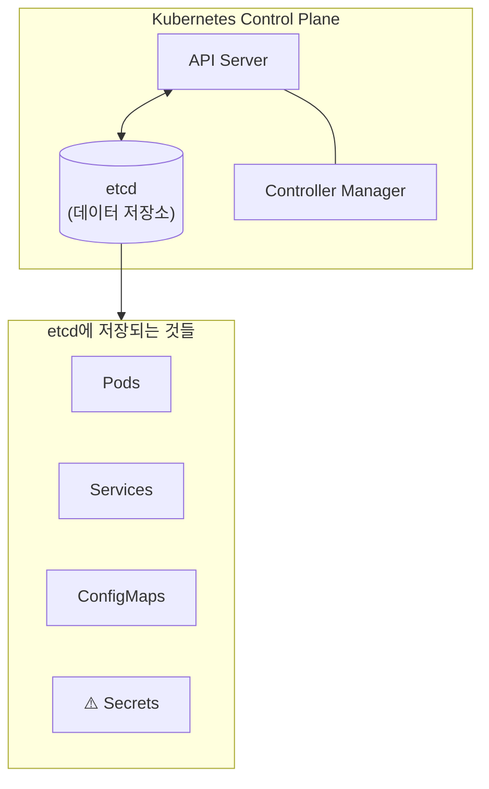
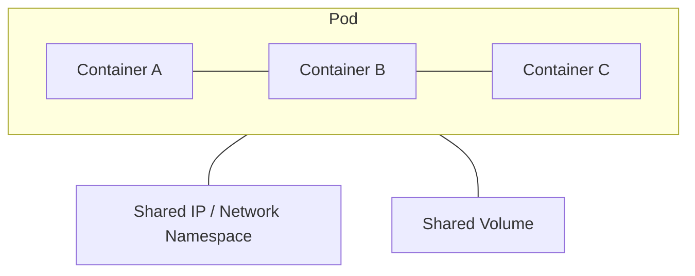

## 2주차 : 섹션 4,5,6 Logging, Application Lifecycle, Cluster Maintenance

# Why ? 


# What ? 


## logging & monitoring

### node metric 확인

cAdvisor 기반 각 환경 별로 모듈을 제공 중


```bash
minikube addons enable metrics-server
```
```bash
git clone https://github.com/kubernetes-incubator/metrics-server.git
kubectl create –f deploy/1.8+/
```

이후 아래와 같이 pod, node 에 대한 CPU/MEM 에 대해서 확인 가능

```bash
controlplane ~ ➜  kubectl top node
NAME CPU(cores) CPU% MEMORY(bytes) MEMORY%
kubemaster 166m 8% 1337Mi 70%
kubenode1 36m 1% 1046Mi 55%
kubenode2 39m 1% 1048Mi 55%
```
```bash
controlplane ~ ➜  kubectl top pod
NAME CPU(cores) CPU% MEMORY(bytes) MEMORY%
nginx 166m 8% 1337Mi 70%
redis 36m 1% 1046Mi 55%
```

### pod/container log 확인

log 는 아래와 같이 호출하여 볼 수 있음

- 파드 내 단일 컨테이너 : kubectl 파드명
- 파드 내 다수 컨테이너 : kubectl 파드명 원하는컨테이너명

```bash
$kubectl get pods
NAME READY STATUS RESTARTS AGE
webapp-1 1/1 Running 0 51s
webapp-2 2/2 Running 0 51s

# 파드 내 단일 컨테이너 로깅
$kubectl logs webapp-1
,,,,

# 파드 내 다수 컨테이너 로깅
# kubectl describe 를 통해 컨테이너명 조회
controlplane ~ ➜  kubectl describe pod webapp-2
Containers:
  simple-webapp:
	  ,,,
  db:
	  ,,,

controlplane ~ ➜  kubectl logs webapp-2 simple-webapp
[2025-12-27 12:53:50,894] INFO in event-simulator: USER3 is viewing page2
[2025-12-27 12:53:51,895] INFO in event-simulator: USER2 is viewing page3
[2025-12-27 12:53:52,896] INFO in event-simulator: USER1 is viewing page3
[2025-12-27 12:53:53,897] INFO in event-simulator: USER1 is viewing page1
[2025-12-27 12:53:54,899] INFO in event-simulator: USER4 logged in
[2025-12-27 12:53:55,900] WARNING in event-simulator: USER5 Failed to Login as the account is locked due to MANY FAILED ATTEMPTS.
```

## Rollout and Versioning

### deployment

Deployment는 Pod와 ReplicaSet에 대한 선언적 업데이트를 제공하는 상위 수준의 Kubernetes 오브젝트입니다.
**주요 기능:**

- Pod의 생성 및 삭제 관리
- 롤링 업데이트 및 롤백 지원
- 스케일링 (확장/축소)
- 일시 중지 및 재개

**Deployment → ReplicaSet → Pod 관계:**

```bash
┌─────────────────────────────────────────────────────────┐
│                      Deployment                         │
│  ┌───────────────────────────────────────────────────┐  │
│  │                   ReplicaSet                      │  │
│  │  ┌─────────┐  ┌─────────┐  ┌─────────┐           │  │
│  │  │   Pod   │  │   Pod   │  │   Pod   │           │  │
│  │  └─────────┘  └─────────┘  └─────────┘           │  │
│  └───────────────────────────────────────────────────┘  │
└─────────────────────────────────────────────────────────┘
```

### replicaset

ReplicaSet은 지정된 수의 Pod 복제본이 항상 실행되도록 보장합니다.
**주요 역할:**

- 원하는 수의 Pod 유지
- Pod 장애 시 자동 복구
- 수평적 스케일링 지원

> ⚠️ 참고: 일반적으로 ReplicaSet을 직접 생성하지 않고, Deployment를 통해 관리합니다.

### strategies

- Recreate
- RollingUpdate

### Rollout 명령어

> 📖 TL;DR;

- Deployment 생성 및 관리
- Rollout 상태 확인
- Rollout 히스토리 조회
- 이미지 업데이트
- 전략 변경
- Rollback (롤백)
- Rollout 일시 중지 및 재개

## Commands / Args

## Env variables

> 📖 방법이 기억이 안 난다면 강의에서 나온 것처럼 —help 를 통해 찾아보자
> 📖 Q:

### configmap 이란 ?

ConfigMap은 Kubernetes에서 **설정 데이터를 키-값 쌍으로 저장**하는 리소스입니다.

애플리케이션 코드와 설정을 분리하여 컨테이너 이미지를 재빌드하지 않고도 설정을 변경할 수 있습니다.

### configmap 명령어

- configmap 조회
- configmap 생성
- pod 에서 생성된 configmap 사용

## Secrets

### Secrets 이란 ?

Secret은 Kubernetes에서 **민감한 데이터를 저장**하기 위한 리소스입니다.

비밀번호, API 키, 인증서 등 보안이 필요한 정보를 저장합니다.

### **Secret vs ConfigMap**

| 구분 | ConfigMap | Secret |
| --- | --- | --- |
| **용도** | 일반 설정 데이터 | 민감한 데이터 |
| **예시** | DB 호스트, 포트, 설정 파일 | 비밀번호, API 키, 인증서 |
| **데이터 저장** | 평문 (Plain text) | Base64 인코딩 |
| **암호화** | ❌ 없음 | ⚠️ 기본은 없음 (etcd 암호화 가능) |
| **메모리 저장** | ❌ 디스크 | ✅ tmpfs (메모리) |
| **크기 제한** | 1MB | 1MB |

### Secrets 타입

| 타입 | 용도 |
| --- | --- |
| `Opaque` | 일반적인 키-값 데이터 (기본값) |
| `kubernetes.io/dockerconfigjson` | Docker 레지스트리 인증 |
| `kubernetes.io/tls` | TLS 인증서 |
| `kubernetes.io/service-account-token` | 서비스 계정 토큰 |

### Secrets & etcd 간의 관계

**etcd란?**
etcd는 Kubernetes의 **핵심 데이터 저장소**입니다.

클러스터의 모든 상태 정보(Pod, Service, ConfigMap, Secret 등)가 여기에 저장됩니다.



**Secret이 etcd에 저장되는 과정**


**⚠️ 문제점: 평문 저장**
**etcd 내부 데이터 확인 (실제 예시)**

```bash
# etcd에서 Secret 직접 조회
ETCDCTL_API=3 etcdctl get /registry/secrets/default/db-secret \
  --cacert=/etc/kubernetes/pki/etcd/ca.crt \
  --cert=/etc/kubernetes/pki/etcd/server.crt \
  --key=/etc/kubernetes/pki/etcd/server.key

```
```
# 출력 결과 (평문으로 노출됨!)
/registry/secrets/default/db-secret
k8s

v1Secret

db-secretdefault"*$e]8db6-4f5a-9c3b2
DB_PASSWORDp@ssw0rd        # ← 비밀번호가 그대로 보임!
DB_USERadmin               # ← 사용자명도 노출!
Opaque"

```

### etcd 에 저장되는 secrets 탈취에 대한 솔루션

1. etcd 암호화 (Encryption at Rest)
2.

RBAC으로 접근 제한
3.

외부 Secret 관리 도구

### Secrets 명령어

- 조회
- 생성
- Pod 에서 Secret 사용

## Multi Container Pods



각각의 개념과 구성도 mermaid, 예제 yaml 파일을 정리해줘

### co-located containers

메인 애플리케이션과 함께 **동시에 실행**되며 보조 기능을 수행하는 컨테이너입니다.

| 패턴 | 설명 | 예시 |
| --- | --- | --- |
| **Sidecar** | 메인 컨테이너 기능 확장 | 로그 수집, 프록시 |
| **Ambassador** | 외부 통신 대리 | DB 프록시, API 게이트웨이 |
| **Adapter** | 출력 표준화 | 로그 포맷 변환, 모니터링 어댑터 |

```yaml
apiVersion: v1
kind: Pod
metadata:
  name: web-app-pod
  labels:
    app: web-app
spec:
  containers:
  # ========================================
  # 1. Main Container - 웹 애플리케이션
  # ========================================
  - name: web-app
    image: nginx:1.25
    ports:
    - containerPort: 80
    volumeMounts:
    - name: shared-logs
      mountPath: /var/log/nginx
    - name: shared-data
      mountPath: /usr/share/nginx/html
    resources:
      requests:
        memory: "128Mi"
        cpu: "100m"
      limits:
        memory: "256Mi"
        cpu: "200m"

  # ========================================
  # 2. Sidecar Container - 로그 수집기
  # ========================================
  - name: log-collector
    image: fluent/fluent-bit:latest
    volumeMounts:
    - name: shared-logs
      mountPath: /var/log/nginx
      readOnly: true
    - name: fluent-config
      mountPath: /fluent-bit/etc
    resources:
      requests:
        memory: "64Mi"
        cpu: "50m"
      limits:
        memory: "128Mi"
        cpu: "100m"

  # ========================================
  # 3. Ambassador Container - 프록시
  # ========================================
  - name: proxy
    image: envoyproxy/envoy:v1.28-latest
    ports:
    - containerPort: 9901  # Envoy admin
    - containerPort: 10000 # Proxy port
    resources:
      requests:
        memory: "64Mi"
        cpu: "50m"
      limits:
        memory: "128Mi"
        cpu: "100m"

  # ========================================
  # Shared Volumes
  # ========================================
  volumes:
  - name: shared-logs
    emptyDir: {}
  - name: shared-data
    emptyDir: {}
  - name: fluent-config
    configMap:
      name: fluent-bit-config

```

### regular init containers

메인 컨테이너 **실행 전에 순차적으로 실행**되는 컨테이너입니다.

초기화 작업을 수행하고 완료되면 종료됩니다.

| 특징 | 설명 |
| --- | --- |
| **순차 실행** | 정의된 순서대로 하나씩 실행 |
| **완료 필수** | 이전 Init Container가 성공해야 다음 실행 |
| **일회성** | 작업 완료 후 종료 |
| **용도** | DB 대기, 설정 파일 생성, 의존성 체크 |

```yaml
apiVersion: v1
kind: Pod
metadata:
  name: webapp-with-init
  labels:
    app: webapp
spec:
  # ========================================
  # Init Containers (순차 실행)
  # ========================================
  initContainers:
  # 1단계: DB 서비스가 준비될 때까지 대기
  - name: wait-for-db
    image: busybox:1.36
    command: ['sh', '-c']
    args:
      - |
        echo "Waiting for database..."
        until nc -z db-service 3306; do
          echo "DB not ready, sleeping..."
          sleep 2
        done
        echo "DB is ready!"

  # 2단계: 설정 파일 다운로드
  - name: download-config
    image: busybox:1.36
    command: ['sh', '-c']
    args:
      - |
        echo "Downloading config..."
        wget -O /config/app.conf http://config-server/app.conf
        echo "Config downloaded!"
    volumeMounts:
    - name: config-volume
      mountPath: /config

  # 3단계: 데이터 디렉토리 권한 설정
  - name: init-permissions
    image: busybox:1.36
    command: ['sh', '-c']
    args:
      - |
        echo "Setting permissions..."
        chmod -R 755 /data
        chown -R 1000:1000 /data
        echo "Permissions set!"
    volumeMounts:
    - name: data-volume
      mountPath: /data

  # ========================================
  # Main Container (Init 완료 후 실행)
  # ========================================
  containers:
  - name: webapp
    image: myapp:1.0
    ports:
    - containerPort: 8080
    env:
    - name: DB_HOST
      value: "db-service"
    - name: DB_PORT
      value: "3306"
    volumeMounts:
    - name: config-volume
      mountPath: /app/config
      readOnly: true
    - name: data-volume
      mountPath: /app/data
    resources:
      requests:
        memory: "256Mi"
        cpu: "200m"
      limits:
        memory: "512Mi"
        cpu: "500m"
    # 앱이 준비되었는지 확인
    readinessProbe:
      httpGet:
        path: /health
        port: 8080
      initialDelaySeconds: 5
      periodSeconds: 10

  # ========================================
  # Volumes
  # ========================================
  volumes:
  - name: config-volume
    emptyDir: {}
  - name: data-volume
    emptyDir: {}

```

### sidecar containers

Kubernetes 1.28부터 도입된 **네이티브 사이드카**입니다.

Init Container에 `restartPolicy: Always`를 설정하여 메인 컨테이너와 함께 **지속적으로 실행**됩니다.

### 기존 방식 vs 네이티브 사이드카

| 구분 | 기존 Co-located | Native Sidecar (1.28+) |
| --- | --- | --- |
| **정의 위치** | `spec.containers` | `spec.initContainers` |
| **시작 순서** | 메인과 동시 | 메인보다 먼저 |
| **종료 순서** | 메인과 동시 | 메인보다 나중 |
| **재시작** | Pod 정책 따름 | `restartPolicy: Always` |
| **Job 호환** | ❌ Job 완료 방해 | ✅ Job과 호환 |

```yaml
# Istio 스타일 Service Mesh Sidecar 예제
apiVersion: v1
kind: Pod
metadata:
  name: app-with-mesh
  labels:
    app: myapp
spec:
  initContainers:
  # Sidecar: Istio Proxy (Envoy)
  - name: istio-proxy
    image: docker.io/istio/proxyv2:1.20.0
    restartPolicy: Always
    ports:
    - containerPort: 15090
      name: http-envoy-prom
    env:
    - name: POD_NAME
      valueFrom:
        fieldRef:
          fieldPath: metadata.name
    - name: POD_NAMESPACE
      valueFrom:
        fieldRef:
          fieldPath: metadata.namespace
    resources:
      requests:
        cpu: "10m"
        memory: "40Mi"
      limits:
        cpu: "200m"
        memory: "256Mi"

  # Main Container
  containers:
  - name: myapp
    image: myapp:1.0
    ports:
    - containerPort: 8080
```

## Init Container

???

## Kubectx and Kubens - Command Line Utilities

## 오브젝트 생성 oneline command

[https://hushtang.tistory.com/94](https://hushtang.tistory.com/94)

> 💡 k run vs k create

```shell
kubectl run mc-pod --image=nginx:1-alpine --dry-run=client -o yaml > mc-pod.yaml
```
```shell
kubectl create deploy my-ds --image=nginx --dry-run=client -o yaml > my-ds.yaml
```
```shell
# service 는 서비스 타입과 tcp port 를 꼭 지정해줘야 한다
# 다만 서비스타입은 소문자로 해줘야한다
# ClusterIp(X) clusterip(O)
kubectl create service clusterip messaging-service --tcp=80:80 --dry-run=client -o yaml > messaging-service.yaml
```

## env 주입 방법

> 💡 TL;DR;
> 💡 ConfigMap vs Secret
> 💡 환경변수 주입 대신 볼륨 마운트 방식을 권장하는 이유

직접 정의 [https://kubernetes.io/docs/tasks/inject-data-application/define-environment-variable-container/](https://kubernetes.io/docs/tasks/inject-data-application/define-environment-variable-container/)

```go
apiVersion: v1
kind: Pod
metadata:
  name: envar-demo
  labels:
    purpose: demonstrate-envars
spec:
  containers:
  - name: envar-demo-container
    image: gcr.io/google-samples/hello-app:2.0
**    env:
    - name: DEMO_GREETING
      value: "Hello from the environment"
    - name: DEMO_FAREWELL
      value: "Such a sweet sorrow"**
```

ConfigMap 사용 [https://kubernetes.io/docs/tasks/configure-pod-container/configure-pod-configmap/#define-container-environment-variables-using-configmap-data](https://kubernetes.io/docs/tasks/configure-pod-container/configure-pod-configmap/#define-container-environment-variables-using-configmap-data)

```go
# ConfigMap 생성
apiVersion: v1
kind: ConfigMap
metadata:
  name: app-config
data:
  DB_HOST: "mysql.example.com"
  API_KEY: "static-key"

---
# Pod에서 참조
spec:
  containers:
  - name: app
    image: myapp
**    envFrom:
    - configMapRef:
        name: app-config  # 모든 키 주입**

```

Secret 사용 [https://kubernetes.io/docs/tasks/inject-data-application/distribute-credentials-secure/#define-a-container-environment-variable-with-data-from-a-single-secret](https://kubernetes.io/docs/tasks/inject-data-application/distribute-credentials-secure/#define-a-container-environment-variable-with-data-from-a-single-secret)

1.

환경변수 주입
2.

볼륨 마운트
3.

명령행 인자

Downward API 사용 :: fieldRef 사용
[https://kubernetes.io/docs/concepts/workloads/pods/downward-api/#downwardapi-fieldRef](https://kubernetes.io/docs/concepts/workloads/pods/downward-api/#downwardapi-fieldRef)
[https://kubernetes.io/docs/tasks/inject-data-application/environment-variable-expose-pod-information/](https://kubernetes.io/docs/tasks/inject-data-application/environment-variable-expose-pod-information/)
[https://kubernetes.io/docs/tasks/inject-data-application/downward-api-volume-expose-pod-information/](https://kubernetes.io/docs/tasks/inject-data-application/downward-api-volume-expose-pod-information/)

```go
spec:
  containers:
  - name: app
    env:
    - name: MY_POD_NAME
      valueFrom:
        fieldRef:
          fieldPath: metadata.name
    - name: MY_POD_IP
      valueFrom:
        fieldRef:
          fieldPath: status.podIP
    - name: MY_NAMESPACE
      valueFrom:
        fieldRef:
          fieldPath: metadata.namespace

```

Downward API 사용 :: resourceFieldRef 사용
[https://kubernetes.io/docs/concepts/workloads/pods/downward-api/#downwardapi-resourceFieldRef](https://kubernetes.io/docs/concepts/workloads/pods/downward-api/#downwardapi-resourceFieldRef)
[https://kubernetes.io/docs/tasks/inject-data-application/environment-variable-expose-pod-information/](https://kubernetes.io/docs/tasks/inject-data-application/environment-variable-expose-pod-information/)
[https://kubernetes.io/docs/tasks/inject-data-application/downward-api-volume-expose-pod-information/](https://kubernetes.io/docs/tasks/inject-data-application/downward-api-volume-expose-pod-information/)

```go
spec:
  containers:
  - name: app
    resources:
      requests:
        cpu: "100m"
        memory: "128Mi"
    env:
    - name: MY_CPU_REQUEST
      valueFrom:
        resourceFieldRef:
          resource: requests.cpu
    - name: MY_MEM_LIMIT
      valueFrom:
        resourceFieldRef:
          resource: limits.memory
          divisor: 1Mi

```

> 💡 Downward API 란 무엇이고 fieldRef 와 resourceFieldRef 는 무슨 차이인가 ?

Init Container 사용

```go
spec:
	# initContainers 를 우선 실행하여
	# /env 경로에 환경변수를 저장한다.
  initContainers:
  - name: env-init
    image: busybox
    command: ['sh', '-c']
    args:
    - |
			echo "DB_URL=jdbc:mysql://localhost:3306" > /env/my-env-file
      echo "API_KEY=12345" >> /env/my-env-file
    volumeMounts:
    - name: env-volume
      mountPath: /env
  # 이후 깨어나는 실제 앱 컨테이너는 
	# 환경변수가 쓰여진 /env/my-env-file 을 불러와
	# 환경변수 주입 이후 앱을 실행한다.
  containers:
  - name: app
	  image: my-app-image
	  command: ["sh", "-c"]
    args: 
    - |
      . /env/my-env-file && ./run-my-app
    volumeMounts:
    - name: env-volume
      mountPath: /env
  volumes:
  - name: env-volume
    emptyDir: {}

```

## Deployment/Pod 에 볼륨 할당방법 ?

# 9번 문제 ✅📓

Create a Horizontal Pod Autoscaler (HPA) with name `webapp-hpa` for the deployment named `kkapp-deploy` in the **default namespace** with the `webapp-hpa.yaml` file located under the root folder.

Ensure that the HPA scales the deployment based on **CPU utilization**, maintaining an average CPU usage of **50%** across all pods.

Configure the HPA to **cautiously scale down** pods by setting a **stabilization window of 300 seconds** to prevent rapid fluctuations in pod count.
**`Note:`** The kkapp-deploy deployment is created for backend; you can check in the terminal.

<details>
<summary>정답</summary>

```go
apiVersion: autoscaling/v2
kind: HorizontalPodAutoscaler
metadata:
  name: webapp-hpa
  namespace: default
spec:
  scaleTargetRef:
    apiVersion: apps/v1
    kind: Deployment
    name: kkapp-deploy
  minReplicas: 1
  maxReplicas: 10
  metrics:
  - type: Resource
    resource:
      name: cpu
      target:
        type: Utilization
        averageUtilization: 50
	behavior:
	  scaleDown:
	    stabilizationWindowSeconds: 300
```
```go
# HPA 상태 조회
kubectl get hpa webapp-hpa

# 상세 설정 및 스케일링 이벤트 확인
kubectl describe hpa webapp-hpa
```
</details>

## Deployment

### Deployment 란 ??

- 파드(Pod)와 레플리카셋(ReplicaSet)의 **선언적 업데이트**를 관리하는 상위 객체
- "파드 3개를 유지해줘"라는 명령뿐만 아니라, "v1에서 v2로 업데이트할 때 하나씩 교체해줘" 라는 **배포 전략을 처리**

### ReplicaSet 과 Deployment 의 관계 ??

- 우리는 ReplicaSet을 직접 건드리지 않는다. 
- 모든 제어는 Deployment를 통해 이루어지며, ReplicaSet은 **롤백(Rollback)을 위한 기록 저장소** 역할을 수행한다

### 히스토리 기록은 어디에 저장되는가 ??

클러스터 내부의 **ReplicaSet**에 저장된다
사용되지 않는 과거의 ReplicaSet들이 사라지지 않고 남아서 각 버전의 `template` 정보를 가지고 있기 때문에 롤백이 가능한 것이다.
`kubectl apply -f deploy.yaml --record` 처럼 실행하면, 실행한 명령어가 `CHANGE-CAUSE`에 기록된다.

다만 Kubernetes v1.19 이후부터는 이 플래그가 *deprecated*(권장되지 않음) 되었다.

이에 따라 1) kubectl patch 혹은 kubectl annotate 로 바로 기록하거나 2) yaml 파일에 미리 적어두는 방식으로 변경되었다

1.

명령어 바로 기록
2.

YAML 파일에 미리 적어두기

### 롤아웃

보통 실제로는 배포하고나서 배포 상태 확인 이후 복구하는 워크플로우를 따른다
실제로 다음과 같은 명령어를 활용한다

- **배포**: `kubectl apply -f deploy.yaml`
- **모니터링**: `kubectl rollout status deployment/my-app` (실시간 배포 상황 감시)
- **문제 발생 시 확인**: `kubectl rollout history deployment/my-app`
- **Pod 업데이트를 위한 재시작**: `kubectl rollout restart deployment/my-app`
- **상세 검증**: `kubectl rollout history deployment/my-app --revision=prev_version`
- **복구**: `kubectl rollout undo deployment/my-app --to-revision=prev_version`

또한 무한정 ReplicaSet 이 남는 것을 방지하기위해 ReplicaSet 최대 개수를 제어하여 히스토리 개수를 관리할 수 있다.

```yaml
spec:
  revisionHistoryLimit: 5  # 최근 5개의 기록(ReplicaSet)만 남기고 나머지는 삭제
  replicas: 3
  ...

```

### 복제본 수에 대한 설정값

- **maxSurge **[****surge:a sudden and great increase**](https://dictionary.cambridge.org/dictionary/english/surge)
- **maxUnavailable**

기본값은 두 값 둘 다 25%

### 문제 1 : 새로운 버전 배포 및 리비전 되돌리기

**시나리오:** 현재 `web-ns` 네임스페이스에 `replicas: 5`인 `web-deploy`가 실행 중입니다.

이 애플리케이션의 새로운 버전(v2)을 배포하려고 하는데, 다음의 엄격한 가용성 조건을 충족해야 합니다.
1. **가용성 보장:** 업데이트 중에도 최소 5개의 파드는 항상 트래픽을 처리할 수 있는 상태(Ready)여야 합니다.

즉, 가용성이 단 1%도 떨어져서는 안 됩니다.
2. **리소스 제약:** 인프라 자원의 한계로 인해, 업데이트 중에 **동시에 실행되는 총 파드 수는 7개를 초과해서는 안 됩니다.**
3. **검증:** 배포 후 문제가 생겨 **리비전 1번**으로 되돌려야 합니다.
**질문:**

- 이 요구사항을 충족하기 위한 `maxSurge`와 `maxUnavailable`의 값은 각각 무엇입니까? (정수 혹은 퍼센트로 답하세요)
- 리비전 1번으로 되돌리기 위한 정확한 명령어는 무엇입니까?

```yaml
alias k="kubectl"
type k

k get deploy web-deploy -n web-ns -o yaml > web-deploy.yaml
vim web-deploy.yaml
이후 아래와 같이 값을 수정
maxSurge: 2
**maxUnavailable: 0
**k apply -f web-deploy.yaml # 적용**

# 확인
k describe deploy web-deploy -n web-ns
k get replicaset <replicaset-이름>
k get pod <pod-이름>
k describe pod <pod-이름> | grep Image
k exec <pod-이름> -n web-ns -- curl ifconfig.me

# 문제 발생 시 히스토리 확인 후 rollback
k rollout history deployment/web-deploy
# 문제 발생했다면 undo 이후 revision 1 으로 롤백
k rollout undo deployment/web-deploy --to-revision=1**
```

### 문제 2 : 롤링 업데이트

Create a deployment as follows:

- TASK:
- Next, deploy the application with new version 1.11.13-alpine, by performing a rolling update
- Finally, rollback that update to the previous version 1.11.10-alpine

```bash
kubectl create deployment nginx-app \
	 --image=nginx:1.11.10-alpine --replicas=3 \
	 --dry-run=client -o yaml > deplyment.yaml

kubectl apply -f deplyment.yaml

# rolling update
kubectl set image deployment nginx-app nginx=nginx:1.11.13-alpine --record
kubectl rollout history deployment nginx-app

# roll-back
kubectl rollout undo deployment nginx-app
kubectl rollout history deployment nginx-app
```

## ConfigMap & Secrets

### ConfigMap 이란 ?

어플리케이션에 필요한 설정 값(환경 변수, 설정 파일 등)을 파드와 분리하여 저장하는 객체

- **용도**: 데이터베이스 주소, 환경 설정(로그 레벨), 설정 파일(`nginx.conf`) 등.
- **특징**: 민감하지 않은 일반 텍스트 데이터를 저장합니다.

### Pod 에 ConfigMap 할당 방법

1.

우선 ConfigMap 을 생성한다
2.

이후 Pod 에 매핑하여 주입한다
3. **( 볼륨으로 마운트된 경우라면 내용수정 시 Pod 에 자동으로 업데이트된다**

### Secrets 이란 ?

비밀번호, 토큰, SSH 키와 같은 **민감한 정보**를 저장하는 객체입니다.

- **특징**: 데이터가 **Base64**로 인코딩되어 저장됩니다. (암호화가 아니므로 누구나 디코딩 가능함에 주의!)
- **유형**: `Opaque`(일반), `kubernetes.io/dockerconfigjson`(도커 로그인 정보) 등.

### Pod 에 Secrets 할당 방법

1.

Secret 을 생성한다
2.

이후 Pod 에 매핑하여 주입한다
3. **( 볼륨으로 마운트된 경우라면 내용수정 시 Pod 에 자동으로 업데이트된다**

### 문제 1 : ConfigMap 연결

Create a ConfigMap named `app-config` in the namespace `cm-namespace` with the following key-value pairs:

```
ENV=production
LOG_LEVEL=info
```

Then, modify the existing Deployment named `cm-webapp` in the same namespace to use the `app-config` ConfigMap by setting the environment variables `ENV` and `LOG_LEVEL` in the container from the ConfigMap.

- ConfigMap app-config is created
- Deployment uses the app-config ConfigMap for variable ENV and LOG LEVEL
- Are the environment variables reflected in the deployment?
- ConfigMap has proper ENV value
- ConfigMap has proper LOG_LEVEL value

```bash
# configmap 생성 / deployment 수정
# vim app-config.yaml

# 아래와 같이 명령어로도 생성 가능
# kubectl create configmap app-config -n cm-namespace \
#  --from-literal=ENV=production \
#  --from-literal=LOG_LEVEL=info

apiVersion: v1
kind: ConfigMap
metadata:
  name: app-config
	namespace: cm-namespace
data:
  ENV: production
	LOG_LEVEL: info
---
apiVersion: apps/v1
kind: Deployment
metadata:
  name: cm-webapp
  namespace: cm-namespace
spec:
  replicas: 3
  selector:
    matchLabels:
      app: nginx
  template:
    metadata:
      labels:
        app: nginx
    spec:
      containers:
      - name: nginx
        image: nginx:1.14.2
        ports:
        - containerPort: 80
        envFrom:
        - configMapRef:
            name: app-config


kubectl apply -f app-config.yaml
# 실행 중인 deployment 의 manifest 파일 수정방법 
# 1) 바로 설정 열어서 수정, 저장하면 바로 rolling policy 에 의해 반영
kubectl edit deployment cm-webapp -n cm-namespace
# 2) manifest yaml 추출 후 수정 및 적용
kubectl get deployment cm-webapp -n cm-namespace -o yaml > cm-webapp.yaml
vim cm-webapp.yaml
kubectl apply -f cm-webapp.yaml

# 이후 확인
kubectl describe cm app-config -n cm-namespace
kubectl describe deploy cm-webapp -n cm-namespace
kubectl get pods -n cm-namespace -l app=cm-webapp -o name # deploy 의 pod 이름
# 위에서 가져온 POD 에 접근하여 환경변수 확인
kubectl exec -n cm-namespace $POD_NAME -- sh -c 'echo $ENV'
kubectl exec -n cm-namespace $POD_NAME -- sh -c 'echo $LOG_LEVEL'
```

### 문제 2 : ConfigMap 을 통해 TLS 활성화

There is an existing deployment called nginx-static in the nginx-static namespace.

The deployment contains a ConfigMap named nginx-config that supports TLSv1.3
Update the nginx-config ConfigMap to allow TLSv1.2 connections.

Re-create, restart, or scale resources as necessary.

By Using command to test the changes:
[candidate@cka0001]$ curl -k --tls-max 1.2 [https://web.k8s.local:30007](https://web.k8s.local:30007/)

```bash
# configmap 수정
kubectl get configmap nginx-config -n nginx-static -o yaml > nginx-config.yaml

vi nginx-config.yaml

ssl_protocols TLSv1.3; → ssl_protocols TLSv1.2 TLSv1.3; 로 변경

# 적용 이후 리소스 재시작
kubectl apply -f nginx-config.yaml

kubectl rollout restart deployment nginx-static -n nginx-static

# 롤아웃 확인 후 최종 curl 확인
kubectl rollout status deployment nginx-static -n nginx-static

curl -k --tls-max 1.2 [https://web.k8s.local:30007](https://web.k8s.local:30007/)

```

## Sidecar & Logging

### Sidecar 란 ??

기본 컨테이너(Main App)의 기능을 확장하거나 보조하기 위해 **같은 Pod 안에 함께 실행되는 보조 컨테이너이다**
주로 로그 수집, 프록시, 설정 동기화 등등을 위한 목적으로 배포된다.

### 생명주기(feat. initContainer)

일반 컨테이너로 사이드카를 띄우면, 메인 앱이 종료되어도 사이드카가 안 죽어서 Pod가 `Running`에 머무는 문제가 있다
쿠버네티스 1.29 버전부터 `initContainers` 설정 안에 `restartPolicy: Always`를 추가하면 
사이드카로 인식하고, 시작 시 메인 앱 컨테이너가 뜨기 **전**에 실행되어 완료를 기다리지 않으며, 메인 앱이 종료되면 같이 종료된다.

### Pod 와 공유하는 자원

Pod 내의 모든 컨테이너는 격리되어 있지만, 일부 자원은 공유하고 스케줄링 시 합산된다.

- **Network:** 같은 `Network Namespace`를 공유한다.

따라서 서로 `localhost`로 통신하며 포트가 중복되면 안 된다.
- **Storage:** `Volume`을 공유하여 메인 앱이 쓴 로그 파일을 사이드카가 읽는 식의 작업이 가능하다.
- **Cgroup & Resource:** 스케줄러는 Pod 내부 모든 컨테이너의 `Request/Limit` 합계를 계산하여 노드를 결정한다.

### 적용 & 확인

```yaml
apiVersion: v1
kind: Pod
metadata:
  name: sidecar-example
spec:
  initContainers:
  - name: log-sidecar
    image: busybox
    restartPolicy: Always # 이 설정이 Sidecar를 만듭니다!
    command: ["sh", "-c", "tail -f /var/log/app.log"]
    volumeMounts:
    - name: shared-logs
      mountPath: /var/log
  containers:
  - name: main-app
    image: nginx
    volumeMounts:
    - name: shared-logs
      mountPath: /var/log
  volumes:
  - name: shared-logs
    emptyDir: {}
```
```bash
kubectl get pod ${pod-이름}

kubectl get logs ${pod-이름} -c ${사이드카-이름}
```

### 문제 1 : 사이드카 생성

A legacy app needs to be integrated into the Kubernetes built-in logging
architecture (i.e. kubectl logs).

Adding a streaming co-located container is a
good and common way to accomplish this requirement.

Update the existing Deployment synergy-deployment, adding a co-located
container named sidecar using the image busybox:stable to the existing
Pod.

The new co-located container has to run the following command:
/bin/sh -c "tail -n+1 -f /var/log/synergy-deployment.log"
Use a Volume mounted at /var/log to make the log file synergydeployment.log available to the co-located container.

Do not modify the specification of the existing container other than adding
the required.

Hint: Use a shared volume to expose the log file between the main
application container and the sidecar

```bash
kubectl get deploy synergy-deployment -o yaml > synergy-deployment.yaml

vi synergy-deployment.yaml

apiVersion: apps/v1
kind: Deployment
metadata:
  name: synergy-deployment
  labels:
    app: synergy-deployment
spec:
  replicas: 1
  selector:
    matchLabels:
      app: synergy-deployment
  template:
    metadata:
      labels:
        app: synergy-deployment
    spec:
      containers:
      - name: &lt;기존 컨테이너 - 수정하지 말 것&gt;
        ...
        volumeMounts:
        - name: log-volume
          mountPath: /var/log          # 기존 앱이 로그 쓰는 경로
      initContainers:
      - name: sidecar                  # ← 일반 containers에 추가
        image: busybox:stable
        restartPolicy: Always
        command:
        - /bin/sh
        - -c
        - "tail -n+1 -f /var/log/synergy-deployment.log"
        volumeMounts:
        - name: log-volume
          mountPath: /var/log
      volumes:
      - name: log-volume
        emptyDir: {}

kubectl apply -f synergy-deployment.yaml
kubectl rollout status deployment synergy-deployment

kubectl logs <sidecar-pod명> -c sidecar
```
