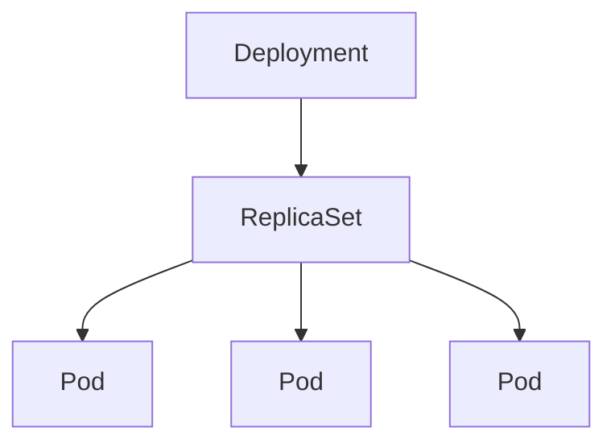
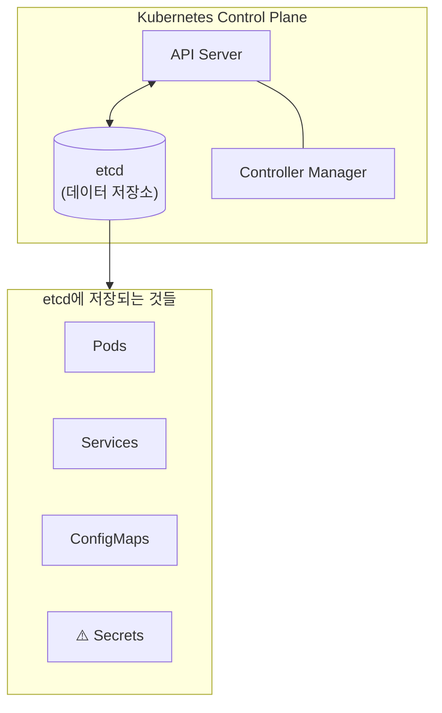
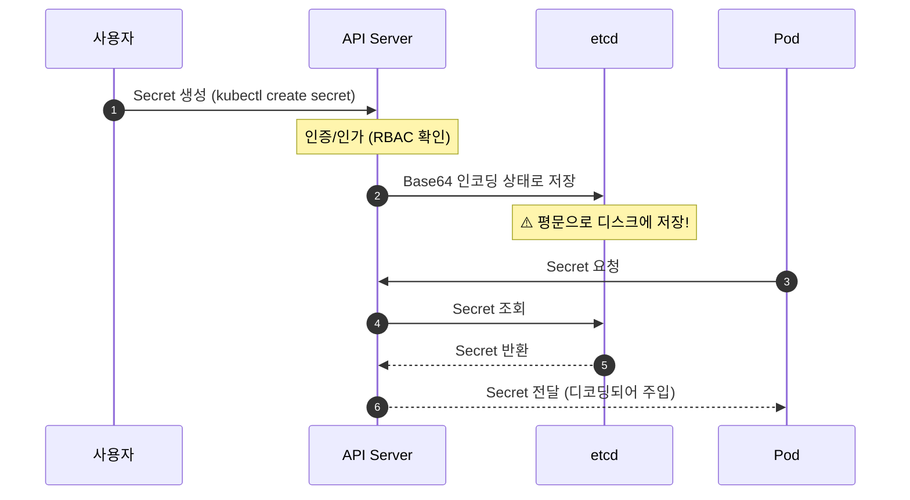
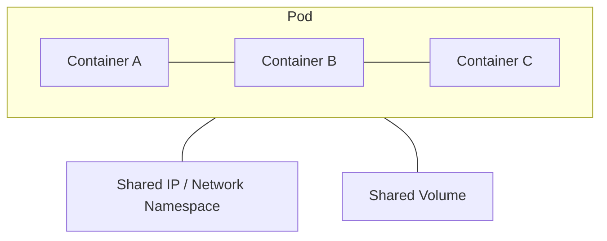

# Why?

컨테이너를 하나 띄우는 것은 어렵지 않다.
문제는 그 컨테이너를 **안정적으로 운영**하는 것이다.

처음 Kubernetes를 배울 때는 `kubectl run` 으로 파드를 하나 띄우고 "됐다"고 생각했다.
그런데 실제 서비스에서는 "파드가 죽으면 누가 다시 살리는가", "새 버전을 배포할 때 기존 트래픽은 어떻게 처리하는가", "비밀번호 같은 설정값은 이미지에 박아 넣어야 하는가"라는 질문이 곧바로 따라온다.

Kubernetes는 이 세 가지 물음에 각각 **Deployment**, **ConfigMap**, **Secret**이라는 이름으로 답한다.[^1]
이름 자체가 설계 의도를 담고 있다.
Deployment는 "어떻게 배포할 것인가"를 선언하고, ConfigMap은 "설정을 코드에서 분리"하며, Secret은 "민감 정보를 별도 저장소에서 관리"한다.

그런데 실제로 사용하다 보면 몇 가지 함정이 있다.
Secret이 Base64로 인코딩되어 있다고 해서 암호화된 것이 아니라는 점, etcd에 평문으로 저장된다는 점, 볼륨 마운트와 환경변수 주입의 동작 차이 등이다.

이 글은 CKA 2주차 실습을 기반으로, Deployment 롤아웃 전략부터 ConfigMap·Secret 주입 방법, 그리고 멀티컨테이너 패턴(Sidecar, Init, Ambassador)까지 순서대로 정리한다.

## 📊 Logging & Monitoring

Kubernetes에서 클러스터 상태를 파악하려면 먼저 메트릭 수집 체계를 이해해야 한다.
각 노드에서 실행되는 **cAdvisor**가 컨테이너 자원 사용량을 수집하며, Metrics Server가 이를 API로 노출한다.[^2]

### node metric 확인

minikube 환경이라면 아래 명령으로 Metrics Server를 활성화한다.

```bash
minikube addons enable metrics-server
```

직접 배포하는 경우 공식 저장소의 매니페스트를 사용한다.

```bash
git clone https://github.com/kubernetes-incubator/metrics-server.git
kubectl create -f deploy/1.8+/
```

설치 후 아래와 같이 노드와 파드의 CPU·메모리를 확인할 수 있다.

```bash
# 노드별 자원 사용량 확인
controlplane ~ ➜  kubectl top node
NAME         CPU(cores)   CPU%   MEMORY(bytes)   MEMORY%
kubemaster   166m         8%     1337Mi          70%
kubenode1    36m          1%     1046Mi          55%
kubenode2    39m          1%     1048Mi          55%
```

```bash
# 파드별 자원 사용량 확인
controlplane ~ ➜  kubectl top pod
NAME    CPU(cores)   CPU%   MEMORY(bytes)   MEMORY%
nginx   166m         8%     1337Mi          70%
redis   36m          1%     1046Mi          55%
```

### pod/container log 확인

로그는 파드 내 컨테이너 수에 따라 호출 방식이 달라진다.

- 파드 내 단일 컨테이너: `kubectl logs <파드명>`
- 파드 내 다수 컨테이너: `kubectl logs <파드명> <컨테이너명>`

```bash
# 현재 실행 중인 파드 목록 조회
$kubectl get pods
NAME       READY   STATUS    RESTARTS   AGE
webapp-1   1/1     Running   0          51s
webapp-2   2/2     Running   0          51s

# 단일 컨테이너 파드 로그
$kubectl logs webapp-1
...

# 다수 컨테이너 파드: 먼저 컨테이너명 확인
controlplane ~ ➜  kubectl describe pod webapp-2
Containers:
  simple-webapp:
    ...
  db:
    ...

# 특정 컨테이너 로그 조회
controlplane ~ ➜  kubectl logs webapp-2 simple-webapp
[2025-12-27 12:53:50,894] INFO in event-simulator: USER3 is viewing page2
[2025-12-27 12:53:55,900] WARNING in event-simulator: USER5 Failed to Login as the account is locked due to MANY FAILED ATTEMPTS.
```

로그와 메트릭으로 현재 상태를 파악할 수 있게 되었다면, 다음 단계는 파드를 안정적으로 배포하고 교체하는 전략을 이해하는 것이다.

## 🔄 Rollout and Versioning

Kubernetes에서 파드를 직접 교체하면 서비스 중단이 발생한다.
이를 막기 위해 **Deployment**가 롤링 업데이트와 롤백 전략을 담당한다.

### Deployment란?

Deployment는 Pod와 ReplicaSet에 대한 선언적 업데이트를 제공하는 상위 수준의 Kubernetes 오브젝트다.[^3]

주요 기능은 다음과 같다.

- Pod의 생성 및 삭제 관리
- 롤링 업데이트 및 롤백 지원
- 스케일링 (확장/축소)
- 일시 중지 및 재개

Deployment, ReplicaSet, Pod의 포함 관계는 아래와 같다.



### ReplicaSet

ReplicaSet은 지정된 수의 Pod 복제본이 항상 실행되도록 보장한다.

주요 역할은 다음과 같다.

- 원하는 수의 Pod 유지
- Pod 장애 시 자동 복구
- 수평적 스케일링 지원

> 일반적으로 ReplicaSet을 직접 생성하지 않고 Deployment를 통해 관리한다.
> 우리는 ReplicaSet을 직접 건드리지 않는다.
> 모든 제어는 Deployment를 통해 이루어지며, ReplicaSet은 **롤백(Rollback)을 위한 기록 저장소** 역할을 수행한다.

### 배포 전략

Kubernetes Deployment가 지원하는 업데이트 전략은 두 가지다.

- **Recreate**: 기존 파드를 모두 종료한 후 새 파드를 생성한다. 서비스 중단이 발생하지만 구현이 단순하다.
- **RollingUpdate**: 기존 파드를 하나씩 교체한다. 기본값이며 무중단 배포를 가능하게 한다.

### 히스토리 기록은 어디에 저장되는가?

클러스터 내부의 **ReplicaSet**에 저장된다.
사용되지 않는 과거의 ReplicaSet들이 사라지지 않고 남아서 각 버전의 `template` 정보를 가지고 있기 때문에 롤백이 가능한 것이다.

`kubectl apply -f deploy.yaml --record` 처럼 실행하면 실행한 명령어가 `CHANGE-CAUSE`에 기록된다.
다만 Kubernetes v1.19 이후부터는 이 플래그가 _deprecated_(권장되지 않음) 되었다.
이에 따라 `kubectl annotate` 로 직접 기록하거나, YAML 파일에 미리 적어두는 방식으로 변경되었다.

무한정 ReplicaSet이 남는 것을 방지하기 위해 `revisionHistoryLimit`으로 히스토리 개수를 제어할 수 있다.

```yaml
spec:
  revisionHistoryLimit: 5  # 최근 5개의 기록(ReplicaSet)만 남기고 나머지는 삭제
  replicas: 3
```

### 롤아웃 명령어

실제 운영에서는 배포 후 상태를 확인하고 문제 발생 시 복구하는 워크플로우를 따른다.

```bash
# 배포
kubectl apply -f deploy.yaml

# 실시간 배포 상황 감시
kubectl rollout status deployment/my-app

# 롤아웃 히스토리 조회
kubectl rollout history deployment/my-app

# 특정 리비전 상세 확인
kubectl rollout history deployment/my-app --revision=2

# Pod 업데이트를 위한 재시작
kubectl rollout restart deployment/my-app

# 이전 버전으로 복구
kubectl rollout undo deployment/my-app --to-revision=1
```

### 복제본 수에 대한 설정값

롤링 업데이트 중 파드 수를 제어하는 두 파라미터가 있다.[^4]

- **maxSurge** ([surge: a sudden and great increase](https://dictionary.cambridge.org/dictionary/english/surge)): 원하는 파드 수 대비 초과 생성 가능한 파드 수
- **maxUnavailable**: 업데이트 중 동시에 사용 불가능해질 수 있는 최대 파드 수

기본값은 두 값 모두 **25%** 다.

### 문제 1: 새로운 버전 배포 및 리비전 되돌리기

**시나리오:** 현재 `web-ns` 네임스페이스에 `replicas: 5`인 `web-deploy`가 실행 중이다.

요구 조건은 다음과 같다.

1. **가용성 보장:** 업데이트 중에도 최소 5개의 파드는 항상 트래픽을 처리할 수 있는 상태(Ready)여야 한다.
2. **리소스 제약:** 업데이트 중 동시에 실행되는 총 파드 수는 7개를 초과해서는 안 된다.
3. **검증:** 배포 후 문제가 생겨 **리비전 1번**으로 되돌려야 한다.

`maxSurge: 2`, `maxUnavailable: 0` 으로 설정하면 최대 7개를 초과하지 않으면서 가용 파드 5개를 항상 유지할 수 있다.

```yaml
# web-deploy.yaml 에서 strategy 섹션을 아래와 같이 수정한다
strategy:
  type: RollingUpdate
  rollingUpdate:
    maxSurge: 2
    maxUnavailable: 0
```

```bash
# 수정된 매니페스트 추출 및 편집
k get deploy web-deploy -n web-ns -o yaml > web-deploy.yaml
vim web-deploy.yaml

# 적용
k apply -f web-deploy.yaml

# 배포 확인
k describe deploy web-deploy -n web-ns
k describe pod <pod-이름> | grep Image

# 히스토리 확인 후 롤백
k rollout history deployment/web-deploy
k rollout undo deployment/web-deploy --to-revision=1
```

### 문제 2: 롤링 업데이트

Create a deployment as follows:

- Next, deploy the application with new version `1.11.13-alpine` by performing a rolling update.
- Finally, rollback that update to the previous version `1.11.10-alpine`.

```bash
# Deployment 생성 (dry-run으로 매니페스트 먼저 확인)
kubectl create deployment nginx-app \
  --image=nginx:1.11.10-alpine --replicas=3 \
  --dry-run=client -o yaml > deployment.yaml

kubectl apply -f deployment.yaml

# 롤링 업데이트 적용
kubectl set image deployment nginx-app nginx=nginx:1.11.13-alpine --record
kubectl rollout history deployment nginx-app

# 이전 버전으로 롤백
kubectl rollout undo deployment nginx-app
kubectl rollout history deployment nginx-app
```

Deployment의 롤아웃 전략을 이해하면 "어떻게 배포할 것인가"에 답할 수 있다.
다음으로는 "설정값을 코드에서 어떻게 분리할 것인가"에 답하는 ConfigMap과 Secret을 살펴본다.

## ⚙️ ConfigMap & Secrets

애플리케이션 설정을 이미지에 박아 넣으면, 환경이 바뀔 때마다 이미지를 다시 빌드해야 한다.
Kubernetes는 이 문제를 ConfigMap과 Secret이라는 두 리소스로 해결한다.

### ConfigMap이란?

ConfigMap은 Kubernetes에서 **설정 데이터를 키-값 쌍으로 저장**하는 리소스다.
애플리케이션 코드와 설정을 분리하여 컨테이너 이미지를 재빌드하지 않고도 설정을 변경할 수 있다.[^5]

- **용도**: 데이터베이스 주소, 환경 설정(로그 레벨), 설정 파일(`nginx.conf`) 등
- **특징**: 민감하지 않은 일반 텍스트 데이터를 저장한다

### Pod에 ConfigMap 할당 방법

1. 우선 ConfigMap을 생성한다.
2. 이후 Pod에 매핑하여 주입한다.
3. 볼륨으로 마운트된 경우라면, ConfigMap 내용 수정 시 Pod에 자동으로 업데이트된다.

### Secrets이란?

Secret은 Kubernetes에서 **민감한 데이터를 저장**하기 위한 리소스다.
비밀번호, API 키, 인증서 등 보안이 필요한 정보를 저장한다.[^6]

- **특징**: 데이터가 **Base64**로 인코딩되어 저장된다. (암호화가 아니므로 누구나 디코딩 가능함에 주의!)
- **유형**: `Opaque`(일반), `kubernetes.io/dockerconfigjson`(도커 로그인 정보) 등

### Secret vs ConfigMap

| 구분            | ConfigMap                  | Secret                            |
| --------------- | -------------------------- | --------------------------------- |
| **용도**        | 일반 설정 데이터           | 민감한 데이터                     |
| **예시**        | DB 호스트, 포트, 설정 파일 | 비밀번호, API 키, 인증서          |
| **데이터 저장** | 평문 (Plain text)          | Base64 인코딩                     |
| **암호화**      | 없음                       | 기본은 없음 (etcd 암호화 가능)    |
| **메모리 저장** | 디스크                     | tmpfs (메모리)                    |
| **크기 제한**   | 1MB                        | 1MB                               |

### Secrets 타입

| 타입                                  | 용도                           |
| ------------------------------------- | ------------------------------ |
| `Opaque`                              | 일반적인 키-값 데이터 (기본값) |
| `kubernetes.io/dockerconfigjson`      | Docker 레지스트리 인증         |
| `kubernetes.io/tls`                   | TLS 인증서                     |
| `kubernetes.io/service-account-token` | 서비스 계정 토큰               |

### Secrets & etcd 간의 관계

etcd는 Kubernetes의 **핵심 데이터 저장소**다.
클러스터의 모든 상태 정보(Pod, Service, ConfigMap, Secret 등)가 여기에 저장된다.



Secret이 etcd에 저장되는 과정은 아래와 같다.



**문제점: 평문 저장**

etcd에 직접 접근하면 Secret이 그대로 노출된다.

```bash
# etcd에서 Secret 직접 조회 (클러스터 관리자 권한 필요)
ETCDCTL_API=3 etcdctl get /registry/secrets/default/db-secret \
  --cacert=/etc/kubernetes/pki/etcd/ca.crt \
  --cert=/etc/kubernetes/pki/etcd/server.crt \
  --key=/etc/kubernetes/pki/etcd/server.key
```

```
# 출력 결과 (평문으로 노출됨!)
/registry/secrets/default/db-secret
k8s

v1Secret

db-secretdefault"*$e]8db6-4f5a-9c3b2
DB_PASSWORDp@ssw0rd        # ← 비밀번호가 그대로 보임!
DB_USERadmin               # ← 사용자명도 노출!
Opaque"
```

### etcd에 저장되는 Secrets 탈취에 대한 솔루션

1. **etcd 암호화 (Encryption at Rest)**: `EncryptionConfiguration`을 설정해 etcd 저장 데이터 자체를 암호화한다.
2. **RBAC으로 접근 제한**: Secret에 접근할 수 있는 서비스 계정과 역할을 최소 권한으로 제한한다.
3. **외부 Secret 관리 도구**: HashiCorp Vault, AWS Secrets Manager, External Secrets Operator 등을 사용한다.

### Pod에 Secrets 할당 방법

1. Secret을 생성한다.
2. 이후 Pod에 매핑하여 주입한다.
3. 볼륨으로 마운트된 경우라면, 내용 수정 시 Pod에 자동으로 업데이트된다.

### 문제 1: ConfigMap 연결

Create a ConfigMap named `app-config` in the namespace `cm-namespace` with the following key-value pairs:

```
ENV=production
LOG_LEVEL=info
```

Then, modify the existing Deployment named `cm-webapp` in the same namespace to use the `app-config` ConfigMap.

```bash
# 명령어로 ConfigMap 생성 (--from-literal 사용)
kubectl create configmap app-config -n cm-namespace \
  --from-literal=ENV=production \
  --from-literal=LOG_LEVEL=info
```

```yaml
# 또는 매니페스트로 선언 (app-config.yaml)
apiVersion: v1
kind: ConfigMap
metadata:
  name: app-config
  namespace: cm-namespace
data:
  ENV: production
  LOG_LEVEL: info
---
apiVersion: apps/v1
kind: Deployment
metadata:
  name: cm-webapp
  namespace: cm-namespace
spec:
  replicas: 3
  selector:
    matchLabels:
      app: nginx
  template:
    metadata:
      labels:
        app: nginx
    spec:
      containers:
      - name: nginx
        image: nginx:1.14.2
        ports:
        - containerPort: 80
        envFrom:
        - configMapRef:
            name: app-config  # ConfigMap의 모든 키를 환경변수로 주입
```

```bash
kubectl apply -f app-config.yaml

# 실행 중인 Deployment 즉시 수정
kubectl edit deployment cm-webapp -n cm-namespace

# 확인: Pod 내부 환경변수 검증
POD_NAME=$(kubectl get pods -n cm-namespace -l app=nginx -o name | head -1)
kubectl exec -n cm-namespace $POD_NAME -- sh -c 'echo $ENV'
kubectl exec -n cm-namespace $POD_NAME -- sh -c 'echo $LOG_LEVEL'
```

### 문제 2: ConfigMap을 통해 TLS 활성화

There is an existing deployment called `nginx-static` in the `nginx-static` namespace.
The deployment contains a ConfigMap named `nginx-config` that supports TLSv1.3.
Update the nginx-config ConfigMap to allow TLSv1.2 connections.

```bash
# ConfigMap 매니페스트 추출
kubectl get configmap nginx-config -n nginx-static -o yaml > nginx-config.yaml

# ssl_protocols TLSv1.3; → ssl_protocols TLSv1.2 TLSv1.3; 으로 변경
vi nginx-config.yaml

# 변경 사항 적용
kubectl apply -f nginx-config.yaml

# ConfigMap 변경 후 파드를 재시작해야 nginx가 새 설정을 읽는다
kubectl rollout restart deployment nginx-static -n nginx-static

# 롤아웃 완료 확인 후 TLS 연결 테스트
kubectl rollout status deployment nginx-static -n nginx-static
curl -k --tls-max 1.2 https://web.k8s.local:30007
```

ConfigMap과 Secret으로 설정을 파드 외부로 분리했다면, 이제 파드 내부 구조를 확장하는 멀티컨테이너 패턴을 살펴볼 차례다.

## 🧩 Multi Container Pods

단일 컨테이너로는 "메인 앱 실행 + 로그 수집 + 프록시" 같은 관심사를 분리하기 어렵다.
Pod는 여러 컨테이너가 동일한 네트워크 네임스페이스와 볼륨을 공유하도록 설계되어, 이 문제를 우아하게 해결한다.



### co-located containers

메인 애플리케이션과 함께 **동시에 실행**되며 보조 기능을 수행하는 컨테이너다.

| 패턴           | 설명                    | 예시                            |
| -------------- | ----------------------- | ------------------------------- |
| **Sidecar**    | 메인 컨테이너 기능 확장 | 로그 수집, 프록시               |
| **Ambassador** | 외부 통신 대리          | DB 프록시, API 게이트웨이       |
| **Adapter**    | 출력 표준화             | 로그 포맷 변환, 모니터링 어댑터 |

```yaml
apiVersion: v1
kind: Pod
metadata:
  name: web-app-pod
  labels:
    app: web-app
spec:
  containers:
    # 1. Main Container - 웹 애플리케이션
    - name: web-app
      image: nginx:1.25
      ports:
        - containerPort: 80
      volumeMounts:
        - name: shared-logs
          mountPath: /var/log/nginx
        - name: shared-data
          mountPath: /usr/share/nginx/html
      resources:
        requests:
          memory: "128Mi"
          cpu: "100m"
        limits:
          memory: "256Mi"
          cpu: "200m"

    # 2. Sidecar Container - 로그 수집기
    - name: log-collector
      image: fluent/fluent-bit:latest
      volumeMounts:
        - name: shared-logs
          mountPath: /var/log/nginx
          readOnly: true        # 메인 앱이 쓴 로그를 읽기 전용으로 수집
        - name: fluent-config
          mountPath: /fluent-bit/etc
      resources:
        requests:
          memory: "64Mi"
          cpu: "50m"
        limits:
          memory: "128Mi"
          cpu: "100m"

    # 3. Ambassador Container - 프록시
    - name: proxy
      image: envoyproxy/envoy:v1.28-latest
      ports:
        - containerPort: 9901   # Envoy admin
        - containerPort: 10000  # Proxy port
      resources:
        requests:
          memory: "64Mi"
          cpu: "50m"
        limits:
          memory: "128Mi"
          cpu: "100m"

  volumes:
    - name: shared-logs
      emptyDir: {}
    - name: shared-data
      emptyDir: {}
    - name: fluent-config
      configMap:
        name: fluent-bit-config
```

### regular init containers

메인 컨테이너 **실행 전에 순차적으로 실행**되는 컨테이너다.
초기화 작업을 수행하고 완료되면 종료된다.[^7]

| 특징          | 설명                                     |
| ------------- | ---------------------------------------- |
| **순차 실행** | 정의된 순서대로 하나씩 실행              |
| **완료 필수** | 이전 Init Container가 성공해야 다음 실행 |
| **일회성**    | 작업 완료 후 종료                        |
| **용도**      | DB 대기, 설정 파일 생성, 의존성 체크     |

```yaml
apiVersion: v1
kind: Pod
metadata:
  name: webapp-with-init
  labels:
    app: webapp
spec:
  initContainers:
    # 1단계: DB 서비스가 준비될 때까지 대기
    - name: wait-for-db
      image: busybox:1.36
      command: ["sh", "-c"]
      args:
        - |
          echo "Waiting for database..."
          until nc -z db-service 3306; do
            echo "DB not ready, sleeping..."
            sleep 2
          done
          echo "DB is ready!"

    # 2단계: 설정 파일 다운로드
    - name: download-config
      image: busybox:1.36
      command: ["sh", "-c"]
      args:
        - |
          echo "Downloading config..."
          wget -O /config/app.conf http://config-server/app.conf
          echo "Config downloaded!"
      volumeMounts:
        - name: config-volume
          mountPath: /config

    # 3단계: 데이터 디렉토리 권한 설정
    - name: init-permissions
      image: busybox:1.36
      command: ["sh", "-c"]
      args:
        - |
          chmod -R 755 /data
          chown -R 1000:1000 /data
      volumeMounts:
        - name: data-volume
          mountPath: /data

  containers:
    - name: webapp
      image: myapp:1.0
      ports:
        - containerPort: 8080
      env:
        - name: DB_HOST
          value: "db-service"
        - name: DB_PORT
          value: "3306"
      volumeMounts:
        - name: config-volume
          mountPath: /app/config
          readOnly: true
        - name: data-volume
          mountPath: /app/data
      resources:
        requests:
          memory: "256Mi"
          cpu: "200m"
        limits:
          memory: "512Mi"
          cpu: "500m"
      readinessProbe:
        httpGet:
          path: /health
          port: 8080
        initialDelaySeconds: 5
        periodSeconds: 10

  volumes:
    - name: config-volume
      emptyDir: {}
    - name: data-volume
      emptyDir: {}
```

### sidecar containers (Native Sidecar, 1.28+)

Kubernetes 1.28부터 도입된 **네이티브 사이드카**다.
Init Container에 `restartPolicy: Always`를 설정하면 사이드카로 인식되어, 메인 컨테이너보다 먼저 시작되고 메인 앱이 종료되면 함께 종료된다.[^8]

기존 방식과의 차이를 비교하면 다음과 같다.

| 구분          | 기존 Co-located   | Native Sidecar (1.28+)  |
| ------------- | ----------------- | ----------------------- |
| **정의 위치** | `spec.containers` | `spec.initContainers`   |
| **시작 순서** | 메인과 동시       | 메인보다 먼저           |
| **종료 순서** | 메인과 동시       | 메인보다 나중           |
| **재시작**    | Pod 정책 따름     | `restartPolicy: Always` |
| **Job 호환**  | Job 완료 방해     | Job과 호환              |

```yaml
# Istio 스타일 Service Mesh Sidecar 예제
apiVersion: v1
kind: Pod
metadata:
  name: app-with-mesh
  labels:
    app: myapp
spec:
  initContainers:
    # restartPolicy: Always 가 이 컨테이너를 Sidecar로 만든다
    - name: istio-proxy
      image: docker.io/istio/proxyv2:1.20.0
      restartPolicy: Always   # ← 이 한 줄이 핵심
      ports:
        - containerPort: 15090
          name: http-envoy-prom
      env:
        - name: POD_NAME
          valueFrom:
            fieldRef:
              fieldPath: metadata.name
        - name: POD_NAMESPACE
          valueFrom:
            fieldRef:
              fieldPath: metadata.namespace
      resources:
        requests:
          cpu: "10m"
          memory: "40Mi"
        limits:
          cpu: "200m"
          memory: "256Mi"

  containers:
    - name: myapp
      image: myapp:1.0
      ports:
        - containerPort: 8080
```

멀티컨테이너 구조를 이해하면 사이드카를 활용한 로깅 패턴으로 자연스럽게 이어진다.

## 📡 Sidecar & Logging

사이드카의 가장 대표적인 활용 사례는 로그 수집이다.
메인 앱이 파일에 로그를 쓰면, 사이드카가 그 파일을 읽어 중앙 수집 시스템으로 전송한다.

### Sidecar란?

기본 컨테이너(Main App)의 기능을 확장하거나 보조하기 위해 **같은 Pod 안에 함께 실행되는 보조 컨테이너**다.
주로 로그 수집, 프록시, 설정 동기화 등의 목적으로 배포된다.

### 생명주기 (feat. initContainer)

일반 컨테이너로 사이드카를 띄우면, 메인 앱이 종료되어도 사이드카가 안 죽어서 Pod가 `Running`에 머무는 문제가 있다.
Kubernetes 1.29 버전부터 `initContainers` 설정 안에 `restartPolicy: Always`를 추가하면 사이드카로 인식하여, 메인 앱이 종료되면 같이 종료된다.

### Pod와 공유하는 자원

Pod 내의 모든 컨테이너는 격리되어 있지만, 일부 자원은 공유하고 스케줄링 시 합산된다.

- **Network**: 같은 `Network Namespace`를 공유한다. 따라서 서로 `localhost`로 통신하며 포트가 중복되면 안 된다.
- **Storage**: `Volume`을 공유하여 메인 앱이 쓴 로그 파일을 사이드카가 읽는 식의 작업이 가능하다.
- **Cgroup & Resource**: 스케줄러는 Pod 내부 모든 컨테이너의 `Request/Limit` 합계를 계산하여 노드를 결정한다.

### 적용 & 확인

```yaml
apiVersion: v1
kind: Pod
metadata:
  name: sidecar-example
spec:
  initContainers:
    - name: log-sidecar
      image: busybox
      restartPolicy: Always  # 이 설정이 Sidecar를 만든다
      command: ["sh", "-c", "tail -f /var/log/app.log"]
      volumeMounts:
        - name: shared-logs
          mountPath: /var/log
  containers:
    - name: main-app
      image: nginx
      volumeMounts:
        - name: shared-logs
          mountPath: /var/log
  volumes:
    - name: shared-logs
      emptyDir: {}
```

```bash
# 파드 상태 확인
kubectl get pod ${pod-이름}

# 사이드카 컨테이너의 로그 확인
kubectl logs ${pod-이름} -c ${사이드카-이름}
```

### 문제 1: 사이드카 생성

A legacy app needs to be integrated into the Kubernetes built-in logging architecture (i.e. `kubectl logs`).

Update the existing Deployment `synergy-deployment`, adding a co-located container named `sidecar` using the image `busybox:stable`.
The new container must run: `/bin/sh -c "tail -n+1 -f /var/log/synergy-deployment.log"`
Use a Volume mounted at `/var/log` to share the log file.

```bash
# 기존 Deployment 매니페스트 추출
kubectl get deploy synergy-deployment -o yaml > synergy-deployment.yaml

vi synergy-deployment.yaml
```

```yaml
# synergy-deployment.yaml 수정 내용
spec:
  template:
    spec:
      containers:
      - name: <기존 컨테이너 - 수정하지 말 것>
        ...
        volumeMounts:
        - name: log-volume
          mountPath: /var/log          # 기존 앱이 로그를 쓰는 경로
      initContainers:
      - name: sidecar
        image: busybox:stable
        restartPolicy: Always          # Native Sidecar 선언
        command:
        - /bin/sh
        - -c
        - "tail -n+1 -f /var/log/synergy-deployment.log"
        volumeMounts:
        - name: log-volume
          mountPath: /var/log
      volumes:
      - name: log-volume
        emptyDir: {}
```

```bash
# 적용 및 상태 확인
kubectl apply -f synergy-deployment.yaml
kubectl rollout status deployment synergy-deployment

# 사이드카 로그 확인
kubectl logs <sidecar-pod명> -c sidecar
```

## 🌐 env 주입 방법

설정을 ConfigMap과 Secret으로 분리했다면, 실제로 파드에 어떤 방식으로 주입할지를 결정해야 한다.

> 방법이 기억나지 않는다면 `--help` 를 통해 찾아보자.

### 직접 정의[^9]

가장 단순한 방법으로, YAML에 값을 직접 명시한다.

```yaml
spec:
  containers:
  - name: envar-demo-container
    image: gcr.io/google-samples/hello-app:2.0
    env:
    - name: DEMO_GREETING
      value: "Hello from the environment"   # 값을 YAML에 직접 기재
    - name: DEMO_FAREWELL
      value: "Such a sweet sorrow"
```

### ConfigMap 사용[^10]

`envFrom`을 사용하면 ConfigMap의 모든 키를 한 번에 환경변수로 주입할 수 있다.

```yaml
# ConfigMap 생성
apiVersion: v1
kind: ConfigMap
metadata:
  name: app-config
data:
  DB_HOST: "mysql.example.com"
  API_KEY: "static-key"
```

```yaml
# Pod에서 ConfigMap 전체 주입
spec:
  containers:
  - name: app
    image: myapp
    envFrom:
    - configMapRef:
        name: app-config  # ConfigMap의 모든 키를 환경변수로 주입
```

### Secret 사용[^11]

환경변수 주입, 볼륨 마운트, 명령행 인자 세 가지 방식을 지원한다.

1. **환경변수 주입**: `secretKeyRef`로 특정 키만 선택해 주입한다.
2. **볼륨 마운트**: Secret을 파일로 마운트하며, 변경 시 자동 반영된다.
3. **명령행 인자**: `$(VAR_NAME)` 형태로 명령행에 삽입한다.

### Downward API 사용 — fieldRef[^12]

파드 자신의 메타데이터(이름, IP, 네임스페이스 등)를 환경변수로 노출한다.

```yaml
spec:
  containers:
  - name: app
    env:
    - name: MY_POD_NAME
      valueFrom:
        fieldRef:
          fieldPath: metadata.name       # 파드 이름
    - name: MY_POD_IP
      valueFrom:
        fieldRef:
          fieldPath: status.podIP        # 파드 IP
    - name: MY_NAMESPACE
      valueFrom:
        fieldRef:
          fieldPath: metadata.namespace  # 네임스페이스
```

### Downward API 사용 — resourceFieldRef[^13]

파드에 설정된 CPU·메모리 Request/Limit 값을 환경변수로 노출한다.

```yaml
spec:
  containers:
  - name: app
    resources:
      requests:
        cpu: "100m"
        memory: "128Mi"
    env:
    - name: MY_CPU_REQUEST
      valueFrom:
        resourceFieldRef:
          resource: requests.cpu     # CPU 요청량
    - name: MY_MEM_LIMIT
      valueFrom:
        resourceFieldRef:
          resource: limits.memory
          divisor: 1Mi               # Mi 단위로 변환
```

> **Downward API란?**
> 파드가 자기 자신의 메타데이터나 스펙 정보를 환경변수 또는 볼륨 파일로 읽을 수 있게 해주는 메커니즘이다.
> `fieldRef`는 파드의 메타데이터·상태 필드를, `resourceFieldRef`는 컨테이너의 자원 설정값을 참조한다.

### Init Container를 통한 주입

Init Container가 먼저 실행되어 공유 볼륨에 환경변수 파일을 생성하고, 메인 앱 컨테이너가 이를 읽어 환경변수를 설정하는 패턴이다.

```yaml
spec:
  initContainers:
  - name: env-init
    image: busybox
    command: ['sh', '-c']
    args:
    - |
      # initContainers가 먼저 실행되어 /env 경로에 환경변수 파일을 생성한다
      echo "DB_URL=jdbc:mysql://localhost:3306" > /env/my-env-file
      echo "API_KEY=12345" >> /env/my-env-file
    volumeMounts:
    - name: env-volume
      mountPath: /env
  containers:
  - name: app
    image: my-app-image
    command: ["sh", "-c"]
    args:
    - |
      # 환경변수 파일을 source한 후 앱을 실행한다
      . /env/my-env-file && ./run-my-app
    volumeMounts:
    - name: env-volume
      mountPath: /env
  volumes:
  - name: env-volume
    emptyDir: {}
```

## 🤖 Deployment에 볼륨 할당 방법

Deployment에 볼륨을 할당하는 방법은 Pod 스펙의 `volumes` 필드에 볼륨을 선언하고, 각 컨테이너의 `volumeMounts`에서 참조하는 방식이다.
ConfigMap·Secret·emptyDir·PVC 등 다양한 볼륨 타입을 동일한 패턴으로 연결할 수 있다.

```yaml
spec:
  template:
    spec:
      containers:
      - name: app
        volumeMounts:
        - name: config-volume
          mountPath: /etc/config    # 컨테이너 내부 마운트 경로
      volumes:
      - name: config-volume
        configMap:
          name: app-config          # 참조할 ConfigMap 이름
```

## 📋 오브젝트 생성 one-line command

> `k run` vs `k create`: `run`은 Pod 단위, `create`는 Deployment·Service 등 상위 리소스 생성에 사용한다.

```shell
# Pod 생성 (dry-run으로 매니페스트 미리 확인)
kubectl run mc-pod --image=nginx:1-alpine --dry-run=client -o yaml > mc-pod.yaml
```

```shell
# Deployment 생성
kubectl create deploy my-ds --image=nginx --dry-run=client -o yaml > my-ds.yaml
```

```shell
# Service 생성: 타입과 tcp 포트를 반드시 지정해야 한다
# 서비스 타입은 소문자 (ClusterIp → clusterip)
kubectl create service clusterip messaging-service --tcp=80:80 --dry-run=client -o yaml > messaging-service.yaml
```

## 📈 HPA (Horizontal Pod Autoscaler)

### 문제: HPA 생성

Create a Horizontal Pod Autoscaler (HPA) with name `webapp-hpa` for the deployment named `kkapp-deploy` in the **default namespace**.

- Scale based on **CPU utilization**, maintaining an average CPU usage of **50%**
- Set a **stabilization window of 300 seconds** for scale-down

<details>
<summary>정답</summary>

```yaml
apiVersion: autoscaling/v2
kind: HorizontalPodAutoscaler
metadata:
  name: webapp-hpa
  namespace: default
spec:
  scaleTargetRef:
    apiVersion: apps/v1
    kind: Deployment
    name: kkapp-deploy
  minReplicas: 1
  maxReplicas: 10
  metrics:
  - type: Resource
    resource:
      name: cpu
      target:
        type: Utilization
        averageUtilization: 50
  behavior:
    scaleDown:
      stabilizationWindowSeconds: 300  # 스케일 다운 안정화 윈도우
```

```bash
# HPA 상태 조회
kubectl get hpa webapp-hpa

# 상세 설정 및 스케일링 이벤트 확인
kubectl describe hpa webapp-hpa
```

</details>

## 🔧 Kubectx and Kubens

`kubectx`와 `kubens`는 컨텍스트와 네임스페이스 전환을 단축해주는 커맨드라인 유틸리티다.
CKA 시험에서 네임스페이스를 자주 전환할 때 `kubens <namespace>` 하나로 빠르게 이동할 수 있다.

---

## 마치며

이 글에서 다룬 내용을 한 줄로 요약하면 다음과 같다.

- **Deployment**: 선언적 업데이트와 롤백 전략으로 무중단 배포를 관리한다.
- **ConfigMap**: 설정값을 이미지에서 분리해 재빌드 없이 변경할 수 있게 한다.
- **Secret**: 민감 정보를 별도 저장하되, etcd 암호화와 RBAC 없이는 완전히 안전하지 않다.
- **멀티컨테이너 패턴**: Sidecar·Init·Ambassador 패턴으로 관심사를 분리한다.

실제 시험과 운영 환경 모두에서 가장 자주 마주치는 조합은 **Deployment + ConfigMap + Secret + Sidecar**다.
각 리소스의 역할을 명확히 이해하고 `kubectl rollout`, `kubectl exec`, `kubectl logs` 명령을 손에 익혀두는 것이 핵심이다.

[^1]: [Kubernetes Deployments 공식 문서](https://kubernetes.io/docs/concepts/workloads/controllers/deployment/)
[^2]: [Kubernetes Resource Metrics Pipeline](https://kubernetes.io/docs/tasks/debug/debug-cluster/resource-metrics-pipeline/)
[^3]: [Kubernetes ReplicaSet 공식 문서](https://kubernetes.io/docs/concepts/workloads/controllers/replicaset/)
[^4]: [Deployment 롤링 업데이트 전략](https://kubernetes.io/docs/concepts/workloads/controllers/deployment/#rolling-update-deployment)
[^5]: [ConfigMap 공식 문서](https://kubernetes.io/docs/concepts/configuration/configmap/)
[^6]: [Secret 공식 문서](https://kubernetes.io/docs/concepts/configuration/secret/)
[^7]: [Init Containers 공식 문서](https://kubernetes.io/docs/concepts/workloads/pods/init-containers/)
[^8]: [Sidecar Containers (Native, 1.28+)](https://kubernetes.io/docs/concepts/workloads/pods/sidecar-containers/)
[^9]: [컨테이너 환경변수 직접 정의](https://kubernetes.io/docs/tasks/inject-data-application/define-environment-variable-container/)
[^10]: [ConfigMap으로 환경변수 정의](https://kubernetes.io/docs/tasks/configure-pod-container/configure-pod-configmap/#define-container-environment-variables-using-configmap-data)
[^11]: [Secret으로 환경변수 정의](https://kubernetes.io/docs/tasks/inject-data-application/distribute-credentials-secure/#define-a-container-environment-variable-with-data-from-a-single-secret)
[^12]: [Downward API — fieldRef](https://kubernetes.io/docs/tasks/inject-data-application/environment-variable-expose-pod-information/)
[^13]: [Downward API — resourceFieldRef](https://kubernetes.io/docs/tasks/inject-data-application/environment-variable-expose-pod-information/)
