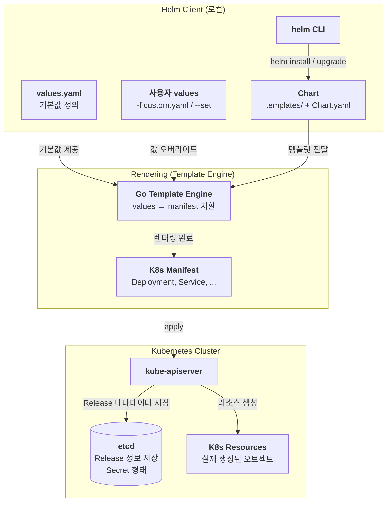
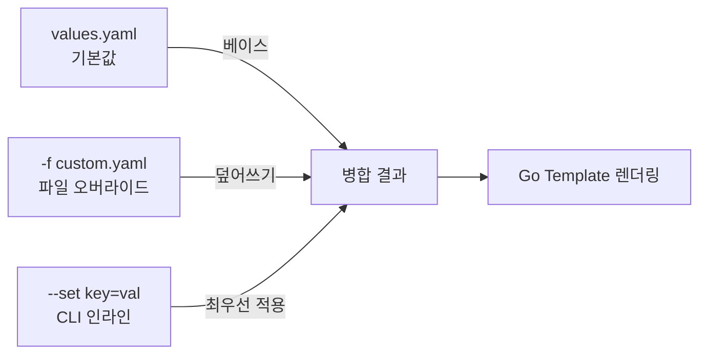
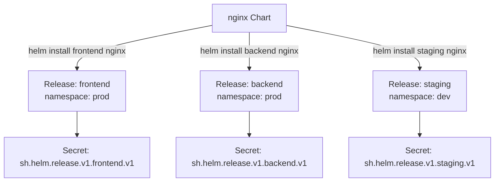
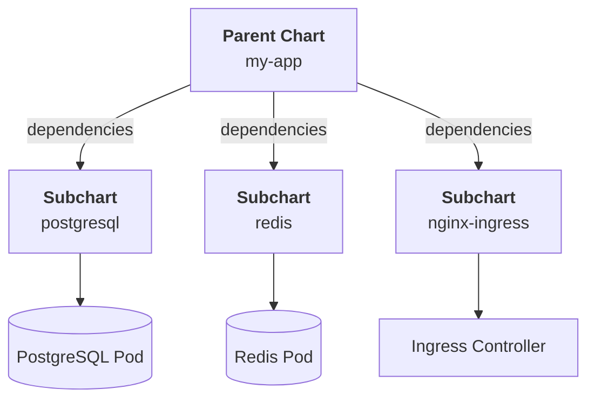
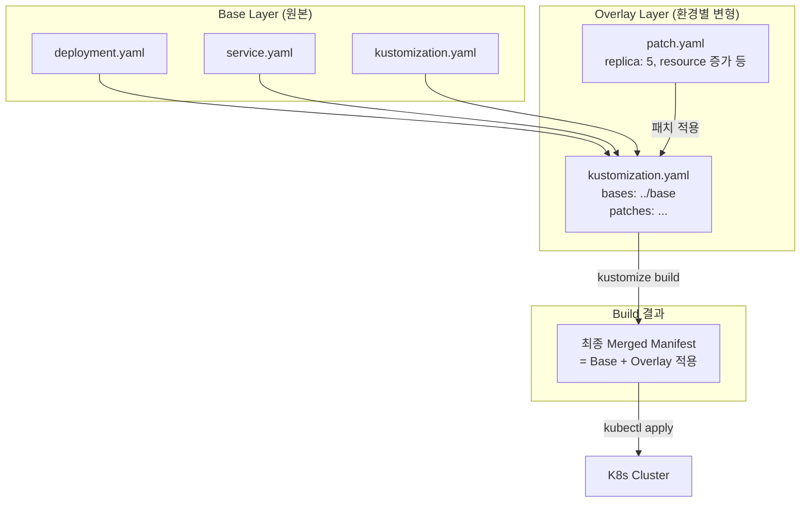
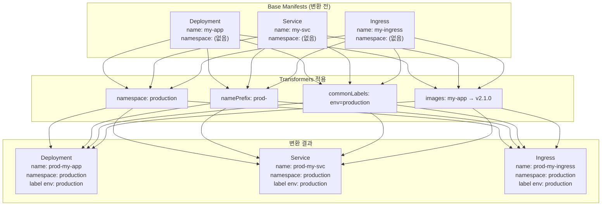

## 5주차 : 섹션 10,11,12 클러스터 아키텍처, kubeadm, helm

# Why ? 

---


# What ? 

---


# Reference

---

## 6주차 : 섹션13,14 Kustomize, Troubleshooting

# Why ? 

---


# What ? 

---


# Reference

---

## Helm 과 Helm Chart 란 ?


## 나만의 Helm Chart 선언은 어떻게 하는가?


## Helm Chart 관리 및 업데이트/롤백 처리방법 ?


## Helm

### Helm 이란 ?

`Helm`은 Kubernetes의 **패키지 매니저**이다.
복잡한 Kubernetes 애플리케이션을 **Chart**라는 단위로 패키징하고, 버전 관리·배포·업그레이드·롤백을 단일 CLI로 처리할 수 있게 해준다.
apt(Ubuntu), yum(CentOS), pip(Python) 과 같은 역할을 Kubernetes 세계에서 담당한다고 보면 된다.

### Helm 작동원리

Helm은 크게 **Chart → Values → Rendering → Release** 의 흐름으로 동작한다.

1. **Chart 로드** : `helm install` 명령 실행 시 Chart 디렉토리(또는 `.tgz`)를 읽어들인다.
2. **Values 병합** : 기본 `values.yaml` 위에 사용자가 전달한 `f` 파일이나 `-set` 인자를 덮어쓴다.
3. **렌더링** : Go Template 엔진이 `templates/` 폴더의 YAML에 Values를 치환해 완성된 Manifest를 생성한다.
4. **Apply** : 완성된 Manifest를 kube-apiserver 에 전달하여 리소스를 생성/수정한다.
5. **Release 저장** : 배포 정보(버전, 상태, Values 스냅샷)를 **Secret** 형태로 etcd에 기록한다.



### Helm Chart / Values

Helm 패키지 내부에는 아래와 같이 Chart.yaml, values.yaml, templates/${k8s-manifest}.yaml 로 구성된다.

```yaml
my-chart/
├── Chart.yaml          # Chart 메타데이터 (이름, 버전, 설명 등)
├── values.yaml         # 기본 Values 정의
├── charts/             # 서브차트(의존 Chart) 디렉토리
├── templates/          # Go Template 기반 K8s Manifest
│   ├── deployment.yaml
│   ├── service.yaml
│   ├── ingress.yaml
│   ├── _helpers.tpl    # 재사용 가능한 템플릿 헬퍼 함수
│   └── NOTES.txt       # 설치 완료 후 출력할 안내 메시지
└── .helmignore         # 패키징 시 제외할 파일 목록
```

Chart 는 Helm 에서 배포 단위의 개념으로 하나의 애플리케이션을 표현하는 파일 묶음이다.
따라서 Chart.yaml 에서 Helm 에 대한 메타데이터를 저장한다.
아래와 같은 메타데이터를 선언한다. 

```yaml
apiVersion: v2
name: my-app
description: A Helm chart for my application
type: application        # application | library
version: 1.2.3           # Chart 자체 버전 (SemVer)
appVersion: "2.0.0"      # 배포하는 앱의 버전
```

이렇게 선언해두면 Go Template 으로 선언된 — 이따 별도로 설명할 것이다 — templates 에서 각각의 필드로 지정된 값으로 치환된다.

```yaml
# templates/deployment.yaml 예시
apiVersion: apps/v1
kind: Deployment
metadata:
  name: {{ .Release.Name }}-app
  labels:
    app: {{ .Chart.Name }} # <- 이 값이 Chart 선언 필드로 치환
spec:
  replicas: {{ .Values.replicaCount }}
  template:
    spec:
      containers:
        - name: app
          image: "{{ .Values.image.repository }}:{{ .Values.image.tag }}"
```

Values는 Chart 템플릿에 주입되는 **설정값의 집합**이다.
기본값이 values.yaml 에 저장되며, 커스터마이징한 파일을 -f 옵션을 오버라이드할 수 있다.
우선순위는 `--set` > `-f 파일` > `values.yaml` 기본값 순으로 처리된다.


```yaml
replicaCount: 2

image:
  repository: nginx
  tag: "1.25"
  pullPolicy: IfNotPresent

service:
  type: ClusterIP
  port: 80

resources:
  limits:
    cpu: 500m
    memory: 128Mi
```
```yaml
# templates/deployment.yaml 예시
apiVersion: apps/v1
kind: Deployment
metadata:
  name: {{ .Release.Name }}-app
  labels:
    app: {{ .Chart.Name }}
spec:
  replicas: {{ .Values.replicaCount }} # <- 이 값이 Values 선언 필드로 치환
  template:
    spec:
      containers:
        - name: app
          image: "{{ .Values.image.repository }}:{{ .Values.image.tag }}"
```

> 💡

### Helm Template

Helm Template은 **Go Template 문법**을 기반으로 동작하며, 여기서 모든 k8s manifest 들이 정의된다. 
`templates/` 폴더 안의 YAML 파일에 Values와 내장 객체를 주입하여 최종 Kubernetes Manifest를 렌더링한다.
이 때 활용되는 문법은 다음과 같다.

- **내장 객체 (Built-in Objects)**
- if / else if / else 제어구문
- 반복문
- With 사용하여 컨텍스트 지정

### Helm Release

Release는 Chart가 클러스터에 **설치된 인스턴스**를 의미한다.
같은 Chart를 여러 번 설치하면 각각 다른 Release 이름을 가진 독립적인 Release가 된다.
즉, `helm install <release-name> ./my-chart` 을 통해 차트 기반 독립적인 Release 를 만들면
Release 에 대한 정보를 Release Secret 객체를 만들어 Secret / ConfigMap 에 저장한다.

- **Release 이름** : 클러스터 내에서 고유한 배포 식별자
- **Release Secret** : 각 배포 버전의 상태, Values, Chart 정보를 etcd 에 Secret으로 보관
- **Release 버전** : 업그레이드할 때마다 `v1 → v2 → v3` 식으로 증가한다



### Helm 생성

```yaml
# 새 Chart 스캐폴딩 생성
helm create my-chart

# 생성 후 구조 확인
tree my-chart/

# 로컬 Chart를 직접 설치
helm install <release-name> ./my-chart

# Repo의 Chart를 설치
helm install <release-name> <repo-name>/<chart-name>

# 특정 네임스페이스에 설치 (없으면 --create-namespace 로 생성)
helm install <release-name> ./my-chart \
  --namespace <namespace> \
  --create-namespace

# Values 오버라이드와 함께 설치
helm install <release-name> ./my-chart \
  -f custom-values.yaml \
  --set image.tag=2.0.0
```

### Helm 해제 & 다운로드

```yaml
# Release 삭제 (K8s 리소스 + Release Secret 모두 제거)
helm uninstall <release-name> -n <namespace>

# 삭제하되 Release 히스토리는 보존
helm uninstall <release-name> --keep-history -n <namespace>

# Repo에서 Chart 파일만 로컬에 내려받기 (.tgz)
helm pull <repo-name>/<chart-name>

# 압축 풀어서 내려받기
helm pull <repo-name>/<chart-name> --untar

# 특정 버전 지정
helm pull <repo-name>/<chart-name> --version 1.2.3
```

### Helm Dry-run & Debug

helm 은 실제 배포 전에 dry-run 혹은 debug 를 통해 렌더링 결과를 확인할 수 있다.

```yaml
# Dry-run : 실제 K8s 에는 아무것도 반영되지 않음
# 서버사이드 검증(스키마 체크 등)을 포함
helm install <release-name> ./my-chart --dry-run

# client-side 렌더링만 확인 (API Server 통신 없음)
helm template <release-name> ./my-chart

# 특정 Values 파일 적용 후 렌더링 확인
helm template <release-name> ./my-chart -f values-prod.yaml

# Debug 플래그 : 렌더링 과정 상세 출력 (Values 병합 결과 포함)
helm install <release-name> ./my-chart --dry-run --debug

# 특정 템플릿 파일만 렌더링
helm template <release-name> ./my-chart -s templates/deployment.yaml
```

### Helm Upgrade & Rollback

```yaml
# Release 업그레이드
helm upgrade <release-name> ./my-chart -f values-prod.yaml

# 없으면 설치, 있으면 업그레이드 (--install 플래그)
helm upgrade --install <release-name> ./my-chart -f values-prod.yaml

# 이미지 태그만 변경
helm upgrade <release-name> ./my-chart --set image.tag=2.1.0

# 특정 리비전으로 롤백
helm rollback <release-name> <revision-number>

# 바로 이전 버전으로 롤백
helm rollback <release-name>

# 롤백도 새로운 리비전으로 기록됨
# e.g. v3 → rollback → v4 (v4의 내용은 v2와 동일)
```

### Helm History

Helm 은 Release의 버전 이력을 조회할 수 있다. 이를 도와주는 명령어가 helm history 이다.

```yaml
# 특정 Release 의 배포 이력 확인
helm history <release-name>

# 네임스페이스 지정
helm history <release-name> -n <namespace>

# 최근 N건만 출력
helm history <release-name> --max 5
```

### Helm Subcharts & Dependencies



하나의 Chart가 다른 Chart를 **의존성(Dependency)** 을 띌 수 있는데 Chart.yaml 에서 이 의존성을 명시할 수 있다.
이렇게 명시한 의존 Chart 를 SubChart 라고하며 helm dependency 를 통해 다운로드 및 의존성 확인을 처리할 수 있다.

```yaml
dependencies:
  - name: postgresql
    version: "12.x.x"
    repository: "https://charts.bitnami.com/bitnami"
    condition: postgresql.enabled   # values.yaml 의 값으로 활성/비활성 제어

  - name: redis
    version: "17.x.x"
    repository: "https://charts.bitnami.com/bitnami"
    condition: redis.enabled
```
```yaml
# 의존성 다운로드 (charts/ 폴더에 .tgz 저장)
helm dependency update ./my-chart

# 의존성 목록 확인
helm dependency list ./my-chart
```

### Helm Repo / Chart Museum

Helm Chart 는 원격으로 배포·공유하기 위한 **저장소(Repository)** 를 사용할 수 있다.
두 가지 개념으로 나뉠 수 있다.

1. DockerHub, Github 와 같이 공용 저장소로 사용되는 Helm Repo
2. **자체 호스팅 Helm Chart Repository 서버인 Helm Chart Museum**

Helm Chart Museum 같은 경우에는 사내 Private Chart를 관리하거나, Air-gapped 환경에서 Helm Repo를 운영할 때 활용한다.

```bash
# 원격 Repo 추가
helm repo add bitnami https://charts.bitnami.com/bitnami
helm repo add stable https://charts.helm.sh/stable

# 등록된 Repo 목록 확인
helm repo list

# Repo 의 Chart 인덱스 업데이트
helm repo update

# Repo 에서 Chart 검색
helm search repo nginx
helm search repo bitnami/postgresql --versions

# Repo 제거
helm repo remove bitnami
```
```bash
# ChartMuseum 설치 (Helm 으로)
helm repo add chartmuseum https://chartmuseum.github.io/charts
helm install my-chartmuseum chartmuseum/chartmuseum \
  --set env.open.DISABLE_API=false

# helm-push 플러그인 설치
helm plugin install https://github.com/chartmuseum/helm-push

# Chart 패키징
helm package ./my-chart

# ChartMuseum 에 push
helm cm-push my-chart-1.0.0.tgz my-repo

# ChartMuseum Repo 등록 후 사용
helm repo add my-repo http://<chartmuseum-url>
helm repo update
helm install my-app my-repo/my-chart
```

### 적용 & 확인

```bash
# 설치된 모든 Release 확인
helm list -A   # -A : 모든 네임스페이스

# 특정 Release 의 현재 Values 확인
helm get values <release-name> -n <namespace>

# 모든 Values (기본값 포함) 확인
helm get values <release-name> -n <namespace> --all

# 현재 렌더링된 Manifest 확인
helm get manifest <release-name> -n <namespace>

# Release 상태 확인
helm status <release-name> -n <namespace>

# Chart 문법 검사 (lint)
helm lint ./my-chart

# 배포 후 Pod 상태 확인
kubectl get pods -n <namespace> -l app.kubernetes.io/instance=<release-name>

# 배포 후 모든 리소스 확인
kubectl get all -n <namespace> -l helm.sh/chart=<chart-name>
```

### 문제 1 : ArgoCD 설치

Install Argo CD in the cluster:
Add the official Argo CD Helm repository with the name argo.Repository Path: [https://argoproj.github.io/argo-helm/](https://argoproj.github.io/argo-helm/)
The Argo CD CRDs have already been pre-installed in the cluster.
Generate a helm template of the Argo CD Helm chart version 8.6.4 for the
argocd namespace and save it to ~/argo-helm.yaml.
Configure the chart to not install CRDs.
Install Argo CD using Helm with release name argocd using the same version
and configuration as used in the template 8.6.4.
Install it in the argocd namespace and configure it to not install CRDs.
You do not need to configure access to the Argo CD server UI.

```bash
# helm repo 추가
helm repo add argo [https://argoproj.github.io/argo-helm/](https://argoproj.github.io/argo-helm/)
helm repo update

# helm 전용 namespace 생성
kubectl create namespace argocd

# helm template 생성
helm template argocd argo/argo-cd \\
  --version 8.6.4 \\
  --namespace argocd \\
  --set crds.install=false \\
  > ~/argo-helm.yaml
  
# helm 설치
# 다만 문제에서 CRD 는 설치하지 않도록 하였으므로 옵션을 처리
helm install argocd argo/argo-cd \\
  --version 8.6.4 \\
  --namespace argocd \\
  --set crds.install=false
  
# helm 설치 확인
helm list -n argocd
kubectl get pods -n argocd
```

## Kustomize

### Kustomize 란 ?

`Kustomize`는 Kubernetes Manifest를 **템플릿 없이 커스터마이징**하는 도구이다.
Helm이 `{{ .Values.xxx }}` 같은 템플릿 언어로 YAML을 동적으로 생성하는 방식과 달리,
Kustomize는 **원본 YAML 파일을 절대 건드리지 않고**, 그 위에 "이 부분만 바꿔라" 는 패치(Patch) 명세를 따로 관리한다.
`kubectl` 에 기본 내장(`kubectl apply -k`)되어 있어 별도 설치 없이도 사용 가능하다.

### Kustomize 작동원리

> Kustomize는 **선언형 오버레이** 방식이다. 원본을 수정하지 않고 결과만 달라진다.

1. **Base 정의** : 환경에 관계없이 공통으로 사용하는 Manifest를 작성한다.
2. **Overlay 정의** : 환경별 차이(replicas, 이미지 태그, 리소스 등)만을 Patch 형태로 작성한다.
3. **Build** : `kustomize build` 또는 `kubectl apply -k` 가 Base + Patch를 병합하여 최종 Manifest를 생성한다.
4. **Apply** : 최종 Manifest가 kube-apiserver 에 전달된다.



### Kustomize Base & Overlays

개발(dev), 스테이징(staging), 운영(prod) 환경은 대부분 **같은 구조에 일부 값만 다르다.**
모든 환경마다 YAML 파일 전체를 복사하면 중복이 생기고 유지보수가 힘들어진다.
따라서 Base에 공통 구조를 두고, 각 환경의 Overlay에는 **차이점만 **두는 방식으로 중복을 제거한다.

```mermaid
my-app/
├── base/                       # 공통 Manifest
│   ├── kustomization.yaml
│   ├── deployment.yaml
│   └── service.yaml
└── overlays/                   # 환경별 오버레이
    ├── dev/
    │   ├── kustomization.yaml
    │   └── patch-replicas.yaml
    ├── staging/
    │   ├── kustomization.yaml
    │   └── patch-resources.yaml
    └── prod/
        ├── kustomization.yaml
        └── patch-prod.yaml
```

1. **base/deployment.yaml** 에 공통 manifest 를 선언한다. 절대 수정하지 않는다
2. **base/kustomization.yaml** 에 base 내 리소스 목록들을 나열한다.
3. **overlays/prod/kustomization.yaml** 에 각 환경 별로 어떤 오버레이를 처리할지 선언한다.
4. 이후 **overlays/prod/patch-prod.yaml** 에서 실제 manifest 의 운영 환경 별 차이점을 기술한다.

### Kustomize Patch

Patch는 Base Manifest의 **특정 필드만 변경**하는 방법이다. 두 가지 방식이 있다.

1. Strategic Merge Patch
2. JSON Patch

### Kustomize Generators

Generators는 `kustomization.yaml` 선언만으로 **ConfigMap 과 Secret 을 자동 생성**하는 기능이다.
다음과 같이 configmap 에 대한 generator 와 secret 에 대한 generator 로 구분할 수 있다.

1. configMapGenerator
2. secretGenerator

이렇게 선언하여 생성된 ConfigMap/Secret 이름에는 다음과 같이 **내용 기반 해시**가 붙게된다.

```yaml
# kustomize build 후 자동 생성되는 ConfigMap
apiVersion: v1
kind: ConfigMap
metadata:
  name: my-config-48f7a2b9    # 이름 뒤에 내용 기반 해시가 자동 추가됨
data:
  APP_ENV: production
  LOG_LEVEL: info
  app.properties: |           # 파일 내용이 그대로 삽입됨
    server.port=8080
    spring.datasource.url=jdbc:...
```

이렇게 내용이 바뀌면 해시가 달라지고, Deployment가 새 이름을 참조하게 되어 자연스러운 롤링 업데이트가 발생한다.
??? 어떻게 Deployment 가 자동으로 새로운 이름을 참조함????
??? 어떻게 Deployment 가 자동으로 새로운 이름을 참조함????
??? 어떻게 Deployment 가 자동으로 새로운 이름을 참조함????
??? 어떻게 Deployment 가 자동으로 새로운 이름을 참조함????

> 💡
> 💡

### Kustomize Transformers

Transformers는 Base Manifest 전체에 **일괄 변환**을 적용하는 기능이다.
Patch가 "특정 리소스의 특정 필드"를 바꾸는 것이라면, Transformer는 **모든 리소스에 동일한 변환**을 한 번에 적용하는 것이다.
예를 들어 운영 환경 Overlay에 `namespace: production` 한 줄만 추가하면, base의 Deployment, Service, Ingress 등 **모든 리소스에 네임스페이스가 자동으로 붙는다.**



### Helm vs Kustomize

보통 하나만 선택해서 쓴다기보다는 패키징을 할 때는 Helm 을, 환경 별로 다르게 처리해야할 때는 Kustomize 를 적용하는, Mix-In 방식으로 처리한다.
그럼에도 차이점을 정리하자면 아래와 같다.

| 항목 | Helm | Kustomize |
| --- | --- | --- |
| 접근 방식 | 템플릿 기반 | 오버레이 기반 |
| 학습 난이도 | 중간 (Go Template 필요) | 낮음 (순수 YAML) |
| 패키지 관리 | O (Chart, Repo) | X |
| 버전/롤백 | O (Release History) | X (Git 의존) |
| 환경 분리 | Values 파일 분리 | Overlays 디렉토리 분리 |
| 내장 여부 | 별도 설치 필요 | kubectl 기본 내장 |
| 동적 로직 | O (if/loop 등 템플릿 문법) | 제한적 |
| 적합한 사용처 | 복잡한 앱 패키징·배포 | 환경별 간단한 설정 분기 |


### 적용 & 확인

```yaml
# 렌더링 결과만 확인 (클러스터 미적용)
kustomize build overlays/prod

# kubectl 내장 kustomize 로 적용
kubectl apply -k overlays/prod

# 개발 환경 적용
kubectl apply -k overlays/dev

# 적용 전 diff 확인 (현재 클러스터 상태와 비교)
kubectl diff -k overlays/prod

# 삭제
kubectl delete -k overlays/prod

# 적용 후 Pod 상태 확인
kubectl get pods -n production

# 생성된 ConfigMap 이름 확인 (해시 포함)
kubectl get configmap -n production

# kustomize 버전 확인
kustomize version
kubectl version --client  # kubectl 내장 kustomize 버전 포함
```
