# Why? 왜 배움?

---

- 고가용성 컨테이너 구축을 위해서
- 인프라 엔지니어 전향을 위해서


# What? 뭘 배움?

---

> ☝ [https://www.inflearn.com/studies/1726641/%EC%BF%A0%EB%B2%84%EB%84%A4%ED%8B%B0%EC%8A%A4-cka-%EC%9E%90%EA%B2%A9%EC%A6%9D-%EC%B7%A8%EB%93%9D%EC%9D%84-%EC%9C%84%ED%95%9C-%EC%8A%A4%ED%84%B0%EB%94%94-%EB%AA%A8%EC%A7%91](https://www.inflearn.com/studies/1726641/%EC%BF%A0%EB%B2%84%EB%84%A4%ED%8B%B0%EC%8A%A4-cka-%EC%9E%90%EA%B2%A9%EC%A6%9D-%EC%B7%A8%EB%93%9D%EC%9D%84-%EC%9C%84%ED%95%9C-%EC%8A%A4%ED%84%B0%EB%94%94-%EB%AA%A8%EC%A7%91)
> ☝ 2025.12.15 - 21 1주차 : 섹션 1,2,3


## CKA 에서 Custom Dotfile 사용해도 괜찮을까?

# Why ? 

---

CKA 응시할 때 nvim 설정을 조작할 수 있을까 궁금하여 찾아보았다.


# What ? 

---

1. k8s yaml 에 대한 LSP 셋업을 하면 작업할 때 수월하다
2. .vimrc 에 대해서 수정하면 편하다
3. tmux 를 미리 알아두면 좋다


# Reference

---

> CKA 시험규정 공식 가이드라인

[https://docs.linuxfoundation.org/tc-docs/certification/tips-cka-and-ckad](https://docs.linuxfoundation.org/tc-docs/certification/tips-cka-and-ckad)
[https://docs.linuxfoundation.org/tc-docs/certification/faq-cka-ckad-cks](https://docs.linuxfoundation.org/tc-docs/certification/faq-cka-ckad-cks)

> CKA Tips

[https://www.reddit.com/r/kubernetes/comments/10qvm6u/my_vim_configuration_helps_you_reduce_pain_during/?tl=ko](https://www.reddit.com/r/kubernetes/comments/10qvm6u/my_vim_configuration_helps_you_reduce_pain_during/?tl=ko)
[https://dev.to/marcoieni/ckad-2021-tips-vimrc-bashrc-and-cheatsheet-hp3#:~:text=your%20current%20shell.-,.vimrc,-At%20the%20beginning](https://dev.to/marcoieni/ckad-2021-tips-vimrc-bashrc-and-cheatsheet-hp3#:~:text=your%20current%20shell.-,.vimrc,-At%20the%20beginning)

## CKA 연습 참고자료

# Why ? 

---

CKA 연습문제


# What ? 

---

- **killer.sh **
- **killer.coda **
- sailor.sh
- **GitHub CKA-Exercises**

> 💡 우선순위

# Reference

---

## 2주차 : 섹션 4,5,6 Logging, Application Lifecycle, Cluster Maintenance

# Why ? 

---


# What ? 

---

## logging & monitoring

### node metric 확인

cAdvisor 기반 각 환경 별로 모듈을 제공 중


```bash
minikube addons enable metrics-server
```
```bash
git clone https://github.com/kubernetes-incubator/metrics-server.git
kubectl create –f deploy/1.8+/
```

이후 아래와 같이 pod, node 에 대한 CPU/MEM 에 대해서 확인 가능

```bash
controlplane ~ ➜  kubectl top node
NAME CPU(cores) CPU% MEMORY(bytes) MEMORY%
kubemaster 166m 8% 1337Mi 70%
kubenode1 36m 1% 1046Mi 55%
kubenode2 39m 1% 1048Mi 55%
```
```bash
controlplane ~ ➜  kubectl top pod
NAME CPU(cores) CPU% MEMORY(bytes) MEMORY%
nginx 166m 8% 1337Mi 70%
redis 36m 1% 1046Mi 55%
```

### pod/container log 확인

log 는 아래와 같이 호출하여 볼 수 있음

- 파드 내 단일 컨테이너 : kubectl 파드명
- 파드 내 다수 컨테이너 : kubectl 파드명 원하는컨테이너명

```bash
$kubectl get pods
NAME READY STATUS RESTARTS AGE
webapp-1 1/1 Running 0 51s
webapp-2 2/2 Running 0 51s

# 파드 내 단일 컨테이너 로깅
$kubectl logs webapp-1
,,,,

# 파드 내 다수 컨테이너 로깅
# kubectl describe 를 통해 컨테이너명 조회
controlplane ~ ➜  kubectl describe pod webapp-2
Containers:
  simple-webapp:
	  ,,,
  db:
	  ,,,

controlplane ~ ➜  kubectl logs webapp-2 simple-webapp
[2025-12-27 12:53:50,894] INFO in event-simulator: USER3 is viewing page2
[2025-12-27 12:53:51,895] INFO in event-simulator: USER2 is viewing page3
[2025-12-27 12:53:52,896] INFO in event-simulator: USER1 is viewing page3
[2025-12-27 12:53:53,897] INFO in event-simulator: USER1 is viewing page1
[2025-12-27 12:53:54,899] INFO in event-simulator: USER4 logged in
[2025-12-27 12:53:55,900] WARNING in event-simulator: USER5 Failed to Login as the account is locked due to MANY FAILED ATTEMPTS.
```


## Rollout and Versioning

### deployment

Deployment는 Pod와 ReplicaSet에 대한 선언적 업데이트를 제공하는 상위 수준의 Kubernetes 오브젝트입니다.
**주요 기능:**

- Pod의 생성 및 삭제 관리
- 롤링 업데이트 및 롤백 지원
- 스케일링 (확장/축소)
- 일시 중지 및 재개

**Deployment → ReplicaSet → Pod 관계:**

```bash
┌─────────────────────────────────────────────────────────┐
│                      Deployment                         │
│  ┌───────────────────────────────────────────────────┐  │
│  │                   ReplicaSet                      │  │
│  │  ┌─────────┐  ┌─────────┐  ┌─────────┐           │  │
│  │  │   Pod   │  │   Pod   │  │   Pod   │           │  │
│  │  └─────────┘  └─────────┘  └─────────┘           │  │
│  └───────────────────────────────────────────────────┘  │
└─────────────────────────────────────────────────────────┘
```

### replicaset

ReplicaSet은 지정된 수의 Pod 복제본이 항상 실행되도록 보장합니다.
**주요 역할:**

- 원하는 수의 Pod 유지
- Pod 장애 시 자동 복구
- 수평적 스케일링 지원

> ⚠️ 참고: 일반적으로 ReplicaSet을 직접 생성하지 않고, Deployment를 통해 관리합니다.

### strategies

- Recreate
- RollingUpdate

### Rollout 명령어

> 📖 TL;DR;

- Deployment 생성 및 관리
- Rollout 상태 확인
- Rollout 히스토리 조회
- 이미지 업데이트
- 전략 변경
- Rollback (롤백)
- Rollout 일시 중지 및 재개


## Commands / Args


## Env variables

> 📖 방법이 기억이 안 난다면 강의에서 나온 것처럼 —help 를 통해 찾아보자
> 📖 Q:

### configmap 이란 ?

ConfigMap은 Kubernetes에서 **설정 데이터를 키-값 쌍으로 저장**하는 리소스입니다. 애플리케이션 코드와 설정을 분리하여 컨테이너 이미지를 재빌드하지 않고도 설정을 변경할 수 있습니다.

### configmap 명령어

- configmap 조회
- configmap 생성
- pod 에서 생성된 configmap 사용

## Secrets

### Secrets 이란 ?

Secret은 Kubernetes에서 **민감한 데이터를 저장**하기 위한 리소스입니다. 
비밀번호, API 키, 인증서 등 보안이 필요한 정보를 저장합니다.

### **Secret vs ConfigMap**

| 구분 | ConfigMap | Secret |
| --- | --- | --- |
| **용도** | 일반 설정 데이터 | 민감한 데이터 |
| **예시** | DB 호스트, 포트, 설정 파일 | 비밀번호, API 키, 인증서 |
| **데이터 저장** | 평문 (Plain text) | Base64 인코딩 |
| **암호화** | ❌ 없음 | ⚠️ 기본은 없음 (etcd 암호화 가능) |
| **메모리 저장** | ❌ 디스크 | ✅ tmpfs (메모리) |
| **크기 제한** | 1MB | 1MB |


### Secrets 타입

| 타입 | 용도 |
| --- | --- |
| `Opaque` | 일반적인 키-값 데이터 (기본값) |
| `kubernetes.io/dockerconfigjson` | Docker 레지스트리 인증 |
| `kubernetes.io/tls` | TLS 인증서 |
| `kubernetes.io/service-account-token` | 서비스 계정 토큰 |


### Secrets & etcd 간의 관계

**etcd란?**
etcd는 Kubernetes의 **핵심 데이터 저장소**입니다. 클러스터의 모든 상태 정보(Pod, Service, ConfigMap, Secret 등)가 여기에 저장됩니다.

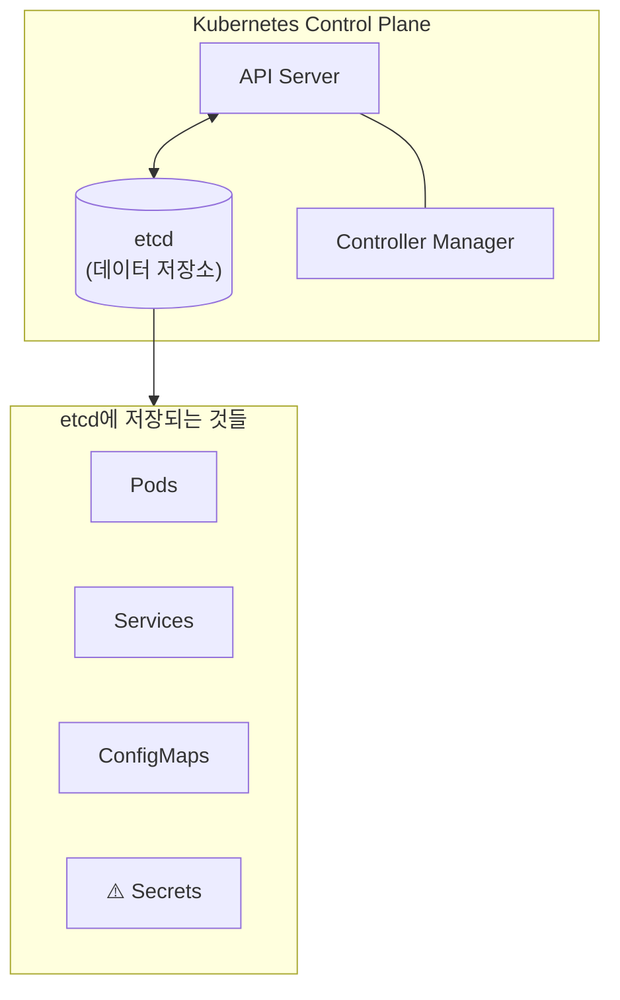

**Secret이 etcd에 저장되는 과정**

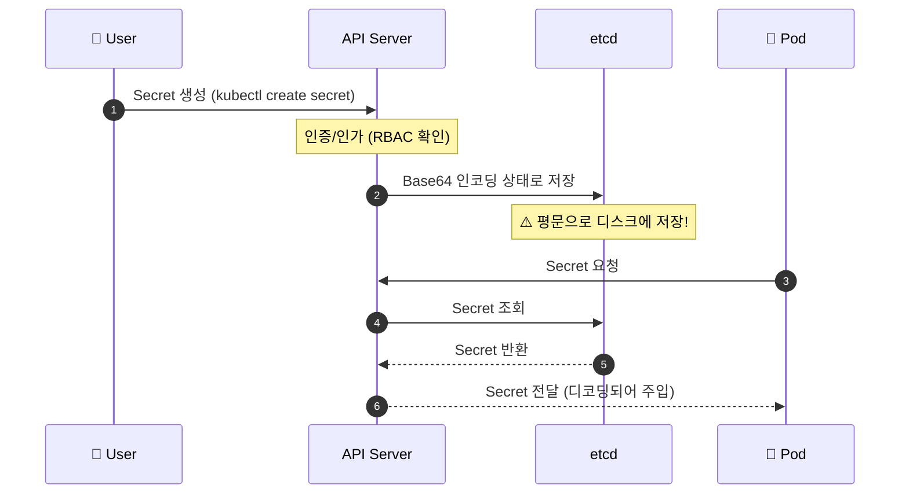

**⚠️ 문제점: 평문 저장**
**etcd 내부 데이터 확인 (실제 예시)**

```bash
# etcd에서 Secret 직접 조회
ETCDCTL_API=3 etcdctl get /registry/secrets/default/db-secret \
  --cacert=/etc/kubernetes/pki/etcd/ca.crt \
  --cert=/etc/kubernetes/pki/etcd/server.crt \
  --key=/etc/kubernetes/pki/etcd/server.key

```
```
# 출력 결과 (평문으로 노출됨!)
/registry/secrets/default/db-secret
k8s

v1Secret

db-secretdefault"*$e]8db6-4f5a-9c3b2
DB_PASSWORDp@ssw0rd        # ← 비밀번호가 그대로 보임!
DB_USERadmin               # ← 사용자명도 노출!
Opaque"

```

### etcd 에 저장되는 secrets 탈취에 대한 솔루션

1. etcd 암호화 (Encryption at Rest)
2. RBAC으로 접근 제한
3. 외부 Secret 관리 도구

### Secrets 명령어

- 조회
- 생성
- Pod 에서 Secret 사용


## Multi Container Pods

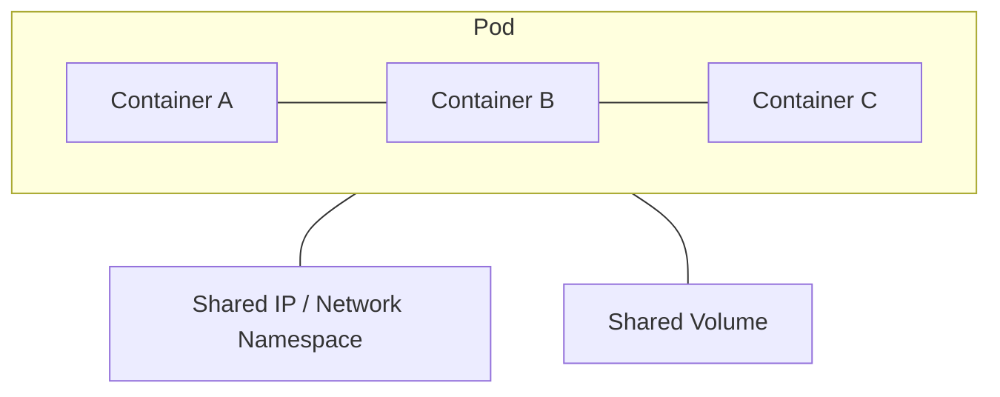

각각의 개념과 구성도 mermaid, 예제 yaml 파일을 정리해줘

### co-located containers

메인 애플리케이션과 함께 **동시에 실행**되며 보조 기능을 수행하는 컨테이너입니다.

| 패턴 | 설명 | 예시 |
| --- | --- | --- |
| **Sidecar** | 메인 컨테이너 기능 확장 | 로그 수집, 프록시 |
| **Ambassador** | 외부 통신 대리 | DB 프록시, API 게이트웨이 |
| **Adapter** | 출력 표준화 | 로그 포맷 변환, 모니터링 어댑터 |


```yaml
apiVersion: v1
kind: Pod
metadata:
  name: web-app-pod
  labels:
    app: web-app
spec:
  containers:
  # ========================================
  # 1. Main Container - 웹 애플리케이션
  # ========================================
  - name: web-app
    image: nginx:1.25
    ports:
    - containerPort: 80
    volumeMounts:
    - name: shared-logs
      mountPath: /var/log/nginx
    - name: shared-data
      mountPath: /usr/share/nginx/html
    resources:
      requests:
        memory: "128Mi"
        cpu: "100m"
      limits:
        memory: "256Mi"
        cpu: "200m"

  # ========================================
  # 2. Sidecar Container - 로그 수집기
  # ========================================
  - name: log-collector
    image: fluent/fluent-bit:latest
    volumeMounts:
    - name: shared-logs
      mountPath: /var/log/nginx
      readOnly: true
    - name: fluent-config
      mountPath: /fluent-bit/etc
    resources:
      requests:
        memory: "64Mi"
        cpu: "50m"
      limits:
        memory: "128Mi"
        cpu: "100m"

  # ========================================
  # 3. Ambassador Container - 프록시
  # ========================================
  - name: proxy
    image: envoyproxy/envoy:v1.28-latest
    ports:
    - containerPort: 9901  # Envoy admin
    - containerPort: 10000 # Proxy port
    resources:
      requests:
        memory: "64Mi"
        cpu: "50m"
      limits:
        memory: "128Mi"
        cpu: "100m"

  # ========================================
  # Shared Volumes
  # ========================================
  volumes:
  - name: shared-logs
    emptyDir: {}
  - name: shared-data
    emptyDir: {}
  - name: fluent-config
    configMap:
      name: fluent-bit-config

```

### regular init containers

메인 컨테이너 **실행 전에 순차적으로 실행**되는 컨테이너입니다. 초기화 작업을 수행하고 완료되면 종료됩니다.

| 특징 | 설명 |
| --- | --- |
| **순차 실행** | 정의된 순서대로 하나씩 실행 |
| **완료 필수** | 이전 Init Container가 성공해야 다음 실행 |
| **일회성** | 작업 완료 후 종료 |
| **용도** | DB 대기, 설정 파일 생성, 의존성 체크 |


```yaml
apiVersion: v1
kind: Pod
metadata:
  name: webapp-with-init
  labels:
    app: webapp
spec:
  # ========================================
  # Init Containers (순차 실행)
  # ========================================
  initContainers:
  # 1단계: DB 서비스가 준비될 때까지 대기
  - name: wait-for-db
    image: busybox:1.36
    command: ['sh', '-c']
    args:
      - |
        echo "Waiting for database..."
        until nc -z db-service 3306; do
          echo "DB not ready, sleeping..."
          sleep 2
        done
        echo "DB is ready!"

  # 2단계: 설정 파일 다운로드
  - name: download-config
    image: busybox:1.36
    command: ['sh', '-c']
    args:
      - |
        echo "Downloading config..."
        wget -O /config/app.conf http://config-server/app.conf
        echo "Config downloaded!"
    volumeMounts:
    - name: config-volume
      mountPath: /config

  # 3단계: 데이터 디렉토리 권한 설정
  - name: init-permissions
    image: busybox:1.36
    command: ['sh', '-c']
    args:
      - |
        echo "Setting permissions..."
        chmod -R 755 /data
        chown -R 1000:1000 /data
        echo "Permissions set!"
    volumeMounts:
    - name: data-volume
      mountPath: /data

  # ========================================
  # Main Container (Init 완료 후 실행)
  # ========================================
  containers:
  - name: webapp
    image: myapp:1.0
    ports:
    - containerPort: 8080
    env:
    - name: DB_HOST
      value: "db-service"
    - name: DB_PORT
      value: "3306"
    volumeMounts:
    - name: config-volume
      mountPath: /app/config
      readOnly: true
    - name: data-volume
      mountPath: /app/data
    resources:
      requests:
        memory: "256Mi"
        cpu: "200m"
      limits:
        memory: "512Mi"
        cpu: "500m"
    # 앱이 준비되었는지 확인
    readinessProbe:
      httpGet:
        path: /health
        port: 8080
      initialDelaySeconds: 5
      periodSeconds: 10

  # ========================================
  # Volumes
  # ========================================
  volumes:
  - name: config-volume
    emptyDir: {}
  - name: data-volume
    emptyDir: {}

```

### sidecar containers

Kubernetes 1.28부터 도입된 **네이티브 사이드카**입니다. Init Container에 `restartPolicy: Always`를 설정하여 메인 컨테이너와 함께 **지속적으로 실행**됩니다.

### 기존 방식 vs 네이티브 사이드카

| 구분 | 기존 Co-located | Native Sidecar (1.28+) |
| --- | --- | --- |
| **정의 위치** | `spec.containers` | `spec.initContainers` |
| **시작 순서** | 메인과 동시 | 메인보다 먼저 |
| **종료 순서** | 메인과 동시 | 메인보다 나중 |
| **재시작** | Pod 정책 따름 | `restartPolicy: Always` |
| **Job 호환** | ❌ Job 완료 방해 | ✅ Job과 호환 |


```yaml
# Istio 스타일 Service Mesh Sidecar 예제
apiVersion: v1
kind: Pod
metadata:
  name: app-with-mesh
  labels:
    app: myapp
spec:
  initContainers:
  # Sidecar: Istio Proxy (Envoy)
  - name: istio-proxy
    image: docker.io/istio/proxyv2:1.20.0
    restartPolicy: Always
    ports:
    - containerPort: 15090
      name: http-envoy-prom
    env:
    - name: POD_NAME
      valueFrom:
        fieldRef:
          fieldPath: metadata.name
    - name: POD_NAMESPACE
      valueFrom:
        fieldRef:
          fieldPath: metadata.namespace
    resources:
      requests:
        cpu: "10m"
        memory: "40Mi"
      limits:
        cpu: "200m"
        memory: "256Mi"

  # Main Container
  containers:
  - name: myapp
    image: myapp:1.0
    ports:
    - containerPort: 8080
```


## Init Container

???


## Manual Scailing / HPA

manual

```bash
# 리소스 사용량 확인
kubectl top pod ${pod-name}.pod
# 수동으로 수평 확장
kubectl scale deployment ${deploy-name} --replicas=3
```

HPA

```bash
# HPA 매니저 활성화
kubectl autoscale ${deploy-name} --cpu-percent=50 --min=1 --max=10
# HPA 매니저 조회
kubectl get hpa
# HPA 매니저 삭제
kubectl delete hpa ${hpa-name}
```

In-Place Pod Resizing
pod 업데이트하고자 한다면 이전 pod 를 죽이고 새 pod 를 시작해야함
최근 베타로 in place update 를 지원할 수 있게 되었음
다만 CPU, memory 사용률만 변경 가능하며, 이외에 Pod Qos (????), Init Containers, Ephermeral Containers 등등은 교체가 불가능함

```bash
FEATURE_GATES=InPlacePodVerticalScailing=true
```

## Installing VPA

vpa manager 가 지속적으로 메트릭을 모니터링한 다음 파드에 할당된 리소스를 자동으로 업스케일함
vpa 는 k8s built-in 이 아님 
[https://github.com/kubernetes/autoscaler/blob/master/vertical-pod-autoscaler/docs/installation.md](https://github.com/kubernetes/autoscaler/blob/master/vertical-pod-autoscaler/docs/installation.md) 에 따라 설치를 진행해야 함
원리는 [https://kubernetes.io/docs/concepts/workloads/autoscaling/vertical-pod-autoscale/#how-does-a-verticalpodautoscaler-work](https://kubernetes.io/docs/concepts/workloads/autoscaling/vertical-pod-autoscale/#how-does-a-verticalpodautoscaler-work) 를 참고할 수 있음
**(강의에서 ****`updateMode:Auto`**** 를 보여주는데 그건 deprecated 됨. 꼭 개념 공부 시 공식문서를 살펴볼 것)**

```bash
apiVersion: autoscaling.k8s.io/v1
kind: VerticalPodAutoscaler
metadata:
  name: my-app-vpa
spec:
  targetRef:
    apiVersion: "apps/v1"
    kind: Deployment
    name: my-app
  updatePolicy:
    updateMode: "Recreate"  # Off, Initial, Recreate, InPlaceOrRecreate 
```

## OS Upgrades

지정한 타임아웃 시간 내에 헬스체크가 실패하면 노드가 죽었다고 판단한다.

- node-monitor-period: 5초마다 노드 상태 체크.
- node-monitor-grace-period: 40초 동안 Heartbeat 없으면 NotReady로 판단.
- pod-eviction-timeout: NotReady 상태가 지속되면 최대 5분 안에 해당 노드의 파드를 Evict

이 때 노드가 NotReady로 판단되면 k8s가 자동으로 Evict+재스케줄링한다

다만 수동으로 설정해야하는 경우가 있는데 OS 업데이트를 해야하거나 노드를 업데이트하는 경우가 그러한 경우다.
이럴 떄 cordon/drain(수동 또는 Draino/Kured 같은 자동화)을 사용하여 파드를 재할당하여 노드를 교체해줄 수있다
[https://velog.io/@_zero_/%EC%BF%A0%EB%B2%84%EB%84%A4%ED%8B%B0%EC%8A%A4-%EC%BB%A4%EB%93%A0Cordon-%EB%B0%8F-%EB%93%9C%EB%A0%88%EC%9D%B8Drain-%EA%B0%9C%EB%85%90%EA%B3%BC-%EC%84%A4%EC%A0%95](https://velog.io/@_zero_/%EC%BF%A0%EB%B2%84%EB%84%A4%ED%8B%B0%EC%8A%A4-%EC%BB%A4%EB%93%A0Cordon-%EB%B0%8F-%EB%93%9C%EB%A0%88%EC%9D%B8Drain-%EA%B0%9C%EB%85%90%EA%B3%BC-%EC%84%A4%EC%A0%95)
[https://kubernetes.io/docs/reference/kubectl/generated/kubectl_drain/](https://kubernetes.io/docs/reference/kubectl/generated/kubectl_drain/)
[https://kubernetes.io/docs/reference/kubectl/generated/kubectl_cordon/](https://kubernetes.io/docs/reference/kubectl/generated/kubectl_cordon/)

```bash
# 특정 노드를 스케줄러에서 제외시켜 파드가 할당되지 않도록 하고, 기존에 배포된 파드를 다른 노드로 이동시킴
kubectl drain ${node-name}
```

## Cluster Upgrade Process

각 컴포넌트 별로 version 이 다를 수 있다.


이에 따라 api-server 가 X 인 경우 아래와 같이 X-1, X-2 범위까지의 컴포넌트 버전을 지원한다
각각에 맞춰서 업데이트를 진행해주면 된다.


Why and When to Upgrade ?
How to Upgrade ?

- All of them at once → Pod all down & all up
- One node at a time
- Add new upgraded node & remove old node

마스터 노드

```bash
# check available upgrade versions and validate if the current cluster is ready for an upgrade
kubeadm upgrade plan

# kubeadm / kubelet 새로운 버전 설치
apt-get upgrade -y kubeadm=${version}
apt-get upgrade -y kubelet=${version}

# 새로운 버전으로 업그레이드
kubeadm upgrade apply ${version}
systemctl restart kubelet
```

워커 노드

```bash
# 파드를 다른 노드에 할당 & cordon 하여 스케줄링 제거
kubectl drain ${node-name}

# kubeadm / kubelet 새로운 버전 설치
apt-get upgrade -y kubeadm=${version}
apt-get upgrade -y kubelet=${version}

# 새로운 버전으로 업그레이드
kubeadm upgrade node config --kubelet-version ${version}
systemctl restart kubelet

# 다시 스케줄링 허용
kubectl uncordon ${node-name}
```

> ✅ **kubeadm upgrade apply ${version} **vs kubeadm upgrade node config --kubelet-version ${version}


## Backup / Restore Methods

[https://kubernetes.io/docs/tasks/administer-cluster/configure-upgrade-etcd/#backing-up-an-etcd-cluster](https://kubernetes.io/docs/tasks/administer-cluster/configure-upgrade-etcd/#backing-up-an-etcd-cluster)
declaritive 방식 → yaml 로 선언한 것으로 유지
다만 yaml 선언한 것이 아닌 명령형으로 직접 바꾸어 틀어진 경우에는 ?
이런 경우를 위해 resource config 를 백업한다


resource


## etcdctl

etcd cluster 에 클러스터의 상태 정보와 모든 데이터가 여기에 저장된다
따라서 etcd 를 백업하는 것은 중요하다

- 스냅샷 생성
- 스냅샷 확인
- 스냅샷을 통해 restore


# How ?

---

Mock exam for each


# Reference

---


## 3주차 : 섹션 7 Security

# Why ? 

---


# What ? 

---

## Kubernetes Security Primitives
## Authentication
## Article on Setting up Basic Authentication
## TLS Introduction
## TLS Basics
## TLS in Kubernetes
## TLS in Kubernetes - Certificate Creation
## View Certificate Details
## Resource: Download Kubernetes Certificate Health Check Spreadsheet
## Certificates API
## KubeConfig
## Persistent Key/Value Store
## API Groups
## Authorization
## Role Based Access Controls
## Cluster Roles
## Service Accounts
## Image Security
## Pre-requisite - Security in Docker
## Security Contexts
## Network Policy
## Developing network policies
## Kubectx and Kubens - Command Line Utilities
## (2025 Updates) Custom Resource Definition (CRD)
## (2025 Updates) Custom Controllers
## (2025 Updates) Operator Framework


# How ?

---

Mock exam for each


# Reference

---


## 4주차 : 섹션 8 Storage


# Why ? 

---


# What ? 

---

## Layered architecture & Volume

- `/var/lib/docker` 경로에 Docker 모든 데이터가 저장되는 FS 가 마련됨
- layered architecture 를 생각해봐야 함
- 캐시에 따른 빌드 시간 및 사이징 성능 확보 가능
- 이 이미지 레이어는 Read Only, 컨테이너 생성에 대해서는 Read/Write 가능
- Volumes
- volume driver 는 Docker 볼륨을 외부 스토리지나 하드웨어와 연동해 처리하는 드라이버


### Storage Drivers

- AUFS
- ZFS
- Overlay
- Overlay2
- 등등

여러가지 존재
상황과 OS 에 적합한 Storage Drivers 를 선택하여 적용


## Container Storage Interface


### CRI

- 과거 Docker 독점 시대에 Kubernetes는 Docker shim에 의존했다
- 그러나 containerd, CRI-O, runc 같은 경량 런타임이 등장하면서 vendor lock-in을 피하고 최적화가 필요했다. 
- CRI 표준을 선언함으로써 구현체 종속에 벗어나고 여러 구현체를 갈아끼울 수 있게 하였다

### CNI

- Kubernetes에서 Pod 네트워킹을 담당하는 표준으로, kubelet이 CNI 플러그인을 호출해 Pod에 IP 할당, veth 페어 생성, 라우팅 설정을 수행한다. 
- CRI 와 마찬가지로 여러 구현체를 갈아끼울 수 있게 하였다

### CSI

- Kubernetes에서 스토리지 볼륨을 관리하는 표준으로, kubelet이 CSI 드라이버를 통해 볼륨 프로비저닝, 마운트, 스냅샷 등의 작업을 위임한다. 
- CRI 와 마찬가지로 여러 구현체를 갈아끼울 수 있게 하였다


## Volumes

앞서 설명했다싶이 Volume 은 컨테이너의 데이터를 영속화하기 위한 저장소이다.
이 개념은 k8s 까지 이어진다.


## PV & PVC

k8s 에서는 Persistent Volume 라는 클러스터 리소스를 선언하여 Volume 을 관리한다
PV 는 관리자가 프로비저닝하거나, Storage class를 사용해서 동적으로 프로비저닝한 클러스터의 스토리지이며
Pod과 동일한 라이프사이클을 가지지만 PV는 리소스를 사용하는 Pod과 별개의 라이프사이클을 가진다.
따라서 Pod 종료되더라도 데이터는 영속되는 영속성을 띈다
이 PV 를 사용하려면 어떻게 해야할까?
Pod 는 이 PV 를 사용하겠다는 선언문을 만들어야 한다. 이 선언문을 클러스터 리소스로 표현한 것이 PVC 이다
개발자는 PVC 를 선언하고 이를 Pod 에서 참조함으로써 볼륨을 사용할 수 있다.

```yaml

# 개발자가 선언하는 부분
apiVersion: v1
kind: PersistentVolumeClaim
metadata:
  name: mongodb-pvc
spec:
  resources:
    requests:
      storage: 1Gi
  accessModes:
    - ReadWriteOnce
  storageClassName: ''        
  
---

# 인프라 관리자가 선언하는 부분
apiVersion: v1
kind: Pod
metadata:
  name: mongodb
spec:
  containers:
    - image: mongo
      name: mongodb
      volumeMounts:
        - name: mongodb-data
          mountPath: /data/db
      ports:
        - containerPort: 27017
          protocol: TCP
  volumes:
    - name: mongodb-data
      persistentVolumeClaim:
        claimName: mongodb-pvc


```


### 왜 바로 PV 를 사용하지 않고 PVC 를 거쳐서 사용하도록 했을까?

그것은 추상화의 이점을 살리기 위함이다.
직접 PV 참조 시 개발자가 모든 노드에서 동일 PV를 인지해야 하고, 스토리지 백엔드 변경 시 Pod 수정이 필요하다.
하지만 PVC 를 통해 동적 프로비저닝을 지원함으로써 스토리지 변경 및 Pod 재생성 시에도 PVC 가 PV를 유지 바인딩해 데이터 영속성을 보장하게끔 한다


### 그렇다면 PVC 는 어떻게 동작할까?

PVC 와 PV 는 Kubernetes control plane 의 control loop 가 아래 조건에 따라 1대1로 매핑된다
다만 모두 만족해야만 바인딩한다

| 조건 | 설명 | 예시 |
| --- | --- | --- |
| **용량** | PVC 요청량 ≤ PV 용량 | 5Gi 요청 → 10Gi PV 가능 |
| **접근 모드** | 읽기/쓰기 방식 호환 | RWO, ROX, RWX, RWOP |
| **볼륨 모드** | 파일시스템 or 블록 일치 | Filesystem / Block |
| **스토리지 클래스** | 이름 일치 | `fast-ssd` = `fast-ssd` |
| **셀렉터** | 라벨 매칭 | `matchLabels: type=fast` |


실제 처리과정은 아래와 같다.

- **Provisioning** - PV 생성 (정적: 수동 / 동적: StorageClass로 자동)
- **Binding** - PVC ↔ PV 1:1 매핑
- **Using** - Pod에서 볼륨 사용
- **Reclaiming** - PVC 삭제 후 PV 처리 (Retain/Delete/Recycle)

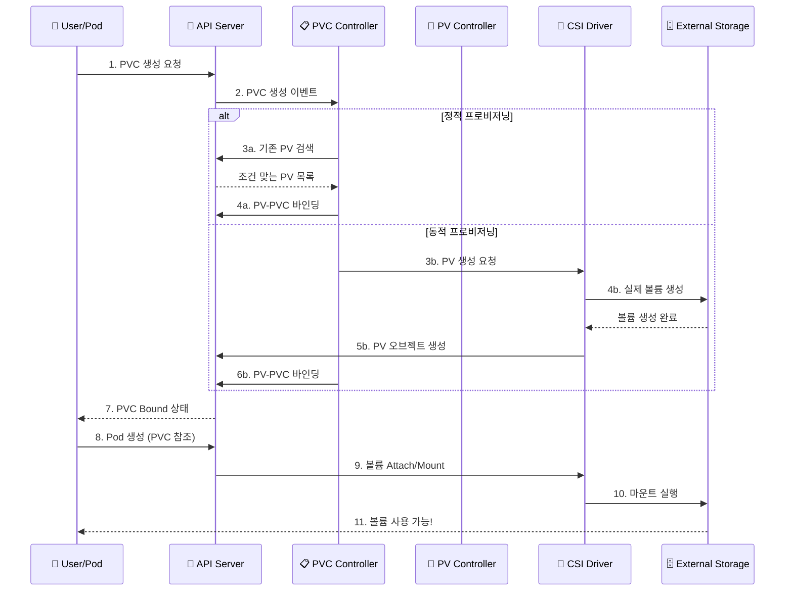


만약 조건을 만족하지 못 하면 어떻게 될까?
Pod 와 PVC 가 Pending 상태로 유지되며, 적합한 PV가 생길 때까지 무한정 대기한다.
만약 이런 상황이 발생한다면 PVC, PV 바인딩이 잘 되었는지 체크하여 원인을 해결해주어야 한다

```yaml
kubectl get pvc          # STATUS가 Bound인지 확인
kubectl get pv           # STATUS가 Bound, CLAIM 열에 PVC 이름 표시
kubectl describe pvc <pvc-이름>    # Volume: <pv-이름> 표시
kubectl describe pv <pv-이름>      # ClaimRef: namespace/pvc-이름 표시
```


## Storage Class

PV,PVC 를 사용한 볼륨 프로비저닝은 다음 두 가지 타입이 존재한다.

- **Static Volume Provisioning**
- **Dynamic Volume Provisioning**

Static Volume Provisioning 은 PV 를 명시하여 디스크를 확보해두는 것이다. 
이러한 프로비저닝의 단점은 사용할 크기만큼 미리 PV 를 선언해야한다는 것이다.
이를 보완하기 위해 Dynamic Volume Provisioning 이 등장하였다. 
여기서는 PV 를 선언하는 것 대신, Storage Class 를 사용하여 PV 를 생성, 동적으로 매핑한다.
그렇다면 Storage Class 란 무엇일까?
Storage Class 는 PV 를 추상화하여 다양한 속성을 가진 볼륨을 선택할 수 있게 해주는 클러스터 리소스이다.

```yaml
apiVersion: storage.k8s.io/v1
kind: StorageClass
metadata:
  name: fast
provisioner: kubernetes.io/gce-pd    # 프로비저너 지정
parameters:
  type: pd-ssd                        # 스토리지 유형 파라미터
reclaimPolicy: Delete                 # 회수 정책
volumeBindingMode: Immediate          # 바인딩 모드
allowVolumeExpansion: true            # 볼륨 확장 허용
```


이렇게 Storage Class 를 선언하고 나면 프로비저너가 알아서 PV 를 프로비저닝하여 동적으로 매핑해준다.
그렇다면 실제 처리과정은 어떻게 처리되는가 ? 아래 순서와 같이 처리된다.

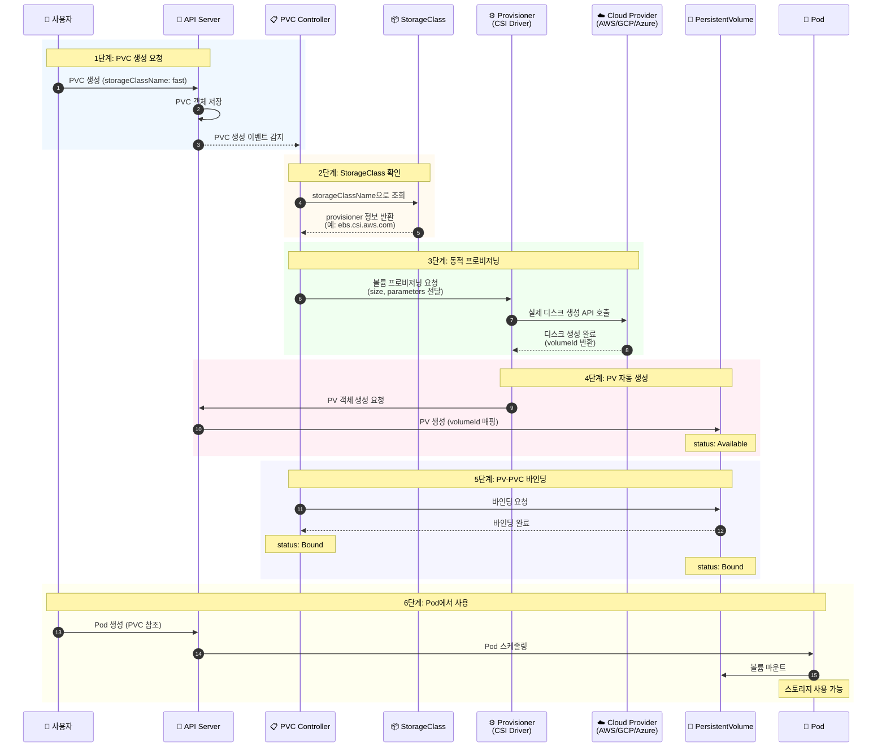

1. 1단계: PVC 생성 요청
2. 2단계: StorageClass 확인
3. 3단계: 동적 프로비저닝 (핵심 단계)
4. 4단계: PV 자동 생성
5. 5단계: PV-PVC 바인딩
6. 6단계: Pod에서 사용


# How ?

---

## Lab PV & PVC

```yaml
# k edit pod webapp

,,,
volumeMounts:
- mountPath: /log
  name : log-volume
,,,,
volumes:
- name: log-volume
	hostPath:
		path: /var/log/webapp
,,,

# k replace --force -f /tmp/kubectl-edit-${temp-hash}.yaml
```
```yaml
apiVersion: v1
kind: PersistentVolume
metadata:
  name: pv-log
spec:
  capacity:
    storage: 100Mi
  volumeMode: Filesystem
  accessModes:
    - ReadWriteMany
    # ReadWriteOnce는 단일 노드에서만 읽기/쓰기가 가능
    # ReadWriteMany는 여러 노드에서 동시에 읽기/쓰기가 가능
  persistentVolumeReclaimPolicy: Retain
	# Retain 은 PVC 삭제 후에도 PV의 데이터를 그대로 보존하여 수동 관리가 필요
	# Delete는 PVC 삭제 시 PV와 데이터를 모두 제거
	# Recycle 은 PVC 해제 시 PV의 내용을 초기화하여 재사용 가능
	# ⚠️ Recycle 은 Deprecated 되었고 공식문서는 dynamic provisioning 을 권장하고 있음 ⚠️
	hostPath:
		path: /pv/log
```
```yaml
kubectl get pvc          # STATUS가 Bound인지 확인
kubectl get pv           # STATUS가 Bound, CLAIM 열에 PVC 이름 표시
kubectl describe pvc <pvc-이름>    # Volume: <pv-이름> 표시
kubectl describe pv <pv-이름>      # ClaimRef: namespace/pvc-이름 표시

# ⚠️ AccessMode 가 mismatch 인 경우에도 pv,pvc bound 불가능이므로 주의 ⚠️
```

## Lab Storage Class

```yaml
apiVersion: v1
kind: PersistentVolumeClaim
metadata:
  name: local-pvc
spec:
  accessModes:
    - ReadWriteOnce
  volumeMode: Filesystem
  resources:
    requests:
      storage: 8Gi
  storageClassName: slow
  # ⚠️ pv 에 명시된 storageClassName 사용하거나 적합한 className 사용 ⚠️
  # standard : 클라우드 제공자(AWS EBS, GCP PD 등)의 기본 스토리지
  # fast: SSD 기반의 고성능 스토리지를 프로비저닝
	# slow: HDD 기반의 저가형 스토리지를 프로비저닝
	# NFS, Ceph, GlusterFS: 네트워크 기반의 공유 스토리지를 프로비저닝
```
```yaml
apiVersion: storage.k8s.io/v1
kind: StorageClass
metadata:
  name: low-latency
	# 보통 아래와 같이 처리한다고 한다.
	# standard : 일반적인 속도의 HDD 기반 스토리지
	# fast / premium-rwo : 고성능 SSD 기반 스토리지
	# low-latency : 지연 시간이 매우 낮은 초고속 스토리지 (NVMe 등)
	# slow / archive : 백업용이나 저속 저장소
	
provisioner: csi-driver.example-vendor.example
volumeBindingMode: WaitForFirstConsumer
# WaitForFirstConsumer : 이 PVC를 사용하는 Pod가 실제 생성될 때 비로소 PV 생성
# Immediate : PVC가 생성되는 즉시 PV를 생성하고 바인딩
# ⚠️ Immediate 는 노드 배치 전에 볼륨 생성을 하므로 
#		 Pod가 배치될 노드의 위치(Topology)를 고려하여 
#		 최적의 위치에 볼륨을 생성하는 WaitForFirstConsumer 사용을 권장 ⚠️
```
```yaml
apiVersion: v1
kind: Pod
metadata:
  name: nginx-pod
  labels:
    app: nginx
spec:
  containers:
    - name: nginx-container
      image: nginx:latest
      ports:
        - containerPort: 80
      volumeMounts:
	      - mountPath: "/var/www/html"
		      name: local-pvc-volume
  dnsPolicy: ClusterFirst
  restartPolicy: Always
  volumes:
	- name: local-pvc-volume
		persistentVolumeClaim:
				claimName: local-pvc
```

## +) [killer.sh](http://killer.sh/) and more,,,

```yaml

```


# Reference

---

[https://velog.io/@hoonki/%EC%BF%A0%EB%B2%84%EB%84%A4%ED%8B%B0%EC%8A%A4k8s-Persistent-Storage%EB%9E%80](https://velog.io/@hoonki/%EC%BF%A0%EB%B2%84%EB%84%A4%ED%8B%B0%EC%8A%A4k8s-Persistent-Storage%EB%9E%80)
[https://kubernetes.io/docs/concepts/storage/storage-classes/](https://kubernetes.io/docs/concepts/storage/storage-classes/)
[https://kubernetes.io/docs/concepts/storage/dynamic-provisioning/](https://kubernetes.io/docs/concepts/storage/dynamic-provisioning/)

## 4주차 : 섹션 9 Networking

# Why ? 

---


# What ? 

---

## Cluster Ports


Master node (Control plane)

| Protocol | Direction | Port Range | Purpose | Used By |
| --- | --- | --- | --- | --- |
| TCP | Inbound | 6443 | Kubernetes API server | All |
| TCP | Inbound | 2379-2380 | etcd server client API | kube-apiserver, etcd |
| TCP | Inbound | 10250 | Kubelet API | Self, Control plane |
| TCP | Inbound | 10259 | kube-scheduler | Self |
| TCP | Inbound | 10257 | kube-controller-manager | Self |


Worker node

| Protocol | Direction | Port Range | Purpose | Used By |
| --- | --- | --- | --- | --- |
| TCP | Inbound | 10250 | Kubelet API | Self, Control plane |
| TCP | Inbound | 10256 | kube-proxy | Self, Load balancers |
| TCP | Inbound | 30000-32767 | NodePort Services† | All |
| UDP | Inbound | 30000-32767 | NodePort Services† | All |


## Pod Networking

CNI 구현체가 네임스페이스에 해당하는 브릿지 네트워크를 자동으로 연결하여 파드와 클러스터 간 통신을 구축함
이 통신 구축 시 처리 순서는 다음과 같이 처리된다.

1. 설정 정보 로드 (`-cni-conf-dir=/etc/cni/net.d`)
2. 실행 파일 탐색 (`-cni-bin-dir=/etc/cni/bin`)
3. CNI 플러그인 호출 및 실행 (`ADD` 명령)
4. 인터페이스 및 브릿지 연결 (가장 중요한 단계)


## 네트워크 진단 명령어

### 노드 네트워크

노드 자체의 네트워크 설정이나 클러스터 인프라 문제를 진단

- **실행 위치:** Master 노드 또는 Worker 노드의 터미널
- **주요 확인 사항:**

### 파드 내부 

특정 앱(Pod)이 다른 앱과 통신이 안 될 때, 파드 내부의 시점에서 네트워크 확인

- **실행 방법:** `kubectl exec -it <파드명> -- /bin/bash` (또는 `sh`)로 접속 후 실행
- **주요 확인 사항:**


## Why CNI ?

CNI 솔루션을 사용하지 않는다면, 파드 간 통신을 가능하게 하기 위해서는 
네트워크 주소와 게이트웨이 주소 간의 매핑 관계를 `routing table`로 일일이 정의해야 한다. 
만약 노드와 파드가 몇 개 되지 않는다면 수동으로 설정하는 것이 가능하겠지만, 
실제 운영 환경에서는 수천 수만개의 노드와 파드에 대한 수동 설정을 해야하고 휴먼에러가 발생할 수 있다.
이를 해결하기 위해 CNI 플러그인들이 도입되었다.


## Why 3rd CNI ?

기본제공 CNI 플러그인으로 kubenet이 존재하는데, 다양한 서드파티 CNI 플러그인들을 사용하는 이유는 무엇일까?
서드파티 CNI들이 제공하는 다양한 기능들(Network Policy, Public 클라우드와의 통합, 대규모 트래픽에 대한 안정성 등)이 이유일 수도 있지만, 무엇보다 기본제공되는 kubenet의 기능이 너무 부족하기 때문이다. 
kubenet은 그 자체로는 컨테이너간의 노드간 교차 네트워킹조자 지원하지 않는다.


## CNI 네트워크 모델

CNI 플러그인들은 크게 두 가지 형식의 네트워크 모델을 사용한다.

- 오버레이 네트워크 모델
- 비-오버레이 네트워크 모델

### 오버레이 네트워크란 ?


오버레이 네트워크는 3계층을 넘어서 구축된 네트워크 간에 있는 엔드포인트의 노드간의 통신이 일어날때 
패킷을 한겹 캡슐화 하여 통신시켜서, 2계층에서(같은 LAN에서) 통신이 일어나는 것처럼 통신할 수 있도록 하는 기술이다.
처리과정은 아래와 같다.

1. **Encapsulation(캡슐화)**: 파드(Pod)에서 생성된 원본 패킷(Inner Packet)을 외부 노드 간 통신을 위한 패킷(Outer Packet)의 페이로드로 집어넣는다.
2. **VTEP (Virtual Tunnel Endpoint)**: 각 노드에 위치한 가상 인터페이스이다. 캡슐화를 수행하고 해제하는 터널 역할을 수행한다.
3. **Tunneling (터널링)**: 캡슐화된 패킷이 물리 네트워크(Underlay)를 통과할 때, 중간의 라우터들은 내부 패킷이 무엇인지 모른 채 외부 헤더만 보고 목적지 노드(VTEP)까지 배달한다.
4. **Decapsulation (역캡슐화)**: 목적지 노드의 VTEP가 외부 헤더를 벗겨내고 원본 패킷을 추출하여 최종 목적지 파드에 전달한다.

오버레이 네트워크에는 두 가지 프로토콜이 사용되는데 vxlan 와 IP-in-IP 프로토콜이 사용된다.

- VXLAN (Virtual Extensible LAN)
- IP-in-IP (IPIP)

### BGP


`BPG` 기반의 오버레이는 통신이 발생하는 노드간에 bgp 프로토콜을 사용하는 소프트웨어 라우터의 구현을 통해
최적의 경로 정보를 동적으로 감지하여 적용한다.
BGP 는 별도의 패킷 가상화 없이 기존에 네트워크에서 사용하던 직관적인 라우팅 방식을 이용한다.
따라서 클러스터 외부에서도 Ingress나 Service의 도움 없이 POD에 접근 할 수 있게 되고, 
통일화 된 보안 설정 관리 및 디버깅/로깅이 용이하다.
**또한 패킷 가상화 및 별도의 터널링이 없어 오버레이 네트워크에 비해 성능이 좋다**
다만 BGP 기반 CNI 구성 시 k8s 클러스터 설정을 위해 아래와 같은 번거로움이 존재한다.

- **물리 설정의 필요성**: HA(고가용성)를 위해 노드 간 서브넷이 다르게 구성된 경우, 상위의 물리 라우터에도 BGP 관련 별도 설정 해주어야 함
- **대역 관리의 복잡성**: 여러 클러스터를 활용하거나 외부 서비스를 함께 운영할 경우, 전체 네트워크 대역이 겹치지 않도록 관리가 필요
- **클라우드 구성의 어려움**: 사용자가 상단 라우터 설정을 임의로 수정하기 어려운 퍼블릭 클라우드 환경에서는 구성이 자유롭지 못하다

| **구분** | **오버레이 (VXLAN/IPIP)** | **BGP (Native L3)** |
| --- | --- | --- |
| **방식** | 패킷을 캡슐 안에 넣어서 전송 (터널링) | 실제 경로 정보를 공유하여 직접 전송 (라우팅) |
| **성능** | 캡슐화/해제 과정에서 CPU 소모 발생 | **네이티브 성능** (오버헤드 거의 없음) |
| **복잡도** | 설치가 쉽고 어디서나 잘 작동함 | 상단 물리 장비 설정이 필요할 수 있어 복잡함 |
| **외부 접근** | 인그레스/서비스 없이는 파드 직접 접근 불가 | **외부에서도 파드 IP로 직접 통신 가능** |


## CNI in Kubernetes

- **CNI 플러그인은 파드의 생명주기를 관리하는 CRI 가 호출한다.**
- CNI 설정 시에는 아래 두 디렉토리를 통해 설정을 관리한다


### 전체 동작 프로세스

1. **파드 생성 요청**: 사용자가 `kubectl run` 등을 통해 파드를 생성하면 런타임(`containerd` 등)이 감지합니다.
2. **설정 파일 읽기**: 런타임이 `/etc/cni/net.d/`에서 알파벳 순서로 가장 빠른 설정 파일(예: `10-bridge.conf`)을 읽습니다.
3. **플러그인 실행**: 설정 파일의 `"type": "bridge"`를 보고 `/opt/cni/bin/bridge` 실행 파일을 호출합니다.
4. **네트워크 구축**: `./bridge add <container_id> <namespace_path>` 명령을 통해 파드 내부에 `eth0`를 만들고 호스트의 `cni0` 브릿지에 연결합니다.


## CNI Weave

**Weave CNI**는 **CNI(Container Network Interface) 컴포넌트 중 하나**이며, 
쿠버네티스 클러스터 내 파드(Pod) 간의 네트워크 통신을 구현 솔루션이다.
Wave 는 각 노드에 Weave 에이전트가 데몬셋(DaemonSet) 형태로 배포되어, 파드들을 위한 네트워크를 형성하고 관리한다.

> 📖 Cillium vs Weave vs Calico


## IPAM Weave


CNI 는 IP 할당을 자동으로 처리
그렇다면 어떻게 이를 처리할까?
라우팅 테이블을 만들어 스크립트로 관리하는 방법이 있지만 이렇게 구성하면 방대해지고 복잡해진다.
대신 CNI 에서는 IP 주소 관리(IP Address Management, IPAM) 를 사용하여 이를 처리한다.
IPAM 은 네트워크의 IP 주소 할당, 트랙킹 및 관리를 체계적으로 수행하는 프로세스로 
k8s 에서 사용하는 플러그인은 다음 두 가지이다.

- **host-local**
- **dhcp**


## Service Networking (미완료)

Kubernetes 환경에서는 문제가 발생했을 때 Node나 Pod을 쉽게 교체할 수 있는데, 
이에 따라 외부 사용자 또는 내부 Pod들간의 통신에서 Pod의 IP를 이용해 통신할 경우 
Pod이나 Node가 교체되면 동일한 Pod에 접근할 수 없게 된다.
이를 해소하기 위해 Service 를 사용하여 Pod 에 접근한다.
Service 란 어떤 Pod에 접근하기 위해 추상화된 클러스터 리소스로, 각 포드로 traffic 을 포워딩해준는 프록시 역할을 수행한다.

> ⚠️ service, kube-apiserver, kube-proxy 상관관계

[https://coffeewhale.com/k8s/network/2019/05/11/k8s-network-02/](https://coffeewhale.com/k8s/network/2019/05/11/k8s-network-02/)


## DNS in Kubernetes

그렇다면 k8s 에서 각 pod, service 등은 어떻게 domain 을 이용해 연결할 수 있도록 관리될까?
k8s 에서는 클러스터를 설정할 때 기본 탑재된 DNS 서버를 배포하는데 이를 활용하여 서비스에 대한 DNS 를 할당한다.
KubeDNS, CoreDNS 를 사용하여 Service 에 대해 namespace, resource type, Root cluster 를 기준으로 DNS 를 할당한다.
FQDN(Fully Qualified Domain Name) 을 채택하여 다음과 같은 구조로 할당된다.
web-service.apps.svc.clustr.local

- **web-service**: 서비스의 이름
- **apps**: 서비스가 속한 Namespace
- **svc**: 리소스 타입 (Service)
- **cluster.local**: 클러스터의 기본 도메인 영역 (설정에 따라 변경 가능)

> ⚠️ Service 에 대해서만 DNS 가 적용되며 Pod 에 대해서는 IP 로 관리한다


## CoreDNS in Kubernetes

/etc/hosts 에 모든 DNS 를 정의하여 저장할 수 있지만 클러스터 구조에서는 해당 방법을 사용할 수 없다
대신 k8s 에서는 별도의 DNS 서버 컴포넌트를 두는데 이것이 바로 CoreDNS 이다.
CoreDNS는 클러스터 내부의 설정을 하드코딩하지 않고, k8s 의 ConfigMap 을 통해 동적으로 관리한다.

- `kube-system` 네임스페이스에 `coredns`라는 이름의 ConfigMap이 존재합니다. 사용자가 이 설정을 바꾸면 CoreDNS Pod가 이를 감지하고 적용합니다.
- CoreDNS 컨테이너가 실행될 때, 위 ConfigMap의 내용이 컨테이너 내부의 `/etc/coredns/Corefile` 경로로 마운트(Mount)됩니다. 이것이 CoreDNS의 **메인 설정 파일**입니다.

모든 Pod는 생성될 때 내부적으로 `/etc/resolv.conf` 파일을 가집니다. 
service 는 /etc/resolv.conf 에 search path 로 제공되어지므로 full path 가 아니더라도 조회가 가능하다.
다만 pod 는 search path 로 제공되지 않으므로 전체 도메인 주소를 모두 적어야한다.

```yaml
# Pod 내부의 /etc/resolv.conf 예시
# curl web-service ✅
# curl web-service.default ✅
# curl pod-name ❌ 
nameserver 10.96.0.10
search default.svc.cluster.local svc.cluster.local cluster.local
options ndots:5
```

> ⚠️ CoreDNS vs KubeDNS


## Ingress(미완료)

Ingress 는 외부(인터넷)에서 K8s 클러스터 안의 서비스로 들어오는 [**HTTP/HTTPS 요청을 관리하는 입구**](https://kubernetes.io/ko/docs/concepts/services-networking/ingress/?ref=techblog.ahnlabcloudmate.com#%EC%9D%B8%EA%B7%B8%EB%A0%88%EC%8A%A4%EB%9E%80)입니다.

- 파드를 도메인을 통해 접속할 수 있도록 가상 호스팅 기능 제공
- ingress controller를 통해 관리됨
- L7 기능을 제공하기에, 로드밸런싱 기능도 가능

**Ingress Controller**
Ingress는 규칙만 적어놓은 안내표이고, 실제로 이 규칙을 따라 트래픽을 전달하는 역할을 하는 게 바로 **Ingress Controller**입니다.
**트래픽 처리 흐름**

1. Client가 hello.world.com 도메인으로 https 요청 전달
2. ingress controller는 ingress 규칙을 참조
3. 규칙에 의해, 도메인이 "hello.world.com", 경로가 "/" 이면, 해당 요청을 "hello service"로 전달함
4. hello service는 해당 요청을 처리할 수 있는 Pod로 트래픽을 전달

Pod가 요청을 처리한 후, 다시 역순으로 응답 전달


> ⚠️ 어노테이션 ?? 어노테이션 지옥 ??


[https://coffeewhale.com/k8s/network/2019/05/30/k8s-network-03/](https://coffeewhale.com/k8s/network/2019/05/30/k8s-network-03/)


## Gateway API (미완료)

### Ingress 의 제한점


- 단일 리소스의 한계
- 어노테이션 지옥
- Support 제약
- 구현체의 Policy 를 k8s 클러스터가 알 수 없음


### Gateway API : Ingress 를 계층으로 분리


이를 해소하기 위해 Gateway API 가 도입되었다
Gateway API 는 Ingress 단일 리소스를 세 개의 계층으로 분리하여 관리 권한을 나눈다
이 구조 덕분에 개발자는 도메인이나 인프라 설정에 신경 쓰지 않고, 자신이 담당한 서비스의 라우팅 규칙(`HTTPRoute`)만 독립된 네임스페이스에서 관리할 수 있게 된다

| **계층 (Resource)** | **담당자 (Persona)** | **주요 역할** |
| --- | --- | --- |
| **GatewayClass** | Infrastructure Provider | 어떤 컨트롤러(AWS, Nginx, Istio 등)를 사용할지 정의 |
| **Gateway** | Cluster Operator | 인프라 구성, 포트(80, 443) 설정, 인증서(TLS) 관리 |
| **HTTPRoute** | Application Developer | 실제 서비스 경로 설정, 트래픽 가중치(Weight) 조절 |


1. GatewayClass
2. Gateway
3. HttpRoute


> ⚠️ Pod Affinity vs Node Affinity ??
> ⚠️ Service Mesh :: Istio vs Cillium ??


# How ?

---

## Lab CNI

```bash
# container runtime 확인
ps -aux | grep -i kubelet | grep container-runtime

# CNI plugin binary 확인
ls /opt/cni/bin

# CNI plugin config file 확인
ls /etc/cni/net.d
```

## Lab Networking CNIs

```bash
# CNI 설치 여부 확인
ls -la /etc/cni/net.d/
cat /etc/cni/net.d/*.conf
cat /etc/cni/net.d/*.conflist
kubectl get daemonset -A # CNI는 보통 DaemonSet으로 배포됨

# kube-flannel 네임스페이스 존재 여부 확인
kubectl get namespace | grep flannel

# CNI 제거
# kube-flannel 네임스페이스 삭제 & ClusterRole, ClusterRoleBinding 삭제
kubectl delete namespace kube-flannel
kubectl delete clusterrole flannel
kubectl delete clusterrolebinding flannel

# 삭제 확인
kubectl get all -A | grep flannel
kubectl get configmap -A | grep flannel
kubectl get namespace | grep flannel
```

## Lab Service Networking

```bash
# 현재 iptable 확인
ip addr

# 모든 리소스 확인
k get all --all-namespaces

# 파드에 할당된 ip address range 확인
# 아래 명령어를 통해 로그 상에서 ipalloc-range 를 확인
k logs ${cni-pod-name} -n ${name-space}
# 혹은 해당 명령어를 통해 노드에게 할당된 파드용 IP 대역 확인
kubectl get node <노드이름> -o jsonpath='{.spec.podCIDR}'

# cluster 의 services 의 ip range 확인
# 서비스 IP를 할당하고 관리하는 주체인 kube-apiserver 를 확인
cat /etc/kubernetes/manifests/kube-apiserver.yaml \
	| grep -C 5 "--service-cluster-ip-range"
```

## Lab CoreDNS in k8s

```yaml

```

## Lab CKA Ingress Networking

```yaml

```

## Lab Gateway API

```yaml

```

## +) [killer.sh](http://killer.sh/) and more,,,

1. 네트워크 솔루션을 어떻게 확인하는가? 
2. 현재 할당된 네트워크 정책을 확인하고 파드에 적용된 네트워크 정책을 확인하려면 ?
3. 얼마나 많은 `agennts/peers`가 있는가?
4. `node01`의 pod schedule의 default gateway의 ip는? 


# Reference

---

> CNI/오버레이

[https://zerojsh00.github.io/posts/CNI-Weave/](https://zerojsh00.github.io/posts/CNI-Weave/)
[https://kubernetes.io/docs/tasks/administer-cluster/network-policy-provider/weave-network-policy/](https://kubernetes.io/docs/tasks/administer-cluster/network-policy-provider/weave-network-policy/)
[https://ykarma1996.tistory.com/179](https://ykarma1996.tistory.com/179)
[https://kimalarm.tistory.com/95](https://kimalarm.tistory.com/95)

## 5주차 : 섹션 10,11,12 클러스터 아키텍처, kubeadm, helm

# Why ? 

---


# What ? 

---


# Reference

---

## 6주차 : 섹션13,14 Kustomize, Troubleshooting

# Why ? 

---


# What ? 

---


# Reference

---

## 7주차 : Mock Exams

# Why ? 

---


# What ? 

---

## bashrc, vimrc

.bashrc

```bash
alias k='kubectl'
source <(k completion bash)
complete -F __start_kubectl k

```

.vimrc

```bash
set et
set ts=2
set sw=2
set nu
```


## k8s 서비스에 대한 확인

```shell
# 서비스에 대한 엔드포인트 확인
controlplane ~ ➜  k get endpoints hr-web-app-service 
Warning: v1 Endpoints is deprecated in v1.33+; use discovery.k8s.io/v1 EndpointSlice
NAME                 ENDPOINTS                           AGE
hr-web-app-service   172.17.0.11:8080,172.17.0.12:8080   9s

# 서비스에 매핑한 라벨을 가지고 있는 파드들을 조회
# 위에서 확인한 ip 와 일치하는지 확인
controlplane ~ ➜  k get pods -l app=hr-web-app -o wide
NAME                          READY   STATUS    RESTARTS   AGE   IP            NODE           NOMINATED NODE   READINESS GATES
hr-web-app-7cd748cf58-7jtrg   1/1     Running   0          12m   172.17.0.12   controlplane   <none>           <none>
hr-web-app-7cd748cf58-v5dw8   1/1     Running   0          12m   172.17.0.11   controlplane   <none>           <none>

```


## k8s manifest 수정 이후 강제 재생성

```shell
# orange 파드에 대한 YAML 추출
kubectl get pod orange -o yaml > orange.yaml

# 수정 이후 강제 교체
kubectl replace --force -f orange.yaml
```


## 오브젝트 생성 oneline command

[https://hushtang.tistory.com/94](https://hushtang.tistory.com/94)

> 💡 k run vs k create

```shell
kubectl run mc-pod --image=nginx:1-alpine --dry-run=client -o yaml > mc-pod.yaml
```
```shell
kubectl create deploy my-ds --image=nginx --dry-run=client -o yaml > my-ds.yaml
```
```shell
# service 는 서비스 타입과 tcp port 를 꼭 지정해줘야 한다
# 다만 서비스타입은 소문자로 해줘야한다
# ClusterIp(X) clusterip(O)
kubectl create service clusterip messaging-service --tcp=80:80 --dry-run=client -o yaml > messaging-service.yaml
```


## Mock Exam 1


# URL

[https://uklabs.kodekloud.com/topic/mock-exam-1-4/](https://uklabs.kodekloud.com/topic/mock-exam-1-4/)


# 1번문제 ✅📓

Create a Pod mc-pod in the mc-namespace namespace with three containers. The first container should be named mc-pod-1, run the nginx:1-alpine image, and set an environment variable NODE_NAME to the node name. The second container should be named mc-pod-2, run the busybox:1 image, and continuously log the output of the date command to the file /var/log/shared/date.log every second. The third container should have the name mc-pod-3, run the image busybox:1, and print the contents of the date.log file generated by the second container to stdout. Use a shared, non-persistent volume.

- env 주입, 그리고 downward api — `valueFrom.fieldRef.fieldPath`
- volume 과 voulme mounts 처리
- bash script 를 처리하도록 하는 방법 +) while loop & date
- 파일 속 내용을 출력하는 방법 +) echo vs tail

<details>
<summary>정답</summary>

```go
apiVersion: v1
kind: Pod
metadata:
  labels:
    run: mc-pod
  name: mc-pod
  namespace: mc-namespace
spec:
  volumes:
  - name: shared-log
    emptyDir: {}
  containers:
  - image: nginx:1-alpine
    name: mc-pod
    resources: {}
    env:
    - name: NODE_NAME
      valueFrom:
        fieldRef:
          fieldPath: spec.nodeName
  - image: busybox:1
    name: mc-pod-2
    command: ["/bin/sh"]
    args: ["-c", "while true; do date >> /var/log/shared/date.log; sleep 1; done"]
    volumeMounts:
    - name: shared-log
      mountPath: /var/log/shared
  - image: busybox:1
    name: mc-pod-3
    command: ["/bin/sh"]
    args: ["-c", "tail -f /var/log/shared/date.log"]
    volumeMounts:
    - name: shared-log
      mountPath: /var/log/shared
  dnsPolicy: ClusterFirst
```
```go
# Pod 생성
kubectl apply -f mc-pod.yaml

# 로그 출력 확인
kubectl logs mc-pod -c mc-pod-3 -n mc-namespace

# 환경변수 확인
kubectl exec mc-pod -c mc-pod -n mc-namespace -- printenv NODE_NAME
```
</details>

## env 주입 방법

> 💡 TL;DR;
> 💡 ConfigMap vs Secret
> 💡 환경변수 주입 대신 볼륨 마운트 방식을 권장하는 이유

직접 정의 [https://kubernetes.io/docs/tasks/inject-data-application/define-environment-variable-container/](https://kubernetes.io/docs/tasks/inject-data-application/define-environment-variable-container/)

```go
apiVersion: v1
kind: Pod
metadata:
  name: envar-demo
  labels:
    purpose: demonstrate-envars
spec:
  containers:
  - name: envar-demo-container
    image: gcr.io/google-samples/hello-app:2.0
**    env:
    - name: DEMO_GREETING
      value: "Hello from the environment"
    - name: DEMO_FAREWELL
      value: "Such a sweet sorrow"**
```

ConfigMap 사용 [https://kubernetes.io/docs/tasks/configure-pod-container/configure-pod-configmap/#define-container-environment-variables-using-configmap-data](https://kubernetes.io/docs/tasks/configure-pod-container/configure-pod-configmap/#define-container-environment-variables-using-configmap-data)

```go
# ConfigMap 생성
apiVersion: v1
kind: ConfigMap
metadata:
  name: app-config
data:
  DB_HOST: "mysql.example.com"
  API_KEY: "static-key"

---
# Pod에서 참조
spec:
  containers:
  - name: app
    image: myapp
**    envFrom:
    - configMapRef:
        name: app-config  # 모든 키 주입**

```

Secret 사용 [https://kubernetes.io/docs/tasks/inject-data-application/distribute-credentials-secure/#define-a-container-environment-variable-with-data-from-a-single-secret](https://kubernetes.io/docs/tasks/inject-data-application/distribute-credentials-secure/#define-a-container-environment-variable-with-data-from-a-single-secret)

1. 환경변수 주입
2. 볼륨 마운트
3. 명령행 인자

Downward API 사용 :: fieldRef 사용
[https://kubernetes.io/docs/concepts/workloads/pods/downward-api/#downwardapi-fieldRef](https://kubernetes.io/docs/concepts/workloads/pods/downward-api/#downwardapi-fieldRef)
[https://kubernetes.io/docs/tasks/inject-data-application/environment-variable-expose-pod-information/](https://kubernetes.io/docs/tasks/inject-data-application/environment-variable-expose-pod-information/)
[https://kubernetes.io/docs/tasks/inject-data-application/downward-api-volume-expose-pod-information/](https://kubernetes.io/docs/tasks/inject-data-application/downward-api-volume-expose-pod-information/)

```go
spec:
  containers:
  - name: app
    env:
    - name: MY_POD_NAME
      valueFrom:
        fieldRef:
          fieldPath: metadata.name
    - name: MY_POD_IP
      valueFrom:
        fieldRef:
          fieldPath: status.podIP
    - name: MY_NAMESPACE
      valueFrom:
        fieldRef:
          fieldPath: metadata.namespace

```

Downward API 사용 :: resourceFieldRef 사용
[https://kubernetes.io/docs/concepts/workloads/pods/downward-api/#downwardapi-resourceFieldRef](https://kubernetes.io/docs/concepts/workloads/pods/downward-api/#downwardapi-resourceFieldRef)
[https://kubernetes.io/docs/tasks/inject-data-application/environment-variable-expose-pod-information/](https://kubernetes.io/docs/tasks/inject-data-application/environment-variable-expose-pod-information/)
[https://kubernetes.io/docs/tasks/inject-data-application/downward-api-volume-expose-pod-information/](https://kubernetes.io/docs/tasks/inject-data-application/downward-api-volume-expose-pod-information/)

```go
spec:
  containers:
  - name: app
    resources:
      requests:
        cpu: "100m"
        memory: "128Mi"
    env:
    - name: MY_CPU_REQUEST
      valueFrom:
        resourceFieldRef:
          resource: requests.cpu
    - name: MY_MEM_LIMIT
      valueFrom:
        resourceFieldRef:
          resource: limits.memory
          divisor: 1Mi

```

> 💡 Downward API 란 무엇이고 fieldRef 와 resourceFieldRef 는 무슨 차이인가 ?

Init Container 사용

```go
spec:
	# initContainers 를 우선 실행하여
	# /env 경로에 환경변수를 저장한다.
  initContainers:
  - name: env-init
    image: busybox
    command: ['sh', '-c']
    args:
    - |
			echo "DB_URL=jdbc:mysql://localhost:3306" > /env/my-env-file
      echo "API_KEY=12345" >> /env/my-env-file
    volumeMounts:
    - name: env-volume
      mountPath: /env
  # 이후 깨어나는 실제 앱 컨테이너는 
	# 환경변수가 쓰여진 /env/my-env-file 을 불러와
	# 환경변수 주입 이후 앱을 실행한다.
  containers:
  - name: app
	  image: my-app-image
	  command: ["sh", "-c"]
    args: 
    - |
      . /env/my-env-file && ./run-my-app
    volumeMounts:
    - name: env-volume
      mountPath: /env
  volumes:
  - name: env-volume
    emptyDir: {}

```


## Downward API

[https://kubernetes.io/docs/concepts/workloads/pods/downward-api/](https://kubernetes.io/docs/concepts/workloads/pods/downward-api/)
[https://kubernetes.io/docs/tasks/inject-data-application/environment-variable-expose-pod-information/](https://kubernetes.io/docs/tasks/inject-data-application/environment-variable-expose-pod-information/)
[https://kubernetes.io/docs/tasks/inject-data-application/downward-api-volume-expose-pod-information/](https://kubernetes.io/docs/tasks/inject-data-application/downward-api-volume-expose-pod-information/)


# 2번 문제 ✅📓

This question needs to be solved on node `node01`. To access the node using SSH, use the credentials below:

```
username: bob
password: caleston123
```

As an administrator, you need to prepare `node01` to install kubernetes. One of the steps is installing a container runtime. Install the `cri-docker_0.3.16.3-0.debian.deb` package located in `/root` and ensure that the `cri-docker` service is running and enabled to start on boot.

- cri(containerd, cri-docker) 설치 및 systemd service 등록

<details>
<summary>정답</summary>

```go
ssh bob@node01
# 비번 입력 caleston123
sudo apt update && sudo apt install /root/cri-docker_0.3.16.3-0.debian.deb
sudo systemctl status cri-docker
sudo systemctl enable cri-docker --now
sudo systemctl status cri-docker
```
</details>


# 3번 문제 ✅📓

On `controlplane` node, identify all CRDs related to VerticalPodAutoscaler and save their names into the file `/root/vpa-crds.txt`.

- k8s CRD

<details>
<summary>정답</summary>

```shell
kubectl get crd | grep -i verticalpodautoscaler | awk '{print $1}' > /root/vpa-crds.txt
```
</details>

## CRD 란 ?

Kubernetes API 는 본래 API Object 로 선언된 resource 들만 알고 있다
Deployment, Pod, Service 등등과 같이 말이다.
여기서 **사용자가 직접 정의하여 추가한 유형이 Custom Resource 이다.**
해당 리소스는 여타 k8s 리소스와 같이 클러스터 수준의 리소스로, 특정 네임스페이스에 속하지 않는다
만약 Custom Resource 를 추가하려고 한다면 Custom Resource Definition 라는 선언문을 통해  
선언할 수 있다.
이렇게 사용자가 유형을 추가하면 아래와 같은 기능을 수행할 수 있다.

- CRD를 등록하면 Kubernetes API 서버가 해당 커스텀 객체를 인식하고, 이를 **저장, 조회, 삭제**
- Custom Controller 와 함께 사용하여 특정 커스텀 객체가 생성될 때 필요한 하위 리소스(Pod, Deployment 등)를 자동으로 구성하는 자동화 역할을 수행

예시로 istio 와 같은 서비스 매시가 직접 CR/CRD 를 선언해서 처리하는 형태이다.

CRD 매니페스트에 반드시 정의해야 하는 필수 필드들은 다음과 같다.
[https://kubernetes.io/docs/tasks/extend-kubernetes/custom-resources/custom-resource-definitions/](https://kubernetes.io/docs/tasks/extend-kubernetes/custom-resources/custom-resource-definitions/)

1. **기본 필드 (Root Fields)**
2. **사양 필드 (spec)**

> 💡 Custom Controller 란 ??

## CRD 적용 및 확인방법 ?

1. CRD 매니페스트 작성
2. `kubectl create -f <crd-파일>.yaml` 명령을 통해 Kubernetes 클러스터에 새로운 리소스 유형을 등록
3. CRD가 등록된 후, 정의된 `kind`와 `apiVersion`을 사용하여 실제 리소스 인스턴스를 작성
4. `kubectl get <리소스 복수형 이름>` 명령을 사용하여 생성된 커스텀 객체들의 목록을 확인
5. `kubectl describe <리소스 종류> <이름>` 명령으로 해당 객체의 상태와 설정값 확인
6. `kubectl get <리소스 종류> <이름> -o yaml`을 사용하면 API 서버가 관리 중인 전체 JSON/YAML 정의를 확인

## 명령어 비교 : awk vs cat vs tail

- **`cat file.txt`**: 파일 전체를 한눈에 볼 때 씁니다. 파일 여러 개를 하나로 합칠 때도 유용합니다.
- **`tail -f access.log`**: 실시간으로 추가되는 로그를 모니터링할 때 필수입니다. (`f` 옵션)
- **`awk '{print $1}' data.txt`**: 텍스트 파일의 **첫 번째 열**만 뽑아내는 등 프로그래밍적인 처리가 가능합니다.

## >와 >>의 차이점

### `>` (Overwrite: 덮어쓰기)

- 파일이 이미 존재한다면, **기존 내용을 싹 지우고** 새 내용을 씁니다.
- 파일이 없다면 새로 생성합니다.
- *예: **`echo "Hello" > test.txt`** (기존 내용 삭제됨)*

### `>>` (Append: 추가하기)

- 파일이 이미 존재한다면, **기존 내용 끝에** 새 내용을 덧붙입니다.
- 파일이 없다면 새로 생성합니다.
- *예: **`echo "World" >> test.txt`** (기존 내용 뒤에 추가됨)*


# 4번 문제 ✅📓

Create a service named `messaging-service` to expose the `messaging` **pod** within the cluster on port `6379`. The `messaging` pod is running in the `default` namespace.
Use imperative commands.

- service 생성 및 pod 할당

<details>
<summary>정답</summary>

```shell
# 파드 조회
kubectl get pod ${pod명} --show-labels
NAME        READY   STATUS    RESTARTS   AGE     LABELS
messaging   1/1     Running   0          4m55s   tier=msg

# 조회결과로 나온 라벨과 똑같이 함
apiVersion: v1 
kind: Service 
metadata: 
  labels: 
    app: messaging-service 
  name: messaging-service 
spec: 
  ports: 
  - name: 6379-6379 
    port: 6379 
    protocol: TCP 
    targetPort: 6379 
  selector: 
    tier: msg 
  type: ClusterIP 
status: 
  loadBalancer: {} 
  
# 서비스에 대한 엔드포인트 확인
k get endpoints messaging-service

# 서비스에 매핑한 라벨을 가지고 있는 파드들을 조회
# 위에서 확인한 ip 와 일치하는지 확인
k get pods  --show-labels -l tier=msg -n default -o wide
```
</details>

## 서비스란 ?

Kubernetes 에서는 서버의 정확한 IP 주소나 호스트명을 지정하여
각 클라이언트 애플리케이션을 구성하는 방식은 Kubernetes에서는 작동하지 않는다.
다음과 같은 특징 때문이다.

- 포드는 일시적입니다(Pod is ephemeral)
- Kubernetes는 포드가 노드에 스케줄링된 후, 시작되기 전에 IP 주소를 할당합니다. 
- 수평 확장(Horizontal scaling) 은 여러 Pod 가 동일한 서비스를 제공할 수 있음을 의미합니다. 

이러한 문제를 해결하기 위해 쿠버네티스는 Reverse Proxy 역할의 컴포넌트인 서비스(Service) 제공한다.


> 💡 Service API vs Ingress/Gateway API

## 서비스는 실제로 어떻게 동작하는가? 

> 💡 마스터노드/워커노드의 컴포넌트 구성도 및 처리관계
> 💡 멀티 마스터 / 멀티 워커 원리


| **구분** | **Append Only Log (AOL)** | **Delta Log** | **BadgerDB (LSM/WiscKey)** |
| --- | --- | --- | --- |
| **주요 용도** | 단순 DB 복구, 캐시 영속화 | 데이터 레이크, 데이터 버전 관리 | 고성능 키-값 저장소, 블록체인 |
| **쓰기 방식** | 단순 추가 (무조건 뒤에 붙임) | 변경분 기록 (버전 관리 중심) | 메모리 버퍼링 후 정렬된 병합 |
| **읽기 성능** | 보통 (전체 로그 스캔 필요 시 느림) | 낮음 (병합 연산 필요) | 높음 (인덱싱 및 블메필터 활용) |
| **쓰기 효율** | 매우 높음 (순차 쓰기) | 높음 (차이점만 기록) | 매우 높음 (Key-Value 분리 저장) |
| **대표 사례** | Redis AOF, Kafka | Delta Lake, Apache Iceberg | Dgraph, 블록체인 노드 데이터베이스 |


************************************************************************
************ 리눅스 커널 수준의 작동원리 체계적으로 이해하려면 **************
************ Kubernetes In Action 를 어떤 순서로 읽어야하는가? ***********
************************************************************************

### ~~**1단계: 네트워크의 대상이 되는 객체 이해 (기초)**~~

~~네트워크가 무엇을 연결하는지 먼저 알아야 합니다.~~

- ~~**제3장. 파드: 쿠버네티스에서 컨테이너 실행하기:**~~~~ 파드의 개념과 리눅스 네임스페이스를 통해 컨테이너들이 어떻게 네트워크를 공유하는지 이해합니다.~~
- ~~**제5장. 서비스: 클라이언트가 파드를 발견하고 통신하게 하기:**~~~~ 서비스가 제공하는 안정적인 IP와 DNS를 통한 서비스 디스커버리 개념을 익힙니다.~~

### **2단계: 하부 계층의 처리 원리 심화 (핵심)**

질문하신 리눅스 커널 및 네트워크 계층 레벨의 처리는 **제11장**에서 집중적으로 다룹니다.

- **11.3 실행 중인 파드란 무엇인가:** '일시 중지(Pause) 컨테이너'가 어떻게 파드의 네트워크 네임스페이스를 유지하는지 배웁니다.
- **11.4 파드 간 네트워킹:** **파드 및 노드 네트워크의 핵심**입니다. 가상 이더넷 쌍(veth pair), 네트워크 브리지 연결, 그리고 노드 간 통신에서 L3 라우팅이나 오버레이 네트워크가 어떻게 패킷을 전달하는지 설명합니다.
- **11.4.3 컨테이너 네트워크 인터페이스(CNI) 소개:** 다양한 네트워크 플러그인이 쿠버네티스에 어떻게 연결되는지 다룹니다.
- **11.5 서비스 구현 방법:** **`kube-proxy`****의 동작 원리**입니다. `userspace` 모드와 현재 표준인 `iptables` 모드의 차이점을 배우고, 리눅스 커널의 **iptables 규칙**이 어떻게 가상 IP 패킷을 가로채 실제 파드 IP로 전달(DNAT)하는지 상세히 분석합니다.

### **3단계: 호스트 수준의 제어와 보안 (확장)**

리눅스 커널 기능과의 상호작용을 더 깊게 보려면 다음 장을 읽어야 합니다.

- **제13장. 클러스터 노드와 네트워크 보안:**

### **4단계: 전체 숲 보기 (종합)**

개별 원리를 이해한 후 다시 돌아와 전체 아키텍처를 복습합니다.

- **11.1 아키텍처 이해:** 컨트롤 플레인(etcd, API 서버, 스케줄러, 컨트롤러 매니저)과 워커 노드(kubelet, kube-proxy)의 상호 관계를 정리합니다.
- **11.2 컨트롤러의 협업 방식:** Deployment 생성부터 실제 파드가 네트워크에 배포되기까지 모든 컴포넌트가 어떻게 유기적으로 춤추듯 작동하는지 종합적인 흐름을 파악합니다.

**요약하자면**, 가장 핵심적인 기술적 원리는 **제11장(11.3~11.5)**에 집중되어 있으므로 이 부분을 반복해서 정독하시는 것이 "전체 숲"을 이해하는 가장 빠른 지름길입니다.


************************************************************************
************************* 급한 불 끄기 ***********************************
************************************************************************

### **1. 서비스 API 처리 순서**

서비스는 파드의 IP가 변경되어도 변하지 않는 안정적인 진입점(Cluster IP)을 제공합니다. 요청 처리 흐름은 다음과 같습니다.

1. **클라이언트 요청:** 클라이언트가 서비스의 가상 IP(Cluster IP)와 포트로 요청을 보냅니다,.
2. **노드 수준 가로채기:** 요청 패킷이 노드에 도달하면, 커널의 **iptables(또는 IPVS) 규칙**이 이 패킷을 가로챕니다,.
3. **파드 선택 (부하 분산):** iptables 규칙에 따라 서비스에 연결된 여러 파드 중 하나가 **무작위로 선택**됩니다.
4. **대상 변경 (DNAT):** 패킷의 목적지 주소가 선택된 **파드의 실제 IP와 포트로 변경**됩니다.
5. **컨테이너 접근:** 파드 네트워크를 통해 해당 파드가 실행 중인 노드로 전달되어 최종적으로 컨테이너 내부 프로세스에 도달합니다.

### **2. 노드에서의 매핑 테이블 관리 및 부하 분산**

- **매핑 테이블 관리 (****`kube-proxy`****):**
- **로드밸런싱 기준:**

### **3. 파드 수준의 관리 및 부하 분산**

- **매핑 관리:** 파드 자체는 로드밸런싱 매핑 테이블을 관리하지 않습니다. 대신, **`Endpoints`**** 컨트롤러**가 파드의 상태(Readiness 등)를 확인하여 준비된 파드의 IP만 `Endpoints` 리소스에 등록합니다,.
- **부하 분산 특이사항:**

### **4. 서비스 디스커버리 (Service Discovery)**

파드가 클러스터 내 다른 서비스를 찾는 방법은 크게 세 가지입니다.

- **환경 변수 (Environment Variables):**
- **DNS A 레코드:**
- **DNS SRV 레코드:**

이 구조를 통해 Kubernetes는 파드가 이동하거나 재생성되더라도 클라이언트가 항상 올바른 대상에 접근할 수 있도록 보장합니다.


************************************************************************
************************ 정리하고 싶은 부분 ******************************
*********** 내부 DNS / Iptable 을 통해 네트워크 토폴로지 처리구조 **********
*********** 어떻게 kube-proxy & 서비스 간 네트워크 처리하는지 ************
*********** 어떻게 노드 로드밸런싱 수행을 하는지 **************************
*********** 어떻게 파드 로드밸런싱 수행을 하는지 **************************
*********** 어떻게 mTLS 처리를 지원하는지 *******************************
*********** 어떻게 TLS 인증서 처리 및 재갱신을 자동화하는지 ***************
************************************************************************


Kube-Proxy
Beside the Kubelet, every worker node also runs the kube-proxy, whose purpose is to
make sure clients can connect to the services you define through the Kubernetes API.
The kube-proxy makes sure connections to the service IP and port end up at one of
the pods backing that service (or other, non-pod service endpoints). When a service is
backed by more than one pod, the proxy performs load balancing across those pods.
WHY IT’S CALLED A PROXY
The initial implementation of the kube-proxy was the userspace proxy. It used an
actual server process to accept connections and proxy them to the pods. To intercept connections destined to the service IPs, the proxy configured iptables rules
(iptables is the tool for managing the Linux kernel’s packet filtering features) to
redirect the connections to the proxy server.
The kube-proxy got its name because it was an actual proxy, but the current, much
better performing implementation only uses iptables rules to redirect packets to a
randomly selected backend pod without passing them through an actual proxy server.
The major difference between these two modes is whether packets pass through the
kube-proxy and must be handled in user space, or whether they’re handled only by
the Kernel (in kernel space). This has a major impact on performance.
Another smaller difference is that the userspace proxy mode balanced connections across pods in a true round-robin fashion, while the iptables proxy mode
doesn’t—it selects pods randomly. When only a few clients use a service, they may not
be spread evenly across pods. For example, if a service has two backing pods but only
five or so clients, don’t be surprised if you see four clients connect to pod A and only
one client connect to pod B. With a higher number of clients or pods, this problem
isn’t so apparent


Pod Network Topology


Before the infrastructure container is started, a virtual Ethernet interface pair (a veth
pair) is created for the container. One interface of the pair remains in the host’s
namespace (you’ll see it listed as vethXXX when you run ifconfig on the node),
whereas the other is moved into the container’s network namespace and renamed
eth0. The two virtual interfaces are like two ends of a pipe (or like two network
devices connected by an Ethernet cable)—what goes in on one side comes out on the
other, and vice-versa.
The interface in the host’s network namespace is attached to a network bridge that
the container runtime is configured to use. The eth0 interface in the container is
assigned an IP address from the bridge’s address range. Anything that an application
running inside the container sends to the eth0 network interface (the one in the container’s namespace), comes out at the other veth interface in the host’s namespace
and is sent to the bridge. This means it can be received by any network interface that’s
connected to the bridge.
If pod A sends a network packet to pod B, the packet first goes through pod A’s
veth pair to the bridge and then through pod B’s veth pair. All containers on a node
are connected to the same bridge, which means they can all communicate with each
other. But to enable communication between containers running on different nodes,
the bridges on those nodes need to be connected somehow.

Service Implmentation
Everything related to Services is handled by the kube-proxy process running on each
node. Initially, the kube-proxy was an actual proxy waiting for connections and for
each incoming connection, opening a new connection to one of the pods. This was
called the userspace proxy mode. Later, a better-performing iptables proxy mode
replaced it. This is now the default, but you can still configure Kubernetes to use the
old mode if you want.
Before we continue, let’s quickly review a few things about Services, which are relevant for understanding the next few paragraphs.
We’ve learned that each Service gets its own stable IP address and port. Clients
(usually pods) use the service by connecting to this IP address and port. The IP
address is virtual—it’s not assigned to any network interfaces and is never listed as
either the source or the destination IP address in a network packet when the packet
leaves the node. A key detail of Services is that they consist of an IP and port pair (or
multiple IP and port pairs in the case of multi-port Services), so the service IP by itself
doesn’t represent anything. That’s why you can’t ping them.

How kube-proxy uses iptables
When a service is created in the API server, the virtual IP address is assigned to it
immediately. Soon afterward, the API server notifies all kube-proxy agents running on
the worker nodes that a new Service has been created. Then, each kube-proxy makes
that service addressable on the node it’s running on. It does this by setting up a few
iptables rules, which make sure each packet destined for the service IP/port pair is
intercepted and its destination address modified, so the packet is redirected to one of
the pods backing the service.
Besides watching the API server for changes to Services, kube-proxy also watches
for changes to Endpoints objects. We talked about them in chapter 5, but let me
refresh your memory, as it’s easy to forget they even exist, because you rarely create
them manually. An Endpoints object holds the IP/port pairs of all the pods that back
the service (an IP/port pair can also point to something other than a pod). That’s
why the kube-proxy must also watch all Endpoints objects. After all, an Endpoints
object changes every time a new backing pod is created or deleted, and when the
pod’s readiness status changes or the pod’s labels change and it falls in or out of scope
of the service.
Now let’s see how kube-proxy enables clients to connect to those pods through the
Service. This is shown in figure 11.17.
The figure shows what the kube-proxy does and how a packet sent by a client pod
reaches one of the pods backing the Service. Let’s examine what happens to the
packet when it’s sent by the client pod (pod A in the figure).
The packet’s destination is initially set to the IP and port of the Service (in the
example, the Service is at 172.30.0.1:80). Before being sent to the network, the
packet is first handled by node A’s kernel according to the iptables rules set up on
the node.
The kernel checks if the packet matches any of those iptables rules. One of them
says that if any packet has the destination IP equal to 172.30.0.1 and destination port
equal to 80, the packet’s destination IP and port should be replaced with the IP and
port of a randomly selected pod.
The packet in the example matches that rule and so its destination IP/port is
changed. In the example, pod B2 was randomly selected, so the packet’s destination
IP is changed to 10.1.2.1 (pod B2’s IP) and the port to 8080 (the target port specified
in the Service spec). From here on, it’s exactly as if the client pod had sent the packet
to pod B directly instead of through the service.
It’s slightly more complicated than that, but that’s the most important part you
need to understand.

파드 내부에는 여러 컨테이너가 존재할 수 있는데, 같은 파드 내에 있는 컨테이너는 동일한 IP 주소를 할당받게 된다. 
따라서 같은 파드의 컨테이너로 통신하려면 localhost로 통신하고, 다른 파드에 있는 컨테이너와 통신하려면 파드의 IP 주소로 통신한다
??? 파드 기동할 때마다 네트워크 토폴로지 구성이 어떻게 되는지 ?? 
??? 파드 기동할 때마다 노드 자체의 resolve.conf 나 /etc/hosts 를 상속받는지 ?? 


Node Network Topology


You have many ways to connect bridges on different nodes. This can be done with
overlay or underlay networks or by regular layer 3 routing, which we’ll look at next.
You know pod IP addresses must be unique across the whole cluster, so the bridges
across the nodes must use non-overlapping address ranges to prevent pods on different nodes from getting the same IP. In the example shown in figure 11.16, the bridge
on node A is using the 10.1.1.0/24 IP range and the bridge on node B is using
10.1.2.0/24, which ensures no IP address conflicts exist.
Figure 11.16 shows that to enable communication between pods across two nodes
with plain layer 3 networking, the node’s physical network interface needs to be connected to the bridge as well. Routing tables on node A need to be configured so all
packets destined for 10.1.2.0/24 are routed to node B, whereas node B’s routing
tables need to be configured so packets sent to 10.1.1.0/24 are routed to node A.
With this type of setup, when a packet is sent by a container on one of the nodes
to a container on the other node, the packet first goes through the veth pair, then
through the bridge to the node’s physical adapter, then over the wire to the other
node’s physical adapter, through the other node’s bridge, and finally through the veth
pair of the destination container.
This works only when nodes are connected to the same network switch, without
any routers in between; otherwise those routers would drop the packets because
they refer to pod IPs, which are private. Sure, the routers in between could be configured to route packets between the nodes, but this becomes increasingly difficult
and error-prone as the number of routers between the nodes increases. Because of
this, it’s easier to use a Software Defined Network (SDN), which makes the nodes
appear as though they’re connected to the same network switch, regardless of the
actual underlying network topology, no matter how complex it is. Packets sent
from the pod are encapsulated and sent over the network to the node running the
other pod, where they are de-encapsulated and delivered to the pod in their original form.
쿠버네티스 클러스터의 내부 네트워크를 설명한다. 쿠버네티스 클러스터는 클러스터를 생성하면 노드상에 파드를 위한 내부 네트워크가 자동으로 구성된다. 
내부 네트워크 구성은 사용할 CNI(Container Network Interface)라는 플러그형(Pluggable) 모듈 구현에 따라 다르지만, 기본적으로 노드별로 다른 네트워크 세그먼트를 구성하고 노드 간의 트래픽은 VXLAN이나 L2 Routing 등의 기술을 사용하여 전송함으로써 노드 간 통신이 가능하게 구성한다. 노드별 네트워크 세그먼트는 쿠버네티스 클러스터 전체에 할당된 네트워크 세그먼트를 자동으로 분할해 할당하므로 사용자가 설정하지 않아도 된다

HOW THE DNS SERVER WORKS
All the pods in the cluster are configured to use the cluster’s internal DNS server by
default. This allows pods to easily look up services by name or even the pod’s IP
addresses in the case of headless services.
The DNS server pod is exposed through the kube-dns service, allowing the pod to
be moved around the cluster, like any other pod. The service’s IP address is specified
as the nameserver in the /etc/resolv.conf file inside every container deployed in the
cluster. The kube-dns pod uses the API server’s watch mechanism to observe changes
to Services and Endpoints and updates its DNS records with every change, allowing its
clients to always get (fairly) up-to-date DNS information. I say fairly because during
the time between the update of the Service or Endpoints resource and the time the
DNS pod receives the watch notification, the DNS records may be invalid.

??? 그렇다면 Gateway API 는 어떻게 구동되는지 ???


- 처리 순서가 어떻게 되는지 : 노드 로드밸런스 → 파드 로드밸런스 → 컨테이너 접근
- 노드 : 어떻게 매핑테이블관리 & 로드밸런스 하는지
- 노드 : 어떤 기준으로 로드밸런스 ?(라운드 로빈 ?)
- 파드 : 어떻게 매핑테이블관리 & 로드밸런스 하는지
- 파드 : 어떤 기준으로 로드밸런스 ?(라운드 로빈 ?)
- 서비스 디스커버리
- 서비스 디스커버리 시 CNI 는 어떤 역할을 하는지 ? 원래 CNI 가 어떤 걸 처리하는건지 ?
- 파드 혹은 컨테이너가 생성될 때마다 동적 IP 할당 ? 아니면 정적 IP 할당 ?

## 서비스 종류

- **ClusterIP:** Exposes the Service on a cluster-internal IP. Choosing this value makes the Service only reachable from within the cluster. This is the default ServiceType.
- **NodePort:** Exposes the Service on each Node's IP at a static port (the NodePort). A ClusterIP Service, to which the NodePort Service routes, is automatically created. You'll be able to contact the NodePort Service, from outside the cluster, by requesting :.
- **LoadBalancer:** Exposes the Service externally using a cloud provider's load balancer. NodePort and ClusterIP Services, to which the external load balancer routes, are automatically created.
- **ExternalName:** Maps the Service to the contents of the externalName field (e.g. foo.bar.example.com), by returning a CNAME record with its value. No proxying of any kind is set up." (Ref: Kubernetes.io)
- ClusterIp
- ExternalIp
- NodePort
- LoadBalancer
- Headless Service
- ExternalName
- None-Selector

## 서비스 적용 방법 및 확인
## Endpoint vs EndpointSlice


# 5번 문제 ✅📓

Create a deployment named `hr-web-app` using the image `kodekloud/webapp-color` with `2` replicas.

<details>
<summary>정답</summary>

```go

kubectl create deployment hr-web-app --image=kodekloud/webapp-color --replicas=2

k get deployment -o wide

k describe deployments hr-web-app
```
```go
# 만약 replica 크기를 잘못 지정했다면 아래와 같이 변경한다
kubectl scale deployment hr-web-app --replicas=2

# 혹은 아예 manifest 를 수정
kubectl edit deployment hr-web-app
```

[https://kubernetes.io/docs/concepts/workloads/controllers/deployment/#:~:text=Should%20you%20manually%20scale%20a%20Deployment%2C%20example%20via%20kubectl%20scale%20deployment%20deployment%20%2D%2Dreplicas%3DX%2C%20and%20then%20you%20update%20that%20Deployment%20based%20on%20a%20manifest%20(for%20example%3A%20by%20running%20kubectl%20apply%20%2Df%20deployment.yaml)%2C%20then%20applying%20that%20manifest%20overwrites%20the%20manual%20scaling%20that%20you%20previously%20did](https://kubernetes.io/docs/concepts/workloads/controllers/deployment/#:~:text=Should%20you%20manually%20scale%20a%20Deployment%2C%20example%20via%20kubectl%20scale%20deployment%20deployment%20%2D%2Dreplicas%3DX%2C%20and%20then%20you%20update%20that%20Deployment%20based%20on%20a%20manifest%20(for%20example%3A%20by%20running%20kubectl%20apply%20%2Df%20deployment.yaml)%2C%20then%20applying%20that%20manifest%20overwrites%20the%20manual%20scaling%20that%20you%20previously%20did)
</details>

## 디플로이먼트란 ?

Deployment는 ReplicaSet의 상위 수준 관리 객체(Wrapper)
Deployment는 직접 Pod를 생성하거나 관리하지 않는다.
대신 내부적으로 ReplicaSet을 생성하고, 그 ReplicaSet이 다시 Pod를 관리하는 계층 구조로 처리된다.
[https://www.baeldung.com/ops/kubernetes-deployment-vs-replicaset](https://www.baeldung.com/ops/kubernetes-deployment-vs-replicaset)

## 디플로이먼트 업데이트 조건 ??
## 디플로이먼트 변경 롤백 및 전략 ??
## 디플로이먼트 어떻게 스케일링 하는가 ??


# 6번 문제 ✅

A new application `orange` is deployed. There is something wrong with it. Identify and fix the issue.

<details>
<summary>정답</summary>

```go
# orange 가 파드인지 디플로이인지 확인
k get deploy -o wide
k get pod -o wide

# orange 상태 확인
k describe pod orange

# orange 의 init service 에서 잘못 작성된 sleeeeep 을 고치기
controlplane ~ ➜  k edit pod orange 
error: pods "orange" is invalid
A copy of your changes has been stored to "/tmp/kubectl-edit-317870372.yaml"
error: Edit cancelled, no valid changes were saved.

# replace 강제로 하기
controlplane ~ ✖ kubectl replace --force -f /tmp/kubectl-edit-317870372.yaml
pod "orange" deleted from default namespace
pod/orange replaced

# orange 상태 재확인
k describe pod orange
```


</details>


# 7번 문제 ✅

Expose the `hr-web-app` created in the previous task as a service named `hr-web-app-service`, accessible on port `30082` on the nodes of the cluster.
The web application listens on port `8080`.

<details>
<summary>정답</summary>

```go
apiVersion: v1
kind: Service
metadata:
  labels:
    app: hr-web-app
  name: hr-web-app-service
spec:
  ports:
  - name: 8080-8080
    nodePort: 30082
    port: 8080
    protocol: TCP
    targetPort: 8080
  selector:
    app: hr-web-app-service
  type: NodePort
status:
  loadBalancer: {}
```
</details>


# 8번 문제 ✅📓

Create a `Persistent Volume` with the given specification: -
**Volume name**: `pv-analytics`
**Storage**: `100Mi`
**Access mode**: `ReadWriteMany`
**Host path**: `/pv/data-analytics`

<details>
<summary>정답</summary>

```go
apiVersion: v1
kind: PersistentVolume
metadata:
  name: pv-analytics
spec:
  storageClassName: manual
  capacity:
    storage: 100Mi
  accessModes:
    - ReadWriteMany
  hostPath:
    path: "/pv/data-analytics"
```
```go
kubectl get pv
kubectl describe pv pv-analytics
```
</details>

## 볼륨란 ? 

- Access Mode ??

## PV / PVC / Storage Class
## Deployment/Pod 에 볼륨 할당방법 ?


# 9번 문제 ✅📓

Create a Horizontal Pod Autoscaler (HPA) with name `webapp-hpa` for the deployment named `kkapp-deploy` in the **default namespace** with the `webapp-hpa.yaml` file located under the root folder.
Ensure that the HPA scales the deployment based on **CPU utilization**, maintaining an average CPU usage of **50%** across all pods.
Configure the HPA to **cautiously scale down** pods by setting a **stabilization window of 300 seconds** to prevent rapid fluctuations in pod count.
**`Note:`** The kkapp-deploy deployment is created for backend; you can check in the terminal.

<details>
<summary>정답</summary>

```go
apiVersion: autoscaling/v2
kind: HorizontalPodAutoscaler
metadata:
  name: webapp-hpa
  namespace: default
spec:
  scaleTargetRef:
    apiVersion: apps/v1
    kind: Deployment
    name: kkapp-deploy
  minReplicas: 1
  maxReplicas: 10
  metrics:
  - type: Resource
    resource:
      name: cpu
      target:
        type: Utilization
        averageUtilization: 50
	behavior:
	  scaleDown:
	    stabilizationWindowSeconds: 300
```
```go
# HPA 상태 조회
kubectl get hpa webapp-hpa

# 상세 설정 및 스케일링 이벤트 확인
kubectl describe hpa webapp-hpa
```
</details>

## HPA 란 ?

- 동작원리 ?

## HPA 활용방법 ?


# 10번 문제 ✅📓

Deploy a Vertical Pod Autoscaler (VPA) with name `analytics-vpa` for the deployment named `analytics-deployment` in the default namespace.
The VPA should automatically adjust the CPU and memory requests of the pods to optimize resource utilization. Ensure that the VPA operates in **`Recreate`** mode, allowing it to evict and recreate pods with updated resource requests as needed.

<details>
<summary>정답</summary>

```go
apiVersion: autoscaling.k8s.io/v1
kind: VerticalPodAutoscaler
metadata:
  name: analytics-vpa
  namespace: default
spec:
  targetRef:
    apiVersion: "apps/v1"
    kind: Deployment
    name: analytics-deployment
  updatePolicy:
    updateMode: "Recreate"
```
```go
k get vpa
k describe vpa analytics-vpa
```
</details>

## VPA 란 ??

- 동작원리 ?

## VPA 활용방법 ??


# 11번 문제 ✅📓

Create a **Kubernetes Gateway** resource with the following specifications:

1. **Name**: `web-gateway`
2. **Namespace**: `nginx-gateway`
3. **Gateway Class Name**: `nginx`
4. **Listeners**:

<details>
<summary>정답</summary>

```go
apiVersion: gateway.networking.k8s.io/v1
kind: Gateway
metadata:
  name: web-gateway
  namespace: nginx-gateway
spec:
  gatewayClassName: nginx
  listeners:
  - name: http
    protocol: HTTP
    port: 80
    allowedRoutes:
      namespaces:
        from: Same
```
```go
kubectl get gateway -n nginx-gateway
kubectl describe gateway web-gateway -n nginx-gateway
```
</details>

## Gateway 란 ??

- 동작원리 ??

## Ingress vs Gateway
## Gateway 활용방법 ??


# 12번 문제 ✅📓

One co-worker deployed an nginx helm chart

```
kk-mock1
```

in the

```
kk-ns
```

namespace on the

```
cluster
```

. A new update is pushed to the helm chart, and the team wants you to update the helm repository to fetch the new changes.
After updating the helm chart, upgrade the helm chart version to

```
18.1.15
```

<details>
<summary>정답</summary>

```go
# 로컬 helm 차트 최신화
helm repo update

# helm 차트 업그레이드
helm upgrade kk-mock1 bitnami/nginx --version 18.1.15 -n kk-ns

# 릴리스 확인
helm list -n kk-ns

# 실제 배포 상태 확인
kubectl get all -n kk-ns
```
</details>

## Helm 과 Helm Chart 란 ?
## 나만의 Helm Chart 선언은 어떻게 하는가?
## Helm Chart 관리 및 업데이트/롤백 처리방법 ?

## Mock Exam 2

[https://learn.kodekloud.com/user/courses/udemy-labs-certified-kubernetes-administrator-with-practice-tests/module/22051647-8ef0-4f24-8551-caa14ec77d40/lesson/9589df8a-4014-4502-9881-78ad272e6913](https://learn.kodekloud.com/user/courses/udemy-labs-certified-kubernetes-administrator-with-practice-tests/module/22051647-8ef0-4f24-8551-caa14ec77d40/lesson/9589df8a-4014-4502-9881-78ad272e6913)


# 1번 문제 ✅

Create a StorageClass named `local-sc` with the following specifications and set it as the default storage class:

- The provisioner should be `kubernetes.io/no-provisioner`
- The volume binding mode should be `WaitForFirstConsumer`
- Volume expansion should be enabled


- Is the StorageClass local-sc created?
- Is Provisioner kubernetes.io/no-provisioner used?
- Is the volume binding set to WaitForFirstConsumer?
- Is local-sc set to the default storage class?


StorageClass 생성

- Kubernetes에서 특정 StorageClass를 기본값으로 인식
- 이외에는 allowVolumeExpansion 과 volmeBindingMode 를 공식문서 참고하여 활성화

[https://kubernetes.io/docs/concepts/storage/storage-classes/](https://kubernetes.io/docs/concepts/storage/storage-classes/)

```yaml
apiVersion: storage.k8s.io/v1
kind: StorageClass
metadata:
  name: local-sc
  annotations:
    storageclass.kubernetes.io/is-default-class: "true"
provisioner:  kubernetes.io/no-provisioner
parameters:
  type: pd-standard
volumeBindingMode: WaitForFirstConsumer
allowVolumeExpansion: true
```
```yaml
controlplane ~ ➜  k apply -f local-sc.yaml 
storageclass.storage.k8s.io/local-sc created

controlplane ~ ➜  k get sc
NAME                 PROVISIONER                    RECLAIMPOLICY   VOLUMEBINDINGMODE      ALLOWVOLUMEEXPANSION   AGE
local-sc (default)   kubernetes.io/no-provisioner   Delete          WaitForFirstConsumer   true                   4s

controlplane ~ ➜  k describe sc local-sc 
Name:            local-sc
IsDefaultClass:  Yes
Annotations:     kubectl.kubernetes.io/last-applied-configuration={"allowVolumeExpansion":true,"apiVersion":"storage.k8s.io/v1","kind":"StorageClass","metadata":{"annotations":{"storageclass.kubernetes.io/is-default-class":"true"},"name":"local-sc"},"parameters":{"type":"pd-standard"},"provisioner":"kubernetes.io/no-provisioner","volumeBindingMode":"WaitForFirstConsumer"}
,storageclass.kubernetes.io/is-default-class=true
Provisioner:           kubernetes.io/no-provisioner
Parameters:            type=pd-standard
AllowVolumeExpansion:  True
MountOptions:          <none>
ReclaimPolicy:         Delete
VolumeBindingMode:     WaitForFirstConsumer
Events:                <none>
```

## StorageClass 

> cka 시험 도중 복사 붙여넣기 이슈 ??

### StorageClass 란??
### 선언 방법 
### 적용 이후 확인
### 유의사항


# 2번 문제 

Create a deployment named `logging-deployment` in the namespace `logging-ns` with 1 replica, with the following specifications:
The main container should be named `app-container`, use the image `busybox`, and should run the following command to simulate writing logs:

```
sh -c "while true; do echo 'Log entry' >> /var/log/app/app.log; sleep 5; done"
```

Add a sidecar container named `log-agent` that also uses the `busybox` image and runs the command:

```
tail -f /var/log/app/app.log
```

- `log-agent` logs should display the entries logged by the main `app-container`
- Sidecar displays logs from main container
- Sidecar container properly configured

> 💡 pod 간 볼륨 설정 시 emptyDir vs persistentVolumeClaim
> 💡 사이드카 설정 시 initContainers vs containers 차이점

```bash
# Create
kubectl create deploy logging-deployment \
 --image=busybox \
 --dry-run=client \
 -o yaml > logging-deployment.yaml
```
```yaml
apiVersion: apps/v1
kind: Deployment
metadata:
  name: logging-deployment
  labels:
    app: logging-deployment
  namespace: logging-ns
spec:
  replicas: 1
  selector:
    matchLabels:
      app: app-container
  volumes:
    - name: shared-log-volume
      emptyDir: {}
  template:
    metadata:
      labels:
        app: app-container
    spec:
      containers:
      - name: app-container
        image: busybox
        command: ["/bin/sh"]
				args: ["-c", "while true; do echo 'Log entry' >> /var/log/app/app.log; sleep 5; done"]
				volumeMounts:
        - mountPath: "/var/log/app/"
          name: shared-log-volume
      initContainers:
        - name: log-agent
          image: busybox
          restartPolicy: Always
          command: ["/bin/sh"]
					args: ["-c", "tail -f /var/log/app/app.log"]
					volumeMounts:
	        - mountPath: "/var/log/app/"
	          name: shared-log-volume

```
```bash
# Check
kubectl get deploy -n logging-ns
kubectl describe deploy -f logging-deployment.yaml
kubectl get pods -n logging-ns
kubectl logs -n logging-ns deployment/logging-deployment -c log-agent
```


# 3번 문제

A Deployment named `webapp-deploy` is running in the `ingress-ns` namespace and is exposed via a Service named `webapp-svc`.
Create an Ingress resource called `webapp-ingress` in the same namespace that will route traffic to the service. The Ingress must:

- Use `pathType: Prefix`
- Route requests sent to path `/` to the backend service
- Forward traffic to port `80` of the service
- Be configured for the host `kodekloud-ingress.app`

Test app availablility using the following command:

```
curl -s http://kodekloud-ingress.app/
```

Ingress exposed and serving traffic via kodekloud-ingress.app host


```json
# 서비스 실행여부 확인
kubectl ??

# 디플로이먼트에 대해 서비스 디스커버리 여부 확인
kubectl ??
```
```yaml
apiVersion: networking.k8s.io/v1
kind: Ingress
metadata:
  name: minimal-ingress
spec:
  ingressClassName: nginx-example
  rules:
  - http:
      paths:
      - path: /
        pathType: Prefix
        backend:
          service:
            name: test
            port:
              number: 80
```


# 4번 문제

Create a new deployment called `nginx-deploy`, with image `nginx:1.16` and `1` replica. Next, upgrade the deployment to version `1.17` using rolling update.
**Note:** Use the `kubectl apply` command to create or update the deployment.

- Deployment: nginx-deploy, Image: nginx:1.16
- Image: nginx:1.16
- Version upgraded to 1.17


# 5번 문제

Create a new user called `john`. Grant him access to the cluster using a csr named `john-developer`. Create a role `developer` which should grant John the permission to `create, list, get, update and delete pods` in the `development` namespace . The private key exists in the location: `/root/CKA/john.key` and csr at `/root/CKA/john.csr`.
`Important Note`: As of kubernetes 1.19, the CertificateSigningRequest object expects a `signerName`.
Please refer to the documentation to see an example. The documentation tab is available at the top right of the terminal.

- CSR: john-developer Status:Approved
- Role Name: developer, namespace: development, Resource: Pods
- Access: User 'john' has appropriate permissions

## 아예 몰라요 아예

CSR ??
ClusterRole ??
선언방법 ??
적용방법 ??
확인방법 ??

```yaml
# /root/CKA/john.csr 파일의 내용을 base64로 인코딩한 값
cat /root/CKA/john.csr | base64 | tr -d '\n'

# CSR 선언
# john-csr.yaml
# <BASE64_ENCODED_CSR_CONTENT_HERE> 에 위 base64 인코딩 값 선언
apiVersion: certificates.k8s.io/v1
kind: CertificateSigningRequest
metadata:
  name: john-developer
spec:
  request: <BASE64_ENCODED_CSR_CONTENT_HERE>
  signerName: kubernetes.io/kube-apiserver-client
  expirationSeconds: 86400
  usages:
  - client auth
  
# Role 선언
# developer-role.yaml
apiVersion: rbac.authorization.k8s.io/v1
kind: Role
metadata:
  namespace: development
  name: developer
rules:
- apiGroups: [""] # core API 그룹은 따옴표("")로 표시합니다.
  resources: ["pods"]
  verbs: ["create", "list", "get", "update", "delete"]
  
# developer-rolebinding.yaml
apiVersion: rbac.authorization.k8s.io/v1
kind: RoleBinding
metadata:
  name: developer-binding-john
  namespace: development
subjects:
- kind: User
  name: john # 문제에서 지정한 사용자 이름
  apiGroup: rbac.authorization.k8s.io
roleRef:
  kind: Role
  name: developer # 위에서 만든 Role 이름
  apiGroup: rbac.authorization.k8s.io

# CSR 생성 및 승인
kubectl apply -f john-csr.yaml
kubectl certificate approve john-developer

# Role 생성
kubectl apply -f developer-role.yaml

# RoleBinding 생성
kubectl apply -f developer-rolebinding.yaml
```


# 6번 문제

Create an nginx pod named `nginx-resolver` using the `nginx` image and expose it internally using a `ClusterIP` service called `nginx-resolver-service`.
From within the cluster, verify:

1. DNS resolution of the service name
2. Network reachability of the pod using its IP address

Use the **busybox:1.28** image to perform the lookups.
Save the service DNS lookup output to `/root/CKA/nginx.svc` and the pod IP lookup output to `/root/CKA/nginx.pod`.

- Pod: nginx-resolver created
- Service DNS Resolution recorded correctly
- Pod DNS resolution recorded correctly

```yaml
# 1. 기존 리소스 정리
kubectl delete pod nginx-resolver --force --grace-period=0 2>/dev/null
kubectl delete svc nginx-resolver-service 2>/dev/null

# 2. 포드 및 서비스 생성
kubectl run nginx-resolver --image=nginx
kubectl expose pod nginx-resolver --name=nginx-resolver-service --port=80 --target-port=80 --type=ClusterIP

# 3. Pod IP가 할당될 때까지 잠시 대기 (Pod가 Running이어야 IP가 나옵니다)
sleep 5
POD_IP=$(kubectl get pod nginx-resolver -o jsonpath='{.status.podIP}')

# 4. 서비스 DNS 조회 ( -i 옵션 추가! )
kubectl run test-nslookup --image=busybox:1.28 --rm -i --restart=Never -- \
  nslookup nginx-resolver-service > /root/CKA/nginx.svc

# 5. 포드 DNS 조회 ( -i 옵션 추가! )
kubectl run test-nslookup-pod --image=busybox:1.28 --rm -i --restart=Never -- \
  nslookup ${POD_IP//./-}.default.pod.cluster.local > /root/CKA/nginx.pod
```

## 아예 몰라요 아예

명령어 ??
서비스 DNS 조회 명령어 ?
파드 DNS 조회 명령어 ?
서비스 DNS 와 파드 DNS 가 뭐가 다른겨?


# 7번 문제

Create a static pod on `node01` called `nginx-critical` with the image `nginx`. Make sure that it is recreated/restarted automatically in case of a failure.
For example, use `/etc/kubernetes/manifests` as the static Pod path.

- Is the static pod configured under /etc/kubernetes/manifests?
- Is pod `nginx-critical-node01` up and running?

## 아예 몰라요 아예

### static 파드란 ?

보통의 Pod는 **API Server**가 "이 노드에 실행해!"라고 명령을 내려서 생성
하지만 **Static Pod**는 API Server의 간섭 없이, 특정 노드의 **Kubelet이 직접 관리하는 Pod**
이에 따라 kubelet 이 감시하는 디렉토리인 /etc/kubernetes/manifest 산하에 직접 pod manifest 를 선언할 수 있음
[https://kubernetes.io/docs/tasks/configure-pod-container/static-pod/#configuration-files](https://kubernetes.io/docs/tasks/configure-pod-container/static-pod/#configuration-files)

```yaml
# 노드 접속
ssh my-node1

# 1. 디렉토리 생성 후 매니페스트 생성
mkdir -p /etc/kubernetes/manifests
vim /etc/kubernetes/manifests/nginx-critical.yaml
apiVersion: v1
kind: Pod
metadata:
  name: nginx-critical
spec:
  containers:
    - name: nginx
      image: nginx
EOF
# 2. kubelet 설정 파일 확인,staticPodPath 제대로 설정
# (--config=/var/lib/kubelet/config.yaml 같은 부분)
ps -ef | grep kubelet | grep config
vi /var/lib/kubelet/config.yaml # staticPodPath: /etc/kubernetes/manifests
# 3. kubelet 재시작
systemctl daemon-reload
systemctl restart kubelet


# 제대로 생성되었는지 확인
# 노드 내부
crictl ps | grep nginx  # 컨테이너가 떠 있는지 확인
# 컨트롤 플레인
kubectl get pods -A | grep nginx-critical-node01
```

# 8번 문제

Create a Horizontal Pod Autoscaler with name `backend-hpa`
for the deployment named `backend-deployment`
in the **backend namespace **with the `webapp-hpa.yaml`
file located under the root folder.
Ensure that the HPA scales the deployment based on **memory utilization **, maintaining an average memory usage of **65% **across all pods.
Configure the HPA with a minimum of 3 replicas and a maximum of 15.

- Is `backend-hpa` HPA deployed in backend namespace?
- Is deployment configured for metrics memory utilization?


사전 조건 두 개가 선행되어있어야 HPA 가 작동할 수 있다

- **Metrics Server:** 클러스터에 Metrics Server가 떠 있어야 한다 (`kubectl top nodes`가 되는지 확인).
- **Resources Requests:** 대상이 되는 `backend-deployment` 포드 설정에 **`resources.requests.memory`**  가 반드시 명시되어 있어야 한다

```bash
# metrics server 확인
kubectl top nodes

# Resources Requests 확인
# (resources 쪽을 확인한다)
kubectl get deploy backend-deployment -n backend -o yaml
```


공식문서 뒤질 때 HPA walk through 에 들어가서 HorizontalPodAutoscaler 검색하여 찾는다
[https://kubernetes.io/docs/tasks/run-application/horizontal-pod-autoscale-walkthrough/](https://kubernetes.io/docs/tasks/run-application/horizontal-pod-autoscale-walkthrough/)

```yaml
# /root/webapp-hpa.yaml
apiVersion: autoscaling/v2
kind: HorizontalPodAutoscaler
metadata:
  name: backend-hpa
  namespace: backend
spec:
  scaleTargetRef:
    apiVersion: apps/v1
    kind: Deployment
    name: backend-deployment
  minReplicas: 3
  maxReplicas: 15
  metrics:
  - type: Resource
    resource:
      name: memory
      target:
        type: AverageUtilization
        averageUtilization: 65
```
```bash
# apply 이후 아래를 확인하여 TARGETS 부분을 화인
kubectl get hpa -n backend
```


# 9번 문제

Modify the existing `web-gateway` on `cka5673` namespace to handle **HTTPS traffic** on port `443` for `kodekloud.com`, using a **TLS certificate** stored in a **secret** named `kodekloud-tls`.

- Is the web gateway configured to listen on the hostname kodekloud.com?
- Is the HTTPS listener configured with the correct TLS certificate?

## 몰라요 아예 몰라요

이 문제는 Gateway API 를 활용하는 문제
Gateway API 는 클러스터의 입구(Entry point)를 정의
여기서 **"어떤 포트를 열 것인가"**, **"어떤 호스트를 허용할 것인가"**, **"TLS 인증서는 무엇을 쓸 것인가" **를 결정한다

- **Gateway:** 인프라 계층의 입구 (포트, 프로토콜, TLS 설정)
- **HTTPRoute:** 서비스 계층의 경로 (어떤 URL을 어떤 서비스로 보낼지)


```yaml
# TLS 인증서가 시크릿 안에 있다고 하니 
# 시크릿을 먼저 확인
kubectl get secret kodekloud-tls -n cka5673

# 기존 설정 확인
kubectl get gateway web-gateway -n cka5673 -o yaml > web-gateway.yaml

# 게이트웨이에 대한 yaml 수정
# 포트 443 과 TLS 설정을 추가
apiVersion: gateway.networking.k8s.io/v1
kind: Gateway
metadata:
  name: web-gateway
  namespace: cka5673
spec:
  gatewayClassName: nginx # 또는 문제 환경에 맞는 클래스 이름
  listeners:
  - name: https
    protocol: HTTPS
    port: 443
    hostname: "kodekloud.com"
    tls:
      mode: Terminate # TLS를 Gateway에서 복호화함
      certificateRefs:
      - name: kodekloud-tls # Secret 이름
        group: ""           # Core API 그룹 (Secret은 "" )
        kind: Secret
    allowedRoutes:
      namespaces:
        from: Same
        
# 적용 이후 상태 확인
kubectl apply -f web-gateway.yaml
kubectl describe gateway web-gateway -n cka5673
```


# 10번 문제

On the cluster, the team has installed multiple helm charts on a different namespace. By mistake, those deployed resources include one of the vulnerable images called `kodekloud/webapp-color:v1`. Find out the release name and uninstall it.

- Is helm release uninstalled?

## 몰라요 아예 몰라요

이 문제는 Helm Release 를 활용하는 문제
핵심 두 개념은 Chart 와 Release 로 

- **Chart:** 앱을 설치하기 위한 설계도(설치 파일 묶음)
- **Release:** 그 설계도를 보고 실제로 클러스터에 설치된 **실행 상태** (이름이 랜덤하게 붙거나 지정됨)


다음과 같은 순서로 진행됨

1. helm 설치 목록 확인
2. 릴리스 확인
3. helm 릴리스 삭제


# 11번 문제

You are requested to create a NetworkPolicy to allow traffic from frontend apps located in the `frontend` namespace, to backend apps located in the `backend` namespace, but not from the databases in the `databases` namespace. There are three policies available in the `/root` folder. Apply the most restrictive policy from the provided YAML files to achieve the desired result. Do not delete any existing policies.

- Correct NetworkPolicy applied
- Incorrect NetworkPolicy is not applied
- Second incorrect NetworkPolicy is not applied


Trial

```yaml
# net-policy-1.yml
apiVersion: networking.k8s.io/v1
kind: NetworkPolicy
metadata:
  name: net-policy-1
  namespace: backend
spec:
  podSelector: {}
  ingress:
  - from:
    - namespaceSelector:
        matchLabels:
          access: allowed
    ports:
    - protocol: TCP
      port: 80

# net-policy-2.yml
apiVersion: networking.k8s.io/v1
kind: NetworkPolicy
metadata:
  name: net-policy-2
  namespace: backend
spec:
  podSelector: {}
  ingress:
  - from:
    - namespaceSelector:
        matchLabels:
          name: frontend
    - namespaceSelector:
        matchLabels:
          name: databases
    ports:
    - protocol: TCP
      port: 80

# net-policy-3.yml
apiVersion: networking.k8s.io/v1
kind: NetworkPolicy
metadata:
  name: net-policy-3
  namespace: backend
spec:
  podSelector: {}
  ingress:
  - from:
    - namespaceSelector:
        matchLabels:
          name: frontend
    ports:
    - protocol: TCP
      port: 80
```


NetworkPolicy는 **"영향을 받는(보호받는) Pod가 있는 네임스페이스" **에 생성해야 한다

- 우리는 지금 **`backend`** 네임스페이스에 있는 앱들을 보호하고 트래픽을 제어하려는 것
- 따라서 정책은 반드시 **`backend`** 네임스페이스에 들어가야한다


```yaml
kubectl apply -f /root/net-policy-3.yml -n backend

혹은 이미 매니페스트에 네임스페이스 지정되어있으므로

kubectl apply -f /root/net-policy-3.yml
```
```yaml
# 적용 이후 front 네임스페이스에 name: frontend 라벨이 있어야 함
kubectl get ns --show-labels
```

## Mock Exam 3

[https://uklabs.kodekloud.com/topic/mock-exam-3-3/](https://uklabs.kodekloud.com/topic/mock-exam-3-3/)


# 1번 문제

You are an administrator preparing your environment to deploy a Kubernetes cluster using kubeadm. Adjust the following network parameters on the system to the following values, and make sure your changes persist reboots:
net.ipv4.ip_forward = 1
net.bridge.bridge-nf-call-iptables = 1

- net.ipv4.ip_forward is set to 1
- net.bridge.bridge-nf-call-iptables is set to 1

### 아예 몰라요,,,

개념 : kubeadm 원리와 modprobe 셋업 및 network 셋업
리눅스 부팅 과정에서 **systemd-modules-load.service**라는 서비스가 /etc/modules-load.d 를 확인

- 이 서비스는 디렉토리 안에 있는 `.conf` 파일을 읽어서 그 안에 적힌 **커널 모듈들을 자동으로 로드**
- 우리가 수동으로 `modprobe br_netfilter`를 하면 재부팅 시 사라지지만, 이 폴더에 등록해두면 **재부팅 후에도 자동으로 유지**

```yaml
# /etc/modules-load.d/${k8s커널모듈}.conf
vi /etc/modules-load.d/k8s.conf
overlay
br_netfilter

# modprobe 셋업
sudo modprobe br_netfilter
sudo modprobe overlay

# /etc/sysctl.d/${k8s커널모듈}.conf
vi /etc/sysctl.d/k8s.conf
net.ipv4.ip_forward = 1
net.bridge.bridge-nf-call-iptables = 1

# 시스템 적용
sudo sysctl --system

# ip_forward 확인
sysctl net.ipv4.ip_forward
# bridge-nf-call-iptables 확인
sysctl net.bridge.bridge-nf-call-iptables
```


# 2번 문제

Create a new service account with the name `pvviewer`. Grant this Service account access to `list` all PersistentVolumes in the cluster by creating an appropriate cluster role called `pvviewer-role` and ClusterRoleBinding called `pvviewer-role-binding`.
Next, create a pod called `pvviewer` with the image: `redis` and serviceAccount: `pvviewer` in the default namespace.

- ServiceAccount: pvviewer
- ClusterRole: pvviewer-role
- ClusterRoleBinding: pvviewer-role-binding
- Pod: pvviewer
- Is the pod configured to use ServiceAccount pvviewer?

### 아예 몰라요,,,

ServiceAccount
ServiceAccount 가 뭐길래 Pod 생성 시 지정할 수 있지 ? 관계가 뭐지 ??
Role
ClusterRole
RoleBinding
ClusterRoleBinding
CertificateSigningRequest

일단 이렇게 푸는 게 맞는갑?

```yaml
vi ~/pvviewer-serivce-account.yaml
apiVersion: v1
kind: ServiceAccount
metadata:
  name: pvviewer
  namespace: default

vi ~/pvviewer-role.yaml
apiVersion: rbac.authorization.k8s.io/v1
kind: ClusterRole
metadata:
  # "namespace" omitted since ClusterRoles are not namespaced
  name: pvviewer-role
rules:
- apiGroups: [""]
  #
  # at the HTTP level, the name of the resource for accessing Secret
  # objects is "secrets"
  resources: ["persistentvolumes"]
  verbs: ["list"]

## 여기서 resources 에 해당하는 리소스명을 찾으려면 ##
## kubectl api-resources 를 명령하고 확인한다 ##
## PersistentVolume을 찾으면 ##
## pv라는 약어와 apiGroups가 비어있음("") 을 알 수 있다 ##


vi ~/pvviewer-role-binding.yaml
apiVersion: rbac.authorization.k8s.io/v1
# This cluster role binding allows anyone in the "manager" group to read secrets in any namespace.
kind: ClusterRoleBinding
metadata:
  name: pvviewer-role-binding
subjects:
- kind: ServiceAccount
  name: pvviewer
  namespace: default
roleRef:
  kind: ClusterRole
  name: pvviewer-role
  apiGroup: rbac.authorization.k8s.io

# serviceAccountName 을 통해 ServiceAccount 를 지정한다
# https://kubernetes.io/docs/reference/kubernetes-api/workload-resources/pod-v1/
vi ~/pvviewer-pod.yaml
apiVersion: v1
kind: Pod
metadata:
  name: redis
  namespace: default
spec:
	serviceAccountName: pvviewer
  containers:
  - name: redis
    image: redis


kubectl apply -f ~/pvviewer-serivce-account.yaml
kubectl apply -f ~/pvviewer-role.yaml
kubectl apply -f ~/pvviewer-role-binding.yaml
kubectl apply -f ~/pvviewer-pod.yaml

# 확인
kubectl get pod pvviewer -o jsonpath='{.spec.serviceAccountName}'
# 결과로 pvviewer 가 나오면 성공!
kubectl auth can-i list pv --as=system:serviceaccount:default:pvviewer
# 결과로 yes 가 나오면 성공!
```


# 3번 문제

Create a StorageClass named `rancher-sc` with the following specifications:
The provisioner should be `rancher.io/local-path`.
The volume binding mode should be `WaitForFirstConsumer`.
Volume expansion should be enabled.

- StorageClass rancher-sc is present
- Provisioner is rancher.io/local-path
- VolumeBindingMode is WaitForFirstConsumer

### 아예 몰라요

StorageClass 가 뭔디 !?
Provisioner 는 뭐고 어떤 걸 설정할 수 있는디 ?
VolumeBindingMode 는 뭔디 ? 종류가 뭐가 있는디 ?

```yaml
apiVersion: storage.k8s.io/v1
kind: StorageClass
metadata:
  name: rancher-sc
  annotations:
    storageclass.kubernetes.io/is-default-class: "false"
provisioner: rancher.io/local-path
allowVolumeExpansion: true
volumeBindingMode: WaitForFirstConsumer
```


# 4번 문제

Create a ConfigMap named `app-config` in the namespace `cm-namespace` with the following key-value pairs:

```
ENV=production
LOG_LEVEL=info
```

Then, modify the existing Deployment named `cm-webapp` in the same namespace to use the `app-config` ConfigMap by setting the environment variables `ENV` and `LOG_LEVEL` in the container from the ConfigMap.

- ConfigMap app-config is created
- Deployment uses the app-config ConfigMap for variable ENV and LOG LEVEL
- Are the environment variables reflected in the deployment?
- ConfigMap has proper ENV value
- ConfigMap has proper LOG_LEVEL value

```yaml
# configmap 생성 / deployment 수정
# vim app-config.yaml

# 아래와 같이 명령어로도 생성 가능
# kubectl create configmap app-config -n cm-namespace \
#  --from-literal=ENV=production \
#  --from-literal=LOG_LEVEL=info

apiVersion: v1
kind: ConfigMap
metadata:
  name: app-config
	namespace: cm-namespace
data:
  ENV: production
	LOG_LEVEL: info
---
apiVersion: apps/v1
kind: Deployment
metadata:
  name: cm-webapp
  namespace: cm-namespace
spec:
  replicas: 3
  selector:
    matchLabels:
      app: nginx
  template:
    metadata:
      labels:
        app: nginx
    spec:
      containers:
      - name: nginx
        image: nginx:1.14.2
        ports:
        - containerPort: 80
        envFrom:
        - configMapRef:
            name: app-config


kubectl apply -f app-config.yaml
# 실행 중인 deployment 의 manifest 파일 수정방법 
# 1) 바로 설정 열어서 수정, 저장하면 바로 rolling policy 에 의해 반영
kubectl edit deployment cm-webapp -n cm-namespace
# 2) manifest yaml 추출 후 수정 및 적용
kubectl get deployment cm-webapp -n cm-namespace -o yaml > cm-webapp.yaml
vim cm-webapp.yaml
kubectl apply -f cm-webapp.yaml

# 이후 확인
kubectl describe cm app-config -n cm-namespace
kubectl describe deploy cm-webapp -n cm-namespace
kubectl get pods -n cm-namespace -l app=cm-webapp -o name # deploy 의 pod 이름
# 위에서 가져온 POD 에 접근하여 환경변수 확인
kubectl exec -n cm-namespace $POD_NAME -- sh -c 'echo $ENV'
kubectl exec -n cm-namespace $POD_NAME -- sh -c 'echo $LOG_LEVEL'
```


# 5번 문제

Create a PriorityClass named `low-priority` with a value of 50000. A pod named `lp-pod` exists in the namespace `low-priority`. Modify the pod to use the priority class you created. Recreate the pod if necessary.

- Is the PriorityClass low-priority created?
- Low priority class value is set properly to 50000
- Pod lp-pod uses the low-priority PriorityClas

### 아예 몰라요,,,

PriorityClass 가 뭔데 ㅠㅠㅠ
PriorityClass 와 Pod 의 상관관계가 어떻게 되는데 ㅠㅠ
왜 PriorityClass 수정 시 실행 중인 파드의 Priority 는 수정할 수 없는거지 ??

```yaml
# vim low-priority.yaml
apiVersion: scheduling.k8s.io/v1
kind: PriorityClass
metadata:
  name: low-priority
value: 50000
globalDefault: false

kubectl apply -f low-priority.yaml

# pod 수정
# 실행 중인 파드의 Priority 는 수정할 수 없으므로
# 기존 pod 삭제 이후 새로 적용한다
kubectl get pod lp-pod -n low-priority -o yaml > lp-pod.yaml
vim lp-pod.yaml
apiVersion: v1
kind: Pod
metadata:
  name: lp-pod
spec:
  containers:
  - name: nginx
    image: nginx
    imagePullPolicy: IfNotPresent
  priorityClassName: high-priority
kubectl delete pod lp-pod -n low-priority
kubectl apply -f lp-pod.yaml

# pod 확인
kubectl describe pod lp-pod | grep -i priority
```


# 6번 문제

We have deployed a new pod called `np-test-1` and a service called `np-test-service`. Incoming connections to this service are not working. Troubleshoot and fix it.
Create NetworkPolicy, by the name `ingress-to-nptest` that allows incoming connections to the service over port `80`.
Important: Don't delete any current objects deployed.

- Important: Don't Alter Existing Objects!
- NetworkPolicy: Is it applied to all sources (Incoming traffic from all pods)?
- NetworkPolicy: Is the port correct?
- NetworkPolicy: Is it applied to the correct Pod?


### 아예 몰라요,,,

NetworkPolicy 가 뭔데 ㅠㅠㅠ
서비스와 파드가 있는데 왜 별도의 Inbound/Outbound 를 지정해줘야하는건데
Ingress, Egress 차이가 뭔데

- **Ingress (안으로):** 외부에서 내부(Pod)로 들어오는 트래픽 (입구)
- **Egress (밖으로):** 내부(Pod)에서 외부로 나가는 트래픽 (출구)

```yaml
# pod 라벨 확인
kubectl get pod np-test-1 -o show-labels

# network policy 작성
vim ingress-to-nptest.yaml

apiVersion: networking.k8s.io/v1
kind: NetworkPolicy
metadata:
  name: ingress-to-nptest
  namespace: default
spec:
  podSelector:
    matchLabels:
      run: np-test-1 # 1단계에서 확인한 라벨을 정확히 기입!
  policyTypes:
  - Ingress
  ingress:
	- from: [] # [] 또는 from 절 자체를 비워두면 '모든 소스' 허용을 의미합니다.
    ports:
    - protocol: TCP
      port: 80
```

# 7번 문제

Taint the worker node `node01` to be Unschedulable. Once done, create a pod called `dev-redis`, image `redis:alpine`, to ensure workloads are not scheduled to this worker node. Finally, create a new pod called `prod-redis` and image: `redis:alpine` with toleration to be scheduled on `node01`.
key: `env_type`, value: `production`, operator: `Equal` and effect: `NoSchedule`

- key = env_type
- value = production
- effect = NoSchedule
- Is pod 'dev-redis' (no tolerations) not scheduled on node01?
- Is the 'prod-redis' to running on node01?


### 아예 몰라요,,,

Taint 가 뭔데 ㅠㅠㅠ
Workloads 에 대한 스케줄링은 어떻게 하는건데,,,

- **Taint (얼룩/기분 나쁜 냄새):** 노드에 "나 이런 냄새 나니까 가까이 오지 마!" 라고 표시
- **Toleration (인내심/코감기):** 포드에 "난 그 냄새 참을 수 있어(인내심이 있어)" 능력을 주는 것
- 노드에 Taint가 있으면, 일반 포드들은 "윽, 냄새나!" 하고 그 노드를 피해감
- 오직 그 냄새를 견딜 수 있는 **Toleration**을 가진 포드만 그 노드에 들어갈 수 있음


```yaml
# node-1 에 taint 지정
kubectl taint nodes node01 env_type=production:NoSchedule

# dev-redis 는 taint node 에 스케줄링 불가
kubectl run dev-redis --image=redis:alpine

# prod-redis 는 스케줄링 가능하도록 toleration 지정
apiVersion: v1
kind: Pod
metadata:
  name: prod-redis
spec:
  containers:
  - name: redis
    image: redis:alpine
  # 이 부분이 핵심!
  tolerations:
  - key: "env_type"
    operator: "Equal"
    value: "production"
    effect: "NoSchedule"

kubectl apply -f prod-redis.yaml

# 노드와 파드 체크
kubectl describe node node01 | grep Taints
kubectl get pods -o wide
```


# 8번 문제

A PersistentVolumeClaim named `app-pvc` exists in the namespace `storage-ns`, but it is not getting bound to the available PersistentVolume named `app-pv`.
Inspect both the PVC and PV and identify why the PVC is not being bound and fix the issue so that the PVC successfully binds to the PV. Do not modify the PV resource.

- Is PVC correctly bound to PV?


**Recovering from Failure when Expanding Volumes**[** **](https://kubernetes.io/docs/concepts/storage/persistent-volumes/#recovering-from-failure-when-expanding-volumes)**확인 !! **[https://kubernetes.io/docs/concepts/storage/persistent-volumes/#recovering-from-failure-when-expanding-volumes](https://kubernetes.io/docs/concepts/storage/persistent-volumes/#recovering-from-failure-when-expanding-volumes)

1. Mark the PersistentVolume(PV) that is bound to the PersistentVolumeClaim(PVC) with `Retain` reclaim policy.
2. Delete the PVC. Since PV has `Retain` reclaim policy - we will not lose any data when we recreate the PVC.
3. Delete the `claimRef` entry from PV specs, so as new PVC can bind to it. This should make the PV `Available`.
4. Re-create the PVC with smaller size than PV and set `volumeName` field of the PVC to the name of the PV. This should bind new PVC to existing PV.
5. Don't forget to restore the reclaim policy of the PV.


### 아예 몰라요 아예

```yaml
apiVersion: v1
kind: PersistentVolumeClaim
metadata:
  annotations:
    kubectl.kubernetes.io/last-applied-configuration: |
      {"apiVersion":"v1","kind":"PersistentVolumeClaim","metadata":{"annotations":{},"name":"app-pvc","namespace":"storage-ns"},"spec":{"accessModes":["ReadWriteMany"],"resources":{"requests":{"storage":"1Gi"}}}}
  creationTimestamp: "2026-02-26T07:12:11Z"
  finalizers:
  - kubernetes.io/pvc-protection
  name: app-pvc
  namespace: storage-ns
  resourceVersion: "1940"
  uid: b2f276ef-f35f-4d2b-aa11-c566c634a5d6
spec:
  accessModes:
  - ReadWriteMany
  resources:
    requests:
      storage: 1Gi
  volumeMode: Filesystem
status:
  phase: Pending
                    
---
apiVersion: v1
kind: PersistentVolume
metadata:
  annotations:
    kubectl.kubernetes.io/last-applied-configuration: |
      {"apiVersion":"v1","kind":"PersistentVolume","metadata":{"annotations":{},"name":"app-pv"},"spec":{"accessModes":["ReadWriteOnce"],"capacity":{"storage":"1Gi"},"hostPath":{"path":"/mnt/data"}}}
  creationTimestamp: "2026-02-26T07:12:11Z"
  finalizers:
  - kubernetes.io/pv-protection
  name: app-pv
  resourceVersion: "1939"
  uid: e1bc0ceb-10e5-4857-b2b0-09865b6a6e92
spec:
  accessModes:
  - ReadWriteOnce
  capacity:
    storage: 1Gi
  hostPath:
    path: /mnt/data
    type: ""
  persistentVolumeReclaimPolicy: Retain
  volumeMode: Filesystem
status:
  lastPhaseTransitionTime: "2026-02-26T07:12:11Z"
  phase: Available
  
# 해당 문제에서는 accessMode 가 서로 달라서
# 발생하는 이슈이다
# pvc 의 accessMode 를 pv 에 맞춰준다
apiVersion: v1
kind: PersistentVolumeClaim
metadata:
  annotations:
    kubectl.kubernetes.io/last-applied-configuration: |
      {"apiVersion":"v1","kind":"PersistentVolumeClaim","metadata":{"annotations":{},"name":"app-pvc","namespace":"storage-ns"},"spec":{"accessModes":["ReadWriteMany"],"resources":{"requests":{"storage":"1Gi"}}}}
  creationTimestamp: "2026-02-26T07:12:11Z"
  finalizers:
  - kubernetes.io/pvc-protection
  name: app-pvc
  namespace: storage-ns
  resourceVersion: "1940"
  uid: b2f276ef-f35f-4d2b-aa11-c566c634a5d6
spec:
  accessModes:
  - ~~ReadWriteMany~~ -> ReadWriteOnce
  
# pvc 수정하려면 기존 pvc 를 삭제해야함
kubectl delete pvc app-pvc -n storage-ns
kubectl apply -f app-pvc.yaml -n storage-ns

# 이제 최종 확인
kubectl get pvc app-pvc -n storage-ns
kubectl describe pvc app-pvc -n storage-ns
kubectl get pv app-pv -n storage-ns
```


# 9번 문제

A kubeconfig file called `super.kubeconfig` has been created under `/root/CKA`. There is something wrong with the configuration. Troubleshoot and fix it.

- Fix /root/CKA/super.kubeconfig

```yaml
piVersion: v1
clusters:
- cluster:
    certificate-authority-data: LS0tLS1CRUdJTiBDRVJUSUZJQ0FURS0tLS0tCk1JSURCVENDQWUyZ0F3SUJBZ0lJWW5qbWJjaldpaTR3RFFZSktvWklodmNOQVFFTEJRQXdGVEVUTUJFR0ExVUUKQXhNS2EzVmlaWEp1WlhSbGN6QWVGdzB5TmpBeU1qWXdOalUxTURGYUZ3MHpOakF5TWpRd056QXdNREZhTUJVeApFekFSQmdOVkJBTVRDbXQxWW1WeWJtVjBaWE13Z2dFaU1BMEdDU3FHU0liM0RRRUJBUVVBQTRJQkR3QXdnZ0VLCkFvSUJBUURSb2dHVFJBN1B2ZzlWYnlrZDMvMENHYVdDU3FFcjZtMVQ2dk1HWlNOOXBySm1lZlNvQ0xoeVcrd0UKLy9YZXNQZGdKYVg4OXVReHhDdVMxUlJzdjdtN3NHa1VnR2pxaWd2cGNuTTA5Wkdqa0ZJYVpsdDlWZ0Y5QjJqegpDbkFINExOQnZzWmdjd2pINDNQdWFBWDFRN3JQTEU0UHArMGExdXZEZUJCWFRoajBuaytxVWhSWVJOeGhXNDVWCk0wMW82QTVUSWFsVkQreHRRWkgxTUs1Z29RYnBnUi9JelRSNmJ0Y2IzUE5HWjAreG53NW92ajB6WHBPemlSN1UKU2RadDQzVFhPd3BtcUtlcVllNVMzQ0MySnpsaXl6UjhBeWJWT1FTS1BYSzVWVjlvaE5kRmZuRm1mQUdSM1ZtYQozV0JEWkNmN0NrODFIUFlQL2tOSDBnOWI3NWsvQWdNQkFBR2pXVEJYTUE0R0ExVWREd0VCL3dRRUF3SUNwREFQCkJnTlZIUk1CQWY4RUJUQURBUUgvTUIwR0ExVWREZ1FXQkJSUjBqcXZRdkNxTTF6T1VkUUkvLzFJSFRvSmV6QVYKQmdOVkhSRUVEakFNZ2dwcmRXSmxjbTVsZEdWek1BMEdDU3FHU0liM0RRRUJDd1VBQTRJQkFRQ1g4WEJPVXVvWApkaTlMN3NISjRSdWlNUW96OGh3RlNWMklXN0wyMFpSRHY4MFpOU095N3ZoQWwxRVlPWnp5aG9JZXY5dGczbVFxCkNodVBPMDY0ZlFCUUord09FWVhqc0xqaHRiT1lUdHNhWTV6WGVqNnBWL29pWU0yR2VSOXZQUy9IbTlncTFrUkMKcjhqMlZkNmM1QjZtYmVLa3JoTEdzZXRrd0E5V05qc2pEUDByU3lUVHdGOVVRcUsxTStaZDZhWnNYVWk5S3RXZAp6ck5URHN5Ui9iSHRoeE14MmtiVTJiUENsU1dWWlp4TG13WDlacm1kOSt0TTRpaDhHb3hBQ1pzZ212M1UwQzdpCnRHVVJZdTdqd2xTMkJVRjNLYmsvMTBhbU1OZi9RWUZyYVlHYjdzN2dFMWp2NnAxaUk4a2c5ektvLzVZL05mSTAKcXZmYVhuY1F1NUdGCi0tLS0tRU5EIENFUlRJRklDQVRFLS0tLS0K
    server: https://controlplane:9999
  name: kubernetes
contexts:
- context:
    cluster: kubernetes
    user: kubernetes-admin
  name: kubernetes-admin@kubernetes
current-context: kubernetes-admin@kubernetes
kind: Config
users:
- name: kubernetes-admin
  user:
	  client-certificate-data: LS0tLS1CRUdJTiBDRVJUSUZJQ0FURS0tLS0tCk1JSURLVENDQWhHZ0F3SUJBZ0lJYTR5eDEvb1ZaWFV3RFFZSktvWklodmNOQVFFTEJRQXdGVEVUTUJFR0ExVUUKQXhNS2EzVmlaWEp1WlhSbGN6QWVGdzB5TmpBeU1qWXdOalUxTURGYUZ3MHlOekF5TWpZd056QXdNREZhTUR3eApIekFkQmdOVkJBb1RGbXQxWW1WaFpHMDZZMngxYzNSbGNpMWhaRzFwYm5NeEdUQVhCZ05WQkFNVEVHdDFZbVZ5CmJtVjBaWE10WVdSdGFXNHdnZ0VpTUEwR0NTcUdTSWIzRFFFQkFRVUFBNElCRHdBd2dnRUtBb0lCQVFDcE5KZG8Ka2M2Nnp3Wm9BbFBzTFM3WDFTTDc0WndnaVdjQUdJcTV1WkMwMmJacTl5NEJJSWMweDM1d0p2MDRCSzJzWGFOdwpjZzUyM0ZwKzlHTXJPKzYrZXVibmI4YUM3eDFWWHdpSkdtdnJPWVVuaGgydkZSRkZWWkh0dFVnOUNEQzRBVlI3Ck1LNCt5dTkzMzlGSkhiVnNuSG9Ody9UQ3IrRVVvMm1UdmdNVnR0V1VHYWxFZDJWQ1ZSUWVZRC9tU29VZzAxWjAKc1dUVHEzRlNxd0RUSzYwSUpoTkk0d1hnbkl2dnh4VGhEY0xZQm1yRDB3eU1kZ2JJVnJLN1hFK2dMVkVZaGFieApCOEMwaW44bGZ1R1FubVpmclFCYStJOWcwa05UMDg1em9ITEp0WFQ5MkIyR1lGQys4emthTEhsVHdVKzBIRE1jCk1mMStoRUdDQ3p3VTU5VEJBZ01CQUFHalZqQlVNQTRHQTFVZER3RUIvd1FFQXdJRm9EQVRCZ05WSFNVRUREQUsKQmdnckJnRUZCUWNEQWpBTUJnTlZIUk1CQWY4RUFqQUFNQjhHQTFVZEl3UVlNQmFBRkZIU09xOUM4S296WE01UgoxQWovL1VnZE9nbDdNQTBHQ1NxR1NJYjNEUUVCQ3dVQUE0SUJBUUFZeSs0UHcwTStQYWVEYVBPMitPdmdMUnJOClZiSWJqeWVCRy8vTHBqQW83eklrSUM5SDg2MVBWcUc5bFF4NFF5UlB0cHNkaDFFUUtwTmlEcW93SjUzMlMrQkIKek9jYXJXK2tWV1pNQlNjdENDY2RQN1dDUWFpOEF0Y1lMUk9XSFBtV09oY2xyNi9SbS9mTFRZN2xVcjJ4RGxNbwpJTlFQc2FreXdiQlJyZ2RqSlU4cWQySm5EQ2ptYkRVdGFvZDFsN05VQ0tCMFJzdHk2UlE3b093YlhDK1NmaVJaCmdBTGtINGRGV3VST2hNemRqMHZDS3Y2NWRveldMQnlZY3RLb2RXT2tTUDdna1E0T2x0TWdESEtCbzhkbHZCVkYKSVFsNG0xTkFrR1NZaFFJdzgxYk96SHRTSnQ2Nm1DRzJQQUxaWWhsb2dkRy9vM1BTNFBZQlNNcFNGNDhKCi0tLS0tRU5EIENFUlRJRklDQVRFLS0tLS0K
	  client-key-data: LS0tLS1CRUdJTiBSU0EgUFJJVkFURSBLRVktLS0tLQpNSUlFcEFJQkFBS0NBUUVBcVRTWGFKSE91czhHYUFKVDdDMHUxOVVpKytHY0lJbG5BQmlLdWJtUXRObTJhdmN1CkFTQ0hOTWQrY0NiOU9BU3RyRjJqY0hJT2R0eGFmdlJqS3p2dXZucm01Mi9HZ3U4ZFZWOElpUnByNnptRko0WWQKcnhVUlJWV1I3YlZJUFFnd3VBRlVlekN1UHNydmQ5L1JTUjIxYkp4NkRjUDB3cS9oRktOcGs3NERGYmJWbEJtcApSSGRsUWxVVUhtQS81a3FGSU5OV2RMRmswNnR4VXFzQTB5dXRDQ1lUU09NRjRKeUw3OGNVNFEzQzJBWnF3OU1NCmpIWUd5RmF5dTF4UG9DMVJHSVdtOFFmQXRJcC9KWDdoa0o1bVg2MEFXdmlQWU5KRFU5UE9jNkJ5eWJWMC9kZ2QKaG1CUXZ2TTVHaXg1VThGUHRCd3pIREg5Zm9SQmdnczhGT2ZVd1FJREFRQUJBb0lCQURCaUxYbGxXQ3ZxenZZbQoxRUNRbXZoMHBkQklyeEJPdWZrNUMxSVlVZHlrOUppWm5ib014eHk4ZnRjckR2Vlp3UitzbHZPc2FaNXJYQ1U1ClZMSWtMUnlpb0N4RnRnbnl2ZnlQZEMxZ05NUEthdHptYU02THc2aUQwM3FaZjlLVDZQcDB4dWVEQUJCTWp6VkQKOXVCbGNsOWdUelpvZGpERmdpTVlwelByL1kzVGh1U2JnQmdwYkZzWmN4K3h2c2pFaCt0WU5HRGtIUG51T25SbwoxM25HYzdheGliaW5jYzhCSFhpOTh1R0Z3SDMxQVdZaXpZMllBUk5mVS9kNFZBdjNtam0za3JYTHQxaDlwb09KCnBJMVR6dXNTL2RodllRMHlOMDJWNHA3TkxiRzg2K2tqQ1Vwa2dzT1ZWRitFS3Urc1cvM2pzOHBiQUxhdEFQNGMKT20xL3JSRUNnWUVBMzB6SXdON2xsWWhYSCtQQ0Z1VGpPSEpxUENycXJpVmM0S2x4d1V2d0xKaXpGeW5CNnBodgo2SWNHalBjd3JsbFdyeHgwUDJ3RXcyaWxBc3drbHdiQlZjQjQvVWhzM0JBS25nMlRCWVNPeE9XZVBoNE52ak1VCnhEcGVkOTZseEZGM1Nva2tHS3c0NHNzdkRINFRzOUlrT3dnRzl5R2tuYVhhZTE5UnNZOFFsVnNDZ1lFQXdmdmcKY2FuTUc1NG5nYTdHbmN2NDk0ek53Z2FQSzl4dm5sY2JDRTI0NHNheU0xWFBmZURPTmFsbTdDS1M1eGRJVGJtUQpRY2h5WDh2aGRDd0gzR0xXdVNka29adURLYWMzMGNiK1lkTnlUODB5aVhqbDRRUml5SHlzUUVkSHhuajQyMDR4CjA5Ris4M0ZIWHhaOUQ4U0JiNjBFRzdZb0JudWpZcVRQMC9CUGJSTUNnWUI2WFRCUmlKT1VxcDdicWNwdEUwWjAKWXpaVi9FcVgzWCtVMlNXdC8vZi82RG1UZ3QxeHVkRHhRalRUd0kxYnJUYzBSRXByaXJ6ZGZCV1lmOWU1THdsNAovVDBQeHNWb25oM0RXTHJ0TmlPcVFBM0VDbUlMalNCZkc0RXkvTDRuNDJDVVpxeHlITVliZWE0eGtWRW9wQW9ZCmt5Q0dBbGliend2M3VWY2lEcnpPcXdLQmdRQ3JLLzFqanZkaXIyNGhDdjZNSTM3dndqbVdLbitQcnBaMzNGa28KUEowV3owcFQ3amFIMXlWZlNMcGZTQ3JrN0RDTEZXRnNDdHFTR2JBNStOaCs2bUNiUlYyUkZVN3FKSG9uRERkUQpUMnNoYStwYVVHcFk0cXZnU2RNZGJVaXlvL0RFWS8ybjhjYmFQbTFDUk8vYVNBWUhhMTZpclZ3b1RGVmlLQmlUCjVndlFMUUtCZ1FDZFlsMzlKQVYya2xNK1FmbGFhbERjNnNDWFZFeVNUYWVrbVRwR3VzR0NQVStPc2NYbU1pRnYKcW9rdmQ5QytmOVJVMmM2SFpHSGsvRjgwdEtzTlFYT3JBaHIxTTlYQW9ONFUxT0EzemcvQ3l4ZFM3T3A3c3pVLwpUdmRHck5ncUFWS09LQ2Fyb004Vkt4eTczRGtSMmFQZDVqZWVvZ0lJWGovb1lPMklMRDdlZHc9PQotLS0tLUVORCBSU0EgUFJJVkFURSBLRVktLS0tLQo=
```


### 아예 몰라요 아예

```yaml
# kubeconfig가 잘못되었다면 다음 명령어로 즉시 어디가 틀렸는지 확인
kubectl cluster-info --kubeconfig=/root/CKA/super.kubeconfig
혹은 kubectl config view 을 사용가능


# 본 문제에셔는 포트가 잘못되었다는 에러가 나오므로
# 포트를 수정한다
# kube api server 의 기본포트는 6443 을 사용한다
# 
# E0226 07:25:08.718468   26889 memcache.go:265] 
# "Unhandled Error" err="couldn't get current server API group list: 
# Get \"https://controlplane:9999/api?timeout=32s\": 
# dial tcp 10.244.102.236:9999: connect: connection refused"
vi /root/CKA/super.kubeconfig
clusters:
- cluster:
    certificate-authority-data: LS0tLS1...
    server: https://controlplane:6443  # <--- 9999를 6443으로 변경!
  name: kubernetes
```


# 10번 문제

We have created a new deployment called `nginx-deploy`. Scale the deployment to 3 replicas. Has the number of replicas increased? Troubleshoot and fix the issue.

- Does the deployment have 3 replicas?


### 아예 몰라요 아예

```yaml
# 스케일 아웃 시 늘어나지 않는 것을 확인
kubectl get deploy nginx-deploy
kubectl scale --replicas=3 nginx-deploy
kubectl get deploy nginx-deploy
kubectl describe deploy nginx-deploy

# yaml 을 확인
kubectl get deploy nginx-deploy -o yaml > nginx-deploy.yaml

apiVersion: apps/v1
kind: Deployment
metadata:
  annotations:
    deployment.kubernetes.io/revision: "1"
  creationTimestamp: "2026-02-26T07:21:44Z"
  generation: 2
  labels:
    app: nginx-deploy
  name: nginx-deploy
  namespace: default
  resourceVersion: "3892"
  uid: ae10a3c1-6a9c-4fff-9bb4-18119089310c
spec:
  progressDeadlineSeconds: 600
  replicas: 3
  revisionHistoryLimit: 10
  selector:
    matchLabels:
      app: nginx-deploy
  strategy:
    rollingUpdate:
      maxSurge: 25%
      maxUnavailable: 25%
    type: RollingUpdate
  template:
    metadata:
      labels:
        app: nginx-deploy
    spec:
      containers:
      - image: nginx
        imagePullPolicy: Always
        name: nginx
        resources: {}
        terminationMessagePath: /dev/termination-log
        terminationMessagePolicy: File
      dnsPolicy: ClusterFirst
      restartPolicy: Always
      schedulerName: default-scheduler
      securityContext: {}
      terminationGracePeriodSeconds: 30
      tolerations:
      - effect: NoSchedule
	      key: env_type
	        operator: Equal
	        value: production
	status:
	  availableReplicas: 1
	  conditions:
	  - lastTransitionTime: "2026-02-26T07:21:46Z"
	    lastUpdateTime: "2026-02-26T07:21:46Z"
	    message: Deployment has minimum availability.
	    reason: MinimumReplicasAvailable
	    status: "True"
	    type: Available
	  - lastTransitionTime: "2026-02-26T07:21:44Z"
	    lastUpdateTime: "2026-02-26T07:21:46Z"
	    message: ReplicaSet "nginx-deploy-59874dbc6b" has successfully progressed.
	    reason: NewReplicaSetAvailable
	    status: "True"
	    type: Progressing
	  observedGeneration: 1
	  readyReplicas: 1
	  replicas: 1
	  updatedReplicas: 1
```

`toleration`가 설정되어 있는 것은 맞다
하지만 현재 generation 변화가 없는 것을 확인함에 따라
kube-controller-manager 가 일을 안 하고 있음을 알 수 있다.

- **`spec.replicas: 3`**: 사용자는 3개를 원함.
- **`status.replicas: 1`**: 하지만 시스템은 여전히 1개만 유지 중.
- **`observedGeneration: 1`**** vs ****`generation: 2`**: 이게 핵심입니다!

쿠버네티스에서 사용자가 설정을 바꾸면 `generation` 번호가 올라감
그러면 **kube-controller-manager**가 이 변화를 감지하고 `status`를 업데이트해야 하는데, 
지금 `observedGeneration`이 여전히 `1`
즉, **컨트롤러 매니저가 일을 안 하고 있다**


```yaml

# 컨트롤러 매니저 상태 확인
controlplane ~ ➜  kubectl get pods -n kube-system | grep controller
calico-kube-controllers-587f6db6c5-gqvlz   1/1     Running   0          34m

# 정적 포드(Static Pod) 설정 파일 확인
ls /etc/kubernetes/manifests
확인해보니 kube-controller-manager.yaml 존재


```
```yaml
apiVersion: v1
kind: Pod
metadata:
  labels:
    component: kube-controller-manager
    tier: control-plane
  name: kube-controller-manager
  namespace: kube-system
spec:
  containers:
  - command:
    - kube-controller-manager
    - --allocate-node-cidrs=true
    - --authentication-kubeconfig=/etc/kubernetes/controller-manager.conf
    - --authorization-kubeconfig=/etc/kubernetes/controller-manager.conf
    - --bind-address=127.0.0.1
    - --client-ca-file=/etc/kubernetes/pki/ca.crt
    - --cluster-cidr=172.17.0.0/16
    - --cluster-name=kubernetes
    - --cluster-signing-cert-file=/etc/kubernetes/pki/ca.crt
    - --cluster-signing-key-file=/etc/kubernetes/pki/ca.key
    - --controllers=*,bootstrapsigner,tokencleaner
    - --kubeconfig=/etc/kubernetes/controller-manager.conf
    - --leader-elect=true
    - --requestheader-client-ca-file=/etc/kubernetes/pki/front-proxy-ca.crt
    - --root-ca-file=/etc/kubernetes/pki/ca.crt
    - --service-account-private-key-file=/etc/kubernetes/pki/sa.key
    - --service-cluster-ip-range=172.20.0.0/16
    - --use-service-account-credentials=true
    image: registry.k8s.io/kube-contro1ler-manager:v1.34.0
    imagePullPolicy: IfNotPresent
    livenessProbe:
      failureThreshold: 8
      httpGet:
        host: 127.0.0.1
        path: /healthz
        port: probe-port
        scheme: HTTPS
      initialDelaySeconds: 10
      periodSeconds: 10
      timeoutSeconds: 15
    name: kube-contro1ler-manager
    ports:
    - containerPort: 10257
      name: probe-port
      protocol: TCP
    resources:
      requests:
        cpu: 200m
    startupProbe:
      failureThreshold: 24
      httpGet:
        host: 127.0.0.1
        path: /healthz
        port: probe-port
        scheme: HTTPS
      initialDelaySeconds: 10
      periodSeconds: 10
      timeoutSeconds: 15
    volumeMounts:
    - mountPath: /etc/ssl/certs
      name: ca-certs
      readOnly: true
    - mountPath: /etc/ca-certificates
      name: etc-ca-certificates
      readOnly: true
    - mountPath: /usr/libexec/kubernetes/kubelet-plugins/volume/exec
      name: flexvolume-dir
    - mountPath: /etc/kubernetes/pki
      name: k8s-certs
      readOnly: true
    - mountPath: /etc/kubernetes/controller-manager.conf
      name: kubeconfig
      readOnly: true
    - mountPath: /usr/local/share/ca-certificates
      name: usr-local-share-ca-certificates
      readOnly: true
    - mountPath: /usr/share/ca-certificates
      name: usr-share-ca-certificates
      readOnly: true
  hostNetwork: true
  priority: 2000001000
  priorityClassName: system-node-critical
  securityContext:
    seccompProfile:
      type: RuntimeDefault
  volumes:
  - hostPath:
      path: /etc/ssl/certs
      type: DirectoryOrCreate
    name: ca-certs
  - hostPath:
      path: /etc/ca-certificates
      type: DirectoryOrCreate
    name: etc-ca-certificates
  - hostPath:
      path: /usr/libexec/kubernetes/kubelet-plugins/volume/exec
      type: DirectoryOrCreate
    name: flexvolume-dir
  - hostPath:
      path: /etc/kubernetes/pki
      type: DirectoryOrCreate
    name: k8s-certs
  - hostPath:
      path: /etc/kubernetes/controller-manager.conf
      type: FileOrCreate
    name: kubeconfig
  - hostPath:
      path: /usr/local/share/ca-certificates
      type: DirectoryOrCreate
    name: usr-local-share-ca-certificates
  - hostPath:
      path: /usr/share/ca-certificates
      type: DirectoryOrCreate
    name: usr-share-ca-certificates
status: {}


# 오타로 인해 controller-manager 가 stale 한 상태
# 오타 수정하여 업데이트한다
# 파일 변경에 따라 kubelet 이 자동업데이트하니 기다리자
# 현재: image: registry.k8s.io/kube-contro**1**ler-manager:v1.34.0
# 정답: image: registry.k8s.io/kube-contro**l**ler-manager:v1.34.0
:%s/contro1ler/controller/g
-> : : 명령어 모드 진입
-> % : 파일 전체 범위
-> s : substitute (교체)
-> contro1ler : 찾을 단어 (오타)
-> controller : 바꿀 단어 (정상)
-> g : global (한 줄에 여러 개 있어도 모두 교체)
```


벼락치기 꿀팁

- `kubectl get pods`를 했는데 개수 자체가 안 늘어난다? -> **kube-controller-manager** 확인.
- 개수는 늘어났는데 전부 `Pending`이다? -> **kube-scheduler** 확인 또는 **Taint/Toleration** 확인.
- 개수도 늘고 `Running`인데 접속이 안 된다? -> **kube-proxy** 또는 **Service/Endpoints** 확인.


# 11번 문제

Create a Horizontal Pod Autoscaler (HPA) `api-hpa` for the deployment named `api-deployment` located in the `api` namespace.
The HPA should scale the deployment based on a custom metric named `requests_per_second`, targeting an average value of 1000 requests per second across all pods.
Set the minimum number of replicas to 1 and the maximum to 20.
Note: Deployment named `api-deployment` is available in api namespace. Ignore errors due to the metric `requests_per_second` not being tracked in `metrics-server`

- Is `api-hpa` HPA deployed in api namespace?
- Is api-hpa configured for metric `requests_per_second`?


### 아예 몰라요 아예

- `kubectl top pods`가 되는가? (안 되면 Metrics Server 문제)
- `Deployment`에 `resources: requests:`가 들어있는가? (없으면 추가)
- `apiVersion`을 `autoscaling/v2`로 썼는가? (커스텀 메트릭 필수)

```yaml
# 메트릭서버가 제대로 동작하는지
kubectl get pods -n kube-system | grep metrics-server

# 실제 데이터 수집되는지 확인
kubectl top nodes
kubectl top pods -n api

# Pod에 resources.limits/requests 설정되어있는지 확인
kubectl get deployment api-deployment -n api -o yaml > api-deployment.yaml
아래와 같이 리소스 선언이 되어있어야 함
resources:
  requests:
    cpu: "100m"
    memory: "128Mi"
  limits:
    cpu: "200m"
    memory: "256Mi"
    
    
# 이번 문제처럼 requests_per_second 같은 커스텀 메트릭을 쓴다면
# 일반 Metrics Server 외에 별도의 Custom Metrics API 가 등록되어 있어야 함
kubectl get apiservices | grep custom.metrics.k8s.io


# HPA 선언 후 적용
apiVersion: autoscaling/v2
kind: HorizontalPodAutoscaler
metadata:
  name: api-hpa
  namespace: api
spec:
  scaleTargetRef:
    apiVersion: apps/v1
    kind: Deployment
    name: api-deployment
  minReplicas: 1
  maxReplicas: 20
  metrics:
  - type: Pods
    pods:
      metric:
        name: requests_per_second
      target:
        type: AverageValue
        averageValue: 1000
        
kubectl apply -f api-hpa.yaml
kubectl get hpa -n api
kubectl describe hpa api-hpa -n api
```


# 12번 문제

Configure the `web-route` to split traffic between `web-service` and `web-service-v2`.The configuration should ensure that 80% of the traffic is routed to `web-service` and 20% is routed to `web-service-v2`.
**Note:** `web-gateway`, `web-service`, and `web-service-v2` have already been created and are available on the cluster.

- Is the web-route deployed as HTTPRoute?
- Is the route configured to gateway `web-gateway`?
- Is the route configured to service `web-service`?


### 아예 몰라요 아예

HTTPRoute ??
parentRefs ??
backendRefs ??
가중치 ???
선언 및 사용 및 최종 확인법 ???

```yaml
apiVersion: gateway.networking.k8s.io/v1
kind: HTTPRoute
metadata:
  name: web-route
  namespace: default # 별도 언급 없으면 default, 있다면 해당 네임스페이스 지정
spec:
  parentRefs:
  - name: web-gateway # 미리 생성된 Gateway 이름
  rules:
  - backendRefs:
    - name: web-service
      port: 80 # 서비스의 포트 번호 (보통 80)
      weight: 80 # 80% 가중치
    - name: web-service-v2
      port: 80
      weight: 20 # 20% 가중치
```
```yaml
# 1. 생성
kubectl apply -f web-route.yaml

# 2. HTTPRoute 리스트 확인
kubectl get httproute web-route

# 3. 상세 가중치 설정 확인
kubectl describe httproute web-route
```


# 13번 문제

One application, `webpage-server-01`, is currently deployed on the Kubernetes cluster using Helm. A new version of the application is available in a Helm chart located at `/root/new-version`.
Validate this new Helm chart, then install it as a new release named `webpage-server-02`. After confirming the new release is installed, uninstall the old release `webpage-server-01`.

- Is the new version app deployed?
- Is the old version app uninstalled?


```yaml
# 새로운 helm chart 검증
helm lint /root/new-version

# 새 버전 설치
helm install webpage-server-02 /root/new-version

# 이전 버전 삭제
helm list
helm uninstall webpage-server-01
```


# 14번 문제

While preparing to install a CNI plugin on your Kubernetes cluster, you typically need to confirm the cluster-wide Pod network CIDR. Identify the Pod subnet configured for the cluster (the value specified under `podSubnet` in the kubeadm configuration). Output this CIDR in the format `x.x.x.x/x` to a file located at `/root/pod-cidr.txt`.

- Is the cluster-wide Pod CIDR network correctly written to the file?


### 아예 몰라요,,, ㅠㅠㅠㅠㅠ

어느 컴포넌트가 CIDR 을 알고 있는지 ??
왜 CNI 를 위해 cluster wide pod CIDR 이 필요한지 ??

```yaml
# kube-proxy 에서 확인
kubectl get cm -n kube-system kube-proxy -o yaml | grep clusterCIDR

# 파일에 쓰기
echo "확인한 CIDR" > /root/pod-cidr.txt
```


# Reference

---

## CKA 총 정리 & 치트시트


# Rubber Duck 

```java
너는 지금부터 나의 CKA(Certified Kubernetes Administrator) 시험 합격을 돕는 깐깐한 쿠버네티스 튜터야.

시험까지 남은 기간을 고려해서, 첨부한 치트시트 PDF 를 기반으로 실제 CKA 시험에서 주로 출제되는 도메인과 가중치를 기반으로 나를 가르쳐줘.

---

📌 CKA 시험 도메인 (2024 기준):
- Cluster Architecture, Installation & Configuration (25%)
- Workloads & Scheduling (15%)
- Services & Networking (20%)
- Storage (10%)
- Troubleshooting (30%)

---

🦆 학습 방식 (Rubber Duck Debugging):

1. 너는 나에게 특정 쿠버네티스 개념을 제시할 거야.

2. 나는 그 개념을 내 말로 설명할 거야.
   너는 내 설명을 듣고, 생략된 핵심 키워드, 틀린 동작 원리, 잘못된 kubectl 명령어 등을 아주 날카롭게 지적해줘.

3. 내 설명이 완벽해지면, 해당 개념과 관련된 **실제 CKA 시험 수준의 실전 문제**를 하나 내줘.
   - 문제는 반드시 `kubectl` 명령어 또는 YAML 작성이 필요한 핸즈온 형식으로 출제해줘.
   - 제약 조건(네임스페이스, 리소스명, 포트 등)을 명확히 명시해줘.

4. 나는 그 문제의 풀이 과정(명령어 or YAML)을 너에게 설명할 거야.
   너는 내 풀이의 허점(오타, 누락된 필드, 비효율적인 접근법)을 찾아서 지적해줘.

5. 풀이가 완성되면, 해당 개념을 실전에서 빠르게 적용하는 **핵심 치트키(명령어 or 패턴)**를 정리해줘.

---

🚫 금기 사항:

- 정답(완성된 YAML 또는 전체 명령어)을 바로 알려주지 마.
  내가 스스로 생각할 수 있도록 힌트와 참고할 공식 문서 경로만 먼저 줘. (예: `kubernetes.io/docs/concepts/...`)

- 어떤 개념을 참고하고 어떤 방식으로 접근해야 하는지를 항상 함께 알려줘.

- 내가 틀렸을 때 그냥 넘어가지 마. 왜 틀렸는지 원리부터 짚어줘.

---

준비됐으면, 시작하자:
```


# ⚙️ 설치 & 환경구성

## CRI

### CRI 란 ?

CRI는 **Kubelet **이 다양한 컨테이너 런타임(Docker, containerd, CRI-O 등)과 통신하기 위해 사용하는 표준 인터페이스입니다.

### CRI 설치방법

보통 containerd 가 표준이 되어가고 있으며 아래와 같이 설치할 수 있다
`containerd`

```bash

```

> 💡 `podman` 은 k8s 의 CRI 를 구현하고 있지 않는다. 따라서 podman 은 kubelet 과 직접 통신할 수 없다

### system parameter

[https://kubernetes.io/ko/docs/setup/production-environment/container-runtimes/#ipv4%EB%A5%BC-%ED%8F%AC%EC%9B%8C%EB%94%A9%ED%95%98%EC%97%AC-iptables%EA%B0%80-%EB%B8%8C%EB%A6%AC%EC%A7%80%EB%90%9C-%ED%8A%B8%EB%9E%98%ED%94%BD%EC%9D%84-%EB%B3%B4%EA%B2%8C-%ED%95%98%EA%B8%B0](https://kubernetes.io/ko/docs/setup/production-environment/container-runtimes/#ipv4%EB%A5%BC-%ED%8F%AC%EC%9B%8C%EB%94%A9%ED%95%98%EC%97%AC-iptables%EA%B0%80-%EB%B8%8C%EB%A6%AC%EC%A7%80%EB%90%9C-%ED%8A%B8%EB%9E%98%ED%94%BD%EC%9D%84-%EB%B3%B4%EA%B2%8C-%ED%95%98%EA%B8%B0)
해당 값들은 어디에 쓰이는가? 왜 활성화하며 어떻게 활성화하는가? 

- **`br_netfilter`**** & ****`bridge-nf-call-iptables`**: 리눅스 브리지를 통과하는 패킷이 iptables 설정(필터링, 포트 포워딩 등)을 따르게 하기 위함입니다. 이게 안 되면 **Service(ClusterIP) 통신**이 제대로 안 될 수 있습니다.
- **`ip_forward`**: 노드가 수신한 패킷을 다른 곳(Pod 등)으로 전달하는 라우터 역할을 하기 위해 필수입니다.

```bash
cat <<EOF | sudo tee /etc/modules-load.d/k8s.conf
overlay
br_netfilter
EOF

sudo modprobe overlay
sudo modprobe br_netfilter

# 필요한 sysctl 파라미터를 설정하면, 재부팅 후에도 값이 유지된다.
cat <<EOF | sudo tee /etc/sysctl.d/k8s.conf
net.bridge.bridge-nf-call-iptables  = 1
net.bridge.bridge-nf-call-ip6tables = 1
net.ipv6.conf.all.forwarding = 1
net.ipv4.ip_forward                 = 1
EOF

# 재부팅하지 않고 sysctl 파라미터 적용하기
sudo sysctl --system
```

### 자동 활성화

Q: 워커 노드에서 컨테이너 런타임 서비스(예: `cri-docker`)가 중지되었을 때, 이를 다시 활성화하고 **재부팅 후에도 자동으로 시작**되게 하려면 어떤 명령어를 써야 합니까?
A: 아래와 같은 데몬 서비스를 활성화한다.

```bash
# 상태 확인
systemctl status containerd

# 서비스 재시작 및 자동 시작 설정
sudo systemctl daemon-reload
sudo systemctl enable --now containerd  # --now는 start와 enable을 동시에 함
```

### API 서버 우회한 CRI 기반 로그 확인

Q: API 서버를 거치지 않고 노드에서 직접 컨테이너 상태를 확인하거나 로그를 보려면 어떤 도구를 사용해야 합니까?
A: `kubectl`은 API 서버와 통신하지만, `crictl`은 노드 로컬의 런타임 엔드포인트와 직접 통신합니다. **API 서버가 터졌을 때 컨테이너 상태를 볼 수 있는 유일한 방법**입니다.

```bash
# 1. 엔드포인트 설정 (보통 시험 환경엔 되어있지만 안 되어있다면)
cat <<EOF | sudo tee /etc/crictl.yaml
runtime-endpoint: unix:///run/containerd/containerd.sock
image-endpoint: unix:///run/containerd/containerd.sock
timeout: 2
debug: false
EOF

# 2. API 서버 없이 컨테이너/이미지 확인
crictl ps              # 실행 중인 컨테이너 목록
crictl images          # 로컬 이미지 목록
crictl logs [태그ID]    # 컨테이너 로그 확인 (kubectl logs 대용)
```

### 문제 1 :  `containerd`나 `cri-dockerd`를 설치하고 서비스를 구동

```bash
Question No: 11

Complete these tasks to prepare the system for Kubernetes:
Set up cri-dockerd:

- Install the Debian package:
  ~/cri-dockerd_0.3.9.3-0.ubuntu-focal_amd64.deb
- Start the cri-dockerd service.
- Enable and start the systemd service for cri-dockerd.

Configure these system parameters:

- Set net.bridge.bridge-nf-call-iptables to 1.
- Set net.ipv6.conf.all.forwarding to 1.
- Set net.ipv4.ip_forward to 1.
```
```bash
# dpkg 설치
$ dpkg -i ~/cri-dockerd_0.3.9.3-0.ubuntu-focal_amd64.deb

# 실행
$ sudo systemctl enable --now cri-docker 
$ sudo systemctl status cri-docker

# 시스템 관련 매개변수 구성
<https://kubernetes.io/docs/setup/production-environment/container-runtimes/>

# sysctl params required by setup, params persist across reboots
cat <<EOF | sudo tee /etc/sysctl.d/k8s.conf
net.ipv4.ip_forward = 1
EOF

# Apply sysctl params without reboot
sudo sysctl --system
```

### 문제 2 : NotReady 노드

`kubectl get nodes`에서 노드가 `NotReady`일 때, `journalctl -u kubelet`이나 `crictl`을 활용해 런타임 연결 문제를 해결

> 💡 노드가 NotReady 인 상태인 이유 ??

```bash
# 1) kubelet 문제인지 확인
kubectl describe node <node명>
ssh <node명>
journalctl -u kubelet

# 2) CRI 끊기면 kubelet 을 통해 
# Node 상태 보고가 안 되므로
# CRI 확인, 재가동 시 kubelet 재가동
sudo systemctl status containerd
sudo systemctl enable --now containerd
sudo systemctl enable --now kubelet

exit

# 3) CNI Pod 상태 확인
kubectl get pods -n kube-system -o wide
# CNI 에 문제가 생기면 kubelet 이 "네트워크 플러그인 준비 안 됨"으로 판단하여
# API 서버에 NotReady 보고
# 3-0) CNI 없으면 설치
k apply -f <https://github.com/flannel-io/flannel/releases/download/v0.26.1/kube-flannel.yml>
k get pod -n kube-flannel
# 3-1) CNI Pod 가 CrashLoopBackOff 상태 확인
# 로그 확인
kubectl logs -n kube-system [CNI_POD_NAME]
# Pod CIDR 불일치 확인 :  CNI 설정 서브넷, 클러스터 Pod CIDR, 노드 CIDR 모두 일치해야함
kubectl cluster-info dump | grep podCIDR
kubectl get node -o jsonpath='{.items[*].spec.podCIDR}'
# CNI ConfigMap 확인 후 불일치 시 수정
kubectl edit cm -n kube-system [CNI_CONFIG_MAP]
{
  "Network": "10.244.0.0/16",  // ← 이게 클러스터 Pod CIDR과 달라?
  "Backend": {
    "Type": "vxlan"
  }
}
kubectl rollout restart daemonset -n kube-system kube-flannel-ds
```

## CNI

### CNI 란 ?

CNI는 파드 간 통신을 위한 표준 규격으로, 쿠버네티스 외부의 플러그인이 네트워크 구축을 담당한다.

- **배포 방식**: 대부분 **DaemonSet**으로 관리 에이전트를 배포하며, 실제 네트워크 조작은 각 노드의 `/opt/cni/bin/` 바이너리가 수행한다
- **설정 관리**: Kubelet 은  `etc/cni/net.d/` 경로에 **알파벳 순서**로 가장 먼저 나오는 `.conf` 또는 `.conflist` 파일을 기본 네트워크 설정으로 간주하여 처리한다.
- **IPAM (IP 주소 관리)**: `host-local`(노드별 할당) 또는 `dhcp` 방식을 사용하여 파드 IP를 자동으로 관리
- **Pod CIDR 확인**: `kube-controller-manager` 설정 파일이나 `kubectl get node -o jsonpath='{.spec.podCIDR}'`를 통해 확인 가능


### Pod 네트워크 구조

파드는 하나 이상의 컨테이너로 구성되며, 파드 내 모든 컨테이너는 동일한 네트워크 네임스페이스를 공유합니다. 
즉, 같은 파드의 컨테이너끼리는 `localhost`로 통신하며 동일한 IP와 포트 공간을 사용합니다.
각 컨테이너는 파드의 네트워크 네임스페이스에 조인되어 소통한다.
CNI 역할은 아래와 같다.

1. 이 네임스페이스에 `eth0` 와 veth 페어를 만든다
2. 노드 브릿지를 만들어 veth 페어와 연결한다
3. 노드 NIC 와 노드 브릿지를 연결하고 오버레이/논오버레이를 통해 라우팅한다

따라서 실제 통신과정은 아래와 같다.
**같은 노드 내 파드 간 통신:** 파드A의 패킷 → vethA → cni0 브릿지 → vethB → 파드B. L2 수준에서 직접 통신합니다.
**다른 노드 간 파드 통신:** CNI 종류에 따라 달라집니다. Flannel(VXLAN)은 패킷을 캡슐화하여 UDP로 전송하고, Calico(BGP)는 라우팅 테이블을 통해 직접 전달합니다.


> 💡 Overlay vs Non-Overlay


### 파드에 IP 할당

더불어 CNI 는 파드에 IP 를 할당한다.
이 때 이 파드에 IP 를 할당하고 회수하는 하위 플러그인을 호출하는데 이것이 바로 IPAM 이다.
IPAM 처리 방식은 세 가지이다

1. `host-local`은 가장 흔하게 사용되며, 노드별로 할당된 Pod CIDR 범위 내에서 IP를 로컬하게 관리한다
2. `dhcp`는 별도의 DHCP 서버로부터 IP를 임대받는 방식으로, 베어메탈 환경이나 기존 DHCP 인프라를 그대로 활용해야 하는 환경에 적합하다. 
3. `Whereabouts`(Calico/Cilium 등에서 지원)는 클러스터 전체 범위에서 중복 없이 IP를 할당하는 방식으로, etcd나 Kubernetes API를 백엔드로 사용한다.


### 파드까지 네트워크 라우팅

앞서 CNI 가 하위 플러그인 IPAM 을 통해 IP 할당하는 과정을 살펴보았다.
그렇다면 외부 네트워크부터 Service 를 활용하여 Pod 까지 패킷을 전달할까?
이 때 CoreDNS 와 Kube-Proxy 가 사용된다.
먼저 DNS 에 대한 resolution 처리를 해주는 역할이 필요한데 이를 CoreDNS 가 담당한다.
CoreDNS 는 Kubernetes 클러스터 내부 DNS 서버로, Deployment 로 배포되며, ClusterIP 타입의 Service(`kube-dns`)를 통해 클러스터 내 고정 DNS IP(보통 `10.96.0.10`)를 제공한다.
이를 사용하여 서비스에 대한 서비스네임 기반 DNS 를 ClusterIP 로 바꿔준다.
요청 흐름을 요약하자면 아래와 같이 정리할 수 있다.


클라이언트가 `my-svc`로 요청

1. DNS 조회 → CoreDNS가 ClusterIP(`10.96.10.5`)를 반환
2. DNAT 기반 IP 변경 → 패킷 목적지가 ClusterIP인 채로 노드에 도착하면, kube-proxy가 심어둔 iptables 규칙이 이를 실제 파드 IP(`10.244.1.3`)로 변경
3. 노드 내부 네트워크 라우팅 → 목적지가 파드 IP 로 바뀐 패킷이 노드 네트워크를 타고 파드로 도착

### CoreDNS

CoreDNS 는 Kubernetes 클러스터 내부 DNS 서버로, kube-dns를 대체하여 기본으로 사용됩니다. Deployment로 배포되며, ClusterIP 타입의 Service(`kube-dns`)를 통해 클러스터 내 고정 DNS IP(보통 `10.96.0.10`)를 제공한다.
CoreDNS 는 kube-dns 라는 CluterIP Service 를 사용한다고 하였는데 이는 Pod 상 DNS 네임서버 설정파일인 /etc/resolv.conf 를 조정하기 위함이다.
해당 파일을 아래와 같이 조정함으로써 파드 상에서 서비스명에 대한 Fully Qualified Domain Name (FQDN) 를 설정하여 서비스명 질의 시 DNS 처리되도록 한다.

```yaml
nameserver 10.96.0.10
search <namespace>.svc.cluster.local svc.cluster.local cluster.local
```

이 때 CoreDNS 는 Makefile 과 같이 동작들을 나열한 Corefile 로 동작하며 플러그인들을 연속적으로 호출하는 플러그인 체인 방식으로 돌아간다.


### Kube-Proxy

Kube-Proxy 는 각 노드에 DaemonSet 으로 배포되며, Kubernetes Service 리소스를 실제 네트워크 규칙으로 변환해준다.
Service의 가상 IP(ClusterIP)로 들어오는 트래픽을 실제 파드 IP로 리다이렉트하는 역할을 합니다.
v2 까지는 해시테이블 기반의 IPVS 모드를 사용하였으나 v3 인 현재는 iptables 모드를 사용한다. iptables 모드에서는 kube-proxy가 Service/Endpoints 변경을 감지할 때마다 노드의 iptables 규칙을 갱신합니다. 커널 수준에서 패킷을 처리하므로 빠르지만, Service 수가 많아지면 규칙 수가 폭발적으로 증가(O(n))하여 갱신 지연이 발생할 수 있다.


### Pod CIDR, Node CIDR


CNI 는 노드들, 파드들에 대한 네트워크 구축 플러그인이다. 따라서 CNI 는 Pod CIDR 과 Node IP 를 알고 있어야만 이를 처리할 수 있다. 
Node IP 는 CNI 가 자동으로 감지하며, Pod CIDR 은 CNI 설치 시 우리가 직접 맞춰줘야한다
만약 우리가 Pod CIDR 을 설정하지 않아 해당 정보가 없으면 각 노드가 임의의 IP를 파드에 부여하게 되어, 
**다른 노드의 파드와 IP가 충돌하거나 라우팅 경로를 알 수 없어** 통신이 불가능해진다
따라서 아래와 같이 Pod CIDR 설정을 확인하여 값을 맞춰주도록 한다.

1. Pod CIDR 확인
2. CNI 설정 수정

### 문제 1 : NotReady 노드

`kubectl get nodes`에서 노드가 `NotReady`일 때, `journalctl -u kubelet`이나 `crictl`을 활용해 런타임 연결 문제를 해결

> 💡 노드가 NotReady 인 상태인 이유 ??

```bash
# 1) kubelet 문제인지 확인
kubectl describe node <node명>
ssh <node명>
journalctl -u kubelet

# 2) CRI 끊기면 kubelet 을 통해 
# Node 상태 보고가 안 되므로
# CRI 확인, 재가동 시 kubelet 재가동
sudo systemctl status containerd
sudo systemctl enable --now containerd
sudo systemctl enable --now kubelet

exit

# 3) CNI Pod 상태 확인
kubectl get pods -n kube-system -o wide
# CNI 에 문제가 생기면 kubelet 이 "네트워크 플러그인 준비 안 됨"으로 판단하여
# API 서버에 NotReady 보고
# 3-0) CNI 없으면 설치
k apply -f <https://github.com/flannel-io/flannel/releases/download/v0.26.1/kube-flannel.yml>
k get pod -n kube-flannel
# 3-1) CNI Pod 가 CrashLoopBackOff 상태 확인
# 로그 확인
kubectl logs -n kube-system [CNI_POD_NAME]
# Pod CIDR 불일치 확인 :  CNI 설정 서브넷, 클러스터 Pod CIDR, 노드 CIDR 모두 일치해야함
kubectl cluster-info dump | grep podCIDR
kubectl get node -o jsonpath='{.items[*].spec.podCIDR}'
# CNI ConfigMap 확인 후 불일치 시 수정
kubectl edit cm -n kube-system [CNI_CONFIG_MAP]
{
  "Network": "10.244.0.0/16",  // ← 이게 클러스터 Pod CIDR과 달라?
  "Backend": {
    "Type": "vxlan"
  }
}
kubectl rollout restart daemonset -n kube-system kube-flannel-ds
```

### 문제 : CNI 수동 설치 (Callico/Flannel)

Install and configure a Container Network Interface (CNI) of your choice that
meets the specified requirements. Choose one of the following CNI options:
Flannel using the manifest:
([https://github.com/flannel-io/flannel/releases/download/v0.26.1/kubeflannel.yml](https://github.com/flannel-io/flannel/releases/download/v0.26.1/kubeflannel.yml))
Calico using the manifest:
([https://raw.githubusercontent.com/projectcalico/calico/v3.29.2/manifests/ti](https://raw.githubusercontent.com/projectcalico/calico/v3.29.2/manifests/ti)
gera-operator.yaml)
Ensure the selected CNI is properly installed and configured in the Kubernetes
cluster.
The CNI you choose must:
• Let Pods communicate with each other
• Support Network Policy enforcement
• Install from manifest files (do not use Helm)

> ⚠️
> ⚠️

```bash
kubectl create -f <https://raw.githubusercontent.com/projectcalico/calico/v3.29.2/manifests/tigera-operator.yaml>

kubectl cluster-info dump | grep -m1 cluster-cidr

vi calico-crd.yaml

apiVersion: operator.tigera.io/v1
kind: Installation
metadata:
  name: default
spec:
  calicoNetwork:
    ipPools:
    - blockSize: 26
      cidr: <확인한 실제 cluster pod CIDR>
      encapsulation: VXLANCrossSubnet

kubectl apply -f calico-crd.yaml

kubectl get pods -n calico-system
kubectl get nodes
```

## CSI

### CSI 란 ?

외부 스토리지 시스템을 쿠버네티스 볼륨으로 연동하는 표준 인터페이스다. (Container Storage Interface)
이 표준 덕분에 AWS, GCP, Ceph 등 각 벤더가 쿠버네티스 코드를 건드리지 않고 자체 드라이버만 만들면 된다.


실질적으로 CSI 는 PV, PVC 에서 사용되므로 해당 섹션에서 구현체를 지정하여 사용되는 모습을 볼 수 있다
[PV / PVC / StorageClass](https://www.notion.so/31e19c3902908083aad7e5b1db707218#31e19c3902908097a901fc4e888b0df4) 
CSI 드라이버는 세 가지 플러그인으로 나뉜다.
**Controller Plugin** (Deployment)은 스토리지 API를 호출해서 볼륨을 만들고 지운다. 노드와 무관하게 클러스터에 하나만 떠 있어도 된다.
**Node Plugin** (DaemonSet)은 각 노드에 반드시 있어야 한다. 실제로 디스크를 노드에 붙이고(`NodeStageVolume`), 파드가 쓸 수 있게 마운트(`NodePublishVolume`)한다.
**Identity Plugin**은 드라이버 이름, 버전 등 메타 정보를 쿠버네티스에 알려주는 역할이다.


## CRD

### CRD 란 ?

Kubernetes는 Pod, Service, Deployment 같은 기본 리소스를 제공하지만, 실제 서비스를 운영하다 보면 이것만으로는 부족한 경우가 생긴다. 
CRD는 쿠버네티스 API를 확장해서 **우리만의 리소스 타입을 직접 정의**할 수 있게 해주는 메커니즘이다.


CRD 는 다음과 같은 구조를 가진다

- [metadata.name](http://metadata.name/) : 
- spec.scope

```yaml
apiVersion: apiextensions.k8s.io/v1
kind: CustomResourceDefinition
metadata:
  name: websites.example.com   # <plural>.<group> 형식 필수
spec:
  group: example.com
  names:
    plural: websites     # API 경로에 사용: /apis/example.com/v1/websites
    singular: website    # kubectl get website 처럼 단수로 쓸 때
    shortNames: ["ws"]   # kubectl get ws 처럼 단축어로 쓸 때
    kind: Website        # YAML 작성 시 kind: 에 들어가는 이름
  scope: Namespaced      # 또는 Cluster
  versions:
    - name: v1
      served: true
      storage: true
      schema:
        openAPIV3Schema:
          type: object
          properties:
            spec:
              type: object
              properties:
                url:
                  type: string
                replicas:
                  type: integer
                  minimum: 1
                  maximum: 10
```

이후 해당 선언문(Custom Resource Defininition) 를 통해 리소스를 사용할 수 있다(Custom Resource)

```yaml
apiVersion: example.com/v1      # CRD의 group/version
kind: Website                   # CRD의 names.kind
metadata:
  name: my-website
  namespace: default            # scope: Namespaced 이므로 namespace 필요
spec:                           # CRD schema에서 정의한 필드만 쓸 수 있음
  url: "https://example.com"
  replicas: 3
```

### **Custom Controller (Operator)**

CRD는 데이터 스키마를 정의할 뿐이다. `Website` 리소스를 만들었다고 해서 자동으로 웹사이트가 뜨지는 않는다. 
CR 오브젝트를 감시하다가 실제 액션을 취하는 **Custom Controller**가 세트로 있어야 의미가 있다.
이 패턴을 **Operator 패턴**이라고 부르며, Prometheus, Cert-manager, ArgoCD 등 대부분의 쿠버네티스 생태계 툴이 이 방식으로 만들어져 있다.
보통 Custom Controller 는 일반 Pod 형태로 처리하게끔 한다. 
즉, Deployment로 배포하고, 내부 코드가 API 서버를 Watch하면서 CR 변화에 반응하는 방식입니다.

```yaml
CR 생성/변경 감지
      ↓
Controller가 Reconcile 루프 실행
      ↓
현재 상태(actual) vs 원하는 상태(desired) 비교
      ↓
차이가 있으면 실제 리소스 생성/수정/삭제

apiVersion: apps/v1
kind: Deployment
metadata:
  name: website-controller
spec:
  template:
    spec:
      containers:
      - name: controller
        image: my-website-controller:v1   # 직접 만든 컨트롤러 이미지
      serviceAccountName: website-controller-sa  # CR을 watch할 권한 필요
```

### Validation

CRD 상 스키마 제약을 선언하여 특정 타입을 막거나 할 수 있는데 이를 validation 이라고 한다.
`openAPIV3Schema`로 필드 타입과 제약 조건을 선언할 수 있으며, 없으면 아무 값이나 들어가도 API 서버가 그냥 저장해버린다.
아래와 같이 CRD 선언하면 CR 선언 시 spec.url 에는 string 만, spec.replicas 에는 최대 10 까지만 저장할 수 있다.

```yaml
  versions:
    - name: v1
      served: true
      storage: true
      schema:
        openAPIV3Schema:
          type: object
          properties:
            spec:
              type: object
              properties:
                url:
                  type: string
                replicas:
                  type: integer
                  minimum: 1
                  maximum: 10
```

### 버전 관리 (Versions)

CRD는 `v1alpha1 → v1beta1 → v1` 처럼 버전을 여러 개 운영할 수 있다. 
`served: true`면 API 서버가 해당 버전으로 요청을 받고, `storage: true`인 버전 하나만 etcd에 실제로 저장된다.

```yaml
versions:
  - name: v1
    served: true
    storage: true    # etcd 저장은 이 버전으로
  - name: v1beta1
    served: true     # 요청은 아직 받아주지만
    storage: false   # 저장은 안 함 (하위 호환용)
```

### CRD 명령어 : 생성 & 조회 & 관리

```bash
# 클러스터에 설치된 모든 CRD 목록
kubectl get crd

# 특정 CRD 상세 확인 (schema, versions 등)
kubectl describe crd websites.example.com

# API 서버가 인식하는 리소스 확인 (단축어, 그룹 포함)
kubectl api-resources | grep example.com

# CR 인스턴스 조회 (세 가지 모두 같은 결과)
kubectl get websites
kubectl get website
kubectl get ws
```

### 문제 1 : 특정 기능에 대한 CRD를 찾아 그 이름을 파일에 저장

특정 기능(예: `cert-manager` 또는 `VerticalPodAutoscaler`)과 관련된 모든 CRD를 찾아 그 이름을 파일에 저장

```bash
kubectl get crd | grep cert-manager > /tmp/cert-manager-crds.txt
kubectl get crd | grep VerticalPodAutoscaler > /tmp/cert-manager-crds.txt
cat /tmp/cert-manager-crds.txt
```

### 문제 2 : CRD 생성

제공된 YAML을 수정하여 CRD 인스턴스(Custom Resource)를 생성하거나 필드를 추가

1. CRD 가 이미 있고 CR 생성
2. CRD 자체를 새로 생성


## Kubeadm

### kubeadm 이란 ?

`kubeadm`은 쿠버네티스 클러스터를 **빠르게 구축하고 관리**하기 위한 도구입니다.

- **역할**: 클러스터의 생성(`init`), 노드 추가(`join`), 그리고 가장 중요한 업그레이드(`upgrade`) 를 담당합니다.
- **특징**: 컨트롤 플레인 컴포넌트(API Server, Scheduler 등)를 Static Pod 형태로 구성하며, 인증서 생성 및 설정을 자동화해줍니다.

### Drain 이란 ?

노드를 유지보수(커널 업데이트, 하드웨어 교체, 쿠버네티스 업그레이드)할 때 사용하는 명령어들입니다.
**Drain (비우기)**

- **역할**: 해당 노드에서 실행 중인 모든 Pod를 **안전하게 종료(Evict)**시키고 다른 노드로 옮기도록 명령합니다.
- **효과**: 자동으로 해당 노드에 `SchedulingDisabled` 표시(Cordon)를 남깁니다.
- **옵션**:

> 💡 **Static Pod는 Drain되지 않는다**
> 💡 drain 명령어 안 되는 경우


### Uncordon 이란 ?

- **역할**: 유지보수가 끝난 노드에 **다시 Pod가 스케줄링될 수 있도록** 허용합니다.
- **주의**: `uncordon`을 한다고 해서 이미 다른 노드로 떠난 Pod들이 자동으로 돌아오지는 않습니다. 이후에 생성되는 새로운 Pod들만 이 노드에 배치될 수 있습니다.

> **참고 (Cordon이란?):** 

### kubeadm 업그레이드 순서는 어떻게 될까?

업그레이드는 **[Control Plane Node] → [Worker Node 1] → [Worker Node 2]** 순서로 진행

1. Control Plane Node 업그레이드
2. Worker Node 들을 순차적으로 업그레이드

> 💡 마스터노드와 워커노드 간에 kubeadm upgrade 명령어가 다른 이유 ?
> 💡 **버전 건너뛰기 불가능**


## Helm

### Helm 이란 ?

`Helm`은 Kubernetes의 **패키지 매니저**이다.
복잡한 Kubernetes 애플리케이션을 **Chart**라는 단위로 패키징하고, 버전 관리·배포·업그레이드·롤백을 단일 CLI로 처리할 수 있게 해준다.
apt(Ubuntu), yum(CentOS), pip(Python) 과 같은 역할을 Kubernetes 세계에서 담당한다고 보면 된다.

### Helm 작동원리

Helm은 크게 **Chart → Values → Rendering → Release** 의 흐름으로 동작한다.

1. **Chart 로드** : `helm install` 명령 실행 시 Chart 디렉토리(또는 `.tgz`)를 읽어들인다.
2. **Values 병합** : 기본 `values.yaml` 위에 사용자가 전달한 `f` 파일이나 `-set` 인자를 덮어쓴다.
3. **렌더링** : Go Template 엔진이 `templates/` 폴더의 YAML에 Values를 치환해 완성된 Manifest를 생성한다.
4. **Apply** : 완성된 Manifest를 kube-apiserver 에 전달하여 리소스를 생성/수정한다.
5. **Release 저장** : 배포 정보(버전, 상태, Values 스냅샷)를 **Secret** 형태로 etcd에 기록한다.

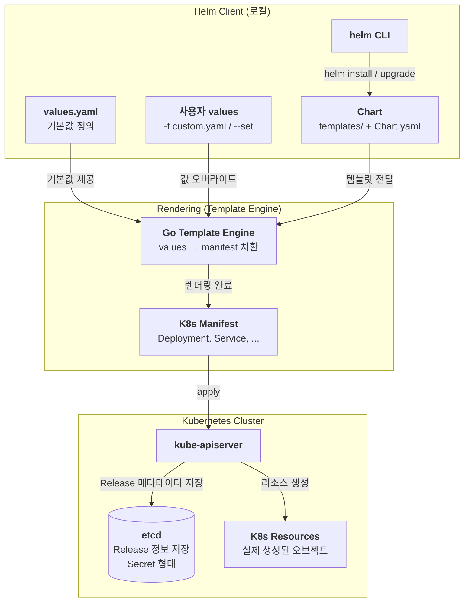

### Helm Chart / Values

Helm 패키지 내부에는 아래와 같이 Chart.yaml, values.yaml, templates/${k8s-manifest}.yaml 로 구성된다.

```yaml
my-chart/
├── Chart.yaml          # Chart 메타데이터 (이름, 버전, 설명 등)
├── values.yaml         # 기본 Values 정의
├── charts/             # 서브차트(의존 Chart) 디렉토리
├── templates/          # Go Template 기반 K8s Manifest
│   ├── deployment.yaml
│   ├── service.yaml
│   ├── ingress.yaml
│   ├── _helpers.tpl    # 재사용 가능한 템플릿 헬퍼 함수
│   └── NOTES.txt       # 설치 완료 후 출력할 안내 메시지
└── .helmignore         # 패키징 시 제외할 파일 목록
```

Chart 는 Helm 에서 배포 단위의 개념으로 하나의 애플리케이션을 표현하는 파일 묶음이다.
따라서 Chart.yaml 에서 Helm 에 대한 메타데이터를 저장한다.
아래와 같은 메타데이터를 선언한다. 

```yaml
apiVersion: v2
name: my-app
description: A Helm chart for my application
type: application        # application | library
version: 1.2.3           # Chart 자체 버전 (SemVer)
appVersion: "2.0.0"      # 배포하는 앱의 버전
```

이렇게 선언해두면 Go Template 으로 선언된 — 이따 별도로 설명할 것이다 — templates 에서 각각의 필드로 지정된 값으로 치환된다.

```yaml
# templates/deployment.yaml 예시
apiVersion: apps/v1
kind: Deployment
metadata:
  name: {{ .Release.Name }}-app
  labels:
    app: {{ .Chart.Name }} # <- 이 값이 Chart 선언 필드로 치환
spec:
  replicas: {{ .Values.replicaCount }}
  template:
    spec:
      containers:
        - name: app
          image: "{{ .Values.image.repository }}:{{ .Values.image.tag }}"
```

Values는 Chart 템플릿에 주입되는 **설정값의 집합**이다.
기본값이 values.yaml 에 저장되며, 커스터마이징한 파일을 -f 옵션을 오버라이드할 수 있다.
우선순위는 `--set` > `-f 파일` > `values.yaml` 기본값 순으로 처리된다.

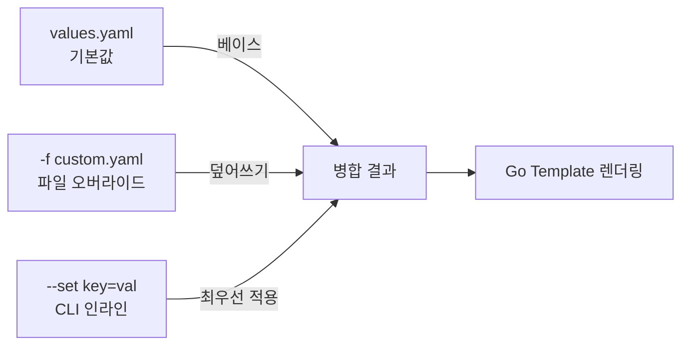
```yaml
replicaCount: 2

image:
  repository: nginx
  tag: "1.25"
  pullPolicy: IfNotPresent

service:
  type: ClusterIP
  port: 80

resources:
  limits:
    cpu: 500m
    memory: 128Mi
```
```yaml
# templates/deployment.yaml 예시
apiVersion: apps/v1
kind: Deployment
metadata:
  name: {{ .Release.Name }}-app
  labels:
    app: {{ .Chart.Name }}
spec:
  replicas: {{ .Values.replicaCount }} # <- 이 값이 Values 선언 필드로 치환
  template:
    spec:
      containers:
        - name: app
          image: "{{ .Values.image.repository }}:{{ .Values.image.tag }}"
```

> 💡

### Helm Template

Helm Template은 **Go Template 문법**을 기반으로 동작하며, 여기서 모든 k8s manifest 들이 정의된다. 
`templates/` 폴더 안의 YAML 파일에 Values와 내장 객체를 주입하여 최종 Kubernetes Manifest를 렌더링한다.
이 때 활용되는 문법은 다음과 같다.

- **내장 객체 (Built-in Objects)**
- if / else if / else 제어구문
- 반복문
- With 사용하여 컨텍스트 지정

### Helm Release

Release는 Chart가 클러스터에 **설치된 인스턴스**를 의미한다.
같은 Chart를 여러 번 설치하면 각각 다른 Release 이름을 가진 독립적인 Release가 된다.
즉, `helm install <release-name> ./my-chart` 을 통해 차트 기반 독립적인 Release 를 만들면
Release 에 대한 정보를 Release Secret 객체를 만들어 Secret / ConfigMap 에 저장한다.

- **Release 이름** : 클러스터 내에서 고유한 배포 식별자
- **Release Secret** : 각 배포 버전의 상태, Values, Chart 정보를 etcd 에 Secret으로 보관
- **Release 버전** : 업그레이드할 때마다 `v1 → v2 → v3` 식으로 증가한다

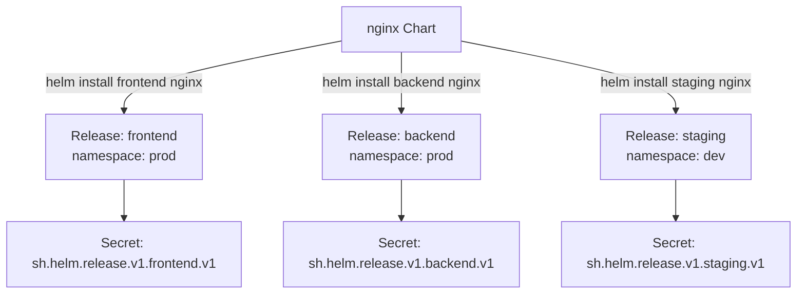

### Helm 생성

```yaml
# 새 Chart 스캐폴딩 생성
helm create my-chart

# 생성 후 구조 확인
tree my-chart/

# 로컬 Chart를 직접 설치
helm install <release-name> ./my-chart

# Repo의 Chart를 설치
helm install <release-name> <repo-name>/<chart-name>

# 특정 네임스페이스에 설치 (없으면 --create-namespace 로 생성)
helm install <release-name> ./my-chart \
  --namespace <namespace> \
  --create-namespace

# Values 오버라이드와 함께 설치
helm install <release-name> ./my-chart \
  -f custom-values.yaml \
  --set image.tag=2.0.0
```

### Helm 해제 & 다운로드

```yaml
# Release 삭제 (K8s 리소스 + Release Secret 모두 제거)
helm uninstall <release-name> -n <namespace>

# 삭제하되 Release 히스토리는 보존
helm uninstall <release-name> --keep-history -n <namespace>

# Repo에서 Chart 파일만 로컬에 내려받기 (.tgz)
helm pull <repo-name>/<chart-name>

# 압축 풀어서 내려받기
helm pull <repo-name>/<chart-name> --untar

# 특정 버전 지정
helm pull <repo-name>/<chart-name> --version 1.2.3
```

### Helm Dry-run & Debug

helm 은 실제 배포 전에 dry-run 혹은 debug 를 통해 렌더링 결과를 확인할 수 있다.

```yaml
# Dry-run : 실제 K8s 에는 아무것도 반영되지 않음
# 서버사이드 검증(스키마 체크 등)을 포함
helm install <release-name> ./my-chart --dry-run

# client-side 렌더링만 확인 (API Server 통신 없음)
helm template <release-name> ./my-chart

# 특정 Values 파일 적용 후 렌더링 확인
helm template <release-name> ./my-chart -f values-prod.yaml

# Debug 플래그 : 렌더링 과정 상세 출력 (Values 병합 결과 포함)
helm install <release-name> ./my-chart --dry-run --debug

# 특정 템플릿 파일만 렌더링
helm template <release-name> ./my-chart -s templates/deployment.yaml
```

### Helm Upgrade & Rollback

```yaml
# Release 업그레이드
helm upgrade <release-name> ./my-chart -f values-prod.yaml

# 없으면 설치, 있으면 업그레이드 (--install 플래그)
helm upgrade --install <release-name> ./my-chart -f values-prod.yaml

# 이미지 태그만 변경
helm upgrade <release-name> ./my-chart --set image.tag=2.1.0

# 특정 리비전으로 롤백
helm rollback <release-name> <revision-number>

# 바로 이전 버전으로 롤백
helm rollback <release-name>

# 롤백도 새로운 리비전으로 기록됨
# e.g. v3 → rollback → v4 (v4의 내용은 v2와 동일)
```

### Helm History

Helm 은 Release의 버전 이력을 조회할 수 있다. 이를 도와주는 명령어가 helm history 이다.

```yaml
# 특정 Release 의 배포 이력 확인
helm history <release-name>

# 네임스페이스 지정
helm history <release-name> -n <namespace>

# 최근 N건만 출력
helm history <release-name> --max 5
```

### Helm Subcharts & Dependencies

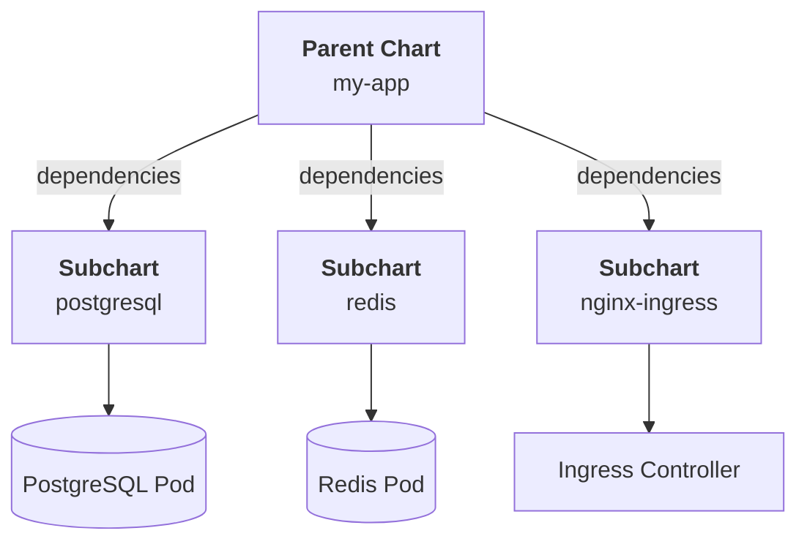

하나의 Chart가 다른 Chart를 **의존성(Dependency)** 을 띌 수 있는데 Chart.yaml 에서 이 의존성을 명시할 수 있다.
이렇게 명시한 의존 Chart 를 SubChart 라고하며 helm dependency 를 통해 다운로드 및 의존성 확인을 처리할 수 있다.

```yaml
dependencies:
  - name: postgresql
    version: "12.x.x"
    repository: "https://charts.bitnami.com/bitnami"
    condition: postgresql.enabled   # values.yaml 의 값으로 활성/비활성 제어

  - name: redis
    version: "17.x.x"
    repository: "https://charts.bitnami.com/bitnami"
    condition: redis.enabled
```
```yaml
# 의존성 다운로드 (charts/ 폴더에 .tgz 저장)
helm dependency update ./my-chart

# 의존성 목록 확인
helm dependency list ./my-chart
```

### Helm Repo / Chart Museum

Helm Chart 는 원격으로 배포·공유하기 위한 **저장소(Repository)** 를 사용할 수 있다.
두 가지 개념으로 나뉠 수 있다.

1. DockerHub, Github 와 같이 공용 저장소로 사용되는 Helm Repo
2. **자체 호스팅 Helm Chart Repository 서버인 Helm Chart Museum**

Helm Chart Museum 같은 경우에는 사내 Private Chart를 관리하거나, Air-gapped 환경에서 Helm Repo를 운영할 때 활용한다.

```bash
# 원격 Repo 추가
helm repo add bitnami https://charts.bitnami.com/bitnami
helm repo add stable https://charts.helm.sh/stable

# 등록된 Repo 목록 확인
helm repo list

# Repo 의 Chart 인덱스 업데이트
helm repo update

# Repo 에서 Chart 검색
helm search repo nginx
helm search repo bitnami/postgresql --versions

# Repo 제거
helm repo remove bitnami
```
```bash
# ChartMuseum 설치 (Helm 으로)
helm repo add chartmuseum https://chartmuseum.github.io/charts
helm install my-chartmuseum chartmuseum/chartmuseum \
  --set env.open.DISABLE_API=false

# helm-push 플러그인 설치
helm plugin install https://github.com/chartmuseum/helm-push

# Chart 패키징
helm package ./my-chart

# ChartMuseum 에 push
helm cm-push my-chart-1.0.0.tgz my-repo

# ChartMuseum Repo 등록 후 사용
helm repo add my-repo http://<chartmuseum-url>
helm repo update
helm install my-app my-repo/my-chart
```

### 적용 & 확인

```bash
# 설치된 모든 Release 확인
helm list -A   # -A : 모든 네임스페이스

# 특정 Release 의 현재 Values 확인
helm get values <release-name> -n <namespace>

# 모든 Values (기본값 포함) 확인
helm get values <release-name> -n <namespace> --all

# 현재 렌더링된 Manifest 확인
helm get manifest <release-name> -n <namespace>

# Release 상태 확인
helm status <release-name> -n <namespace>

# Chart 문법 검사 (lint)
helm lint ./my-chart

# 배포 후 Pod 상태 확인
kubectl get pods -n <namespace> -l app.kubernetes.io/instance=<release-name>

# 배포 후 모든 리소스 확인
kubectl get all -n <namespace> -l helm.sh/chart=<chart-name>
```

### 문제 1 : ArgoCD 설치

Install Argo CD in the cluster:
Add the official Argo CD Helm repository with the name argo.Repository Path: [https://argoproj.github.io/argo-helm/](https://argoproj.github.io/argo-helm/)
The Argo CD CRDs have already been pre-installed in the cluster.
Generate a helm template of the Argo CD Helm chart version 8.6.4 for the
argocd namespace and save it to ~/argo-helm.yaml.
Configure the chart to not install CRDs.
Install Argo CD using Helm with release name argocd using the same version
and configuration as used in the template 8.6.4.
Install it in the argocd namespace and configure it to not install CRDs.
You do not need to configure access to the Argo CD server UI.

```bash
# helm repo 추가
helm repo add argo [https://argoproj.github.io/argo-helm/](https://argoproj.github.io/argo-helm/)
helm repo update

# helm 전용 namespace 생성
kubectl create namespace argocd

# helm template 생성
helm template argocd argo/argo-cd \\
  --version 8.6.4 \\
  --namespace argocd \\
  --set crds.install=false \\
  > ~/argo-helm.yaml
  
# helm 설치
# 다만 문제에서 CRD 는 설치하지 않도록 하였으므로 옵션을 처리
helm install argocd argo/argo-cd \\
  --version 8.6.4 \\
  --namespace argocd \\
  --set crds.install=false
  
# helm 설치 확인
helm list -n argocd
kubectl get pods -n argocd
```


## Kustomize

### Kustomize 란 ?

`Kustomize`는 Kubernetes Manifest를 **템플릿 없이 커스터마이징**하는 도구이다.
Helm이 `{{ .Values.xxx }}` 같은 템플릿 언어로 YAML을 동적으로 생성하는 방식과 달리,
Kustomize는 **원본 YAML 파일을 절대 건드리지 않고**, 그 위에 "이 부분만 바꿔라" 는 패치(Patch) 명세를 따로 관리한다.
`kubectl` 에 기본 내장(`kubectl apply -k`)되어 있어 별도 설치 없이도 사용 가능하다.

### Kustomize 작동원리

> Kustomize는 **선언형 오버레이** 방식이다. 원본을 수정하지 않고 결과만 달라진다.

1. **Base 정의** : 환경에 관계없이 공통으로 사용하는 Manifest를 작성한다.
2. **Overlay 정의** : 환경별 차이(replicas, 이미지 태그, 리소스 등)만을 Patch 형태로 작성한다.
3. **Build** : `kustomize build` 또는 `kubectl apply -k` 가 Base + Patch를 병합하여 최종 Manifest를 생성한다.
4. **Apply** : 최종 Manifest가 kube-apiserver 에 전달된다.

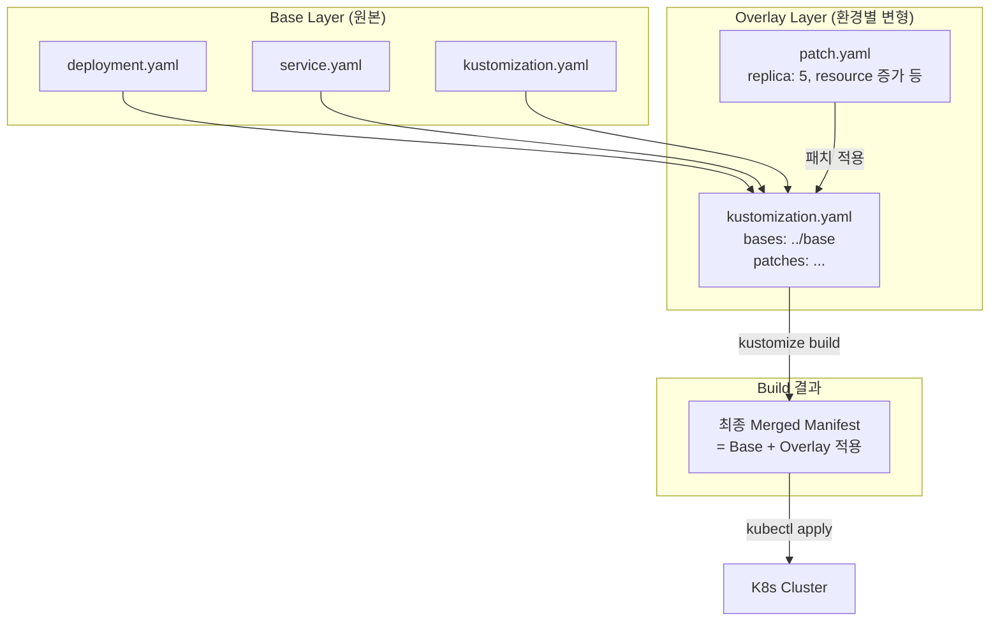

### Kustomize Base & Overlays

개발(dev), 스테이징(staging), 운영(prod) 환경은 대부분 **같은 구조에 일부 값만 다르다.**
모든 환경마다 YAML 파일 전체를 복사하면 중복이 생기고 유지보수가 힘들어진다.
따라서 Base에 공통 구조를 두고, 각 환경의 Overlay에는 **차이점만 **두는 방식으로 중복을 제거한다.

```mermaid
my-app/
├── base/                       # 공통 Manifest
│   ├── kustomization.yaml
│   ├── deployment.yaml
│   └── service.yaml
└── overlays/                   # 환경별 오버레이
    ├── dev/
    │   ├── kustomization.yaml
    │   └── patch-replicas.yaml
    ├── staging/
    │   ├── kustomization.yaml
    │   └── patch-resources.yaml
    └── prod/
        ├── kustomization.yaml
        └── patch-prod.yaml
```

1. **base/deployment.yaml** 에 공통 manifest 를 선언한다. 절대 수정하지 않는다
2. **base/kustomization.yaml** 에 base 내 리소스 목록들을 나열한다.
3. **overlays/prod/kustomization.yaml** 에 각 환경 별로 어떤 오버레이를 처리할지 선언한다.
4. 이후 **overlays/prod/patch-prod.yaml** 에서 실제 manifest 의 운영 환경 별 차이점을 기술한다.

### Kustomize Patch

Patch는 Base Manifest의 **특정 필드만 변경**하는 방법이다. 두 가지 방식이 있다.

1. Strategic Merge Patch
2. JSON Patch

### Kustomize Generators

Generators는 `kustomization.yaml` 선언만으로 **ConfigMap 과 Secret 을 자동 생성**하는 기능이다.
다음과 같이 configmap 에 대한 generator 와 secret 에 대한 generator 로 구분할 수 있다.

1. configMapGenerator
2. secretGenerator

이렇게 선언하여 생성된 ConfigMap/Secret 이름에는 다음과 같이 **내용 기반 해시**가 붙게된다.

```yaml
# kustomize build 후 자동 생성되는 ConfigMap
apiVersion: v1
kind: ConfigMap
metadata:
  name: my-config-48f7a2b9    # 이름 뒤에 내용 기반 해시가 자동 추가됨
data:
  APP_ENV: production
  LOG_LEVEL: info
  app.properties: |           # 파일 내용이 그대로 삽입됨
    server.port=8080
    spring.datasource.url=jdbc:...
```

이렇게 내용이 바뀌면 해시가 달라지고, Deployment가 새 이름을 참조하게 되어 자연스러운 롤링 업데이트가 발생한다.
??? 어떻게 Deployment 가 자동으로 새로운 이름을 참조함????
??? 어떻게 Deployment 가 자동으로 새로운 이름을 참조함????
??? 어떻게 Deployment 가 자동으로 새로운 이름을 참조함????
??? 어떻게 Deployment 가 자동으로 새로운 이름을 참조함????

> 💡
> 💡

### Kustomize Transformers

Transformers는 Base Manifest 전체에 **일괄 변환**을 적용하는 기능이다.
Patch가 "특정 리소스의 특정 필드"를 바꾸는 것이라면, Transformer는 **모든 리소스에 동일한 변환**을 한 번에 적용하는 것이다.
예를 들어 운영 환경 Overlay에 `namespace: production` 한 줄만 추가하면, base의 Deployment, Service, Ingress 등 **모든 리소스에 네임스페이스가 자동으로 붙는다.**

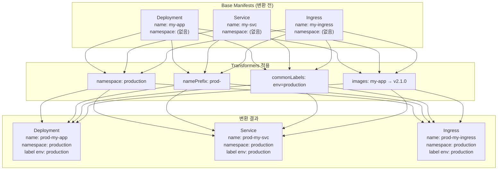

### Helm vs Kustomize

보통 하나만 선택해서 쓴다기보다는 패키징을 할 때는 Helm 을, 환경 별로 다르게 처리해야할 때는 Kustomize 를 적용하는, Mix-In 방식으로 처리한다.
그럼에도 차이점을 정리하자면 아래와 같다.

| 항목 | Helm | Kustomize |
| --- | --- | --- |
| 접근 방식 | 템플릿 기반 | 오버레이 기반 |
| 학습 난이도 | 중간 (Go Template 필요) | 낮음 (순수 YAML) |
| 패키지 관리 | O (Chart, Repo) | X |
| 버전/롤백 | O (Release History) | X (Git 의존) |
| 환경 분리 | Values 파일 분리 | Overlays 디렉토리 분리 |
| 내장 여부 | 별도 설치 필요 | kubectl 기본 내장 |
| 동적 로직 | O (if/loop 등 템플릿 문법) | 제한적 |
| 적합한 사용처 | 복잡한 앱 패키징·배포 | 환경별 간단한 설정 분기 |


### 적용 & 확인

```yaml
# 렌더링 결과만 확인 (클러스터 미적용)
kustomize build overlays/prod

# kubectl 내장 kustomize 로 적용
kubectl apply -k overlays/prod

# 개발 환경 적용
kubectl apply -k overlays/dev

# 적용 전 diff 확인 (현재 클러스터 상태와 비교)
kubectl diff -k overlays/prod

# 삭제
kubectl delete -k overlays/prod

# 적용 후 Pod 상태 확인
kubectl get pods -n production

# 생성된 ConfigMap 이름 확인 (해시 포함)
kubectl get configmap -n production

# kustomize 버전 확인
kustomize version
kubectl version --client  # kubectl 내장 kustomize 버전 포함
```


## ETCD 백업 & 복구

### ETCD 란 ?

쿠버네티스의 모든 상태 정보를 저장하는 **Key-Value 저장소**

### ETCD 와 API 서버의 관계

**유일한 소통 창구.** 
클러스터의 그 어떤 컴포넌트(Scheduler, Controller 등)도 ETCD와 직접 대화하지 못합니다. 
오직 **kube-apiserver**만이 ETCD와 데이터를 주고받습니다.

### ETCD 클러스터 구성

ETCD는 고가용성을 위해 홀수 2n+1 개의 노드로 구성됩니다. 여기서 핵심은 Quorum(정족수) 입니다.

- **공식**: n+1 (전체 노드가 3개라면 2개가 살아있어야 작동)
- **시험 포인트**: 만약 3대 중 2대가 죽으면 ETCD는 Read-only 상태가 되거나 아예 응답을 멈춥니다. 이때는 `etcdctl member list`로 상태를 봐야 합니다.


### 언제 ETCD 가 고장나는가?

- **인증서 만료**: `kube-apiserver` 로그에 `x509: certificate has expired`가 뜨면 ETCD 인증서 문제입니다.
- **DB Size Quota**: 기본값이 2GB인 경우, 데이터가 꽉 차면 `alarm: NOSPACE`가 뜨면서 쓰기가 금지됩니다. (이때는 `compact`와 `defrag`가 필요합니다.)
- **I/O Latency**: 디스크가 느리면 `wal: sync duration of ... is too long` 경고가 뜨며 클러스터가 요동칩니다.


### 어떻게 ETCD 장애부분을 확인하는가?

1. **정적 포드 상태 확인**: `crictl ps | grep etcd` (컨테이너가 반복해서 재시작 중인지 확인)
2. **로그 분석**: `crictl logs [ETCD_ID]` 또는 마스터 노드의 `/var/log/pods/` 확인.
3. **엔드포인트 상태 확인**:


### ETCD 백업이란 ?

단순히 파일을 복사하는 게 아니라, 특정 시점의 데이터베이스 상태(Snapshot) 를 바이너리 파일로 추출하는 것입니다.

- **명령어 핵심**: 반드시 `ETCDCTL_API=3` 환경변수를 선언해야 합니다. (v2와 v3는 명령어 체계가 완전히 다릅니다.)
- **대상**: `/var/lib/etcd` 디렉토리 전체를 백업하는 것이 아니라, `snapshot save` 명령을 통해 `.db` 파일을 만드는 것이 정석입니다.


그렇다면 언제 etcd 백업이 호출될까?
쿠버네티스는 스스로 ETCD 스냅샷(백업)을 정기적으로 저장하지 않는다
따라서 1) 개발자가 백업 명령어를 통해 직접 현재 상태를 백업하던지 2) CronJob 이나 별도 스크립트를 통해 외부 Object Storage 로 정기적 백업을 처리한다


### 어떻게 ETCD 복구하는가?

다음과 같은 방법으로 저장하고 복구한다
[https://kubernetes.io/docs/tasks/administer-cluster/configure-upgrade-etcd/#backing-up-an-etcd-cluster](https://kubernetes.io/docs/tasks/administer-cluster/configure-upgrade-etcd/#backing-up-an-etcd-cluster)
[https://velog.io/@khyup0629/K8S-%ED%81%B4%EB%9F%AC%EC%8A%A4%ED%84%B0-%EC%95%84%ED%82%A4%ED%85%8D%EC%B2%98-%EC%84%A4%EC%B9%98-%EB%B0%8F-%EC%84%A4%EC%A0%95](https://velog.io/@khyup0629/K8S-%ED%81%B4%EB%9F%AC%EC%8A%A4%ED%84%B0-%EC%95%84%ED%82%A4%ED%85%8D%EC%B2%98-%EC%84%A4%EC%B9%98-%EB%B0%8F-%EC%84%A4%EC%A0%95)

1. 백업 저장
2. Restore 실행
3. **권한 부여**:
4. **YAML 업데이트**:
`/etc/kubernetes/manifests/etcd.yaml`에서 아래와 같이 고친다
5. 최종 확인

### 문제** 1 : 외부 ETCD 클러스터 설정에 따른 Core Components 트러블 슈팅**

A kubeadm provisioned cluster was migrated to a new machine. Requires
configuration changes to run successfully.
• We need fix a single-node cluster that got broken during machine migration.
• Identify the broken cluster components and investigate what caused to
break those components.
• The decommissioned cluster used an external etcd server.
• Next, fix the configuration of all broken cluster components.
• Ensure to restart all necessary services and components for changes to
take effect.
• Finally, ensure the cluster, single node and all pods are Ready.

> ⚠️

```bash
# 현 클러스터 파악
kubectl get nodes
kubectl get pods -n kube-system

# static pod 확인
ls /etc/kubernetes/manifests/
journalctl -u kubelet -f

# api server 설정에 etcd endpoint ip 확인
cat /etc/kubernetes/manifests/kube-apiserver.yaml | grep etcd

--etcd-servers=https://<새I>:2379 로 수정

# kubelet 데몬 확인
systemctl restart kubelet
systemctl status kubelet

kubectl get nodes
kubectl get pods -n kube-system
```

### 문제** 2 : ETCD 스냅샷 및 복구**

First, create a snapshot of the existing etcd instance running at [https://127.0.0.1:2379](https://127.0.0.1:2379/) , saving the snapshot to /data/etcdsnapshot.db .
Next, restore an existing, previous snapshot located at /data/etcd-snapshot-previous.db .
The following TLS certificates/key are supplied for connecting to the server with etcdctl:

- CA certificate: /etc/kubernetes/pki/etcd/ca.crt
- Client certificate: /etc/kubernetes/pki/etcd/server.crt
- Client key: /etc/kubernetes/pki/etcd/server.key

> 

```bash
# 공식문서 확인
https://kubernetes.io/docs/tasks/administer-cluster/configure-upgrade-etcd/#snapshot-using-etcdctl-options

# 우선 노드 접속
kubectl config use-context k8s
OR
ssh <node>

# 스냅샷 생성
ETCDCTL_API=3 etcdctl --endpoints=https://127.0.0.1:2379 \
  --cacert=/etc/kubernetes/pki/etcd/ca.crt \
  --cert=/etc/kubernetes/pki/etcd/server.crt \
  --key=/etc/kubernetes/pki/etcd/server.key \
  snapshot save /data/etcdsnapshot.db

# 기존에 존재하는 스냅샷.db 로 restore 처리
etcdutl snapshot restore /data/etcd-snapshot-previous.db \
  --data-dir=/var/lib/etcd-new

OR

export ETCDCTL_API=3
etcdctl snapshot restore snapshot.db \
	--data-dir=/var/lib/etcd-new

# 권한 지정
chown -R etcd:etcd /var/lib/etcd-new

# etcd.yaml 을 새롭게 수정
vi /etc/kubernetes/manifests/etcd.yaml
- volumes 의 hostPath : 새로운 경로인 `/var/lib/etcd-new`를 가리켜야 한다.
- volumeMounts : 컨테이너 내부에서 바라보는 경로입니다. (보통 그대로 둡니다.)
- spec.containers.command : ETCD 실행 옵션 중 `--data-dir` 값도 새 경로로 일치시켜야 한다

# 최종 확인
# (watch 는 2초마다 뒤 명령어 실행, SIGINT 보내 종료)
sudo watch crictl pods | grep etcd

OR

sudo docker ps -a | grep etcd
```


---


# 🔒 인증/인가

## CertificateSigningRequest (CSR)

[https://kubernetes.io/docs/tasks/tls/certificate-issue-client-csr/](https://kubernetes.io/docs/tasks/tls/certificate-issue-client-csr/)
[https://hellouz818.tistory.com/46](https://hellouz818.tistory.com/46)

### CSR 이란?

쿠버네티스는 '사용자(User)'라는 리소스가 따로 없다. 
대신 인증서 안에 들어있는 이 두 필드를 보고 사용자를 식별한다

- **CN (Common Name):** 쿠버네티스가 인식하는 **사용자 ID**
- **O (Organization):** 쿠버네티스가 인식하는 **그룹명**

이를 API 서버에게 전달하기 위해 CSR 매니페스트를 쿠버네티스 API 서버에 보낸다
이를 통해 API 서버는 사용자를 식별하여 사용자에 승인된 권한의 요청만 처리한다.
권한을 처리하는 리소스이므로 Cluster Scoped 이다.

### 원리

1. 사용자는 개인키 파일을 생성한다.
2. 이후 개인키 + 사용자이름 + 그룹이름을 담은 CSR 파일을 생성한다.
3. `CertificateSigningRequest` YAML을 작성하여 `kubectl apply` 한다.
4. 클러스터 관리자가 해당 CSR 을 승인하면 CSR 의 상태를 Approved 로 변경한다.
5. CSR Signing Controller가 승인된 요청을 감시(Watch)하다가 포착하고, 클러스터 내부 RootCA 를 사용하여 CSR 승인 데이터를 다시 CSR 내부 `status.certificate` 필드에 다시 저장한다.
6. 사용자는 `kubectl get csr <이름> -o jsonpath='{.status.certificate}'` 명령으로 발급된 인증서를 다운로드한다.
7. 이제 이 인증서와 처음에 만든 개인키를 `kubeconfig`에 등록하면, API 서버는 인증서의 `CN`과 `O`를 보고 사용자를 인식하게된다.

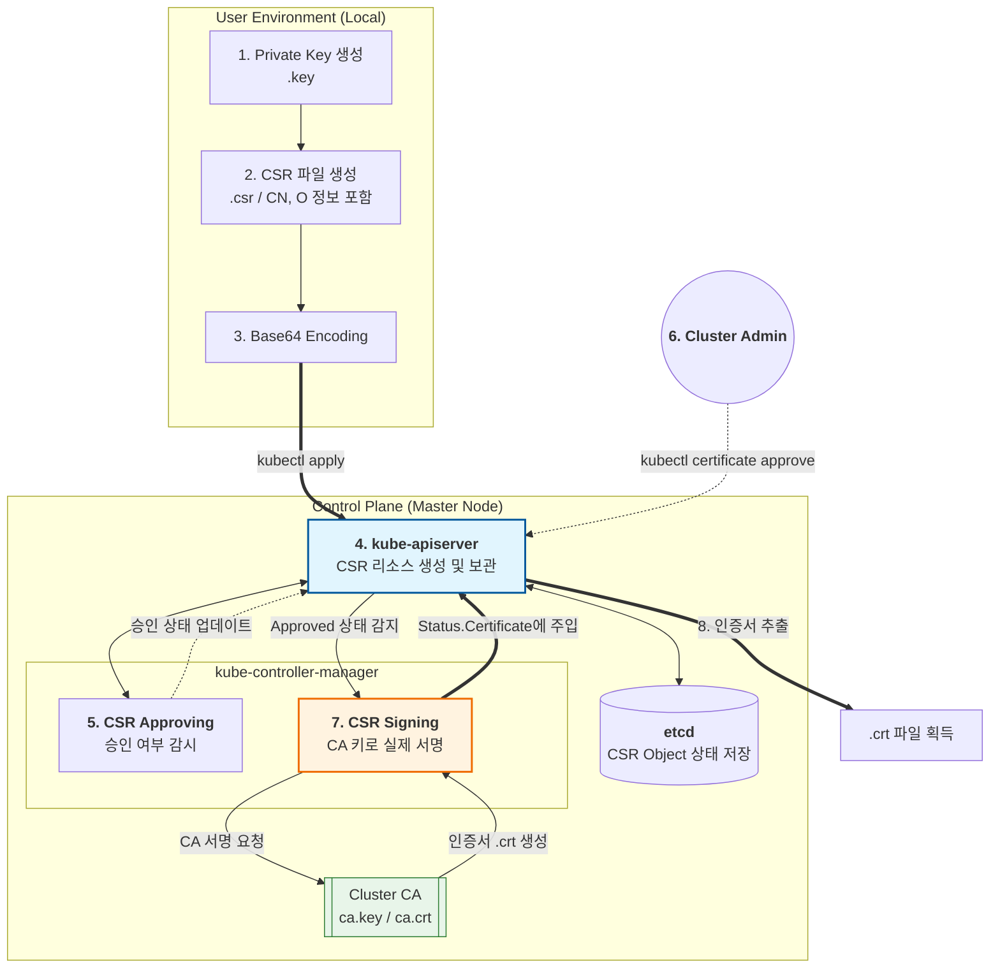

### 적용 & 확인

1. 개인키 생성
2. CSR 파일 생성
3. Base64 인코딩
4. 서명 주체 (SignerName)
5. 관리자가 CSR 승인
6. 최종 확인
7. 사용자가 승인완료된 인증서를 kubeconfig 에 등록
8. 해당 사용자가 문제없이 kube-api-server 와 통신이 되는지 확인한다.


## cert-manager

### cert-manager 란 ?

[https://velog.io/@wanny328/Kubernetes-Cert-Manager-%EC%95%8C%EC%95%84%EB%B3%B4%EA%B8%B0](https://velog.io/@wanny328/Kubernetes-Cert-Manager-%EC%95%8C%EC%95%84%EB%B3%B4%EA%B8%B0)
[https://picluster.ricsanfre.com/docs/certmanager/](https://picluster.ricsanfre.com/docs/certmanager/)
쿠버네티스 내부에서 TLS 인증서의 생명주기(발급, 갱신, 폐기)를 자동으로 관리해주는 오픈소스 컨트롤러이다.
SSL 인증서를 자동 갱신처리해주며 외부 CA(인증 기관)와 연동하여 신뢰할 수 있는 HTTPS 환경을 제공한다.

### 원리


- Issuer
- Certificate
- Secret(TLS Secret)

이렇게 각각 생성된 Manifest 를 통해 자동 CA 인증서 관리를 하며, 이를 Deployment/Ingress 에 적용한다.

### 적용 & 확인

```yaml
# 1. Issuer 생성
apiVersion: cert-manager.io/v1
kind: Issuer
metadata:
  name: selfsigned-issuer
  namespace: default
spec:
	secretName: my-tls-secret # 이 이름으로 Secret이 자동 생성됨
	  duration: 2160h # 90일
	  renewBefore: 360h # 만료 15일 전 갱신
	  subject:
	    organizations:
	      - my-org
	  isCA: false
	  privateKey:
	    algorithm: RSA
	    encoding: PKCS1
	    size: 2048
	  usages:
	    - server auth
	    - client auth
	  dnsNames:
	    - "example.com"
	    - "www.example.com"
	  issuerRef: # issuer 매핑
	    name: selfsigned-issuer
	    kind: Issuer
	    group: cert-manager.io
```
```yaml
# 2. Certificate 생성
apiVersion: cert-manager.io/v1
kind: Certificate
metadata:
  name: example-test-com
spec:
  dnsNames:
    - 'example.com'
  issuerRef:
    name: nameOfClusterIssuer
  secretName: example-test-com-tls
  
# 이후 Secret 은 Certificate 에 의해 자동으로 생성됨
# Secret 내에는 CA 인증서와 TLS 인증서&키가 저장되며
# CA 인증서는 Issuer 에 의해, TLS 인증서&키는 Certificate 에 의해 발행됨
```
```bash
# certificate 상태 확인
kubectl describe certificate ${certificate-이름}

# certificaterequest 확인
kubectl get certificaterequest
```
```bash
# 실제 자동 생성된 Secret 내 인증서 유효기간과 도메인 확인
kubectl get secret my-tls-secret -o jsonpath='{.data.tls\.crt}' \
		| base64 -d  \
		| openssl x509 -text -noout
```
```bash
# 실제 적용
# Ingress
apiVersion: networking.k8s.io/v1
kind: Ingress
metadata:
  name: my-app-ingress
  annotations:
    # 핵심: 어떤 Issuer를 쓸지 지정하면 나머지는 자동으로 처리됩니다.
    cert-manager.io/cluster-issuer: "letsencrypt-prod"
spec:
  tls:
  - hosts:
    - myapp.example.com
    secretName: myapp-tls-secret # 이 이름으로 Secret이 자동 생성 및 관리됨
  rules:
  - host: myapp.example.com
    http:
      paths:
      - path: /
        pathType: Prefix
        backend:
          service:
            name: my-service
            port:
              number: 80
              
# Deployment
# Certificate로 생성된 Secret을 파드에 Volume으로 마운트
spec:
  template:
    spec:
      containers:
      - name: my-secure-app
        image: my-app:latest
        volumeMounts:
        - name: cert-vol
          mountPath: "/etc/tls" # 앱이 인증서를 읽어갈 경로
          readOnly: true
      volumes:
      - name: cert-vol
        secret:
          secretName: example-test-com-tls # Certificate에서 정의한 그 이름
```


## Role / ClusterRole / RoleBinding / ClusterRoleBinding

### Role

- **namespace 내에서의 권한을 선언**
- 특정 네임스페이스 안에서만 유효
- 네임스페이스가 없는 리소스(Node, PV 등)에는 사용 불가

### ClusterRole

- **클러스터 전체 범위의 권한을 선언**
- 다음 3가지에 대한 권한 선언 가능

> ⭐ **Node, PV에 ClusterRole이 필수인 이유**
> Node, PV는 네임스페이스 자체가 없는 리소스.
> Role은 특정 네임스페이스 안에서만 동작하므로, 네임스페이스 없는 리소스에는 권한 부여 자체가 불가능.
> ClusterRole만 가능.

### RoleBinding

- **특정 네임스페이스 내에서** User, Group, ServiceAccount에게 Role을 바인딩
- Role 또는 ClusterRole 모두 바인딩 가능
- ClusterRole을 RoleBinding으로 바인딩하면 → **해당 네임스페이스에서만 권한 제한 적용**

### ClusterRoleBinding

- **모든 네임스페이스에 걸쳐** User, Group, ServiceAccount에게 ClusterRole을 바인딩


### 4가지 조합 — 절대 헷갈리면 안 됨

| Role 종류 | Binding 종류 | 결과 |
| --- | --- | --- |
| Role | RoleBinding | 특정 네임스페이스 권한 |
| ClusterRole | ClusterRoleBinding | 클러스터 전체 권한 |
| ClusterRole | RoleBinding | ClusterRole을 특정 네임스페이스로 제한 ✅ |
| Role | ClusterRoleBinding | ❌ 불가능 |


> ⭐ **ClusterRole + RoleBinding 패턴이 유용한 이유**
> 여러 네임스페이스에서 같은 권한 패턴을 재사용하면서도,
> 각 네임스페이스로 범위를 제한하고 싶을 때 사용


### 권한 부여 대상 (Subject)

> User

- k8s에서 User 리소스는 **존재하지 않음**
- 외부 시스템(SSO, LDAP, OIDC) 또는 **클라이언트 인증서(Certificate)** 로 관리
- 인증서의 `CN(Common Name)` 값을 보고 API 서버가 사용자를 인식
- 인증 플러그인이 요청을 검사하여 API 서버에 사용자 정보를 전달

> Group

- k8s에서 Group 리소스는 **존재하지 않음**
- 인증 시점에 인증 플러그인이 "이 사용자는 'dev-team' 그룹 소속"이라고 선언

> ServiceAccount

- **Pod 안에서 실행되는 앱이 API 서버에 접근할 때 사용하는 로봇 계정**
- k8s 리소스로 존재함 (`kubectl get sa`)
- Pod spec의 `serviceAccountName` 필드에 지정
- 지정하지 않으면 해당 네임스페이스의 `default` SA 자동 할당


## kubectl 명령어 (시험장 핵심 패턴)

### ServiceAccount 생성

```bash
kubectl create serviceaccount <sa-name> -n <namespace>
# 또는
kubectl create sa <sa-name> -n <namespace>
```

### Role 생성

```bash
kubectl create role <role-name> \
  --verb=get,list,watch \
  --resource=pods \
  -n <namespace>
```

### ClusterRole 생성

```bash
kubectl create clusterrole <cr-name> \
  --verb=list \
  --resource=nodes
```

### RoleBinding 생성

```bash
# User 바인딩
kubectl create rolebinding <rb-name> \
  --role=<role-name> \
  --user=<username> \
  -n <namespace>

# ServiceAccount 바인딩
kubectl create rolebinding <rb-name> \
  --role=<role-name> \
  --serviceaccount=<namespace>:<sa-name> \
  -n <namespace>
```

### ClusterRoleBinding 생성

```bash
# User 바인딩
kubectl create clusterrolebinding <crb-name> \
  --clusterrole=<cr-name> \
  --user=<username>

# ServiceAccount 바인딩
kubectl create clusterrolebinding <crb-name> \
  --clusterrole=<cr-name> \
  --serviceaccount=<namespace>:<sa-name>
```


## 권한 검증 — 시험장 필수

```bash
# User 권한 확인
kubectl auth can-i <verb> <resource> --as=<username> -n <namespace>

# ServiceAccount 권한 확인
kubectl auth can-i <verb> <resource> \
  --as=system:serviceaccount:<namespace>:<sa-name> \
  -n <namespace>

# 예시
kubectl auth can-i list nodes \
  --as=system:serviceaccount:audit-ns:audit-sa
# → yes

kubectl auth can-i list pods -n audit-ns \
  --as=system:serviceaccount:audit-ns:audit-sa
# → yes

kubectl auth can-i list pods -n default \
  --as=system:serviceaccount:audit-ns:audit-sa
# → no
```


### 문제 1 : 

> Q

```bash
kubectl create clusterrole deployment-clusterrole \
	 --verb=create --resource=deployment,statefulset,daemonset
kubectl get clusterrole deployment-clusterrole

kubectl create serviceaccount cicd-token --namespace=app-team1
kubectl get serviceaccounts --namespace app-team1

kubectl create clusterrolebinding deployment-clusterrolebinding \
	 --clusterrole=deployment-clusterrole \
	 --serviceaccount=app-team1:ci
kubectl describe clusterrolebindings deployment-clusterrolebinding
```


# ⭐ 워크로드

## 클러스터

> 💡 실제 문제는 출제되지 않는데 이 개념을 모르면 문제를 못 푸는 거나 마찬가지라

### 클러스터란 ??
### 클러스터 구성요소 ??
### 클러스터 작동원리 ??
### 문제 : 클러스터 업데이트

Given an existing Kubernetes cluster running version 1.22.4 ,upgrade all of the Kubernetes control plane and node components on the master node only to version 1.23.3 .
Be sure to drain the master node before upgrading it and uncordon it after the upgrade

> ⚠️

```bash
# kubeadm 업그레이드
sudo yum install -y kubeadm-1.23.3-0 --disableexcludes=kubernetes
kubeadm version

# node components 업그레이드
sudo kubeadm upgrade plan v1.23.3
sudo kubeadm upgrade apply v1.23.3

# 노드 드레인
kubectl drain hk8s-m --ignore-daemonsets

# kubelet과 kubectl 업그레이드
sudo yum install -y kubelet-1.23.3-0 kubectl-1.23.3-0 --disableexcludes=kubernetes
sudo systemctl daemon-reload
sudo systemctl restart kubelet

# 노드 uncordon
sudo kubectl uncordon hk8s-m
```


## Pod 란?

### Node 란 ?

## Pod

### Pod 란 ?
### **downward api**

## Node

### Node 란 ?
### status 와 allocatable 필드
### [문제 1 : Node 자원 n 등분해서 Pod 생성](https://sunrise-min.tistory.com/entry/2025-CKA-%EC%8B%9C%ED%97%98-%EC%A4%80%EB%B9%84-%ED%95%B5%EC%8B%AC-%EC%9A%94%EC%95%BD#Service_&_Network:~:text=sleep%201%3B%20done%22-,Node%20%EC%9E%90%EC%9B%90%203%EB%93%B1%EB%B6%84%ED%95%B4%EC%84%9C%20pod%20%EC%83%9D%EC%84%B1,-%EB%AC%B8%EC%A0%9C%0A%0AYou%20manage)

A WordPress application with 3 replicas in the relative-fawn namespace
consists of: cpu 1 memory 1024Mi
Adjust all Pod resource requests as follows:
• Divide node resources evenly across all 3 pods.
• Give each Pod a fair share of CPU and memory.
• Add enough overhead to keep the node stable.
Use the exact same requests for both containers and init containers. 
You are not required to change any resource limits.
It may help to temporarily scale the WordPress Deployment to 0 replicas while updating the resource requests.
After updates, confirm:
• WordPress keeps 3 replicas.
• All Pods are running and ready

> ⚠️
> ⚠️

```bash
# 노드 리소스 확인
kubectl describe node | grep -A5 "Allocatable"

# deploy 스케일 in
kubectl scale deployment wordpress -n relative-fawn --replicas=0

kubectl edit deploy wordpress -n relative-fawn

resources:
  requests:
    cpu: "300m"
    memory: "300Mi"

# 다시 deploy 스케일 out
kubectl scale deployment wordpress -n relative-fawn --replicas=3

# pod 들 상태 확인
kubectl get pods -n relative-fawn
kubectl describe pods -n relative-fawn | grep -A4 Requests
```


## Namespace

### Namespace 란 ??
### Namespace vs Non-Namespace (Global) 리소스

- **Namespace 리소스:** 특정 논리적 격리 구역 안에 존재합니다. (예: `Pod`, `Service`, `Deployment`, `ConfigMap`, `Secret`)
- **Non-Namespace (Cluster-wide) 리소스:** 클러스터 전체에 영향을 미치며 네임스페이스에 구애받지 않습니다. (예: `Node`, `PersistentVolume`, `ClusterRole`, `Namespace` 그 자체)

> 

### Namespace 에서 리소스 제한 설정방법

**ResourceQuota & LimitRange:** 네임스페이스 레벨에서의 리소스 제한 설정. 

### 문제 1 : 


## Taints & Tolerations

### Taints 란 ??
### Tolerations 란 ??
### 문제 1 : 


## QoS Class

### QoS 란 ??
### `Guaranteed`, `Burstable`, `BestEffort`의 차이
### 각 모드에 대한 리소스 부족 시 삭제 우선순위는 ?
### 문제 1 : 


## Deployment

### Deployment 란 ??

- 파드(Pod)와 레플리카셋(ReplicaSet)의 **선언적 업데이트**를 관리하는 상위 객체
- "파드 3개를 유지해줘"라는 명령뿐만 아니라, "v1에서 v2로 업데이트할 때 하나씩 교체해줘" 라는 **배포 전략을 처리**

### ReplicaSet 과 Deployment 의 관계 ??

- 우리는 ReplicaSet을 직접 건드리지 않는다. 
- 모든 제어는 Deployment를 통해 이루어지며, ReplicaSet은 **롤백(Rollback)을 위한 기록 저장소** 역할을 수행한다

### 히스토리 기록은 어디에 저장되는가 ??

클러스터 내부의 **ReplicaSet**에 저장된다
사용되지 않는 과거의 ReplicaSet들이 사라지지 않고 남아서 각 버전의 `template` 정보를 가지고 있기 때문에 롤백이 가능한 것이다.
`kubectl apply -f deploy.yaml --record` 처럼 실행하면, 실행한 명령어가 `CHANGE-CAUSE`에 기록된다. 다만 Kubernetes v1.19 이후부터는 이 플래그가 *deprecated*(권장되지 않음) 되었다.
이에 따라 1) kubectl patch 혹은 kubectl annotate 로 바로 기록하거나 2) yaml 파일에 미리 적어두는 방식으로 변경되었다

1. 명령어 바로 기록
2. YAML 파일에 미리 적어두기

### 롤아웃

보통 실제로는 배포하고나서 배포 상태 확인 이후 복구하는 워크플로우를 따른다
실제로 다음과 같은 명령어를 활용한다

- **배포**: `kubectl apply -f deploy.yaml`
- **모니터링**: `kubectl rollout status deployment/my-app` (실시간 배포 상황 감시)
- **문제 발생 시 확인**: `kubectl rollout history deployment/my-app`
- **Pod 업데이트를 위한 재시작**: `kubectl rollout restart deployment/my-app`
- **상세 검증**: `kubectl rollout history deployment/my-app --revision=prev_version`
- **복구**: `kubectl rollout undo deployment/my-app --to-revision=prev_version`

또한 무한정 ReplicaSet 이 남는 것을 방지하기위해 ReplicaSet 최대 개수를 제어하여 히스토리 개수를 관리할 수 있다.

```yaml
spec:
  revisionHistoryLimit: 5  # 최근 5개의 기록(ReplicaSet)만 남기고 나머지는 삭제
  replicas: 3
  ...

```

### 복제본 수에 대한 설정값

- **maxSurge **[****surge:a sudden and great increase**](https://dictionary.cambridge.org/dictionary/english/surge)
- **maxUnavailable**

기본값은 두 값 둘 다 25%

### 문제 1 : 새로운 버전 배포 및 리비전 되돌리기

**시나리오:** 현재 `web-ns` 네임스페이스에 `replicas: 5`인 `web-deploy`가 실행 중입니다. 이 애플리케이션의 새로운 버전(v2)을 배포하려고 하는데, 다음의 엄격한 가용성 조건을 충족해야 합니다.
1. **가용성 보장:** 업데이트 중에도 최소 5개의 파드는 항상 트래픽을 처리할 수 있는 상태(Ready)여야 합니다. 즉, 가용성이 단 1%도 떨어져서는 안 됩니다.
2. **리소스 제약:** 인프라 자원의 한계로 인해, 업데이트 중에 **동시에 실행되는 총 파드 수는 7개를 초과해서는 안 됩니다.**
3. **검증:** 배포 후 문제가 생겨 **리비전 1번**으로 되돌려야 합니다.
**질문:**

- 이 요구사항을 충족하기 위한 `maxSurge`와 `maxUnavailable`의 값은 각각 무엇입니까? (정수 혹은 퍼센트로 답하세요)
- 리비전 1번으로 되돌리기 위한 정확한 명령어는 무엇입니까?

```yaml
alias k="kubectl"
type k

k get deploy web-deploy -n web-ns -o yaml > web-deploy.yaml
vim web-deploy.yaml
이후 아래와 같이 값을 수정
maxSurge: 2
**maxUnavailable: 0
**k apply -f web-deploy.yaml # 적용**

# 확인
k describe deploy web-deploy -n web-ns
k get replicaset <replicaset-이름>
k get pod <pod-이름>
k describe pod <pod-이름> | grep Image
k exec <pod-이름> -n web-ns -- curl ifconfig.me

# 문제 발생 시 히스토리 확인 후 rollback
k rollout history deployment/web-deploy
# 문제 발생했다면 undo 이후 revision 1 으로 롤백
k rollout undo deployment/web-deploy --to-revision=1**
```

### 문제 2 : 롤링 업데이트

Create a deployment as follows:

- TASK:
- Next, deploy the application with new version 1.11.13-alpine, by performing a rolling update
- Finally, rollback that update to the previous version 1.11.10-alpine

```bash
kubectl create deployment nginx-app \
	 --image=nginx:1.11.10-alpine --replicas=3 \
	 --dry-run=client -o yaml > deplyment.yaml

kubectl apply -f deplyment.yaml

# rolling update
kubectl set image deployment nginx-app nginx=nginx:1.11.13-alpine --record
kubectl rollout history deployment nginx-app

# roll-back
kubectl rollout undo deployment nginx-app
kubectl rollout history deployment nginx-app
```


## ConfigMap & Secrets

### ConfigMap 이란 ?

어플리케이션에 필요한 설정 값(환경 변수, 설정 파일 등)을 파드와 분리하여 저장하는 객체

- **용도**: 데이터베이스 주소, 환경 설정(로그 레벨), 설정 파일(`nginx.conf`) 등.
- **특징**: 민감하지 않은 일반 텍스트 데이터를 저장합니다.

### Pod 에 ConfigMap 할당 방법

1. 우선 ConfigMap 을 생성한다
2. 이후 Pod 에 매핑하여 주입한다
3. **( 볼륨으로 마운트된 경우라면 내용수정 시 Pod 에 자동으로 업데이트된다**

### Secrets 이란 ?

비밀번호, 토큰, SSH 키와 같은 **민감한 정보**를 저장하는 객체입니다.

- **특징**: 데이터가 **Base64**로 인코딩되어 저장됩니다. (암호화가 아니므로 누구나 디코딩 가능함에 주의!)
- **유형**: `Opaque`(일반), `kubernetes.io/dockerconfigjson`(도커 로그인 정보) 등.

### Pod 에 Secrets 할당 방법

1. Secret 을 생성한다
2. 이후 Pod 에 매핑하여 주입한다
3. **( 볼륨으로 마운트된 경우라면 내용수정 시 Pod 에 자동으로 업데이트된다**

### 문제 1 : ConfigMap 연결

Create a ConfigMap named `app-config` in the namespace `cm-namespace` with the following key-value pairs:

```
ENV=production
LOG_LEVEL=info
```

Then, modify the existing Deployment named `cm-webapp` in the same namespace to use the `app-config` ConfigMap by setting the environment variables `ENV` and `LOG_LEVEL` in the container from the ConfigMap.

- ConfigMap app-config is created
- Deployment uses the app-config ConfigMap for variable ENV and LOG LEVEL
- Are the environment variables reflected in the deployment?
- ConfigMap has proper ENV value
- ConfigMap has proper LOG_LEVEL value

```bash
# configmap 생성 / deployment 수정
# vim app-config.yaml

# 아래와 같이 명령어로도 생성 가능
# kubectl create configmap app-config -n cm-namespace \
#  --from-literal=ENV=production \
#  --from-literal=LOG_LEVEL=info

apiVersion: v1
kind: ConfigMap
metadata:
  name: app-config
	namespace: cm-namespace
data:
  ENV: production
	LOG_LEVEL: info
---
apiVersion: apps/v1
kind: Deployment
metadata:
  name: cm-webapp
  namespace: cm-namespace
spec:
  replicas: 3
  selector:
    matchLabels:
      app: nginx
  template:
    metadata:
      labels:
        app: nginx
    spec:
      containers:
      - name: nginx
        image: nginx:1.14.2
        ports:
        - containerPort: 80
        envFrom:
        - configMapRef:
            name: app-config


kubectl apply -f app-config.yaml
# 실행 중인 deployment 의 manifest 파일 수정방법 
# 1) 바로 설정 열어서 수정, 저장하면 바로 rolling policy 에 의해 반영
kubectl edit deployment cm-webapp -n cm-namespace
# 2) manifest yaml 추출 후 수정 및 적용
kubectl get deployment cm-webapp -n cm-namespace -o yaml > cm-webapp.yaml
vim cm-webapp.yaml
kubectl apply -f cm-webapp.yaml

# 이후 확인
kubectl describe cm app-config -n cm-namespace
kubectl describe deploy cm-webapp -n cm-namespace
kubectl get pods -n cm-namespace -l app=cm-webapp -o name # deploy 의 pod 이름
# 위에서 가져온 POD 에 접근하여 환경변수 확인
kubectl exec -n cm-namespace $POD_NAME -- sh -c 'echo $ENV'
kubectl exec -n cm-namespace $POD_NAME -- sh -c 'echo $LOG_LEVEL'
```

### 문제 2 : ConfigMap 을 통해 TLS 활성화

There is an existing deployment called nginx-static in the nginx-static namespace.
The deployment contains a ConfigMap named nginx-config that supports TLSv1.3
Update the nginx-config ConfigMap to allow TLSv1.2 connections.
Re-create, restart, or scale resources as necessary.
By Using command to test the changes:
[candidate@cka0001]$ curl -k --tls-max 1.2 [https://web.k8s.local:30007](https://web.k8s.local:30007/)

```bash
# configmap 수정
kubectl get configmap nginx-config -n nginx-static -o yaml > nginx-config.yaml

vi nginx-config.yaml

ssl_protocols TLSv1.3; → ssl_protocols TLSv1.2 TLSv1.3; 로 변경

# 적용 이후 리소스 재시작
kubectl apply -f nginx-config.yaml

kubectl rollout restart deployment nginx-static -n nginx-static

# 롤아웃 확인 후 최종 curl 확인
kubectl rollout status deployment nginx-static -n nginx-static

curl -k --tls-max 1.2 [https://web.k8s.local:30007](https://web.k8s.local:30007/)

```


## Sidecar & Logging

### Sidecar 란 ??

기본 컨테이너(Main App)의 기능을 확장하거나 보조하기 위해 **같은 Pod 안에 함께 실행되는 보조 컨테이너이다**
주로 로그 수집, 프록시, 설정 동기화 등등을 위한 목적으로 배포된다.

### 생명주기(feat. initContainer)

일반 컨테이너로 사이드카를 띄우면, 메인 앱이 종료되어도 사이드카가 안 죽어서 Pod가 `Running`에 머무는 문제가 있다
쿠버네티스 1.29 버전부터 `initContainers` 설정 안에 `restartPolicy: Always`를 추가하면 
사이드카로 인식하고, 시작 시 메인 앱 컨테이너가 뜨기 **전**에 실행되어 완료를 기다리지 않으며, 메인 앱이 종료되면 같이 종료된다.

### Pod 와 공유하는 자원

Pod 내의 모든 컨테이너는 격리되어 있지만, 일부 자원은 공유하고 스케줄링 시 합산된다.

- **Network:** 같은 `Network Namespace`를 공유한다. 따라서 서로 `localhost`로 통신하며 포트가 중복되면 안 된다.
- **Storage:** `Volume`을 공유하여 메인 앱이 쓴 로그 파일을 사이드카가 읽는 식의 작업이 가능하다.
- **Cgroup & Resource:** 스케줄러는 Pod 내부 모든 컨테이너의 `Request/Limit` 합계를 계산하여 노드를 결정한다.

### 적용 & 확인

```yaml
apiVersion: v1
kind: Pod
metadata:
  name: sidecar-example
spec:
  initContainers:
  - name: log-sidecar
    image: busybox
    restartPolicy: Always # 이 설정이 Sidecar를 만듭니다!
    command: ["sh", "-c", "tail -f /var/log/app.log"]
    volumeMounts:
    - name: shared-logs
      mountPath: /var/log
  containers:
  - name: main-app
    image: nginx
    volumeMounts:
    - name: shared-logs
      mountPath: /var/log
  volumes:
  - name: shared-logs
    emptyDir: {}
```
```bash
kubectl get pod ${pod-이름}

kubectl get logs ${pod-이름} -c ${사이드카-이름}
```

### 문제 1 : 사이드카 생성

A legacy app needs to be integrated into the Kubernetes built-in logging
architecture (i.e. kubectl logs). Adding a streaming co-located container is a
good and common way to accomplish this requirement.
Update the existing Deployment synergy-deployment, adding a co-located
container named sidecar using the image busybox:stable to the existing
Pod.
The new co-located container has to run the following command:
/bin/sh -c "tail -n+1 -f /var/log/synergy-deployment.log"
Use a Volume mounted at /var/log to make the log file synergydeployment.log available to the co-located container.
Do not modify the specification of the existing container other than adding
the required.
Hint: Use a shared volume to expose the log file between the main
application container and the sidecar

```bash
kubectl get deploy synergy-deployment -o yaml > synergy-deployment.yaml

vi synergy-deployment.yaml

apiVersion: apps/v1
kind: Deployment
metadata:
  name: synergy-deployment
  labels:
    app: synergy-deployment
spec:
  replicas: 1
  selector:
    matchLabels:
      app: synergy-deployment
  template:
    metadata:
      labels:
        app: synergy-deployment
    spec:
      containers:
      - name: &lt;기존 컨테이너 - 수정하지 말 것&gt;
        ...
        volumeMounts:
        - name: log-volume
          mountPath: /var/log          # 기존 앱이 로그 쓰는 경로
      initContainers:
      - name: sidecar                  # ← 일반 containers에 추가
        image: busybox:stable
        restartPolicy: Always
        command:
        - /bin/sh
        - -c
        - "tail -n+1 -f /var/log/synergy-deployment.log"
        volumeMounts:
        - name: log-volume
          mountPath: /var/log
      volumes:
      - name: log-volume
        emptyDir: {}

kubectl apply -f synergy-deployment.yaml
kubectl rollout status deployment synergy-deployment

kubectl logs <sidecar-pod명> -c sidecar
```


## PriorityClass & Static Pod

### **PriorityClass 란 ??**

`PriorityClass`는 Pod에 **상대적인 중요도**를 부여하는 리소스이다. 
클러스터의 자원이 부족할 때 어떤 Pod를 먼저 실행하고, 어떤 Pod를 희생(Eviction)시킬지 결정하는 기준이 된다
**우선순위 선언문인 PriorityClass 는 Cluster Scoped Resource 이며 Pod 수준에서 이를 매핑하여 우선순위를 지정하도록 처리한다**

### 원리

1. 등록
2. 매핑(Admission Control)
3. 큐잉 단계(Scheduling Queueing)
4. 선점(Preemption)

### 스케줄링 우선순위

자원이 꽉 찬 클러스터에 높은 우선순위의 Pod가 들어오면 **선점(Preemption)** 로직이 작동합니다.

1. 스케줄러는 낮은 우선순위의 Pod를 찾아 **강제 종료(Eviction)** 시킵니다.
2. 확보된 자원에 높은 우선순위의 Pod를 배치합니다.

### 적용 & 확인

```bash
# PriorityClass 생성
apiVersion: scheduling.k8s.io/v1
kind: PriorityClass
metadata:
  name: high-priority-nonpreempting
value: 1000000
preemptionPolicy: Never
globalDefault: false
description: "This priority class will not cause other pods to be preempted."

# Pod/Deployment 에 PriorityClass 적용
apiVersion: apps/v1
kind: Deployment
metadata:
	,,,
spec:
  ,,,
  template:
      ,,,
    spec:
      priorityClassName: high-priority
      containers:
        ,,
```
```bash
# rollout 을 통해 deployment 에 적용
kubectl rollout status ${deploy-이름} -n ${namespace-이름}

# priorityclass 가 제대로 생성되었는지 확인
kubectl get pc

# pod 상세 정보에서 priority 를 확인
kubectl get pods -n ${namespace-이름} | grep ${deploy-이름}
kubectl describe pods ${pod-이름} -n ${namespace-이름}
```

### 문제 : PriorityClass 생성 후 적용

Create a new PriorityClass named high-priority for user-workloads with a
value that is one less than the highest existing user-defined priority class
value.
Patch the existing Deployment busybox-logger running in the priority
namespace to use the high-priority priority class.
Ensure that the busybox-logger Deployment rolls out successfully with the
new priority class set.
It is expected that Pods from other Deployments running in the priority
namespace are evicted.
Do not modify other Deployments running in the priority namespace. Failure
to do so may result in a reduced score.

```bash
# 1. 기존 PriorityClass 확인
kubectl get priorityclass

vi high-priority.yaml

apiVersion: scheduling.k8s.io/v1
kind: PriorityClass
metadata:
  name: high-priority
value: <기존 최고값>-1
globalDefault: false
description: "This priority class should be used for XYZ service pods only."

kubectl get deploy busybox-logger -o yaml > busybox-logger.yaml

vi busybox-logger.yaml

apiVersion: apps/v1
kind: Deployment
metadata:
  name: busybox-logger
  namespace: priority
  labels:
    app: nginx
spec:
  replicas: 3
  selector:
    matchLabels:
      app: nginx
  template:
      ,,,
    spec:
      priorityClassName: high-priority
      containers:
        ,,

kubectl apply -f busybox-logger.yaml
kubectl rollout status busybox-logger -n priority
```

### Static Pod 란?

API 서버를 거치지 않고, **특정 노드의 kubelet이 직접 관리**하는 Pod 이다.

### 원리

1. Monitoring
2. Static Pod 실행
3. Mirroring

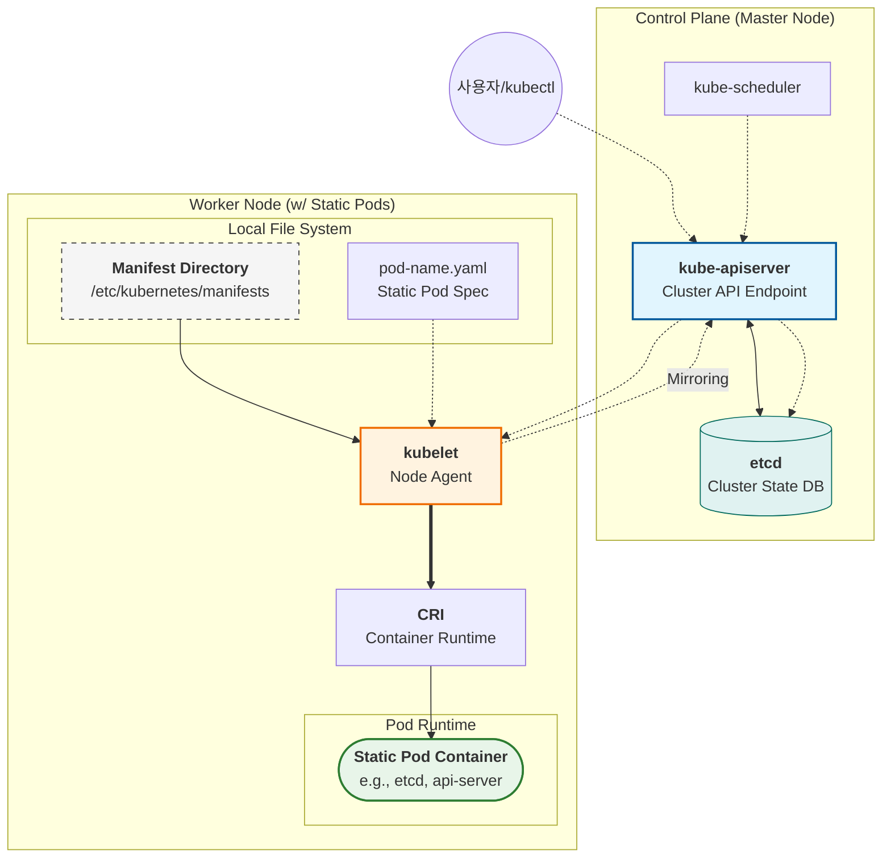

> ⚠️

### 어떤 컴포넌트들이 Static Pod 로 작동하는가?

1. 

### StaticPod 삭제방법

Static Pod 는 `/etc/kubernetes/manifests` 안에 있는 yaml 로 돌아가기 때문에 생명주기가 철저히 해당 파일에 의존적이다.
또한 kubectl get pods 로 보이는 static pod 는 사실 API 서버에서 생성된 Mirror Pod 이기 때문에 kubectl delete 로 지운다고해서 원본이 제거되는 것이 아니다.
따라서 Static Pod 를 제거하고자 한다면 `/etc/kubernetes/manifests` 안에 있는 yaml 를 제거하거나 이동시켜주면 된다.

### 적용 & 확인


## VPA

### VPA 란 ??

VPA 는 Pod에 할당된 CPU/Memory의 `requests`와 `limits`를 실제 사용량에 맞춰 동적으로 수정한다.
VPA 가 설정을 변경할 때 Pod 는 재시작 될 수 있다.

### [원리](https://kubernetes.io/docs/concepts/workloads/autoscaling/vertical-pod-autoscale/#how-does-a-verticalpodautoscaler-work)


1. **Recommender:** `Metrics Server`로부터 Pod의 실제 리소스 사용 이력을 수집하고 분석하여 최적의 `requests` 값을 계산(추천)한다.
2. **Updater:** 현재 실행 중인 Pod의 리소스 설정이 추천값과 다를 경우, 해당 Pod를 삭제(Evict)한다.
3. **Admission Controller:** Pod가 재시작될 때(Deployment 등에 의해), 실제 배포되기 직전에 Recommender가 추천한 리소스 값으로 `spec`을 변조하여 적용한다.

> ⚠️

### 적용 & 확인

**updateMode 종류을 통해 Pod 처리에 대한 정책을 처리한다.**

- `Auto`: VPA가 직접 Pod를 재시작시키며 리소스를 업데이트함.
- `Recommender`: 추천만 하고 실제 적용은 하지 않음 (모니터링 용도).
- `Off`: 아무 작업도 하지 않음.

```yaml
apiVersion: autoscaling.k8s.io/v1
kind: VerticalPodAutoscaler
metadata:
  name: my-app-vpa
spec:
  # 어떤 대상을 모니터링할지 지정
  targetRef:
    apiVersion: "apps/v1"
    kind: Deployment
    name: my-app
  # 업데이트 정책 설정
  updatePolicy:
    updateMode: "Auto" # Auto, Recommender, Off 중 선택
  # 리소스 제한 범위 설정 (선택 사항)
  resourcePolicy:
    containerPolicies:
      - containerName: '*'
        minAllowed:
          cpu: 100m
          memory: 128Mi
        maxAllowed:
          cpu: 1
          memory: 500Mi
```
```yaml
# 이후 적용 한 다음 확인을 아래와 같이 한다.
# 1) VPA 상태를 확인한다.
# 2) 실제로 Pod의 requests 를 확인한다.
kubectl get vpa -n ${namespace명}

kubectl describe vpa my-app-vpa -n ${namespace명}

kubectl get pod <deploy-name> -o yaml

kubectl get pod <pod-name> -o yaml | grep -A 5 resources
```

## HPA

### HPA 란 ??

앞서 VPA 는 사용량에 따라 Pod 에 할당된 사용량을 수정해주었다.
HPA 는 사용량에 따라 Pod 에 대한 동적 스케일링 인/아웃을 처리해주는 역할이다.

### 원리

1. **메트릭 수집:** `Metrics Server`로부터 대상 Pod들의 리소스 사용량을 주기적으로 조회한다
2. **계산:** 현재 사용량과 목표 사용량을 비교하여 필요한 Pod 수를 계산한다.

$$
desiredReplicas = \lceil currentReplicas \times \frac{currentMetricValue}{targetMetricValue} \rceil
$$

1. **조절:** 계산된 결과에 따라 Deployment나 ReplicaSet의 `replicas` 값을 수정한다.

### 적용 & 확인

1. kubectl 로 확인
2. manifest 로 적용

이후 확인은 아래와 같이 진행한다.

```yaml
# hpa 확인
# TARGETS 열에 우리가 선언한 수치가 표시
kubectl get hpa ${hpa-이름} -n ${namespace-이름}
kubectl describe hpa ${hpa-이름} -n ${namespace-이름}

# metric server 확인
# 1) Pod들의 실시간 리소스 사용량 확인
# 2) 특정 Deployment에 속한 Pod들만 확인
kubectl top pod -n ${namespace-이름}
kubectl top pod -l app=${deploy-이름} -n ${namespace-이름}

```

### 문제 1 : HPA 생성을 통해 기존 Deployment 스케일링

Create a new HorizontalPodAutoscaler (HPA) named apache-server in the autoscale namespace. This HPA must target the existing Deployment called apache-server in the autoscale namespace. 
● Set the HPA to target for 50% CPU usage per pod. 
● Configure hpa to have at min 1 Pod and no more than 4 Pods[max]. 
● Also, we have to set the downscale stabilization window to 30 seconds.

> 

```yaml
apiVersion: autoscaling/v2
kind: HorizontalPodAutoscaler
metadata:
  name: apache-server
  namespace: autoscale
spec:
  scaleTargetRef:
    apiVersion: apps/v1
    kind: Deployment
    name: apache-server
  minReplicas: 1
  maxReplicas: 4
  metrics:
  - type: Resource
    resource:
      name: cpu
      target:
        type: Utilization
        averageUtilization: 50
  # 보완: Stabilization Window 설정 (v2 버전 필수)
  behavior:
    scaleDown:
      stabilizationWindowSeconds: 30
      policies:
      - type: Percent
        value: 100
        periodSeconds: 15
```
```yaml
# HPA 확인
kubectl get hpa apache-server -n autoscale

# 메트릭 서버 확인
kubectl top pod -n autoscale
kubectl top pod -l app=apache-server -n autoscale
```


---


# 🌐 Service & Network

## EndpointSlice

### EndpointSlice 란 ??
### 문제 1: EndpointSlice


## Service

### Service 란 ??

Service는 동적으로 변하는 파드 IP를 추상화하여 안정적인 네트워크 엔드포인트를 제공하는 리소스입니다. 셀렉터(label selector)를 통해 대상 파드를 동적으로 선택하며, Endpoints(또는 EndpointSlice) 오브젝트가 실제 파드 IP 목록을 추적합니다.


### Service 타입

`ClusterIP`는 기본값으로, 클러스터 내부에서만 접근 가능한 가상 IP를 제공합니다. kube-proxy가 iptables/IPVS 규칙을 통해 트래픽을 파드로 분산합니다.
`NodePort`는 ClusterIP를 포함하며, 추가로 모든 노드의 특정 포트(30000-32767)에서 외부 트래픽을 수신합니다. 어느 노드로 요청이 들어오든 해당 Service의 파드로 라우팅됩니다.
`LoadBalancer`는 NodePort를 포함하며, 클라우드 공급자의 외부 로드밸런서를 자동으로 프로비저닝합니다. 온프레미스 환경에서는 MetalLB 등을 함께 사용합니다.
`ExternalName`은 외부 DNS 이름에 대한 CNAME 별칭을 제공하며, 파드 IP 변환 없이 CoreDNS 수준에서 처리됩니다.

### 문제 1 : NodePort 를 사용하여 기존 Deployment 노출

Reconfigure the existing Deployment front-end in namespace sp-culator to expose port 80/tcp of the existing container nginx.
Create a new Service named front-end-svc exposing the container port 80/tcp.
Configure the new Service to also expose the individual pods via & NodePort

> ⚠️
> ⚠️

```bash
kubectl edit deploy front-end -n sp-culator

apiVersion: apps/v1
kind: Deployment
metadata:
  name: front-end
  namespace: sp-culator
  labels:
    app: nginx
spec:
  replicas: 3
  selector:
    matchLabels:
      app: front-end
  template:
    metadata:
      labels:
        app: nginx
    spec:
      containers:
      - name: nginx
        image: nginx:1.14.2
        ports:
        - containerPort: 80

kubectl create service front-end-svc --port=80 --type=nodeport -n sp-culator

apiVersion: v1
kind: Service
metadata:
  name: front-end-svc
  namespace: sp-culator
spec:
  type: NodePort
  selector:
    app: front-end
  ports:
    - port: 80
      targetPort: 80

kubectl get svc front-end-svc -n sp-culator

kubectl get endpoints front-end-svc -n sp-culator
```

## NetworkPolicy

### NetworkPolicy 란 ?

Pod 간 트래픽 흐름을 IP 주소나 라벨 수준에서 제어하는 리소스
Namespaced Resource 이다.
정책이 하나라도 적용되면, 해당 포드는 **허용된 트래픽 외의 모든 연결을 차단한다**. 
정책이 없으면 모든 통신이 허용(Allow All)된다.

### Ingress/Egress

- **Ingress:** 포드로 들어오는 트래픽 (Inbound)
- **Egress:** 포드에서 나가는 트래픽 (Outbound)

### NetworkPolicy 에서 AND/OR 구분법

YAML 파일 내의 **대시(****`-`****)** 위치에 따라 논리 연산이 결정된다.
시험에서 가장 많이 틀리는 부분이니 꼭 기억해라

- OR 연산
- AND 연산

### 적용 & 확인

```yaml
apiVersion: networking.k8s.io/v1
kind: NetworkPolicy
metadata:
  name: db-policy
  namespace: default
spec:
  podSelector:
    matchLabels:
      app: db  # 정책을 적용할 대상 포드
  policyTypes:
  - Ingress
  ingress:
  - from:
    - podSelector:
        matchLabels:
          app: web
    ports:
    - protocol: TCP
      port: 80
```
```bash
# 정책 확인
kubectl get netpol -n ${namespace-이름}
kubectl describe netpol ${netpol-이름} -n ${namespace-이름}
# 
```

### 문제 1 : NetworkPolicy 선언

기본적으로 모든 인바운드 트래픽이 차단된 secure-ns 네임스페이스가 있습니다. 
이 네임스페이스 내에 app=database 라벨을 가진 포드가 있을 때, 동일한 네임스페이스 내의 app=web 라벨을 가진 포드로부터의 5432 포트 접속만 허용하고 나머지는 모두 차단하고 싶습니다. 이 정책을 어떻게 설계해야 할까요? 
특히 '정책을 적용할 대상(Target)'을 지정하는 법과 '허용 규칙(Ingress Rule)'을 작성하는 법을 중점적으로 설명해 주십시오.

```yaml
vim secure-ns-database-network-policy.yaml

apiVersion: networking.k8s.io/v1
kind: NetworkPolicy
metadata:
  name: secure-ns-database-network-policy
  namespace: secure-ns
spec:
  # 정책 적용 대상
  podSelector:
    matchLabels:
      app: database
  # 적용대상에 대한 Inbound (Ingress) 선언
  policyTypes:
  - Ingress
  ingress:
  - from:
    - podSelector:
        matchLabels:
          app: web
    ports:
    - protocol: TCP
      port: 5432
```
```bash
# 적용 이후 확인
alias k="kubectl"
type k
k get endpoints
k get pod -n secure-ns
k exec <web-pod이름> -n secure-ns -- curl <database-파드-ip>:5432
```

## Ingress

### Ingress 란 ?

클러스터 외부에서 내부 서비스로 접근하는 HTTP 및 HTTPS 경로를 노출하는 API 객체이다.
트래픽 라우팅은 Ingress 자원에 정의된 규칙에 의해 제어된다.

- L7 로드밸런싱을 처리하며
- SSL/TLS 를 지원하며
- 가상 호스팅을 통해 도메인 이름에 따른 서비스 매핑을 지원하며
- 경로 기반으로 라우팅을 처리

### 어떻게 L7 로드밸런싱을 처리하는가?

Ingress Controller(예: Nginx)가 클러스터 입구에서 모든 HTTP 요청을 가로챈다
그 후 요청 패킷의 **Application Layer(7계층)** 데이터를 열어보고, 사용자가 정의한 `rules`와 대조하여 
적절한 `Service`의 엔드포인트(Pod IP)로 트래픽을 넘겨준다

> L4 vs L7 로드밸런싱

### 어떻게 Ingress 가 가상 호스팅을 통해 도메인 이름에 따른 서비스 매핑을 지원하는가?

HTTP 요청 헤더에 포함된 **`Host`**** 필드**를 확인한다.
사용자가 `a.com`으로 접속하면, 헤더의 `Host: a.com`을 보고 그에 매핑된 서비스로 보낸다
만약 사용자가 `b.com`으로 접속하면, 똑같은 IP 주소라도 헤더 값을 보고 다른 서비스로 보냅니다.

### 어떻게 Ingress 가 경로 기반으로 라우팅을 처리하는가?

URL의 **Path** 문자열을 분석한다.
가령 아래와 같이 경로에 따라 API 와 WEB 으로 서비스를 분리했을 때
요청된 URL 의 Path 에 따라 서비스로 트래픽을 라우팅한다.

```yaml
apiVersion: networking.k8s.io/v1
kind: Ingress
metadata:
  name: smart-ingress
spec:
  ingressClassName: nginx
  rules:
  - host: "my-service.com"         # 가상 호스팅 (도메인)
    http:
      paths:
      - path: /api                 # 경로 기반 1
        pathType: Prefix
        backend:
          service:
            name: api-svc
            port:
              number: 8080
      - path: /                    # 경로 기반 2
        pathType: Prefix
        backend:
          service:
            name: web-svc
            port:
              number: 80
```

### 원리

Ingress 는 크게 크게 세 가지 계층이 협력하여 외부 트래픽을 내부 포드까지 전달한다.

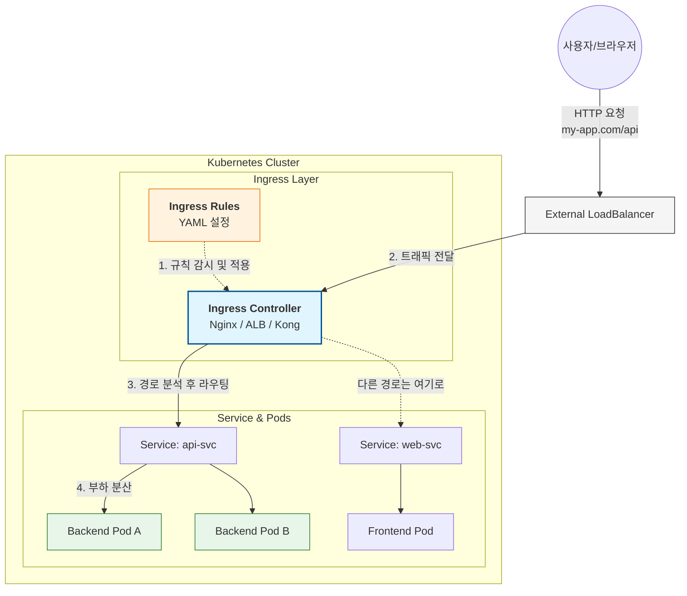

1. External LB
2. Ingress Controller
3. Ingress Rules

### 적용 & 확인

```yaml
apiVersion: networking.k8s.io/v1
kind: Ingress
metadata:
  name: echo
  namespace: echo-sound
spec:
  rules:
  - host: example.org            # ← 반드시 host 명시
    http:
      paths:
      - path: /echo
        pathType: Prefix
        backend:
          service:
            name: echoserver-service
            port:
              number: 8080
```
```yaml
# Ingress 확인
# ADDRESS 항목에 IP/호스트네임 확인
kubectl get ingress ${ingress-이름} -n ${namespace-이름}

# Service 확인
# Pod 에 대해 IP,Port 제대로 매핑 확인
kubectl get endpoints ${service-이름} -n ${namespace-이름}
OR
kubectl get endpoints -n ${namespace-이름}
```

### 문제 1 : Ingress 생성

Create a new Ingress resource echo in the echo-sound namespace.
● Exposing Service echoserver-service on [http://example.org/echo](http://example.org/echo) using
Service port 8080.
● The availability of Service echoserver-service can be checked using the
following command, which should return 200:
[candidate@cka0001]$ curl -o /dev/null -s -w "%{http_code}\n"
[http://example.org/echo](http://example.org/echo)

> ⚠️
> ⚠️
> ⚠️

```bash
vi echo-ingress.yaml

apiVersion: networking.k8s.io/v1
kind: Ingress
metadata:
  name: echo
  namespace: echo-sound
spec:
  rules:
  - host: example.org            # ← 반드시 host 명시
    http:
      paths:
      - path: /echo
        pathType: Prefix
        backend:
          service:
            name: echoserver-service
            port:
              number: 8080

kubectl apply -f echo-ingress.yaml

kubectl get ingress echo -n echo-sound

kubectl get endpoints echoserver-service -n echo-sound

curl -o /dev/null -s -w "%{http_code}\\n" <http://example.org/echo>
```

## **Gateway API (Gateway & HTTPRoute)**

정의 ?
Ingress 의 개선형 리소스로써, Ingress 의 역할을 각각의 리소스로 쪼개서 관리하게끔 한다.
기존 Ingress 의 단점은 다음과 같다.

1. 단일리소스라 멀티 테넌시 호스트 별로 분리가 어려움
2. 특정 CRD 구현을 위해 전용 어노테이션을 나열하여 매니페스트가 길어짐
3. 트래픽 라우팅에 대한 추가기능 — 비율분산, Rate Limit, Header 수정 및 필터 등등 — 을 처리할 수 없음

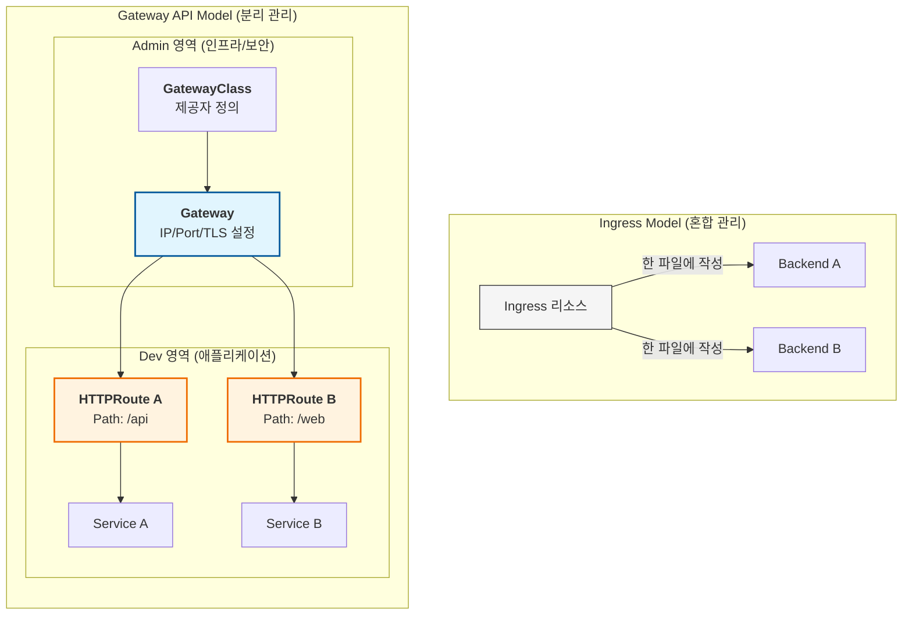


반면 Gateway API 는 GatewayClass, Gateway, HttpRoute 를 통해 이 역할들을 분리하여 처리한다.
GatewayClass 는 인프라 제공자에 대한 로드밸런서 유형 정의서이다. 이를 통해 트래픽을 어떤 인프라의 어떤 로드밸런서로부터 받을지 알 수 있다.
Gateway 는 어떤 트래픽을 처리하는지 정의서이다. 가령 어떤 IP 를 사용할지, 어떤 Port 를 사용할지, 어떤 TLS 인증서를 사용할지 결정한다.
HTTPRoute 는 HTTP 트래픽을 실제 서비스로 매핑하는 규칙이다. 여기서 매칭, 필터링을 처리한다.


이렇게 쪼개진 리소스들에 대해 각기 다른 권한의 책임자들이 담당하여 수행할 수 있게된다.


### **GatewayClass**

[https://gateway-api.sigs.k8s.io/api-types/gatewayclass/?h=gateway](https://gateway-api.sigs.k8s.io/api-types/gatewayclass/?h=gateway)
클러스터 전체에서 사용할 수 있는 로드밸런서의 '유형'을 정의한다.
인프라 제공자(AWS, GCP, Nginx 등)가 미리 설정해둔 템플릿이다.
주로 인프라 제공자 / 클러스터 관리자가 관리한다.
** cluster-scoped resource 임을 명심하자**

```yaml
apiVersion: gateway.networking.k8s.io/v1
kind: GatewayClass
metadata:
  name: external-nginx
spec:
  controllerName: k8s-gateway.nginx.org/nginx-gateway-controller
```

### **Gateway**

[https://gateway-api.sigs.k8s.io/api-types/gateway/?h=gateway](https://gateway-api.sigs.k8s.io/api-types/gateway/?h=gateway)
클러스터로 트래픽을 실제로 처리하는 리소스이다.
어떤 IP 를 사용할지, 어떤 Port 를 사용할지, 어떤 TLS 인증서를 사용할지 결정한다.
주로 클러스터 관리자나 네트워크 팀이 관리한다.

```yaml
apiVersion: gateway.networking.k8s.io/v1
kind: Gateway
metadata:
  name: prod-gateway
  namespace: infrastructure
spec:
  gatewayClassName: external-nginx # 위에서 정의한 Class 참조
  listeners:
  - name: http
    protocol: HTTP
    port: 80
    allowedRoutes:
      namespaces:
        from: All # 모든 네임스페이스의 Route 연결 허용
```

### **HTTPRoute**

[https://gateway-api.sigs.k8s.io/api-types/httproute/?h=httproute](https://gateway-api.sigs.k8s.io/api-types/httproute/?h=httproute)
Gateway 로 들어온 트래픽을 실제 서비스로 매핑하는 규칙이다.
URL 경로 매칭, 헤더 필터링, 트래픽 가중치 분산 등등을 설정할 수 있다.
주로 서비스 개발자 / 서버 운영팀이 관리한다.
다음과 같은 yaml 구조를 띈다

- ParentRefs : 이 라우트가 연결될 게이트웨이를 지정
- Hostnames (optional) : HTTP 요청의 Host 헤더와 일치시키는 데 사용할 호스트 이름 목록을 지정
- Rules : 일치하는 HTTP 요청에 대해 수행할 작업 목록을 지정한다. 

```yaml
apiVersion: gateway.networking.k8s.io/v1
kind: HTTPRoute
metadata:
  name: api-route
  namespace: dev-team
spec:
	# 어떤 Gateway에 붙을지 지정
  parentRefs:
  - name: prod-gateway
    namespace: infrastructure
	# Host 헤더 일치 목록
  hostnames:
  - my.example.com
	# 트래픽 처리 정책
  rules:
	  ,,,,
```

HttpRoute 는 조건(Match) → 가공(Filter) → 전달(Action) 흐름으로 처리되며 각각 다음과 같이 처리할 수 있다.

1. Matching(라우팅 규칙)
2. Filter
3. BackendRefs

### 보안 및 TLS 설정

1. **TLS Termination**
2. **SNI (Server Name Indication)**
3. **Cross-Namespace Secret**

### 적용 & 확인

- **GatewayClass**
- **Gateway**
- **HTTPRoute**

### 문제 1 : Ingress 에서 Gateway 로 전환

[https://gateway-api.sigs.k8s.io/guides/getting-started/migrating-from-ingress/?h=secret#migrating-from-ingress](https://gateway-api.sigs.k8s.io/guides/getting-started/migrating-from-ingress/?h=secret#migrating-from-ingress)
Migrate an existing web application from Ingress to Gateway API. We must maintain HTTP success. 
A GatewayClass named nginx is installed in the cluster.
First, create a Gateway named web-gateway with hostname
gateway.web.k8s.local that maintains the existing TLS and listener
configuration from the existing Ingressresource named web.
Next, create an HTTPRoute named web-route with hostname
gateway.web.k8s.local that maintains the existing routing rules from the
current Ingress resource named web.
You can test your Gateway API configuration with the following command:
[candidate@cka0001]$ curl -k [https://gateway.web.k8s.local](https://gateway.web.k8s.local/)
Finally, delete the existing Ingress resource named web.

> ⚠️
> ⚠️
> ⚠️

```yaml
vi nginx-gateway.yaml

apiVersion: gateway.networking.k8s.io/v1
kind: Gateway
metadata:
  name: web-gateway
  namespace: <ingress와 같은 namespace>
spec:
  gatewayClassName: nginx
  listeners:
  - name: https
    port: 443
    protocol: HTTPS
    hostname: "gateway.web.k8s.local"
    tls:
      mode: Terminate
      certificateRefs:
      - kind: Secret
        name: <ingress와 같은 tls Secret 이름>

vi nginx-httproute.yaml

apiVersion: gateway.networking.k8s.io/v1
kind: HTTPRoute
metadata:
  name: web-route
  namespace: <ingress와 같은 namespace>
spec:
  parentRefs:
  - name: web-gateway
    sectionName: https
  hostnames:
  - gateway.web.k8s.local
  rules:
  - matches:
    - path:
        type: PathPrefix
        value: /
    backendRefs:
    - name: <ingress에서 확인한 서비스>
      port: <ingress에서 확인한 포트>
    ,,, 이외 ingress 와 동일한 규칙 적용 ,,,
```
```bash
kubectl apply -f vi nginx-gateway.yaml

kubectl apply -f vi nginx-httproute.yaml

kubectl describe gateway web-gateway -n <ingress와 같은 namespace>
# STATUS, IP, PORT 확인

kubectl describe httproute web-route -n <ingress와 같은 namespace>
# SERVICE 매핑 확인

curl -k [https://gateway.web.k8s.local](https://gateway.web.k8s.local/)

kubectl delete ingress web -n <ingress와 같은 namespace>
```


# 📦 Storage

## PV / PVC / StorageClass


### Persistent Volume / Persistent Volume Claim 이란 ??

PV : 클러스터 관리자가 프로비저닝한 실제 저장 공간(스토리지). 클러스터 수준(Cluster-scoped) 리소스이다.
PVC : 개발자가 얼만큼 사용하겠다의 리소스 선언하는 선언문, 이에 대해 적합한 PV 를 PersistentVolume 컨트롤러가 매핑해준다. 따라서 네임스페이스 수준(Namespaced) 리소스이다.
사용자가 PVC를 생성하면, 쿠버네티스 컨트롤러가 적절한 PV를 찾아 둘을 연결(**Binding**)한다.

### PV 에 대한 상태 머신

PV는 생성부터 삭제까지 크게 4~5가지의 상태를 거친다.

1. **Available (가용):** PV가 생성되었지만 아직 어떤 PVC에도 바인딩되지 않은 순수한 상태이다.
2. **Bound (바인딩됨):** 특정 PVC와 연결이 완료된 상태이다. 이제 Pod에서 이 볼륨을 사용할 수 있다.
3. **Released (해제됨):** 연결되었던 PVC가 삭제되었을 때의 상태이다. Reclaim Policy가 `Retain`인 경우 이 상태로 남게 된다.
4. **Failed (실패):** 자동 복구나 해제 과정에서 에러가 발생한 상태이다.
5. **Deleted (삭제됨):** Reclaim Policy가 `Delete`인 경우, PVC 삭제와 함께 PV도 삭제된다.

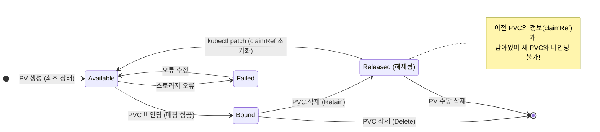

### PVC의 **Access Modes**

PVC 의 **Access Modes** 란 Pod 가 볼륨에 접근할 때 어떤 모드로 접근할지 정의한다
이 때 volume 이 연결된 node 개수에 따라 정의하게 된다. 가령 single node 냐, multi node 에 대해 RWO 냐 RWX 냐가 결정된다.
다만 파드 개수와는 무관하다. 일례로 RWO 모드라도 동일한 노드 내에서 실행 중인 **여러 개의 파드**는 이 볼륨을 동시에 읽고 쓸 수 있다
이 모드의 종류는 다음과 같다

- `ReadWriteOnce(RWO)` : the volume can be mounted as read-write by a single node.
- `ReadOnlyMany(ROX)` : the volume can be mounted as read-only by many nodes.
- `ReadWriteMany(RWX)` : the volume can be mounted as read-write by many nodes.

### StorageClass 란 ?

직접 PV 를 선언하여 PVC 를 통해 스토리지를 확보하는 것을 정적 프로비저닝이라고 한다
이러면 개발자가 볼륨이 필요할 때마다 PV 를 선언해줘야한다
쿠버네티스에서는 스토리지를 동적으로 생성하게 할 수 있는 동적 프로비저닝을 지원할 수 있다
이 때 외부 스토리지에 대한 프로비저너를 사용하는데 이를 매핑시켜주는 것이 바로 StorageClass 이다.
StorageClass 를 선언하고 나면 프로비저너가 알아서 PV 를 프로비저닝하여 동적으로 매핑해준다.
Provisioner(CSI Driver) 가 실제 작업을 수행한다.

1. PVC의 요청 사항(크기, 접근 모드)과 StorageClass의 parameters를 수신
2. Cloud Provider API를 호출하여 **실제 물리 디스크 생성**
3. Cloud Provider가 볼륨 ID를 반환

만약 PVC에서 `storageClassName`을 명시하지 않으면 시스템에 설정된 **기본 StorageClass**가 사용되어 자동으로 PV가 생성된다.
`정적 프로비저닝 예시`

```java
apiVersion: v1
kind: PersistentVolume
metadata:
  name: example-pv
spec:
  capacity:         # Volume 용량
    storage: 1Gi    
  accessModes:      # 접근 옵션
    - ReadWriteOnce
  persistentVolumeReclaimPolicy: Retain  # PV가 삭제되었을 때의 초기화 옵션
  hostPath:                              # 마운트시킬 로컬 서버의 경로
    path: /data/example-pv
---
apiVersion: v1
  kind: PersistentVolumeClaim
  metadata:
    name: example-pvc
  spec:
    accessModes:             # 접근 옵션
      - ReadWriteOnce
    resources:               # 자원을 얼마나 사용할 것인지 요청 (PV의 용량을 초과하면 안됨)
      requests:
        storage: 500Mi
```

`동적 프로비저닝 예시` 

```java
apiVersion: storage.k8s.io/v1
kind: StorageClass
metadata:                            
  name: example-storageclass        # StorageClass의 이름을 지정합니다.
provisioner: kubernetes.io/gce-pd   # Google Compute Engine Persistent Disk 를 스토리지 플러그인으로 사용합니다.
reclaimPolicy: Retain               # PV가 삭제되어도 데이터를 보존합니다.
---
apiVersion: v1
  kind: PersistentVolumeClaim
  metadata:
    name: example-pvc
  spec:
    accessModes:            # PV에 대한 액세스 모드를 나타냅니다.
      - ReadWriteOnce
    resources:
      requests:
        storage: 1Gi        # PVC가 요청하는 스토리지의 크기를 나타냅니다.
    storageClassName: example-storageclass  # PV가 동적으로 프로비저닝될 때 사용될 StorageClass를 나타냅니다.
```

### PV 상태와 동적 프로비저닝 원리

1. 사용자가 StorageClass, PVC 선언
2. `PersistentVolume` 컨트롤러가 PVC를 감지
3. `StorageClass`에 정의된 **Provisioner**(예: AWS EBS, GCP PD)가 실제 물리 디스크를 생성하고, 그에 맞는 **PV** 리소스를 자동으로 생성
4. Pod 가 생성되어 해당 PVC 를 마운트
5. PVC 삭제 시 StorageClass 의 reclaimPolicy 에 따라 PV 삭제 처리

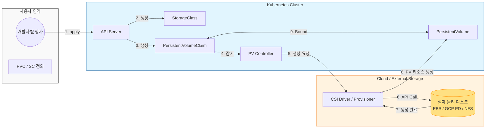


### 적용 & 확인

```yaml
# storage-class.yaml
apiVersion: storage.k8s.io/v1
kind: StorageClass
metadata:
  name: fast-storage
provisioner: kubernetes.io/aws-ebs  # AWS EBS 프로비저너 사용
reclaimPolicy: Retain              # 삭제 시 데이터 보존 (Released 상태 유도)
volumeBindingMode: WaitForFirstConsumer
allowVolumeExpansion: true

---

# pvc.yaml
apiVersion: v1
kind: PersistentVolumeClaim
metadata:
  name: web-pvc
  namespace: default
spec:
  accessModes:
    - ReadWriteOnce
  resources:
    requests:
      storage: 1Gi
  storageClassName: fast-storage
```
```bash
# PVC 상태 확인 -> STATUS가 Pending인지 확인
# PV 확인
kubectl get pvc web-pvc -n ${namespace-이름}
kubectl describe pvc web-pvc -n ${namespace-이름}
kubectl get pv -n ${namespace-이름}

# 파드 접속하여 마운팅 확인
# df -h : disk free 명령어, -h 는 보기 쉽게 하는 옵션
kubectl get pod -n ${namespace-이름}
kubectl exec ${pod-이름} -- df -h | grep /data
```

### 문제 1 : PV 오류 수정 & PVC 바인딩

A user accidentally deleted the MariaDB Deployment in the mariadb namespace, which was configured with persistent storage. Your responsibility is re-establish the Deployment while ensuring data is preserved by reusing the available PersistentVolume.

- A PersistentVolume already exists and is retained for reuse
(only one PV exists).
- Create a PersistentVolumeClaim (PVC) named mariadb in the
mariadb namespace with the following spec:
- Edit the MariaDB Deploy file located at ~/mariadb-deploy.yaml to use the PVC created in the previous step.
- Apply the updated Deployment file to the cluster.
- Ensure the MariaDB Deployment is running and Stable

> 
> 

```yaml
# 1. 기존 PV 확인 (Retain 정책이라 Released 상태일 것)
kubectl get pv

# 2. PV의 claimRef 초기화 (Released → Available로 만들기)
kubectl patch pv ${pv-name} --type=json \\
  -p='[{"op":"remove","path":"/spec/claimRef"}]'

vi mariadb-pvc.yaml

apiVersion: v1
kind: PersistentVolumeClaim
metadata:
  name: mariadb
  namespace: mariadb
spec:
  accessModes:
    - ReadWriteOnce
  resources:
    requests:
      storage: 250Mi

k apply -f mariadb-pvc.yaml

k get pvc -n mariadb

# 3. deployment pvc 사용토록 수정
vi ~/mariadb-deploy.yaml

apiVersion: apps/v1
kind: Deployment
metadata:
  name: mariadb-deploy
  ,,,
spec:
  ,,,
  template:
    spec:
      volumes:
      - name: data
        persistentVolumeClaim:
          claimName: mariadb
      containers:
          ,,,,

k apply -f  ~/mariadb-deploy.yaml

k get deploy -n mariadb

kubectl rollout status deploy mariadb-deploy -n mariadb
```

### 문제 2 : StorageClass 생성 & 적용

Create a new StorageClass named low-latency that uses the existing provisioner [rancher.io/local-path](http://rancher.io/local-path).

- Set the VolumeBindingMode to WaitForFirstConsumer.
(Mandatory or the score will be reduced.)
- Make the newly created StorageClass (low-latency) the default
StorageClass in the cluster.
- Do NOT modify any existing Deployments or
PersistentVolumeClaims. (If modified, the score will be reduced)

> 

```yaml
apiVersion: storage.k8s.io/v1
kind: StorageClass
metadata:
  name: low-latency
  annotations:
    storageclass.kubernetes.io/is-default-class: "true"
provisioner: rancher.io/local-path
allowVolumeExpansion: true
volumeBindingMode: WaitForFirstConsumer

k apply -f low-latency

k get storageclass low-latency
```


# 💡 Tips

## ⭐ PSI 브라우저에서 복붙 ⭐ 

요령을 몰라서 계속 Command + C 이후에 마우스 오른쪽 클릭 이후 일일이 Paste 를 눌렀다,,,
복사 → 
붙여넣기 → 

### JSONPath 필터링 문법

시험 시간 단축의 핵심입니다.

- **정렬:** `kubectl get pods -A --sort-by=.metadata.name`
- **추출:** `kubectl get nodes -o jsonpath='{.items[*].status.addresses[?(@.type=="InternalIP")].address}'`
- **헤더 설정:** `kubectl get nodes -o custom-columns=NAME:.metadata.name,IP:.status.addresses[0].address`

## 1회 기출 풀이


# 1 ✅

```
# configmap 가져오기
kubectl get configmap nginx-config -n nginx-static -o yaml > nginx-config.yaml

# TLS 활성화
vi nginx-config.yaml
TLSv1.3 -> TLSv1.2 로 변경 혹은 추가

# configmap 업데이트
kubectl apply -f nginx-config.yaml

# deployment 재시작
kubectl rollout restart deploy nginx-static -n nginx-static
kubectl rollout status deploy nginx-static -n nginx-static

# 최종 확인
kubectl describe deploy nginx-static -n nginx-static
curl -k --tls-max 1.2 <https://web.k8s.local:30007>
```

이미 존재하는 configmap 에 대해서는 apply 보다는 patch/replace 가 더 안전

# 2 ✅

```
vi apache-server-hpa.yaml

apiVersion: autoscaling/v2
kind: HorizontalPodAutoscaler
metadata:
  name: apache-server
  namespace: autoscale
spec:
  scaleTargetRef:
    apiVersion: apps/v1
    kind: Deployment
    name: apache-server
  minReplicas: 1
  maxReplicas: 4
  metrics:
  - type: Resource
    resource:
      name: cpu
      target:
        type: Utilization
        averageUtilization: 50
  behavior:
    scaleDown:
      stabilizationWindowSeconds: 30

kubectl apply -f apache-server-hpa.yaml

kubectl get hpa apache-server -n autoscale

kubectl describe hpa apache-server -n autoscale
```

hpa 이름을 잘못 적음, 문제는 `apache-server`인데 답안은 `apache-server-hpa`로 지정
최종 확인 시 deploy 가 아니라 HPA 리소스를 확인해야 함 (watch 는 본인이 쓰고싶은대로 사용)
HPA 에도 namespcae 적용해야함. 어떤 k8s 리소스가 namespace bound 인지 non namespace bound 인지 구분을 못 하는 것 같음, 정리 요망

# 3 ✅

```bash
# 1. 기존 PV 확인 (Retain 정책이라 Released 상태일 것)
kubectl get pv

# 2. PV의 claimRef 초기화 (Released → Available로 만들기)
kubectl patch pv ${pv-name} --type=json \\
  -p='[{"op":"remove","path":"/spec/claimRef"}]'

# 3 PVC 생성
vi mariadb-pvc.yaml

apiVersion: v1
kind: PersistentVolumeClaim
metadata:
  name: mariadb
  namespace: mariadb
spec:
  accessModes:
    - ReadWriteOnce
  volumeMode: Filesystem
  resources:
    requests:
      storage: 250Mi

# 4 Deploy 가 생성한  PVC 사용하도록 수정
kubectl get deploy mariadb-deploy -n mariadb
vi ~/mariadb-deploy.yaml

apiVersion: apps/v1
kind: Deployment
metadata:
  name: mariadb-deploy
  ,,,
spec:
  ,,,
  template:
    spec:
      volumes:
      - name: data
        persistentVolumeClaim:
          claimName: mariadb
      containers:
          ,,,,

# 5 PVC 적용 후 PVC 확인
kubectl apply -f ~/mariadb-pvc.yaml

kubectl get pvc -n mariadb

# 6 Deploy 적용 후 확인
kubectl apply -f ~/mariadb-deploy.yaml

kubectl get deploy mariadb-deploy -n mariadb

kubectl rollout status deploy mariadb-deploy -n mariadb
```

**PVC 이름이 틀림** → 문제는 `mariadb`인데 답안은 `mariadb-pvc`
**PV가 Retain 상태**이므로, 기존 PV를 재사용하려면 PV의 `claimRef`를 먼저 초기화해야 바인딩 가능 → 이 과정을 완전히 놓침

# 4 ✅

```
kubectl get storageclass
만약 StorageClass 가 있고 default 설정이 되어있다면 default 설정 어노테이션 제거

vi low-latency.yaml

apiVersion: storage.k8s.io/v1
kind: StorageClass
metadata:
  name: low-latency
  annotations:
    storageclass.kubernetes.io/is-default-class: "true"
provisioner: rancher.io/local-path
allowVolumeExpansion: true
volumeBindingMode: WaitForFirstConsumer

kubectl apply -f low-latency.yaml

kubectl get storageclass low-latency
```

**기존 default StorageClass가 있다면 반드시 기존 것의 default 어노테이션을 제거**해야 함 → 하지 않으면 default가 2개가 되어 동작 불안정
`reclaimPolicy`, `parameters.guaranteedReadWriteLatency` 등 문제에서 명시하지 않은 항목은 추가하지 않는 게 안전

# 5 ✅

**Gateway spec 구조가 틀림** → `tls`는 `listeners` 하위 항목이며 HTTP listener에는 tls 블록이 없음. TLS는 `protocol: HTTPS` 또는 `protocol: TLS`일 때만 사용

```
kubectl get ingress web -o yaml > web-ingress.yaml

해당 인그레스 yaml 에서 시크릿이름 확인

vi nginx-gateway.yaml

apiVersion: gateway.networking.k8s.io/v1
kind: Gateway
metadata:
  name: nginx-gateway
  namespace: <ingress와 같은 namespace>
spec:
  gatewayClassName: nginx
# 올바른 구조 - 모두 listener 하위에 들여쓰기
listeners:
- name: https
  protocol: HTTPS
  port: 443
  hostname: "gateway.web.k8s.local"  # ← listener 직속
  tls:                                # ← listener 직속
    mode: Terminate                   # ← tls 하위
    certificateRefs:                  # ← tls 하위
    - kind: Secret
      group: ""
      name: <secret명>
  allowedRoutes:                      # ← listener 직속
    namespaces:
      from: Same
--
apiVersion: gateway.networking.k8s.io/v1
kind: HTTPRoute
metadata:
  name: web-route
  namespace: &lt;같은 namespace&gt;
spec:
  parentRefs:                    # ← 필수! Gateway 연결
  - name: web-gateway
  hostnames:
  - "gateway.web.k8s.local"
  rules:
  - matches:
    - path:
        type: PathPrefix
        value: /
    backendRefs:
    - name: <ingress에서 확인한 서비스>
      port: <포트>

kubectl apply -f nginx-gateway.yaml

kubectl get gateway nginx-gateway

curl -k <https://gateway.web.k8s.local>

kubectl delete ingress web
```

`hostname`은 listener 하위가 아닌 올바른 위치에 있어야 함
HTTP 가 아니라 HTTPS
따라서 port 도 80 이 아니라 443 으로 처리
HttopRoute 에서 parentRefs 와 parentRefs.hostnames, parentRefs.rules 에 대해서 선언해줘야 Gateway 와 매핑됨
**마지막에 기존 Ingress 삭제**를 놓침

# 6 ✅

```
vi echo-ingress.yaml

apiVersion: networking.k8s.io/v1
kind: Ingress
metadata:
  name: echo
  namespace: echo-sound
spec:
  rules:
  - host: example.org            # ← 반드시 host 명시
    http:
      paths:
      - path: /echo
        pathType: Prefix
        backend:
          service:
            name: echoserver-service
            port:
              number: 8080

kubectl apply -f echo-ingress.yaml

kubectl get ingress echo -n echo-sound

kubectl get endpoints echoserver-service -n echo-sound

curl -o /dev/null -s -w "%{http_code}\\n" <http://example.org/echo>
```

`host: example.org` 필드가 빠져 있음 → host 없으면 도메인 기반 라우팅 안 됨
최종 확인에서 `kubectl endpoints`는 잘못된 명령 → `kubectl get endpoints`

# 7 ✅

NetworkPolicy 원리 이해를 못 함, 다시 공부할 것
restrictive NetworkPolicy 에 대해서도 다시 공부할 것
`~/netpol` 폴더에 여러 NetworkPolicy YAML이 이미 있음
직접 작성하는 게 아니라 **폴더에서 가장 restrictive한 것을 골라서 apply**하는 문제

```bash
# 1. frontend/backend deployment 확인 (label, port 파악)
kubectl get deploy -n frontend -o yaml
kubectl get deploy -n backend -o yaml
kubectl get pods -n frontend --show-labels
kubectl get pods -n backend --show-labels

# 2. 기존 deny-all netpol 확인
kubectl get networkpolicy -n frontend
kubectl get networkpolicy -n backend

# 3. ~/netpol 폴더의 파일 목록 확인
ls ~/netpol/
cat ~/netpol/*.yaml   # 각 파일 내용 확인

# 4. 가장 restrictive한 것 선택하여 apply
# (frontend→backend 통신만 허용하고 나머지는 최소화된 것)
kubectl apply -f ~/netpol/&lt;선택한파일&gt;.yaml

# 5. 확인
kubectl get networkpolicy -n backend
kubectl get networkpolicy -n frontend
```

# 8 ✅

label 실수, deployment의 pod label과 일치해야 함
NodePort 잘못 지정함, 범위는 30000~32767. 번호 미지정 시 자동 할당, 여기서는 아예 자동할당 맡기는 게 나음

```bash
kubectl edit deploy front-end -n sp-culator

apiVersion: apps/v1
kind: Deployment
metadata:
  name: front-end
  namespace: sp-culator
  labels:
    app: nginx
spec:
  replicas: 3
  selector:
    matchLabels:
      app: front-end
  template:
    metadata:
      labels:
        app: nginx
    spec:
      containers:
      - name: nginx
        image: nginx:1.14.2
        ports:
        - containerPort: 80

kubectl create service front-end-svc --port=80 --type=nodeport -n sp-culator

apiVersion: v1
kind: Service
metadata:
  name: front-end-svc
  namespace: sp-culator
spec:
  type: NodePort
  selector:
    app: front-end
  ports:
    - port: 80
      targetPort: 80

kubectl get svc front-end-svc -n sp-culator

kubectl get endpoints front-end-svc -n sp-culator
```


[CKA 치트시트](http://sunrise-min.tistory.com/entry/2025-CKA-%EC%8B%9C%ED%97%98-%EC%A4%80%EB%B9%84-%ED%95%B5%EC%8B%AC-%EC%9A%94%EC%95%BD#Service_&_Network)
[CKS 치트시트](https://devops-james.tistory.com/233)
첫 시험 -  [https://trainingportal.linuxfoundation.org/learn/course/certified-kubernetes-administrator-cka/exam/exam](https://trainingportal.linuxfoundation.org/learn/course/certified-kubernetes-administrator-cka/exam/exam) 
[CKA 문제 & 정답 - CKA 카페](https://cafe.naver.com/f-e/cafes/30725715/menus/64?viewType=L)
[인프런 CKA - ID : mypoohmy@gmail.com PW : cka1234!](https://www.inflearn.com/course/certified-kubernetes/dashboard?cid=339687)
