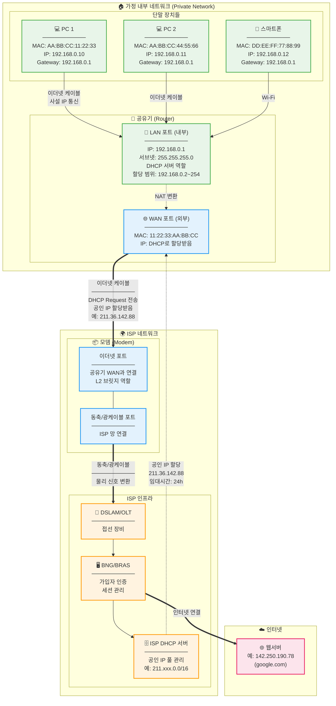
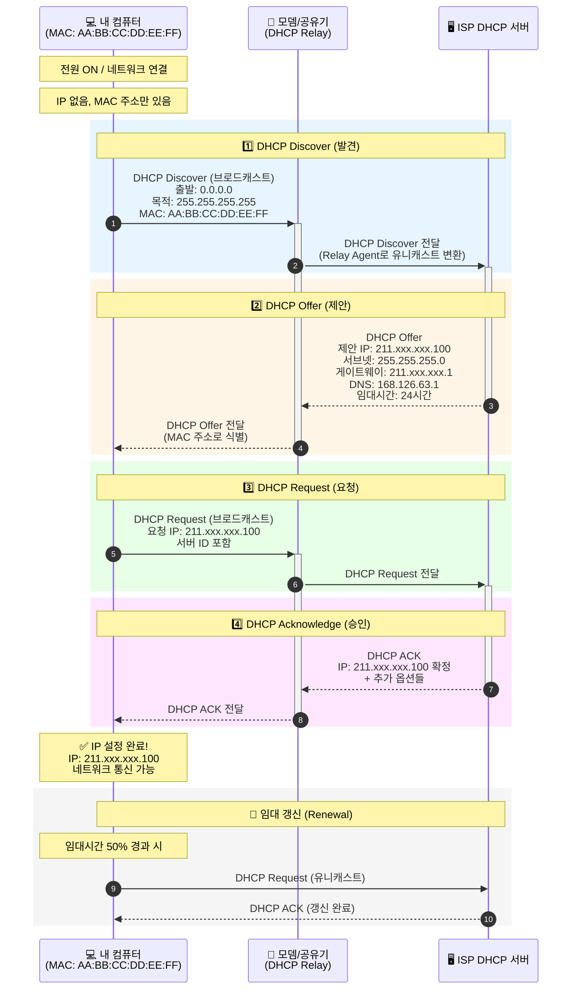

# Why?

ISP 에서 보안 상의 이유로 IP 를 계속 바꾼다.

이에 따라 홈랩 운영을 위해 IP 를 고정하고자 DHCP 를 배우게 되었다.

# What?

### 동적 IP vs 정적 IP

- 정적 IP
- 동적 IP

|           | 동적 IP (Dynamic IP)                             | 정적 IP (Static IP)          |
| --------- | ------------------------------------------------ | ---------------------------- |
| 할당 방식 | DHCP 서버 자동 할당                              | 수동 설정 또는 ISP 고정 제공 |
| 변경 여부 | 연결/재부팅 시 변경됨                            | 변경되지 않음                |
| 비용      | 저렴 (기본 제공)                                 | 비싸거나 추가 요금           |
| 용도      | 가정용, 일반 사용자                              | 서버, 웹호스팅, 원격 접속    |
| 장점      | IP 효율적 관리, 보안 강화 (변경으로 추적 어려움) | 안정적 접근, 원격 관리 용이  |
| 단점      | IP 변경으로 서비스 불안정                        | 관리 복잡, 비용 발생         |

> 🤷‍♂️ 정적 IP 한계점 ( ≈ 동적 IP 사용 이유 )

## 사용자부터 ISP 를 거쳐서 대상 호스트까지의 접근 원리

> ✅ TL;DR;

### 1.

LAN

- **DHCP 서버**
- **기본 게이트웨이**
- **L2 + L3 처리**

### 2.

WAN

- 단말 기기가 외부 서버 요청 시 — 출발IP:192.168.0.10, 목적지IP:142.250.190.78(google.com) —

### 3.

모뎀 ( 물리적으로는 라우터 + 모뎀으로 구성되어있을 수 있으나 네트워크 관점으로 ISP 에 속함 )

- 신호를 ISP 회선 규격에 맞게 변환
- ISP 접선 장비(DSLAM/OLT)로 전달

### 4.

ISP

1.

DSLAM / OLT (접선 장비) 2.

BNG / BRAS (가입자 인증 & 세션 관리자) 3.

SP DHCP 서버 — 공인 IP의 주인



## DHCP 란 ?

Dynamic Host Configuration Protocol
클라이언트에게 일정 기간 임대를 하는 동적 주소 할당 프로토콜이다.

PC의 수가 많거나 PC 자체 변동사항이 많은 경우 IP 설정이 자동으로 되기 때문에 효율적으로 사용 가능하고
IP를 자동으로 할당해주기 때문에 IP 충돌을 막을 수 있다.

하지만, DHCP 서버에 의존하기 때문에 서버가 다운되면 ip 할당이 제대로 이루어지지 않는다.

## DHCP 처리 과정

DORA(Discover,Offer,Request,Ack) 의 과정을 거친다.

TCP 의 3 Handshake 를 떠오르면 기억하기 쉽다.

### Discover

클라이언트가 LAN 연결 시 자동으로 DHCP Client MAC 주소 기반으로 DHCP Server 에게 IP 주소를 요청한다

### Offer

DHCP Server 는 사용가능 IP 주소를 전달한다.

### Request

DHCP Client 는 주기적으로 IP 주소를 사용하겠다고 요청한다.

### Ack

DHCP Server 는 임대시간 정책에 따라 ACK 및 기타설정값들을 담아 ACK 한다.

이후 임대 기간 50% 도달 시 클라이언트가 서버에 **유니캐스트** DHCP Request를 보내 갱신 시도한다.

실패하면 87.5%에 브로드캐스트 Rebind를 시도한다.



## Linux 에서의 DHCP 실제 흐름

> 🤷‍♂️ 아래 과정을 직접 눈으로 확인하려면 어떻게 해야할까,,,?
> 💡 linux 기반으로 설명하며,

전체 프로세스는 아래와 같다.

하나씩 살펴보자.

```bash
1. 네트워크 인터페이스 활성화
        ↓
2. dhclient/NetworkManager 등 DHCP 클라이언트 시작
        ↓
3. DORA 프로세스 수행
        ↓
4. IP 정보 수신 후 인터페이스에 적용
        ↓
5. /etc/resolv.conf 업데이트 (DNS 정보)
        ↓
6. 라우팅 테이블 설정 (기본 게이트웨이)
```

### 1.

네트워크 인터페이스 활성화

1.

리눅스 커널이 NIC(Network Interface Card) 감지 2. udev가 장치 이벤트 수신 3.

인터페이스 이름 할당 (eth0, enp0s3 등)

### 2. dhclient/NetworkManager 등 DHCP 클라이언트 시작

1. systemd 또는 init이 네트워크 서비스 시작
2.

NetworkManager / systemd-networkd / ifupdown 중 하나 실행 3. dhclient / dhcpcd 프로세스 spawn

### 3.1 DORA Discover 수행

```bash
dhclient가 raw socket 생성
        ↓
DHCP Discover 패킷 구성
        ↓
브로드캐스트 전송 (255.255.255.255:67)
```

| 구성요소         | 동작                                    |
| ---------------- | --------------------------------------- |
| **dhclient**     | `socket(AF_PACKET, SOCK_RAW)` 시스템 콜 |
| **커널**         | UDP 패킷 생성, Ethernet 프레임 구성     |
| **NIC 드라이버** | 프레임을 물리 계층으로 전송             |
| **dhclient**     | Transaction ID 생성 및 저장             |

- MAC 주소 (Client Hardware Address)
- Transaction ID (랜덤 생성)
- 요청 옵션 목록 (IP, 서브넷, 게이트웨이, DNS 등)

### 3.2 DHCP Offer 수신

```bash
NIC가 패킷 수신
        ↓
커널이 패킷을 dhclient 소켓으로 전달
        ↓
dhclient가 Offer 파싱
```

| 구성요소     | 동작                                   |
| ------------ | -------------------------------------- |
| **NIC**      | 인터럽트 발생, 패킷을 커널 버퍼로 전달 |
| **커널**     | 패킷 필터링, 해당 소켓으로 라우팅      |
| **dhclient** | Transaction ID 검증                    |
| **dhclient** | 제안된 IP, 임대 시간, 옵션 파싱        |

### 3.3 DHCP Request 수행

```bash
dhclient가 Request 패킷 구성
        ↓
선택한 서버 IP와 요청 IP 포함
        ↓
브로드캐스트 전송
```

| 구성요소     | 동작                                       |
| ------------ | ------------------------------------------ |
| **dhclient** | Offer 중 하나 선택 (보통 첫 번째)          |
| **dhclient** | Request 패킷에 Server Identifier 옵션 추가 |
| **커널**     | 브로드캐스트 패킷 전송                     |

### 3.4.

DHCP Acknowledge 수신

```bash
ACK 패킷 수신
        ↓
최종 설정값 확정
        ↓
임대 정보 저장
```

| 구성요소     | 동작                                               |
| ------------ | -------------------------------------------------- |
| **dhclient** | ACK 패킷 파싱 및 검증                              |
| **dhclient** | 임대 정보를 `/var/lib/dhcp/dhclient.leases`에 저장 |
| **dhclient** | 타이머 설정 (갱신 시간: T1, 리바인드 시간: T2)     |

### 4.

IP 정보를 인터페이스에 적용

```bash
dhclient가 커널에 IP 설정 요청
        ↓
netlink 소켓 통해 커널과 통신
        ↓
인터페이스에 IP/넷마스크 바인딩
```

### 5. /etc/resolv.conf 업데이트

```bash
dhclient-script 실행
        ↓
DNS 서버 정보 추출
        ↓
resolv.conf 파일 수정
```

| 구성요소                          | 동작                                                   |
| --------------------------------- | ------------------------------------------------------ |
| **dhclient**                      | `/sbin/dhclient-script` 호출                           |
| **dhclient-script**               | 환경 변수로 DNS 정보 전달 (`$new_domain_name_servers`) |
| **resolvconf / systemd-resolved** | `/etc/resolv.conf` 갱신 또는 심볼릭 링크 관리          |
| **glibc (resolver)**              | 다음 DNS 조회 시 새 설정 사용                          |

### 6.

라우팅 테이블 설정

```bash
dhclient-script가 기본 게이트웨이 설정
        ↓
커널 라우팅 테이블 업데이트
        ↓
외부 네트워크 통신 가능
```

| 구성요소            | 동작                                       |
| ------------------- | ------------------------------------------ |
| **dhclient-script** | `ip route` 명령 실행                       |
| **커널**            | 라우팅 테이블에 기본 경로 추가             |
| **커널**            | FIB (Forwarding Information Base) 업데이트 |

# How?

어떻게 씀?

## DHCP 적용 실습

### 1.

DHCP 사용환경 체크

**DHCP Client**

- [ ] DHCP 클라이언트 도구 확인 (dhcpcd/dhclient/NetworkManager)
- [ ] 현재 네트워크 설정 방식 확인
- [ ] DHCP 정상 작동 확인
- [ ] Static IP와 충돌 여부 확인

**DHCP Server (SK 공유기)**

- [ ] 관리 페이지 접속 가능
- [ ] DHCP 서버 상태 확인
- [ ] _연결된 기기 목록 확인_
- [ ] DHCP 예약 설정 확인
- [ ] 클라이언트에서 공유기 응답 테스트

> 🤔 실제로 DHCP 요청을 보내고 있는지는 어떻게 확인할까?

### 2.

DHCP 적용

> 아래 순서가 맞는지 재확인 필요

1. apt repository 설정 (Optional)
2. dhcp 설정을 위해 /etc/network/interfaces 에 대해
3. sudo systemctl restart networking 을 통해 network 에 대한 systemd 재시작

### 3.

DHCP 적용 확인

- [ ] 직접 명령어로 DHCP 요청
- [ ] DHCP에 의해 실제 IP가 동적으로 변경되었는지 확인
- [ ] DHCP client 요청 주기 확인 (리스 파일)
- [ ] DHCP client & server 송수신 로그 확인
- [ ] 실시간 패킷 캡처로 DHCP 트래픽 확인

## 서버 운영을 위해 고정 IP 를 사용해야한다면 ?

두 가지 방법이 있다.

1.

DHCP 사용 & 라우터에서 DHCP 예약 주소 관리 2. static IP 사용

차이점은 무엇이냐.

바로 IP 고정을 라우터에서 할 것이냐, 서버에서 할 것이냐이다.

DHCP 예약 주소란 DHCP Client 가 DHCP 요청 시 예약된 IP 를 내려주는 것을 의미한다.

원리는 라우터에 MAC 주소 : 사설 IP(예: `192.168.45.69`) 를 저장해두는 것이다.

즉, 라우터에서 DHCP Client 에 전달해줄 주소를 미리 선점하여 예약해둔다는 것이다.

DHCP 예약 주소를 관리하게되면 IP 고정을 라우터에서 하게된다.
static 을 사용하여 서버에서 고정된 IP 를 사용하게하면 IP 고정을 서버에서 하게된다.

그렇다면 권장되는 가이드라인은 무엇일까?

그것은 바로 DHCP 예약이다.

이유는 무엇일까?

세 가지 정도된다.

1.

IP 충돌 위험성 2.

엣지케이스 - 네트워크 변경 3.

엣지케이스 - 서버확장성 4.

트러블슈팅

물론 공유기 변경 시에는 또 다시 설정해줘야한다는 번거로움이 있지만
공유기 변경은 흔한 일이 아니기에 DHCP 기반 예약 주소를 사용해보고자 한다.

### DHCP 사용 & 라우터에서 DHCP 예약 주소 관리

1.

위 [DHCP 적용 실습](https://www.notion.so/2ce19c3902908024b792f01b2a42e9eb#2d119c39029080bd8deddfdd0666248c) 을 따라서 DHCP 활성화 해준다. 2.

DHCP 예약 IP 지정 3. [3.

DHCP 적용 확인](https://www.notion.so/2ce19c3902908024b792f01b2a42e9eb#2d819c39029080fd8225dff5f47f73b7) 이후 DHCP 할당 정보 리스트 확인 4.

라우터 포트포워딩을 통해 LAN IP 퍼블릭하게 열기

[^2]: https://hail2y.tistory.com/92 <https://hail2y.tistory.com/92>

[^3]: https://www.fortinet.com/kr/resources/cyberglossary/static-vs-dynamic-ip <https://www.fortinet.com/kr/resources/cyberglossary/static-vs-dynamic-ip>

[^5]: https://bezzang2.tistory.com/117 <https://bezzang2.tistory.com/117>

[^6]: https://www.reddit.com/r/HomeNetworking/comments/sklvql/how_does_data_flow_from_end_device_to_isp/?tl=ko <https://www.reddit.com/r/HomeNetworking/comments/sklvql/how_does_data_flow_from_end_device_to_isp/?tl=ko>

[^7]: https://m.blog.naver.com/j2ymoon/222351209989 <https://m.blog.naver.com/j2ymoon/222351209989>

[^9]: https://5kyc1ad.tistory.com/254 <https://5kyc1ad.tistory.com/254>

[^10]: https://www.fortinet.com/kr/resources/cyberglossary/network-address-translation <https://www.fortinet.com/kr/resources/cyberglossary/network-address-translation>

[^12]: https://ujia.tistory.com/71 <https://ujia.tistory.com/71>

[^14]: https://ojing2.tistory.com/entry/%EB%A7%88%EC%9D%B8%ED%81%AC%EB%9E%98%ED%94%84%ED%8A%B8%EB%A5%BC-%EC%9C%84%ED%95%9C-SKSKB-%EA%B3%B5%EC%9C%A0%EA%B8%B0-%ED%8F%AC%ED%8A%B8%ED%8F%AC%EC%9B%8C%EB%94%A9-%EB%B0%A9%EB%B2%95-2025 <https://ojing2.tistory.com/entry/%EB%A7%88%EC%9D%B8%ED%81%AC%EB%9E%98%ED%94%84%ED%8A%B8%EB%A5%BC-%EC%9C%84%ED%95%9C-SKSKB-%EA%B3%B5%EC%9C%A0%EA%B8%B0-%ED%8F%AC%ED%8A%B8%ED%8F%AC%EC%9B%8C%EB%94%A9-%EB%B0%A9%EB%B2%95-2025>
