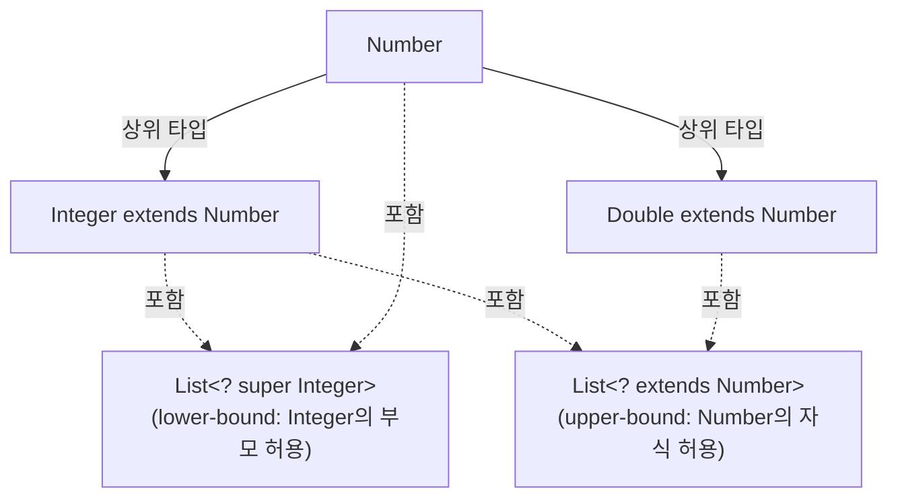

# Why? 🤔

처음 Java를 배울 때 누구나 제네릭을 '타입을 매개변수로 받는 편리한 기능' 정도로 이해한다.
그리고 `List<Integer>`를 `List<Number>` 변수에 대입하려다가 컴파일 에러를 맞이한다.

직관적으로는 Integer가 Number의 하위 타입이므로 `List<Integer>`도 `List<Number>`의 하위 타입이어야 마땅하다.
하지만 Java 언어 설계팀은 이를 의도적으로 막았다. 왜일까?

만약 `List<Integer>`가 `List<Number>`로 취급된다면, `List<Number>` 변수를 통해 `Double`을 추가하는 순간 내부 배열이 깨진다.[^3]
즉 **제네릭의 불변성(invariance)은 타입 안전성을 지키기 위한 설계 결정**이다.

그런데 이 안전성이 유연성을 희생시킨다.
`pushAll(Iterable<E> src)` 같은 메서드는 `Iterable<Integer>`를 `Stack<Number>`에 쌓을 수 없어서 실용적으로 불편하다.

Java 팀은 이 딜레마를 `?` 하나로 해결했다. 이름하여 **Wildcard**.[^1]
이 글에서는 제네릭이 왜 불변인지, Wildcard가 어떻게 그 한계를 극복하는지, 그리고 PECS 원칙으로 어떻게 실전에 적용하는지를 순서대로 살펴본다.

# Generic 의 필요성 🛡️

### 타입 안전성(Type Safety)

**<span style="color:yellowgreen">제네릭을 사용하지 않으면 잘못된 타입의 객체가 컬렉션에 삽입될 수 있다.**

다음 예시를 참고해보자.

```java
public static void main(String[] args) {
    List numbers = Arrays.asList("1", "2", "3", "4", "5", "6");
    int sum = 0;
    for (Object number : numbers) {
        sum += (int) number;
    }
}
```

위 코드는 숫자 문자열을 `List` 컬렉션에 저장하고, loop를 통해 `int`형으로 변환하며 합계를 구한다.
문제는 `List`에 문자열을 넣어도 컴파일 에러가 발생하지 않고 런타임에 `ClassCastException`이 터진다는 것이다.
즉 컴파일 시점에서의 타입 체킹이 되지 않는다.

**<span style="color:yellowgreen">제네릭을 사용하면 컴파일러가 컬렉션에 담을 수 있는 타입을 사전에 알고 이를 강제하여 안전한 프로그래밍을 지향할 수 있다.**

### 가독성과 유지보수성

제네릭을 사용하면 코드가 더 명확하고 가독성이 높아진다.
타입 정보가 명시되어 있기 때문에 읽는 이로 하여금 코드를 이해하고 유지보수하기 쉬워진다.
그러므로 제네릭을 사용하지 않을 이유가 없다. 이제 제네릭에 대해 좀 더 자세히 알아보자.

# Generic 개념 살펴보기 🔬

### How to use "Generic"

> 외부에서 class나 interface에 대한 type을 주입!

A *generic type* is a **generic class or interface** that is parameterized over types.

```java
/**
 * Generic version of the Box class.
 * @param <T> the type of the value being boxed
 */
public class Box<T> {
    // T stands for "Type"
    private T t;

    public void set(T t) { this.t = t; }
    public T get() { return t; }
}
```

그렇다면 내부적으로 어떻게 동작하는 걸까?
이에 앞서서 먼저 "런타임에 구체화되는 여부"인 "구체화/비구체화" 개념에 대해 살펴보아야한다.

### Refiable(구체화) vs Non-Refiable(비구체화)

- `구체화 타입(reifiable type)` : 자신의 타입 정보를 런타임 시에 알고 지키게 하는 것(런타임에 구체화하는 것). 배열이 구체화 타입에 해당한다.
- `비 구체화 타입(non-reifiable type)` : 타입 소거자에 의해 컴파일 타임에 타입 정보가 사라지는 것(런타임에 구체화하지 않는 것). 제네릭 타입이 비구체화 타입에 해당하며, 제네릭은 컴파일 타임에 타입 체크를 한 뒤 런타임에는 타입을 지우는 방법을 사용한다.

```java
// 컴파일 할 때 (타입 소거 전)
public static void main(String... args) {
    List<String> list = new ArrayList<>();
    Object[] array = new Long[10];
}

// 런타임 때 (타입 소거 후)
public static void main(String... var0) {
    ArrayList var1 = new ArrayList();
    Long[] var2 = new Long[10];
}
```

이 Non-Refiable, 즉 타입 소거자의 지원에 의해 Generic이 동작될 수 있다.
이제 내부적으로 어떻게 동작하는지 살펴보자.

### Generic 내부동작과정

하나 이상의 타입 매개변수를 선언하고 있는 클래스나 인터페이스는 제네릭 클래스 혹은 제네릭 인터페이스라고 하며, 이를 합쳐 제너릭 타입이라고 한다.
각각의 제너릭 타입에서는 매개변수화 타입(parameterized type)들을 다음과 같이 정의한다.

```java
List<String> list = new ArrayList<>();
```

- `List<E>` 의 `E` = 형식 타입 매개변수(Formal type parameter)
- `List<String>` 의 `String` = 실 타입 매개변수(Actual type parameter)

제네릭은 타입 소거자(Type erasure)에 의해 자신의 타입 요소 정보를 삭제하므로 컴파일 시 다음과 같이 변경된다.

```java
ArrayList list = new ArrayList();
```

컴파일러는 컴파일 단계에서 `List` 컬렉션에 `String` 인스턴스만 저장되어야 하는 것을 알게 되었고 그것을 보장해주기 때문에, `ArrayList list`로 변경해도 런타임에 동일한 동작을 보장한다.

### Generic 네이밍 컨벤션이 존재하므로 사용 시 유의한다

Generic에도 네이밍 컨벤션이 존재한다.[^2]

```java
/** 차이가 보이는가?? */

// List interface
public interface List<E> extends Collection<E> {
    ...
}

public class Car<T> {
    private final T name;
    ...
}
```

따라서 사용 시 해당 네이밍 컨벤션을 지켜서 나와 내 동료를 위하자. ~~언제나 그렇듯 공식문서가 갑이다.~~

> By convention, type parameter names are single, uppercase letters. This stands in sharp contrast to the variable naming conventions that you already know about, and with good reason: Without this convention, it would be difficult to tell the difference between a type variable and an ordinary class or interface name.

가장 많이 쓰이는 타입 매개변수 이름은 다음과 같다.

- E - Element (Java Collections Framework에서 광범위하게 사용)
- K - Key
- N - Number
- T - Type
- V - Value
- S, U, V 등 - 2번째, 3번째, 4번째 타입

# Generic 의 문제점 :: 리스코프 치환 법칙 ⚠️

사실 Generic 사용 시 리스코프 치환 법칙을 어기게 되는 문제점이 있다.

### Generic is "invariant"

Generic은 불변(invariant)이기에 실체화될 수 없다(Non-Refiable).
따라서 `List<부모>`와 `List<자식>`은 호환될 수 없다.
아니, 애초에 이 둘은 다르게 봐야한다.

**<span style="color:yellowgreen">왜냐하면 `List<부모>`에는 부모만을 넣을 수 있고, `List<자식>`에는 자식만 넣을 수 있기 때문이다.**
**<span style="color:yellowgreen">따라서 `List<자식>`은 `List<부모>`가 하는 일을 대신 해서 할 수 없고, 이는 리스코프 치환 법칙에 어긋나게 된다.**

> As noted in Item 28, parameterized types are invariant. In other words, for any two distinct types `Type1` and `Type2`, `List<Type1>` is neither a subtype nor a supertype of `List<Type2>`. Although it is counterintuitive that `List<String>` is not a subtype of `List<Object>`, it really does make sense. You can put any object into a `List<Object>`, but you can put only strings into a `List<String>`. Since a `List<String>` can't do everything a `List<Object>` can, it isn't a subtype (by the Liskov substitution principal, Item 10).

### invariant parameter limits the freedom

이렇기에 제네릭을 사용한 매개변수는 유연함이 떨어진다.
다음 코드는 이러한 제네릭 매개변수의 단점을 보여준다.

**우리 입장에서는 부모-자식 관계이므로 서로 호환되어야 마땅한 `Iterable<Number>`와 `Iterable<Integer>`이, 제네릭 입장에서는 치환되지 않는다.**
따라서 아래와 같은 오류가 발생하게 된다.

```java
// pushAll method without wildcard type - deficient!
public void pushAll(Iterable<E> src) {
    for (E e : src)
        push(e);
}

Stack<Number> numberStack = new Stack<>();
Iterable<Integer> integers = ... ;
numberStack.pushAll(integers);

// StackTest.java:7: error: incompatible types: Iterable<Integer>
// cannot be converted to Iterable<Number>
//         numberStack.pushAll(integers);
//                     ^
```

# Wildcard : Generic 보다 더 유연하게 🃏

이러한 문제점을 본 Java 팀은 Generic을 사용한 type-safe하고 유연한 프로그래밍에 그치지 않았나보다.
여기서 더 나아가 wildcard라는 개념을 도입한다. 두 가지 기능을 제시한다.

**1. 상속관계의 타입을 인자로 넘기게끔 허용 및 제한** — `upperbound`와 `lowerbound`라는 개념을 사용한다.

**2. 인자값에 대한 타입의 자유화** — Generic에서 타입정보를 넘겨주어야 하는 일을 없앴다.

위 두 가지 기능을 하나씩 살펴보자.

### 1. 상속관계의 타입을 인자로 넘기게끔 허용 및 제한

위에서 Generic 사용 시 리스코프 치환 법칙 위반 사례를 볼 수 있었다.
Wildcard는 upper-bound, lower-bound라는 개념을 사용하여 이를 해결한다.



#### upper-bound

```java
List<? extends Integer> intList = new ArrayList<>();
List<? extends Number>  numList = intList;
```

**특정 타입의 모든 upper type, 즉 확장된 타입(자식객체)를 인자값으로 넘길 수 있게 도와준다.**

#### lower-bound

```java
List<? super Integer> intList = new ArrayList<>();
List<? super Number>  numList = intList;
```

**특정 타입의 모든 lower type, 즉 코어 타입(부모객체)를 인자값으로 넘길 수 있게 도와준다.**

### 2. 인자값에 대한 타입의 자유화

Generic에서는 Caller에서 타입정보를 입력해주었다.

```java
List<Integer> nums = new ArrayList<>();
```

Wildcard에서는 이러한 타입정보를 제거해주었다.
즉 코더로 하여금 더욱 유연한 프로그래밍을 지원하게 하는 것이다.

하지만 똑똑한 Java 팀은 이러한 Wildcard 사용을 아래 세 가지로만 제한하여,
Class / Interface 선언 시 타입 미지정으로 인한 타입체킹을 강제하였다.

- 파라미터
- 필드값
- 지역 변수

## Generic 과 Wildcard 의 차이점 📊

|                                                      | Generic | Wildcard |
| ---------------------------------------------------- | ------- | -------- |
| Class 선언 시, type 주입받게끔 매개변수로서 사용     | O       | X        |
| Interface 선언 시, type 주입받게끔 매개변수로서 사용 | O       | X        |
| Local variable로서 사용                              | O       | O        |
| Parameter로서 사용                                   | O       | O        |
| Instance field로서 사용                              | O       | O        |

## Wildcard 주의점 :: type 미지정에 따른 연산 불가능 🚧

> Generic을 사용할 때는 하나의 타입으로서 사용되는 것이다. Wildcard를 사용할 때는 type 미지정이다.

따라서 어떠한 연산조차 불가능하다.
아래 두 가지 예제는 모두 Wildcard를 사용할 때 컴파일 에러가 발생한다.

```java
import java.util.List;

public class Experiment {
    public static <E> void funct1(final List<E> list1, final E something) {
        list1.add(something); // OK
    }

    public static void funct2(final List<?> list, final Object something) {
        list.add(something); // does not compile
    }
}
```

```java
public class Experiment {
    public static <E> void funct1(final List<E> list) {
        list.add(list.get(0)); // OK
    }

    public static void funct2(final List<?> list) {
        list.add(list.get(0)); // won't compile
    }
}
```

# 잠깐, 언제 Lower bound 를 쓰고, 언제 Upper bound 를 쓰지? 🎯

해당 기준안은 자바 가이드라인 자체에 권고되어있다.
바로 **PECS** 이다. (Producer Extends, Consumer Super)[^4]

요컨대 다음과 같이 요약될 수 있다.

> **해당 파라미터가 Data를 제공하는 역할이라면(Producer)**
> - `? extends E` :: upper bound
>
> **해당 파라미터가 어떤 Data를 활용하는 역할이라면(Consumer)**
> - `? super E` :: lower bound

```java
// Wildcard type for a parameter that serves as an E producer
public void pushAll(Iterable<? extends E> src) {
    for (E e : src)
        push(e);
}

// Wildcard type for parameter that serves as an E consumer
public void popAll(Collection<? super E> dst) {
    while (!isEmpty())
        dst.add(pop());
}
```

공식문서에서는 아래와 같이 나온다.[^5]

**Wildcard Guidelines:**
- An "**in**" variable is defined with an upper bounded wildcard, using the `extends` keyword.
- An "**out**" variable is defined with a lower bounded wildcard, using the `super` keyword.
- In the case where the "in" variable can be accessed using methods defined in the `Object` class, use an unbounded wildcard.
- In the case where the **code needs to access the variable as both an "in" and an "out" variable, do not use a wildcard.**

#### 예시. 동물을 제공하여(Produce) 행위 지정 / 새로운 동물타입의 데이터 추가(Consumer)

```java
public static void makeLotsOfNoise(List<? extends Animal> animals) {
    animals.forEach(Animal::makeNoise);
}
```

위 코드에서는 각 동물에게 소리를 내라고 명령한다.
중요한 건 메서드가 하는 역할보다 파라미터의 역할이다.
여기서 동물에게 소리 명령을 위해 전달되는 데이터는 Animal 리스트이다.

**<span style="color:yellowgreen">Animal 리스트의 역할은 모든 Animal 타입의 데이터를 제공해주는 역할, 즉 Producer 역할이다.**
**<span style="color:yellowgreen">어떤 Animal 확장타입이든 제공할 수 있어야 하므로 여기에는 upper bound인 `? extends Animal`를 활용해주는 게 적합하다.**

```java
public static void addCats(List<? super Animal> animals) {
    animals.add(new Cat());
}
```

반면 위 코드에서는 animal들의 리스트에 새로운 동물을 추가하고 있다. **<span style="color:yellowgreen">즉, animal 리스트가 활용되는 역할인 Consumer로서 사용된다.**
**<span style="color:yellowgreen">따라서 여기에는 lower bound인 `? super Animal`을 활용해주는 게 적합하다.**
**<span style="color:yellowgreen">이에 따라 animal의 하위 타입 dog 혹은 cat에 대한 리스트를 `addCats()`에 넘기는 일을 막을 수가 있다.**

> 보통 Spring에서는
> - Pub/Sub 구조의 Event 처리나,
> - MVC 구조에서 상위 Service Layer, 하위 Service Layer,
> - MVC 구조에서 Query 담당 / Command 담당 Service
>
> 에서 여러모로 활용가능하다.

# Generic / Wildcard 적용예제 :: Pub/Sub 구조의 Event 처리 🔌

> Spring에서의 ApplicationEventPublisher의 그것보다 Raw한 코드이니 유의하자. 이쯤되면 얼마나 ApplicationEventPublisher가 편한건지 알 수 있다.

#### 1. Event를 정의한다.

```java
class Event {
    private String message;

    public Event(String message) {
        this.message = message;
    }

    public String getMessage() {
        return message;
    }
}
```

#### 2. Lower Bound Generic을 활용하여 EventListener 인터페이스를 정의한다.

```java
// Define event listener interface
interface EventListener<T extends Event> {
    void onEvent(T event);
}
```

#### 3. EventListener 인터페이스의 구현체인 NotificationListener를 정의한다.

```java
class NotificationListener implements EventListener<Event> {
    @Override
    public void onEvent(Event event) {
        System.out.println("Received notification: " + event.getMessage());
    }
}
```

#### 4. Event에 대한 upper bound wildcard를 사용하여 EventPublisher를 정의한다.

```java
class EventPublisher {
    private List<EventListener<? extends Event>> listeners;

    public EventPublisher() {
        listeners = new ArrayList<>();
    }

    public void subscribe(EventListener<? extends Event> listener) {
        listeners.add(listener);
    }

    public void publish(Event event) {
        for (EventListener<? extends Event> listener : listeners) {
            listener.onEvent(event);
        }
    }
}
```

# 마치며 ✅

제네릭의 불변성(invariance)은 타입 안전성을 지키기 위한 의도적 설계 결정이다.
`List<Integer>`가 `List<Number>`로 취급된다면 누군가 `Double`을 추가하는 순간 런타임에 예외가 발생할 수 있기 때문이다.

Wildcard는 이 불변성의 불편함을 해소하면서도 타입 안전성을 유지하는 도구이다.
어느 방향으로 Wildcard를 사용할지는 PECS 원칙으로 결정한다.

- 데이터를 **꺼내 쓰기만** 한다면 `? extends E` (Producer → Extends)
- 데이터를 **집어넣기만** 한다면 `? super E` (Consumer → Super)
- 둘 다 한다면 Wildcard를 쓰지 않고 구체 타입 매개변수를 사용한다.

Spring의 Pub/Sub 이벤트 처리나 CQRS 기반 서비스 레이어 설계에서 이 두 가지를 적절히 섞어 쓰면 API 유연성과 타입 안전성을 동시에 챙길 수 있다.[^6]

[^1]: Oracle :: Wildcards <https://docs.oracle.com/javase/tutorial/java/generics/wildcards.html>

[^2]: Oracle :: Generic Types – Naming Conventions <https://docs.oracle.com/javase/tutorial/java/generics/types.html>

[^3]: Oracle :: Wildcards and Subtyping <https://docs.oracle.com/javase/tutorial/java/generics/subtyping.html>

[^4]: Effective Java 3rd Edition Item 31 – Use bounded wildcards to increase API flexibility <https://github.com/clxering/Effective-Java-3rd-edition-Chinese-English-bilingual/blob/dev/Chapter-5/Chapter-5-Item-31-Use-bounded-wildcards-to-increase-API-flexibility.md>

[^5]: Oracle :: Guidelines for Wildcard Use <https://docs.oracle.com/javase/tutorial/java/generics/wildcardGuidelines.html>

[^6]: Baeldung :: Type Parameter vs Wildcard in Java Generics <https://www.baeldung.com/java-generics-type-parameter-vs-wildcard>

[^7]: Baeldung :: Java Generics Interview Questions (+Answers) <https://www.baeldung.com/java-generics-interview-questions>

[^8]: Baeldung :: When to Use Upper/Lower Bounded Wildcards <https://www.baeldung.com/java-generics-interview-questions#q13-when-would-you-choose-to-use-a-lower-bounded-type-vs-an-upper-bounded-type>

[^9]: Velog :: Java 의 Generics(5) - 사용 방식 <https://velog.io/@yhlee9753/Java-%EC%9D%98-Generics5-%EC%82%AC%EC%9A%A9-%EB%B0%A9%EC%8B%9D>

[^10]: 내 노션정리본 :: Effective Java Ch5 Generic 정리 <https://vanillacake369.notion.site/Ch5-Generic-875c9ac8d6fb4b0086c49b656f0612b2?pvs=4>
