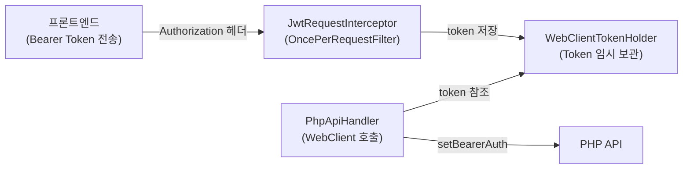
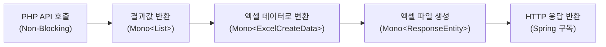

# 🗂️ 왜 이 작업을 하게 됐는가

사내 레거시 메인 API 는 PHP(Laravel)로 작성되어 있었고, 엑셀 생성 모듈만 Java(Spring)로 별도 운영하고 있었다.

Java 를 선택한 이유는 단순했다.
Apache POI 가 엑셀 처리 속도와 수식 지원 면에서 월등히 앞섰기 때문이다.[^6]

문제는 두 가지 전략이 **혼재**하고 있다는 점이었다.

- PHP 코드를 직접 보고 조회 쿼리·부수 로직을 Java 쪽에 **복제**하는 방식
- PHP 조회 API를 Java 에서 **HTTP 호출**하여 그 결과를 엑셀에 매핑하는 방식

두 방식 모두 운영하다 보니, PHP API 는 언제나 **모든 데이터를 한 번에 Blocking으로 fetch** 하고 있었고, 이를 호출하는 Spring MVC 쪽도 마찬가지로 Blocking I/O 였다.

동시 요청이 늘어나자 스레드 풀이 포화 상태에 빠졌고, 엑셀 다운로드 응답은 최대 **1.8초** 이상 지연되기 시작했다.

"Blocking API 를 Non-Blocking 으로 교체하면 어떻게 될까?" 라는 가설에서 이 작업이 시작되었다.

해결책으로 Spring Reactor 기반 WebFlux[^7] 를 도입하기로 결정했다.
이 글은 그 과정과 수치 결과를 정리한 기록이다.

---

## Blocking I/O 는 무엇이 문제인가 🔒

> 해당 섹션의 내용 대부분은 "스프링으로 시작하는 리액티브 프로그래밍" 책으로부터 내용을 발췌하였다.

하나의 스레드가 I/O 에 의해서 차단되어 대기하는 것을 Blocking I/O 라고 한다.

Blocking I/O 방식의 문제점을 보완하기 위해 멀티스레딩 기법으로 추가 스레드를 할당하여 차단된 시간을 효율적으로 사용할 수 있다.

그런데 CPU 대비 많은 수의 스레드를 할당하는 멀티스레딩 기법에는 몇 가지 문제점이 존재한다.

**컨텍스트 스위칭 비용**

- 스레드 전환 시마다 Context Switching 비용이 발생한다.

**과다한 메모리 사용**

- 새로운 스레드가 실행되면 JVM 은 해당 스레드를 위한 Stack 영역 일부를 할당한다.
- 새로운 스레드의 정보는 스택 영역에 개별 StackFrame 형태로 저장된다.
- JVM 의 디폴트 스택 사이즈는 64비트 환경에서 1024KB 이다.
- 64,000명이 동시 접속한다면 총 약 64GB 의 메모리가 추가로 필요하게 된다.
- 서블릿 컨테이너 기반 Java 웹 애플리케이션은 요청당 하나의 스레드(thread per request)를 할당한다.
- 스레드 내부에서 또 다른 스레드를 추가로 할당하면 시스템이 감당하기 힘들 정도로 메모리 사용량이 늘어날 가능성이 있다.

**스레드 풀 응답 지연**

- Spring Boot 은 자체적으로 Tomcat 서블릿 컨테이너를 내장한다.
- Tomcat 은 사용자의 요청을 효과적으로 처리하기 위해 스레드 풀(Thread Pool)을 사용한다.
- 스레드 풀이란 일정 개수의 스레드를 미리 생성해서 풀에 저장해 두고, 유휴 스레드가 있다면 꺼내어 쓰는 저장소이다.
- 대량의 요청이 발생하여 사용 가능한 유휴 스레드가 없을 경우, 스레드가 확보되기 전까지 응답 지연이 발생한다.
- 이 응답 지연에는 반납된 스레드가 사용 가능 상태로 전환되는 지연 시간까지 포함된다.


이처럼 Blocking 구조는 동시 사용자가 늘수록 스레드 소모와 응답 지연이 기하급수적으로 악화된다.
이 문제를 해결하기 위해 Non-Blocking 모델로 전환할 필요가 있었다.

---

## Non-Blocking I/O 는 어떤 원리로 작동하는가 🌊

Non-Blocking I/O 방식의 경우, 작업 스레드의 종료 여부와 관계없이 요청한 스레드는 차단되지 않는다.

스레드가 차단되지 않기 때문에 하나의 스레드로 많은 수의 요청을 처리할 수 있다.

즉, Blocking I/O 방식보다 더 적은 수의 스레드를 사용하기 때문에 멀티스레딩 기법에서 발생하던 문제점들이 생기지 않는다.

따라서 CPU 대기 시간 및 사용량에 있어서도 대단히 효율적이다.


**그렇다면 Non-Blocking 은 만능인가?**

하지만 Non-Blocking I/O 에도 단점은 존재한다.

- 스레드 내부에 CPU 를 많이 사용하는 작업이 포함된 경우 성능에 악영향을 준다.
  - 이런 경우 비동기 처리를 하여 작업을 병렬로 처리하는 CPU Workload Optimization 을 적용해야 한다.
- 응답까지의 전체 과정에 Blocking I/O 요소가 포함된 경우 Non-Blocking 의 이점을 발휘하기 힘들다.
  - 이것이 Non-Blocking IO 도입의 가장 큰 병목 지점이다.
  - 리소스 혹은 드라이버가 Non-Blocking 을 지원하지 않는다면 소용이 없기 때문이다.
  - 해당 포스트에서는 다루지 않았지만 R2DBC 를 사용해야만 했는데, 학습 곡선의 한계로 포기하였다. (QueryDSL 에 R2DBC 가 붙지 않아 코드베이스를 전부 다 들어내야 하는 상황이었다.)
  - 따라서 해당 Blocking 병목 지점에는 따로 스레드를 부여하여 우회 처리를 해두었다.

이 한계를 인정한 상태에서, 전체 파이프라인 중 **PHP API 호출 구간만이라도** Non-Blocking 으로 교체하는 전략을 택했다.
다음 절에서 그 도구인 Spring Reactor 를 소개한다.

---

## Spring Reactor 와 WebFlux 는 무엇인가 ⚡

> **TL;DR**
>
> - **Reactive Streams Specification**: Non-Blocking 에 대한 인터페이스와 프로세스 표준안
> - **Reactor / RxJava**: 이 표준을 효과적으로 구현하는 라이브러리
> - **WebFlux**: Project Reactor 라이브러리를 사용하는 Spring 웹 프레임워크

개발자가 리액티브 코드를 작성하기 위해서는 이러한 코드 구성을 용이하게 해주는 리액티브 라이브러리가 있어야 한다.

이 리액티브 라이브러리를 어떻게 구현할지 정의해 놓은 별도의 표준 사양이 있는데, 이것을 **리액티브 스트림즈(Reactive Streams)**[^8] 라고 부른다.

리액티브 스트림즈는 '데이터 스트림을 Non-Blocking 이면서 비동기적인 방식으로 처리하기 위한 리액티브 라이브러리의 표준 사양'이라고 표현할 수 있다.

리액티브 스트림즈를 구현한 구현체로 RxJava, Reactor, Akka Streams, Java 9 Flow API 등이 있는데, Spring Team 에서 공식적으로 지원 및 개발 중인 Reactor 가 가장 대중적이고 다양한 기능들을 지원한다.

WebFlux 는 Reactor 구현체 중 웹 프레임워크를 지원하는 라이브러리이다.

아래는 Reactive Stream 의 기본적인 Component 구성이다.


**`Flux[N]` — 여러 건의 데이터를 다룰 때**

Flux 는 0개부터 N개, 즉 무한대의 데이터를 emit 할 수 있는 Reactor 의 Publisher 이다.

```java
// Flux 기본 사용 예시
Flux<String> stringFlux = Flux.just("Hello", "Baeldung");
StepVerifier.create(stringFlux)
  .expectNext("Hello")
  .expectNext("Baeldung")
  .expectComplete()
  .verify();
```

**`Mono[0|1]` — 단건 혹은 빈 데이터를 다룰 때**

Mono 는 데이터를 한 건도 emit 하지 않거나 단 한 건만 emit 하는 단발성 데이터 emit 에 특화된 Publisher 이다.

```java
// Mono 기본 사용 예시
Mono<String> helloMono = Mono.just("Hello");
StepVerifier.create(helloMono)
  .expectNext("Hello")
  .expectComplete()
  .verify();
```

개념을 이해했으니 이제 실제로 WebClient 를 어떻게 구성했는지 살펴볼 차례이다.

---

## WebClient 설정과 JWT 전달 방법 🔧

WebClient 는 웹 요청을 수행하기 위한 인터페이스이다.[^3]

이 인터페이스는 Spring Web Reactive 모듈의 일부로 만들어졌으며, 기존 RestTemplate 을 대체할 예정이다.
(RestTemplate 은 지원 중단 예정 대상이지, Deprecated 대상은 아니다.)

WebClient 는 HTTP/1.1 프로토콜을 통해 작동하는 Reactive Non-Blocking Solution 이다.

동기 및 비동기 작업을 모두 지원하므로 서블릿 스택에서 실행되는 애플리케이션에도 적합하다는 특징이 있다.

operation 을 blocking 하여 동기적인 결과값을 가져올 수 있는데, reactive stack 에서는 권장하지 않는다.
(Non-Blocking 하지 않을 거라면 WebFlux 를 가져다 쓸 이유가 없다.)

아래는 WebClientConfig Bean 구성이다.

```java
// WebClient Bean 등록 설정
@Configuration
@RequiredArgsConstructor
@Slf4j(topic = "WebClientConfig Logger")
public class WebClientConfig {

  private final ApplicationContext applicationContext;

  @Value("${php.base-url}")
  private String baseUrl;

  @Bean
  public WebClient webClient(Builder builder) {
    return builder
        // PHP API 의존
        .baseUrl(baseUrl)
        // Header 처리
        .defaultHeader(HttpHeaders.CONTENT_TYPE, MediaType.APPLICATION_JSON_VALUE)
        // 에러 발생 시 커스텀 예외 처리
        .defaultStatusHandler(HttpStatusCode::isError, resp -> {
          log.error("WebFlux 에러가 발생하였습니다.  : {}", resp.toString());
          return resp.bodyToMono(CustomException.class)
              .flatMap(errorDetail -> Mono.error(new CustomException(ErrorCode.WEB_CLIENT_ERROR)));
        })
        // 메모리 사이즈 : UNLIMITED
        .exchangeStrategies(ExchangeStrategies
            .builder()
            .codecs(codecs -> codecs
                .defaultCodecs()
                .maxInMemorySize(-1))
            .build())
        .build();
  }
}
```

**JWT 토큰을 WebClient 에 전달하는 방법**

JWT 토큰을 헤더에 담아서 API 를 호출하고 싶다면 아래 흐름을 따른다.



1. 토큰을 외부로부터 — FE 가 호출하는 서버 Controller method 의 인자값 — 받는다.
2. 이 토큰을 잠시 저장하고 있을 `TokenHolder` 를 구현한다.
3. 이 `TokenHolder` 를 WebClient 생성 시 주입한다.
4. WebClient 를 통해 API 호출 시 Token 을 헤더에 넘겨준다.

아래는 `JwtRequestInterceptor`, `WebClientTokenHolder`, `PhpApiHandler` 구현이다.

```java
// JWT 토큰을 추출하여 TokenHolder 에 저장하는 필터
@Slf4j
@Component
@RequiredArgsConstructor
public class JwtRequestInterceptor extends OncePerRequestFilter {

  private final WebClientTokenHolder webClientTokenHolder;

  @Override
  protected void doFilterInternal(HttpServletRequest request, HttpServletResponse response, FilterChain filterChain)
      throws ServletException, IOException {
    String token = request.getHeader("Authorization");
    if (token != null && token.startsWith("Bearer ")) {
      token = token.substring(7);
      webClientTokenHolder.setToken(token);
    }
    filterChain.doFilter(request, response);
  }
}
```

```java
// 요청 스코프 내 JWT 토큰을 보관하는 단순 컴포넌트
@Getter
@Setter
@Component
@AllArgsConstructor
@NoArgsConstructor
public class WebClientTokenHolder {

  private String token;

}
```

```java
// PHP API 를 호출하는 핵심 핸들러 — Blocking 과 Mono 두 가지 방식 모두 제공
@Slf4j
@Component
@RequiredArgsConstructor
public class PhpApiHandler {

  private final WebClient webClient;

  private final WebClientTokenHolder webClientTokenHolder;

  public <T> List<T> getApiResponseList(
      String targetUrl,
      String queryString,
      ParameterizedTypeReference<PhpClientResDto<T>> typeReference
  ) {
    final String url = queryString == null ? targetUrl : targetUrl + queryString;
    return webClient.get()
        .uri(url)
        .headers(h -> h.setBearerAuth(webClientTokenHolder.getToken()))
        .retrieve()
        .onStatus(HttpStatusCode::isError, WebClientErrorHandler.handleClientResponseMonoFunction())
        .bodyToMono(typeReference)
        .map(tPhpClientResDto -> tPhpClientResDto.getData()
            .getResult()
            .getList())
        .block();
  }

  public <T> Mono<List<T>> getApiResponseListMono(
      String targetUrl,
      String queryString,
      ParameterizedTypeReference<PhpClientResDto<T>> typeReference
  ) {
    final String url = queryString == null ? targetUrl : targetUrl + queryString;
    return webClient.get()
        .uri(url)
        .headers(h -> h.setBearerAuth(webClientTokenHolder.getToken()))
        .retrieve()
        .onStatus(HttpStatusCode::isError, WebClientErrorHandler.handleClientResponseMonoFunction())
        .bodyToMono(typeReference)
        .map(couponQueryResponseDtoPhpClientResDto -> couponQueryResponseDtoPhpClientResDto.getData()
            .getResult()
            .getList())
        .subscribeOn(Schedulers.boundedElastic());
  }
}
```

WebClient 구성이 완료되었으므로, 이제 이를 어떻게 테스트했는지 살펴본다.

---

## WebClient 테스트 방법 (feat. StepVerifier) 🧪

WebClient 에 대한 테스트에는 두 가지 방법이 있다.[^4][^5]

1. **MockWebServer 를 통한 WebClient Mocking** — Spring Development Team 에서 공식적으로 추천하는 방법
2. **StepVerifier 를 통한 API 호출 로직 및 결과값 검증**

StepVerifier 를 통한 로직과 값 검증만 진행하였다.

```java
// StepVerifier 를 활용한 쿠폰 엑셀 조회 통합 테스트
@SpringBootTest
class CouponQueryServiceTest {

  private CouponQueryService couponQueryService;

  @Autowired
  private WebClient webClient;

  @BeforeEach
  void setUp() {
    String token = JwtFactoryForTest.generateJwtTokenOfYoonGu(Boolean.TRUE);
    WebClientTokenHolder webClientTokenHolder = new WebClientTokenHolder(token);
    PhpApiHandler phpApiHandler = new PhpApiHandler(webClient, webClientTokenHolder);
    CouponApiHandler couponApiHandler = new CouponApiHandler(phpApiHandler);
    CouponAdapterImpl couponAdapter = new CouponAdapterImpl(couponApiHandler);
    this.couponQueryService = new CouponQueryService(couponAdapter);
  }

  @Test
  @DisplayName("쿠폰 엑셀결과 목록 조회 모노 성공합니다.")
  void 쿠폰엑셀결과_목록조회_모노_성공() {
    // GIVEN
    String queryString = "";

    // WHEN
    Mono<ExcelCreateData> excelCreateDataMono = couponQueryService.handleMono(queryString);

    // THEN
    assertNotNull(excelCreateDataMono);
    StepVerifier
        .create(excelCreateDataMono)
        .expectNextMatches(excelCreateData -> {
          List<Map<String, Object>> excelData = excelCreateData.getExcelData();
          if (excelData.isEmpty()) {
            return false;
          }
          excelData
              .forEach(stringObjectMap -> {
                System.out.println("작성자 : " + stringObjectMap.get("작성자"));
              });
          return excelData
              .stream()
              .anyMatch(stringObjectMap -> Objects.nonNull(stringObjectMap.get("작성자")));
        })
        .expectComplete()
        .verify();
  }
}
```

테스트 방법을 확인했으니, 이제 실제 프로덕션 코드에 Reactive 파이프라인을 어떻게 적용했는지 살펴볼 차례이다.

---

## Reactive 파이프라인 적용 코드 🧑‍💻

Spring Framework 에서 Publisher 와 Subscriber 는 각각 다음 역할을 한다.

- **Publisher**: Reactive Stream 을 생성하는 역할
- **Subscriber**: Publish 된 Reactive Stream 에 구독하여 활용하는 역할

Spring Framework 의 Controller 에서 Mono 를 반환하는 경우, Spring Framework 가 Subscribe 를 처리하는 주체가 된다.[^1]

WebClient 의 디폴트 HTTP 클라이언트 라이브러리인 Reactor Netty 가 내부적으로 처리를 하게끔 되어있다.


Excel 에 대한 Reactive 처리 흐름은 다음과 같다.



아래는 각 레이어별 적용 코드이다.

`Controller`

```java
// Mono 파이프라인을 반환하면 Spring WebFlux 가 자동으로 구독한다
@CustomExceptionDescription(SwaggerResponseDescription.EXCEL_DOWNLOAD)
@Operation(summary = "쿠폰 관리 목록 Excel 비동기 처리")
@GetMapping("/api/coupon/download-excel/mono")
public Mono<ResponseEntity<?>> downloadExcelMono(HttpServletRequest request) {
  // Mono API 데이터
  Mono<ExcelCreateData> dataMono = couponQueryService.handleMono(queryString);
  // Mono 엑셀
  Mono<ResponseEntity<?>> responseEntityMono = dataMono.flatMap(
      excelCreateData -> ExcelResponseCreator.buildExcelResponseMono(excelCreateData, fileService, log));
  return responseEntityMono;
}
```

`ExcelResponseCreator`

```java
// Callable 로 감싸 동기적인 엑셀 생성 로직을 Mono 체인에 통합한다
public static Mono<? extends ResponseEntity<?>> buildExcelResponseMono(ExcelCreateData excelCreateData, FileService fileService, Logger log) {
  return Mono.fromCallable(() -> buildExcelResponse(excelCreateData, fileService, log));
}
```

`CouponQueryService`

```java
// API 호출부터 엑셀 변환까지 Mono 체인으로 연결한다
public Mono<ExcelCreateData> handleMono(String queryString) {
  // API 호출
  Mono<List<CouponExcelResponseDto>> excelResponseDtoListMono = couponAdapter.getCouponExcelResponseDtoListMono(queryString);
  // Mono 에 대해 엑셀로 변환
  return ExcelCreateDataGenerateUtils.generateExcelCreateDataMonoFrom(
      HEADERS_MAP,
      excelResponseDtoListMono,
      "쿠폰목록.xlsx",
      "쿠폰목록 엑셀 파일을 다운로드 했습니다."
  );
}
```

`CouponAdapter`, `CouponApiHandler`

```java
// Adapter 는 Mono 를 그대로 위임하여 체인이 끊기지 않도록 한다
public Mono<List<CouponQueryResponseDto>> getCouponResponseDtoListMono(String queryString) {
  return phpApiHandler.getApiResponseListMono(TARGET_URL, queryString, TYPE_REFERENCE);
}

public <T> Mono<List<T>> getApiResponseListMono(
    String targetUrl,
    String queryString,
    ParameterizedTypeReference<PhpClientResDto<T>> typeReference
) {
  final String url = queryString == null ? targetUrl : targetUrl + queryString;
  return webClient.get()
      .uri(url)
      .headers(h -> h.setBearerAuth(webClientTokenHolder.getToken()))
      .retrieve()
      .onStatus(HttpStatusCode::isError, WebClientErrorHandler.handleClientResponseMonoFunction())
      .bodyToMono(typeReference)
      .map(couponQueryResponseDtoPhpClientResDto -> couponQueryResponseDtoPhpClientResDto.getData()
          .getResult()
          .getList());
}
```

파이프라인 적용이 완료되었다.
하지만 여기서 한 가지 의문이 생긴다.
엑셀 생성처럼 CPU-bound 작업이 포함된 경우 어느 스레드에서 실행되어야 할까?
그 해답이 `Schedulers.boundedElastic()` 이다.

---

## Schedulers.boundedElastic() 이란 무엇인가 🗓️

Reactive Stream 을 처리하는 기본 스레드 주체는 main thread 가 된다.[^2]

만약 publish stream 과 subscribe stream 에 대한 스레드 주체를 변경하고 싶다면 `Schedulers`, `publishOn()`, `subscribeOn()` 개념을 사용한다.

- **Schedulers**: 스레딩에 대한 사용자 제어를 제공하는 인터페이스로, stream 에 대한 worker thread 를 지정한다.
- **publishOn()**: 이 연산자 이후의 모든 연산자 호출은 지정된 Scheduler 에서 실행된다.
- **subscribeOn()**: 지정된 Scheduler 에서 `subscribe()`, `onSubscribe()`, `request()` 등의 초기 source emission 을 처리한다.

`Schedulers.boundedElastic()` 은 ExecutorService 기반의 스레드 풀을 생성한 후, 그 안에서 정해진 수만큼의 스레드를 사용하여 작업을 처리하고 작업이 종료된 스레드는 반납하여 재사용하는 방식이다.

기본적으로 CPU 코어 수 × 10 만큼의 스레드를 생성하며, 풀에 있는 모든 스레드가 작업을 처리하고 있다면 이용 가능한 스레드가 생길 때까지 최대 100,000개의 작업이 큐에서 대기할 수 있다.

데이터베이스를 통한 질의나 HTTP 요청을 통해 데이터소스를 받는 작업은 대부분 Blocking I/O 로 처리되는 경우가 많다.

`Schedulers.boundedElastic()` 은 바로 이러한 Blocking I/O 작업을 효과적으로 처리하기 위한 방식이다.

즉, 실행 시간이 긴 Blocking I/O 작업이 포함된 경우, 다른 Non-Blocking 처리에 영향을 주지 않도록 전용 스레드를 할당해서 Blocking I/O 작업을 처리할 수 있다.

Reactor 3.6.0 부터는 JDK 21+ 환경에서 `DEFAULT_BOUNDED_ELASTIC_ON_VIRTUAL_THREADS` 시스템 속성을 `true` 로 설정하면 Virtual Thread 기반 thread-per-task 구현이 활성화된다.

이 구현은 각 태스크마다 새로운 `VirtualThread` 인스턴스에서 실행되며, 최대 동시 스레드 수와 큐 크기 제한은 기존과 동일하게 적용된다.

스케줄러 동작 원리를 이해했으니, 이제 실제 적용 전후의 수치를 비교해보자.

---

## 성능 측정 결과 📊

최종 관심사는 세 가지였다.

1. API 호출 시 다량의 데이터에 따라 서버가 죽어버리지 않을까?
2. 엑셀 파싱 작업에 의해 굉장히 느리지는 않을까?
3. Non-Blocking 적용 시 얼마나 개선되는가?

**WebFlux 적용 이전**

```
Execution time: 1189179000 nanoseconds
Thread count before: 20
Thread count after: 20
```

**WebFlux 적용 이후**

```
Execution time: 1484200 nanoseconds
Thread count before: 20
Thread count after: 20
```

**결과적으로 99.88% 개선**되었다.

Non-Blocking 이므로 상대적으로 적은 수의 스레드가 사용되었으며, 엑셀 파싱 작업에 대해 스레드 풀을 따로 부여하여 느린 작업을 더욱 빠르게 처리하도록 하였다.

다만 다량의 데이터 처리 시 PHP 서버에 장애가 발생할 확률은 여전히 존재한다.

**Blocking 테스트 코드**

```java
@Test
@DisplayName("쿠폰 엑셀결과 목록 조회 블로킹 성공합니다.")
void 쿠폰엑셀결과_목록조회_블로킹_성공() {
  // GIVEN
  String queryString = "";

  // WHEN
  ThreadMXBean threadMXBean = ManagementFactory.getThreadMXBean();
  int threadCountBefore = threadMXBean.getThreadCount();
  long startTime = System.nanoTime();

  List<CouponExcelResponseDto> couponExcelResponseDtoList = couponAdapter.getCouponExcelResponseDtoList(queryString);

  long endTime = System.nanoTime();
  int threadCountAfter = threadMXBean.getThreadCount();

  // THEN
  assertNotNull(couponExcelResponseDtoList);
  boolean mbNameIsNotEmpty = couponExcelResponseDtoList
      .stream()
      .anyMatch(couponExcelResponseDto -> !couponExcelResponseDto.mbName().isEmpty());
  assertTrue(mbNameIsNotEmpty);

  long duration = (endTime - startTime);
  System.out.println("Execution time: " + duration + " nanoseconds");
  System.out.println("Thread count before: " + threadCountBefore);
  System.out.println("Thread count after: " + threadCountAfter);
}
```

**Mono 테스트 코드**

```java
@Test
@DisplayName("쿠폰 엑셀결과 목록 조회 모노 성공합니다.")
void 쿠폰엑셀결과_목록조회_모노_성공() {
  // GIVEN
  String queryString = "";

  // WHEN
  ThreadMXBean threadMXBean = ManagementFactory.getThreadMXBean();
  int threadCountBefore = threadMXBean.getThreadCount();
  long startTime = System.nanoTime();

  Mono<List<CouponExcelResponseDto>> excelResponseDtoListMono = couponAdapter.getCouponExcelResponseDtoListMono(queryString);

  long endTime = System.nanoTime();
  int threadCountAfter = threadMXBean.getThreadCount();

  // THEN
  assertNotNull(excelResponseDtoListMono);
  StepVerifier
      .create(excelResponseDtoListMono)
      .expectNextMatches(couponExcelResponseDtos -> {
        if (couponExcelResponseDtos.isEmpty()) {
          return false;
        }
        couponExcelResponseDtos
            .forEach(couponExcelResponseDto -> {
              System.out.println("mbName : " + couponExcelResponseDto.mbName());
            });
        return couponExcelResponseDtos
            .stream()
            .anyMatch(couponExcelResponseDto -> !couponExcelResponseDto.mbName().isEmpty());
      })
      .expectComplete()
      .verify();

  long duration = (endTime - startTime);
  System.out.println("Execution time: " + duration + " nanoseconds");
  System.out.println("Thread count before: " + threadCountBefore);
  System.out.println("Thread count after: " + threadCountAfter);
}
```

수치의 맥락을 이해했다면, 이제 `Schedulers.boundedElastic()` 적용 위치에 따라 결과가 어떻게 달라지는지 비교해보자.

---

## Schedulers.boundedElastic() 적용 위치별 비교 📈

BoundedElastic 을 사용하면 얼마나 개선될까?

아래 테이블은 적용 위치에 따른 평균 실행 시간과 최종 스레드 수를 비교한 결과이다.

물론 스레드가 늘어나는 단점은 존재하지만, 다량의 데이터를 Bulk Fetch 하는 작업이므로 각각의 작업에 대한 스레드를 할당해주는 것은 필연적이라고 생각한다.

`parallel()` 을 사용할 수도 있겠지만, 스레드 풀이 아닌 스레드를 무한정으로 생성해내기 때문에 Blocking API 호출에는 부적합하다.

왼쪽부터 순서는 다음과 같다.

1. 블로킹
2. 변환 이후에 스레드 할당 (Terminal Point)
3. 변환 로직 자체에 스레드 할당 (Initial Point)
4. API 호출 ← `subscribeOn` & 변환 로직 ← `publishOn`

| Metric                      | Blocking IO | Terminal Point | Initial Point | SubscribeOn + PublishOn |
| --------------------------- | ----------- | -------------- | ------------- | ----------------------- |
| Average Execution Time (ns) | 2,514,679.7 | 2,728,078.0    | 1,588,389.9   | 1,360,942.0             |
| Final Thread Count          | 51          | 41             | 40            | 55                      |

**① 블로킹**

```java
// 전통적인 Blocking 방식 — Mono 파이프라인 없이 동기적으로 처리한다
ExcelCreateData excelCreateData = couponQueryService.handle(queryString);
ResponseEntity<?> responseEntity = ExcelResponseCreator.buildExcelResponse(excelCreateData, fileService, log);
return responseEntity;
```

실행 시간 측정 결과:

```
Execution time: 22895799 nanoseconds  (Thread: 41 → 41)
Execution time: 190499 nanoseconds    (Thread: 41 → 41)
Execution time: 195100 nanoseconds    (Thread: 41 → 41)
Execution time: 208999 nanoseconds    (Thread: 41 → 41)
Execution time: 255400 nanoseconds    (Thread: 41 → 41)
Execution time: 124499 nanoseconds    (Thread: 41 → 41)
Execution time: 179401 nanoseconds    (Thread: 45 → 45)
Execution time: 232700 nanoseconds    (Thread: 47 → 47)
Execution time: 571899 nanoseconds    (Thread: 49 → 49)
Execution time: 292501 nanoseconds    (Thread: 51 → 51)
```

**② `boundedElastic()` on Terminal Point** (변환 이후에 스레드 할당)

```java
// publishOn 을 flatMap 이후에 배치하여 엑셀 생성 단계에 별도 스레드를 할당한다
Mono<ResponseEntity<?>> responseEntityMono = couponQueryService.handleMono(queryString)
    .flatMap(excelCreateData -> ExcelResponseCreator.buildExcelResponseMono(excelCreateData, fileService, log))
    .publishOn(Schedulers.boundedElastic());
return responseEntityMono;
```

실행 시간 측정 결과:

```
Execution time: 14997200 nanoseconds  (Thread: 40 → 40)
Execution time: 2728501 nanoseconds   (Thread: 43 → 43)
Execution time: 3028000 nanoseconds   (Thread: 42 → 42)
Execution time: 152400 nanoseconds    (Thread: 42 → 42)
Execution time: 3067400 nanoseconds   (Thread: 41 → 41)
Execution time: 127901 nanoseconds    (Thread: 41 → 41)
Execution time: 187700 nanoseconds    (Thread: 41 → 41)
Execution time: 138000 nanoseconds    (Thread: 41 → 41)
Execution time: 125600 nanoseconds    (Thread: 41 → 41)
```

**③ `boundedElastic()` on Initial Point** (변환 로직 자체에 스레드 할당)

```java
// publishOn 을 flatMap 이전에 배치하여 엑셀 변환 로직 자체에 별도 스레드를 할당한다
Mono<ResponseEntity<?>> responseEntityMono = couponQueryService.handleMono(queryString)
    .publishOn(Schedulers.boundedElastic())
    .flatMap(excelCreateData -> ExcelResponseCreator.buildExcelResponseMono(excelCreateData, fileService, log));
return responseEntityMono;
```

실행 시간 측정 결과:

```
Execution time: 14123100 nanoseconds  (Thread: 40 → 40)
Execution time: 140200 nanoseconds    (Thread: 40 → 40)
Execution time: 153000 nanoseconds    (Thread: 40 → 40)
Execution time: 150701 nanoseconds    (Thread: 40 → 40)
Execution time: 209799 nanoseconds    (Thread: 40 → 40)
Execution time: 194299 nanoseconds    (Thread: 40 → 40)
Execution time: 283801 nanoseconds    (Thread: 40 → 40)
Execution time: 300300 nanoseconds    (Thread: 40 → 40)
Execution time: 199300 nanoseconds    (Thread: 40 → 40)
Execution time: 129399 nanoseconds    (Thread: 40 → 40)
```

**④ `subscribeOn` + `publishOn` 조합** (API 호출 + 변환 로직 모두 전용 스레드)

```java
// subscribeOn 으로 API 호출 스레드를 지정하고 publishOn 으로 변환 스레드를 분리한다
public <T> Mono<List<T>> getApiResponseListMono(
    String targetUrl,
    String queryString,
    ParameterizedTypeReference<PhpClientResDto<T>> typeReference
) {
  final String url = queryString == null ? targetUrl : targetUrl + queryString;
  return webClient.get()
      .uri(url)
      .headers(h -> h.setBearerAuth(webClientTokenHolder.getToken()))
      .retrieve()
      .onStatus(HttpStatusCode::isError, WebClientErrorHandler.handleClientResponseMonoFunction())
      .bodyToMono(typeReference)
      .map(couponQueryResponseDtoPhpClientResDto -> couponQueryResponseDtoPhpClientResDto.getData()
          .getResult()
          .getList())
      .subscribeOn(Schedulers.boundedElastic());
}
```

```java
Mono<ResponseEntity<?>> responseEntityMono = couponQueryService.handleMono(queryString)
    .publishOn(Schedulers.boundedElastic())
    .flatMap(excelCreateData -> ExcelResponseCreator.buildExcelResponseMono(excelCreateData, fileService, log));
return responseEntityMono;
```

결론적으로 스레드 수가 55개로 가장 많지만 평균 실행 시간이 **1,360,942 ns** 로 가장 짧았다.

---

## 결제 API 적용 성능 비교 💳

결제 API 에 대한 테스트 결과도 함께 남겨둔다.

**99.888564603031% 개선**되었다.

특히 1.8초씩 걸리던 것이 0.002초 대로 개선되었다는 점이 인상적이었다.

| Scenario                                             | Average Execution Time (nanoseconds) | Average Execution Time (seconds) | Final Thread Count |
| ---------------------------------------------------- | ------------------------------------ | -------------------------------- | ------------------ |
| Order > Advertise > Mono X                           | 1,782,762,000                        | 1.782762                         | 44                 |
| Order > Advertise > Mono & subscribeOn & publishOn O | 1,986,627                            | 0.001986627                      | 50                 |

---

## 마무리 — 무엇을 얻었고 무엇이 남았나 ✅

이 작업을 통해 얻은 것은 명확하다.

**얻은 것**

- PHP API 호출 구간을 Non-Blocking 으로 전환하여 엑셀 응답 시간 **99.88% 단축**
- Spring MVC 스레드 풀이 PHP API 응답 대기로 포화되는 문제 해소
- `Schedulers.boundedElastic()` 의 배치 위치에 따라 실행 시간과 스레드 수 사이의 트레이드오프를 실측 데이터로 확인

**남은 과제**

- DB 조회 구간은 여전히 Blocking (R2DBC + QueryDSL 미지원으로 인해 포기)
- 다량 데이터 fetch 시 PHP 서버 자체 병목은 해소되지 않음
- `maxInMemorySize(-1)` 로 설정된 메모리 제한은 대용량 응답 시 OOM 위험 존재

Reactive 모델은 도입 범위를 명확히 정의하지 않으면 절반의 효과밖에 얻지 못한다.
이 경험은 "Non-Blocking 은 전체 파이프라인이 Non-Blocking 이어야 비로소 온전한 이점을 발휘한다" 는 사실을 다시 한번 확인시켜 주었다.

[^1]: At what point does the subscription take place? (spring webflux) <https://stackoverflow.com/questions/70820072/at-what-point-does-the-subscription-take-place-spring-webflux>

[^2]: Schedulers (reactor-core 3.6.8) — boundedElastic() <https://projectreactor.io/docs/core/release/api/reactor/core/scheduler/Schedulers.html#boundedElastic-->

[^3]: Spring 5 WebClient | Baeldung <https://www.baeldung.com/spring-5-webclient>

[^4]: Mocking a WebClient in Spring | Baeldung <https://www.baeldung.com/spring-mocking-webclient>

[^5]: Testing Reactive Streams Using StepVerifier and TestPublisher | Baeldung <https://www.baeldung.com/reactive-streams-step-verifier-test-publisher>

[^6]: Apache POI — Java API To Access Microsoft Format Files <https://poi.apache.org/>

[^7]: Spring WebFlux Reference Documentation <https://docs.spring.io/spring-framework/reference/web/webflux.html>

[^8]: Reactive Streams Specification <https://www.reactive-streams.org/>

[^9]: Flight of the Flux 1 — Assembly vs Subscription (Spring Blog) <https://spring.io/blog/2019/03/06/flight-of-the-flux-1-assembly-vs-subscription>
