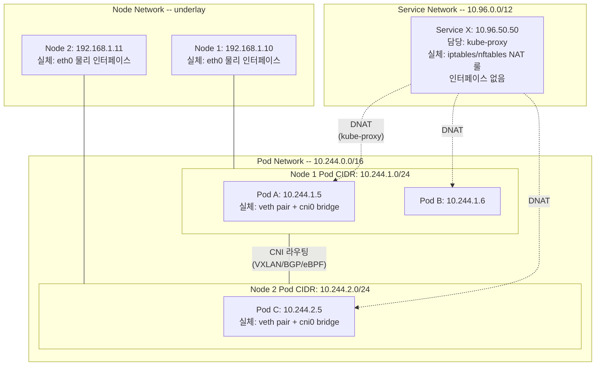
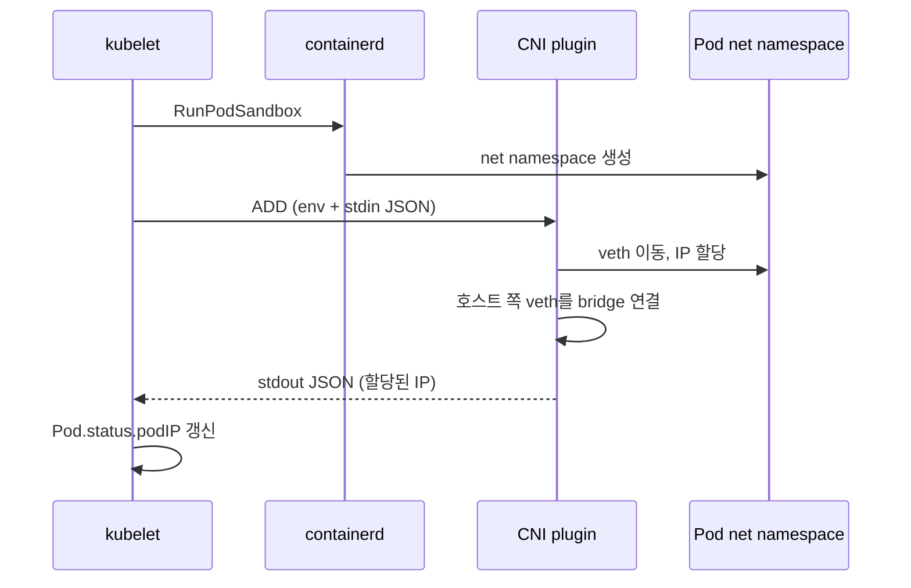
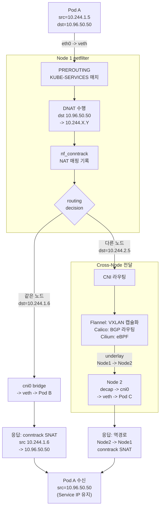
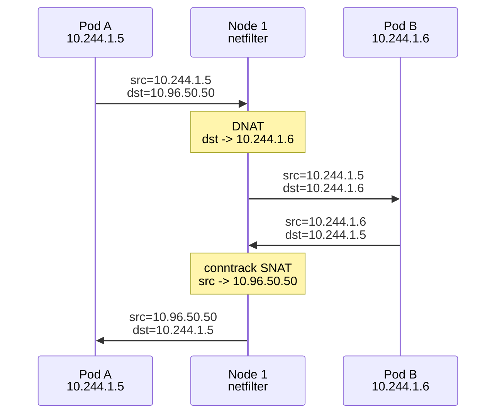
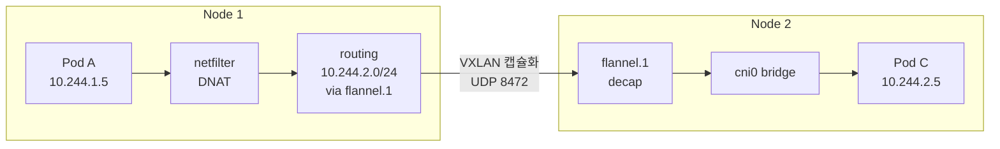
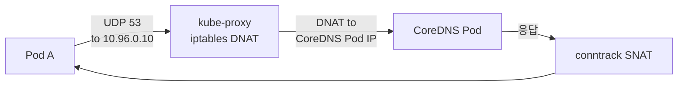

# Why?

편 3에서 클러스터의 control plane — etcd의 Raft 합의, apiserver의 admission chain, 인증서 3 CA, HA 토폴로지 — 을 다뤘다.

이제 클러스터가 존재하고, scheduler가 Pod를 올바른 노드에 배치할 수 있다.

그런데 Pod가 뜨는 것만으로는 서비스가 동작하지 않는다.

Pod 간에 패킷이 오가야 하고, 클라이언트가 Service IP로 접근했을 때 올바른 Pod로 도달해야 한다.

K8s 네트워크에서 가장 흔하게 마주하는 혼란은 다음과 같다.

`kubectl get svc`에 나오는 ClusterIP `10.96.50.50`으로 `curl`하면 응답이 온다.

그런데 `ip addr show`에서 이 IP가 _어디에도 없다_.

어떤 인터페이스에도 할당되어 있지 않은 IP가 어떻게 동작하는 것인가.

같은 노드의 Pod끼리는 통신되는데, 다른 노드의 Pod와는 통신이 안 된다.

`tcpdump`를 찍어 보면 패킷이 나가긴 나가는데 돌아오지 않는다.

어디서 막히는 것인가.

NetworkPolicy를 적용했는데 _아무 효과가 없다_.

YAML은 맞는데 트래픽이 여전히 통과한다.

무엇이 잘못된 것인가.

이 문제는 _세 개의 다른 네트워크가 동시에 존재한다_[^net-model]는 사실에서 비롯된다.

Node의 네트워크가 있고, Pod의 네트워크가 있고, Service의 네트워크가 있다.

각 네트워크는 서로 다른 CIDR을 사용하고, 서로 다른 컴포넌트가 관리한다.

한 패킷이 이 네트워크들을 거치면서 _src/dst IP가 도중에 바뀌는데_, 이 변환의 메커니즘을 모르면 디버깅 자체가 불가능하다.

이 편을 읽으면 다음이 가능해진다.

- Service IP가 인터페이스에 없는데 동작하는 이유를 _iptables NAT 규칙_으로 설명할 수 있다.
- Pod 간 통신 장애 시 `tcpdump` → `conntrack` → `iptables-save` 사다리의 어느 단계에서 패킷이 막히는지 추적할 수 있다.
- NetworkPolicy가 동작하지 않을 때, 그것이 _CNI 플러그인이 enforce하지 않기 때문_ (Flannel 단독은 미지원)인지 진단할 수 있다.

### 이 편의 구조

이 편에서는 세 네트워크의 분리에서 시작해, CNI가 Pod에 IP를 부여하는 메커니즘, kube-proxy가 Service 가상 IP를 구현하는 NAT 규칙, 패킷이 실제로 거치는 전체 경로, NetworkPolicy의 enforce 위치, CoreDNS의 동작까지 — 네트워크 스택의 모든 층을 아래에서 위로 따라간다.

각 절에서 개념을 다룬 직후 인라인 실습으로 검증하며, How 절에서는 실제 패킷을 캡처하고 NetworkPolicy 차단을 확인하는 종합 실습을 수행한다.

# What?

K8s의 네트워크 사상은 한 줄로 표현된다.

> **"모든 Pod는 라우팅 가능한 IP를 가져야 하며, 어떤 두 Pod도 NAT 없이 서로 통신할 수 있어야 한다."**[^D1]

왜 이런 원칙이 필요한가.

Docker의 기본 네트워크 모델은 호스트 안의 프라이빗 bridge였다.

다른 호스트의 컨테이너와 통신하려면 호스트 IP의 포트로 publish해서 NAT를 거쳐야 했다.

이 구조에서는 컨테이너가 자기 IP를 알 수 없고, 포트 충돌을 관리해야 하며, 호스트 위치에 따라 통신 방식이 달라진다.

K8s는 이 제약을 거부했다[^D2].

> **"Pod들은 같은 호스트에 있든 다른 호스트에 있든 똑같이 보여야 한다."**

이 약속이 서비스 디스커버리, 로드 밸런싱, NetworkPolicy의 토대가 된다.

그렇다면 이 약속을 누가 구현하는가.

K8s 자체는 구현 방법을 정의하지 않고, **CNI(Container Network Interface)** 표준에 위임한다[^D3].

이 편의 순서는 다음과 같다.

1. **세 네트워크** -- Node, Pod, Service CIDR의 분리
2. **CNI** -- Pod가 IP를 받는 메커니즘
3. **kube-proxy** -- Service 가상 IP의 동작 원리
4. **패킷 여정** -- 같은 노드 vs 다른 노드에서의 Service 트래픽 경로
5. **NetworkPolicy** -- Pod 단위 방화벽
6. **CoreDNS** -- 클러스터 DNS

각 절은 직전 절의 결과를 입력으로 받는다.

## 🌐 세 네트워크 -- Node, Pod, Service CIDR을 분리한 K8s 네트워크 모델

K8s 클러스터에는 세 개의 분리된 네트워크가 동시에 존재한다.

이 분리 구조를 이해하는 것이 나머지 모든 절의 전제이므로, 각 네트워크를 먼저 정리한다.

### Node Network -- underlay

호스트 노드들이 사용하는 네트워크다.

| 환경     | 대역 예시        |
| -------- | ---------------- |
| 홈랩 LAN | `192.168.1.0/24` |
| AWS VPC  | `10.0.0.0/16`    |

K8s가 만든 것이 아니라 이미 존재하는 물리/가상 네트워크다.

`kubectl get nodes -o wide`의 INTERNAL-IP가 이 네트워크의 IP다[^D4].

### Pod Network -- CNI가 만드는 가상 네트워크

각 Pod에 부여되는 IP의 네트워크다.

| CNI     | 기본 대역        |
| ------- | ---------------- |
| Flannel | `10.244.0.0/16`  |
| Calico  | `192.168.0.0/16` |

CNI 플러그인이 노드 위에 가상으로 만든다.

이때 전체 Pod CIDR을 한 노드가 독점하는 것이 아니라, 각 노드는 큰 CIDR의 서브셋을 받는다[^D5].

예를 들어 노드 1은 `10.244.1.0/24`, 노드 2는 `10.244.2.0/24`와 같다.

그 서브셋이 해당 노드 위 Pod들이 받을 IP의 풀이 된다.

`kubectl get pods -o wide`의 IP가 이 네트워크의 IP다.

### Service Network -- kube-proxy가 라우팅하는 가상 IP

가장 추상적인 네트워크다.

kubeadm 기본 대역은 `10.96.0.0/12`이다.

이 네트워크의 IP는 어떤 인터페이스에도 존재하지 않는다[^D6].

실제로 노드에서 `ip addr show`를 실행해도 Service IP는 어디에서도 나타나지 않는다.

그런데도 이 IP로 통신이 된다.

그 이유는 kube-proxy가 모든 노드의 netfilter에 NAT 규칙을 심어서, 이 IP로 향하는 패킷을 적절한 Pod IP로 변환하기 때문이다.

`kubectl get svc`의 CLUSTER-IP가 이 네트워크의 IP다.



### 세 CIDR가 겹쳐서는 안 되는 이유

세 CIDR가 하나라도 겹치면 라우팅이 깨진다.

왜일까.

예를 들어 회사 VPC가 `10.244.0.0/16`을 쓰는데 K8s가 같은 대역을 Pod에 할당하면, 패킷이 회사 서버로 가야 할지 클러스터 Pod으로 가야 할지 라우팅 결정이 실패하기 때문이다[^D7].

따라서 클러스터 설계 시 반드시 확인한다.

- **Node CIDR**, **Pod CIDR**, **Service CIDR**가 어떤 두 쌍도 겹치지 않는가.
- 회사의 VPN, peering된 다른 VPC와도 겹치지 않는가.

이 세 CIDR 결정이 클러스터 부트스트랩 시 가장 되돌리기 어려운 결정이다.

왜냐하면 Service CIDR 변경은 모든 ClusterIP와 인증서 SAN을 재발급해야 하므로 클러스터 재구축에 가깝기 때문이다.

### 실습 1: 세 네트워크 IP 확인과 CIDR 겹침 검증

지금까지 세 네트워크를 개념적으로 설명했지만, IP 대역이 실제로 분리되어 있다는 것은 직접 조회해야 실감할 수 있다.

이 실습에서는 kubectl로 세 네트워크의 IP를 나열하고, CIDR이 겹치지 않음을 확인한다.

우선 클러스터에 접근할 수 있는 환경을 준비하자.

```bash
# Node IP (Node network)
kubectl get nodes -o wide
# INTERNAL-IP 컬럼이 노드 IP

# Pod IP (Pod network)
kubectl get pods -A -o wide | head
# IP 컬럼이 Pod IP

# Service IP (Service network)
kubectl get svc -A | head
# CLUSTER-IP 컬럼이 Service IP
```

세 네트워크의 CIDR을 확인한다.

```bash
# Pod CIDR
kubectl cluster-info dump | grep -i 'cluster-cidr' | head -2

# 노드별 Pod CIDR
kubectl get nodes -o jsonpath=\
'{range .items[*]}{.metadata.name}{"\t"}{.spec.podCIDR}{"\n"}{end}'

# Service CIDR (apiserver 플래그)
sudo grep service-cluster-ip-range \
  /etc/kubernetes/manifests/kube-apiserver.yaml
```

세 CIDR이 어떤 두 쌍도 겹치지 않는지 확인한다.

K8s 네트워크 모델의 핵심인 세 네트워크 분리가 확인된다.

세 네트워크가 분리되어 있다는 사실을 확인했다면, 다음 의문은 자연스럽게 떠오른다.

Pod network의 IP를 누가, 어떻게 Pod에 할당하는가.

이 질문에 답하려면 CNI의 동작을 이해해야 한다.

## 🔌 CNI -- ADD/DEL 명령으로 Pod에 IP를 할당하는 플러그인 표준

### CNI가 푸는 문제

편 2의 `RunPodSandbox`에서 kubelet은 pause container의 net namespace를 만든 뒤 CNI 플러그인을 호출해 인터페이스를 설정한다[^D8].

이 호출의 표준이 **CNI(Container Network Interface)**다[^D3].

CNI는 매우 작은 spec이다.

플러그인은 바이너리 파일 한 개이며, kubelet이 환경변수와 stdin JSON으로 호출하면 stdout에 결과 JSON을 쓴다.

이렇게 단순한 이유는 CNI가 "네트워크를 어떻게 구현할지"가 아니라 "kubelet과 플러그인이 어떤 인터페이스로 대화할지"만 정의하기 때문이다.

### CNI의 다섯 가지 명령

| 명령        | 의미                                     |
| ----------- | ---------------------------------------- |
| **ADD**     | net namespace에 인터페이스 추가, IP 할당 |
| **DEL**     | 인터페이스 제거, IP 회수                 |
| **CHECK**   | 네트워크 정상 작동 확인                  |
| **VERSION** | 지원 spec 버전 반환                      |
| **GC**      | 1.1부터 추가, 누락된 네트워크 정리       |

핵심은 ADD와 DEL 두 개다.

Pod가 생성되면 ADD, 삭제되면 DEL — 이 두 호출이 Pod 네트워크의 생명주기 전체를 담당한다.

### ADD 호출의 실제 모양

```
환경변수:
  CNI_COMMAND=ADD
  CNI_CONTAINERID=<sandbox-container-id>
  CNI_NETNS=/var/run/netns/cni-<UUID>
  CNI_IFNAME=eth0
  CNI_PATH=/opt/cni/bin

stdin (JSON):
  {"cniVersion":"1.0.0","name":"k8s-pod-network",
   "type":"calico","ipam":{...}}
```

이 입력을 받은 플러그인은 다음을 순서대로 수행한다.

1. veth pair 생성 (편 1의 가상 케이블)[^D9]
2. veth 한쪽을 Pod net namespace 안으로 이동
3. Pod 안에서 IP 할당, 라우트 설정
4. 다른쪽을 호스트의 bridge 또는 호스트 네트워크에 연결
5. stdout에 할당된 IP/인터페이스 JSON 반환

플러그인이 stdout에 반환하는 결과 JSON은 다음과 같다.

```json
{
  "cniVersion": "1.0.0",
  "interfaces": [{ "name": "eth0", "sandbox": "/var/run/netns/cni-..." }],
  "ips": [
    { "interface": 0, "address": "10.244.1.5/24", "gateway": "10.244.1.1" }
  ],
  "routes": [{ "dst": "0.0.0.0/0" }]
}
```

이 응답을 받은 kubelet은 `Pod.status.podIP`에 IP를 기록한다.

따라서 `kubectl get pod -o wide`가 보여주는 IP가 바로 이 시점에 결정된다.



### CNI 플러그인의 책임 영역

CNI 플러그인은 IP 부여에 그치지 않는다.

K8s의 "모든 Pod는 라우팅 가능한 IP를 가진다"를 실현하기 위해 다음을 모두 책임진다[^D10].

- **IPAM** -- 노드의 Pod CIDR 풀에서 IP 할당/회수
- **노드 간 연결성** -- 다른 노드의 Pod까지 라우팅 가능하게 구성
- **NetworkPolicy enforcement** -- 지원하는 플러그인의 경우

마지막 항목이 중요하다.

NetworkPolicy는 kube-proxy가 아니라 CNI 플러그인이 구현한다.

왜냐하면 kube-proxy는 Service 트래픽만 다루지, Pod-to-Pod 트래픽 전체를 보지는 않기 때문이다.

따라서 CNI 선택이 곧 NetworkPolicy 지원 여부를 결정한다.

### 주요 CNI 플러그인 비교

| 플러그인          | 데이터 평면                           | NetworkPolicy              | 특징                                 |
| ----------------- | ------------------------------------- | -------------------------- | ------------------------------------ |
| **Flannel**[^D11] | VXLAN overlay(기본), host-gw          | 미지원(Canal 결합 시 가능) | 가장 단순, 어디서든 동작             |
| **Calico**[^D12]  | BGP routing(기본), VXLAN/IPIP overlay | L3/L4 지원                 | underlay 자유도, 성숙도              |
| **Cilium**[^D13]  | eBPF                                  | L3/L4 + L7                 | 성능, observability, kube-proxy 대체 |

**Flannel** -- VXLAN overlay를 기본으로 사용한다.

각 노드에 `flannel.1` VXLAN 인터페이스를 만들어 Pod 패킷을 캡슐화한다[^D14].

underlay에 대한 가정이 거의 없어 어떤 환경에서든 동작하지만, 캡슐화 오버헤드(50 bytes/packet)가 있고 NetworkPolicy를 단독 지원하지 않는다.

**Calico** -- BGP 기반 라우팅이 핵심이다[^D15].

각 노드를 BGP speaker로 만들어 Pod CIDR을 광고한다.

그 결과 다른 노드의 라우팅 테이블에 해당 CIDR이 추가되어, 오버레이 없는 native 라우팅이 가능하다.

NetworkPolicy 구현이 강력하며 eBPF 데이터 평면도 지원한다.

그러나 BGP 불가 환경(일부 클라우드 VPC)에서는 VXLAN 또는 IPIP overlay 모드로 운영해야 한다.

**Cilium** -- eBPF 기반이다[^D16].

커널의 eBPF 프로그램으로 패킷을 처리하며, iptables/nftables를 우회한다.

이 덕분에 kube-proxy 전체를 대체할 수 있고, L7 NetworkPolicy(HTTP method, gRPC service)를 지원한다.

Hubble이라는 observability 도구가 내장되어 패킷 흐름을 실시간 시각화한다.

단, 최신 커널(4.19+, 권장 5.10+)이 필요하다.

### 실습 2: veth, cni0 bridge, flannel.1 인터페이스 확인

지금까지 CNI가 veth pair를 만들고 bridge에 연결한다고 설명했지만, 이 객체들이 실제로 어떤 모습인지는 노드의 인터페이스를 직접 조회해야 드러난다.

이 실습에서는 노드 인터페이스, Pod namespace, 노드 간 라우팅을 순서대로 확인한다.

우선 워커 노드의 VM 쉘에 접속하자.

**Step 1 -- 노드 인터페이스 확인**

```bash
# lo, eth0, flannel.1, cni0, vethXXXX 순으로 나타나는지 확인
ip link show | grep -E "^[0-9]+:" | head -20
# 각 veth가 master cni0에 묶인 것을 확인
sudo bridge link show
```

**Step 2 -- Pod namespace 추적**

```bash
kubectl run probe --image=alpine -- sleep 3600
kubectl wait --for=condition=Ready pod/probe

# Pod가 있는 노드 VM에서
SANDBOX=$(sudo crictl pods --name probe -q)
PID=$(sudo crictl inspectp $SANDBOX | jq '.info.pid')
# Pod 안 eth0의 IP 확인
sudo nsenter -t $PID -n ip addr show
```

Pod 안 `eth0`의 반대편인 호스트 쪽 veth를 추적한다.

```bash
# 호스트 ifindex 확인
sudo nsenter -t $PID -n \
  cat /sys/class/net/eth0/iflink
# vethXXXX 이름 매칭
ip -o link show | grep <ifindex>
```

CNI ADD 호출이 만드는 veth pair와 cni0 bridge 연결 구조가 확인된다.

**Step 3 -- 노드 간 라우팅**

```bash
# 10.244.X.0/24 via 192.168.x.x dev flannel.1 형태로 나타남
ip route
```

이 항목이 CNI가 심어둔 노드 간 Pod 라우팅이다.

Flannel의 경우 다른 노드의 Pod CIDR을 `flannel.1` VXLAN 인터페이스로 보내고, VXLAN이 캡슐화해 해당 노드로 송신한다.

```bash
kubectl delete pod probe
```

CNI가 Pod에 IP를 부여하고 노드 간 라우팅도 구성했다.

그런데 Service IP는 어떤 인터페이스에도 없는데, 이 가상 IP가 어떻게 동작하는가.

이를 이해하려면 kube-proxy의 메커니즘을 파악해야 한다.

## 🔀 kube-proxy -- netfilter NAT 규칙으로 구현한 Service 가상 IP 라우팅

### Service IP의 동작 원리

`10.96.50.50` 같은 ClusterIP는 어느 인터페이스에도 존재하지 않지만, `curl`하면 응답이 온다.

왜일까.

**kube-proxy**가 모든 노드의 netfilter에 NAT 규칙을 심어 놓았기 때문이다[^D6].

이 NAT 규칙이 Service IP로 향하는 패킷을 가로채서 실제 Pod IP로 목적지를 변환한다.

### kube-proxy의 동작 원리

kube-proxy는 모든 노드에서 도는 DaemonSet이다[^D17].

그 동작은 세 단계로 나뉜다.

1. apiserver를 watch하면서 모든 Service와 EndpointSlice 변경을 추적한다.
2. 현재 노드에 적용할 NAT 규칙을 계산한다.
3. kernel의 netfilter에 규칙을 심거나 갱신한다.

핵심은 kube-proxy가 직접 패킷을 처리하지 않는다는 점이다.

데이터 평면은 전적으로 커널의 netfilter가 책임진다[^D18].

kube-proxy는 control plane(규칙을 심는 일)만 담당한다.

따라서 kube-proxy가 죽어도 기존 NAT 규칙은 그대로 동작한다.

단지 새 Service 변경이 반영되지 않을 뿐이다.

### 세 가지 모드 -- iptables, IPVS, nftables

**iptables 모드(기본)** -- netfilter NAT table에 규칙을 추가한다.

가장 안정적이지만 규칙이 sequential 순회되므로, 수천 개 Service 클러스터에서 latency가 올라간다[^D19].

**IPVS 모드(v1.35 deprecated)** -- 해시 테이블 기반 로드 밸런싱이다[^D20].

성능은 좋았으나 Service API의 모든 edge case를 정확히 구현하지 못해 deprecated되었다.

nftables 모드로 마이그레이션이 권장된다.

**nftables 모드(v1.33 GA, v1.35 권장)** -- iptables 후속 framework이다[^D21].

1.29 alpha, 1.31 beta, 1.33 GA의 단계를 거쳤다.

수만 개 Service에서 iptables보다 빠른 룰 갱신과 패킷 처리가 가능하다.

| 상황                      | 권장 모드                       |
| ------------------------- | ------------------------------- |
| 신규 클러스터, 커널 5.13+ | **nftables**                    |
| 안정성 중시 production    | **iptables**(당분간)            |
| 기존 IPVS 클러스터        | nftables 마이그레이션 계획 수립 |
| eBPF 가능 환경            | Cilium kube-proxy replacement   |

### iptables 모드의 실제 규칙

이론만으로는 NAT 규칙의 구조가 와닿지 않으므로, 구체적인 예시를 본다.

ClusterIP `10.96.50.50`의 Service `my-app`이 두 backend Pod(`10.244.1.5`, `10.244.2.5`)을 가진다고 하자.

```bash
# PREROUTING에서 KUBE-SERVICES로 점프
-A PREROUTING -j KUBE-SERVICES
# Service IP 매치
-A KUBE-SERVICES -d 10.96.50.50/32 \
  -p tcp --dport 80 -j KUBE-SVC-MYAPP
# backend random 분배
-A KUBE-SVC-MYAPP -m statistic \
  --mode random --probability 0.5 \
  -j KUBE-SEP-POD1
-A KUBE-SVC-MYAPP -j KUBE-SEP-POD2
# DNAT 수행
-A KUBE-SEP-POD1 -p tcp \
  -j DNAT --to-destination 10.244.1.5:80
-A KUBE-SEP-POD2 -p tcp \
  -j DNAT --to-destination 10.244.2.5:80
```

패킷은 PREROUTING에서 가로채져, 50% 확률로 두 backend 중 하나로 목적지가 변경된다.

이것이 KUBE-SERVICES, KUBE-SVC, KUBE-SEP의 3단계 chain 구조다[^D19].

그런데 DNAT로 목적지만 바꾸면 응답 패킷은 어떻게 되는가.

응답 시 nf_conntrack이 NAT 매핑을 기억하고 역방향으로 자동 변환한다[^D22].

이 자동 SNAT 덕분에 클라이언트 Pod는 Service IP와 통신한 것으로 인식한다.

### conntrack의 역할

conntrack(connection tracking)은 netfilter의 상태 추적 엔진이다[^D22].

DNAT가 발생한 연결에 대해 원래 목적지와 변환된 목적지의 매핑을 테이블에 기록한다.

이 기록이 있으므로, 응답 패킷이 돌아오면 이 매핑을 참조해 출발지를 원래 Service IP로 역변환(SNAT)한다.

conntrack 테이블의 한 행은 다음과 같은 구조다.

```
tcp 6 86399 ESTABLISHED
  src=10.244.1.5 dst=10.96.50.50 sport=45678 dport=80
  src=10.244.2.5 dst=10.244.1.5 sport=80 dport=45678
```

첫 줄이 원래 패킷(클라이언트 → Service IP)이고, 둘째 줄이 기대되는 응답(backend Pod → 클라이언트)이다.

커널은 둘째 줄과 매치되는 응답 패킷을 감지하면 src를 `10.96.50.50`으로 자동 변환한다[^D23].

이 메커니즘이 없으면 어떻게 되는가.

클라이언트는 요청한 적 없는 Pod IP에서 응답을 받게 되어 TCP 연결이 깨진다.

conntrack 테이블의 최대 크기는 `nf_conntrack_max` sysctl로 제어되며, 대규모 클러스터에서는 이 값을 튜닝해야 한다.

### v1.35의 PreferSameNode

K8s v1.35에서 GA된 `trafficDistribution` 필드다[^D24].

```yaml
apiVersion: v1
kind: Service
metadata:
  name: my-app
spec:
  trafficDistribution: PreferSameNode
  selector:
    app: my-app
  ports:
    - port: 80
```

- **PreferSameNode** -- 같은 노드의 backend Pod 우선, 없으면 다른 노드로 fallback.
- **PreferSameZone** -- 같은 zone(AZ)의 backend 우선.

네트워크 hop과 cross-zone 트래픽 비용을 줄이는 것이 목적이다.

이전의 `topology-aware-hints`가 복잡하고 실패 모드가 불명확했던 데 비해, `trafficDistribution`은 명시적이고 안전한 fallback 동작을 가진다.

### 실습 3: iptables-save로 KUBE-SVC chain 추적

지금까지 Service IP가 NAT 규칙으로 동작한다고 설명했지만, 인터페이스에 없는 IP가 정말로 응답을 주는지는 직접 확인하지 않으면 추상으로 남는다.

이 실습에서는 iptables NAT 규칙의 3단계 chain 구조와 Service IP의 가상성을 직접 확인한다.

우선 테스트용 deployment와 Service를 생성하자.

```bash
kubectl create deployment nginx \
  --image=nginx --replicas=3
kubectl expose deployment nginx \
  --port=80 --target-port=80
```

3단계 chain 분기를 확인한다.

```bash
# KUBE-SERVICES → KUBE-SVC-XXXXX → KUBE-SEP-XXX → DNAT 순서 확인
sudo iptables-save -t nat \
  | grep -E "KUBE-SERVICES|nginx" | head -20
```

KUBE-SERVICES에서 KUBE-SVC-XXXXX로, KUBE-SVC에서 probability 기반으로 KUBE-SEP-XXX로, KUBE-SEP에서 DNAT를 수행한다.

```bash
# Service IP가 인터페이스에 없음을 확인
ip addr show | grep $(kubectl get svc nginx \
  -o jsonpath='{.spec.clusterIP}')
# 출력 없음

# 그러나 curl하면 응답
curl --max-time 3 http://$(kubectl get svc nginx \
  -o jsonpath='{.spec.clusterIP}')
```

"인터페이스 없는 가상 IP가 NAT 규칙으로 동작하는" kube-proxy 메커니즘이 확인된다.

NAT 변환이 일어난다는 것은 확인했다.

그런데 변환된 패킷이 실제로 어떤 경로를 거쳐 목적지 Pod에 도달하는가.

같은 노드와 다른 노드에서 경로가 어떻게 달라지는지 알려면 패킷의 전체 여정을 추적해야 한다.

## 📦 패킷 여정 -- 같은 노드 vs 다른 노드에서 Service 트래픽이 흐르는 전체 경로

패킷이 Service 호출부터 목적지 Pod까지 거치는 전체 경로와 각 단계에서의 src/dst IP 변화를 한 그림으로 정리하면 다음과 같다.



시나리오를 설정한다.

Pod A(`10.244.1.5`, Node 1)가 Service `my-app`(`10.96.50.50:80`)을 호출한다.

backend는 Pod B(`10.244.1.6`, Node 1)와 Pod C(`10.244.2.5`, Node 2)다.

### 시나리오 1 -- 같은 노드 backend

DNAT 결과로 Pod B가 선택된 경우의 경로다.

앞 절에서 다룬 3단계 chain을 거쳐 목적지가 변환된 뒤, 패킷이 어떤 인터페이스를 지나는지 단계별로 따라간다.



패킷 흐름을 단계별로 정리하면 다음과 같다.

1. Pod A에서 `10.96.50.50:80`으로 연결 시도
2. 패킷이 Pod A net namespace를 벗어나 호스트 진입
3. PREROUTING → KUBE-SERVICES → KUBE-SVC-MYAPP
4. random 분배로 Pod B 선택
5. DNAT: dst `10.96.50.50:80` → `10.244.1.6:80`
6. nf_conntrack에 NAT 매핑 기록
7. `10.244.1.6`은 같은 노드 → cni0 bridge → veth → Pod B
8. Pod B 응답 → conntrack SNAT: src `10.244.1.6` → `10.96.50.50`
9. Pod A에 도착

Pod A 시점에서는 상대가 `10.96.50.50`인 것으로 보인다.

실제로는 Pod B와 통신하지만, conntrack의 NAT 변환이 그 추상을 유지한다.

이것이 Service라는 가상 엔드포인트가 투명하게 동작하는 원리다.

### 시나리오 2 -- 다른 노드 backend

DNAT가 Pod C를 선택한 경우, 1~5단계까지는 동일하다.

차이는 그 이후에 발생한다.

routing decision에서 `10.244.2.5`가 Node 2에 있으므로 CNI의 라우팅을 탄다.

6. nf_conntrack에 NAT 매핑 기록
7. routing decision: `10.244.2.5`는 Node 2
8. CNI 라우팅에 따라 패킷 전달
9. Node 2 도착 → cni0 bridge → Pod C
10. Pod C 응답 → 역방향으로 Node 2 → Node 1 → conntrack SNAT → Pod A

8단계에서 CNI 데이터 평면에 따른 차이가 발생한다.

- **Flannel VXLAN** -- `flannel.1`에서 캡슐화, UDP 8472로 Node 2의 `flannel.1`로 전달[^D11]
- **Calico BGP** -- 노드 eth0으로 직접 라우팅, BGP가 광고한 경로를 따름[^D12]
- **Cilium eBPF** -- eBPF 프로그램 안에서 처리, kube-proxy 자체를 대체 가능[^D13]

Flannel VXLAN의 경우 원본 패킷이 50 byte의 VXLAN 헤더로 캡슐화되어 underlay를 통과한다[^D14].

반면 Calico BGP의 경우 캡슐화 없이 underlay가 직접 Pod IP를 라우팅하므로 오버헤드가 없다.



이 다이어그램이 Flannel VXLAN 환경에서의 cross-node 패킷 경로다.

Node 1의 netfilter가 DNAT를 수행한 뒤, routing table이 목적지 `10.244.2.0/24`를 `flannel.1`로 보내고, VXLAN 캡슐화를 거쳐 Node 2에 도착한다.

Node 2의 `flannel.1`이 decapsulation하고, cni0 bridge를 거쳐 Pod C에 전달된다.

### 실습 4: tcpdump 패킷 캡처, conntrack DNAT 매핑 확인

지금까지 패킷 여정을 다이어그램으로 설명했지만, 실제 패킷이 어떻게 변환되는지는 tcpdump로 직접 캡처해 봐야 체감된다.

이 실습에서는 tcpdump와 conntrack을 사용하여 Service 호출 시 DNAT 전후의 IP 변화와 conntrack 매핑을 직접 관찰한다.

우선 클라이언트 Pod와 Service를 준비하자.

```bash
kubectl run client --image=alpine \
  --restart=Never -- sleep 3600
SVC_IP=$(kubectl get svc nginx \
  -o jsonpath='{.spec.clusterIP}')
```

클라이언트 Pod가 있는 노드에서 캡처한다.

```bash
# Service IP와 Pod 대역 전체를 동시에 캡처
sudo tcpdump -i any -nn host $SVC_IP \
  or net 10.244.0.0/16 \
  -w /tmp/svc-trace.pcap &
TCPDUMP_PID=$!

kubectl exec client -- \
  wget -q -O- http://nginx -T 5
sleep 2 && sudo kill $TCPDUMP_PID

sudo tcpdump -r /tmp/svc-trace.pcap \
  -nn 2>/dev/null | head -20
```

출력에서 다음과 같은 패턴을 확인한다.

```
10.244.X.X.YYYYY > 10.96.Z.Z.80     # 요청: dst가 Service IP
10.244.X.X.YYYYY > 10.244.A.B.80    # DNAT 후: dst가 Pod IP
10.244.A.B.80 > 10.244.X.X.YYYYY    # 응답: src가 Pod IP
10.96.Z.Z.80 > 10.244.X.X.YYYYY     # conntrack SNAT: src가 Service IP
```

이 네 줄이 바로 절 3의 NAT chain과 절 4의 패킷 경로가 결합된 실체다.

Service IP라는 가상 주소가 DNAT/SNAT 쌍으로 유지되는 것이 패킷에서 직접 보인다.

```bash
# 양방향 NAT 매핑 확인
sudo conntrack -L | grep $SVC_IP | head
```

각 행이 양방향 매핑을 동시에 표현한다.

`src=<client> dst=<ServiceIP>`와 `src=<PodIP> dst=<client>`가 한 행에 기록된다.

이 매핑이 존재하는 동안 응답 패킷이 자동으로 SNAT된다.

conntrack 절에서 다룬 상태 추적 엔진의 동작이 확인된다.

```bash
kubectl delete pod client
```

트래픽이 흐르는 경로를 확인했다.

그런데 만약 특정 트래픽만 허용하고 나머지를 차단하려면 어떻게 하는가.

트래픽 경로를 아는 것만으로는 부족하고, 접근 제어 메커니즘이 필요하다.

## 🛡 NetworkPolicy -- CNI가 enforce하는 Pod 단위 ingress/egress 제어

### 기본은 모두 허용

K8s의 기본 네트워크 정책은 완전 개방이다[^D25].

NetworkPolicy를 정의하지 않으면 모든 Pod 간 통신이 자유롭다.

이는 K8s의 "모든 Pod는 라우팅 가능한 IP를 가진다"는 약속의 자연스러운 귀결이지만, production 보안 관점에서는 위험하다.

왜냐하면 하나의 Pod가 탈취되면 클러스터 내 모든 Pod에 접근 가능하기 때문이다.

NetworkPolicy는 이 기본을 명시적 거부 + 명시적 허용 모델로 바꾸는 도구다.

### 정책의 형식

```yaml
apiVersion: networking.k8s.io/v1
kind: NetworkPolicy
metadata:
  name: backend-allow
  namespace: production
spec:
  podSelector:
    matchLabels:
      app: backend
  policyTypes: [Ingress, Egress]
  ingress:
    - from:
        - podSelector:
            matchLabels:
              app: frontend
      ports:
        - protocol: TCP
          port: 8080
  egress:
    - to:
        - namespaceSelector:
            matchLabels:
              name: kube-system
          podSelector:
            matchLabels:
              k8s-app: kube-dns
      ports:
        - protocol: UDP
          port: 53
```

이 정책은 production의 backend Pod에 대해, Ingress는 frontend에서 8080/TCP만, Egress는 CoreDNS에 53/UDP만 허용한다.

### 매치되면 deny-by-default

policyTypes에 Ingress가 포함된 정책이 한 Pod에 매치되면, 그 Pod의 Ingress는 명시적 허용 외 모두 거부된다[^D25].

이 암묵적 deny가 보안 효과를 만들지만, 동시에 디버깅을 어렵게 한다.

왜냐하면 정책이 매치되는 순간 이전에 잘 되던 통신이 갑자기 끊기고, 어떤 정책이 원인인지 추적하기가 쉽지 않기 때문이다.

### kube-proxy가 아니라 CNI가 enforce한다

이것이 NetworkPolicy의 가장 중요한 사실이다.

왜 kube-proxy가 아닌가.

kube-proxy는 Service 트래픽만 본다.

그러나 NetworkPolicy는 모든 Pod-to-Pod 트래픽을 검사해야 한다.

모든 Pod-to-Pod 트래픽을 보는 것은 Pod의 네트워크 인터페이스를 만들고 관리하는 CNI의 일이다[^D26].

따라서 NetworkPolicy enforcement는 CNI 플러그인의 책임이다.

| CNI         | NetworkPolicy 지원                  |
| ----------- | ----------------------------------- |
| **Calico**  | netfilter 또는 eBPF 위에 구현[^D12] |
| **Cilium**  | eBPF 위에서 L3/L4 + L7[^D13]        |
| **Flannel** | 미지원, Canal 결합 필요[^D11]       |

Calico는 각 노드에서 Felix 에이전트가 동작한다[^D27].

Felix는 apiserver를 watch하면서 NetworkPolicy 객체를 읽고, 해당 노드의 Pod에 적용될 iptables 또는 eBPF 규칙을 생성한다.

Pod의 veth 인터페이스에 직접 규칙을 걸기 때문에 Pod 단위의 세밀한 제어가 가능하다.

Cilium은 eBPF 프로그램을 Pod의 tc(traffic control) hook에 attach한다.

이 방식 덕분에 L3/L4뿐 아니라 HTTP method, gRPC service name 같은 L7 정보까지 검사할 수 있다.

이 사실을 모르면 치명적인 착각이 발생한다.

Flannel 클러스터에 NetworkPolicy를 적용하면 어떻게 되는가.

apiserver는 NetworkPolicy 객체를 받아주지만, enforce하는 컴포넌트가 없으므로 정책은 무시된다.

kubectl이 오류 없이 apply를 받아주므로 운영자가 보안이 적용됐다고 오인하는 것이 가장 위험한 시나리오다.

### AdminNetworkPolicy(v1.35 beta)

표준 NetworkPolicy는 namespace 단위이므로, 클러스터 관리자가 모든 namespace에 강제하는 정책을 표현할 수 없었다[^D28].

**AdminNetworkPolicy**(KEP-2091, v1.35 beta)가 이 한계를 채운다.

```yaml
apiVersion: policy.networking.k8s.io/v1beta1
kind: AdminNetworkPolicy
metadata:
  name: deny-egress-to-metadata
spec:
  priority: 10
  subject:
    namespaces: {}
  egress:
    - action: Deny
      to:
        - networks: ["169.254.169.254/32"]
```

클라우드 metadata service 차단 같은 보안 baseline에 활용된다.

Calico와 Cilium이 이 API를 지원한다.

네트워크 접근을 제어하는 방법을 다뤘다.

아직 한 가지 의문이 남아 있다.

Pod가 Service를 IP가 아닌 이름으로 찾는 방법은 무엇인가.

이를 이해하려면 클러스터 DNS의 동작을 파악해야 한다.

## 📇 CoreDNS -- kubernetes plugin과 watch로 구현한 클러스터 DNS 서버

### Service의 DNS 이름

ClusterIP가 부여된 Service는 동시에 DNS 이름을 갖는다[^D29].

```
my-app.default.svc.cluster.local    (풀 네임)
my-app.default                       (다른 namespace에서)
my-app                               (같은 namespace 안에서)
```

이 DNS를 제공하는 것이 **CoreDNS**다[^D30].

### CoreDNS는 일반 Pod다

CoreDNS는 kube-system namespace의 Deployment로 배포된다.

보통 2 replica가 동작하며, 그 앞에 `kube-dns`라는 Service(`10.96.0.10` 같은 고정 ClusterIP)가 있다.

```bash
kubectl get pods -n kube-system -l k8s-app=kube-dns
# coredns-XXXXX-AAAAA  Running
# coredns-XXXXX-BBBBB  Running

kubectl get svc -n kube-system kube-dns
# kube-dns  ClusterIP  10.96.0.10  <none>  53/UDP,53/TCP
```

CoreDNS 자체가 Pod이므로 Pod CIDR의 IP를 가진다.

그 앞의 kube-dns Service는 Service CIDR의 고정 IP를 가진다.

이 편에서 다룬 세 네트워크가 CoreDNS 하나에도 모두 관여한다.

### kubelet이 주입하는 /etc/resolv.conf

```
nameserver 10.96.0.10
search default.svc.cluster.local svc.cluster.local cluster.local
options ndots:5
```

- **nameserver** -- kube-dns Service의 ClusterIP
- **search** -- namespace + 클러스터 도메인 search 경로
- **ndots:5** -- 점이 5개 미만이면 search 도메인 적용[^D31]

### ndots:5의 의미와 불필요 쿼리 문제

`nslookup my-app`하면 다음 순서로 시도된다.

```
my-app.default.svc.cluster.local
my-app.svc.cluster.local
my-app.cluster.local
my-app                              (외부 DNS)
```

여기까지는 문제가 없다.

그러나 만약 외부 도메인을 조회하면 어떻게 되는가.

`google.com`도 점 1개이므로 search가 적용되어 `google.com.default.svc.cluster.local` 같은 불필요한 쿼리가 발생하고, 실패 후에야 외부로 나간다.

이 불필요 쿼리 폭증이 K8s에서 가장 흔한 DNS 성능 이슈의 원인이다[^D32].

해결책은 두 가지다.

첫째, 외부 도메인을 `google.com.`(trailing dot)으로 FQDN 명시한다.

trailing dot은 "이 도메인은 완전한 이름이므로 search 도메인을 적용하지 말라"는 의미다.

둘째, NodeLocal DNSCache를 추가한다[^D33].

각 노드에 DNS 캐시 데몬을 배치해 반복 쿼리와 불필요 쿼리를 로컬에서 처리한다.

대규모 클러스터에서 CoreDNS 부하를 줄이는 표준 방법이다.

### CoreDNS의 내부 동작

CoreDNS는 kubernetes plugin 모듈로 apiserver를 watch한다[^D30].

Service와 Endpoint가 변경될 때마다 내부 캐시가 갱신되고 DNS 쿼리에 응답한다.

이는 K8s의 모든 컴포넌트가 따르는 watch 기반 reconcile 패턴이다(편 3).



이 다이어그램에서 주목할 점이 있다.

DNS 쿼리 자체도 Service IP(`10.96.0.10`)를 통해 전달되므로, 이 편에서 다룬 kube-proxy NAT와 conntrack 메커니즘이 그대로 적용된다.

### PreferSameNode와 CoreDNS의 시너지

kube-dns Service에 `trafficDistribution: PreferSameNode`를 설정하면 각 노드의 Pod가 자기 노드의 CoreDNS로 쿼리를 보낸다[^D24].

그 결과 네트워크 hop이 0에 가까워지고 DNS latency가 의미 있게 떨어진다.

v1.35의 가장 실용적인 활용처 중 하나다.

이 편의 여섯 절을 통해 K8s 네트워크 전체가 완성됐다.

정리하면 다음의 인과 사슬이다.

1. Node, Pod, Service 세 CIDR이 겹치지 않게 분리된다(절 1).
2. CNI가 ADD 호출로 Pod에 IP를 할당하고 veth pair로 호스트에 연결한다(절 2).
3. kube-proxy가 netfilter NAT 규칙으로 Service 가상 IP를 Pod IP로 변환한다(절 3).
4. 패킷은 같은 노드면 cni0 bridge를, 다른 노드면 CNI 라우팅을 거쳐 Pod에 도달한다(절 4).
5. NetworkPolicy는 CNI가 enforce하며, Flannel 단독은 미지원이다(절 5).
6. CoreDNS가 Service 이름을 ClusterIP로 해석하고, 이 DNS 쿼리 자체도 Service 트래픽이다(절 6).

이 여섯 단계가 하나의 인과 사슬로 연결된다.

# How?

What 절의 각 실습에서 개별 메커니즘을 검증했다.

여기서는 여러 메커니즘이 결합되는 종합 시나리오를 다룬다.

개별 절에서는 한 계층만 확인했지만, 실제 트래픽은 DNS 해석, NAT 변환, CNI 라우팅이 동시에 관여하므로 종합적으로 추적해야 전체 그림이 보인다.

환경은 편 3의 멀티 VM 클러스터를 재사용한다.

CNI는 Flannel을 가정한다(네트워크 구조가 가장 단순).

NetworkPolicy 실습은 Calico가 필요하다(k3s `--flannel-backend=none` + calico).

## 종합 실습 1: Service 트래픽 패킷 캡처 -- DNAT와 conntrack 자동 SNAT 확인

절 3의 NAT 규칙과 절 4의 패킷 여정을 하나의 시나리오로 검증한다.

지금까지 개념적으로 다룬 DNAT/SNAT 쌍이 실제 패킷에서 어떻게 보이는지 직접 캡처해야 이론과 실제의 간극이 사라진다.

이 실습에서는 nginx deployment, Service, client Pod를 만들고 패킷을 캡처해 DNAT 전후의 IP 변화를 관찰한다.

우선 테스트 환경을 구성하자.

**Step 1 -- 테스트 환경 구성**

```bash
kubectl create deployment nginx \
  --image=nginx --replicas=3
kubectl expose deployment nginx \
  --port=80 --target-port=80
kubectl run client --image=alpine \
  --restart=Never -- sleep 3600
kubectl wait --for=condition=Ready pod/client

SVC_IP=$(kubectl get svc nginx \
  -o jsonpath='{.spec.clusterIP}')
echo "Service IP: $SVC_IP"
```

**Step 2 -- 호스트에서 패킷 캡처**

클라이언트 Pod가 있는 노드의 VM에서 실행한다.

```bash
# Service IP와 Pod 대역 전체를 동시에 캡처
sudo tcpdump -i any -nn host $SVC_IP \
  or net 10.244.0.0/16 \
  -w /tmp/svc-trace.pcap &
TCPDUMP_PID=$!

kubectl exec client -- \
  wget -q -O- http://nginx -T 5
sleep 2 && sudo kill $TCPDUMP_PID

sudo tcpdump -r /tmp/svc-trace.pcap \
  -nn 2>/dev/null | head -30
```

출력에서 다음과 같은 패턴을 확인한다.

```
10.244.X.X.YYYYY > 10.96.Z.Z.80     # 요청: dst가 Service IP
10.244.X.X.YYYYY > 10.244.A.B.80    # DNAT 후: dst가 Pod IP
10.244.A.B.80 > 10.244.X.X.YYYYY    # 응답: src가 Pod IP
10.96.Z.Z.80 > 10.244.X.X.YYYYY     # conntrack SNAT: src가 Service IP
```

이 네 줄이 바로 절 3의 NAT chain과 절 4의 패킷 경로가 결합된 실체다.

Service IP라는 가상 주소가 DNAT/SNAT 쌍으로 유지되는 것이 패킷에서 직접 보인다.

**Step 3 -- conntrack 테이블 확인**

```bash
# 각 행의 양방향 NAT 매핑 확인
sudo conntrack -L | grep $SVC_IP | head
```

각 행이 양방향 매핑을 동시에 표현한다.

`src=<client> dst=<ServiceIP>`와 `src=<PodIP> dst=<client>`가 한 행에 기록된다.

이 매핑이 존재하는 동안 응답 패킷이 자동으로 SNAT된다.

conntrack 절에서 다룬 상태 추적 엔진의 동작이 확인된다.

**Step 4 -- 정리**

```bash
kubectl delete pod client
kubectl delete deployment nginx
kubectl delete svc nginx
sudo rm -f /tmp/svc-trace.pcap
```

## 종합 실습 2: NetworkPolicy 적용과 차단 검증(Calico 환경)

절 5의 deny-by-default 메커니즘을 Calico 클러스터에서 직접 검증한다.

개념 절에서 "Flannel 단독은 미지원"이라고 했는데, 그렇다면 Calico에서는 정말로 차단이 동작하는가.

이 실습에서는 default deny 정책과 명시적 허용의 동작을 확인한다.

Flannel 단독은 NetworkPolicy를 enforce하지 않으므로 반드시 Calico가 필요하다.

우선 Calico 클러스터를 셋업하자.

**Step 1 -- Calico 클러스터 셋업**

```bash
multipass launch --name calico-lab \
  --cpus 2 --memory 4G --disk 10G 22.04
multipass shell calico-lab

curl -sfL https://get.k3s.io | sh -s - \
  --flannel-backend=none \
  --disable-network-policy=false
sudo k3s kubectl apply -f \
  https://raw.githubusercontent.com/projectcalico/calico/v3.28.0/manifests/calico.yaml
alias kubectl='sudo k3s kubectl'

kubectl wait --for=condition=Ready \
  pod -l k8s-app=calico-node \
  -n kube-system --timeout=300s
```

**Step 2 -- 테스트 환경**

```bash
kubectl create namespace frontend
kubectl create namespace backend
kubectl run client -n frontend \
  --image=alpine --labels="app=frontend" \
  -- sleep 3600
kubectl run server -n backend \
  --image=nginx --labels="app=backend"
kubectl wait --for=condition=Ready \
  -n frontend pod/client --timeout=60s
kubectl wait --for=condition=Ready \
  -n backend pod/server --timeout=60s

SERVER_IP=$(kubectl get pod server -n backend \
  -o jsonpath='{.status.podIP}')

# 정책 적용 전 -- 통신 가능
kubectl exec -n frontend client -- \
  wget -q -O- --timeout=3 http://$SERVER_IP
```

**Step 3 -- Default Deny**

```bash
cat <<EOF | kubectl apply -f -
apiVersion: networking.k8s.io/v1
kind: NetworkPolicy
metadata:
  name: default-deny-all
  namespace: backend
spec:
  podSelector: {}
  policyTypes: [Ingress, Egress]
EOF

# 타임아웃 -- 차단됨
kubectl exec -n frontend client -- \
  wget -q -O- --timeout=3 http://$SERVER_IP
```

절 5에서 다룬 deny-by-default 동작이 확인된다.

policyTypes에 Ingress를 포함한 정책이 매치되면, 명시적 허용 외 모든 트래픽이 거부된다.

**Step 4 -- 명시적 허용**

```bash
cat <<EOF | kubectl apply -f -
apiVersion: networking.k8s.io/v1
kind: NetworkPolicy
metadata:
  name: allow-frontend
  namespace: backend
spec:
  podSelector:
    matchLabels:
      app: backend
  policyTypes: [Ingress]
  ingress:
    - from:
        - namespaceSelector:
            matchLabels:
              kubernetes.io/metadata.name: frontend
          podSelector:
            matchLabels:
              app: frontend
      ports:
        - port: 80
          protocol: TCP
EOF

# nginx 응답 수신
kubectl exec -n frontend client -- \
  wget -q -O- --timeout=3 http://$SERVER_IP
```

**Step 5 -- 다른 라벨 Pod 차단 확인**

```bash
kubectl run hacker -n frontend \
  --image=alpine --labels="app=hacker" \
  -- sleep 3600
kubectl wait --for=condition=Ready \
  -n frontend pod/hacker --timeout=60s

# 타임아웃 -- app=frontend가 아니므로 차단
kubectl exec -n frontend hacker -- \
  wget -q -O- --timeout=3 http://$SERVER_IP
```

CNI(Calico)가 Pod IP와 라벨을 매치해 차단/허용을 수행한 것이다.

kube-proxy가 아니라 CNI가 enforce한다는 절 5의 구조가 확인된다.

**Step 6 -- 정리**

```bash
kubectl delete namespace frontend backend
exit
multipass delete calico-lab 2>/dev/null
multipass purge
```

## 종합 실습 3: DNS 해석 추적

절 6의 CoreDNS 메커니즘과 ndots:5 동작을 직접 확인한다.

개념 절에서 불필요 쿼리 문제를 설명했지만, 실제로 몇 번의 쿼리가 발생하는지는 로그를 직접 확인해야 체감된다.

이 실습에서는 resolv.conf 주입, Service DNS 해석, ndots:5 불필요 쿼리를 순서대로 확인한다.

편 3의 기본 클러스터 환경으로 돌아오자.

**Step 1 -- DNS 설정 확인**

```bash
kubectl run dns-test --image=alpine \
  --restart=Never -- sleep 3600
kubectl wait --for=condition=Ready pod/dns-test

# nameserver, search, ndots:5 확인
kubectl exec dns-test -- cat /etc/resolv.conf
```

절 6에서 다룬 kubelet의 /etc/resolv.conf 자동 주입이 확인된다.

**Step 2 -- Service DNS 해석**

```bash
# nginx Service가 없으면 생성
kubectl create deployment nginx \
  --image=nginx --replicas=2 2>/dev/null
kubectl expose deployment nginx \
  --port=80 --target-port=80 2>/dev/null

# nginx.default.svc.cluster.local이 Service ClusterIP로 해석됨
kubectl exec dns-test -- nslookup nginx
```

**Step 3 -- ndots:5 동작 확인**

```bash
kubectl exec dns-test -- nslookup google.com
# 응답이 오지만 불필요 쿼리가 발생

# CoreDNS Pod 로그에서 google.com.default.svc.cluster.local 같은 쿼리 확인
kubectl logs -n kube-system \
  -l k8s-app=kube-dns --tail=20 \
  | grep google
```

외부 도메인에 대해 search 도메인이 적용되어 최대 4회의 불필요 쿼리가 발생한다.

절 6에서 다룬 ndots:5 문제가 확인된다.

**Step 4 -- FQDN으로 불필요 쿼리 제거 확인**

```bash
# trailing dot을 붙이면 search 도메인 미적용, CoreDNS 로그에 불필요 쿼리 없음
kubectl exec dns-test -- nslookup google.com.
```

**Step 5 -- CoreDNS까지의 경로 확인**

```bash
# kube-dns Service의 ClusterIP 확인
kubectl get svc -n kube-system kube-dns

# 해당 ClusterIP가 실제 CoreDNS Pod로 DNAT되는 규칙
sudo iptables-save -t nat | grep kube-dns | head -5
```

DNS 쿼리도 Service IP를 통해 전달되므로, 절 3의 kube-proxy NAT 메커니즘이 적용된다.

절 6에서 다룬 "DNS 쿼리 자체도 Service 트래픽"이라는 구조가 확인된다.

**Step 6 -- 정리**

```bash
kubectl delete pod dns-test
kubectl delete deployment nginx
kubectl delete svc nginx
```

# 시리즈를 마치며

4편에 걸쳐 K8s의 모든 추상층을 다뤘다.

- **편 1** -- Linux 커널의 namespace, cgroup, OverlayFS, veth가 만드는 컨테이너의 토대
- **편 2** -- kubelet이 노드 위에서 Pod를 띄우고 신원을 발급하고 볼륨을 마운트하는 메커니즘
- **편 3** -- apiserver, etcd, scheduler, controller-manager가 컨트롤 플레인으로서 합의를 이루는 방식
- **편 4** -- CNI와 kube-proxy가 Pod-to-Pod, Pod-to-Service 트래픽을 흐르게 하는 메커니즘

이 모든 것은 Linux 커널의 원시 자원과 표준화된 인터페이스 위에 만들어진 분산 reconcile 시스템이다.

`kubectl get pod`이 실패할 때, 어디를 볼지가 보인다.

- apiserver의 audit log와 인증서 만료 여부
- etcd의 endpoint status와 Raft leader 상태
- 노드의 `/var/lib/kubelet`과 kubelet 로그
- kube-proxy의 iptables/nftables 규칙
- CNI의 veth pair와 bridge 연결 상태
- conntrack 테이블의 NAT 매핑

이 시리즈가 그 디버깅 깊이의 출발점이 되었기를 바란다.

# Reference

[^net-model]: Kubernetes Documentation -- The Kubernetes Network Model. <https://kubernetes.io/docs/concepts/services-networking/#the-kubernetes-network-model>

[^D1]: Kubernetes Documentation -- Cluster Networking. <https://kubernetes.io/docs/concepts/cluster-administration/networking/>

[^D2]: Kubernetes Documentation -- The Kubernetes Network Model. <https://kubernetes.io/docs/concepts/services-networking/#the-kubernetes-network-model>

[^D3]: Container Network Interface (CNI) Specification. <https://github.com/containernetworking/cni/blob/main/SPEC.md>

[^D4]: Kubernetes Documentation -- Nodes. <https://kubernetes.io/docs/concepts/architecture/nodes/>

[^D5]: Kubernetes Documentation -- Pod CIDR Range and Node Allocation. <https://kubernetes.io/docs/concepts/architecture/nodes/#node-capacity>

[^D6]: Kubernetes Documentation -- Virtual IPs and Service Proxies. <https://kubernetes.io/docs/reference/networking/virtual-ips/>

[^D7]: Kubernetes Documentation -- Cluster Networking Design. <https://kubernetes.io/docs/concepts/cluster-administration/networking/#how-to-implement-the-kubernetes-network-model>

[^D8]: Kubernetes Documentation -- Pod Lifecycle, RunPodSandbox. <https://kubernetes.io/docs/concepts/workloads/pods/pod-lifecycle/>

[^D9]: Linux man page -- veth(4), virtual ethernet device pair. <https://man7.org/linux/man-pages/man4/veth.4.html>

[^D10]: CNI Specification -- IP Address Management (IPAM) Interface. <https://github.com/containernetworking/cni/blob/main/SPEC.md#section-4-plugin-delegation>

[^D11]: Flannel Documentation. <https://github.com/flannel-io/flannel>

[^D12]: Calico Documentation. <https://docs.tigera.io/calico/latest/about/>

[^D13]: Cilium Documentation. <https://docs.cilium.io/en/stable/>

[^D14]: VXLAN -- RFC 7348, Virtual eXtensible Local Area Network. <https://datatracker.ietf.org/doc/html/rfc7348>

[^D15]: Calico Documentation -- BGP Peering. <https://docs.tigera.io/calico/latest/networking/configuring/bgp>

[^D16]: Cilium Documentation -- eBPF Datapath. <https://docs.cilium.io/en/stable/network/ebpf/>

[^D17]: Kubernetes Documentation -- kube-proxy. <https://kubernetes.io/docs/reference/command-line-tools-reference/kube-proxy/>

[^D18]: Netfilter Project -- Architecture and Packet Flow. <https://www.netfilter.org/documentation/index.html>

[^D19]: Kubernetes Documentation -- iptables Proxy Mode. <https://kubernetes.io/docs/reference/networking/virtual-ips/#proxy-mode-iptables>

[^D20]: Kubernetes 1.35 Release Notes -- IPVS mode deprecation. <https://github.com/kubernetes/kubernetes/blob/master/CHANGELOG/CHANGELOG-1.35.md>

[^D21]: nftables Wiki -- Main Page. <https://wiki.nftables.org/wiki-nftables/index.php/Main_Page>

[^D22]: Netfilter Documentation -- Connection Tracking (nf_conntrack). <https://www.netfilter.org/documentation/index.html>

[^D23]: Linux Kernel Documentation -- Netfilter Connection Tracking. <https://www.kernel.org/doc/html/latest/networking/nf_conntrack-sysctl.html>

[^D24]: KEP-3015 -- PreferSameNode Traffic Distribution (GA in v1.35). <https://github.com/kubernetes/enhancements/issues/3015>

[^D25]: Kubernetes Documentation -- Network Policies. <https://kubernetes.io/docs/concepts/services-networking/network-policies/>

[^D26]: Kubernetes Documentation -- Network Plugins. <https://kubernetes.io/docs/concepts/extend-kubernetes/compute-storage-net/network-plugins/>

[^D27]: Calico Documentation -- Felix Component. <https://docs.tigera.io/calico/latest/reference/architecture/overview#felix>

[^D28]: KEP-2091 -- Admin Network Policy. <https://github.com/kubernetes/enhancements/issues/2091>

[^D29]: Kubernetes Documentation -- DNS for Services and Pods. <https://kubernetes.io/docs/concepts/services-networking/dns-pod-service/>

[^D30]: CoreDNS Documentation -- Kubernetes Plugin. <https://coredns.io/plugins/kubernetes/>

[^D31]: Linux man page -- resolv.conf(5), ndots option. <https://man7.org/linux/man-pages/man5/resolv.conf.5.html>

[^D32]: Kubernetes Blog -- NodeLocal DNSCache and DNS Performance. <https://kubernetes.io/blog/2019/09/10/cluster-dns-coredns-performance/>

[^D33]: Kubernetes Documentation -- NodeLocal DNSCache. <https://kubernetes.io/docs/tasks/administer-cluster/nodelocaldns/>

[^D34]: Kubernetes Documentation -- Service. <https://kubernetes.io/docs/concepts/services-networking/service/>
