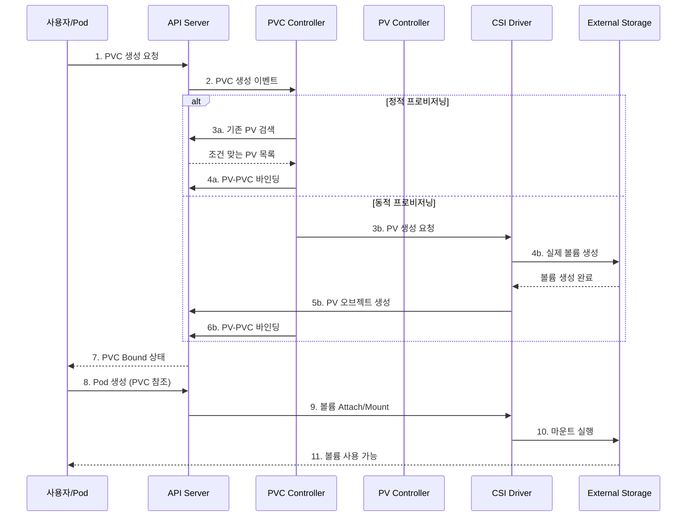
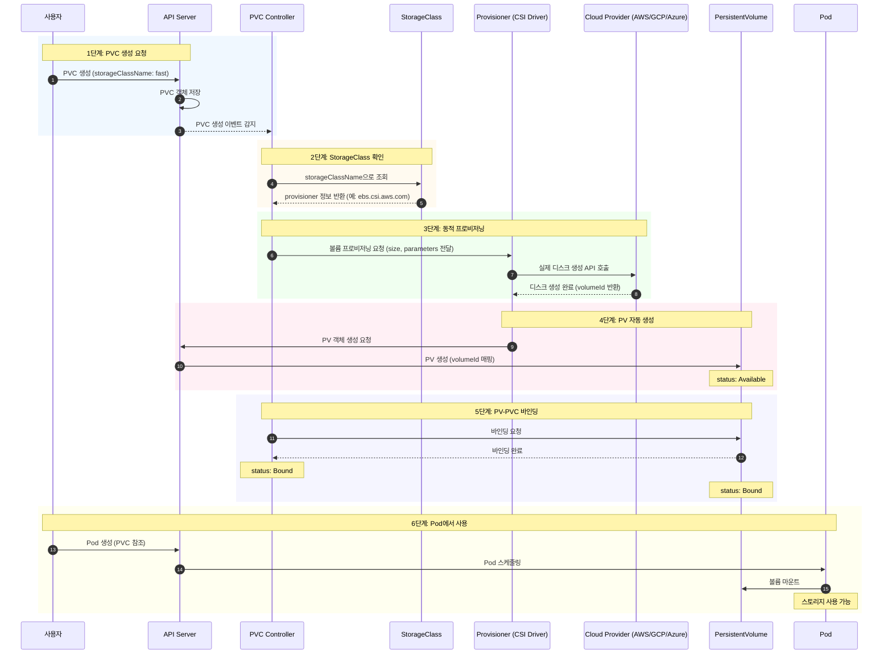
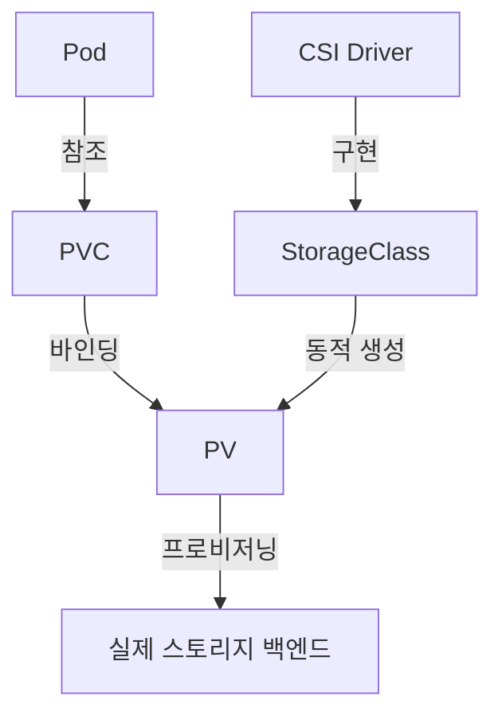

# Why?

컨테이너는 기본적으로 무상태(stateless)를 전제로 설계되었다.
파드가 재시작되면 컨테이너 내부 파일시스템은 초기화되고, 그 안에 기록된 데이터는 소멸한다.

처음 Kubernetes를 접했을 때 "그럼 데이터베이스는 어떻게 돌리지?"라는 의문이 생겼다.
조사해보니 Kubernetes는 이 문제를 해결하기 위해 **PersistentVolume(PV)** 과 **PersistentVolumeClaim(PVC)** 이라는 두 리소스를 설계했다.[^1]

이름에서 드러나듯 "영속(Persistent)"이 핵심 키워드다.
그런데 왜 하나가 아니라 둘인가.
왜 개발자가 직접 PV를 참조하지 않고 PVC를 거쳐야 하는가.

이 글은 그 설계 의도를 추적하면서 CSI 표준부터 StorageClass까지 순서대로 정리한다.

## Container Storage Interface 🧩


Kubernetes는 스토리지뿐 아니라 런타임과 네트워킹에서도 같은 원칙을 적용했다.
특정 구현체에 종속되지 않고 표준 인터페이스를 정의한 뒤, 구현체를 교체 가능하게 만든 것이다.

### CRI

과거 Docker 독점 시대에 Kubernetes는 Docker shim에 의존했다.
containerd, CRI-O, runc 같은 경량 런타임이 등장하면서 vendor lock-in을 피하고 최적화가 필요해졌다.[^2]
CRI 표준을 선언함으로써 구현체 종속에서 벗어나고 여러 구현체를 갈아끼울 수 있게 하였다.

### CNI

Kubernetes에서 Pod 네트워킹을 담당하는 표준으로, kubelet이 CNI 플러그인을 호출해 Pod에 IP 할당, veth 페어 생성, 라우팅 설정을 수행한다.[^3]
CRI와 마찬가지로 여러 구현체를 갈아끼울 수 있게 하였다.

### CSI

Kubernetes에서 스토리지 볼륨을 관리하는 표준으로, kubelet이 CSI 드라이버를 통해 볼륨 프로비저닝, 마운트, 스냅샷 등의 작업을 위임한다.[^4]
CRI와 마찬가지로 여러 구현체를 갈아끼울 수 있게 하였다.

세 가지 인터페이스 모두 "표준을 정의하고 구현을 위임한다"는 동일한 철학에서 출발한다.
스토리지 역시 이 철학 위에서 PV와 PVC라는 추상 계층을 통해 운용된다.

## PV & PVC 💾

k8s에서는 PersistentVolume이라는 클러스터 리소스를 선언하여 Volume을 관리한다.

PV는 관리자가 프로비저닝하거나, StorageClass를 사용해서 동적으로 프로비저닝한 클러스터의 스토리지다.
Pod과 독립적인 라이프사이클을 가지므로, Pod이 종료되더라도 데이터는 영속된다.[^5]

PV를 사용하려면 Pod이 "이 PV를 사용하겠다"는 선언문을 클러스터 리소스로 표현해야 한다.
이 선언문이 PVC(PersistentVolumeClaim)이다.
개발자는 PVC를 선언하고 이를 Pod에서 참조함으로써 볼륨을 사용한다.

아래는 PVC와 Pod 매니페스트의 전형적인 구성이다.

```yaml
# 개발자가 선언하는 PVC
apiVersion: v1
kind: PersistentVolumeClaim
metadata:
  name: mongodb-pvc
spec:
  resources:
    requests:
      storage: 1Gi
  accessModes:
    - ReadWriteOnce
  storageClassName: ""
```

```yaml
# 인프라 관리자가 선언하는 Pod (PVC 참조)
apiVersion: v1
kind: Pod
metadata:
  name: mongodb
spec:
  containers:
    - image: mongo
      name: mongodb
      volumeMounts:
        - name: mongodb-data
          mountPath: /data/db
      ports:
        - containerPort: 27017
          protocol: TCP
  volumes:
    - name: mongodb-data
      persistentVolumeClaim:
        claimName: mongodb-pvc
```


### 왜 바로 PV를 사용하지 않고 PVC를 거쳐서 사용하도록 했을까?

추상화의 이점을 살리기 위함이다.

직접 PV를 참조할 경우 개발자가 모든 노드에서 동일 PV를 인지해야 하고, 스토리지 백엔드 변경 시 Pod 수정이 필요하다.
PVC를 통해 동적 프로비저닝을 지원함으로써 스토리지 변경 및 Pod 재생성 시에도 PVC가 PV를 유지 바인딩해 데이터 영속성을 보장한다.

### PVC는 어떻게 동작할까?

PVC와 PV는 Kubernetes control plane의 control loop가 아래 조건에 따라 1대1로 매핑한다.
모든 조건을 만족해야만 바인딩한다.

| 조건                | 설명                    | 예시                     |
| ------------------- | ----------------------- | ------------------------ |
| **용량**            | PVC 요청량 ≤ PV 용량    | 5Gi 요청 → 10Gi PV 가능  |
| **접근 모드**       | 읽기/쓰기 방식 호환     | RWO, ROX, RWX, RWOP      |
| **볼륨 모드**       | 파일시스템 or 블록 일치 | Filesystem / Block       |
| **스토리지 클래스** | 이름 일치               | `fast-ssd` = `fast-ssd`  |
| **셀렉터**          | 라벨 매칭               | `matchLabels: type=fast` |

실제 처리 과정은 Provisioning → Binding → Using → Reclaiming 순서로 진행된다.

- **Provisioning** — PV 생성 (정적: 수동 / 동적: StorageClass로 자동)
- **Binding** — PVC ↔ PV 1:1 매핑
- **Using** — Pod에서 볼륨 사용
- **Reclaiming** — PVC 삭제 후 PV 처리 (Retain/Delete/Recycle)

아래는 control loop의 동작 순서다.



조건을 만족하지 못하면 Pod와 PVC가 Pending 상태로 유지되며 적합한 PV가 생길 때까지 무한정 대기한다.
이런 상황이 발생하면 아래 명령으로 바인딩 상태를 확인하여 원인을 해결해야 한다.

```bash
# PVC STATUS가 Bound인지 확인
kubectl get pvc
# PV STATUS가 Bound이고 CLAIM 열에 PVC 이름이 표시되는지 확인
kubectl get pv
kubectl describe pvc <pvc-이름>    # Volume: <pv-이름> 표시
kubectl describe pv <pv-이름>      # ClaimRef: namespace/pvc-이름 표시
```

PVC와 PV의 매핑 원리를 이해했다면, 이제 이 과정을 자동화하는 StorageClass로 넘어간다.

## StorageClass 📦

PV·PVC를 사용한 볼륨 프로비저닝은 두 가지 타입으로 나뉜다.

- **Static Volume Provisioning**
- **Dynamic Volume Provisioning**

Static Volume Provisioning은 PV를 명시하여 디스크를 미리 확보해두는 방식이다.
사용할 크기만큼 미리 PV를 선언해야 한다는 단점이 있다.

Dynamic Volume Provisioning은 이를 보완하기 위해 등장했다.
PV를 직접 선언하는 대신 StorageClass를 사용하여 PV를 자동으로 생성하고 동적으로 매핑한다.[^6]

StorageClass는 PV를 추상화하여 다양한 속성을 가진 볼륨을 선택할 수 있게 해주는 클러스터 리소스다.

아래는 GCE PD SSD 기반 StorageClass 선언 예시다.

```yaml
# provisioner, reclaimPolicy, volumeBindingMode가 핵심 필드다
apiVersion: storage.k8s.io/v1
kind: StorageClass
metadata:
  name: fast
provisioner: kubernetes.io/gce-pd   # 프로비저너 지정
parameters:
  type: pd-ssd                       # 스토리지 유형 파라미터
reclaimPolicy: Delete                # 회수 정책
volumeBindingMode: Immediate         # 바인딩 모드
allowVolumeExpansion: true           # 볼륨 확장 허용
```

StorageClass를 선언하면 프로비저너가 자동으로 PV를 프로비저닝하여 동적으로 매핑한다.
실제 처리 과정은 아래 순서도와 같다.



1. PVC 생성 요청
2. StorageClass 확인
3. 동적 프로비저닝 (핵심 단계)
4. PV 자동 생성
5. PV-PVC 바인딩
6. Pod에서 사용

개념 이해가 끝났으니 실습으로 확인한다.

## Lab: PV & PVC 🔬

실행 중인 Pod에 hostPath 볼륨을 추가하려면 `kubectl edit`으로 직접 수정 후 `replace --force`로 재생성해야 한다.

```yaml
# kubectl edit pod webapp 후 아래 섹션을 추가한다
volumeMounts:
  - mountPath: /log
    name: log-volume
volumes:
  - name: log-volume
    hostPath:
      path: /var/log/webapp
# kubectl replace --force -f /tmp/kubectl-edit-${temp-hash}.yaml
```

PV를 직접 선언할 때는 용량, accessModes, reclaimPolicy를 반드시 명시한다.

```yaml
# hostPath 기반 PV 선언 예시
apiVersion: v1
kind: PersistentVolume
metadata:
  name: pv-log
spec:
  capacity:
    storage: 100Mi
  volumeMode: Filesystem
  accessModes:
    - ReadWriteMany
    # ReadWriteOnce는 단일 노드에서만 읽기/쓰기가 가능
    # ReadWriteMany는 여러 노드에서 동시에 읽기/쓰기가 가능
  persistentVolumeReclaimPolicy: Retain
  # Retain은 PVC 삭제 후에도 PV의 데이터를 그대로 보존하여 수동 관리가 필요
  # Delete는 PVC 삭제 시 PV와 데이터를 모두 제거
  # Recycle은 PVC 해제 시 PV의 내용을 초기화하여 재사용 가능 (Deprecated)[^7]
  hostPath:
    path: /pv/log
```

PV 선언 후 PVC와 바인딩 여부를 아래 명령으로 확인한다.

```bash
kubectl get pvc          # STATUS가 Bound인지 확인
kubectl get pv           # STATUS가 Bound, CLAIM 열에 PVC 이름 표시
kubectl describe pvc <pvc-이름>    # Volume: <pv-이름> 표시
kubectl describe pv <pv-이름>      # ClaimRef: namespace/pvc-이름 표시
# AccessMode가 mismatch인 경우에도 PV-PVC 바인딩이 불가능하므로 주의
```

## Lab: StorageClass 🧪

StorageClass를 PVC에 지정할 때는 PV에 명시된 `storageClassName`과 정확히 일치해야 바인딩된다.

```yaml
# local-pvc: StorageClass를 명시한 PVC 선언
apiVersion: v1
kind: PersistentVolumeClaim
metadata:
  name: local-pvc
spec:
  accessModes:
    - ReadWriteOnce
  volumeMode: Filesystem
  resources:
    requests:
      storage: 8Gi
  storageClassName: slow
  # standard: 클라우드 제공자(AWS EBS, GCP PD 등)의 기본 스토리지
  # fast: SSD 기반의 고성능 스토리지를 프로비저닝
  # slow: HDD 기반의 저가형 스토리지를 프로비저닝
  # NFS, Ceph, GlusterFS: 네트워크 기반의 공유 스토리지를 프로비저닝
```

`volumeBindingMode`는 PV 생성 타이밍을 제어하는 중요한 필드다.

```yaml
# low-latency StorageClass 선언
apiVersion: storage.k8s.io/v1
kind: StorageClass
metadata:
  name: low-latency
  # standard: 일반적인 속도의 HDD 기반 스토리지
  # fast / premium-rwo: 고성능 SSD 기반 스토리지
  # low-latency: 지연 시간이 매우 낮은 초고속 스토리지 (NVMe 등)
  # slow / archive: 백업용이나 저속 저장소
provisioner: csi-driver.example-vendor.example
volumeBindingMode: WaitForFirstConsumer
# WaitForFirstConsumer: 이 PVC를 사용하는 Pod가 실제 생성될 때 비로소 PV 생성
# Immediate: PVC가 생성되는 즉시 PV를 생성하고 바인딩
# Immediate는 노드 배치 전에 볼륨을 생성하므로 Pod가 배치될 노드의 Topology를 고려하지 못한다
# WaitForFirstConsumer 사용을 권장한다[^8]
```

StorageClass로 프로비저닝한 PVC를 Pod에서 참조하는 완성된 예시는 아래와 같다.

```yaml
# PVC를 마운트하는 nginx Pod 선언
apiVersion: v1
kind: Pod
metadata:
  name: nginx-pod
  labels:
    app: nginx
spec:
  containers:
    - name: nginx-container
      image: nginx:latest
      ports:
        - containerPort: 80
      volumeMounts:
        - mountPath: "/var/www/html"
          name: local-pvc-volume
  dnsPolicy: ClusterFirst
  restartPolicy: Always
  volumes:
    - name: local-pvc-volume
      persistentVolumeClaim:
        claimName: local-pvc
```

## CKA 실전 문제 풀이 📝

CKA 시험에서 자주 출제되는 Storage 관련 문제 유형을 정리한다.

### 문제: StorageClass 생성

`rancher-sc`라는 이름의 StorageClass를 생성하라.
provisioner는 `rancher.io/local-path`[^9], volumeBindingMode는 `WaitForFirstConsumer`, 볼륨 확장은 활성화되어야 한다.

```yaml
# rancher-sc StorageClass 선언
apiVersion: storage.k8s.io/v1
kind: StorageClass
metadata:
  name: rancher-sc
  annotations:
    storageclass.kubernetes.io/is-default-class: "false"
provisioner: rancher.io/local-path
allowVolumeExpansion: true
volumeBindingMode: WaitForFirstConsumer
```

### 문제: PVC-PV 바인딩 트러블슈팅

`app-pvc`가 `app-pv`에 바인딩되지 않는 원인을 찾아 수정하라. PV는 수정하지 말 것.

아래는 문제 상황의 PVC와 PV 매니페스트다.

```yaml
# app-pvc: accessModes가 ReadWriteMany로 선언되어 있다
apiVersion: v1
kind: PersistentVolumeClaim
metadata:
  name: app-pvc
  namespace: storage-ns
spec:
  accessModes:
    - ReadWriteMany
  resources:
    requests:
      storage: 1Gi
  volumeMode: Filesystem
```

```yaml
# app-pv: accessModes가 ReadWriteOnce로 선언되어 있다
apiVersion: v1
kind: PersistentVolume
metadata:
  name: app-pv
spec:
  accessModes:
    - ReadWriteOnce
  capacity:
    storage: 1Gi
  hostPath:
    path: /mnt/data
  persistentVolumeReclaimPolicy: Retain
  volumeMode: Filesystem
```

accessMode가 서로 달라 바인딩이 실패한다.
PV를 수정할 수 없으므로 PVC의 accessMode를 `ReadWriteOnce`로 맞춰 재생성한다.

```bash
# PVC는 변경이 불가하므로 삭제 후 재생성해야 한다
kubectl delete pvc app-pvc -n storage-ns
kubectl apply -f app-pvc.yaml -n storage-ns

# 최종 확인
kubectl get pvc app-pvc -n storage-ns
kubectl describe pvc app-pvc -n storage-ns
kubectl get pv app-pv
```

볼륨 확장 실패 시 PV를 Retain 정책으로 복구하는 공식 절차는 다음과 같다.[^10]

1. PVC에 바인딩된 PV의 reclaimPolicy를 `Retain`으로 변경한다.
2. PVC를 삭제한다. (Retain 정책이므로 데이터는 보존된다)
3. PV spec의 `claimRef`를 삭제하여 PV를 `Available` 상태로 만든다.
4. PVC를 PV보다 작은 용량으로 재생성하고 `volumeName` 필드에 해당 PV 이름을 지정한다.
5. PV의 reclaimPolicy를 원래대로 복원한다.

---

# 결론

Kubernetes의 스토리지 추상화는 세 계층으로 구성된다.



- **CSI**는 스토리지 구현체를 교체 가능하게 만드는 표준 인터페이스다.
- **PV**는 클러스터 수준의 스토리지 리소스이며 Pod와 독립적인 라이프사이클을 가진다.
- **PVC**는 개발자가 PV를 요청하는 선언문으로, 스토리지 백엔드 변경을 Pod로부터 격리한다.
- **StorageClass**는 동적 프로비저닝을 가능하게 하여 수동 PV 관리의 번거로움을 제거한다.

CKA 시험에서 Storage 트러블슈팅 시 가장 먼저 확인해야 할 것은 PVC와 PV의 accessMode 일치 여부다.
두 번째는 `storageClassName`이 정확히 일치하는지다.
세 번째는 PVC가 `Pending` 상태라면 `WaitForFirstConsumer` 바인딩 모드 때문인지 확인해야 한다.

[^1]: [Kubernetes Persistent Volumes 공식 문서](https://kubernetes.io/docs/concepts/storage/persistent-volumes/)
[^2]: [Kubernetes Container Runtime Interface (CRI)](https://kubernetes.io/docs/concepts/architecture/cri/)
[^3]: [Kubernetes Network Plugins (CNI)](https://kubernetes.io/docs/concepts/extend-kubernetes/compute-storage-net/network-plugins/)
[^4]: [Kubernetes Container Storage Interface (CSI)](https://kubernetes.io/docs/concepts/storage/volumes/#csi)
[^5]: [PersistentVolume — Lifecycle](https://kubernetes.io/docs/concepts/storage/persistent-volumes/#lifecycle-of-a-volume-and-claim)
[^6]: [Dynamic Volume Provisioning](https://kubernetes.io/docs/concepts/storage/dynamic-provisioning/)
[^7]: [Reclaim Policy — Recycle은 Deprecated](https://kubernetes.io/docs/concepts/storage/persistent-volumes/#reclaiming)
[^8]: [volumeBindingMode — WaitForFirstConsumer](https://kubernetes.io/docs/concepts/storage/storage-classes/#volume-binding-mode)
[^9]: [rancher.io/local-path provisioner](https://github.com/rancher/local-path-provisioner)
[^10]: [Recovering from Failure when Expanding Volumes](https://kubernetes.io/docs/concepts/storage/persistent-volumes/#recovering-from-failure-when-expanding-volumes)
