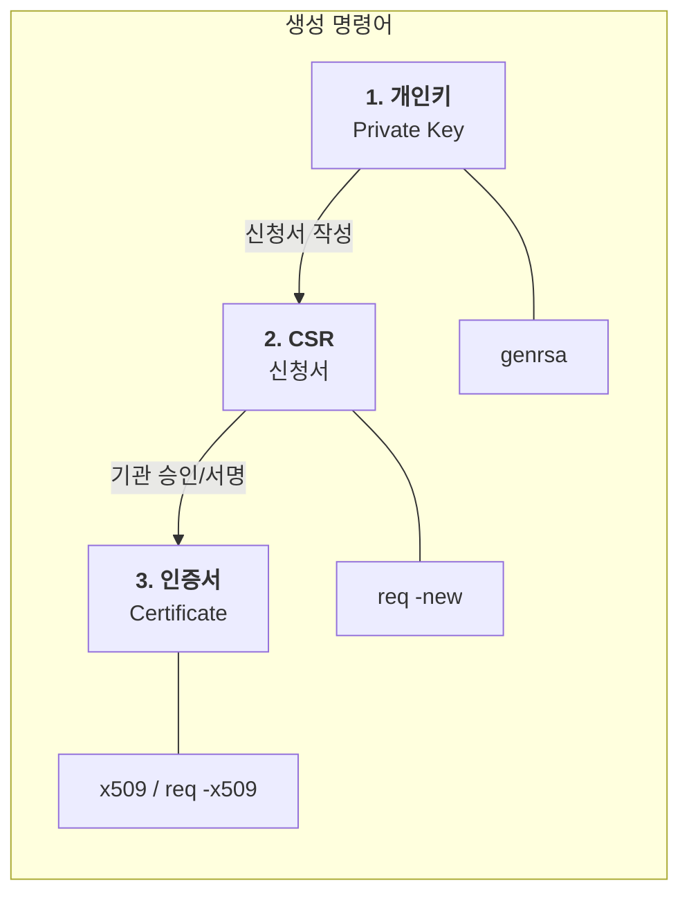
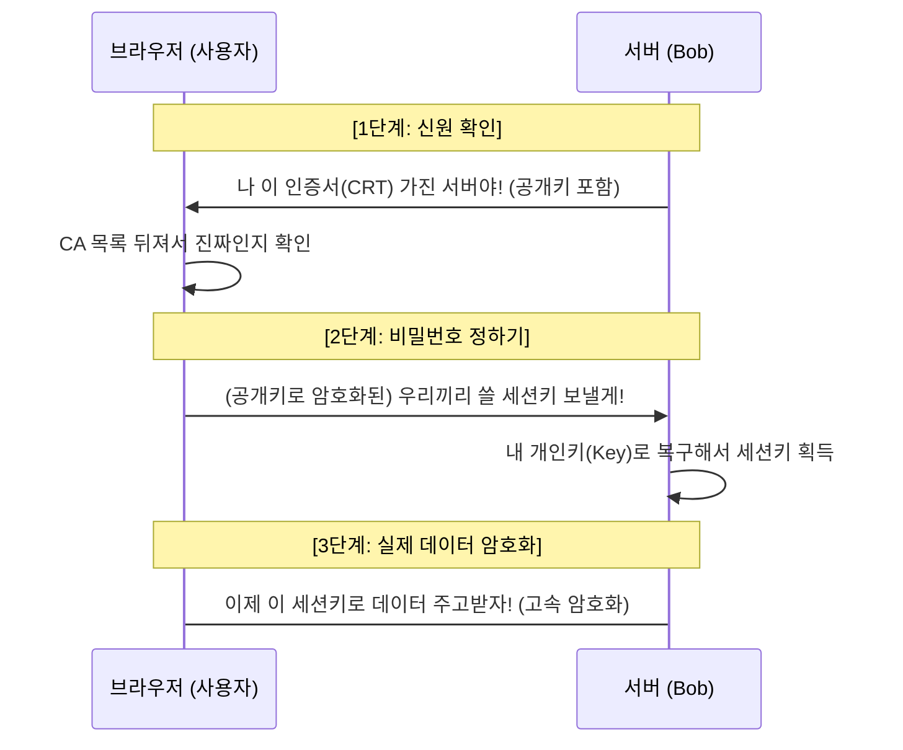

## 속독 1회독

# 02. Essential Commands ⌨️

## Lab: Logging in and System Documentation 📃

### Change hostname in linux

1. hostnamectl
2. /etc/hosts 수정 

### man page indexing

man page 는 단순 텍스트 파일이 아니라 **검색 가능한 DB 형태로 인덱싱**되어 있다
따라서 명령어가 작동하지 않는다면 `sudo mandb` 를 실행하여 indexing refresh 하자

### hidden file 보기

ls -a 하면 숨긴 파일을 포함한 전체 파일을 확인
ls -A 하면 숨긴 파일만 볼 수 있다.
또한 -l 과 조합하면 리스트 형태로 볼 수 있다.

```bash
~                                                                                                                                                                                         limjihoon@homelab
❯ ls -a
.                   .cache            k8s-worker1.sock  .nix-profile  .ssh             .zcompdump                    .zcompdump-homelab-5.9      .zshenv       .zshrc.backup
..                  .config           .local            .p10k.zsh     supervisord.log  .zcompdump-homelab-1-5.9      .zcompdump-homelab-5.9.zwc  .zsh_history
amd_vbios_dump.rom  ip_discovery.bin  .nix-defexpr      pp_table.bin  tonys-homelab    .zcompdump-homelab-1-5.9.zwc  .zsh                        .zshrc

~                                                                                                                                                                                         limjihoon@homelab
❯ ls -A
amd_vbios_dump.rom  ip_discovery.bin  .nix-defexpr  pp_table.bin     tonys-homelab             .zcompdump-homelab-1-5.9.zwc  .zsh          .zshrc
.cache              k8s-worker1.sock  .nix-profile  .ssh             .zcompdump                .zcompdump-homelab-5.9        .zshenv       .zshrc.backup
.config             .local            .p10k.zsh     supervisord.log  .zcompdump-homelab-1-5.9  .zcompdump-homelab-5.9.zwc    .zsh_history

```

### apropos 명령어

man page DB 를 **키워드로 전문 검색**하는 명령어이다
"이런 기능을 하는 명령어가 뭐지?" 할 때 쓴다

```bash
apropos <keyword>

# 예시
apropos hostname
# hostnamectl (1) - Control the system hostname
# hostname (1)    - show or set the system's host name
# hostname (5)    - Local hostname configuration file

apropos network interface
apropos "disk usage"
```

## Lab: Files, Directories, Hard and Soft Links 🖇️

### Soft Link / Hard Link

```bash
ln -s /opt/hlink /home/bob/hlink   # soft link (symlink)
ln    /opt/hlink /home/bob/hlink   # hard link
```

## Lab: File Permissions, Search for Files 🔍

### Sub Shell `( )` & Escape `\` 

Shell 에서 ( ) 은 sub shell 을 의미한다
( ) 안에 들어가는 명령어는 **현재 셸의 자식 프로세스(subshell)** 에서 실행된다
따라서 아래

- 변수값
- 현재 작업 디렉토리
- 환경변수

반면, Shell 이 공유하는 값들 — 커널관리 리소스 — 은 영향을 받는다

- 파일시스템
- 네트워크
- 프로세스 테이블
- 시그널
- IPC 자원

```bash
(cd /tmp && ls)
# subshell 에서 cd 실행
# 현재 셸의 위치는 그대로 유지됨
```


\ 은 특수문자를 일반문자로 취급하는 Escape 이다
즉,`(` 은 그대로 사용하면 Sub Shell 로 처리되지만 `\(` 은 일반문자 `(` 로 처리하게끔 할 수 있다.

```bash
cat ./temp/우리집\(좋아)\.md # ./temp/우리집(좋아).md
```

### Command Substitution `$( )`

현재 쉘의 자식 쉘을 생성하여 $( ) 안에 들어간 명령어를 실행 이후 부모로 반환

```bash
mkdir backup_$(date +%Y%m%d) # backup_20260324 디렉토리 생성
echo "오늘 날짜: $(date)" # 오늘 날짜: Tue Mar 24 12:00:00 KST 2026
```

### find 명령어

`find [path...] [options] [expression]`  형태로 사용되며 아래와 같이 사용할 수 있다.

```bash
# /var/log 산하에 있는 모든 파일과 경로들에 대해
# *.log 정규식에 맞는 것을 찾음
find /var/log -name "*.log"

# /home/bob 산하 모든 파일과 경로들에 대해
# 213k 크기이며 402 권한에 대해
# OR 조건을 통해 처리
find /home/bob -size 213k -o -perm 402 -type f
```
```bash
find ${path} -mmin +5 # last modified less than, more than
find ${path} -cmin +5 # status changed less than, more than
```

<details>
<summary>특정 권한의 파일들을 찾아서 .txt 에 저장</summary>

Find `files/directories` under the `/var/log/` directory that the `group` can `write` to, but `others cannot read or write` to it. Save the list of the files/directories (with complete parent path) in the `/home/bob/data.txt` file.  You can use the redirection to save your command's output in a file i.e `[your-command] > /home/bob/data.txt`
To make this easier to understand, the logic of the command can be broken down like this:  -> Permissions for the `group` have to be at least `w`. If there's also an extra `r or x` in there, it will still match.
-> Permissions for `others` have `not to be r or w`. That means, if any of these two permissions, `r or w`, match for others, the result has to be excluded.

```bash
# 정답
# 팁은 man find 에서 permission 으로 찾아볼 것
find /var/log -perm -g=w ! -perm /o=rw > /home/bob/data.txt
```
</details>
<details>
<summary>특정 파일을 찾아 다른 디렉토리로 복사</summary>

7.
Find the `cats.txt` file under `bob's` home directory and copy it into the `/opt` directory.
풀이

```bash
# xargs 사용
# 1) 인자 넘기되 cp /opt {arg} 로 처리되므로 cp -t 사용 
# 2) -I 로 placeholder 지정
find /home/bob -name cats.txt -type f -print | xargs cp -t /opt
find /home/bob -name cats.txt -type f -print | xargs -I {} cp {} /opt

혹은

cp $(find /home/bob -name cats.txt) /opt
```
</details>


### chmod 명령어

리눅스 파일 권한은 **누구에게** / **무슨 권한을** 으로 구성

```bash
ls -l /home/bob/file.txt
# -rwxr-xr--
#  ↑↑↑↑↑↑↑↑↑
#  │└──┘└──┘└──┘
#  │ owner group others
```

| 권한 | 기호 | 의미 |
| --- | --- | --- |
| read | `r` | 파일 읽기 / 디렉토리 목록 조회 |
| write | `w` | 파일 수정 / 디렉토리 파일 생성·삭제 |
| execute | `x` | 파일 실행 / 디렉토리 진입(`cd`) |


권한 부여 방법은 다음과 같다

- 기호 방식
- 8진수 방식

## Lab - File Content, Regular Expressions ✍️

### cut 명령어

각 줄에서 특정 부분만 잘라내는 명령어

```bash
cut -d '구분자' -f 필드번호 file
```
```bash
# /etc/passwd 예시
cat /etc/passwd
# root:x:0:0:root:/root:/bin/bash
# bob:x:1000:1000::/home/bob:/bin/bash

cut -d ':' -f 1 /etc/passwd     # 첫 번째 필드 (username)
# root
# bob
```

### sed 명령어

Stream EDitor 로 파일이나 입력을 줄단위로 읽어서 값을 치환하는 명령어다
주로 regex 를 사용하여 변경한다

```bash
sed 's/cat/dog/g' file.txt          # 화면에만 출력, 파일 유지
sed -i 's/cat/dog/g' file.txt       # 파일 직접 수정
```
```bash
# 각 줄의 첫 번째 매칭만 치환
sed 's/cat/dog/' -i file.txt

# 각 줄의 모든 매칭 치환 (global)
# ⭐ 가장 자주 쓰임!! ⭐
sed 's/cat/dog/g' -i file.txt

# 대소문자 무시
sed 's/cat/dog/i' -i file.txt

# 전체 + 대소문자 무시
sed 's/cat/dog/gi' -i file.txt
```

또한 구분자를 / 로 사용하곤 하는데, 이를 바꿀 수 있다
특수문자를 다룰 때 유용하게 사용할 수 있다.

```bash
sed 's/a/b/'      # 기본 구분자 /
sed 's|a|b|'      # 구분자를 | 로 변경 가능
sed 's@a@b@'      # 구분자를 @ 로 변경 가능

sed -i 's|video//other|video//group|g' ./data.txt # video/other -> video/group
```

### grep 명령어

딴 건 없고 자주 나오는 정규식은 외워야 할 것 같다

```bash
# 특정 문자로 시작하는 줄
grep '^Section' file

# 대소문자 무시
grep -i '^section' file

# 정확히 n자리 숫자
grep -E '[0-9]{5}' file

# 특정 숫자로 시작하는 숫자
grep -oE '\b2[0-9]*' file

# 빈 줄
grep '^$' file

# 빈 줄 제외
grep -v '^$' file
```

## Lab: Archive, Back Up, Compress, IO Redirection 💽

### tar 명령어

> The `tar` command creates tar files by converting a group of files into an archive. It also extracts tar archives, displays a list of the files included in the archive, adds files to an existing archive, and performs various other operations.

[https://linuxize.com/post/how-to-create-and-extract-archives-using-the-tar-command-in-linux/](https://linuxize.com/post/how-to-create-and-extract-archives-using-the-tar-command-in-linux/)

1. tar 파일 생성
2. gz archive 압축 파일 생성
3. tar 파일 해제
4. tar 파일해제 없이 압축된 내용 보기

### gzip 명령어

압축 후 확장자 `.gz` 생성, 원본 파일은 삭제된다.

```bash
gzip file.txt              # file.txt -> file.txt.gz (원본 삭제)
gzip -d file.txt.gz        # 압축 해제 (gunzip과 동일)

# ⭐ 원본 유지하며 압축 (리다이렉션 사용)
gzip -c file.txt > file.txt.gz
```

### xz / unxz 명령어

`gzip`보다 압축률이 훨씬 높지만 속도가 느리다. 최근 리눅스 배포판에서 많이 사용한다.
압축 후 확장자 `.xz` 생성, **원본 파일은 삭제된다.**

```bash
xz file.txt                # file.txt -> file.txt.xz (원본 삭제)
unxz file.txt.xz           # 압축 해제 (xz -d와 동일)

# ⭐ 원본 유지하며 해제 (Keep)
unxz -k file.txt.xz        # 해제 후에도 .xz 파일 유지
```

### Input, Output 에 대한 파이프라이닝

리눅스에서 모든 명령어는 실행될 때 3개의 가상 통로를 가집니다.

- **0 (stdin):** 입력 (키보드 등)
- **1 (stdout):** **정상 출력** (성공했을 때 나오는 메시지)
- **2 (stderr):** **에러 출력** (실패, 경고, 권한 거부 등)

이런 가상 통로에 대해서 다음과 같은 파이프라이닝을 처리할 수 있다.

1. 리다이렉션 기호 (`>`, `2>`, `&>`)
2. 특수 장치와 기호 (`/dev/null`, `|`)

<details>
<summary>스크립트 실행결과에 대해 정상결과와 에러결과를 각각의 파일로 저장 </summary>

Execute the `/home/bob/script.sh` script and save all `normal output` (except `errors/warnings`) in the `/home/bob/output_stdout.txt` file.
Validate "/home/bob/output_stdout.txt" file.

```bash
/home/bob/script.sh > /home/bob/output_stdout.txt 2> /dev/null
```
</details>
<details>
<summary>스크립트 실행결과에 대해 정상결과, 에러결과 모두를 하나의 파일로 저장 </summary>

Execute the `/home/bob/script.sh` script and save all command output (both `errors/warnings` and `normal output`) in the `/home/bob/output.txt` file.
Validate the "/home/bob/output.txt" file.

```bash
/home/bob/script.sh &> /home/bob/output.txt
```
</details>

### sort / uniq 명령어

```bash
sort file.txt              # 기본 알파벳 순 정렬
sort -r file.txt           # 역순(Reverse) 정렬
sort -n file.txt           # 숫자(Numeric) 크기순 정렬 (2가 10보다 앞에 옴)
sort -f file.txt           # 대소문자 무시 (Fold case)

# ⭐ 정렬과 중복 제거를 동시에
sort -u file.txt           # Unique한 줄만 남기고 정렬
```
```bash
sort file.txt | uniq       # 정렬 후 중복 제거 (기본)
sort file.txt | uniq -i    # 대소문자 무시하고 중복 제거
sort file.txt | uniq -c    # 각 줄이 몇 번 중복되었는지 횟수 표시
sort file.txt | uniq -u    # 중복되지 않은 "유일한 줄"만 출력
```

## SSL Certificates 🔒 __ ⚠️정리가 필요함 ⚠️ __

> 💡

### openssl 명령어

openssl 은 ,,,, 하는 명령어이다.
사용법은 다음과 같다.

1. 개인키 생성
2. 인증 요청서(CSR : Certificate Signing Request) 생성
3. 자가 서명 인증서




> 


# 03. Operations Deployment


x.y.z.A/prefix
x,y,z,A 는 사실 이진수인데 십진수로 표현하며
뒤에 /prefix 를 통해 network prefix 명시하여 network 의 주소를 지정
이후 나머지 값을 통해 세부 디바이스 주소를 지정
위 예시는 32bits, 즉 IPv4 임
IPv6 부터는 128 bits 를 사용하기 시작함
또한 IPv6 부터는 decimal 이 아닌 hexadecimal 을 사용하기 시작함
또한 delimiter 구분자를 . 이 아닌 : 으로 구분함


> 💡 목표

## Remote Filesystem

### NFS

**NFS 는 **Network Filesystem Protocol 을 통해 원격 통신하여 
**파일/디렉터리 단위**로 공유한다
Server 는 공유디렉토리와 설정을 선언하고
Client 는 해당 디렉토리를 본인에게 Mount 하여 처리한다.

```bash
# NFS 서버사이드에서는 
# 아래 패키지를 설치하고
# /etc/exports 를 수정하여
# 공유디렉토리와 그에 대한 공유설정을 선언 및 처리한다
sudo apt install nfs-kernel-server

# export 설정 파일 수정하여
# 공유할 디렉토리와 접근 권한 정의
# 이에 대해서는 man exports 를 통해
# man page 또한 볼 수 있다.
sudo vim /etc/exports

# /etc/exports 설정은 다음과 같은 형식을 따른다
# <공유 디렉토리> <클라이언트>(옵션)
#
# 예시 설명:
# /srv/homes           : NFS로 공유할 서버 디렉토리
# hostname1(rw,...)    : hostname1은 읽기/쓰기 가능
# hostname2(ro,...)    : hostname2는 읽기 전용
# **클라이언트는 hostname 뿐 아니라 ip 를 적어도 된다.
#
# 각 옵션에 대해서는 다음과 같다.
# rw                  : 읽기/쓰기 허용
# ro                  : 읽기 전용
# sync                : 요청 시 디스크에 즉시 반영 (데이터 안정성 ↑, 성능 ↓)
# no_subtree_check    : 서브디렉토리 검사 비활성화 (성능 향상, 일반적으로 권장)
#
# 실제 설정 예시:
/srv/homes hostname1(rw,sync,no_subtree_check) hostname2(ro,sync,no_subtree_check)

# 이루 이렇게 선언한 export 설정은 
# exportfs 를 통해 reload 를 해야한다
# -r                  : re-export, 설정된 내용을 다시 읽고 적용
# -a                  : all, 명시된 모든 공유를 커널 내 export 테이블에 등록
# reload 이후에는 NFS 서비스를 재시작한 뒤
# 상태를 확인한다
# -v                  : verbose, 적용상태 체크
sudo exportfs -ra
sudo systemctl restart nfs-kernel-server
sudo exportfs -v
```
```bash
# NFS 클라이언트 사이드에서는 
# 아래 패키지를 설치하고
# 서버의 NFS 공유 디렉토리를 로컬에 마운트한다
sudo apt install nfs-common
sudo mount ${client-ip}:${file-system} ${local-mount-directory}

# 기존 mount 명령어 사용법과 동일하나
# 서버 IP 가 추가되는 점이 있다
# - 서버 IP: 100.128.28.1
# - 서버 측 공유 디렉토리: /srv/homes (예시)
# - 로컬 마운트 위치: /mnt
sudo mount 100.128.28.1:/srv/homes /mnt

# NFS 마운트 확인
df -h
# 또는
mount | grep nfs

# 만약 재부팅 시에도 자동마운트하게끔 하고자한다면
# /etc/fstab 에 서버IP 에 대한 mount 설정을 추가한다
# 다만 filesystem 의 type 은 nfs 임을 유의한다
sudo vim /etc/fstab
# 예:
# 100.128.28.1:/srv/homes /mnt nfs defaults 0 0
# 서버_IP:/공유_디렉터리  /마운트_위치  nfs  defaults  0  0
```

### Network Block Device

**NBD 는 블록 디바이스(디스크/파티션)** 자체를 네트워크로 공유한다
Server 는 공유할 스토리지 디바이스에 대해 NBD 섹션이름과 NBD 설정을 선언하고
Client 는 nbd-client 명령어를 통해 해당 디바이스를 추가하고 마운트한다

일반적으로 Stroage Block Device 는 `/dev/sda` 를 통해 알파벳으로 디스크를 지칭하고
`/dev/sda1` 을 통해 번호를 붙여 파티션을 지칭한다
Network Block Device 또한 비슷한 이름형식을 따라 `/dev/nbd${number}` 를 따라간다

```bash
├── /dev/sda
│   ├── /dev/sda1
│   ├── /dev/sda2
│   ├── ,,,

*** s → serial, SATA(Serial ATA) 에 SSD 설치된 경우
*** nvme → nvme 에 SSD 설치된 경우
*** v → nvme 에 SSD 설치된 경우
*** Sda, sdb, sdc ,,, sdz 와 같이 알파벳으로 물리 디스크를 구분
*** sda1, sda2, sda2 ,,,, 와 같이 물리디스크에 추가적으로 번호를 붙여서 논리 파티셔닝을 구분


├── /dev/nbda1
```

Server / Client 를 나누어서 어떻게 처리하는지 살펴보자

```bash
# NBD 서버사이드에서는 
# 아래 패키지를 설치하고
# /etc/nbd-server/config 를 수정하여
# 공유할 디바이스 경로 및 공유설정을 선언 및 처리한다
# 이에 대해서는 man nbd-server 를 통해
# man page 또한 볼 수 있다.
sudo apt install nbd-server

sudo vim /etc/nbd-server/config

# 아래는 대표적인 설정 예시
[generic]
user = nbd                # nbd-server를 실행할 사용자
group = nbd               # nbd-server를 실행할 그룹
port = 10809              # 포트 (기본값 10809)
includedir = /etc/nbd-server/conf.d   # 추가 설정 디렉토리
# 섹션 이름은 임의로 정해도 되지만, 
# 클라이언트가 -N로 이름을 지정해 연결할 때 사용
# 이름은 중복되지 않도록 주의
[partition2]
exportname = /dev/sdb2
[partition3]
exportname = /dev/sdb3
                          
# 이후 nbd-server 데몬을 재시작하여
# 설정을 적용해준다
sudo systemctl restart nbd-server
```
```bash
# NBD 클라이언트 사이드에서는 
# 아래 패키지를 설치하고
# 커널 모듈 및 nbd-client 를 실행하여
# 디스크를 추가한다
sudo apt install nfs-common

# nbd 커널 모듈 로드
# - /dev/nbd0, /dev/nbd1 등 블록 장치 사용하기 위해 필요
sudo modprobe nbd

# 부팅 시 자동 로드 설정하기 위해
# /etc/modules-load.d 에 설정파일을 추가한다
# modules.conf 에 nbd 를 적으면
# 이후 재부팅 시 자동으로 modprobe nbd 실행한다
echo "nbd" | sudo tee /etc/modules-load.d/nbd.conf


# nbd-client 를 통해 네트워크 블록 디스크를 추가한다
# 이 때 Server 에서 선언해둔
# 파티션 섹션 이름을 사용해야한다
sudo nbd-client ${server-ip} -N ${export-이름} /dev/nbd0
sudo nbd-client 100.128.28.1 -N partition2 /dev/nbd0

# 이후 장치 추가된 것을 확인해준다
# -l                     : list, 사용가능한 NBD 확인
# lsblk                  : list block devices, 디바이스 마운트 확인
sudo nbd-client -l
lsblk

# 이제 원하는 디렉토리에
# NBD 디렉토리를 마운트한다
sudo mkdir -p /mnt
sudo mount /dev/nbd0 /mnt

# NBD 를 끊는 방법은
# 1. 마운트를 해제하고
# 2. -d 옵션을 통해 NBD 디바이스를 해제
# 3. nbd 커널 모듈을 언로드
sudo umount /mnt
sudo nbd-client -d /dev/nbd0
sudo modprobe -r nbd
```

## Monitoring Filesystem

```bash
# sysstat 을 설치하여 iostat, pidstat 을 활용
# iostat : i/o data stat
# pidstat : process id stat
sudo apt install sysstat

# iostat 은 historical data since bootstrap 을 보여준다
# tps : ??
# kB_read/s : ??
# kB_wrtn/s : ??
# kB_read : ??
# tps 가 너무 높고 read 가 많으면 ~~ 한 디바이스
# tps 가 너무 높고 write 가 많으면 ~~ 한 디바이스
systat
systat 1 # 숫자를 인자로 넘기면 n 초마다 상태를 업데이트함

# -d : device, 어느 device 에 어떤 process 가 처리 중인지 보여줌 
pidstat -d
pidstat -d 1 # 숫자를 인자로 넘기면 n 초마다 상태를 업데이트함


```
