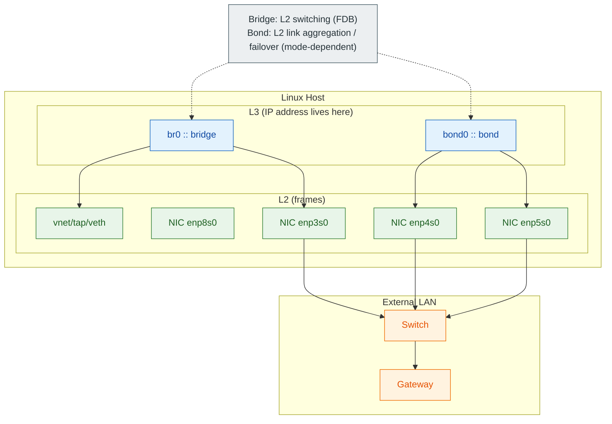

## 03-2.

자가 점검 질문 (공부용)

### 최종 정리 및 자가 점검

최종 점검을 해보자, 다음 질문에 답할 수 있다면 된다.

- 커널은 “링크가 살아있음”을 어떤 상태로 표현하는가?
- `/24`는 내 통신 범위를 어떻게 제한하는가? (같은 서브넷/다른 서브넷의 차이)
- `default via`가 없으면 어떤 패킷이 막히는가?
- `ip route get`이 보여주는 정보(egress iface, next-hop)는 왜 신뢰할 수 있는가?
- “DNS 문제”와 “라우팅 문제”를 30초 안에 분리하는 최소 테스트는 무엇인가?

이제 최종적으로 아래 순서를 확인하여 어떻게 네트워크를 진단하고 상태를 파악하는지 점검해보자.

1.

링크(L2): `ip -c link`
2.

주소(L3): `ip -c addr`
3.

라우팅(L3): `ip route` + `ip route get 8.8.8.8`
4.

DNS(Userspace/daemon): `resolvectl status` + `resolvectl query example.com`
5.

포트/프로세스(L4): `ss -tun` (가능하면 `netstat`보다 `ss`)

```bash
sudo ss -tunlp
sudo netstat -tunlp
# -t : tcp connections
# -u : udp connections
# -n : numeric values (port)
# -l : listening
# -p : processes
# 외우기어렵다면 -tunlp(TUNnel Programs) 로 기억하자
# ss 대신 netstat 쓸 수 있으나 미래에 사라질 예정이다
```

# 04.

Users / Groups

Lab 이 

# 05.

Networking

### Bridge / Bond 사용하여 NIC 에 대한 매니징

Bridge와 Bond는 둘 다 “물리 NIC를 직접 다루기 어렵다”는 문제를 해결하는 **L2 가상 인터페이스**다.

- **Bridge**: 여러 포트를 한 브로드캐스트 도메인으로 묶는 L2 스위치(Forwarding Database 기반 포워딩)
- **Bond**: 여러 NIC를 하나의 링크처럼 묶는 L2 링크 집계/이중화(모드에 따라 동작이 달라짐)

> 💡 핵심 관점


