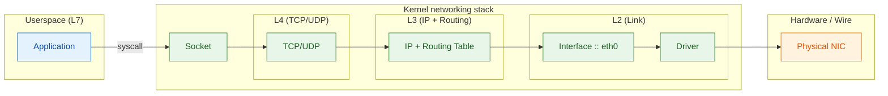
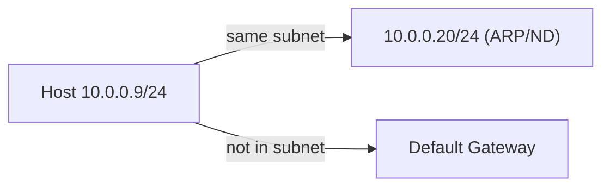
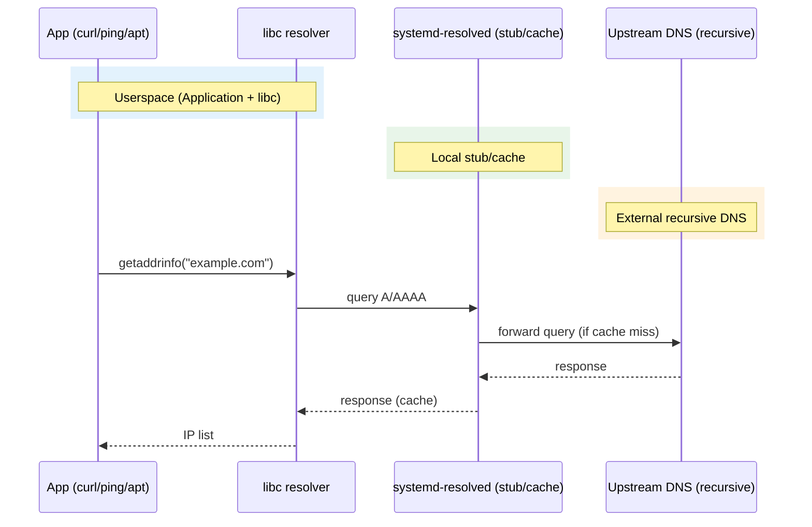
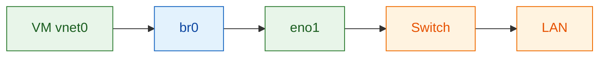
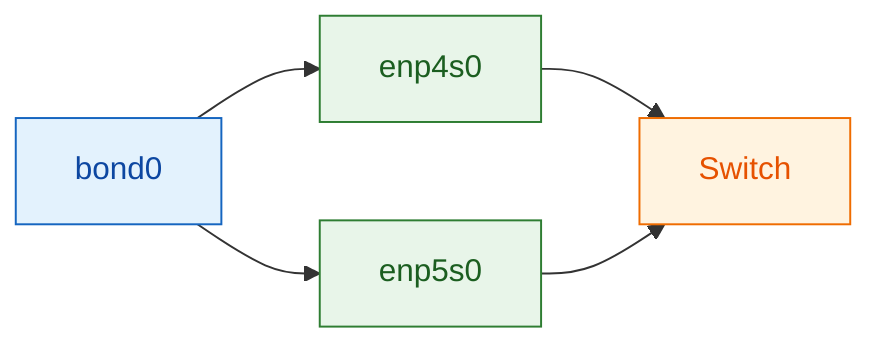
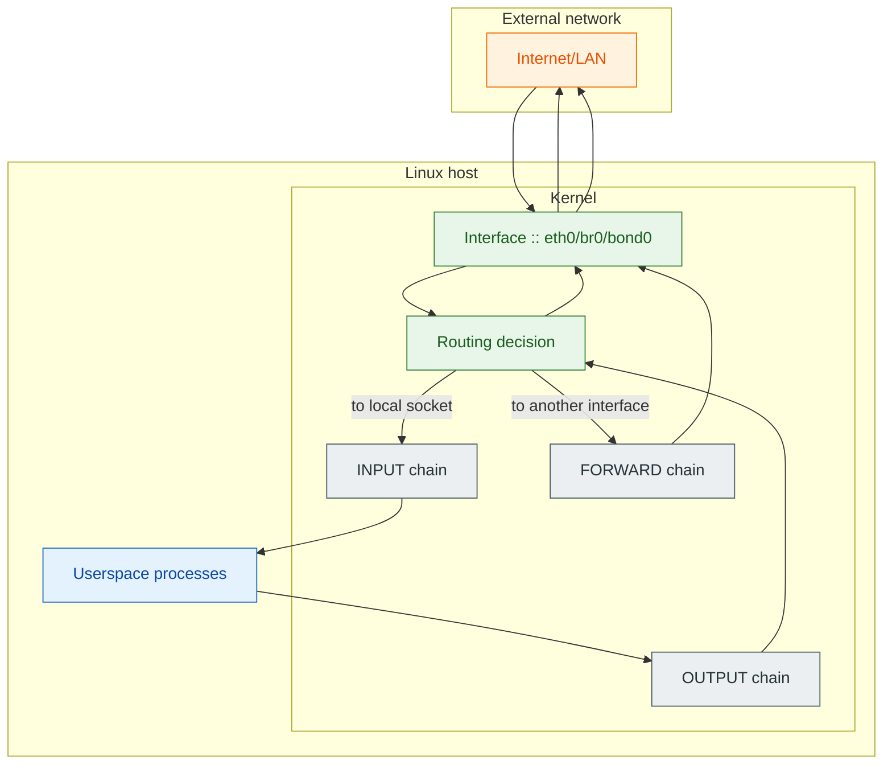
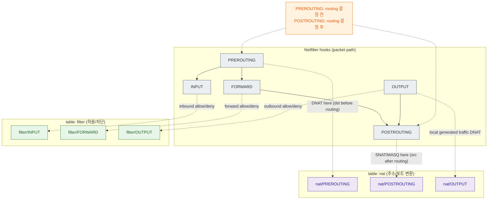

## 03-1.

네트워크 동작 원리 (L2 → L3 → DNS)

리눅스에서 네트워크는 “명령어 묶음”이 아니라 “커널이 패킷을 어디로 보낼지 결정하는 규칙”이다.

패킷, 즉 데이터는 물리적 NIC 를 거쳐 L2, L3, L4 순으로 지나 Socket 통신을 통해 전달된다.

이에 따라 각각의 섹션인 L2 - interface, L3 - ip table, L4 - ip route 를 순서대로 살펴본다.



### L2: 인터페이스(`ip link`)는 “전선”이다

IP 설정부터 만지기 전에, 링크가 살아있는지(UP)부터 확인해야 한다.

- 인터페이스가 `DOWN`이면 L3는 의미가 없다.
- MTU mismatch, link flap, 가상 인터페이스(veth/bridge/bond) 같은 “L2 문제”가 L3 문제처럼 보이는 경우가 많다.

```bash
ip -c link
ip -c link show dev ${dev_name}
```

**조치(휘발성)**

```bash
sudo ip link set dev ${dev_name} up
sudo ip link set dev ${dev_name} down
```

### L3: IP/CIDR(`ip addr`)은 “내가 속한 네트워크 범위”를 정의한다

`10.0.0.9/24`는 “내 주소는 `10.0.0.9`이고, 같은 L2로 직접 갈 수 있는 네트워크가 `10.0.0.0/24`다”라는 뜻이다.

- `/24`면 호스트 비트는 8비트 → 총 256개 주소 공간
- 일반적으로 `.0`(network), `.255`(broadcast)는 호스트에 못 씀 → **254개 사용 가능**
- 인터페이스는 IP를 여러 개 가질 수 있다(secondary address)



**진단**

```bash
ip -c addr
ip -c addr show dev ${dev_name}
```

**조치(휘발성)**

```bash
sudo ip addr add ${ipv4_cidr} dev ${dev_name}   # e.g. 10.0.0.9/24
sudo ip addr del ${ipv4_cidr} dev ${dev_name}
```

> 💡 `ip a` / `ip addr` / `ip address`는 같은 계열(shorthand 포함)이다.

### L4 : 라우팅(`ip route`)은 “패킷의 출구(egress)”를 정한다

커널은 패킷이 나가야 할 때, 라우팅 테이블에서 **Longest Prefix Match**로 가장 구체적인 경로를 고른다.

- connected route: `ip addr add 10.0.0.9/24 dev eth0` 같은 설정만으로도 커널이 자동 생성하는 경로가 있다
- default route: 어디에도 매칭되지 않으면 “마지막 비상구”로 `default via ...`를 탄다
- `ip route get X`는 실무에서 가장 강력한 “한 방 확인”이다(출구 인터페이스와 next-hop을 즉시 보여줌)

**진단**

```bash
ip route
ip route get 8.8.8.8
```

**조치(휘발성)**

```bash
sudo ip route add default via ${gw_ipv4}
sudo ip route add 192.168.0.0/24 via ${next_hop_ipv4} dev ${dev_name}
sudo ip route del 192.168.0.0/24
```

### DNS 해석은 “DNS 서버”가 아니라 “resolver 체인”을 탄다

애플리케이션은 보통 직접 DNS 서버에 질의하지 않고, OS의 resolver 체인을 탄다.

- `/etc/hosts`는 가장 강력한 로컬 오버라이드다
- Ubuntu 같은 환경에서는 `systemd-resolved`가 “로컬 stub + 캐시 + 업스트림 전달” 역할을 하는 경우가 많다
- 일반적으로 호스트는 **stub**이고, 업스트림 DNS(예: 회사 DNS, ISP, 공용 resolver)가 **recursive** 역할을 한다



Host 상에서 Configured DNS Resolver 를 확인하려면 resolvectl 를 활용할 수 있다.
**DNS Resolver 란 ?? :
DNS Resolver는 클라이언트 측에서 도메인 이름을 IP 주소로 변환
**DNS 서버와의 차이점 ?? :
NS Resolver는 클라이언트 측에서
도메인 이름을 IP로 변환하기 위해 쿼리를 생성하고
여러 DNS 서버를 재귀적으로 탐색
반면 DNS 서버는 루트, TLD, 권한 서버처럼 실제 도메인 정보를 저장·제공

```bash
resolvectl status
resolvectl query example.com
```

**설정 파일(환경에 따라 다름)**

```bash
cat /etc/resolv.conf
readlink -f /etc/resolv.conf
```

**조치(환경에 따라 다름)**

```bash
sudo vim /etc/systemd/resolved.conf
sudo systemctl restart systemd-resolved.service
sudo resolvectl flush-caches
```

**/etc/hosts는 최후의 빠른 우회로**

```bash
sudo vim /etc/hosts

127.0.0.1 localhost
1.2.3.4 example.com
123.98.125.1 hahaho

ping hahaho
```

### 영속 설정: `ip addr`는 휘발성, `netplan`은 영속성

`ip link/addr/route`로 바꾼 건 커널 런타임 상태라 재부팅/네트워크 재시작에 의해 사라질 수 있다.

Ubuntu 계열은 주로 netplan으로 “영속 설정 → renderer → 커널 반영” 흐름을 탄다.

- renderer는 환경에 따라 `systemd-networkd` 또는 `NetworkManager`가 될 수 있다
- 원격 서버에서는 `netplan try`를 우선 사용한다(자동 롤백 가능)

**진단**

```bash
sudo netplan get
ls -la /etc/netplan
```

**패턴: 고정 IP + DNS + default route (예시)**

```yaml
# /etc/netplan/01-netcfg.yaml
network:
  version: 2
  renderer: networkd
  ethernets:
    ${dev_name}:
      dhcp4: false
      dhcp6: false
      addresses:
        - ${ipv4_cidr}  # e.g. 10.0.0.9/24
        - ${ipv6_cidr}  # e.g. 2001:db8::10/64
      nameservers:
        addresses:
          - 8.8.8.8
          - 1.1.1.1
      routes:
        - to: default
          via: ${gw_ipv4}
```

**적용**

```bash
sudo netplan try   # remote 환경이면 이걸 우선
# sudo netplan apply
```

## 05-1.

Bridge (리눅스 L2 스위치)

> 개념: br0는 “가상 스위치”, 포트는 NIC/veth/tap

Bridge는 L2 프레임을 “어느 포트로 내보낼지” 결정하기 위해 FDB(Forwarding Database)를 유지한다.

VM/컨테이너 트래픽을 물리 LAN에 붙일 때 가장 흔한 패턴이다.



> 실전 패턴: IP는 `br0`에, 포트(enp3s0/enp8s0)는 “브리지 포트”로만 둔다

**Netplan 예시 (DHCP를 br0에서 받기)**

```yaml
# /etc/netplan/05-bridge.yaml
network:
  version: 2
  renderer: networkd
  ethernets:
    enp3s0: {}
    enp8s0: {}
  bridges:
    br0:
      interfaces:
        - enp3s0
        - enp8s0
      dhcp4: true
      dhcp6: false
      parameters:
        stp: false
        forward-delay: 0
```

**적용(원격이면 try 우선)**

```bash
sudo netplan try
# sudo netplan apply
```

**검증(브리지/포트 상태 + IP 확인)**

```bash
ip -d link show br0
ip -c addr show dev br0
bridge link
bridge fdb show br0
```

---

## 05-2.

Bond (NIC 이중화/집계)

> 개념: bond0가 “대표 링크”, slave NIC들은 bond0에 종속된다

- 가장 안전한 기본은 `active-backup` (Mode 1): 스위치 설정 없이도 동작하는 경우가 많고, 장애 대응이 명확하다.
- 대역폭 집계가 목적이면 `802.3ad (LACP)`를 고려하지만, 이건 **스위치 설정이 필요**하다(서버만 바꿔선 안 된다).



> 실전 패턴 1: `active-backup` (이중화)

**Netplan 예시 (bond0에 DHCP)**

```yaml
# /etc/netplan/05-bond-active-backup.yaml
network:
  version: 2
  renderer: networkd
  ethernets:
    enp4s0: {}
    enp5s0: {}
  bonds:
    bond0:
      interfaces:
        - enp4s0
        - enp5s0
      dhcp4: true
      dhcp6: false
      parameters:
        mode: active-backup
        primary: enp4s0
        mii-monitor-interval: 100
```

**적용(원격이면 try 우선)**

```bash
sudo netplan try
# sudo netplan apply
```

**검증(본딩 상태는 /proc가 제일 직관적)**

```bash
ip -d link show bond0
cat /proc/net/bonding/bond0
ip -c addr show dev bond0
```

---

### 공통: 런타임으로 임시 조작이 필요하면 `ip`를 쓴다

```bash
# interface up/down
sudo ip link set dev ${device_name} up
sudo ip link set dev ${device_name} down

# IP add/del (보통은 br0/bond0 같은 상위 인터페이스에)
sudo ip addr add ${ipv4_cidr} dev ${device_name}
sudo ip addr del ${ipv4_cidr} dev ${device_name}
```

> 💡 참고

### Firewall 세우기

Firewall은 “패킷이 커널 네트워크 스택을 통과할 때 어떤 트래픽을 허용/차단할지”를 정의하는 정책이다.

Ubuntu 환경에서는 보통 `ufw`(Uncomplicated Firewall)를 통해 netfilter 규칙(iptables/nft)을 관리한다.

## 05-3.

UFW / Netfilter 구조

### 개념: 어디에서 필터링이 일어나는가?

커널은 패킷을 처리할 때 “이 패킷이 **로컬로 들어오는가(INPUT)** / **로컬에서 나가는가(OUTPUT)** / **중간을 통과하는가(FORWARD)**”로 나눠서 처리한다.



> 💡 핵심

### 기본 정책(권장 출발점)

```bash
sudo ufw default deny incoming
sudo ufw default allow outgoing
sudo ufw default deny routed   # 라우터 역할을 의도하지 않는다면 기본 차단
```

### 용어 정리: `from` / `to` / `in` / `out` / `on`

- `from`: 출발지 IP/대역
- `to`: 목적지 IP/대역(로컬 서버 기준으로는 “내 서버의 어떤 주소로 들어오느냐”)
- `in` / `out`: 트래픽 방향(인바운드/아웃바운드)
- `on`: 적용할 인터페이스 제한

## 05-5.

운영 팁(검증/로그/롤백)

**상태 확인**

```bash
sudo ufw status
sudo ufw status verbose
```

**로그**

```bash
sudo ufw logging on
```

**롤백(모든 규칙 초기화)**

```bash
sudo ufw reset
```

> 💡 참고

### Port Redirection / NAT

Port forwarding은 “외부에서 들어온 트래픽을 내부의 다른 주소/포트로 전달”하는 패턴이고,
NAT는 그 과정에서 패킷의 주소/포트를 “변환(translation)”하는 기술이다.

## 05-6.

Netfilter의 구조: hook → table → chain → rule

리눅스에서 방화벽/NAT은 커널의 netfilter 프레임워크에서 처리된다.

- **hook**: 패킷 처리 파이프라인의 특정 지점(예: PREROUTING/INPUT/FORWARD/OUTPUT/POSTROUTING)
- **table**: 역할별 룰셋(대표적으로 `filter`, `nat`)
- **chain**: table 안에서 hook에 매핑되는 규칙 묶음(예: `nat`의 `PREROUTING`, `POSTROUTING`)
- **rule**: 실제 매칭 조건 + 액션

> 💡 정리


