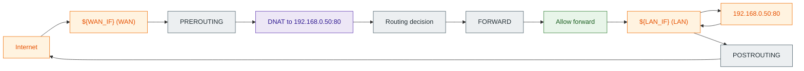
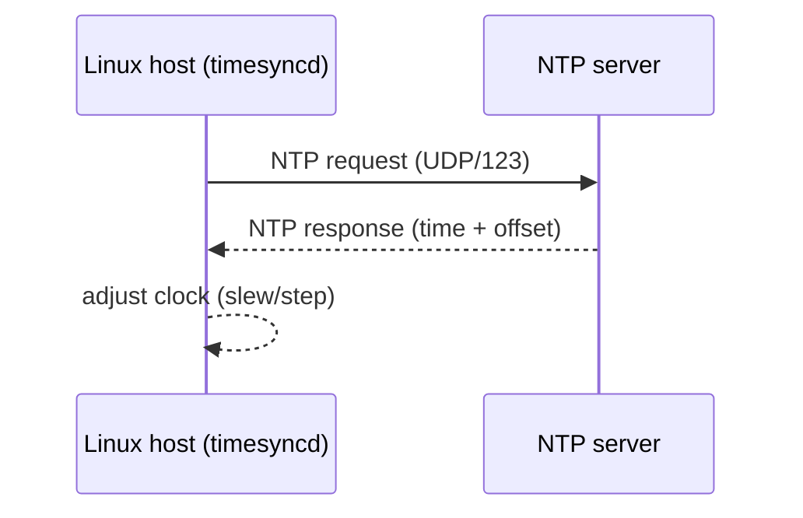
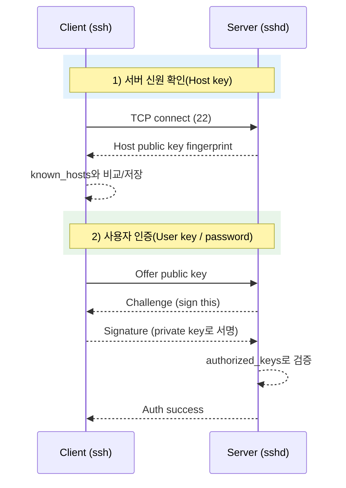

# Why?

왜 배움?

---

---

홈랩을 운영하면서 리눅스 기초에 대한 공부가 부족하다고 느꼈고
특히 앞으로 일하는데 있어 리눅스 기초를 모르면 아키텍쳐 설계에 한계가 있다고 판단하여
LFCS 를 준비하게 되었다.

<details>
<summary>RHCSA vs LFCS</summary>

RHCSA 가 더 깊은 내용을 다루고 실무적으로 도움이 되었다는 글이 많은데
응시료가 워낙 비싸서 이건 취업 이후 자격증 지원금이 있다면 그걸 활용할 생각이다,,,
확실히 더 다양한 걸 다루기는 한다,,

- SELinux 관리: 컨텍스트 확인/변경(setsebool, restorecon, semanage), 정책 커스텀, 문제 트러블슈팅.

LFCS는 기본 보안만, SELinux는 옵션.
- LVM(Logical Volume Manager) 고급: LV 생성/확장/스냅샷/리사이즈, VG/LV 병합.

LFCS는 기본 파티셔닝만.
- systemd 심화: 커스텀 서비스/타이머 유닛 작성, 타겟/슬라이스 관리, 부트 프로세스 최적화.

LFCS는 기본 서비스 컨트롤.
- firewalld: 존(zone) 관리, rich rules, 서비스/포트 영구 설정.

LFCS는 iptables/ufw 기본.
- RHEL 패키징/서브스크립션: dnf 모듈/라이프사이클, AppStream, subscription-manager.

LFCS는 범용 패키지 매니저
</details>
<details>
<summary>LFCS 후기</summary>

[https://gasbugs.tistory.com/546](https://gasbugs.tistory.com/546)
[https://velog.io/@mag000225/LFCS-%ED%95%A9%EA%B2%A9-%ED%9B%84%EA%B8%B0](https://velog.io/@mag000225/LFCS-%ED%95%A9%EA%B2%A9-%ED%9B%84%EA%B8%B0)
[https://www.linkedin.com/posts/yongsookim200_lfcs-%EC%9E%90%EA%B2%A9%EC%A6%9D-%EC%B7%A8%EB%93%9D-%EB%B0%8F-%EA%B3%B5%EB%B6%80%EB%B0%A9%EB%B2%95linux-foundation-certified-activity-7103630548123734017-e5Jc/?originalSubdomain=kr](https://www.linkedin.com/posts/yongsookim200_lfcs-%EC%9E%90%EA%B2%A9%EC%A6%9D-%EC%B7%A8%EB%93%9D-%EB%B0%8F-%EA%B3%B5%EB%B6%80%EB%B0%A9%EB%B2%95linux-foundation-certified-activity-7103630548123734017-e5Jc/?originalSubdomain=kr)
[https://status200ok.tistory.com/126](https://status200ok.tistory.com/126)
[https://status200ok.tistory.com/127](https://status200ok.tistory.com/127)
[https://lhoris.tistory.com/151](https://lhoris.tistory.com/151)
[https://www.reddit.com/r/linuxadmin/comments/1k0n0w6/lfcs_or_rhcsa_for_applying_to_sysadmin_jobs/](https://www.reddit.com/r/linuxadmin/comments/1k0n0w6/lfcs_or_rhcsa_for_applying_to_sysadmin_jobs/)
</details>

# What?

뭘 배움?

---

---

[https://www.udemy.com/course/linux-foundation-certified-systems-administrator-lfcs/](https://www.udemy.com/course/linux-foundation-certified-systems-administrator-lfcs/)

## 05-4.

실전 패턴 (규칙 작성 → 적용 → 검증)

### 0) 원격 서버에서 안전하게 시작하는 순서

```bash
sudo ufw app list
sudo ufw allow OpenSSH
sudo ufw enable
sudo ufw status verbose
```

> ⚠️ 주의

### 1) 포트 열기(로컬로 들어오는 트래픽 허용)

```bash
sudo ufw allow 22/tcp
sudo ufw allow 80/tcp
sudo ufw allow 443/tcp
```

### 2) 특정 출발지에서만 SSH 허용(화이트리스트)

```bash
sudo ufw allow from ${ip_cidr} to any port 22 proto tcp   # e.g. 10.0.0.0/24
```

### 3) 인터페이스 단위로 제한하기(예: public NIC로만 허용)

```bash
sudo ufw allow in on ${ifname} from ${ip_cidr} to any port 22 proto tcp
```

### 4) 아웃바운드 제한(예: SMTP 차단)

```bash
sudo ufw deny out 25/tcp
```

### 5) 룰 확인/삭제/우선순위 조정

UFW 룰은 번호로 관리하면 실수하기 쉽지 않다.

```bash
sudo ufw status numbered
sudo ufw delete ${rule_number}
sudo ufw insert 1 deny from 10.0.0.37
```

## 05-7.

IP forwarding: “통과(FORWARD)”를 가능하게 하는 스위치

포트포워딩/NAT은 대부분 “내 호스트가 라우터처럼 동작”하는 상황이기 때문에, IPv4 forwarding이 꺼져 있으면 패킷이 통과하지 못한다.
**확인**

```bash
sysctl net.ipv4.ip_forward
sysctl net.ipv6.conf.all.forwarding
```

**런타임(휘발성)**

```bash
sudo sysctl -w net.ipv4.ip_forward=1
# sudo sysctl -w net.ipv6.conf.all.forwarding=1
```

**영속화(권장: sysctl.d)**

```bash
sudo vim /etc/sysctl.d/99-forwarding.conf

net.ipv4.ip_forward=1
net.ipv6.conf.all.forwarding=1

sudo sysctl --system
```

> 💡 `/etc/sysctl.conf`는 “모든 설정이 한 파일에 모여서” 리뷰/추적이 어려워지는 경우가 많다.
> 작은 변경은 `/etc/sysctl.d/*.conf`로 분리해두는 편이 운영에서 관리하기 쉽다.

## 05-8.

실전 패턴 1: DNAT(포트포워딩) + FORWARD 허용

### 시나리오

- WAN: `${WAN_IF}`(예: `enp1s0`)에서 `TCP 8080`으로 들어오는 트래픽을
- LAN: `192.168.0.50:80`으로 전달하고 싶다



### 구현 (iptables)

> ⚠️ 주의

```bash
# 1) DNAT: 목적지 포트/주소 변환 (routing 결정 전에)
sudo iptables -t nat -A PREROUTING -i ${WAN_IF} -p tcp --dport 8080 \
  -j DNAT --to-destination 192.168.0.50:80

# 2) FORWARD: "통과"를 허용 (filter 테이블)
sudo iptables -A FORWARD -i ${WAN_IF} -o ${LAN_IF} -p tcp -d 192.168.0.50 --dport 80 \
  -m conntrack --ctstate NEW,ESTABLISHED,RELATED -j ACCEPT
sudo iptables -A FORWARD -i ${LAN_IF} -o ${WAN_IF} \
  -m conntrack --ctstate ESTABLISHED,RELATED -j ACCEPT
```

### 검증

```bash
sudo iptables -t nat -S
sudo iptables -S FORWARD
sudo iptables -vnL FORWARD
```

## 05-9.

실전 패턴 2: SNAT/MASQUERADE (내부망의 인터넷 나가기)

이 패턴은 “LAN → Internet” 트래픽에서 출발지 IP를 변환해서, 응답이 NAT 머신으로 돌아오게 만드는 전형적인 구성이다.

```bash
# SNAT의 가장 흔한 형태: 동적 공인 IP 환경이면 MASQUERADE
sudo iptables -t nat -A POSTROUTING -s 10.0.0.0/24 -o ${WAN_IF} -j MASQUERADE
```

> 💡 PREROUTING vs POSTROUTING

## 05-10. nftables 관점 (개념만 연결)

요즘은 내부적으로 nftables(`nft`)를 쓰는 배포판이 많다. iptables를 쓰더라도 backend가 nft인 경우가 있다.

```bash
sudo nft list ruleset
```
```
table ip nat {
  chain prerouting {
    type nat hook prerouting priority dstnat; policy accept;
    iifname "${WAN_IF}" tcp dport 8080 dnat to 192.168.0.50:80
  }
  chain postrouting {
    type nat hook postrouting priority srcnat; policy accept;
    oifname "${WAN_IF}" ip saddr 10.0.0.0/24 masquerade
  }
}
```

## 05-11.

영속화/롤백

### 영속화

iptables 룰은 커널에 올라가는 런타임 상태라, **재부팅 시 사라지는 게 일반적**이다.

영속화는 배포판/정책에 따라 여러 방법이 있다.

- `iptables-persistent` + `netfilter-persistent` (Debian/Ubuntu에서 흔함)
- `nftables` 서비스로 ruleset 관리

```bash
sudo apt install iptables-persistent
sudo netfilter-persistent save
```

### 롤백(주의해서)

```bash
sudo iptables -t nat -F
sudo iptables -F FORWARD
```

> ⚠️ flush는 즉시 트래픽에 영향을 준다.

원격 환경에서는 적용 순서/롤백 플랜을 먼저 잡고 실행한다.

### Reverse Proxy / Load Balancer

Reverse Proxy와 Load Balancer는 “클라이언트 앞단에서 요청을 받아서, 내부 서버로 전달”하는 역할을 한다.

- **Reverse Proxy**: “대리 응답자”처럼 동작한다.

클라이언트는 프록시만 보고, 내부 서버는 외부에 직접 노출되지 않는다.
- **Load Balancer**: 여러 upstream에 트래픽을 분산한다(알고리즘/가중치/장애 처리 정책 포함).

> 💡 DNS와의 관계(오해 포인트)

```mermaid
flowchart LR
  classDef client fill:#E3F2FD,stroke:#1565C0,color:#0D47A1;
  classDef proxy fill:#E8F5E9,stroke:#2E7D32,color:#1B5E20;
  classDef upstream fill:#FFF3E0,stroke:#EF6C00,color:#E65100;
  classDef note fill:#ECEFF1,stroke:#455A64,color:#263238;

  subgraph C["Client side"]
    B[Browser / Client]:::client
    DNS[DNS]:::client
  end

  subgraph P["Reverse Proxy / LB (Nginx)"]
    N[Nginx]:::proxy
  end

  subgraph U["Upstreams (private)"]
    A1[App#1]:::upstream
    A2[App#2]:::upstream
    IMG[Image service]:::upstream
  end

  B -->|resolve| DNS -->|A/AAAA| B
  B -->|HTTP(S)| N
  N -->|proxy| A1
  N -->|proxy| A2
  N -->|proxy| IMG

  Note1["Client는 프록시만 본다
Upstream은 내부에서만 통신"]:::note
  Note1 -.-> N
```

## 05-12.

Reverse Proxy (Nginx)

### 개념: “요청을 받아 → upstream으로 전달 → 응답을 다시 반환”

Reverse proxy는 아래 기능들을 함께 맡는 경우가 많다.

- 경로 기반 라우팅(`/`는 app, `/images/`는 image server)
- TLS termination(HTTPS를 프록시에서 종료)
- 공통 헤더 주입(`X-Forwarded-*`) 및 클라이언트 IP 전달

### 실전 패턴: location 기반 라우팅 + 공통 proxy header

```bash
sudo apt install nginx
sudo vim /etc/nginx/sites-available/${name}.conf
```
```
# /etc/nginx/sites-available/${name}.conf
upstream app_backend {
  server 1.1.1.1;
}

upstream img_backend {
  server 1.1.1.2;
}

server {
  listen 80;
  server_name _;

  location / {
    proxy_pass http://app_backend;
    include /etc/nginx/proxy_params;
  }

  location /images/ {
    proxy_pass http://img_backend;
    include /etc/nginx/proxy_params;
  }
}
```

> 💡 `proxy_params`가 하는 일

### 적용/검증

```bash
sudo ln -s /etc/nginx/sites-available/${name}.conf /etc/nginx/sites-enabled/${name}.conf
sudo rm -f /etc/nginx/sites-enabled/default

sudo nginx -t
sudo systemctl reload nginx.service

# 확인(예시)
curl -I <http://127.0.0.1/>
curl -I <http://127.0.0.1/images/>
```

> ⚠️ 주의: `proxy_pass`의 trailing slash

## 05-13.

Load Balancing (Nginx upstream)

### 개념: upstream은 “분산 정책 + 장애 처리”를 포함한다

- 기본은 **round-robin**
- `least_conn`: 연결 수가 적은 서버 우선
- `weight`: 가중치 기반 분산
- 오픈소스 Nginx는 보통 “passive health check”(실패하면 일정 시간 제외) 중심으로 운영한다

### 실전 패턴: round-robin / least_conn / weight

```
upstream mywebservers {
  # round-robin (default)
  server 1.2.3.4 max_fails=3 fail_timeout=10s;
  server 5.6.7.8 max_fails=3 fail_timeout=10s;
  keepalive 32;
}

# least_conn
upstream mywebservers_least {
  least_conn;
  server 1.2.3.4;
  server 5.6.7.8;
}

# weight
upstream mywebservers_weighted {
  server 1.2.3.4 weight=5;
  server 5.6.7.8 weight=1;
}
```
```
server {
  listen 80;
  location / {
    proxy_pass <http://mywebservers>;
    include /etc/nginx/proxy_params;
  }
}
```

### 운영 팁

```bash
sudo nginx -t
sudo nginx -T | less
sudo systemctl reload nginx.service
sudo journalctl -u nginx.service -e --no-pager
tail -f /var/log/nginx/access.log /var/log/nginx/error.log
```

### Sync Time Using Time Server

리눅스에서 시간 동기화는 “로그/인증서/TLS/분산 시스템의 신뢰”와 직결된다.

시간이 틀어지면 아래 같은 증상이 흔하다.

- TLS 인증서가 “아직 유효하지 않음 / 만료됨”으로 보임
- 토큰/세션(만료 시간 기반)이 예상과 다르게 동작
- 로그 상관관계(trace)가 깨짐

Ubuntu 계열에서는 `systemd-timesyncd`가 기본 NTP 클라이언트로 사용되는 경우가 많고,
다른 NTP 클라이언트(예: chrony)를 쓰면 timesyncd는 꺼져 있을 수 있다.

## 05-14. systemd-timesyncd 동작 구조



## 05-15.

실전 명령어 (설정 → 적용 → 검증)

### 1) 타임존 설정

```bash
timedatectl list-timezones
sudo timedatectl set-timezone Asia/Seoul
```

### 2) NTP 동기화 활성화/상태 확인

```bash
timedatectl
timedatectl timesync-status
timedatectl show-timesync

sudo timedatectl set-ntp true
```

> 💡 참고

### 3) timesyncd 설정(업스트림 NTP 서버 지정)

```bash
sudo vim /etc/systemd/timesyncd.conf
sudo systemctl restart systemd-timesyncd.service
```

### 4) 데몬/로그 검증

```bash
systemctl status systemd-timesyncd.service
journalctl -u systemd-timesyncd.service -e --no-pager
```

> ⚠️ 주의

### SSH

SSH는 “원격 터미널 접속”뿐 아니라, 파일 전송(scp/sftp), 포트 포워딩, 자동화(배포/운영)의 기반이 되는 프로토콜이다.

## 05-16.

SSH 구성 요소(클라이언트/서버)

- **서버 데몬**: `sshd` (원격에서 접속을 받아줌)
- **클라이언트**: `ssh` (접속을 시도함)

설정 파일은 “서버용”과 “클라이언트용”이 완전히 분리된다.

- 서버 설정: `/etc/ssh/sshd_config` + (배포판에 따라) `/etc/ssh/sshd_config.d/*.conf`
- 클라이언트 설정: `~/.ssh/config` (유저별) / `/etc/ssh/ssh_config` (글로벌)

> 💡 drop-in 디렉토리는 왜 존재하는가?

## 05-17.

인증 흐름(왜 키 기반이 기본인가?)



> 💡 `known_hosts` vs `authorized_keys`

## 05-18.

실전 명령어 (진단 → 변경 → 검증)

### 1) 서버 상태 확인

```bash
sudo systemctl status ssh.service || sudo systemctl status sshd.service
sudo ss -ltpn | rg ':22' || true
```

### 2) 키 생성/배포

```bash
ssh-keygen -t ed25519 -C "${comment}"

# 서버에 공개키 추가(가능한 환경에서)
ssh-copy-id -i ~/.ssh/id_ed25519.pub ${user}@${host}
```

### 3) 클라이언트 설정(호스트 별 단축/옵션)

```bash
vim ~/.ssh/config
```
```
Host myserver
  HostName 1.2.3.4
  User ubuntu
  IdentityFile ~/.ssh/id_ed25519
  IdentitiesOnly yes
```

### 4) 서버 설정(예: IPv4만 리슨, 비밀번호 인증 끄기)

> ⚠️ 주의

```bash
sudo vim /etc/ssh/sshd_config.d/10-hardening.conf
```
```
AddressFamily inet
PasswordAuthentication no
PubkeyAuthentication yes
PermitRootLogin no
```

### 5) 설정 검증 후 재시작/리로드

```bash
sudo sshd -t
sudo systemctl reload ssh.service || sudo systemctl reload sshd.service
```

### 6) 접속 디버그(클라이언트)

```bash
ssh -vvv ${user}@${host}
```

### 7) known_hosts 정리

```bash
ssh-keygen -R ${host}
```

> 💡 `ListenAddress`에 대해

# 05.

Networking

### Bridge / Bond 사용하여 NIC 에 대한 매니징

Bridge

- Network A - NIC - **bridge** - NIC - Network B
Bond
- Network A - Multi NIC - **bond** - In/Out bound DNS
- 7 bonding modes : Mode 0 ~ 6 [Ref]([https://www.ibm.com/docs/en/linux-on-systems?topic=recommendations-bonding-modes#:~:text=modes:-,mode 0 (balance-rr,addresses for the server.,-For)](https://www.ibm.com/docs/en/linux-on-systems?topic=recommendations-bonding-modes#:~:text=modes:-,mode%200%20(balance%2Drr,addresses%20for%20the%20server.,-For))
- Mode 0 round robin -
- Mode 1 active backup - if one fails, another become active
- Mode 2
- Mode 3 broadcast
- Mode 4
- Mode 5 transmit load balance
- Mode 6 adaptive load balance
- -

bridge could be implemented via netplan

```
Sudo vim /etc/netplan/bridge-example.yaml
```
```yaml
network:
  version: 2
  renderer: networkd
  ethernets:
    enp3s0:
      dhcp4: no
    enp8s0:
      dhcp4: no
  bridges:
	   # this is a name of the bridge
    br0:
      dhcp4: yes
      interfaces:
			# add interface to be added
        - enp3s0
        - enp8s0
```
```
ip -c link # MAC 주소와 device interface 상태 확인,-c 는 color option(무조건 중간에)

Sudo netplan try #

Ip -c link
# -c 는 color option(무조건 중간에)
# 이제 bridge 인터페이스인 br0 가 정상적으로 뜨는 것을 볼 수 있다
# ip addr 명령어로 NIC 인터페이스의 MAC 주소 옆에 IPv4 CIDR 주소(예: 10.0.x.x/24)가 표시되면 DHCP가 정상 작동한 걸 확인할 수 있다
# Dhcp 가 정상작동하지 않았다면 동적 ip 할당이 되지 않아 사설네트워크 주소가 아닌 정적 주소 혹은 아무것도 안 뜬다

# 이후 sudo ip link delete br0 을 통해 bridge interface 를 삭제하여 bridge 를 제거할 수 있다
```

Bond 또한 netplan 으로 처리가능하다

```
network:
  version: 2
  renderer: networkd
  ethernets:
    enp3s0: {}
    enp4s0: {}
  bonds:
	   # this is a name of the bond
    bond0:
      dhcp4: yes
      interfaces:
        - enp3s0
        - enp4s0
      parameters:
        mode: active-backup
			# you can check modes in man page with search keyword 'bonding'
			# balance-rr : mode0
       primary: enp3s0
        mii-monitor-interval: 100
```

Bond 는 netplan try 를 하면 경고가 나오는데 이는 실제로 bond 처리가 되면 nic 가 꼬일 수 있다는 경고가 뜬다.

따라서 에러가 없이 제대로 처리될 수 있게 apply 전에 확인해봐야한다.

bond 나 bridge 는 결국 linux 상에서 interface 로 돌아간다.

따라서 원한다면 sudo ip addr dev ${device-name} addr ${ip/cidr} 을 통해 ip 를 추가하거나 sudo ip set dev ${device-name} ${up 혹은 down} 으로 켜고 끌 수 있다.

두 interface 는 가상 interface 인데 어떻게 정상 동작하는가? bond/bridge 에 ip 를 추가하면 IP는 bond/bridge에 있지만, 실제 frame은 연결된 NIC으로 나가게끔 처리된다.

- Bond 인터페이스(bond0)에 IP를 추가하면:
발신(Outbound): bond의 bonding mode(balance-rr, active-backup 등)에 따라 slave NIC들로 패킷 분배.

예: mode 1(active-backup)에서는 active slave만 사용.

수신(Inbound): ARP negotiate나 MAC learning으로 active slave가 트래픽 수신, bond의 IP 스택으로 올라감.

Kernel이 bond를 "상위 인터페이스"로 인식해 라우팅 테이블에서 bond0 기준으로 처리.
- Bridge 인터페이스(br0)에 IP 추가 시:
Bridge는 L2 스위치처럼 동작하면서 자체 IP 스택도 가짐. br0의 IP로 들어온 패킷은 bridge의 forwarding database(FDB)를 거쳐 slave 포트(물리 NIC, veth 등)로 전달.

예: VM 패킷 → vnet0 → br0(FDB 조회) → eno1(NIC) → 물리 스위치.

Bridge가 "promiscuous mode"로 NIC 패킷을 캡처해 L2/L3 모두 처리.
- -

### Firewall 세우기

Packet filtering firewall 을 세워서 악성 packet frame 들을 차단하여 공격을 방지할 수 있다.

Ufw(Uncomplicated firewall) 를 사용하여 이러한 packet filtering 을 처리할 수 있다.

화이트리스트 방식과 -- 특정 ip 만 허용 -- 블랙리스트 방식 -- 특정 ip 를 차단 -- 중 선택하여 필터링 할 수 있다.

UFW에 설정되어 있는 기본 룰은 아래와 같다.

들어오는 패킷에 대해서는 전부 거부(deny)
나가는 패킷에 대해서는 전부 허가(allow)

> Word book
> FROM, ON, OUT, IN 등등 굉장히 헷갈린다
> FROM 은 상대주소지를, ON 은 interface 를, OUT/IN 은 방향을 떠올리면 된다
> FROM: 출발지 IP나 네트워크를 지정.

예: ufw allow from 192.168.1.100 to any port 22 – 특정 IP에서만 SSH 허용.
> IN: incoming(들어오는) 트래픽에만 적용.

기본값이지만 명시 가능.

예: ufw allow in 80/tcp.
> OUT: outgoing(나가는) 트래픽에 적용.

예: ufw deny out 25/tcp – SMTP 나가는 차단.
> ON: 특정 네트워크 인터페이스(eth0 등)에만 적용.

예: ufw allow in on eth0 from 10.0.0.0/8.

```bash
Sudo ufw status # check status of ufw
Sudo ufw status verbose # print detailed status of ufw
sudo ufw status numbered # each ufw rule has number, this shows a ufw rules with number

Sudo ufw allow 22 # enable 22 port which is a tcp port of ssh
sudo ufw allow 22/udp # enalbe only udp 22 port

Sudo ufw allow from ${ip/cidr} to any port 22
# 특정 ip 의 특정 포트인 22 에 대해 허용
# 이런 셋업을 통해 피어 네트워크에서 어떤 주소로든 22 포트로 트래픽을 전송할 수 있게 패킷 필터를 열어서 라우팅 처리가 가능하다
Sudo ufw allow from ${ip/cidr} to any port 22
# 특정 ip 의 모든 포트를 허용


Sudo ufw deny 22 # disable 22 port
Sudo ufw deny 22/tcp # disable only tcp 22 port
Sudo ufw deny on enp0s3 to 8.8.8.8
# enp0s3 에서 8.8.8.8 로 나가는 트래픽 차단
# enp0s3 와 같은 interface 는 ip -c link 를 통해 볼 수 있음, -c 는 colorful 옵션


sudo ufw delete ${ufw rule number}
# this deletes the ufw rule by number
# since firewall processed by rule number order
# if 10.0.0.0/24 is allowed by rule 1, denial 10.0.0.37 by rule 2 is ignored
# to handle this scenario, you can insert rule by number, via 'Sudo ufw insert ${num} ${rule}'

Sudo insert 1 deny from 10.0.0.37
# inserting by number will push down the previous number
# if 3 is inserted, previous 3->4, 4->5, ,,,


``

이외 Ufw 명령어 관련해서 <https://webdir.tistory.com/206> 를 많이 참고하자
```

### Port Redirection / NAT

> 아래 설명들이 틀린 게 있는지 꼭 검토하기

Internet → Publicly Accessible Server (Proxy/Reverse Proxy) → Internal Network

하지만 퍼블릭 포트로 받은 트래픽을 어느 포트의 프라이빗 네트워크로 넘겨야할지 알아야 한다.

Internet — public known port —> Publicly Accessible Server (Proxy/Reverse Proxy)

Publicly Accessible Server (Proxy/Reverse Proxy) — WHICH PORT ?? —> Internal Network

이를 위해 포트포워딩이라는 기술이 사용된다.

NAT 개념은 위와 같다.

> NAT 는 그럼 우리가 설정하는 게 아닌가?
> Port Redirectoin 과 NAT 가 서로 다른 정의인가?

Linux 에서는 대부분의 디스트로에서 아래와 같이 기본적으로 ip forwarding 이 활성화되어있다.

> Sysctl.conf 는 왜 위험한가?

`/etc/sysctl.conf : risker`
`/etc/sysctl.d/${name}.conf : safer`

위와 같은 파일 내에서 패킷 포워딩 설정을 아래와 같이 변경할 수 있다.

```javascript
net.ipv4.ip_forward = 1
net.ipv6.conf.all.forwarding = 1
```

`sudo sysctl --system` 을 통해 패킷 포워딩 설정을 적용해줘야 영구적으로 처리된다.

Linux 에서는 모든 네트워크 관련 처리를 kernel 에서 수행한다. — Ufw 명령어에 따른 firewall, ip addr/link 명령어에 따른 ip routing, sysctl 명령어에 따른 패킷포워딩 규칙 등등.

`netfilter framework(nft)` 을 사용하여 port redirection 을 설정할 수 있다.

하지만 nft 는 사용하기 어려워 iptable 을 수정하는 게 조금 더 쉽다.

Iptable 은 chain 에 따라 처리된다.

> Chain ??

갑자기 무슨 Chain ??

Chain 을 수정하는건가?
> 아래엣ㅓ 테이블들이 등장하는데 이게 무슨 테이블등ㄹ인지??

`sudo iptables -t nat -A PREROUTING -i enp1s0 -s 10.0.0.0/24 -p tcp --dport 8080 -j DNAT --to-destination 192.168.0.50`

= nat 테이블에 PREROUTING 체인을 추가하는데 -t : table ${table}, -A : append ${chain}, -i : inputer ${interface}, -s : source ${source ip}, -p : ${protocol}, --dport : ${destination port}, -j : jump nat packet to target, --to-destination : ${destination ip}

여기서 -i 를 빼면 모든 interface 에 대해서 적용된다.

> 아래를 활용하면 Port Forwarding 한 패킷의 원래 origin 을 바꿔줄 수 있는건가?
> POSTROUTING ?

PREROUTING 이랑 뭐가 다른거지?
> 왜 여기선 -output 옵션 ?

`sudo iptables -t nat -A POSTROUTING -s 10.0.0.0/24 -o enp6s0 -j MASQUERADE`

여기서 -o 를 빼면 모든 interface 에 대해서 적용된다.

위 iptables 명령어들을 nft 에서 비슷하게 할 수 있는데 아래 코드와 같이 복잡하게된다.

```javascript
sudo nft list ruleset

talbe ip nat {
		chain PREROUTING { 
				type nat hook prerouting priority dstnat; policy accept;
				iifname "enp1s0" meta l4proto tcp ip saddr 10.0.0.0/24 tcp dport 8080 counter packets 0 bytes 0 dnat to 192.168.0.5:80
		}
		chain POSTROUTING {
				type nat hook postrouting priority srcnat; policy accept;
				oifname "enp6s0" ip saddr 10.0.0.0/24 counter packtes 0 bytes 0 masquerade
		}
}
```

Iptables 설정은 영속화되지 않는다.

따라서 iptables-persistent 패키지를 설치 이후 `sudo netfilter-persistent save` 를 통해 영속화를 미리 켜두고 iptable 명령어를 호출해줘야한다.

```javascript
sudo apt install iptables-persistent
sudo netfilter-persistent save
sudo iptables -t nat -A PREROUTING -i enp1s0 -s 10.0.0.0/24 -p tcp --dport 8080 -j DNAT --to-destination 192.168.0.50
sudo iptables -t nat -A POSTROUTING -s 10.0.0.0/24 -o enp6s0 -j MASQUERADE
```

만약 iptables 의 nat 테이블을 초기화하고 싶다면 다음과 같이 하면 된다.

`sudo iptables --flush --table nat`

### Reverse Proxy / Load Balancer

Reverse Proxy 는 중간 서버로 DNS Query 에 대해 설정에 따라 동적으로 IP Resolve 를 지원한다.

이를 통해 우리는 새로운 서버를 추가하여 교체할 때 설정만 바꿔주면 DNS Query Client 는 기존 호출하던 DNS 를 그대로 유지하면 된다.

Nginx 예시

```javascript
sudo apt install nginx
sudo vim /etc/nginx/sites-availbe/${name}.conf

# / -> 1.1.1.1
server{
		listen 80;
		location / {
				proxy_pass http://1.1.1.1;
		}
}

# /images -> 1.1.1.2
# add headers to get metadata
server{
		listen 80;
		location /images {
				proxy_pass http://1.1.1.2;
				include proxy_params;
		}
}
# adding metadata requires proxy_params config
sudo vim /etc/nginx/proxy_params
proxy_set_header Host $http_host;
proxy_set_header X-Real-IP $remote_addr;
proxy_set_header X-Forwareded-For $proxy_add_x_forwareded_for;
proxy_set_header X-Forwareded-Proto $scheme;

# To enable these configs -> soft link to /sites-enabled
sudo ln -s /etc/nginx/sites-availbe/${name}.conf /etc/nginx/sites-enabled/proxy.conf
# To disable these configs -> rm /default
sudo rm /etc/nginx/sites-enabled/default
# To test/check config files -> nginx -t
sudo nginx -t
# Apply these on nginx
sudo systemctl reload nginx.service


```

Load Balancer 는 중간 서버로 트래픽 부하를 여러 서버에 균형적으로 나눠서 처리한다.

Nginx 예시

```javascript
sudo apt install nginx
sudo vim /etc/nginx/sites-availbe/${name}.conf

# load balance by round robin 
# / -> mywebservers -> 1.2.3.4 / 5.6.7.8
upstream mywebservers{
		server 1.2.3.4;
		server 5.6.7.8;
}
server{
		listen 80;
		location / {
				proxy_pass http://mywebservers;
		}
}


# load balance by least active order
# / -> mywebservers -> 1.2.3.4 / 5.6.7.8
upstream mywebservers{
		least_conn;
		server 1.2.3.4;
		server 5.6.7.8;
}
server{
		listen 80;
		location / {
				proxy_pass http://mywebservers;
		}
}

# load balance by weight & least active order
# more weight, more handle conn
# default weight is 1
# / -> mywebservers -> 1.2.3.4 / 5.6.7.8
upstream mywebservers{
		least_conn;
		server 1.2.3.4 weight=5;
		server 5.6.7.8; # 
}
server{
		listen 80;
		location / {
				proxy_pass http://mywebservers;
		}
}


# you can mark server as down, then others handle conn
upstream mywebservers{
		least_conn;
		server 1.2.3.4 down; # won't handle
		server 5.6.7.8; # HANDLE THE CONN
}
server{
		listen 80;
		location / {
				proxy_pass http://mywebservers;
		}
}


# you can specify server port
upstream mywebservers{
		least_conn;
		server 1.2.3.4:8081;
		server 5.6.7.8:3308;
}
server{
		listen 80;
		location / {
				proxy_pass http://mywebservers;
		}
}

```

### Sync Time Using Time Server

Systemd-timesyncd 데몬을 통해 time server 에 주기적으로 네트워크 상 시간을 동기화함.

Timdatectl list-timezone

Timedatectl set-timezone America/Los-Angles

Sudo timedatectl set-ntp true 를 통해 Systemd-timesyncd 에 의한 동기화작업을 활성화.

Systemd-timesyncd 의 설정을 바꾸려면 /etc/systemd/timesyncd.conf를 사용.

> 각각의 설정갑이 어떻게 되며 어떻게 ntp 서버를 지정할 수 있는가 ?


Timedatectl show-timesync, 혹은 timesync-status 를 통해 ntp 서버 설정과 현재 상태를 볼 수 있음.

### SSH 

Ssh 가 뭔지 기억이 안 나면 미리 정리해둔 게 있다.

다만 해당 글에서는 리눅스에서 설정을 어떻게 하는지 안 나와있어 여기서 따로 정리하고 나중에 해당 글에 기입하겠다.

[SSH 란? (feat. Nixos SSH 활성화)](https://www.notion.so/20f19c3902908018b512fec4e62ecce1)

Ssh config 는 /etc/ssh/sshd_config.d.

AddressFamily adess family 지정, ipv4만 받고 싶다면 inet, ipv6 는 inet6.

listenAddress를 통해 클라이언트 ip 화이트리스트.

PasswordAuthentication 을 통해 사용자 비밀번호에 따른 인증 x.

sshd_config.d 에서 메인설정을 했더라도 sshd_config.d/${config}.conf 에 설정이 있으면 설정을 덮어씌운다 (오버라이드).

따라서 해당 디렉토리 산하에 파일이 있는지 꼭 체크해라.

> 어떻게 sshd_config.d 는 디렉토리 역할을 하면서 설장파일 역할을 하는거지?

각 유저 별 ssh config 를 통해 ssh host 를 네이밍 지정할 수 있음 → ~/ssh/.config.

추가로 이에 비한 글로벌 ssh config 는 /etc/ssh/Ssh_config 에 있다.

ssh-keygen 을 통해 공개키 생성, ssh-keygen -R ${} 을 통해 해당 서버에서 나의 공개키를 지워 known_hosts 에서 제거한다.

# 06.

Storage

## Partition & Swap

### Partition 이란

1TB → 500GB NTFS Windows OS | 500GB EXT4 Ubuntu 로 사용하게끔 논리적으로 분리하는 것을 파티셔닝이라함.

현재 파티셔닝을 확인하려면 `lsblk` 사용.

```bash
❮ lsblk
NAME                                           MAJ:MIN RM   SIZE RO TYPE  MOUNTPOINTS
nvme0n1                                        259:0    0 931.5G  0 disk
├─nvme0n1p1                                    259:1    0     1G  0 part  /boot
├─nvme0n1p2                                    259:2    0    16G  0 part
│ └─dev-disk-byx2dpartlabel-diskx2dmainx2dswap 254:12   0    16G  0 crypt [SWAP]
└─nvme0n1p3                                    259:3    0 914.5G  0 part
  ├─homelab_vg-data_thinpool_tmeta             254:0    0   500M  0 lvm
  │ └─homelab_vg-data_thinpool-tpool           254:2    0   300G  0 lvm
  │   ├─homelab_vg-data_thinpool               254:3    0   300G  1 lvm
  │   └─homelab_vg-data                        254:8    0   600G  0 lvm   /data
  ├─homelab_vg-data_thinpool_tdata             254:1    0   300G  0 lvm
  │ └─homelab_vg-data_thinpool-tpool           254:2    0   300G  0 lvm
  │   ├─homelab_vg-data_thinpool               254:3    0   300G  1 lvm
  │   └─homelab_vg-data                        254:8    0   600G  0 lvm   /data
  ├─homelab_vg-vm_thinpool_tmeta               254:4    0     1G  0 lvm
  │ └─homelab_vg-vm_thinpool-tpool             254:6    0   380G  0 lvm
  │   ├─homelab_vg-vm_thinpool                 254:7    0   380G  1 lvm
  │   └─homelab_vg-vms                         254:11   0   800G  0 lvm   /var/lib/libvirt/images
  ├─homelab_vg-vm_thinpool_tdata               254:5    0   380G  0 lvm
  │ └─homelab_vg-vm_thinpool-tpool             254:6    0   380G  0 lvm
  │   ├─homelab_vg-vm_thinpool                 254:7    0   380G  1 lvm
  │   └─homelab_vg-vms                         254:11   0   800G  0 lvm   /var/lib/libvirt/images
  ├─homelab_vg-root                            254:9    0   200G  0 lvm   /nix/store
  │                                                                       /
  └─homelab_vg-vault                           254:10   0    20G  0 lvm   /var/lib/vault
```

s → serial, SATA(Serial ATA) 에 SSD 설치된 경우

nvme → nvme 에 SSD 설치된 경우

Sda, sdb, sdc ,,, sdz 와 같이 알파벳으로 물리 디스크를 구분.

sda1, sda2, sda2 ,,,, 와 같이 물리디스크에 추가적으로 번호를 붙여서 논리 파티셔닝을 구분.

논리적 파티셔닝은 `/dev/${partion-name}` 에 저장됨.

가령 위와 같을 때, 아래와 같이 볼 수 있음.

```bash
❮ ll /dev/nvme0n1
brw-rw---- 1 root disk 259, 0 Apr 23 09:00 /dev/nvme0n1
```

Show me a list of partitions on this block device named ${partion-name}
`sudo fdisk --list /dev/${partion-name}`

```bash
❮ sudo fdisk --list /dev/nvme0n1
Disk /dev/nvme0n1: 931.51 GiB, 1000204886016 bytes, 1953525168 sectors
Disk model: CT1000T500SSD8
Units: sectors of 1 * 512 = 512 bytes
Sector size (logical/physical): 512 bytes / 512 bytes
I/O size (minimum/optimal): 512 bytes / 512 bytes
Disklabel type: gpt
Disk identifier: 10AD83AB-32CD-4DC2-AFD4-E7D477955816

Device            Start        End    Sectors   Size Type
/dev/nvme0n1p1     2048    2099199    2097152     1G EFI System
/dev/nvme0n1p2  2099200   35653631   33554432    16G Linux swap
/dev/nvme0n1p3 35653632 1953523711 1917870080 914.5G Linux filesystem
```

Start 가 2048 에서 시작하는 걸 볼 수 있는데 0~2047(512 × 4 bytes) 는 통상적으로 boot loader 가 시작될 때 사용하는 공간이라 비워두는 것이 일반적인 룰이다.

`cfdisk`는 **리눅스에서 디스크 파티션을 관리하는 curses 기반의 사용자 친화적인 TUI(Text User Interface) 도구이다.**

위와 같은 경우 실제로 실행시켜보면 디스크 파티션들을 관리하는 TUI 가 뜨는 것을 볼 수 있다.

```bash

❮ sudo cfdisk /dev/nvme0n1
```


cfdisk 상에서 조작하는 것은 `Write` 를 선택하기 전까지는 그냥 Plan 일뿐이다.

따라서 실제로 적용하고자 한다면 반드시 `Write` 를 선택해줘야한다

### Swap 이란

메모리(RAM)가 부족할 때 디스크(하드디스크나 SSD)의 일부를 가상 메모리처럼 사용하는 공간이다.
`swapon --show` 를 사용하면 swap 현재 상태를 볼 수있다.

```bash
❮ swapon --show
NAME       TYPE      SIZE USED PRIO
/dev/dm-12 partition  16G   0B   -2

# 또는
❮ free -h
               total        used        free      shared  buff/cache   available
Mem:            27Gi       1.1Gi        25Gi       7.3Mi       892Mi        26Gi
Swap:           15Gi          0B        15Gi
```

특정 디스크에 swap 을 생성하려면 `sudo mkswap /dev/${partition-name}` 을 통해 생성할 수 있다.

```bash
❮ sudo mkswap /dev/vdb3
```

이후 `swapon --verbose ${partition-name}` 을 통해 해당 Swap을 활성화하고, 디스크 I/O에 참여하도록 커널에게 알려주도록 한다

```bash
❮ sudo swapon --verbose /dev/dm-12
swapon: /dev/mapper/dev-disk-byx2dpartlabel-diskx2dmainx2dswap: found signature [pagesize=4096, signature=swap]
swapon: /dev/mapper/dev-disk-byx2dpartlabel-diskx2dmainx2dswap: pagesize=4096, swapsize=17179869184, devsize=17179869184
swapon /dev/mapper/dev-disk-byx2dpartlabel-diskx2dmainx2dswap
swapon: /dev/mapper/dev-disk-byx2dpartlabel-diskx2dmainx2dswap: swapon failed: Device or resource busy
```

하지만 이렇게 manual 하게 설정을 바꾸는 것은 temporary changes 이다.

설정파일을 수정하여 적용해주어야 영구적 적용이된다.

영구적 적용 방법은 나중에 확인할 것이다.

이제 이렇게 활성화한 swap 을 `swapoff` 를 통해 끌 수도 있다.

```bash
❮ sudo swapoff /dev/vdb3
```

위 mkswap 은 기존 파티션을 swap 으로 쓰도록 하는 방식이다.

이와 반대로 `dd` 를 사용하면 직접 swap device file 을 만들고 크기를 지정할 수 있다.

`dd`는 원하는 크기의 파일을 디스크에 만드는 “저수준 복사” 도구이다.

다음과 같이 사용할 수 있다.

- `if=/dev/zero` : `/dev/zero`는 무한히 0으로 채워진 장치 → 0으로 채운 파일을 만듬
- `of=/swap` : “/swap”이라는 파일에 씀
- `bs=1M count=128` → 1M × 128 = 128MB 할당
- `status=progress` → 진행 상황을 보여주는 옵션

이후 swap 파일은 root만 읽고 쓸 수 있어야하므로 600 으로 권한을 지정해준다.

```bash
❮ sudo dd if=/dev/zero of=/swap bs=1M count=2048 status=progress

❮ sudo chmod 600 /swap

❮ sudo mkswap /swap

❮ sudo swapon --verbose /swap

```

## File System

### Create/Configure File System

```bash
# sdb1 (SSD b 디스크의 1 파티션) 에 ext4 를 생성해라
sudo mkfs.ext4 /dev/sdb1

# man page 도 볼 수 있다
man mkfs.ext4

# Label 지정하여 xfs 를 /dev/sdb1 에 생성
sudo mkfs.xfs -L "BackupVolume” /dev/sdb1

# inode 512 바이트 지정하여 xfs 를 /dev/sdb1 에 생성
# inode는 파일의 설명서/주소록 같은 메타데이터
# 그 파일의 권한, 소유자, 크기, 생성/수정 시간, 그리고 실제 데이터가 디스크 어디에 있는지 같은 메타데이터를 담는다
# -f 를 통해 force 할 수 있다
sudo mkfs.xfs -i -f size=512 /dev/sdb1

# xfs_admin -l 을 통해 라벨을 확인
# xfs_admin -L 을 통해 라벨을 수정
sudo xfs_admin -l /dev/sdb1
sudo xfs_admin -L “Changed Label" /dev/sdb1

# ext4 를 /dev/sdb1 에 생성
sudo mkfs.ext4 /dev/sdb2

# -N 을 통해 inode 크기를 지정한다 (byte)
# ext4 는 inode 크기가 꽉 차면 더 이상 데이터를 저장하지 못 한다
sudo mkfs.ext4 -N 50000 /dev/sdb2

# tune2fs -l 을 통해 라벨을 확인
# tune2fs -L 을 통해 라벨을 수정
sudo tune2fs -l /dev/sdb2
sudo tune2fs -L “Changed Label" /dev/sdb2
```

### Mount Filesystem

```bash
# To plug directoy on specific disk
# "Mounting" is required
# To mount, we use mount command
# /dev/vdb1(virtual device 인 b 의 1파티션) 을 /mnt/ 라는 임시 디렉토리에 마운트
sudo mount /dev/vdb1 /mnt/

# storage device 확인
lsblk

# mount 취소하려면 umount 사용
sudo umount /mnt/

# system 이 boot up 할 때 /etc/fstab 에 선언된 디렉토리들을 자동으로 마운트한다
# 따라서 boot up mount dir 들은 /etc/fstab 에 저장하여 영속화한다
# 1번째 인자 : 어느 디스크를 마운팅할건지
# 2번째 인자 : 어디에 마운팅 할건지
# 3번째 인자 : 어느 파일시스템을 쓸건지
# 4번째 인자 : 마운트 옵션
# 5번째 인자 : 덤프 백업 (0:false, 1:true)
# 6번째 인자 : 파일시스템 에러 정책(0:에러스캔X,1:이 마운트가 가장 먼저 스캔되어야 함,2:1이 스캔되고 나서 스캔됨)
# swap 에 대해서는 디렉토리를 none, 마운트디렉토리를 swap,덤프백업과 에러정책을 0 으로 세팅한다
sudo vim /etc/fstab
```
/dev/vda2 / ext4 defaults 0 1
/dev/vda3 none swap defaults 0 0
```

# /etc/fstab 을 업데이트 했다먼 daemon-reload 하여 정책을 반영한다
sudo systemctl daemon-reload
```

### Filesystem Feature / Mount Options

```bash
# 어떤 디바이스가 어떤 마운트로 처리되어있느지 상세 확인
# 마운트 중심으로 보려면 findmnt 를
# 디바이스 중심으로 보려면 lsblk 를
# +) 마운트 옵션을 보여주는 findmnt !!
findmnt
lsblk -f

# /dev/vdb2(virtual device 인 b 의 2파티션) 을 /mnt/ 라는 임시 디렉토리에 마운트옵션을 통해 마운트
# 마운트 옵션들은 다음과 같다
# ro : 읽기 전용 (쓰기 X)
# noexec : 바이너리 실행 X
# nosuid : SUID/SGID 무시 (set-uid,set-gid 작동 X)
# rw : 읽기/쓰기 가능
# auto / noauto : 부팅 시 자동 마운트 여부
# user / nouser : 일반 사용자가 마운트/언마운트 가능 여부
# sync / async : I/O 동기/비동기 모드
# nodev : 블록/캐릭터 장치 파일을 무시
# defaults : rw,suid,dev,exec,auto,nouser,async 묶음
# remount : 이미 존재하는 마운트에 새로운 옵션을 추가하여 다시 마운트할 때 적용
sudo mount -o ro,remount,noexec,nosuid /dev/vdb2 /mnt

# XFS 전용 allocsize 옵션을 통해 XFS 사전 할당 크기를 지정
# allocsize 는 remount 로는 바꿀 수 없는 것을 알아두자
sudo mount -o allocsize=32K /dev/vdb1 /mybackups
```

## Logical Volume Manager

### LVM 이란

[https://www.linux-tips-and-tricks.de/en/general/282-was-kann-lvm-und-warum-sollte-man-lvm-benutzen-what-can-lvm-do-form-me-and-why-should-i-use-lvm-2](https://www.linux-tips-and-tricks.de/en/general/282-was-kann-lvm-und-warum-sollte-man-lvm-benutzen-what-can-lvm-do-form-me-and-why-should-i-use-lvm-2)
[https://greencloud33.tistory.com/41](https://greencloud33.tistory.com/41)
일반 디스크 파티셔닝은 **디스크 주소(섹터)를 순차적으로 나누어서 할당**한다.

그래서 특정 파티션을 확장하거나 축소하려면, **그 뒤에 있는 파티션들이 물리적 위치를 모두 밀고 당겨야 한다**.

이로 인해 파티션 구조를 건드리고, 리사이징 작업이 번거롭고 위험하다.

이를 극복하고자 LVM 을 사용한다.

LVM은 물리 디스크를 그대로 파티션으로 나누지 않는다.

대신, 물리 디스크를 PV 라는 단위로 쪼개고 하나의 그룹으로 묶은 뒤 ( PV → VG).

이 그룹을 원하는 논리적 단위로 쪼개어 파일 시스템에 할당한다 (VG → LV → FileSystem).
***PE(Physical Extent) : PV를 구성하는 일정한 크기의 Block, 1PE == 4MB
***PV(Physical Volume) : PE 들을 묶어 실제 디스크 장치를 분할한 파티션 단위
***VG(Volume Group) : PV들이 모은 그룹, 이렇게 모인 바이트들을 LV 가 원하는 크기만큼 LV 에게 할당한다
***LV(Logical Volume) : PV 로부터 사용자가 할당받은 볼륨, 해당 볼륨은 LE 로 구성된다
***LE(Logical Extent) :  PV 내의 물리적 저장 영역을 가리키는 LV의 논리적 저장 영역


> 처리 흐름 순서
> **LV가 특정 마운트를 통해 VG를 가리키는 구조**
> 제거 축소 순서

### 패키지 설치

```bash
# LVM 에 대해서는  
# 아래 패키지를 설치하고,  
# 디스크/디바이스를 LVM PV로 초기화한 뒤  
# VG를 생성하고, 그 안에서 LV를 생성·조정하며,  
# 헷갈리는 부분은 man lvm 을 통해 참고한다.

sudo apt install lvm2
```

### 기존 디바이스/파티션 확인

```bash
# `lvmdiskscan`는 
# LVM이 인식할 수 있는 디바이스/파티션을 확인하는 명령어이다.  
# 출력에서 `/dev/nvme0n1p3`가 LVM PV로 등록되어 있음을 확인할 수 있다.
lvmdiskscan
  /dev/mapper/dev-disk-byx2dpartlabel-diskx2dmainx2dswap [      16.00 GiB]
  /dev/nvme0n1p1                                         [       1.00 GiB]
  /dev/nvme0n1p2                                         [      16.00 GiB]
  /dev/nvme0n1p3                                         [     914.51 GiB] LVM physical volume
  1 disk
  2 partitions
  0 LVM physical volume whole disks
  1 LVM physical volume
```

### PV 초기화

```bash
# pvcreate 는 디바이스 스토리지를 LVM 용 PV 로 초기화하는 명령어다
# pvcreate ${device-path},,,, 으로 사용한다
# 이 디바이스들은 이제 LVM에서 관리 가능한 스토리지 블록으로 간주된다.
sudo pvcreate /dev/sdc /dev/sdd
```

### PV 확인

```bash
# pvs 는 현재 PV 들을 확인
# VG    : 이 PV가 속해 있는 Volume Group 이름
# Fmt   : 어떤 LVM 포맷(형식)으로 관리되는지.
# Attr  : PV의 속성(a: 활성화됨, t: thin-pool ,,,)
# PSize : PhysicalSize, 총 물리 크기
# PFree : PhysicalFree, PV에서 현재 사용 중이지 않는 여유로운 공간
❮ sudo pvs
  PV             VG         Fmt  Attr PSize    PFree
  /dev/nvme0n1p3 homelab_vg lvm2 a--  <914.51g <12.02g
```

### PV 제거

```bash
# pvremove 는 PV 에서 디바이스를 완전히 제거한다
# 이 명령 이후에는 `/dev/sde`는 LVM 관리 대상이 아니며, 
# 일반 디스크/파티션으로 취급된다.
sudo pvremove /dev/sde
```

### VG 생성

```bash
# vgcreate 는 PV 에 대한 VG 으로 묶는다
# vgcreate ${vg-name} ${device-path},,,, 으로 사용한다
# 이 VG는 앞으로 LV(Logical Volume)를 생성할 때 사용되는 스토리지 풀이 된다.
sudo vgcreate my_volume /dev/sdc /dev/sdd
```

### VG 확장 / 제거

```bash
# vgextend 는 존재하는 VG 에 디바이스를 추가하여 풀을 확장하는 명령어다
# vgextend ${vg-name} ${device-path},,,, 으로 사용한다
# 이렇게 하면 이후 LV 생성/확장 시 더 많은 공간을 사용할 수 있다.
sudo vgextend my_volume /dev/sde
```
```bash
# vgreduce 는 존재하는 VG 에 디바이스를 제거하여 풀을 축소하는 명령어다
# vgreduce ${vg-name} ${device-path},,,, 으로 사용한다
# 이 명령은 해당 PV에 LV가 더 이상 사용 중이지 않을 때만
# 안전하게 사용할 수 있다.
sudo vgreduce my_volume /dev/sde
```

### VG 목록 및 상태확인

```bash
# 현재 존재하는 VG 목록과 각 VG의  
# 크기, 사용량, 남은 공간 등을 확인하는 명령어이다.  
sudo vgs
```

### LV 생성 및 조정 & 파일시스템까지 리사이징

```bash
# lvcreate 는 VG 에서 새로운 LV 를 생성하는 명령어이다.
# lvcreate --size <크기> --name <LV 이름> <VG 이름> 으로 사용한다
# 이렇게 하면 VG 안에서 지정한 크기만큼의 LV를 잘라내고
# 이 LV에 파일시스템을 만들고 마운트해서 일반 디스크처럼 사용할 수 있다
lvcreate --size 2G --name partiona1 my_volume
lvcreate --size 2G --name partiona2 my_volume

# lvresize는 기존 LV 의 크기를 조정하는 명령어이다.
# lvresize --size <크기> <LV 경로>
# 혹은
# lvresize --extents <비율/갯수> <LV 경로>
#
# 다만, 이 옵션만 사용하면 파일시스템은 그대로 유지된다 
# 이를 위해 --resizefs 를 통해 LV의 크기를 조정하면서, 
# 연결된 파일시스템까지 자동으로 리사이징하게끔 할 수 있다.
sudo lvresize --extents 100%VG my_volume/partition1
sudo lvresize --size 2G my_volume/partition1
sudo lvresize --resizefs --size 2G my_volume/partition1
```

### LV 상세정보 확인

```bash
# lvs는 현재 존재하는 모든 LV 의 간단한 요약 정보를 보여주는 명령어이다.
# 한 눈에 LV 구성 요약을 볼 수 있다.
❮ sudo lvs
  LV            VG         Attr       LSize   Pool          Origin Data%  Meta%  Move Log Cpy%Sync Convert
  data          homelab_vg Vwi-aotz-- 600.00g data_thinpool        1.74
  data_thinpool homelab_vg twi-aotz-- 300.00g                      3.47   3.66
  root          homelab_vg -wi-ao---- 200.00g
  vault         homelab_vg -wi-a-----  20.00g
  vm_thinpool   homelab_vg twi-aotz-- 380.00g                      20.67  4.33
  vms           homelab_vg Vwi-aotz-- 800.00g vm_thinpool  
```
```bash
# lvdisplay는 LV 하나 하나의 상세 정보를 보여주는 명령어이다.
# 연결된 VG, 크기, 블록 사이즈, 매핑 정보(어떤 PE/디바이스와 연결되어 있는지) 
# 등등 세부 내용을 출력한다.
❮ sudo lvdisplay
  --- Logical volume ---
  LV Name                vm_thinpool
  VG Name                homelab_vg
  LV UUID                5J8GO8-xB4f-vr0q-xqO0-Ftkb-aBpm-J6MSaB
  LV Write Access        read/write (activated read only)
  LV Creation host, time nixos, 2026-01-16 01:49:54 +0900
  LV Pool metadata       vm_thinpool_tmeta
  LV Pool data           vm_thinpool_tdata
  LV Status              available
  # open                 0
  LV Size                380.00 GiB
  Allocated pool data    20.67%
  Allocated metadata     4.33%
  Current LE             97280
  Segments               1
  Allocation             inherit
  Read ahead sectors     auto
  - currently set to     256
  Block device           254:7

  --- Logical volume ---
  LV Name                data_thinpool
  VG Name                homelab_vg
  LV UUID                9VYblk-0Slz-om2G-IWxq-aSef-a523-U0za61
  LV Write Access        read/write (activated read only)
  LV Creation host, time nixos, 2026-01-16 01:49:54 +0900
  LV Pool metadata       data_thinpool_tmeta
  LV Pool data           data_thinpool_tdata
  LV Status              available
  # open                 0
  LV Size                300.00 GiB
  Allocated pool data    3.47%
  Allocated metadata     3.66%
  Current LE             76800
  Segments               1
  Allocation             inherit
  Read ahead sectors     auto
  - currently set to     512
  Block device           254:3

  --- Logical volume ---
  LV Path                /dev/homelab_vg/data
  LV Name                data
  VG Name                homelab_vg
  LV UUID                KKFC25-VvnG-TFdJ-H3WK-TAEU-5EMl-DNCko3
  LV Write Access        read/write
  LV Creation host, time nixos, 2026-01-16 01:49:55 +0900
  LV Pool name           data_thinpool
  LV Status              available
  # open                 1
  LV Size                600.00 GiB
  Mapped size            1.74%
  Current LE             153600
  Segments               1
  Allocation             inherit
  Read ahead sectors     auto
  - currently set to     512
  Block device           254:8

  --- Logical volume ---
  LV Path                /dev/homelab_vg/root
  LV Name                root
  VG Name                homelab_vg
  LV UUID                54vGeW-qeWY-MVBf-0Aq3-4NJY-cqFR-FUw1vv
  LV Write Access        read/write
  LV Creation host, time nixos, 2026-01-16 01:49:55 +0900
  LV Status              available
  # open                 1
  LV Size                200.00 GiB
  Current LE             51200
  Segments               1
  Allocation             inherit
  Read ahead sectors     auto
  - currently set to     256
  Block device           254:9

  --- Logical volume ---
  LV Path                /dev/homelab_vg/vault
  LV Name                vault
  VG Name                homelab_vg
  LV UUID                9cfpkR-2bbP-fAiJ-JY39-Szlt-0kQs-ySaW3P
  LV Write Access        read/write
  LV Creation host, time nixos, 2026-01-16 01:49:55 +0900
  LV Status              available
  # open                 0
  LV Size                20.00 GiB
  Current LE             5120
  Segments               1
  Allocation             inherit
  Read ahead sectors     auto
  - currently set to     256
  Block device           254:10

  --- Logical volume ---
  LV Path                /dev/homelab_vg/vms
  LV Name                vms
  VG Name                homelab_vg
  LV UUID                GpVUsX-pqXj-6qXd-pYh4-DvKc-16zS-Ki3BDm
  LV Write Access        read/write
  LV Creation host, time nixos, 2026-01-16 01:49:55 +0900
  LV Pool name           vm_thinpool
  LV Status              available
  # open                 1
  LV Size                800.00 GiB
  Mapped size            9.82%
  Current LE             204800
  Segments               1
  Allocation             inherit
  Read ahead sectors     auto
  - currently set to     256
  Block device           254:11
```

### LV 삭제

```bash
umount /data
lvremove /dev/my_volume/data_lv
```

## ACLs

```bash

# ACL 을 통해 특정 권한의 범위를 특정 유저에게 부여할 수 있음
sudo apt install acl 

# sudo setfacl --modify user:${user-name}:${option} ${file}
# option : ---,r, rw, rwx
# group 에 대해 권한지정하고자 한다면
# sudo setfacl --modify group:${group-name}:${option} ${file}
sudo setfacl --modify user:jeremy:rw file3  
sudo setfacl --modify group:sudo:rw file3
# 특정 디렉토리 산하의 모든 디렉토리와 파일들에
# 동일 정책을 할당하고 싶다면
# —recursive 를 사용한다 
sudo setfacl --recursive --modify group:sudo:rw file3

# sudo setfacl --modify user:${user-name}:${option} ${file}
# option : ---,r, rw, rwx
# -remove 를 토
# sudo setfacl --modify group:${group-name}:${option} ${file}
sudo setfacl —-remove group:sudo:rw file3  

# ls -l 보면 맨 뒤에 + 가 붙는데
# 그게 acl 적용된 것이라고 보면 된다
# getfacl 을 통해 파일의 권한에 대한 것을 볼 수 있다
getfacl file3
❮ getfacl pp_table.bin
# file: pp_table.bin
# owner: limjihoon
# group: users
user::rw-
group::r--
other::r--

# 모든 사용자에게 권한을 적용하게 하고싶으면
# 권한마스크를 사용한다
sudo setfacl --modify mask:r file3

# chattr 를 통해 append only 를 지정
sudo chattr +a newfile
# -a 옵션을 통해 제거
sudo chattr -a newfile

# immutable 상태, 즉 아예 수정불가 상태를 지정
sudo chatter -i newfile

# immutable 상태를 보려면 lsattr 사용
lsattr newfile
```

# 07.

Mock Exams

Execute the `/home/bob/script.sh` script and save all `normal output` (except `errors/warnings`) in the `/home/bob/output_stdout.txt` file.

Validate "/home/bob/output_stdout.txt" file.

# How?

어떻게 씀?

---
