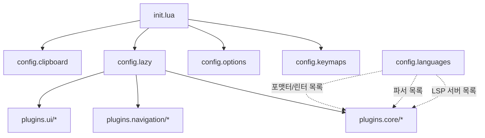
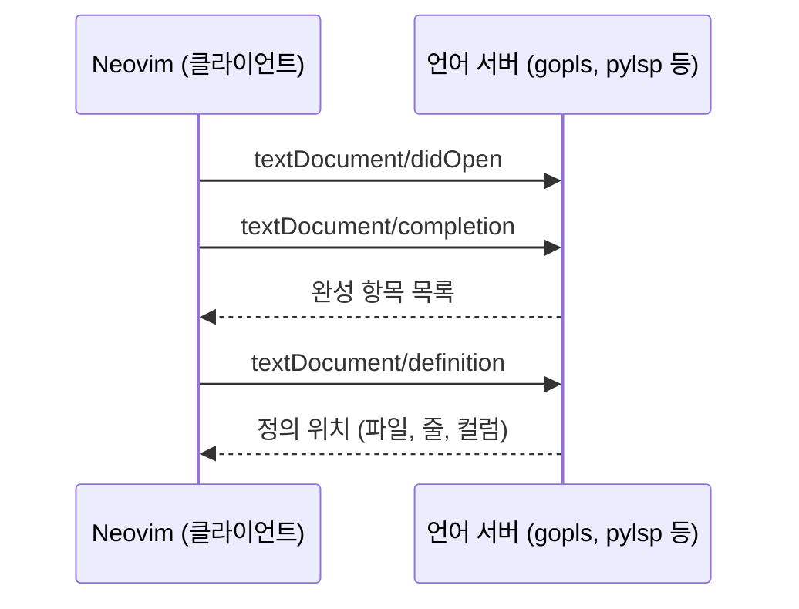
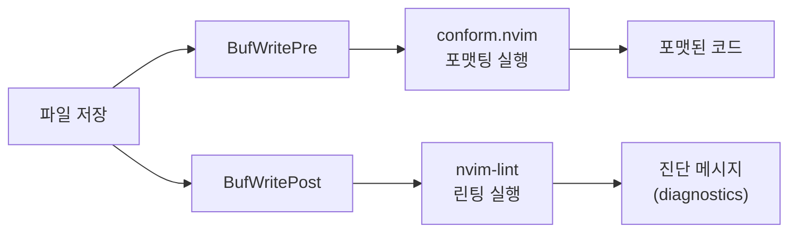

> 본 포스트는 2026-05-11 기준이며,

# Why?

IntelliJ IDEA 를 주력 IDE 로 사용해왔다.

그러나 몇 가지 근본적인 한계가 있었다.

1. **메모리 소모**가 과도했다.

아무 작업도 하지 않은 상태에서 2~3 GB 를 점유했다.

백그라운드에서 인덱싱과 플러그인 서비스가 상시 실행되기 때문이다.

1. **여러 프로젝트와 서버를 넘어가며 개발하는 환경**에는 적합하지 않았다.

또한 Java 만 개발할 때는 너무 편했지만 Java 를 벗어나 Nix, Go, Kubernetes YAML, Bash, Lua, Nginx, Alloy 같은 언어와 설정 파일을 편집하려면 매번 별도 LSP 설정이 필요했다.

IntelliJ 플러그인이 없는 언어는 사실상 일반 텍스트 편집기 수준이었다.

1. **환경 이동성**이 낮았다.

컴퓨터가 바뀌면 IntelliJ 를 설치하고, JetBrains 계정으로 인증하고, 설정을 동기화해야 했다.

WSL 환경에서는 Windows 측 도구만 인식하여 Linux 측 파일과 도구를 읽지 못하는 문제도 있었다.

터미널 기반 에디터는 이 세 가지 문제를 근본적으로 피해간다.

설정 파일을 Git 으로 관리하면 어떤 머신에서든 `git clone` 한 번으로 동일한 개발 환경을 복원할 수 있다.

메모리는 수십 MB 수준이고, LSP 프로토콜을 통해 언어를 가리지 않고 코드 지능을 제공한다.

이에 따라 Neovim 으로 전환하기로 결정했다.

다음은 전환 시점에 IntelliJ 에서 필요했던 기능들을 정리한 체크리스트다.

이 글의 끝에서 현재 어디까지 구현되었는지 다시 확인한다.

| 카테고리          | 필요 기능                                                                    |
| ----------------- | ---------------------------------------------------------------------------- |
| 테마 & UI         | 테마, 상태바, 버퍼 탭, 들여쓰기 가이드                                       |
| 코드 편집         | 정렬, 자동 괄호, 주석 하이라이트, 멀티 커서                                  |
| 파일 탐색         | 파일 검색, 파일 트리, 키맵 가이드, 프로젝트 전환                             |
| 개발 핵심         | LSP, Treesitter, TODO 하이라이트, diagnostics, 린터, 포맷터, 자동 완성, 세션 |
| 디버깅            | DAP, 브레이크포인트, 스택 프레임, 변수 확인                                  |
| Git               | inline blame, diff view, lazygit                                             |
| 터미널 & 유틸리티 | 터미널 통합, 마크다운 프리뷰, AI 어시스턴트                                  |

# What?

## 들어가며 — Vi 에서 Neovim 까지의 계보 :neovim:

Neovim 을 이해하려면 그 뿌리인 Vi 와 Vim 을 먼저 짚어야 한다.

**Vi** 는 1976년 Bill Joy 가 개발한 유닉스 텍스트 편집기다.

명령 모드와 입력 모드를 분리하는 _모달 편집(modal editing)_ 방식을 도입했다.

마우스 없이 키보드만으로 텍스트를 조작하는 이 패러다임이 이후 모든 Vi 계열 편집기의 기반이 된다.

**Vim** (Vi IMproved) 은 1991년 Bram Moolenaar 가 Vi 를 확장하여 만들었다.

다단계 실행 취소, 문법 하이라이팅, 내장 스크립팅 언어인 Vimscript 를 추가했다.

이 기능들로 Vim 은 단순 텍스트 편집기를 넘어 프로그래머의 도구로 자리잡았다.

**Neovim** 은 2014년 Thiago de Arruda 가 Vim 의 코드베이스를 포크하여 시작한 프로젝트다.

핵심 변화는 세 가지다.

1.

비동기 처리를 내장했다.

플러그인이 에디터를 멈추지 않고 백그라운드에서 작업할 수 있다.

1.

설정 언어로 Lua 를 채택했다.

Vimscript 보다 빠르고 범용적인 언어로 플러그인과 설정을 작성할 수 있다.

1. **LSP**(Language Server Protocol), **DAP**(Debug Adapter Protocol), **Treesitter** 같은 표준 프로토콜을 내장 지원한다.

이 세 프로토콜이 Neovim 을 IDE 로 쓸 수 있게 만든 결정적 요인이다.

| 특성               | Vi (1976) | Vim (1991)     | Neovim (2015)             |
| ------------------ | --------- | -------------- | ------------------------- |
| 설정 언어          | ex 명령어 | Vimscript      | Lua (권장) + Vimscript    |
| 비동기 처리        | 없음      | 제한적         | 내장                      |
| 플러그인 생태계    | 없음      | Vimscript 기반 | Lua + 원격 플러그인       |
| LSP/DAP/Treesitter | 없음      | 없음           | 내장 지원                 |
| 내장 터미널        | 없음      | 없음           | 지원                      |
| 라이선스           | 독점적    | Vim 라이선스   | MIT                       |
| 설정 파일          | `.exrc`   | `.vimrc`       | `~/.config/nvim/init.lua` |

> LSP 는 에디터와 언어 서버 사이의 통신 규약이다.

다음 절에서는 Neovim 의 편집 방식인 Vim Motion 을 본다.

## Vim Motion — 동사 + 명사 조합으로 구성한 편집 문법 📜

Vi 계보에서 Neovim 이 어떤 위치인지 확인했다.

이제 이 에디터를 실제로 조작하는 문법을 본다.

Vim 의 편집 명령은 **동사(Verb) + 명사(Noun)** 구조를 따른다.

`d` 는 delete (동사), `iw` 는 inner word (명사)다.

`diw` 를 입력하면 "단어 내부를 삭제한다"는 뜻이 된다.

이 조합 규칙을 익히면 새 명령어를 외우지 않아도 기존 동사와 명사를 결합하여 새로운 편집 동작을 만들 수 있다.

### 동사 (Verb)

| 키  | 동작   | 설명                   |
| --- | ------ | ---------------------- |
| `d` | delete | 삭제 (잘라내기)        |
| `c` | change | 삭제 후 입력 모드 진입 |
| `y` | yank   | 복사                   |
| `v` | visual | 시각적 선택            |
| `>` | indent | 들여쓰기               |

### 명사 (Text Object)

| 키                   | 대상       | 설명                 |
| -------------------- | ---------- | -------------------- |
| `w`                  | word       | 단어                 |
| `p`                  | paragraph  | 문단                 |
| `i`                  | inner      | 안쪽 (구분자 제외)   |
| `a`                  | all/around | 바깥쪽 (구분자 포함) |
| `(`, `## `, `{`, `<` | 괄호       | 괄호 쌍 내부         |
| `"`, `'`, ```        | 따옴표     | 따옴표 쌍 내부       |
| `t`                  | tag        | HTML/XML 태그 쌍     |

### 자주 쓰는 조합

| 명령  | 의미                   | 동작                                     |
| ----- | ---------------------- | ---------------------------------------- |
| `diw` | delete inner word      | 커서 위치 단어 삭제                      |
| `ciw` | change inner word      | 커서 위치 단어를 삭제하고 입력 모드 진입 |
| `dip` | delete inner paragraph | 현재 문단 삭제                           |
| `di{` | delete inner `{`       | 중괄호 안 내용 삭제                      |
| `yiw` | yank inner word        | 커서 위치 단어 복사                      |
| `vi"` | visual inner `"`       | 따옴표 안 내용 선택                      |

### 이동 (Navigation)

| 키                 | 동작             |
| ------------------ | ---------------- |
| `h`, `j`, `k`, `l` | 좌, 하, 상, 우   |
| `숫자 + j/k`       | N 줄 점프        |
| `w` / `b`          | 다음 / 이전 단어 |
| `gg` / `G`         | 파일 처음 / 끝   |
| `0` / `$`          | 줄 처음 / 끝     |

### 기타 필수 키

| 키      | 동작             |
| ------- | ---------------- |
| `.`     | 직전 명령 반복   |
| `u`     | 실행 취소 (undo) |
| `<C-r>` | 다시 실행 (redo) |

> 이 조합들을 외우기보다 반복해서 사용하는 것이 중요하다.

다음 절에서는 이 에디터의 설정을 어떤 디렉토리 구조로 관리하는지 본다.

## 디렉토리 설계 — config 과 plugins 분리를 활용한 관심사 기반 모듈 구성 🗂️

Vim Motion 으로 편집하는 방법을 확인했다.

이제 Neovim 자체를 어떻게 구성하는지 본다.

Neovim 은 `~/.config/nvim/init.lua` 를 진입점으로 사용한다[[2]](https://www.notion.so/vanillacake369/Neovim-20a19c3902908068aca9c95a9aaee77e#fn-2).

이 파일 하나에 모든 설정을 넣을 수도 있지만, 플러그인이 늘어나면 유지보수가 어려워진다.

이 구성에서는 크게 두 계층으로 분리한다.

**config** 는 Neovim 자체 설정이다.

에디터 옵션, 키맵, 클립보드, 언어 정의가 여기에 들어간다.

**plugins** 는 외부 플러그인 설정이다.

기능 목적에 따라 `core`, `navigation`, `ui` 세 디렉토리로 나뉜다.

```
~/.config/nvim
├── init.lua                    # 진입점: 4개 config 모듈 로드
├── lazy-lock.json              # 플러그인 버전 잠금
└── lua
    ├── config
    │   ├── options.lua          # 에디터 옵션 (탭, 줄번호, 줄바꿈)
    │   ├── keymaps.lua          # 중앙 집중 키맵 관리
    │   ├── languages.lua        # 언어별 LSP/포맷터/린터 정의
    │   └── clipboard.lua        # 플랫폼별 클립보드 설정
    └── plugins
        ├── core/                # LSP, 완성, 포맷, 린트, 디버거 등
        ├── navigation/          # 파일 탐색, which-key, 세션
        └── ui/                  # 테마, 버퍼라인, 프리뷰
```

`init.lua` 는 네 줄이 전부다.

```lua
-- ~/.config/nvim/init.lua
require("config.keymaps")
require("config.options")
require("config.lazy")
require("config.clipboard")
```

`config.lazy` 가 로드될 때 lazy.nvim 이 `plugins.core`, `plugins.navigation`, `plugins.ui` 세 디렉토리를 자동으로 스캔하여 플러그인 스펙을 수집한다[[3]](https://www.notion.so/vanillacake369/Neovim-20a19c3902908068aca9c95a9aaee77e#fn-3).

이 구조 덕분에 새 플러그인을 추가할 때는 해당 카테고리 디렉토리에 `.lua` 파일 하나만 넣으면 된다.

다른 파일을 수정할 필요가 없다.

특히 `languages.lua` 는 _단일 진실 원천(Single Source of Truth)_ 역할을 한다.

언어별 LSP 서버, Treesitter 파서, 린터, 포맷터를 한 곳에서 정의하고, 각 플러그인 설정 파일이 이 데이터를 가져다 쓴다.

언어를 추가할 때 `languages.lua` 한 파일만 수정하면 LSP, Treesitter, 린터, 포맷터가 동시에 반영된다.



이 흐름에서 `config.languages` 는 직접 `init.lua` 가 로드하지 않는다.

대신 `plugins/core/lsp.lua`, `plugins/core/treesitter.lua` 등 개별 플러그인 파일이 필요할 때 `require("config.languages")` 로 가져간다.

다음 절에서는 이 디렉토리 구조의 핵심인 lazy.nvim 의 지연 로딩 원리를 본다.

## 플러그인 관리 — lazy.nvim 의 지연 로딩을 활용한 성능 최적화 📞

디렉토리를 나눈 이유를 확인했다.

이제 그 디렉토리를 실제로 읽어들이는 플러그인 매니저 lazy.nvim 의 동작 원리를 본다.

_지연 로딩(lazy loading)_ 이란 플러그인을 Neovim 시작 시 전부 로드하지 않고, 특정 조건이 충족될 때 비로소 로드하는 전략이다.

플러그인 수가 30개를 넘어가면 시작 시간이 체감될 수 있는데, 지연 로딩으로 이를 수백 밀리초 이내로 유지할 수 있다[[4]](https://www.notion.so/vanillacake369/Neovim-20a19c3902908068aca9c95a9aaee77e#fn-4).

lazy.nvim 이 제공하는 주요 지연 로딩 트리거는 세 가지다.

| 트리거  | 설명                       | 예시                         |
| ------- | -------------------------- | ---------------------------- |
| `event` | Neovim 이벤트 발생 시 로드 | `BufReadPre`, `InsertEnter`  |
| `cmd`   | 특정 명령어 실행 시 로드   | `ConformInfo`, `OverseerRun` |
| `keys`  | 특정 키 입력 시 로드       | `<leader>ff`, `<leader>gg`   |
| `ft`    | 특정 파일 타입 열 때 로드  | `java`, `lua`                |

이 구성에서 각 플러그인이 사용하는 트리거를 보면 패턴이 보인다.

```lua
-- LSP: 파일을 열 때 로드
{ "neovim/nvim-lspconfig", event = { "BufReadPre", "BufNewFile" } }

-- 자동 완성: 입력 모드 진입 시 로드
{ "saghen/blink.cmp", event = "InsertEnter" }

-- 포맷터: 저장 직전에 로드
{ "stevearc/conform.nvim", event = { "BufWritePre" } }

-- Java LSP: Java 파일 열 때만 로드
{ "mfussenegger/nvim-jdtls", ft = { "java" } }
```

lazy.nvim 의 부트스트랩 코드는 `config/lazy.lua` 에 있다.

```lua
-- config/lazy.lua (핵심부)
local lazypath = vim.fn.stdpath("data") .. "/lazy/lazy.nvim"
if not (vim.uv or vim.loop).fs_stat(lazypath) then
    vim.fn.system({
        "git", "clone", "--filter=blob:none",
        "https://github.com/folke/lazy.nvim.git",
        "--branch=stable", lazypath,
    })
end
vim.opt.rtp:prepend(lazypath)

require("lazy").setup({
    spec = {
        { import = "plugins.core" },
        { import = "plugins.navigation" },
        { import = "plugins.ui" },
    },
    performance = {
        reset_packpath = false,  -- Nix 플러그인 경로 보존
        rtp = { reset = false }, -- Nix 런타임 경로 보존
    },
})
```

`import` 에 디렉토리 경로를 지정하면 lazy.nvim 이 해당 디렉토리의 모든 `.lua` 파일을 자동으로 스캔한다.

각 파일이 반환하는 테이블이 곧 플러그인 스펙이 된다.

`performance` 블록은 Nix 패키지 매니저 환경에서 필요한 설정이다.

lazy.nvim 은 기본적으로 `runtimepath` 을 초기화하는데, Nix 가 설정한 경로까지 날아가는 것을 방지한다.

다음 절에서는 이 플러그인 시스템 위에 구축된 LSP 와 자동 완성 파이프라인을 본다.

## LSP 와 자동 완성 — lspconfig 와 blink.cmp 를 결합한 편집 환경 ⌨️

lazy.nvim 이 플러그인을 어떻게 관리하는지 확인했다.

이제 개발 생산성의 핵심인 LSP 와 자동 완성 설정을 본다.

### LSP 동작 원리

LSP 는 *클라이언트-서버 모델*로 동작한다.

Neovim 이 클라이언트, 각 언어의 언어 서버가 서버다.

Neovim 은 파일을 열면 해당 언어의 서버를 시작하고, JSON-RPC 로 통신한다.

코드 완성, 정의 이동, 참조 찾기, 리네임 같은 기능을 언어 서버가 제공하고, Neovim 은 그 결과를 UI 로 보여준다.



### languages.lua 에서 서버 관리

`config/languages.lua` 에 모든 언어 설정이 집중되어 있다.

```lua
-- config/languages.lua (Go 예시)
go = {
    lsp_server = "gopls",
    lsp_opts = {
        cmd = { "gopls" },
        filetypes = { "go", "gomod", "gowork", "gotmpl" },
        settings = {
            gopls = {
                usePlaceholders = true,
                completeUnimported = true,
                staticcheck = true,
            },
        },
    },
    treesitter = { "go", "gomod", "gowork", "gosum" },
    linters = { "golangcilint" },
    formatters = { "goimports", "gofmt" },
},
```

`lsp.lua` 는 이 데이터를 `collect_lsp_servers()` 로 수집하여 각 서버를 자동 등록한다.

서버 바이너리가 `PATH` 에 존재하는지 확인한 뒤에만 활성화하므로, 설치되지 않은 언어 서버로 인한 오류를 방지한다.

현재 지원하는 언어는 다음과 같다.

| 언어          | LSP 서버    | 포맷터            | 린터            |
| ------------- | ----------- | ----------------- | --------------- |
| Python        | pylsp       | ruff              | ruff            |
| Java          | jdtls       | clang-format      | -               |
| Go            | gopls       | goimports, gofmt  | golangcilint    |
| TypeScript/JS | ts_ls       | biome             | biomejs         |
| Nix           | nixd        | alejandra         | statix, deadnix |
| Lua           | lua_ls      | stylua            | selene          |
| YAML          | yamlls      | prettier, yamlfmt | yamllint        |
| Bash          | bashls      | shfmt             | shellcheck      |
| Terraform     | terraformls | terraform_fmt     | tflint          |
| C/C++         | clangd      | -                 | -               |
| HTML          | html        | prettier          | -               |
| CSS           | cssls       | prettier          | -               |
| JSON          | jsonls      | prettier          | -               |

Java 는 일반 LSP 와 다르게 **nvim-jdtls** 플러그인을 별도로 사용한다.
JDTLS 는 Eclipse 기반 언어 서버로, Lombok JAR 동적 감지, 프로젝트별 워크스페이스 분리, Gradle/Maven 루트 자동 감지 같은 Java 특화 로직이 필요하기 때문이다[[5]](https://www.notion.so/vanillacake369/Neovim-20a19c3902908068aca9c95a9aaee77e#fn-5).

### blink.cmp 자동 완성

자동 완성은 **blink.cmp** 가 담당한다.

LSP, 스니펫, 파일 경로, 버퍼 단어, Copilot 을 하나의 완성 메뉴로 통합한다.

```lua
-- auto-complete.lua (소스 설정 핵심부)
sources = {
    default = { "lazydev", "lsp", "path", "snippets", "buffer", "copilot" },
    providers = {
        copilot = {
            name = "copilot",
            module = "blink-copilot",
            score_offset = 100,  -- Copilot 제안을 상위에 표시
            async = true,
        },
    },
},
```

_ghost text_ 기능을 활성화하면 커서 위치에 반투명한 제안 텍스트가 인라인으로 표시된다.

IntelliJ 의 자동 완성 팝업과 유사한 경험을 터미널에서 제공한다.

주요 완성 키맵은 다음과 같다.

| 키                  | 동작                  |
| ------------------- | --------------------- |
| `<C-y>`             | 완성 항목 수락        |
| `<Tab>` / `<S-Tab>` | 다음 / 이전 항목 이동 |
| `<C-Space>`         | 완성 메뉴 표시        |
| `<C-k>`             | 시그니처 도움말 토글  |
| `<C-d>` / `<C-u>`   | 문서 스크롤           |

다음 절에서는 코드를 저장할 때 자동으로 실행되는 포맷/린트 파이프라인을 본다.

## 코드 품질 — conform 과 nvim-lint 를 활용한 저장 시 자동 포맷/린트 🖋️

LSP 와 자동 완성으로 코드를 작성하는 흐름을 확인했다.

이제 작성한 코드의 품질을 자동으로 유지하는 파이프라인을 본다.

이 구성에서는 **포맷팅**과 **린팅**을 분리하여 처리한다.

포맷팅은 코드 스타일 (들여쓰기, 줄바꿈, 정렬) 을 통일하고, 린팅은 잠재적 버그나 안티패턴을 감지한다.



### conform.nvim — 포맷터

**conform.nvim** 은 `BufWritePre` 이벤트에 반응하여 저장 직전에 포맷터를 실행한다[[6]](https://www.notion.so/vanillacake369/Neovim-20a19c3902908068aca9c95a9aaee77e#fn-6).

포맷터 목록은 `languages.lua` 에서 `collect_formatters()` 로 가져온다.

각 포맷터의 세부 옵션도 같은 파일에서 관리한다.

```lua
-- format.lua (포맷터 옵션 예시)
["google-java-format"] = {
    prepend_args = {
        "--aosp",                    -- 4칸 들여쓰기
        "--skip-reflow-long-strings", -- 긴 문자열 줄바꿈 방지
        "--skip-javadoc-formatting",  -- JavaDoc 포맷 방해 방지
    },
},
["yamlfmt"] = {
    prepend_args = {
        "-formatter", "retain_line_breaks=true",
        "-formatter", "scan_folded_as_literal=true",
        "-formatter", "include_document_start=true",
    },
},
```

`format_on_save` 옵션으로 700ms 타임아웃을 설정하여, 포맷터가 느린 경우에도 저장이 블록되지 않도록 한다.

### nvim-lint — 린터

**nvim-lint** 는 `BufWritePost`, `BufReadPost`, `InsertLeave` 세 이벤트에 반응한다[[7]](https://www.notion.so/vanillacake369/Neovim-20a19c3902908068aca9c95a9aaee77e#fn-7).

포맷터와 달리 파일 저장 *후*에 실행되어 진단 메시지를 표시한다.

```lua
-- lint.lua (핵심부)
lint.linters_by_ft = lang.collect_linters()

vim.api.nvim_create_autocmd(
    { "BufWritePost", "BufReadPost", "InsertLeave" },
    {
        callback = function()
            require("lint").try_lint()
        end,
    }
)
```

린터별 커스텀 설정도 가능하다.

예를 들어 `yamllint` 는 nvim 설정 디렉토리의 `.yamllint` 파일을, `selene` 은 `selene.toml` 을 참조한다.

다음 절에서는 파일 탐색과 키맵 관리 방식을 본다.

## 탐색과 키맵 — snacks.nvim 과 which-key 를 활용한 검색 기반 워크플로우 🔍

포맷/린트 파이프라인으로 코드 품질 자동화를 확인했다.

이제 파일을 찾고, 기능을 실행하는 탐색 계층을 본다.

### snacks.nvim — 통합 탐색 도구

**snacks.nvim** 은 파일 탐색기, 피커(fuzzy finder), 터미널, UI 토글 등을 하나의 플러그인으로 통합한다[[8]](https://www.notion.so/vanillacake369/Neovim-20a19c3902908068aca9c95a9aaee77e#fn-8).

파일 검색, 심볼 검색, grep, 버퍼 목록, 프로젝트 전환을 모두 동일한 인터페이스로 제공한다.

| 키맵              | 동작                   |
| ----------------- | ---------------------- |
| `<leader><space>` | 스마트 파일 찾기       |
| `<leader>ff`      | 파일 검색              |
| `<leader>fg`      | 텍스트 grep            |
| `<leader>fb`      | 열린 버퍼 목록         |
| `<leader>fr`      | 최근 파일              |
| `<leader>fp`      | 프로젝트 전환          |
| `<leader>fs`      | 워크스페이스 심볼 검색 |
| `<leader>e`       | 파일 탐색기            |
| `<C-/>`           | 터미널 토글            |

IntelliJ 의 `Ctrl+Shift+N` (파일 검색), `Ctrl+Alt+O` (심볼 검색), `Ctrl+Shift+F` (전체 검색) 에 대응하는 기능들이다.

### keymaps.lua — 중앙 집중 키맵 관리

이 구성의 키맵 설계에서 주목할 점은 **모든 키맵을 \*\***`keymaps.lua`\***\* 한 파일에서 정의**한다는 것이다.

```lua
-- keymaps.lua (구조 핵심)
M.definitions = {
    lsp      = { name = "+LSP Go-to",   prefix = nil,        ... },
    code     = { name = "+Code",         prefix = "<leader>c", ... },
    git      = { name = "+Git",          prefix = "<leader>g", ... },
    debug    = { name = "+Debug",        prefix = "<leader>d", ... },
    find     = { name = "+Find",         prefix = "<leader>f", ... },
    buffer   = { name = "+Buffer",       prefix = "<leader>b", ... },
    window   = { name = "+Window",       prefix = "<leader>w", ... },
    runner   = { name = "+Runner",       prefix = "<leader>r", ... },
    ...
}
```

각 플러그인 파일은 `keymaps.get_keys("그룹명")` 으로 자기에게 해당하는 키맵만 가져간다.

이 패턴의 장점은 두 가지다.

첫째, 키 충돌을 한 파일에서 관리할 수 있다.

둘째, which-key 스펙을 `get_which_key_spec()` 으로 자동 생성할 수 있다.

### which-key — 키바인딩 발견

**which-key.nvim** 은 리더 키(`Space`)를 누른 후 잠시 대기하면 가능한 모든 키 조합을 팝업으로 보여준다.

`keymaps.lua` 의 그룹 정의에서 `prefix` 와 `name` 을 자동으로 읽어와 카테고리별로 표시한다.

새 키맵을 외우지 않아도 팝업을 보고 찾을 수 있다.

`<leader>?` 를 누르면 현재 버퍼에 적용된 모든 로컬 키맵을 확인할 수 있다.

다음 절에서는 현재까지 구현한 기능들의 총정리를 본다.

## 현재 적용된 기능 총정리 🧑‍🍳

처음 IntelliJ 에서 전환할 때 정리했던 필요 기능 체크리스트를 현재 상태와 대조한다.

### 테마 & UI/UX

| 기능                 | 상태 | 구현                              |
| -------------------- | ---- | --------------------------------- |
| 테마                 | ✅   | material.nvim (darker)            |
| 상태바 (statusline)  | ✅   | lualine.nvim (미니멀 mode-only)   |
| 버퍼 탭 (bufferline) | ✅   | bufferline.nvim + LSP diagnostics |
| 들여쓰기 가이드      | ✅   | snacks.nvim indent                |
| 스크롤바             | ❌   | 미적용                            |

### 코드 편집

| 기능                     | 상태 | 구현                             |
| ------------------------ | ---- | -------------------------------- |
| 텍스트 정렬 (easy-align) | ✅   | vim-easy-align (`<leader>a`)     |
| 자동 괄호                | ✅   | nvim-autopairs + nvim-ts-autotag |
| 주석 하이라이트          | ✅   | todo-comments.nvim               |
| 멀티 커서                | ✅   | vim-visual-multi                 |
| 주석 토글                | ✅   | Comment.nvim (`gc`, `gb`)        |

### 파일 탐색 & 네비게이션

| 기능          | 상태 | 구현                 |
| ------------- | ---- | -------------------- |
| 파일 검색     | ✅   | snacks.nvim picker   |
| 파일 트리     | ✅   | snacks.nvim explorer |
| 키맵 가이드   | ✅   | which-key.nvim       |
| 프로젝트 전환 | ✅   | snacks.nvim projects |
| 세션 관리     | ✅   | auto-session.nvim    |

### 개발 핵심 기능

| 기능                   | 상태 | 구현                                |
| ---------------------- | ---- | ----------------------------------- |
| LSP (코드 지능)        | ✅   | nvim-lspconfig + 13개 언어 서버     |
| Treesitter (구문 강조) | ✅   | nvim-treesitter + 20개 이상 파서    |
| TODO/FIXME 하이라이트  | ✅   | todo-comments.nvim                  |
| Diagnostics 모음       | ✅   | trouble.nvim                        |
| 린터                   | ✅   | nvim-lint + 8개 린터                |
| 포맷터                 | ✅   | conform.nvim + 12개 포맷터          |
| 자동 완성              | ✅   | blink.cmp (LSP + snippet + Copilot) |
| 코드 액션              | ✅   | tiny-code-action.nvim               |
| 리팩토링               | ✅   | refactoring.nvim                    |

### 디버깅

| 기능           | 상태 | 구현                                  |
| -------------- | ---- | ------------------------------------- |
| DAP (디버거)   | ✅   | nvim-dap (Go: Delve, Python: debugpy) |
| 디버그 UI      | ✅   | nvim-dap-ui                           |
| 브레이크포인트 | ✅   | `<leader>dt`                          |

### Git 통합

| 기능              | 상태 | 구현                      |
| ----------------- | ---- | ------------------------- |
| Inline blame      | ✅   | gitsigns.nvim             |
| Git diff          | ✅   | snacks.nvim git_diff      |
| lazygit           | ✅   | snacks.nvim terminal 연동 |
| 파일 히스토리     | ✅   | snacks.nvim git_log_file  |
| 브라우저에서 열기 | ✅   | snacks.nvim gitbrowse     |

### 터미널 & 유틸리티

| 기능               | 상태 | 구현                                 |
| ------------------ | ---- | ------------------------------------ |
| 터미널 통합        | ✅   | snacks.nvim terminal (`<C-/>`)       |
| 마크다운 프리뷰    | ✅   | render-markdown.nvim                 |
| AI 어시스턴트      | ✅   | copilot.lua + blink-copilot          |
| 코드 러너          | ✅   | overseer.nvim (다국어 + Spring Boot) |
| 프로젝트 검색/치환 | ✅   | nvim-spectre                         |
| 이미지 붙여넣기    | ✅   | img-clip.nvim                        |
| Spring Initializr  | ✅   | spring-initializer.nvim              |

### 성능

| 기능             | 상태 | 구현                               |
| ---------------- | ---- | ---------------------------------- |
| 지연 로딩        | ✅   | lazy.nvim (event/cmd/ft/keys 기반) |
| 대용량 파일 처리 | ✅   | snacks.nvim bigfile                |
| 빠른 파일 열기   | ✅   | snacks.nvim quickfile              |

처음 체크리스트에서 목표했던 기능 대부분이 구현되었다.

스크롤바 정도만 미적용 상태이며, IntelliJ 에서 제공하던 핵심 개발 워크플로우는 모두 터미널 위에서 동작한다.

# How? 어떻게 씀?

## 환경 준비

Neovim 0.10 이상이 필요하다.

inlay hints, 신규 LSP API 등 이 구성이 사용하는 기능들이 0.10+ 에서 추가되었기 때문이다.

```bash
# macOS
brew install neovim

# Nix
nix profile install nixpkgs#neovim

# Linux (Ubuntu/Debian)
sudo apt install neovim
```

설정 파일을 클론한다.

```bash
git clone https://github.com/vanillacake369/tonys-nvim ~/.config/nvim
```

최초 실행 시 lazy.nvim 이 자동으로 부트스트랩되고, 모든 플러그인을 다운로드한다.

```bash
nvim
```

LSP 서버, 포맷터, 린터는 별도로 설치해야 한다.

이 구성에서는 Nix 로 관리하고 있으나, 각 도구의 공식 설치 방법을 따라도 무방하다.

`PATH` 에 바이너리가 있으면 자동으로 인식한다.

## 실습 1 — lazy.nvim 부트스트랩과 첫 플러그인

새 플러그인을 추가하는 과정을 따라해본다.

1. `lua/plugins/ui/` 디렉토리에 새 파일을 만든다.

```lua
-- lua/plugins/ui/example.lua
return {
    "folke/noice.nvim",
    event = "VeryLazy",
    opts = {},
}
```

1. Neovim 을 재시작하거나 `:Lazy` 를 실행한다.
2. lazy.nvim 이 자동으로 플러그인을 감지하고 설치한다.

`import` 디렉토리에 파일을 넣는 것만으로 플러그인이 등록된다.

별도의 설정 파일 수정이 필요 없다.

## 실습 2 — LSP 서버 추가와 코드 점프

새 언어의 LSP 서버를 추가하는 과정이다.

1. `config/languages.lua` 에 언어 블록을 추가한다.

```lua
rust = {
    lsp_server = "rust_analyzer",
    lsp_opts = {
        cmd = { "rust-analyzer" },
        filetypes = { "rust" },
    },
    treesitter = { "rust" },
    formatters = { "rustfmt" },
},
```

1. `rust-analyzer` 바이너리를 설치한다.
2. `.rs` 파일을 열면 LSP 가 자동으로 연결된다.
3. 다음 키맵으로 코드 탐색을 확인한다.

| 키    | 동작        |
| ----- | ----------- |
| `gd`  | 정의로 이동 |
| `grr` | 참조 목록   |
| `K`   | 문서 팝업   |
| `grn` | 심볼 리네임 |

## 실습 3 — 포맷/린트 파이프라인 구성

포맷터와 린터를 추가하는 과정이다.

1. `config/languages.lua` 에서 해당 언어의 `formatters` 와 `linters` 필드를 설정한다.

이미 실습 2 에서 Rust 를 추가했다면 `formatters = { "rustfmt" }` 가 설정된 상태다.

1. `format.lua` 에서 포맷터 옵션을 추가할 수 있다.

```lua
["rustfmt"] = {
    prepend_args = { "--edition", "2021" },
},
```

1. `.rs` 파일을 저장하면 `rustfmt` 가 자동으로 실행된다.

`:ConformInfo` 명령으로 현재 파일에 적용된 포맷터를 확인할 수 있다.

## 실습 4 — Copilot 자동완성 연동

GitHub Copilot 을 blink.cmp 와 연동하는 과정이다.

1. Copilot 인증을 수행한다.

```
:Copilot auth
```

브라우저에서 GitHub 인증을 완료하면 `~/.config/github-copilot/` 에 자격 증명이 저장된다.

1. 이 구성에서는 `blink-copilot` 모듈이 이미 설정되어 있다.

`score_offset = 100` 으로 Copilot 제안이 완성 메뉴 상위에 표시된다.

1. 아무 파일에서 코드를 입력하면 ghost text 로 Copilot 제안이 표시된다.

`<C-y>` 로 수락한다.

프로젝트 루트에 `.copilot-disable` 파일을 만들면 해당 프로젝트에서 Copilot 을 비활성화할 수 있다.

## 실습 5 — DAP 브레이크포인트 디버깅

Go 파일에서 디버깅하는 과정이다.

1. `delve` 디버거를 설치한다.

```bash
go install github.com/go-delve/delve/cmd/dlv@latest
```

1. Go 파일을 열고 브레이크포인트를 설정한다.

```
<leader>dt    → 현재 줄에 브레이크포인트 토글
```

1. 디버깅을 시작한다.

```
<leader>dc    → Start/Continue
```

1.

DAP UI 가 자동으로 열리며, 변수 값, 콜 스택, 브레이크포인트 목록이 표시된다.

| 키맵         | 동작                |
| ------------ | ------------------- |
| `<leader>dc` | 시작 / 계속         |
| `<leader>dt` | 브레이크포인트 토글 |
| `<leader>di` | Step Into           |
| `<leader>do` | Step Over           |
| `<leader>dT` | 종료                |
| `<leader>du` | DAP UI 토글         |

# 끝맺음

IntelliJ 에서 Neovim 으로 전환하면서 필요했던 기능 대부분을 Lua 설정과 플러그인 조합으로 구현했다.

핵심은 세 가지 설계 원칙이었다.

첫째, **관심사 분리** — config 과 plugins 를 나누고, plugins 를 core/navigation/ui 로 분류했다.

둘째, **단일 진실 원천** — `languages.lua` 에 모든 언어 설정을 집중하여 LSP, Treesitter, 린터, 포맷터가 한 파일에서 관리된다.

셋째, **중앙 집중 키맵** — `keymaps.lua` 에서 모든 키맵을 정의하고, 각 플러그인이 필요한 키맵만 가져가는 패턴을 적용했다.

이 구성은 계속 발전 중이다.

전체 소스 코드는 GitHub 에서 확인할 수 있다.

> [https://github.com/vanillacake369/tonys-nvim](https://github.com/vanillacake369/tonys-nvim)

[^1]: https://microsoft.github.io/language-server-protocol/ <https://microsoft.github.io/language-server-protocol/>

[^2]: https://neovim.io/doc/user/lua-guide.html#lua-guide-config <https://neovim.io/doc/user/lua-guide.html#lua-guide-config>

[^3]: https://lazy.folke.io/spec#spec-import <https://lazy.folke.io/spec#spec-import>

[^4]: https://lazy.folke.io/ <https://lazy.folke.io/>

[^5]: https://github.com/mfussenegger/nvim-jdtls <https://github.com/mfussenegger/nvim-jdtls>

[^6]: https://github.com/stevearc/conform.nvim <https://github.com/stevearc/conform.nvim>

[^7]: https://github.com/mfussenegger/nvim-lint <https://github.com/mfussenegger/nvim-lint>

[^8]: https://github.com/folke/snacks.nvim <https://github.com/folke/snacks.nvim>
