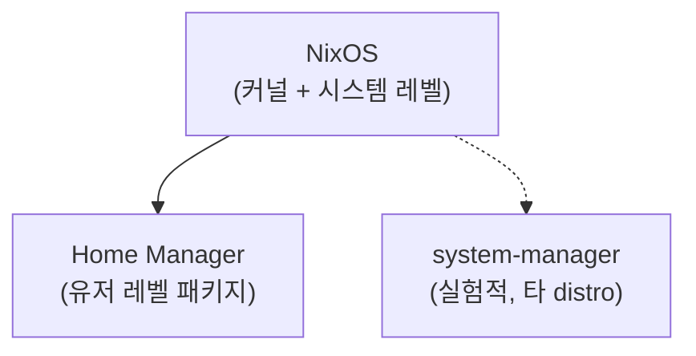

# Why — 왜 Nix인가 📜


>
> Nix를 알게 된 계기는 이 한 문장이었다.
>
> "회사 컴퓨터, 게이밍 PC, 홈서버, 클라우드 서버의 모든 환경설정을 하나의 파일로 획일화해서 관리할 수 없을까?"

보통 서버를 구성할 때는 특정 linux distro 위에 환경설정을 올려야 하는 경우가 많다. Linux가 현존하는 OS 중 가장 가볍고 사용자 풀이 넓기 때문이다.

문제는 linux distro마다 서로 다른 패키지 패밀리 시스템을 갖는다는 점이다. debian에서 패키지를 설치하려면 `apt`를 쓰지만, fedora에서는 `dnf`를 써야 한다. 즉, 체계 자체가 다르다.


이러한 이질성 때문에 "내 컴퓨터에서는 잘 돌아가는데?" 하는 상황이 빈번하게 발생한다. 같은 패키지를 설치하더라도 distro별로 다른 처리가 필요하고, 그 차이를 일일이 메워야 한다. ~~docker, k8s 같은 가상 컨테이너라면 문제가 없겠지만, 여기서는 kernel 환경 그 자체를 이야기한다~~


Nix는 이 문제를 해결하기 위한 DSL이다. 시스템 환경과 독립된 위치에 의존성을 격리하여 관리하고, 어느 linux distro에서든 동일한 패키지 의존성을 설치·관리할 수 있게 해 준다. `.sh`로 명령형 패키징을 처리하던 방식과 달리, YAML처럼 선언형으로 파일을 작성해 멱등적 패키징 — 공식 용어로는 **reproducible build** — 을 달성한다. ~~이러한 이유로 시스템 권한이 필요한 패키지들은 관리자 권한으로 따로 처리해야 한다~~

---

# Nix의 핵심 개념 💁‍♂️


>
> 아래는 Nix의 내부 코어 컴포넌트들에 대한 간략한 소개다. 중요한 부분만 추렸으며 세부 개념은 생략했다. 필자는 아래를 읽기보다 아래 튜토리얼을 스텝바이스텝으로 따라가길 권한다 — 따라가다 보면 아래를 볼 필요가 없을 만큼 자연스럽게 이해된다.
>
> - https://zero-to-nix.com/start/
> - https://github.com/evertras/simple-homemanager

## Nix는 함수형 언어다 🧮

Nix는 `flake.nix`를 통해 패키지 매니저 구성을 처리한다. `flake.nix` 파일은 기본적으로 `inputs`와 `outputs` 두 개의 속성을 가진 **속성 집합(attribute set)**이다.

Nix는 "조금 더 명세된 JSON"이라 할 만큼 JSON과 유사한 함수형 언어다. 입력·바디·출력으로 구성되며, `let`으로 입력값을 선언하고 `in`으로 함수를 람다 형태로 기술한다. 코드를 대충 훑어봐도 "아, 이렇게 굴러가겠구나" 싶을 것이다.

```nix
# 단순 람다
x: x + 1
# value => <LAMBDA>
```

```nix
# let-in으로 람다에 이름 붙이기
let
  f = x: x + 1;
in f
# value => <LAMBDA>
```

```nix
# 람다 적용
let
  f = x: x + 1;
in f 1
# value => 2
```

```nix
# attribute set을 인자로 받기
let
  f = x: x.a;
in
f { a = 1; }
# value => 1
```

```nix
# let 바인딩 순서는 상관없다
let
  b = a + 1;
  a = 1;
in
a + b
# value => 3
```

이처럼 Nix 언어는 평가 순서에 구애받지 않는 lazy한 함수형 언어이기 때문에, 의존성 선언 순서를 신경 쓰지 않아도 된다.

## Flake 🗂️

Nix에는 npm의 `package.json` + `package-lock.json`에 해당하는 설정 파일이 있다. 그것이 바로 **flake**다. Flake는 Nix가 패키지 매니징 설정을 참조하는 파일로, 함수형으로 선언되며 `inputs`와 `outputs` 두 속성으로 처리된다[^1].

### inputs 속성

- `inputs`는 패키지 매니저인 home-manager에 대한 세팅의 입력값이다.
- GitHub 등의 URL을 통해 입력값들을 가져온다.

```nix
# ./flake.nix
{
  description = "Custom basic linux configuration";

  inputs = {
    nixpkgs.url = "github:nixos/nixpkgs/nixos-unstable";

    home-manager = {
      url = "github:nix-community/home-manager";
      inputs.nixpkgs.follows = "nixpkgs";
    };
  };
  # ...
}
```

### outputs 속성

- `outputs`는 함수(function)이며, Nix가 `inputs`의 내용을 가져온 후 실행된다.
- 즉, Nix는 `inputs`에 있는 다른 Flake들의 `flake.nix` 파일을 불러온 후 `outputs` 함수를 실행하고 그 결과를 반환한다.
- `outputs`의 반환값은 Flake가 원하는 어떤 형태든 될 수 있다.

```nix
# ./flake.nix
{
  description = "Custom basic linux configuration";

  inputs = {
    # ...
  };

  outputs = { self, nixpkgs, home-manager, system-manager, ... }:
    let
      lib = nixpkgs.lib;
      system = "x86_64-linux";
      pkgs = import nixpkgs { inherit system; };
      pkgsAllowUnfree = import nixpkgs {
        inherit system;
        config.allowUnfree = true;
      };
    in {
      homeConfigurations = {
        $USER = home-manager.lib.homeManagerConfiguration {
          inherit pkgs;
          modules = [ ./home.nix ];
        };
      };
    };
}
```

## Home Manager 🏠

**Home Manager**는 **Nix 패키지 매니저**를 이용해 **사용자 환경을 관리**하는 시스템이다[^2].

1. **소프트웨어를 선언적으로 설치** — 사용자 프로필에 소프트웨어를 선언적 방식으로 설치한다.
2. **Dotfile 관리** — 사용자 홈 디렉토리의 설정 파일(dotfiles)을 함께 관리할 수 있다.

## Home Manager는 NixOS의 부분집합이다 🔍

Home Manager는 flake & nix를 기반으로 패키지들을 처리하는 매니저이며, 여러 linux distro에 대한 패키지 매니징을 처리하는 NixOS 산하의 컴포넌트다.

중요한 점은 Home Manager가 **system level로 제어하지 않는다**는 것이다. Home Manager는 linux distro 커널과 독립적으로 패키지를 관리하기 때문에, system config에 대한 권한을 요구하지도 관리하지도 않는다. 따라서 system level로 패키지를 관리하고 싶다면 NixOS로 영역을 넓혀야 한다. 최근에는 [system-manager](https://github.com/numtide/system-manager)처럼 여러 linux distro에 대해 system level 제어까지 지원하는 시도도 이루어지고 있다.

이 개념적 관계를 도식으로 표현하면 다음과 같다.



---

# Nix 설치 및 Hello World 🚀

## Install Nix

[공식 문서](https://nixos.org/download/)를 참고하여 WSL에서 Nix를 다운로드한다[^3].

> **Single-User vs Multi-User 차이**
>
> _TL;DR: 웬만하면 Multi-User를 사용하자_
>
> | Feature                        | **Single-User**          | **Multi-User**                     |
> | ------------------------------ | ------------------------ | ---------------------------------- |
> | **Best for**                   | Personal use, WSL        | Multi-user systems, shared use     |
> | **Security**                   | Less secure              | More secure (privilege separation) |
> | **System-Wide Installation**   | No                       | Yes                                |
> | **Users Can Share Packages**   | No                       | Yes                                |
> | **Requires Root to Install**   | No                       | Yes                                |
> | **Requires nix-daemon**        | No                       | Yes                                |
> | **Recommended for Nix Flakes** | Not ideal                | Yes                                |
> | **`nix.conf` Location**        | `~/.config/nix/nix.conf` | `/etc/nix/nix.conf`                |

```bash
sh <(curl -L https://nixos.org/nix/install) --daemon
```

Flakes를 사용하기 위해 아래 conf 파일을 열고,

```bash
sudo vi /etc/nix/nix.conf
```

다음 내용을 추가한다.

```ini
build-users-group = nixbld

# Enable experimental features
experimental-features = nix-command flakes ca-derivations recursive-nix
```

이후 nix-daemon과 shell을 재시작한다.

```bash
sudo systemctl restart nix-daemon
exec $SHELL
```

설치가 잘 되었는지 확인한다.

```bash
nix shell nixpkgs#hello --command hello
# Hello, world!
```

## Install Home Manager

아래 공식 문서를 통해 설치한다[^4].

https://nix-community.github.io/home-manager/index.xhtml#ch-installation

설치 이후 아래를 본인이 사용하는 shell의 설정파일(`~/.bashrc`, `~/.zshrc`)에 반드시 추가하자. 이 한 줄이 없으면 Home Manager가 관리하는 환경변수들이 shell에서 인식되지 않는다.

```bash
# This must be sourced in your .bashrc or whatever shell you're using.
source $HOME/.nix-profile/etc/profile.d/hm-session-vars.sh
```

## Hello World — flake.nix & home.nix 🌍

우선 아래 파일들을 선언하고 Hello World를 돌려본다. "이게 뭐지?" 하고 찾아볼 생각은 하지 말자. Nix는 생각보다 개념이 복잡하고 깊다. 도커·쿠버네티스 공부한다 생각하고 일단 따라해보자.

`flake.nix`

```nix
{
  description = "very basic flake";

  inputs = {
    nixpkgs.url = "github:nixos/nixpkgs/nixos-unstable";

    home-manager = {
      url = "github:nix-community/home-manager";
      inputs.nixpkgs.follows = "nixpkgs";
    };
  };

  outputs = { self, nixpkgs, home-manager, ... }:
    let
      lib = nixpkgs.lib;
      system = "x86_64-linux";
      pkgs = import nixpkgs { inherit system; };
    in {
      homeConfigurations = {
        # Replace ${username} with your actual linux username
        "${username}" = home-manager.lib.homeManagerConfiguration {
          inherit pkgs;
          modules = [ ./home.nix ];
        };
      };
    };
}
```

`home.nix`

```nix
{ lib, pkgs, ... }:
{
  # Enable home-manager after install
  programs.home-manager.enable = true;

  home = {
    # Install packages from https://search.nixos.org/packages
    packages = with pkgs; [
      hello
    ];

    # Replace ${username} with your actual linux username
    username = "${username}";
    homeDirectory = "/home/${username}";

    # Don't ever change this after the first build.
    # It tells home-manager what the original state schema was,
    # so it knows how to go to the next state. It should NOT update
    # when you update your system!
    stateVersion = "23.11";
  };
}
```

`Makefile`

```makefile
.PHONY: update
update:
		home-manager switch --flake .#limjihoon

.PHONY: clean
clean:
		nix-collect-garbage -d
```

주의사항 — 반드시 지켜야 한다.

- `flake.nix`, `home.nix`의 username을 실제 linux username으로 치환하자. 그렇지 않으면 해당 username에 해당하는 경로를 찾지 못해 패키지를 설치할 수 없다.
- `flake.nix`에서 linux distro 아키텍처(예: `"x86_64-linux"`)를 지정할 것. 지정하지 않으면 target system을 알 수 없어 빌드가 깨진다.
- `home.nix`에서 `stateVersion`을 지우거나 변경하지 말 것. 초기에 설정된 stateVersion은 이후 변경하면 안 된다 — 설치된 다른 패키지들과 버저닝을 맞추기 위함이다[^5].
- `home.nix`에서 `programs.home-manager.enable = true;`를 지우지 말 것. `home-manager switch`를 실행하면 `home.nix`의 패키지 목록만 유지되는데, home-manager 자체가 목록에 없으면 GC 중에 제거된다.

## git에 추가해야 Nix가 동작한다 🗃️

여기까지 따라온 사람은 파일만 가지고는 동작이 안 된다는 것을 알게 될 것이다. **Nix는 git 저장소에 추가되지 않은 모든 것을 완전히 무시한다.**

이것은 사실 장점이다 — 모든 것을 git에 동기화하게끔 강제하여 reproducible build를 보장할 수 있기 때문이다. 따라서 모든 파일을 `git add`하고 `make` 명령어로 Nix 패키지를 받아오자.

```bash
git add .
make
# 또는 필자처럼 just를 사용한다면:
just update
```

제대로 나오는 것을 볼 수 있을 것이다!


---

# 실전 적용 🧑‍💻

> Hello World까지 출력했으니 이제 응용할 차례다. 필자는 선호하는 설정에 따라 아래와 같이 구성했다.
>
> 예제 코드 전체는 https://github.com/vanillacake369/nix-tutorial 에서 확인할 수 있다.

- just
- fzf
- zsh + powerlevel10k
- neovim + spacevim
- podman (~~docker~~) + podman-tui
- kubernetes: minikube, k9s

## zsh 설정 🐚

### 기본 쉘 지정

Nix는 system level 패키지 설치가 아닌 별도의 공간에서 패키지 매니징을 처리한다. 따라서 zsh 의존성을 추가하더라도 자동으로 기본 쉘로 지정되지 않는다. 기본 쉘로 등록하려면 `chsh -s`가 필요하므로, `justfile`에 해당 step을 추가했다.

```shell
# Apply zsh
apply-zsh:
  exec zsh
  chsh -s /home/limjihoon/.nix-profile/bin/zsh
```

### 테마 지정

테마로 `powerlevel10k`를 사용하려면, Nix에서 가져온 `powerlevel10k`를 `zsh` 설정 안에서 source하도록 처리해야 한다. 아래처럼 `initExtra`의 script에서 직접 의존하게 설정했다.

### shell 변경에 따른 loginctl 호출

Nix를 통해 shell을 강제로 바꾸면 [user가 logout한 것으로 판단해 session 값을 날린다](https://unix.stackexchange.com/questions/162900/what-is-this-folder-run-user-1000). 이때 시스템 프로세스와 user 관련 정보를 담고 있는 `/run/user/1000`이 삭제되어 패키지들이 제대로 동작하지 않게 된다. 이를 방지하기 위해 session이 없으면 `loginctl enable-linger`을 호출하도록 처리했다.

```nix
# zsh.nix
{ pkgs, ... }: {
  home.packages = with pkgs; [
    zsh-autoenv
    zsh-powerlevel10k
  ];

  programs = {
    zsh = {
      enable = true;
      enableCompletion = true;
      autosuggestion.enable = true;
      syntaxHighlighting.enable = true;

      shellAliases = {
        ll = "ls -l";
        kctx = "kubectx";
        kns = "kubens";
        k = "kubectl";
        ka = "kubectl get all -o wide";
        ks = "kubectl get services -o wide";
        kap = "kubectl apply -f ";
      };

      oh-my-zsh = {
        enable = true;
        plugins = [ "git" "kubectl" "kube-ps1" ];
        theme = "powerlevel10k/powerlevel10k";
      };

      initExtra = ''
        # Powerlevel10k instant prompt
        if [[ -r "''${XDG_CACHE_HOME:-''$HOME/.cache}/p10k-instant-prompt-''${(%):-%n}.zsh" ]]; then
          source "''${XDG_CACHE_HOME:-''$HOME/.cache}/p10k-instant-prompt-''${(%):-%n}.zsh"
        fi

        # Apply zsh-autoenv
        source ${pkgs.zsh-autoenv}/share/zsh-autoenv/autoenv.zsh

        # Apply zsh-powerlevel10k
        source ${pkgs.zsh-powerlevel10k}/share/zsh-powerlevel10k/powerlevel10k.zsh-theme

        # Enable home & end key
        case $TERM in (xterm*)
          bindkey '^[[H' beginning-of-line
          bindkey '^[[F' end-of-line
        esac

        # Load Home Manager session vars
        . "$HOME/.nix-profile/etc/profile.d/hm-session-vars.sh"

        # Enable systemd linger to keep session alive after shell change
        if ! loginctl show-user "$USER" | grep -q "Linger=yes"; then
          loginctl enable-linger "$USER"
        fi
      '';
    };

    fzf = {
      enable = true;
      enableZshIntegration = true;
      enableBashIntegration = true;
      defaultOptions = [
        "--info=inline"
        "--border=rounded"
        "--margin=1"
        "--padding=1"
      ];
    };
  };
}
```

## neovim 설정 ✏️

설명이나 예제가 많아 설명은 생략한다. 특별한 추가 설정 없이 아래 의존성 선언만으로 동작한다.

```nix
# neovim.nix
{ pkgs, ... }:
{
  programs = {
    neovim = {
      enable = true;
      defaultEditor = true;
      viAlias = true;
      vimAlias = true;
      vimdiffAlias = true;
      plugins = with pkgs.vimPlugins; [
        nvim-lspconfig
        nvim-treesitter.withAllGrammars
        plenary-nvim
        gruvbox-material
        mini-nvim
      ];
    };
  };
}
```

## spacevim 설정 🔧

인기가 부족한 탓인지 Nix의 neovim 플러그인으로 지원되지 않는다. 즉, neovim 내에서 GitHub fetch를 하더라도 제대로 설정되지 않는다. 따라서 기존 spacevim 설치 방법과 동일하게 외부에서 `.sh`를 받아 호출하도록 `home.activation`을 통해 설정했다.

```nix
# spacevim.nix
{ pkgs, lib, ... }:
{
  home.packages = with pkgs; [ git curl bash ];

  # install spacevim if not installed
  home.activation.installSpaceVim = lib.hm.dag.entryAfter [ "writeBoundary" ] ''
    if [ ! -d "$HOME/.SpaceVim" ]; then
      echo "Installing SpaceVim..."
      export PATH=${pkgs.git}/bin:$PATH
      ${pkgs.curl}/bin/curl -sLf https://spacevim.org/install.sh | ${pkgs.bash}/bin/bash
    else
      echo "SpaceVim already installed, skipping..."
    fi
  '';

  programs.neovim = {
    enable = true;
    defaultEditor = true;
    viAlias = true;
    vimAlias = true;
    vimdiffAlias = true;
    plugins = with pkgs.vimPlugins; [
      nvim-lspconfig
      nvim-treesitter.withAllGrammars
      plenary-nvim
      gruvbox-material
      mini-nvim
    ];
  };
}
```

## Podman & Minikube 🐳

### Docker는 설치만 가능하고 데몬 실행은 불가

도커는 의존성 추가만 가능하고, 도커 데몬 실행은 불가능하다. 도커 데몬 자체가 linux kernel과 강결합되어 있기 때문이다[^6].


따라서 **Rootless Podman**을 사용해 workaround를 구성했다[^7].

### 설치 시 필요한 패키지

Podman은 기본적으로 아래 의존성을 필요로 한다.

- `qemu`
- `virtiofsd`
- `newuidmap`, `newgidmap`

`newuidmap`의 setuid, setgid는 system level 권한이 필요하므로 Nix의 권한 밖이다. 따라서 아래 명령어를 통해 직접 설치해야 한다.

```bash
# Debian/Ubuntu 계열
which newuidmap newgidmap || sudo apt update && sudo apt install -y uidmap

# Fedora/RHEL 계열
sudo dnf install -y shadow-utils
```

필자는 이를 `justfile` 안에 포함해 셋업 자동화를 구성했다.

```shell
# Run nix home-manager full setup
setup-nix: install-uidmap install clean

install-uidmap:
  which newuidmap newgidmap || sudo apt update && sudo apt install -y uidmap

remove-nvim:
  rm -rf ~/.config/nvim ~/.local/share/nvim ~/.cache/nvim

remove-spacevim:
  rm -rf ~/.nix-profile/bin/spacevim ~/.SpaceVim*

remove-zsh:
  rm -rf ~/.zshrc
  sudo apt-get --purge remove zsh

install:
  home-manager switch --flake .#limjihoon

clean:
  nix-collect-garbage -d

apply-zsh:
  exec zsh
  chsh -s /home/limjihoon/.nix-profile/bin/zsh
```

~~다른 linux family에 대해서는 justfile을 별도로 만들어야 할 것이다~~
~~이쯤에서 Nix가 모든 것을 해결해 주지는 않음을 깨닫게 된다. 그래서 NixOS가 더 좋다고들 하는 것이다~~
~~모든 linux distro를 지원하기 시작한 Valve는 미친 회사다~~

### httpd를 이용한 podman 동작 확인

세팅이 완료되면 아래로 podman이 정상 설치되었는지 확인할 수 있다.


podman 공식 문서에 나온 것처럼 httpd 이미지로 정상 수행을 확인했다.


이제 root 권한 없이도 Rootless Podman을 통해 어떤 linux distro에서든 원하는 이미지를 컨테이너화할 수 있다.

### podman-tui 설정

podman-tui는 podman 컨테이너에 대한 모니터링 CLI 툴로, 내부적으로 podman API를 통해 통신한다. 이를 위해서는 `run/user/podman` 경로의 `podman.socket`이 필요하다. 그런데 rootless podman을 기본 설치하면 `podman.socket`이 없는 상태다.


이를 위해 `podman system service --time=0 &`을 실행해 `podman.socket`을 생성해야 한다. 필자는 `podman.nix`에서 `lib.hm.dag.entryAfter`를 통해 설정해주었다.

```nix
# podman.nix
{ pkgs, lib, ... }: {

  home.activation.configPodman = lib.hm.dag.entryAfter [ "writeBoundary" ] ''
    podman system service --time=0 &
  '';

  home.packages = with pkgs; [
    qemu
    virtiofsd
    podman-tui
    dive
    podman
    podman-compose
  ];
}
```

### minikube 설정

minikube에 대해서는 wiki나 기타 설정 문서가 별로 없지만, 필자의 경험상 특별한 추가 설정이 필요하지 않았다. 아래처럼 의존성만 추가하면 동작한다.

```nix
# k8s.nix
{ pkgs, ... }: {
  home.packages = with pkgs; [
    kubectl
    kubectx
    k9s
    stern
    kubernetes-helm
    kubectl-tree
    minikube
  ];
}
```

## Just — 개선된 커맨드 러너 ⚡


Nix 관련 포스트들을 찾아다니다 [just를 권장하는 글](https://www.reddit.com/r/devops/comments/1axj8t2/command_runners_make_vs_scripts_vs_just_vs/)을 보게 됐다. 취향이 갈리는 도구이지만, 직접 써본 결과 rust 의존성 이외에 단점이 안 보여서 당분간 just를 쓸 생각이다[^8].

make와 크게 다르지 않지만 주요 장점은 다음과 같다.

- **크로스 플랫폼** — mac, win, 다양한 linux distro 지원 ([distro 목록](https://github.com/casey/just#packages))
- **Phony targets 불필요** — make의 `.PHONY` 선언이 필요 없다 ([.PHONY란?](https://jusths.tistory.com/226))
- **인자 선언이 명확** — `make`에서 `command`와 `argument`가 헷갈리는 것과 달리 인자값 선언이 깔끔하다

  ```makefile
  # ./Makefile
  BACKEND_DIR = backend
  FRONTEND_DIR = frontend

  .PHONY: backend frontend

  backend:
          cd $(BACKEND_DIR) && php artisan serve

  frontend:
          cd $(FRONTEND_DIR) && pnpm run dev
  ```

  ```shell
  # ./justfile
  BACKEND_DIR := 'backend'
  FRONTEND_DIR := 'frontend'

  backend:
      cd {{BACKEND_DIR}} && php artisan serve

  frontend:
      cd {{FRONTEND_DIR}} && pnpm run dev
  ```

- **프로그래밍 언어 기반 람다 선언** — [Shebang Recipes](https://github.com/casey/just#shebang-recipes)
- **`.env` 활용 가능**

  ```shell
  # .env
  SECRET = "secret key"

  # justfile
  display:
      echo "Show secret : $SECRET"
  ```

- **병렬 실행 가능** (단, 완전한 universal parallel은 아직 제한적[^9])

---

# Nix 패키지 검색 방법 🔎

> 여기까지 따라왔다면 "나도 Nix 기반으로 이것저것 해보고 싶다"는 생각이 들 것이다. 그런데 Nix 패키지들을 설정하려고 하면 아무리 구글링을 해도 나오지 않는 경우가 많다. 아래 단계별 가이드를 따르자 — 이보다 좋은 방법이 있으면 댓글로 남겨주길 바란다.

1. [search.nixos.org](https://search.nixos.org/packages)에서 원하는 패키지를 검색한다.

2. [nixos.wiki](https://nixos.wiki/wiki)에서 해당 패키지의 권장 가이드라인을 따라간다. NixOS에 대한 설명뿐 아니라 non-NixOS shell에 대한 설명도 있으니 참고하자.

3. Nix에서 기본 패키지 옵션을 제공할 때가 있다. 어떤 옵션들이 있는지 확인하려면:
   - [Home Manager 옵션 문서](https://nix-community.github.io/home-manager/options.xhtml)를 참고한다. Nix 공식 문서가 아니므로 100% 신봉하지는 말자.
   - [Nix GitHub modules/programs](https://github.com/nix-community/home-manager/tree/master/modules/programs)를 직접 살펴본다.

4. 여기서도 막혔다면 이제 빙산에 망치질을 할 차례다. 다행히 커뮤니티가 활발하다.
   - [discourse.nixos.org](https://discourse.nixos.org/t/rootless-podman-setup-with-home-manager/57905/2)에 Nix 신앙자들의 깔끔한 답변들이 있다.
   - [reddit.com/r/NixOS](https://www.reddit.com/r/NixOS/)에서도 활발한 커뮤니티를 찾을 수 있다.
   - 위 단계에서도 해결이 안 되면 예제 GitHub 저장소나 Nix 패키지 소스 자체를 직접 뒤지는 수밖에 없다.

---

# 마치며 🏁

Hello World부터 zsh, neovim, podman, minikube까지 Home Manager 하나로 묶어냈다. Nix의 가장 큰 가치는 단 하나의 `flake.nix`로 어느 linux distro에서든, 어느 머신에서든 동일한 환경을 재현할 수 있다는 점이다.

다만 Home Manager가 해결하지 못하는 영역이 있다. system level 패키지 — 커널 모듈, systemd 유닛 설정, 부트로더 — 는 여전히 NixOS로 넘어가야 해결된다. Home Manager를 충분히 익혔다면 그 다음 단계로 NixOS에 입문해 보자. 이 블로그의 NixOS Ecosystem 시리즈가 그 여정을 안내할 것이다.

# 의문점 🤔

- OS, username이 다른 여러 호스트가 있다면 어떻게 관리해야 할까? 당장 회사 컴과 개인 노트북의 linux username이 다르고, 아키텍처도 다를 수 있다.
- Neovim에 Nix LSP는 없을까?
- 같은 변수를 두 번 선언하면 Nix에서 오류가 날까?
- 매번 zsh 적용 시 powerlevel10k 설정을 다시 해야 한다. `~/.p10k.zsh`를 GitHub에 박아두고 가져오게 할 수는 없을까?

---

# Reference 📚

> About linux distro

https://www.youtube.com/watch?v=CSARhHLEmP4&t=382s&ab_channel=%EA%B0%9C%EB%B0%9C%EC%9E%90%EB%B0%A916

https://www.youtube.com/watch?v=5D3nUU1OVx8&ab_channel=Surma

https://unix.stackexchange.com/questions/162900/what-is-this-folder-run-user-1000

> What is Nix

https://nixos.org/guides/how-nix-works/

https://www.reddit.com/r/NixOS/comments/1iaiqsu/benefits_of_running_nixos_vs_other_distro_nix/

https://news.ycombinator.com/item?id=23251754

https://nixos-and-flakes.thiscute.world/introduction/advantages-and-disadvantages

https://discourse.nixos.org/t/a-practical-kickstart-to-home-manager/40180

https://discourse.nixos.org/t/your-favorite-intro-tutorial-to-nix/36829/3

> Nix tutorial

https://zero-to-nix.com/start/

https://github.com/evertras/simple-homemanager

https://nix.dev/tutorials/nix-language.html#let-in

https://www.reddit.com/r/NixOS/comments/131fvqs/can_someone_explain_to_me_what_a_flake_is_like_im/

https://www.youtube.com/watch?v=hLxyENmWZSQ&ab_channel=nixhero

https://www.youtube.com/watch?v=JCeYq72Sko0&ab_channel=Vimjoyer

https://velog.io/@todd/Nix-%EC%8B%9C%EC%9E%91%ED%95%98%EA%B8%B0

> Nix document

https://nixos.wiki/wiki/Zsh

https://search.nixos.org/

https://mynixos.com/

> Zsh in home-manager

https://nix.dev/manual/nix/2.24/

https://discourse.nixos.org/t/help-configuring-zsh-in-home-manager/40013

https://discourse.nixos.org/t/setup-zsh-oh-my-zsh-powerlevel10k-nixos-without-home-manager/58868

https://www.reddit.com/r/NixOS/comments/fenb4u/zsh_with_ohmyzsh_with_powerlevel10k_in_nix/

> Docker on Nix

https://discourse.nixos.org/t/how-to-run-docker-daemon-from-nix-not-nixos/43413

https://nixos.wiki/wiki/Docker

[^1]: Nix Flakes — NixOS Wiki. https://nixos.wiki/wiki/Flakes
[^2]: Home Manager — nix-community. https://nix-community.github.io/home-manager/
[^3]: Nix Download — nixos.org. https://nixos.org/download/
[^4]: Home Manager Installation. https://nix-community.github.io/home-manager/index.xhtml#ch-installation
[^5]: What is stateVersion — Home Manager issue #5794. https://github.com/nix-community/home-manager/issues/5794
[^6]: Docker on NixOS — NixOS Wiki. https://nixos.wiki/wiki/Docker
[^7]: Rootless Podman with Home Manager — NixOS Discourse. https://discourse.nixos.org/t/rootless-podman-setup-with-home-manager/57905/2
[^8]: just — A command runner. https://github.com/casey/just
[^9]: just parallel execution issue. https://github.com/casey/just/issues/626
