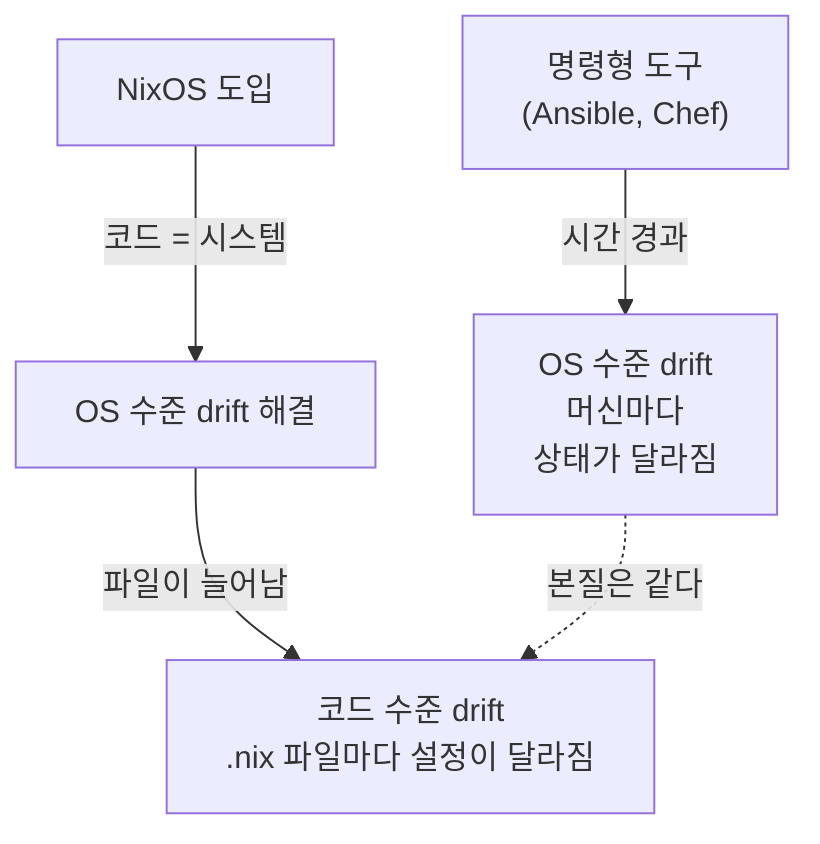
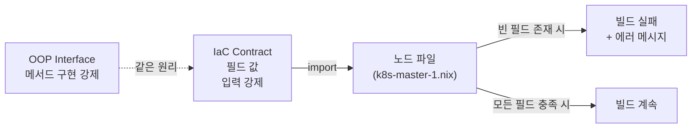
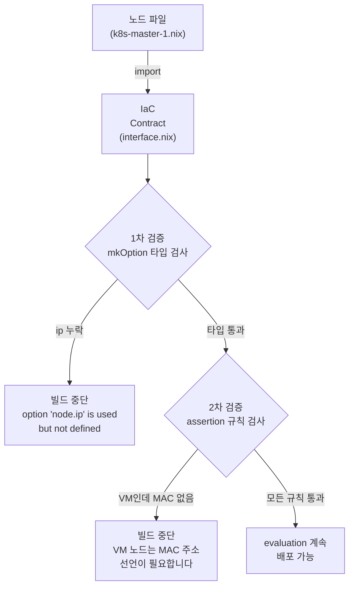
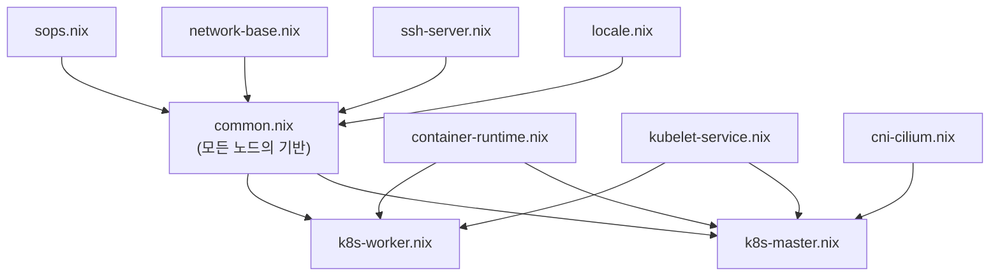
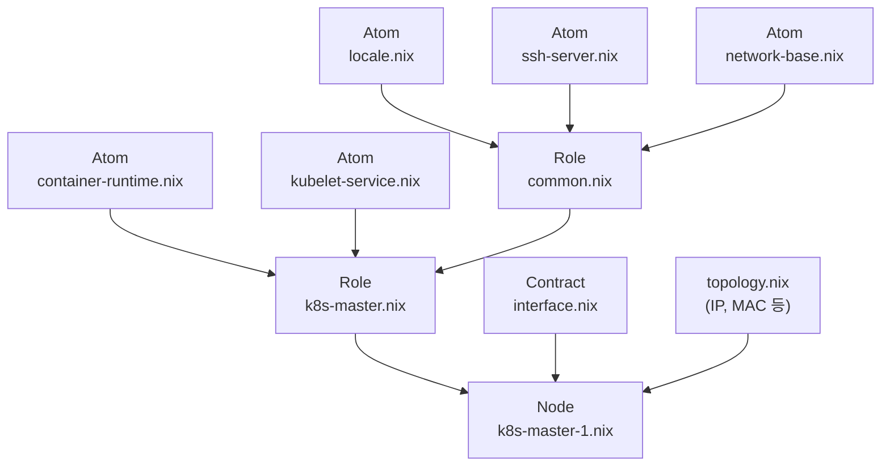
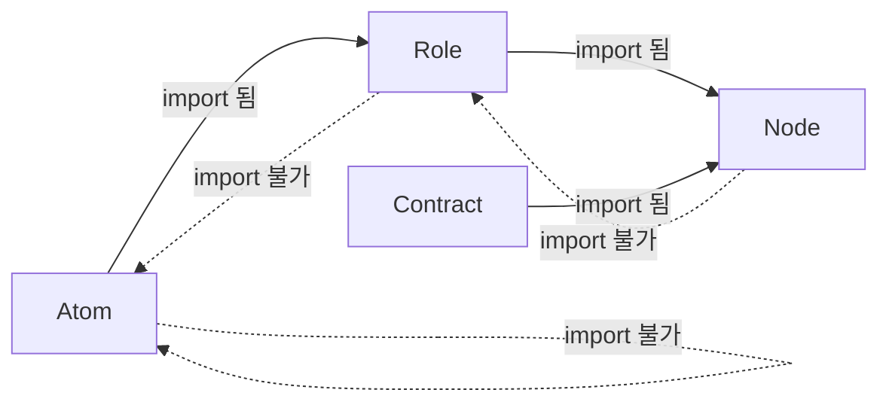
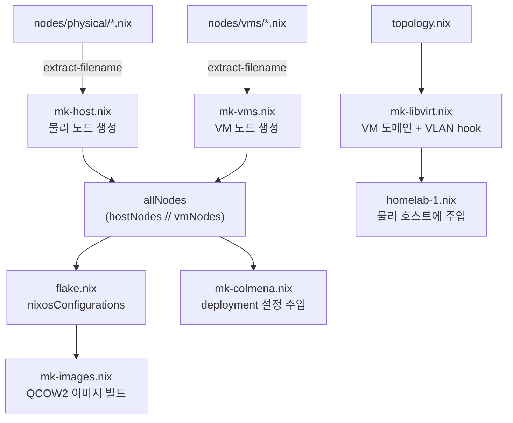
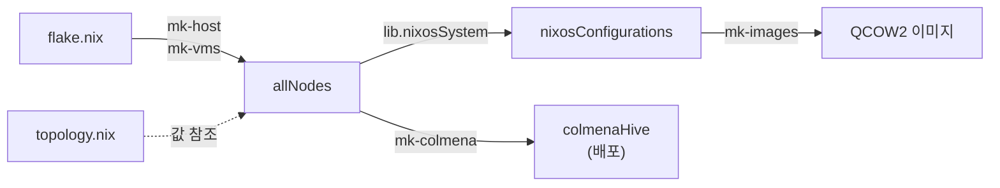
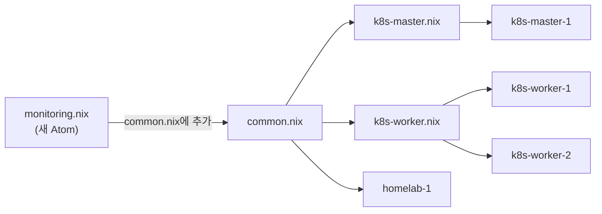
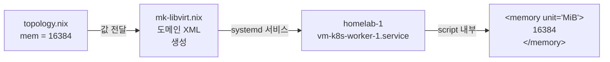

# Why?

왜 배움?

---

---

홈랩을 만드는 것은 재밌지만 복잡하다.

사용자 설정부터 파티셔닝, VLAN, VM 설정, 필요한 패키지까지 하나하나 만져줘야 한다.

AWS 를 쓴다면 AMI 나 EBS Snapshot 으로 원하는 상태를 저장하고 복원할 수 있겠지만, 
홈랩에서는 그런 관리형 서비스가 없다. 
*원하는 상태의 이미지를 직접 만들고, 직접 저장하고, 직접 배포해야 한다.*
그래서 IaC 도구를 찾게 된다.

그런데 어떤 도구를 선택하느냐에 따라 *제어할 수 있는 범위* 가 크게 달라진다.

## Why NixOS?

Terraform, Pulumi, OpenTofu 같은 도구는 *클라우드 리소스의 선언적 관리* 에 탁월하다.

그러나 kernel 수준의 IaC 제어는 불가능하다.

이는 IaC 의 abstraction layer 때문이다.

OS 내부 구성과 패키지 구성까지 제어하고자 한다면 user-data 나 provisioner 를 사용하여 간접 처리해야 한다.

반면 NixOS 는 OS 전체를 declarative 하게 재구축하며 kernel 까지 직접 제어한다.

> NixOS 의 동작 원리가 궁금하다면 이전 글을 참고해보자[^2].

| 영역 | Terraform / Pulumi / OpenTofu | NixOS |
| --- | --- | --- |
| **클라우드 인프라 (VM, 네트워크)** | VM 생성, 네트워크 설정 등 완벽 지원 | IaC와 결합해 VM 프로비저닝 후 NixOS 설치 |
| **OS 패키지 설치** | User-data 스크립트나 provisioner로 가능 (재현성 낮음) | configuration.nix에서 declarative 패키지 정의 |
| **서비스 구성** | Cloud-init이나 Ansible 연동 필요 | Nix DSL로 서비스 상태 선언 (멱등성 보장) |
| **Kernel 파라미터** | VM 메타데이터나 startup script로 추가 (제한적) | `boot.kernelParams` 리스트로 직접 선언 |
| **Kernel 모듈 로드** | Provisioner로 modprobe 실행 (부팅 시 불안정) | `boot.initrd.kernelModules`로 선언적 로드 |
| **Kernel 컴파일/패치** | 직접 불가 (커스텀 AMI 필요) | `boot.kernelPatches`, 커스텀 kernel 패키지 빌드 |

다만 이렇게 완벽해 보이는 NixOS 에도 단점이 숨어 있다.

하나는 언어의 복잡성이고, 하나는 파일 구조에 숨어 있다.

## NixOS 의 양면성: 커널 제어만큼 다양한 IaC 코드

NixOS 가 커널 수준까지 제어한다는 것은, 그만큼 IaC 코드 파일이 다양해지고 많아진다는 것을 의미한다.

그렇다고 디렉토리나 파일을 역할 별로 쪼개자니 굉장히 복잡해지고, 이로 인해 코드 복잡성이 올라간다.

그냥 본인이 관리할 홈랩인데 코드 복잡성이 무슨 상관인가 싶겠지만
매우.

굉장히.

아주아주.

중요하다.

홈랩을 장기간 운영하고자 하는데 본인이 헷갈릴 정도로 IaC 를 구성했다면 축하한다.

새벽 3시까지 디버깅하다 아마 처음부터 다시 만들기 시작할 것이다.

NixOS 는 결국 코드로서 해결해줘야 하는 부산물들이 생기기 마련이다.

디렉토리 구조는?

함수형이니 OOP 는 못 쓰나?

재사용은?

추상화에 따른 세부 구현은?

정적값 처리는?

이 글은 바로 이 질문들에서 출발한다.

NixOS 의 선언적 코드가 폭발적으로 늘어날 때, *어떤 구조로 통제할 수 있는가*.

그 답으로 이 프로젝트가 채택한 세 가지 설계 원칙 — **계약 기반 설계**, **합성 가능한 계층**, **순수 함수 헬퍼** — 을 순서대로 따라간다.

# What?

뭘 배움?

---

---

홈랩에 NixOS 를 도입하면 커널부터 부트로더까지 코드로 관리할 수 있다.

좋다.

그런데 그 코드는 누가 관리하는가?

## 문제의 근원: 선언적 코드는 왜 복잡해지는가 💣

### 선언의 대가 — 모든 것을 적어야 한다는 부담

명령형 도구에서는 SSH 로 접속해서 `apt install nginx` 를 치면 끝이다.

패키지가 설치되고, 서비스가 올라오고, 포트가 열린다.

세 가지 일이 한 줄에 일어난다.

NixOS 에서는 그렇지 않다.

패키지 선언, 서비스 활성화, 방화벽 포트 개방, 필요하다면 커널 모듈
로드까지 — 전부 `.nix` 파일에 적혀 있어야 한다.

적혀 있지 않으면 존재하지 않는다.

이것이 NixOS 의 강점이자 동시에 진입 장벽이다.

이 홈랩의 실제 디렉토리 구조를 보면 그 규모가 체감된다.

```nix
.
├── atoms/
│ ├── k8s/ # 컨테이너 런타임, kubelet, CNI, distro-compat
│ ├── network/ # 네트워크 기반, SSH 서버/클라이언트
│ ├── system/ # locale, shell, git, sops, cli-tools, timesyncd ...
│ └── user/ # 사용자 계정 선언
├── lib/ # 순수 함수 헬퍼 6개
├── network/ # 토폴로지 상수
├── nodes/
│ ├── interface.nix # IaC Contract
│ ├── physical/ # 물리 호스트
│ ├── roles/ # 역할 프리셋
│ └── vms/ # VM 노드
├── secrets/ # SOPS 시크릿
└── flake.nix # 진입점
```

물리 호스트 1대, VM 3대. *작은* 홈랩이다.

그런데도 `.nix` 파일만 30개가 넘는다.

노드가 늘어날수록, 역할이 다양해질수록 이 숫자는 가속도가 붙는다.

VM 을 두 대만 더 추가해도 `.nix` 파일은 40개를 넘기고, 
역할이 하나 더 생기면 그 역할에 딸린 파일들이 줄줄이 따라온다.

여기서 자연스러운 의문이 생긴다.

파일이 많아지는 것 자체가 문제인가?

아니다.

진짜 문제는 *파일이 많아졌을 때 일관성을 잃는 것* 이다.

### 설정이 흩어지면 벌어지는 일: Configuration Drift 의 귀환

NixOS 를 도입한 이유 중 하나는 Ansible 이나 Chef 가 시달리던 *configuration drift* 를 없애기 위함이었다.

Configuration drift 란 같은 설정을 적용했다고 믿는 머신들이 시간이 지나면서 서서히 달라지는 현상이다.

월요일에 설치한 서버와 금요일에 설치한 서버가 미묘하게 다르다.

누군가 한쪽에만 SSH 포트를 바꿨는데 기록이 없다.

장애가 터지고 나서야 발견한다.

NixOS 는 이 문제를 해결한다.

코드에 적힌 대로 시스템이 구성되니까, *코드와 시스템 사이의 drift* 는 원리적으로 불가능하다.

그런데 `.nix` 파일들이 체계 없이 늘어나면, drift 가 *OS 수준* 이 아니라 *코드 수준* 에서 되살아난다.

구체적인 장면을 그려보자.

한 VM 에서는 SSH 포트를 `22` 로 열었다.

다른 VM 에서는 보안을 위해 `2222` 로 바꿨다.

그런데 세 번째 VM 을 만들 때 첫 번째 VM 의 설정을 복사해서 `22` 로 열었다.

누구도 이 불일치를 모른다.

방화벽 규칙도 VM 마다 조금씩 다르다.

어떤 VM 에는 `9100` 포트가 열려 있고, 어떤 VM 에는 없다.

왜 다른지 아무도 기억하지 못한다.

NixOS 가 보장하는 것은 *"코드와 시스템의 일치"* 이지, *"코드와 코드의 일관성"* 이 아니다.

파일이 30개든 300개든 NixOS 는 각 파일에 적힌 대로 충실히 시스템을 만든다.

그 파일들이 서로 모순되는지는 관심 밖이다.



Ansible 시절에는 머신이 달라졌다.

NixOS 시대에는 코드가 달라진다.

매체만 바뀌었을 뿐, drift 의 본질은 같다.

### 복잡성을 다스리는 열쇠 — 계약과 계층, 그리고 접착제

정리하면 문제는 두 가지다.

1. **일관성 부재:**
2. **중복과 발산:**

이 프로젝트는 이 두 문제를 각각 다른 도구로 해결한다.

첫 번째는 계약(Contract) 으로 — 모든 노드가 반드시 채워야 할 필드를 강제하는 장치다.

두 번째는 합성 가능한 계층(Atom → Role → Node) 으로 — 공통 설정을 한 곳에 두고 조합하는 구조다.

그리고 이 둘을 연결하는 접착제가 순수 함수 헬퍼 다.

다음 절에서는 이 세 가지 중 첫 번째, 계약부터 살펴본다.

## 계약 기반 설계: 노드가 스스로를 증명하게 하라 📜

앞에서 일관성 부재가 문제라고 했다.

노드마다 어떤 필드를 반드시 채워야 하는지 강제하는 장치가 없으면, 빠뜨린 설정은 배포 후에 장애로 나타난다.

이 절에서는 그 장치 — 계약 — 을 만드는 방법을 다룬다.

### 계약이란 무엇인가 — 빈칸을 남겨두면 빌드가 거부하는 장치

비유를 들어보자.

회사에 입사 지원서가 있다.

이름, 연락처, 희망 직무는 반드시 적어야 한다.

비워두면 접수 자체가 안 된다.

지원자가 아무리 뛰어나도 필수 항목이 비어 있으면 시스템이 거부한다.

NixOS 에서 이 "필수 항목" 역할을 하는 도구가 `lib.mkOption` 이다[^3]. 
`mkOption` 으로 선언된 옵션은 어딘가에서 반드시 값이 채워져야 한다.

채워지지 않으면 빌드 자체가 실패한다.

컴파일러가 "이 칸이 비어 있다"고 알려주는 것과 같다.

이 성질을 이용하면 재미있는 것을 만들 수 있다.

모든 노드가 공유하는 "입사 지원서 양식" — 즉 반드시 채워야 할 필드의 목록 — 을 하나의 파일로 정의하는 것이다.

이 프로젝트에서는 이것을 IaC Contract 라고 부른다[^1].

개념은 OOP 의 Interface 와 닮았다.

Interface 는 "이 메서드를 반드시 구현하라"고 강제하는 장치다.

IaC Contract 는 "이 필드를 반드시 채우라"고 강제하는 장치다.

다만 여기서는 클래스가 아니라 NixOS 모듈이, 메서드가 아니라 설정 옵션이 대상일 뿐이다.



실제 계약 파일을 보자. nodes/interface.nix 라는 단 하나의 파일이다.

```nix
# IaC Contract
# - ip
# - role
# - mac
# - user
# - custom 설정
# NOTE : https://sraka.xyz/posts/contracts.html[^2] 참고
{
  lib,
  config,
  ...
}: {
  options.node = {
    ip = lib.mkOption {
      type = lib.types.str;
      description = "노드 외부/내부 IP";
    };
    hostType = lib.mkOption {
      type = lib.types.enum ["physical" "vm"];
      description = "Host Type";
    };
    role = lib.mkOption {
      type = lib.types.enum ["k8s-master" "k8s-worker" "host"];
      description = "Node Role";
    };
    mac = lib.mkOption {
      type = lib.types.nullOr lib.types.str;
      description = "MAC 주소";
      default = null;
    };
    parentHost = lib.mkOption {
      type = lib.types.nullOr lib.types.str;
      default = null;
      description = "이 노드가 위치한 물리 호스트의 이름";
    };
    user = lib.mkOption {
      type = lib.types.str;
      default = "root";
      description = "SSH 배포 사용자 (deployment.targetUser)";
    };
  };
  config.assertions = [
    {
      assertion = config.node.ip != "";
      message = "IaC Contract: 각 노드는 IP 선언이 필요합니다.";
    }
    {
      assertion = config.node.hostType == "vm" -> config.node.parentHost != null;
      message = "IaC Contract: VM 노드(${config.networking.hostName})는 반드시 parentHost 선언이 필요합니다.";
    }
    {
      assertion = config.node.role != null;
      message = "IaC Contract: 각 노드는 Role 선언이 필요합니다.";
    }
    {
      # VM 노드만 TAP 인터페이스용 MAC 주소 필요 (물리 호스트는 불필요)
      assertion = config.node.hostType == "vm" -> config.node.mac != null;
      message = "IaC Contract: VM 노드(${config.networking.hostName})는 MAC 주소 선언이 필요합니다.";
    }
  ];
}

```

한 줄씩 뜯어보자.

ip 는 lib.types.str 타입이고, 기본값이 없다.

기본값이 없다는 것은 누군가 반드시 값을 넣어야 한다는 뜻이다.

hostType 도 마찬가지다.

다만 아무 문자열이나 받지 않고 "physical" 또는 "vm" 둘 중 하나만 허용한다.

lib.types.enum 이 그 역할을 한다.

role 도 같은 패턴으로, "k8s-master", "k8s-worker", "host" 세 값만 허용한다.

반면 mac 은 default = null 이 붙어 있다.

기본값이 있으므로 채우지 않아도 빌드가 깨지지 않는다.

물리 호스트는 MAC 주소가 필요 없을 수 있기 때문이다.

parentHost 도 마찬가지로, 물리 호스트에는 부모가 없으니 기본값이 null 이다.

정리하면 이 계약이 말하는 바는 이렇다.

> *"이 홈랩의 모든 노드는 IP, 호스트 타입, 역할을 반드시 선언해야 한다. *

넣지 않으면?

입사 지원서와 마찬가지로 접수가 거부된다.

다만 여기서 접수 창구는 사람이 아니라 Nix evaluator 이고, 거부의 형태는 빌드 에러다.

그런데 여기서 한 가지 빈틈이 보인다. mac 은 선택 사항이라고 했다.

물리 호스트에서는 맞는 말이다.

그런데 VM 이라면?

VM 은 가상 네트워크 인터페이스를 가지므로 MAC 주소가 반드시 있어야 한다. 
default = null 때문에 타입 검사는 통과하지만, 실제로는 있어야 하는 값이다.

이런 조건부 규칙은 타입 시스템만으로 표현할 수 없다.

### 빌드 타임에 터지는 안전망: assertion 이 잡아내는 것들

mkOption 이 "이 칸은 필수입니다"라는 표시라면, 
assertion 은 "이 칸과 저 칸 사이에 이런 관계가 있어야 합니다"라는 규칙이다[^4].

다시 입사 지원서로 돌아가보자. 
"희망 직무"에 "개발자"를 적었다면 "포트폴리오" 항목도 반드시 채워야 한다는 규칙이 있다고 하자. 
"디자이너"를 적었다면 포트폴리오는 선택이다.

이런 조건부 필수 규칙은 칸의 존재 여부만으로는 표현할 수 없다.

별도의 검증 로직이 필요하다.

NixOS 의 assertion 이 바로 그 검증 로직이다.

```nix
# nodes/interface.nix (하단)
config.assertions = [
  {
    assertion = config.node.ip != "";
    message = "IaC Contract: 각 노드는 IP 선언이 필요합니다.";
  }
  {
    assertion = config.node.hostType == "vm" -> config.node.parentHost != null;
    message = "IaC Contract: VM 노드(${config.networking.hostName})는 반드시 parentHost 선언이 필요합니다.";
  }
  {
    assertion = config.node.role != null;
    message = "IaC Contract: 각 노드는 Role 선언이 필요합니다.";
  }
  {
    # VM 노드만 TAP 인터페이스용 MAC 주소 필요 (물리 호스트는 불필요)
    assertion = config.node.hostType == "vm" -> config.node.mac != null;
    message = "IaC Contract: VM 노드(${config.networking.hostName})는 MAC 주소 선언이 필요합니다.";
  }
];

```

여기서 -> 기호가 낯설 수 있다.

이것은 Nix 의 논리 함축 연산자다.

A -> B 는 "A 가 참이면 B 도 참이어야 한다"를 뜻한다.

일상어로 바꾸면 이렇다.

- `config.node.hostType == "vm" -> config.node.mac != null`
- `config.node.hostType == "vm" -> config.node.parentHost != null` 

물리 호스트는? hostType 이 "vm" 이 아니므로 A 가 거짓이다.

논리 함축에서 A 가 거짓이면 B 가 뭐든 전체가 참이다.

즉 물리 호스트는 MAC 이 없어도 통과한다. VM 만 이 규칙의 적용 대상이다.

이 assertion 들은 nixos-rebuild 나 colmena build 시점에 evaluation 과 함께 평가된다.

위반된 노드는 배포 파이프라인에 진입조차 할 수 없다.



계약의 방어선은 두 겹이다.

첫 번째는 mkOption 의 타입 검사로, 필수 필드의 존재와 타입을 확인한다.

두 번째는 assertion 으로, 필드 간의 관계를 검증한다.

두 겹 모두 빌드 타임에 작동하므로, 잘못된 설정이 실제 머신에 도달할 경로가 없다.

### 계약을 이행하는 노드의 실제 모습

계약을 정의했으면, 이행하는 쪽을 봐야 한다.

계약서를 작성했는데 아무도 서명하지 않으면 의미가 없다.

다음은 k8s-master-1 VM 노드가 계약을 이행하는 모습이다.

```nix
# nodes/vms/k8s-master-1.nix
{lib, ...}: let
network = import ../../network/topology.nix;
net     = network.vms.k8s-master-1;
in {
imports = [
  ../interface.nix       # ← 계약 수락
  ../roles/k8s-master.nix
];

node = {
  ip         = net.ip;          # 계약 이행: IP
  mac        = net.mac;         # 계약 이행: MAC (VM 이므로 필수)
  role       = "k8s-master";    # 계약 이행: Role
  hostType   = "vm";            # 계약 이행: Host Type
  parentHost = "homelab-1";     # 계약 이행: Parent Host (VM 이므로 필수)
};

# ...이하 부팅, 네트워크 등 노드 고유 설정
}
```

imports 에 ../interface.nix 가 들어가는 순간, 이 노드는 계약에 서명한 것이다.

이제부터 options.node 에 정의된 모든 필수 필드를 채워야 할 의무가 생긴다.

node = { ... } 블록이 그 의무를 이행하는 곳이다.

ip 는 topology.nix 에서 가져온 값으로 채운다. mac 도 마찬가지다.

role 과 hostType 은 이 노드의 정체성을 나타내는 값이므로 직접 문자열로 적는다.

parentHost 는 이 VM 이 어떤 물리 호스트 위에서 돌아가는지를 명시한다.

만약 이 파일에서 role 한 줄을 지우면 어떻게 되는가?

```nix
error: The option `node.role` is used but not defined.
```

"정의했지만 값을 안 넣었다" 가 아니다. "계약에서 선언된 필드에 값이 없다" 는 뜻이다.

이 에러는 nix build 나 colmena build 를 실행하는 순간, 코드를 작성한 사람의 터미널에 즉시 나타난다.

새벽 3시에 SSH 접속이 안 되는 이유를 추적하는 것이 아니라, 코드를 고치는 시점에 문제를 알 수 있다.

mac 을 지우면 어떻게 되는가?

mac 은 `default = null` 이므로 타입 검사는 통과한다.

하지만 이 노드의 hostType 은 "vm" 이다.

`assertion 의 "vm" -> mac != null` 규칙이 작동하여 두 번째 방어선에서 잡힌다.

error: Failed assertions:

- IaC Contract: VM 노드(k8s-master-1)는 MAC 주소 선언이 필요합니다.

어떤 필드를 빼든 빌드가 실패한다.

그것이 계약이다.

### 계약이 만들어내는 설계상의 이점

계약 파일 하나를 도입했을 뿐인데, 몇 가지 흥미로운 효과가 따라온다.

1. **자기 문서화:**
2. **빌드 타임 검증:**
3. **헬퍼 함수의 신뢰 기반:**
4. **확장의 안전성:**

그러나 NixOS 는 또 다른 문제측면을 갖고 있는데 이는 코드 중복이다.

VM 이나 클러스터 상 노드가 여러 개 있고, 동일한 패키지 — fish shell, git, ssh — 구성을 하고자한다면 코드를 재사용하게 해야한다.

다만 위에 다룬 계약구조는 코드중복을 해결할 수 없다.

SSH 설정, 방화벽 규칙, 로케일 같은 공통 설정이 노드마다 반복된다면, 계약이 아무리 견고해도 유지보수는 고통이다.

다음 절에서는 이 중복을 없애는 구조를 다룬다.

## 합성 가능한 계층: Atom → Role → Node 🦠

계약이 "무엇을 반드시 채워야 하는가" 를 강제한다면, 이번 절은 "공통된 것을 어떻게 한 번만 적을
것인가" 에 대한 이야기다.

### 가장 작은 조각부터 — Atom 이라는 재사용 단위

레고를 생각해보자.

레고의 가장 작은 조각은 브릭이다. 2x4 브릭, 1x1 브릭, 바퀴 브릭.

각 브릭은 하나의 역할만 한다.

브릭끼리 직접 연결되는 것이 아니라, 사용자가 원하는 순서로 조합한다.

이 프로젝트에서 Atom 이 바로 그 브릭이다.

하나의 Atom 은 정확히 하나의 관심사 만 다룬다.

가장 간단한 Atom 부터 보자.

로케일 설정이다.

```nix
# atoms/system/locale.nix — 5줄짜리 Atom
{...}: {
time.timeZone = "Asia/Seoul";
i18n.defaultLocale = "en_US.UTF-8";
}
```

이 파일은 타임존과 로케일만 다룬다.

네트워크는 모른다.

SSH 는 모른다.

오직 시간과 언어뿐이다.

네트워크 기반 Atom 도 보자.

```nix
# atoms/network/network-base.nix — 네트워크 기반 Atom
{lib, ...}: {
	networking.networkmanager.enable = false;
	networking.useDHCP = false;
	networking.useNetworkd = true;
	services.resolved.enable = true;
	networking.firewall = {
	  enable = lib.mkDefault true;
	  allowedTCPPorts = [22];
	};
}
```

이 Atom 은 네트워크 관리자를 끄고, systemd-networkd 를 켜고, 방화벽에서 SSH 포트만 연다.

로케일은 모른다.

사용자 계정도 모른다.

오직 네트워크 기반 설정뿐이다.

여기서 lib.mkDefault 가 눈에 띈다.

이것은 "이 값이 기본이지만, 상위 계층에서 다른 값으로 덮어씌울 수 있다"는 표시다.

방화벽을 켜는 것이 기본이지만, 특수한 노드에서는 끌 수도 있다는 여지를 남기는 것이다.

Atom 은 의견을 제시하되 강요하지 않는다.

Atom 의 설계 규칙은 세 가지다.

- 하나의 .nix 파일에 하나의 관심사만 담는다.
- 다른 Atom 을 import 하지 않는다 — Atom 은 잎 노드 다.
- 가능한 한 mkDefault 를 사용하여 상위 계층에서 override 할 여지를 남긴다.

현재 이 프로젝트의 Atom 은 네 범주로 나뉜다.

```shell
atoms/
├── k8s/       # container-runtime, kubelet, cni-cilium, k8s-distro-compat
├── network/   # network-base, ssh-server, ssh-client
├── system/    # locale, shell, git, sops, nix, timesyncd, authorized-keys ,,,
└── user/      # users
```

좀 더 실질적인 예시를 보자.

Kubernetes 의 컨테이너 런타임 Atom 이다.

```nix
# atoms/k8s/container-runtime.nix
{pkgs, ...}: {
	boot.kernelModules = ["overlay" "br_netfilter"];
	boot.kernel.sysctl = {
	  "net.ipv4.ip_forward" = 1;
	  "net.bridge.bridge-nf-call-iptables" = 1;
	  "net.bridge.bridge-nf-call-ip6tables" = 1;
	};
	virtualisation.containerd = {
	  enable = true;
	  settings = { /* ... */ };
	};
}
```

커널 모듈 로드, sysctl 파라미터, containerd 설정이 하나의 파일에 응집되어 있다.

이 세 가지는 "컨테이너 런타임이 동작하려면 필요한 것들"이라는 하나의 관심사로 묶인다.

커널 모듈만 따로 빼거나, sysctl 만 따로 빼면 의미가 없다.

셋이 함께 있어야 컨테이너가 돌아간다.

이 설정이 k8s-master-1.nix 에도, k8s-worker-1.nix 에도, k8s-worker-2.nix 에도 필요하다.

그러나 각 노드 파일에 복사하지 않는다.

Atom 을 한 번 정의하고, 역할이 선택 하게 한다.

### Atom 을 엮어 역할을 만들다 — Role 의 탄생

레고 브릭을 조합해서 "자동차"를 만들듯, Atom 을 조합해서 역할(Role) 을 만든다.

Role 은 특정 역할을 수행하는 노드가 공통으로 필요로 하는 Atom 들의 묶음이다.

이 프로젝트에서 모든
노드가 공유하는 기반 역할인 common.nix 부터 보자.

```nix
# nodes/roles/common.nix — 모든 노드의 기반 역할
{config, lib, pkgs, ...}: {
system.stateVersion = "24.11";

# VM 이면 가상화 드라이버 자동 주입
boot.initrd.availableKernelModules = lib.mkIf (config.node.hostType == "vm") [
  "virtio_net" "virtio_pci" "virtio_mmio" "virtio_blk" "virtio_scsi"
  "9p" "9pnet_virtio"
];

imports = [
  ../../atoms/system/sops.nix
  ../../atoms/system/nix.nix
  ../../atoms/system/locale.nix
  ../../atoms/system/timesyncd.nix
  ../../atoms/system/shell.nix
  ../../atoms/system/cli-tools.nix
  ../../atoms/network/ssh-server.nix
  ../../atoms/network/network-base.nix
  ../../atoms/system/authorized-keys.nix
];
}
```

imports 목록이 이 역할의 "재료 목록"이다.

SOPS 시크릿 관리, Nix 설정, 로케일, 시간 동기화, SSH 설정 등등,, 모든 노드가 필요로 하는 공통 재료들이다.

여기서 config.node.hostType 이 등장한다는 점에 주목하자.

common.nix 는 "VM 이면 virtio 드라이버를 넣어라"는 분기 로직을 가지고 있다.

그런데 hostType 이 없으면 어떻게 되는가?

에러가 난다.

하지만 이 Role 을 사용하는 Node 는 반드시 계약(interface.nix)도 import 하므로, hostType 이 존재한다는 것이 보장된다.

Role 은 계약이 보장하는 필드를 신뢰하고 분기 로직을 작성한다.

방어 코드가 필요 없다.

이제 이 공통 역할 위에 Kubernetes 마스터 역할을 얹어보자.

```nix
# nodes/roles/k8s-master.nix — K8s 마스터 역할
{pkgs, ...}: {
	imports = [
	  ./common.nix                              # 공통 역할 상속
	  ../../atoms/k8s/container-runtime.nix     # + K8s 전용 Atom 들
	  ../../atoms/k8s/kubelet-service.nix
	  ../../atoms/k8s/cni-cilium.nix
	  ../../atoms/k8s/k8s-distro-compat.nix
	];
	networking.firewall.allowedTCPPorts = [6443 2379 2380 10250 10251 10252];
}
```

k8s-master.nix 는 common.nix 를 상속하고, 그 위에 K8s 전용 Atom 4개를 추가한다.

그리고 마스터 노드에 필요한 방화벽 포트를 연다. 
common.nix 에서 이미 SSH 포트(22)가 열려 있으므로, 여기서는 K8s API 서버(6443), etcd(2379, 2380), kubelet(10250) 등 마스터 고유 포트만 추가하면 된다.



그림에서 보듯, common.nix 는 마스터와 워커 모두의 기반이 된다.

컨테이너 런타임과 kubelet 은 마스터와 워커 모두에 필요하므로 양쪽 모두 import 한다.

CNI(Cilium)는 마스터에서만 관리하므로 마스터 역할에만 포함된다.

이런 식으로 Atom 의 조합 이 역할의 차이 를 만든다.

### 계약 위에 역할을 얹다 — Node 가 완성되는 순간

최종적으로 Node 파일은 두 가지 일만 한다.

계약을 이행하고, 역할을 선택한다.

나머지는 그 노드만의 고유 설정이다.

물리 호스트와 VM 을 나란히 놓으면 패턴이 명확해진다.

```nix
# nodes/physical/homelab-1.nix (물리 호스트)
node = {
	ip       = network.wan.host;     # 계약 이행
	role     = "host";
	hostType = "physical";
	user     = "limjihoon";
	};
	imports = [
		../interface.nix               # 계약 수락
	../roles/common.nix              # 역할 선택
	# ...물리 호스트 고유 설정 (libvirt, Tailscale, VLAN 브리지 등)
];

# nodes/vms/k8s-worker-1.nix (VM)
node = {
	ip         = net.ip;             # 계약 이행
	mac        = net.mac;
	role       = "k8s-worker";
	hostType   = "vm";
	parentHost = "homelab-1";
	};
	imports = [
	../interface.nix                 # 계약 수락
	../roles/k8s-worker.nix          # 역할 선택
];
```

두 파일의 구조가 동일하다. 
`node = { ... }` 블록에서 계약을 이행하고, imports 에서 역할을 선택한다.

차이는 어떤 계약 필드를 채우느냐 와 어떤 역할을 선택하느냐 뿐이다.



### 계층이 강제하는 의존성 방향과 그 효과

이 세 겹의 계층에는 하나의 규칙이 있다.

의존성 방향이 한 방향으로만 흐른다.



- Atom → Atom: import 금지.

Atom 간 의존이 생기면 하나의 Atom 으로 합치거나 Role 에서 조합한다. 레고 브릭이 다른 브릭을 "필요로 하는" 일은 없다. 브릭은 그냥 브릭이다.

- Role → Atom: 자유롭게 import.

Role 의 존재 이유 자체가 Atom 을 조합하는 것이다.

- Node → Role + Contract: Node 는 역할을 선택하고 계약을 이행한다. 그 외의 import 는 노드 고유 설정뿐이다.

- 역방향: 어느 계층도 상위 계층을 import 하지 않는다.

이 규칙이 가져다 주는 효과는 간단하다.

어떤 파일을 수정했을 때 영향 범위를 예측할 수 있다. locale.nix 를 바꾸면 이것을 import 하는 Role 과 그 Role 을 사용하는 Node 만 영향 받는다.

역방향 의존이 없으므로 순환 참조도 원리적으로 불가능하다.

"이 파일을 고치면 다른 데가 깨지지 않을까?"라는 불안이 사라진다. 의존성 방향을 따라가기만 하면 영향 범위가 보이기 때문이다.

그러나 계층 구조를 아무리 잘 짜도, 노드를 추가할 때마다 flake.nix 에 손으로 등록해야 한다면 
그것 역시 실수의 온상이다.

다음 절에서는 이 반복을 순수 함수로 제거한다.

## 순수 함수로 인프라를 찍어내다: Topology 에서 배포까지 🏭

계층 구조가 코드의 중복을 잡았다.

그런데 노드가 10대, 20대로 늘어나면 노드 파일을 만들고 → flake 에 등록하고 → 배포 설정을 추가하는 반복이 새로운 병목이 된다.

이 반복을 없애는 방법은 단순하다.

반복되는 작업을 함수로 만들면 된다.

다만 여기서의 함수는 일반적인 함수가 아니라 순수 함수다.

같은 입력에 항상 같은 출력을 내고, 외부 상태를 변경하지 않는다[^8].

### 단일 진실 공급원 — topology.nix 가 CIDR 만 품는 이유

함수를 만들기 전에 먼저 정리할 것이 있다.

IP, MAC, VLAN 같은 네트워크 상수는 어디에 둘 것인가?

노드 파일마다 IP 를 하드코딩할 수도 있다.

하지만 그러면 IP 를 바꿀 때 여러 파일을 수정해야 한다.

그리고 어떤 파일의 IP 가 최신인지 확신할 수 없다.

이것은 앞에서 다룬 "중복과 발산" 문제의 재현이다.

이 프로젝트에서는 topology.nix 한 파일에 모든 네트워크 상수를 모았다.

```nix
# network/topology.nix (발췌)
{
wan = {
  host = "192.168.45.82";
  gateway = "192.168.45.1";
  prefixLength = 24;
};
vlans = {
  management = { id = 10; network = "10.0.10.0/24"; prefixLength = 24; };
  services   = { id = 20; network = "10.0.20.0/24"; prefixLength = 24; };
};
vms = {
  k8s-master-1 = { 
	  host = "homelab-1"; 
	  ip = "10.0.20.10"; 
	  mac = "02:00:00:00:20:10"; 
	  vcpu = 2;
	  mem = 4096;
	  diskSize = 20;
  };
  k8s-worker-1 = { 
	  host = "homelab-1"; 
	  ip = "10.0.20.21"; 
	  mac = "02:00:00:00:20:21"; 
	  vcpu = 6;
	  mem = 8192;
	  diskSize = 40;
  }
  # ...
};
}
```

이 파일은 순수한 상수 집합 이다.

함수도 없고, import 도 없다.

그저 값만 나열되어 있다.

단일 책임 원칙(SRP)을 파일 수준에서 적용한 셈이다.

IP 를 바꿔야 하면 이 파일 하나만 수정하면 된다.

모든 노드 파일과 헬퍼 함수는 여기서 값을 읽어간다.

주소록이 한 곳에만 있으므로, "어디가 최신이지?"라는 의문 자체가 사라진다.

이 설계의 또 다른 이점은 Nix 바깥의 도구에서도 같은 진실을 참조할 수 있다 는 것이다.

```bash
nix eval --impure --json --expr "(import ./network/topology.nix).vms"
```

이 한 줄이면 셸 스크립트에서도 모든 VM 의 IP, MAC, 호스트 정보를 JSON 으로 얻을 수 있다.

만약 배포하는 곳에서 VM 을 순회하며 작업하고자 파싱하고자 할 때, topology.nix 의 값을 그대로 쓸 수 있다.

### 노드 등록을 없애다 — 디렉토리가 곧 레지스트리

전통적인 NixOS 멀티노드 구성에서는 flake.nix 에 노드를 하나하나 나열한다.

이런 식이다.

```nix
# 전통적인 방식 (이 프로젝트에서는 사용하지 않는다)
nixosConfigurations = {
	homelab-1     = lib.nixosSystem { ... };
	k8s-master-1  = lib.nixosSystem { ... };
	k8s-worker-1  = lib.nixosSystem { ... };
	k8s-worker-2  = lib.nixosSystem { ... };
};
```

노드가 추가될 때마다 두 곳 — 노드 파일과 flake.nix — 을 수정해야 한다.

노드 파일을 만들고 flake.nix 에 등록하는 것을 잊으면?

노드는 존재하지만 빌드 대상이 아니다.

반대로 flake.nix 에는 등록했는데 노드 파일을 안 만들면?

빌드가 깨진다.

두 곳을 항상 동기화해야 한다는 것 자체가 실수의 온상이다.

이 프로젝트에서는 디렉토리 자동 탐색 으로 이 이중 작업을 제거했다.

```nix
# 디렉토리의 *.nix 파일을 탐색하여 파일명(확장자 제외) 목록을 반환하는 함수
# 사용: discoverNodes = import ./extract-filename.nix { inherit lib; };
#       names = discoverNodes ../nodes/physical;
{lib}: dir:
lib.pipe (builtins.readDir dir) [
  # regular 파일만 필터링 (디렉토리, 심링크 제외)
  (lib.filterAttrs (_: type: type == "regular"))
  # 파일명 목록으로 변환
  builtins.attrNames
  # .nix 확장자 파일만 선택
  (lib.filter (lib.hasSuffix ".nix"))
  # 확장자 제거 → 노드 이름
  (map (lib.removeSuffix ".nix"))
]

```

이 함수가 하는 일을 한 줄씩 따라가보자.

`builtins.readDir dir` 은 디렉토리의 파일 목록을 읽는다. `lib.filterAttrs` 로 일반 파일만 걸러낸다(디렉토리 제외). `builtins.attrNames` 로 파일 이름만 추출한다. `lib.filter (lib.hasSuffix ".nix")` 로 .nix 확장자를 가진 것만 남긴다.

마지막으로 `map (lib.removeSuffix ".nix")` 로 확장자를 제거한다.

결과는 `["k8s-master-1" "k8s-worker-1" "k8s-worker-2"]` 같은 문자열 목록이다.

`nodes/vms/` 에 `k8s-worker-3.nix` 파일을 놓는 순간, 이 함수가 자동으로 발견한다.

flake.nix 를 수정할 필요가 없다.

등록이라는 행위 자체가 사라진다.

### 팩토리 함수의 분업 — 생성, 배포, 가상화의 관심사 분리

디렉토리에서 노드 이름을 발견했다.

이제 그것을 NixOS 구성으로 변환하고, 배포 설정을 입히고, VM 인프라를 생성해야 한다.

이 세 가지는 서로 다른 관심사다.

하나의 함수에 몰아넣으면 어떻게 되는가?

함수가 비대해지고, 테스트할 수 없고, 재사용할 수 없다.

이 프로젝트에서는 각 단계를 별도의 순수 함수로 분리했다.



각 헬퍼의 책임을 정리하면 이렇다.

| **헬퍼** | **입력** | **출력** | **관심사** |
| --- | --- | --- | --- |
| **mk-host.nix** | 디렉토리 경로 | `{ homelab-1 = { ... }; }` | 물리 노드의 NixOS 구성 |
| **mk-vms.nix** | 디렉토리 경로 | `{ k8s-master-1 = { ... }; ... }` | VM 노드의 NixOS 구성 |
| **mk-colmena.nix** | hostNodes, vmNodes | Colmena hive | 배포 타겟, 사용자, 키 주입 |
| **mk-libvirt.nix** | vms, bridge, vlanId | systemd 서비스 + hook | libvirt 도메인 XML, VLAN |
| **mk-images.nix** | nixosConfigurations | QCOW2 이미지 경로 | VM 이미지 빌드 |

여기서 핵심은 의존성 주입 이다. mk-libvirt.nix 를 예로 들어보자.

이 함수는 topology.nix 를 직접 import 하지 않는다. vms, bridge, vlanId 를 인자로 받을 뿐이다.

```nix
# lib/mk-libvirt.nix (시그니처)
{ lib, pkgs, vms, bridge, vlanId }:
```

왜 이렇게 했을까? mk-libvirt.nix 안에서 import ../network/topology.nix 를 하면 안 되는가?

기능적으로는 된다.

하지만 그렇게 하면 이 함수는 이 프로젝트의 topology.nix 에 묶인다.

다른 물리 호스트가 추가되어 다른 topology 를 써야 할 때, 함수를 복사해야 한다.

테스트할 때도 실제 topology 파일이 있어야 한다.

인자로 받으면?

호출하는 쪽에서 원하는 값을 넣어주면 된다.

함수는 값이 어디서 왔는지 모른다.

그저 vms 라는 이름의 attribute set 을 받아서 처리할 뿐이다.

```nix
# nodes/physical/homelab-1.nix (발췌)
libvirtInfra = import ../../lib/mk-libvirt.nix {
	inherit lib pkgs;
	vms    = network.vms;
	bridge = externalIf;
	vlanId = svcVlanId;
};
```

homelab-1.nix 가 topology 에서 vms 값을 꺼내 주입한다.

다른 물리 호스트가 추가되면?

같은 함수를 다른 인자로 호출하면 된다.

테스트 가능성 과 재사용성 을 동시에 확보하는 셈이다.

### flake.nix 에서 시작하는 전체 빌드 그래프

지금까지의 모든 조각은 flake.nix 에서 하나로 조립된다.

```nix
# flake.nix (핵심부 발췌)
# 의존성 주입
outputs = {nixpkgs, ...} @ inputs: let
  # nixpkgs의 lib 유틸리티 사용
  inherit (nixpkgs) lib;

  # Homelab 타겟 아키텍처 (모든 노드 공통)
  targetSystem = "x86_64-linux";

  # 지원 Architecture 목록
  supportedSystems = ["x86_64-linux" "aarch64-linux" "x86_64-darwin" "aarch64-darwin"];

  # Architecture 별 패키지 생성 헬퍼
  forAllSystems = f: lib.genAttrs supportedSystems f;

  # Host 구성 헬퍼함수인 mk-host
  mkHost = import ./lib/mk-host.nix {inherit lib inputs targetSystem;};

  # VM 구성 헬퍼함수인 mk-vms
  mkVMs = import ./lib/mk-vms.nix {inherit lib inputs targetSystem;};
  allNodes = mkHost.hostNodes // mkVMs.vmNodes;

  # Host 구성 헬퍼함수인 mk-colmena
  hive = import ./lib/mk-colmena.nix {inherit lib inputs targetSystem mkHost mkVMs;};

  nixosConfigurations = lib.mapAttrs (name: nodeConfig:
    lib.nixosSystem {
      system = targetSystem;
      modules = [
        nodeConfig
        inputs.nix-topology.nixosModules.default
      ];
      specialArgs = {inherit inputs;};
    })
  allNodes;

  # VM QCOW2 이미지 빌드 (NixOS 내장 system.build.images.qemu)
  vmImages = import ./lib/mk-images.nix {inherit lib nixosConfigurations;};

  packages = forAllSystems (sys:
    {inherit (inputs.colmena.packages.${sys}) colmena;}
    // lib.optionalAttrs (sys == targetSystem) vmImages);
in {
  inherit packages nixosConfigurations targetSystem;

  # 헬퍼함수를 통해
  # Host & VM 에 대한
  # Colmena 하이브 선언
  # NOTE:
  # 로컬 배포 & 운영 배포 모두 지원
  # - 로컬 배포 (서버에서 빌드 & 실행)
  #   - colmena build --on @{{ target }}
  #   - nixos-rebuild switch ./result/{{ target }}
  # - 운영 배포 (원격 실행)
  #   - nix run --impure .#colmena -- apply --on @{{ target }}
  # - 테스트/확인
  #   - nix run --impure .#colmena -- apply --dry-run --on @{{ target }}
  colmenaHive = hive;

  # nix-topology: nix build .#topology.${targetSystem}.config.output
  topology.${targetSystem} = import inputs.nix-topology {
    pkgs = import nixpkgs {
      system = targetSystem;
      overlays = [inputs.nix-topology.overlays.default];
    };
    modules = [
      {inherit nixosConfigurations;}
    ];
  };
};

```

mkHost 와 mkVMs 가 디렉토리를 스캔하여 노드 구성을 만든다. allNodes 로 합친다.

lib.nixosSystem 으로 각 노드의 NixOS 구성을 생성한다.

mk-colmena.nix 가 배포 설정을 입힌다.

mk-images.nix 가 VM 이미지를 빌드한다.



화살표의 방향에 주목하자.

모든 의존성은 flake.nix 에서 바깥으로 향한다.

어떤 헬퍼도 flake.nix 를 역참조하지 않으며, 어떤 노드 파일도 다른 노드 파일을 import 하지 않는다.

이 단방향성이 "파일 하나를 수정했을 때 영향 범위를 예측할 수 있다" 는 이 글 전체의 핵심 주장을 뒷받침한다.

# How?

어떻게 씀?

---

구조는 직접 만져 보기 전까지는 진짜로 이해되지 않는다.

설명을 아무리 잘 해도, 손으로 깨뜨려 보고 다시 붙여 봐야 감이 온다.

이 장에서는 앞서 다룬 개념들을 의도적으로 깨뜨리거나 확장해 보면서 동작을 확인한다.

전체 소스는 GitHub 에서 확인할 수 있으며[^9], 여기서는 상대 경로만 표기한다.

## 실습 ①: Contract 를 일부러 깨뜨려 보기

계약이 진짜로 작동하는지 확인하는 가장 빠른 방법은 일부러 위반하는 것 이다.

의자가 튼튼한지 확인하려면 앉아보는 것이 제일 빠르다.

nodes/vms/k8s-master-1.nix 를 열고 mac 줄을 주석 처리해 본다.

```nix
node = {
ip = net.ip;

# mac = net.mac; # ← 이 줄을 주석 처리

role = "k8s-master";
hostType = "vm";
parentHost = "homelab-1";
};
```

빌드를 시도한다.

```bash
nix eval .#nixosConfigurations.k8s-master-1.config.system.build.toplevel
```

에러가 출력된다.

```nix
error: Failed assertions:
- IaC Contract: VM 노드(k8s-master-1)는 MAC 주소 선언이 필요합니다.
```

무슨 일이 일어났는가? mac 의 기본값은 null 이므로 mkOption 의 타입 검사는 통과했다.

nullOr str 타입이고, null 은 유효한 값이니까.

하지만 assertion 의 `config.node.hostType == "vm" -> config.node.mac != null` 규칙이 이를 잡아냈다.

"VM 이면 MAC 이 있어야 한다"는 두 번째 방어선이 작동한 것이다.

같은 방식으로 다른 필드도 깨뜨려 보자.

role 을 삭제하면? role 은 기본값이 없으므로 타입 검사 단계에서 바로 막힌다.

```nix
error: The option `node.role` is used but not defined.
```

parentHost 를 삭제하면? parentHost 는 default = null 이므로 타입 검사는 통과하지만, `"vm" ->
parentHost != null assertion` 에서 막힌다.

```nix
error: Failed assertions:
- IaC Contract: VM 노드(k8s-master-1)는 반드시 parentHost 선언이 필요합니다.
```

어떤 필드를 빼든 빌드가 실패한다.

실패하는 단계가 다를 뿐이다.

mkOption 이 1차 방어선, assertion 이 2차 방어선.

둘 다 빌드 타임에 작동하므로, 잘못된 설정이 실제 머신에 도달할 방법이 없다.

## 실습 ②: Atom 하나를 만들고 Role 에 합성하기

계약을 깨뜨려 봤으니, 이번에는 뭔가를 추가 해보자.

모니터링 에이전트를 모든 노드에 배포한다고 가정한다.

전통적인 방식이라면 모든 노드 파일을 하나하나 열어서 설정을 추가해야 한다.

노드가 4대면 4번, 10대면 10번.

이것이 "중복과 발산" 문제다.

Atom → Role 계층에서는 다르다.

먼저 Atom 을 만든다.

```nix
# atoms/system/monitoring.nix
{pkgs, ...}: {
	environment.systemPackages = [pkgs.prometheus-node-exporter];
	services.prometheus.exporters.node = {
	enable = true;
	port = 9100;
	};
	networking.firewall.allowedTCPPorts = [9100];
}
```

하나의 파일에 모니터링 에이전트의 모든 것이 담겨 있다.

패키지 설치, 서비스 활성화, 방화벽 포트 개방.

Atom 의 원칙대로 하나의 관심사 만 다룬다.

이제 common.nix 의 imports 에 한 줄 추가한다.

```nix
# nodes/roles/common.nix — imports 에 추가
imports = [
	../../atoms/system/sops.nix
	../../atoms/system/nix.nix
	
	# ...기존 Atom 들
	
	../../atoms/system/monitoring.nix # ← 이 한 줄
];
```

끝이다.

common.nix 를 상속하는 모든 노드 에 모니터링 에이전트가 자동으로 포함된다.

개별 노드 파일은 하나도 건드리지 않았다.

노드가 4대든 40대든 변경 지점은 딱 한 곳이다.

특정 역할에만 적용하고 싶다면?

common.nix 대신 k8s-master.nix 나 k8s-worker.nix 의 imports 에 추가하면 된다.

계층 구조가 선택의 단위 를 자연스럽게 제공한다.

"모든 노드에 적용"은 common.nix, "마스터에만 적용"은 k8s-master.nix, "워커에만 적용"은 k8s-worker.nix.

어디에 한 줄을 넣느냐가 적용 범위를 결정한다.



Atom 하나를 만들고, Role 에 한 줄을 추가했을 뿐인데, 4대의 노드 모두에 모니터링이 배포된다.

이것이 합성 가능한 계층의 힘이다.

## 실습 ③: VM 노드 한 대를 파일 하나로 추가하기

이번에는 인프라를 확장 해본다.

새 worker 노드 k8s-worker-3 를 추가한다.

필요한 작업은 딱 두 가지다.

### 1단계: topology.nix 에 VM 엔트리를 추가한다.

이 노드의 네트워크 정체성 — IP, MAC, 리소스 — 을 단일 진실 공급원에 등록하는 것이다.

```nix
# network/topology.nix — vms 블록에 추가
k8s-worker-3 = {
	host = "homelab-1";
	ip = "10.0.20.23";
	mac = "02:00:00:00:20:23";
	tapId = "vm-k8s-w3";
	vcpu = 4;
	mem = 8192;
	diskSize = 40;
};
```

### 2단계: 노드 파일을 생성한다.

기존 worker 파일과 거의 동일하다.

계약을 이행하고, 역할을 선택하고, 네트워크를 설정한다.

```nix
# nodes/vms/k8s-worker-3.nix
{lib, ...}: let
network = import ../../network/topology.nix;
net = network.vms.k8s-worker-3;
in {
imports = [
../interface.nix
../roles/k8s-worker.nix
];

node = {
ip = net.ip;
mac = net.mac;
role = "k8s-worker";
hostType = "vm";
parentHost = "homelab-1";
};

boot.loader.grub = {
enable = lib.mkDefault true;
device = lib.mkDefault "/dev/vda";
};
fileSystems."/" = {
device = lib.mkDefault "/dev/disk/by-label/nixos";
fsType = lib.mkDefault "ext4";
};
systemd.network.networks."10-eth" = {
matchConfig.MACAddress = net.mac;
address = ["${net.ip}/24"];
networkConfig = {
Gateway = network.hosts.homelab-1.vlans.services.gateway;
DNS = network.dns;
};
linkConfig.RequiredForOnline = "routable";
};
}
```

여기서 주목할 점은 flake.nix 를 수정하지 않았다 는 것이다.

extract-filename.nix 가 nodes/vms/ 디렉토리를 스캔하여 k8s-worker-3.nix 를 자동으로 발견한다.

파일을 만드는 것 자체가 등록이다.

정말로 등록되었는지 확인해보자.

```bash
nix eval .#nixosConfigurations.k8s-worker-3.config.node.ip

# → "10.0.20.23"
```

topology 에 적은 IP 가 그대로 나온다.

계약도 이행되었고, 역할도 적용되었고, 빌드 대상에도 포함되었다.

수정한 파일은 topology.nix 와 새로 만든 k8s-worker-3.nix 딱 두 개뿐이다.

## 실습 ④: topology 변경이 systemd 서비스까지 전파되는 과정 추적

순수 함수의 가장 중요한 성질은 추적 가능성 이다.

입력이 바뀌면 출력이 바뀐다.

그 사이에 숨겨진 상태 변경이 없다.

이 성질을 실제로 확인해보자.

topology.nix 에서 VM 의 메모리를 8192 → 16384 로 변경했다고 가정한다.

이 숫자 하나의 변경이 실제로 어디까지 전파되는가?

topology.nix 의 mem 값은 mk-libvirt.nix 에 전달된다. [^10]

mk-libvirt.nix 는 이 값을 사용해 libvirt 도메인 XML 을 생성한다.

도메인 XML 은 systemd oneshot 서비스의 script 안에 포함된다.

이 서비스는 물리 호스트(homelab-1)의 systemd 유닛으로 등록된다.

실제로 확인해보자.

```bash
# homelab-1 의 systemd 서비스 중 vm- 으로 시작하는 것들을 확인
nix eval .#nixosConfigurations.homelab-1.config.systemd.services \
--apply 'services: builtins.attrNames (builtins.intersectAttrs
(builtins.listToAttrs (map (n: {name = n; value = true;})
(builtins.filter (n: builtins.substring 0 3 n == "vm-")
(builtins.attrNames services))))
services)' --json | jq

["vm-k8s-master-1", "vm-k8s-worker-1", "vm-k8s-worker-2"]
```

mk-libvirt.nix 가 topology.nix 의 vms 를 순회하며 각 VM 에 대해 vm-<name> 이라는 systemd oneshot 서비스를 생성한 것이다.

서비스의 script 안에는 <memory unit='MiB'>16384</memory> 가 포함된 도메인 XML 이 들어 있다.



topology 의 값 하나가 순수 함수의 파이프라인을 따라 systemd 유닛까지 도달한다.

중간에 어떤 파일도 수동으로 수정하지 않았다.

입력이 바뀌면 출력이 자동으로 바뀐다.

이것이 순수 함수 기반 인프라의 추적 가능성이다.

## 실습 ⑤: Colmena dry-run 으로 배포 파이프라인 확인하기

코드를 바꿨다.

빌드도 된다.

그런데 실제로 배포하기 전에 무엇이 바뀌는지 를 미리 확인하고 싶다.

실수로 프로덕션에 잘못된 설정을 밀어넣는 일은 피해야 한다.

Colmena 의 dry-run 이 바로 그 도구다[^5].

```bash
# 특정 노드의 dry-run
just _colmena apply --on k8s-master-1 --evaluator streaming --verbose --dry-run

# 모든 VM 대상 dry-run
just deploy-vm --dry-run
```

dry-run 은 evaluation 과 instantiation 까지만 수행하고 실제 배포는 하지 않는다.

이전 글에서 다룬 빌드 파이프라인의 4단계 — Eval → Drv → Realise → Activate — 중 앞 두 단계만 실행하는 셈이다[^2].
"이 설정으로 빌드하면 무엇이 만들어지는가"까지만 확인하고, 실제로 만들거나 배포하지는 않는다.

여기서 계약과 순수 함수가 만나는 지점이 있다.

mk-colmena.nix 가 주입하는 deployment 설정 —targetHost, targetUser, buildOnTarget, allowLocalDeployment — 은 노드의 hostType 에 따라 자동으로 결정된다.

물리 호스트는 로컬 배포가 허용되고, VM 은 SSH 를 통한 원격 배포만 가능하다.

이 분기가 가능한 이유는 계약이 node.hostType 의 존재를 보장하기 때문이다.

배포 명령에 별도의 호스트 정보를 전달할 필요가 없다.

IP 도, 사용자 이름도, 빌드 방식도 전부 계약이 보장한 필드로부터 자동으로 도출된다.

계약 → 계층 → 순수 함수, 이 세 가지가 맞물려서 "파일 하나를 놓으면 빌드부터 배포까지 자동으로 흘러가는" 파이프라인이 완성되는 것이다.

[^2]: https://sraka.xyz/posts/contracts.html <https://sraka.xyz/posts/contracts.html>
[^4]: NixOS 는 어떤 원리로 커널/패키지를 관리할까? <https://www.notion.so/35a19c39029080e6aebbc617829d5a03>
[^6]: https://nix.dev/tutorials/module-system/ <https://nix.dev/tutorials/module-system/>
[^9]: https://nixos.org/manual/nixos/unstable/#sec-option-types <https://nixos.org/manual/nixos/unstable/#sec-option-types>
[^11]: https://colmena.cli.rs/ <https://colmena.cli.rs/>
[^13]: https://github.com/nix-community/disko <https://github.com/nix-community/disko>
[^15]: https://github.com/Mic92/sops-nix <https://github.com/Mic92/sops-nix>
[^19]: https://edolstra.github.io/pubs/phd-thesis.pdf <https://edolstra.github.io/pubs/phd-thesis.pdf>
[^22]: https://github.com/vanillacake369/tonys-homelab/tree/572a89c3134a78c4150cd83b580ad8a562247a0f <https://github.com/vanillacake369/tonys-homelab/tree/572a89c3134a78c4150cd83b580ad8a562247a0f>
[^24]: https://github.com/vanillacake369/tonys-homelab/blob/572a89c/lib/mk-libvirt.nix <https://github.com/vanillacake369/tonys-homelab/blob/572a89c/lib/mk-libvirt.nix>
