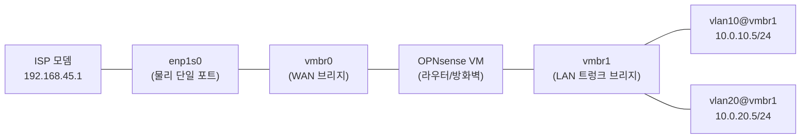

# Why? 왜 배움?

홈랩 서버 한 대를 NixOS 로 운영하면서 관리망과 서비스망을 분리하고 싶었다. 다만 물리 NIC 가 한 포트뿐이라 추가 스위치 없이 같은 케이블 위에 두 네트워크를 태깅으로 얹어야 했다.

그런데 막상 정리하려 하니 모르는 것이 많았다.

- NixOS 의 `networking.vlans` 와 `networking.bridges` 는 정확히 *어떤 커널 객체* 를 만드는가?
- 단일 NIC 에서 관리망과 서비스망을 분리하면서 *부팅 race 없이* 정적 IP 를 유지하려면 무엇을 선언해야 하는가?
- OPNsense VM 에서 트렁크를 수신해 게이트웨이 노릇을 하려면 게스트 측에 무엇이 필요한가?

답은 NixOS 의 선언적 `systemd.network` 옵션 (bridge / vlan / interface) + OPNsense 의 트렁크 수신 설정 + 5단계 실습 검증의 묶음에 있다.

> **개념과 다섯 구현체 비교, Vagrant / Multipass 실습은 별도 글 [About VLAN](../2026-01-20-About%20VLAN.md) 에서 다룬다.** 이 글은 NixOS 환경의 *구체 구축* 에 집중하며, 본문은 토폴로지 그림 → 단일 NIC 식별 → NixOS 선언 → OPNsense 6단계 → 5단계 실습 검증 순서로 진행한다.

# What? 뭘 배움?

## VLAN 과 Router-on-a-Stick 🌐

VLAN(Virtual LAN) 은 같은 물리 회선 위에서 패킷에 12비트 태그(VID) 를 부착해 L2 도메인을 논리적으로 분리하는 표준이다[^ieee-8021q]. 동일한 NIC 가 송수신하는 프레임이라도 VID 가 다르면 서로 다른 브로드캐스트 도메인에 속한다. 스위치가 태그를 보고 포워딩 결정을 내리므로, 한 케이블에 여러 네트워크를 다중화할 수 있다.

Router-on-a-Stick 은 라우터가 단 하나의 물리 포트(트렁크) 만으로 여러 VLAN 사이의 라우팅을 처리하는 구성이다[^rosa]. 트렁크는 모든 VID 의 프레임을 그대로 통과시키고, 라우터의 가상 서브인터페이스(`eth0.10`, `eth0.20`) 가 각 VLAN 의 게이트웨이 IP 를 보유한다. 별도 라우터 포트를 늘릴 수 없는 미니PC 한 대 환경에서 사실상 표준 패턴이다.

본문에서 다루는 토폴로지는 다음과 같다.



호스트(NixOS) 는 두 VLAN 모두에서 IP 를 보유하고, OPNsense VM 은 트렁크를 통해 모든 태그를 수신해서 VLAN 간 라우팅과 방화벽 정책을 적용한다. 외부 트래픽은 vmbr0 → OPNsense → ISP 경로로 빠진다.

> [!NOTE]
> **트렁크와 액세스 포트**
> Access 포트는 한 VID 의 태그를 제거하고 평문 프레임으로 단말에 전달한다. Trunk 포트는 여러 VID 의 태그된 프레임을 그대로 통과시킨다. Router-on-a-Stick 에서 라우터가 연결되는 포트는 항상 Trunk 다.

## 단일 NIC 환경의 네트워크 식별 🔎

NIC 이름이 옵션 키로 그대로 사용되므로, 설정을 작성하기 전에 정확한 인터페이스 이름을 확인한다. NixOS 는 systemd 의 predictable interface name 정책[^predictable] 을 따르므로 `eth0` 대신 `enp1s0`, `eno1` 같은 이름이 부여된다.

```bash
ip -br link show          # ← 인터페이스 한 줄 요약
```

본 환경에서는 다음 한 줄만 의미가 있다.

```text
enp1s0  UP  70:70:fc:07:35:cb <BROADCAST,MULTICAST,UP,LOWER_UP>
```

물리 이더넷 포트는 `enp1s0` 하나다. 무선(`wlp2s0`) 은 사용하지 않는다. 이 포트가 ISP 모뎀과 OPNsense WAN, 그리고 LAN 트렁크 전체를 동시에 담당한다.

> [!TIP]
> **물리 포트가 늘어나는 경우**
> 라우터 노드를 별도 박스로 분리하거나, 호스트에 NIC 두 장 이상이 있다면 Router-on-a-Stick 대신 WAN/LAN 포트를 분리하는 것이 단순하다. 그래도 VLAN 자체는 동일한 옵션으로 선언한다.

## DHCP 비활성화와 정적 IP 선언 🔒

서버 노드에서 `useDHCP = false` 로 두는 것은 NixOS 매뉴얼이 권장하는 기본값이다[^useDHCP]. 부팅 시 IP 가 바뀌면 K8s 의 kubelet 등록, OPNsense 의 게이트웨이 주소, SSH known_hosts 가 동시에 깨진다. 그리고 systemd-networkd 가 인터페이스를 올린 직후 DHCP 응답을 기다리느라 부팅이 수십 초 지연되는 사례도 운영에서 자주 만난다.

> [!NOTE]
> **`useDHCP = false` 권장 이유**
> NixOS 의 `networking.useDHCP` 기본값은 `true` 지만 서버 노드에서는 명시적으로 `false` 로 두는 것이 권장된다. 부팅 직후 시스템이 DHCP 응답을 기다리는 동안 systemd 의존 서비스 (`systemd-networkd-wait-online.service`) 가 타임아웃되거나 부팅이 수십 초 지연된다. 정적 IP 선언은 *부팅 race* 와 *IP 변경 추적 비용* 두 문제를 한 번에 없앤다.

본 구성은 모든 인터페이스를 정적 주소로 선언한다. WAN 측은 ISP 모뎀이 예약한 LAN 대역 정적 IP(`192.168.45.82/24`) 를, VLAN 10/20 은 사설 대역(`10.0.10.5/24`, `10.0.20.5/24`) 을 사용한다.

## NixOS 네트워크 선언 (Blueprint) 💻

NixOS 의 `networking` 모듈은 bridge / vlan / interface 세 가지를 모두 선언형으로 다룬다[^nix-networking]. 키 이름이 그대로 커널 인터페이스 이름이 되고, 인터페이스 간 의존성은 systemd-networkd 가 부팅 시 해결한다.

> [!NOTE]
> **`networking` 모듈과 systemd-networkd 의 관계**
> NixOS 의 `networking.bridges` / `networking.vlans` / `networking.interfaces` 옵션은 평가 시점에 systemd-networkd 의 `.netdev` (인터페이스 생성) + `.network` (IP / 라우팅) 파일로 컴파일된다. 부팅 시에는 systemd-networkd 데몬이 이 파일들을 읽어 인터페이스 의존성 그래프를 해결한다. 즉 *Nix 표현식* → *systemd unit* → *커널 객체* 의 두 단계 변환을 거친다.

```nix
# Network configuration for homelab server
{homelabConfig, ...}: {
  networking = {
    hostName = homelabConfig.hostname;
    networkmanager.enable = false;
    useDHCP = false;                                # ← 정적 IP 전제

    firewall = {
      enable = true;
      allowedTCPPorts = [22];
    };

    bridges = {
      "vmbr0" = {interfaces = ["enp1s0"];};         # ← WAN: 물리 NIC 포함
      "vmbr1" = {interfaces = [];};                 # ← LAN: 가상 트렁크 (물리 X)
    };

    vlans = {
      "vlan10" = {id = 10; interface = "vmbr1";};   # ← 802.1Q 태그 10
      "vlan20" = {id = 20; interface = "vmbr1";};   # ← 802.1Q 태그 20
    };

    interfaces = {
      "vmbr0".ipv4.addresses = [
        {address = "192.168.45.82"; prefixLength = 24;}
      ];
      "vlan10".ipv4.addresses = [
        {address = "10.0.10.5"; prefixLength = 24;}
      ];
      "vlan20".ipv4.addresses = [
        {address = "10.0.20.5"; prefixLength = 24;}
      ];
    };

    defaultGateway = "192.168.45.1";
    nameservers = ["8.8.8.8" "1.1.1.1"];
  };

  services.openssh = {
    enable = true;
    settings = {
      PermitRootLogin = "prohibit-password";
      PasswordAuthentication = false;
    };
  };
}
```

각 옵션의 의미는 다음과 같다.

| 옵션 | 생성되는 커널 객체 | 본 구성에서의 역할 |
|---|---|---|
| `bridges."vmbr0"` | Linux bridge | 물리 NIC 를 포함해 OPNsense WAN 으로 직결 |
| `bridges."vmbr1"` | Linux bridge | 물리 NIC 없이 VLAN 의 베이스 인터페이스로만 사용 |
| `vlans."vlan10"` | 802.1Q sub-interface (`vmbr1.10`) | VID 10 태그를 부착/제거 |
| `vlans."vlan20"` | 802.1Q sub-interface (`vmbr1.20`) | VID 20 태그를 부착/제거 |
| `interfaces."*".ipv4.addresses` | netlink address | 호스트가 각 네트워크에서 보유할 IP |
| `defaultGateway` | route table 0 의 default route | 모르는 목적지로 가는 출구 |

`vmbr1` 에 물리 인터페이스가 비어 있는 것이 핵심이다. 호스트가 vlan10/vlan20 에 직접 IP 를 보유하지만, 외부 라우팅은 OPNsense VM 이 vmbr1 의 트렁크 측에 붙은 자신의 가상 NIC 로 처리한다. 호스트는 같은 브리지를 공유함으로써 OPNsense 와 직결된 형태가 된다.

> [!WARNING]
> **defaultGateway 의 충돌**
> 본 예시는 `defaultGateway = "192.168.45.1"` 로 ISP 모뎀을 직접 지정한다. OPNsense 를 게이트웨이로 사용하려면 이 값을 `10.0.10.1` (OPNsense 의 VLAN 10 인터페이스) 로 바꾸고, ISP 모뎀의 라우팅 테이블 역시 OPNsense 로 향하도록 조정한다. 두 경로가 동시에 default 로 남으면 `ip route` 에 default 두 개가 등록되어 비결정적으로 동작한다.

## OPNsense VM 의 트렁크 수신 🛡️

OPNsense 는 FreeBSD 기반의 오픈소스 라우터/방화벽 배포다. 본 구성에서는 microvm.nix[^microvm] 또는 `libvirtd` 로 게스트 VM 하나를 띄우고, 두 개의 가상 NIC 를 각각 vmbr0(WAN), vmbr1(LAN 트렁크) 에 연결한다. LAN 측 NIC 가 트렁크 모드로 동작해야 VLAN 10/20 의 태그된 프레임이 그대로 게스트로 전달된다.

게스트 측 설정은 OPNsense 의 웹 UI 에서 다음 6단계를 차례로 적용한다. *두 VLAN 인터페이스 생성 (1~3 단계) → 정적 IP 부여 (4) → DHCP 활성 (5) → 방화벽 Pass 규칙 (6)* 의 묶음이며, 한 단계라도 빠지면 해당 VLAN 의 게스트 OS 가 게이트웨이에 도달하지 못한다.

| 단계 | 메뉴 | 설정 항목 |
|---|---|---|
| 1 | Interfaces → Assignments → VLANs | Parent: `vtnet1` (LAN 트렁크 NIC), VLAN tag: `10`, Description: `mgmt` |
| 2 | Interfaces → Assignments → VLANs | Parent: `vtnet1`, VLAN tag: `20`, Description: `svc` |
| 3 | Interfaces → Assignments | 두 VLAN 인터페이스를 각각 `OPT1`, `OPT2` 로 할당하고 Enable |
| 4 | Interfaces → OPT1 / OPT2 | IPv4 Configuration: Static, Address: `10.0.10.1/24`, `10.0.20.1/24` |
| 5 | Services → ISC DHCPv4 → OPT1 / OPT2 | Enable, Range: `10.0.10.100-200`, `10.0.20.100-200` |
| 6 | Firewall → Rules → OPT1 | Action: Pass, Source: `OPT1 net`, Destination: `any` (또는 `OPT2 net` 차단) |

`vtnet1` 은 VirtIO NIC 의 게스트 측 이름이다. KVM/libvirt 환경에서 기본 NIC 모델이 `virtio` 일 때 OPNsense 에 `vtnet0`, `vtnet1` 두 인터페이스가 등장한다. VLAN 부모 인터페이스를 잘못 고르면 트렁크 측이 아닌 WAN NIC 에 태그가 부착되어 외부 라우팅이 깨진다.

DHCP 서버를 VLAN 별로 분리하면, 게스트 OS 가 VLAN 에 진입하는 즉시 해당 대역의 IP 를 자동으로 할당받는다. 관리망(VLAN 10) 에는 SSH/모니터링 클라이언트만 들어오고, 서비스망(VLAN 20) 에는 K8s 워커 노드들이 들어가는 구성이 일반적이다.

방화벽 기본 정책은 OPNsense 가 기본적으로 모든 인바운드를 차단한다. 새 VLAN 인터페이스가 추가될 때마다 최소 한 줄의 Pass 규칙을 명시하지 않으면 해당 대역의 트래픽이 게이트웨이를 통과하지 못한다. VLAN 10 ↔ VLAN 20 간 트래픽은 별도의 Pass/Block 규칙으로 명시한다.

> [!CAUTION]
> **OPNsense 의 WAN 차단 함정**
> WAN 인터페이스의 기본 규칙은 RFC1918 사설 대역(`192.168.0.0/16` 등) 을 차단한다. ISP 모뎀이 사설 대역으로 LAN 측을 운영하는 경우 (본 구성의 `192.168.45.1`) WAN 측 인터페이스 설정에서 "Block private networks" 체크를 해제해야 한다. 해제하지 않으면 게이트웨이 자체에 도달하지 못해 인터넷 단절로 보인다.

> [!NOTE]
> **TODO — 사용자 환경 의존 항목**
> OPNsense 의 정확한 메뉴 경로와 옵션 위치는 22.1 / 23.7 / 24.x 버전에 따라 일부 다르다. 위 단계는 24.x 기준이며, 자신의 환경에서는 [공식 매뉴얼의 VLAN 절][^opnsense-vlan] 과 화면을 대조해 보완한다. 그리고 microvm.nix 의 NIC 인터페이스 노출 옵션 (`microvm.interfaces`) 의 구체 정의는 호스트의 microvm 설정 파일에 따라 다르므로 별도 글에서 다룬다.

# How? 어떻게 검증?

What 절에서 본 NixOS 선언과 OPNsense 6단계가 실제로 의도한 인터페이스 / VID / 라우팅을 만들었는지 5단계의 실습으로 확인한다. 각 실습은 본문의 다른 절에서 *주장한* 내용을 *명령으로 검증* 한다.

| 단계 | 본문 주장 (검증 대상) | 명령 | 기대 결과 |
|---|---|---|---|
| 1 | NixOS 선언이 커널 인터페이스를 만든다 | `ip -br link show` / `bridge link show` | `vlan10@vmbr1`, `vlan20@vmbr1` 등장 + `enp1s0 master vmbr0` |
| 2 | `vlans.<>.id` 가 802.1Q VID 로 정확히 반영된다 | `ip -d link show vlan10` | `vlan protocol 802.1Q id 10` |
| 3 | `defaultGateway` 한 줄이 외부 통신을 만든다 | `ip route` + `ping 8.8.8.8` | `default via 192.168.45.1 dev vmbr0` + 응답 OK |
| 4 | VLAN 격리는 L2 에서 동작하고 라우터가 포워딩 단일 토글이다 | 다른 VLAN ping (포워딩 off → on) | off 시 unreachable, on 시 응답 OK |
| 5 | 실제 프레임에 802.1Q 헤더가 부착된다 | `tcpdump -i vmbr1 -e -nn vlan 10` | `ethertype 802.1Q (0x8100), vlan 10` |

## 검증 환경 — NixOS VM 두 대로 재현 🧪

물리 홈랩에 직접 적용하기 전에, 동일한 구성을 격리된 환경에서 한 번 재현해 두면 옵션 누락을 미리 잡을 수 있다. NixOS 는 `nixos-rebuild build-vm` 으로 현재 설정을 QEMU 게스트로 띄우는 표준 경로[^nixos-vm] 가 있어, 호스트를 더럽히지 않고도 VLAN 동작을 검증할 수 있다.

검증은 두 대의 NixOS 게스트로 진행한다. 게스트 A 는 본문의 `homelab` 노드를 재현하고, 게스트 B 는 OPNsense 자리에서 동일한 트렁크 수신을 NixOS 의 `networking.vlans` 로 흉내 낸다.

| 게스트 | 역할 | 인터페이스 | IP |
|---|---|---|---|
| A | homelab 호스트 | `vmbr0`, `vmbr1`, `vlan10`, `vlan20` | `192.168.45.82`, `10.0.10.5`, `10.0.20.5` |
| B | 라우터 (OPNsense 대역) | `eth1`, `eth1.10`, `eth1.20` | `10.0.10.1`, `10.0.20.1` |

QEMU 의 `socket` 기반 가상 스위치로 두 게스트의 LAN NIC 를 연결하면, 호스트 커널을 거치지 않고도 VLAN 트렁크가 그대로 흐른다.

```bash
# 게스트 A 구성 파일을 빌드해 VM 으로 기동
nixos-rebuild build-vm --flake .#homelab        # ← result/bin/run-homelab-vm 생성
QEMU_NET_OPTS="hostfwd=tcp::2222-:22" ./result/bin/run-homelab-vm
```

이후 실습 1-3 은 게스트 A 내부에서, 실습 4 는 게스트 A ↔ 게스트 B 사이에서 진행한다.

## 실습 1 — 브리지와 VLAN 인터페이스 존재 확인 🔧

가장 먼저 NixOS 가 선언적으로 만든 인터페이스들이 실제로 커널에 등록되었는지 확인한다.

```bash
ip -br link show                                # ← 인터페이스 한 줄 요약
```

기대 출력은 다음과 같다.

```text
lo              UNKNOWN  00:00:00:00:00:00
enp1s0          UP       70:70:fc:07:35:cb
vmbr0           UP       70:70:fc:07:35:cb
vmbr1           UNKNOWN  52:14:af:16:8f:e6
vlan10@vmbr1    UP       52:14:af:16:8f:e6
vlan20@vmbr1    UP       52:14:af:16:8f:e6
```

`vlan10@vmbr1` 표기에서 `@` 뒤의 이름이 부모 인터페이스다. NixOS 의 `vlans."vlan10".interface = "vmbr1"` 선언이 그대로 부모 관계로 반영된 결과다. `enp1s0` 의 MAC 주소가 `vmbr0` 에 그대로 승계되는 것은 브리지가 슬레이브 NIC 의 MAC 을 그대로 사용하기 때문이다.

브리지의 멤버 관계는 별도 명령으로 확인한다.

```bash
bridge link show                                # ← 브리지 슬레이브 목록
```

```text
2: enp1s0: <BROADCAST,MULTICAST,UP,LOWER_UP> mtu 1500 master vmbr0 state forwarding
```

`master vmbr0` 표시가 `enp1s0` 이 `vmbr0` 의 슬레이브임을 의미한다. `vmbr1` 에는 슬레이브가 없으므로 이 출력에 등장하지 않는다.

## 실습 2 — 802.1Q 태그 ID 검증 🏷️

VLAN 인터페이스에 정확한 VID 가 부착되는지 `ip -d link show` 의 상세 출력으로 확인한다.

```bash
ip -d link show vlan10                          # ← -d: detail 모드
```

```text
7: vlan10@vmbr1: <BROADCAST,MULTICAST,UP,LOWER_UP> mtu 1500 ...
    link/ether 52:14:af:16:8f:e6 brd ff:ff:ff:ff:ff:ff
    vlan protocol 802.1Q id 10 <REORDER_HDR> ...
```

`vlan protocol 802.1Q id 10` 한 줄이 핵심이다. 이 라인이 출력되어야 NixOS 의 `vlans."vlan10".id = 10` 선언이 커널의 802.1Q 모듈에 정확히 반영된 것이다. `vlan20` 도 동일한 방식으로 `id 20` 이 표시되어야 한다.

VID 가 0 으로 표시되거나 라인 자체가 누락된다면, `vlans` 옵션의 키 이름과 `interface` 값이 일치하지 않거나 부모 브리지가 down 상태인 경우가 대부분이다.

## 실습 3 — 게이트웨이와 외부 통신 🛰️

라우팅 테이블에 default 가 한 줄만 살아 있는지를 먼저 확인한다.

```bash
ip route | grep default
```

```text
default via 192.168.45.1 dev vmbr0 proto static
```

`vmbr0` 을 통해 ISP 모뎀(`192.168.45.1`) 으로 향하는 한 줄이 보이면 정상이다. 다음으로 게이트웨이와 외부 호스트, 그리고 자기 자신의 VLAN IP 까지 차례로 ping 한다.

```bash
ping -c 3 192.168.45.1                          # ← ISP 모뎀 (vmbr0 경유)
ping -c 3 google.com                            # ← 외부 통신 + DNS
ping -c 3 10.0.10.5                             # ← 자기 vlan10 IP (loopback 성격)
```

세 명령이 모두 0% packet loss 로 응답하면 다음 세 가지가 동시에 검증된다. 첫째, vmbr0 → ISP 경로가 살아 있다. 둘째, nameservers 옵션이 `/etc/resolv.conf` 로 반영되었다. 셋째, vlan10 인터페이스가 자기 IP 를 라우팅 테이블에 등록했다.

## 실습 4 — VLAN 간 격리와 트렁크 동작 🔀

두 게스트가 같은 트렁크에 연결되어 있을 때, 다른 VLAN 사이의 트래픽이 라우터를 거치지 않으면 도달하지 않는다는 사실을 확인한다. 게스트 A 의 `vlan10` 에서 게스트 B 의 `vlan20` 측 IP 로 직접 ping 을 보낸다.

```bash
# 게스트 A 에서 실행
ping -I vlan10 -c 3 10.0.20.1                   # ← 다른 VLAN 으로 직접 시도
```

라우터(게스트 B) 가 VLAN 간 포워딩을 활성화하지 않은 초기 상태에서는 응답이 오지 않거나 `Destination Host Unreachable` 이 출력된다. VLAN 격리가 L2 레벨에서 정확히 동작하는 증거다.

게스트 B 에서 IPv4 포워딩을 활성화한 뒤 다시 시도한다.

```bash
# 게스트 B 에서 실행
sudo sysctl -w net.ipv4.ip_forward=1            # ← 라우터 동작 활성화
```

그 다음 게스트 A 에서 동일한 ping 을 다시 보내면 응답이 돌아온다. 라우터의 포워딩 한 줄이 두 VLAN 사이의 트래픽을 통과시키는 단일 토글임이 확인된다. OPNsense 의 방화벽 규칙도 같은 단계의 추상화 위에 동작한다.

## 실습 5 — tcpdump 로 태그 직접 관찰 🔬

802.1Q 태그가 실제로 프레임에 부착되는지를 raw 레벨에서 확인하려면 부모 브리지(`vmbr1`) 측에서 패킷을 캡처한다.

```bash
sudo tcpdump -i vmbr1 -e -nn vlan 10            # ← VLAN 10 태그된 프레임만
```

`-e` 옵션은 L2 헤더를 출력하고, `vlan 10` 필터는 VID 10 의 프레임만 통과시킨다. 위 명령을 켜 둔 상태에서 다른 셸에서 `ping -I vlan10 10.0.10.1` 을 보내면 다음과 같은 라인이 출력된다.

```text
12:34:56.123 52:14:af:16:8f:e6 > ff:ff:ff:ff:ff:ff, ethertype 802.1Q (0x8100), vlan 10, p 0,
  ARP, Request who-has 10.0.10.1 tell 10.0.10.5, length 28
```

`ethertype 802.1Q (0x8100)` 와 `vlan 10` 두 표기가 핵심이다. 평문 이더넷 프레임이 아니라 802.1Q 헤더가 부착된 태그 프레임임이 직접 확인된다. 같은 명령을 `vlan 20` 으로 바꾸면 VLAN 20 측 트래픽도 동일한 방식으로 보인다.

# Remark

본 구성의 핵심을 한 표로 정리하면 다음과 같다.

| 계층 | 객체 | 본문 절 | 검증 명령 |
|---|---|---|---|
| 물리 | `enp1s0` | 단일 NIC 환경의 네트워크 식별 | `ip -br link` |
| L2 브리지 | `vmbr0`, `vmbr1` | NixOS 네트워크 선언 | `bridge link show` |
| 802.1Q VLAN | `vlan10`, `vlan20` | NixOS 네트워크 선언 / 실습 2 | `ip -d link show vlanN` |
| L3 IP | `192.168.45.82`, `10.0.10.5`, `10.0.20.5` | NixOS 네트워크 선언 | `ip -br addr` |
| 라우팅 | `defaultGateway` | DHCP 비활성화 / 실습 3 | `ip route` |
| 게이트웨이 | OPNsense VM | OPNsense VM 의 트렁크 수신 | 실습 4 (포워딩) |

NixOS 의 `networking` 모듈은 bridge / vlan / interface 세 옵션이 그대로 커널 객체로 매핑된다. 옵션 키 이름이 인터페이스 이름이 되고, `vlans.<name>.interface` 가 부모 관계를 만들며, `interfaces.<name>.ipv4.addresses` 가 L3 주소를 부착한다. 한 파일 안에서 토폴로지 전체가 결정되므로 `ip` 명령으로 사후 추적할 항목과 옵션 한 줄이 1:1 로 대응된다.

운영 관점에서 한 가지 자주 만난 함정은 `defaultGateway` 의 이중 등록이었다. ISP 모뎀이 DHCP 로 default route 를 한 줄 박아 두고, NixOS 옵션이 또 한 줄 박으면, 같은 destination 으로 향하는 두 경로가 metric 차이로만 정렬된다. 이 상황에서는 한쪽 인터페이스를 down 시켜야 외부 통신이 끊기는 원인을 추적할 수 있다. `useDHCP = false` 를 모든 인터페이스에 명시적으로 적용한 뒤, default 한 줄만 남기는 것이 가장 단순한 운영 패턴이다.

이 글이 다루지 않은 인접 주제는 세 가지다. 첫째, OPNsense 의 방화벽 규칙 세부(NAT, port forward, IDS) 는 본 글의 범위 밖이며 별도 글에서 다룬다. 둘째, microvm.nix 로 OPNsense 같은 비-NixOS 게스트를 띄우는 인터페이스 정의는 06번 글의 microvm 절과 함께 읽으면 그림이 맞춰진다[^post-microvm]. 셋째, VLAN 위에서 K8s 노드를 분리해 서비스망/관리망을 격리하는 패턴은 05번 글의 K8s 클러스터 구축과 결합된다[^post-k8s].

# Reference

[^ieee-8021q]: <https://en.wikipedia.org/wiki/IEEE_802.1Q> — IEEE 802.1Q VLAN 표준. 12비트 VID, Ethertype 0x8100, 태그 부착 포지션.
[^rosa]: <https://en.wikipedia.org/wiki/Router_on_a_stick> — Router-on-a-Stick 구성 개요. 단일 트렁크에서 inter-VLAN 라우팅.
[^predictable]: <https://systemd.io/PREDICTABLE_INTERFACE_NAMES/> — systemd 의 predictable interface name 정책. `enp1s0` 등의 명명 규칙.
[^useDHCP]: <https://nixos.org/manual/nixos/stable/options#opt-networking.useDHCP> — NixOS 매뉴얼 networking.useDHCP 옵션.
[^nix-networking]: <https://nixos.wiki/wiki/Networking> — NixOS Wiki Networking. bridges / vlans / interfaces 옵션 요약.
[^microvm]: <https://github.com/astro/microvm.nix> — microvm.nix 프로젝트. NixOS 호스트 위 게스트 VM 선언.
[^opnsense-vlan]: <https://docs.opnsense.org/manual/other-interfaces.html#vlan> — OPNsense 공식 매뉴얼. VLAN 인터페이스 할당 및 부모 인터페이스 선택.
[^nixos-vm]: <https://nixos.org/manual/nixos/stable/#sec-changing-config> — `nixos-rebuild build-vm` 으로 현재 설정을 QEMU 게스트로 기동.
[^post-microvm]: 본 시리즈 06 — NixOS MicroVM 으로 VM 생성 및 관리.
[^post-k8s]: 본 시리즈 05 — NixOS K8S Master Worker 노드 구축.
