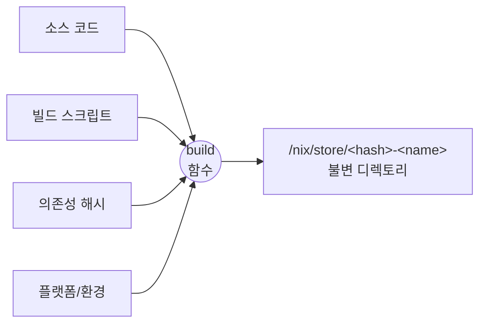
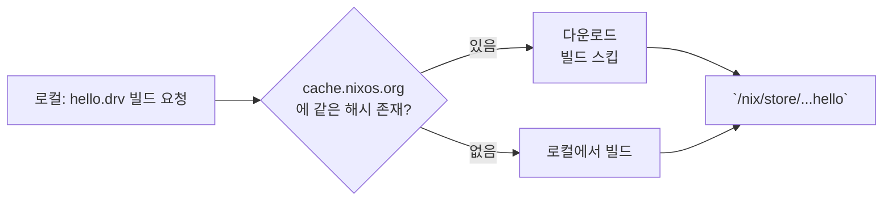
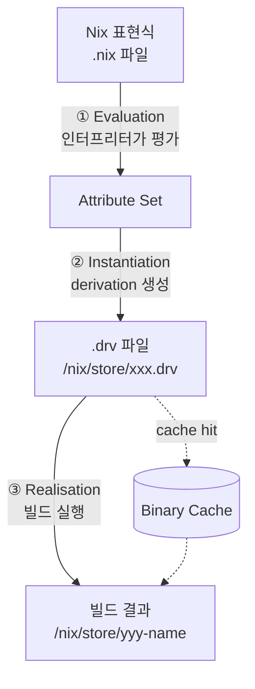
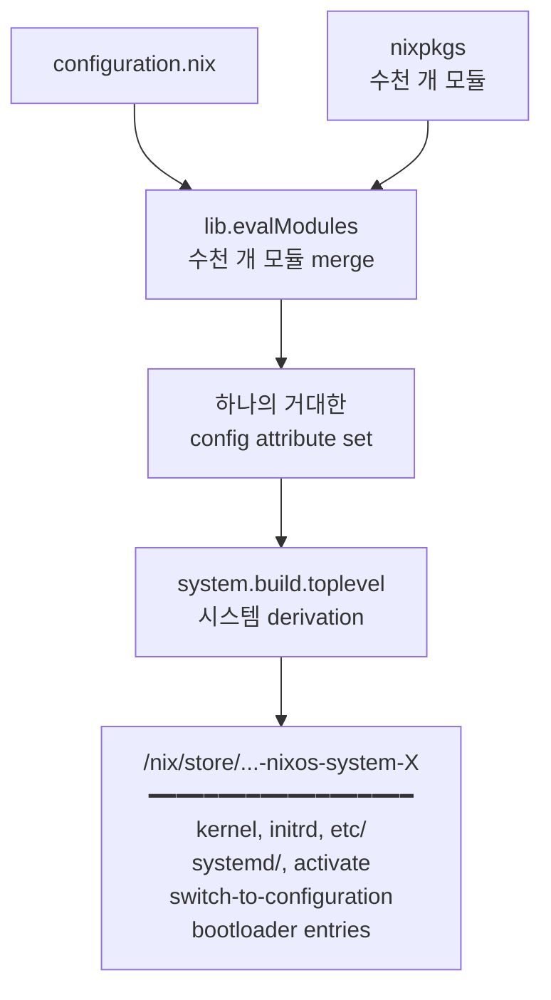
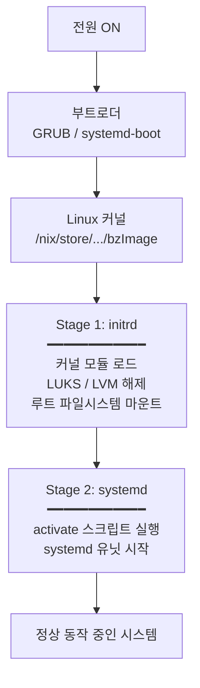
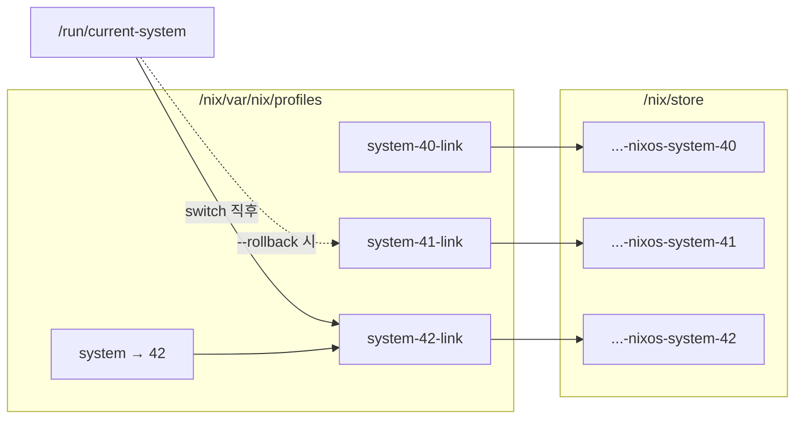
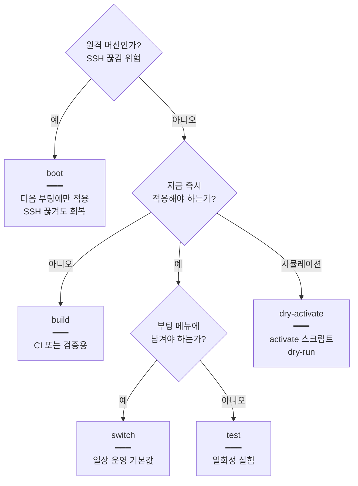

# Why?

NixOS 홈랩을 운영하면서 Terraform 이나 OpenTofu 로도 풀지 못한 OS 레벨 구성, 즉 커널, 부트 파라미터, 시스템 서비스가 NixOS 에서는 한 파일로 묶이는 원리가 무엇인지 정리할 필요를 느꼈다. 기존 IaC 도구는 클라우드 리소스의 선언적 관리에는 충분하다. 그러나 OS 내부, 즉 어떤 커널 모듈을 적재하는지, `/etc` 의 어떤 파일이 누구에 의해 관리되는지, 시스템 업그레이드가 원자적인지까지는 책임지지 않는다.

그런데 막상 정리하려 하니 모르는 것이 많았다.

- 패키지 매니저는 흔한 도구인데 NixOS 는 왜 별도의 모델이 필요했는가?
- `nix-store`, `derivation`, `system.build.toplevel` 같은 용어는 각각 무엇이고 어떻게 연결되는가?
- 부팅 시 `boot.kernelParams` 같은 옵션이 실제로 어느 단계에서 어떻게 적용되는가?
- 커널 업데이트 후 롤백이 *한 줄 명령* 으로 가능한 이유는 무엇인가?

답은 세 겹의 추상에 있다 — Nix (패키지 단위 순수 함수) / NixOS (시스템 한 대 단위로 확장) / 운영 (rebuild 서브커맨드와 generation).

이 글은 가장 아래의 순수 함수 모델부터 시작해 시스템 한 대로 확장되는 과정을 따라간다. What 절에서 세 추상의 자료구조를 정리하고, How 절에서 같은 모델이 운영 단계의 트레이드오프 (rebuild 모드, GC, 캐시, flakes) 와 실습 명령으로 어떻게 이어지는지를 본다.

# What?

## 들어가며: NixOS 를 이해하려면 어디서부터 시작해야 하는가 🔍

NixOS 의 모델은 세 겹의 추상으로 구성된다.

```
NixOS         =  ( Nix 모델 ) 을 OS 단위로 확장한 것
Nix           =  ( 순수 함수 모델 ) 을 패키지 빌드에 적용한 것
순수 함수 모델 =  "같은 입력 → 같은 출력, 부작용 없음"
```

설명 순서는 두 방향이 가능하다. 이 글은 가장 아래의 순수 함수 모델부터 시작해 OS 한 대로 확장되는 과정을 따라간다. 원자적 업그레이드, 즉각적 롤백, 커널 단위 선언적 구성 같은 NixOS 의 모든 속성이 순수 함수 모델에서 따라 나오는 귀결이기 때문이다.

따라서 다음 순서로 정리한다.

1. **Nix 의 출발점** — 어떤 문제를 어떤 발상으로 풀었는가
2. **Nix 동작 원리** — 그 발상이 코드 수준에서 어떻게 구현되어 있는가
3. **NixOS 동작 원리** — Nix 모델을 OS 한 대로 확장하면 무엇이 따라오는가

## Nix 의 출발점: 패키지 매니저를 순수 함수로 모델링하다 🏗️

NixOS 의 동작 원리는 그 기반인 Nix 부터 본다. Nix 의 설계 의도는 이 도구가 처음에 어떤 문제를 풀려고 만들어졌는지에서 출발해야 가장 명확하게 정리된다.

### 기존 패키지 매니저의 공통적 한계

Nix 를 살펴보기 앞서 Nix 와 다른 패키지 매니저가 공유하는 문제부터 정리한다. 이 문제가 명확해야 Nix 의 차이가 무엇인지가 드러난다.

dpkg, rpm, apt, yum 같은 일반적인 패키지 매니저는 출신과 명령어가 달라도 한 가지 공통점을 가진다. 모두 **글로벌 가변 상태(global mutable state)** 위에서 동작한다는 점이다[^shopify]. `/usr/lib`, `/usr/bin` 같은 공유 디렉토리에 파일을 직접 쓰고, 새 버전을 설치하면 옛 버전을 덮어쓴다.

이 모델은 다음과 같은 고질적 문제를 공통적으로 만들어 왔다.

- **Dependency Hell**: 같은 라이브러리의 서로 다른 버전이 한 디렉토리를 공유해야 하므로 한 패키지가 요구하는 버전과 다른 패키지가 요구하는 버전이 충돌하면 어느 한쪽이 깨진다. Dolstra 는 이 한계의 뿌리를 "여러 변종을 같은 경로에 둘 수 없다는 가정" 에서 찾는다[^dephell].
- **불완전한 의존성 명세**: 패키지가 무엇에 의존하는지 선언해도 실제 빌드와 런타임은 시스템에 우연히 깔려 있는 라이브러리에 암묵적으로 의존한다. 다른 머신에 옮기면 "여기서는 됐는데 거기서는 안 된다" 가 반복된다[^4].
- **비-원자적 업그레이드**: apt 나 yum 이 업그레이드 중간에 끊기면 시스템은 "반쯤 새 버전, 반쯤 옛 버전" 상태로 남는다. 파일 단위로 덮어쓰는 모델에서는 이 중간 상태를 막을 구조적 수단이 없다[^nix-profiles].
- **명령형 구성의 drift**: Ansible 이나 Chef 로 한 번 맞춰 둔 시스템도 시간이 지나면 선언된 상태와 실제 상태가 어긋난다. 누군가 손으로 한 줄 고치거나 명령형 스크립트가 부분 실패하는 순간부터 시스템은 누구도 정확히 기술할 수 없는 상태가 된다[^drift].

위 네 가지 문제는 "가변 상태를 어떻게 안전하게 다룰 것인가" 라는 한 질문에서 갈라진 갈래다. Dolstra 박사는 이 질문의 해답으로 **순수 함수형 프로그래밍** 을 가져왔다.

### Dolstra 박사의 통찰: 빌드를 순수 함수로

2003년 네덜란드 Utrecht 대학에서 박사 과정을 진행하던 **Eelco Dolstra** 가 이 답을 패키지 관리에 가져왔다[^1]. 그가 2006년에 방어한 박사학위 논문 *The Purely Functional Software Deployment Model*[^2] 은 Nix 의 모든 설계 사상이 담긴 원전이며, 핵심 명제는 논문 1장 첫 문장으로 압축된다.

> "given identical inputs, the software should behave the same on an end-user machine as on the developer machine"
> 동일한 입력이 주어졌다면, 소프트웨어는 개발자 머신과 사용자 머신에서 동일하게 동작해야 한다.

말로 풀어쓰면 당연한 명제지만 이 속성을 수학적으로 보장하는 패키지 매니저는 그전까지 존재하지 않았다.

Dolstra 의 답은 한 문장으로 요약된다.

> **"패키지 빌드를 순수 함수로 모델링하자."**

함수형 프로그래밍의 함수는 입력만으로 출력이 결정되고 부작용이 없다. 같은 입력은 항상 같은 출력을 낸다. 이를 패키지 빌드에 그대로 적용하면 다음 그림이 나온다.



빌드의 **입력** 은 소스 코드, 빌드 스크립트, 모든 의존성의 정확한 해시, 대상 플랫폼이다. **출력** 은 `/nix/store/<해시>-<이름>` 경로에 놓이는 불변 디렉토리다. 같은 입력은 같은 출력 경로로 결정되며, 빌드는 sandbox 안에서 실행되어 외부 상태에 의존할 수 없다.

이 발상에서 다음 다섯 가지 속성이 따라 나온다.

### 이 모델이 자동으로 만들어내는 이점들

빌드를 순수 함수로 정의하면 별도 메커니즘 없이 다섯 가지 속성이 따라 나온다. 아래 속성은 Nix 의 개발자가 따로 구현한 기능이 아니라, 그 정의 자체의 수학적 귀결이다. 다섯 가지가 모두 같은 한 가지 모델에서 갈라져 나왔다는 점이 NixOS 모델 이해의 핵심이다.

- **재현성(Reproducibility)**: 빌드의 모든 입력 — 소스, 의존성 해시, 환경 변수, 플랫폼 — 이 함수의 인자에 포함되므로 같은 입력은 언제 어디서 빌드하더라도 비트 단위로 같은 출력을 낸다. "내 머신에서는 됐는데" 라는 말이 원리적으로 사라진다[^3].
- **원자적 업그레이드와 즉각적 롤백**: 새 generation 은 store 안에 통째로 빌드된 뒤 마지막에 symlink 하나만 교체되므로 업그레이드는 단일 syscall 로 완결된다. 실패 시에도 이전 generation 이 디스크에 그대로 남아 한 줄로 되돌릴 수 있다[^nix-profiles].
- **동일 패키지의 다중 버전 공존**: store path 가 `/nix/store/<해시>-<이름>` 으로 해시에 의해 분리되므로 같은 패키지의 여러 버전이 같은 디렉토리를 두고 다투지 않는다. 한 머신 안에서 Python 3.10 과 3.12 가 동시에 살아 있을 수 있다[^8].
- **선언적 시스템 구성**: 커널, systemd 유닛, /etc 의 파일, 사용자 계정처럼 시스템 한 대의 원하는 상태가 `configuration.nix` 한 파일의 하나의 attribute set 으로 표현된다. 명령의 순서가 아니라 결과의 모양으로 시스템을 정의하는 방식이다[^nixos-config].
- **Cross-Compilation**: 빌드 함수의 입력에 대상 플랫폼(`hostPlatform`, `targetPlatform`) 이 포함되므로 같은 expression 으로 ARM, x86, RISC-V 산출물을 만들어낼 수 있다. nixpkgs 는 이 메커니즘을 first-class 로 다룬다[^cross].

Dolstra 가 2006년 논문에서 제시한 아이디어 — 격리, 선언적 구성, 원자적 배포, immutable infrastructure — 는 그 후 십여 년 동안 Docker, Terraform, Kubernetes 같은 도구로 분산되어 재발견되었다[^4]. 그러나 이들 중 어느 것도 운영체제 한 대 전체를 한 번에 다루지는 못했다. NixOS 는 이 모델을 OS 단위로 확장한다.

## Nix 동작 원리: 추상에서 구현으로 🍯

이 추상은 `/nix/store` 와 derivation 두 자료구조로 구체화된다.

### 핵심 데이터 구조: /nix/store

Nix 의 모든 빌드 결과물은 단 한 장소, `/nix/store` 에 저장된다[^8]. `/usr/bin`, `/usr/lib`, `/usr` 같은 전통적인 디렉토리는 NixOS 에 존재하지 않는다. 예외는 `/bin/sh` 정도이며 이것조차 store 안의 bash 로 향하는 심볼릭 링크다. store 안의 모든 항목은 다음과 같은 형식의 경로를 가진다.

```
/nix/store/5rnfzla9kcx4mj5zdc7nlnv8na1najvg-firefox-3.5.4/
            └─────────── hash ───────────┘ └── name ──┘
```

여기서 `5rnf...` 는 임의 문자열이 아니라 **이 패키지를 빌드할 때 사용된 모든 입력값의 암호학적 해시** 다. 입력이 한 글자라도 다르면 해시가 달라지고, 따라서 store path 도 달라진다.

이로부터 다음 두 속성이 물리적으로 보장된다.

- **격리(Isolation)**: 같은 이름의 다른 버전은 다른 해시를 가지므로 같은 디렉토리를 두고 충돌할 수 없다.
- **불변성(Immutability)**: 한 번 빌드된 store path 는 절대 덮어쓰이지 않는다. "업그레이드" 는 새 store path 를 추가로 만들고 시스템이 그것을 가리키게 하는 동작이다.

`/etc` 같은 시스템 설정 디렉토리도 예외가 아니다. NixOS 에서 `/etc/ssh/sshd_config` 를 따라가 보면 다음과 비슷한 곳으로 향하는 심볼릭 링크임이 확인된다.

```
/nix/store/s2sjbl85xnrc18rl4fhn56irkxqxyk4p-sshd_config
```

설정 파일조차 derivation 의 출력물이라는 의미다. 이것이 NixOS 의 거의 모든 구성의 출발점이다.

### Derivation: 빌드의 사양서 (.drv)

"어떤 입력이 어떤 store path 를 만든다" 라는 함수 관계를 기계가 읽을 수 있는 형태로 표현한 것이 **derivation** 이다[^5][^6]. derivation 은 store 안에 `.drv` 파일로 저장되며, 빌드에 필요한 모든 정보를 담은 매니페스트 파일이다.

그 안에는 다음 7가지 필드가 들어 있다.

| 필드          | 의미                                                  |
| ------------- | ----------------------------------------------------- |
| **outputs**   | 이 derivation 이 만들어낼 store path 들               |
| **inputDrvs** | 빌드 전에 먼저 빌드되어야 할 다른 derivation 들       |
| **inputSrcs** | 이미 store 에 있어야 할 입력 (소스 파일 등)           |
| **platform**  | 어떤 플랫폼에서 빌드해야 하는가 (e.g. `x86_64-linux`) |
| **builder**   | 빌드를 수행할 실행 파일 (보통 bash)                   |
| **args**      | builder 에 전달할 인자                                |
| **env**       | builder 에 전달할 환경 변수                           |

이 7개의 필드가 곧 함수의 입력이다. 이들 중 무엇 하나라도 바뀌면 derivation 의 해시가 바뀌고 출력 store path 도 바뀐다. 재현성과 불변성의 수학적 토대가 여기에 있다.

REPL 에서 가장 작은 derivation 을 만들고 그 `.drv` 의 내용을 확인할 수 있다. 자세한 명령은 §How 에서 다룬다[^7][^nix-lang][^zero-nix].

### Binary Cache: 분산 배포에서도 작동하는 이유

매번 모든 패키지를 처음부터 빌드한다면 사용성이 떨어진다. 이 의문에 대한 Nix 의 해답은 Binary Cache 다. 같은 derivation 은 항상 같은 결과를 만들어내므로, 누가 미리 빌드해 둔 결과물을 가져와도 그것이 직접 빌드한 것과 비트 단위로 동일하다는 보장이 있다. Nix 는 이 성질을 이용해 분산 캐시를 둔다.



기본 캐시는 `cache.nixos.org` 이며, 사용자나 조직이 자체 캐시를 운영할 수 있다 (Cachix[^cachix], Attic[^attic] 등). 직접 빌드와 다운로드 결과가 비트 단위로 같다는 보장이 있기 때문에 이 캐시는 단순한 성능 도구가 아니라 분산 신뢰 시스템으로 기능한다. Nix 가 단순한 빌드 도구를 넘어 대규모 패키지 배포 시스템까지 다룰 수 있는 근거가 여기에 있다.

### 정리: Nix 의 빌드 파이프라인

지금까지의 내용을 한 장의 흐름도로 정리하면 다음과 같다.



세 단계는 서로 다른 형태의 결과물을 반환한다. 평가는 값을, instantiation 은 `.drv` 경로를, realisation 은 실제로 빌드된 디렉토리를 반환한다. 점선으로 표시된 *cache hit* 경로는 instantiation 단계에서 계산된 `.drv` 의 해시가 binary cache 에 이미 있을 때 realisation 단계의 빌드를 건너뛰고 결과 store path 를 그대로 다운로드한다는 의미다. 같은 입력은 같은 해시를 만들기 때문에 이 단축이 가능하다. `nix-build` 와 `nix build` 같은 명령어는 이 세 단계를 한 번에 묶어 실행하는 편의 명령이며, 내부적으로는 항상 이 파이프라인을 따른다.

## NixOS 동작 원리: Nix 모델을 OS 한 대로 확장하기 :nix-logo:

Nix 가 패키지 단위 추상이라면 NixOS 는 시스템 한 대 단위 추상이다.

> **"운영체제 한 대 전체도, 결국 하나의 derivation 이다."**

커널, 부트로더 설정, `/etc` 의 파일, systemd 유닛, 활성화 스크립트가 모두 한 derivation 의 입력으로 들어가, 한 store path 라는 출력물로 묶여 나온다.

### Module System: configuration.nix → 거대한 attribute set

NixOS 사용자는 `/etc/nixos/configuration.nix` 한 파일에 시스템의 원하는 상태를 적는다.

```nix
{ config, pkgs, ... }:
{
  services = {
    openssh.enable = true;
    # ...
  };
  users.users.alice = { ... };
  boot.kernelPackages = pkgs.linuxPackages_latest;
}
```

이 파일 한 장이 시스템의 전부는 아니다. 실제로는 nixpkgs 안에 들어 있는 수천 개의 모듈이 함께 평가된다. 각 모듈은 두 가지를 정의한다.

- **options**: 어떤 옵션을 받을 수 있는가 (타입, 기본값, 설명)
- **config**: 그 옵션이 주어졌을 때 무엇을 만들어낼 것인가

수천 개의 모듈은 nixpkgs 의 `lib.evalModules` 함수에 의해 하나의 거대한 attribute set 으로 합쳐진다[^12]. 이 병합 과정에서 옵션의 우선순위, 타입 검사, 기본값 적용이 수학적으로 정의된 규칙에 따라 이루어진다. 결과적으로 `config.boot.kernelPackages` 나 `config.services.openssh.settings.PermitRootLogin` 같은 모든 시스템 설정 값이 단 하나의 값으로 결정된다.

### System Derivation: 운영체제도 결국 하나의 .drv

이 거대한 attribute set 의 정점에 있는 값이 `config.system.build.toplevel` 이다[^11]. 이것은 시스템 한 대 전체를 표현하는 단 하나의 derivation 이다.

> [!NOTE]
> **시스템 derivation (`system.build.toplevel`)**
> NixOS 가 평가한 모든 모듈의 결과를 하나로 묶은 derivation 의 약칭이다. 커널 이미지, initrd, systemd 유닛 파일, `/etc` 의 모든 심볼릭 링크, activate 스크립트, 부트로더 설정이 그 출력 store path 한 디렉토리 안에 모두 포함된다. 본문 이후의 모든 동작 — 4단계 빌드 파이프라인, generation 등록, rollback, 부팅 — 은 이 한 store path 를 기준으로 정의된다. 그 출력 store path 는 다음 것들을 모두 포함한다.

- **kernel**: `boot.kernelPackages` 로부터 빌드되거나 캐시에서 가져온 커널 이미지
- **initrd**: 부팅 초기에 사용될 ramdisk
- **etc**: `/etc` 에 심볼릭 링크될 설정 파일들의 모음
- **systemd 유닛**: 모든 서비스의 unit 파일들
- **activate**: 새 시스템을 적용할 때 실행될 bash 스크립트
- **bin/switch-to-configuration**: 활성화 로직을 담은 Perl 스크립트
- **kernel-modules**: 적재될 커널 모듈들
- **bootloader 설정**: GRUB / systemd-boot 메뉴 항목

이 모든 것이 하나의 store path 안에 묶여 있다는 사실이 NixOS 의 모든 속성을 결정한다.

따라서 "커널을 어떻게 관리하는가" 라는 이 글의 첫 질문에 대한 답은 한 문장으로 압축된다. **커널은 별도의 메커니즘으로 관리되는 것이 아니라, 시스템 derivation 이라는 거대한 함수의 한 입력이다.**



### Build/Deploy 4단계: Eval → Drv → Realise → Activate

`nixos-rebuild switch` 한 줄을 입력하면 내부적으로 다음 4단계가 차례로 일어난다. 앞 세 단계는 §Nix 동작 원리에서 본 파이프라인 그대로다. 마지막 한 단계가 추가로 붙는다.

Nix 인터프리터가 `/etc/nixos/configuration.nix` 를 시작점으로 nixpkgs 의 모든 관련 모듈을 읽고 평가한다. `boot.kernelPackages`, `services.xserver.enable` 같은 옵션이 모두 결정되어 거대한 attribute set 이 된다.

평가된 결과로부터 `system.build.toplevel.drvPath` 가 계산된다. 이 시점에 store 에는 `.drv` 파일만 존재할 뿐 실제 바이너리는 아직 없다.

`.drv` 들이 의존성 순서대로 실제로 빌드된다. 캐시에 있는 것은 다운로드되고, 없는 것만 로컬에서 빌드된다. 결과는 `/nix/store/.../nixos-system-<host>-<version>` 이라는 단 하나의 디렉토리다.

새 시스템 디렉토리 안의 `bin/switch-to-configuration` 스크립트가 실행된다[^9]. 이 스크립트는 이전 시스템과 새 시스템을 비교하여, 어떤 systemd 유닛을 reload 할지, 어떤 것을 restart 할지, 어떤 것을 새로 시작할지를 결정한다. 그 후 `/run/current-system` 심볼릭 링크를 새 시스템 path 로 바꾼다. 단 한 번의 syscall 로 시스템 전체가 새 generation 으로 전환된다. 이것이 원자적 업그레이드의 메커니즘이다.

이 4단계 중 ①~③ 은 빌드 시점의 동작이고 ④ 는 적용 시점의 동작이다. 다음 섹션에서 다룰 부팅 시점의 Stage 1/2 와는 구분된다.

### Boot 파이프라인: Stage 1 (initrd) & Stage 2 (systemd)

위 4단계가 시스템을 새로 빌드해서 적용하는 과정이라면, 다음은 전원을 켰을 때 그 시스템이 어떻게 동작하는지에 대한 흐름이다. NixOS 도 Linux 이므로 부팅 흐름의 큰 틀은 같지만, 모든 단계가 Nix 가 미리 빌드해 둔 산출물 위에서 동작한다는 점이 다르다.



**Stage 1 (initrd)** 은 부트로더가 커널을 로드한 직후 실행되는 초기 단계다. NixOS 는 `boot.initrd.availableKernelModules` 에 적힌 모듈들을 포함하는 임시 파일 시스템(initrd)을 빌드해 둔다. 이 단계의 역할은 다음과 같다.

- 필요한 커널 모듈 적재
- LVM, LUKS 같은 디스크 암호화 해제
- 루트 파일 시스템 마운트

이 모든 과정은 Nix 가 빌드 시점에 생성해 둔 `init` 셸 스크립트에 의해 통제된다.

**Stage 2 (systemd)** 는 루트 파티션이 마운트된 후 실제 OS 서비스가 시작되는 단계다. 이때 핵심적인 동작은 다음 두 가지다.

- 위 ④ 의 activate 스크립트가 실행되어 `/etc` 의 심볼릭 링크들이 새 store path 를 가리키도록 갱신된다.
- systemd 가 `boot.kernelParams` 와 함께 정의된 모든 시스템 서비스를 시작한다.

NixOS 는 `/etc` 의 거의 모든 파일을 직접 관리하지 않는다[^8]. `/etc` 의 대부분은 `/nix/store` 안의 derivation 출력물로 향하는 심볼릭 링크다. 사용자가 `/etc/ssh/sshd_config` 를 손으로 편집해도 다음 활성화 시점에 그 변경은 흔적 없이 사라진다. 시스템의 실제 상태는 언제나 `configuration.nix` 안에 있다.

### Generation 과 Rollback

이 빌드 모델 위에서 NixOS 는 generation 개념을 사용한다. ④ Activation 단계에서 `bin/switch-to-configuration` 스크립트가 실행되어 새 시스템에 대해 `/run/current-system` 산하에 새 시스템 path 가 생성된다. 즉 새 빌드가 실행될 때마다 generation 이 기록된다. 이 generation 을 통해 특정 시점으로 rollback 할 수 있다.

> [!NOTE]
> **Generation**
> `/nix/var/nix/profiles/system-<N>-link` 형식으로 디스크에 남는 시스템 한 대의 한 시점 스냅샷이다. 각 번호는 한 번의 `nixos-rebuild` 결과에 대응하며, 시스템 derivation 의 store path 를 가리키는 심볼릭 링크다. 디스크에 남아 있는 한 어느 시점으로든 한 줄 명령 또는 부트로더 메뉴 선택으로 되돌아갈 수 있다.

```bash
# 지금까지 빌드된 모든 generation
sudo nix-env --list-generations --profile /nix/var/nix/profiles/system

#   1   2024-01-15 10:23
#   2   2024-01-18 14:01
#   ...
#   42  2024-05-08 09:12   (current)
```

각 generation 은 부트로더 메뉴에 그대로 등록된다. 새 커널로 부팅했는데 패닉이 발생하거나 디스플레이가 잡히지 않으면 재부팅해서 GRUB 메뉴에서 이전 generation 을 선택하면 된다. 디스크에 이전 시스템이 그대로 남아 있기 때문에 가능한 동작이다.

런타임 롤백은 더 빠르다.

```bash
sudo nixos-rebuild switch --rollback
```

이 한 줄은 `/run/current-system` 심볼릭 링크를 직전 generation 으로 다시 가리키게 하고 activate 스크립트를 한 번 더 실행한다. 다른 OS 에서는 "마지막에 무엇을 바꿨는지" 를 떠올리며 손으로 되돌리는 작업이, NixOS 에서는 한 번의 syscall 로 처리된다.

다음 그림은 generation 이 어떻게 누적되고, 한 줄 명령이 어떤 심볼릭 링크 한 줄을 바꾸는지를 보여준다.



`--rollback` 한 줄은 점선 화살표 한 줄로 압축된다. store 의 이전 디렉토리들은 그대로 살아 있고, `current-system` 심볼릭 링크의 대상 한 줄만 바뀌므로 syscall 한 번에 시스템 상태가 직전 시점으로 되돌아간다.

# How?

앞서 다룬 개념 (store path, derivation, 빌드 파이프라인, generation) 을 운영 관점에서 어떻게 활용하는지부터 정리하고, 이어서 명령어로 직접 확인하는 실습으로 넘어간다.

## 운영 트레이드오프 ⚙️

선언적 모델의 강점은 운영 단계에서 어떻게 발휘되는지가 NixOS 사용의 핵심이다.

### nixos-rebuild 서브커맨드

`nixos-rebuild` 는 같은 시스템 derivation 에 대해 여러 서브커맨드를 제공한다. 각 서브커맨드는 빌드 결과를 어디에 적용할지가 다르다[^nixos-rebuild].

| 서브커맨드      | 부팅 메뉴 추가 | 현재 런타임 적용 | 사용 시점                                       |
| --------------- | -------------- | ---------------- | ----------------------------------------------- |
| `switch`        | O              | O                | 일반적인 변경 적용. 로컬 머신의 일상 운영       |
| `boot`          | O              | X                | 다음 부팅에만 적용. 원격 머신의 위험한 변경     |
| `test`          | X              | O                | 부팅 메뉴에 남기지 않고 일회성으로만 적용       |
| `dry-activate` | X              | X                | activate 스크립트의 dry-run. 실제로는 변경 없음 |
| `build`         | X              | X                | 시스템 derivation 만 빌드. CI 검증              |

표의 다섯 줄은 결국 두 축의 조합 — *부팅 메뉴에 generation 으로 등록할 것인가* (재부팅 후 살아남는가) 와 *지금 즉시 systemd 에 적용할 것인가* — 에 의해 결정된다. 다음 그림이 일상 운영에서 어떤 서브커맨드를 고를지의 결정 흐름이다.



원격 VPS 에 SSH 로 접속해 커널이나 네트워크 모듈을 갱신할 때는 `switch` 대신 `boot` 를 사용한다. 새 커널이 NIC 모듈을 잡지 못해 접속이 끊겨도 다음 부팅에만 적용되므로, 콘솔 접근 없이 직전 generation 으로 회복할 수 있다.

```bash
# 원격 머신은 boot 로 다음 부팅에만 적용
sudo nixos-rebuild boot --flake .#myserver

# 다음 부팅에서 새 generation 으로 자동 진입
sudo reboot
```

### Generation 보존과 GC

매 빌드마다 새 generation 이 store 에 누적된다. 정리하지 않으면 store 가 디스크의 상당 비율을 차지한다. `nix-collect-garbage` 가 GC root 로부터 도달 불가능한 store path 를 제거한다[^gc].

```bash
# 현재 사용 중이지 않은 generation 과 그 closure 제거
sudo nix-collect-garbage -d

# 7일 보다 오래된 generation 만 제거 (안전한 운영 기본값)
sudo nix-collect-garbage --delete-older-than 7d
```

VPS 처럼 store 가 디스크의 상당 비율을 차지하는 호스트에서는 systemd timer 로 매일 7일 보존 GC 를 실행하는 것이 표준이다. 데스크톱은 보통 30일 보존으로 운영해도 디스크가 부담스럽지 않다. 다만 GC 가 직전 generation 까지 지우지 않도록 `nix.gc.options = "--delete-older-than 7d"` 처럼 옵션을 명시한다.

### Binary Cache 운영

`cache.nixos.org` 만으로는 nixpkgs 에 없는 자체 패키지 (사내 fork, 비공개 derivation) 가 캐시되지 않는다. 팀이나 조직 단위 빌드 결과를 공유하려면 추가 캐시가 필요하다.

| 캐시               | 호스팅 방식      | 결정 기준                                              |
| ------------------ | ---------------- | ------------------------------------------------------ |
| `cache.nixos.org` | 공식 hosted      | nixpkgs 의 표준 패키지. 기본값                         |
| Cachix             | 외부 hosted      | 운영 부담 없이 즉시 시작. 소규모 팀의 표준[^cachix]    |
| Attic              | 자체 호스팅      | 데이터 외부 반출 제약, 트래픽이 큰 조직[^attic]        |

CI 가 PR 단위로 빌드한 산출물을 Cachix 에 push 해 두면 팀원의 로컬 빌드 시간이 캐시 hit 만큼 사라진다.

```bash
# CI 가 nix build 후 Cachix 에 push
nix build .#myapp
cachix push my-org ./result
```

### Flakes 와 채널의 트레이드오프

`nix-channel` 기반 운영은 nixpkgs revision 이 채널 상태에 따라 변한다. 같은 `configuration.nix` 라도 다른 시점에 다른 결과를 만들 수 있다. Flakes 는 `flake.lock` 으로 nixpkgs 의 정확한 revision 을 고정하여 진짜 재현성을 보장한다[^flakes].

```bash
# flake 기반 시스템 빌드 — lock 파일이 nixpkgs revision 고정
sudo nixos-rebuild switch --flake .#myhost
```

신규 프로젝트는 flakes 가 사실상 표준이다. 다만 flakes 는 experimental 상태가 길었고 학습 곡선이 있다. 기존 `nix-channel` 기반 머신을 운영 중인 경우, 마이그레이션 비용을 검토한 뒤 호스트 단위로 점진 전환한다.

## 실습 환경 — NixOS VM 🧪

앞 절에서 운영 트레이드오프를 정리했다. 이제 그 명령들을 실제 호스트에 적용해 보기 전에, 격리된 게스트에서 안전하게 검증할 환경을 먼저 띄운다. 호스트를 변경하지 않고 NixOS 의 활성화 동작을 관측하려면 격리된 게스트가 필요하다. NixOS 는 `nixos-rebuild build-vm` 한 줄로 같은 `configuration.nix` 를 QEMU 게스트로 빌드한다[^build-vm].

> [!TIP]
> **`nixos-rebuild build-vm` — 운영 적용 전 격리 검증**
> 같은 `configuration.nix` 가 QEMU 게스트로 빌드되므로 호스트의 디스크와 systemd 상태를 건드리지 않고 새 설정의 부팅 동작을 관측할 수 있다. 원격 VPS 의 위험한 변경 (커널 / 네트워크 / 부트로더) 을 적용하기 전에 동일 표현식을 게스트에서 한 번 부팅해 보는 것이 표준 운영 패턴이다.

```bash
# configuration.nix 가 있는 디렉토리에서 (flake 기반)
sudo nixos-rebuild build-vm --flake .#myhost

# QEMU 게스트 실행 — ./result/bin/run-<hostname>-vm
./result/bin/run-myhost-vm
```

비-NixOS 호스트에서는 multipass 로 Ubuntu 게스트를 띄우고 그 안에 nix-installer 로 Nix 를 설치한 뒤 동일한 실습을 진행할 수 있다.

```bash
multipass launch --name nix-lab --memory 4G ubuntu
multipass shell nix-lab
curl --proto '=https' --tlsv1.2 -sSf -L https://install.determinate.systems/nix | sh -s -- install
```

## 실습 ①: 내 시스템 안에서 Nix 의 흔적 찾기

시스템에 적용된 store path 와 활성화 스크립트의 실체를 명령어로 확인한다.

```bash
# /nix/store 안에 무엇이 살고 있는가
ls /nix/store | head -20

# 현재 시스템 전체가 가리키는 store path
readlink /run/current-system

# 본문에서 다룬 활성화 스크립트의 실체
less /run/current-system/activate

# 현재 커널 역시 store 안에 있다 — "커널도 하나의 derivation" 의 증거
readlink /run/current-system/kernel
```

`activate` 스크립트를 끝까지 스크롤해 보면 본문에서 다룬 fragment (`binsh`, `etc`, `users`, `modprobe`, `specialfs`[^10]) 가 모두 그 안에 차례로 들어 있다. `configuration.nix` 한 파일이 거대한 bash 스크립트로 컴파일된 결과가 그대로 확인된다.

## 실습 ②: Derivation 직접 만들고 해부하기

본문에서 다룬 derivation 의 7가지 필드(outputs / inputDrvs / inputSrcs / platform / builder / args / env)가 실제로 어떤 모습인지 가장 작은 derivation 하나로 확인한다.

```bash
nix repl
```

REPL 안에서:

```nix
nix-repl> d = derivation {
            name = "myname";
            builder = "mybuilder";
            system = "x86_64-linux";
          }

nix-repl> d
# → «derivation /nix/store/xxx-myname.drv»

nix-repl> d.drvPath
# → "/nix/store/xxx-myname.drv"
```

셸로 돌아와서 `.drv` 의 내용을 확인한다.

```bash
# .drv 의 JSON 표현
nix derivation show /nix/store/xxx-myname.drv | jq

# 의존성 그래프 전체를 보고 싶다면:
nix derivation show -r nixpkgs#hello | jq 'keys'
```

본문에서 다룬 7가지 필드가 이 JSON 의 키로 그대로 등장한다.

## 실습 ③: 빌드 파이프라인을 단계별로 끊어서 실행하기

본문에서 다룬 4단계 (Evaluation → Instantiation → Realisation → Activation) 중 앞 세 단계를 분리해서 실행한다. 각 단계의 결과물 형태가 서로 다르다는 점이 모델 이해의 핵심이다.

```bash
# ① Evaluation 만 — 표현식을 평가만 하고 .drv 도 만들지 않는다
nix-instantiate --eval -E '1 + 2'
# → 3
nix-instantiate --eval -E '(import <nixpkgs> {}).hello.name'
# → "hello-2.12.1"

# ② Instantiation 까지 — .drv 파일을 만들지만 빌드는 하지 않는다
nix-instantiate '<nixpkgs>' -A hello
# → /nix/store/xxx-hello-2.12.1.drv

# ③ Realisation — 위 .drv 를 실제로 빌드한다
nix-store --realise /nix/store/xxx-hello-2.12.1.drv
# → /nix/store/yyy-hello-2.12.1
```

평가는 값을, instantiation 은 `.drv` 경로를, realisation 은 빌드된 디렉토리를 반환한다. 같은 일을 한 줄로 처리하는 `nix-build` 와 `nix build` 는 위 세 단계를 묶어주는 편의 명령이다.

의존성 그래프는 다음 명령으로 시각적으로 확인한다.

> [!NOTE]
> **Closure**
> 한 store path 와 그것이 직간접적으로 참조하는 모든 store path 의 집합. transitive 의존성을 모두 포함한 *자기충족 단위* 이며, 이 단위 그대로 다른 머신으로 복사하면 같은 바이너리가 동일하게 동작한다. Binary cache 와 deploy-rs 같은 도구가 전송하는 단위가 이 closure 다.

```bash
# 런타임 의존성 트리
nix-store --query --tree $(nix-build '<nixpkgs>' -A hello --no-out-link)

# closure 크기 — Nix 패키지가 자기충족적이라는 사실의 정량적 증거
nix-store --query --requisites \
  $(nix-build '<nixpkgs>' -A hello --no-out-link) | wc -l
```

## 실습 ④: NixOS 활성화와 Generation 추적하기

시스템 단위의 동작을 확인한다. `configuration.nix` 에 작은 변경을 하나 가하고 (예: 패키지 추가) 다음을 차례로 실행한다.

```bash
# 지금까지 빌드된 시스템 generation 들
sudo nix-env --list-generations --profile /nix/var/nix/profiles/system

# (1) 빌드만 하고 적용은 안 함 — 안전하게 결과물 확인
sudo nixos-rebuild build

# (2) 현재 시스템과 새 시스템의 차이
nix store diff-closures /run/current-system ./result

# (3) 활성화 시뮬레이션 (실제로는 systemd 안 건드림)
sudo nixos-rebuild dry-activate

# (4) 진짜 적용
sudo nixos-rebuild switch

# (5) 문제가 생기면 즉시 롤백
sudo nixos-rebuild switch --rollback
```

`nix store diff-closures` 의 출력은 "시스템 한 대 = 하나의 derivation" 이라는 명제를 가장 직접적으로 보여준다. 두 시스템의 차이를 단순한 set difference 로 계산할 수 있다는 사실 자체가 모델의 결과다. "이번 업그레이드로 정확히 무엇이 바뀌었는가" 에 대해 다른 OS 에서는 이 정도의 변경점 추적 도구를 찾기 어렵다.

## 실습 ⑤: 가장 실용적인 응용 — 프로젝트별 격리된 개발 환경

홈랩을 운영하다 보면 프로젝트마다 필요한 언어와 도구가 다르다. Nix 의 `nix-shell` 과 `nix develop` 은 이를 프로젝트 단위로 격리한다.

```bash
# 일회성: 현재 셸에서 임시로 python + node 환경 띄우기
nix-shell -p python3 nodejs_20

# 안에서 확인
which python3   # → /nix/store/xxx-python3-3.x.x/bin/python3
exit            # → 빠져나오면 흔적도 없이 사라진다
```

프로젝트 루트에 `flake.nix` 한 파일을 두면 더 깔끔하다.

```nix
# flake.nix
{
  description = "My homelab playground";
  inputs.nixpkgs.url = "github:NixOS/nixpkgs/nixos-unstable";
  outputs = { self, nixpkgs }:
    let pkgs = nixpkgs.legacyPackages.x86_64-linux; in {
      devShells.x86_64-linux.default = pkgs.mkShell {
        buildInputs = with pkgs; [ python3 nodejs_20 jq ];
      };
    };
}
```

```bash
# 활성화
nix develop

# direnv 와 결합하면 디렉토리 진입만으로 자동 활성화된다
echo "use flake" > .envrc && direnv allow
```

이렇게 하면 "이 머신에 무엇이 깔려 있는가" 라는 질문 자체가 의미를 잃는다. 어떤 머신에서든, 어떤 시점에서든 `flake.nix` 만 같으면 동일한 환경이 재현된다. Nix 의 순수 함수 모델이 일상에서 가장 자주 적용되는 사용처이며, NixOS 까지 진입하지 않아도 Nix 만 도입하는 사람들이 일반적으로 이 단계부터 시작한다.

# Remark

본문에서 다룬 네 가지 주제를 표로 요약한다.

| 주제                | 핵심                                                                |
| ------------------- | ------------------------------------------------------------------- |
| Nix 모델            | 순수 함수, `/nix/store`, derivation 세 자료구조로 빌드를 모델링     |
| NixOS 확장          | Nix 모델을 시스템 한 대로 확장 — system derivation 한 개            |
| 원자적 업그레이드   | symlink 교체 한 syscall 로 적용. 롤백도 한 줄                       |
| 운영 도구           | `nixos-rebuild`, GC, Binary Cache, Flakes 가 일상 운영의 표준       |

홈랩 운영 중에 가장 자주 부딪힌 문제는 두 가지다. 하나는 원격 VPS 에서 `nixos-rebuild switch` 로 SSH 설정을 변경했다가 키 누락으로 접속이 끊긴 사고다. 콘솔에서 이전 generation 으로 부팅한 뒤에야 `boot` 서브커맨드의 의미가 정리되었다. 다른 하나는 cross-compile 로 라즈베리파이 이미지를 빌드하는 작업에서, `pkgsCross.aarch64-multiplatform` 한 줄로 같은 expression 이 다른 아키텍처로 빌드된다는 점을 확인한 경험이다. 두 경험 모두 본문의 모델, 즉 system derivation 과 빌드 함수의 플랫폼 입력이 운영 결정을 그대로 결정했다.

> [!WARNING]
> **Cross-compile 의 시간 비용**
> 같은 expression 이 다른 아키텍처로 빌드되는 것은 모델의 자연스러운 귀결이지만, x86_64 호스트에서 aarch64 산출물을 만드는 첫 빌드는 binary cache hit 가 적어 실제 빌드 시간이 길어진다. 라즈베리파이 이미지 한 번 빌드에 호스트 머신 사양에 따라 수십 분에서 몇 시간이 걸린다. 자체 cache 또는 native aarch64 builder 를 함께 운영하는 것이 시간 비용 관점에서 표준이다.

이 글이 다루지 않은 인접 주제는 다음과 같다. home-manager 는 사용자 단위 declarative 구성을 NixOS 와 같은 모델로 제공한다. deploy-rs 와 colmena 는 다수 머신에 system derivation 을 배포하는 도구이며, 단일 머신의 `nixos-rebuild` 가 다중 호스트로 확장된 형태다. agenix 와 sops-nix 는 secrets 를 store 에 평문으로 두지 않고 활성화 시점에 복호화하는 메커니즘이다. flake-parts 는 큰 flake 를 모듈로 쪼개는 시스템이며 본문 §Module System 의 구조가 flake 단위로 재적용된다.

# Reference

[^1]: NixOS — Wikipedia. <https://en.wikipedia.org/wiki/NixOS>
[^2]: Eelco Dolstra (2006). The Purely Functional Software Deployment Model. PhD Thesis, Utrecht University. <https://edolstra.github.io/pubs/phd-thesis.pdf>
[^3]: NixOS Reproducible Builds. <https://reproducible.nixos.org/>
[^4]: Jonathan Lorimer. The Nix Thesis. <https://jonathanlorimer.dev/posts/nix-thesis.html>
[^5]: Nix Reference Manual — Glossary (Derivation). <https://nix.dev/manual/nix/2.28/glossary.html>
[^6]: Nix Reference Manual — Derivations. <https://nix.dev/manual/nix/2.28/language/derivations.html>
[^7]: Nix Pills — Our First Derivation. <https://nixos.org/guides/nix-pills/06-our-first-derivation>
[^8]: How Nix Works. <https://nixos.org/guides/how-nix-works/>
[^9]: NixOS Manual — Activation Script. <https://nixos.org/manual/nixos/unstable/#sec-activation-script>
[^10]: nixpkgs / activation-script.nix. <https://github.com/NixOS/nixpkgs/blob/master/nixos/modules/system/activation/activation-script.nix>
[^11]: nixpkgs / top-level.nix. <https://github.com/NixOS/nixpkgs/blob/master/nixos/modules/system/activation/top-level.nix>
[^12]: nix.dev — Module System Tutorial. <https://nix.dev/tutorials/module-system/>
[^dephell]: Dependency hell — Wikipedia. <https://en.wikipedia.org/wiki/Dependency_hell>
[^nix-profiles]: Nix Manual — Profiles. <https://nix.dev/manual/nix/2.28/package-management/profiles>
[^drift]: What is configuration drift — Spacelift. <https://spacelift.io/blog/what-is-configuration-drift>
[^nixos-config]: NixOS Manual — Configuration. <https://nixos.org/manual/nixos/stable/#sec-nixos-config>
[^cross]: Nixpkgs Manual — Cross-compilation. <https://nixos.org/manual/nixpkgs/stable/#chap-cross>
[^nixos-rebuild]: NixOS Manual — `nixos-rebuild`. <https://nixos.org/manual/nixos/stable/#sec-changing-config>
[^build-vm]: NixOS Manual — Building a VM with `build-vm`. <https://nixos.org/manual/nixos/stable/#sec-nixos-rebuild-build-vm>
[^gc]: Nix Manual — Garbage Collection. <https://nix.dev/manual/nix/2.28/package-management/garbage-collection>
[^cachix]: Cachix — Hosted Nix binary cache. <https://www.cachix.org/>
[^attic]: Attic — Self-hosted Nix binary cache. <https://github.com/zhaofengli/attic>
[^flakes]: NixOS Wiki — Flakes. <https://nixos.wiki/wiki/Flakes>
[^shopify]: What is Nix — Shopify Engineering. <https://shopify.engineering/what-is-nix>
[^nix-lang]: nix.dev — Nix language basics, derivations. <https://nix.dev/tutorials/nix-language.html#derivations>
[^zero-nix]: zero-to-nix — Concepts: derivations. <https://zero-to-nix.com/concepts/derivations/>
