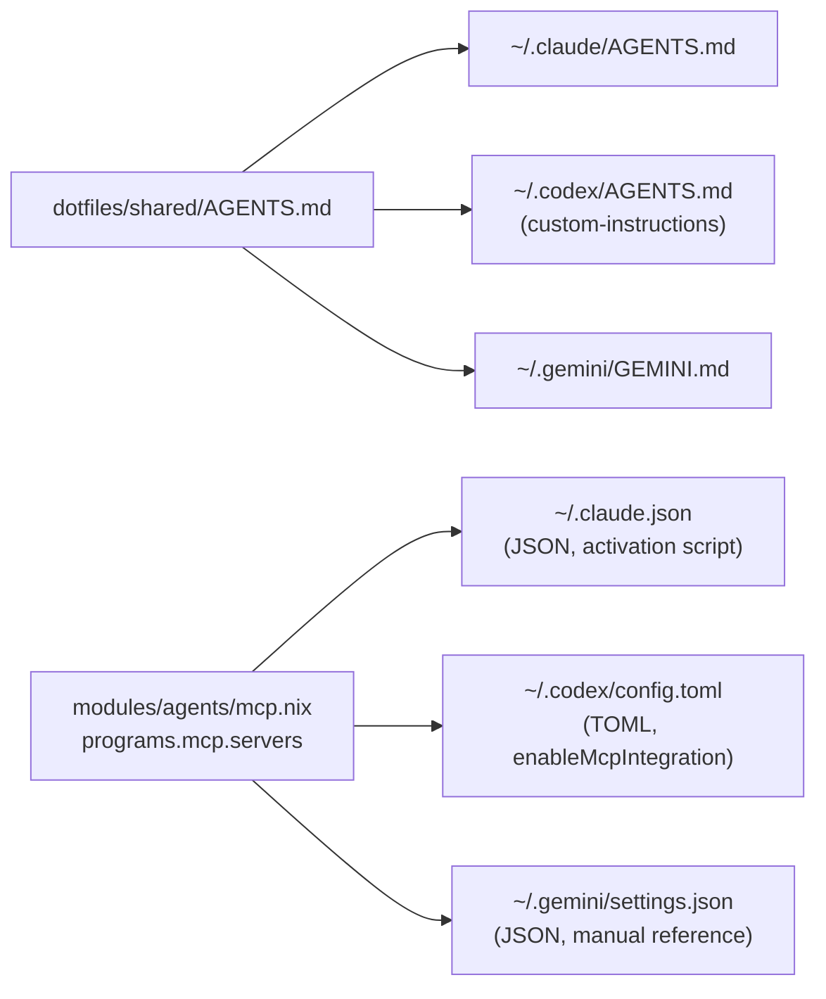
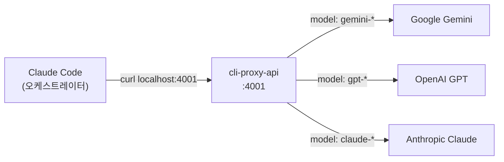

# Why? 왜 배움?

2026년 현재, 주요 AI 연구소 모두 터미널 에이전트를 제공한다.
Anthropic의 Claude Code, OpenAI의 Codex CLI, Google의 Gemini CLI가 대표적이다.
이 에이전트들은 AGENTS.md라는 지시서 표준을 공유하며[^O1], 각기 다른 강점을 가진 독립된 도구로 자리 잡았다.
이 글은 이 세 에이전트를 Nix Home-Manager로 선언적으로 통합하고, Claude Code를 오케스트레이터로 활용해 자동 위임까지 구현하는 과정을 다룬다.

이 구성이 필요한 실제 시나리오는 세 가지다.

첫째, Claude Code에서 10개 파일을 분석하다 컨텍스트가 부족해지는 상황이다.
Gemini의 1M 토큰 컨텍스트 윈도우가 있다면 전체 파일을 한 번에 넘겨 분석할 수 있다.

둘째, MCP 서버를 하나 추가할 때마다 `config.toml`, `settings.json`, `.claude.json` 세 곳을 각각 수정해야 하는 설정 파편화다.
context7 서버 하나를 추가하려면 TOML, JSON, JSON 세 가지 포맷으로 동일한 내용을 반복 작성해야 한다.

셋째, 보안 검토를 단일 프로바이더에만 의존해 크로스 검증 없이 배포하는 위험이다.
서로 다른 모델이 같은 코드를 검토하면 한쪽이 놓친 취약점을 다른 쪽이 발견할 가능성이 높아진다.

핵심 질문은 다음과 같다.
"프로바이더마다 설정 포맷이 다르고 호출 방식이 다른데, 이걸 하나의 선언적 설정으로 통합하고 자동 위임까지 할 수 있는가?"

이 글에서 사용하는 핵심 개념은 네 가지다.

| 개념                          | 해결하는 문제      |
| ----------------------------- | ------------------ |
| SSoT (Single Source of Truth) | 설정 파편화        |
| SRP 모듈 분리                 | 단일 파일의 비대화 |
| 통합 프록시 (cli-proxy-api)   | API 포맷/인증 차이 |
| Hook 기반 라우팅              | 수동 위임 판단     |

SSoT가 두 번째 시나리오의 설정 파편화를 해결한다.
MCP 서버를 Nix 한 곳에 정의하면 세 프로바이더의 설정 파일이 자동으로 생성된다.
통합 프록시와 Hook이 첫 번째와 세 번째 시나리오를 해결한다.
Claude Code가 프록시를 통해 Gemini나 GPT에게 작업을 위임하고, 그 결과를 종합해 최종 판단을 내린다.

이 글은 다음 순서로 진행된다.
먼저 세 프로바이더의 설정 차이를 정의하고, SSoT로 통합하는 방법을 설계한다.
이어서 SRP 원칙에 따른 모듈 분리, 프록시 구축, 오케스트레이션 규칙 설계를 다룬다.
마지막으로 실제 크로스 프로바이더 위임을 실습하고, 향후 개선 방향을 정리한다.

# What? 뭘 배움?

## Claude, Codex, Gemini 의 설정 파편화와 단일 프로바이더 한계 🧩

세 프로바이더의 설정 체계를 비교하면 다음과 같다.

|                   | Claude Code                | Codex CLI          | Gemini CLI            |
| ----------------- | -------------------------- | ------------------ | --------------------- |
| 설정 포맷         | JSON                       | TOML               | JSON                  |
| 설정 위치         | `~/.claude/`               | `~/.codex/`        | `~/.gemini/`          |
| 지시서 파일       | CLAUDE.md                  | AGENTS.md          | GEMINI.md             |
| MCP 설정          | `~/.claude.json`           | `config.toml` 내장 | `settings.json` 내장  |
| Home-Manager 모듈 | 없음                       | `programs.codex`   | `programs.gemini-cli` |
| Hooks             | 5종 (PreTool, PostTool 등) | 6종                | 없음                  |

동일한 MCP 서버 하나(context7)를 세 프로바이더에 등록하려면 세 가지 포맷으로 작성해야 한다.
Claude는 `~/.claude.json`의 `mcpServers` 객체에 JSON으로 추가한다.
Codex는 `~/.codex/config.toml`에 TOML 테이블로 추가한다.
Gemini는 `~/.gemini/settings.json`의 `mcpServers` 객체에 JSON으로 추가한다.
결과적으로 같은 정보가 세 곳에 분산되며, 하나를 수정하면 나머지 두 곳도 수동으로 동기화해야 한다.

지시서 파일도 마찬가지다.
AGENTS.md가 업계 표준으로 부상하고 있지만[^O1], Claude Code는 여전히 CLAUDE.md를 기본 지시서로 사용한다[^O2].
Codex는 AGENTS.md를 직접 읽고, Gemini는 GEMINI.md를 읽는다.
동일한 가이드라인을 세 파일에 유지하려면 수동 복사가 필요하다.

설정을 통일하려면 하나의 정의에서 3개 포맷을 자동 생성하는 메커니즘이 필요하다.

## SSoT 설계 — shared/AGENTS.md 와 programs.mcp 를 활용한 선언적 통합 📐

SSoT 설계의 핵심은 두 가지다.
지시서는 `dotfiles/shared/AGENTS.md` 하나로 통일하고, MCP 서버는 `programs.mcp.servers` 하나로 정의한다.



`mcp.nix`는 MCP 서버의 단일 정의를 담당한다.
이 파일 하나만 수정하면 세 프로바이더의 MCP 설정이 자동으로 갱신된다.

```nix
# modules/agents/mcp.nix
{...}: {
  programs.mcp = {
    enable = true;
    servers = {
      context7 = {
        command = "npx";
        args = ["-y" "@upstash/context7-mcp@latest"];
      };
      playwright = {
        command = "npx";
        args = ["-y" "@playwright/mcp@latest"];
      };
    };
  };
}
```

세 프로바이더가 이 정의를 소비하는 방식은 각각 다르다.

Codex는 `enableMcpIntegration = true` 옵션을 제공한다[^O4].
이 옵션이 켜져 있으면 `programs.mcp.servers`의 내용이 자동으로 `config.toml`에 TOML 포맷으로 주입된다.

Gemini는 `enableMcpIntegration` 옵션이 없다[^O5].
따라서 `config.programs.mcp.servers`를 직접 참조해 `settings.json`의 `mcpServers` 필드에 매핑해야 한다.

```nix
# modules/agents/gemini.nix (핵심 부분)
programs.gemini-cli = {
  enable = true;
  settings = {
    mcpServers = lib.mapAttrs (_: srv: {
      command = srv.command;
      args = srv.args or [];
    }) config.programs.mcp.servers;
  };
};
```

Claude Code는 공식 Home-Manager 모듈이 없다.
따라서 `home.activation` 스크립트가 `programs.mcp.servers`를 JSON으로 변환하고, `jq`로 `~/.claude.json`에 병합한다[^O6].

전체 코드는 커밋 `6f2d513`에서 확인할 수 있다[^O7].

### 실습 — 3개 프로바이더의 설정 동일성 검증

`just apply`를 실행한 후, 다음 명령으로 SSoT 동작을 확인해보자.

```bash
# 지시서 동일성 확인
diff ~/.codex/AGENTS.md ~/.claude/AGENTS.md
diff ~/.gemini/GEMINI.md ~/.claude/AGENTS.md
# 차이 없음 = SSoT 동작 확인

# MCP 서버 동일성 확인
grep context7 ~/.codex/config.toml
jq '.mcpServers.context7' ~/.gemini/settings.json
jq '.mcpServers.context7' ~/.claude.json
# 3곳 모두 동일 MCP 서버
```

3곳에서 동일한 결과가 나온다면, `mcp.nix`의 단일 정의가 3개 포맷으로 정확히 변환된 것이 확인된다.

설정은 통일되었지만, 이 설정들이 모듈 하나에 모여 있으면 수정 시 영향 범위를 특정하기 어렵다.

## SRP 모듈 구조 — modules/agents/ 의 책임별 6개 파일 분리 🗂️

`modules/agents/` 디렉토리는 SRP(Single Responsibility Principle)에 따라 6개 파일로 분리되어 있다.

```
modules/agents/
├── default.nix   # imports
├── mcp.nix       # MCP SSoT
├── claude.nix    # Claude dotfiles + activation
├── codex.nix     # Codex programs.codex
├── gemini.nix    # Gemini programs.gemini-cli
└── proxy.nix     # cli-proxy-api + launchd
```

각 파일의 책임과 설정 대상은 다음과 같다.

| 파일          | 책임                              | 설정 대상                         |
| ------------- | --------------------------------- | --------------------------------- |
| `mcp.nix`     | MCP 서버 정의 (SSoT)              | `programs.mcp.servers`            |
| `claude.nix`  | Claude dotfiles + MCP/설정 동기화 | `home.file`, `home.activation`    |
| `codex.nix`   | Codex 공식 모듈 설정              | `programs.codex`                  |
| `gemini.nix`  | Gemini 공식 모듈 설정             | `programs.gemini-cli`             |
| `proxy.nix`   | 프록시 설치 + launchd 서비스      | `home.packages`, `launchd.agents` |
| `default.nix` | 진입점 (imports만)                | —                                 |

이 구조의 장점은 변경의 격리에 있다.
MCP 서버를 추가하려면 `mcp.nix` 한 파일만 수정하면 된다.
Claude의 activation script를 변경해도 Codex나 Gemini 설정에는 영향이 없다.
프록시 설정을 변경해도 에이전트 설정에는 영향이 없다.

`default.nix`는 6개 모듈의 진입점으로, imports 선언만 담당한다.

```nix
# modules/agents/default.nix
{
  imports = [
    ./mcp.nix
    ./claude.nix
    ./codex.nix
    ./gemini.nix
    ./proxy.nix
  ];
}
```

전체 코드는 커밋 `6f2d513`에서 확인할 수 있다[^O7].

모듈이 분리되어 각 프로바이더의 설정이 격리되었지만, Claude가 다른 프로바이더에게 작업을 위임하려면 통일된 호출 인터페이스가 필요하다.

## cli-proxy-api — localhost:4001 의 통합 AI 프로바이더 프록시 🔀

### cli-proxy-api 란?

cli-proxy-api는 여러 AI 프로바이더의 인증과 API 호출을 단일 엔드포인트로 통합하는 로컬 프록시 서버다[^O8].
Claude, Gemini, GPT 각각의 OAuth 토큰을 관리하고, OpenAI 호환 API(`/v1/chat/completions`)로 모든 프로바이더에 요청을 라우팅한다.
idle 상태에서 메모리 24MB, CPU 0%로 동작하므로 상시 기동에 부담이 없다.



### 사용 가능 모델

| 프로바이더 | 모델명                  | 용도                 |
| ---------- | ----------------------- | -------------------- |
| Google     | `gemini-2.5-pro`        | 대규모 컨텍스트 분석 |
| Google     | `gemini-2.5-flash-lite` | 빠른 검증, 경량 작업 |
| OpenAI     | `gpt-5.4-mini`          | 코드 생성, 빠른 응답 |
| OpenAI     | `gpt-5.4`               | 정밀 코드 생성       |
| Anthropic  | `claude-*`              | 추론, 아키텍처 판단  |

전체 모델 목록은 `curl -s http://127.0.0.1:4001/v1/models | jq '.data[].id'`로 확인할 수 있다.

### Nix 모듈: proxy.nix

`proxy.nix`는 세 가지를 담당한다.
패키지 설치, 설정 파일 생성, macOS launchd 서비스 등록이다.

```nix
# modules/agents/proxy.nix (구조)
{config, pkgs, ...}: let
  configPath = "${config.home.homeDirectory}/.cli-proxy-api/config.yaml";
in {
  home.packages = [pkgs.llm-agents.cli-proxy-api];

  home.file.".cli-proxy-api/config.yaml".text = ''
    host: "127.0.0.1"
    port: 4001
    auth-dir: "~/.cli-proxy-api"
    debug: false
    request-retry: 3
    routing:
      strategy: "round-robin"
    quota-exceeded:
      switch-project: true
      switch-preview-model: true
  '';

  launchd.agents.cli-proxy-api = {
    enable = true;
    config = {
      Label = "com.cli-proxy-api";
      ProgramArguments = ["...cli-proxy-api" "-config" configPath];
      RunAtLoad = true;
      KeepAlive = true;
      EnvironmentVariables = {
        HOME = config.home.homeDirectory;
      };
    };
  };
}
```

전체 코드는 커밋 `b14899f`에서 확인할 수 있다[^O9].

### 패키지 소스와 주의사항

`cli-proxy-api`는 `numtide/llm-agents.nix` 오버레이[^O10]에서 가져온다.
`flake.nix`에서 `llm-agents.overlays.default`를 적용하면 `pkgs.llm-agents.cli-proxy-api`로 접근할 수 있다.

Codex와 Gemini CLI는 `llm-agents.nix`가 아닌 **nixpkgs**에서 가져와야 한다.
`llm-agents.nix`의 Codex/Gemini 패키지는 소스 빌드로 15분 이상 걸리지만, nixpkgs 패키지는 바이너리 캐시에서 즉시 설치된다.
`cli-proxy-api`만 `llm-agents.nix`에서 가져올 가치가 있다.

### config.yaml 설정 시 주의사항

`port`는 **top-level 키**로 설정해야 한다.
`server.port`나 `server.host`처럼 중첩하면 프록시가 해당 값을 무시하고 랜덤 포트로 바인딩되니 주의해야 한다.
포트 지정에 대해서는 반드시 top-level에 `port: 4001` 형태로 써야 한다[^O3].

### launchd 설정 시 주의사항

launchd의 `EnvironmentVariables`에서는 `${HOME}` 같은 셸 변수 확장이 동작하지 않는다[^O11].
`${HOME}`이 문자열 리터럴로 전달되므로, `config.home.homeDirectory`를 사용해 Nix 평가 시점에 절대 경로로 확정해야 한다.

```nix
# 올바른 방식
EnvironmentVariables = {
  HOME = config.home.homeDirectory;  # "/Users/limjihoon"
};

# 잘못된 방식 (셸 확장 안 됨)
# HOME = "${HOME}";  # 리터럴 "${HOME}"이 전달됨
```

### 인증 관리

cli-proxy-api는 프로바이더별 OAuth 인증 파일을 `~/.cli-proxy-api/` 디렉토리에 저장한다.
`-login` 플래그로 Gemini(Google), `-claude-login`으로 Claude(Anthropic), `-codex-login`으로 Codex(OpenAI) 인증을 수행한다.

`just agent-login` 명령은 누락된 인증만 자동 감지해 OAuth를 실행한다[^O9].

프록시가 가동되면 Claude Code는 curl 한 줄로 어떤 프로바이더에게든 작업을 위임할 수 있다.
그러나 매번 사람이 지시해야 한다면 오케스트레이션이라 할 수 없다.
다음 절에서는 Claude가 스스로 위임 판단을 내리는 규칙을 어떻게 설계하는지 다룬다.

## 오케스트레이션 규칙 — hooks 와 AGENTS.md 를 결합한 위임 판단 🎮

오케스트레이션은 두 가지 패턴으로 동작한다.

### Pattern A: PostToolUse Hook (자동 로깅)

Claude Code의 PostToolUse hook이 Bash 호출을 감지하면 `proxy-route.sh`를 실행한다.
이 스크립트는 프록시의 로깅 엔드포인트에 도구 사용 기록을 전송한다.
hook은 절대 차단하지 않는다 — 관찰하고 기록할 뿐이다.

```json
{
    "hooks": {
        "PostToolUse": [
            {
                "matcher": "Bash",
                "hooks": [
                    {
                        "type": "command",
                        "command": "~/.claude/hooks/proxy-route.sh",
                        "timeout": 5
                    }
                ]
            }
        ]
    }
}
```

`proxy-route.sh`의 핵심 로직은 다음과 같다.

```bash
#!/usr/bin/env bash
# proxy-route.sh — 프록시 가용 시 도구 사용 로깅
PROXY_URL="http://127.0.0.1:4001"
INPUT=$(cat)
TOOL_NAME=$(echo "$INPUT" | jq -r '.tool_name // empty')

# 프록시 미가동 시 조용히 종료
if ! curl -s --max-time 1 "$PROXY_URL/health" > /dev/null 2>&1; then
  exit 0
fi

# 도구 사용 기록 전송
curl -s --max-time 2 -X POST "$PROXY_URL/api/hooks/log" \
  -H "Content-Type: application/json" \
  -d "{\"tool\": \"$TOOL_NAME\", \"source\": \"claude-code\"}" \
  > /dev/null 2>&1
exit 0
```

### Pattern B: Bash Delegation (Claude 판단)

Claude Code가 `AGENTS.md`의 규칙을 읽고, 프록시를 통해 다른 프로바이더에게 직접 위임하는 패턴이다.

`AGENTS.md`에 정의된 위임 기준은 다음과 같다[^O1].

**위임하는 경우 (자동, 사용자 지시 불필요):**

- 크로스 검증: 보안 검토, 아키텍처 결정, 파괴적 변경 전 다른 모델의 2차 의견
- 대량 입력: 분석 대상이 5개 이상 파일, 긴 로그, 대형 diff
- 강점 활용: Gemini(대규모 컨텍스트, 웹 지식), GPT(코드 생성), Claude(추론)
- 병렬 가속: 2개 이상의 독립 분석을 동시 실행

**위임하지 않는 경우:**

- 단순 파일 읽기, 편집, git 작업
- 보안 민감 작업 (인증 정보, 파괴적 git, 시크릿)
- 위임 오버헤드가 이득보다 큰 경우 (사소한 질문)

위임은 `curl`로 프록시의 OpenAI 호환 엔드포인트를 호출하는 방식이다.

```bash
curl -s http://127.0.0.1:4001/v1/chat/completions \
  -H "Content-Type: application/json" \
  --data @- <<EOJSON | jq -r '.choices[0].message.content'
{
  "model": "gemini-2.5-flash-lite",
  "messages": [{"role": "user", "content": "YOUR PROMPT HERE"}],
  "stream": false
}
EOJSON
```

### 두 패턴 비교

|             | Pattern A (Hook)   | Pattern B (Bash)       |
| ----------- | ------------------ | ---------------------- |
| 트리거      | 자동 (PostToolUse) | Claude 판단            |
| 역할        | 비용 추적/로깅     | 실제 위임              |
| 차단 여부   | 차단 안 함         | —                      |
| 프록시 사용 | 로깅 엔드포인트    | `/v1/chat/completions` |

hook 설정과 `proxy-route.sh`의 전체 코드는 커밋 `b14899f`에서 확인할 수 있다[^O9].
Claude Code hooks의 공식 문서는 Anthropic 문서를 참조한다[^O12].

규칙이 설계되었지만, 실제로 Claude가 다른 프로바이더에게 위임하고 그 결과를 통합하는 전체 흐름을 검증해야 한다.

# How? ?

## 환경 준비 🧰

필요한 것은 Nix, home-manager, 그리고 이 저장소다.

```bash
git clone https://github.com/vanillacake369/tonys-nix
cd tonys-nix
just bootstrap  # install-nix → home-manager → apply → agent-login → gc
```

`just bootstrap`은 다음 순서로 실행된다.
Nix 설치, nix.conf 심링크, home-manager 설치, uidmap 설치(Linux만), 플랫폼별 flake 적용, AI 프로바이더 인증, 가비지 컬렉션이다.

`just agent-login`은 `~/.cli-proxy-api/` 디렉토리에서 각 프로바이더의 인증 파일 존재 여부를 확인한다.
누락된 프로바이더만 자동으로 감지해 OAuth 인증을 실행한다.

```bash
# agent-login 실행 예시
[!] Missing auth: gemini claude
[→] Logging in to Gemini (Google)...
# 브라우저가 열리고 Google OAuth 진행
[→] Logging in to Claude (Anthropic)...
# 브라우저가 열리고 Anthropic OAuth 진행
[✓] Agent login complete
```

Nix flake를 사용하므로, 새 파일을 추가한 경우 `git add`를 먼저 실행해야 `nix build`가 해당 파일을 인식한다.

## 종합 실습 ① — 크로스 프로바이더 보안 검토 위임 🔬

시나리오: `proxy.nix`의 보안을 검토하되, GPT의 크로스 검증을 받는다.

프록시를 통해 GPT에게 보안 검토를 요청한다.

```bash
curl -s http://127.0.0.1:4001/v1/chat/completions \
  -H "Content-Type: application/json" \
  --data @- <<EOJSON | jq -r '.choices[0].message.content'
{
  "model": "gpt-5.4-mini",
  "messages": [{
    "role": "user",
    "content": "Review this Nix module for security issues:\n\n$(cat modules/agents/proxy.nix)"
  }],
  "stream": false
}
EOJSON
```

Claude Code는 동일한 파일을 자체 분석한다.
두 결과를 비교해 한쪽만 발견한 문제가 있는지 확인한다.

SSoT 절에서 다룬 "단일 정의 → 다중 배포" 원리가 여기서는 "단일 질문 → 다중 프로바이더 검증"으로 확장된 것이 확인된다.
프록시가 API 포맷 차이를 흡수하므로, 모델명만 바꾸면 동일한 curl 명령으로 어떤 프로바이더든 호출할 수 있다.

## 종합 실습 ② — just bootstrap 부터 agent-login 까지 전체 경로 🪜

새 머신에서 처음부터 끝까지 설정하는 전체 흐름이다.

```bash
# 1. Bootstrap (전체 설치)
just bootstrap
# Output: install-nix → system-link-nix-conf → install-home-manager
#         → bootstrap-uidmap → apply → agent-login → gc

# 2. 설치 확인
codex --version          # Codex CLI 버전 출력
gemini --version         # Gemini CLI 버전 출력
cli-proxy-api --help     # 프록시 설치 확인

# 3. SSoT 동작 확인
diff ~/.codex/AGENTS.md ~/.claude/AGENTS.md  # 차이 없음
diff ~/.gemini/GEMINI.md ~/.claude/AGENTS.md # 차이 없음

# 4. 프록시 가동 확인
curl -s http://127.0.0.1:4001/ | jq '.message'
# "CLI Proxy API Server"

# 5. 오케스트레이션 테스트
curl -s http://127.0.0.1:4001/v1/chat/completions \
  -H "Content-Type: application/json" \
  -d '{"model":"gemini-2.5-flash-lite","messages":[{"role":"user","content":"hello"}],"stream":false}' \
  | jq -r '.choices[0].message.content'
```

5번 단계에서 Gemini의 응답이 반환되면 전체 오케스트레이션 파이프라인이 정상 동작하는 것이다.
프록시가 Google OAuth 토큰을 관리하고, OpenAI 호환 API로 변환해 요청을 전달한다.

# 추가 개선안

## 단기 개선 — Hook 고도화와 비용 대시보드 🛠️

현재는 PostToolUse hook만 사용 중이다.
PreToolUse hook으로 확장하면 대량 파일 분석을 감지한 시점에 자동으로 Gemini 위임을 제안할 수 있다.
예를 들어, Bash 도구가 5개 이상의 파일 경로를 인자로 받으면 hook이 "Gemini 위임 권장" 메시지를 반환하는 방식이다.

cli-proxy-api 생태계에는 CPA-Manager라는 웹 대시보드가 존재한다[^O8].
SQLite 기반으로 프로바이더별 토큰 사용량, 비용, 쿼터를 추적한다.
현재 이 구성에는 미설치 상태이며, `proxy.nix`에 추가하면 비용 가시성을 확보할 수 있다.

Claude Code hooks는 `command` 타입 외에도 다양한 확장이 가능하다[^O12].
향후 hook 유형이 확장되면 HTTP 엔드포인트 직접 호출 등 더 정교한 라우팅이 가능해진다.

## 중장기 로드맵 — MCP 오케스트레이터와 Agent Teams 🗺️

Claude Agent Teams는 실험적 기능이다(`CLAUDE_CODE_EXPERIMENTAL_AGENT_TEAMS=1`).
멀티 Claude 세션이 shared task list로 협업하는 방식이며, 현재는 Claude끼리만 가능하다.
향후 다른 프로바이더와의 협업이 지원되면 프록시 기반 위임을 보완할 수 있다.

MCP 프로토콜 자체를 오케스트레이션 레이어로 활용하는 방향도 가능하다[^O13].
모든 프로바이더가 MCP를 지원하므로, MCP 서버가 다른 MCP 서버를 호출하는 구조로 통일된 tool 인터페이스를 구성할 수 있다.

현재 위임 판단은 Claude가 AGENTS.md를 읽고 수행한다.
이 규칙을 스크립트로 코드화하면 결정론적 라우팅이 가능해진다.
예를 들어, 파일 개수와 토큰 수를 기준으로 자동 라우팅하는 PreToolUse hook을 구현할 수 있다.

## 참고할 만한 구축기와 아키텍처 📚

1. **Addy Osmani — "The Code Agent Orchestra"** (2026.03): Google Chrome 팀 엔지니어링 매니저가 멀티 에이전트 오케스트레이션을 3 tier로 분류하고 각 도구의 포지셔닝을 정리한 글이다[^O14].

2. **DEV Community — "How I Orchestrate Claude Code, Codex, and Gemini CLI as a Swarm"** (2026.02): 각 에이전트에 독립 git worktree를 할당하는 실전 구축기다. 전략 레이어와 실행 레이어의 분리를 다룬다[^O15].

3. **Termdock — "AI CLI Tools Guide 2026"** (2026.03): 15개 터미널 에이전트의 설치, 가격, 컨텍스트 엔지니어링, 멀티 에이전트 워크플로우를 포괄적으로 비교한 가이드다[^O16].

4. **Microsoft Azure — "AI Agent Orchestration Patterns"**: Router, Triage, Dispatch, Delegation 패턴을 정리한 아키텍처 가이드다. 프로덕션 환경의 에이전트 라우팅 설계에 참고할 수 있다[^O17].

5. **GitHub Gist — "Claude Code Orchestrator Setup Guide"**: Claude를 마스터 오케스트레이터로, Codex를 writer, Gemini를 auditor로 설정하는 실전 가이드다[^O18].

6. **Zencoder — "Multi-Agent Orchestration in ZenFlow"**: Claude(아키텍처) + Gemini(코드 생성) + Claude(리뷰)의 파이프라인 구성을 설명한다[^O19].

---

# Reference

[^O1]: AGENTS.md — The Standard for AI Agent Instructions. <https://agents.md/>

[^O2]: AGENTS.md vs CLAUDE.md: Understanding AI Instruction Standards — Hivetrail. <https://hivetrail.com/blog/agents-md-vs-claude-md>

[^O3]: cli-proxy-api config.example.yaml — top-level port 설정. <https://github.com/router-for-me/CLIProxyAPI/blob/main/config.example.yaml>

[^O4]: Home Manager `programs.codex` option reference — MyNixOS. <https://mynixos.com/home-manager/options/programs.codex>

[^O5]: Home Manager `programs.gemini-cli` module source — gemini-cli.nix. <https://github.com/nix-community/home-manager/blob/master/modules/programs/gemini-cli.nix>

[^O6]: Lewis Flude — Declarative MCP Server Management with Nix Home Manager. <https://lewisflude.com/declarative-mcp-server-management-with-nix-home-manager/>

[^O7]: tonys-nix commit 6f2d513 — feat: add multi-provider agent orchestration with SSoT. <https://github.com/vanillacake369/tonys-nix/commit/6f2d513>

[^O8]: CLIProxyAPI — Unified AI Provider Proxy (GitHub). <https://github.com/router-for-me/CLIProxyAPI>

[^O9]: tonys-nix commit b14899f — feat: add cli-proxy-api with hooks and agent-login. <https://github.com/vanillacake369/tonys-nix/commit/b14899f>

[^O10]: numtide/llm-agents.nix — Nix flake for AI CLI agents. <https://github.com/numtide/llm-agents.nix>

[^O11]: Apple Developer — Creating Launch Daemons and Agents (launchd EnvironmentVariables). <https://developer.apple.com/library/archive/documentation/MacOSX/Conceptual/BPSystemStartup/Chapters/CreatingLaunchdJobs.html>

[^O12]: Claude Code Hooks — Anthropic Documentation. <https://docs.anthropic.com/en/docs/claude-code/hooks>

[^O13]: natsukium/mcp-servers-nix — MCP servers packaged as Nix flake. <https://github.com/natsukium/mcp-servers-nix>

[^O14]: Addy Osmani — "The Code Agent Orchestra". <https://addyosmani.com/blog/code-agent-orchestra/>

[^O15]: DEV Community — "How I Orchestrate Claude Code, Codex, and Gemini CLI as a Swarm". <https://dev.to/elophanto/how-i-orchestrate-claude-code-codex-and-gemini-cli-as-a-swarm-4p3c>

[^O16]: Termdock — "AI CLI Tools Guide 2026". <https://www.termdock.com/blog/ai-cli-tools-guide>

[^O17]: Microsoft Azure — AI Agent Design Patterns. <https://learn.microsoft.com/en-us/azure/architecture/ai-ml/guide/ai-agent-design-patterns>

[^O18]: GitHub Gist — Claude Code Orchestrator Setup Guide. <https://gist.github.com/bjornmage/ddd6dc7f4d5e074af1db44964d377427>

[^O19]: Zencoder — Multi-Agent Orchestration in ZenFlow. <https://docs.zencoder.ai/user-guides/guides/multi-agent-orchestration-in-zenflow>

[^O20]: Home Manager `programs.mcp` option reference — MyNixOS. <https://mynixos.com/home-manager/options/programs.mcp>
