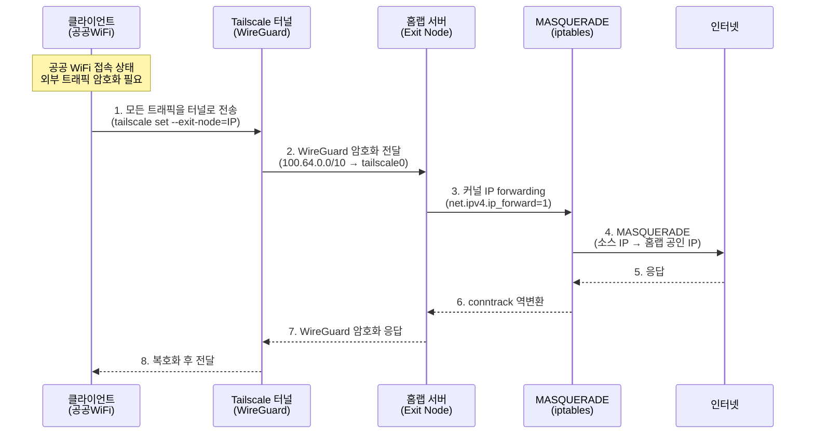
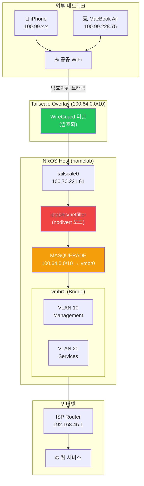
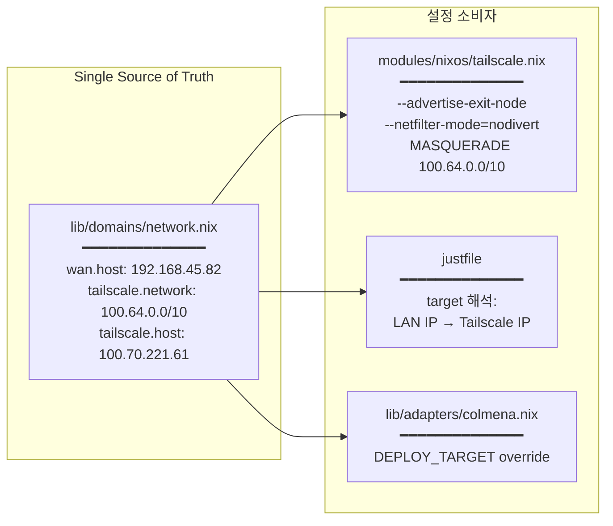

# WHY


### 공공 WiFi의 위험성

공공 WiFi(카페, 공항, 호텔 등)는 다음과 같은 보안 위협에 노출됩니다:

- **중간자 공격(MITM)**: 동일 네트워크의 공격자가 트래픽을 가로채거나 변조
- **DNS Spoofing**: 악의적인 DNS 응답으로 피싱 사이트로 유도
- **패킷 스니핑**: 암호화되지 않은 트래픽(HTTP, DNS 쿼리)이 평문 노출
- **세션 하이재킹**: 인증 쿠키/토큰 탈취

### 홈랩 Exit Node의 가치

홈랩 서버를 VPN Exit Node로 사용하면:

- 모든 트래픽이 **암호화된 WireGuard[^13] 터널**을 통과
- 인터넷에는 **홈랩의 공인 IP**로만 노출
- DNS 쿼리도 터널을 경유하여 **DNS Leak 방지**
- 별도 VPN 서비스 비용 없이 **자체 인프라** 활용

### 왜 상용 VPN이 아닌 홈랩인가?

| 항목 | 상용 VPN | 홈랩 Exit Node |
| --- | --- | --- |
| 신뢰 | VPN 업체에 트래픽 위임 | 자체 서버, 완전한 통제 |
| 비용 | 월 구독료 | 이미 운영 중인 홈랩 활용 |
| 로그 | 업체의 no-log 정책 신뢰 필요 | 직접 로그 정책 결정 |
| 속도 | 서버 위치에 따라 변동 | 홈 인터넷 대역폭 직접 사용 |

# WHAT


### Tailscale Exit Node란?

Tailscale 네트워크의 특정 노드를 **모든 인터넷 트래픽의 출구(Exit)**로 지정하는 기능입니다.

클라이언트의 트래픽이 해당 노드를 경유하여 인터넷으로 나갑니다.

### 이 홈랩에서의 구성 요소

```
┌─────────────────────────────────────────────────────────────┐
│ 구성 요소              역할                                   │
├─────────────────────────────────────────────────────────────┤
│ --advertise-exit-node  홈랩을 Exit Node로 Tailscale에 광고    │
│ --netfilter-mode       nodivert (Bridge/VLAN 보호)           │
│ MASQUERADE 규칙        nodivert에서 Exit Node NAT를 수동 보장  │
│ IPv4/IPv6 forwarding   커널 레벨 패킷 포워딩 활성화             │
│ Admin Console 승인     Tailscale 관리 콘솔에서 Exit Node 허가  │
└─────────────────────────────────────────────────────────────┘

```

### nodivert 모드를 유지하는 이유

이 홈랩은 단순한 단일 서버가 아닙니다:

```
NixOS Host
├── vmbr0 (브릿지 + VLAN 필터링)
│   ├── VLAN 10 (Management) → Vault, Jenkins
│   └── VLAN 20 (Services)   → K8s Master, Workers, Registry
├── iptables NAT (VLAN 간 라우팅)
├── K8s 네트워킹 (Flannel VXLAN)
└── Tailscale (overlay network)

```

Tailscale의 기본 `divert` 모드는 **netfilter/iptables를 우회**합니다.

이 서버에서 그렇게 되면:

- VLAN 격리가 무력화
- NAT 규칙이 무시됨
- K8s pod 네트워킹에 예측 불가능한 영향
- 방화벽 규칙이 우회됨

따라서 `nodivert`로 Tailscale이 netfilter 안에서 동작하게 강제하고,
Exit Node에 필요한 MASQUERADE 규칙만 수동으로 추가합니다.

# HOW


### 트래픽 흐름



### 네트워크 아키텍처



### 설정 파일 구조



### 서버 설정 (NixOS)

`modules/nixos/tailscale.nix`[^4]에 선언된 핵심 설정:

```nix
# 1. Exit Node 광고
services.tailscale.extraSetFlags = [
  "--ssh"
  "--netfilter-mode=nodivert"
  "--advertise-exit-node"
];

# 2. IPv4/IPv6 포워딩
boot.kernel.sysctl."net.ipv6.conf.all.forwarding" = 1;
# (IPv4는 network.nix에서 이미 활성화)

# 3. 수동 MASQUERADE (nodivert 보완)
networking.firewall.extraCommands = ''
  iptables -t nat -A POSTROUTING \
    -s 100.64.0.0/10 \
    -o vmbr0 \
    -j MASQUERADE
'';

```

### 클라이언트 사용법

```bash
# Exit Node 활성화
tailscale set --exit-node=100.70.221.61

# 확인 (홈랩 공인 IP가 나와야 함)
curl ifconfig.me

# 해제
tailscale set --exit-node=

```

### 배포 절차

1. `just deploy` — NixOS 재빌드 적용
2. [Tailscale Admin Console](https://login.tailscale.com/admin/machines) → 홈랩 노드 → **Edit route settings** → **Use as exit node** 활성화
3.

클라이언트에서 `tailscale set --exit-node=100.70.221.61`

### 검증 방법

```bash
# 클라이언트: 공인 IP 확인
curl ifconfig.me
# → 홈랩의 WAN IP (192.168.45.82의 공인 IP)가 출력되어야 함

# 홈랩 서버: 터널 트래픽 모니터링
sudo tcpdump -i tailscale0 -n host 100.99.228.75

# 홈랩 서버: MASQUERADE 규칙 확인
sudo iptables -t nat -L POSTROUTING -v -n | grep MASQ

```

[^4]: `modules/nixos/tailscale.nix` <https://www.notion.so/modules/nixos/tailscale.nix>
[^5]: `lib/domains/network.nix` <https://www.notion.so/lib/domains/network.nix>
[^6]: `modules/nixos/network.nix` <https://www.notion.so/modules/nixos/network.nix>
[^7]: `justfile` <https://www.notion.so/justfile>
[^9]: Exit Nodes <https://tailscale.com/kb/1103/exit-nodes>
[^10]: Netfilter Mode <https://tailscale.com/kb/1snip/netfilter>
[^11]: Linux Router <https://tailscale.com/kb/1snip/linux-router>
[^13]: WireGuard <https://www.wireguard.com/>
[^14]: CGNAT (RFC 6598) <https://datatracker.ietf.org/doc/html/rfc6598>
[^15]: iptables MASQUERADE <https://www.netfilter.org/documentation/>
