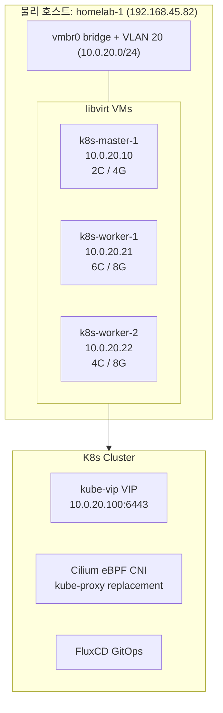
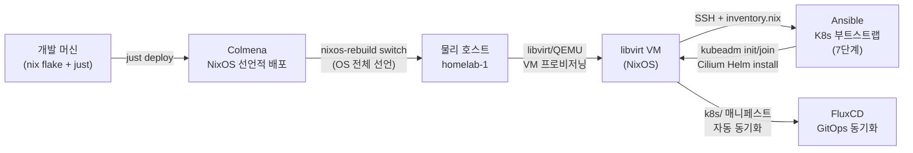
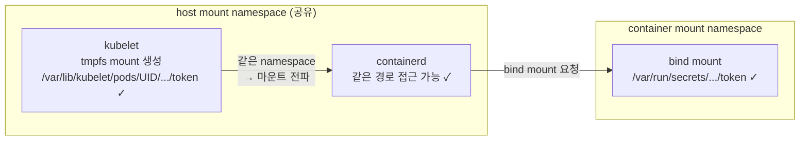
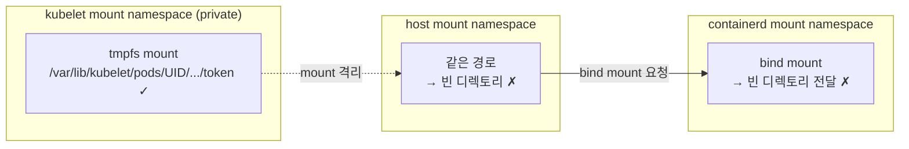
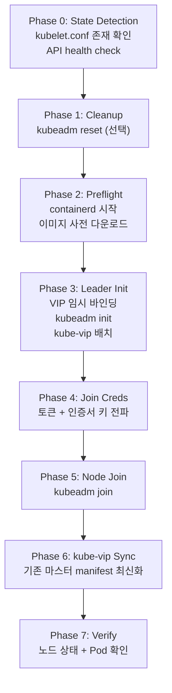
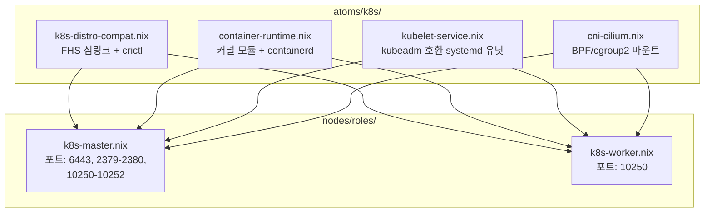

## 왜 NixOS 위에 K8s 클러스터를 구축했는가 🤔

홈랩을 운영하다 보면 IaC 도구가 닿지 않는 운영의 사각지대를 마주하게 된다.

Terraform/OpenTofu 로 VM 을 프로비저닝하더라도, 그 안의 커널 파라미터를 수정하거나 특정 시스템 서비스를 구성하는 일은 여전히 명령형 스크립트나 관리자의 기억에 의존하곤 한다.

이 사각지대를 Ansible/Chef 가 채워주긴 하지만, "실행 후 어떤 상태가 됐는가"를 선언적으로 표현하지는 못한다.

**NixOS 는 정확히 이 공백을 메우는 도구다.**

시스템의 모든 상태를 단 하나의 `.nix` 파일의 출력값으로 선언하고, 어떤 노드에서도 동일한 환경을 재현할 수 있기 때문이다.

---

그러나 단순히 "좋은 도구라서"라는 이유만으로 NixOS 기반 K8s 클러스터 구축을 시작한 것은 아니다.

**가설:** NixOS 의 읽기 전용 `/nix/store` 와 중앙 집중식 설정 체계 안에서도, 커널 모듈·sysctl·cgroup 드라이버·BPF 파일시스템 같은 OS 레벨 요구사항이 집중된 K8s 를 선언적으로 완전히 관리할 수 있을 것이다.

**설계 목표:** 모든 노드 설정을 `atoms/k8s/` 아래 4개 파일에 선언하고, Ansible 7단계 부트스트랩으로 클러스터를 띄운다.

**예상 문제:** NixOS 의 systemd 기본 보안 옵션이 kubelet 의 mount propagation 을 방해할 가능성이 있다.

이 글의 이름이 "kubelet Mount Namespace 장애 해결"인 이유는, 바로 그 예상이 실제 장애로 현실화되었기 때문이다.[^K1]

---

이 글은 성공적인 설치 단계를 나열한 가이드가 아니다.

NixOS 의 선언적 설계와 K8s 구성 요소의 동적 상태 변경 사이에서 발생한 실제 장애 — 특히 kubelet 의 Mount Namespace 이슈 — 를 어떻게 논리적으로 추론하고 해결했는지에 대한 기록이다.

각 원리 영역에 대한 상세 딥다이브는 별도 글로 분리해 두었으며, 이 글에서는 tonys-homelab 의 실제 구축 맥락과 NixOS 특화 이슈에 집중한다.

---

## 아키텍처 — 물리 서버 한 대에서 K8s 클러스터까지 🪜

tonys-homelab 은 물리 서버 한 대 위에 libvirt/QEMU VM 3 대를 띄우고, 그 위에 K8s 클러스터를 구성한 홈랩이다.

전체 구조는 다음과 같다.



이 아키텍처가 실제로 어떤 흐름으로 배포되는지를 이해하려면, 각 도구가 어떤 계층을 담당하는지를 함께 봐야 한다.

다음 흐름도는 개발 머신에서 GitOps 동기화까지의 전체 배포 파이프라인을 보여준다.



핵심 기술 스택은 다음과 같다.

| 영역              | 기술                                | 역할                            |
| ----------------- | ----------------------------------- | ------------------------------- |
| OS 관리           | NixOS Flakes + Colmena              | 선언적 시스템 구성 + 원격 배포  |
| 네트워크 토폴로지 | `topology.nix`                      | 모든 CIDR, IP, MAC 의 중앙 관리 |
| VM 인프라         | libvirt/QEMU + systemd-networkd     | VLAN 20 위의 VM 3대             |
| K8s 런타임        | containerd + kubelet (kubeadm 호환) | `atoms/k8s/` 4개 모듈           |
| 부트스트랩        | Ansible 7단계                       | `inventory.nix` → `site.yml`    |
| HA                | kube-vip (ARP mode)                 | VIP `10.0.20.100`               |
| CNI               | Cilium 1.19.1 (eBPF)                | kube-proxy 대체, native routing |
| GitOps            | FluxCD                              | `k8s/` 매니페스트 자동 동기화   |

이 글에서 다루는 범위는 _NixOS 위에서 K8s 를 돌리기 위해 필요한 OS 설정_ 과 _Ansible 부트스트랩_ 이다.

각 영역의 K8s 내부 원리에 대한 딥다이브는 별도 글을 참고한다.

이 아키텍처를 실제로 동작시키려면 NixOS 의 비표준 파일시스템 구조와 K8s 의 FHS 의존성을 먼저 해소해야 하는데, 그것이 다음 절의 주제다.

## FHS 호환 계층 — NixOS 의 비표준 경로와 kubeadm 의 충돌 해소 🐧

NixOS 는 모든 바이너리를 `/nix/store` 에 저장하며, `/usr/bin/socat` 이나 `/sbin/iptables` 같은 표준 FHS 경로에는 아무것도 두지 않는다.

이것이 NixOS 의 순수함을 보장하는 핵심 원리이지만, K8s 에서는 문제가 된다.

kubeadm 의 preflight check 와 kubelet 런타임은 이 FHS 경로들을 _하드코딩_ 으로 기대하기 때문이다.[^K2]

NixOS 에서 `kubeadm init` 을 실행하면 `socat not found` 에러가 나는 이유가 바로 이것이다.

`atoms/k8s/k8s-distro-compat.nix` 가 이 간극을 메운다.[^K3]

```nix
# atoms/k8s/k8s-distro-compat.nix — FHS 심링크 및 소켓 경로 정규화
systemd.tmpfiles.rules = [
  "L+ /usr/bin/socat   - - - - ${pkgs.socat}/bin/socat"
  "L+ /usr/bin/mount   - - - - ${pkgs.util-linux}/bin/mount"
  "L+ /usr/bin/nsenter - - - - ${pkgs.util-linux}/bin/nsenter"
  "L+ /sbin/iptables   - - - - ${pkgs.iptables}/bin/iptables"
  "L+ /usr/sbin/conntrack - - - - ${pkgs.conntrack-tools}/bin/conntrack"
  "L+ /var/run/containerd/containerd.sock - - - - /run/containerd/containerd.sock"
];
```

`systemd.tmpfiles.rules` 의 `L+` 지시자는 _부팅 시 심링크를 생성_ 한다.

Nix store 의 실제 바이너리를 FHS 표준 경로에 연결함으로써, kubeadm 이 기대하는 경로에 바이너리가 존재하는 것처럼 보이게 하는 것이다.

추가로 containerd 소켓 경로도 심링크한다.

NixOS 는 소켓을 `/run/containerd/` 에 두지만, crictl 과 kubeadm 은 `/var/run/containerd/` 를 기대하기 때문이다.

crictl 의 기본 endpoint 탐색 경고를 제거하기 위해 `crictl.yaml` 도 명시적으로 생성한다.

```nix
# crictl endpoint 명시 — "Using config file" 경고 제거
environment.etc."crictl.yaml".text = ''
  runtime-endpoint: unix:///run/containerd/containerd.sock
  image-endpoint: unix:///run/containerd/containerd.sock
  timeout: 10
  debug: false
'';
```

마지막으로 NixOS 기본 방화벽을 비활성화한다.

```nix
networking.firewall.enable = false;
```

K8s 노드의 네트워크 정책은 CNI (Cilium) 가 eBPF 로 enforce 하므로, OS 레벨 iptables 방화벽과 충돌을 피하기 위함이다.

FHS 호환 계층이 갖춰졌다면, 다음으로 해결해야 할 것은 K8s 가 컨테이너를 실행할 수 있도록 커널 환경을 선언하는 일이다.

## 컨테이너 런타임 설정 — 커널 모듈, sysctl, containerd 의 NixOS 선언 ⚙️

K8s 가 컨테이너를 실행하려면 Linux 커널의 세 가지 기능이 필요하다.

- **namespace** — 프로세스 격리 (net, pid, mnt, ...)
- **cgroup v2** — CPU/메모리 자원 제한
- **OverlayFS** — 이미지 레이어의 합성 파일시스템

이 원리에 대한 상세 설명은 별도의 딥다이브 글을 참고한다.[^K4]

`atoms/k8s/container-runtime.nix` 에서 이 의존성을 선언한다.[^K5]

```nix
# atoms/k8s/container-runtime.nix — 커널 모듈 및 sysctl 선언
boot.kernelModules = ["overlay" "br_netfilter"];
boot.kernel.sysctl = {
  "net.ipv4.ip_forward" = 1;
  "net.bridge.bridge-nf-call-iptables" = 1;
  "net.bridge.bridge-nf-call-ip6tables" = 1;
};
```

| 설정                      | 역할                                                                              |
| ------------------------- | --------------------------------------------------------------------------------- |
| `overlay`                 | OverlayFS 커널 모듈. containerd 가 이미지 레이어를 합성할 때 사용한다.            |
| `br_netfilter`            | bridge 트래픽이 iptables/nftables 를 거치게 한다. CNI 의 Pod 간 통신에 필요하다.  |
| `net.ipv4.ip_forward`     | 노드가 라우터로 동작하여 Pod 패킷을 다른 노드로 전달한다.                         |
| `bridge-nf-call-iptables` | bridge 위의 패킷에 netfilter 규칙을 적용한다.                                     |

containerd 설정은 다음과 같다.

```nix
# atoms/k8s/container-runtime.nix — containerd CRI 플러그인 설정
virtualisation.containerd = {
  enable = true;
  settings = {
    version = 2;
    plugins."io.containerd.grpc.v1.cri" = {
      containerd.runtimes.runc.options.SystemdCgroup = true;
      sandbox_image = "registry.k8s.io/pause:3.10";
      cni.bin_dir = "/opt/cni/bin";
      cni.conf_dir = "/etc/cni/net.d";
    };
  };
};
```

`SystemdCgroup = true` 는 kubelet 과 containerd 가 _같은 cgroup 드라이버_ (systemd) 를 사용하도록 보장한다.

이 값이 불일치하면 kubelet 이 컨테이너의 cgroup 경로를 찾지 못해 Pod 가 시작되지 않는다.

kubelet 은 `systemd` 방식으로 cgroup 경로를 탐색하는데, containerd 가 `cgroupfs` 방식으로 다른 경로에 cgroup 을 만들면 서로 엇갈리는 것이다.

`sandbox_image` 는 pause container 의 이미지를 명시한다.

containerd 기본값과 K8s 1.35 의 기대 버전이 다를 수 있으므로 고정한다.

containerd 에도 `PrivateMounts = false` 를 설정한다.

```nix
# atoms/k8s/container-runtime.nix — containerd mount namespace 격리 해제
systemd.services.containerd.serviceConfig = {
  PrivateMounts = false;
};
```

이 설정이 왜 필요한지는 Mount Namespace 장애 절에서 다룬다.

먼저 kubelet 서비스의 구조를 이해해야 장애의 원인이 명확해지기 때문이다.

커널 환경과 containerd 가 준비되었으므로, 이제 이들을 실제로 조율하는 kubelet 을 구성할 차례다.

## kubelet 서비스 — kubeadm 호환 systemd 유닛의 설계 🔧

kubelet 은 K8s 노드에서 유일하게 _항상 돌아가는_ K8s 컴포넌트다.

API server 와의 watch 연결, Pod sandbox 생성, 볼륨 마운트, 헬스 체크를 모두 책임진다.

이 동작 원리에 대한 상세 설명은 별도의 딥다이브 글을 참고한다.[^K6]

NixOS 에서 kubeadm 호환 kubelet 을 구성하는 것은 비자명한 작업이다.

NixOS 는 자체 K8s 모듈 (`services.kubernetes`) 을 제공하지만, 이 모듈은 kubeadm 과 충돌한다.

NixOS 모듈이 자체적으로 kubelet 설정과 인증서를 관리하려 하기 때문이다.

kubeadm 도 같은 파일들을 생성하므로, 두 도구가 같은 경로를 놓고 경쟁하게 된다.

따라서 NixOS 기본 모듈을 비활성화하고 직접 systemd 서비스를 정의한다.[^K7]

```nix
# atoms/k8s/kubelet-service.nix — NixOS 기본 K8s 모듈 비활성화
services.kubernetes.roles = lib.mkForce [];
services.kubernetes.kubelet.enable = lib.mkForce false;
```

### kubelet wrapper script

kubeadm 은 `kubeadm init` 또는 `kubeadm join` 이 완료된 뒤에야 kubelet 설정 파일을 생성한다.

그 이전에는 kubelet 이 시작되어도 설정이 없으므로 실패한다.

이 문제를 처리하는 wrapper script 를 정의한다.

```bash
# kubeletWrapper — bootstrap kubeconfig 유무에 따라 인수 분기
args=(
  --config=/var/lib/kubelet/config.yaml
  --kubeconfig=/etc/kubernetes/kubelet.conf
)
if [[ -f /etc/kubernetes/bootstrap-kubelet.conf ]]; then
  args+=(--bootstrap-kubeconfig=/etc/kubernetes/bootstrap-kubelet.conf)
fi
exec kubelet "${args[@]}" ${KUBELET_KUBEADM_ARGS:-} ${KUBELET_EXTRA_ARGS:-}
```

`bootstrap-kubelet.conf` 는 TLS bootstrapping 에 사용된다.

kubelet 이 최초 시작 시 이 bootstrap kubeconfig 로 API server 에 CSR (Certificate Signing Request) 을 보내고, 승인되면 정식 클라이언트 인증서를 발급받아 `kubelet.conf` 에 저장한다.

### systemd 유닛 설계

```nix
# atoms/k8s/kubelet-service.nix — kubeadm 호환 kubelet systemd 유닛
systemd.services.kubelet = {
  wantedBy = ["multi-user.target"];
  after = ["network-online.target" "containerd.service" "sys-fs-bpf.mount"];

  unitConfig = {
    # kubeadm init/join 전에는 설정 파일이 없으므로 시작하지 않음
    ConditionPathExists = "/var/lib/kubelet/config.yaml";
    StartLimitIntervalSec = 300;
    StartLimitBurst = 10;
  };

  serviceConfig = {
    ExecStartPre = [
      "-mkdir -p /var/lib/kubelet /opt/cni/bin /etc/kubernetes/pki"
      "${kubeletConfigPatch}"         # NodeAuthorizer 호환 패치
      "mount --make-rshared /"        # mount propagation 보장
    ];
    ExecStart = kubeletWrapper;
    Restart = "always";
    RestartSec = "10s";
    Delegate = "yes";
    KillMode = "process";
  };
};
```

`ConditionPathExists` 가 핵심이다.

kubeadm 이 `/var/lib/kubelet/config.yaml` 을 생성하기 전까지 kubelet 은 조용히 대기한다.

이 조건 덕분에 NixOS 가 부팅될 때 kubelet 이 불필요하게 crash loop 에 빠지는 것을 방지할 수 있다.

`mount --make-rshared /` 는 루트 파일시스템의 mount propagation 을 보장한다.

이것이 없으면 kubelet 이 만드는 bind mount 가 containerd 에 전파되지 않는다.

이 mount propagation 개념이 바로 다음 절에서 다룰 장애의 핵심 원인과 직결된다.

### NodeAuthorizer 호환 패치

kubeadm 이 생성하는 기본 kubelet 설정에서 `configMapAndSecretChangeDetectionStrategy` 가 `Watch` 로 설정될 수 있다.

이 경우 kubelet 이 ConfigMap/Secret 에 대해 LIST/WATCH 요청을 보내는데, Node authorizer 가 이를 거부한다.[^K8]

Node authorizer 는 보안상 kubelet 이 자신의 노드에 할당된 리소스만 접근하도록 제한하는데, LIST/WATCH 는 클러스터 전체 리소스를 대상으로 하기 때문이다.

증상은 projected volume 의 `ca.crt` 와 `token` 이 비어지는 것이다.

`kubeletConfigPatch` 스크립트가 이 값을 `Get` 으로 강제한다.

```bash
# kubeletConfigPatch — NodeAuthorizer 호환을 위한 Watch → Get 패치
sed -i 's/^configMapAndSecretChangeDetectionStrategy:.*/configMapAndSecretChangeDetectionStrategy: Get/' \
  /var/lib/kubelet/config.yaml
```

kubelet 서비스까지 구성했지만, tonys-homelab 에서는 이것만으로 클러스터가 정상 동작하지 않았다.

그 이유가 바로 다음 절에서 다루는 Mount Namespace 장애다.

## Mount Namespace 장애 — projected volume 이 컨테이너에 전달되지 않는 원인과 해결 🔍

클러스터 부트스트랩 직후 모든 Pod 가 시작에 실패하는 장애가 발생했다.

이 절에서는 그 원인과 해결을 다루며, NixOS 에서 K8s 를 운영할 때 가장 주의해야 할 지점을 드러낸다.

K8s 1.21 이후 ServiceAccount 토큰은 TokenRequest API 로 발급되는 단명 JWT 다.

kubelet 은 이 토큰을 호스트의 다음 경로에 tmpfs 로 마운트한다.

```
/var/lib/kubelet/pods/<UID>/volumes/kubernetes.io~projected/<vol>/
```

정상적인 환경에서 이 마운트가 컨테이너까지 전달되는 흐름은 다음과 같다.

핵심은 kubelet 과 containerd 가 _같은 mount namespace_ 에서 동작하는 것이다.

같은 mount namespace 를 공유하기 때문에 kubelet 이 생성한 tmpfs 마운트가 containerd 에도 보이고, containerd 가 이를 컨테이너 안으로 bind mount 할 수 있다.



이 과정을 단계별로 보면 다음과 같다.

| 단계 | 동작                                                          | 담당                 |
| ---- | ------------------------------------------------------------- | -------------------- |
| 1    | 호스트 경로에 디렉토리 생성                                   | kubelet              |
| 2    | 해당 디렉토리 위에 **tmpfs mount**                            | kubelet              |
| 3    | tmpfs 안에 `token`, `ca.crt`, `namespace` 파일을 atomic write | kubelet              |
| 4    | CRI 를 통해 containerd 에게 bind mount 요청                   | kubelet → containerd |
| 5    | containerd 가 호스트 경로를 컨테이너 안으로 bind mount        | containerd           |

ServiceAccount 토큰 발급과 projected volume 의 상세 원리는 별도 글을 참고한다.[^K6]

### 증상

클러스터 부트스트랩 직후, CoreDNS 를 포함한 모든 Pod 가 다음 에러로 시작에 실패한다.

```
MountVolume.SetUp failed for volume "kube-api-access-xxxxx":
  object "default"/"kube-root-ca.crt" not registered
```

projected volume 마운트 단계에서 멈추며, 컨테이너 안의 `/var/run/secrets/kubernetes.io/serviceaccount/` 가 비어 있다.

### 원인 — kubelet 과 containerd 의 mount namespace 불일치

문제는 **2단계의 tmpfs mount 가 어느 mount namespace 에서 일어나느냐** 다.

NixOS 의 systemd 는 서비스 보안을 위해 기본적으로 `PrivateTmp=true` 와 `ProtectSystem=full` 을 적용한다.

이 옵션들은 서비스 프로세스에 **별도의 mount namespace** 를 생성한다.[^K9]

그 결과 kubelet 과 containerd 가 각각 격리된 파일시스템 뷰를 갖게 된다.

kubelet 이 자신만의 mount namespace 안에서 tmpfs 를 마운트하면, 그 마운트는 _host mount namespace 에서 보이지 않는다_.

containerd 는 host mount namespace (또는 자신의 별도 namespace) 에서 동작하므로, kubelet 이 마운트한 tmpfs 경로를 열어 봐도 _빈 디렉토리_ 만 보인다.

결과적으로 bind mount 는 성공하지만, 컨테이너 안에 빈 디렉토리가 마운트된다.

앞서 정상 흐름도에서 "같은 namespace → 마운트 전파" 라고 설명한 전제가 깨지는 것이다.



### 해결 — Host Mount Namespace 에서 kubelet 실행

kubelet 과 containerd 모두에서 mount namespace 격리를 비활성화한다.

```nix
# atoms/k8s/kubelet-service.nix — mount namespace 격리 해제
systemd.services.kubelet.serviceConfig = {
  PrivateTmp = false;
  PrivateMounts = false;
  ProtectSystem = false;
};

# atoms/k8s/container-runtime.nix — containerd mount namespace 격리 해제
systemd.services.containerd.serviceConfig = {
  PrivateMounts = false;
};
```

| 옵션            | 기본값 (NixOS) | `false` 설정 시                         |
| --------------- | -------------- | --------------------------------------- |
| `PrivateTmp`    | `true`         | `/tmp` 을 host 와 공유                  |
| `PrivateMounts` | `true`         | mount namespace 를 host 와 공유         |
| `ProtectSystem` | `full`         | `/usr`, `/boot` 등을 read-write 로 복원 |

`PrivateMounts = false` 가 핵심이다.

이 설정이 없으면 kubelet 의 모든 mount 동작 — projected volume, configMap, secret, CSI — 이 containerd 에 전달되지 않는다.

### 보안 트레이드오프

host mount namespace 를 공유하면 kubelet 프로세스가 호스트의 모든 마운트 포인트에 접근할 수 있다.

그러나 이 설정은 kubelet 의 설계상 요구사항이다.

upstream kubeadm 환경에서도 kubelet 은 host mount namespace 에서 동작한다.[^K10]

NixOS 의 systemd 기본값이 다른 배포판보다 보수적이기 때문에 명시적 비활성화가 필요한 것이지, 보안을 의도적으로 낮추는 것은 아니다.

Mount Namespace 장애가 해소되었다면, 다음으로 세 개의 네트워크 CIDR 이 서로 충돌하지 않도록 중앙 관리하는 방법을 다룬다.

## 네트워크 토폴로지 — topology.nix 로 중앙 관리하는 세 CIDR 🌐

K8s 클러스터에는 세 개의 분리된 네트워크가 존재하며, 이 세 네트워크의 CIDR 을 일관되게 관리하지 않으면 라우팅이 깨진다.

| 네트워크        | CIDR (tonys-homelab)     | 역할                                  |
| --------------- | ------------------------ | ------------------------------------- |
| Node (underlay) | `10.0.20.0/24` (VLAN 20) | VM 간 물리 통신                       |
| Pod             | `10.244.0.0/16`          | Cilium 이 Pod 에 할당하는 IP          |
| Service         | `10.96.0.0/12`           | kube-proxy/Cilium 이 NAT 하는 가상 IP |

이 세 CIDR 이 하나라도 겹치면 라우팅이 깨진다.

세 네트워크의 원리와 패킷 흐름에 대한 상세 설명은 별도 글을 참고한다.[^K11]

tonys-homelab 은 `network/topology.nix` 에서 모든 네트워크 상수를 중앙 관리한다.[^K12]

```nix
# network/topology.nix — 모든 CIDR, IP, MAC 의 단일 진실 원천
{
  vlans.services = {
    id = 20;
    network = "10.0.20.0/24";
  };

  kubernetes = {
    pod_cidr = "10.244.0.0/16";
    service_cidr = "10.96.0.0/12";
    api_vip = "10.0.20.100";
    cilium_helm_version = "1.19.1";
  };

  vms = {
    k8s-master-1 = { ip = "10.0.20.10"; mac = "02:00:00:00:20:10"; vcpu = 2; mem = 4096; ... };
    k8s-worker-1 = { ip = "10.0.20.21"; mac = "02:00:00:00:20:21"; vcpu = 6; mem = 8192; ... };
    k8s-worker-2 = { ip = "10.0.20.22"; mac = "02:00:00:00:20:22"; vcpu = 4; mem = 8192; ... };
  };
}
```

이 파일이 _단일 진실 원천 (single source of truth)_ 이다.

NixOS VM 설정 (`nodes/vms/*.nix`) 과 Ansible 인벤토리 (`ansible/inventory.nix`) 가 모두 이 파일을 import 한다.

CIDR 을 변경하면 한 곳만 수정하면 되고, 충돌 여부도 한 파일 안에서 검증할 수 있다.

### Ansible 동적 인벤토리 — Nix 에서 JSON 으로

Ansible 이 `topology.nix` 의 데이터를 사용하는 방식이 `inventory.nix` 다.[^K13]

```nix
# ansible/inventory.nix — VM 이름 패턴에서 role 도출, topology 값 주입
roleOf = name:
  if builtins.match "k8s-master-.*" name != null then "master"
  else if builtins.match "k8s-worker-.*" name != null then "worker"
  else "unknown";

all.vars = {
  pod_cidr = network.kubernetes.pod_cidr;
  service_cidr = network.kubernetes.service_cidr;
  api_vip = network.kubernetes.api_vip;
  cilium_helm_version = network.kubernetes.cilium_helm_version;
};
```

VM 이름 패턴에서 role 을 도출하고, `topology.nix` 의 네트워크 상수를 Ansible 변수로 주입한다.

`inventory.py` 가 이 Nix 파일을 `nix eval --json` 으로 평가해 Ansible 에 넘긴다.

이 구조 덕분에 Nix 와 Ansible 사이에 값이 하드코딩으로 중복되는 일 없이, topology.nix 의 변경이 양쪽 모두에 자동 전파된다.

네트워크 CIDR 이 확정되었다면, 이 네트워크 위에서 실제로 Pod IP 를 할당하고 Service NAT 를 처리할 CNI 를 설치해야 한다.

## Cilium CNI — eBPF 기반 네트워크와 kube-proxy 대체 🔀

tonys-homelab 은 CNI 로 Cilium 을 사용하며, kube-proxy 를 완전히 대체한다.

CNI 가 Pod 에 IP 를 할당하는 메커니즘과 kube-proxy 의 NAT 원리에 대한 상세 설명은 별도 글을 참고한다.[^K11]

### NixOS 사전 설정

Cilium 은 eBPF 프로그램을 `/sys/fs/bpf` 에 저장한다.

이 파일시스템이 마운트되어 있지 않으면 Cilium agent 가 시작 즉시 실패하므로, OS 레벨에서 사전 마운트가 필요하다.

`atoms/k8s/cni-cilium.nix` 에서 BPF 파일시스템과 cgroup v2 를 마운트한다.[^K14]

```nix
# atoms/k8s/cni-cilium.nix — BPF 파일시스템 및 cgroup v2 사전 마운트
fileSystems."/sys/fs/bpf" = {
  device = "bpffs";
  fsType = "bpf";
  options = ["rw" "nosuid" "nodev" "noexec" "relatime" "mode=700"];
};

fileSystems."/run/cilium/cgroupv2" = {
  device = "none";
  fsType = "cgroup2";
  options = ["rw" "nosuid" "nodev" "noexec" "relatime"];
};
```

kubelet 서비스는 `sys-fs-bpf.mount` 를 `after` 와 `wants` 로 참조하여, BPF 파일시스템이 준비된 후에 시작한다.

### Helm 으로 Cilium 설치

Ansible 의 `roles/cni/tasks/main.yml` 이 Cilium 을 Helm 으로 설치한다.[^K15]

```yaml
# roles/cni/tasks/main.yml — Cilium Helm values (핵심)
values:
  ipam:
    mode: "cluster-pool"
    operator:
      clusterPoolIPv4PodCIDRList: ["{{ pod_cidr }}"]
  kubeProxyReplacement: "true"
  k8sServiceHost: "{{ api_vip }}"
  k8sServicePort: 6443
  routingMode: "native"
  ipv4NativeRoutingCIDR: "{{ pod_cidr }}"
  autoDirectNodeRoutes: "true"
  bpf:
    masquerade: true
```

| 설정                         | 의미                                                                   |
| ---------------------------- | ---------------------------------------------------------------------- |
| `kubeProxyReplacement: true` | kube-proxy DaemonSet 불필요. Service NAT 를 eBPF 로 처리한다.          |
| `routingMode: native`        | VXLAN 오버레이 없이 직접 라우팅한다. 같은 L2 네트워크이므로 가능하다.  |
| `autoDirectNodeRoutes: true` | 각 노드의 Pod CIDR 에 대한 라우트를 자동 설치한다.                     |
| `bpf.masquerade: true`       | Pod → 외부 트래픽의 SNAT 을 eBPF 로 처리한다.                         |

kubeadm init 시 `--skip-phases=addon/kube-proxy` 로 kube-proxy 설치를 건너뛴다.

OS 설정과 CNI 준비가 완료되었다면, 이제 실제로 클러스터를 초기화하고 노드를 join 시키는 부트스트랩 단계로 넘어간다.

## 클러스터 부트스트랩 — Ansible 7단계 오케스트레이션 🏗️

control plane 의 네 컴포넌트 (apiserver, etcd, scheduler, controller-manager) 와 Raft 합의, 인증서 체인에 대한 상세 설명은 별도 글을 참고한다.[^K16]

Ansible 의 `roles/kube-node/tasks/main.yml` 이 7단계로 부트스트랩을 수행한다.[^K17]



### Phase 0 — 상태 감지

```yaml
# roles/kube-node/tasks/main.yml — 멱등성을 위한 상태 감지
- stat: path: /etc/kubernetes/kubelet.conf
  register: local_joined

- uri:
    url: "https://{{ api_vip }}:6443/healthz"
    validate_certs: no
  register: global_api_health
```

`kubelet.conf` 존재 여부로 이미 join 된 노드인지 판별한다.

API VIP 의 health check 로 클러스터가 살아있는지 확인한다.

이 두 상태에 따라 이후 phase 의 실행 여부가 결정된다.

이미 join 된 노드에서는 Phase 3 (Leader Init) 과 Phase 5 (Node Join) 를 건너뛰고, 클러스터가 아직 존재하지 않으면 Phase 3 에서 최초 초기화를 수행한다.

### Phase 3 — Leader Init 과 kube-vip 닭과 달걀 문제

이 phase 가 부트스트랩에서 가장 까다로운 부분이다.

kubeadm init 은 `controlPlaneEndpoint` (VIP `10.0.20.100`) 를 가리키는 kubeconfig 를 생성한다.

그러나 kube-vip 가 아직 떠있지 않으므로 VIP 에 아무도 응답하지 않는다.

kube-vip 는 static Pod 로 떠야 하는데, static Pod 가 뜨려면 kubelet 이 돌아야 하고, kubelet 이 돌려면 kubeadm init 이 끝나야 한다.

이것이 전형적인 닭과 달걀 문제다.

해법은 _임시 VIP 바인딩_ 이다.[^K18]

```yaml
# init-leader.yml — kube-vip 부트스트랩 닭과 달걀 해소
- name: Bind VIP to interface temporarily
  shell: ip addr add {{ api_vip }}/32 dev {{ kube_vip_interface }} || true

- name: Run kubeadm init
  shell: >-
    kubeadm init
    --config /etc/kubernetes/kubeadm-config.yaml
    --upload-certs
    --skip-phases=addon/kube-proxy

- name: Deploy kube-vip static pod manifest
  template:
    src: kube-vip.yaml.j2
    dest: /etc/kubernetes/manifests/kube-vip.yaml

- name: Wait for kube-vip to take over VIP
  uri:
    url: "https://{{ api_vip }}:6443/healthz"
    validate_certs: no
  until: api_ready.status == 200
  retries: 30
  delay: 5

- name: Remove temporary VIP binding
  shell: ip addr del {{ api_vip }}/32 dev {{ kube_vip_interface }}
```

순서는 다음과 같다.

1. 수동으로 VIP 를 인터페이스에 바인딩한다.
2. kubeadm init 을 실행한다 (VIP 가 로컬이므로 kubeconfig 가 동작).
3. kube-vip static Pod manifest 를 `/etc/kubernetes/manifests/` 에 배치한다.
4. kubelet 이 kube-vip Pod 를 시작하고 VIP 를 인수한다.
5. kube-vip 가 VIP 를 관리하는 것을 확인한 뒤 수동 바인딩을 제거한다.

### kubeadm 설정

`kubeadm-config.yaml.j2` 의 핵심 부분이다.[^K19]

```yaml
# kubeadm-config.yaml.j2 — 클러스터 설정 및 kubelet 드라이버 통일
apiVersion: kubeadm.k8s.io/v1beta4
kind: ClusterConfiguration
kubernetesVersion: "v{{ k8s_version }}"
controlPlaneEndpoint: "{{ api_vip }}:6443"
networking:
  podSubnet: "{{ pod_cidr }}"
  serviceSubnet: "{{ service_cidr }}"
---
apiVersion: kubelet.config.k8s.io/v1beta1
kind: KubeletConfiguration
cgroupDriver: systemd
resolvConf: /run/systemd/resolve/resolv.conf
configMapAndSecretChangeDetectionStrategy: Get
```

`resolvConf` 를 `/run/systemd/resolve/resolv.conf` 로 지정한다.

NixOS 의 systemd-resolved 가 `/etc/resolv.conf` 를 `127.0.0.53` 스텁으로 설정하는데, 이 값이 Pod 내부에 주입되면 DNS 가 깨지기 때문이다.

`127.0.0.53` 은 호스트의 systemd-resolved 를 가리키지만, Pod 네트워크 namespace 안에서는 이 주소에 아무 서비스도 없으므로 DNS 질의가 모두 실패한다.

부트스트랩이 완료되면 마지막으로 4개의 atom 이 어떻게 role 로 조합되는지를 살펴볼 차례다.

## 역할 조합 — atoms 를 role 로 묶는 NixOS 모듈 구조 📦

지금까지 다룬 4개의 atom — FHS 호환, 컨테이너 런타임, kubelet 서비스, Cilium CNI — 은 각각 독립된 `.nix` 파일이다.

이 atom 들을 역할별로 조합하는 것이 `nodes/roles/` 디렉토리의 역할이다.

다음 구조도는 4개 atom 이 master 와 worker role 에 어떻게 조합되는지를 보여준다.



위에서 다룬 4개의 atom 이 `nodes/roles/k8s-master.nix` 에서 조합된다.[^K20]

```nix
# nodes/roles/k8s-master.nix — atom 조합 및 방화벽 포트 선언
{pkgs, ...}: {
  imports = [
    ./common.nix
    ../../atoms/k8s/container-runtime.nix
    ../../atoms/k8s/kubelet-service.nix
    ../../atoms/k8s/cni-cilium.nix
    ../../atoms/k8s/k8s-distro-compat.nix
  ];

  networking.firewall.allowedTCPPorts = [6443 2379 2380 10250 10251 10252];
}
```

| 포트        | 용도                           |
| ----------- | ------------------------------ |
| 6443        | kube-apiserver                 |
| 2379-2380   | etcd client + peer             |
| 10250       | kubelet API                    |
| 10251-10252 | scheduler + controller-manager |

`k8s-worker.nix` 은 동일한 atom 을 import 하되, 방화벽 포트를 10250 만 연다.

이 구조 덕분에 새 K8s 노드를 추가할 때 VM 정의 파일에서 role 만 지정하면 된다.

```nix
# nodes/vms/k8s-master-1.nix — role 지정으로 atom 전체 적용
node = {
  ip = net.ip;
  mac = net.mac;
  role = "k8s-master";
  hostType = "vm";
  parentHost = "homelab-1";
};
```

---

## 환경 준비 — 실습 전 확인 사항 🧰

이 절의 실습은 tonys-homelab 의 실제 설정을 기반으로 한다.

동일한 환경을 재현하려면 tonys-homelab 레포지토리를 clone 하고 `justfile` 의 명령을 따른다.

```bash
# tonys-homelab clone
git clone https://github.com/vanillacake369/tonys-homelab.git
cd tonys-homelab

# Nix Flake 환경 확인
nix flake show

# Colmena 로 노드 목록 확인
just list-nodes
```

## 실습 ① — topology.nix 에서 CIDR 충돌 검증 🔬

topology.nix 가 세 CIDR 을 중앙 관리한다고 설명했지만, 실제로 겹침이 없는지는 직접 값을 출력해 봐야 확신할 수 있다.

이 실습에서는 `nix eval` 로 topology.nix 의 네트워크 상수를 추출하고, Ansible 인벤토리가 같은 값을 참조하는지까지 검증한다.

```bash
# topology.nix 의 네트워크 상수 출력
nix eval --json -f network/topology.nix kubernetes
# → {"api_vip":"10.0.20.100","cilium_helm_version":"1.19.1",
#    "pod_cidr":"10.244.0.0/16","service_cidr":"10.96.0.0/12"}

nix eval --json -f network/topology.nix vlans.services
# → {"id":20,"network":"10.0.20.0/24","prefixLength":24}
```

세 네트워크를 나열한다.

| 네트워크       | CIDR            |
| -------------- | --------------- |
| Node (VLAN 20) | `10.0.20.0/24`  |
| Pod            | `10.244.0.0/16` |
| Service        | `10.96.0.0/12`  |

`10.0.20.x`, `10.244.x.x`, `10.96.x.x` — 세 대역이 겹치지 않음을 확인한다.

이 세 값이 서로 다른 주소 공간에 있다는 것은, Node 트래픽과 Pod 트래픽과 Service 트래픽이 라우팅 테이블에서 명확히 구분된다는 뜻이다.

만약 Pod CIDR 이 Node CIDR 과 겹친다면, 노드가 Pod 행 패킷을 자기 자신의 로컬 네트워크로 착각하여 CNI 를 거치지 않고 직접 전달하려 할 것이다.

Ansible 인벤토리가 같은 값을 사용하는지도 검증한다.

```bash
# Ansible 인벤토리가 topology.nix 와 동일한 값을 참조하는지 확인
python3 ansible/inventory.py --list | jq '.all.vars'
# → topology.nix 와 동일한 값
```

topology.nix 의 값과 Ansible 인벤토리의 값이 일치한다.

inventory.nix 가 topology.nix 를 import 하기 때문에, 두 도구 사이에 값이 어긋날 여지가 원천 차단된다.

## 실습 ② — kubelet projected volume 장애 재현과 해결 🐛

### 재현

kubelet 서비스에서 `PrivateMounts` 를 `true` 로 설정한 뒤 배포한다.

```bash
# kubelet-service.nix 에서 PrivateMounts = true; 로 변경 후
just deploy k8s-master-1

# SSH 접속
just ssh k8s-master-1

# kubelet 재시작
sudo systemctl restart kubelet

# Pod 상태 확인 — projected volume 에러 발생
kubectl get pods -n kube-system
kubectl describe pod <coredns-pod> -n kube-system | grep -A 5 "Events"
```

`MountVolume.SetUp failed` 에러가 보인다.

### mount namespace 확인

```bash
# kubelet 의 mount namespace 확인
sudo ls -la /proc/$(pgrep kubelet)/ns/mnt
# → mnt:[4026532XXX] (private namespace)

# containerd 의 mount namespace 확인
sudo ls -la /proc/$(pgrep containerd)/ns/mnt
# → mnt:[4026531YYY] (다른 namespace)

# host 의 mount namespace
sudo ls -la /proc/1/ns/mnt
# → mnt:[4026531840]
```

세 값이 다르면 mount namespace 격리가 원인이다.

kubelet 의 namespace ID 가 host (PID 1) 와 다르다는 것은, kubelet 이 생성한 tmpfs 마운트가 host 에서 보이지 않음을 의미한다.

### 해결 적용

```bash
# kubelet-service.nix 에서 PrivateMounts = false; 로 복원 후
just deploy k8s-master-1

# mount namespace 재확인 — 이제 host 와 동일
sudo ls -la /proc/$(pgrep kubelet)/ns/mnt
# → mnt:[4026531840] (host 와 동일)
```

kubelet 의 mount namespace ID 가 host 의 것 (`4026531840`) 과 동일해졌다.

이 상태에서 kubelet 이 생성하는 tmpfs 마운트는 host mount namespace 에서도 보이므로, containerd 가 이를 컨테이너 안으로 정상적으로 bind mount 할 수 있다.

## 실습 ③ — etcd snapshot 백업과 복구 🗄️

etcd 의 Raft 합의와 쿼럼에 대한 원리는 별도 글을 참고한다.[^K16]

```bash
# k8s-master-1 에서
just ssh k8s-master-1

# etcd 인증서 경로 설정
export ETCDCTL_API=3
export ETCDCTL_ENDPOINTS=https://127.0.0.1:2379
export ETCDCTL_CACERT=/etc/kubernetes/pki/etcd/ca.crt
export ETCDCTL_CERT=/etc/kubernetes/pki/etcd/server.crt
export ETCDCTL_KEY=/etc/kubernetes/pki/etcd/server.key

# 멤버 목록 확인
etcdctl member list -w table

# snapshot 백업
etcdctl snapshot save /tmp/etcd-backup.db
etcdctl snapshot status /tmp/etcd-backup.db -w table

# Raft term 과 index 확인
etcdctl endpoint status -w table
```

## 실습 ④ — 인증서 체인 추적 🪪

3 CA 체계와 mTLS 에 대한 원리는 별도 글을 참고한다.[^K16]

```bash
# k8s-master-1 에서
just ssh k8s-master-1

# 모든 인증서 만료일 확인
kubeadm certs check-expiration

# kubernetes-ca 가 self-signed 인지 확인
openssl x509 -in /etc/kubernetes/pki/ca.crt -noout -issuer -subject
# Issuer: CN = kubernetes
# Subject: CN = kubernetes (Issuer == Subject → self-signed)

# apiserver-etcd-client 가 etcd-ca 로 서명되었는지 확인
openssl x509 -in /etc/kubernetes/pki/apiserver-etcd-client.crt -noout -issuer -subject
# Issuer: CN = etcd-ca

# apiserver 의 SAN (Subject Alternative Name) 확인 — VIP 가 포함되어야 함
openssl x509 -in /etc/kubernetes/pki/apiserver.crt -noout -text | grep -A 2 "Subject Alternative Name"
# DNS:k8s-master-1, DNS:kubernetes, ..., IP Address:10.0.20.100
```

VIP `10.0.20.100` 이 SAN 에 포함되어 있어야 kube-vip 를 통한 접근이 동작한다.

`kubeadm-config.yaml.j2` 의 `certSANs` 에서 이 값을 지정한 이유다.

## 실습 ⑤ — Cilium eBPF 상태와 Service 패킷 확인 📡

```bash
# k8s-master-1 에서

# Cilium 상태 확인
cilium status
# → kube-proxy replacement: True
# → Host Routing: BPF

# eBPF 맵 확인
cilium bpf ct list global | head -20

# Service 목록 (Cilium 이 관리)
cilium service list

# 테스트 Pod 띄우기
kubectl run probe --image=alpine -- sleep 3600
kubectl wait --for=condition=Ready pod/probe --timeout=60s

# Service 경유 트래픽 추적
kubectl exec probe -- wget -q -O- http://kubernetes.default.svc:443 --no-check-certificate -T 3 || true

# Cilium 의 모니터로 패킷 흐름 확인
cilium monitor --type trace | head -30

# 정리
kubectl delete pod probe
```

`cilium service list` 에서 모든 K8s Service 가 Cilium eBPF 에 의해 관리되고 있음을 확인할 수 있다.

kube-proxy Pod 가 없는 것도 확인한다.

```bash
# kube-proxy 가 설치되지 않았음을 확인
kubectl get pods -n kube-system | grep kube-proxy
# (출력 없음)
```

---

## 끝맺음 — NixOS 와 K8s 의 경계에서 배운 것 🏁

이 글은 "NixOS 위에서 K8s 가 동작한다" 는 사실을 확인하는 데서 끝나지 않는다.

**NixOS 의 선언적 설계가 K8s 의 동적 요구사항을 수용하려면 무엇이 명시적으로 선언되어야 하는가** 를 추론하는 과정이었다.

핵심 교훈을 정리하면 다음과 같다.

| 영역                 | NixOS 설정              | 해결한 문제                                       |
| -------------------- | ----------------------- | ------------------------------------------------- |
| FHS 호환             | `k8s-distro-compat.nix` | NixOS 비표준 경로와 kubeadm 충돌                  |
| 컨테이너 런타임      | `container-runtime.nix` | 커널 모듈, cgroup 드라이버 통일                   |
| kubelet 서비스       | `kubelet-service.nix`   | kubeadm 호환 systemd 유닛                         |
| Mount Namespace 장애 | `PrivateMounts = false` | projected volume 이 컨테이너에 전달되지 않는 문제 |
| 네트워크 토폴로지    | `topology.nix`          | CIDR 중앙 관리, Nix → Ansible 연동                |
| Cilium CNI           | `cni-cilium.nix` + Helm | eBPF 기반 kube-proxy 대체                         |
| 부트스트랩           | Ansible 7단계           | kube-vip 닭과 달걀 문제 해결                      |

가장 중요한 통찰은 **NixOS 의 systemd 기본 보안 옵션이 다른 배포판보다 훨씬 보수적** 이라는 점이다.

이것은 결함이 아니다.

그러나 K8s 처럼 host mount namespace 접근을 전제로 설계된 시스템을 올릴 때는, 그 보수적인 기본값이 어디서 충돌을 일으키는지를 명확히 이해하고 명시적으로 해제해야 한다.

선언적 관리의 진짜 가치는 "한 번 설정하면 끝"이 아니라, "왜 이 설정이 필요한지를 코드 안에 영구히 기록한다"는 데 있다.

K8s 내부 원리에 대한 딥다이브는 다음 글들을 참고한다.

- 편 1: Linux 원시 자원과 컨테이너 — namespace, cgroup, OverlayFS
- 편 2: 단일노드와 Pod — kubelet, ServiceAccount, Volume, CSI
- 편 3: 클러스터와 분산 상태 — apiserver, etcd/Raft, 인증서, HA
- 편 4: 클러스터 네트워크 — CNI, kube-proxy, Service, NetworkPolicy

모든 코드는 tonys-homelab 레포지토리에서 확인할 수 있다.

# Reference

[^K1]: systemd.exec(5) — PrivateMounts 옵션 설명. <https://www.freedesktop.org/software/systemd/man/latest/systemd.exec.html#PrivateMounts=>

[^K2]: kubeadm preflight checks — socat, conntrack 등 FHS 경로 요구. <https://kubernetes.io/docs/reference/setup-tools/kubeadm/implementation-details/#preflight-checks>

[^K3]: tonys-homelab k8s-distro-compat.nix. <https://github.com/vanillacake369/tonys-homelab/blob/572a89c/atoms/k8s/k8s-distro-compat.nix>

[^K4]: 편 1 — Linux 원시 자원과 컨테이너 (namespace, cgroup, OverlayFS 딥다이브).

[^K5]: tonys-homelab container-runtime.nix. <https://github.com/vanillacake369/tonys-homelab/blob/572a89c/atoms/k8s/container-runtime.nix>

[^K6]: 편 2 — 단일노드와 Pod (kubelet, ServiceAccount, Volume 딥다이브).

[^K7]: tonys-homelab kubelet-service.nix. <https://github.com/vanillacake369/tonys-homelab/blob/572a89c/atoms/k8s/kubelet-service.nix>

[^K8]: Kubernetes Node Authorization — kubelet 의 API 접근 제한. <https://kubernetes.io/docs/reference/access-authn-authz/node/>

[^K9]: systemd.exec(5) — PrivateTmp, ProtectSystem 옵션 설명. <https://www.freedesktop.org/software/systemd/man/latest/systemd.exec.html>

[^K10]: Kubernetes kubelet source — volume manager 는 host mount namespace 전제. <https://github.com/kubernetes/kubernetes/blob/master/pkg/kubelet/volumemanager/volume_manager.go>

[^K11]: 편 4 — 클러스터 네트워크 (CNI, kube-proxy, Service, NetworkPolicy 딥다이브).

[^K12]: tonys-homelab topology.nix. <https://github.com/vanillacake369/tonys-homelab/blob/572a89c/network/topology.nix>

[^K13]: tonys-homelab inventory.nix. <https://github.com/vanillacake369/tonys-homelab/blob/572a89c/ansible/inventory.nix>

[^K14]: tonys-homelab cni-cilium.nix. <https://github.com/vanillacake369/tonys-homelab/blob/572a89c/atoms/k8s/cni-cilium.nix>

[^K15]: tonys-homelab Cilium Ansible role. <https://github.com/vanillacake369/tonys-homelab/blob/572a89c/ansible/roles/cni/tasks/main.yml>

[^K16]: 편 3 — 클러스터와 분산 상태 (apiserver, etcd/Raft, 인증서, HA 딥다이브).

[^K17]: tonys-homelab kube-node main.yml. <https://github.com/vanillacake369/tonys-homelab/blob/572a89c/ansible/roles/kube-node/tasks/main.yml>

[^K18]: tonys-homelab init-leader.yml. <https://github.com/vanillacake369/tonys-homelab/blob/572a89c/ansible/roles/kube-node/tasks/init-leader.yml>

[^K19]: tonys-homelab kubeadm-config.yaml.j2. <https://github.com/vanillacake369/tonys-homelab/blob/572a89c/ansible/roles/kube-node/templates/kubeadm-config.yaml.j2>

[^K20]: tonys-homelab k8s-master.nix. <https://github.com/vanillacake369/tonys-homelab/blob/572a89c/nodes/roles/k8s-master.nix>
