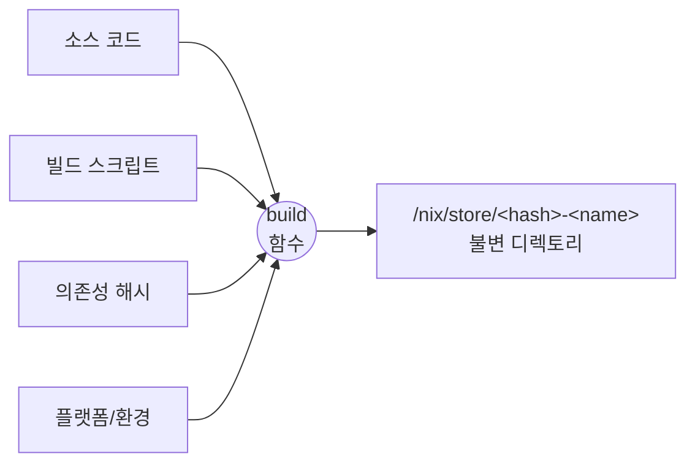
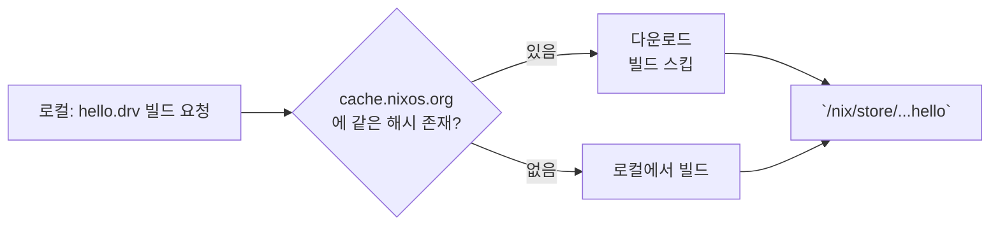
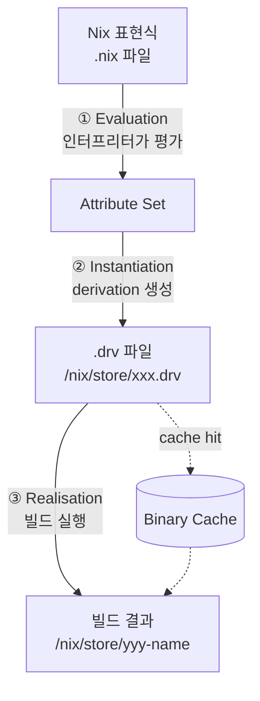
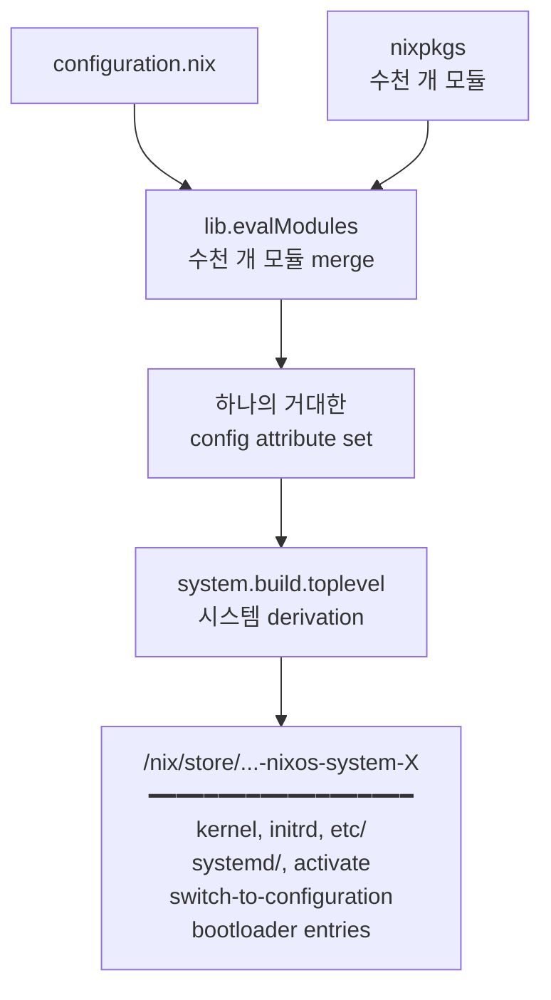
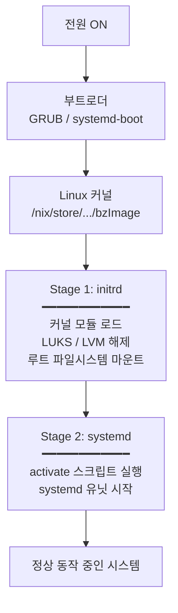

# Why? 왜 배움?

---

NixOS 홈랩을 운영하다 보면 한 가지 질문이 점점 또렷해진다.

> *"Terraform 이나 OpenTofu 로도 풀지 못한 OS 레벨 구성을  — 커널, 부트 파라미터, 시스템 서비스 —*

기존 IaC 도구들은 클라우드 리소스의 선언적 관리 에는 탁월하지만, 
OS 안쪽 — 어떤 커널 모듈을 올릴 것인지, `/etc` 의 어떤 파일이 누구에 의해 관리되는지, 시스템 업그레이드가 atomic 한지 — 까지는 책임지지 못한다. 
이 영역은 여전히 Ansible/Chef 같은 명령형 도구로, 혹은 manual + bash 스크립트 로 메워지고 있다.
NixOS 는 정확히 이 빈 자리를 메우는 도구다. 게다가 그 방식이 놀라울 정도로 명료하고 논리적이다. 
시스템 한 대를 하나의 함수의 출력값 으로 다루겠다는 것이다.
이 글은 *"NixOS 가 어떤 원리로 패키지부터 커널까지 통제하는가"* 라는 질문에 답하기 위해, 
가장 표층의 사용자 경험에서 출발해 가장 깊은 곳의 자료구조까지 한 줄기로 내려가 본다. 


# What? 뭘 배움?

---

## 들어가며: NixOS 를 이해하려면 어디서부터 시작해야 하는가 🔍

NixOS 의 동작 원리는 한 번에 보이지 않는다. 그것은 본질적으로 *세 겹으로 쌓인 추상* 이기 때문이다.

```
NixOS         =  ( Nix 모델 ) 을 OS 단위로 확장한 것
Nix           =  ( 순수 함수 모델 ) 을 패키지 빌드에 적용한 것
순수 함수 모델 =  "같은 입력 → 같은 출력, 부작용 없음"
```

이 사다리를 위에서부터 내려가며 NixOS 를 설명할 수도 있고, 아래에서부터 올라가며 설명할 수도 있다. 
이 글은 후자를 택한다 — 가장 근본적인 발상부터 시작해 그것이 어떻게 OS 한 대로 확장되는지를 따라간다. 
왜냐하면 NixOS 의 모든 신기한 속성 — 원자적 업그레이드, 즉각적 롤백, 커널 단위 선언적 구성 — 은 결국 가장 아래의 **순수 함수 모델** 에서 자동으로 따라 나오는 결과이기 때문이다.
그러므로 다음 순서로 이야기한다.

1. **Nix 의 출발점** — 어떤 문제를 어떤 발상으로 풀었는가
2. **Nix 동작 원리** — 그 발상이 코드 수준에서 어떻게 구현되어 있는가
3. **NixOS 동작 원리** — Nix 모델을 OS 한 대로 확장하면 무엇이 따라오는가


## Nix 의 출발점: 패키지 매니저를 순수 함수로 모델링하다 🏗️

NixOS 의 동작 원리를 이해하려면, 먼저 그 기반이 되는 **Nix** 라는 패키지 매니저부터 들여다봐야 한다. 
그리고 Nix 가 어떤 원리로 동작하는지 이해하려면, **이 도구가 애초에 어떤 문제를 풀려고 만들어졌는지** 부터 출발하는 것이 가장 빠르다.

### 기존 패키지 매니저의 공통적 한계

Nix 를 본격적으로 알아보기 앞서, Nix 와 다른 패키지 매니저들이 공유하는 *문제* 부터 짚어보자. 
그래야 Nix 가 도대체 무엇을 다르게 했는지가 선명하게 드러나기 때문이다.
dpkg, rpm, apt, yum — 우리가 흔히 쓰는 패키지 매니저들은 출신도 다르고 명령어도 다르지만 한 가지 공통점이 있다. 
모두 **글로벌 가변 상태(global mutable state)** 위에서 동작한다는 점이다. 
`/usr/lib`, `/usr/bin` 같은 공유 디렉토리에 파일을 직접 쓰고, 새 버전을 깔면 옛 버전을 덮어쓴다.
이러한 모델의 패키지 매니저들은 다음과 같은 고질적인 문제들을 공통적으로 만들어 왔다.

- **Dependency Hell:**
- **불완전한 의존성 명세:**
- **비-원자적 업그레이드:**
- **명령형 구성의 drift**: 

여기서 한 가지 흥미로운 관찰이 가능하다. 
위 네 가지 문제는 사실 **"가변 상태를 어떻게 안전하게 다룰 것인가"** 라는 단 하나의 질문에서 갈라져 나온 갈래들이다. 
그리고 Dolstra 박사는 이 질문에 대한 해답으로 **순수 함수형 프로그래밍** 을 소개하였다

### Dolstra 박사의 통찰: 빌드를 순수 함수로

2003년, 네덜란드 Utrecht 대학에서 박사 과정을 밟던 **Eelco Dolstra** 가 정확히 이 답을 패키지 관리에 가져왔다[^1]. 
그가 2006년에 방어한 박사학위 논문 *The Purely Functional Software Deployment Model*[^2] 은 Nix 의 모든 설계 사상이 담겨 있는 원전이며, 핵심 명제는 논문 1장 첫 문장으로 압축된다.

> *"given identical inputs, the software should behave the same on an end-user machine as on the developer machine"*
> 동일한 입력이 주어졌다면, 소프트웨어는 개발자 머신과 사용자 머신에서 동일하게 동작해야 한다.

말로 풀어쓰면 당연한 얘기지만, 정작 이 속성을 *수학적으로 보장하는* 패키지 매니저는 그전까지 존재하지 않았다. Dolstra 의 답은 한 문장으로 요약된다.

> **"패키지 빌드를 순수 함수로 모델링하자."**

함수형 프로그래밍의 함수는 입력만으로 출력이 결정되고 부작용이 없다. 
같은 입력은 항상 같은 출력을 낸다. 이를 패키지 빌드에 그대로 적용하면 다음 그림이 나온다.



빌드의 **입력** 은 소스 코드, 빌드 스크립트, 모든 의존성의 정확한 해시, 대상 플랫폼이다. 
**출력** 은 `/nix/store/<해시>-<이름>` 경로에 놓이는 불변 디렉토리다. 
같은 입력은 같은 출력 경로로 결정되며, 빌드는 sandbox 안에서 실행되어 외부 상태에 의존할 수 없다. 
그게 전부다.
너무 단순하다고 느껴질 수 있지만, 바로 이 간단한 발상 하나를 통해 너무 단순하다고 다음과 같은 이점들을 챙길 수 있다.

### 이 모델이 자동으로 만들어내는 이점들

여기서 "자동으로" 라는 표현은 과장이 아니다. 
아래 속성들은 Nix 의 개발자들이 따로 공들여 구현한 기능이 아니라, 빌드를 순수 함수로 정의한 그 순간 *수학적 귀결로* 따라 나오는 성질들이다.

- **재현성(Reproducibility)**: 
- **원자적 업그레이드와 즉각적 롤백**: 
- **동일 패키지의 다중 버전 공존**: 
- **선언적 시스템 구성**: 
- **Cross-Compilation**: 

여기까지가 Nix 가 *어떤 문제를 어떤 발상으로 풀었는가* 에 대한 이야기다. 
흥미롭게도 Dolstra 가 2006년 논문에서 제시한 아이디어들 — 격리, 선언적 구성, 원자적 배포, immutable infrastructure — 은 그 후 십여 년 동안 Docker, Terraform, Kubernetes 같은 다른 도구들로 *분산되어 재발견* 되었다[^4]. 
그러나 이들 중 어느 것도 *운영체제 한 대 전체* 를 한 번에 다루지는 못했다. 
바로 그 지점이 우리가 이 글에서 도달하려는 NixOS 의 의의다.
그렇다면 이 "순수 함수" 모델은 실제 코드 수준에서 어떤 자료구조와 메커니즘으로 구현되어 있을까? 
다음 장에서는 Nix 가 `/nix/store` 와 derivation 이라는 두 가지 무기로 이 추상을 어떻게 *물리적으로* 구체화하는지 살펴본다.

## Nix 동작 원리: 추상에서 구현으로 🍯

추상적 모델은 그것을 떠받치는 자료구조와 메커니즘이 있어야 비로소 작동한다. 
이 장에서는 *"빌드 = 순수 함수"* 라는 발상이 실제로 어떻게 파일과 디렉토리, 그리고 명령어로 구현되어 있는지를 따라간다.

### 핵심 데이터 구조: /nix/store

Nix 의 모든 빌드 결과물은 단 한 장소 — `/nix/store` — 에 저장된다[^8].
 `/usr/bin`, `/usr/lib`, `/usr` 같은 전통적인 디렉토리는 NixOS 에 *존재하지 않는다*. 
(예외는 `/bin/sh` 정도이며, 이것조차 store 안의 bash 로 향하는 심볼릭 링크다.)
store 안의 모든 항목은 다음과 같은 형식의 경로를 갖는다.

```
/nix/store/5rnfzla9kcx4mj5zdc7nlnv8na1najvg-firefox-3.5.4/
            └─────────── hash ───────────┘ └── name ──┘
```

여기서 `5rnf...` 는 단순한 임의 문자열이 아니다. 
**이 패키지를 빌드할 때 사용된 모든 입력값의 암호학적 해시** 이다. 
입력이 한 글자라도 다르면 해시가 달라지고, 따라서 store path 도 달라진다. 
이로부터 다음 두 속성이 *물리적으로* 보장된다.

- **격리(Isolation)**: 같은 이름의 다른 버전은 다른 해시를 가지므로 같은 디렉토리를 두고 충돌할 수 없다.
- **불변성(Immutability)**: 한 번 빌드된 store path 는 절대 덮어쓰이지 않는다. "업그레이드" 란 *새 store path 를 추가로 만들고* 시스템이 그것을 가리키게 하는 일이다.

`/etc` 같은 시스템 설정 디렉토리도 예외가 아니다. 
NixOS 에서 `/etc/ssh/sshd_config` 를 따라가 보면 다음과 비슷한 곳으로 향하는 심볼릭 링크임을 알 수 있다.

```
/nix/store/s2sjbl85xnrc18rl4fhn56irkxqxyk4p-sshd_config
```

*설정 파일조차도 derivation 의 출력물* 이라는 뜻이다. 이것이 NixOS 의 거의 모든 구성의 출발점이다.

### Derivation: 빌드의 사양서 (.drv)

이제 *"어떤 입력이 어떤 store path 를 만든다"* 라는 함수 관계를 *기계가 읽을 수 있는 형태* 로 표현해야 한다. 
그것이 바로 **derivation** 이다[^5][^6].
derivation 은 store 안에 `.drv` 파일로 저장되며, 빌드에 필요한 모든 정보를 담은 매니페스트 파일이라고 보면된다. 
그 안에는 다음 7가지 필드가 들어 있다.

| 필드 | 의미 |
| --- | --- |
| **outputs** | 이 derivation 이 만들어낼 store path 들 |
| **inputDrvs** | 빌드 전에 먼저 빌드되어야 할 다른 derivation 들 |
| **inputSrcs** | 이미 store 에 있어야 할 입력 (소스 파일 등) |
| **platform** | 어떤 플랫폼에서 빌드해야 하는가 (e.g. `x86_64-linux`) |
| **builder** | 빌드를 수행할 실행 파일 (보통 bash) |
| **args** | builder 에 전달할 인자 |
| **env** | builder 에 전달할 환경 변수 |


가장 중요한 사실은 **이 7개의 필드가 곧 함수의 입력이라는 점** 이다. 
이들 중 무엇 하나라도 바뀌면 derivation 의 해시가 바뀌고, 따라서 출력 store path 가 바뀐다. 
이것이 *재현성* 과 *불변성* 의 수학적 토대다.
REPL 에서 가장 작은 derivation 을 만들고 그 .drv 의 내용을 확인해 볼 수 있다 
(자세한 명령은 §How 에서 다룬다)[^7].

### Binary Cache: 분산 배포에서도 작동하는 이유

여기서 한 가지 의문이 자연스럽게 떠오른다. *"매번 모든 패키지를 처음부터 빌드한다고? 너무 느리지 않은가?"*
답은 우아하다. 
**같은 derivation 은 항상 같은 결과를 만들어내므로, 누가 미리 빌드해 둔 결과물을 가져와도 그것이 직접 빌드한 것과 비트 단위로 동일하다는 보장이 있다.** 
Nix 는 이 사실을 활용해 Binary Cache 라는 메커니즘을 둔다.



기본 캐시는 `cache.nixos.org` 이며, 사용자나 조직이 자체 캐시를 운영할 수도 있다 (Cachix, Attic 등). 
직접 빌드와 다운로드의 결과가 *비트 단위로 같다는 보장이 있기 때문에* 이 캐시는 단순한 성능 도구가 아니라 *분산 신뢰 시스템* 으로 기능한다. 
Nix 가 단순한 빌드 도구를 넘어 *대규모 패키지 배포 시스템* 까지 될 수 있는 이유가 여기에 있다.

### 정리: Nix 의 빌드 파이프라인

지금까지의 내용을 한 장의 흐름도로 정리하면 다음과 같다.



세 단계 각각이 *서로 다른 형태의 결과물* 을 반환한다는 점이 중요하다. 
평가는 *값* 을, instantiation 은 *.drv 경로* 를, realisation 은 *실제로 빌드된 디렉토리* 를 반환한다.
`nix-build` 와 `nix build` 같은 명령어는 이 세 단계를 한 번에 묶어 실행하는 편의 명령일 뿐, 내부적으로는 항상 이 파이프라인을 따른다.
이제 우리는 *패키지 단위의 Nix* 를 충분히 이해했다. 
다음 장에서는 이 모델을 *시스템 한 대 전체로 확장하면* 무슨 일이 벌어지는지를 본다.


## NixOS 동작 원리: Nix 모델을 OS 한 대로 확장하기 :nix-logo:

NixOS 의 가장 깊은 통찰은 한 줄로 표현된다.

> **"운영체제 한 대 전체도, 결국 하나의 derivation 이다."**

커널, 부트로더 설정, `/etc` 의 파일들, systemd 유닛, 활성화 스크립트, 등등
이 모든 것이 한 derivation 의 입력으로 들어가, 한 store path 라는 출력물로 묶여 나온다. 
이 장에서는 그 과정을 단계별로 따라간다.

### Module System: configuration.nix → 거대한 attribute set

NixOS 사용자는 `/etc/nixos/configuration.nix` 라는 한 파일에 시스템의 *원하는 상태* 를 적는다. 

```nix
{ config, pkgs, ... }:
{
  services = {
    openssh.enable = true;
    ,,,
  };
  users.users.alice = { ... };
  boot.kernelPackages = pkgs.linuxPackages_latest;
  
}
```

그러나 이 파일 한 장이 시스템의 전부일 리는 없다. 
실제로는 nixpkgs 안에 들어 있는 *수천 개의 모듈* 이 함께 평가된다.
각 모듈은 두 가지를 정의한다.

- **options**: 어떤 옵션을 받을 수 있는가 (타입, 기본값, 설명)
- **config**: 그 옵션이 주어졌을 때 무엇을 만들어낼 것인가

수천 개의 모듈은 nixpkgs 의 `lib.evalModules` 함수에 의해 *하나의 거대한 attribute set 으로 합쳐진다*[^12]. 
이 합치는 과정에서 옵션의 우선순위, 타입 검사, 기본값 적용이 수학적으로 정의된 규칙에 따라 이루어진다. 
결과적으로 `config.boot.kernelPackages` 나 `config.services.openssh.settings.PermitRootLogin` 같은 *모든 시스템 설정 값* 이 단 하나의 값으로 결정된다.

### System Derivation: 운영체제도 결국 하나의 .drv

이 거대한 attribute set 의 정점에 있는 값이 바로 `config.system.build.toplevel` 이다[^11]. 
이것은 *시스템 한 대 전체* 를 표현하는 단 하나의 derivation 이다. 
그 출력 store path 는 다음 것들을 모두 포함한다.

- **kernel**: `boot.kernelPackages` 로부터 빌드되거나 캐시에서 가져온 커널 이미지
- **initrd**: 부팅 초기에 사용될 ramdisk
- **etc**: `/etc` 에 심볼릭 링크될 설정 파일들의 모음
- **systemd 유닛**: 모든 서비스의 unit 파일들
- **activate**: 새 시스템을 적용할 때 실행될 bash 스크립트
- **bin/switch-to-configuration**: 활성화 로직을 담은 Perl 스크립트
- **kernel-modules**: 적재될 커널 모듈들
- **bootloader 설정**: GRUB / systemd-boot 메뉴 항목

이 모든 것이 *하나의 store path* 안에 묶여 있다는 사실이 NixOS 의 모든 마법의 근원이다. 
따라서 *"커널을 어떻게 관리하는가"* 라는 이 글의 첫 질문에 대한 답이 이 한 문장으로 압축할 수 있다
**커널은 별도의 메커니즘으로 관리되는 것이 아니라, 시스템 derivation 이라는 거대한 함수의 한 입력일 뿐이다.**



### Build/Deploy 4단계: Eval → Drv → Realise → Activate

`nixos-rebuild switch` 한 줄을 입력하면 내부적으로 다음 4단계가 차례로 일어난다. 
앞 세 단계는 §Nix 동작 원리에서 본 파이프라인 그대로다. 마지막 한 단계가 추가로 붙는다.


Nix 인터프리터가 `/etc/nixos/configuration.nix` 를 시작점으로 nixpkgs 의 모든 관련 모듈을 읽고 평가한다. 
`boot.kernelPackages`, `services.xserver.enable` 같은 옵션이 모두 결정되어 거대한 attribute set 이 된다.


평가된 결과로부터 `system.build.toplevel.drvPath` 가 계산된다. 
이 시점에 store 에는 *.drv 파일들* 만 존재할 뿐 실제 바이너리는 아직 없다.


.drv 들이 의존성 순서대로 실제로 빌드된다. 캐시에 있는 것은 다운로드되고, 없는 것만 로컬에서 빌드된다. 
결과는 `/nix/store/.../nixos-system-<host>-<version>` 이라는 단 하나의 디렉토리다.


새 시스템 디렉토리 안의 `bin/switch-to-configuration` 스크립트가 실행된다[^9]. 
이 스크립트는 이전 시스템과 새 시스템을 비교하여, 어떤 systemd 유닛을 reload 할지, 어떤 것을 restart 할지, 어떤 것을 새로 시작할지를 결정한다. 
그 후 `/run/current-system` 심볼릭 링크를 새 시스템 path 로 바꾼다
단 한 번의 syscall 로 시스템 전체가 새 generation 으로 전환된다. 
이것이 원자적 업그레이드 의 정체다.
이 4단계 중 ①~③ 은 *빌드 시점* 의 일이고 ④ 는 *적용 시점* 의 일이다. 
다음 섹션에서 다룰 부팅 시 의 Stage 1/2 와는 또 다른 차원의 이야기이므로 혼동하지 말자

### Boot 파이프라인: Stage 1 (initrd) & Stage 2 (systemd)

위 4단계가 *시스템을 새로 빌드해서 적용하는* 과정이라면, 
다음은 *전원을 켰을 때* 그 시스템이 어떻게 살아나는지에 대한 이야기다. 
NixOS 도 결국 Linux 이므로 부팅 흐름의 큰 틀은 같지만, 모든 단계가 *Nix 가 미리 빌드해 둔 산출물* 위에서 작동한다는 점이 다르다.




부트로더가 커널을 로드한 직후 실행되는 초기 단계다. 
NixOS 는 `boot.initrd.availableKernelModules` 에 적힌 모듈들을 포함하는 임시 파일 시스템(initrd)을 빌드해 둔다. 이 단계의 역할은 다음과 같다.

- 필요한 커널 모듈 적재
- LVM, LUKS 같은 디스크 암호화 해제
- 루트 파일 시스템 마운트

이 모든 과정은 Nix 가 빌드 시점에 *생성해 둔* `init` 셸 스크립트에 의해 통제된다.


루트 파티션이 마운트된 후 실제 OS 서비스가 시작되는 단계다. 이때 일어나는 핵심적인 일은 다음 두 가지다.

- 위 ④ 의 activate 스크립트가 실행되어 `/etc` 의 심볼릭 링크들이 새 store path 를 가리키도록 갱신된다.
- systemd 가 `boot.kernelParams` 와 함께 정의된 모든 시스템 서비스를 시작한다.

여기서 주목할 만한 부분은 *NixOS 는 **`/etc`** 의 거의 모든 파일을 직접 관리하지 않는다는 것이다*[^8]. 
`/etc` 의 대부분은 `/nix/store` 안의 derivation 출력물로 향하는 심볼릭 링크들이다. 
사용자가 `/etc/ssh/sshd_config` 를 손으로 편집해도, 다음 활성화 시점에 그 변경은 흔적도 없이 사라진다.
시스템의 *진짜 상태* 는 언제나 `configuration.nix` 안에 있다.

### Generation 과 Rollback

이러한 순수함수형 빌드 모델 위에서 NixOS 는 *generation* 이라는 개념을 사용한다
앞서 [④ Activation: System Path → 실제 동작](https://www.notion.so/35a19c39029080e6aebbc617829d5a03#35a19c390290805d99d4efc60699e924) 에서 설명한 것처럼, 
NixOS 는 `bin/switch-to-configuration` 스크립트 실행하여 새로운 시스템에 대해 `/run/current-system` 산하에 새로운 시스템 path 를 만든다
즉, NixOS 에서는 각 새로운 Build 를 돌릴 때마다 generation 을 찍어 이정표를 찍는다
이 generation 들을 통해 특정 시점의 generation 으로 rollback 할 수 있는 기능을 제공한다

```bash
# 지금까지 빌드된 모든 generation
sudo nix-env --list-generations --profile /nix/var/nix/profiles/system

#   1   2024-01-15 10:23
#   2   2024-01-18 14:01
#   ...
#   42  2024-05-08 09:12   (current)
```

이러한 각 generation 은 부트로더 메뉴에 그대로 등록된다. 
따라서 만약 새 커널로 부팅했는데 패닉이 나거나 디스플레이가 안 잡히면, 
재부팅해서 GRUB 메뉴에서 이전 generation 을 고르면 그만이다. 
이는 디스크에 시스템이 그대로 살아 있기 때문에 가능한 일이다.
런타임 롤백은 더 빠르다.

```bash
sudo nixos-rebuild switch --rollback
```

이 한 줄은 단순히 `/run/current-system` 심볼릭 링크를 직전 generation 으로 다시 가리키게 하고 
activate 스크립트를 한 번 더 실행할 뿐이다. 
다른 OS 에서는 *"마지막에 무엇을 바꿨더라"* 를 떠올리며 손으로 되돌리는 그 작업이, NixOS 에서는 한 번의 syscall 이다.
여기까지가 *NixOS 가 어떤 원리로 패키지부터 커널까지 통제하는가* 라는 이 글의 첫 질문에 
답을 요약하면 다음과 같다.

> *NixOS 는 시스템 한 대를 순수 함수의 출력값 으로 다룬다. *

다음 장에서는 이 추상이 명령어 수준에서 어떻게 만져지는지를 직접 손으로 확인해 본다.


# How? 어떻게 씀?

---

여기까지 읽었다면 *Nix 가 무엇이고 NixOS 가 어떻게 동작하는가* 에 대한 머릿속 그림은 어느 정도 잡혔을 것이다. 
그러나 추상적 모델은 손으로 만져 보기 전까지는 진짜로 이해되지 않는다. 
이 장에서는 앞서 다룬 개념들 — store path, derivation, 빌드 파이프라인, generation — 을 직접 명령어로 확인해 본다.

> 💡 

## 실습 ①: 내 시스템 안에서 Nix 의 흔적 찾기

가장 먼저 할 일은 우리가 추상적으로 다룬 것들이 실제로 시스템에 존재하는지 눈으로 확인하는 것이다.

```bash
# /nix/store 안에 무엇이 살고 있는가
ls /nix/store | head -20

# 현재 시스템 전체가 가리키는 store path
readlink /run/current-system

# 본문에서 다룬 활성화 스크립트의 실체
less /run/current-system/activate

# 현재 커널 역시 store 안에 있다 — "커널도 하나의 derivation" 의 증거
readlink /run/current-system/kernel
```

`activate` 스크립트를 끝까지 스크롤해 보면 본문에서 이야기한 fragment 들 — `binsh`, `etc`, `users`, `modprobe`, `specialfs`[^10] — 이 모두 그 안에 차례로 들어 있는 것을 확인할 수 있다. 
*configuration.nix 한 파일이 거대한 bash 스크립트로 컴파일된* 결과를 직접 볼 수 있다.

## 실습 ②: Derivation 직접 만들고 해부하기

본문에서 다룬 derivation 의 7가지 필드(outputs / inputDrvs / inputSrcs / platform / builder / args / env)가 실제로 어떤 모습인지 보기 위해, 가장 작은 derivation 하나를 만들어 본다.

```bash
nix repl
```

REPL 안에서:

```nix
nix-repl> d = derivation {
            name = "myname";
            builder = "mybuilder";
            system = "x86_64-linux";
          }

nix-repl> d
# → «derivation /nix/store/xxx-myname.drv»

nix-repl> d.drvPath
# → "/nix/store/xxx-myname.drv"
```

이제 셸로 돌아와서 .drv 의 내용을 들여다본다.

```bash
# .drv 의 JSON 표현
nix derivation show /nix/store/xxx-myname.drv | jq

# 의존성 그래프 전체를 보고 싶다면:
nix derivation show -r nixpkgs#hello | jq 'keys'
```

본문에서 다룬 7가지 필드가 이 JSON 의 키로 그대로 등장한다는 점을 확인할 수 있다.

## 실습 ③: 빌드 파이프라인을 단계별로 끊어서 실행하기

본문에서 다룬 4단계 (Evaluation → Instantiation → Realisation → Activation) 중 앞 세 단계를 *분리해서* 실행해 본다. 
각 단계의 결과물 형태가 다르다는 사실이 모델 이해의 핵심이다.

```bash
# ① Evaluation 만 — 표현식을 평가만 하고 .drv 도 만들지 않는다
nix-instantiate --eval -E '1 + 2'
# → 3
nix-instantiate --eval -E '(import <nixpkgs> {}).hello.name'
# → "hello-2.12.1"

# ② Instantiation 까지 — .drv 파일을 만들지만 빌드는 하지 않는다
nix-instantiate '<nixpkgs>' -A hello
# → /nix/store/xxx-hello-2.12.1.drv

# ③ Realisation — 위 .drv 를 실제로 빌드한다
nix-store --realise /nix/store/xxx-hello-2.12.1.drv
# → /nix/store/yyy-hello-2.12.1
```

요약하면 평가는 *값* 을, instantiation 은 *.drv 경로* 를, realisation 은 *빌드된 디렉토리* 를 반환한다. 
같은 일을 한 줄로 처리하는 `nix-build` 와 `nix build` 는 위 세 단계를 묶어주는 편의 명령일 뿐이다.
의존성 그래프를 시각적으로 확인하려면:

```bash
# 런타임 의존성 트리
nix-store --query --tree $(nix-build '<nixpkgs>' -A hello --no-out-link)

# closure 크기 — Nix 패키지가 자기충족적이라는 사실의 정량적 증거
nix-store --query --requisites \\
  $(nix-build '<nixpkgs>' -A hello --no-out-link) | wc -l
```

## 실습 ④: NixOS 활성화와 Generation 추적하기

이제 *시스템 단위* 의 동작을 살펴본다. 
configuration.nix 에 작은 변경을 하나 가하고 (예: 패키지 추가) 다음을 차례로 실행해 본다.

```bash
# 지금까지 빌드된 시스템 generation 들
sudo nix-env --list-generations --profile /nix/var/nix/profiles/system

# (1) 빌드만 하고 적용은 안 함 — 안전하게 결과물 확인
sudo nixos-rebuild build

# (2) 현재 시스템과 새 시스템의 차이
nix store diff-closures /run/current-system ./result

# (3) 활성화 시뮬레이션 (실제로는 systemd 안 건드림)
sudo nixos-rebuild dry-activate

# (4) 진짜 적용
sudo nixos-rebuild switch

# (5) 문제가 생기면 즉시 롤백
sudo nixos-rebuild switch --rollback
```

`nix store diff-closures` 의 출력은 본문에서 다룬 
*"시스템 한 대 = 하나의 derivation"* 이라는 명제를 가장 직관적으로 보여준다. 
두 시스템의 차이를 단순한 *set difference* 로 계산할 수 있다는 사실 자체가 모델의 결과다. 
*"이번 업그레이드로 정확히 무엇이 바뀌었는가" *에 대해* *다른 OS 에서는 이러한 변경점 추적 도구를 찾기 어렵다.

## 실습 ⑤: 가장 실용적인 응용 — 프로젝트별 격리된 개발 환경

홈랩을 굴리다 보면 프로젝트마다 필요한 언어와 도구가 다르다. 
Nix 의 `nix-shell` / `nix develop` 은 이를 *프로젝트 단위로 격리* 할 수 있게 해 준다.

```bash
# 일회성: 현재 셸에서 임시로 python + node 환경 띄우기
nix-shell -p python3 nodejs_20

# 안에서 확인
which python3   # → /nix/store/xxx-python3-3.x.x/bin/python3
exit            # → 빠져나오면 흔적도 없이 사라진다
```

프로젝트 루트에 `flake.nix` 한 파일을 두면 더 깔끔하다.

```nix
# flake.nix
{
  description = "My homelab playground";
  inputs.nixpkgs.url = "github:NixOS/nixpkgs/nixos-unstable";
  outputs = { self, nixpkgs }:
    let pkgs = nixpkgs.legacyPackages.x86_64-linux; in {
      devShells.x86_64-linux.default = pkgs.mkShell {
        buildInputs = with pkgs; [ python3 nodejs_20 jq ];
      };
    };
}
```
```bash
# 활성화
nix develop

# direnv 와 결합하면 디렉토리 진입만으로 자동 활성화된다
echo "use flake" > .envrc && direnv allow
```

이렇게 하면 *"이 머신에 무엇이 깔려 있는가"* 라는 질문 자체가 무의미해진다. 
어떤 머신에서든, 어떤 시점에서든, `flake.nix` 만 같으면 동일한 환경이 재현된다. 
Nix 의 순수 함수 모델이 일상에서 가장 자주 빛나는 순간이며, 
많은 사람이 NixOS 까지 가지 않더라도 *Nix 만은* 도입하게 되는 진입점이기도 하다.


# Reference

---

[^1]: NixOS - Wikipedia. [https://en.wikipedia.org/wiki/NixOS](https://en.wikipedia.org/wiki/NixOS)
[^2]: Eelco Dolstra (2006). *The Purely Functional Software Deployment Model*. PhD Thesis, Utrecht University. [https://edolstra.github.io/pubs/phd-thesis.pdf](https://edolstra.github.io/pubs/phd-thesis.pdf)
[^3]: NixOS Reproducible Builds. [https://reproducible.nixos.org/](https://reproducible.nixos.org/)
[^4]: Jonathan Lorimer. *The Nix Thesis*. [https://jonathanlorimer.dev/posts/nix-thesis.html](https://jonathanlorimer.dev/posts/nix-thesis.html)
[^5]: Nix Reference Manual — Glossary (Derivation). [https://nix.dev/manual/nix/2.28/glossary.html](https://nix.dev/manual/nix/2.28/glossary.html)
[^6]: Nix Reference Manual — Derivations. [https://nix.dev/manual/nix/2.28/language/derivations.html](https://nix.dev/manual/nix/2.28/language/derivations.html)
[^7]: Nix Pills — Our First Derivation. [https://nixos.org/guides/nix-pills/06-our-first-derivation](https://nixos.org/guides/nix-pills/06-our-first-derivation)
[^8]: How Nix Works. [https://nixos.org/guides/how-nix-works/](https://nixos.org/guides/how-nix-works/)
[^9]: NixOS Manual — Activation Script. [https://nixos.org/manual/nixos/unstable/#sec-activation-script](https://nixos.org/manual/nixos/unstable/#sec-activation-script)
[^10]: nixpkgs / activation-script.nix. [https://github.com/NixOS/nixpkgs/blob/master/nixos/modules/system/activation/activation-script.nix](https://github.com/NixOS/nixpkgs/blob/master/nixos/modules/system/activation/activation-script.nix)
[^11]: nixpkgs / top-level.nix. [https://github.com/NixOS/nixpkgs/blob/master/nixos/modules/system/activation/top-level.nix](https://github.com/NixOS/nixpkgs/blob/master/nixos/modules/system/activation/top-level.nix)
[^12]: nix.dev — Module System Tutorial. [https://nix.dev/tutorials/module-system/](https://nix.dev/tutorials/module-system/)
[^이외에도,,,]: 
What Is Nix - Shopify : 원리와 구조에 대해서 원초적이면서 잘 요약되어있는 포스트 [https://shopify.engineering/what-is-nix](https://shopify.engineering/what-is-nix)
Nix language basics - nix.dev : Nix 언어사용법,내부 옵션들을 소개하며 Nix 구조를 잘 소개해놓은 포스트 [https://nix.dev/tutorials/nix-language.html#derivations](https://nix.dev/tutorials/nix-language.html#derivations)
Derivations - Zero to Nix : Nix 의 컨셉과 처리 원리를 다각적으로 설명해놓음. 사실상 공식문서를 뺨 때리는 포스트 [https://zero-to-nix.com/concepts/derivations/](https://zero-to-nix.com/concepts/derivations/)
