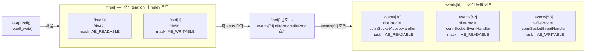
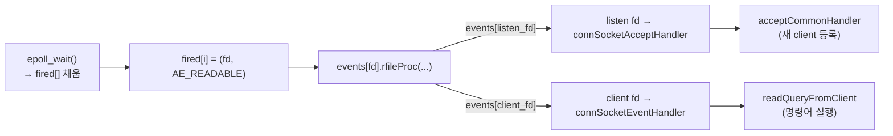

# Why? 왜 배움?

[이전 글](/posts/valkey-커스텀-명령어-구현하기) 에서 `c->cmd->proc(c)` 가 호출되면 커스텀 명령어가 실행되는 것까지 확인했다. 그런데 그 한 줄 위로 거슬러 올라가면 모르는 것이 많았다.

- 클라이언트가 보낸 바이트가 어떻게 `c->cmd->proc(c)` 호출까지 도달하는가?
- Valkey 는 어떻게 *싱글 스레드 한 개* 로 수만 동시 연결을 처리하는가?
- accept / read / write 가 모두 같은 `epoll_wait()` 를 거치는데, 어떻게 서로 다른 함수로 분기되는가?
- 응답이 클라이언트로 나가는 시점이 *명령어 처리 직후* 가 아니라 *다음 이벤트 루프 직전* 인 이유는 무엇인가?

답은 세 개의 추상에 있다. *ae* 라는 이벤트 루프 레이어가 epoll/kqueue/select 차이를 숨기고, *ConnectionType* vtable 이 TCP/TLS/Unix 차이를 숨기며, *clients_pending_write* 큐가 응답 전송을 일괄 처리로 미룬다. 이 세 추상이 합쳐져 *바이트 수신 → 명령어 실행 → 응답 전송* 의 전체 네트워크 경로를 만든다.

이 글은 그 경로를 ae 이벤트 루프 → epoll backend → accept / read / write 세 경로 순서로 소스 코드 수준에서 정리한다. OSSCA Valkey 시리즈 [01](/posts/valkey-내부-해부-resp-robj-자료구조-인코딩-전환) / [02](/posts/valkey-커스텀-명령어-만들어보기) / [03](/posts/valkey-커스텀-명령어-구현하기) 의 마지막 글이며, 시리즈 finale 회고는 Remark 에 두었다.

# What? 뭘 배움?

## 들어가며 — 세 추상으로 보는 Valkey I/O 🗺️

Valkey 의 네트워크 처리는 세 겹의 추상으로 정리된다.

```
┌─────────────────────────────────────────────────────────┐
│ 1. ae 이벤트 루프 (src/ae.c, ae.h)                       │  ← "fd 가 ready 되면 콜백을 부른다"
├─────────────────────────────────────────────────────────┤
│ 2. epoll / kqueue / select backend (src/ae_*.c)         │  ← "어느 fd 가 ready 인지 OS 에 묻는다"
├─────────────────────────────────────────────────────────┤
│ 3. ConnectionType vtable (src/socket.c, src/connection.h) │  ← "TCP, TLS, Unix 차이를 숨긴다"
└─────────────────────────────────────────────────────────┘
```

세 추상은 위에서 아래로 갈수록 OS 의존성이 강해진다. 1번 (ae) 은 *콜백 모델* 만 제공하고, 2번 (epoll backend) 이 OS 의 멀티플렉싱 syscall 을 호출하고, 3번 (ConnectionType) 이 transport 별 read/write 함수를 분기한다. 상위 코드 (`networking.c`) 는 세 추상 덕분에 OS 도 transport 도 알지 못한 채 `connRead()`, `connWrite()` 만 호출한다.

본문은 이 순서를 따라간다. 먼저 *전체 그림* 으로 세 경로 (accept / read / write) 의 개요를 잡는다. 그 다음 ae 이벤트 루프의 핵심 자료구조 (`events[]`, `fired[]`) 와 한 iteration 의 단계를 본다. epoll backend 의 `aeApiPoll` 이 어떻게 ae 의 `fired[]` 를 채우는지를 짚은 뒤, accept / ConnectionType / read / write 네 절로 세 경로를 차례로 해부한다. 마지막으로 같은 `AE_READABLE` 이 두 가지 다른 함수로 분기되는 이유를 한 번 더 회수한다.

## 전체 그림 — 세 경로 개요 🗺️

세 추상을 모두 거치는 한 iteration 의 흐름을 한 줄로 요약하면 다음과 같다.

```text
fd 등록 (aeCreateFileEvent)
  → backend 등록 (epoll_ctl)
  → 대기 (epoll_wait)
  → fired[] 채우기
  → rfileProc / wfileProc 호출
```

Valkey 의 네트워크 이벤트는 세 가지 *독립적인 경로* 로 구성된다. 각 경로가 어떤 fd 에 어떤 콜백을 등록하는지에 따라 분기되며, 같은 `AE_READABLE` 이벤트라도 등록된 콜백이 다르면 실행 경로가 갈라진다.

| 이벤트 | fd | 이벤트 루프 콜백 | 최종 실행 함수 |
|---|---|---|---|
| 새 연결 | 리스닝 소켓 | `connSocketAcceptHandler()` | `acceptCommonHandler()` |
| 요청 수신 | 클라이언트 소켓 | `connSocketEventHandler()` | `readQueryFromClient()` |
| 응답 전송 | 클라이언트 소켓 | `connSocketEventHandler()` | `sendReplyToClient()` |

세 줄은 서로 다른 이벤트 경로다. `readQueryFromClient()` 가 `sendReplyToClient()` 를 직접 호출하는 구조가 아니다. read 경로 끝에서 응답이 *큐에 쌓이기만* 하고, 실제 송신은 다음 iteration 의 `beforesleep` 단계에서 일괄 처리된다. 이 구조가 *write 경로의 지연 쓰기 최적화* 다 — write 경로 절에서 다시 본다.

이 세 경로가 어떻게 만들어지고 동작하는지를 이벤트 루프 → epoll backend → 각 경로 순서로 따라간다.

## ae 이벤트 루프 — events[] 와 fired[] 의 분리 ⚙️

세 경로의 분기점이 *fd 별 콜백* 임을 확인했다. 이번 절은 그 콜백이 어디에 저장되고, 어떻게 호출되는지를 ae 레이어의 자료구조와 한 iteration 단계로 본다.

### backend 선택

`ae.c` 는 빌드 환경에 따라 multiplexing backend 를 컴파일 타임에 선택한다. 이 분기 덕분에 상위 ae 레이어는 backend 종류를 알 필요가 없다.

```c
/* src/ae.c */
#ifdef HAVE_EPOLL
#include "ae_epoll.c"      // ← Linux
#elif defined(HAVE_KQUEUE)
#include "ae_kqueue.c"      // ← macOS / BSD
#else
#include "ae_select.c"      // ← fallback
#endif
```

상위 계층은 backend 종류를 알지 못한다. 이것이 Valkey 의 `ae` 레이어가 제공하는 첫 번째 추상화다.

### aeEventLoop 구조

`aeEventLoop`[^2] 는 이벤트 루프 전체 상태를 담는 핵심 구조체다.

```c
/* src/ae.h */
typedef struct aeEventLoop {
    int maxfd;
    int setsize;
    aeFileEvent *events;       /* fd별 등록 정보 (콜백 + mask) */
    aeFiredEvent *fired;       /* epoll_wait 결과 임시 저장 */
    aeTimeEvent *timeEventHead;
    int stop;
    void *apidata;             /* backend 전용 상태 (epoll의 aeApiState) */
    aeBeforeSleepProc *beforesleep;
    aeBeforeSleepProc *aftersleep;
    int flags;
} aeEventLoop;
```

`events[]` 와 `fired[]` 의 분리가 이 구조의 핵심이다. 두 배열의 역할 분담을 그림으로 정리하면 다음과 같다.



`events[fd]` 는 *fd 별로 영구 등록된 콜백* 을 담는다. fd 42 에 `readQueryFromClient` 콜백이 한 번 등록되면, 다음 epoll iteration 마다 같은 콜백이 호출된다. `fired[]` 는 *이번 iteration 에 ready 가 된 fd 들의 임시 목록* 이다. backend 종류에 무관한 단순 `{fd, mask}` 구조라, `aeProcessEvents()` 가 epoll 인지 kqueue 인지 알 필요가 없다.

이 분리 덕분에 *backend 교체가 콜백 실행 코드를 건드리지 않는다*. ae 의 두 번째 추상화다.

### aeMain 과 aeProcessEvents

`aeMain()`[^4] 의 구조는 단순하다.

```c
/* src/ae.c */
void aeMain(aeEventLoop *eventLoop) {
    eventLoop->stop = 0;
    while (!eventLoop->stop)
        aeProcessEvents(eventLoop,
            AE_ALL_EVENTS | AE_CALL_BEFORE_SLEEP | AE_CALL_AFTER_SLEEP);
}
```

`aeProcessEvents()`[^3] 가 매 iteration 마다 실행하는 순서는 다음과 같다.

```text
beforesleep()         ← pending write 처리 등
  → aeApiPoll()       ← epoll_wait() 호출, 여기서 블로킹
  → aftersleep()
  → fired[] 순회
  → rfileProc / wfileProc 호출
```

한 fd 에서 read 와 write 가 동시에 ready 일 때, 기본은 readable 콜백을 먼저 실행한다. `AE_BARRIER` 플래그가 설정된 경우에는 writable 이 먼저 호출된다. AOF `fsync=always` 모드에서 응답 전송 전에 디스크 기록을 보장하기 위해 사용된다.

> [!NOTE]
> **AOF (Append-Only File)**
> Valkey 의 영속성 로그. 모든 쓰기 명령을 순차 파일에 append 한다. `fsync=always` 모드는 매 명령 직후 디스크에 강제 flush 하여 크래시 시 손실 가능 시간을 0초로 줄이는 가장 안전한 옵션이다. 응답 전송 전 디스크 기록을 보장해야 하므로 `AE_BARRIER` 가 켜진다.

이벤트 루프의 구조를 확인했으니, 이 루프가 실제로 호출하는 `aeApiPoll()` 이 내부에서 어떻게 epoll 과 통신하는지를 본다.

## epoll backend — fired[] 를 채우는 syscall 🔩

ae 레이어가 *콜백 모델* 만 정의한다면, epoll backend 는 *어느 fd 가 ready 인지를 OS 에 묻는 syscall* 을 담당한다. 두 레이어가 만나는 지점이 `aeApiPoll()` 이며, 그 결과가 ae 의 `fired[]` 에 채워지는 한 단계다.

### aeApiState

`aeApiState`[^5] 는 epoll backend 의 전용 상태를 담는다.

```c
/* src/ae_epoll.c */
typedef struct aeApiState {
    int epfd;                    // ← epoll_create() 로 생성한 epoll 인스턴스 fd
    struct epoll_event *events;  // ← epoll_wait() 결과를 받을 배열
} aeApiState;
```

`aeApiCreate()`[^6] 가 서버 초기화 시 이 상태를 한 번 생성한다.

```c
/* src/ae_epoll.c */
static int aeApiCreate(aeEventLoop *eventLoop) {
    aeApiState *state = zmalloc(sizeof(aeApiState));
    state->events = zmalloc(sizeof(struct epoll_event) * eventLoop->setsize);
    state->epfd = epoll_create(1024);  // ← 인수는 힌트로만 사용됨
    eventLoop->apidata = state;
    return 0;
}
```

### 이벤트 등록

`aeCreateFileEvent()`[^8] 를 호출하면 두 가지 일이 한 번에 일어난다. 첫째, ae 의 `events[fd]` 에 콜백이 저장된다. 둘째, backend 의 `epoll_ctl()` 이 호출되어 커널의 epoll 인스턴스에 fd 가 등록된다.

```text
aeCreateFileEvent(loop, fd, AE_READABLE, proc, clientData)
  → aeApiAddEvent(loop, fd, mask)
      → epoll_ctl(epfd, EPOLL_CTL_ADD or EPOLL_CTL_MOD, fd, &ee)
  → events[fd].rfileProc = proc       // ← 콜백 저장
```

이 한 호출이 *fd 의 ready 상태를 감시하는 약속* 과 *ready 가 되었을 때 호출할 콜백* 두 가지를 동시에 설정한다. Valkey mask 와 epoll event 간의 변환은 다음 표와 같다.

| Valkey mask | epoll event | 의미 |
|---|---|---|
| `AE_READABLE` | `EPOLLIN` | 읽을 수 있음 |
| `AE_WRITABLE` | `EPOLLOUT` | 쓸 수 있음 |

### aeApiPoll — epoll_wait() 와 fired[]

`aeApiPoll()`[^7] 이 실제 커널 대기 지점이다. 이 함수가 ae 의 `fired[]` 를 채우는 유일한 길이다.

```c
/* src/ae_epoll.c */
static int aeApiPoll(aeEventLoop *eventLoop, struct timeval *tvp) {
    aeApiState *state = eventLoop->apidata;
    int retval;

    retval = epoll_wait(state->epfd, state->events,
                        eventLoop->setsize, timeout);
    if (retval > 0) {
        for (int j = 0; j < retval; j++) {
            struct epoll_event *e = state->events + j;
            int mask = 0;
            if (e->events & EPOLLIN)  mask |= AE_READABLE;
            if (e->events & EPOLLOUT) mask |= AE_WRITABLE;
            eventLoop->fired[j].fd   = e->data.fd;   // ← backend 결과를
            eventLoop->fired[j].mask = mask;          // ← fired[] 로 복사
        }
    }
    return retval;
}
```

`fired[]` 가 존재하는 이유는 backend 추상화다. `aeProcessEvents()` 는 `fired[]` 만 보면 되며, epoll 인지 kqueue 인지 알 필요가 없다. kqueue backend (`ae_kqueue.c`) 는 `kevent()` syscall 의 결과를 같은 형태로 `fired[]` 에 채운다.

epoll 이 fd 에 readiness 를 알려주면 `aeProcessEvents()` 가 `events[fd].rfileProc` 을 호출한다. 그렇다면 *어떤 fd 에 어떤 콜백이 등록되는가*. 등록 시점의 콜백이 fd 별로 `events[]` 에 저장되므로, 같은 `AE_READABLE` mask 라도 fd 마다 다른 함수가 실행된다. 이것이 accept / read / write 세 경로의 분기점이다.

## accept 경로 — 새 연결과 client fd 등록 🔗

세 경로 중 가장 먼저 등록되는 것은 *새 연결 수락* 이다. 서버 부팅 시 리스닝 소켓의 콜백으로 `connSocketAcceptHandler` 가 등록되고, 클라이언트 연결 요청이 도착하면 이 콜백이 호출된다.

### 초기화

서버 시작 시 이벤트 루프와 리스닝 소켓이 순서대로 초기화된다.

```text
main()
  → initServer()
      → aeCreateEventLoop()                    [^1][^16]
  → initListeners()
      → createSocketAcceptHandler()             [^15]
          → aeCreateFileEvent(loop, listen_fd, AE_READABLE,
                              connSocketAcceptHandler, ...)
```

`createSocketAcceptHandler()`[^15] 에서 리스닝 소켓의 fd 를 `AE_READABLE` 로 등록하고, 콜백으로 `connSocketAcceptHandler()` 를 지정한다.

### accept 흐름

새 연결 요청이 오면 다음 경로로 처리된다.

```text
epoll_wait() → listen fd AE_READABLE
  → connSocketAcceptHandler()                   [^9]
      → anetTcpAccept()
          → accept()                            // 커널 syscall
      → acceptCommonHandler()
          → createClient(conn)
              → connSetReadHandler(conn, readQueryFromClient)  [^17]
                  → aeCreateFileEvent(loop, client_fd,
                                      AE_READABLE,
                                      connSocketEventHandler, ...)
```

accept 는 요청 데이터를 읽지 않는다. accept 는 client fd 를 만들고, 그 fd 의 read event 를 이벤트 루프에 등록한다. `connSetReadHandler()`[^17] 이후 다음 `epoll_wait()` iteration 부터 `readQueryFromClient()` 가 호출될 준비가 된다.

accept 경로에서 `connSetReadHandler()` 가 connection type 에 따라 다른 구현을 호출한다는 점이 눈에 띈다. Valkey 가 TCP, TLS, Unix 소켓 등 다양한 transport 를 동일한 인터페이스로 처리할 수 있는 이유가 여기에 있다. 다음 절에서 그 추상화를 본다.

## ConnectionType 추상화 — transport 차이를 숨기는 vtable 🧩

accept 경로 끝에서 호출되는 `connSetReadHandler` 가 transport 별로 분기된다는 점을 봤다. 이번 절은 그 분기가 어떤 vtable 로 구현되는지 본다.

Valkey 는 transport 차이를 `ConnectionType` vtable 로 숨긴다[^11].

```c
/* src/socket.c */
static ConnectionType CT_Socket = {
    .ae_handler      = connSocketEventHandler,   // ← 이벤트 루프 콜백
    .accept_handler  = connSocketAcceptHandler,
    .read            = connSocketRead,
    .write           = connSocketWrite,
    /* ... */
};
```

`connSetReadHandler()`[^17] 의 실제 구현은 connection type 별로 분기된다.

```c
/* src/connection.h */
static inline int connSetReadHandler(connection *conn, ConnectionCallbackFunc func) {
    return conn->type->set_read_handler(conn, func);  // ← vtable dispatch
}
```

`conn->type` 이 `CT_Socket` 이면 내부에서 `aeCreateFileEvent(AE_READABLE)` 를 호출한다. TLS 라면 같은 인터페이스지만 다른 구현이 실행된다. 상위 코드인 `networking.c` 는 transport 종류를 알지 못한 채 `connRead()`, `connWrite()` 만 호출한다.

> [!NOTE]
> **vtable (virtual table)**
> C 언어에서 객체 지향의 *polymorphism* 을 흉내내는 패턴. 함수 포인터 묶음을 구조체로 정의하고, 객체마다 자신의 vtable 을 가리키게 두면, 호출 시점에 객체별 구현이 자동으로 dispatch 된다. Linux 커널의 `file_operations`, FUSE 의 `fuse_operations` 와 같은 설계다.

이 vtable 덕분에 TCP 와 TLS 경로가 같은 호출 사이트에서 분기 없이 처리된다. 이 추상의 실제 효과는 다음 read / write 경로에서 확인된다.

## read 경로 — 클라이언트 바이트에서 명령어 실행까지 📥

ae 의 콜백 분기와 ConnectionType 의 transport 분기를 정리했다. 이번 절은 그 두 분기를 모두 통과한 read 경로가 *바이트 수신* 부터 *명령어 실행* 까지 어떻게 도달하는지를 따라간다.

클라이언트 소켓에 데이터가 도착하면 다음 경로로 처리된다.

```text
epoll_wait() → client fd AE_READABLE
  → connSocketEventHandler()                    [^10]
      → callHandler(conn, conn->read_handler)
          → readQueryFromClient()               [^12]
              → readToQueryBuf()                [^13]
                  → connRead()
                      → read() syscall
                  → sdsIncrLen(c->querybuf, nread)
              → processInputBuffer()
                  → processMultibulkBuffer()   // RESP 프로토콜 파싱
                  → processCommandAndResetClient()
                      → call()
                          → c->cmd->proc(c)    // ← 여기서 echoTonyCommand 실행
```

`connSocketEventHandler()`[^10] 는 `conn->read_handler` 와 `conn->write_handler` 를 확인하여 적절한 핸들러를 호출한다. 리스닝 소켓의 `connSocketAcceptHandler()` 와 달리, 클라이언트 소켓은 이 함수가 read 와 write 를 모두 dispatch 하는 중간 계층 역할을 한다.

`readToQueryBuf()`[^13] 는 소켓에서 읽은 바이트를 `c->querybuf` 에 누적한다. 그 후 `processInputBuffer()` 가 RESP 프로토콜을 파싱하고, 최종적으로 `c->cmd->proc(c)` 를 호출한다. [이전 글](/posts/valkey-커스텀-명령어-구현하기) 에서 구현한 `echoTonyCommand()` 가 바로 이 지점에서 실행된다.

명령어 실행이 끝나면 `addReply*()` 계열 함수가 응답을 클라이언트 버퍼에 쌓는다. 그런데 이 응답이 소켓에 *바로 쓰이지 않는다*. 이것이 write 경로의 핵심 설계 결정이다.

## write 경로 — 지연 쓰기 최적화 📤

read 경로 끝에서 응답 버퍼에 쌓인 데이터가 어떻게 소켓에 도달하는지를 본다. 핵심은 *즉시 쓰지 않고 한 박자 미루는* 두 단계 설계다.

### 응답 버퍼 등록

```text
c->cmd->proc(c)
  → addReply*(c, ...)
      → prepareClientToWrite()                  [^19]
          → putClientInPendingWriteQueue()
              → listAddNodeHead(server.clients_pending_write, c)
```

`AE_WRITABLE` 을 즉시 등록하지 않는다. 클라이언트를 `clients_pending_write` 큐에 넣기만 한다.

### beforesleep 에서 일괄 처리

```text
aeProcessEvents()
  → beforesleep()
      → handleClientsWithPendingWrites()        [^18]
          → writeToClient(c)
              → connWrite() → write() syscall
          → (버퍼가 남아있으면)
              → installClientWriteHandler()
                  → aeCreateFileEvent(loop, fd, AE_WRITABLE,
                                      connSocketEventHandler, ...)
```

`handleClientsWithPendingWrites()`[^18] 는 큐에 있는 클라이언트에 대해 `writeToClient()` 를 먼저 시도한다. 대부분의 응답은 여기서 한 번에 전송이 완료된다. 전송이 완료되지 않을 때만 `AE_WRITABLE` 이벤트를 등록한다.

### write 이벤트 처리

`beforesleep` 에서 전송이 완료되지 않은 경우에만 이 경로를 탄다.

```text
epoll_wait() → client fd AE_WRITABLE
  → connSocketEventHandler()                    [^10]
      → callHandler(conn, conn->write_handler)
          → sendReplyToClient()                 [^14]
              → writeToClient(c)
                  → connWrite()
                  → (완료되면) aeDeleteFileEvent(AE_WRITABLE)
```

이 두 단계 설계의 근거는 명확하다. 대부분의 응답은 작고 커널 소켓 버퍼에 여유가 있다. 매번 `EPOLLOUT` 을 등록하고 해제하는 syscall 비용 대신, `beforesleep` 에서 먼저 시도하여 epoll 호출 횟수를 줄인다. 큰 응답이나 커널 버퍼가 가득 찬 경우에만 `AE_WRITABLE` 등록의 비용을 지불한다.

> [!TIP]
> **두 단계 설계의 비용 분석**
> beforesleep 의 `writeToClient()` 한 번 호출은 보통 한 번의 `write()` syscall 로 끝난다. `EPOLLOUT` 을 등록·해제하는 경로는 *두 번의* `epoll_ctl()` syscall 을 추가로 부른다. 통계적으로 응답이 작은 경우가 압도적이므로, 두 번의 syscall 을 *드물게* 지불하는 쪽이 평균 비용이 낮다.

write 경로까지 정리하면 한 가지 의문이 남는다. accept 경로와 read 경로 모두 `AE_READABLE` 로 등록되는데, 이벤트 루프는 어떻게 두 경로를 구분하는가. 이 의문은 ae 의 자료구조에서 이미 답이 나와 있지만, 한 번 더 명시적으로 회수한다.

## 같은 READABLE, 다른 의미 — 분기점의 회수 🔀

여기까지 추적하면 한 가지 의문이 생긴다. 리스닝 소켓과 클라이언트 소켓 모두 `AE_READABLE` 로 등록되는데, 이벤트 루프는 어떻게 두 경로를 구분하는가.

| fd | 등록 시점 | 콜백 | 의미 |
|---|---|---|---|
| 리스닝 소켓 | `createSocketAcceptHandler()` | `connSocketAcceptHandler()` | accept 할 연결이 있음 |
| 클라이언트 소켓 | `connSetReadHandler()` | `connSocketEventHandler()` | 읽을 데이터가 있음 |

커널이 알려주는 것은 *이 fd 에서 읽기 계열 동작을 해도 된다* 는 신호뿐이다. 이벤트 루프는 fd 별로 콜백을 `events[fd].rfileProc` 에 저장하기 때문에, 같은 mask 라도 등록 시점에 지정한 콜백이 다르면 실행 경로가 달라진다.



같은 `AE_READABLE` mask 가 들어와도 *등록 시점에 다른 콜백이 박혀 있기* 때문에 분기된다. 이 한 줄이 *세 추상* 의 첫 번째 추상 (ae) 의 결정적 설계 결정이다. epoll backend 가 바뀌어도, ConnectionType 이 TLS 로 바뀌어도, 이 분기는 그대로 유지된다.

# Remark

Valkey 의 I/O 경로는 세 개의 독립적인 이벤트로 구성된다.

- **accept**: 리스닝 소켓 `AE_READABLE` → `connSocketAcceptHandler()`
- **read**: 클라이언트 소켓 `AE_READABLE` → `readQueryFromClient()`
- **write**: `beforesleep` 선처리 + 필요 시 `AE_WRITABLE` → `sendReplyToClient()`

`ae` 레이어가 epoll / kqueue / select 차이를 숨기고, `ConnectionType` vtable 이 TCP / TLS / Unix 차이를 숨긴다. 두 계층의 추상화 덕분에 `networking.c` 는 OS 도 transport 도 알지 못한 채 `connRead()`, `connWrite()` 만 호출한다.

읽기와 쓰기는 완전히 분리된 이벤트 경로를 따르며, 그 사이를 `clients_pending_write` 큐가 잇는다. [이전 글](/posts/valkey-커스텀-명령어-구현하기) 에서 `addReplyBulkSds()` 가 클라이언트 버퍼에 응답을 쌓는 것까지 확인했는데, 그 버퍼가 실제로 소켓에 쓰이는 경로가 바로 이 write 경로다.

## 시리즈 finale — 네 글 통합 회고

본 글은 OSSCA Valkey 시리즈의 마지막 글이다. 시리즈 네 글에서 다룬 주제를 한 표로 정리하면 다음과 같다.

| 글 | 다룬 영역 | 핵심 추상 |
|---|---|---|
| [01 — 내부 해부: RESP / robj / 자료구조](/posts/valkey-내부-해부-resp-robj-자료구조-인코딩-전환) | RESP 직렬화, robj wrapper, String / List / Hash / Set / ZSet 의 인코딩 전환 | type 과 encoding 의 분리, listpack / quicklist / skiplist / intset, dict 의 점진적 rehash |
| [02 — 커스텀 명령어 만들어보기](/posts/valkey-커스텀-명령어-만들어보기) | 명령어 등록 파이프라인, MAKE_CMD 매크로, 7 단계 실행 흐름 | JSON → commands.def → command hashtable, TDD 로 echoTony 추가 |
| [03 — 커스텀 명령어 구현하기](/posts/valkey-커스텀-명령어-구현하기) | sds 문자열 체계, addReply 계열 함수, 응답 버퍼 누적 | `c->cmd->proc(c)` 진입점, `addReplyBulkSds()` 가 버퍼에 응답을 쌓는 지점 |
| 04 — 네트워크 처리과정 해부 (본 글) | ae 이벤트 루프, epoll backend, accept / read / write 세 경로 | `events[]` 와 `fired[]` 분리, `ConnectionType` vtable, `clients_pending_write` 지연 쓰기 |

네 글을 거치면서 한 번의 PING 요청이 바이트에서 응답까지 흐르는 전체 경로가 한 줄로 이어졌다. 클라이언트 소켓의 `epoll_wait()` 깨움에서 시작해서 (04), `readQueryFromClient()` 가 RESP 를 파싱하고 (01), command hashtable 에서 proc 을 찾아 (02), `addReplyBulkSds()` 가 응답을 버퍼에 쌓고 (03), `beforesleep` 의 `handleClientsWithPendingWrites()` 가 소켓에 쓴다 (04). 처음 OSSCA 에 합류했을 때는 Valkey 가 "Redis 와 호환되는 in-memory DB" 정도의 한 줄 정의로만 보였는데, 시리즈를 정리한 뒤에는 그 한 줄이 ae / ConnectionType / robj / commandTable 네 개의 계층으로 분해되어 보인다.

운영 관점에서 가장 인상 깊었던 부분은 `beforesleep` 의 지연 쓰기 최적화다. 즉시 `EPOLLOUT` 을 등록하지 않고 한 박자 늦춰 일괄 처리하는 결정이, 대부분의 응답이 작고 커널 소켓 버퍼에 여유가 있다는 통계적 사실 위에서 syscall 호출 횟수를 줄여낸다. 추상화 계층 (ae, ConnectionType) 이 깔끔해도 결국 성능은 이런 경로 분기 한 줄의 설계 결정에서 나온다는 점이, 시리즈를 마치면서 가장 오래 남는 인상이다.

## 인접 주제 — 본 시리즈 바깥의 영역

본 시리즈가 다루지 않은 인접 주제는 다음과 같다.

- **cluster mode** — slot 분할, gossip 기반 토폴로지 전파, MOVED / ASK 리다이렉트
- **영속성** — RDB 스냅샷과 AOF 의 `fsync` 정책, RDB 생성 시 fork 로 생성되는 child process 와 copy-on-write 메모리 비용
- **복제** — primary-replica 간의 PSYNC2 복제 프로토콜
- **접근 제어** — ACL 기반 권한과 TLS 핸드셰이크 (별도 글[^tls] 참고)
- **모듈 시스템** — `*.so` 로 로드되는 third-party 명령어 확장

cluster mode 와 fork-based persistence 는 본 시리즈에서 다룬 단일 노드 이벤트 루프 위에 한 단계 더 얹히는 구조이므로, 후속 글에서 이어 정리한다.

# Reference

[^1]: [aeCreateEventLoop — ae.c#L76](https://github.com/valkey-io/valkey/blob/fb655dbf5/src/ae.c#L76)

[^2]: [aeEventLoop struct — ae.h#L104](https://github.com/valkey-io/valkey/blob/fb655dbf5/src/ae.h#L104)

[^3]: [aeProcessEvents — ae.c#L411](https://github.com/valkey-io/valkey/blob/fb655dbf5/src/ae.c#L411)

[^4]: [aeMain — ae.c#L540](https://github.com/valkey-io/valkey/blob/fb655dbf5/src/ae.c#L540)

[^5]: [aeApiState typedef — ae_epoll.c#L34](https://github.com/valkey-io/valkey/blob/fb655dbf5/src/ae_epoll.c#L34)

[^6]: [aeApiCreate — ae_epoll.c#L39](https://github.com/valkey-io/valkey/blob/fb655dbf5/src/ae_epoll.c#L39)

[^7]: [epoll_wait in aeApiPoll — ae_epoll.c#L114](https://github.com/valkey-io/valkey/blob/fb655dbf5/src/ae_epoll.c#L114)

[^8]: [aeCreateFileEvent — ae.c#L185](https://github.com/valkey-io/valkey/blob/fb655dbf5/src/ae.c#L185)

[^9]: [connSocketAcceptHandler — socket.c#L314](https://github.com/valkey-io/valkey/blob/fb655dbf5/src/socket.c#L314)

[^10]: [connSocketEventHandler — socket.c#L263](https://github.com/valkey-io/valkey/blob/fb655dbf5/src/socket.c#L263)

[^11]: [CT_Socket — socket.c#L53](https://github.com/valkey-io/valkey/blob/fb655dbf5/src/socket.c#L53)

[^12]: [readQueryFromClient — networking.c#L4204](https://github.com/valkey-io/valkey/blob/fb655dbf5/src/networking.c#L4204)

[^13]: [readToQueryBuf — networking.c#L4121](https://github.com/valkey-io/valkey/blob/fb655dbf5/src/networking.c#L4121)

[^14]: [sendReplyToClient — networking.c#L2968](https://github.com/valkey-io/valkey/blob/fb655dbf5/src/networking.c#L2968)

[^15]: [createSocketAcceptHandler — server.c#L2715](https://github.com/valkey-io/valkey/blob/fb655dbf5/src/server.c#L2715)

[^16]: [initServer aeCreateEventLoop — server.c#L2990](https://github.com/valkey-io/valkey/blob/fb655dbf5/src/server.c#L2990)

[^17]: [connSetReadHandler — connection.h#L282](https://github.com/valkey-io/valkey/blob/fb655dbf5/src/connection.h#L282)

[^18]: [handleClientsWithPendingWrites — server.c#L1861](https://github.com/valkey-io/valkey/blob/fb655dbf5/src/server.c#L1861)

[^19]: [prepareClientToWrite — networking.c#L439](https://github.com/valkey-io/valkey/blob/fb655dbf5/src/networking.c#L439)

[^tls]: [About TLS — 키·인증서·핸드셰이크 정리](/posts/about-tls)
