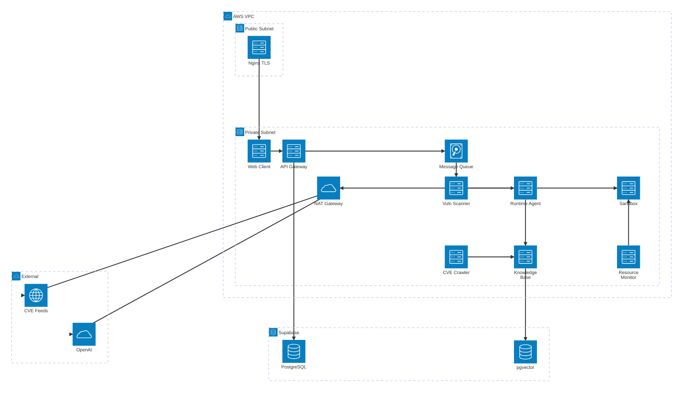
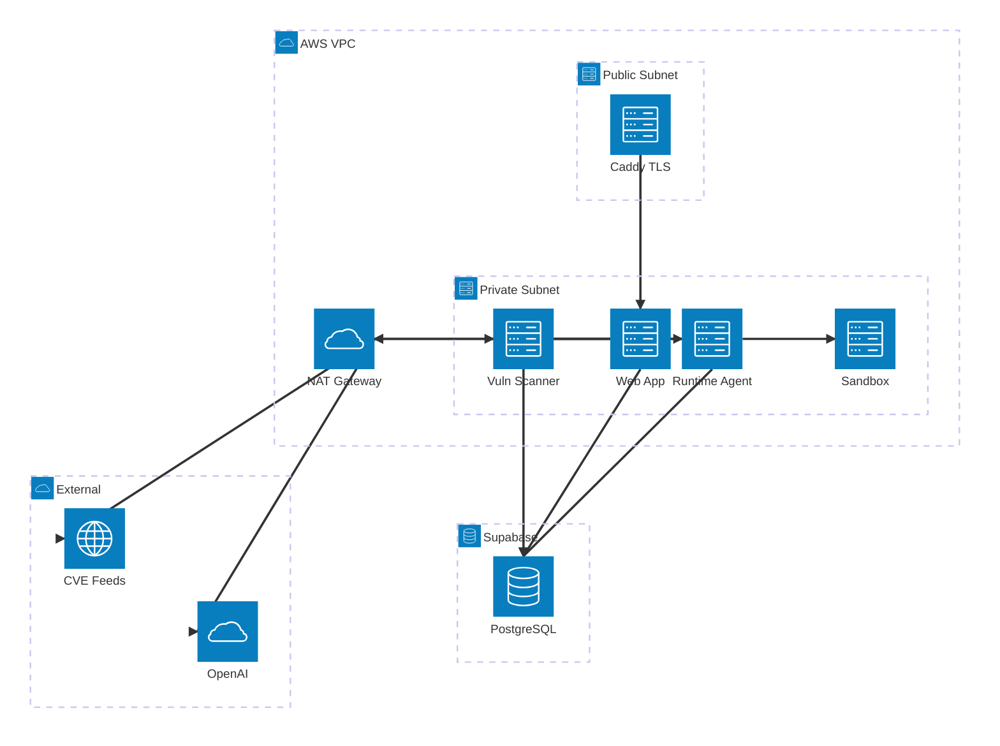

# 밋업

---

## 2026.02.09 요구사항 및 일정 회의


# TPO

---

- Time : 2026.02.09 19:15 ~ 22:45
- Place : Google Meet
- Occasion : 해커톤 모듈


# Done

---

> 💡 요구사항

10일 킥오프 - 17일 완성

- 2/2 → 구현
- 2 → 테스트


> 돌아가는 걸 만들면 다음 스텝으로 넘어간다

취약점 판단 → API 키를 발급 : 제가 발급
방향성

- AI 가 코드 분석 및 프로덕트 분석


구현

- 기술 스택을 분석해서 해당 스택에 취약점 파악 후 공격
- 서버에 고객의 앱 컨테이너를 배포하고 취약점 발견 프로세스를 사이드카처럼 적용해서 취약점 파악 후 공격


데모

- 실제 취약점이 있는 레포 → 컨테이너 → 거기서 모의공격에 따른 분석


모듈

- 고객 정보 모듈 → DB (stateful) :: next.js 로 딸각 / supabase 아니면 무료 saas
- (고객에 대응하는) 취약점 모듈 → ~~DB~~ (stateless) :: OpenAPI / python / AI Runtime(이걸 어떻게 할진 모르겠지만)
- CICD :: Github Actions
- Server :: AWS EC2 / Docker ( 개선은 나중에,,, )


브랜치 전략

1. git worktree 사용해서 에이전트마다 독립된 공간에서 기능 구현
2. feature/dev 브랜치에 pr
3. consensus 에 따라 merge


모듈
고객 정보 모듈 → 지훈 :: 10일 에이전트 딸각
취약점 모듈 → 오전임님 :: 10일 도전
11일 결과 공유하고 → 못 한 것들은 어떻게 할 것이며, 남은 기능이나 모듈은 어떻게 나눠가질 것이며, 타임테이블은 어떻게 수정되어야하는가를 결정


# TBD

---


# Next Schedule

---


## 2026.02.12 Client & SAST 모듈 결과 공유


# TPO

---

- Time : 2026.02.12 19:15 ~ 22:45
- Place : Google Meet
- Occasion : 해커톤 모듈 설계 및 결과물 공유


# Done

---

- 이름 : AutopsyAgent → Killhouse
- 모듈 설계
- **기술 스택 및 인프라 확정**
- CI/CD
- **R&R 배분**
- 샌드박스 컴퓨팅 리소스 제한 & CVE 수집범위
- OpenAI API 호출 시점J


# ToDo

---

1. 제일 급한 게 DB 스키마 선언 → 지훈 & Claude :: 기존 web-client 레포를 분리하고 SQLLite Postsgre 로 스키마 이관 작업 :: 지훈
2. AWS 개설 및 IAM :: 오전임님
3. web-client 와 supabase 연동 :: 지훈
4. CICD 완성 :: 오전임님
5. AI Layer 설계조사 :: 지훈,오전임님


# TBD

---

- 모듈들에 대한 인프라 및 네트워크 규칙 선언은 어떻게 할까?
- 어떻게 샌드박스 인프라 구축 ?
- 어떻게 인프라 스택을 탐지하고 모듈들을 한 번에 실행시키지 ?
- CVE 크롤러는 어떤 스택을 써서 어떻게 구현할지
- runtime-agent 어떤 스택을 써서 어떻게 구현할지
- 테스트 및 모니터링
- 다크모드 추가
- 깃허브 플젝 추가 에러 수정


# Next Schedule

---

금요일 21시

## 2026.02.13 에이전트 모듈 방향 및 타임테이블 점검


# TPO

---

- Time : 2026.02.12 19:15 ~ 22:45
- Place : Google Meet
- Occasion : 에이전트 모듈 방향 및 타임테이블 점검


# Done

---

전체 모듈 구조

| 정규 명칭 | 설명 |
| --- | --- |
| **web-client** | Next.js 프론트 |
| **api-gateway** | 메인 백엔드 |
| **message-queue** | 비동기 작업 큐 |
| **vuln-scanner** | SAST, SCA, IaC 워커 |
| **runtime-agent** | LLM AI 에이전트 |
| **sandbox** | Docker in Docker |
| **knowledge-base** | RAG 파이프라인 |
| **cve-crawler** | CVE 크롤러 |
| **resource-monitor** | 메트릭 수집 |





데모 시연을 위해 덜어낸 모듈 구조

| 정규 명칭 | 설명 |
| --- | --- |
| web-app | Next.js 프론트 + API Routes 백엔드 (web-client · api-gateway 통합) |
| vuln-scanner | SAST, SCA, Container 스캐너 (API 직접 호출, 큐 없음) |
| runtime-agent | LLM AI 에이전트 |
| sandbox | Docker in Docker (격리 실행 환경) |




- 남은 모듈 정리 → 기능 각자 가져가고 → ISSUE 할당 → 고거대로 구현해서 14일,15일 중간점검


```bash
1. User Browser
   HTTPS 443 (TLS 1.3) → DDNS → Elastic IP

2. Nginx (Public Subnet)
   TLS 종단 → HTTP 3000 → Web Client

3. Web Client
   HTTP 8000 → API Gateway (POST /scans, JWT)

4. API Gateway
   ├ TCP 5432 TLS → Supabase PG (INSERT)
   └ AMQP 5672 → Message Queue (enqueue)

5. Message Queue
   AMQP 5672 → Vuln Scanner (dequeue)

6. Vuln Scanner
   ├ HTTP 8080 → Knowledge Base (CVE 검색)
   └ gRPC 50051 → Runtime Agent

7. Runtime Agent
   ├ HTTP 8080 → Knowledge Base (RAG)
   ├ HTTPS 443 → NAT GW → OpenAI
   ├ Docker 2376 → Sandbox
   ├ TCP 5432 TLS → Supabase PG (리포트)
   └ HTTP 8000 → API Gateway (콜백)

8. API Gateway
   WebSocket → Web Client → User
```


- 테스트 및 모니터링


# ToDo

---

- [ ] 개선된 모듈 구조도에 대한 mermaid 재작성 & RFC 업데이트
- [ ] 


# TBD

---

- 각자 할 일에 대해서 얼마나 끝냈는지 ?

- [x] 18일까지의 타임테이블 ???

- 모듈들에 대한 인프라 및 네트워크 규칙
- 테스트 및 모니터링
- web-client 개선 및 보완


# Next Schedule

---

15일에 빌드까지 확인되면 16일에 에이전트에 대해서 바로 바이브코딩
15일에 빌드까지 확인 안 되면 에이전트 개발 중지하고 샌드박스를 고친다
19일 datadog premium 영상 찍기 - 


## 2026.02.19 최종 테스트


# TPO

---

- Time : 2026.02.19 22:00 ~ 23:00 (KST)
- Place : Google Meet
- Occasion : 데모점검 및 데모


# Done

---


# ToDo

---


# TBD

---

- [ ] 안 되는 것 체크 🔴
- [ ] 개선사항 체크 ✅
- [x] 데모 시연
- [x] 팀에 영상 업로드
- [x] 남은 작업 및 수정피드백


# Next Schedule

---


## 2026.02.20 데모 영상 생성 회고


# 과정

1. 데모 시나리오 작성
2. 데모 시나리오에 따라 스크린 레코드
3. Zoom In - 강조하고 싶은 기능 - Zoom Out 순서로 편집
4. 컷과 배속을 통해 실제 느린 기능을 빠르게 보여주도록 함
5. 음악을 최대한 빠르고 경쾌하게 — 금번엔 fast bebop jazz with drums 사용


# 모티브

[https://www.youtube.com/watch?v=iSn77jvjojA](https://www.youtube.com/watch?v=iSn77jvjojA)
[https://www.youtube.com/watch?v=SDqyB-yWaAE&t=101s](https://www.youtube.com/watch?v=SDqyB-yWaAE&t=101s)
[https://www.youtube.com/watch?v=Ej6hnsQgV_c](https://www.youtube.com/watch?v=Ej6hnsQgV_c)
[https://www.youtube.com/watch?v=YeldJ4UezDQ](https://www.youtube.com/watch?v=YeldJ4UezDQ)

# 툴

### 스크린 레코더 / 편집

[레딧](https://www.reddit.com/r/SaaS/comments/1no8ad9/what_tools_do_you_recommend_for_making_saas_demo/) 참고하여 [cap.so](http://cap.so/) 사용 - brew 를 통해 mac 에서 무료설치 이후 텍스트 입력부터
자막은 직접 [cap.so](http://cap.so/) 에서 입력, 다만 .sot 파일을 통해 자동화하는 게 더 깔끔해보임
유튜브 편집기를 사용해 백그라운드 음악 추가

### 썸네일

[wayin.ai](https://wayin.ai/) - 유튜브 영상 입력하여 썸네일 이미지 생성
Canva - 생성된 썸네일 수정

### 음악

[pixabay](https://pixabay.com/music/) 에서 무료음악 다운로드 가능

## 2026.02.23 수정 작업 목록


# TPO

---

- Time : 2026.02.23 ????
- Place : Google Meet
- Occasion : 수정 작업 목록 및 작업 방식


# Done

---


# ToDop

---

> 💡 금주 28일에 CKA 시험

## 🔴 P0: 즉시 수정 (서비스 기본 동작 불가)

- [x] **수동 업로드 안 됨** — 핵심 기능 자체가 작동 불가
- [x] **직접 호스팅한 GitLab 추가 X / 데모 계정 GitHub·GitLab 연동 X** — 데모 시연 불가능
- [x] **로그인 시 너무 느림** — 첫인상이 곧 이탈률, UX 치명적
- [x] **분석 끝나고 결과에 마크다운 적용 X** — 결과물 가독성 제로
- [x] **심각도 우선순위 정렬 안 됨** — 보안 툴의 핵심 가치 훼손

## 🟠 P1: 빠르게 수정 (UX/신뢰도 직결)

- [ ] **분석 끝나고 "스캔이 시작되지 않았습니다" 잠깐 뜸** — 사용자 혼란 유발
- [x] **분석시작 → 분석 상세 페이지로 이동하지 않음** — 현재 흐름 끊김
- [ ] **AI 대화 시 자동 스크롤** — 대화형 기능 사용성 기본
- [x] **취약점 상세 vs AI 수정 언어 불일치 (i18n)** — 글로벌 대응 기본기
- [x] **분석 시 상태 변경 로그만 → 상세 로그(TTY/PTY) 표시** — 투명성 확보
- [x] **구독 우회 방지 (IP 추적 + 추가 방안)** — 수익 모델 보호

## 🟡 P2: 중기 개선 (제품 완성도)

- [ ] **분석 결과 팝업 → 사이드바 전환 검토** — UX 개선
- [ ] **프로젝트 생성 시 Dockerfile/Helm/k8s manifest 직접 입력 + crash 탐지** — 기능 확장
- [x] **프로젝트 검색 regex 지원** — 사용성 편의
- [x] **모든 결과 i18n 적용** — 글로벌화 기반
- [x] **활성 스캔/샌드박스 최대 2개 제한 근거 정리 & 활성 세션 존재 이유 정리** — 내부 설계 명확화
- [ ] **분석 속도 개선** — 체감 성능 (아키텍처 레벨이라 시간 필요)

## 🔵 P3: 고도화 (중장기 로드맵)

- [ ] **보안툴 추가 (Trivy, Checkov, Gitleaks, ZAP)** — SARIF 통합 파이프라인 확장
- [ ] **코드베이스 모듈 분리 (백엔드/프론트/인프라 매니저)** — 유지보수성
- [ ] **성능 테스트 (샌드박스 수용량/컴퓨팅 한계)** — 스케일링 근거
- [ ] **제안된 개선코드 → 자동 PR 생성** — 킬러 기능
- [ ] **메뉴 숨기기/열기** — UI 부수적
- [ ] **k8s 도입 (k3s + gVisor)** — 본선 대비
- [ ] **모니터링 LGTM 스택 도입** — 운영 안정성
- [ ] **스텝 실패 시 원인 분석 로그 (Docker/커널)** — 디버깅 편의

# TBD

---


# Next Schedule

---


## 2026.xx.xx 회의록 템플릿


# TPO

---

- Time : 2026.xx.xx 19:15 ~ 22:45
- Place : Google Meet
- Occasion : 회의주제


# Done

---


# ToDo

---


# TBD

---


# Next Schedule

---


# 계정정보

---

- 프로덕션
- 데모 계정
- 모니터링 서버


# ETC ??

---
