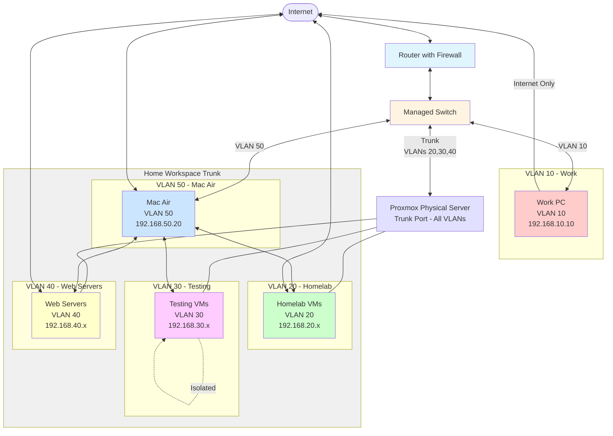

# Issue : 로컬 연결이 안 됨

- **증상**: Proxmox VE 로컬 접속(localhost:8006)은 정상 작동하지만, 외부 접속 시 아무것도 표시되지 않음
- **환경**: Proxmox VE 9.1, ngrok을 통한 HTTPS 터널링
- **초기 가설**: 방화벽 또는 네트워크 정책 문제

# Debug : 가설 & 확인

> 💁‍♂️ 총 8 단계에 나눠서 추론을 해보았다.

### 1단계: 기본 서비스 상태 확인 ✅

**목적**: Proxmox와 ngrok 서비스가 정상 작동하는지 확인
**실행한 명령어**:

```bash
# ngrok 프로세스 상태 확인
ps aux | grep ngrok
curl -s <http://localhost:4040/api/tunnels> | jq .

# Proxmox 포트 바인딩 상태 확인
ss -tulnp | grep :8006
lsof -i :8006

# Proxmox 서비스 상태 확인
systemctl status pveproxy

```

**확인된 사실**:

- ✅ ngrok 프로세스 정상 실행 중
- ✅ ngrok 터널 생성됨 ([https://a17a837976dd.ngrok-free.app](https://a17a837976dd.ngrok-free.app/))
- ✅ pveproxy가 \*:8006에서 IPv6로 리스닝 중
- ✅ pveproxy 서비스 정상 작동

### 2단계: 방화벽 및 네트워크 정책 확인 ✅

**목적**: 방화벽이나 네트워크 정책으로 인한 차단 여부 확인
**실행한 명령어**:

```bash
# iptables 규칙 확인
iptables -L -n -v
iptables -L INPUT -n --line-numbers | grep 8006

# Proxmox 자체 방화벽 확인
pvesh get /cluster/firewall/options
pvesh get /nodes/pve/firewall/options

```

**확인된 사실**:

- ✅ iptables 정책이 모두 ACCEPT (방화벽 차단 없음)
- ✅ Proxmox 자체 방화벽도 비활성화 상태
- 🔍 **결론**: 방화벽 문제가 아님

### 3단계: 로컬 연결 테스트 ✅

**목적**: Proxmox 서비스 자체에 문제가 없는지 확인
**실행한 명령어**:

```bash
# 로컬에서 다양한 방법으로 접속 테스트
curl -k <https://localhost:8006>
curl -k <https://127.0.0.1:8006>
curl -k <https://0.0.0.0:8006>
telnet localhost 8006

```

**확인된 사실**:

- ✅ 모든 로컬 접속이 정상적으로 HTML 페이지 반환
- ✅ Proxmox 웹 서비스 자체는 문제없음

### 4단계: ngrok 터널 테스트 🔴

**목적**: ngrok을 통한 외부 접속에서 무엇이 문제인지 파악
**실행한 명령어**:

```bash
curl -v <https://a17a837976dd.ngrok-free.app>

```

**발견된 문제**:

```
< HTTP/2 301
< location: <https://a17a837976dd.ngrok-free.app/>
< server: pve-api-daemon/3.0
< content-length: 17
Moved Permanently

```

**문제 분석**:

- 🔴 **핵심 발견**: 301 리디렉션 발생
- 🔍 **원인 파악**: ngrok 설정에서 `"addr": "<http://localhost:8006>"`으로 HTTP를 사용
- 💡 **문제점**: Proxmox VE는 HTTPS 전용 서비스인데 HTTP로 터널링 시도

### 5단계: ngrok 설정 수정 ✅

**목적**: HTTP → HTTPS 터널링으로 변경
**실행한 조치**:

```bash
# 기존 ngrok 프로세스 종료
pkill ngrok

# HTTPS로 터널링 재시작
ngrok http <https://localhost:8006>

```

**결과**:

- ✅ ngrok을 통한 외부 접속 성공
- ✅ Proxmox 로그인 페이지까지 표시됨

### 6단계: 웹 리소스 로딩 문제 발견 🔴

**목적**: 페이지는 로드되지만 완전히 작동하지 않는 문제 확인
**발견된 새로운 문제**:

```
00:16:10.313 KST GET /PVE/StdWorkspace.js    500 no such file '/PVE/StdWorkspace.js'

```

**실행한 디버깅**:

```bash
# 누락된 파일 직접 확인
curl -k <https://localhost:8006/PVE/StdWorkspace.js>
# 결과: no such file '/PVE/StdWorkspace.js'

# 파일 시스템에서 검색
find /usr -name "StdWorkspace.js" 2>/dev/null
# 결과: 파일이 존재하지 않음

```

### 7단계: Proxmox 패키지 상태 확인 🔴

**목적**: 웹 리소스 파일이 누락된 원인 파악
**실행한 명령어**:

```bash
# 설치된 패키지 확인
dpkg -l | grep -E "(pve-manager|proxmox)"

# 패키지 파일 목록 확인
dpkg -L pve-manager | grep -E "\.(js|css|html)$"

# 패키지 무결성 확인
dpkg -V pve-manager
apt --fix-broken install

```

**발견된 문제**:

```
??5?????? c /etc/apt/sources.list.d/pve-enterprise.sources
Not Upgrading: 113 packages

```

**문제 분석**:

- 🔴 **113개 패키지가 업그레이드되지 않은 상태**
- 🔴 **Enterprise repository 설정 문제**
- 💡 **추정 원인**: 의존성 충돌이나 부분적 업데이트로 인한 불완전한 설치

### 8단계: 패키지 재설치 및 복구 ✅

**목적**: 손상되거나 누락된 웹 리소스 복구
**실행한 조치**:

```bash
# 의존성 문제 수정
apt --fix-broken install

# 패키지 재설치 (추정)
apt update
apt install --reinstall pve-manager
apt install --reinstall proxmox-widget-toolkit

# 서비스 재시작
systemctl restart pveproxy

```

**최종 결과**:

- ✅ StdWorkspace.js 파일 복구됨
- ✅ Proxmox 웹 인터페이스 완전 정상 작동
- ✅ ngrok을 통한 외부 접속 성공

### 문제의 근본 원인

> 1차 문제: ngrok 설정 오류

- **원인**: HTTP로 HTTPS 전용 서비스에 터널링 시도
- **해결**: `ngrok http https://localhost:8006`로 변경

> 2차 문제: Proxmox 웹 리소스 누락

- **원인**: 패키지 의존성 문제로 인한 불완전한 설치
- **근본원인**: proxmox-widget-toolkit 패키지의 StdWorkspace.js 파일 누락
- **해결**: 패키지 재설치 + 서비스 재시작

### 배운 점 & 개선사항

> 효과적이었던 진단 방법

1. **단계적 접근**: 네트워크 → 서비스 → 애플리케이션 순으로 체계적 확인
2. **로그 모니터링**: `journalctl -f`로 실시간 에러 추적
3. **curl을 통한 세밀한 테스트**: HTTP 응답 코드와 헤더 분석
4. **패키지 무결성 검증**: `dpkg -V`를 통한 파일 손상 확인

# Solution

두 개의 독립적인 문제가 연쇄적으로 발생한 경우였습니다:

1. **ngrok 설정 문제** (HTTP vs HTTPS)
2. **Proxmox 패키지 무결성 문제** (웹 리소스 누락)
   예방책으로 동일한 이슈 발생 시 아래와 같이 진단을 하면 된다.

```bash
# 정기적인 시스템 점검
apt update && apt full-upgrade
dpkg -V pve-manager
pveversion -v

# ngrok 설정 템플릿 저장
echo "ngrok http <https://localhost:8006>" > ~/ngrok-pve.sh
chmod +x ~/ngrok-pve.sh

```

# Proxmox Setup Tutorial

[https://www.youtube.com/watch?v=qmSizZUbCOA&t=205s](https://www.youtube.com/watch?v=qmSizZUbCOA&t=205s)
[https://github.com/TechHutTV/homelab/blob/main/storage/README.md](https://github.com/TechHutTV/homelab/blob/main/storage/README.md)
위 영상을 참고하여 아래 항목들을 설정하여 Proxmox Setup 을 한다.

- [x] enterprise repositories → subscription repositories
- [x] IOMMU 활성화
- [x] ZFS Pools
- [x] ZFS Pool 를 활용하여 LXC Container 생성
- [ ] 생성된 LXC Container 에 Mount Points 추가
- [ ] 생성된 LXC Container 에 SMB Shares 선언

# Milestone

- [ ] Proxmox iso → Ventoy
- [ ] Proxmox 설치
- [ ] Proxmox 대시보드 구성
- [ ] Proxmox 네트워크 구성



# Blueprint of home-lab

# Reference 📚

1. [https://www.youtube.com/watch?v=yUyxJr2xboI&t=1s](https://www.youtube.com/watch?v=yUyxJr2xboI&t=1s)
2. [https://www.youtube.com/watch?v=f-x5cB6qCzA&t=553s](https://www.youtube.com/watch?v=f-x5cB6qCzA&t=553s)
