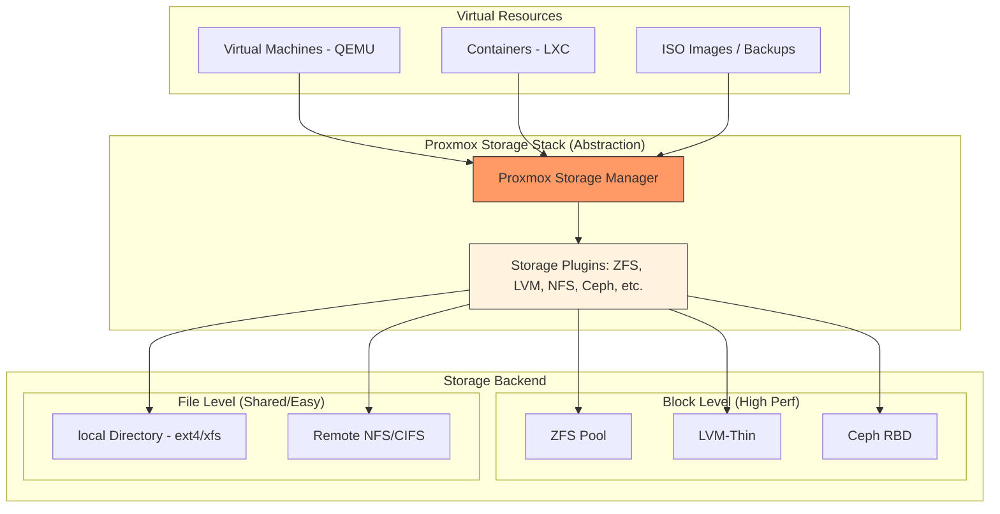
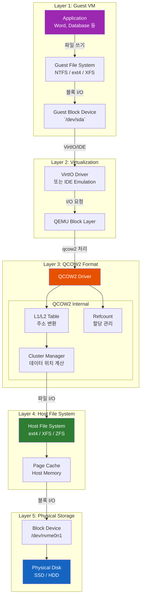
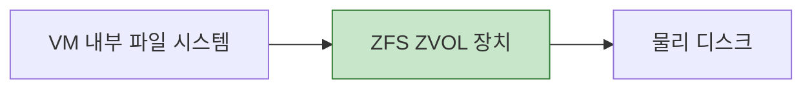
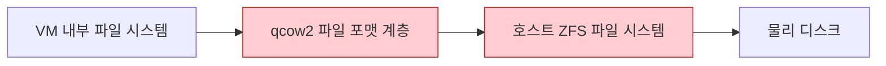
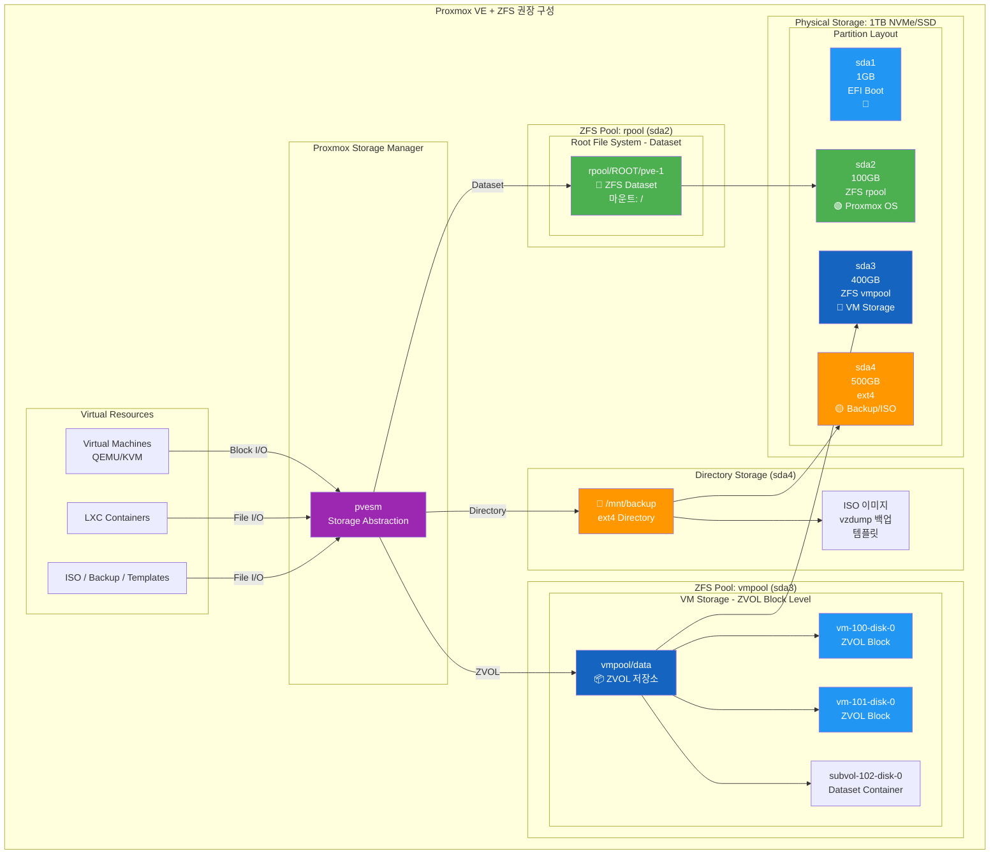

# Why? 왜 배움?

---

파일 시스템은 프로세스나 VM 이 실행되기 전에 가장 먼저 세팅해야하는 단계이다.
VM, ISO, 백업 모두 스토리지에 저장되기 때문에
데이터를 모두 구성하고 파일시스템을 구축하려면 전부 다 밀어야 하기 때문이다.
본 포스트에서는 SSD 스토리지, 백업 스토리지, 백업 자동화, Ceph 설정 등등을 위해서 
어떤 파일시스템이 있고, 어떤 것을 구축해야하고, 어떻게 구축할 수 있는지 를 알아보고자 한다.


# What? 뭘 배움?

---

> 📖 [About ZFS](https://www.notion.so/2d919c39029080068574cda623cb459a) 에서 아키텍쳐와 처리과정에 대해 깊이 서술하였으니

## Proxmox Filesystem 동작 원리

### **스토리지 유형 : File Level vs Block Level**

Proxmox가 데이터를 저장하는 방식은 크게 두 가지로 나뉜다.

1. **파일 수준 스토리지 (File-level)**
2. **블록 수준 스토리지 (Block-level)**




### qcow2 란 ?

가상 머신을 사용하기 위해서는 가상 머신의 파일시스템을 저장하는 저장공간이 필요하다.
리눅스에서는 이에 대한 별도의 파일 포맷을 제공하는데 이것이 바로 qcow2 이다.

- Qemu Conpy On Write 의 약자
- 내부에 스냅샷 정보, 압축 정보, 실제 데이터 블록의 위치 정보를 담는 **자체적인 매핑 테이블**을 가지고 있다


처리 순서는 다음과 같다.

1. VM 내부: 윈도우나 리눅스가 자기 디스크인 줄 알고 NTFS나 ext4로 데이터를 쓴다.
2. qcow2 파일: 이 쓰기 요청을 받아서 qcow2 내부의 어느 지점에 저장할지 계산한다. (파일 내부 관리)
3. ZFS 파일 시스템: qcow2라는 '파일'을 저장하고 있으므로, 파일의 변경된 부분을 디스크의 어느 블록에 적을지 또 계산한다. (OS 레벨 관리)
4. 물리 디스크: 최종적으로 기록된다.




### VM 사용 시 Block Level (ZVOL) 을 권장하는 이유

만약 파일시스템을 사용하여 VM 들을 관리하고자한다면 보통 Block Level (ZVOL) 을 권장된다.
[https://www.netapp.com/data-storage/what-is-block-storage/#:~:text=The%20best%20example%20of%20block,than%20file%2Dbased%20storage%20solutions](https://www.netapp.com/data-storage/what-is-block-storage/#:~:text=The%20best%20example%20of%20block,than%20file%2Dbased%20storage%20solutions)

이유는 Block Level (ZVOL)에서는 qcow2가 필요 없기 때문이다.
블록 레벨 방식인 ZVOL은 파일이 아니라 가상적인 하드디스크 장치(/dev/zvol/...) 그 자체를 만들어낸다.
ZVOL은 파일이 아니기 때문에 qcow2 같은 복잡한 파일 포맷이 필요 없다. 
데이터가 들어오면 ZFS가 즉시 자신의 블록에 기록한다.




반면 File Level 은 앞서 설명했다 싶이 VM 전용 파일 포맷인 qcow2 가 중간레이어에서 처리되어야 한다.
여기서 qcow2 와 ZFS 각각에서 CoW 가 발생하여 이중 CoW 되고, 이에 따라 성능 저하가 발생한다.
따라서 VM 을 저장할 스토리지를 구성할 계획이라면 File Level 보다 Block Level 로 처리되는 것이 좋다.




# How? 어떻게 씀?

---

> ☝ TL;DR;


## Proxmox ZFS 아키텍쳐  

[VM 사용 시 Block Level (ZVOL) 을 권장하는 이유](https://www.notion.so/2d819c39029080429391e0ec3fbc1bd6#2da19c39029080cf86faf50cf01058f7) 에서 살펴보았듯이 VM 저장공간 구축 시에는 블록 레벨로 구성하는 것이 좋다
다행히도 ZFS 는 블록 레벨의 ZVOL 을 제공하고 있다. 이에 따라 아래와 같이 구성하기로 하였다.

- ROOT OS (Proxmox)
- VM  (Other linux distro)




> ☝ 둘 다 ZFS 로 구성하지 않은 이유는 아래와 같은 단점이 발생하기 때문이다.


그렇다면 Proxmox 에서 ZFS 구성은 어떻게 할까? 또 VM 들에 대한 ZVOL 구성은 어떻게 할까?


## Promox 에 ZFS 설치

### Proxmox 재설치

1. 단일 디스크이므로 RAID0 선택
2. disk setup
3. advanced options
4. zfs 설치 여부 확인


### 디스크 파티셔닝

앞서 [Proxmox ZFS 아키텍쳐  ](https://www.notion.so/2d819c39029080429391e0ec3fbc1bd6#2d919c39029080cbae06f8ff232925ce) 에서 우리는 아래와 같이 설정하고자 한다고 기술하였다.


따라서 다음과 같이 파티셔닝을 생성하도록 하자.

1. vmpool용 파티션 생성 (400GB)
2. backup용 파티션 생성 (나머지)
3. 결과 확인 및 저장

```bash
root@pve:~# fdisk /dev/nvme0n1

Welcome to fdisk (util-linux 2.41).
Changes will remain in memory only, until you decide to write them.
Be careful before using the write command.

This disk is currently in use - repartitioning is probably a bad idea.
It's recommended to umount all file systems, and swapoff all swap
partitions on this disk.


Command (m for help): n
Partition number (4-128, default 4): 4
First sector (209715201-1953525134, default 209717248):
Last sector, +/-sectors or +/-size{K,M,G,T,P} (209717248-1953525134, default 1953523711): +400G

Created a new partition 4 of type 'Linux filesystem' and of size 400 GiB.

Command (m for help): n
Partition number (5-128, default 5): 5
First sector (209715201-1953525134, default 1048578048):
Last sector, +/-sectors or +/-size{K,M,G,T,P} (1048578048-1953525134, default 1953523711):

Created a new partition 5 of type 'Linux filesystem' and of size 431.5 GiB.

Command (m for help): p
Disk /dev/nvme0n1: 931.51 GiB, 1000204886016 bytes, 1953525168 sectors
Disk model: CT1000T500SSD8
Units: sectors of 1 * 512 = 512 bytes
Sector size (logical/physical): 512 bytes / 512 bytes
I/O size (minimum/optimal): 512 bytes / 512 bytes
Disklabel type: gpt
Disk identifier: 4DD0FB25-A743-4B48-A735-0DBAD71BD92D

Device              Start        End   Sectors   Size Type
/dev/nvme0n1p1         34       2047      2014  1007K BIOS boot
/dev/nvme0n1p2       2048    2099199   2097152     1G EFI System
/dev/nvme0n1p3    2099200  209715200 207616001    99G Solaris /usr & Apple ZFS
/dev/nvme0n1p4  209717248 1048578047 838860800   400G Linux filesystem
/dev/nvme0n1p5 1048578048 1953523711 904945664 431.5G Linux filesystem

Command (m for help): w
The partition table has been altered.
Syncing disks.
```
```bash
# 이제 확인해보면 잘 파티셔닝 된 것을 볼 수 있다.
root@pve:~# lsblk
NAME        MAJ:MIN RM   SIZE RO TYPE MOUNTPOINTS
nvme0n1     259:0    0 931.5G  0 disk
├─nvme0n1p1 259:1    0  1007K  0 part
├─nvme0n1p2 259:2    0     1G  0 part
├─nvme0n1p3 259:3    0    99G  0 part
├─nvme0n1p4 259:4    0   400G  0 part
└─nvme0n1p5 259:5    0 431.5G  0 part
```


### ZFS 풀 생성 및 등록

1. local-zfs 해제 및 제거
2. vmpool 용 파티션에 대해 ZFS 풀 생성
3. 백업용 파티션에 대해 ext4 포맷 및 마운트
4. Proxmox 에 storage 등록
5. 최종 상태 확인


## 스냅샷 확인

1. 실행
2. 확인
3. 롤백/삭제


## 압축 확인

1. 세팅 & 실행
2. 확인
3. 디스크 교체 (장애 시)


# Reference

---

> EXT4

[https://www.reddit.com/r/linux4noobs/comments/158m5b/what_is_ext4_a_simple_descriptionexplanation/](https://www.reddit.com/r/linux4noobs/comments/158m5b/what_is_ext4_a_simple_descriptionexplanation/)
[https://phoenixnap.com/glossary/ext4](https://phoenixnap.com/glossary/ext4)

> XFA

[https://wiki.archlinux.org/title/XFS](https://wiki.archlinux.org/title/XFS)
[https://blog.purestorage.com/purely-educational/xfs-vs-ext4-which-linux-file-system-is-better/](https://blog.purestorage.com/purely-educational/xfs-vs-ext4-which-linux-file-system-is-better/)
[https://www.oracle.com/linux/technologies/xfs-overview.html](https://www.oracle.com/linux/technologies/xfs-overview.html)

> ZFS

[https://docs.oracle.com/cd/E19253-01/819-5461/zfsover-2/](https://docs.oracle.com/cd/E19253-01/819-5461/zfsover-2/)
[https://www.reddit.com/r/linuxquestions/comments/3usjz8/what_is_zfs_and_why_should_i_want_to_use_it/](https://www.reddit.com/r/linuxquestions/comments/3usjz8/what_is_zfs_and_why_should_i_want_to_use_it/)
[https://www.youtube.com/watch?v=fPqJEvgEDz0](https://www.youtube.com/watch?v=fPqJEvgEDz0) 참고
[https://pve.proxmox.com/wiki/ZFS_on_Linux](https://pve.proxmox.com/wiki/ZFS_on_Linux)
[https://pve.proxmox.com/wiki/Storage:_ZFS](https://pve.proxmox.com/wiki/Storage:_ZFS)
[https://pve.proxmox.com/wiki/ZFS_on_Linux](https://pve.proxmox.com/wiki/ZFS_on_Linux)
