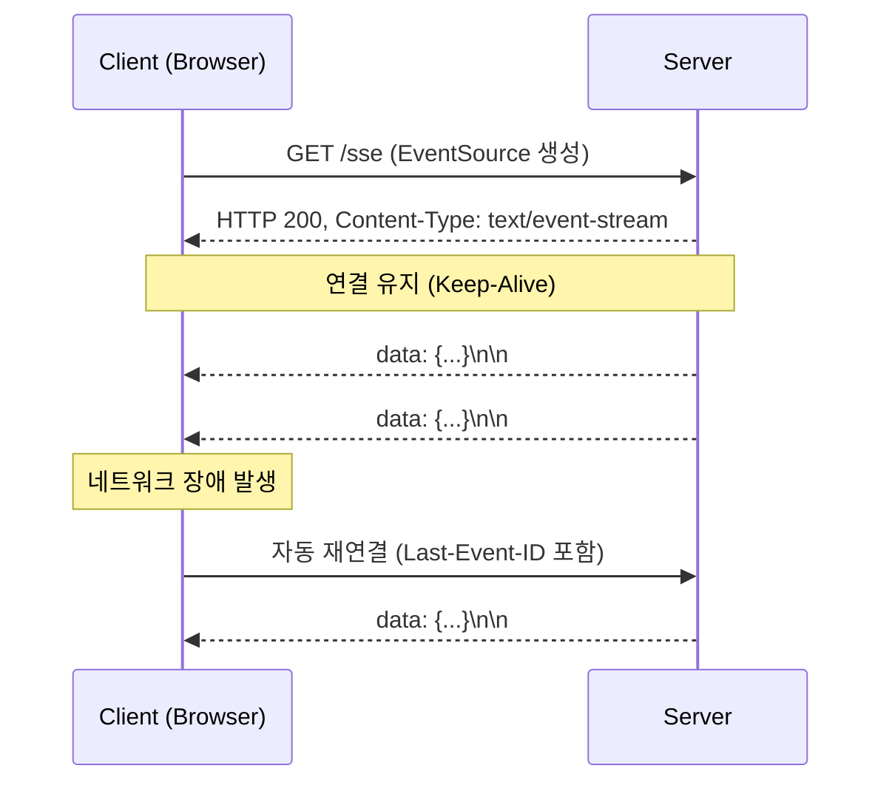
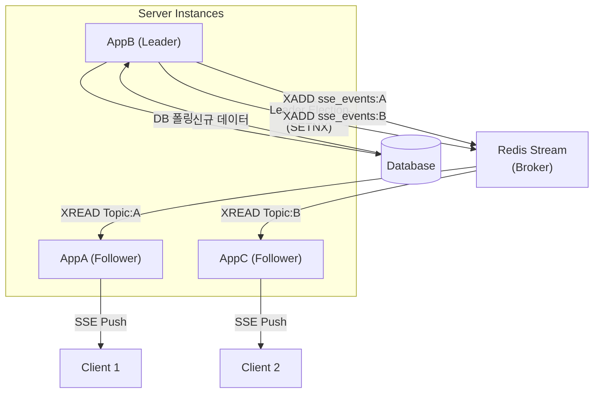
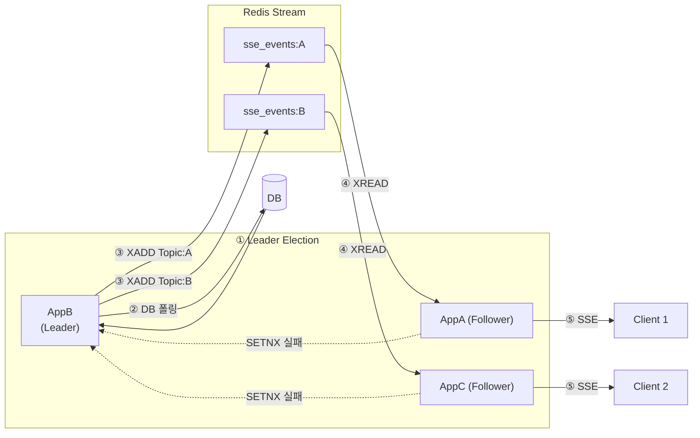
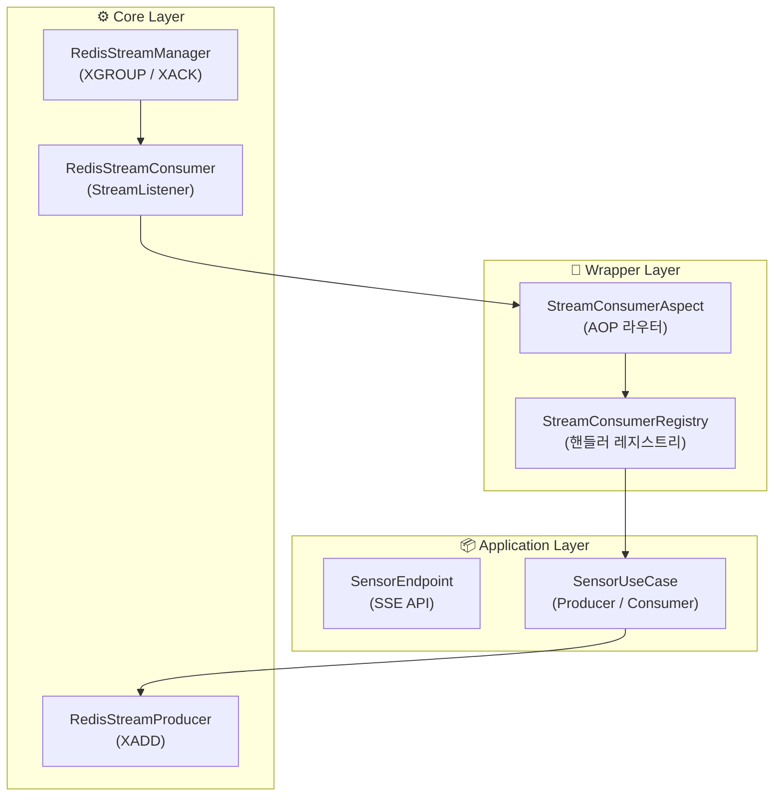
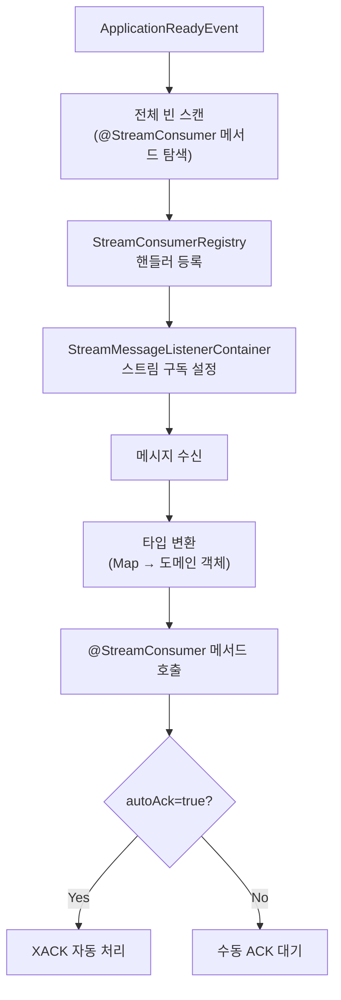

# 개요 💭

신규 프로젝트(아쿠아누리)에서 실시간 데이터 처리 기능이 추가되었다.

서버 간 확장성과 클라이언트 연결 최적화가 중요한 과제가 되었다.

본 포스트에서는 **SSE(Server-Sent Events)** 와 **Redis Stream**을 활용하여 확장 가능한 실시간 통신 서버를 설계한 과정을 기록한다.

# 요구사항 📃

### 기능 요구사항

- **N 시간 주기**로 생성되는 데이터를 **실시간 처리**해야 한다.
- 클라이언트는 **실시간으로 이벤트를 수신**해야 한다.

### 비기능 요구사항

- 서버 인스턴스가 **증설(Scale-out)** 되어도 안정적으로 동작해야 한다.
- **SSE 연결 수를 최소화**하여 불필요한 리소스 낭비를 방지해야 한다.

# 설계 🏗️

## 왜 SSE인가? 🤔

처음에는 WebSocket을 사용하면 실시간 통신 문제를 모두 해결할 수 있다고 가정하였다.

그러나 이 시스템에서 데이터 흐름은 **서버 → 클라이언트** 방향으로만 발생한다는 사실을 설계 단계에서 파악하였다.

양방향 프로토콜인 WebSocket을 단방향 용도로 사용하는 것은 불필요한 복잡도를 높인다는 문제를 발견하였다.[^1]

이 문제를 **"단방향 스트리밍에 대한 과설계"** 라고 정의하였다.[^2]

본 포스트에서는 이 문제를 SSE와 Redis Stream 조합으로 어떻게 해결했는지 설명한다.

단방향 스트리밍에 최적화된 SSE를 선택한 구체적인 근거는 다음과 같다.

- **단방향 스트리밍에 최적화**: 서버에서 클라이언트로만 데이터가 전달되므로 구현이 단순하다.
- **브라우저 기본 지원**: EventSource API로 별도 라이브러리 없이 사용 가능하다.[^3]
- **HTTP 기반**: 방화벽·프록시 환경에서도 안정적으로 동작한다.
- **가벼운 연결 유지**: WebSocket보다 리소스 사용량이 적다.

SSE는 연결을 한 번 맺고 나면, 연결한 대상에게 데이터를 푸시한다.

처리 단계는 아래와 같다.



1. **클라이언트가 연결 요청**: 브라우저에서 `new EventSource("/sse")`로 서버에 GET 요청을 보낸다.
2. **서버는 이벤트 스트림 형식으로 응답**: HTTP 헤더에 `Content-Type: text/event-stream`을 포함하여 연결을 유지한다.
3. **연결은 끊기지 않고 유지(Keep-Alive)**: 서버는 필요할 때마다 데이터를 전송할 수 있으며, 클라이언트는 실시간으로 이를 수신한다.
4. **서버에서 이벤트 발생 시 데이터 전송**: `data:`로 시작하는 텍스트를 전송하며, 이벤트 간 구분을 위해 빈 줄(`\n\n`)을 보낸다.
5. **네트워크 장애 시 자동 재연결**: 브라우저의 EventSource는 기본적으로 재연결 로직을 지원한다.

SSE의 동작 방식을 이해했으니, 다음은 Spring에서 이를 어떻게 구현하는지 살펴본다.

## SSE 처리 방법 📡

### 서버 측 처리

Spring에서는 두 가지 방법으로 SSE를 처리할 수 있다.

Spring WebFlux와 Spring MVC 각각의 구현 방식은 다음과 같다.

**Spring WebFlux — `ServerSentEvent` 클래스 사용:**

`Flux`를 사용해 비동기적으로 이벤트를 스트리밍한다.[^4]

```java
@GetMapping("/stream-sse")
public Flux<ServerSentEvent<String>> streamEvents() {
    return Flux.interval(Duration.ofSeconds(1))
        .map(sequence -> ServerSentEvent.<String>builder()
            .id(String.valueOf(sequence))
            .event("periodic-event")
            .data("SSE - " + LocalTime.now().toString())
            .build());
}
```

`TEXT_EVENT_STREAM` 타입으로 응답하며 `Flux`를 통해 비동기 스트리밍을 수행한다.

**Spring MVC — `SseEmitter` 클래스 사용:**

`SseEmitter`를 반환하고 별도 스레드에서 데이터를 푸시한다.

```java
@GetMapping("/stream-sse-mvc")
public SseEmitter streamSseMvc() {
    SseEmitter emitter = new SseEmitter();
    ExecutorService sseMvcExecutor = Executors.newSingleThreadExecutor();
    sseMvcExecutor.execute(() -> {
        try {
            for (int i = 0; true; i++) {
                SseEventBuilder event = SseEmitter.event()
                    .data("SSE MVC - " + LocalTime.now().toString())
                    .id(String.valueOf(i))
                    .name("sse event - mvc");
                emitter.send(event);
                Thread.sleep(1000);
            }
        } catch (Exception ex) {
            emitter.completeWithError(ex);
        }
    });
    return emitter;
}
```

이 프로젝트에서는 비동기 논블로킹 처리에 유리한 WebFlux 방식을 채택하였다.

### 클라이언트 측 처리 (브라우저)

브라우저에서는 `EventSource` 객체를 생성하여 SSE 스트림을 구독한다.

`onmessage`를 통해 서버가 보낸 데이터를 수신하며, 네트워크 오류 시 자동 재연결을 지원한다.

```javascript
const eventSource = new EventSource("/sse");

eventSource.onmessage = (event) => {
    console.log("Received:", event.data);
};

eventSource.onerror = (error) => {
    console.error("SSE Error:", error);
};
```

SSE 처리 방식을 확인했으니, 단일 서버에서는 잘 동작하는 이 구조가 서버를 증설할 때 어떤 문제를 일으키는지 살펴본다.

## 서버 증설 시 SSE 처리의 문제점 🔥

SSE는 서버 증설(Scale-out) 시 다음과 같은 문제가 발생한다.

**1. 클라이언트 연결 관리의 복잡성**

도메인별로 `/sse/order`, `/sse/chat`, `/sse/alert` 같은 여러 SSE 엔드포인트를 생성하면, 클라이언트는 각 엔드포인트마다 별도로 연결을 유지해야 한다.

서버는 엔드포인트 수 × 클라이언트 수만큼 커넥션을 유지해야 하므로 **리소스 사용량이 급증**한다.

**2. 중복된 DB 폴링으로 인한 부하 증가**

이벤트 발생 주체가 서버가 아니고 DB를 폴링하는 방식이면, **DB 부하 문제가 발생**한다.

여러 서버가 동일한 DB를 개별적으로 폴링하면 **DB 쿼리가 중복 실행**되어 부하가 커진다.

**3. 데이터 순서 미보장**

서버 인스턴스가 여러 대일 때, 전달되는 데이터의 순서를 멱등하게 보장하기 어렵다.

데이터 순서를 보장하려면 **데이터 처리를 중앙화하고, 이벤트 라우팅을 처리할 수 있는 별도의 브로커가 필요**하다.

이 세 가지 문제를 동시에 해결하기 위한 대안 구조를 다음 섹션에서 제시한다.

## 대안 방법 ✅

리더 선출 방식과 브로커를 도입하여 위 문제들을 해소한다.

**1. SSE 연결 단일화**

하나의 SSE 통신으로 여러 도메인 데이터를 처리한다.

엔드포인트 연결 수를 최소화한다.

**2. Leader Election 기반의 폴링 역할 단일화**

여러 서버 중 하나만 Leader로 선출하여 **DB 폴링을 단일 서버에서 수행**한다.

Leader 장애 시 다른 서버가 Leader로 승격될 수 있도록 Leader Election 메커니즘을 사용한다.

**3. 브로커를 통한 이벤트 중앙화**

Leader가 가져온 데이터를 **브로커(중앙 이벤트 허브)에 기록**한다.

모든 서버 인스턴스는 브로커를 통해 이벤트를 구독하고, 자신과 연결된 클라이언트에게 SSE로 이벤트를 전달한다.

이에 따라 확장성 및 멱등한 데이터 순서를 보장할 수 있다.

**4. 토픽에 따른 이벤트 처리**

Leader는 도메인 단위의 데이터(토픽 기반 메시지)를 브로커에 기록한다.

도메인 단위의 데이터를 구독한 서버들만 이를 수신한다.

관심 데이터들만 실시간으로 전달할 수 있다.

이 대안 구조를 아키텍처 다이어그램으로 표현하면 다음과 같다.

## 아키텍처 🏗️

아래 다이어그램은 **Leader Election → Leader DB 폴링 → 브로커 토픽별 발행 → Follower 토픽 구독 → SSE 전송** 순서를 보여준다.

여기서 **토픽(Topic) = 도메인(Domain)** 으로 매핑되며, 각 서버는 자신이 담당하는 도메인에 해당하는 토픽만 구독하여 클라이언트에 이벤트를 전달한다.



처리 단계 요약은 다음과 같다.

1. **Leader Election**: 서버 중 하나가 Leader로 선출된다.
2. **Leader가 DB를 폴링**: DB에서 모든 도메인(예: 도메인 A, 도메인 B)의 최신 데이터를 읽어온다.
3. **Leader가 브로커에 토픽별 이벤트 발행**: 읽어온 데이터를 도메인별 토픽으로 브로커에 발행한다. (예: `A축구장 → Topic:A`, `B축구장 → Topic:B`)
4. **서버는 자신이 담당하는 토픽만 구독**: 각 서버는 필요한 토픽만 브로커에서 구독한다. (예: `ServerA → Topic:A`, `ServerB → Topic:B`)
5. **서버가 자신의 클라이언트에 SSE 전송**: 구독한 이벤트를 받아, 각 서버는 자신과 연결된 클라이언트에 SSE로 실시간 데이터를 전송한다.

이 방식으로 구현하면 다음 효과를 얻는다.

- **DB 폴링은 Leader 한 대만 수행 → 부하 최소화**
- **브로커를 통해 모든 서버가 동일한 이벤트를 공유 → 일관성 확보**
- **Leader 장애 시 자동 승계 가능 → 고가용성 보장**
- **서버 증설 시에도 추가 작업 없이 확장 가능**

아키텍처 설계가 완료되었으니, 이 구조를 구현할 기술 스택을 선택한다.

# 기술 선택 🛠️

Kafka, RabbitMQ와 같은 여러 옵션이 있었지만, 다음 이유로 Redis를 선택하였다.

- **운영 단순성**: 이미 Redis 인프라가 구성되어 있어 추가적인 브로커 설치·운영 비용이 들지 않는다.
- **충분한 성능**: 현재 서비스는 초당 수백~수천 건 수준의 이벤트 처리면 충분하며, Redis Streams와 Pub/Sub으로 커버 가능하다.
- **다기능 지원**: Leader Election(`SETNX`+TTL), 이벤트 저장 및 재처리(Streams), Consumer Group 기반 메시지 분배를 **하나의 Redis로 처리 가능**하다.[^5]
- **낮은 지연 시간**: In-memory 기반이므로 실시간 SSE 환경에서 Kafka보다 빠른 전송이 가능하다.
- **운영 부담 최소화**: Kafka는 Zookeeper/KRaft, RabbitMQ는 Exchange/Queue 설정이 필요하지만, Redis는 비교적 단순한 구성으로 바로 적용 가능하다.

Redis를 사용하면 각 구현 요소에 대해 다음과 같이 대응할 수 있다.

| 항목 | 처리 방법 및 이점 |
| --- | --- |
| **Leader Election** | `SETNX`와 TTL을 활용해 간단하게 Leader를 선출할 수 있으며, 장애 시 TTL 만료로 다른 서버가 자동 승계 가능하다. |
| **Broker(이벤트 허브)** | Redis Stream 또는 Redis Pub/Sub을 사용해 중앙에서 이벤트를 저장하고, 여러 서버가 도메인 이벤트를 구독한다. |
| **확장성** | 서버를 증설해도 Redis가 단일 이벤트 소스로 동작하므로 동기화 문제 없이 확장 가능하다. |
| **장애 복구** | Leader가 죽더라도 TTL 만료 후 다른 서버가 Leader가 되며, Redis Stream은 데이터 유실 없이 이벤트를 유지한다. |

> **Redis Stream vs Kafka**
>
> Kafka를 사용하면 아래에서 설명할 Redis Stream의 여러 한계를 해결할 수 있다.
> 그러나 인프라 구성이 되어 있지 않고, Redis 하나로 Leader Election과 Broker를 한 번에 처리할 수 있다는 이점을 우선시하였다.
>
> | 항목 | Redis Stream | Kafka |
> | --- | --- | --- |
> | **Partition** | 없음 (단일 Stream, 병렬 처리는 Consumer Group이 담당) | 있음 (Partition별로 병렬 처리 가능) |
> | **순서 보장** | 단일 Consumer에 대해서만 보장 | Partition 내에서만 보장 |
> | **저장소** | In-Memory 중심 (Persistence 가능) | Disk 기반 |
> | **메모리 관리** | Ack되지 않은 Pending 메시지 쌓일 수 있음 | Consumer Offset으로 안정적 관리 |

Redis를 선택하였으니, 브로커 역할을 담당할 Pub/Sub과 Stream 중 어느 것이 적합한지 검토한다.

## Redis Pub/Sub vs Redis Stream 🤔

Redis Pub/Sub은 단순하고 빠른 메시지 전달에는 적합하지만, 신뢰성 있고 확장성 있는 SSE 시스템을 구축할 때는 여러 한계가 있다.

| 항목 | Pub/Sub 단점 | Redis Stream 비교 |
| --- | --- | --- |
| **메시지 순서 보장** | 보장되지 않음 (동시 소비자에 따라 도착 순서 불일치) | 단일 Consumer 또는 Group 내 순서 보장 |
| **내결함성 (복구)** | 메시지를 수신하지 못하면 재전송 불가 (미수신 시 유실) | Ack 기반 재처리 가능 (Pending 메시지 관리) |
| **클라이언트 재접속 시 처리** | 과거 메시지 재구독 불가 (stateless 방식) | `XREAD` 또는 `XREADGROUP`으로 재전송 가능 |
| **로드 밸런싱** | 모든 구독자에게 동일 메시지 전송 (Broadcast) | Consumer Group으로 메시지를 분산 처리 |
| **백프레셔 제어** | 불가능 (빠른 발행에 따른 수신 실패 발생) | Stream ID 단위로 소비 속도 조절 가능 |
| **모니터링 및 추적** | 메시지 전송 후 상태 추적 어려움 | 메시지 ID, Ack 여부로 상태 추적 용이 |
| **메시지 저장** | 메시지 저장 기능 없음 (발행 후 사라짐) | 메시지를 보존하고 처리 기간 설정 가능 (`XTRIM`) |

특히 Redis Pub/Sub은 메시지 순서가 보장되지 않아 실시간 데이터 처리에 부적합하다는 점이 가장 큰 문제다.

실제 Redis Pub/Sub 사용 시 두 서버 인스턴스에서 수신되는 메시지 처리 순서가 서로 다름을 확인할 수 있다.

아래는 동일한 이벤트 배치를 두 서버에서 각각 수신한 결과다.

```bash
# localhost:8080 <SSE API>
id:0dde8561-18b8-4340-88e1-43a44756a45d
event:weather-event
data:{"id":"0dde8561-18b8-4340-88e1-43a44756a45d","timestamp":"2025-08-04T11:23:16.3592316","location":"SEOUL","status":"RAIN","temperature":"HOT"}

id:fc67d981-b3d8-4dd9-a3c5-9bd696272b49
event:weather-event
data:{"id":"fc67d981-b3d8-4dd9-a3c5-9bd696272b49","timestamp":"2025-08-04T11:23:16.3658231","location":"SEOUL","status":"SNOW","temperature":"COLD"}

id:b1e44407-1a26-499c-ad15-86077929fb3b
event:weather-event
data:{"id":"b1e44407-1a26-499c-ad15-86077929fb3b","timestamp":"2025-08-04T11:23:16.3648219","location":"SEOUL","status":"RAIN","temperature":"COLD"}

id:9aa43b02-7af4-4793-b6eb-23589cd93f61
event:weather-event
data:{"id":"9aa43b02-7af4-4793-b6eb-23589cd93f61","timestamp":"2025-08-04T11:23:16.367077","location":"SEOUL","status":"SNOW","temperature":"HOT"}

# ========================

# localhost:8081 <SSE API>
id:0dde8561-18b8-4340-88e1-43a44756a45d
event:weather-event
data:{"id":"0dde8561-18b8-4340-88e1-43a44756a45d","timestamp":"2025-08-04T11:23:16.3592316","location":"SEOUL","status":"SNOW","temperature":"HOT"}

id:3e2c9126-d202-443d-86b5-d8d0e8132b15
event:weather-event
data:{"id":"3e2c9126-d202-443d-86b5-d8d0e8132b15","timestamp":"2025-08-04T11:23:16.3592316","location":"SEOUL","status":"SUNNY","temperature":"HOT"}

id:e910541d-3d26-495b-b35f-3475dc9bdbe8
event:weather-event
data:{"id":"e910541d-3d26-495b-b35f-3475dc9bdbe8","timestamp":"2025-08-04T11:23:16.3598524","location":"SEOUL","status":"RAIN","temperature":"M"}

id:4542cfec-67ed-4717-a2a9-15e92c1627ff
event:weather-event
data:{"id":"4542cfec-67ed-4717-a2a9-15e92c1627ff","timestamp":"2025-08-04T11:23:16.3598524","location":"SEOUL","status":"RAIN","temperature":"COLD"}
```

두 서버가 수신한 메시지 순서와 내용이 서로 상이하다.

반면 Redis Stream을 사용하면 이러한 단점들을 해결할 수 있다.

- 클라이언트가 마지막 메시지 ID를 기억하여 재접속 시 **이전 메시지부터 복구 가능**하다.
- `XREAD`를 사용하여 **서버 인스턴스 간 멱등한 데이터 제공**이 가능하다.
- 메시지 순서가 보장되어 **일관된 SSE 스트림을 제공**한다.
- 메시지 저장 기반으로 **재처리 및 장애 분석이 용이**하다.

이 비교를 바탕으로 Redis Stream을 브로커로 채택하였다.

최종 구조는 다음 섹션에서 전체 다이어그램과 함께 설명한다.

## 최종 구조 다이어그램 📌

아키텍처와 기술 선택이 완료되었으니, 실제 구현 구조를 다이어그램으로 정리한다.



처리 순서 설명은 다음과 같다.

**① Leader Election (Redis SETNX + TTL)**

모든 서버는 `SET leader <server_id> NX PX <ttl>` 명령으로 Leader 선출을 시도한다.

성공한 서버(AppB)가 Leader가 되고, TTL 만료 전까지 `PEXPIRE` 방식으로 갱신(Heartbeat)한다.

TTL이 만료되면 다른 서버가 새로운 Leader가 될 수 있다(Failover 지원).

**② Leader → DB 폴링 → Redis Stream에 XADD**

Leader만 주기적으로 DB를 폴링하여 신규 데이터를 가져온다.

가져온 데이터는 토픽별로 분리해 `XADD sse_events:<topic>` 명령으로 Redis Stream에 기록한다.

각 토픽별로 Stream Key를 분리하여, 불필요한 데이터 전달을 방지한다.

**③ SSE 연결된 서버들만 XREAD 실행**

서버는 SSE 연결 요청이 들어오면, 해당 토픽에 대한 마지막으로 읽은 Stream ID(`lastId`)를 기록한다.

`XREAD BLOCK <ms> STREAMS sse_events:<topic> <lastId>` 명령으로 새로운 이벤트를 대기하며 읽는다.

이 방식은 Consumer Group 없이 모든 서버가 동일한 메시지를 읽을 때 적합하다.

**④ 각 서버 → 자신과 연결된 클라이언트에게 SSE 전송**

서버는 Redis Stream에서 읽은 데이터를 연결된 클라이언트에게 바로 SSE로 전달한다.

각 서버는 자신과 연결된 클라이언트 목록을 관리하고, 해당 토픽에 구독 중인 클라이언트에게만 푸시한다.

**⑤ 오류 및 재연결 처리**

클라이언트가 끊어졌다가 재연결할 경우, 서버는 `lastEventId`를 활용해 끊긴 시점 이후의 메시지를 다시 전달한다.

서버는 Stream Trim 정책(`XTRIM`)을 통해 오래된 데이터를 삭제하여 메모리를 관리한다.

Leader 장애 시, 다른 서버가 Leader Election에 참여해 DB Polling과 XADD를 이어서 수행한다.

처리 흐름이 정리되었으니, Leader Election과 Redis Stream 각각에 대해 추가로 고려해야 할 사항을 살펴본다.

## Redis SETNX 기반 Leader Election 추가 고려 사항 ⚠️

### 분산락 처리

**문제점**

여러 서버가 동시에 `SETNX` 명령을 실행할 경우, 잠깐의 타이밍 차이로 인해 동시에 Leader 역할을 수행하게 될 가능성이 있다.

Redis 자체는 단일 스레드 기반이므로 `SETNX` 연산 자체는 원자적이지만, TTL 갱신 처리와 결합된 상황에서는 만료 시점에 여러 서버가 동시에 Leader가 될 수 있는 경쟁 상태(race condition)가 발생할 수 있다.

이로 인해 동일한 이벤트가 중복 발행되거나, Leader가 여러 개 존재하여 시스템의 일관성이 깨질 위험이 있다.

**현재 대응 방안**

현재는 `SETNX`를 통한 단순 키 기반 Leader 선출, 재획득(re-acquire), 만료 시간 갱신 로직만 구현된 상태다.

`SETNX`로 Leader 선출 동시성을 보장할 수 있지만, 단순히 Redis에서 지원하는 동시성 보장 수준이다.

따라서 동시성 여부 테스트 작성 후 동시성 이슈가 발생하는 경우 분산락(lock)을 적용해야 한다.

아직은 테스트 작성 및 분산락 적용이 되지 않은 상태다.

향후에는 Redlock 알고리즘[^6]이나 갱신용 Lua 스크립트를 활용하여 TTL 갱신 및 재선출 과정에서의 경쟁 상태를 방지할 예정이다.

또한, Leader 선출 실패 시 대기 및 재시도를 수행하는 백오프(backoff) 전략을 추가하여, Leader 중복 선출 가능성을 최소화할 계획이다.

## Redis Stream 적용 시 추가 고려 사항 ⚠️

### 파티션(Partition) 부재

**문제점**

Redis Stream은 Kafka와 달리 파티션 개념이 없다.

Kafka에서의 토픽이 Redis Stream에서는 하나의 키다.

따라서 도메인이 증설될수록 `sse_events:<domain>` 형태의 Stream Key가 계속 증가한다.

Stream Key가 많아지면 Redis 메모리 사용량과 키 관리 복잡도도 증가한다.

하나의 Stream을 여러 Consumer가 병렬로 처리할 수는 있지만, Redis Cluster 환경에서 샤딩된 노드 간 균등 분산이 어렵다.

균등한 분산 처리를 위해서는 **N개의 Stream을 만들어 각 노드에 할당하는 추가 로직**이 필요하다.

**현재 대응 방안**

아직 샤드 과부하 정도의 트래픽 규모가 아니라고 판단해 추후 예정으로만 산정하였다.

추후 트래픽이 증가하면 [LINE Engineering에서 공유한 쿠폰 수집가 전략](https://techblog.lycorp.co.jp/ko/building-a-messaging-queuing-system-with-redis-streams)을 채택할 수 있다.[^7]

### 처리 완료 순서 보장 불가

**문제점**

여러 Consumer가 병렬로 이벤트를 처리할 경우, 수신 메시지의 순서는 보장되지만 **생산된 순서대로 메시지가 처리된다는 보장이 없다.**

순서가 중요한 데이터(예: 금융 거래, 상태 변화 이벤트)에는 별도 순서 보장 로직이 필요하다.

**현재 대응 방안**

이번 서비스는 SSE 서버를 통한 실시간 데이터 푸시가 목적이므로, 메시지의 처리 순서를 보장할 필요가 없다.

따라서 추가 로직은 구현하지 않았다.

### In-Memory 기반으로 인한 메모리 관리 필요

**문제점**

Redis는 메모리 기반 저장소이므로, **Ack되지 않은 메시지가 Pending 상태로 계속 쌓이면 메모리가 부족해질 수 있다.**

장기간 Ack되지 않은 메시지를 방치하면 **메모리 Full로 인한 장애**가 발생할 수 있다.

**현재 대응 방안**

추후 **주기적으로 Pending 메시지를 조회 및 재처리하는 로직**을 추가할 예정이다.

아래와 같이 1분마다 Pending 메시지를 점검하고 Ack하는 스케줄러를 도입할 계획이다.

`@Scheduled`로 60초마다 Pending 메시지를 조회한 뒤 처리 후 Ack한다.

```java
@Scheduled(fixedRate = 60000)
public void PendingMessagesSummaryScheduler() {
    PendingMessagesSummary pendingSummary = redisOperator.pendingSummary(streamKey, consumerGroupName);
    if (pendingSummary != null && pendingSummary.getTotalPendingMessages() > 0) {
        PendingMessages pendingMessages = redisOperator.pending(streamKey, consumerGroupName);
        pendingMessages.toList().forEach(pendingMessage -> {
            List<ObjectRecord<String, String>> messages =
                redisOperator.read(streamKey, consumerGroupName, consumerName, pendingMessage.getIdAsString());

            messages.forEach(recordMessage -> {
                // 메시지 처리 로직
            });

            redisTemplate.opsForStream().acknowledge(
                streamKey, consumerGroupName, pendingMessage.getIdAsString());
        });
    }
}
```

Pending 메시지가 0건인 경우 아무 작업도 수행하지 않으며, 처리 후 즉시 Ack하여 누적을 방지한다.

### 메시지 중복 처리 가능성

**문제점**

Redis Stream은 **Ack 이전에 Consumer가 죽으면 동일 메시지가 다른 Consumer에게 전달될 수 있다.**

이로 인해 **중복 처리가 발생할 수 있으며, Idempotent 설계가 필요**하다.

**현재 대응 방안**

위 문제는 그룹 단위 처리일 때의 이야기이고, **XREAD 시에는 문제가 없으므로 추가 로직은 구현하지 않았다.**

### TTL 및 Stream 트리밍 필요

**문제점**

Redis Stream은 기본적으로 메시지를 무제한으로 저장하므로, 장기간 사용 시 메모리가 고갈될 수 있다.

`MAXLEN` 옵션을 통해 **Stream 크기를 제한하거나 TTL을 설정하는 관리가 필요**하다.[^8]

**현재 대응 방안**

XADD 시 `MAXLEN`을 정하여 길이 제한 임계값을 넘어가면 자동 방출되도록 처리하였다.

고려 사항을 모두 살펴보았으니, 실제 구현 코드를 확인한다.

# 코드 구현 💻

윤곽을 잡았으니 이제부터 실제 코드를 통해 어떻게 구성하였는지 설명한다.

## Leader Election 🗳️

Leader Election은 다음 순서로 수행된다.

1. **리더 여부 확인 (`isLeader`)**: 현재 서버가 리더인지 Redis에서 확인한다.
2. **리더라면 TTL 연장 (`renewLeader`)**: 리더라면 Redis Key의 TTL을 갱신하여 리더 권한을 유지한다.
3. **리더가 아니라면 리더 획득 시도 (`tryAcquireLeader`)**: `SETNX` 방식(`setIfAbsent`)으로 리더 Key를 선점한다.
4. **리더 획득 성공 시 로그 출력 / 실패 시 다른 서버가 리더임을 기록**한다.

각 단계를 코드로 살펴본다.

**1. 리더 여부 검증**

Redis에서 `leaderKey`를 조회하여 현재 서버 ID와 비교한다.

```java
public boolean isLeader() {
    String serverId = streamRedisTemplate.opsForValue().get(leaderKey);
    return SERVER_ID.equals(serverId);
}
```

Key의 value가 현재 서버의 ID와 동일하면 리더, 아니면 팔로워다.

**2. 리더라면 TTL 연장**

현재 서버가 리더라면 Key의 TTL을 연장하여 Heartbeat 역할을 수행한다.

```java
private void renewLeader() {
    if (isLeader()) {
        Duration timeout = DurationStyle.detectAndParse(leaderHeartbeatPeriod);
        streamRedisTemplate.expire(leaderKey, timeout);
    }
}
```

TTL 연장을 통해 리더 권한을 유지한다.

**3. 리더가 아니라면 리더 획득 시도**

`setIfAbsent`는 Redis의 `SET NX` 동작과 동일하며, Key가 없으면 현재 서버 ID를 value로 설정하고 TTL을 부여한다.

```java
private boolean tryAcquireLeader() {
    Duration timeout = DurationStyle.detectAndParse(leaderAcquirePeriod);
    return Boolean.TRUE.equals(
        streamRedisTemplate.opsForValue().setIfAbsent(leaderKey, SERVER_ID, timeout)
    );
}
```

성공 시 현재 서버가 리더가 된다.

**4. 주기적인 Leader Election 실행**

일정 주기(`schedule-period`)마다 실행되며, 리더라면 TTL 갱신, 아니라면 `SETNX`로 리더 권한 획득을 시도한다.

```java
@Scheduled(fixedRateString = "#{T(org.springframework.boot.convert.DurationStyle).detectAndParse('${sse.leader.schedule-period}')}")
public void leaderTask() {
    if (isLeader()) {
        renewLeader();
        log.info("Leader 역할 수행 중...");
        return;
    }
    if (tryAcquireLeader()) {
        log.info("Leader 권한 획득 성공!");
        return;
    }
    log.debug("다른 서버가 Leader입니다.");
}
```

성공 시 "Leader 권한 획득 성공!" 로그를 출력하고, 실패 시 "다른 서버가 Leader입니다." 로그를 출력한다.

전체 클래스 코드는 다음과 같다.

`UUID.randomUUID()`로 서버 고유 ID를 생성하고, `@Value`로 설정값을 주입받는다.

```java
@Slf4j
@Component
@RequiredArgsConstructor
public class RedisLeaderElection {

    private final static String SERVER_ID = UUID.randomUUID().toString();

    @Qualifier("streamRedisTemplate")
    private final RedisTemplate<String, String> streamRedisTemplate;

    @Value("${sse.leader.key}")
    private String leaderKey;

    @Value("${sse.leader.acquire-period}")
    private String leaderAcquirePeriod;

    @Value("${sse.leader.heartbeat-period}")
    private String leaderHeartbeatPeriod;

    @Value("${sse.leader.schedule-period}")
    private String leaderSchedulePeriod;

    @Scheduled(fixedRateString = "#{T(org.springframework.boot.convert.DurationStyle).detectAndParse('${sse.leader.schedule-period}')}")
    public void leaderTask() {
        if (isLeader()) {
            renewLeader();
            log.info("Leader 역할 수행 중...");
            return;
        }
        if (tryAcquireLeader()) {
            log.info("Leader 권한 획득 성공!");
            return;
        }
        log.debug("다른 서버가 Leader입니다.");
    }

    private void renewLeader() {
        if (isLeader()) {
            Duration timeout = DurationStyle.detectAndParse(leaderHeartbeatPeriod);
            streamRedisTemplate.expire(leaderKey, timeout);
        }
    }

    private boolean tryAcquireLeader() {
        Duration timeout = DurationStyle.detectAndParse(leaderAcquirePeriod);
        return Boolean.TRUE.equals(streamRedisTemplate.opsForValue().setIfAbsent(leaderKey, SERVER_ID, timeout));
    }

    public boolean isLeader() {
        String serverId = streamRedisTemplate.opsForValue().get(leaderKey);
        return SERVER_ID.equals(serverId);
    }

}
```

리더인 경우에만 DB 폴링 업무를 수행해야 하므로, AOP와 어노테이션을 활용하여 리더 전용 태스크를 제어한다.

먼저 마커 어노테이션을 정의한다.

```java
@Target(ElementType.METHOD)
@Retention(RetentionPolicy.RUNTIME)
@Documented
public @interface SseLeaderTask {

}
```

이 어노테이션이 붙은 메서드는 리더인 경우에만 실행되고, 아니면 스킵된다.

```java
@Slf4j
@Aspect
@Component
@RequiredArgsConstructor
@Order(Ordered.HIGHEST_PRECEDENCE + 1) // 분산락 Aspect 다음에 실행
public class SseLeaderTaskAspect {

    private final RedisLeaderElection redisLeaderElection;

    /**
     * SSE 리더만 처리해야하는 메서드 수행 (e.g. DB 폴링)
     */
    @Around("@annotation(SseLeaderTask)")
    public Object lockAndProceed(ProceedingJoinPoint pjp) throws Throwable {
        boolean isLeader = redisLeaderElection.isLeader();

        if (isLeader) {
            log.debug("Executing leader task: {}", pjp.getSignature().getName());
            return pjp.proceed();
        } else {
            log.debug("Skipping leader task (not leader): {}", pjp.getSignature().getName());
            Class<?> returnType = ((org.aspectj.lang.reflect.MethodSignature) pjp.getSignature()).getReturnType();
            if (returnType == void.class || returnType == Void.class) {
                return null;
            }
            return null;
        }
    }
}
```

`@SseLeaderTask` 어노테이션을 스케줄러 메서드에 붙이면, 리더인 서버에서만 DB 폴링이 수행된다.

Leader Election 구현이 완료되었으니, 다음은 Redis Stream 계층을 살펴본다.

## Redis Stream 🔊

### 아키텍처 구성 요소

크게 Core / Wrapper / Application 세 파트로 나누어서 처리한다.

- **Core**: Redis에 명령어를 직접 실행한다.
- **Wrapper**: Core와 Application을 이어주는 브릿지 역할을 한다.
- **Application**: 도메인 서비스 및 비즈니스 로직을 실행한다.

세 파트의 계층 관계와 컴포넌트 구조는 다음과 같다.



각 그룹에서 어떻게 처리되는지 확인한다.

### Core ⚙️

Core에는 Redis Stream에 직접 명령어를 수행하는 Manager, Producer, Consumer 컴포넌트들이 있다.

**1. RedisStreamManager**

역할: Redis Streams 인프라스트럭처 운영 관리.

- 컨슈머 그룹 생성/관리 (XGROUP CREATE/DESTROY)
- 메시지 승인 처리 (XACK)
- 스트림 정보 조회 (XINFO GROUPS/STREAMS)
- 동적 컨슈머 그룹 생성 (`ensureConsumerGroup`)
- 컨슈머 제거 (XGROUP DELCONSUMER)

주요 메서드 시그니처는 다음과 같다.

```java
// 동적 스트림 등록을 위한 컨슈머 그룹 생성
public boolean ensureConsumerGroup(String streamName, String consumerGroup)

// 메시지 승인 처리 (XREADGROUP 시에만 호출됨)
public void acknowledgeMessage(String streamName, String consumerGroup, String messageId)

// 스트림 정보 조회
public Map<String, Object> getStreamInfo(String streamName)
```

`ensureConsumerGroup`은 스트림과 그룹이 없는 경우에만 생성하여 중복 생성을 방지한다.

**2. RedisStreamProducer**

역할: 메시지 발행 전담.

- 객체 → JSON → Map 변환 자동화
- XADD 명령어로 스트림에 메시지 추가
- 타입 안전한 발행 지원

사용 가능한 발행 메서드는 두 가지다.

```java
// StreamDataDto 발행
publishData(String streamKey, StreamDataDto dto)

// 임의 객체 발행 (JSON 직렬화)
publishData(String streamKey, Object data)
```

두 번째 오버로드는 내부적으로 ObjectMapper로 JSON 직렬화 후 Map으로 변환하여 XADD한다.

**3. RedisStreamConsumer**

역할: 메시지 수신 및 라우팅 게이트웨이.

- StreamListener 인터페이스 구현
- StreamMessageListenerContainer와 통합
- `@StreamConsumer` 핸들러로 메시지 라우팅
- 레거시 시스템 호환성 제공

`onMessage`에서 스트림명과 메시지 ID를 추출한 뒤 Aspect로 라우팅한다.

```java
@Override
public void onMessage(MapRecord<String, String, String> message) {
    // 1. 스트림명, 메시지 ID 추출
    // 2. StreamConsumerAspect로 라우팅
    // 3. 어노테이션 기반 핸들러 자동 호출
}
```

수신한 메시지는 Wrapper 계층의 Aspect가 적절한 핸들러 메서드로 전달한다.

### Wrapper 🎁

Spring에서는 Redis Stream을 구독하고 데이터를 읽어오는 기능을 위해 `StreamListener` 인터페이스를 제공한다.

개발자는 `StreamListener` 인터페이스를 구현하여 데이터를 수신하고 본인의 로직을 함수에 담아 구현할 수 있다.

다만 전통적인 `StreamListener` 구현은 **도메인 로직이 데이터 수신부 컴포넌트에 고정**된다.

이로 인해 **도메인 로직과 Redis Stream 구현체가 강결합되고, 도메인 확장 및 코드 리팩토링이 어려워진다.**

아래 코드가 그 문제를 잘 보여준다.

```java
@Slf4j
@Component
@RequiredArgsConstructor
public class RedisStreamConsumer implements StreamListener<String, MapRecord<String, String, String>> {

    // ...

    @Override
    public void onMessage(MapRecord<String, String, String> message) {
        try {
            // 1. 메시지 기본 정보 추출
            String streamName = message.getStream();
            String messageId = message.getId().getValue();

            // 2. 도메인 로직 처리 — 이 부분이 Consumer에 고정됨
            // ...

        } catch (Exception e) {
            log.error("스트림 메시지 처리 중 오류: {}", message.getId(), e);
        }
    }
}
```

도메인 로직이 Consumer 클래스에 직접 작성되면 변경 시마다 인프라 코드를 수정해야 하는 문제가 발생한다.

이를 해결하고자 AOP를 활용하여 `@StreamConsumer`가 적용된 메서드를 **런타임에 자동 탐색·호출**하게 하였다.

이를 통해 원하는 토픽에 맞춰 데이터를 받아 인프라 코드와 분리된 도메인 로직을 실행할 수 있다.

처리 순서는 다음과 같다.

1. **발행**: `RedisStreamProducer` → `XADD`
2. **수신**: Redis Streams → `StreamMessageListenerContainer` → `RedisStreamConsumer`
3. **라우팅 & 실행**: `StreamConsumerAspect` → `@StreamConsumer` 메서드
4. **승인**: `autoAck` → `RedisStreamManager.XACK`

### @StreamConsumer

`@StreamConsumer` 어노테이션은 Consume 데이터를 받아 도메인 로직을 호출한다.

옵션 지정에 따라 Redis Stream의 행동을 지정한다.

- **stream / streams**: 대상 스트림(들)
- **consumerGroup**: 그룹 이름(없으면 XREAD)
- **consumerName**: 그룹 내 컨슈머 ID
- **messageType**: 전달 타입(Map·객체)
- **autoAck**: 자동 ACK 여부
- **priority**: 실행 순서(숫자 낮을수록 우선)
- **usingEnv / usingRawStream**: 스트림명 해석 방식

세 가지 시그니처 패턴을 지원한다.

```java
// ① 타입 안전 — messageType으로 자동 역직렬화
@StreamConsumer(stream="sensor-data", messageType=SensorData.class)
void handle(SensorData data);

// ② 메시지 ID 포함 — 메시지 ID와 Map 데이터를 함께 수신
@StreamConsumer(stream="audit-log", consumerGroup="auditors")
void handle(String id, Map<String,String> data);

// ③ 레거시 호환 — 스트림명, ID, Map을 모두 수신
@StreamConsumer(stream="legacy")
void handle(String stream, String id, Map<String,String> data);
```

각 시그니처에 맞춰 Aspect가 파라미터를 자동으로 바인딩하여 호출한다.

### StreamConsumerAspect

`StreamConsumerAspect`는 `@StreamConsumer` 메서드를 자동 발견하고 실행을 관리한다.

- `ApplicationReadyEvent`에서 전체 빈 스캔
- 메시지 타입 자동 변환 (Map → 도메인 객체)
- 우선순위 기반 순차 실행
- 자동 ACK 처리
- 동적 컨슈머 그룹 생성

처리 흐름은 다음과 같다.



### StreamConsumerRegistry

`StreamConsumerRegistry`는 컨슈머 메타데이터를 중앙에서 관리한다.

- 스트림별 핸들러 목록 관리
- 컨슈머 그룹별 분류 저장
- 직접 읽기/그룹 읽기 구분 관리
- 우선순위 기반 정렬
- 동적 핸들러 검색

ConcurrentHashMap을 사용하여 스레드 안전하게 핸들러를 관리한다.

```java
@Slf4j
@Component
public class StreamConsumerRegistry {

    /**
     * 스트림명별 모든 컨슈머 목록
     * Key: 스트림명, Value: 컨슈머 목록
     */
    private final Map<String, List<StreamConsumerInfo>> streamHandlers = new ConcurrentHashMap<>();

    /**
     * 컨슈머 그룹별 스트림별 컨슈머 목록
     * Key: 컨슈머 그룹명, Value: {스트림명: 컨슈머 목록}
     */
    private final Map<String, Map<String, List<StreamConsumerInfo>>> groupHandlers = new ConcurrentHashMap<>();

    /**
     * 직접 읽기 컨슈머 목록 (컨슈머 그룹 없이)
     * Key: 스트림명, Value: 직접 읽기 컨슈머 목록
     */
    private final Map<String, List<StreamConsumerInfo>> directHandlers = new ConcurrentHashMap<>();

    // ...
}
```

세 가지 Map으로 스트림별·그룹별·직접 읽기별 핸들러를 분리하여 효율적으로 조회한다.

### Application 📦

이제 도메인 코드와 함께 사용 예제를 살펴본다.

먼저 SSE API를 작성한다(Flux 기준).

SSE 엔드포인트는 `SensorUseCase`에서 반환하는 `Flux`를 `ServerSentEvent`로 변환하여 클라이언트에 전송한다.

```java
@Tag(name = "센서 엔드포인트", description = "센서 관련 API")
@RestController
@RequiredArgsConstructor
@RequestMapping("/api/v1/permitall")
public class SensorEndpoint {

    private final SensorUseCase sensorUseCase;

    @Operation(summary = "센서 SSE 스트림")
    @GetMapping("/sensor/sse")
    public Flux<ServerSentEvent<SensorData>> getSensorSse() {
        return sensorUseCase.findSensors()
            .map(sensorData -> ServerSentEvent.<SensorData>builder()
                .id(sensorData.getId())
                .event("sensor-event")
                .data(sensorData)
                .build());
    }
}
```

`findSensors()`는 무한 스트림을 반환하며, 클라이언트가 연결을 끊을 때까지 데이터를 계속 푸시한다.

리더가 DB 폴링하여 Redis Stream에 Produce(적재)하는 로직은 다음과 같다.

`@SseLeaderTask`로 리더 서버에서만 스케줄러가 실행되도록 제어한다.

```java
@Service
public class SensorUseCase {
    private final RedisStreamProducer producer;

    // 리더만 n초 주기로 DB 폴링하여 발행한다.
    @SseLeaderTask
    @Scheduled(fixedRateString = "#{T(org.springframework.boot.convert.DurationStyle).detectAndParse('${sensor.stream.schedule-period}')}")
    public void publish(SensorData data) {
        producer.publishData("sensor:stream", data);
    }
}
```

`publishData`는 내부적으로 XADD를 실행하여 데이터를 스트림에 적재한다.

Redis Stream의 메시지를 Consume(소비)하여 SSE로 내보내는 도메인 로직은 다음과 같다.

Flux를 사용하고 있으므로 `Sinks`를 사용하여 비동기 멀티캐스트를 구성한다.

```java
@Component
public class SensorUseCase {

    private final static Sinks.Many<SensorData> SENSOR_SINK = Sinks.many().multicast().onBackpressureBuffer();

    // 자동 타입 변환 및 ACK
    @StreamConsumer(
        stream = "sensor:stream",
        consumerGroup = "processors",
        messageType = SensorData.class
    )
    public void process(SensorData data) {
        SENSOR_SINK.tryEmitNext(data);
    }

    /**
     * Leader의 DB 폴링으로 가져온 센서 데이터를 SSE로 푸시
     */
    public Flux<SensorData> findSensors() {
        return SENSOR_SINK.asFlux();
    }
}
```

Redis Stream을 Consume한 데이터를 Sinks에 담아두고, SSE API 호출에 따라 Spring Netty가 Sinks를 구독하면 구독 시점 이후의 데이터를 실시간으로 받을 수 있다.

코드 구현이 완료되었으니, 실제 운영 과정에서 발견된 이슈와 해결 방법을 살펴본다.

# 이슈 사항 해결 🚨

SSE 연결 구현은 완료되었지만 실제 사용에 있어 여러 가지 이슈가 있었다.

특히 커넥션 문제와 Sinks 처리에 대한 문제가 있었다.

어떤 문제가 있었고, 어떻게 해결했는지 기술한다.

## Nginx SSE 전용 설정 🌐

사내 인프라에서는 **Nginx**를 사용하여 DNS 처리, 롤링 업데이트, 라우팅 등을 수행한다.

**SSE(Server-Sent Events)** 연결은 일반 HTTP 요청과 달리 장시간 지속되는 스트리밍 방식이므로, 기본 설정만으로는 원활하게 동작하지 않는다.

이를 해결하기 위해 `/sse`가 포함된 경로(`/api/${와일드카드}/sse`)에 대해 전용 설정을 `nginx.conf`에 추가하였다.

SSE 전용 `location` 블록의 핵심은 버퍼링 비활성화와 장기 타임아웃 설정이다.

```nginx
# SSE 엔드포인트 전용 설정
location ~ ^/api/.*/sse$ {
    proxy_pass http://aquanuri-api:8080;

    # HTTP/1.1 사용 및 Connection 헤더 초기화
    proxy_http_version 1.1;
    proxy_set_header Connection "";

    # 버퍼링 및 캐싱 비활성화 (실시간 전송 보장)
    proxy_buffering off;
    proxy_cache off;

    # 청크 전송 인코딩 활성화
    chunked_transfer_encoding on;

    # 클라이언트 정보 및 캐시 무효화 헤더 전달
    proxy_set_header Host $host;
    proxy_set_header X-Real-IP $remote_addr;
    proxy_set_header X-Forwarded-For $proxy_add_x_forwarded_for;
    proxy_set_header X-Forwarded-Proto $scheme;
    proxy_set_header Cache-Control "no-cache";
    proxy_set_header X-Accel-Buffering "no";

    # SSE 장기 연결을 위한 타임아웃 확대
    proxy_connect_timeout 10s;
    proxy_send_timeout 86400s;  # 24시간
    proxy_read_timeout 86400s;  # 24시간

    # SSE 응답 헤더 지정
    add_header Cache-Control "no-cache";
    add_header Content-Type "text/event-stream";
}
```

각 설정 항목의 역할은 다음과 같다.

1. **HTTP/1.1 강제 적용**: SSE는 지속적인 연결이 필요하므로 `proxy_http_version 1.1`을 사용하고, `Connection` 헤더를 비워 연결이 끊기지 않도록 설정한다.
2. **버퍼링·캐싱 비활성화**: `proxy_buffering off`, `proxy_cache off`로 즉시 데이터가 전달되도록 보장한다.
3. **장기 타임아웃**: `proxy_read_timeout`과 `proxy_send_timeout`을 24시간으로 설정하여 끊김 없이 장시간 연결을 유지한다.
4. **캐시 방지 및 실시간 전송 보장**: `Cache-Control: no-cache`와 `X-Accel-Buffering: no`를 통해 브라우저와 프록시 모두에서 캐시를 방지한다.

이렇게 하면 Nginx 환경에서도 안정적으로 SSE 스트리밍이 가능하며, 실시간 데이터 전송 품질이 향상된다.

## Sinks 버퍼 관리 📊

해당 설계에서는 브로커(Broker)에서 발행된 데이터를 `Sinks`에 담아 SSE로 전송하는 구조를 사용한다.

`Sinks`가 **무제한 버퍼(unbounded buffer)** 특성을 가질 수 있다는 점에 주의해야 한다.

소비자가 느리게 데이터를 처리하면, 버퍼에 데이터가 계속 쌓여 메모리 사용량이 증가할 수 있으므로 관리가 필요하다.

따라서 버퍼 용량 지정 및 백프레셔 설정이 추가적으로 필요하다.

`directBestEffort()`를 사용하면 버퍼를 생성하지 않고 구독자의 처리 속도에 따라 최신 데이터만 처리되도록 한다.

```java
// 전역 SSE 싱크 (하위 호환성 유지 목적)
private static final Sinks.Many<SseResponse<?>> GLOBAL_SINK =
    Sinks.many()
        .multicast()
        .directBestEffort();
```

`directBestEffort`는 구독자가 없거나 처리가 느린 경우 데이터를 드롭하며, 메모리 사용량을 일정하게 유지한다.

## 토큰 기반 SSE 처리 🔐

단일 SSE API에서 **모든 사용자 데이터**를 브로드캐스트하면, 로그인한 사용자가 **본인과 무관한 다른 사람의 데이터**까지 수신하게 된다.

이 방식은 **보안상 취약점**을 초래할 수 있으며, 민감한 데이터가 노출될 위험이 있다.

이를 방지하기 위해 **사용자 토큰(또는 Actor 단위)** 별로 SSE 스트림을 관리하는 방식을 적용하였다.

각 사용자·역할(Role)·식별자(actorIdx) 조합에 대해 **전용 Sinks**를 생성하고, 해당 Sink로만 메시지를 전달한다.

주요 구현 방식은 다음과 같다.

1. **전역(Global) Sink**: 모든 사용자에게 브로드캐스트하는 전역 채널로 하위 호환성을 위해 유지한다.
2. **Actor 전용 Sink**: `"ROLE_FISHFARM:ff123"`와 같이 Role과 actorIdx를 조합해 고유 키를 생성하고, 구독자 해제 시 빈 Sink를 안전하게 정리한다(Double-check 방식, 최대 3회 재검사).
3. **메시지 라우팅**: Redis Stream에서 수신한 메시지를 전역 및 해당 Actor Sink에 전달하며, 전역 메시지(`isGlobalBroadcast = true`)의 경우 모든 Actor Sink에도 전송한다.
4. **에러 및 재시도 처리**: `onErrorContinue`로 SSE 연결 중 오류 발생 시 로그 기록 및 Sentry 전송, `Retry.backoff`로 최대 3회 재시도한다.

`SseSinkManager`는 Actor Sink 생성·조회·정리와 메시지 라우팅을 모두 담당한다.

```java
/**
 * SSE 메시지 스트림 관리자 — Redis Stream에서 수신한 메시지를 클라이언트들에게 전달
 */
@Slf4j
@Component
public class SseSinkManager implements SseSinkPort {

    private static final int FLUX_BUFFER_SIZE = 1_000;

    // 전역 SSE 싱크 (하위 호환성)
    private static final Sinks.Many<SseResponse<?>> GLOBAL_SINK = Sinks.many().multicast().directBestEffort();

    // Actor별 SSE 싱크: "ROLE_FISHFARM:ff123" -> Sink
    private static final ConcurrentHashMap<String, Sinks.Many<SseResponse<?>>> ACTOR_SINKS = new ConcurrentHashMap<>();

    @Override
    public Flux<SseResponse<?>> registerSink() {
        return GLOBAL_SINK.asFlux()
            .doOnSubscribe(subscription -> {
                int currentCount = GLOBAL_SINK.currentSubscriberCount();
                log.info("새로운 전역 SSE 클라이언트 연결됨 - 연결 후 예상 구독자 수: {}", currentCount + 1);
            })
            .doOnCancel(() -> {
                int remainingCount = GLOBAL_SINK.currentSubscriberCount();
                log.info("전역 SSE 클라이언트 연결 해제됨 - 남은 구독자 수: {}", Math.max(0, remainingCount - 1));
            })
            .doOnNext(response -> {
                log.info("전역 SSE 메시지 전송: ID={}, Type={}", response.getId(), response.getSseType());
            })
            .onErrorContinue((e, v) -> {
                log.info("[재시도 처리 중,,] 전역 SSE 에러 발생: {}", e.toString(), e);
                Sentry.captureException(e);
            })
            .retryWhen(
                Retry.backoff(3, Duration.ofSeconds(1))
                    .maxBackoff(Duration.ofSeconds(10))
                    .doBeforeRetry(rs -> log.info("전역 SSE 재시도 #{}: {}",
                        rs.totalRetries() + 1, rs.failure().toString()))
            )
            .doOnError(e -> {
                log.info("[재시도 불가능] 전역 SSE 스트림 터미널 에러", e);
                Sentry.captureException(e);
            })
            .share();
    }

    @Override
    public Flux<SseResponse<?>> registerActorSink(Role role, String actorIdx) {
        Sinks.Many<SseResponse<?>> sink = getActorSink(role, actorIdx);
        String actorKey = createActorKey(role, actorIdx);

        log.info("Actor SSE 등록 - Role: {}, ActorIdx: {}, ActorKey: {}, 총 등록된 Sink 수: {}",
            role, actorIdx, actorKey, ACTOR_SINKS.size());

        return sink.asFlux()
            .filter(response -> {
                boolean isGlobalBroadcast = response.isGlobalBroadcast();
                boolean isForThisActor = response.isForActor(actorIdx, role);
                boolean shouldPass = isGlobalBroadcast || isForThisActor;
                log.info("메시지 필터링 검사 - 등록된 ActorKey: {}, 전역: {}, Actor 전용: {}, 통과: {}",
                    actorKey, isGlobalBroadcast, isForThisActor, shouldPass);
                return shouldPass;
            })
            .doOnSubscribe(sub -> {
                log.info("{} {} Actor 전용 SSE 클라이언트 연결 완료 - ActorKey: {}, 구독자 수: {}",
                    role.name(), actorIdx, actorKey, sink.currentSubscriberCount());
            })
            .doOnCancel(() -> {
                log.info("{} {} Actor 전용 SSE 클라이언트 연결 해제 시작 - ActorKey: {}, 해제 전 구독자 수: {}",
                    role.name(), actorIdx, actorKey, sink.currentSubscriberCount());
                cleanupEmptySink(actorKey);
            })
            .doOnNext(response -> {
                log.info("Actor 전용 SSE 메시지 전송: ID={}, Type={}", response.getId(), response.getSseType());
            })
            .onErrorContinue((e, v) -> {
                log.info("[재시도 처리 중,,] Actor 전용 SSE 에러 발생: {}", e.toString(), e);
                Sentry.captureException(e);
            })
            .retryWhen(
                Retry.backoff(3, Duration.ofSeconds(1))
                    .maxBackoff(Duration.ofSeconds(10))
                    .doBeforeRetry(rs -> log.info("Actor 전용 SSE 재시도 #{}: {}",
                        rs.totalRetries() + 1, rs.failure().toString()))
            )
            .doOnError(e -> {
                log.info("[재시도 불가능] Actor 전용 SSE 스트림 터미널 에러", e);
                Sentry.captureException(e);
            })
            .share();
    }

    private String createActorKey(Role role, String actorIdx) {
        return String.format("%s:%s", role.getFullRoleName(), actorIdx);
    }

    private Sinks.Many<SseResponse<?>> getActorSink(Role role, String actorIdx) {
        String actorKey = createActorKey(role, actorIdx);
        return ACTOR_SINKS.computeIfAbsent(actorKey, key -> {
            log.info("{} {} 전용 SSE 싱크 생성", role.name(), actorIdx);
            return Sinks.many().multicast().directBestEffort();
        });
    }

    private void cleanupEmptySink(String actorKey) {
        reactor.core.scheduler.Schedulers.single().schedule(() -> {
            performSafeCleanup(actorKey, 1);
        }, 200, java.util.concurrent.TimeUnit.MILLISECONDS);
    }

    private void performSafeCleanup(String actorKey, int attempt) {
        Sinks.Many<SseResponse<?>> sink = ACTOR_SINKS.get(actorKey);

        if (sink == null) {
            log.info("Actor {} 싱크가 이미 제거됨 (시도 #{})", actorKey, attempt);
            return;
        }

        int currentSubscribers = sink.currentSubscriberCount();
        log.info("정리 검사 #{} - ActorKey: {}, 구독자 수: {}, Sink 해시: {}",
            attempt, actorKey, currentSubscribers, sink.hashCode());

        if (currentSubscribers == 0) {
            reactor.core.scheduler.Schedulers.single().schedule(() -> {
                Sinks.Many<SseResponse<?>> recheckSink = ACTOR_SINKS.get(actorKey);
                if (recheckSink != null && recheckSink.currentSubscriberCount() == 0) {
                    Sinks.Many<SseResponse<?>> removedSink = ACTOR_SINKS.remove(actorKey);
                    if (removedSink != null) {
                        log.info("Actor {} SSE 싱크 안전 정리 완료 - 남은 Sink 수: {}", actorKey, ACTOR_SINKS.size());
                        removedSink.tryEmitComplete();
                    }
                } else {
                    log.info("Actor {} 재검증에서 구독자 발견 - 정리 중단", actorKey);
                }
            }, 50, java.util.concurrent.TimeUnit.MILLISECONDS);
        } else if (attempt < 3) {
            log.info("Actor {} 구독자 {}명 존재 - {}초 후 재검사 (시도 #{}/3)",
                actorKey, currentSubscribers, attempt, attempt);
            reactor.core.scheduler.Schedulers.single().schedule(() -> {
                performSafeCleanup(actorKey, attempt + 1);
            }, attempt * 500L, java.util.concurrent.TimeUnit.MILLISECONDS);
        } else {
            log.info("Actor {} 정리 포기 - 구독자 {}명이 지속적으로 존재함", actorKey, currentSubscribers);
        }
    }

    @StreamConsumer(stream = "${sse.stream.key}", messageType = SseResponse.class)
    public void sinkSseResponse(SseResponse<?> sseResponse) {
        log.info("SSE 메시지 수신 처리 시작 - ID: {}, Type: {}, ActorIdx: {}, ActorRole: {}, GlobalBroadcast: {}",
            sseResponse.getId(), sseResponse.getSseType(), sseResponse.getActorIdx(),
            sseResponse.getActorRole(), sseResponse.isGlobalBroadcast());

        // 1. 전역 브로드캐스트 처리 — 모든 Actor Sink에도 전송
        if (sseResponse.isGlobalBroadcast()) {
            log.info("전역 브로드캐스트 메시지 처리 - 활성 Actor Sink 수: {}", ACTOR_SINKS.size());
            GLOBAL_SINK.tryEmitNext(sseResponse);
            ACTOR_SINKS.values().forEach(sink -> sink.tryEmitNext(sseResponse));
            return;
        }

        // 2. 특정 Actor 라우팅
        emitToActor(sseResponse);

        // 3. 전역 SSE에도 전송 (하위 호환성)
        Sinks.EmitResult globalResult = GLOBAL_SINK.tryEmitNext(sseResponse);
        log.info("전역 SSE 전송 결과: {}, 전역 구독자 수: {}", globalResult, GLOBAL_SINK.currentSubscriberCount());
    }

    private void emitToActor(SseResponse<?> sseResponse) {
        String actorIdx = sseResponse.getActorIdx();
        Role actorRole = sseResponse.getActorRole();

        if (actorIdx == null || actorRole == null) {
            log.info("Actor 정보 누락 — 전송 없이 종료 (actorIdx={}, actorRole={})", actorIdx, actorRole);
            return;
        }

        String actorKey = createActorKey(actorRole, actorIdx);
        log.info("Actor 라우팅 시도 - ActorKey: {}, 현재 등록된 Actor Sink 키들: {}",
            actorKey, ACTOR_SINKS.keySet());

        Sinks.Many<SseResponse<?>> actorSink = ACTOR_SINKS.get(actorKey);

        if (actorSink == null) {
            log.info("활성 SSE 연결 없음 - ActorKey: {}, 등록된 Sink 수: {}", actorKey, ACTOR_SINKS.size());
            return;
        }

        log.info("Actor Sink 발견 - ActorKey: {}, 구독자 수: {}", actorKey, actorSink.currentSubscriberCount());
        Sinks.EmitResult result = actorSink.tryEmitNext(sseResponse);

        if (result.isFailure()) {
            log.info("{} {} SSE 메시지 전송 실패: {}", actorRole.name(), actorIdx, result);

            if (result == Sinks.EmitResult.FAIL_OVERFLOW) {
                log.info("{} {} SSE 버퍼 오버플로우 - 메시지 버림", actorRole.name(), actorIdx);
            } else if (result == Sinks.EmitResult.FAIL_TERMINATED) {
                log.info("{} {} SSE 싱크가 종료됨 - Map에서 제거", actorRole.name(), actorIdx);
                ACTOR_SINKS.remove(actorKey);
            }
        } else {
            log.info("Actor SSE 전송 성공 - ActorKey: {}, 결과: {}", actorKey, result);
        }
    }
}
```

`sinkSseResponse`는 `@StreamConsumer`로 Redis Stream을 구독하며, 수신한 메시지를 브로드캐스트 여부에 따라 전역 또는 Actor 전용 Sink로 라우팅한다.

# 마치며 🏁

Redis Stream 기반 SSE 서버를 설계하면서 다음을 결론으로 도출하였다.

**SSE는 단방향 스트리밍에 적합한 선택이다.**

WebSocket은 양방향 통신이 필요한 경우에만 사용하고, 서버→클라이언트 단방향 데이터 전달에는 SSE가 더 단순하고 효율적이다.

**Redis 하나로 Leader Election과 브로커를 모두 처리할 수 있다.**

`SETNX`+TTL로 Leader Election을, Redis Stream으로 이벤트 브로커를 구성하면 인프라 추가 없이 확장 가능한 구조를 만들 수 있다.

**Redis Pub/Sub은 메시지 순서 미보장으로 실시간 SSE에 부적합하다.**

Redis Stream의 단조 증가 ID 기반 정렬을 활용하면 서버 인스턴스 간 일관된 데이터 순서를 보장할 수 있다.

**AOP 기반 `@StreamConsumer`로 인프라 코드와 도메인 코드를 분리할 수 있다.**

Redis Stream 수신 로직과 비즈니스 로직을 분리하면 도메인 확장 시 인프라 코드를 건드리지 않아도 된다.

**Sinks 버퍼와 Actor별 Sink 관리는 운영 안정성에 직접적인 영향을 미친다.**

`directBestEffort()` 사용과 Double-check 방식의 Sink 정리로 메모리 누수와 보안 문제를 동시에 방지할 수 있다.

향후 과제로는 Redlock 알고리즘 도입을 통한 Leader Election 동시성 강화, Redis Cluster 환경에서의 샤딩 전략 수립, Pending 메시지 주기적 재처리 스케줄러 구현이 남아 있다.

---

[^1]: [WHATWG HTML Living Standard — Server-sent events](https://html.spec.whatwg.org/multipage/server-sent-events.html)
[^2]: [MDN — Using server-sent events](https://developer.mozilla.org/en-US/docs/Web/API/Server-sent_events/Using_server-sent_events)
[^3]: [MDN — EventSource API](https://developer.mozilla.org/en-US/docs/Web/API/EventSource)
[^4]: [Spring WebFlux — ServerSentEvent](https://docs.spring.io/spring-framework/docs/current/javadoc-api/org/springframework/http/codec/ServerSentEvent.html)
[^5]: [Redis Streams 공식 문서](https://redis.io/docs/latest/develop/data-types/streams/)
[^6]: [Redis — Distributed Locks with Redlock](https://redis.io/docs/latest/develop/use/patterns/distributed-locks/)
[^7]: [LINE Engineering — Redis Streams로 메시징 큐 시스템 구축하기](https://techblog.lycorp.co.jp/ko/building-a-messaging-queuing-system-with-redis-streams)
[^8]: [Redis XADD — MAXLEN 옵션](https://redis.io/docs/latest/commands/xadd/)
