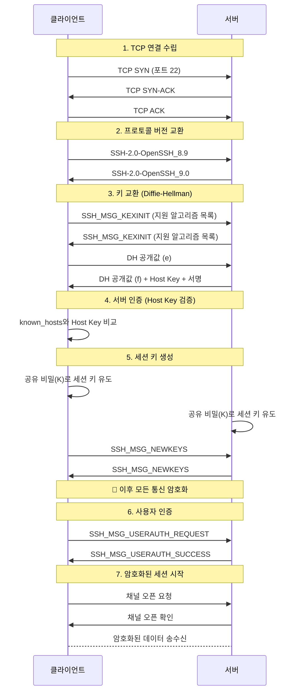
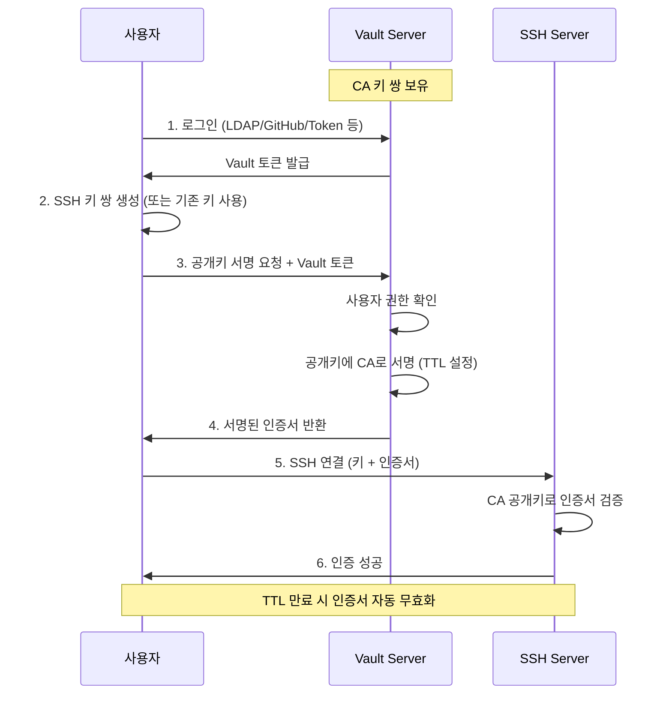
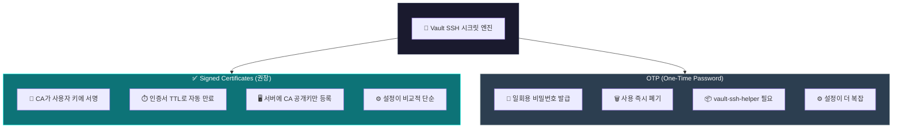

# Why? 왜 배움?

---

안전한 데이터 송수신을 해야할 때가 있다.
가령 서버와 내 개인 PC 간의 데이터 전송이거나, 서버와 서버 간의 종단 데이터 전송이 있다.

이런 경우 아래와 같은 요구사항을 만족해야한다.

- 보안에 안전한 인증을 제공
- 종단 간 암호화된 데이터 전송
- 스누핑/스푸핑을 차단


SSH 는 위 세가지를 지원한다. 그리고 흔히들 많이 쓴다 😊
그렇다면 SSH 의 정의는 무엇이고, 동작원리는 어떻게 되며, 위 세가지를 구축하는 방법은 어떻게 될까?

# What? 뭘 배움?

---

## SSH 란?

SSH(Secure Shell)는 보호되지 않은 네트워크에서 안전한 원격 접속과 명령 실행을 위한 암호화 네트워크 프로토콜이다.
Telnet이나 rsh 같은 평문 프로토콜의 보안 문제를 해결하기 위해 1995년 Tatu Ylönen이 개발했다.
SSH는 클라이언트-서버 구조로 동작하며 TCP 포트 22를 사용한다.
공개키 암호화(RSA, ECDSA 등)를 통해 서버/사용자 인증, 데이터 암호화, 무결성 검증을 제공하며, 
키 교환(Diffie-Hellman) 후 세션을 암호화한다.

### 주요 용도

- 원격 로그인 및 명령 실행(replacing Telnet/rlogin)
- 파일 전송(SCP, SFTP)
- 포트 포워딩과 터널링(예: VPN 대체)


## SSH 동작원리

### 인증키 - public key & private key


SSH 는 **비대칭 암호화(Asymmetric Encryption)** 방식을 사용한다.

- **Public Key (공개키)**: 누구에게나 공개 가능하며, 서버의 `~/.ssh/authorized_keys`에 등록된다. 데이터를 암호화하거나 서명을 검증하는 데 사용된다.
- **Private Key (개인키)**: 절대 외부에 공개하면 안 되며, 클라이언트 측에서만 보관한다. 데이터를 복호화하거나 서명을 생성하는 데 사용된다.

이 두 키는 수학적으로 연결되어 있어서, 공개키로 암호화한 데이터는 오직 대응하는 개인키로만 복호화할 수 있다.

### 전체 과정



**키 교환 과정 (Diffie-Hellman)**:

1. 클라이언트와 서버가 각자 임시 키 쌍을 생성
2. 공개 값을 서로 교환
3. 각자 상대방의 공개 값과 자신의 비밀 값을 조합하여 동일한 세션 키를 독립적으로 계산
4. 이 세션 키로 이후 모든 통신을 대칭 암호화 (AES 등)

### SSH 프로토콜 계층 구조 개요


1. SSH 전송 프로토콜(SSH Transport Layer Protocol, SSH TLP)
2. SSH 인증 프로토콜(SSH User Authentication Protocol)
3. SSH 연결 프로토콜(SSH Connection Protocol)
4. SSH 응용 프로토콜 : TELET, RLOGIN, SMTP 등


### 전송 계층 (Transport Layer) - RFC 4253

전송 계층은 SSH의 **기반 인프라**를 담당한다.
**주요 역할**:

- TCP 포트 22를 통한 연결 수립
- 초기 키 교환 (Key Exchange)
- 서버 인증 (Host Key 검증)
- 암호화, 압축, 무결성 검증 설정

**특징**:

- 상위 계층에 최대 32,768바이트의 평문 패킷 인터페이스 제공
- **키 재교환(Re-keying)**: 1GB 데이터 전송 또는 1시간 경과 시 자동 수행
- TLS와 유사한 역할을 수행

```
[클라이언트]                    [서버]
    |                            |
    |------ TCP 연결 요청 ------->|
    |<----- TCP 연결 수락 --------|
    |                            |
    |<-- 프로토콜 버전 교환 ------>|
    |                            |
    |<---- 키 교환 (DH) --------->|
    |                            |
    |<-- 암호화 통신 시작 -------->|

```


### 사용자 인증 계층 (User Authentication Layer) - RFC 4252

클라이언트의 **신원을 검증**하는 계층이다.
**중요**: 인증은 **클라이언트 주도**로 진행된다. 비밀번호 프롬프트가 뜨면 이는 SSH 클라이언트가 요청하는 것이며, 서버는 클라이언트의 인증 요청에 응답만 한다.
**주요 인증 방식**:

| 방식 | 설명 |
| --- | --- |
| **password** | 전통적인 비밀번호 인증. 비밀번호 변경 기능 포함 |
| **publickey** | 공개키 기반 인증 (RSA, ECDSA, Ed25519 등). 가장 안전함 |
| **keyboard-interactive** | 서버가 프롬프트를 보내고 사용자가 응답. OTP, 2FA 구현에 사용 |
| **GSSAPI** | Kerberos 등 외부 인증 메커니즘 연동. 기업 SSO에 활용 |


**공개키 인증 흐름**:

```
1. 클라이언트: "이 공개키로 인증하고 싶습니다"
2. 서버: authorized_keys에서 해당 공개키 확인
3. 서버: 랜덤 챌린지를 공개키로 암호화하여 전송
4. 클라이언트: 개인키로 복호화하여 응답
5. 서버: 응답 검증 후 인증 완료

```


### 연결 계층 (Connection Layer) - RFC 4254

인증 완료 후 **실제 서비스를 제공**하는 계층이다.
**핵심 개념 - 채널(Channel)**:

- 하나의 SSH 연결을 **여러 논리적 채널**로 다중화(Multiplexing)
- 각 채널은 양방향 데이터 전송 가능
- 채널별 독립적인 흐름 제어 (수신 윈도우 크기)

**표준 채널 타입**:

| 채널 타입 | 용도 |
| --- | --- |
| **shell** | 터미널 쉘, SFTP, exec 요청 (SCP 포함) |
| **direct-tcpip** | 클라이언트→서버 포트 포워딩 (로컬 포워딩) |
| **forwarded-tcpip** | 서버→클라이언트 포트 포워딩 (리모트 포워딩) |


**채널 요청(Channel Request)**: 

- 터미널 크기 변경, 서버 측 프로세스 종료 코드 등 채널별 부가 정보 전달

**활용 예시 - 포트 포워딩**:

```bash
# 로컬 포워딩: 로컬 8080 → 서버 경유 → DB 서버 3306
ssh -L 8080:db-server:3306 user@ssh-server

# 리모트 포워딩: 외부에서 서버 9000 → 내 로컬 3000
ssh -R 9000:localhost:3000 user@ssh-server

```


### SSH 프로토콜 패킷


- lenght : type ~ CRC 까지의 길이
- padding : 보안공격이 쉽지 않도록 1~8 바이트 추가
- type : SSH 프로토콜 패킷 유형
- 데이터 : 운반되는 실제 데이터
- CRC : 오류검출


# How? 어떻게 씀?

---

> ✅ 실습은 NixOS 기준으로 진행했으나 설치방법만 다르고

## SSH 환경설정 & SSH 설치

우선 종단 간 연결을 위해 내부 IP 를 포트포워딩을 통해 열어주어야 한다.
따라서 아래 과정을 따라가며 포트포워딩을 해주도록 하자.
***여기서 나오는 방화벽 설정은 선택사항이긴 하나 보안을 위해 권장한다.
***nix 에서는 SSH 설치 시 fail2ban 이 같이 딸려나온다. 하지만 대부분 그렇지 않을 것이니 별도로 설치를 권장한다.

1. 외부 IP 확인
2. 내부 IP 확인
3. [https://hellodoor.tistory.com/140#google_vignette](https://hellodoor.tistory.com/140#google_vignette) 을 참고하여 
4. 방화벽 설정
5. SSH 설정


## 1. Username / Password 기반 SSH 연결

> 💡 username 과 password 로 들어가는 방식

- 뭐 없다. 아래 두 개가 끝이다.

```nix
services = {
		openssh = {
      enable = true;
      startWhenNeeded = true;
      ports = [ 22 ];
      allowSFTP = false;
      settings = {
        # ** SHOULD BE CHANGED ↓
        PasswordAuthentication = true;
        AllowUsers = null;
        UseDns = false;
        X11Forwarding = true;
        PermitRootLogin = "prohibit-password";
        KbdInteractiveAuthentication = false;
      };
    };
    fail2ban.enable = true;
}
```


### “치명적” 단점

- username, password 만 알면 서버 사용 가능
- bruteforce 해버리면 그냥 뚫림
- 이걸 네트워크에서 사용한다? 그냥 내 컴퓨터 사용해주십쇼 하는 거임


## 2. Public Key 기반 SSH 연결

> 💡 상호 간 공개키와 개인키 활용

1. 클라이언트용 vagrant 를 생성
2. ssh-keygen 으로 공개키/개인키를 생성
3.  ssh-copy-id 로 공개키를 전송
4. 이제 key 기반으로 접속을 해보면 잘 되는 것을 볼 수 있다.

### 단점

- 초기 설정 시 무조건 서버 단에 공개키를 전송해야함
- 이러한 문제로 아래 방법들을 선택할 수 있다.


## 3. MFA 기반 SSH 연결

> 💡 MFA 를 활용해 더 안전한 인증을 보장하자

1. google-authenticator 를 깔고 실행한다. 모든 단계를 다 y 를 눌러 넘겨준다.
2. SSH PAM 설정
3. 이제 실제로 접속해보면 SSH 접속 이후에 MFA 인증을 요구하는 것을 볼 수 있다.

### 단점

- 정적인 인증이 안 됨


## 구축 시 겪었던 이슈와 해결법

**1️⃣ ****`@ WARNING: REMOTE HOST IDENTIFICATION HAS CHANGED!`**

- **원인**
서버 재설치 또는 SSH 호스트 키 재생성으로 인해
클라이언트의 `known_hosts`와 불일치 발생
- **해결 방법**

**2️⃣ ****`Permissions 0777 for 'mykey.pem' are too open.`**

- **원인**
PEM 개인키 파일 권한이 과도하게 개방(`777`)되어 SSH 클라이언트가 보안상 키를 무시
특히 WSL/윈도우 마운트 폴더에서 `chmod`가 적용되지 않는 경우가 많음
- **해결 방법**


## 4. Hashicorp Valut 사용

> 💡 제3자 SSH 전용 모듈을 만들어서 보안을 극대화하자

Vault 를 사용하게 되면 아래와 같은 장점이 존재한다.

| 기존 방식 | Vault 방식 |
| --- | --- |
| 정적 SSH 키 (영구적) | 동적 키/인증서 (TTL 기반 자동 만료) |
| 키 유출 시 수동 폐기 필요 | 자동 만료로 유출 영향 최소화 |
| 키 관리가 분산됨 | 중앙 집중식 관리 및 감사 로그 |


Vault 사용 시 순서도는 아래와 같다.




Vault 는 두 가지 SSH 시크릿 엔진을 제공한다.




## 5. Yubikey && Pass 사용

> 💡 하드웨어 보안 키로 SSH 키를 물리적으로 보호하자

앞서 소개한 Vault 사용방식은 소프트웨어 적으로 키 중앙 저장소를 형성하여 관리하는 방식이다.
더 강력한 보관방법은 하드웨어와 소프트웨어를 융합하는 방식이다.
Yubikey 는 최고 보안 표준을 따르는 장치이다.
이에 GPG 암호화 패스워드 매니저인 Pass 를 적용하면 더 안전하게 인증을 처리할 수 있다.

| 위협 | 소프트웨어 키 | Yubikey |
| --- | --- | --- |
| 키 파일 유출 | ❌ 취약 | ✅ 키가 장치 밖으로 나가지 않음 |
| 멀웨어 키로깅 | ❌ 취약 | ✅ 물리적 터치 필요 |
| 원격 공격 | ❌ 취약 | ✅ 물리적 소유 필수 |


# Further Work

---

- Hashicorp Valut 를 이용한 SSH 인증


# Reference

---

> SSH 정의 & 원리

- [https://blog.naver.com/joje3029/223390866901](https://blog.naver.com/joje3029/223390866901)
- [https://en.wikipedia.org/wiki/Secure_Shell](https://en.wikipedia.org/wiki/Secure_Shell)
- [https://www.cloudflare.com/ko-kr/learning/access-management/what-is-ssh/](https://www.cloudflare.com/ko-kr/learning/access-management/what-is-ssh/)
- [https://www.reddit.com/r/explainlikeimfive/comments/1bq33b5/eli5_how_does_ssh_secure_shell_work/](https://www.reddit.com/r/explainlikeimfive/comments/1bq33b5/eli5_how_does_ssh_secure_shell_work/)
- [https://velog.io/@lehdqlsl/SSH-%EA%B3%B5%EA%B0%9C%ED%82%A4-%EC%95%94%ED%98%B8%ED%99%94-%EB%B0%A9%EC%8B%9D-%EC%A0%91%EC%86%8D-%EC%9B%90%EB%A6%AC-i7rrv4de](https://velog.io/@lehdqlsl/SSH-%EA%B3%B5%EA%B0%9C%ED%82%A4-%EC%95%94%ED%98%B8%ED%99%94-%EB%B0%A9%EC%8B%9D-%EC%A0%91%EC%86%8D-%EC%9B%90%EB%A6%AC-i7rrv4de)
- [가비아 > SSH 명칭부터 접속까지 한 번에 이해하기 1](https://library.gabia.com/contents/infrahosting/9002)
- [가비아 > SSH 명칭부터 접속까지 한 번에 이해하기 2](https://library.gabia.com/contents/9008/)

> SSH MFA 구축

- [https://zetawiki.com/wiki/%EB%A6%AC%EB%88%85%EC%8A%A4_%EA%B3%B5%EC%9D%B8_IP_%ED%99%95%EC%9D%B8](https://zetawiki.com/wiki/%EB%A6%AC%EB%88%85%EC%8A%A4_%EA%B3%B5%EC%9D%B8_IP_%ED%99%95%EC%9D%B8)
- [https://medium.com/@prateek.malhotra004/enhancing-ssh-security-with-two-factor-authentication-2fa-via-pam-and-google-authenticator-70af135c2a95](https://medium.com/@prateek.malhotra004/enhancing-ssh-security-with-two-factor-authentication-2fa-via-pam-and-google-authenticator-70af135c2a95)
- [https://www.digitalocean.com/community/tutorials/how-to-set-up-multi-factor-authentication-for-ssh-on-ubuntu-18-04](https://www.digitalocean.com/community/tutorials/how-to-set-up-multi-factor-authentication-for-ssh-on-ubuntu-18-04)
- [https://github.com/NixOS/nixpkgs/issues/115044](https://github.com/NixOS/nixpkgs/issues/115044)
- [https://discourse.nixos.org/t/setting-up-google-authenticator-for-ssh/36931](https://discourse.nixos.org/t/setting-up-google-authenticator-for-ssh/36931)
- [https://mynixos.com/nixpkgs/option/security.pam.services.%3Cname%3E.googleAuthenticator.enable](https://mynixos.com/nixpkgs/option/security.pam.services.%3Cname%3E.googleAuthenticator.enable)
- [https://www.hashicorp.com/en/blog/managing-ssh-access-at-scale-with-hashicorp-vault](https://www.hashicorp.com/en/blog/managing-ssh-access-at-scale-with-hashicorp-vault)
- [https://ikcoo.tistory.com/251](https://ikcoo.tistory.com/251)
