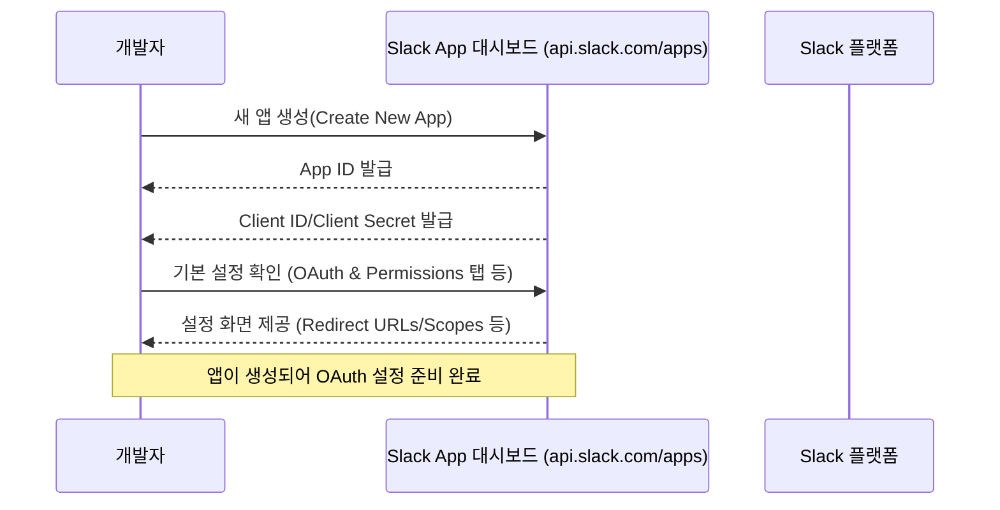
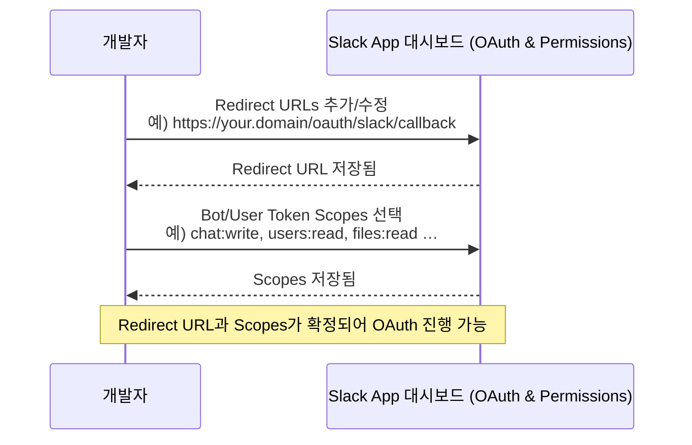
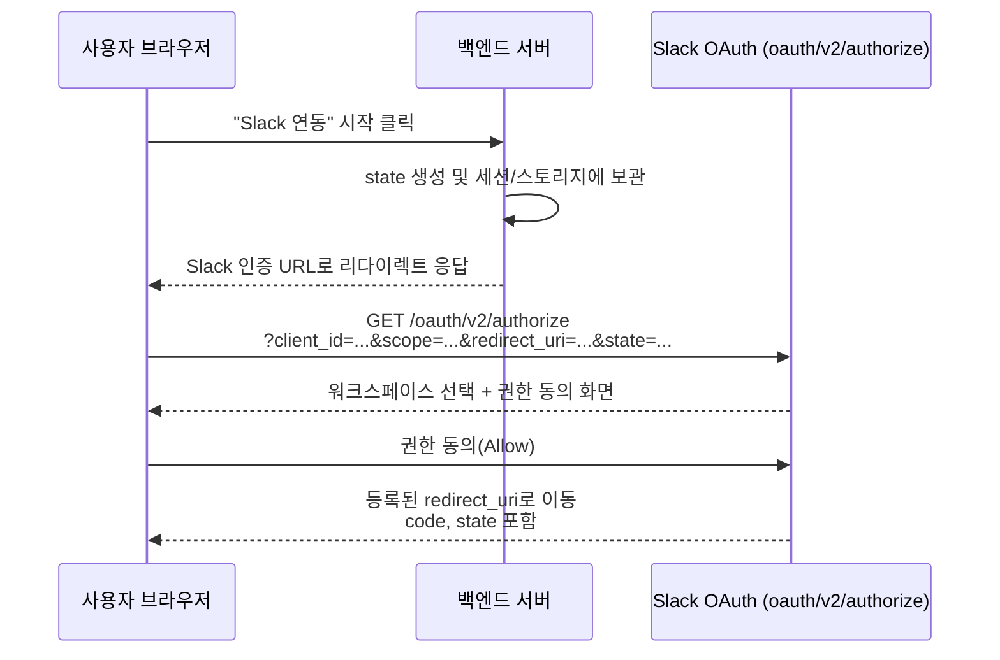
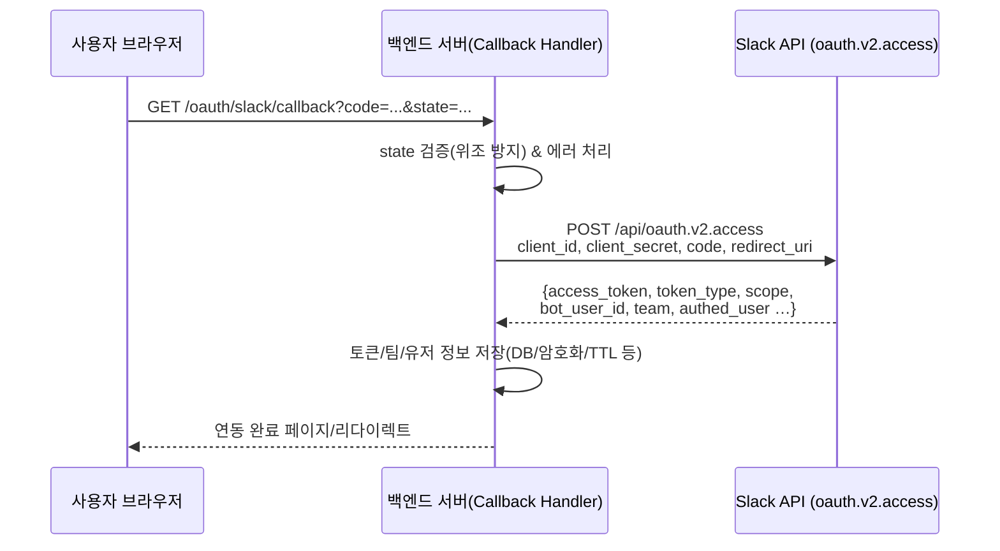
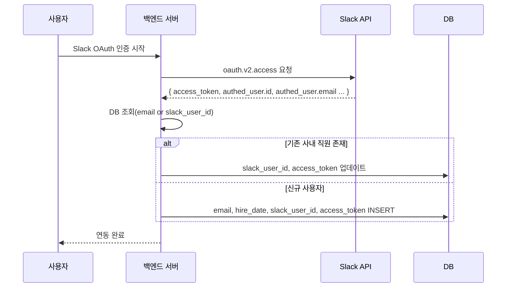
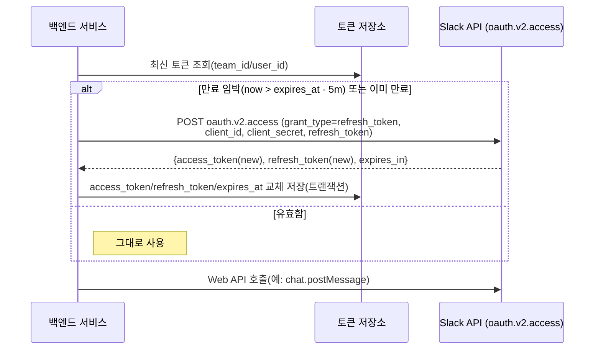

# 요구사항

## 기능

1. **로그인** – 슬랙 가입한 사내 이메일만 허용
2. **JWT 발급** – 짧은 만료(액세스), 장기 리프레시 토큰 관리.
3. **토큰 갱신** – 리프레시 토큰으로 액세스 토큰 재발급, 회전/재사용 감지.
4. **로그아웃** – 액세스/리프레시 토큰 무효화 및 세션 종료.
5. **역할/권한 매핑** – Slack 워크스페이스·채널 기준으로 내부 권한 부여.

---

## 비기능

1. **보안** – TLS, PKCE, 쿠키 보안(HttpOnly/Secure), 최소 스코프.
2. **확장성** – stateless 토큰 검증, 수평 확장 가능.
3. **가용성** – 장애 대비 전략
4. **관측성** – 로그인 성공률·토큰 오류 로그/모니터링.
5. **개인정보/컴플라이언스** – 최소 수집, 보관/삭제 정책 준수.

# 로그인

## 전체 프로세스

1.

애플리케이션 등록
2.

권한 지정 및 Redirect URI 
3.

슬랙 계정을 통한 OAuth 처리
4.

OAuth 에 따른 콜백 & 토큰 교환
5.

토큰에 따른 사용자 확인
6.

사용자 토큰 관리

### 1) 애플리케이션 등록 (Slack App 생성)

### 2) 권한(Scopes) 지정 & Redirect URI 등록

### 3) 사용자에게 OAuth 접근(Authorize) 요청

> 💡 CSRF 공격 방지 방법

### 4) 콜백 처리 → 토큰 교환 (oauth.v2.access)

### 5) 사용자 확인

- slack oauth 토큰 기반으로 [유저 프로필 API](https://api.slack.com/methods/users.info) 를 호출 → 사내 슬랙의 계정정보 조회
- `사내 직원 DB(사용자 이메일, Slack OAuth Token, 입사일자 등)` 에 저장

### 6) 사용자 토큰 관리

> 💡 12시간에서 2시간으로 줄여서 access:revoke 걸어서 가능한지

사용자 토큰은 저장 및 리프레쉬 토큰 사용법은 아래를 참조

- Access Token: 수명이 짧음(약 12시간).

만료 전·후에는 반드시 Refresh Token으로 갱신.
- Refresh Token: 사용할 때마다 회전(rotate) → 항상 DB에 최신값으로 교체 저장.
- TTL은 직접 설정하지 않는다.

토큰 만료는 “로테이션” 방식으로 관리(로그아웃/강제차단 시만 `auth.revoke` 사용).
- 저장소는 영속 DB(MySQL 등).

애플리케이션은 API 호출 전마다 유효성 확인 → 필요 시 갱신 패턴 유지.
- DB 저장 시 **암호화(at-rest)** 필수, 암호 키는 **환경변수/비밀관리자**에 보관.
- 사용자 매핑: **`authed_user.id`(slack_user_id)**를 기본키로 사용, **이메일은 보조 식별용**으로만 활용(SSO·변경 가능성 고려).

> 구현 팁

> 💡 Bolt(Java) 사용 시
> 💡 보안·운영 체크리스트

# 로그아웃

- 특정 사용자/세션을 끊어야 할 경우:
- DB에서도 해당 설치건 토큰 필드를 **즉시 삭제·무효화**.

# Show me the code ! 🧑‍💻

// 설명 나열 요망
// 설명 나열 요망
// 설명 나열 요망

# Reference 📚

[https://api.slack.com/authentication/oauth-v2#exchanging](https://api.slack.com/authentication/oauth-v2#exchanging)
[https://api.slack.com/methods/oauth.v2.access](https://api.slack.com/methods/oauth.v2.access)
[https://kkmdailylog.tistory.com/entry/Slack%EC%9C%BC%EB%A1%9C-OAuth-%EC%82%AC%EC%9A%A9%ED%95%98%EA%B8%B0](https://kkmdailylog.tistory.com/entry/Slack%EC%9C%BC%EB%A1%9C-OAuth-%EC%82%AC%EC%9A%A9%ED%95%98%EA%B8%B0)
[Untitled](https://www.notion.so/24d93642e7db80988fdcf0877098581c) 
[https://api.slack.com/authentication/rotation](https://api.slack.com/authentication/rotation)
[https://api.slack.com/authentication/best-practices](https://api.slack.com/authentication/best-practices)
[https://docs.slack.dev/tools/java-slack-sdk/guides/app-distribution](https://docs.slack.dev/tools/java-slack-sdk/guides/app-distribution)
