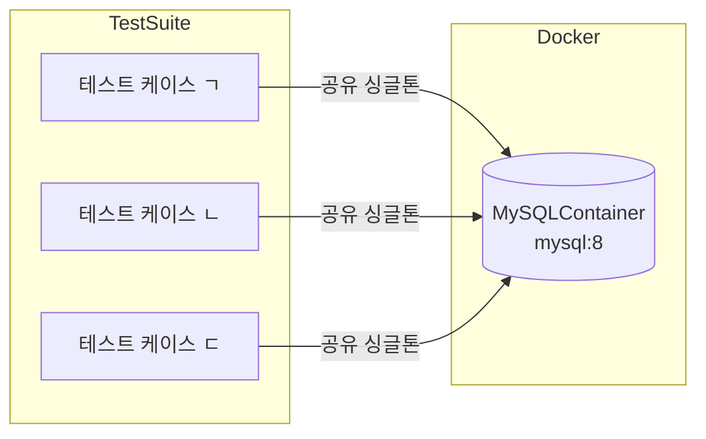

# Episode 📜

하나의 유스케이스가 여러 도메인을 가로지르거나, 비관 락(Pessimistic Lock)처럼 DBMS 종속적인 동작을 검증해야 할 때 단순한 단위 테스트만으로는 확신을 얻기 어렵다.

팀에서 으레 택하는 방법은 개발 서버에서 직접 API를 찔러보거나, 서버 환경의 통합 테스트 툴에 맡기는 것이다.

그런데 개발 서버는 테스트 서버가 아니다. 마이그레이션이 수시로 진행되고, 프론트 팀이 함께 사용하며, 기존 데이터를 건드리는 작업을 마음 놓고 하기 어려운 공간이다.

결국 "우리가 원하는 입력/출력을 검증하는 테스트"를 개발 서버에서 진행하는 것은 적합하지 않다는 결론에 이른다.

그렇다면 어떻게 이를 우회할 수 있을까? 아래 세 가지 준비물이 필요하다.

- 개발서버 환경 자원과 분리된 테스트 전용 리소스 — **TestContainer 활용**
- 테스트 케이스별 목업 데이터 주입 및 초기화 — **DBRider 활용**
- 외부 서비스 모킹[^1] — 본 포스트 범위 외

본 포스트에서는 TestContainer와 DBRider 두 가지 오픈소스를 소개하고, 실제 어노테이션 기반 통합 테스트 구성까지 다룬다.

# 왜 H2가 아닌 TestContainer인가 🐳

`H2`를 인메모리 DB로 쓰면 설정이 단순하고 속도도 빠르다는 장점이 있다. 그러나 "테스트 환경을 제공한다"는 것은 개발 환경을 **미러링**하는 것과 같다.

H2와 MySQL은 같지 않다. 대표적인 차이가 비관 락이다. H2는 `SELECT ... FOR UPDATE`를 지원하지 않아[^2] 락 경합이 발생하는 유스케이스는 아예 테스트할 수 없다. 실제로 필자는 H2 기반 테스트 환경에서 비관 락 처리 유스케이스를 검증하지 못하는 상황을 직접 겪었다.

[TestContainer][tc]는 도커 이미지를 그대로 사용하므로 MySQL 8 이면 MySQL 8, Redis 7 이면 Redis 7 을 그대로 쓸 수 있다. Kafka, Nginx, GCP 에뮬레이터[^3] 등 다양한 리소스도 지원한다.



컨테이너를 싱글톤으로 공유하면 전체 테스트 슈트 동안 한 번만 기동한다. 반대로 케이스마다 격리가 필요하다면 매 번 새 인스턴스를 생성하면 된다.

# 왜 DBRider로 픽스처를 관리하는가 🗂

컨테이너가 준비됐다면 이제 테스트 데이터를 어떻게 심고 어떻게 지울 것인지가 문제다.

케이스마다 컨테이너를 재기동하는 것은 비용이 너무 크다. `@Sql + @Transactional` 조합은 비즈니스 로직에 트랜잭션이 얽혀 있을 때 테스트 결과를 왜곡할 수 있다[^4]. DBUnit 단독 사용은 XML 기반 설정이 지나치게 장황하다.

[DBRider][dbrider]는 DBUnit을 감싸 YAML / JSON / CSV 파일 기반으로 데이터를 주입하고, 테스트 후 자동으로 정리한다. `@DataSet` 어노테이션 하나로 케이스별 픽스처를 선언적으로 관리할 수 있어 가독성과 멱등성을 모두 잡는다.

단, DBRider는 SQL 파일을 IDataSet으로 직접 지원하지 않는다[^5]. 스키마 초기화처럼 SQL 문이 필요한 경우에는 TestContainer의 `initScript` 혹은 JDBC 직접 호출로 보완한다.

# Apply 🧑‍💻

## TestContainer

우선 Gradle 의존성을 추가한다.

```groovy
testImplementation 'org.junit.jupiter:junit-jupiter:5.11.3'         // JUnit
testImplementation 'org.testcontainers:testcontainers:1.20.4'       // TestContainer core
testImplementation 'org.testcontainers:junit-jupiter:1.20.4'        // JUnit 연동
testImplementation 'org.testcontainers:mysql:1.20.4'                // MySQL 모듈
```

도커가 실행 중이어야 한다.

### 1. 싱글톤 MySQLFixture

여러 테스트 슈트가 같은 컨테이너를 재사용하도록 [Bill Pugh 싱글톤][billpugh]으로 구현한다.

```java
/**
 * MySQL TestContainer Bill Pugh 기반 싱글톤.
 * 여러 유스케이스에 걸쳐 동일 컨테이너를 공유한다.
 */
public class MySQLFixture extends MySQLContainer<MySQLFixture> {

    private static final String IMAGE_VERSION = "mysql:8";

    private MySQLFixture() {
        super(IMAGE_VERSION);
        this.withDatabaseName("customdb")
            .withUsername("root")
            .withPassword("testdbsecret")
            .withInitScript("sql/init.sql")   // DDL 초기화
            .withConfigurationOverride("sql") // my.cnf 오버라이드
            .withReuse(true);
    }

    public static MySQLFixture getInstance() {
        return SingletonHolder.INSTANCE;
    }

    /** JVM 종료 시까지 컨테이너를 유지한다. */
    @Override
    public void stop() {
    }

    private static class SingletonHolder {

        private static final MySQLFixture INSTANCE = createInstance();

        private static MySQLFixture createInstance() {
            MySQLFixture instance = new MySQLFixture();
            instance.start();
            return instance;
        }
    }
}
```

케이스 격리가 필요할 때는 `new MySQLContainer<>("mysql:8")` 을 매번 생성해 사용한다.

### 2. DataSource 주입 및 초기 데이터 적재

컨테이너가 기동된 뒤 Spring 에 DB 정보를 알려주고, JDBC를 통해 초기 데이터 SQL을 실행한다. `init.sql`(DDL)과 `data.sql`(DML) 모두 `src/test/resources` 하위에 위치시킨다.

```java
// JDBC URL에 타임존·분수초 옵션 추가
String jdbcUrl = mySQLContainer.getJdbcUrl()
    + "?useUnicode=true&serverTimezone=Asia/Seoul&sendFractionalSeconds=false";

System.setProperty("spring.datasource.url", jdbcUrl);
System.setProperty("spring.datasource.username", mySQLContainer.getUsername());
System.setProperty("spring.datasource.password", mySQLContainer.getPassword());

// DML 초기 데이터 적재
JdbcDatabaseDelegate delegate = new JdbcDatabaseDelegate(mySQLContainer, "");
ScriptUtils.runInitScript(delegate, "sql/data.sql");
```

### 3. 커스텀 어노테이션으로 TestContainer 적용

Spring AOP와 어노테이션을 활용해, 선언만 하면 TestContainer가 붙도록 한다.

```java
@Documented
@DirtiesContext                       // 테스트 슈트별 컨텍스트 격리
@ExtendWith(MySQLExtension.class)     // 컨테이너 생명주기 관리
@Target({ElementType.METHOD, ElementType.TYPE})
@Retention(RetentionPolicy.RUNTIME)
public @interface TestContainerTest {

    /** 테스트 데이터 초기화 SQL 스크립트 경로 목록 */
    String[] dataScripts() default {
        "mock/sql/hama_area_define_2024.sql",
        "mock/sql/hama_language_define.sql",
        "mock/sql/hama_role_hierarchy.sql",
        "mock/sql/hama_member.sql",
        "mock/sql/hama_member_profile.sql",
        // ...
    };

    /** 데이터베이스명 */
    String databaseName() default "customdb";

    /** 유저이름 */
    String username() default "root";

    /** 비밀번호 */
    String password() default "testdbsecret";

    /** 싱글톤 컨테이너 재사용 여부 */
    boolean isSingleton() default true;
}
```

```java
public class MySQLExtension implements BeforeAllCallback, AfterAllCallback {

    private MySQLContainer<?> mySQLContainer;

    @Override
    public void beforeAll(ExtensionContext extensionContext) throws Exception {
        TestContainerTest annotation = extensionContext
            .getTestClass()
            .orElseThrow(RuntimeException::new)
            .getAnnotation(TestContainerTest.class);

        createMySQLContainer(annotation);
        this.mySQLContainer.start();
        injectDataSource();
        initData(annotation);
    }

    private void createMySQLContainer(TestContainerTest annotation) {
        if (annotation.isSingleton()) {
            this.mySQLContainer = MySQLFixture.getInstance(
                annotation.databaseName(),
                annotation.username(),
                annotation.password()
            );
            return;
        }
        this.mySQLContainer = new MySQLContainer<>("mysql:8")
            .withDatabaseName(annotation.databaseName())
            .withUsername(annotation.username())
            .withPassword(annotation.password())
            .withConfigurationOverride("sql");
    }

    private void injectDataSource() {
        String jdbcUrl = mySQLContainer.getJdbcUrl()
            + "?useUnicode=true&serverTimezone=Asia/Seoul&sendFractionalSeconds=false";
        System.setProperty("spring.datasource.url", jdbcUrl);
        System.setProperty("spring.datasource.username", mySQLContainer.getUsername());
        System.setProperty("spring.datasource.password", mySQLContainer.getPassword());
    }

    private void initData(TestContainerTest annotation) {
        JdbcDatabaseDelegate delegate = new JdbcDatabaseDelegate(mySQLContainer, "");
        Arrays.stream(annotation.dataScripts())
            .forEach(script -> ScriptUtils.runInitScript(delegate, script));
    }

    @Override
    public void afterAll(ExtensionContext extensionContext) {
        mySQLContainer.stop();
    }
}
```

- `@DirtiesContext`로 테스트 슈트 간 Spring 컨텍스트를 격리한다.
- `BeforeAllCallback / AfterAllCallback`으로 JUnit 생명주기에 맞춰 컨테이너를 기동·종료한다.
- 어노테이션 필드를 통해 DB 정보와 스크립트 경로를 외부에서 주입할 수 있다.

위 설정을 적용하고 테스트를 실행하면 도커에서 MySQL 컨테이너가 랜덤 포트로 기동되는 것을 확인할 수 있다.


## DBRider

Gradle 의존성을 추가한다.

```groovy
testImplementation 'com.github.database-rider:rider-spring:1.44.0'
```

DBRider는 어노테이션 기반으로 동작하지만 두 가지를 별도로 설정해야 한다.

- DBRider / DBUnit 설정값 조정[^6]
- `boolean` → `tinyint` 변환을 위한 커스텀 `Replacer` 구현

```java
/** MySQL의 tinyint(1) 컬럼에 boolean 값을 삽입할 수 있도록 변환한다. */
public class BooleanToTinyintReplacer implements Replacer {

    @Override
    public void addReplacements(ReplacementDataSet replacementDataSet) {
        replacementDataSet.addReplacementObject(true, 1);
        replacementDataSet.addReplacementObject(false, 0);
    }
}
```

```java
@DBRider
@Documented
@Target(ElementType.TYPE)
@Retention(RetentionPolicy.RUNTIME)
@DBUnit(
    caseSensitiveTableNames = false,
    caseInsensitiveStrategy = Orthography.LOWERCASE,
    allowEmptyFields = true,
    replacers = { BooleanToTinyintReplacer.class }
)
public @interface DBRiderTest {
}
```

다음으로 픽스처 JSON을 준비한다. `테이블명: [{ 컬럼: 값, ... }]` 형태를 지켜야 한다. DataGrip 등에서 Export 기능으로 바로 뽑아올 수 있다.

```json
{
  "hama_member": [
    {
      "me_idx": 2523,
      "me_type": "google",
      "me_id": "test_user1234@gmail.com",
      "me_password": null,
      "me_uuid": "377c5251-c440-4297-bd7c-2e20c6286c11",
      "me_name": "테스트멤버이름",
      "me_hp": "01012341234",
      "rh_idx": 6,
      "me_last_login": "2024-07-15 16:08:10",
      "me_is_use": 1,
      "me_birth": "1997-05-25",
      "me_address": "테스트 멤버 주소",
      "me_address_detail": "",
      "ad_idx": 3011,
      "me_sex": 1,
      "ms_idx": 1,
      "me_address_lat": 37.1234123,
      "me_address_long": 127.123412,
      "me_silver_bell": 0,
      "me_color": "C3C5C7",
      "created_at": "2024-05-10 07:46:53",
      "updated_at": "2024-08-09 19:48:39"
    }
  ]
}
```

이제 테스트 케이스에서 `@DataSet`으로 픽스처를 주입한다. `cleanAfter = true`로 테스트 후 데이터가 자동으로 정리된다.

```java
@CustomJpaDataTest
class MemberJpaRepositoryV2Test {

    @Test
    @DataSet(
        value = "sql/member.json",
        strategy = SeedStrategy.INSERT,
        disableConstraints = true,
        cleanAfter = true,
        transactional = true
    )
    // @ExpectedDataSet(value = "/sql/member.json") // 결과 상태 검증도 가능
    @DisplayName("DBRider로 저장한 회원 조회 시 성공합니다.")
    void DBRider로저장한회원_조회시성공() {
        // GIVEN
        Long meIdx = 2523L;

        // WHEN
        MemberV2 found = assertDoesNotThrow(
            () -> memberJpaRepositoryV2
                .findById(meIdx)
                .orElseThrow(() -> new RuntimeException("MEMBER_NOT_FOUND"))
        );

        // THEN
        assertNotNull(found);
        assertEquals(meIdx, found.getMeIdx());
        System.out.println("found.getMeIdx() = " + found.getMeIdx());
    }
}
```

### TestContainer + DBRider 통합 예시

두 어노테이션을 조합하면 컨테이너 기동과 픽스처 주입을 동시에 선언할 수 있다.

```java
@DBRiderTest
@TestContainerTest
@CustomJpaDataTest
class MemberJpaRepositoryV2Test {

    @Autowired
    private MemberJpaRepositoryV2 memberJpaRepositoryV2;

    @Test
    @DisplayName("멤버 조회 시 성공합니다.")
    void 멤버조회시성공() {
        // GIVEN
        // WHEN
        List<MemberV2> memberV2s = memberJpaRepositoryV2.findAll();

        // THEN
        assertFalse(memberV2s.isEmpty());
        System.out.println("memberV2s.size() = " + memberV2s.size());
    }

    @Test
    @DataSet(
        value = "sql/member.json",
        strategy = SeedStrategy.INSERT,
        disableConstraints = true,
        cleanAfter = true,
        transactional = true
    )
    @DisplayName("DBRider로 저장한 회원 조회 시 성공합니다.")
    void DBRider로저장한회원_조회시성공() {
        // GIVEN
        Long meIdx = 2523L;

        // WHEN
        MemberV2 found = assertDoesNotThrow(
            () -> memberJpaRepositoryV2
                .findById(meIdx)
                .orElseThrow(() -> new RuntimeException("MEMBER_NOT_FOUND"))
        );

        // THEN
        assertNotNull(found);
        assertEquals(meIdx, found.getMeIdx());
        System.out.println("found.getMeIdx() = " + found.getMeIdx());
    }
}
```

# 논의할 만한 주제들 👀

**Flyway / Liquibase 도입** — DBMS를 사용 중이라면 마이그레이션 툴을 함께 사용하면 개발 환경과 테스트 환경의 스키마를 자동으로 동기화할 수 있다[^7]. 다만 Flyway는 자동 변경점 감지를 지원하지 않는다[^8]. Liquibase는 보다 유연한 편이다[^9].

**DBRider의 SQL 포맷 미지원** — DBRider는 내부적으로 DBUnit의 `IDataSet`을 사용하는데, `IDataSet`은 Input/Output 상태를 선언적으로 표현하는 구조체다. SQL 파일은 명령형이라 이 구조에 자연스럽게 맞지 않는다. 스키마 초기화나 복잡한 DML은 `executeBefore`와 JDBC 직접 호출을 병행하는 것이 현실적이다.

**HikariCP auto-commit 주의** — DBUnit은 내부에서 `commit()`을 호출하지 않는다. HikariCP의 `auto-commit`이 `false`이면 커넥션 반환 시 롤백이 발생해 데이터가 사라진다[^10]. 테스트 컨테이너 전용 `@DynamicPropertySource`에서 `hikari.auto-commit=true`로 덮어쓰는 것이 안전하다.

# 결론 📌

개발 서버를 테스트 용도로 쓰는 것은 리소스 공유, 데이터 오염, 재현 불가능성 때문에 지속 가능하지 않다. TestContainer는 개발 환경과 동일한 DBMS 이미지를 도커로 기동하여 환경 차이를 제거하고, DBRider는 선언적 픽스처로 케이스별 독립성을 보장한다. 두 도구를 커스텀 어노테이션으로 조합하면 `@DBRiderTest @TestContainerTest` 두 줄만으로 어디서든 재현 가능한 통합 테스트 환경이 완성된다.

# Reference 📚

[^1]: Spring MockWebServer 사용법 — https://www.baeldung.com/spring-mocking-webclient
[^2]: H2 Pessimistic Lock 미지원 이슈 논의 — https://velog.io/@junho5336/TestContainer-%EC%A0%81%EC%9A%A9%ED%95%98%EA%B8%B0#%ED%85%8C%EC%8A%A4%ED%8A%B8-%EA%B2%A9%EB%A6%AC
[^3]: TestContainer 공식 지원 모듈 목록 — https://testcontainers.com/
[^4]: 테스트에서 @Transactional 사용을 지양해야 하는 이유 — https://jojoldu.tistory.com/761
[^5]: DBRider IDataSet 구조 및 SQL 미지원 배경 — https://database-rider.github.io/getting-started/#configuration
[^6]: DBRider + DBUnit 설정 공식 문서 — https://database-rider.github.io/database-rider/
[^7]: Spring Boot + TestContainers + Flyway 연동 — https://glenmazza.net/blog/entry/spring-boot-testcontainers-flyway
[^8]: Flyway 자동 변경점 감지 이슈(close됨) — https://github.com/flyway/flyway/issues/648
[^9]: Liquibase vs Flyway 비교 — https://www.baeldung.com/liquibase-vs-flyway
[^10]: HikariCP auto-commit과 DBUnit 롤백 원인 — https://helloworld.kurly.com/blog/commit-mvcc-set-autocommit/

[tc]: https://testcontainers.com/
[dbrider]: https://github.com/database-rider/database-rider
[billpugh]: https://www.baeldung.com/java-bill-pugh-singleton-implementation
