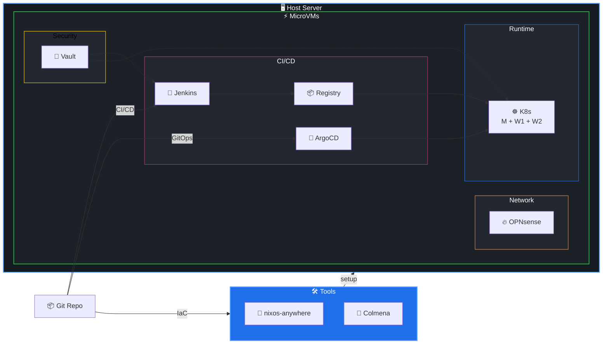

# Why? 왜 배움?

---

홈랩을 만들게 된 계기는 간단하다.

- 퇴사를 해서 취준 중
- 실제 서비스 배포를 통해 zero to $$$ 를 계획 중
- 직접 서버를 구축해서 전기세만 지불

# What? 뭘 배움?

---

## 인프라

- 여러 OS 를 감당할 수 있어야 할 것
- GPU passthrough 할 수 있어야 할 것
- 롤백 및 백업이 가능해야 할 것
- 스토리지 확장이 가능해야 할 것
- CI/CD 및 Docker/k8s 사용이 가능해야 할 것

## Proxmox 란 ?

보통 홈랩을 찾아보면 여러 youtube 에서 proxmox 를 다루고 있는 것을 볼 수 있다.
그렇다면 proxmox 란 무엇일까?

> Proxmox VE(이하 Proxmox)는 엔터프라이즈 가상화를 위한 완벽한 오픈 소스 서버 관리 플랫폼입니다.

쉽게말하여 Proxmox VE 는 Type1 하이퍼바이저이자 debian based 오픈소스 os 이다.
WebUI 를 통해 쉽게 사용자 및 VLAN 을 설정할 수 있고, VM 과 LXC 를 생성 및 관리할 수 있다.

이에 따라 proxmox 는 다음과 같은 장점을 가지고 있다.

### Cluster & HA

- **Quorum 기반 클러스터링:** Corosync를 사용하여 노드 간 상태를 실시간 동기화
- **내장 HA Manager:**  별도의 Pacemaker 설정 없이 내장된 HA Manager 를 사용
- **Fencing:** 하드웨어 Watchdog 및 IPMI 연동이 내장되어 있어, 장애 노드를 즉각 격리하고 데이터 오염을 방지

### Native Ceph & ZFS

- **Native Ceph 통합:** Ceph 를 지원하여 Proxmox 디스크를 합쳐 거대한 분산 스토리지로 통합할 수 있다.
- **ZFS 지원:** ZFS 를 지원하여 데이터 무결성, 압축, 스냅샷 기능을 제공할 수 있다.

### Web UI & API

- **No-Proxy Web UI: **WebUI 가 내장되어있어 모든 노드를 하나의 웹 패널에서 관리할 수 있다.
- **REST API:** VE API 를 제공하여 VM 에 대한 제어권을 제공한다. 이를 통해 VE 한정하여 Terraform 이나 Pulumi 를 사용하여 IaC 를 선언할 수 있다. 

### Native Live Migration

- **Zero-Downtime:** 서비스 중단 없이 VM을 다른 노드로 이동한다. 이는 커널 레벨에서 최적화되어 있어 OpenShift/KubeVirt보다 훨씬 가볍고 빠르다.
- **Replication:** Ceph가 없더라도 ZFS 기반의 비동기 복제를 통해 노드 간 데이터를 미리 동기화하여 마이그레이션 시간을 단축할 수 있다.

### Native Firewall & VLAN

- **내장 방화벽 (Distributed Firewall):** 클러스터 전체에 적용되는 방화벽 규칙을 코드나 UI로 관리할 수 있으며, 각 VM별로 세밀한 제어가 가능하다.
- **SDN (Software Defined Network):** VXLAN, EVPN 등을 지원하여 복잡한 가상 네트워크망을 손쉽게 구축하다.

## Proxmox 단점

다만 나에게 있어 치명적인 단점이 있는데
어느 linux distro 가 그러하듯 모든 리소스에 대한 IaC 선언이 불가능하다는 것이다.

- 설정이 코드로 관리되지 않아 1) 추적이 불가하고 2) 실수를 하더라도 rollback 이 불가
- 서버 확장 시 동일한 과정을 처리해줘야 함
- Pulumi-Proxmox로 VM 구성을 자동화하더라도

이를 헷지하기위해 NixOS 와 microvm.nix 을 사용하는 것을 고려해보았다.
nix 를 사용해 OS, VM 모두 전부 `.nix` 파일로 관리하여 추적 및 rollback 지원하는 방식이다.
다만 NixOS & microvm.nix 의 한계는 명확했다.
Proxmox 에서 제공하는 핵심 기능들 — Cluster 처리, HA 지원 등등 — 을 동일하게 지원할 수 없다는 것이다.

- VM 상태 스냅샷 & Live VM Migration 지원 ❌ 
- Fencing & STONITH ❌ 
- VM 스토리지를 Ceph RBD에 직접 연결 지원 ❌ 

## 이를 해결하기 위한 workaround

|  | Proxmox + NixOS VM | Nomad + Consul + NixOS VM | OpenShift + KubeVirt |
| --- | --- | --- | --- |
| Live Migration | 하드웨어 수준 지원 | 재시작 방식 지원 | Pod 수준 이동 |
| Fencing | HW Watchdog / Quorum | Consul Health + Custom Script | SNR / MachineHealthCheck |
| Ceph RBD | PVE Cluster Manager 관리 | CSI 드라이버 기반 | CSI + Node Fencing 연동 |
| 관리 철학 | Infrastructure Platform | Unix-like Simplicity | Cloud Native (GitOps) |
| 난이도 | 낮음 (가장 실용적) | 높음 (NixOS 숙련도 필요) | 매우 높음 |

1. Proxmox OS & Nixos VM 사용
2. Nomad & Consul & Nixos 도입하여 노드 장애 시 다른 노드에서 VM 자동 재시작되도록 처리
3. kubevirt 도입

## 최종 Blueprint

세 가지 옵션 중 Nomad & Consul & Nixos 를 선택했다.
이유인 즉슨 아래와 같다.
proxmox 는 선언적 관리가 불가능하므로 설정을 하나 변경하려면 host 전체를 갈아엎던지 등등 시간소요가 많이 된다.
kubevirt 는 학습곡선이 높고, openstack 을 사용해야하기에 학습량이 상당하다. 또한 단일 노드나 소규모 클러스터에서 k8s/kubevirt 가 점유하는 컴퓨팅 리소스가 높다.

Nomad & Consul & Nixos 는 호스트 설정부터 VM 내부 설정, HA 설정을 내가 손수 관리할 수 있다.
또한 롤백이나 설정을 변경한다고 했을 때 변수 몇 개 수정과 명령어 한 번이면 가능하다
다만 제한점/트레이드오프는 명확한 편이다. 
해당 사항들은 감수하고 가기로 하였다.

- Live Migration 지원 불가능
- VM 노드 이동을 위한 Nomad CSI 외부 스토리지 연결 복잡성
- 얇은 커뮤니티 풀
- Nomad 의 Consul 에 대한 강한 의존성

> ✅ 우선 싱글 노드로 구성하다가 추후 서버를 추가 확장하여 클러스터 및 Ceph 구성 해볼 예정이다.

### Hardware

| 구성 | 스펙 |
| --- | --- |
| CPU | Ryzen 7 8845HS (8C/16T, 5.1GHz) |
| RAM | 32GB DDR5 (16GB x 2) |
| Storage | 1TB NVMe SSD (ZFS RAID0) |
| GPU | Radeon 780M iGPU (IOMMU Passthrough) |
| NIC1 | WAN 전용 (ISP 직결) |
| NIC2 | LAN Trunk (내부 스위치) |

### Virtual Network

| Bridge | 용도 | 설정 |
| --- | --- | --- |
| vmbr0 | External (WAN) | `enp1s0`과 직접 브릿징. OPNsense WAN으로 패킷 전달 |
| vmbr1 | Internal (VLAN) | **물리 포트 없음(Isolated).** VM 간 내부 통신 및 VLAN 태깅 스위치 |

| **인터페이스** | **역할** | **연결 대상** |
| --- | --- | --- |
| **vtnet0** | **WAN** | `vmbr0`로부터 ISP 공인(또는 정적) IP 수신 |
| **vtnet1** | **LAN Parent** | `vmbr1`에 연결되어 하위 VLAN들의 부모 인터페이스 역할 |
| **VLAN 10/20** | **Routing** | OPNsense 내부에서 생성된 가상 인터페이스 (DHCP/Gateway) |
| **Tailscale** | **VPN Gateway** | 외부에서 내부 Management(VLAN 10)망 접근용 |

| **VLAN ID** | **용도** | **포함 서비스** | **통제 정책** |
| --- | --- | --- | --- |
| **VLAN 10** | **Management** | Jenkins, Vault, 호스트 관리 | VLAN 20으로의 접근 허용 (관리용) |
| **VLAN 20** | **Services** | K8s Master/Workers, Registry | 외부 노출 제한, 10번망으로의 접근 차단 |

### Kubernetes Cluster (NixOS)

| Node | 리소스 | 역할 |
| --- | --- | --- |
| Master | 1 vCPU / 4GB RAM | API Server, etcd, Scheduler |
| Worker 1 | 4 vCPU / 12GB RAM + GPU | AI/RAG 전용 (Ollama, vLLM) |
| Worker 2 | 2 vCPU / 4GB RAM | 일반 서비스 워크로드 |
| Cilium | - | eBPF CNI, Network Policy, Hubble 모니터링 |

### CI/CD 파이프라인

| 카테고리 | 단계 | 액션 | 설명 |
| --- | --- | --- | --- |
| 🏗️ Infrastructure | ① | **Code Push** | 개발자가 NixOS 설정을 Git Repository에 푸시 |
|  | ② | **Initial Setup** | nixos-anywhere로 물리 서버 초기 프로비저닝 |
|  | ③ | **VM Deployment** | Colmena로 MicroVM 설정 배포 및 관리 |
|  | ④ | **Network Config** | OPNsense VM 배포로 VLAN 및 방화벽 구성 |
| 🔄 CI/CD | ① | **Code Push** | 개발자가 GitHub/GitLab에 애플리케이션 소스 코드 푸시 |
|  | ② | **Webhook Trigger** | Git이 Jenkins에 웹훅 전송 |
|  | ③ | **Secret Injection** | Vault가 Jenkins에 빌드에 필요한 시크릿 제공 |
|  | ④ | **Build & Push** | Jenkins가 Docker 이미지 빌드 후 Local Registry에 푸시 |
|  | ⑤ | **Update Manifest** | Jenkins가 K8s manifest의 image tag 자동 업데이트 후 Git 커밋 |
|  | ⑥ | **Detect Change** | ArgoCD가 Git manifest 변경 감지 |
|  | ⑦ | **Pull Image** | ArgoCD가 Local Registry에서 이미지 풀 |
|  | ⑧ | **Deploy** | ArgoCD가 K8s 클러스터에 배포 (Declarative GitOps) |
| 🔐 Security | ① | **Secret Storage** | Vault에 모든 민감 정보 중앙 관리 (API Keys, DB 비밀번호 등) |
|  | ② | **Jenkins Auth** | Jenkins가 Vault에서 빌드/배포용 시크릿 동적 조회 |
|  | ③ | **K8s Auth** | K8s Pods가 Vault Agent로 런타임 시크릿 주입 |
|  | ④ | **Secret Rotation** | Vault가 주기적으로 시크릿 자동 로테이션 |
| 🌐 Network | ① | **WAN Access** | ISP → NIC1 → vmbr0 → OPNsense WAN |
|  | ② | **VLAN Routing** | OPNsense가 VLAN 10 (Management) / VLAN 20 (Services) 트래픽 라우팅 |
|  | ③ | **Firewall** | OPNsense가 인바운드/아웃바운드 트래픽 필터링 |
|  | ④ | **VPN Access** | Tailscale Mesh VPN으로 외부에서 안전한 접근 |

# How? 어떻게 씀?

---

> ✅ 필수단계는 별표 처리해두었다. 만약 빠르게 서버를 운영해야한다면 별표처리한 것만 우선 구축하자.

여기서는 한 번에 다루기가 어려워 여러 페이지에 걸쳐서 소개하고자 한다.

> 기초 인프라

> 스토리지

# Reference

---

> ✅ 역시 Best of best 는 공식문서이다.

> Proxmox 사용이유

[https://www.reddit.com/r/homelab/comments/1f0wjnn/why_do_you_use_vms_in_homelabs_or_in_general/](https://www.reddit.com/r/homelab/comments/1f0wjnn/why_do_you_use_vms_in_homelabs_or_in_general/)

> Proxmox 셋업

[https://velog.io/@minse0204/Proxmox-DHCP-%EC%84%A4%EC%A0%95](https://velog.io/@minse0204/Proxmox-DHCP-%EC%84%A4%EC%A0%95)
[https://www.youtube.com/watch?v=stQzK0p59Fc](https://www.youtube.com/watch?v=stQzK0p59Fc)
[https://medium.com/@Harshii/getting-started-with-proxmox-a-beginners-guide-to-virtualization-c038ade4d30a](https://medium.com/@Harshii/getting-started-with-proxmox-a-beginners-guide-to-virtualization-c038ade4d30a)
[https://www.youtube.com/watch?v=qlcVx-k-02E&t=191s](https://www.youtube.com/watch?v=qlcVx-k-02E&t=191s)
[https://www.youtube.com/watch?v=qmSizZUbCOA&t=205s](https://www.youtube.com/watch?v=qmSizZUbCOA&t=205s)
[https://www.youtube.com/watch?v=DlWXQrIhYQk](https://www.youtube.com/watch?v=DlWXQrIhYQk)
[https://github.com/TechHutTV/homelab/blob/main/storage/README.md](https://github.com/TechHutTV/homelab/blob/main/storage/README.md)

> Proxmox 이슈해결

[Solution](https://www.notion.so/2ca19c3902908033b73fe4a671327ecf#2ca19c3902908094b135e7a39ca08d34)
[https://velog.io/@wooadev/ProxmoxPVE-8-%EC%84%A4%EC%B9%98-%ED%9B%84-%ED%95%B4%EC%95%BC-%ED%95%A0-%EC%9D%BC-No-valid-subscription-%ED%8C%9D%EC%97%85-%EC%97%86%EC%95%A0%EA%B8%B0](https://velog.io/@wooadev/ProxmoxPVE-8-%EC%84%A4%EC%B9%98-%ED%9B%84-%ED%95%B4%EC%95%BC-%ED%95%A0-%EC%9D%BC-No-valid-subscription-%ED%8C%9D%EC%97%85-%EC%97%86%EC%95%A0%EA%B8%B0) 

> Proxmox 홈랩 서비스 예시

[https://www.youtube.com/watch?v=yUyxJr2xboI&t=1s](https://www.youtube.com/watch?v=yUyxJr2xboI&t=1s)
[https://www.youtube.com/watch?v=f-x5cB6qCzA&t=553s](https://www.youtube.com/watch?v=f-x5cB6qCzA&t=553s)
